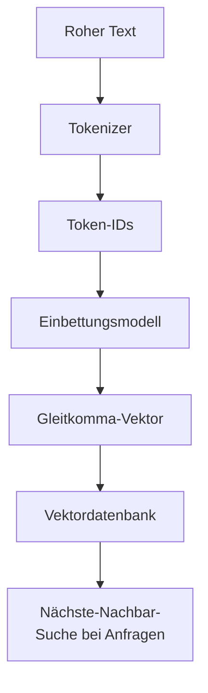
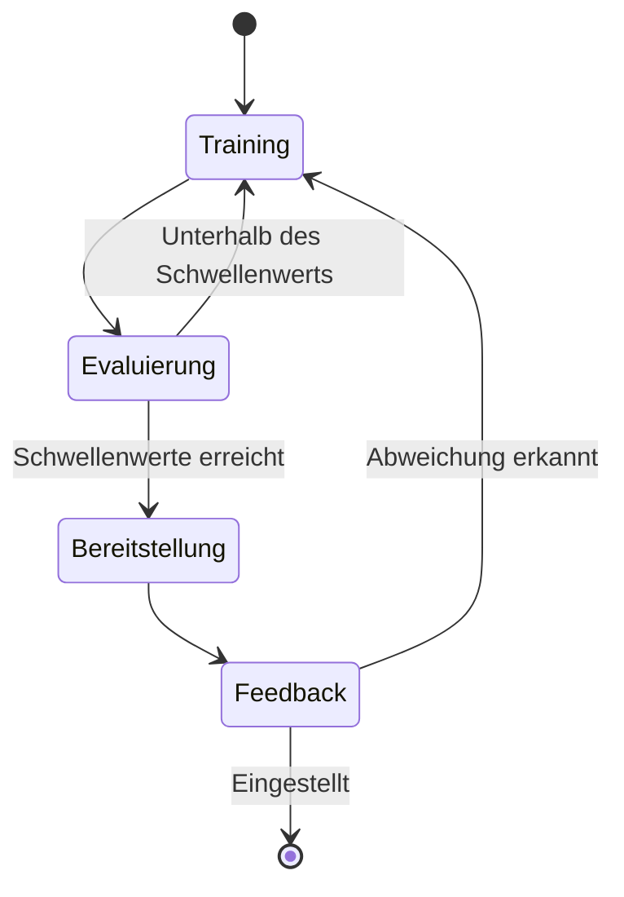
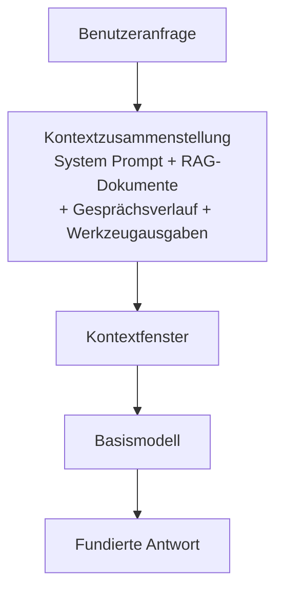
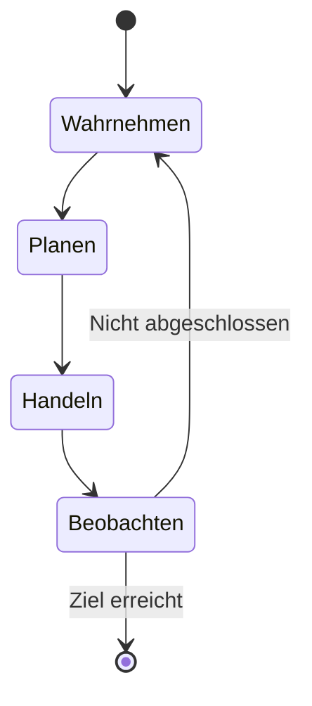
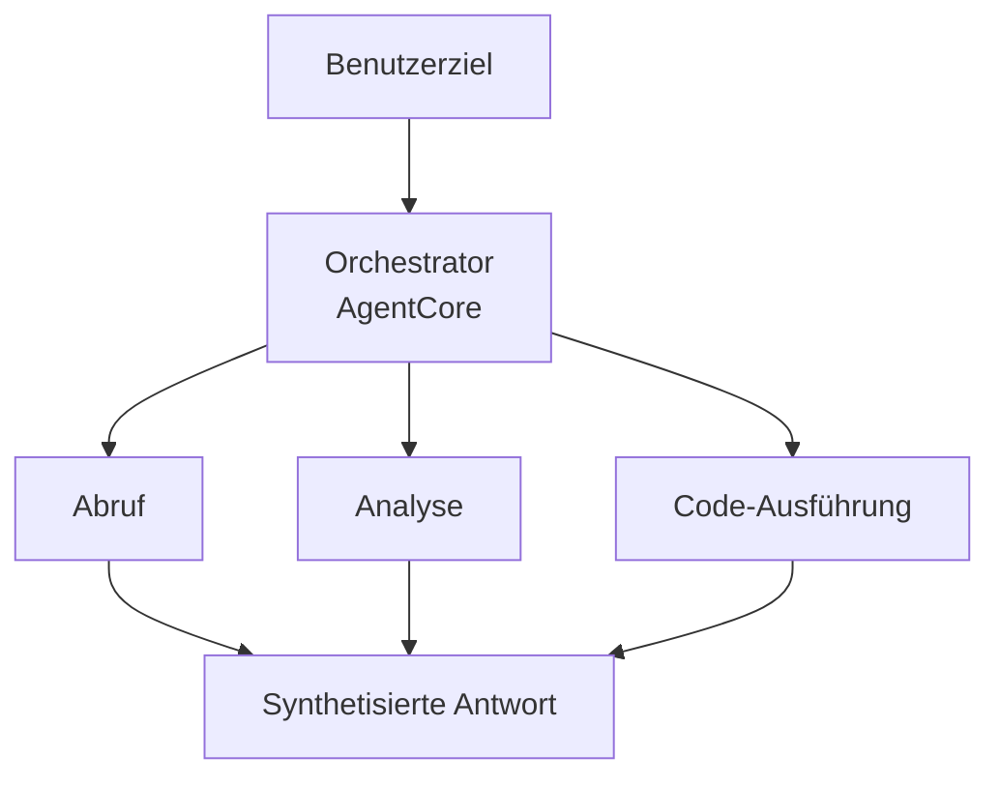

## Aufgabenstellung 2.1: Die grundlegenden Konzepte der Generativen KI (GenAI) erklären

Generative KI erzeugt neue Inhalte, anstatt eine Bezeichnung vorherzusagen oder eine Eingabe zu klassifizieren. Dieser Unterschied prägt alles: die Modellarchitekturen, die für den Aufbau dieser Systeme verwendet werden, die Art ihrer Abrechnung, die Fehlerarten, die sie aufweisen, und die neue Disziplin der Kontextgestaltung, die bestimmt, welche Informationen das Modell vor seiner Antwort erhält. Diese Aufgabenstellung deckt sechs Zielbereiche ab, von denen drei neu in der Prüfungsanleitung v1.1 sind und widerspiegeln, wie schnell diese Technologie von der Forschung in den Produktionseinsatz übergegangen ist.[^201001]

Im Domänenüberblick wurde dargelegt, dass Generative KI 24 % des Prüfungsgewichts ausmacht und dass ihr Kosten- und Fehlerprofil sich wesentlich vom klassischen Maschinellen Lernen (ML) unterscheidet. Diese Aufgabenstellung begründet diese Aussagen in der zugrundeliegenden Mechanik. Nach dem Durcharbeiten dieses Abschnitts können Sie erklären, was ein Token ist und warum die Token-Anzahl einer Eingabeaufforderung die Rechnung direkt beeinflusst, beschreiben, wie ein Basismodell (FM) vom Rohtext zu einem bereitgestellten Dienst gelangt, erläutern, was Kontextgestaltung bedeutet und wie sie sich zur Prompt-Engineering-Praxis verhält, sowie die Muster darstellen, die Multi-Agenten-Systeme verwenden, wenn sie mehrere KI-Komponenten koordinieren müssen.

### 2.1.1 Grundlegende GenAI-Konzepte

Generative-KI-Modelle teilen einen gemeinsamen Satz von Abstraktionen, die in der gesamten AWS-Dokumentation, auf Anbieter-Preisseiten und in Design-Reviews erscheinen. Das Verständnis dieser Abstraktionen ist die Voraussetzung für alles weitere in Domäne 2.

**Tokenisierung** ist der erste Schritt bei der Verarbeitung von Text mit einem Sprachmodell. Ein *Token* ist die kleinste Texteinheit, mit der das Modell arbeitet. In den meisten englischen Texten entspricht ein Token etwa drei bis vier Zeichen, sodass das Wort „tokenization" je nach Tokenizer zu zwei oder drei Token wird, während das Wort „cat" ein einzelner Token ist. Zahlen, Satzzeichen und nicht-englische Zeichen erzeugen häufig mehr Token pro Wort als normaler englischer Fließtext.[^201002] Die Gesamtzahl der Token für eine Anfrage ist die Summe der Eingabe-Token (der von Ihnen gesendete Text) zuzüglich der Ausgabe-Token (der vom Modell generierte Text). Beide Werte erscheinen auf der Rechnung.

**Segmentierung** (Chunking) ist der Prozess, ein umfangreiches Dokument vor der Einbettung oder dem Abruf in kleinere Abschnitte zu unterteilen. Ein 50-seitiges PDF passt nicht als einzelner Block in das Kontextfenster eines Modells, daher wird es in überlappende Abschnitte von einigen hundert Token aufgeteilt. Die Abschnittsgröße und der Überlappungsprozentsatz sind einstellbare Parameter, die die Abrufgenauigkeit beeinflussen: Zu kleine Abschnitte verlieren den umgebenden Kontext, während zu große Abschnitte Token-Budget verschwenden, wenn sie in eine Eingabeaufforderung eingefügt werden.[^201003] Die Segmentierung ist ein Vorbereitungsschritt, keine Modellfunktion, und sie läuft zur Index-Erstellungszeit, nicht zur Inferenzzeit.

*Einbettungsvektoren (Embeddings)* sind numerische Darstellungen von Text (oder Bildern oder Audio), die semantische Bedeutung als Vektoren in einem hochdimensionalen Raum kodieren. Zwei Textstücke mit ähnlicher Bedeutung weisen Einbettungsvektoren auf, die geometrisch nahe beieinanderliegen, was die Ähnlichkeitssuche in einer Dokumentensammlung ermöglicht. **Amazon Bedrock** stellt Einbettungsmodelle wie Amazon Titan Embeddings und Cohere Embed bereit, die Text entgegennehmen und einen Gleitkomma-Vektor zurückgeben.[^201004] Diese Vektoren werden dann in einer Vektordatenbank gespeichert, einem spezialisierten Datenspeicher, der für Nächste-Nachbar-Suchen optimiert ist. Zu den auf AWS verfügbaren Vektordatenbanken gehören **Amazon OpenSearch Service** mit dem k-NN-Plugin, **Amazon Aurora** und **Amazon RDS for PostgreSQL** mit der pgvector-Erweiterung sowie **Amazon Neptune Analytics** mit Vektorsuche.[^201005]

*Abbildung 2.1.1: Tokenisierungs- und Einbettungs-Pipeline. Text wird zunächst vom Tokenizer in Token-IDs umgewandelt, dann vom Einbettungsmodell auf einen hochdimensionalen Vektor abgebildet und schließlich in einer Vektordatenbank für die Ähnlichkeitssuche gespeichert.*

**Prompt-Engineering** ist die Praxis, die an ein Modell gesendeten Texteingaben so zu gestalten, dass Qualität, Genauigkeit oder Format der Ausgaben verbessert werden. Eine gut gestaltete Eingabeaufforderung (Prompt) kann eine Anweisung, Kontext, Beispiele und ein explizites Ausgabeformat enthalten. Aufgabenstellung 3.2 behandelt spezifische Prompt-Engineering-Techniken im Detail; an dieser Stelle ist der wichtigste Punkt, dass Prompt-Engineering der unmittelbarste Hebel ist, den ein Fachmann auf das Modellverhalten hat, ohne das Modell selbst zu verändern.[^201006]

**Transformer-basierte Große Sprachmodelle (LLMs)** sind die dominierende Architektur für moderne Sprachaufgaben. Die *Transformer*-Architektur, die 2017 eingeführt wurde, verwendet einen Mechanismus namens *Selbst-Attention*, um die Relevanz jedes Tokens in einer Sequenz gegenüber jedem anderen Token bei der Erzeugung jedes Ausgabe-Tokens zu gewichten.[^201007] Selbst-Attention ermöglicht es einem Transformer, weitreichende Abhängigkeiten im Text aufrechtzuerhalten, beispielsweise zu wissen, dass das Pronomen „es" sich auf ein Substantiv bezieht, das drei Sätze zuvor eingeführt wurde. Die Mathematik hinter Attention wird in der AIF-C01-Prüfung nicht abgefragt, aber das Konzept ist wichtig, um zu verstehen, warum längere Kontexte rechenintensiver sind und warum das Kontextfenster eine endliche Größe hat.

**Basismodelle (FMs)** sind große Modelle, die auf breiten, allgemeinen Datensätzen in enormem Maßstab trainiert werden.[^201008] Ein FM wird nicht für eine bestimmte Aufgabe trainiert; stattdessen lernt es allgemeine Darstellungen von Sprache (oder Bildern oder Code), die dann durch Prompting, Retrieval oder Feinabstimmung an viele nachgelagerte Aufgaben angepasst werden können. Über Amazon Bedrock verfügbare Beispiele sind Anthropic Claude, Meta Llama, Amazon Nova und Modelle von Mistral AI, unter anderen.[^201009]

**Multimodale Modelle** nehmen mehr als eine Datenart entgegen und erzeugen mehr als eine Datenart. Ein multimodales FM kann ein Bild zusammen mit einer Textfrage entgegennehmen und eine Textantwort zurückgeben oder Text entgegennehmen und sowohl Text als auch ein Bild zurückgeben. Innerhalb der Amazon Nova-Familie auf Amazon Bedrock verarbeiten Lite, Pro und Premier Text, Bilder, Video und Dokumente; Nova Micro ist rein textbasiert und die kostengünstigste Option für reine Textanwendungsfälle.[^201010]

**Diffusionsmodelle** erzeugen Ausgaben, indem sie lernen, einen Rauschhinzufügungsprozess umzukehren. Während des Trainings sieht das Modell Daten mit zunehmenden Mengen an zufälligem Rauschen und lernt, dieses Rauschen schrittweise vorherzusagen und zu entfernen. Zur Inferenzzeit beginnt es mit reinem Rauschen und entrauscht dieses iterativ zu einem kohärenten Bild, Audio-Clip oder einem anderen Artefakt.[^201011] Diffusionsmodelle sind die Grundlage für Bildgenerierungsfunktionen. Amazon Bedrock enthält Stable Diffusion von Stability AI als Bildgenerierungsmodell in dieser Kategorie.[^201012]

### 2.1.2 Mögliche Anwendungsfälle für GenAI-Modelle

Generative KI deckt ein breiteres Spektrum an Geschäftsaufgaben ab als die meisten klassischen ML-Systeme, weil die zugrundeliegenden Modelle domänenübergreifend verallgemeinern. Die praktische Frage ist nicht, ob ein generatives Modell bei einer bestimmten Aufgabe helfen könnte, sondern ob es der richtige Kompromiss zwischen Wirtschaftlichkeit und Genauigkeit für diesen spezifischen Fall ist.

*Tabelle 2.1.1: Häufige GenAI-Anwendungsfälle und repräsentative Geschäftsszenarien*

| Anwendungsfall | Was das Modell tut | Repräsentatives Geschäftsszenario |
|---|---|---|
| Bildgenerierung | Erzeugt neue Bilder aus Text- oder Bildeingaben | Marketingteams erstellen Produkt-Lifestyle-Bilder ohne Fotoshooting |
| Videogenerierung | Generiert kurze Videoclips aus Textbeschreibungen | Medienunternehmen erstellen Entwürfe für Erklärvideos zur Überprüfung |
| Audiogenerierung | Synthetisiert Sprache oder Musik | E-Learning-Plattformen generieren Erzählungen für Kursaktualisierungen über Nacht |
| Zusammenfassung | Verdichtet lange Dokumente in kürzere Versionen | Rechtsabteilungen fassen Verträge zusammen, um zentrale Verpflichtungen hervorzuheben |
| KI-Assistenten | Beantwortet Fragen, erstellt Inhalte, erklärt Konzepte | Interne Wissensbasis-Bots beantworten Personalfragen der Mitarbeiter |
| Übersetzung | Konvertiert Text von einer Sprache in eine andere | Globale Einzelhändler lokalisieren Produktbeschreibungen in 20 Sprachen |
| Code-Generierung | Schreibt, überprüft und erklärt Quellcode | Entwickler beschleunigen die Implementierung von Routinefunktionen und das Schreiben von Unit-Tests |
| Kundenservice-Agenten | Bearbeitet Kundenanfragen im Gespräch | Callcenter leiten häufige Fragen weiter, ohne Live-Agent-Beteiligung |
| Suche | Liefert semantisch relevante Ergebnisse statt Schlüsselwort-Übereinstimmungen | Unternehmens-Dokumentenportale zeigen die richtige Richtlinienseite an, auch wenn die Anfrage andere Formulierungen verwendet |
| Empfehlungssysteme | Schlägt Elemente basierend auf Benutzerverhalten oder angegebenen Präferenzen vor | Streaming-Dienste empfehlen Inhalte mit hybriden semantischen und kollaborativen Signalen |

Jeder Anwendungsfalltyp stellt unterschiedliche Anforderungen an das zugrundeliegende Modell. Zusammenfassung und Übersetzung sind primär Sprachaufgaben, die LLMs bevorzugen. Bild- und Videogenerierung erfordern Diffusions- oder andere generative Bildmodelle. Code-Generierung profitiert von Modellen, die speziell auf Programmiersprachen feinabgestimmt wurden. Kundenservice-Agenten profitieren von geringer Latenz, starker Instruktionsbefolgung und der Fähigkeit, externe Werkzeuge aufzurufen, was direkt mit den agentischen Mustern aus Ziel 2.1.6 verbunden ist. Suche und Empfehlung nutzen die Einbettungsvektor- und Vektorähnlichkeitsfunktionen aus Ziel 2.1.1 und kombinieren diese typischerweise mit einem RAG-Muster (Retrieval-Augmented Generation), das in Aufgabe 3.1 behandelt wird.

### 2.1.3 Der FM-Lebenszyklus

Ein Basismodell gelangt nicht direkt aus den Trainingsdaten in die Produktion. Es durchläuft einen definierten Lebenszyklus mit mehr Phasen als der klassische ML-Lebenszyklus, der in Aufgabe 1.3 beschrieben wird. Der klassische Ablauf konzentriert sich auf einen beschrifteten Datensatz, ein Modell und einen Inferenzendpunkt. Der FM-Lebenszyklus beginnt viel früher, mit Entscheidungen darüber, welche Rohdaten für das Vortraining verwendet werden sollen, und er fügt Feedback-Schleifen nach der Bereitstellung hinzu, die das Modellverhalten kontinuierlich verfeinern.

*Abbildung 2.1.2: Basismodell-Lebenszyklus. Der Ablauf ist nicht streng linear: Evaluierungsfehler führen zurück zur Feinabstimmung, und Produktions-Feedback kann weitere Anpassungszyklen auslösen.*

Die sieben Phasen des FM-Lebenszyklus sind:

- **Datensatzauswahl**: Zusammenstellen des Trainingskorpus. Für das Vortraining ist dieser massiv und breit gefächert (Web-Crawls, Bücher, Code-Repositorys). Für die Feinabstimmung ist er domänenspezifisch und wesentlich kleiner. Die Datenqualität in dieser Phase bestimmt direkt das Modellverhalten, einschließlich seiner Verzerrungen.[^201013]
- **Modellauswahl**: Wahl einer Architektur (Transformer-Variante, Diffusionsmodell, multimodal), der Größe in Parametern und ob von Grund auf trainiert oder von einem vorhandenen FM ausgegangen wird. Die meisten Unternehmensbereitstellungen überspringen das Vortraining von Grund auf vollständig und wählen aus verfügbaren FMs über einen Dienst wie Amazon Bedrock.[^201014]
- **Vortraining**: Erlernen allgemeiner Darstellungen aus dem breiten Datensatz mit großen Rechenmengen (GPU-Cluster, die wochenlang oder monatelang laufen). Dies ist die Phase, die die FM-Basisgewichte erzeugt. Vortraining ist so kostspielig, dass es praktisch kein Unternehmen außerhalb von Hyperscalern durchführt.[^201015]
- **Feinabstimmung**: Aktualisierung der FM-Basisgewichte auf einem kleineren, aufgaben- oder domänenspezifischen Datensatz. Die Feinabstimmung passt das Modellverhalten an, ohne die vollen Vortrainingskosten zu wiederholen. Amazon Bedrock unterstützt benutzerdefinierte Feinabstimmungsaufgaben, und Amazon SageMaker AI unterstützt sowohl Feinabstimmung als auch fortgeschrittenere parametereffiziente Feinabstimmungstechniken.[^201016]
- **Evaluierung**: Messung der Modellqualität an zurückgehaltenen Testdaten. Bei generativen Modellen umfasst die Evaluierung automatische Metriken wie ROUGE und BLEU für Text sowie menschliche Bewertung und zunehmend LLM-als-Richter-Methoden. Aufgabe 3.4 behandelt die Bewertung ausführlich.
- **Bereitstellung**: Das Modell über einen API-Inferenzendpunkt bereitzustellen, über den Anwendungen Eingabeaufforderungen senden und Vervollständigungen empfangen können. Amazon Bedrock verwaltet die zugrundeliegende Infrastruktur für unterstützte Modelle, während Amazon SageMaker AI Teams direkte Kontrolle über die Endpunktkonfiguration gibt.[^201017]
- **Feedback**: Sammeln von Signalen aus dem Produktionsbetrieb (Latenz, Genauigkeit, Benutzerzufriedenheit, Fehlerquoten) und deren Verwendung zur Erkennung von Modellabweichungen oder zum Aufbau neuer Feinabstimmungs-Datensätze. Dies schließt den Kreislauf und unterscheidet den FM-Lebenszyklus von einem einmaligen Trainingslauf.

Der wesentliche Unterschied zum klassischen ML-Lebenszyklus aus Aufgabe 1.3 ist die Vortrainingsphase. Klassische ML-Abläufe beginnen mit einem problemspezifischen beschrifteten Datensatz. Der FM-Lebenszyklus beginnt mit selbstüberwachtem Lernen auf unbeschrifteten Texten in einem Maßstab, der allgemeine Fähigkeiten erzeugt, und verengt sich erst später durch Feinabstimmung oder Prompting auf bestimmte Aufgaben. Fachleute aus dem Unternehmensbereich steigen in den FM-Lebenszyklus typischerweise in der Feinabstimmungs- oder Bereitstellungsphase ein, nicht beim Vortraining.

### 2.1.4 Token-basiertes Preismodell

Klassische ML-Inferenz wird typischerweise pro Vorhersage oder pro Endpunktstunde berechnet. Token-basierte Preisgestaltung ist anders: Sie bezahlen für die Anzahl der verbrauchten Token, sowohl eingehend als auch ausgehend, anstatt für die Rechenressource, die die Anfrage ausgeführt hat. Ein Verständnis der Token-Ökonomie ist direkt relevant für die Budgetplanung bei jedem Generative-KI-Projekt.

**Eingabe-Token** sind die Token in der Eingabeaufforderung, die Sie an das Modell senden: die Systemaufforderung (System Prompt), alle abgerufenen Dokumente, der Gesprächsverlauf, Werkzeugausgaben und die Nachricht des Benutzers. **Ausgabe-Token** sind die Token, die das Modell als Antwort generiert. Amazon Bedrock berechnet wie die meisten Cloud-FM-Anbieter Eingabe- und Ausgabe-Token separat, wobei Ausgabe-Token teurer sind, da die Generierung eines Tokens rechenintensiver ist als die Verarbeitung eines Eingabe-Tokens.[^201018]

*Tabelle 2.1.2: Token-Preisstruktur und Kostenhebel*

| Preisfaktor | Beschreibung | Auswirkung auf die Kosten |
|---|---|---|
| Eingabe-Token-Preis | Kosten pro 1.000 Eingabe-Token (variiert je nach Modell) | Direkt proportional zur Länge der Eingabeaufforderung |
| Ausgabe-Token-Preis | Kosten pro 1.000 Ausgabe-Token, typischerweise 3 bis 5 Mal der Eingabepreis | Direkt proportional zur Länge der Antwort |
| Prompt-Zwischenspeicherung | Wiederverwendung zuvor verarbeiteter Eingabeaufforderungs-Präfixe | Reduziert effektive Eingabekosten für wiederholten Kontext |
| Batch-Inferenz | Asynchrone Verarbeitung vieler Anfragen zusammen | Typischer Rabatt von 50 % gegenüber dem On-Demand-Preis |
| Bereitgestellter Durchsatz | Reservierte Kapazität für dauerhaft hohe Workloads | Vorhersagbare Kosten, erfordert aber Mengenverpflichtung |

Um dies zu veranschaulichen: Betrachten Sie ein Kundenservice-Szenario. Eine einzelne Interaktion kann eine 500-Token-Systemaufforderung, ein abgerufenes Dokument mit 1.000 Token, eine Benutzernachricht mit 50 Token und eine Modellantwort mit 200 Token umfassen. Das sind 1.550 Eingabe-Token und 200 Ausgabe-Token. Bei einem Modell mit einem Preis von $0,003 pro 1.000 Eingabe-Token und $0,015 pro 1.000 Ausgabe-Token betragen die Kosten pro Interaktion ungefähr $0,0077 ($0,00465 Eingabe + $0,003 Ausgabe). Bei 100.000 Interaktionen pro Monat beläuft sich die Rechnung auf etwa $770 für diesen einzelnen Modellaufruf pro Interaktion. Wenn der Workflow das Modell mehrmals pro Interaktion aufruft (für das Routing, für das erneute Ranking beim Abruf, für die Antworterzeugung), multiplizieren sich diese Zahlen entsprechend.[^201019]

**Prompt-Zwischenspeicherung** ermöglicht es dem Modellanbieter, die verarbeitete Darstellung eines wiederholten Eingabeaufforderungs-Präfixes zu speichern, sodass nachfolgende Anfragen, die dieses Präfix teilen, diese Token nicht neu verarbeiten. Wenn dieselbe Systemaufforderung mit jeder Anfrage gesendet wird, kann das Zwischenspeichern dieses Präfixes die effektiven Eingabekosten für den zwischengespeicherten Anteil um 80 bis 90 Prozent reduzieren.[^201020] Amazon Bedrock unterstützt Prompt-Zwischenspeicherung für geeignete Modelle.

**Batch-Inferenz** in Amazon Bedrock verarbeitet Anfragen asynchron statt in Echtzeit. Anstatt eine Anfrage zu stellen und auf die Antwort zu warten, übermitteln Sie einen Stapel von Anfragen und rufen die Ergebnisse nach Abschluss der Verarbeitung ab. Der Kompromiss ist die Latenz: Batch-Antworten treffen Minuten bis Stunden nach der Übermittlung ein, nicht Sekunden. Für Anwendungsfälle, die Latenz tolerieren (Dokumenten-Zusammenfassungs-Warteschlangen, Übersetzungsaufträge über Nacht, Massen-Inhaltsgenerierung), ist Batch-Inferenz ein unkomplizierter Kostenhebel.[^201021]

Die praktische Auswirkung für die Unternehmensplanung ist, dass Token-Kosten mit Architekturentscheidungen akkumulieren. Ein RAG-Muster, das pro Anfrage drei Dokumente mit je 500 Token abruft, fügt jeder Anfrage 1.500 Eingabe-Token hinzu. Ein agentischer Ablauf mit fünf Modellaufrufen pro Benutzeranfrage multipliziert die Kosten pro Anfrage ungefähr fünffach. Die Gestaltung auf Token-Effizienz hin, durch kürzere Eingabeaufforderungen, Prompt-Zwischenspeicherung, Batch-Verarbeitung wo tolerierbar und richtiges Bemessen der Abruf-Abschnittsanzahl, ist genauso wichtig wie die Wahl des richtigen Modells.

### 2.1.5 Kontextgestaltung in FM-Anwendungen

Prompt-Engineering konzentriert sich auf die Formulierung und Struktur einer einzelnen Eingabeaufforderung: wie eine Anweisung formuliert, wie ein Beispiel formatiert und wie viele Beispiele einbezogen werden sollen. **Kontextgestaltung** ist eine übergeordnete Disziplin, die fragt, welche Informationen überhaupt in das Kontextfenster des Modells eingehen sollen, in welcher Form und in welcher Reihenfolge.[^201022] Ein Modell sieht die Welt nicht; es sieht nur, was zur Inferenzzeit in sein Kontextfenster passt. Kontextgestaltung ist die Praxis, diesen Inhalt gezielt zu kuratieren.

Das Kontextfenster ist die maximale Anzahl von Token, die ein Modell in einem einzigen Vorwärtsdurchlauf verarbeiten kann, einschließlich Eingabe und Ausgabe. Die Kontextfenster der Amazon Bedrock-Modelle reichen von Zehntausenden bis zu mehr als einer Million Token, je nach Modellfamilie (zum Beispiel erreichen bestimmte Anthropic Claude-Varianten mit dem 1M-Kontext-Beta-Header eine Million Token, und Amazon Nova Premier sowie Meta Llama 4 Maverick bieten Millionen-Token-Fenster auf Bedrock).[^201023] Ein großes Kontextfenster bedeutet nicht, dass eine Anwendung es vollständig füllen sollte: Längere Kontexte erhöhen Latenz und Kosten, und Modelle können das *Lost-in-the-Middle*-Verhalten zeigen, bei dem relevante Informationen, die in der Mitte eines langen Kontexts vergraben sind, weniger Aufmerksamkeit erhalten als Informationen am Anfang oder Ende.[^201024]

*Abbildung 2.1.3: Kontextzusammenstellung für FM-Anwendungen. Die Kontextgestaltung bestimmt, was in jeden Bereich des Kontextfensters eingeht und wie die zusammengestellte Eingabe geordnet wird, bevor das Modell sie verarbeitet.*

Die Komponenten, die typischerweise einen zusammengestellten Kontext ausmachen, umfassen:

- **Systemaufforderung (System Prompt)**: Die dauerhafte Anweisung, die die Rolle, den Ton, das Ausgabeformat und die Einschränkungen des Modells definiert. Die Systemaufforderung ist in der Regel über alle Anfragen einer Anwendung hinweg konstant, was sie zu einem guten Kandidaten für Prompt-Zwischenspeicherung macht.
- **Abgerufene Dokumente**: Ausgabe einer RAG-Pipeline. Der Abrufschritt wählt die semantisch relevantesten Abschnitte aus einer Vektordatenbank aus, aber die Kontextgestaltung bestimmt, wie viele Abschnitte einzubeziehen sind, wie sie zu ordnen sind und ob Abschnitte vor der Einbeziehung zusammenzufassen sind, um Token einzusparen.
- **Gesprächsverlauf**: Frühere Gesprächsrunden eines mehrteiligen Gesprächs. Da Kontextfenster endlich sind, überschreitet ein langes Gespräch schließlich das Fenster. Kontextgestaltungsstrategien für den Verlauf umfassen Kürzung (Verwerfen der ältesten Runden), Zusammenfassung (Ersetzen alter Runden durch eine rollende Zusammenfassung) und selektive Aufbewahrung (Behalten nur der als hochwertig markierten Runden).
- **Werkzeugausgaben**: Wenn ein Agent eine externe Funktion aufruft (eine Datenbankabfrage, eine Websuche, ein API-Aufruf), wird das Ergebnis in den Kontext injiziert, damit das Modell darüber nachdenken kann. Das Format der Werkzeugausgaben beeinflusst, wie zuverlässig das Modell sie interpretiert.
- **Strukturierte Daten**: Tabellen, JSON-Datensätze oder Schlüssel-Wert-Paare, die faktische Grundlage liefern. Strukturierte Daten sind token-effizienter als Fließtextbeschreibungen derselben Fakten, wenn das Modell auf bestimmte Werte verweisen muss.

Der Unterschied zum Prompt-Engineering liegt im Umfang. Prompt-Engineering beantwortet die Frage: „Wie soll ich diese Anweisung formulieren?" Kontextgestaltung beantwortet: „Was soll im Kontextfenster stehen, wie viel davon, in welcher Form und in welcher Reihenfolge?" Beide Disziplinen sind für FM-Anwendungen in der Produktion relevant, aber Kontextgestaltung ist diejenige, die mit der Anwendungskomplexität skaliert. Ein einfacher Chatbot kann einmalig mit Prompt-Engineering konfiguriert werden. Ein komplexer Agent, der Abrufe, Werkzeugaufrufe und mehrteiligen Verlauf koordiniert, erfordert fortlaufende Kontextgestaltung, um innerhalb der Token-Budgets zu bleiben und die Antwortqualität aufrechtzuerhalten.

*Tabelle 2.1.3: Kontextgestaltungstechniken und ihre Kompromisse*

| Technik | Was sie bewirkt | Kompromiss |
|---|---|---|
| Kontextfenster-Zusammenfassung | Komprimiert alte Gesprächsrunden in eine kürzere Zusammenfassung | Verliert genaue Formulierungen; führt mögliche Verzerrungen ein |
| Selektiver Abruf | Ruft nur die top-k relevantesten Abschnitte ab, nicht alle Kandidaten | Kann relevante Dokumente verpassen, wenn das Abrufmodell schlecht bewertet |
| Abschnitts-Vorabzusammenfassung | Fasst jedes abgerufene Dokument zusammen, bevor es einbezogen wird | Reduziert Token pro Dokument auf Kosten zusätzlicher Modellaufrufe |
| Prompt-Zwischenspeicherung | Speichert verarbeitete Darstellungen wiederholter Präfixe | Erfordert eine Eingabeaufforderungsstruktur, die den zwischengespeicherten Anteil stabil hält |
| Werkzeugausgaben-Formatierung | Konvertiert rohe API-Antworten in kompakte, modelllesbare Formate | Erfordert werkzeugspezifische Formatierungslogik in der Anwendungsschicht |

### 2.1.6 Grundlegende agentische KI-Konzepte

Ein KI-Agent ist ein System, in dem ein FM nicht nur auf eine einzelne Eingabeaufforderung antwortet, sondern in einer Schleife arbeitet: Es nimmt ein Ziel oder eine Beobachtung wahr, plant eine Vorgehensweise, führt diese Aktion aus (oft durch den Aufruf eines externen Werkzeugs) und beobachtet dann das Ergebnis, bevor es entscheidet, ob das Ziel erreicht ist.[^201025] Ein einzelner FM-Aufruf erzeugt eine Antwort und stoppt. Ein Agent läuft, bis eine Abbruchbedingung erfüllt ist, was das Abschließen einer mehrstufigen Aufgabe, das Erschöpfen eines Rundenlimits oder die Feststellung sein kann, dass die Aufgabe mit den verfügbaren Werkzeugen unmöglich ist.

*Abbildung 2.1.4: Die Agentenschleife. Ein Agent durchläuft Wahrnehmen, Planen, Handeln und Beobachten, bis eine Abbruchbedingung erfüllt ist.*

Einzel-Agenten-Architekturen bewältigen viele Aufgaben, aber komplexe Arbeitsabläufe erfordern häufig mehrere Agenten, die koordiniert arbeiten. **Multi-Agenten-Systeme** verteilen die Arbeit auf spezialisierte Agenten, von denen jeder für einen Aspekt der Gesamtaufgabe verantwortlich ist.[^201026] Die Prüfung testet das Bewusstsein für vier Koordinationsmuster:

- **Orchestrator/Worker-Muster**: Ein zentraler Orchestrator-Agent empfängt das Ziel des Benutzers, zerlegt es in Teilaufgaben, übergibt jede Teilaufgabe an einen spezialisierten Worker-Agenten, sammelt die Ergebnisse und synthetisiert eine Abschlussantwort. Der Orchestrator führt die Arbeit selbst nicht aus; er verwaltet den Ablauf.
- **Hierarchisches Muster**: Eine Baumstruktur, in der ein Agent der obersten Ebene Agenten der mittleren Ebene verwaltet, die wiederum Agenten der Blattebene verwalten. Dies ist eine Erweiterung des Orchestrator/Worker-Musters auf mehrere Zerlegungsebenen, geeignet für Aufgaben mit natürlicher hierarchischer Struktur (zum Beispiel eine Forschungsaufgabe, die sich in Themenbereiche zerlegt, von denen jeder sich in Quellenrecherche und Analyse aufteilt).
- **Sequenzielles Muster**: Agenten sind in einer Pipeline angeordnet, wobei die Ausgabe eines Agenten die Eingabe des nächsten ist. Dies ist geeignet, wenn jeder Schritt abgeschlossen sein muss, bevor der nächste beginnen kann, und wenn kein Bedarf besteht, dass der nachgelagerte Agent das Verhalten des vorgelagerten Agenten beeinflusst.
- **Debate-Muster**: Mehrere Agenten erzeugen unabhängig voneinander Antworten auf dieselbe Anfrage, bewerten dann die Ausgaben der anderen oder kritisieren sie, wobei ein abschließender Agent die beste Antwort synthetisiert. Dies verbessert die Genauigkeit bei Aufgaben, bei denen unterschiedliche Argumentationsansätze zu unterschiedlichen Schlussfolgerungen führen.

**Das Model Context Protocol (MCP)** ist ein standardisiertes Protokoll zur Verbindung von KI-Agenten mit externen Werkzeugen, Datenquellen und Diensten.[^201027] Ohne ein gemeinsames Protokoll erfordert jede Agenten-Integration mit einem externen System benutzerdefinierten Code für die Verwaltung von Authentifizierung, Anforderungsformatierung und Antwortparsing. MCP definiert eine standardisierte Client-Server-Schnittstelle, sodass ein Agent verfügbare Werkzeuge entdecken, sie mit strukturierten Argumenten aufrufen und strukturierte Ergebnisse empfangen kann, ohne integrationsspezifischen Code. AWS hat die Unterstützung für MCP im Amazon Bedrock-Ökosystem angekündigt, und **Strands Agents**, das Open-Source-SDK von AWS für den Aufbau agentischer Anwendungen, implementiert die MCP-Client-Schnittstelle.[^201028]

Kommunikationsmuster in Multi-Agenten-Systemen beschreiben, wie Agenten Nachrichten austauschen. Agenten können direkt (Peer-to-Peer), über eine gemeinsame Nachrichtenwarteschlange oder über einen zentralisierten Broker kommunizieren. Die Wahl des Kommunikationsmusters beeinflusst Zuverlässigkeit, Reihenfolgegarantien und die Möglichkeit zu prüfen, was jeder Agent zu welchem anderen Agenten gesagt hat. In Produktionssystemen werden Nachrichtenwarteschlangen gegenüber direkten Agenten-zu-Agenten-Aufrufen bevorzugt, weil sie den sendenden Agenten vom empfangenden Agenten entkoppeln und eine dauerhafte Aufzeichnung aller Agenten-Nachrichten bereitstellen.

*Tabelle 2.1.4: Speichertypen in agentischen KI-Systemen*

| Speichertyp | Geltungsbereich | Speicherort | Anwendungsfall |
|---|---|---|---|
| Kurzzeit (Arbeits-) | Aktuelle Sitzung oder Agentenschleife | Kontextfenster | Reasoning über die aktuelle Aufgabe |
| Langzeit (persistent) | Sitzungsübergreifend | Externe Datenbank oder Vektorspeicher | Benutzerpräferenzen und vergangene Entscheidungen merken |
| Episodisch | Bestimmte vergangene Ereignisse oder Interaktionen | Abrufbarer Datensatzspeicher | Erinnern, was in einer früheren Interaktion geschah |
| Semantisch | Allgemeines Welt- oder Domänenwissen | In Modellgewichten oder RAG-Index eingebettet | Faktische Fragen beantworten |

**Speicherverwaltung** ist die Praxis zu entscheiden, welche Informationen ein Agent in welcher Speicherebene und wie lange behält.[^201029] Kurzzeitgedächtnis ist das Kontextfenster selbst. Wenn der Arbeitskontext eines Agenten sich seinem Fensterlimit nähert, muss die Speicherverwaltungsschicht entscheiden, was komprimiert, zusammengefasst oder in den Langzeitspeicher ausgelagert werden soll. Langzeitspeicher verwendet typischerweise eine Vektordatenbank (wie in Ziel 2.1.1 beschrieben), damit der Agent relevante vergangene Erfahrungen semantisch abrufen kann, anstatt ein vollständiges Protokoll zu durchsuchen.

**Werkzeugnutzung** in agentischen Systemen bezieht sich auf die Fähigkeit des Agenten, externe Funktionen aufzurufen und die Ergebnisse in sein Reasoning einzubeziehen.[^201030] Ein Werkzeug kann eine Websuche, eine Datenbankabfrage, ein REST-API-Aufruf, ein Code-Interpreter oder eine beliebige Funktion sein, die ein Ergebnis zurückgibt, das der Agent beobachten kann. Werkzeuge werden durch ihr Eingabe- und Ausgabeschema definiert; das FM nutzt diese Schemas, um zu entscheiden, wann ein Werkzeug aufgerufen und welche Argumente übergeben werden sollen. Dies wird in der API-Dokumentation manchmal als *Funktionsaufruf (Function Calling)* bezeichnet.

**Workflow-Orchestrierung** koordiniert die Ausführung mehrstufiger agentischer Prozesse und verwaltet Sequenzierung, Fehlerwiederherstellung und Zustandsverwaltung über Agenten-Aufrufe hinweg.[^201031] **Amazon Bedrock AgentCore**, die neuere verwaltete Laufzeitschicht für agentische Workloads auf Amazon Bedrock, übernimmt diese Orchestrierungsschicht für agentische Produktionsanwendungen und stellt Ausführungsinfrastruktur bereit, sodass Teams keine eigene Agenten-Laufzeitumgebung aufbauen und betreiben müssen.[^201032] Strands Agents ist das Open-Source-SDK, das über der Laufzeit liegt und Entwicklern eine Python-basierte Möglichkeit bietet, Agenten, Werkzeuge und Speicherverhalten zu definieren, mit integrierter MCP-Client-Unterstützung.[^201033]

*Abbildung 2.1.5: Orchestrator/Worker-Muster in Multi-Agenten-Systemen auf Amazon Bedrock AgentCore. Der Orchestrator verwaltet Worker-Agenten und fasst deren Ausgaben zu einer Abschlussantwort zusammen.*

Die geschäftliche Relevanz agentischer KI liegt darin, dass sie Anwendungsfälle erschließt, die ein einmaliger Prompt-Aufruf nicht bewältigen kann: Aufgaben, die mehrere Werkzeugrecherchen erfordern, Aufgaben, die sich während der Ausführung basierend auf Zwischenergebnissen anpassen müssen, und Aufgaben, die die Koordination über spezialisierte Teilsysteme hinweg beinhalten. Gleichzeitig sind agentische Systeme komplexer zu entwerfen, teurer im Betrieb (jede Agentenschleifeniteration verbraucht Token) und schwieriger zu prüfen als einmalige Aufrufe. Aufgabenstellung 3.1 betrachtet KI-Agenten aus der Entwurfsperspektive erneut und behandelt, wann Agenten gegenüber einfacheren Mustern einzusetzen sind.

---

Dieser Abschnitt hat das konzeptuelle Vokabular für die gesamte Domäne 2 aufgebaut. Sie können nun die grundlegenden Generative-KI-Primitive definieren (Token, Einbettungsvektoren, Vektoren, Attention, Basismodelle, Diffusionsmodelle), den FM-Lebenszyklus und seine Unterschiede zur klassischen ML-Pipeline erklären, grobe Token-basierte Kosten für eine gegebene Architektur berechnen, beschreiben, was Kontextgestaltung bedeutet und wie sie sich von Prompt-Engineering unterscheidet, sowie die wichtigsten Muster für Multi-Agenten-Systeme und die Rolle von MCP darstellen. Aufgabenstellung 2.2 geht den nächsten Schritt: Welche realen Grenzen hat Generative KI angesichts dieser Fähigkeiten, und wie sollte ein Unternehmen diese Grenzen bei der Auswahl einer generativen Lösung abwägen?

---

## Selbstkontrollfragen

**Frage 1**

Ein Unternehmen entwickelt ein Dokument-Frage-und-Antwort-System, das ein 200-seitiges PDF segmentiert, die Abschnitte einbettet und in einer Vektordatenbank speichert. Wenn ein Benutzer eine Frage stellt, ruft das System die drei relevantesten Abschnitte ab und fügt sie in die Eingabeaufforderung an ein LLM ein. Ein Entwickler berichtet, dass das Modell manchmal relevante Informationen ignoriert, die in der Mitte langer abgerufener Abschnitte erscheinen.

Welche der folgenden Aussagen erklärt dieses Verhalten am BESTEN und welche Abhilfemaßnahme ist am GEEIGNETSTEN?

A. Der Tokenizer des Modells verwirft Token aus der Mitte des Dokuments, bevor das Einbettungsmodell sie verarbeitet. Reduzieren Sie die Abschnittsgröße auf weniger als 50 Token, damit der Tokenizer alle Inhalte beibehält.

B. Große Sprachmodelle können das Lost-in-the-Middle-Verhalten zeigen, bei dem Inhalte in der Mitte eines langen Kontexts weniger Aufmerksamkeit erhalten als Inhalte am Anfang oder Ende. Kürzere Abschnitte oder die Zusammenfassung von Abschnitten vor der Einbeziehung können diesen Effekt verringern.

C. Die Vektordatenbank führt schlüsselwortbasierte Suchen statt semantischer Suchen durch und ruft Abschnitte daher nach Worthäufigkeit statt nach Bedeutung ab. Wechseln Sie zu einem Volltextsuchindex.

D. Diffusionsmodelle sind nicht für Textabrufaufgaben konzipiert. Ersetzen Sie das LLM durch ein Diffusionsmodell, das auf Dokumentverständnis trainiert wurde.

*Erläuterung.* Option B ist korrekt. Das Lost-in-the-Middle-Phänomen ist ein dokumentiertes Verhalten von Transformer-basierten LLMs, bei dem Informationen, die in der Mitte eines langen Kontextfensters positioniert sind, proportional weniger Aufmerksamkeitsgewichtung erhalten als Informationen am Anfang oder Ende des Kontexts.[^201034] Dies ist ein Kontextgestaltungsproblem, kein Tokenizer-Problem (A ist falsch), kein Vektordatenbank-Suchproblem (C ist falsch) und keine Frage der Modellklassenauswahl (D ist falsch, und Diffusionsmodelle führen keine Textabfrage durch). Abhilfemaßnahmen umfassen das Kürzen der Abschnittsgröße, sodass jeder Abschnitt einen engeren Geltungsbereich hat, das Zusammenfassen von Abschnitten vor der Einbeziehung, um die Token-Anzahl zu reduzieren, und das Anordnen der relevantesten Abschnitte am Anfang der Eingabeaufforderung, anstatt sie in der Mitte zu vergraben. Dies sind alles Kontextgestaltungsentscheidungen: Sie bestimmen, was in das Kontextfenster einfließt, in welcher Form und in welcher Reihenfolge, was genau die in Ziel 2.1.5 beschriebene Disziplin ist.[^201035]

---

**Frage 2**

Eine Organisation bewertet die Kosten für den Betrieb einer generativen KI-Kundendienstanwendung auf Amazon Bedrock. Jede Kundeninteraktion umfasst eine Systemaufforderung mit 600 Token, durchschnittlich 900 Token abgerufener Dokumente, eine Benutzernachricht mit 100 Token und eine Modellantwort mit 300 Token. Die Anwendung verarbeitet 500.000 Interaktionen pro Monat.

Welcher Preisfaktor hätte den BEDEUTENDSTEN Einfluss, wenn die Organisation die monatlichen Kosten senken möchte, ohne das Modell oder die Antwortqualität zu ändern?

A. Wechsel vom bereitgestellten Durchsatz zum On-Demand-Preis für alle Anfragen.

B. Anwendung der Prompt-Zwischenspeicherung auf die Systemaufforderung, die bei jeder Anfrage identisch ist.

C. Erhöhung der Anzahl abgerufener Dokumentabschnitte von 3 auf 6 pro Interaktion.

D. Reduzierung des maximalen Ausgabe-Token-Limits von 300 auf 100 Token.

*Erläuterung.* Option B ist korrekt. Bei jeder Interaktion hat die Systemaufforderung 600 Token und ist bei allen 500.000 Anfragen identisch. Prompt-Zwischenspeicherung ermöglicht es dem Anbieter, die verarbeitete Darstellung dieses wiederholten Präfixes zu speichern und einen wesentlich niedrigeren Satz (typischerweise 80 bis 90 Prozent weniger) für Cache-Treffer auf diese 600 Token zu berechnen.[^201036] Bei 500.000 Anfragen ist die Ersparnis am zwischengespeicherten Anteil erheblich. Option A ist falsch, weil bereitgestellter Durchsatz einen Rabatt auf reservierte Kapazität gegenüber On-Demand bietet; ein Wechsel von bereitgestelltem zu On-Demand-Durchsatz würde die Kosten erhöhen, nicht senken. Option C ist falsch, weil das Hinzufügen weiterer abgerufener Abschnitte die Anzahl der Eingabe-Token pro Anfrage erhöht, was die Kosten steigert. Option D könnte die Ausgabe-Token-Kosten senken, aber die Frage setzt keine Änderung der Antwortqualität voraus; eine willkürliche Kürzung der Ausgabe würde wahrscheinlich die Qualität verringern. Prompt-Zwischenspeicherung zielt auf den Anteil der Eingabeaufforderung mit der höchsten Wiederholungsrate und senkt die Kosten, ohne den an das Modell gesendeten Inhalt zu verändern.[^201037]

---

**Frage 3**

Ein Unternehmensanalyst überprüft einen Vorschlag für ein agentisches KI-System, das Kunden-Rückerstattungsanfragen bearbeiten soll. Das vorgeschlagene System verwendet einen Orchestrator-Agenten, der die Rückerstattungsanfrage empfängt, einen Worker-Agenten aufruft, um den Bestellverlauf nachzuschlagen, einen zweiten Worker-Agenten aufruft, um die Rückerstattungsrichtlinie zu prüfen, und dann eine Entscheidung generiert. Jeder Schritt umfasst einen separaten Modellaufruf.

Welche der folgenden Überlegungen sollte der Analyst als PRIMÄRE Kostenfrage dieser Architektur im Vergleich zu einem einmaligen LLM-Aufruf für dieselbe Aufgabe ansprechen?

A. Multi-Agenten-Systeme werden von Amazon Bedrock AgentCore nicht unterstützt, sodass das Team eine benutzerdefinierte Orchestrierungsschicht aufbauen muss, die Entwicklungskosten verursacht.

B. Die Agentenschleife führt mehrere Modellaufrufe pro Benutzeranfrage durch, und jeder Aufruf verbraucht Eingabe- und Ausgabe-Token. Die gesamten Token-Kosten pro Anfrage werden höher sein als bei einem einmaligen Aufruf, der den gesamten Kontext in einer einzigen Eingabeaufforderung enthält.

C. Agentische Systeme verwenden intern Diffusionsmodelle, die auf Amazon Bedrock höhere Token-Preise haben als Transformer-basierte LLMs.

D. Das Orchestrator/Worker-Muster erfordert, dass alle Worker-Agenten dasselbe Basismodell verwenden, was die Möglichkeit beseitigt, für die Nachschlageschritte ein günstigeres Modell zu verwenden.

*Erläuterung.* Option B ist korrekt. Jeder Modellaufruf in einer Agentenschleife verursacht Eingabe- und Ausgabe-Token-Kosten. Ein Orchestrator-Agent, der drei Modellaufrufe tätigt (einen zur Aufgabenzerlegung, einen für jeden Worker und einen zur Synthese des Ergebnisses), verbraucht mehrfach mehr Token pro Benutzeranfrage als eine einmalige Eingabeaufforderung, die den gesamten relevanten Kontext enthält. Dies ist der grundlegende Kostenkompromiss für agentische Architekturen und wird direkt in Ziel 2.1.4 zur Token-basierten Preisgestaltung und Ziel 2.1.6 zur agentischen KI angesprochen.[^201038] Option A ist falsch, weil Amazon Bedrock AgentCore Runtime speziell für die Unterstützung von Multi-Agenten-Orchestrierung entwickelt wurde. Option C ist falsch, weil agentische Systeme LLMs (Transformer-basierte Modelle) für das Reasoning verwenden, keine Diffusionsmodelle; Diffusionsmodelle generieren Bilder und andere Medien, nicht die Reasoning-Schritte in einer Agentenschleife. Option D ist falsch, weil das Orchestrator/Worker-Muster heterogene Modelle über Worker hinweg unterstützt; die Verwendung günstigerer, schnellerer Modelle für Nachschlageschritte ist eine gängige Kostenoptimierungstechnik.[^201039]

---

**Frage 4**

Ein Entwicklungsteam baut einen Unternehmens-Chatbot auf Amazon Bedrock. Es bemerkt, dass das Kontextfenster nach etwa 20 Gesprächsrunden voll ist, weil jede Runde das vollständige vorherige Gespräch zur nächsten Anfrage hinzufügt. Das Team möchte die Gesprächskohärenz über 20 Runden hinaus beibehalten, ohne das Modell zu wechseln.

Welche Kontextgestaltungstechnik adressiert dieses Problem am DIREKTESTEN?

A. Ersetzen des Transformer-basierten LLM durch ein Diffusionsmodell, das keine Kontextfenster verwendet und daher kein Rundenlimit hat.

B. Wechsel vom On-Demand-Preis zum bereitgestellten Durchsatz, der der Anwendung ein größeres Kontextfenster zuweist.

C. Anwendung der Kontextfenster-Zusammenfassung: Ersetzen alter Gesprächsrunden durch eine rollende Zusammenfassung, die vom Modell generiert wird, und Einbeziehen nur der Zusammenfassung plus der letzten Runden in jede Anfrage.

D. Erhöhung der Abschnittsgröße abgerufener Dokumente, um die Anzahl der im Kontext enthaltenen Abschnitte zu reduzieren und Platz für mehr Gesprächsverlauf freizugeben.

*Erläuterung.* Option C ist korrekt. Kontextfenster-Zusammenfassung ist eine standardmäßige Kontextgestaltungstechnik für mehrteilige Gespräche: Wenn sich der akkumulierte Verlauf dem Fensterlimit nähert, verwendet die Anwendung das Modell, um eine komprimierte Zusammenfassung der ältesten Runden zu erstellen, ersetzt diese Runden durch die Zusammenfassung und fügt nur die letzten Runden in voller Länge ein.[^201040] Dies bewahrt den Gesprächsinhalt, ohne das Fenster zu überschreiten. Option A ist falsch; Diffusionsmodelle erzeugen Bilder und Audio, keine Textgespräche, und lösen keine Kontextfensterbeschränkungen. Option B ist falsch; bereitgestellter Durchsatz ist ein Preiskonstrukt, das Rechenkapazität reserviert, kein Mechanismus zur Erweiterung der Kontextfenstergröße. Option D adressiert einen anderen Kontexteintrag (abgerufene Dokumente) und würde nur helfen, wenn der Kontext von Abrufausgaben dominiert würde statt von Gesprächsverlauf, was das Szenario nicht angibt.[^201041]

---

**Frage 5**

Ein Unternehmen möchte seine internen Werkzeuge, darunter ein CRM-System, eine Ticketing-Datenbank und eine Inventar-API, mit einem KI-Agenten integrieren, damit der Agent innerhalb eines einzelnen Gesprächs Kundendatensätze nachschlagen, Service-Tickets erstellen und Lagerbestände prüfen kann. Ein Entwickler empfiehlt die Verwendung des Model Context Protocol (MCP).

Welche Aussage beschreibt die Rolle von MCP in dieser Integration am BESTEN?

A. MCP ist ein Dateiformat-Standard, der CRM-Datensätze, Tickets und Inventardaten in Token umwandelt, bevor sie an das Basismodell gesendet werden.

B. MCP ist eine Preisstufe innerhalb von Amazon Bedrock, die die Kosten für Modellaufrufe von Agenten reduziert, die auf externe Werkzeuge zugreifen.

C. MCP definiert eine standardisierte Client-Server-Schnittstelle, die es einem Agenten ermöglicht, verfügbare Werkzeuge zu entdecken, sie mit strukturierten Argumenten aufzurufen und strukturierte Ergebnisse zu empfangen, ohne für jedes System benutzerdefinierten Integrationscode schreiben zu müssen.

D. MCP ist ein Speicherverwaltungsprotokoll, das bestimmt, welche Gesprächsrunden im Langzeitspeicher behalten und welche nach jeder Iteration der Agentenschleife verworfen werden sollen.

*Erläuterung.* Option C ist korrekt. Das Model Context Protocol definiert eine standardisierte Schnittstelle zwischen einem KI-Agenten (dem MCP-Client) und externen Werkzeugen oder Diensten (MCP-Servern). Wenn ein CRM-System, ein Ticketing-System und eine Inventar-API jeweils einen MCP-Server-Endpunkt bereitstellen, kann der Agent alle drei über dasselbe Protokoll entdecken und aufrufen, ohne dass das Entwicklungsteam drei separate benutzerdefinierte Integrationsschichten schreibt.[^201042] Strands Agents, das Open-Source-SDK von AWS, enthält integrierte MCP-Client-Unterstützung, und Amazon Bedrock AgentCore bietet die Laufzeitumgebung, in der solche Agenten ausgeführt werden. Option A ist falsch; MCP ist kein Tokenisierungs- oder Dateiformat-Konvertierungsstandard. Option B ist falsch; MCP ist kein Preiskonstrukt. Option D ist falsch; Speicherverwaltung ist ein separates Anliegen von der Werkzeugverbindung, und MCP regelt nicht, was ein Agent zwischen Runden im Speicher behält.[^201043]

---

**Frage 6**

Ein Basismodell wurde auf einem breiten allgemeinen Korpus vortrainiert und dann auf der internen technischen Dokumentation eines Unternehmens feinabgestimmt. Das Modell ist nun über Amazon Bedrock bereitgestellt. Sechs Monate später stellt das Team fest, dass die Antworten des Modells über neuere Produkte, die nach dem Feinabstimmungsdatum veröffentlicht wurden, ungenau sind.

Welche Phase des FM-Lebenszyklus adressiert dieses Problem am DIREKTESTEN, und was ist die empfohlene Maßnahme?

A. Vortraining: Das Unternehmen sollte den vollständigen Vortrainslauf mit einem aktualisierten Korpus wiederholen, der die neuere Produktdokumentation enthält.

B. Datensatzauswahl: Das Unternehmen sollte den Tokenizer ändern, der zur Verarbeitung der neuen Produktdokumente verwendet wird, bevor sie in das vorhandene Modell eingespeist werden.

C. Feedback und Feinabstimmung: Das Produktions-Feedback zeigt das Wissensschnitt-Problem; das Team sollte einen neuen Feinabstimmungsauftrag für einen Datensatz durchführen, der die neuere Produktdokumentation enthält, oder RAG implementieren, um aktuelle Produktinformationen zur Inferenzzeit abzurufen.

D. Bereitstellung: Das Unternehmen sollte den Dienst-Inferenzendpunkt von Amazon Bedrock zu Amazon SageMaker AI wechseln, das das Modell automatisch mit neuen Daten aus der Produktionsumgebung aktualisiert.

*Erläuterung.* Option C ist korrekt. Der FM-Lebenszyklus umfasst eine Feedback-Phase, in der Produktionssignale (in diesem Fall Ungenauigkeiten bei neueren Produkten) eine Rückkehr zur Feinabstimmung mit aktualisierten Daten auslösen.[^201044] Das Wissensschnitt-Problem ist eine standardmäßige FM-Lebenszyklus-Verwaltungsherausforderung: Das Modell kennt keine Ereignisse oder Dokumente, die nach seinem Training entstanden sind. Zwei Standardlösungen existieren: Einen neuen Feinabstimmungsauftrag durchführen, der die neueren Produktdaten zum Trainingskorpus hinzufügt, oder Retrieval-Augmented Generation (RAG) implementieren, sodass aktuelle Produktdokumentation aus einem regelmäßig aktualisierten Index abgerufen und zur Inferenzzeit in den Kontext injiziert wird. RAG ist oft der schnellere Weg, weil kein neuer Trainingslauf erforderlich ist. Option A ist falsch; die Wiederholung des vollständigen Vortrainings ist unverhältnismäßig kostspielig und unnötig, wenn das Ziel darin besteht, domänenspezifische Updates hinzuzufügen. Option B ist falsch; der Tokenizer verarbeitet Text unabhängig von der Aktualität des Inhalts in Token und ist nicht die Ursache von Wissensschnitten. Option D ist falsch; ein Wechsel der Serving-Infrastruktur aktualisiert keine Modellgewichte; Amazon SageMaker AI trainiert ein bereitgestelltes Modell nicht automatisch aus dem Produktionsbetrieb neu.[^201045]

---

[^201001]: AWS Certification. AIF-C01 Exam Guide v1.1. URL: <https://docs.aws.amazon.com/aws-certification/latest/ai-practitioner-01/ai-practitioner-01.html>
[^201002]: Anthropic. Token counting in Claude models. URL: <https://docs.anthropic.com/en/docs/about-claude/models>
[^201003]: AWS Documentation. Chunking strategies in Amazon Bedrock Knowledge Bases. URL: <https://docs.aws.amazon.com/bedrock/latest/userguide/kb-chunking-parsing.html>
[^201004]: AWS Documentation. Amazon Titan Embeddings models in Amazon Bedrock. URL: <https://docs.aws.amazon.com/bedrock/latest/userguide/titan-embedding-models.html>
[^201005]: AWS Documentation. Vector engine for Amazon OpenSearch Service. URL: <https://docs.aws.amazon.com/opensearch-service/latest/developerguide/knn.html>
[^201006]: AWS Documentation. Prompt engineering guidelines for Amazon Bedrock. URL: <https://docs.aws.amazon.com/bedrock/latest/userguide/prompt-engineering-guidelines.html>
[^201007]: Vaswani, A. et al. Attention Is All You Need. URL: <https://arxiv.org/abs/1706.03762>
[^201008]: AWS Documentation. What are foundation models? URL: <https://docs.aws.amazon.com/bedrock/latest/userguide/what-is-a-foundation-model.html>
[^201009]: AWS Documentation. Supported foundation models in Amazon Bedrock. URL: <https://docs.aws.amazon.com/bedrock/latest/userguide/models-supported.html>
[^201010]: AWS Documentation. Amazon Nova models overview. URL: <https://docs.aws.amazon.com/bedrock/latest/userguide/amazon-nova.html>
[^201011]: Ho, J. et al. Denoising Diffusion Probabilistic Models. URL: <https://arxiv.org/abs/2006.11239>
[^201012]: AWS Documentation. Stability AI models in Amazon Bedrock. URL: <https://docs.aws.amazon.com/bedrock/latest/userguide/stability-ai.html>
[^201013]: AWS Documentation. Data selection best practices for foundation model training. URL: <https://docs.aws.amazon.com/sagemaker/latest/dg/clarify-foundation-model-evaluate.html>
[^201014]: AWS Documentation. Model selection in Amazon Bedrock. URL: <https://docs.aws.amazon.com/bedrock/latest/userguide/model-selection.html>
[^201015]: AWS Blog. Training large language models at scale on AWS. URL: <https://aws.amazon.com/blogs/machine-learning/training-large-language-models-at-scale-on-aws/>
[^201016]: AWS Documentation. Fine-tuning models in Amazon Bedrock. URL: <https://docs.aws.amazon.com/bedrock/latest/userguide/custom-models.html>
[^201017]: AWS Documentation. Deploying models with Amazon Bedrock endpoints. URL: <https://docs.aws.amazon.com/bedrock/latest/userguide/inference.html>
[^201018]: AWS Documentation. Amazon Bedrock pricing. URL: <https://aws.amazon.com/bedrock/pricing/>
[^201019]: AWS Documentation. On-demand token pricing for Amazon Bedrock. URL: <https://aws.amazon.com/bedrock/pricing/>
[^201020]: AWS Documentation. Prompt caching in Amazon Bedrock. URL: <https://docs.aws.amazon.com/bedrock/latest/userguide/prompt-caching.html>
[^201021]: AWS Documentation. Batch inference jobs in Amazon Bedrock. URL: <https://docs.aws.amazon.com/bedrock/latest/userguide/batch-inference.html>
[^201022]: AWS Blog. Context engineering for large language model applications. URL: <https://aws.amazon.com/blogs/machine-learning/context-engineering-for-llm-applications/>
[^201023]: AWS Documentation. Amazon Bedrock supported models and context window sizes. URL: <https://docs.aws.amazon.com/bedrock/latest/userguide/models-supported.html>
[^201024]: Liu, N. F. et al. Lost in the Middle: How Language Models Use Long Contexts. URL: <https://arxiv.org/abs/2307.03172>
[^201025]: AWS Documentation. What are AI agents? Amazon Bedrock Agents overview. URL: <https://docs.aws.amazon.com/bedrock/latest/userguide/agents.html>
[^201026]: AWS Documentation. Multi-agent collaboration in Amazon Bedrock. URL: <https://docs.aws.amazon.com/bedrock/latest/userguide/agents-multi-agents.html>
[^201027]: Anthropic. Model Context Protocol specification. URL: <https://modelcontextprotocol.io/introduction>
[^201028]: AWS Blog. Strands Agents: open-source SDK for building AI agents on AWS. URL: <https://aws.amazon.com/blogs/machine-learning/strands-agents-open-source-sdk/>
[^201029]: AWS Documentation. Memory management in Amazon Bedrock Agents. URL: <https://docs.aws.amazon.com/bedrock/latest/userguide/agents-memory.html>
[^201030]: AWS Documentation. Action groups and tool use in Amazon Bedrock Agents. URL: <https://docs.aws.amazon.com/bedrock/latest/userguide/agents-action-groups.html>
[^201031]: AWS Documentation. Workflow orchestration with Amazon Bedrock Agents. URL: <https://docs.aws.amazon.com/bedrock/latest/userguide/agents.html>
[^201032]: AWS Documentation. Amazon Bedrock AgentCore. URL: <https://aws.amazon.com/bedrock/agentcore/>
[^201033]: AWS GitHub. Strands Agents SDK repository. URL: <https://github.com/strands-agents/sdk-python>
[^201034]: Liu, N. F. et al. Lost in the Middle: How Language Models Use Long Contexts. URL: <https://arxiv.org/abs/2307.03172>
[^201035]: AWS Documentation. Knowledge base chunking and retrieval settings. URL: <https://docs.aws.amazon.com/bedrock/latest/userguide/kb-chunking-parsing.html>
[^201036]: AWS Documentation. Prompt caching pricing in Amazon Bedrock. URL: <https://docs.aws.amazon.com/bedrock/latest/userguide/prompt-caching.html>
[^201037]: AWS Documentation. Amazon Bedrock cost optimization strategies. URL: <https://docs.aws.amazon.com/bedrock/latest/userguide/cost-optimization.html>
[^201038]: AWS Documentation. Token-based pricing for agents in Amazon Bedrock. URL: <https://aws.amazon.com/bedrock/pricing/>
[^201039]: AWS Documentation. Multi-agent collaboration patterns in Amazon Bedrock. URL: <https://docs.aws.amazon.com/bedrock/latest/userguide/agents-multi-agents.html>
[^201040]: AWS Blog. Managing long conversations with context-window summarization. URL: <https://aws.amazon.com/blogs/machine-learning/managing-long-conversations-llm/>
[^201041]: AWS Documentation. Context window management in Amazon Bedrock. URL: <https://docs.aws.amazon.com/bedrock/latest/userguide/inference.html>
[^201042]: Model Context Protocol. Introduction and specification. URL: <https://modelcontextprotocol.io/introduction>
[^201043]: AWS Blog. Using MCP with Strands Agents on Amazon Bedrock. URL: <https://aws.amazon.com/blogs/machine-learning/mcp-strands-agents-bedrock/>
[^201044]: AWS Documentation. FM lifecycle and feedback in Amazon Bedrock. URL: <https://docs.aws.amazon.com/bedrock/latest/userguide/custom-models.html>
[^201045]: AWS Documentation. Retrieval-augmented generation with Amazon Bedrock Knowledge Bases. URL: <https://docs.aws.amazon.com/bedrock/latest/userguide/knowledge-base.html>
