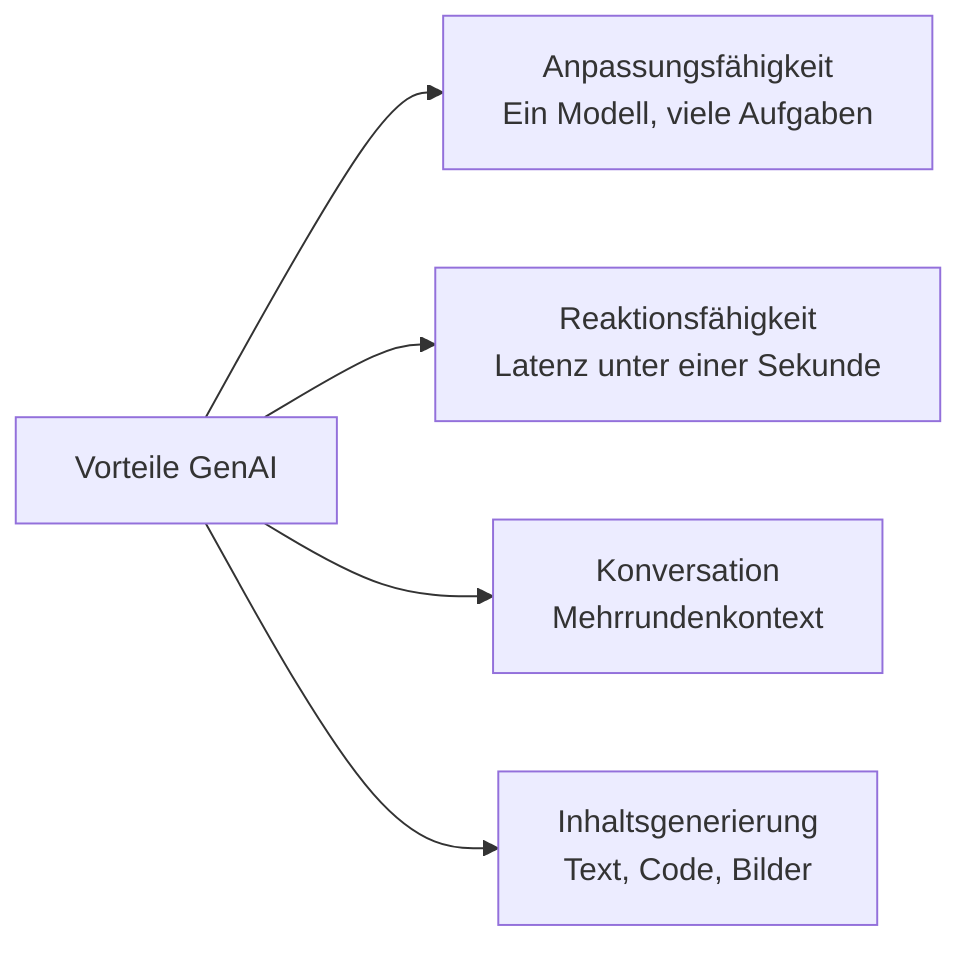
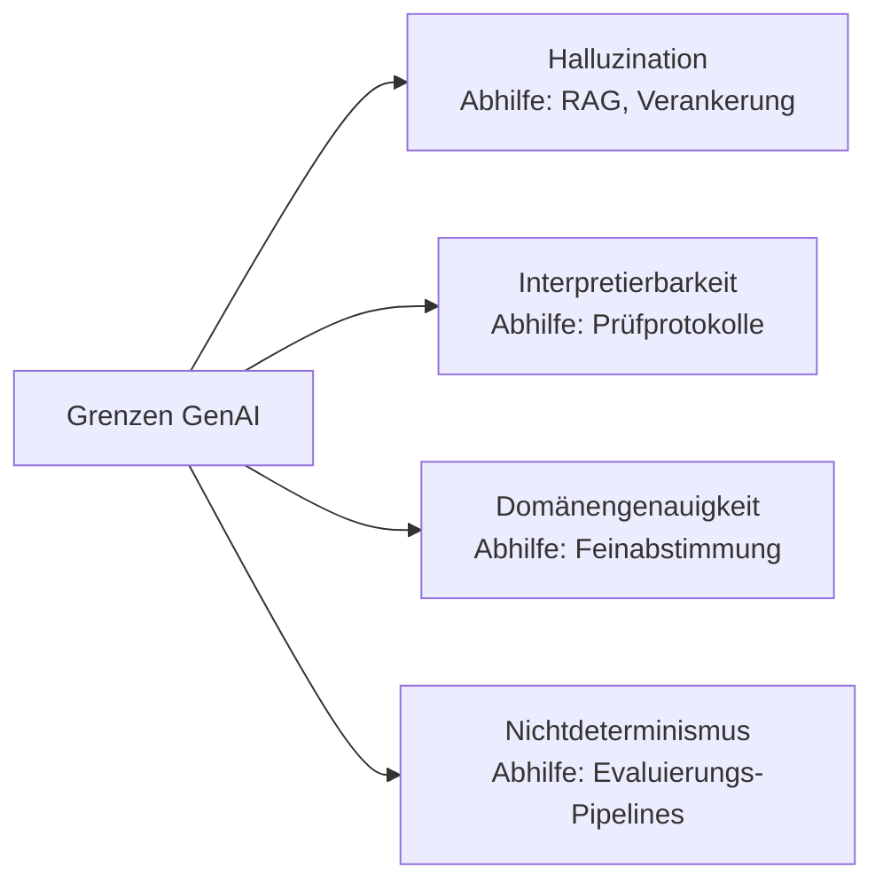
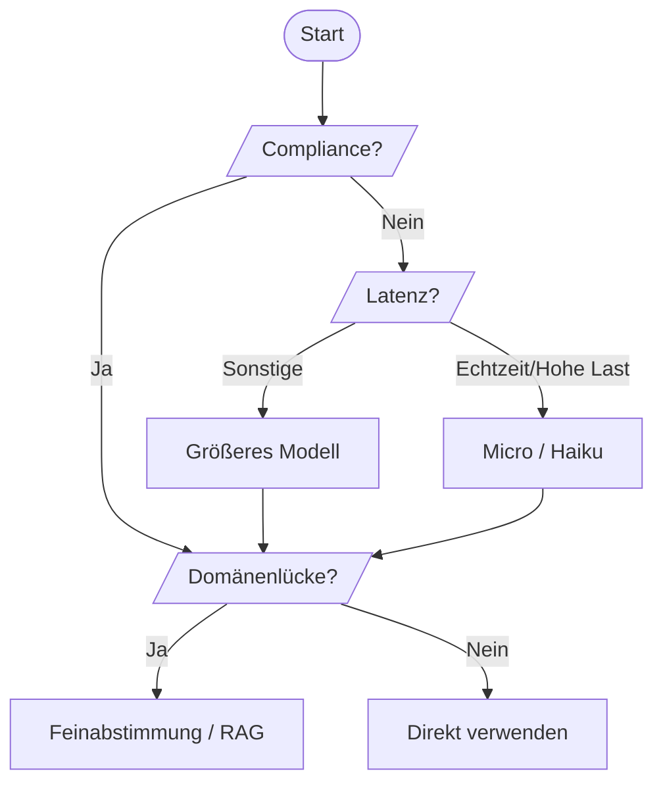
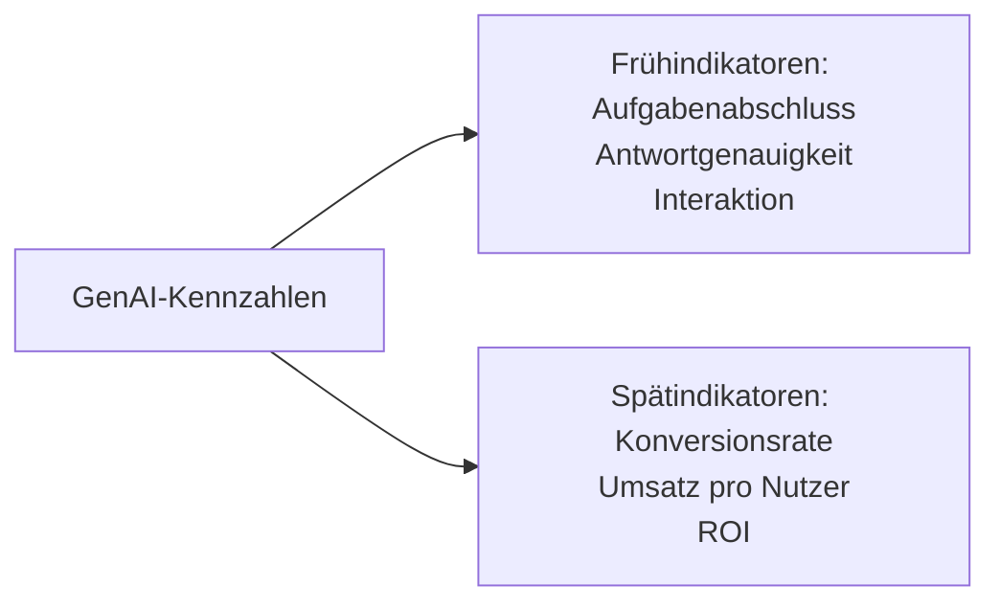

## Aufgabenstellung 2.2: Fähigkeiten und Grenzen der Generativen KI beim Lösen von Geschäftsproblemen

Generative KI kann Inhalte erstellen, ausgedehnte Gespräche führen und sich an Aufgaben anpassen, mit denen Systeme des klassischen Maschinellen Lernens (ML) ohne vollständiges Neutraining nicht umgehen können. Gleichzeitig halluziniert sie mit scheinbarer Autorität, liefert zwischen zwei Durchläufen unterschiedliche Antworten und produziert in spezialisierten Fachgebieten, die im Trainingsdatensatz kaum vertreten waren, mitunter selbstsichere Fehlinformationen. Unternehmensprofis, die beide Seiten dieser Gleichung klar benennen können, treffen fundierte Entscheidungen: wann sie sich auf ein GenAI-Projekt einlassen, wann sie Schutzmaßnahmen einbauen und wann sie ein anderes Werkzeug wählen sollten. Diese Aufgabenstellung behandelt die Vorteile, die Einschränkungen, die Auswahlkriterien für Modelle sowie die Kennzahlen, die zur Bewertung des Geschäftswerts einer generativen Anwendung erforderlich sind.[^202001]

### 2.2.1 Vorteile der Generativen KI

Klassische ML-Modelle sind für eine einzige Aufgabe gebaut: Ein Betrugserkennungsmodell erkennt Betrug, ein Nachfrageprognosemodell prognostiziert die Nachfrage. Das Neutrainieren jedes Modells für eine neue Aufgabe erfordert Monate an Beschriftung, Training und Validierung. Generative KI durchbricht diese Einschränkung. Ein einziges Großes Sprachmodell (LLM) kann morgens Marketingtexte verfassen und nachmittags rechtliche Dokumente zusammenfassen, ohne jedes Neutraining, einfach durch eine andere Eingabeaufforderung. Dieser Wandel hat praktische Konsequenzen dafür, wie Organisationen ihre KI-Projekte personell aufstellen und wie schnell sie auf neue Geschäftsanforderungen reagieren können.

Das Prüfungsziel nennt vier Kernvorteile der Generativen KI: Anpassungsfähigkeit, Reaktionsfähigkeit, Konversationsfähigkeiten und die Fähigkeit zur Inhaltsgenerierung. Jeder Vorteil behebt eine andere Einschränkung früherer KI-Systeme und lässt sich in einen konkreten Geschäftsnutzen übersetzen.

*Abbildung 2.2.1: Vier Kernvorteile der Generativen KI. Jeder Vorteil entspricht einer Einschränkung des klassischen Maschinellen Lernens, die generative Modelle überwinden.*

**Anpassungsfähigkeit** bezeichnet die Fähigkeit eines einzelnen Basismodells (FM), eine breite Palette von Aufgaben ohne Neutraining zu bewältigen. Ein auf einem umfangreichen Textkorpus trainiertes Modell kann E-Mails entwerfen, Stimmungen klassifizieren, benannte Entitäten extrahieren, SQL-Abfragen generieren und Produktbeschreibungen erstellen, alles allein durch geänderte Eingabeaufforderungen. So kann beispielsweise ein Einzelhändler ein einziges **Amazon Bedrock**-Modell verwenden, um morgens Produktbeschreibungen für neue Artikel zu generieren, diese mittags ins Französische und Spanische zu übersetzen und abends Kundenbewertungen zusammenzufassen.[^202002] Die betrieblichen Einsparungen sind real: Statt für jede Aufgabe ein eigenes Spezialmodell zu pflegen, übernimmt ein einziger API-Inferenzendpunkt alle davon, und die Kenntnisse, die Prompt-Ingenieure für einen Anwendungsfall erwerben, lassen sich direkt auf andere übertragen.

**Reaktionsfähigkeit** bezeichnet die latenzarme Konversationsinteraktion, die generative Modelle ermöglichen. Klassische Batch-ML-Pipelines sind für Durchsatz optimiert, nicht für Geschwindigkeit; sie verarbeiten Tausende von Datensätzen, können aber pro Durchlauf Minuten benötigen. Generative APIs hingegen liefern Token im Streaming-Verfahren innerhalb von Hunderten von Millisekunden zurück, was schnell genug für interaktive Nutzererlebnisse ist.[^202003] Eine Kundenservice-Anwendung, die früher einen menschlichen Agenten zum Nachschlagen von Informationen benötigte, kann eine Frage in unter einer Sekunde beantworten. Ein Versicherungsunternehmen, das einen von Amazon Bedrock betriebenen Chatbot für Anfragen zu Policen einsetzt, kann eine vollständige Antwort auf eine Deckungsfrage in etwa derselben Zeit zurückgeben, die ein Mensch zum Eintippen einer Antwort braucht, ohne dass ein Mensch im Prozess involviert ist.

**Konversationsfähigkeiten** stehen für die Fähigkeit generativer Modelle, den Kontext über mehrere Gesprächsrunden hinweg aufrechtzuerhalten. Im Unterschied zu einem regelbasierten Chatbot, der die vorherige Nachricht nach jeder Antwort vergisst, bewahrt ein modernes Großes Sprachmodell den vollständigen Gesprächsverlauf in seinem *Kontextfenster* und kann natürlich darauf zurückgreifen.[^202004] Ein Nutzer kann fragen: "Wie lautet die Rückgaberichtlinie?", danach: "Was gilt, wenn ich es im Angebot gekauft habe?" und das Modell versteht, dass sich "es" auf das zuvor genannte Produkt bezieht. Diese Mehrrundenkoherenz ermöglicht den Aufbau von Support-Agenten, Verkaufsassistenten und internen Wissenswerkzeugen, die sich natürlich anfühlen. So kann beispielsweise eine Bank einen Mehrrundenassistenten für Kreditanfragen einsetzen, der über mehrere Gesprächsrunden hinweg den Beschäftigungstyp, den Kreditzweck und den Einkommensbereich des Antragstellers erfasst, bevor er geeignete Produkte vorstellt, ein Interaktionsmuster, das in einer traditionellen Regelmaschine eine komplexe Zustandsverwaltung erfordern würde.

**Inhaltsgenerierung** bedeutet, dass generative Modelle neuartige Ausgaben produzieren, anstatt lediglich vorhandene Inhalte zu klassifizieren oder abzurufen. Sie können einen Blog-Entwurf verfassen, aus einer Beschreibung eine Python-Funktion generieren, ein fotorealistisches Produktbild synthetisieren oder eine Kunden-E-Mail erstellen, die auf eine bestimmte Bestell-ID und Stimmung zugeschnitten ist.[^202005] Diese generative Eigenschaft ist es, die Basismodelle von Retrieval-Systemen unterscheidet. Eine Suchmaschine ruft bereits vorhandene Dokumente ab; ein generatives Modell erstellt ein neues. So kann beispielsweise ein Pharmaunternehmen aus strukturierten Studiendaten einen ersten Entwurf eines Zusammenfassungsberichts über eine klinische Studie generieren, sodass sich medizinische Redakteure auf die Überprüfung und Verfeinerung konzentrieren können, anstatt die Erstfassung selbst zu verfassen.

### 2.2.2 Nachteile von GenAI-Lösungen

Jedem Vorteil der Generativen KI steht eine Einschränkung gegenüber, die verstanden sein muss, bevor ein System für echte Nutzer bereitgestellt wird. Das Prüfungsziel nennt ausdrücklich vier Nachteile: Halluzinationen, Interpretierbarkeitsprobleme, Ungenauigkeiten in spezialisierten Fachgebieten und Nichtdeterminismus. Keiner dieser Punkte ist ein Grund, Generative KI zu meiden, aber jeder ist ein Grund, Gegenmaßnahmen in jede Produktionsanwendung einzuplanen.

*Abbildung 2.2.2: Vier Kerneinschränkungen der Generativen KI und der jeweilige Mitigationsansatz. Das Erkennen der Einschränkung führt direkt zur Auswahl der geeigneten Maßnahme.*

**Halluzinationen** sind das Phänomen, bei dem ein generatives Modell Ausgaben produziert, die flüssig und grammatikalisch korrekt, aber sachlich falsch, erfunden oder in keinem Quelldokument verankert sind.[^202006] Das Modell weiß nicht, dass es etwas nicht weiß; es generiert die statistisch wahrscheinlichste Fortsetzung der Eingabeaufforderung, die erfundene Namen, falsche Statistiken oder nicht existierende Zitate enthalten kann. Ein juristisches Recherchetool, das auf einem ungeführten generativen Modell basiert, kann beispielsweise eine Zitation zu einem Fall produzieren, der nicht existiert, und dabei denselben selbstsicheren Ton wie eine echte Zitation verwenden. Die primäre Gegenmaßnahme ist die *Retrieval-Augmented Generation (RAG)*, ein Muster, bei dem das Modell gezwungen ist, aus abgerufenen Dokumenten statt aus dem parametrischen Gedächtnis zu antworten.[^202007] Amazon Bedrock Knowledge Bases implementiert dieses Muster, indem es vor der Modellantwort relevante Abschnitte aus einem verbundenen Datenspeicher abruft und die Ausgabe so in überprüfbaren Dokumenten verankert. Weitere Maßnahmen umfassen **Amazon Bedrock Guardrails**, deren kontextuelle Verankerungsprüfung Antworten erkennen und blockieren kann, die nicht durch die abgerufenen Quelldokumente gestützt werden.[^202008]

**Interpretierbarkeitsprobleme** entstehen, weil große Sprachmodelle undurchsichtig sind. Es gibt keine einfache Möglichkeit nachzuverfolgen, welche Trainingsbeispiele eine bestimmte Ausgabe verursacht haben, oder menschenverständlich zu erklären, warum das Modell ein Wort gegenüber einem anderen gewählt hat.[^202009] Diese Undurchsichtigkeit schafft Probleme in regulierten Branchen. Das Kreditentscheidungssystem einer Bank muss bei der Ablehnung eines Darlehens einen Ablehnungsgrund angeben; ein generatives Black-Box-Modell kann diese Erklärung nicht in der von Regulatoren geforderten strukturierten Form liefern. Die Gegenmaßnahme besteht darin, Generative KI für Aufgaben vorzubehalten, bei denen Interpretierbarkeit keine regulatorische Verpflichtung ist, oder eine Argumentationsschicht hinzuzufügen, die das Modell zwingt, seine Quellen zu zitieren. **Amazon SageMaker AI** und das breitere Erklärbarkeits-Toolset in AWS können Aufmerksamkeitsgewichte und Token-Attributionen sichtbar machen, aber diese bleiben unvollkommene Annäherungen statt echter kausaler Erklärungen.[^202010]

**Ungenauigkeit in spezialisierten Fachgebieten ohne Verankerung** ist eine von Halluzinationen zu unterscheidende Einschränkung. Ein Modell kann allgemeine Fakten zur Kardiologie korrekt abrufen, aber bei Fragen zu den klinischen Protokollen eines bestimmten Krankenhauses, zu Versicherungskodierungsregeln oder zu proprietären Arzneimittelwechselwirkungen versagen, weil diese Dokumente nie in seinem Trainingskorpus enthalten waren.[^202011] Die Gegenmaßnahme ist entweder eine Feinabstimmung (Anpassung der Modellgewichte an domänenspezifische Daten) oder RAG mit einer kuratierten domänenspezifischen Wissensbasis. Die Feinabstimmung über die Anpassungs-APIs von Amazon Bedrock kann Genauigkeitslücken bei eng definierten Aufgaben schließen, während eine gut strukturierte Wissensbasis eine breitere Informationsabfrage ohne den Zeit- und Kostenaufwand eines Neutrainings abdeckt.[^202012]

**Nichtdeterminismus** bedeutet, dass das Modell bei gleicher Eingabeaufforderung und sonst konstanten Bedingungen jedes Mal eine andere Antwort liefern kann. Diese Eigenschaft ergibt sich aus dem Sampling-Prozess in den meisten generativen Modellen: Das Modell wählt das nächste Token probabilistisch statt deterministisch aus, sodass zwei Durchläufe bereits nach wenigen Token divergieren können.[^202013] Ein Modell, das aufgefordert wird, dieselbe Kundenbeschwerde zweimal zusammenzufassen, kann beispielsweise in einer Antwort die Lieferverzögerung und in einer zweiten die Produktqualität betonen, beide sachlich richtig, aber nicht identisch. Der *Temperatur*-Parameter steuert, wie viel Zufälligkeit das Modell beim Sampling anwendet; eine niedrigere Temperatur erzeugt konsistentere, aber weniger kreative Ausgaben. Die Gegenmaßnahme für Nichtdeterminismus sind rigorose Evaluierungs-Pipelines, die Ausgaben über viele Stichproben hinweg vergleichen, sowie eine menschliche Überprüfung von Grenzfällen vor der Bereitstellung. Die Modellbewertungsfunktionen von Amazon Bedrock unterstützen automatisierte Bewertung über Test-Prompt-Mengen, um unerwartete Streuung zu erkennen.[^202014]

*Tabelle 2.2.1: Nachteile der Generativen KI, Grundursache, Geschäftsrisiko und primäre Gegenmaßnahme*

| Nachteil | Grundursache | Geschäftsrisiko | Primäre Gegenmaßnahme |
|---|---|---|---|
| Halluzinationen | Parametrische Generierung ohne Verankerung | Falschinformationen als Tatsache dargestellt | RAG, Amazon Bedrock Guardrails |
| Interpretierbarkeit | Undurchsichtige Gewichte des Neuronalen Netzes | Verstoß gegen regulatorische Anforderungen | Nur für nicht regulierte Aufgaben verwenden; Prüfprotokollierung |
| Domänenungenauigkeit | Fehlende Domänendaten im Trainingskorpus | Falsche Antworten in spezialisierten Arbeitsabläufen | Feinabstimmung, domänenspezifische Wissensbasen |
| Nichtdeterminismus | Probabilistisches Token-Sampling | Inkonsistente Ausgaben bei Compliance-Aufgaben | Evaluierungs-Pipelines, Temperaturabstimmung |

### 2.2.3 Auswahlkriterien für GenAI-Modelle

Die Auswahl eines Generative-KI-Modells für eine Geschäftsanwendung ist in erster Linie keine technische Entscheidung, sondern eine Abwägungsentscheidung. Verschiedene Modelle erzielen bei verschiedenen Aufgaben unterschiedliche Ergebnisse, haben unterschiedliche Kostenstrukturen, unterstützen unterschiedliche Kontextfenstergrößen und weisen unterschiedliche Compliance-Profile auf. Das Prüfungsziel erwartet, dass Sie acht Faktoren gegeneinander abwägen: Modelltypen, Leistungsanforderungen, Fähigkeiten, Einschränkungen, Compliance, Kosten, Latenz und Modellkomplexität. Das v1.1-Update hat Kosten, Latenz und Modellkomplexität ausdrücklich zum Ziel hinzugefügt, was der praktischen Realität Rechnung trägt, dass die meisten Produktionsentscheidungen ebenso stark durch Wirtschaftlichkeit und Geschwindigkeit wie durch Benchmark-Genauigkeit bestimmt werden.

**Amazon Bedrock** ist der primäre AWS-Dienst für den Zugriff auf Basismodelle von Drittanbietern und Amazon-eigene Basismodelle über eine einheitliche API, ohne Infrastrukturverwaltung.[^202015] Die über Bedrock verfügbaren Modelle decken eine breite Palette an Größe, Fähigkeit und Kosten ab, was es zum natürlichen Ankerpunkt für jede Modellauswahldiskussion macht.

*Tabelle 2.2.2: Beispielhafte Amazon Bedrock-Modelle nach Fähigkeitsstufe und Auswahlkriterien*

| Modellfamilie | Repräsentative Modelle | Stärken | Typische Latenz | Relative Kosten | Am besten geeignet für |
|---|---|---|---|---|---|
| Amazon Nova | Nova Micro, Nova Lite, Nova Pro, Nova Premier | Stärken bei AWS-nativen Aufgaben; mehrsprachig; multimodal (Pro/Premier) | Micro: sehr niedrig; Premier: mittel | Micro: niedrigste; Premier: mittel | Hochvolumen-Aufgaben mit niedrigen Kosten (Micro); multimodale Unternehmensanwendungen (Premier) |
| Anthropic Claude | Claude Haiku 4.x, Sonnet 4.x, Opus 4.x | Langes Kontextfenster (200K Standard, 1M mit Beta-Header für Opus und Sonnet); Reasoning; Instruktionsbefolgung | Haiku: niedrig; Opus: hoch | Haiku: niedrig; Opus: hoch | Kundensupport (Haiku); komplexe Analysen (Opus) |
| Meta Llama | Llama 4 Scout, Llama 4 Maverick | Offene Gewichte; anpassbar; erweiterte Kontextfenster (konfigurationsabhängig auf Bedrock; Modellkarten beachten) | Mittel | Niedrig bis mittel | Individuelle Feinabstimmung; Analyse langer Dokumente; kostenempfindliche Inferenz |
| Mistral AI | Mistral 7B, Mixtral 8x7B | Effizienter Mixture-of-Experts-Ansatz; Code-Aufgaben | Niedrig bis mittel | Niedrig | Code-Generierung; Entwickler-Tooling |

Die acht Faktoren aus dem Prüfungsziel wirken sich auf diese Modelllandschaft wie folgt aus:

**Modelltypen** bezieht sich auf die Architektur und die Modalität des Modells. Reine Textmodelle verarbeiten Sprachaufgaben; multimodale Modelle verarbeiten Kombinationen aus Text, Bildern, Video und Audio.[^202016] Eine Kundenservice-Anwendung, die nur Text verarbeitet, kann ein leichteres und günstigeres Textmodell verwenden. Eine Produktprüfungsanwendung, die Bilder zusammen mit Textbeschreibungen klassifiziert, benötigt ein multimodales Modell wie Amazon Nova Pro.

**Leistungsanforderungen** umfassen die Genauigkeits- und Qualitäts-Benchmarks, die ein Anwendungsfall erfordert. Ein Generator für Marketingtexte kann eine gewisse Qualitätsvarianz tolerieren. Ein Assistent für medizinische Kodierung hingegen muss eine hohe Genauigkeit aufrechterhalten, da Kodierungsfehler zur Ablehnung von Abrechnungen führen. Benchmark-Werte wie MMLU (Massive Multitask Language Understanding) und HumanEval geben einen Ausgangspunkt, aber das zuverlässigste Leistungssignal ist die Bewertung anhand des eigenen aufgabenspezifischen Testdatensatzes.[^202017]

**Fähigkeiten** bezieht sich auf spezifische Funktionen, die ein Modell haben muss: Tool-Nutzung (Function Calling), Code-Generierung, strukturierte Ausgabe (JSON-Modus) oder erweiterte Kontextfenster. Eine Anwendung, die während des Reasoning externe APIs aufrufen muss, benötigt beispielsweise ein Modell, das Function Calling unterstützt, was nicht alle Modelle implementieren.[^202018]

**Einschränkungen** umfassen organisatorische Grenzen, darunter Anforderungen an die Datenhaltung, Listen genehmigter Anbieter und Modellgrößenbeschränkungen für die Bereitstellung auf Endgeräten. Die Optionen für regionsübergreifende Inferenz und bereitgestellten Durchsatz von Amazon Bedrock ermöglichen es Architekten, innerhalb von Datenhaltungsanforderungen zu arbeiten und gleichzeitig die Verfügbarkeit sicherzustellen.[^202019]

**Compliance** umfasst regulatorische und branchenspezifische Anforderungen. Gesundheitsanwendungen, die HIPAA unterliegen, müssen Modelle verwenden, die innerhalb einer HIPAA-fähigen Dienstgrenze bereitgestellt werden. Finanzanwendungen können Einschränkungen beim Datenausgang haben, die bestimmte externe Modellanbieter ausschließen. AWS-Dienste mit Business-Associate-Agreement-Unterstützung (BAA) schränken die Liste der für Gesundheits-Anwendungsfälle geeigneten Modelle ein.[^202020]

**Kosten** sind in reifen Bereitstellungen zunehmend der ausschlaggebende Faktor. Token-basierte Preise bedeuten, dass die Kosten pro Inferenz mit der Kontextlänge steigen: längere Systemaufforderungen, Few-Shot-Beispiele und große abgerufene Abschnitte erhöhen allesamt die Token-Anzahl und damit die Rechnung.[^202021] Amazon Nova Micro ist für Textaufgaben mit hohem Volumen und niedrigen Kosten konzipiert, bei denen die Erschwinglichkeit die primäre Einschränkung ist. Bei einer Million API-Aufrufen pro Tag kann der Unterschied zwischen einem Modell der Micro-Stufe und einem der Premier-Stufe Zehntausende von Euro pro Monat ausmachen.

**Latenz** bestimmt, ob ein Modell für interaktive Echtzeit-Anwendungen geeignet ist. Ein Modell, das zwei Sekunden zum Antworten benötigt, ist für eine Batch-Dokumentenverarbeitungs-Pipeline akzeptabel, aber für ein Live-Kunden-Chat-Widget unakzeptabel, bei dem Nutzer Antworten innerhalb von wenigen Hundert Millisekunden erwarten.[^202022] Amazon Nova Micro zielt auf die niedrigste Latenzstufe in der Amazon Nova-Familie ab. Der bereitgestellte Durchsatz in Amazon Bedrock kann die Latenzschwankungen bei latenzempfindlichen Produktionslasten reduzieren.

**Modellkomplexität** bezieht sich auf die Parameteranzahl, die Architekturtiefe und die Größe des Kontextfensters, das ein Modell halten kann. Komplexere Modelle erzielen bei anspruchsvollen Aufgaben in der Regel bessere Ergebnisse, sind aber langsamer und pro Token teurer.[^202023] Ein Modell mit 7 Milliarden Parametern kann einfache Zusammenfassungsaufgaben ausreichend bewältigen, während ein Modell mit 200 Milliarden Parametern für mehrstufiges Reasoning über ein 100.000-Token-Rechtsdokument erforderlich sein kann. Die Komplexität an den tatsächlichen Schwierigkeitsgrad der Aufgabe anzupassen hält die Kosten beherrschbar, ohne Qualität einzubüßen.

*Abbildung 2.2.3: Ein Entscheidungsfluss für die GenAI-Modellauswahl. Compliance, Latenz, Volumen und Domänengenauigkeitslücken filtern die geeignete Modellmenge jeweils der Reihe nach; der gleiche Ablauf gilt unabhängig davon, ob das zugrunde liegende Modell Amazon Nova, Anthropic Claude, Meta Llama oder Mistral AI ist.*

### 2.2.4 Geschäftswert und Kennzahlen für GenAI-Anwendungen

Die Einführung von Generativer KI ist eine Geschäftsinvestition, und jede Investition muss anhand messbarer Ergebnisse bewertet werden. Das Prüfungsziel listet sieben Kennzahlen auf: domänenübergreifende Leistung, ROI, Effizienz, Konversionsrate, durchschnittlicher Umsatz pro Nutzer, Genauigkeit und Customer Lifetime Value. Diese Kennzahlen lassen sich in zwei natürliche Gruppen einteilen. *Frühindikatoren* sind bereits früh in einer Bereitstellung beobachtbar, oft innerhalb von Wochen: Aufgabenabschlussrate, Interaktionsvolumen, Antwortgenauigkeit auf Testdatensätzen. *Spätindikatoren* brauchen länger, da sie vom nachgelagerten Kundenverhalten abhängen: Umsatz pro Nutzer, Customer Lifetime Value, Abwanderungsrate. Ein ausgereiftes KI-Messprogramm verfolgt beide, indem es Frühindikatoren nutzt, um das System zu optimieren, bevor Spätindikatoren den Geschäftseffekt bestätigen.

*Abbildung 2.2.4: Früh- und Spätindikatoren für den Geschäftswert der Generativen KI. Frühindikatoren zeigen die Systemgesundheit an; Spätindikatoren bestätigen, dass sich die Systemgesundheit in finanzielle Ergebnisse übersetzt.*

**Domänenübergreifende Leistung** misst, wie gut ein generatives Modell die Qualität beibehält, wenn es in mehreren Geschäftsbereichen eingesetzt wird.[^202024] Ein Modell, das im Kundensupport hervorragend abschneidet, bei internen HR-Anfragen aber schlecht, benötigt möglicherweise separate Prompt-Strategien oder für jeden Bereich separat feinabgestimmte Varianten. Ein Logistikunternehmen, das ein einzelnes Basismodell für Sendungsverfolgung, Unterstützung bei Spediteurverhandlungen und Zolldokumentation testet, stellt beispielsweise fest, dass die domänenübergreifenden Genauigkeitswerte zeigen, welche Bereiche vor der vollständigen Bereitstellung zusätzliche Verankerung benötigen.

**ROI** (Return on Investment) quantifiziert den finanziellen Ertrag der Kosten für Aufbau und Betrieb einer generativen KI-Anwendung im Verhältnis zum generierten Wert.[^202025] Die Berechnung vergleicht betriebliche Einsparungen (weniger menschliche Agenten, schnellere Dokumentenverarbeitung, geringere Fehlerkorrekturkosten) und Umsatzzuwächse (höhere Konversion, neue Produktfunktionen) mit den Modell-Inferenzkosten, dem Entwicklungsaufwand und dem laufenden Bewertungsaufwand. Ein Contact-Center-Assistent, der 40 % der Tier-1-Anfragen an die Automatisierung abgibt, erzielt einen messbaren ROI, da jeder umgeleitete Anruf eine Einheit Arbeitskosten einspart. Der ROI wurde in v1.1 ausdrücklich zum Prüfungsziel hinzugefügt, was widerspiegelt, dass von Unternehmensstakeholdern erwartet wird, KI-Projekte mit derselben finanziellen Strenge zu bewerten, die sie bei jeder anderen Technologieinvestition anwenden.

**Effizienz** erfasst, wie viel schneller oder kostengünstiger ein Prozess mit Generativer KI im Vergleich zum Ausgangswert abläuft.[^202026] Effizienz-Kennzahlen umfassen die Zeit pro Aufgabe (wie lange ein Analyst mit KI-Unterstützung für ein Recherche-Briefing benötigt, verglichen mit ohne KI), den Durchsatz (wie viele Support-Tickets das System pro Stunde verarbeitet) und die Kosten pro Einheit (die Token-Kosten für das Generieren einer Produktbeschreibung im Vergleich zu den Arbeitskosten eines Texters für dieselbe). Ein Anwaltsbüro, das Generative KI für die Erstellung von Erstfassungen von Vertragszusammenfassungen einsetzt, reduziert beispielsweise die durchschnittliche Anwaltszeit pro Vertrag von 45 auf 8 Minuten, ein dokumentiertes Effizienzverhältnis, das die Plattformkosten rechtfertigt.

**Konversionsrate** misst den Prozentsatz der Interessenten oder Nutzer, die eine gewünschte Aktion ausführen, wie einen Kauf abschließen, einen Kreditantrag einreichen oder einen Servicetermin buchen.[^202027] Generative KI beeinflusst die Konversion, indem sie die Inhalte personalisiert, die Nutzer an entscheidenden Punkten sehen. Ein Empfehlungssystem, das für jeden Besucher personalisierten Werbetext generiert, anstatt allen dasselbe Banner anzuzeigen, kann die Konversionsraten messbar steigern. Eine E-Commerce-Plattform, die ein Amazon Bedrock-Modell verwendet, um dynamische Produktbeschreibungen zu generieren, die auf die Browsing-Historie eines Besuchers zugeschnitten sind, meldet beispielsweise eine höhere "In den Warenkorb"-Rate als die Kontrollgruppe mit statischen Beschreibungen.

**Durchschnittlicher Umsatz pro Nutzer (ARPU)** misst den Gesamtumsatz geteilt durch die Anzahl der aktiven Nutzer in einem Zeitraum.[^202028] Generative KI kann den ARPU steigern, indem sie Upselling-Möglichkeiten innerhalb eines Gesprächs aufzeigt (ein Chatbot, der erkennt, dass ein Nutzer nach einem Basisprodukt fragt, und auf natürliche Weise die Premium-Option erwähnt), indem sie das Verlassen des Dienstes reduziert oder indem sie personalisierte Angebote generiert, die individuellen Kaufmustern entsprechen. Ein Streaming-Dienst, der Generative KI zur Personalisierung von Inhaltsempfehlungen und zur Erstellung abonnentspezifischer E-Mail-Kampagnen einsetzt, meldet beispielsweise einen höheren ARPU in der Behandlungsgruppe gegenüber der Kontrollgruppe mit generischen Nachrichten.

**Genauigkeit** bedeutet im Geschäftskontext den Anteil der GenAI-Ausgaben, die korrekt und vollständig genug sind, um ohne menschliche Korrektur verwendet werden zu können.[^202029] Die Genauigkeit wird anhand eines beschrifteten Bewertungsdatensatzes gemessen, der spezifisch für die Aufgabe ist. Ein Modell, das 95 von 100 Testfragen korrekt beantwortet, hat eine Genauigkeit von 95 % auf diesem Testdatensatz. Genauigkeit ist die direkteste Qualitätskennzahl für Anwendungsfälle, bei denen Fehler Kosten verursachen, wie medizinische Kodierung, Finanz-Compliance-Berichte oder automatisierte Extraktion rechtlicher Klauseln. Die Modellbewertungsfunktionen von Amazon Bedrock ermöglichen es Teams, automatisierte Genauigkeitsbewertungen anhand aufgabenspezifischer Benchmark-Datensätze vor und nach Modell- oder Prompt-Änderungen durchzuführen.[^202030]

**Customer Lifetime Value (CLV)** ist der gesamte Nettoumsatz, den ein Unternehmen von einer Kundenbeziehung über ihre Dauer erwartet.[^202031] Generative KI beeinflusst den CLV, indem sie die Kundenbindung verbessert (Kunden, die besseren Support erhalten, bleiben länger), den Umfang der genutzten Dienste erweitert (ein personalisierter Assistent stellt Produkte vor, von denen der Kunde nicht wusste, dass sie existieren) und die Abwanderung durch proaktive Interaktion reduziert. CLV ist ein Spätindikator; er ist in der Regel erst nach Quartalen zu beobachten. Eine Finanzinstitution, die einen generativen KI-Beratungs-Chatbot einführt, sieht beispielsweise erste Genauigkeits- und Interaktionskennzahlen innerhalb von Wochen, aber die CLV-Verbesserung wird erst nach sechs bis zwölf Monaten sichtbar, wenn die KI-assistierte Kohorte eine geringere Abwanderung als die historische Ausgangsbasis zeigt.

*Tabelle 2.2.3: Geschäftskennzahlen für GenAI: Typ, Messansatz und Geschäftsbeispiel*

| Kennzahl | Indikatortyp | Messung | Geschäftsbeispiel |
|---|---|---|---|
| Domänenübergreifende Leistung | Frühindikator | Genauigkeitspunktzahl pro Domäne auf zurückgehaltenen Testdatensätzen | Logistikmodell in drei Funktionsbereichen vor dem Rollout getestet |
| ROI | Spätindikator | (Kosteneinsparungen + Umsatzgewinn) / Gesamtinvestition | Contact-Center-Umleitungsrate multipliziert mit durchschnittlichen Arbeitskosten pro Ticket |
| Effizienz | Frühindikator | Zeit pro Aufgabe oder Kosten pro Einheit vor vs. nach KI-Einsatz | Vertragszusammenfassungszeit von 45 auf 8 Minuten reduziert |
| Konversionsrate | Spätindikator | Abgeschlossene Aktionen / Gesamtmöglichkeiten | Höhere "In den Warenkorb"-Rate für KI-generierte vs. statische Beschreibungen |
| Durchschnittlicher Umsatz pro Nutzer | Spätindikator | Gesamtumsatz / aktive Nutzer pro Zeitraum | ARPU-Steigerung des Streaming-Diensts durch personalisierte Kampagnen |
| Genauigkeit | Frühindikator | Korrekte Ausgaben / Gesamtausgaben im Bewertungsdatensatz | 95 % Genauigkeit auf einem 100-Fragen-Kodierungs-Benchmark |
| Customer Lifetime Value | Spätindikator | Projizierter Nettoumsatz über die Dauer der Beziehung | Geringere Abwanderung in der KI-assistierten Kohorte nach 12 Monaten |

Ein praktisches Messprogramm wartet nicht auf Spätindikatoren, bevor es handelt. Die Reihenfolge ist: Bereitstellung mit vom ersten Tag an instrumentierten Frühindikatoren, Anpassung des Modells und der Eingabeaufforderungen, bis die Frühindikatoren das Ziel erreichen, dann auf die Bestätigung durch Spätindikatoren warten, dass sich die betriebliche Verbesserung in finanziellen Wert umwandelt. **Amazon CloudWatch**-Metriken und benutzerdefinierte Dashboards in AWS können Inferenz-Latenz, Fehlerquoten und Modell-Aufrufzählungen als betriebliche Frühindikatoren verfolgen, während Business-Intelligence-Tools die nachgelagerten Umsatz- und Kundenbindungskennzahlen erfassen.[^202032]

---

## Selbstkontrollfragen

**Frage 1**

Ein Einzelhandelsunternehmen setzt einen generativen KI-Produktbeschreibungsgenerator ein. Bei der Qualitätsprüfung stellt das Team fest, dass das Modell gelegentlich Nährwertattribute für Lebensmittelprodukte erfindet, die nicht in den Quelldaten aufgeführt sind. Welcher Nachteil der Generativen KI beschreibt dieses Verhalten am BESTEN, und welche Gegenmaßnahme sollte das Team ZUERST implementieren?

A. Nichtdeterminismus; die Modelltemperatur senken, um die Ausgabestreuung zu reduzieren.
B. Halluzination; Retrieval-Augmented Generation implementieren, um Antworten im Produktkatalog zu verankern.
C. Interpretierbarkeit; Prüfprotokollierung hinzufügen, damit Prüfer nachvollziehen können, welche Trainingsdaten die Antwort beeinflusst haben.
D. Domänenungenauigkeit; das Modell auf einem kuratierten Lebensmittelprodukt-Datensatz feinabstimmen.

Halluzination ist das Phänomen, bei dem ein generatives Modell flüssige, selbstsichere Ausgaben produziert, die nicht in sachlichem Quellmaterial verankert sind. Der statistische Next-Token-Vorhersageprozess des Modells kann plausibel klingende Nährwertangaben produzieren, die nirgendwo im Produktkatalog auftauchen. Dies unterscheidet sich von der Domänenungenauigkeit (bei der ein Mangel an Fachwissen im Trainingskorpus besteht), weil das Modell nicht nur uninformiert ist, sondern aktiv Inhalte erfindet. Die Temperatursenkung (Antwort A) reduziert die Varianz im Ausgabestil, verhindert aber nicht, dass das Modell Fakten erfindet. Interpretierbarkeits-Tools (Antwort C) helfen dabei, Ausgaben nachzuverfolgen, stoppen aber keine Halluzinationen. Feinabstimmung (Antwort D) passt die Modellgewichte an und kann bei Domänenungenauigkeit helfen, aber für ein katalogspezifisches Faktenverankerungsproblem ist RAG schneller zu implementieren und zielgerichteter: Das Modell wird darauf beschränkt, Antworten aus abgerufenen Produktdatensätzen statt aus dem parametrischen Gedächtnis zu generieren. Amazon Bedrock Knowledge Bases bietet eine verwaltete RAG-Implementierung, die das Modell mit einem durchsuchbaren Produktkatalog verbindet und sicherstellt, dass jedes Attribut in der generierten Beschreibung auf ein Quelldokument zurückverfolgt werden kann.[^202033]

**Frage 2**

Ein Unternehmen wählt zwischen Amazon Nova Micro und Amazon Nova Premier für einen Kundensupport-Chatbot mit hohem Volumen, der innerhalb von 500 Millisekunden antworten muss und etwa zwei Millionen Interaktionen pro Tag verarbeitet. Welcher Faktor spricht DIREKT am stärksten für die Empfehlung, Nova Micro gegenüber Nova Premier für diese Arbeitslast zu wählen?

A. Compliance-Anforderungen schränken die Verwendung größerer Modelle in kundenseitigen Anwendungen ein.
B. Nova Premier hat ein kleineres Kontextfenster und kann keinen Mehrrundengesprächsverlauf halten.
C. Latenz und Kosten machen Nova Micro zur geeigneten Wahl für Lasten mit hohem Volumen, Latenzempfindlichkeit und Kostenempfindlichkeit.
D. Nova Micro unterstützt multimodale Eingaben und ist daher besser für Chat-Anwendungen geeignet.

Die Frage beschreibt eine Arbeitslast, bei der zwei Einschränkungen hervorstechen: eine Latenzgrenze von 500 Millisekunden und ein Volumen von zwei Millionen täglichen Interaktionen. Beide Einschränkungen weisen in dieselbe Richtung. Nova Micro ist als Stufe mit der niedrigsten Latenz und den niedrigsten Kosten in der Amazon Nova-Familie positioniert und genau für Aufgaben mit hohem Volumen konzipiert, bei denen Erschwinglichkeit und Geschwindigkeit die primären Anforderungen sind. Nova Premier ist die fähigste, aber auch teuerste und höchstlatente Option in der Familie, geeignet für komplexe mehrstufige Reasoning-Aufgaben statt für Konversationssupport mit hohem Volumen. Antwort A führt eine Compliance-Begründung ein, die im Szenario nicht genannt wird. Antwort B ist in beiden Punkten sachlich falsch: Nova Premier hat ein größeres Kontextfenster als Nova Micro, und jedes Bedrock-Modell kann Mehrrundengesprächsverlauf bis zu seiner Kontextfenstergrenze halten, sodass die Konversationsfähigkeit nicht stufenabhängig ist. Antwort D ist falsch, weil multimodale Eingaben eine Fähigkeit von Nova Pro und Nova Premier sind, nicht von Nova Micro. Die richtige Antwort ist C: Die Latenzanforderung (unter 500 ms) und das Volumen (zwei Millionen Aufrufe pro Tag) machen Kosten und Latenz zu den dominanten Modellauswahlfaktoren, und Nova Micro ist die Stufe, die für diese Kombination entwickelt wurde.[^202034]

**Frage 3**

Ein Unternehmens-KI-Team präsentiert einen Businessfall für eine generative KI-Dokumentenverarbeitungslösung. Der CFO fragt, wie das Team innerhalb der ersten 90 Tage nach der Bereitstellung finanziellen Wert nachweisen wird. Welche Kennzahl ist am BESTEN geeignet, um eine frühe finanzielle Wirkung nachzuweisen?

A. Customer Lifetime Value, gemessen als Veränderung des projizierten CLV für die Nutzerkohorte.
B. Effizienz, gemessen als Zeit pro Dokument und Kosten pro Dokument im Vergleich zum manuellen Ausgangswert.
C. Konversionsrate, gemessen als Prozentsatz der Dokumente, die einen Folgekauf auslösen.
D. Durchschnittlicher Umsatz pro Nutzer, gemessen über den ersten Abrechnungszyklus nach der Bereitstellung.

Customer Lifetime Value und durchschnittlicher Umsatz pro Nutzer sind Spätindikatoren, die typischerweise Monate bis Quartale der Beobachtung erfordern, bevor eine statistisch bedeutsame Veränderung sichtbar wird. In den ersten 90 Tagen werden weder diese Kennzahlen genügend Daten angesammelt haben, um eine vertretbare Schlussfolgerung zu ziehen. Die Konversionsrate ist eine plausible Kennzahl für eine vertriebsorientierte Anwendung, aber Dokumentenverarbeitung ist ein interner betrieblicher Arbeitsablauf und kein kundenseitiger Verkaufstrichter, was die Konversionsrate zu einem unpassenden Maßstab macht. Effizienz ist die natürliche 90-Tage-Kennzahl für ein Betriebsautomatisierungsprojekt: Das Team kann messen, wie lange Analysten ein Dokument vor Einführung des KI-Systems verarbeiteten, dieselbe Aufgabe mit KI-Unterstützung messen und die Zeiteinsparungen und Arbeitskostenreduktion unmittelbar nach dem Go-live berechnen. Der CFO erhält eine konkrete Zahl (z. B. "Die durchschnittliche Dokumentenverarbeitungszeit sank von 42 auf 9 Minuten, was bei der aktuellen Dokumentenmenge ca. 330 Analysestunden pro Woche einspart"), die sich direkt in Euro umrechnen lässt, ohne dass longitudinale Kundendaten erforderlich sind.[^202035]

**Frage 4**

Ein Healthcare-Technologieunternehmen bewertet generative KI-Modelle für einen klinischen Dokumentationsassistenten. Die Lösung muss innerhalb einer HIPAA-fähigen Dienstgrenze betrieben werden und muss für jede Aussage in einer generierten Zusammenfassung den Quellsatz aus der Patientenakte zitieren. Welche ZWEI Modellauswahlfaktoren sind für diese Bewertung am RELEVANTESTEN?

A. Modellkomplexität und Konversionsrate.
B. Compliance und Fähigkeiten.
C. Latenz und durchschnittlicher Umsatz pro Nutzer.
D. Kosten und domänenübergreifende Leistung.

Das Szenario stellt zwei unterschiedliche Anforderungen vor. Die erste ist regulatorisch: Die Lösung muss innerhalb von HIPAA-fähigen Grenzen betrieben werden, was ein Compliance-Faktor ist, der die Menge der geeigneten Modelle und Bereitstellungskonfigurationen direkt einschränkt. Nicht alle über Amazon Bedrock verfügbaren Modelle sind innerhalb einer HIPAA-fähigen Konfiguration zugänglich, daher ist Compliance ein K.O.-Kriterium, das vor der Bewertung aller anderen Faktoren gelöst sein muss. Die zweite Anforderung ist, dass das Modell Quellsätze zitieren muss, was eine Anforderung an die Fähigkeiten darstellt: Das Modell muss einen Zitierungs- oder Quellzuordnungsmechanismus unterstützen, entweder nativ über strukturierte Ausgabe oder über eine RAG-Architektur, die Quellenverweise zusammen mit dem generierten Text zurückgibt. Konversionsrate (Antwort A) und durchschnittlicher Umsatz pro Nutzer (Antwort C) sind Kennzahlen für Geschäftsergebnisse, keine Modellauswahlkriterien. Kosten und domänenübergreifende Leistung (Antwort D) sind bei jeder Bereitstellung relevant, aber nicht die RELEVANTESTEN Faktoren angesichts der im Szenario ausdrücklich genannten HIPAA- und Zitieranforderungen. Die richtige Antwort ist B.[^202036]

**Frage 5**

Ein Produktteam setzt einen generativen KI-Assistenten ein und stellt fest, dass dieselbe Supportfrage manchmal eine Antwort erhält, die einen Lösungsweg betont, und manchmal einen anderen Lösungsweg, obwohl beide Antworten technisch korrekt sind. Das Team möchte verstehen, welche Eigenschaft der Generativen KI dieses Verhalten am BESTEN erklärt, bevor es sich für eine Gegenmaßnahme entscheidet.

A. Halluzination, weil das Modell Inhalte generiert, die nicht in der Wissensbasis erscheinen.
B. Interpretierbarkeitsprobleme, weil das Modell nicht erklären kann, warum es einen Lösungsweg gegenüber einem anderen gewählt hat.
C. Nichtdeterminismus, weil das Modell bei jedem Schritt probabilistisch aus einer Verteilung wahrscheinlicher Next-Token sampelt.
D. Domänenungenauigkeit, weil das Modell nicht auf die spezifischen Supportszenarien trainiert wurde.

Das Szenario beschreibt eine Situation, in der beide Ausgaben technisch korrekt, aber unterschiedlich sind. Dies ist das definierende Merkmal des Nichtdeterminismus: Der Sampling-Prozess des Modells führt zu Variabilität zwischen Durchläufen, selbst wenn beide Ausgaben gültig sind. Halluzination (Antwort A) beinhaltet, dass das Modell sachlich falsche Inhalte generiert; das Szenario stellt ausdrücklich klar, dass beide Antworten korrekt sind. Interpretierbarkeit (Antwort B) betrifft die Unfähigkeit, Modellentscheidungen zu erklären, nicht die Ausgabevariabilität zwischen Durchläufen. Domänenungenauigkeit (Antwort D) würde sich als falsche oder unvollständige Antworten äußern, nicht als zwei verschiedene richtige Antworten. Die Gegenmaßnahme für Nichtdeterminismus in einem Supportkontext hängt von der Geschäftsanforderung ab. Wenn Konsistenz zwingend erforderlich ist (z. B. bei regulierter Finanzberatung), kann das Team den Temperaturparameter senken, um die Sampling-Streuung zu reduzieren, und eine Evaluierungs-Pipeline hinzufügen, die hochvariable Eingabeaufforderungen zur menschlichen Überprüfung markiert. Die Modell-Aufruf-Protokollierung von Amazon Bedrock erfasst jede Anfrage und Antwort, sodass das Team die Streuung über Durchläufe hinweg prüfen und identifizieren kann, welche Fragetypen die divergentesten Ausgaben produzieren.[^202037]

---

[^202001]: AWS Certification Exam Guide AIF-C01 v1.1, Task Statement 2.2. URL: <https://docs.aws.amazon.com/aws-certification/latest/ai-practitioner-01/ai-practitioner-01-domain2.html>
[^202002]: Amazon Bedrock User Guide: Supported foundation models. URL: <https://docs.aws.amazon.com/bedrock/latest/userguide/models-supported.html>
[^202003]: Amazon Bedrock User Guide: Invoke a model to run inference. URL: <https://docs.aws.amazon.com/bedrock/latest/userguide/inference.html>
[^202004]: Amazon Bedrock User Guide: Conversation history and context windows. URL: <https://docs.aws.amazon.com/bedrock/latest/userguide/conversation-inference.html>
[^202005]: Amazon Bedrock User Guide: Content generation with foundation models. URL: <https://docs.aws.amazon.com/bedrock/latest/userguide/what-is-bedrock.html>
[^202006]: NIST AI 600-1: Artificial Intelligence Risk Management Framework: Generative AI. URL: <https://nvlpubs.nist.gov/nistpubs/ai/nist.ai.600-1.pdf>
[^202007]: Amazon Bedrock User Guide: Knowledge Bases for Amazon Bedrock. URL: <https://docs.aws.amazon.com/bedrock/latest/userguide/knowledge-base.html>
[^202008]: Amazon Bedrock User Guide: Amazon Bedrock Guardrails. URL: <https://docs.aws.amazon.com/bedrock/latest/userguide/guardrails.html>
[^202009]: AWS Machine Learning Blog: Explainability in large language models. URL: <https://aws.amazon.com/blogs/machine-learning/>
[^202010]: Amazon SageMaker AI Developer Guide: Amazon SageMaker Clarify. URL: <https://docs.aws.amazon.com/sagemaker/latest/dg/clarify-model-explainability.html>
[^202011]: Amazon Bedrock User Guide: Custom model fine-tuning. URL: <https://docs.aws.amazon.com/bedrock/latest/userguide/custom-models.html>
[^202012]: Amazon Bedrock User Guide: Fine-tuning and continued pre-training. URL: <https://docs.aws.amazon.com/bedrock/latest/userguide/custom-models.html>
[^202013]: Hugging Face Documentation: Text generation and sampling strategies. URL: <https://huggingface.co/docs/transformers/generation_strategies>
[^202014]: Amazon Bedrock User Guide: Model evaluation in Amazon Bedrock. URL: <https://docs.aws.amazon.com/bedrock/latest/userguide/model-evaluation.html>
[^202015]: Amazon Bedrock User Guide: What is Amazon Bedrock? URL: <https://docs.aws.amazon.com/bedrock/latest/userguide/what-is-bedrock.html>
[^202016]: Amazon Nova User Guide: Amazon Nova model capabilities. URL: <https://docs.aws.amazon.com/nova/latest/userguide/what-is-nova.html>
[^202017]: Papers With Code: MMLU Benchmark. URL: <https://paperswithcode.com/dataset/mmlu>
[^202018]: Amazon Bedrock User Guide: Tool use (function calling) with Amazon Bedrock. URL: <https://docs.aws.amazon.com/bedrock/latest/userguide/tool-use.html>
[^202019]: Amazon Bedrock User Guide: Cross-region inference. URL: <https://docs.aws.amazon.com/bedrock/latest/userguide/inference-profiles-cross-region.html>
[^202020]: AWS Compliance: HIPAA Eligible Services. URL: <https://aws.amazon.com/compliance/hipaa-eligible-services-reference/>
[^202021]: Amazon Bedrock Pricing. URL: <https://aws.amazon.com/bedrock/pricing/>
[^202022]: Amazon Bedrock User Guide: Provisioned throughput. URL: <https://docs.aws.amazon.com/bedrock/latest/userguide/prov-throughput.html>
[^202023]: Amazon Nova User Guide: Choosing the right Amazon Nova model. URL: <https://docs.aws.amazon.com/nova/latest/userguide/nova-pro-overview.html>
[^202024]: AWS Well-Architected Framework: Machine Learning Lens: Performance pillar. URL: <https://docs.aws.amazon.com/wellarchitected/latest/machine-learning-lens/performance-pillar.html>
[^202025]: AWS Executive Insights: Measuring ROI for generative AI. URL: <https://aws.amazon.com/executive-insights/content/calculating-roi-of-generative-ai/>
[^202026]: McKinsey Global Institute: The economic potential of generative AI. URL: <https://www.mckinsey.com/capabilities/mckinsey-digital/our-insights/the-economic-potential-of-generative-ai>
[^202027]: Amazon Personalize Developer Guide: Measuring recommendation effectiveness. URL: <https://docs.aws.amazon.com/personalize/latest/dg/getting-started.html>
[^202028]: AWS Retail Competency: AI-driven personalization and ARPU. URL: <https://aws.amazon.com/retail/>
[^202029]: Amazon Bedrock User Guide: Evaluate model accuracy with model evaluations. URL: <https://docs.aws.amazon.com/bedrock/latest/userguide/model-evaluation.html>
[^202030]: Amazon Bedrock User Guide: Automated model evaluation jobs. URL: <https://docs.aws.amazon.com/bedrock/latest/userguide/model-evaluation-jobs.html>
[^202031]: AWS Customer Experience: Improving customer lifetime value with AI. URL: <https://aws.amazon.com/customer-engagement/>
[^202032]: Amazon CloudWatch User Guide: Metrics, alarms, and dashboards. URL: <https://docs.aws.amazon.com/AmazonCloudWatch/latest/monitoring/working_with_metrics.html>
[^202033]: Amazon Bedrock User Guide: Retrieval Augmented Generation with Knowledge Bases. URL: <https://docs.aws.amazon.com/bedrock/latest/userguide/knowledge-base-overview.html>
[^202034]: Amazon Nova User Guide: Amazon Nova Micro model overview. URL: <https://docs.aws.amazon.com/nova/latest/userguide/nova-micro-overview.html>
[^202035]: AWS Well-Architected Framework: Operational Excellence pillar: measuring improvement. URL: <https://docs.aws.amazon.com/wellarchitected/latest/operational-excellence-pillar/welcome.html>
[^202036]: AWS Compliance: HIPAA and Health Information Portability. URL: <https://aws.amazon.com/compliance/hipaa-compliance/>
[^202037]: Amazon Bedrock User Guide: Model invocation logging. URL: <https://docs.aws.amazon.com/bedrock/latest/userguide/model-invocation-logging.html>
