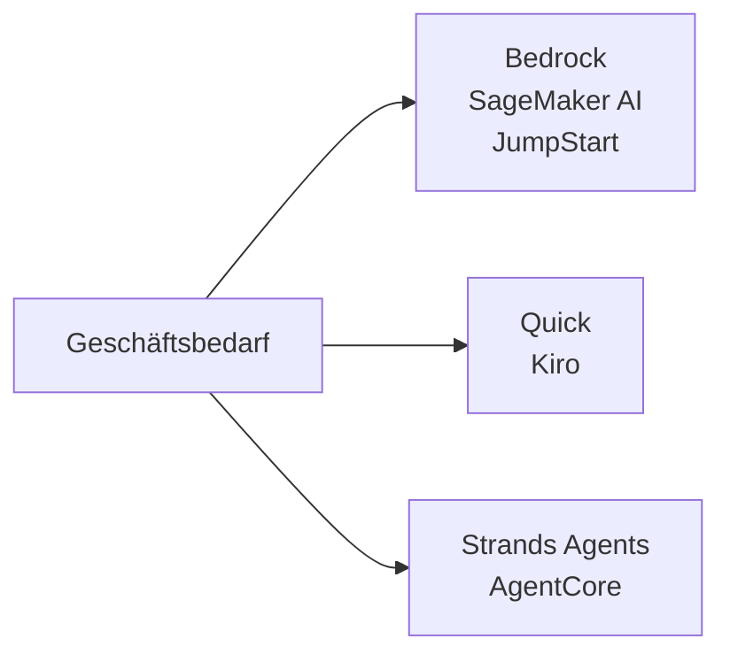
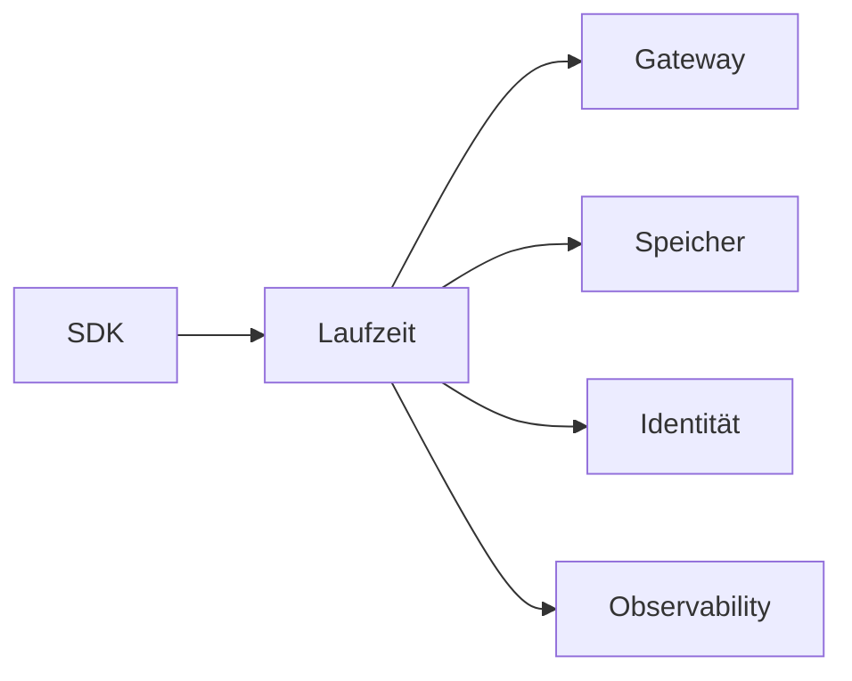
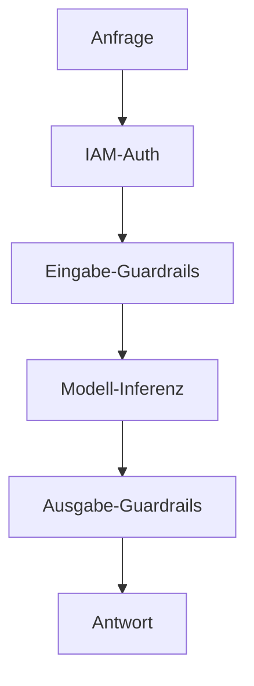
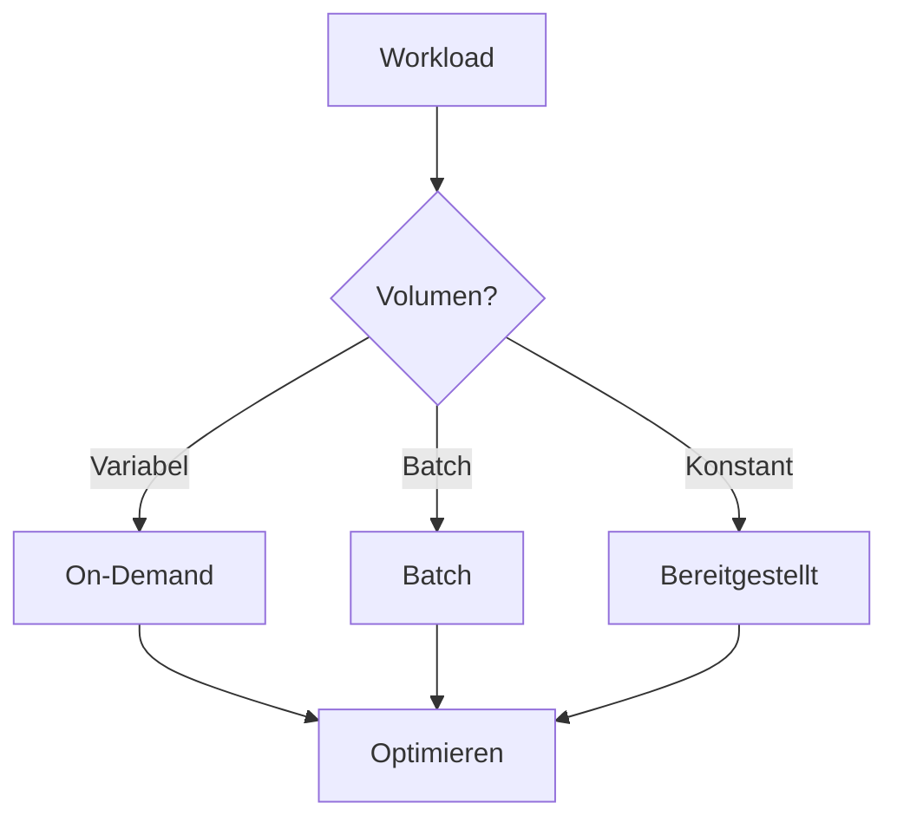
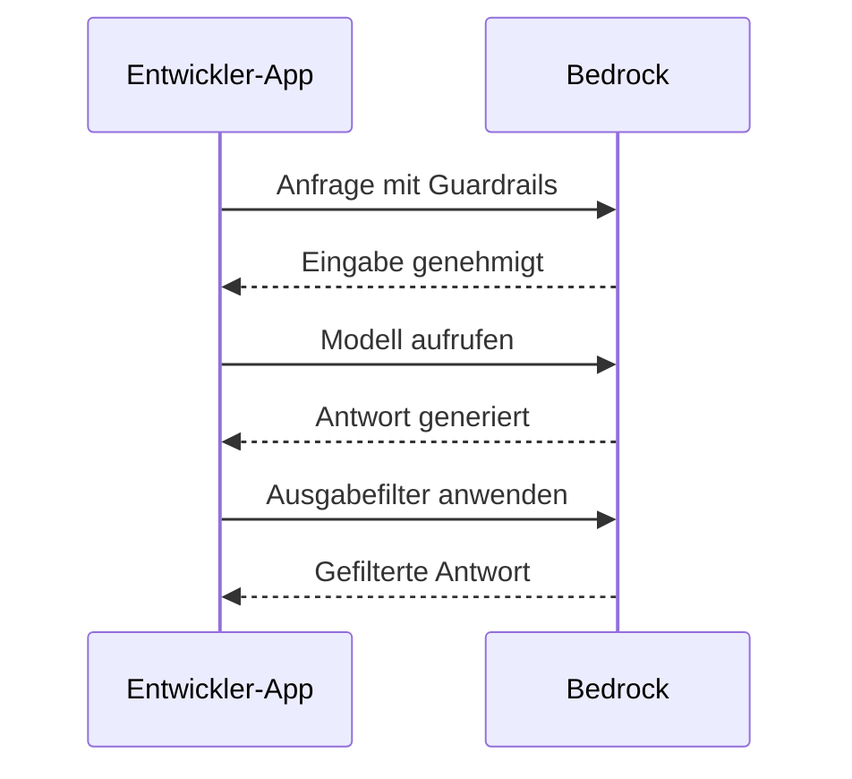

## Aufgabenstellung 2.3: AWS-Infrastruktur und -Technologien für GenAI-Anwendungen

Der Aufbau einer Generative-KI-Anwendung auf AWS erfordert die Auswahl aus einer wachsenden Palette verwalteter Dienste und Entwicklerwerkzeuge, die jeweils an einem anderen Punkt im Entwicklungsspektrum ansetzen. Aufgabenstellung 2.3 umfasst vier Ziele: die im Prüfungsleitfaden v1.1 genannten AWS-Dienste, die Vorteile ihrer Nutzung, die Sicherheits- und Compliance-Eigenschaften, die sie von AWS erben, sowie die Kostenentscheidungen, vor denen Teams im Produktionsbetrieb stehen.[^203001]

*Abbildung 2.3.1: Drei Einstiegspunkte für GenAI-Arbeit auf AWS. Die Bedrock- und SageMaker-Familie deckt verwaltete Modell-APIs und benutzerdefiniertes Training ab, Quick und Kiro decken Unternehmens- und Entwicklerassistenten ab, und Strands Agents sowie AgentCore decken Agenten-Frameworks und Laufzeitumgebungen ab.*

Die Dienste in dieser Aufgabenstellung konkurrieren nicht in einer einzigen Dimension miteinander. Ein Team könnte **Amazon Bedrock** als Modell-API nutzen, die Anwendung über **Amazon Bedrock AgentCore** bereitstellen, Entwicklungsarbeit innerhalb von **Kiro** automatisieren und Unternehmensdaten über **Amazon Quick** abfragen, alles im selben Projekt. Die folgenden Abschnitte erläutern jeden Dienst, die kombinierten Vorteile der AWS-Plattform, die zugrunde liegende Sicherheits- und Compliance-Infrastruktur sowie die Preismechanismen, die die Gesamtbetriebskosten bestimmen.

### 2.3.1 AWS-Dienste und -Funktionen für GenAI-Anwendungen

Der AWS-Prüfungsleitfaden v1.1 nennt sieben Dienste und Werkzeugfamilien für den Aufbau von Generative-KI-Anwendungen: Amazon Bedrock, Amazon SageMaker AI, Amazon SageMaker JumpStart, Amazon Quick, Kiro, Strands Agents und Amazon Bedrock AgentCore.[^203002] Jeder besetzt eine spezifische Nische, und das Verständnis der jeweiligen Einordnung verhindert sowohl übermäßige Komplexität als auch eine Unterinvestition in Plattformfähigkeiten.

**Amazon Bedrock** ist ein vollständig verwalteter Dienst, der API-Zugang zu einem kuratierten Katalog von Basismodellen (FM) verschiedener Anbieter bereitstellt, ohne dass GPU-Infrastruktur bereitgestellt oder verwaltet werden muss.[^203003] Ein Team ruft einen einzigen Inferenzendpunkt auf, gibt die Modellkennung an und erhält eine generierte Antwort, die tokenbasiert abgerechnet wird. Die zugrunde liegende Infrastruktur, die Modellgewichte und die Skalierungslogik sind für den Aufrufer vollständig unsichtbar.

Der über Amazon Bedrock verfügbare Modellkatalog umfasst Amazons eigene Modelle, externe Forschungslabore und Open-Weight-Optionen:

- Die **Amazon Nova**-Modelle (Nova Micro, Nova Lite, Nova Pro, Nova Premier) sind Amazons eigene Modellreihe und reichen von einer reinen Text-Tier mit niedriger Latenz bis hin zu einem multimodalen Flaggschiff, das Bilder, Video und Dokumente verarbeiten kann.[^203004]
- **Anthropic Claude** (die Claude-4.x-Generation: Haiku 4.x, Sonnet 4.x, Opus 4.x) glänzt bei Schlussfolgerungen, strukturierter Ausgabe und der Analyse langer Kontexte. Claude Opus und Sonnet unterstützen standardmäßig Kontextfenster von 200.000 Token und eine Million Token mit dem 1M-Kontext-Beta-Header.[^203005]
- **Meta Llama**-Modelle sind Open-Weight-Sprachmodelle, die für Textgenerierung, Programmierung und Dialogaufgaben geeignet sind.[^203006]
- **Mistral AI**-Modelle, einschließlich Mixtral, sind stark bei der Befolgung von Anweisungen und mehrsprachigen Aufgaben mit effizienter Token-Nutzung.[^203007]
- **AI21 Labs Jamba** zielt auf Unternehmens-Textgenerierung und die Verarbeitung langer Kontexte ab.[^203008]
- **Cohere Command**-Modelle sind für Retrieval, Klassifizierung und Unternehmenssuche optimiert.[^203009]
- **Stability AI**-Modelle übernehmen Bildgenerierungs- und multimodale Aufgaben.[^203010]

Über den reinen Modellzugang hinaus bündelt Amazon Bedrock eine Reihe von Funktionen für den Aufbau produktionsreifer Anwendungen. **Knowledge Bases for Amazon Bedrock** verwaltet die vollständige *Retrieval-Augmented-Generation (RAG)*-Pipeline: Aufnahme von Dokumenten aus Amazon S3 oder anderen Quellen, Segmentierung, Generierung von Einbettungsvektoren (Embeddings), Speicherung in einem verwalteten Vektorspeicher und Abruf relevanter Segmente zur Inferenzzeit.[^203011] **Amazon Bedrock Guardrails** wendet konfigurierbare Inhaltsrichtlinien auf den Eingabe-Prompt und die Modellausgabe an, filtert schädliche Kategorien, blockiert abgelehnte Themen, schwärzt *personenbezogene Daten (PbD)* und führt *kontextuelle Verankerungsprüfungen* durch, die Antworten mit dem Quellmaterial vergleichen, um Halluzinationen zu erkennen.[^203012] **Amazon Bedrock Prompt Management** speichert, versioniert und teilt Prompt-Vorlagen teamübergreifend, sodass dieselben optimierten Prompts einheitlich in der Produktion verwendet werden.[^203013] **Amazon Bedrock Model Evaluation** führt automatisierte und menschlich bewertete Benchmark-Aufgaben aus, die Modellantworten nach Genauigkeit, Robustheit, Toxizität und aufgabenspezifischen Metriken bewerten, damit Teams Modelle vor einer endgültigen Entscheidung vergleichen können.[^203014] **Agents for Amazon Bedrock** koordiniert mehrstufige agentische Workflows, indem das Modell externe APIs aufrufen, Knowledge Bases abfragen und AWS-Lambda-Funktionen als *Werkzeuge* innerhalb einer orchestrierten Sitzung ausführen kann.[^203015] **Amazon Bedrock Flows** bietet einen visuellen Workflow-Builder zum Verketten von Prompts und Teilagenten in strukturierte Pipelines, ohne Orchestrierungscode schreiben zu müssen.[^203016]

**Amazon SageMaker AI** ist die vollständige ML-Plattform von AWS für Teams, die ihre eigenen Modelle trainieren, feinabstimmen, bewerten und betreiben müssen.[^203017] Während Amazon Bedrock das Modell vollständig abstrahiert, legt Amazon SageMaker AI den gesamten Training- und Inferenz-Stack offen. Ein Data-Science-Team nutzt SageMaker AI, um verteilte Trainingsaufgaben auf GPU-Clustern auszuführen, Modelle in der SageMaker Model Registry zu registrieren, sie auf Echtzeit-Inferenzendpunkten bereitzustellen und die Datenabweichung im Produktionsbetrieb zu überwachen. Speziell für Generative KI ist SageMaker AI die bevorzugte Wahl, wenn ein Team ein Open-Weight-Basismodell mit proprietären Daten in großem Maßstab feinabstimmen muss oder wenn Anforderungen an Latenz und Inferenz-Durchsatz benutzerdefinierte Container-Deployments anstelle eines gemeinsamen API-Inferenzendpunkts erfordern.

**Amazon SageMaker JumpStart** ist eine Funktion von SageMaker AI, die den Einstieg durch einen Katalog vortrainierter Modelle, Lösungsvorlagen und Ein-Klick-Bereitstellungsaktionen beschleunigt.[^203018] Ein Fachmann kann Modelle von Hugging Face, TII (die Falcon-Reihe) und anderen Anbietern durchsuchen und ein ausgewähltes Modell mit wenigen Klicks oder einem einzigen API-Aufruf auf einem privaten SageMaker-Inferenzendpunkt bereitstellen, ohne Trainingscode schreiben zu müssen. JumpStart überbrückt die Lücke zwischen dem Komfort von Amazon Bedrock und der vollen Flexibilität benutzerdefinierter SageMaker-AI-Deployments: Das Modell läuft in der Infrastruktur des eigenen Kontos, man kontrolliert den Inferenzendpunkt und kann bei Bedarf weiter feinabstimmen.

**Amazon Quick** ist die einheitliche Unternehmensanalyse- und KI-Assistentenfamilie von AWS für Geschäftsanwender. Im Jahr 2025 bündelte AWS Amazon QuickSight und die BI-orientierten Teile von Amazon Q unter diesem einheitlichen Namen, wobei bestehende QuickSight-Kunden zum neuen Produkt migriert wurden.[^203019] Geschäftsanwender interagieren mit Amazon Quick über eine Sprachschnittstelle, um Data Warehouses abzufragen, Diagramme zu erstellen, SQL zu schreiben und Berichte zusammenzufassen, ohne Entwicklungsteams einbeziehen zu müssen. Amazon Quick ist in vier Stufen gegliedert: Free, Plus, Professional und Enterprise. Die Enterprise-Stufe integriert sich in Amazon-Q-Business-Indizes, sodass der Assistent sowohl in organisatorischen Wissensbasen (SharePoint, Confluence, S3 und weitere Konnektoren) als auch in tabellarischen Daten suchen kann. Für die Prüfung ist Amazon Quick die richtige Antwort auf Fragen zur Aktivierung von *Self-Service-BI*, das durch Generative KI für Geschäftsanwender, nicht für Entwickler, erweitert wird.

**Kiro** ist die KI-gestützte Softwareentwicklungsumgebung von AWS, die Ende 2025 allgemein verfügbar wurde.[^203020] Kiro ist ein Fork von Code OSS (der Open-Source-Basis von Visual Studio Code), der um einen agentischen KI-Assistenten erweitert wurde, der sich direkt in den Bearbeitungs-Workflow integriert. Es ersetzt Amazon Q Developer als primäres KI-Entwicklungswerkzeug im AWS-IDE-Ökosystem. Kiro ist in vier Stufen verfügbar: Free, Pro, Pro+ und Power, wobei höhere Stufen mehr enthaltene Agenten-Interaktionsstunden und Zugang zu leistungsfähigeren Basismodellen bieten. Das Unterscheidungsmerkmal von Kiro ist die *spezifikationsgetriebene Entwicklung*. Während die meisten KI-Coding-Assistenten die nächste Zeile während der Eingabe vorschlagen, fordert die spezifikationsgetriebene Entwicklung den Entwickler auf, zunächst das gesamte Feature zu beschreiben. Kiro erstellt dann ein strukturiertes Spezifikationsdokument (Anforderungen, Architektur, Implementierungsaufgaben) und bearbeitet mehrere Dateien, um es umzusetzen. Für die Prüfung ist Kiro die richtige Antwort auf Fragen zur KI-Unterstützung innerhalb einer Entwicklungsumgebung, nicht zur Bereitstellung oder dem Betrieb von KI-Modellen.

**Strands Agents** ist ein Open-Source-SDK von AWS für den Aufbau von KI-Agenten in Python und TypeScript.[^203021] Es folgt einem *modellgetriebenen Agenten*-Design: Man definiert eine Reihe von Werkzeugen (Python-Funktionen, die mit Typhinweisen annotiert sind), übergibt sie zusammen mit einer Systemaufforderung (System Prompt) an den Strands-Agenten, und das SDK übernimmt die Schleife aus Modellschlussfolgerung, Werkzeugauswahl, Werkzeugausführung und Ergebnissynthese. Strands Agents ist modellunabhängig und funktioniert mit Amazon Bedrock, lokalen Modellen und Drittanbieter-Modell-APIs.

Das Agenten-Angebot auf AWS umfasst drei ähnlich benannte und leicht zu verwechselnde Konzepte. Agents for Amazon Bedrock (auch Amazon Bedrock Agents genannt) ist die ursprüngliche Orchestrierungsfunktion in der Konsole. AgentCore ist die neuere, separat bereitstellbare Laufzeitumgebung für produktionsreife Agenten, die mit Bedrock Agents, Strands oder anderen Frameworks gebaut werden können. Strands Agents ist das Open-Source-SDK, das Entwickler verwenden, um den Agentencode zu schreiben. Für die Prüfung gilt: Strands Agents ist das Entwickler-SDK, Bedrock Agents ist die Orchestrierungsfunktion in der Konsole, und AgentCore ist die Produktions-Laufzeitschicht.

**Amazon Bedrock AgentCore** ist eine Produktions-Agenten-Bereitstellungsplattform, die AWS im Jahr 2025 einführte, um die Lücke zwischen dem Schreiben eines Agenten mit einem Framework wie Strands und dem zuverlässigen Betrieb dieses Agenten in Unternehmensmaßstab zu schließen.[^203022] AgentCore bündelt die Infrastrukturaspekte, die Teams sonst selbst aufbauen würden. Seine Komponenten umfassen:

- **AgentCore Runtime**: Eine verwaltete Ausführungsumgebung, die Agentencode ausführt, Auto Scaling übernimmt und den Sitzungslebenszyklus verwaltet.[^203023]
- **AgentCore Gateway**: Ein MCP-Server (*Model Context Protocol*), der Unternehmens-Werkzeuge und APIs über eine standardisierte Schnittstelle für Agenten bereitstellt und so die Notwendigkeit benutzerdefinierter Werkzeugintegrationen für jede Datenquelle beseitigt.[^203024] Das Model Context Protocol ist ein offener Standard, ursprünglich von Anthropic vorgeschlagen und inzwischen branchenweit übernommen, der es Agenten ermöglicht, sich ohne benutzerdefinierten Integrationscode mit Werkzeugen und Datenquellen zu verbinden.
- **AgentCore Memory**: Ein persistenter Speicher, der Gesprächsverläufe, Benutzerpräferenzen und gelernte Fakten sitzungsübergreifend bewahrt, sodass Agenten den Kontext zwischen Interaktionen erinnern können.[^203025]
- **AgentCore Identity**: Eine auf OAuth 2.0 basierende Authentifizierungsschicht, die es Agenten ermöglicht, sich im Namen von Benutzern bei Drittanbieter-Diensten zu authentifizieren, ohne langlebige Anmeldeinformationen im Agentencode zu speichern.[^203026]
- **AgentCore Policy**: Eine Governance-Schicht, die durchsetzt, welche Werkzeuge ein Agent unter welchen Bedingungen aufrufen und auf welche Daten er zugreifen darf, mit Unterstützung für Prüfpfade für regulierte Branchen.[^203027]
- **AgentCore Evaluations**: Ein automatisierter Test-Rahmen für Agenten-Workflows, der die Aufgabenabschlussrate, die Genauigkeit der Werkzeugauswahl und die Antwortqualität über Benchmark-Interaktionssätze misst.[^203028]
- **AgentCore Observability**: Verteiltes Tracing und Metriken für Agentensitzungen, die sich in Amazon CloudWatch integrieren, damit Operatoren Fehler in mehrstufigen Workflows diagnostizieren können.[^203029]
- **AgentCore Code Interpreter**: Eine isolierte Ausführungsumgebung, die es einem Agenten ermöglicht, zur Laufzeit generierten Python-Code auszuführen, was Datenanalyse, mathematische Berechnungen und dynamische Berichtserstellung ermöglicht.[^203030]
- **AgentCore Browser**: Ein verwalteter Headless-Browser, der einem Agenten ermöglicht, Webseiten zu navigieren, Inhalte zu extrahieren und programmgesteuert mit webbasierten Werkzeugen zu interagieren.[^203031]

*Tabelle 2.3.1: AWS-GenAI-Dienste und ihre primären Anwendungsfälle*

| Dienst | Primärer Nutzer | Kernfunktion | Typischer Anwendungsfall |
|---------|-----------------|--------------|--------------------------|
| Amazon Bedrock | Entwickler | Verwaltete FM-API mit RAG, Guardrails, Agents | Chatbots, Zusammenfassung, Dokument-Q&A |
| Amazon SageMaker AI | ML-Ingenieur | Vollständige Training- und Hosting-Plattform | Benutzerdefinierte Modell-Feinabstimmung, Batch-Inferenz |
| SageMaker JumpStart | Data Scientist | Ein-Klick-Bereitstellung vortrainierter Modelle | Schnelles Prototyping mit Open-Weight-Modellen |
| Amazon Quick | Business Analyst | Natürlichsprachliche BI und Datenabfragen | Self-Service-Analysen, Executive-Dashboards |
| Kiro | Softwareentwickler | Agentische IDE mit spezifikationsgetriebener Entwicklung | Code-Generierung, Mehrfachdatei-Refactoring |
| Strands Agents | Entwickler | Open-Source-Agenten-SDK (Python/TypeScript) | Benutzerdefinierte Agenten-Pipelines, Werkzeugkomposition |
| Amazon Bedrock AgentCore | Plattform-Team | Produktions-Agenten-Laufzeitumgebung und Werkzeuge | Unternehmens-Agenten-Deployment, MCP-Gateway |

Die Grenzen zwischen diesen Diensten sind für die Prüfung relevant. Amazon Bedrock ist die verwaltete Modell-API; Amazon Bedrock AgentCore ist die Produktions-Laufzeitumgebung für Agentenanwendungen. Kiro ist das IDE-Werkzeug; Strands Agents ist das Coding-Framework zum Schreiben von Agenten außerhalb der IDE. Amazon SageMaker AI ist die vollständige ML-Plattform; SageMaker JumpStart ist die zugehörige Modellkatalog-Abkürzung. Amazon Quick ist der auf Geschäftsanwender ausgerichtete Analyseassistent, kein Entwicklerwerkzeug.

*Abbildung 2.3.2: Architektur von Amazon Bedrock AgentCore. Ein mit Strands erstellter Agent wird in AgentCore Runtime bereitgestellt, das alle Produktionsinfrastrukturkomponenten koordiniert, einschließlich Werkzeugzugang, Speicher, Identität, Richtliniendurchsetzung und Observability.*

### 2.3.2 Vorteile der Nutzung von AWS-GenAI-Diensten für Anwendungen

Die sechs in Ziel 2.3.2 aufgeführten Vorteile sind keine Marketingaussagen: Jeder behandelt einen spezifischen Reibungspunkt, auf den Organisationen stoßen, wenn sie Generative KI außerhalb einer verwalteten Cloud-Plattform aufbauen.[^203032]

**Zugänglichkeit** bedeutet, dass jeder Entwickler mit einem AWS-Konto und IAM-Anmeldeinformationen innerhalb von Minuten ein Basismodell der Spitzenklasse über eine Standard-HTTPS-API aufrufen kann. Es gibt keinen Hardware-Beschaffungszyklus, keine CUDA-Treiberkonfiguration, keinen Modellgewicht-Download, der Hunderte von Gigabytes umfassen kann. Ein Team, das zuvor spezialisiertes ML-Infrastrukturpersonal benötigte, um ein neues Modell zu evaluieren, kann dies jetzt mit wenigen Codezeilen tun. Dadurch entfällt die Evaluierungshürde, die zuvor die KI-Einführung in Organisationen ohne dedizierte KI-Infrastrukturteams verlangsamte.

**Niedrigere Einstiegshürde** geht über Hardware hinaus. Mit Amazon Bedrock muss ein Entwickler keine Transformer-Architektur, Quantisierungsstrategien oder Aufmerksamkeitsmechanismen verstehen, um nützliche KI-gestützte Funktionen zu erstellen. Die verwaltete API akzeptiert einen einfachen Text-Prompt und gibt eine Textantwort zurück. Knowledge Bases for Amazon Bedrock beseitigt die Notwendigkeit, Vektordatenbanken oder Einbettungsvektor-Pipelines zu verstehen. Guardrails beseitigt die Notwendigkeit, Inhaltsmoderation von Grund auf zu entwickeln. Das Ergebnis ist, dass das Domänenwissen, das für die Erstellung einer produktionsreifen KI-Funktion erforderlich ist, Frontend- und Business-Logik-Kompetenz ist, keine ML-Engineering-Kompetenz.

**Effizienz** ergibt sich aus der Auto-Scaling-Architektur verwalteter Dienste. Ein einziger Amazon-Bedrock-API-Inferenzendpunkt verarbeitet eine Handvoll Anfragen pro Sekunde während eines nächtlichen Batch-Jobs und Hunderte von Anfragen pro Sekunde während der Geschäftsspitzenzeiten, ohne dass das Anwendungsteam Kapazitätsplanungsarbeiten durchführen muss. Dieselbe Eigenschaft gilt für Amazon-SageMaker-AI-Inferenzendpunkte mit Auto-Scaling-Richtlinien und für die Sitzungsverwaltung von AgentCore Runtime. Teams zahlen nicht für ungenutzte GPU-Kapazität zwischen den Spitzenzeiten.

**Kosteneffizienz** bei AWS-GenAI-Diensten folgt einem *Pay-per-Token*-Modell: Kosten entstehen nur, wenn die Inferenz tatsächlich ausgeführt wird, nicht wenn Modelle inaktiv sind. Dies steht im Gegensatz zum Selbst-Hosten eines Modells auf einer dedizierten GPU-Instanz, bei der die Instanz rund um die Uhr läuft und unabhängig vom Anfragevolumen Kosten verursacht. Bei Anwendungen mit niedrigem bis mittlerem Volumen ist das On-Demand-API-Modell durchgängig günstiger als dedizierte Infrastruktur, und die Schwelle, ab der dedizierte Infrastruktur günstiger wird, ist hoch genug, dass die meisten Unternehmensanwendungen sie nie erreichen.

**Markteinführungsgeschwindigkeit** ist der Gesamteffekt der vorherigen Punkte. Ein Team, das drei Modelle evaluiert, eines auswählt, eine RAG-Pipeline auf Knowledge Bases aufbaut, Guardrails für die Inhaltsrichtlinie hinzufügt und über AgentCore bereitstellt, kann alle diese Schritte in Tagen oder Wochen abschließen. Der äquivalente Aufbau auf selbstverwalteter Infrastruktur, einschließlich der Auswahl einer Vektordatenbank, der Bereitstellung von GPU-Instanzen, des Schreibens von Orchestrierungscode und des Aufbaus einer Inhaltsmoderationsschicht, dauert typischerweise Monate. Die Lücke ist beim anfänglichen Aufbau am größten und bleibt bei nachfolgenden Modell-Upgrades erheblich, weil der Austausch eines Modells gegen ein anderes in Amazon Bedrock nur eine Konfigurationsänderung erfordert, keine Infrastrukturmigration.

**Fähigkeit, Unternehmensziele zu erfüllen** bezieht sich auf die Service-Level-Eigenschaften verwalteter Infrastruktur: garantierte Betriebszeitverpflichtungen, die durch AWS-SLAs abgesichert sind, Compliance-Zertifizierungen, die Hindernisse für den Einsatz in regulierten Branchen beseitigen, und geografische Abdeckung, die es Anwendungen ermöglicht, Benutzer in den erforderlichen Regionen zu bedienen, ohne separate regionale Stacks aufzubauen. Eine Anwendung, die auf Amazon Bedrock aufgebaut ist, erbt die Verfügbarkeitsarchitektur von AWS und die Durchsatzgrenzen des Modells, die vorhersehbar genug sind, um in geschäftliche Fähigkeitsverpflichtungen eingeschrieben zu werden.

### 2.3.3 Vorteile der AWS-Infrastruktur für GenAI-Anwendungen

Die AWS-Infrastruktur liefert vier Kategorien von Vorteilen für GenAI-Anwendungen: Sicherheit, Compliance, Verantwortung und Unbedenklichkeit.[^203033] Diese Vorteile sind strukturelle Eigenschaften der Plattform, keine Funktionen, die separat für jede Anwendung aktiviert werden müssen.

**Sicherheit** im AWS-GenAI-Kontext basiert auf denselben Grundprinzipien wie der Rest der AWS-Plattform. An Amazon Bedrock gesendete Daten werden während der Übertragung mit TLS verschlüsselt und im Ruhezustand mit **AWS Key Management Service (AWS KMS)** verschlüsselt.[^203034] Kunden-Prompts und -Antworten werden niemals zum Training oder zur Verbesserung der zugrunde liegenden Basismodelle verwendet, was bedeutet, dass proprietäre Daten, die zur Inferenzzeit übergeben werden, privat für das Konto bleiben. Netzwerkisolierung ist über die Integration mit **Amazon VPC** verfügbar: Organisationen können Bedrock-API-Aufrufe über einen VPC-Endpunkt mit **AWS PrivateLink** leiten, wodurch sichergestellt wird, dass der Inferenzverkehr niemals das öffentliche Internet durchquert.[^203035] **AWS Identity and Access Management (IAM)** kontrolliert, welche Identitäten, Rollen und Dienste welche Modelle aufrufen dürfen, mit der Granularität spezifischer Modell-ARNs und spezifischer Bedrock-Aktionen wie `bedrock:InvokeModel` und `bedrock:InvokeAgent`.[^203036]

Speziell für Agentenanwendungen verwaltet Amazon Bedrock AgentCore Identity die delegierte Authentifizierung bei Drittanbieter-Diensten über OAuth-2.0-Token, die von der Plattform verwaltet werden, sodass Agentencode niemals unverschlüsselte Anmeldeinformationen für externe Systeme verarbeitet. Dies ist eine wesentliche Sicherheitsverbesserung gegenüber Agenten-Frameworks, bei denen Geheimnisse in Umgebungsvariablen oder Secrets-Managern gespeichert und manuell rotiert werden müssen.

**Compliance** wird auf Infrastrukturebene durch dasselbe AWS-Compliance-Programm adressiert, das alle anderen AWS-Dienste abdeckt. AWS Artifact bietet On-Demand-Zugang zu Drittanbieter-Prüfberichten, die SOC 1, SOC 2, PCI DSS, ISO 27001 und HIPAA abdecken.[^203037] **AWS Audit Manager** automatisiert die Beweiserhebung für kontinuierliche Compliance-Frameworks, und Amazon Bedrock liegt im Geltungsbereich der Governance-Leitplanken von AWS Control Tower, was bedeutet, dass Organisationen, die Control Tower nutzen, Service-Control-Richtlinien anwenden können, um einzuschränken, welche Konten welche Modelle verwenden dürfen.[^203038] Für EU-basierte Organisationen werden Datenspeicherungsanforderungen erfüllt, indem eine Bedrock-unterstützte Region innerhalb der EU-Grenze ausgewählt wird.

**Verantwortung** bezieht sich auf das gemeinsame Verantwortungsmodell von AWS, wie es auf verwaltete KI-Dienste angewendet wird. Bei Amazon Bedrock ist AWS für die Sicherheit der Modellgewichte, die zugrunde liegende GPU-Infrastruktur, die API-Inferenzendpunkte und die verwalteten Funktionen (Knowledge Bases, Guardrails, Agents) verantwortlich. Der Kunde ist für die gesendeten Prompts, die in Knowledge Bases gespeicherten Daten, die angewendete Guardrails-Konfiguration und die IAM-Richtlinien, die den Zugang kontrollieren, verantwortlich.[^203039] Diese Aufteilung ist für den Kunden günstiger als das Selbst-Hosten: Der Kunde behält die Kontrolle darüber, was das Modell sagt und an wen, ohne die Betriebslast der Hardware und Software, die das Modell ausführt, tragen zu müssen. AgentCore Policy erweitert das Verantwortungsmodell auf agentische Workflows: Operatoren erhalten damit formale Kontrolle darüber, welche Werkzeuge Agenten aufrufen dürfen, und menschenlesbare Richtlinien werden durchgesetzt, die unabhängig vom Agentencode geprüft werden können.

**Unbedenklichkeit** wird hauptsächlich durch Amazon Bedrock Guardrails durchgesetzt, das konfigurierbare Inhaltsrichtlinien auf der API-Schicht anwendet, bevor Antworten an die Anwendung zurückgegeben werden. Inhaltsfilterschwellenwerte sind pro Kategorie anpassbar (Hass, Beleidigungen, sexuelle Inhalte, Gewalt, Fehlverhalten, Prompt-Injektion). Die kontextuelle Verankerungsprüfung vergleicht jede Antwort mit den von Knowledge Bases abgerufenen Quelldokumenten und blockiert Antworten, die Fakten behaupten, die nicht durch die Quelle gestützt werden, wodurch das Risiko, dass halluzinierte Ausgaben Benutzer erreichen, direkt reduziert wird.[^203040] Da Guardrails auf der API-Schicht operiert, wird es unabhängig davon, welches zugrunde liegende Modell aufgerufen wird, einheitlich angewendet, einschließlich Modellen, die außerhalb von Amazon Bedrock über die modellübergreifende Kompatibilitätsschicht der Converse API gehostet werden.

*Abbildung 2.3.3: Sicherheits- und Unbedenklichkeitskontrollen in einer Amazon-Bedrock-Anfrage. Die Anfrage durchläuft IAM-Autorisierung, Eingabefilterung, Modell-Inferenz, Ausgabefilterung und Verankerungsüberprüfung, bevor sie an den Aufrufer zurückgegeben wird, mit Netzwerk- und Verschlüsselungskontrollen auf der API-Schicht.*

### 2.3.4 Kostenkompromisse bei AWS-GenAI-Diensten

Jede Kostenentscheidung für eine GenAI-Anwendung erfordert den Austausch einer wünschenswerten Eigenschaft gegen eine andere. Die Prüfung deckt acht spezifische Kompromiss-Dimensionen ab: Reaktionsfähigkeit, Verfügbarkeit, Redundanz, Leistung, regionale Abdeckung, tokenbasierte Preisgestaltung, bereitgestellter Durchsatz und benutzerdefinierte Modelle.[^203041]

**Reaktionsfähigkeit gegenüber Kosten** ist der grundlegendste Kompromiss. Kleinere, leichtere Modelle antworten schneller und kosten weniger Token pro Anfrage. Ein Modell der Nova-Micro-Stufe schließt eine einfache Textklassifizierungsaufgabe in Zehnermillisekunden ab und kostet einen Bruchteil eines Cents pro tausend Eingabe-Token. Ein größeres multimodales Flaggschiff-Modell liefert für komplexe Aufgaben reichhaltigere, genauere Ausgaben, braucht aber länger zum Antworten und kostet deutlich mehr pro Token. Die richtige Wahl hängt von der Aufgabe ab: Strukturierte Extraktion aus einem Formular profitiert von einem kleinen, schnellen Modell; die Analyse eines komplexen medizinischen Forschungsartikels profitiert von einem größeren Reasoning-Modell.

**Verfügbarkeit gegenüber Kosten** wird relevant, wenn eine Anwendung garantierte Betriebszeit bei Modellunterbrechungen erfordert. Amazon Bedrock enthält integriertes *regionsübergreifendes Inferenz*-Routing, das automatisch auf eine Replik des Modells in einer sekundären Region umschaltet, wenn die primäre Region ein Service-Ereignis erlebt.[^203042] Regionsübergreifende Inferenz verbessert die Verfügbarkeit, erhöht aber die Latenz für Benutzer, die weit von der sekundären Region entfernt sind, und kann Gebühren für regionsübergreifenden Datentransfer verursachen. Teams, die hohe Verfügbarkeit ohne Latenzkompromiss benötigen, müssen diese Kosten gegen die Wahrscheinlichkeit und Häufigkeit regionaler Unterbrechungen abwägen.

**Redundanz** im GenAI-Kontext gilt sowohl auf der Infrastrukturebene (Multi-AZ-Deployment, das Amazon Bedrock automatisch übernimmt) als auch auf der Modellebene (ein konfiguriertes Fallback-Modell, wenn ein primäres Modell Kontingentgrenzen erreicht oder vorübergehend nicht verfügbar ist). Die Pflege eines Fallback-Modells erhöht die Betriebskomplexität und kann Prompt-Anpassungen erfordern, wenn sich primäres und Fallback-Modell unterschiedlich verhalten, reduziert aber das Risiko einer vollständigen Dienstunterbrechung während Modellausfällen.

**Leistung gegenüber Kosten** interagiert mit der Modellauswahl in einer zweiten Dimension: der Kontextfenstergröße. Die Verarbeitung eines langen Dokuments erfordert entweder ein Modell mit einem großen Kontextfenster, das mehr pro Token kostet, oder eine Segmentierungsstrategie, die das Dokument aufteilt und stückweise verarbeitet, was weniger Token pro Segment kostet, aber zusätzliche Orchestrierungslogik erfordert und weniger kohärente Antworten erzeugen kann. Teams müssen die typischen Dokumentlängen und Abfragemuster quantifizieren, bevor sie sich für eine Modellstufe entscheiden.

**Regionale Abdeckung** ist eine praktische Einschränkung, die die Prüfung direkt testet: Nicht jedes Modell ist in jeder AWS-Region verfügbar.[^203043] Ein Team, das für europäische Benutzer entwickelt, stellt möglicherweise fest, dass ein bestimmtes bevorzugtes Modell nur in US-Regionen verfügbar ist, was entweder eine regionsübergreifende Inferenzanfrage (mit zusätzlicher Latenz und Datenspeicherungserwägungen) oder einen Wechsel zu einem alternativen Modell erfordert, das in der gewünschten Region verfügbar ist. Die regionale Verfügbarkeit erweitert sich mit der Zeit, wenn AWS neue Modellanbieter in zusätzliche Regionen einbindet, aber zu einem bestimmten Zeitpunkt variiert der verfügbare Modellkatalog je nach Region.

**Tokenbasierte Preisgestaltung** ist das Standardabrechnungsmodell für die On-Demand-Inferenz von Amazon Bedrock. Kosten entstehen separat für Eingabe-Token (der Prompt, der Systemkontext, abgerufene Knowledge-Base-Segmente) und Ausgabe-Token (die generierte Antwort). Eingabe- und Ausgabe-Token-Preise unterscheiden sich und variieren je nach Modell.[^203044] Ein Prompt, der eine große Systemnachricht und umfangreichen Knowledge-Base-Kontext enthält, akkumuliert erhebliche Eingabe-Token-Kosten auch für eine kurze Benutzerfrage. Die Optimierung von Prompts zur Reduzierung unnötigen Kontexts ist daher ein direkter Kostensenkungshebel, nicht nur eine Qualitätsüberlegung.

*Tabelle 2.3.2: Amazon-Bedrock-Preismodelle im Vergleich*

| Preismodell | Funktionsweise | Am besten geeignet für | Kosteneigenschaft |
|-------------|----------------|------------------------|-------------------|
| On-Demand | Zahlung pro Eingabe- und Ausgabe-Token, keine Verpflichtung | Variable oder unvorhersehbare Workloads | Höchste Token-Rate; keine Verschwendung bei Inaktivität |
| Batch-Inferenz | Batch-Job einreichen; bis zu 50 % Rabatt gegenüber On-Demand | Nicht zeitkritische Verarbeitung großer Datensätze | Niedrigere Rate; akzeptiert höhere Latenz |
| Bereitgestellter Durchsatz | Feste Token-pro-Minute-Kapazität für einen Zeitraum kaufen | Latenzempfindliche Produktions-Workloads mit hohem Volumen | Vorhersehbare Kosten; ungenutzte Kapazität wird weiterhin berechnet |
| Prompt-Zwischenspeicherung | Wiederholtes Kontextpräfix wird zwischengespeichert; zu reduziertem Satz abgerechnet | Anwendungen mit konsistenten System-Prompts | Große Einsparungen, wenn System-Prompts lang und häufig wiederverwendet werden |
| Benutzerdefinierte Modelleinheiten | Preisgestaltung pro Modelleinheit für feinabgestimmte Modelle auf bereitgestellter Kapazität | Benutzerdefinierte feinabgestimmte Modelle in der Produktion | Höhere Grundkosten; gerechtfertigt durch aufgabenspezifische Leistungsgewinne |

**Bereitgestellter Durchsatz** ist ein Verpflichtungskauf: Ein Team reserviert eine festgelegte Anzahl von Modelleinheiten für einen bestimmten Zeitraum und garantiert damit ein Mindest-Token-pro-Minute-Durchsatzniveau.[^203045] Bereitgestellter Durchsatz beseitigt das Drosselungsrisiko, dem On-Demand-Inferenz bei hohen Anfragraten ausgesetzt ist, was für kundenorientierte Anwendungen wichtig ist, bei denen Token-Limit-Fehler sichtbare Ausfälle erzeugen. Der Kompromiss besteht darin, dass ungenutzte Kapazität innerhalb eines Verpflichtungszeitraums weiterhin berechnet wird. Daher reduziert bereitgestellter Durchsatz die Gesamtkosten gegenüber On-Demand nur dann, wenn die tatsächliche Auslastung konsistent hoch ist. Teams führen in der Regel Preisvergleiche durch, bevor sie sich verpflichten.

**Benutzerdefinierte Modelle** führen eine von den Inferenzpreisen abweichende Kostenkategorie ein. Das Training eines feinabgestimmten Modells in Amazon Bedrock berechnet die während des Feinabstimmungsauftrags verwendete Rechenzeit, gemessen in *benutzerdefinierten Modelleinheiten*.[^203046] Die Bereitstellung eines feinabgestimmten Modells erfordert dann den Kauf von bereitgestelltem Durchsatz, da benutzerdefinierte Modelle nicht über den gemeinsamen On-Demand-Inferenzpool bedient werden können. Die Gesamtkosten einer benutzerdefinierten Modell-Bereitstellung umfassen daher Feinabstimmungsrechenzeit, bereitgestellten Durchsatz und laufende Wartung, wenn das Basismodell sich weiterentwickelt. Für die meisten Anwendungsfälle liefern Prompt-Engineering und RAG ausreichende Qualitätsverbesserungen ohne den Aufwand der Modellanpassung, und Investitionen in benutzerdefinierte Modelle sind nur dann gerechtfertigt, wenn die Aufgabe hochspezialisiert ist, das Volumen groß genug ist, um die Fixkosten zu amortisieren, und die Qualitätslücke zwischen einem mit Prompts gesteuerten Basismodell und einem feinabgestimmten Modell messbar und erheblich ist.

*Abbildung 2.3.4: Entscheidungsablauf zur Auswahl des Preismodells. Teams beginnen damit, ihr Volumenprofil zu charakterisieren, und arbeiten die Preismodelloptionen durch. Bei Überschreitung der Kostenziele kehren sie zu den Optimierungshebeln zurück.*

*Tabelle 2.3.3: Kostenkompromiss-Dimensionen für GenAI-Dienste*

| Kompromiss | Günstigere Option | Teurere Option | Was man aufgibt |
|------------|-------------------|----------------|-----------------|
| Reaktionsfähigkeit | Kleines, schnelles Modell | Großes, leistungsfähiges Modell | Ausgabequalität bei komplexen Aufgaben |
| Verfügbarkeit | Einfache Regions-Inferenz | Regionsübergreifende Inferenz | Verfügbarkeits-SLA bei regionalen Unterbrechungen |
| Redundanz | Kein Fallback-Modell | Konfiguriertes Fallback-Modell | Resilienz bei Modell-Kontingentereignissen |
| Leistung | Segmentierter Kontext mit kleinem Fenster | Modell mit großem Kontextfenster | Antwortkohärenz bei langen Dokumenten |
| Regionale Abdeckung | Regionsübergreifende Anfrage an verfügbare Region | Warten auf lokalen Regions-Support | Latenz und Datenspeicherungs-Compliance |
| Durchsatzgarantie | On-Demand (geteilter Pool, Drosselungsrisiko) | Bereitgestellter Durchsatz | Vorhersehbarkeit bei hoher gleichzeitiger Last |

*Tabelle 2.3.4: Wann SageMaker AI gegenüber Amazon Bedrock für generative Workloads einzusetzen ist*

| Faktor | Amazon Bedrock | Amazon SageMaker AI |
|--------|----------------|---------------------|
| Modellverantwortung | AWS verwaltet Modellgewichte | Man kontrolliert Gewichte und Container |
| Anpassungstiefe | Feinabstimmung über Bedrock-Konsole | Vollständiges Training, RLHF, benutzerdefinierte Container |
| Inferenzflexibilität | Verwaltete API; begrenzte Laufzeitkonfiguration | Benutzerdefinierter Inferenzcode, Batching-Strategien |
| Kosten bei niedrigem Volumen | Niedriger (Pay-per-Token, keine Inaktivitätskosten) | Höher (Instanzkosten auch bei geringer Auslastung) |
| Kosten bei hohem Volumen | On-Demand-Raten gelten; bereitgestellte Option verfügbar | Dedizierte Instanzen können bei dauerhaft hohem Durchsatz günstiger sein |
| Compliance-Kontrolle | AWS verwaltet die Basismodell-Compliance | Organisation kontrolliert den gesamten Stack |
| Zeit bis zur ersten Antwort | Minuten (API-Aufruf) | Tage bis Wochen (Training, Registrierung, Deployment) |

*Abbildung 2.3.5: Anfrage-Ablauf in einer produktiven Bedrock-Anwendung. Die Entwickleranwendung koordiniert Knowledge-Bases-Abruf, Guardrails-Filterung, Modellaufruf und Observability in Sequenz, wobei jeder Schritt Latenz und Kosten hinzufügt, die gegen die Qualitäts- und Unbedenklichkeitsvorteile abgewogen werden müssen.*

**Was dieser Abschnitt aufgebaut hat.** Diese Aufgabenstellung lieferte den Service-Katalog für AWS GenAI sowie die vier Betrachtungsebenen für den Vergleich: Fähigkeiten (Ziel 2.3.1), Plattformvorteile (2.3.2), Infrastruktureigenschaften (2.3.3) und Preiskompromisse (2.3.4). Die frühere Tabelle am Anfang von 2.3.1 trägt die Gedächtnislast für die genannten Dienste. Aufgabenstellung 2.3 schließt Domäne 2 ab. Domäne 3 knüpft daran an und untersucht eingehend, wie Basismodelle angewendet werden: Designüberlegungen für FM-Anwendungen, Prompt-Engineering-Techniken, Trainings- und Feinabstimmungsprozesse sowie Evaluierungsmethoden.

---

## Selbstkontrollfragen

1. Ein Einzelhandelsunternehmen möchte seinen Business-Analysten ermöglichen, in natürlicher Sprache Fragen zu Verkaufsdaten in Amazon Redshift zu stellen und automatisch Diagramme zu erstellen, ohne SQL zu schreiben oder das Datentechnik-Team einzubeziehen. Welcher AWS-Dienst ist für diese Anforderung am GEEIGNETSTEN?

    A. Amazon Bedrock mit Knowledge Bases, die mit Redshift verbunden sind  
    B. Amazon SageMaker JumpStart mit einem vortrainierten Text-zu-SQL-Modell  
    C. Amazon Quick mit dem Data Warehouse als verbundene Datenquelle  
    D. Strands Agents mit einem benutzerdefinierten SQL-Werkzeug in Python  

    Amazon Quick ist speziell für Geschäftsanwender konzipiert, die natürlichsprachlichen Zugang zu Data Warehouses und BI-Dashboards benötigen. Es verbindet sich nativ mit Amazon Redshift, übersetzt Fragen in natürlicher Sprache in SQL-Abfragen, führt sie aus und liefert Visualisierungen, ohne dass Analysten Code schreiben oder Ingenieure benutzerdefinierte Pipelines aufbauen müssen. Amazon Bedrock mit Knowledge Bases ist für Dokumentenretrieval und Q&A geeignet, nicht für die Generierung von Datenbankabfragen auf der BI-Ebene. SageMaker JumpStart stellt vortrainierte Modelle für die Bereitstellung bereit, enthält aber keine integrierte BI-Oberfläche. Strands Agents ist ein Entwickler-SDK, das erhebliche Eigenentwicklung erfordern würde, um das zu replizieren, was Amazon Quick sofort bereitstellt, und ist daher die falsche Wahl, wenn das Ziel die schnelle Befähigung nicht-technischer Benutzer ist.[^203047]

2. Ein Softwareentwicklungsteam übernimmt eine KI-gestützte IDE, die aus einer natürlichsprachlichen Feature-Beschreibung einen strukturierten Anforderungs- und Implementierungsplan generieren und diesen dann autonom über mehrere Dateien in der Codebasis umsetzen kann. Welches AWS-Werkzeug ist am BESTEN auf diesen Workflow ausgerichtet?

    A. Amazon Bedrock Agents  
    B. Kiro  
    C. Amazon SageMaker JumpStart  
    D. Amazon Bedrock Flows  

    Kiro ist die KI-gestützte Softwareentwicklungsumgebung von AWS, die auf Code OSS aufgebaut ist und speziell für *spezifikationsgetriebene Entwicklungs*-Workflows konzipiert wurde, bei denen der Entwickler ein Feature beschreibt, Kiro ein Spezifikationsdokument mit Anforderungen, Architektur und Implementierungsaufgaben generiert und diese Aufgaben dann autonom in der Codebasis ausführt. Es ist der Ersatz für Amazon Q Developer als primäres KI-gestütztes Entwicklungswerkzeug im AWS-IDE-Ökosystem. Amazon Bedrock Agents orchestriert mehrstufige KI-Workflows über APIs, ist aber kein IDE-Produkt. SageMaker JumpStart stellt vortrainierte ML-Modelle bereit und hat keinen Bezug zu Softwareentwicklungs-Workflows. Amazon Bedrock Flows erstellt Prompt-Verkettungs-Pipelines in der Bedrock-Konsole, keine Werkzeuge für die Entwicklungsumgebung.[^203048]

3. Eine Organisation setzt einen Generative-KI-Chatbot ein, der niemals spezifische Anlageprodukte empfehlen darf. Außerdem müssen alle Kontonummern, die in Benutzernachrichten erscheinen, vor der Übermittlung an das Modell geschwärzt werden. Welche Kombination von Amazon-Bedrock-Funktionen erfüllt BEIDE Anforderungen am BESTEN?

    A. Knowledge Bases mit einem gefilterten Dokumentkorpus plus Feinabstimmung auf konforme Gespräche  
    B. Guardrails mit konfigurierten abgelehnten Themen für Anlageempfehlungen plus Filter für sensible Informationen für personenbezogene Daten  
    C. Prompt Management mit compliance-fokussierten System-Prompts plus Model Evaluation zur Verhaltensüberprüfung  
    D. Bereitgestellter Durchsatz mit einer compliance-spezifischen Modelleinheit plus VPC-Endpunkt-Isolation  

    Amazon Bedrock Guardrails erfüllt beide Anforderungen direkt. Die Funktion für abgelehnte Themen ermöglicht es Operatoren, Themenkategorien zu definieren, mit denen das Modell nicht interagieren darf, einschließlich Anlageproduktempfehlungen, und Guardrails setzt diese Richtlinie bei jeder Anfrage durch, unabhängig davon, wie der Benutzer die Frage formuliert. Der Filter für sensible Informationen erkennt und schwärzt spezifizierte Muster personenbezogener Daten, einschließlich Kontonummern, aus Eingabe-Prompts, bevor sie das Modell erreichen. Feinabstimmung ändert das Modellverhalten während des Trainings, kann aber zur Inferenzzeit keine gleichermaßen deterministische Durchsetzung bieten. Prompt Management steuert die von Teams verwendeten Prompts, kann aber nicht verhindern, dass Benutzer unzulässige Fragen stellen. Bereitgestellter Durchsatz und VPC-Isolation betreffen Kapazität und Netzwerksicherheit, nicht Inhaltskontrolle.[^203049]

4. Die Generative-KI-Anwendung eines Unternehmens funktioniert bei geringen Anfragevolumina mit dem On-Demand-Preis von Amazon Bedrock gut, erlebt aber während der Geschäftsspitzenzeiten Drosselungsfehler, wenn Tausende von Anfragen pro Minute verarbeitet werden. Das Team möchte die Drosselung eliminieren und dabei die Kostenkontrolle beibehalten. Welches Preismodell sollte es einsetzen?

    A. Batch-Inferenz, da Anfragen in großen Mengen zu geringeren Kosten verarbeitet werden  
    B. Bereitgestellter Durchsatz, da er eine garantierte Token-pro-Minute-Kapazität reserviert  
    C. Benutzerdefiniertes Modell-Deployment auf dedizierten Instanzen, da es unbegrenzte Durchsatzkapazität bietet  
    D. Regionsübergreifende Inferenz, da sie Last auf mehrere Regionen verteilt  

    Bereitgestellter Durchsatz kauft eine reservierte Durchsatzkapazität, die in Modelleinheiten gemessen wird, wobei jede Einheit eine definierte Anzahl von Token pro Minute repräsentiert. Damit wird garantiert, dass Anfragen bis zur bereitgestellten Grenze niemals gedrosselt werden, was das Spitzenstunden-Problem direkt löst. Der Kompromiss besteht darin, dass ungenutzte Kapazität innerhalb des Verpflichtungszeitraums weiterhin berechnet wird, sodass das Team sicherstellen muss, dass die Auslastung im Spitzenbetrieb konsistent genug ist, um die Verpflichtung zu rechtfertigen. Batch-Inferenz löst ein anderes Problem: Sie verarbeitet große Mengen nicht zeitkritischer Arbeit asynchron, was Echtzeit-Drosselung für eine benutzerorientierte Anwendung nicht beseitigen würde. Benutzerdefiniertes Modell-Deployment bietet nicht automatisch unbegrenzten Durchsatz und führt zu zusätzlichen Kosten und Betriebskomplexität. Regionsübergreifende Inferenz betrifft regionale Verfügbarkeit, nicht Durchsatzgrenzen innerhalb einer Region.[^203050]

5. Ein reguliertes Finanzdienstleistungsunternehmen evaluiert Amazon Bedrock für ein kundenorientiertes Beratungswerkzeug. Das Sicherheitsteam muss bestätigen, dass Kunden-Prompts und -Antworten niemals das öffentliche Internet durchqueren und dass das Unternehmen die Kontrolle über die Verschlüsselungsschlüssel für Daten im Ruhezustand behält. Welche Kombination aus zwei AWS-Funktionen erfüllt diese Anforderungen?

    A. Amazon Bedrock Guardrails und Amazon Bedrock Model Evaluation  
    B. AWS-PrivateLink-VPC-Endpunkt für Amazon Bedrock und vom Kunden verwaltete AWS-Key-Management-Service-Schlüssel  
    C. IAM-ressourcenbasierte Richtlinien auf Bedrock-Modellen und Amazon Bedrock Prompt Management  
    D. Regionsübergreifende Inferenz von Amazon Bedrock und AWS-Artifact-Compliance-Berichte  

    AWS PrivateLink ermöglicht es Organisationen, einen VPC-Endpunkt für Amazon Bedrock zu erstellen, sodass der gesamte API-Verkehr zwischen der Anwendung und dem Bedrock-Dienst über das private AWS-Netzwerk-Backbone läuft und nicht das öffentliche Internet durchquert. Dies erfüllt die Netzwerkisolierungsanforderung. AWS Key Management Service mit vom Kunden verwalteten Schlüsseln (CMK) ermöglicht es dem Unternehmen, die Verschlüsselungsschlüssel zum Schutz von Daten im Ruhezustand in verwalteten Amazon-Bedrock-Funktionen, einschließlich Knowledge Bases und gespeicherter Prompts, zu besitzen und zu kontrollieren. Dies erfüllt die Anforderung an die Verschlüsselungskontrolle. Guardrails und Model Evaluation adressieren Inhaltssicherheit und -qualität, keine Netzwerk- oder Verschlüsselungskontrollen. IAM-Richtlinien steuern die Zugangsautorisierung, beeinflussen aber nicht das Netzwerk-Routing. Regionsübergreifende Inferenz und Artifact betreffen Verfügbarkeit bzw. Compliance-Berichterstattung.[^203051]

6. Ein Engineering-Team hat einen Kundensupport-Agenten mit Strands Agents erstellt. Der Agent muss sich im Namen jedes Benutzers beim CRM-System des Unternehmens authentifizieren, den Gesprächskontext zwischen Sitzungen speichern, damit wiederkehrende Benutzer sich nicht wiederholen müssen, und Python-Code dynamisch generieren, um Rückerstattungsbeträge zu berechnen. Welche drei Amazon-Bedrock-AgentCore-Komponenten adressieren diese spezifischen Anforderungen?

    A. AgentCore Gateway, AgentCore Evaluations und AgentCore Observability  
    B. AgentCore Identity, AgentCore Memory und AgentCore Code Interpreter  
    C. AgentCore Runtime, AgentCore Policy und AgentCore Browser  
    D. AgentCore Memory, AgentCore Gateway und AgentCore Code Interpreter  

    AgentCore Identity verwaltet die delegierte OAuth-2.0-Authentifizierung, sodass der Agent sich im Namen jedes Benutzers beim CRM des Unternehmens authentifizieren kann, ohne Anmeldeinformationen im Agentencode zu speichern. AgentCore Memory stellt einen persistenten Speicher für Gesprächsverlauf und Benutzerkontext über Sitzungen hinweg bereit, sodass wiederkehrende Benutzer Kontinuität erhalten, ohne ihre Situation erneut erklären zu müssen. AgentCore Code Interpreter bietet eine isolierte Python-Ausführungsumgebung, die es dem Agenten ermöglicht, dynamisch generierten Code, wie die Rückerstattungsberechnungslogik, sicher zur Laufzeit auszuführen. Die anderen Komponenten dienen wichtigen, aber anderen Zwecken: Gateway verwaltet MCP-basierte Werkzeugverbindungen, Evaluations führt automatisierte Tests durch, Observability übernimmt verteiltes Tracing, Runtime ist die Ausführungsumgebung für den Agenten selbst, Policy setzt Governance-Regeln durch, und Browser ermöglicht die Webnavigation. Nur Identity, Memory und Code Interpreter entsprechen direkt den drei genannten Anforderungen.[^203052]

---

[^203001]: AWS Certified AI Practitioner Exam Guide v1.1, Task Statement 2.3. URL: <https://docs.aws.amazon.com/aws-certification/latest/ai-practitioner-01/ai-practitioner-01-domain2.html>

[^203002]: AWS Certified AI Practitioner Exam Guide v1.1, Objective 2.3.1. URL: <https://docs.aws.amazon.com/aws-certification/latest/ai-practitioner-01/ai-practitioner-01-domain2.html>

[^203003]: What is Amazon Bedrock? - Amazon Bedrock User Guide. URL: <https://docs.aws.amazon.com/bedrock/latest/userguide/what-is-bedrock.html>

[^203004]: Amazon Nova Foundation Models - Amazon Bedrock User Guide. URL: <https://docs.aws.amazon.com/bedrock/latest/userguide/models-supported.html>

[^203005]: Anthropic Claude models in Amazon Bedrock. URL: <https://docs.aws.amazon.com/bedrock/latest/userguide/models-supported.html>

[^203006]: Meta Llama models in Amazon Bedrock. URL: <https://docs.aws.amazon.com/bedrock/latest/userguide/models-supported.html>

[^203007]: Mistral AI models in Amazon Bedrock. URL: <https://docs.aws.amazon.com/bedrock/latest/userguide/models-supported.html>

[^203008]: AI21 Labs models in Amazon Bedrock. URL: <https://docs.aws.amazon.com/bedrock/latest/userguide/models-supported.html>

[^203009]: Cohere models in Amazon Bedrock. URL: <https://docs.aws.amazon.com/bedrock/latest/userguide/models-supported.html>

[^203010]: Stability AI models in Amazon Bedrock. URL: <https://docs.aws.amazon.com/bedrock/latest/userguide/models-supported.html>

[^203011]: Knowledge Bases for Amazon Bedrock - Amazon Bedrock User Guide. URL: <https://docs.aws.amazon.com/bedrock/latest/userguide/knowledge-base.html>

[^203012]: Amazon Bedrock Guardrails - Amazon Bedrock User Guide. URL: <https://docs.aws.amazon.com/bedrock/latest/userguide/guardrails.html>

[^203013]: Amazon Bedrock Prompt Management. URL: <https://docs.aws.amazon.com/bedrock/latest/userguide/prompt-management.html>

[^203014]: Model evaluation in Amazon Bedrock. URL: <https://docs.aws.amazon.com/bedrock/latest/userguide/model-evaluation.html>

[^203015]: Agents for Amazon Bedrock. URL: <https://docs.aws.amazon.com/bedrock/latest/userguide/agents.html>

[^203016]: Amazon Bedrock Flows. URL: <https://docs.aws.amazon.com/bedrock/latest/userguide/flows.html>

[^203017]: Amazon SageMaker AI - Developer Guide. URL: <https://docs.aws.amazon.com/sagemaker/latest/dg/whatis.html>

[^203018]: Amazon SageMaker JumpStart - Developer Guide. URL: <https://docs.aws.amazon.com/sagemaker/latest/dg/studio-jumpstart.html>

[^203019]: Amazon Quick - User Guide. URL: <https://docs.aws.amazon.com/quicksight/latest/user/amazon-q-in-quicksight.html>

[^203020]: Kiro - AWS AI-powered development environment. URL: <https://kiro.dev/>

[^203021]: Strands Agents SDK - AWS Developer Tools. URL: <https://strandsagents.com/>

[^203022]: Amazon Bedrock AgentCore - Overview. URL: <https://docs.aws.amazon.com/bedrock/latest/userguide/agentcore.html>

[^203023]: Amazon Bedrock AgentCore Runtime. URL: <https://docs.aws.amazon.com/bedrock/latest/userguide/agentcore-runtime.html>

[^203024]: Amazon Bedrock AgentCore Gateway and MCP. URL: <https://docs.aws.amazon.com/bedrock/latest/userguide/agentcore-gateway.html>

[^203025]: Amazon Bedrock AgentCore Memory. URL: <https://docs.aws.amazon.com/bedrock/latest/userguide/agentcore-memory.html>

[^203026]: Amazon Bedrock AgentCore Identity. URL: <https://docs.aws.amazon.com/bedrock/latest/userguide/agentcore-identity.html>

[^203027]: Amazon Bedrock AgentCore Policy. URL: <https://docs.aws.amazon.com/bedrock/latest/userguide/agentcore-policy.html>

[^203028]: Amazon Bedrock AgentCore Evaluations. URL: <https://docs.aws.amazon.com/bedrock/latest/userguide/agentcore-evaluations.html>

[^203029]: Amazon Bedrock AgentCore Observability. URL: <https://docs.aws.amazon.com/bedrock/latest/userguide/agentcore-observability.html>

[^203030]: Amazon Bedrock AgentCore Code Interpreter. URL: <https://docs.aws.amazon.com/bedrock/latest/userguide/agentcore-code-interpreter.html>

[^203031]: Amazon Bedrock AgentCore Browser. URL: <https://docs.aws.amazon.com/bedrock/latest/userguide/agentcore-browser.html>

[^203032]: AWS Certified AI Practitioner Exam Guide v1.1, Objective 2.3.2. URL: <https://docs.aws.amazon.com/aws-certification/latest/ai-practitioner-01/ai-practitioner-01-domain2.html>

[^203033]: AWS Certified AI Practitioner Exam Guide v1.1, Objective 2.3.3. URL: <https://docs.aws.amazon.com/aws-certification/latest/ai-practitioner-01/ai-practitioner-01-domain2.html>

[^203034]: Amazon Bedrock Security and Privacy. URL: <https://aws.amazon.com/bedrock/security-and-privacy/>

[^203035]: AWS PrivateLink for Amazon Bedrock. URL: <https://docs.aws.amazon.com/bedrock/latest/userguide/vpc-interface-endpoints.html>

[^203036]: Controlling access to Amazon Bedrock using IAM. URL: <https://docs.aws.amazon.com/bedrock/latest/userguide/security-iam.html>

[^203037]: AWS Artifact - Compliance Reports. URL: <https://aws.amazon.com/artifact/>

[^203038]: AWS Audit Manager and Amazon Bedrock compliance. URL: <https://aws.amazon.com/audit-manager/>

[^203039]: Shared responsibility model for Amazon Bedrock. URL: <https://aws.amazon.com/compliance/shared-responsibility-model/>

[^203040]: Amazon Bedrock Guardrails contextual grounding checks. URL: <https://docs.aws.amazon.com/bedrock/latest/userguide/guardrails-grounding.html>

[^203041]: AWS Certified AI Practitioner Exam Guide v1.1, Objective 2.3.4. URL: <https://docs.aws.amazon.com/aws-certification/latest/ai-practitioner-01/ai-practitioner-01-domain2.html>

[^203042]: Amazon Bedrock cross-region inference. URL: <https://docs.aws.amazon.com/bedrock/latest/userguide/cross-region-inference.html>

[^203043]: Amazon Bedrock model availability by region. URL: <https://docs.aws.amazon.com/bedrock/latest/userguide/models-regions.html>

[^203044]: Amazon Bedrock pricing - on-demand token pricing. URL: <https://aws.amazon.com/bedrock/pricing/>

[^203045]: Amazon Bedrock provisioned throughput pricing. URL: <https://aws.amazon.com/bedrock/pricing/>

[^203046]: Amazon Bedrock custom model pricing. URL: <https://aws.amazon.com/bedrock/pricing/>

[^203047]: Amazon Quick - Getting Started. URL: <https://docs.aws.amazon.com/quicksight/latest/user/amazon-q-in-quicksight.html>

[^203048]: Kiro spec-driven development documentation. URL: <https://kiro.dev/docs/>

[^203049]: Amazon Bedrock Guardrails - denied topics and PII filters. URL: <https://docs.aws.amazon.com/bedrock/latest/userguide/guardrails.html>

[^203050]: Amazon Bedrock provisioned throughput - when to use it. URL: <https://docs.aws.amazon.com/bedrock/latest/userguide/prov-throughput.html>

[^203051]: Amazon Bedrock VPC endpoints and KMS encryption. URL: <https://docs.aws.amazon.com/bedrock/latest/userguide/vpc-interface-endpoints.html>

[^203052]: Amazon Bedrock AgentCore components overview. URL: <https://docs.aws.amazon.com/bedrock/latest/userguide/agentcore.html>
