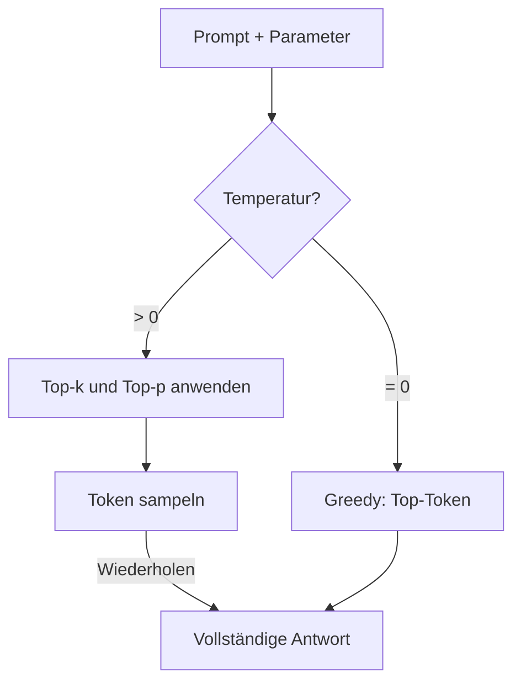
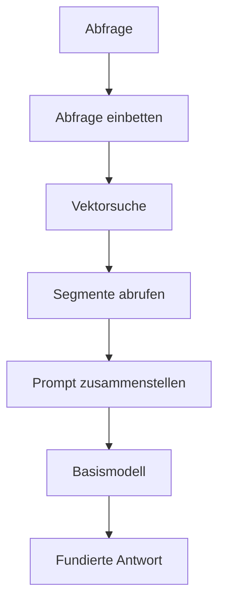
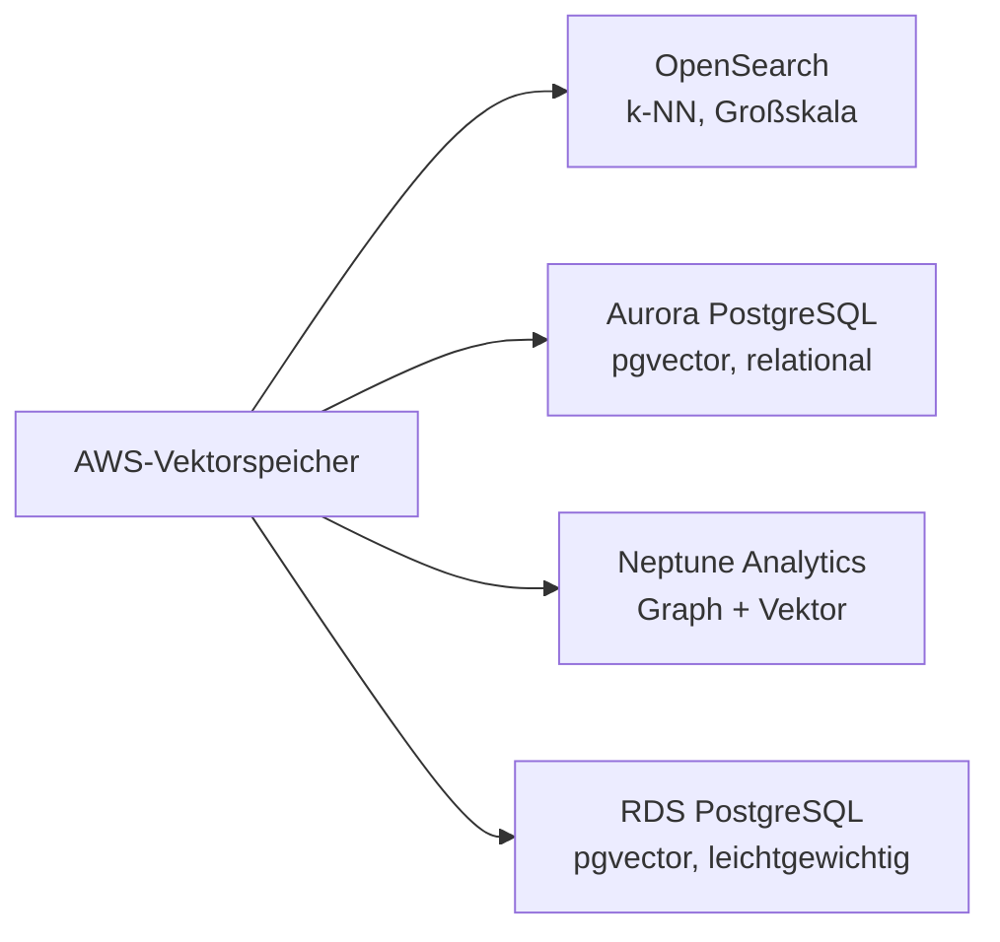
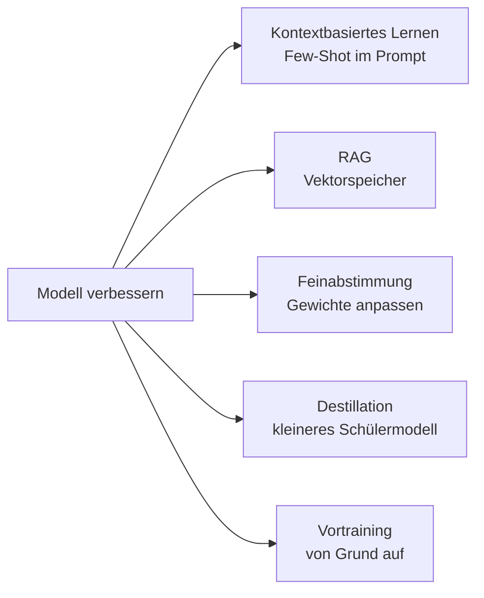
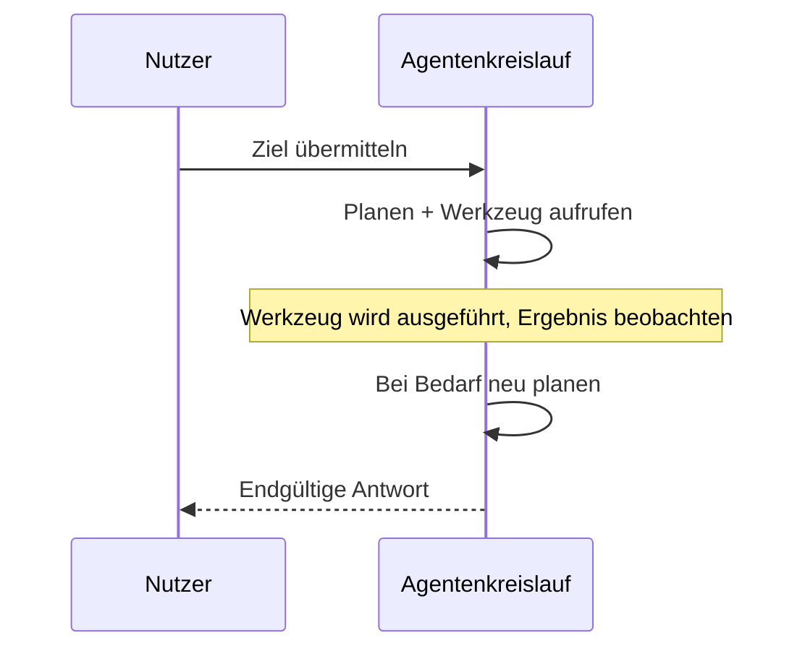

## Aufgabenstellung 3.1: Designüberlegungen für Anwendungen auf Basis von Basismodellen (FM)

Eine Produktionsanwendung auf einem Basismodell zu entwickeln, beginnt lange vor der ersten Eingabeaufforderung. Die Entscheidungen, die zur Entwurfszeit getroffen werden (welches Modell eingesetzt wird, wie seine Ausgaben gesteuert werden, wie es in privaten Daten verankert wird, wo diese Daten gespeichert werden und wie das Wissen langfristig skaliert), bestimmen, ob ein Projekt Mehrwert schafft oder in der Pilotphase stecken bleibt. Diese Aufgabenstellung behandelt diese Entscheidungen in der Reihenfolge, in der sie ein Unternehmensarchitekt typischerweise trifft.[^301001]

### 3.1.1 Auswahlkriterien für Basismodelle

Die Wahl eines Basismodells ist keine einmalige technische Entscheidung; sie wiederholt sich jedes Mal, wenn sich die Geschäftsanforderungen ändern. Ein Modell, das im Pilotbetrieb akzeptable Ergebnisse lieferte, kann im Produktionsbetrieb zu teuer werden. Ein Modell, das englischsprachige Kundenanfragen gut beantwortet hat, muss möglicherweise ersetzt werden, wenn das Produkt auf anderssprachige Märkte ausgeweitet wird. Strukturierte Auswahlkriterien verhindern, dass solche Entscheidungen reaktiv statt systematisch getroffen werden.

Die Kriterien, die die Prüfung abdeckt, lassen sich in drei Gruppen einteilen. Kosten- und Leistungskriterien bestimmen, wie viel das Modell im Betrieb kostet und wie schnell es antwortet. Fähigkeitskriterien legen fest, was das Modell leisten kann. Flexibilitätskriterien regeln, inwieweit das Modell an das Unternehmen angepasst werden kann.

**Kosten** werden pro Token gemessen, wobei ein Token ungefähr drei Viertel eines englischen Wortes entspricht (oder etwa vier Zeichen englischen Textes).[^301036] Eingabe-Token (die Eingabeaufforderung) und Ausgabe-Token (die Antwort) werden getrennt berechnet, wobei Ausgabe-Token durchweg teurer sind.[^301002] Ein Kundenservice-Assistent, der eine 500 Wörter umfassende Kundenhistorie liest und eine 100 Wörter umfassende Antwort erzeugt, verbraucht pro Interaktion ungefähr 670 Eingabe-Token und 130 Ausgabe-Token. Im Produktionsbetrieb ist diese Kalkulation von erheblicher Bedeutung. Die **Prompt-Zwischenspeicherung** senkt die tatsächlichen Kosten, indem die verarbeitete Repräsentation eines statischen Präfixes (beispielsweise eine lange Systemaufforderung oder ein Produktkatalog) über mehrere Aufrufe hinweg wiederverwendet wird. Amazon Bedrock unterstützt die Prompt-Zwischenspeicherung für ausgewählte Modelle, darunter Anthropic Claude auf Bedrock, was einen bedeutenden Kostenhebel darstellt, wenn ein großer Kontextblock bei Tausenden von täglichen Anfragen wiederverwendet wird.[^301003]

**Modalität** bezeichnet die Art der Eingaben, die ein Modell verarbeiten kann, und die Art der Ausgaben, die es erzeugen kann.[^301037] Ein *rein textbasiertes* Modell liest Text und erzeugt Text. Ein *multimodales* Modell kann auch Bilder, Dokumente oder Audiodateien verarbeiten. Wenn eine Unternehmensanwendung gescannte Rechnungen klassifizieren oder Fragen zu Produktfotos beantworten muss, ist ein multimodales Modell zwingend erforderlich, und die Kosten pro Interaktion steigen entsprechend. Wählt man ein rein textbasiertes Modell für eine rein textbasierte Aufgabe, vermeidet man die Kosten für ungenutzte multimodale Fähigkeiten.

**Latenz** bezeichnet die Zeit zwischen dem Absenden einer Anfrage und dem Erscheinen des ersten Tokens der Antwort.[^301038] Interaktive Anwendungen wie Chatbots erfordern niedrige Latenz; eine Pause von fünf Sekunden unterbricht das Gesprächserlebnis. Batch-Anwendungen wie die nächtliche Dokumentenzusammenfassung können eine höhere Latenz im Austausch für niedrigere Kosten tolerieren. Die Modellgröße ist einer der größten Einflussfaktoren auf die Latenz: kleinere Modelle antworten schneller, haben jedoch eine geringere Schlussfolgerungskapazität, während größere Modelle besser schlussfolgern, aber länger für eine Antwort benötigen. Die **Modellgröße** wird in Milliarden von Parametern gemessen, den gelernten numerischen Gewichten im Netzwerk. Ein Modell mit 7 Milliarden Parametern antwortet auf geeigneter Infrastruktur typischerweise in unter einer Sekunde; ein Modell mit 70 Milliarden Parametern kann für denselben Prompt mehrere Sekunden benötigen.[^301004]

**Modellkomplexität** bezieht sich auf Architekturentscheidungen jenseits der reinen Parameteranzahl. Manche Modelle sind dicht, das heißt, alle Parameter werden für jeden Token aktiviert; andere nutzen Architekturen mit *Mixture-of-Experts (MoE)*, bei denen nur ein Teil der Parameter pro Token aktiviert wird, was bei geringeren Inferenzkosten eine höhere Qualität ermöglicht.[^301039] Aus Auswahlperspektive ist Komplexität relevant, weil sie den Inferenz-Durchsatz und die benötigte Infrastruktur beeinflusst.

**Mehrsprachige Unterstützung** beschreibt die sprachliche Breite der Vortrainingsdaten des Modells.[^301040] Ein Modell, das überwiegend auf englischsprachigen Texten trainiert wurde, liefert in anderen Sprachen Ergebnisse geringerer Qualität. Für globale Einsätze empfiehlt es sich, die dokumentierte Sprachunterstützung eines Modells vor der Auswahl zu prüfen, um bei der Marktausdehnung schmerzliche Qualitätseinbußen zu vermeiden.

**Anpassbarkeit** bezeichnet die Möglichkeit, das Modell mittels Feinabstimmung oder kontinuierlichem Vortraining auf proprietäre Daten zu spezialisieren.[^301041] Nicht alle kommerziell verfügbaren Modelle unterstützen Feinabstimmung. Wenn ein Projekt erfordert, dem Modell domänenspezifische Terminologie oder proprietäre Arbeitsabläufe beizubringen, sollte die Verfügbarkeit der Feinabstimmung vor Vertragsabschluss geprüft werden. Abschnitt 3.1.5 behandelt die Kostenabwägungen zwischen den verschiedenen Anpassungsansätzen.

**Kontextfenstergröße** gibt die maximale Anzahl von Token an, die das Modell in einem einzigen Aufruf verarbeiten kann, einschließlich Eingabe und Ausgabe.[^301042] Ein Modell mit einem Kontextfenster von 200.000 Token kann einen vollständigen Rechtsvertrag in einer einzigen Anfrage verarbeiten; ein Modell mit 4.096 Token nicht. Mehrere Flagship-Modelle auf Amazon Bedrock bieten inzwischen Fenster von einer Million Token (Anthropic Claude Opus und Sonnet über den 1M-Kontext-Beta-Header, Amazon Nova Premier und Meta Llama 4 Maverick), die eine gesamte Codebasis oder ein Jahr an Korrespondenz in einem einzigen Prompt aufnehmen können. Größere Kontextfenster kosten pro Aufruf mehr, können aber aufwendige Segmentierungsstrategien in RAG-Pipelines überflüssig machen (siehe Abschnitt 3.1.3).

*Tabelle 3.1.1* vergleicht die wichtigsten Modellfamilien, die zum Zeitpunkt der Niederschrift über Amazon Bedrock verfügbar sind. Genaue Preise ändern sich; die relative Positionierung zwischen Modellstufen innerhalb einer Familie ist stabil.[^301005]

*Tabelle 3.1.1: Vergleich von Basismodellen nach Stufe und Fähigkeit*

| Modellfamilie | Stufe | Relative Kosten | Modalität | Kontextfenster | Typischer Anwendungsfall |
|---|---|---|---|---|---|
| Anthropic Claude Opus | Flagship | Hoch | Multimodal | 200K Standard, 1M mit Beta-Header | Komplexes Schlussfolgern, Rechts-/Medizinbereich |
| Anthropic Claude Sonnet | Ausgewogen | Mittel | Multimodal | 200K Standard, 1M mit Beta-Header | Allgemeine Unternehmensaufgaben |
| Anthropic Claude Haiku | Schnell | Niedrig | Multimodal | 200K Token | Kundeninteraktionen mit hohem Volumen |
| Amazon Nova Premier | Flagship | Hoch | Multimodal | 1M Token | Komplexe modalitätsübergreifende, sehr lange Dokumente |
| Amazon Nova Pro | Ausgewogen | Mittel | Multimodal | 300K Token | Unternehmensabläufe |
| Amazon Nova Lite | Schnell | Niedrig | Multimodal | 300K Token | Kostenoptimierter Produktionsbetrieb |
| Amazon Nova Micro | Am schnellsten | Am niedrigsten | Nur Text | 128K Token | Ultraniedrige Latenz oder Kosten |
| Meta Llama 4 Maverick | Offen | Variabel | Multimodal | 1M Token | Anpassbare Einsätze mit langem Kontext |
| Mistral Large 2 | Ausgewogen | Mittel | Nur Text | 128K Token | Aufgaben in europäischen Sprachen |

Die Prüfung erwartet keine auswendig gelernten Preise. Sie erwartet jedoch, dass ein Geschäftsszenario (hohes Volumen, mehrsprachig, Bildanalyse, knappes Budget) anhand dieser Kriterien dem richtigen Modelltyp zugeordnet werden kann.

### 3.1.2 Einfluss von Inferenzparametern auf Modellantworten

Selbst ein korrekt ausgewähltes Modell kann ungeeignete Ausgaben liefern, wenn seine Inferenzparameter falsch konfiguriert sind. Inferenzparameter sind Einstellungen, die zur Laufzeit zusammen mit dem Prompt übergeben werden und dem Modell mitteilen, wie es aus der Wahrscheinlichkeitsverteilung möglicher nächster Token sampeln soll. Ihre Anpassung ändert das Verhalten des Modells, ohne ein erneutes Training zu erfordern.

**Temperatur** steuert den Grad der Zufälligkeit im Samplingprozess.[^301043] Bei einer Temperatur von 0 wählt das Modell stets den Token mit der höchsten Wahrscheinlichkeit und erzeugt so deterministische, konsistente Ausgaben. Bei einer Temperatur von 1 sampelt das Modell gemäß der unveränderten Wahrscheinlichkeitsverteilung und erzeugt abwechslungsreichere und kreativere Ausgaben. Werte über 1 verstärken Token mit geringerer Wahrscheinlichkeit und steigern die Kreativität auf Kosten der Kohärenz.[^301006] Die geschäftliche Konsequenz ist eindeutig: Ein Werkzeug zur Zusammenfassung von Rechtsdokumenten sollte bei Temperatur 0 oder sehr nah daran betrieben werden, da Konsistenz und Genauigkeit wichtiger sind als Abwechslung. Ein Generator für Marketingtexte könnte eine Temperatur von 0,8 oder höher verwenden, um aus demselben Briefing diverse kreative Optionen zu erzeugen.

**Top-p** (auch *Nucleus-Sampling* genannt) ist eine ergänzende Zufälligkeitskontrolle.[^301044] Anstatt Token-Wahrscheinlichkeiten durch einen Multiplikator anzupassen, definiert top-p einen kumulativen Wahrscheinlichkeitsschwellenwert. Das Modell sampelt nur aus der kleinsten Menge von Token, deren kombinierte Wahrscheinlichkeit den Schwellenwert erreicht. Bei top-p = 0,9 berücksichtigt das Modell nur die Token, die zusammen 90 % der Wahrscheinlichkeitsmasse ausmachen, und verwirft Ausreißer mit geringer Wahrscheinlichkeit. Niedrigere top-p-Werte konzentrieren die Ausgabe stärker; höhere Werte lassen mehr Abwechslung zu.[^301007]

**Top-k** beschränkt das Sampling auf die k Token mit den höchsten Einzelwahrscheinlichkeiten, unabhängig von ihrer kombinierten Wahrscheinlichkeit.[^301045] Bei top-k = 50 sampelt das Modell nur aus den 50 wahrscheinlichsten nächsten Token. Top-k und top-p werden häufig gemeinsam eingesetzt; das Modell filtert zuerst nach top-k und wendet dann den top-p-Schwellenwert auf die verbleibenden Kandidaten an.

Temperatur und top-p interagieren in der Praxis. Das Setzen von Temperatur = 0 macht top-p irrelevant, da kein stochastisches Sampling stattfindet. Das Setzen von top-p = 1,0 deaktiviert das Nucleus-Sampling, sodass die Temperatur die einzige aktive Steuerung bleibt. Eine übliche Produktionskonfiguration für einen hochpräzisen Assistenten ist Temperatur = 0,1 und top-p = 0,9, was hauptsächlich deterministische Ausgaben erzeugt und dabei gelegentlich alternative Formulierungen zulässt, wenn das Modell tatsächlich unsicher ist.

**Stoppsequenzen** sind Zeichenketten, die dem Modell signalisieren, die Textgenerierung unmittelbar nach ihrer Ausgabe zu stoppen.[^301046] Eine Prompt-Vorlage, die eine explizite Endmarkierung verwendet, könnte beispielsweise `"\n###END###"` als Stoppsequenz enthalten, sodass das Modell direkt nach der Ausgabe der Markierung anhält. Stoppsequenzen eignen sich dazu, das Ausgabeformat in Anwendungen durchzusetzen, in denen ein nachgeordnetes System die Antwort parsen muss; sie sollten so gewählt werden, dass sie in der erwarteten Ausgabe eindeutig sind (ein einfaches `}` ist für verschachteltes JSON ungeeignet, da die innere geschweifte Klammer die Generierung beenden würde, bevor das äußere Objekt geschlossen ist).

**Eingabe- und Ausgabelängenparameter** begrenzen die Anzahl der Token, die das Modell liest (Eingabe) bzw. erzeugt (Ausgabe). Die Begrenzung der Ausgabelänge steuert die Kosten an Hochvolumen-Inferenzendpunkten. Das Begrenzen der Eingabelänge auf API-Ebene verhindert, dass Clients Prompts senden, die das Kontextfenster des Modells überschreiten und einen Fehler auslösen. Beide Obergrenzen sollten anhand der realistischen Maximalgröße einer gültigen Anfrage festgelegt werden, nicht anhand des vom Modell unterstützten Maximums.

```
Beispielkonfiguration für Inferenzparameter:
  temperature:     0.1
  top_p:           0.9
  top_k:           50
  max_new_tokens:  512
  stop_sequences:  ["###END###"]
```

Die obige Konfiguration eignet sich für einen Dokumentenextraktionsassistenten, der kurze, strukturierte Ausgaben zuverlässig erzeugen muss. Ein Assistent für kreatives Schreiben würde eine höhere Temperatur, einen höheren top-p-Wert und keine Stoppsequenz verwenden.


*Abbildung 3.1.1: Token-Sampling-Pipeline. Das Modell wählt jeden Ausgabe-Token, indem es Kandidaten durch top-k und top-p filtert, bevor es temperaturbasiertes stochastisches Sampling anwendet.*

### 3.1.3 RAG und seine Unternehmensanwendungen

Basismodelle werden auf großen öffentlichen Datensätzen trainiert, haben jedoch keinen Zugang zu Informationen, die nach ihrem Trainingsschnitt entstanden sind, und kennen keine proprietären Unternehmensdaten. Ein Modell, das bis Ende 2024 trainiert wurde, kann keine Fragen zu einem Produktlaunch Anfang 2025 beantworten. Ein Universalmodell hat weder Zugang zu internen HR-Richtlinien noch zu Kundenvertragsvorlagen noch zu technischen Betriebshandbüchern. Die **Retrieval-Augmented Generation (RAG)** ist das Architekturmuster, das diese Einschränkung überwindet, indem es das Modell zum Zeitpunkt der Abfrage mit einem externen Wissensspeicher verbindet, anstatt das Wissen durch Training in die Gewichte des Modells einzuarbeiten.[^301008]

Die Mechanik von RAG verläuft in fünf Schritten. Zuerst wird die Frage des Nutzers in einen numerischen Vektor umgewandelt, einen sogenannten *Einbettungsvektor (Embedding)*, der die semantische Bedeutung der Frage erfasst.[^301047] Danach wird dieser Vektor mit einer Datenbank vorab berechneter Einbettungsvektoren verglichen, die aus den privaten Dokumenten der Organisation abgeleitet wurden. Im dritten Schritt werden die Dokumente abgerufen, deren Einbettungsvektoren dem Abfragevektor am ähnlichsten sind. Diese Dokumente werden dann zu einem Kontextblock zusammengestellt und der ursprünglichen Frage des Nutzers vorangestellt, um den vollständigen Prompt zu bilden. Schließlich liest das Basismodell den angereicherten Prompt und erzeugt eine Antwort, die auf dem abgerufenen Inhalt basiert, anstatt ausschließlich auf seinem parametrischen Gedächtnis.[^301009]


*Abbildung 3.1.2: RAG-Anfrage-Pipeline. Die Nutzerabfrage wird in einen Einbettungsvektor umgewandelt, mit gespeicherten Dokumentvektoren verglichen, und die abgerufenen Segmente werden mit der ursprünglichen Abfrage zusammengeführt, bevor das Basismodell seine Antwort generiert.*

**Amazon Bedrock Knowledge Bases** ist die vollständig verwaltete AWS-Implementierung dieses Musters.[^301010] Es übernimmt die Ingestionspipeline, die Einbettungsvektorgenerierung, die Integration des Vektorspeichers und die Retrieval-API, sodass eine Organisation RAG einsetzen kann, ohne die zugrundeliegende Infrastruktur aufzubauen oder zu betreiben. Der Administrator konfiguriert eine Wissensbasis, indem er eine Datenquelle, eine Segmentierungsstrategie, ein Einbettungsmodell und ein Vektorspeicher-Backend festlegt; Bedrock synchronisiert die Dokumente anschließend automatisch.

Als Datenquellen unterstützt Amazon Bedrock Knowledge Bases Amazon S3-Buckets (die häufigste Wahl für Dokumentenarchive), Atlassian-Confluence-Bereiche, Microsoft-SharePoint-Websites, Salesforce-Objekte sowie Web-URLs über einen integrierten Web-Crawler.[^301011] Jede Datenquelle wird nach einem Zeitplan oder bei Bedarf synchronisiert; Aktualisierungen der Quelldokumente werden ohne manuelles Neuindizieren im Vektorspeicher übernommen.[^301048]

*Segmentierung (Chunking)* bezeichnet den Prozess, Quelldokumente in Abschnitte aufzuteilen, die klein genug sind, um gemeinsam mit der ursprünglichen Abfrage in ein Kontextfenster zu passen.[^301049] Bedrock Knowledge Bases unterstützt die feste Segmentierung (Aufteilung alle N Token), die semantische Segmentierung (Aufteilung an natürlichen Themengrenzen, die von einem sekundären Modell erkannt werden) und die hierarchische Segmentierung (Erzeugung eines übergeordneten Zusammenfassungssegments und kleinerer untergeordneter Detailsegmente, sodass das Retrieval auf zwei Granularitätsebenen arbeiten kann).[^301012]

Unternehmensanwendungen von RAG umfassen mehrere Kategorien:

- **Interne Frage-Antwort-Systeme**: Mitarbeitende stellen dem System Fragen zu HR-Richtlinien, IT-Verfahren oder Produktspezifikationen. Das System ruft die relevanten Richtlinienabsätze ab und generiert eine präzise Antwort mit dem zitierten Quelldokument.
- **Kundensupport**: Ein Supportmitarbeitender oder ein Self-Service-Chatbot ruft relevante Lösungsschritte aus einer Wissensbasis ab und präsentiert sie in Gesprächssprache, was die durchschnittliche Bearbeitungszeit reduziert.
- **Vertrags- und Rechtsanalyse**: Rechtsteams speisen Vertragsbibliotheken ein. Das Modell beantwortet Fragen wie "Welche Verträge enthalten eine Kündigungsklausel nach Ermessen?" oder "Wie hoch ist die Haftungsobergrenze im Rahmendienstleistungsvertrag mit Lieferant X?"
- **Forschungsunterstützung**: Wissenschaftler, Analysten oder Produktmanager fragen einen Korpus interner Forschungsberichte ab. Das Modell synthetisiert Ergebnisse aus mehreren Dokumenten, anstatt eine Liste von Links zurückzugeben.

RAG wird der Feinabstimmung vorgezogen, wenn sich die Wissensbasis häufig ändert, da das Aktualisieren eines Vektorspeichers Minuten dauert, während das erneute Training eines Modells Stunden oder Tage benötigt.[^301050] Es wird auch bevorzugt, wenn die Quelldokumente prüfbar sein müssen; da die abgerufenen Segmente im Prompt sichtbar sind, kann ein Entwickler genau nachvollziehen, welche Dokumente die Antwort beeinflusst haben.[^301051]

### 3.1.4 AWS-Dienste zur Speicherung von Einbettungsvektoren in Vektordatenbanken

RAG erfordert einen Ort, um vorab berechnete Einbettungsvektoren zu speichern und sie mithilfe von Algorithmen für die *approximative Nächste-Nachbarn-Suche (ANN)* oder *k-Nächste-Nachbarn (k-NN)* schnell zu durchsuchen.[^301052] AWS stellt vier verwaltete Dienste bereit, die die Vektorspeicherung unterstützen, und jeder eignet sich für unterschiedliche Anforderungen hinsichtlich Skalierung, Architektur und Abfrageverhalten.[^301053]


*Abbildung 3.1.3: AWS-Vektorspeicherdienste. Jeder Dienst unterstützt die Speicherung von Einbettungsvektoren, unterscheidet sich jedoch in Skalierung, Abfragemodell und ergänzenden Fähigkeiten.*

**Amazon OpenSearch Service** unterstützt die approximative Nächste-Nachbarn-Vektorsuche seit der Einführung des k-NN-Plug-ins, und seine *Vector Engine* ist für Workloads der semantischen Suche in großem Maßstab und mit hohem Durchsatz optimiert.[^301013] Er unterstützt den HNSW-Indexalgorithmus (Hierarchical Navigable Small World), der bei Milliarden von Vektoren Abruf im Submillisekundenbereich ermöglicht.[^301054] OpenSearch ist die leistungsfähigste Option, wenn der Abrufdatensatz groß ist (Millionen von Dokumenten oder mehr), wenn die Suche Vektorähnlichkeit mit herkömmlichen Schlüsselwortfiltern kombinieren muss (hybride Suche) oder wenn die Anwendung OpenSearch bereits für Log-Analysen einsetzt und den Cluster teilen kann. Amazon Bedrock Knowledge Bases verwendet OpenSearch Service als Standard-Vektor-Backend, wenn keine Alternative angegeben wird.[^301055]

**Amazon Aurora** mit der pgvector-Erweiterung ergänzt die PostgreSQL-kompatible relationale Datenbank um die Vektorspeicherung.[^301014] Diese Option ist geeignet, wenn die Anwendung bereits strukturierte Daten in Aurora speichert und semantische Suche hinzufügen möchte, ohne einen separaten Vektorspeicher zu betreiben. Ein als Zeilen in Aurora gespeicherter Produktkatalog kann um Einbettungsvektorspalten erweitert werden; Abfragen können dann relationale Prädikate ("Produkte in der Kategorie Elektronik") mit Vektorähnlichkeit ("ähnlich dieser Produktbeschreibung") in einer einzigen SQL-Anweisung kombinieren.[^301056] Der Kompromiss liegt bei der Skalierung: pgvector auf Aurora liefert gute Leistung bei Datensätzen im Bereich von Hunderttausenden bis wenigen Millionen Vektoren, erreicht jedoch nicht das Niveau von Amazon OpenSearch Service bei sehr großen Mengen.

**Amazon Neptune Analytics** erweitert die Neptune-Graphdatenbank um Vektorsuchfähigkeiten und ermöglicht Abfragen, die Graph-Traversal mit semantischer Ähnlichkeit kombinieren.[^301015] Ein Wissensgraph, der Beziehungen zwischen Personen, Organisationen und Dokumenten modelliert, kann mit Neptune Analytics Fragen beantworten wie: "Finde Dokumente, die dieser Abfrage semantisch am ähnlichsten sind, von jemandem aus der Rechtsabteilung verfasst wurden und mindestens eine Rechtsvorschrift zitieren."[^301057] Diese Kombination aus Graph-Reasoning und Vektorabruf ist mit einem rein relationalen oder rein suchbasierten Speicher schwer zu replizieren. Neptune Analytics ist die richtige Wahl, wenn das Abrufproblem eine inhärente Graphstruktur aufweist, etwa bei der Lieferkettenanalyse, der Betrugserkennung oder der biomedizinischen Forschung.

**Amazon RDS für PostgreSQL** bietet dieselbe pgvector-Fähigkeit wie Aurora, läuft jedoch auf der Standard-RDS-Infrastruktur statt auf einem Aurora-Serverless- oder -Provisioned-Cluster.[^301016] Es eignet sich für kleinere Workloads, bei denen die vorhandene RDS-Instanz bereits PostgreSQL verwendet und das Hinzufügen der pgvector-Erweiterung der unkomplizierteste Weg ist.[^301058] Entwicklungsumgebungen und leichtgewichtige interne Werkzeuge nutzen diese Option häufig, um die Infrastruktur einfach zu halten und gleichzeitig die Vektorsuche zu unterstützen.

Als Faustregel für die Wahl zwischen diesen Speichern gilt: pgvector (auf RDS oder Aurora) verarbeitet problemlos bis zu einigen Millionen Vektoren; Amazon OpenSearch Service ist die Standardwahl, sobald ein Workload die Schwelle von mehreren zehn Millionen überschreitet, wo sein HNSW-Index die Abruflatenz auch bei sehr großem Datenvolumen niedrig hält. Neptune Analytics ist die richtige Antwort, wenn die Daten grundlegend graphstrukturiert sind.

*Tabelle 3.1.2: Vergleich der AWS-Vektorspeicherdienste*

| Dienst | Indexalgorithmus | Skalierung | Ergänzende Fähigkeit | Am besten geeignet für |
|---|---|---|---|---|
| OpenSearch Service | HNSW, IVF | Sehr groß (Milliarden) | Hybride Keyword- + Vektorsuche, Analysen | RAG mit hohem Volumen, Unternehmenssuche |
| Aurora PostgreSQL (pgvector) | IVFFlat, HNSW | Mittel (Millionen) | Relationale SQL-Joins | Anwendungen, die bereits Aurora nutzen |
| Neptune Analytics | Graph + Vektor | Mittel | Graph-Traversal, Beziehungsabfragen | Graphstrukturierte Wissensbasen |
| RDS für PostgreSQL (pgvector) | IVFFlat, HNSW | Klein bis mittel | Relationales SQL, einfaches Setup | Entwicklungsumgebungen, interne Werkzeuge |

Amazon Bedrock Knowledge Bases kann so konfiguriert werden, dass es eines dieser vier Backends verwendet.[^301017] Der Standard, wenn kein Backend angegeben wird, ist OpenSearch Service.[^301059] Organisationen, die bereits Aurora oder RDS für PostgreSQL betreiben, können eine Wissensbasis auf ihren bestehenden Cluster verweisen und so die Kosten eines separaten Suchdienstes vermeiden. Neptune Analytics wird explizit gewählt, wenn die Wissensbasis eine Graphstruktur aufweist.

Hinweis: Amazon MemoryDB wurde in früheren Versionen des AIF-C01-Prüfungsleitfadens als Option für die Vektorspeicherung aufgeführt. In Version 1.1 des Leitfadens wurde es entfernt. In der Prüfung sind keine Fragen zu MemoryDB im Kontext der Vektorsuche zu erwarten.

### 3.1.5 Kostenabwägungen bei der FM-Anpassung

Wenn das Standardverhalten eines Basismodells für eine spezifische Unternehmensaufgabe nicht ausreicht, gibt es fünf grundlegende Strategien zur Verbesserung. Sie unterscheiden sich erheblich in Kosten, Zeit, Datenanforderungen und der Beständigkeit der Verbesserung.

**Vortraining** ist der Prozess, ein Modell von Grund auf mit einem großen Textkorpus (oder anderen Daten) zu trainieren.[^301060] Das Vortraining bestimmt das grundlegende Wissen und Sprachverständnis des Modells. Es erfordert enorme Rechenressourcen (Hunderte bis Tausende von GPUs über Wochen), Petabytes kuratierter Trainingsdaten und ein Team von Forschern im Bereich Maschinelles Lernen, das den Prozess überwacht. Außerhalb der großen KI-Labore führen kaum Organisationen eigenes Vortraining durch. In der Prüfung ist es als Ausgangspunkt relevant, von dem alle anderen Techniken ausgehen, nicht als praktische Option für die meisten Unternehmen.[^301018]

**Feinabstimmung** beginnt mit einem bestehenden vortrainierten Modell und setzt das Training auf einem kleineren, aufgabenspezifischen Datensatz fort.[^301061] Die Gewichte des Modells werden aktualisiert, um sein Verhalten auf die Zieldomäne auszurichten. Feinabstimmung erfordert beschriftete Beispiele im Bereich von Hunderten bis Zehntausenden, GPU-Stunden im Bereich von Stunden bis Tagen statt Wochen sowie einen Datenvorbereitungsprozess, der Frage-Antwort-Paare oder Anweisung-Antwort-Paare erzeugt. Amazon Bedrock unterstützt die Feinabstimmung für ausgewählte Modelle.[^301019] Das Ergebnis ist ein Modell, das Ausgaben liefert, die besser auf die spezifische Aufgabe abgestimmt sind, und das als separate Modellversion gespeichert wird, die auch im Leerlauf Hosting-Kosten verursacht.[^301062]

**Kontextbasiertes Lernen** erfordert keine Gewichtsaktualisierungen.[^301063] Stattdessen werden Beispiele für das gewünschte Verhalten direkt in den Prompt eingefügt. Ein Zero-Shot-Prompt liefert keine Beispiele; ein Few-Shot-Prompt liefert zwei bis fünf Beispiele. Das Modell nutzt Mustererkennung innerhalb seines Kontextfensters, um aus diesen Beispielen auf die aktuelle Eingabe zu verallgemeinern. Kontextbasiertes Lernen ist die günstigste und schnellste Anpassungsstrategie und erfordert keine andere Infrastruktur als ein normaler Inferenzaufruf. Die Einschränkung besteht darin, dass die Verbesserung nur für die Dauer des Prompts gilt; das Modell speichert die Beispiele nicht zwischen den Aufrufen, und die Beispiele verbrauchen Token, die sonst für Inhalte genutzt werden könnten.[^301020]

**RAG** (in Abschnitt 3.1.3 ausführlich behandelt) wird typischerweise nicht als Anpassungstechnik bezeichnet, hat aber ähnliche geschäftliche Auswirkungen: Es verankert das Modell in domänenspezifischem Wissen und reduziert Halluzinationen zu proprietären Themen. Sein Kostenprofil unterscheidet sich von den anderen Ansätzen. Die Einrichtungskosten umfassen den Aufbau und die Synchronisierung des Vektorspeichers sowie die Integration der Retrieval-Schicht. Die Kosten pro Abfrage sind etwas höher als bei einem einfachen Inferenzaufruf, da der Retrieval-Schritt und der größere angereicherte Prompt beide Rechenleistung und Token verbrauchen. Die Kosten für Wissensaktualisierungen sind jedoch sehr niedrig: Das Hinzufügen neuer Dokumente zum Vektorspeicher dauert Minuten statt der Stunden, die ein Feinabstimmungsauftrag benötigt.[^301021]

**Modelldestillation** ist die neueste Technik im Prüfungsleitfaden v1.1. Bei der Destillation erzeugt ein großes, qualitativ hochwertiges *Lehrermodell* Ausgaben für eine Reihe von Prompts, und diese Eingabe-Ausgabe-Paare werden zum Trainingsdatensatz für ein kleineres *Schülermodell*.[^301064] Das Schülermodell lernt, das Verhalten des Lehrermodells in einer spezifischen Aufgabendomäne zu approximieren, ohne Zugang zu den Gewichten des Lehrers zu haben.[^301022] Der geschäftliche Vorteil besteht darin, dass die Inferenz im Produktionsbetrieb vom kleineren, schnelleren und günstigeren Schülermodell übernommen wird, während die Qualität der Antworten an die des teuren Lehrermodells heranreicht. Amazon Bedrock unterstützt Modelldestillation als erstklassigen Workflow und ermöglicht es Organisationen, ein Bedrock-Modell als Lehrer einzusetzen und eine feinabgestimmte Version eines kleineren Modells als Schüler zu erzeugen.[^301023] Die Destillation verlagert die Kosten von der laufenden Inferenz in einen einmaligen Trainingsauftrag, der über Tausende späterer Inferenzaufrufe amortisiert werden kann.[^301065]


*Abbildung 3.1.4: Auswahlhilfe für FM-Anpassung. Die geeignete Technik hängt von verfügbaren beschrifteten Daten, Aktualisierungshäufigkeit, Budget und Inferenzvolumen ab.*

*Tabelle 3.1.3: Kosten- und Aufwandsvergleich der FM-Anpassungsansätze*

| Ansatz | Rechenkosten | Benötigte Daten | Aktualisierungsgeschwindigkeit | Kosten pro Abfrage | Prüfungsszenarien |
|---|---|---|---|---|---|
| Vortraining | Sehr hoch | Petabytes | Wochen | Normal | Nur akademischer Ausgangspunkt |
| Feinabstimmung | Mittel | Hunderte bis Tausende beschrifteter Paare | Stunden bis Tage | Normal + Hosting | Stabile Domänenspezialisierung |
| Kontextbasiertes Lernen | Keine | Wenige Beispiele | Sofort | Höher (größerer Prompt) | Schnelles Prototyping, geringes Volumen |
| RAG | Niedrige Einrichtung | Vorhandene Dokumente | Minuten | Etwas höher | Häufig aktualisiertes Wissen |
| Modelldestillation | Mittel (einmalig) | Vom Lehrer erzeugte Paare | Stunden bis Tage | Niedriger (kleineres Modell) | Kostenoptimierung bei hohem Volumen |

In der Prüfung werden häufig Szenarien präsentiert, in denen ein Unternehmen zwischen diesen Ansätzen wählen muss. Die Entscheidungslogik lautet: Ändert sich das Wissen häufig, ist RAG die richtige Wahl. Erfordert die Aufgabe einen konsistenten Ton oder eine spezialisierte Terminologie in einer stabilen Domäne und sind Daten verfügbar, ist Feinabstimmung die richtige Wahl. Ist das Volumen sehr hoch und stehen die Kosten pro Abfrage im Vordergrund, sollte Modelldestillation geprüft werden. Stehen weder Budget noch Zeit zur Verfügung, empfiehlt sich kontextbasiertes Lernen mit Few-Shot-Beispielen. Vortraining ist in einem Produktionsvorbereitungsszenario niemals die richtige Antwort, es sei denn, die Frage stellt ausdrücklich fest, dass eine neuartige Domäne existiert, für die kein vortrainiertes Modell verfügbar ist.

### 3.1.6 Rolle von KI-Agenten und ihre Unternehmensanwendungen

Ein Basismodell, das einen Prompt empfängt und eine Antwort zurückgibt, arbeitet im *Einzeldurchlauf-Modus*. Viele reale Unternehmensaufgaben lassen sich nicht in einem einzigen Schritt abschließen. Das Buchen eines Fluges erfordert das Prüfen der Verfügbarkeit, den Vergleich von Optionen, die Sitzplatzbelegung und die Zahlungsbestätigung. Die Untersuchung einer Sicherheitswarnung erfordert das Abfragen von Protokolldaten, die Suche nach Bedrohungsinformationen, das Korrelieren von Ereignissen und das Verfassen eines Berichts. Solche mehrstufigen Aufgaben erfordern eine andere Architektur.

**Ein KI-Agent** ist ein System, das ein Basismodell mit der Fähigkeit verbindet, seine Umgebung wahrzunehmen, eine Handlungssequenz zu planen, diese Handlungen mithilfe externer Werkzeuge auszuführen, die Ergebnisse zu beobachten und seinen Plan auf Grundlage der gewonnenen Erkenntnisse anzupassen.[^301024] Das Modell in einem Agenten generiert nicht nur Text; es überlegt, was als Nächstes zu tun ist, entscheidet, welches Werkzeug aufgerufen wird, bewertet, ob das Ergebnis ausreicht, und setzt dies fort, bis die Aufgabe abgeschlossen ist oder eine Abbruchbedingung erreicht wird.[^301066]

Der Agentenkreislauf besteht aus vier Phasen. In der *Wahrnehmungsphase* empfängt der Agent das Ziel des Nutzers sowie verfügbaren Kontext über den aktuellen Zustand der Welt.[^301067] In der *Planungsphase* überlegt das Modell, welche Aktion als Nächstes durchzuführen ist, und wählt aus einer definierten Menge von Werkzeugen (APIs, Datenbankabfragen, Code-Ausführungsumgebungen, Websuche). In der *Aktionsphase* ruft der Agent das ausgewählte Werkzeug auf und übergibt ihm die vom Modell bestimmten Argumente. In der *Beobachtungsphase* liest der Agent die Antwort des Werkzeugs und aktualisiert sein Verständnis des Fortschritts in Richtung des Ziels. Der Kreislauf wiederholt sich, bis der Agent feststellt, dass die Aufgabe abgeschlossen ist.[^301025]


*Abbildung 3.1.5: KI-Agent-Kreislauf aus Wahrnehmen, Planen, Handeln und Beobachten. Das Basismodell überlegt bei jedem Schritt, welches Werkzeug aufzurufen ist; der Kreislauf läuft weiter, bis das Aufgabenziel erreicht ist.*

Der Unterschied zwischen einem Agenten und einem einfachen LLM-Aufruf ist in geschäftlicher Hinsicht bedeutsam. Ein einfacher LLM-Aufruf ist schnell, günstig und zustandslos. Ein Agentenaufruf ist langsamer, teurer und zustandsbehaftet über mehrere Werkzeugaufrufe hinweg.[^301068] Agenten sind geeignet, wenn die Aufgabe nicht in einem einzigen Prompt kodiert werden kann, wenn sie Informationen aus externen Systemen erfordert oder wenn mehrere sequenzielle Entscheidungen getroffen werden müssen, bei denen jede vom vorherigen Ergebnis abhängt.

AWS bietet zwei zentrale Einstiegspunkte für die Entwicklung von Agenten. **Amazon Bedrock Agents** ist der etablierte verwaltete Dienst zum Erstellen, Konfigurieren und Bereitstellen von Agenten, die von jedem von Bedrock unterstützten Basismodell betrieben werden.[^301026] Er übernimmt die Orchestrierung, das Werkzeug-Routing (in der Bedrock-Terminologie *Action Groups* genannt), die Sitzungsstatusverwaltung und die Integration mit Knowledge Bases für RAG. **Amazon Bedrock AgentCore** ist die neuere Laufzeit- und Verwaltungsschicht für produktionsreife Agenten und fügt Observability, Speicher, Sicherheitskontrollen und die Infrastruktur für den agentischen Betrieb im großen Maßstab hinzu.[^301027] **Strands Agents** ist ein quelloffenes SDK von AWS, das Python-Entwicklern ermöglicht, Agenten mithilfe einer unkomplizierten dekorator-basierten API zu erstellen, wobei die Agenten zur verwalteten Ausführung in AgentCore bereitgestellt werden können.[^301028]

Unternehmensanwendungen für KI-Agenten umfassen:

- **Automatisierung des Kundendienstes**: Ein Agent übernimmt die vollständige Abwicklung einer Serviceanfrage, indem er das CRM abfragt, den Bestellstatus prüft, eine Rücksendung einleitet und eine Bestätigung versendet, ohne dass ein menschlicher Mitarbeitender eingreift, sofern die Situation den definierten Rahmen nicht überschreitet.
- **IT-Betrieb**: Ein Agent untersucht eine Leistungswarnung, indem er CloudWatch-Metriken abfragt, die betroffenen Ressourcen identifiziert, das Änderungsprotokoll abgleicht und eine Abhilfemaßnahme zur Genehmigung durch einen Operator vorschlägt.
- **Dokumentenverarbeitung**: Ein Agent liest eingehende Verträge, extrahiert Schlüsselbegriffe, vergleicht sie mit einer Standardvorlage, kennzeichnet Abweichungen und erstellt eine Zusammenfassungsvorlage für einen Rechtsexperten, alles ohne manuelle Vorsichtung.
- **Datenanalyse**: Ein Agent nimmt eine Geschäftsfrage in natürlicher Sprache entgegen, verfasst eine SQL-Abfrage, führt sie gegen eine Datenbank aus, interpretiert das Ergebnis und erstellt eine natürlichsprachliche Zusammenfassung mit einer Empfehlung.

*Multi-Agenten-Systeme*, bei denen ein orchestrierender Agent Teilaufgaben an spezialisierte Subagenten delegiert, erweitern das Muster auf Probleme, die für einen einzelnen Agenten zu groß oder zu vielfältig sind.[^301069] Amazon Bedrock Agents unterstützt die Multi-Agenten-Zusammenarbeit nativ.[^301029] Die Designprinzipien für Multi-Agenten-Systeme (darunter die Aufgabenaufteilung, das Routing zwischen Agenten und die Aufrechterhaltung eines kohärenten Sitzungszustands) wurden in Domäne 2 (Kapitel zu den Grundkonzepten der Generativen KI) gemeinsam mit dem übergeordneten Material zur agentischen KI-Architektur behandelt.

*Tabelle 3.1.4: Vergleich von KI-Agent und einfachem LLM-Aufruf*

| Merkmal | Einfacher LLM-Aufruf | KI-Agent |
|---|---|---|
| Aufgabenumfang | Einschrittiger Einzelprompt | Mehrstufig, iterativ |
| Zugang zu externen Werkzeugen | Keiner (nur Modellgewichte) | APIs, Datenbanken, Code-Ausführungsumgebungen |
| Zustand zwischen Schritten | Keiner | Innerhalb der Sitzung aufrechterhalten |
| Latenz pro Aufgabe | Millisekunden bis Sekunden | Sekunden bis Minuten |
| Kosten pro Aufgabe | Niedrig (ein Inferenzaufruf) | Höher (mehrere Inferenz- und Werkzeugaufrufe) |
| Geeignet für | Klassifizierung, Zusammenfassung, Generierung | Recherche, Buchungen, IT-Betrieb, Dokumenten-Workflows |

Die Prüfung behandelt Agenten als eigenständiges Architekturmuster, nicht als Erweiterung des Promptings. Wenn eine Frage eine mehrstufige Aufgabe beschreibt, die das Abfragen externer Systeme oder sequenzielle Entscheidungen erfordert, lautet die Antwort "Agent" und nicht "ausgefeilterer Prompt".

## Selbstkontrollfragen

**Frage 1.** Ein Einzelhandelsunternehmen möchte einen kundenorientierten Chatbot bereitstellen, der Fragen zu seinem Produktkatalog in sechs Sprachen beantwortet. Der Katalog enthält 50.000 SKUs; tägliche Aktualisierungen betreffen weniger als ein Prozent der SKUs, während die Systemaufforderung und der Produkttaxonomieblock über alle Aufrufe hinweg statisch sind. Welche Kombination von Auswahlkriterien sollte die Wahl des Basismodells AM DIREKTESTEN bestimmen?

A. Modellgröße, Verfügbarkeit der Feinabstimmung und Unterstützung von Stoppsequenzen  
B. Mehrsprachige Unterstützung, Kontextfenstergröße und Eignung für Prompt-Zwischenspeicherung  
C. Ausgabemodalität, Aktualität der Vortrainingsdaten und Standardwert von top-p  
D. Trainingskosten, GPU-Speicherbedarf und Temperatursensitivität  

**Erläuterung:** Das Szenario hat drei Treiber: Unterstützung von sechs Sprachen (mehrsprachige Unterstützung), ein großer, aber weitgehend stabiler Katalogkontext, der in einen Prompt passen oder effizient abgerufen werden muss (Kontextfenstergröße), sowie Kostenkontrolle im großen Maßstab (Prompt-Zwischenspeicherung gilt für die statische Systemaufforderung und den Taxonomieblock, nicht für die täglich wechselnden SKU-Zeilen, für die RAG das richtige Werkzeug bleibt). Antwort A ist falsch, da Feinabstimmung das tägliche Aktualisierungsproblem nicht löst und Stoppsequenzen kein Auswahlkriterium darstellen. Antwort C ist falsch, da die Ausgabemodalität nur Text ist (ein Chatbot), die Aktualität des Vortrainings irrelevant ist, weil der Katalog zur Laufzeit eingespielt wird, und top-p ein Inferenzparameter und kein Modellauswahlkriterium ist. Antwort D ist falsch, da Trainingskosten keine Laufzeitüberlegung für einen Nutzer verwalteter FM sind und der GPU-Speicherbedarf ein von Amazon Bedrock abstrahiertes Infrastrukturdetail ist. Antwort B adressiert direkt alle drei geschäftlichen Anforderungen.[^301030]

---

**Frage 2.** Ein Rechtsteam nutzt ein Basismodell, um Vertragsklauseln zusammenzufassen. Das Team stellt fest, dass die Zusammenfassungen inkonsistent sind: Dieselbe Klausel erzeugt bei jedem Durchlauf leicht abweichende Zusammenfassungen. Das Team benötigt wortgetreue Reproduzierbarkeit beim erneuten Ausführen einer Zusammenfassung. Welche Änderung des Inferenzparameters löst dieses Problem AM WAHRSCHEINLICHSTEN?

A. Top-k von 50 auf 200 erhöhen  
B. Temperatur von 0,7 auf 1,0 erhöhen  
C. Temperatur auf 0 setzen  
D. Top-p auf 1,0 setzen  

**Erläuterung:** Die Temperatur steuert, wie deterministisch der Samplingprozess ist. Bei Temperatur = 0 wählt das Modell stets den wahrscheinlichsten nächsten Token und erzeugt so für einen festen Prompt deterministische Ausgaben. Das ist die richtige Antwort (C). Das Erhöhen von top-k (Antwort A) erweitert den Pool der Kandidaten-Token, was die Variabilität erhöht, nicht beseitigt. Das Erhöhen der Temperatur von 0,7 auf 1,0 (Antwort B) erhöht die Zufälligkeit und verschlimmert das Problem. Das Setzen von top-p auf 1,0 (Antwort D) deaktiviert das Nucleus-Sampling, macht das Sampling jedoch nicht allein deterministisch; wenn die Temperatur noch größer als 0 ist, sampelt das Modell weiterhin stochastisch aus der vollständigen Wahrscheinlichkeitsverteilung. Nur das Setzen der Temperatur auf genau 0 führt den Samplingprozess in den deterministischen Greedy-Modus über, den das Rechtsteam benötigt.[^301031]

---

**Frage 3.** Ein Finanzdienstleistungsunternehmen möchte seinen Analysten ein Werkzeug bereitstellen, das Fragen zu internen Forschungsberichten beantworten kann. Die Berichte werden wöchentlich aktualisiert. Das Unternehmen möchte kein Modell erneut trainieren oder feinabstimmen. Welche Architektur erfüllt diese Anforderungen AM BESTEN?

A. Ein domänenspezifisches Modell auf den Forschungsberichten vortrainieren  
B. Ein Basismodell wöchentlich feinabstimmen, wenn neue Berichte veröffentlicht werden  
C. RAG mit einem aus dem Berichts-Repository synchronisierten Vektorspeicher verwenden  
D. Kontextbasiertes Lernen verwenden, indem die relevanten Berichte in den Prompt eingefügt werden  

**Erläuterung:** RAG (Antwort C) ist genau für dieses Szenario konzipiert. Es ermöglicht dem Analysten, Fragen in natürlicher Sprache zu stellen, und ruft die relevanten Abschnitte aus dem Vektorspeicher ab, der bei Eingang neuer Berichte in Minuten aktualisiert werden kann. Ein erneutes Modelltraining ist nicht erforderlich. Vortraining (Antwort A) ist aufgrund der Kosten, der Anforderung, kein erneutes Training durchzuführen, und der wöchentlichen Aktualisierungsfrequenz ausgeschlossen. Feinabstimmung (Antwort B) ist aufgrund der Anforderung, kein erneutes Training durchzuführen, und der Tatsache ausgeschlossen, dass wöchentliche Feinabstimmungszyklen für ein Wissensaktualisierungsproblem nicht praktikabel sind. Kontextbasiertes Lernen (Antwort D) ist im großen Maßstab nicht durchführbar; das Einfügen ganzer Forschungsberichte in einen Prompt würde das Kontextfenster bei einer Bibliothek mit Hunderten von Dokumenten überschreiten, und der Ansatz funktioniert nicht für die retrospektive Suche in einem Archiv. Amazon Bedrock Knowledge Bases mit einer synchronisierten S3-Datenquelle ist die konkrete AWS-Implementierung des richtigen Ansatzes.[^301032]

---

**Frage 4.** Ein Unternehmen betreibt eine Hochvolumen-Kundensupportanwendung, die von einem großen Basismodell betrieben wird. Die Inferenzkosten wachsen schneller als der Umsatz. Ein Maschinelles-Lernen-Ingenieur schlägt den Einsatz von Modelldestillation vor. Was ist der PRIMÄRE geschäftliche Vorteil dieses Ansatzes?

A. Das Schülermodell lernt neue Fakten, die das Lehrermodell nicht kannte  
B. Das Schülermodell erzeugt bei allen Eingaben identische Ausgaben wie das Lehrermodell  
C. Die Inferenz im großen Maßstab wird von einem kleineren, schnelleren und günstigeren Modell übernommen, das die Qualität des Lehrers annähert  
D. Die Gewichte des Lehrermodells werden komprimiert und direkt bereitgestellt, was die Speicherkosten senkt  

**Erläuterung:** Modelldestillation (Antwort C) trainiert ein kleineres Schülermodell, um das Verhalten eines größeren Lehrermodells in der Zielaufgabendomäne zu approximieren. Nach Abschluss der Destillation übernimmt das Schülermodell die Produktionsinferenz, das pro Aufruf schneller und günstiger ist. Dies adressiert direkt das Kostenwachstumsproblem in einer Hochvolumenanwendung. Antwort A ist falsch, da Destillation das Schülermodell lehrt, die Ausgaben des Lehrers zu imitieren, nicht Fakten zu lernen, die der Lehrer nicht kannte. Antwort B ist falsch, da das Schülermodell den Lehrer approximiert, aber nicht exakt reproduziert; bei Grenzfällen und neuen Eingaben werden die Ausgaben abweichen. Antwort D beschreibt Modellquantisierung oder -pruning, nicht Destillation; Destillation umfasst das Training eines separaten Modells, nicht die Komprimierung der Gewichte des Lehrers. Die Prüfung hat Destillation in v1.1 speziell als Kostenoptimierungstechnik für Hochvolumen-Inferenzszenarien eingeführt.[^301033]

---

**Frage 5.** Ein Fertigungsunternehmen möchte den Prozess der Beantwortung von Lieferantenanfragen automatisieren. Der Prozess erfordert das Prüfen der Lagerbestände im ERP-System des Unternehmens, das Abfragen einer Beschaffungsrichtlinien-Datenbank, das Berechnen, ob eine Bestellung die Genehmigungsschwellen erfüllt, und das Verfassen einer Antwort. Welche Architektur ist AM GEEIGNETSTEN?

A. Ein Einzeldurchlauf-Basismodellaufruf mit allen Lieferanteninformationen im Prompt  
B. Eine RAG-Pipeline, die relevante Richtliniendokumente abruft und eine Antwort generiert  
C. Ein KI-Agent mit Action Groups, die eine Verbindung zum ERP-System, der Richtlinien-Datenbank und dem Berechnungswerkzeug herstellen  
D. Ein feinabgestimmtes Modell, das auf historischen Lieferantenantworten trainiert wurde  

**Erläuterung:** Die Aufgabenbeschreibung ist der Lehrbuchfall für einen KI-Agenten (Antwort C). Der Prozess ist mehrstufig: Drei verschiedene Datenabrufoperationen (ERP, Richtlinien-Datenbank, Schwellenberechnung) müssen sequenziell erfolgen, und das Ergebnis jedes Schritts beeinflusst die nachfolgenden Schritte. Ein einfacher Einzeldurchlauf-Aufruf (Antwort A) kann keine Live-Systeme abfragen; er kann nur Informationen verwenden, die im Prompt platziert wurden. Eine RAG-Pipeline (Antwort B) ruft relevante Dokumente ab, führt jedoch keine Geschäftslogik aus und nimmt keine Berechnungen vor; sie ist eine Retrieval-Schicht, keine Orchestrierungsschicht. Ein feinabgestimmtes Modell (Antwort D) hätte weiterhin keinen Zugang zu Live-ERP- oder Richtliniendaten und würde Antworten basierend auf Mustern in historischen Trainingsdaten erzeugen, nicht basierend auf dem aktuellen Lagerbestand oder Richtlinienstatus. Amazon Bedrock Agents, konfiguriert mit Action Groups, die auf die ERP-API, die Richtlinien-Datenbank und eine AWS-Lambda-Funktion für die Schwellenberechnung verweisen, ist die konkrete AWS-Implementierung des richtigen Ansatzes.[^301034]

---

**Frage 6.** Ein Unternehmen bewertet, ob es Amazon OpenSearch Service oder Amazon RDS für PostgreSQL mit pgvector für seine RAG-Wissensbasis verwenden soll. Die Wissensbasis wird ungefähr 200.000 Dokumentensegmente enthalten. Das Anwendungsteam betreibt bereits einen RDS-für-PostgreSQL-Cluster für Transaktionsdaten und möchte neue Infrastruktur minimieren. Welche Empfehlung ist AM GEEIGNETSTEN?

A. OpenSearch Service verwenden, da es der einzige AWS-Dienst ist, der Vektorsuche unterstützt  
B. OpenSearch Service verwenden, da 200.000 Vektoren den HNSW-Algorithmus im großen Maßstab erfordern  
C. RDS für PostgreSQL verwenden, da der bestehende Cluster mit pgvector erweitert werden kann und kein neuer Dienst erforderlich ist  
D. Neptune Analytics verwenden, da graphstrukturierter Abruf immer genauer ist als die k-NN-Suche  

**Erläuterung:** Bei 200.000 Vektoren sind beide Dienste technisch geeignet. Der entscheidende Faktor in diesem Szenario ist die betriebliche Einfachheit: Das Team betreibt bereits einen RDS-für-PostgreSQL-Cluster, und pgvector kann mit einer einzigen Erweiterungsinstallation aktiviert werden. Dadurch entfällt die Bereitstellung, Absicherung und der Betrieb einer separaten OpenSearch-Service-Domain (Antwort C). Antwort A ist falsch, da Aurora, RDS für PostgreSQL und Neptune Analytics ebenfalls Vektorsuche unterstützen; OpenSearch ist nicht die einzige Option. Antwort B ist falsch, da 200.000 Vektoren gut in den Fähigkeitsbereich von pgvector auf RDS fallen, das für Datensätze in diesem Skalenbereich konzipiert ist; das Argument des HNSW-Algorithmus im großen Maßstab gilt, wenn Datensätze Zehnmillionen von Vektoren überschreiten. Antwort D ist falsch, da Neptune Analytics geeignet ist, wenn das Problem eine Graphstruktur aufweist, nicht als universelle Genauigkeitsverbesserung; die Anwendung von Graph-Traversal auf ein allgemeines Dokumentenabrufproblem erhöht die Komplexität ohne entsprechenden Nutzen.[^301035]

[^301001]: AWS Certification. AI Practitioner (AIF-C01) Exam Guide v1.1, Domain 3. URL: <https://docs.aws.amazon.com/aws-certification/latest/ai-practitioner-01/ai-practitioner-01-domain3.html>
[^301002]: Amazon Bedrock. Amazon Bedrock pricing. URL: <https://aws.amazon.com/bedrock/pricing/>
[^301003]: Amazon Bedrock. Prompt caching for Amazon Bedrock. URL: <https://docs.aws.amazon.com/bedrock/latest/userguide/prompt-caching.html>
[^301004]: Kaplan, J., et al. Scaling Laws for Neural Language Models (2020). URL: <https://arxiv.org/abs/2001.08361>
[^301005]: Amazon Bedrock. Supported foundation models in Amazon Bedrock. URL: <https://docs.aws.amazon.com/bedrock/latest/userguide/models-supported.html>
[^301006]: Amazon Bedrock. Inference parameters for foundation models. URL: <https://docs.aws.amazon.com/bedrock/latest/userguide/inference-parameters.html>
[^301007]: Holtzman, A., et al. The Curious Case of Neural Text Degeneration (2019). URL: <https://arxiv.org/abs/1904.09751>
[^301008]: Lewis, P., et al. Retrieval-Augmented Generation for Knowledge-Intensive NLP Tasks (2020). URL: <https://arxiv.org/abs/2005.11401>
[^301009]: Amazon Bedrock. How Amazon Bedrock Knowledge Bases works. URL: <https://docs.aws.amazon.com/bedrock/latest/userguide/knowledge-base-overview.html>
[^301010]: Amazon Bedrock. Amazon Bedrock Knowledge Bases. URL: <https://docs.aws.amazon.com/bedrock/latest/userguide/knowledge-base.html>
[^301011]: Amazon Bedrock. Data sources for Amazon Bedrock Knowledge Bases. URL: <https://docs.aws.amazon.com/bedrock/latest/userguide/knowledge-base-ds.html>
[^301012]: Amazon Bedrock. Chunking strategies for Amazon Bedrock Knowledge Bases. URL: <https://docs.aws.amazon.com/bedrock/latest/userguide/kb-chunking-parsing.html>
[^301013]: Amazon OpenSearch Service. k-NN search in Amazon OpenSearch Service. URL: <https://docs.aws.amazon.com/opensearch-service/latest/developerguide/knn.html>
[^301014]: Amazon Aurora. Using pgvector to store embeddings in Amazon Aurora PostgreSQL. URL: <https://docs.aws.amazon.com/AmazonRDS/latest/AuroraUserGuide/AuroraPostgreSQL.VectorSearch.html>
[^301015]: Amazon Neptune. Vector search in Amazon Neptune Analytics. URL: <https://docs.aws.amazon.com/neptune-analytics/latest/userguide/vector-search.html>
[^301016]: Amazon RDS. Using the pgvector extension with Amazon RDS for PostgreSQL. URL: <https://docs.aws.amazon.com/AmazonRDS/latest/UserGuide/Appendix.PostgreSQL.CommonDBATasks.pgvector.html>
[^301017]: Amazon Bedrock. Vector store options for Amazon Bedrock Knowledge Bases. URL: <https://docs.aws.amazon.com/bedrock/latest/userguide/knowledge-base-setup.html>
[^301018]: Brown, T., et al. Language Models are Few-Shot Learners (GPT-3 paper, 2020). URL: <https://arxiv.org/abs/2005.14165>
[^301019]: Amazon Bedrock. Fine-tuning foundation models in Amazon Bedrock. URL: <https://docs.aws.amazon.com/bedrock/latest/userguide/custom-models.html>
[^301020]: Min, S., et al. Rethinking the Role of Demonstrations: What Makes In-Context Learning Work? (2022). URL: <https://arxiv.org/abs/2202.12837>
[^301021]: Amazon Bedrock. Retrieval Augmented Generation using Knowledge Bases. URL: <https://docs.aws.amazon.com/bedrock/latest/userguide/knowledge-base-retrieveandgenerate.html>
[^301022]: Hinton, G., et al. Distilling the Knowledge in a Neural Network (2015). URL: <https://arxiv.org/abs/1503.02531>
[^301023]: Amazon Bedrock. Model distillation in Amazon Bedrock. URL: <https://docs.aws.amazon.com/bedrock/latest/userguide/model-distillation.html>
[^301024]: Yao, S., et al. ReAct: Synergizing Reasoning and Acting in Language Models (2022). URL: <https://arxiv.org/abs/2210.03629>
[^301025]: Amazon Bedrock. How Amazon Bedrock Agents works. URL: <https://docs.aws.amazon.com/bedrock/latest/userguide/agents-how-it-works.html>
[^301026]: Amazon Bedrock. Amazon Bedrock Agents. URL: <https://docs.aws.amazon.com/bedrock/latest/userguide/agents.html>
[^301027]: Amazon Bedrock. Amazon Bedrock AgentCore overview. URL: <https://docs.aws.amazon.com/bedrock/latest/userguide/agent-core.html>
[^301028]: AWS. Strands Agents SDK. URL: <https://strandsagents.com/>
[^301029]: Amazon Bedrock. Multi-agent collaboration in Amazon Bedrock Agents. URL: <https://docs.aws.amazon.com/bedrock/latest/userguide/agents-multi-agent-collaboration.html>
[^301030]: Amazon Bedrock. Multilingual model support and prompt caching overview. URL: <https://docs.aws.amazon.com/bedrock/latest/userguide/prompt-caching.html>
[^301031]: Amazon Bedrock. Temperature and sampling parameters for inference. URL: <https://docs.aws.amazon.com/bedrock/latest/userguide/inference-parameters.html>
[^301032]: Amazon Bedrock. Knowledge Bases for Amazon Bedrock: use cases. URL: <https://docs.aws.amazon.com/bedrock/latest/userguide/knowledge-base-overview.html>
[^301033]: Amazon Bedrock. Model distillation use cases and cost benefits. URL: <https://docs.aws.amazon.com/bedrock/latest/userguide/model-distillation.html>
[^301034]: Amazon Bedrock. Creating and configuring action groups for Amazon Bedrock Agents. URL: <https://docs.aws.amazon.com/bedrock/latest/userguide/agents-action-groups.html>
[^301035]: Amazon RDS. pgvector support for RDS for PostgreSQL: scale and performance characteristics. URL: <https://docs.aws.amazon.com/AmazonRDS/latest/UserGuide/Appendix.PostgreSQL.CommonDBATasks.pgvector.html>
[^301036]: Amazon Bedrock. Tokens and token pricing in Amazon Bedrock. URL: <https://docs.aws.amazon.com/bedrock/latest/userguide/inference-invoke.html>
[^301037]: Amazon Bedrock. Multimodal capabilities for foundation models. URL: <https://docs.aws.amazon.com/bedrock/latest/userguide/models-supported.html>
[^301038]: Amazon Bedrock. Latency and performance considerations for Amazon Bedrock. URL: <https://docs.aws.amazon.com/bedrock/latest/userguide/model-ids.html>
[^301039]: Fedus, W., et al. Switch Transformers: Scaling to Trillion Parameter Models with Simple and Efficient Sparsity (2021). URL: <https://arxiv.org/abs/2101.03961>
[^301040]: Amazon Bedrock. Language support for foundation models in Amazon Bedrock. URL: <https://docs.aws.amazon.com/bedrock/latest/userguide/models-supported.html>
[^301041]: Amazon Bedrock. Customization options for foundation models in Amazon Bedrock. URL: <https://docs.aws.amazon.com/bedrock/latest/userguide/custom-models.html>
[^301042]: Amazon Bedrock. Context window sizes for foundation models in Amazon Bedrock. URL: <https://docs.aws.amazon.com/bedrock/latest/userguide/models-supported.html>
[^301043]: Amazon Bedrock. Temperature parameter for inference requests. URL: <https://docs.aws.amazon.com/bedrock/latest/userguide/inference-parameters.html>
[^301044]: Holtzman, A., et al. The Curious Case of Neural Text Degeneration: nucleus sampling definition (2019). URL: <https://arxiv.org/abs/1904.09751>
[^301045]: Fan, A., et al. Hierarchical Neural Story Generation: top-k sampling (2018). URL: <https://arxiv.org/abs/1805.04833>
[^301046]: Amazon Bedrock. Stop sequences for inference in Amazon Bedrock. URL: <https://docs.aws.amazon.com/bedrock/latest/userguide/inference-parameters.html>
[^301047]: Amazon Bedrock. Embedding models for Amazon Bedrock Knowledge Bases. URL: <https://docs.aws.amazon.com/bedrock/latest/userguide/knowledge-base-setup-emb.html>
[^301048]: Amazon Bedrock. Syncing data sources for Amazon Bedrock Knowledge Bases. URL: <https://docs.aws.amazon.com/bedrock/latest/userguide/knowledge-base-ingest.html>
[^301049]: Amazon Bedrock. Chunking configurations for Amazon Bedrock Knowledge Bases. URL: <https://docs.aws.amazon.com/bedrock/latest/userguide/kb-chunking-parsing.html>
[^301050]: Amazon Bedrock. Comparing RAG and fine-tuning for FM customization. URL: <https://docs.aws.amazon.com/bedrock/latest/userguide/knowledge-base-overview.html>
[^301051]: Amazon Bedrock. Source attribution in RAG responses from Knowledge Bases. URL: <https://docs.aws.amazon.com/bedrock/latest/userguide/knowledge-base-retrieveandgenerate.html>
[^301052]: Johnson, J., et al. Billion-scale similarity search with GPUs (FAISS paper, 2017). URL: <https://arxiv.org/abs/1702.08734>
[^301053]: Amazon Bedrock. Supported vector stores for Amazon Bedrock Knowledge Bases. URL: <https://docs.aws.amazon.com/bedrock/latest/userguide/knowledge-base-setup.html>
[^301054]: Amazon OpenSearch Service. HNSW algorithm for k-NN in OpenSearch. URL: <https://docs.aws.amazon.com/opensearch-service/latest/developerguide/knn-index.html>
[^301055]: Amazon Bedrock. Default vector store configuration for Amazon Bedrock Knowledge Bases. URL: <https://docs.aws.amazon.com/bedrock/latest/userguide/knowledge-base-setup-osscr.html>
[^301056]: Amazon Aurora. Combining relational and vector queries with pgvector in Aurora PostgreSQL. URL: <https://docs.aws.amazon.com/AmazonRDS/latest/AuroraUserGuide/AuroraPostgreSQL.VectorSearch.html>
[^301057]: Amazon Neptune Analytics. Graph and vector search use cases in Neptune Analytics. URL: <https://docs.aws.amazon.com/neptune-analytics/latest/userguide/vector-search.html>
[^301058]: Amazon RDS. Installing the pgvector extension on Amazon RDS for PostgreSQL. URL: <https://docs.aws.amazon.com/AmazonRDS/latest/UserGuide/Appendix.PostgreSQL.CommonDBATasks.pgvector.html>
[^301059]: Amazon Bedrock. OpenSearch Service as default vector store for Knowledge Bases. URL: <https://docs.aws.amazon.com/bedrock/latest/userguide/knowledge-base-setup-osscr.html>
[^301060]: Bommasani, R., et al. On the Opportunities and Risks of Foundation Models (Stanford CRFM, 2021). URL: <https://arxiv.org/abs/2108.07258>
[^301061]: Howard, J., and Ruder, S. Universal Language Model Fine-tuning for Text Classification (ULMFiT, 2018). URL: <https://arxiv.org/abs/1801.06146>
[^301062]: Amazon Bedrock. Provisioned throughput for custom models in Amazon Bedrock. URL: <https://docs.aws.amazon.com/bedrock/latest/userguide/prov-throughput.html>
[^301063]: Brown, T., et al. Language Models are Few-Shot Learners (in-context learning definition, 2020). URL: <https://arxiv.org/abs/2005.14165>
[^301064]: Gou, J., et al. Knowledge Distillation: A Survey (2021). URL: <https://arxiv.org/abs/2006.05525>
[^301065]: Amazon Bedrock. Cost savings with model distillation in Amazon Bedrock. URL: <https://docs.aws.amazon.com/bedrock/latest/userguide/model-distillation.html>
[^301066]: Wang, L., et al. A Survey on Large Language Model Based Autonomous Agents (2023). URL: <https://arxiv.org/abs/2308.11432>
[^301067]: Wooldridge, M., and Jennings, N. Intelligent Agents: Theory and Practice (1995). URL: <https://doi.org/10.1017/S0269888900007524>
[^301068]: Amazon Bedrock. Session management and state in Amazon Bedrock Agents. URL: <https://docs.aws.amazon.com/bedrock/latest/userguide/agents-session-state.html>
[^301069]: Amazon Bedrock. Multi-agent collaboration patterns in Amazon Bedrock. URL: <https://docs.aws.amazon.com/bedrock/latest/userguide/agents-multi-agent-collaboration.html>
