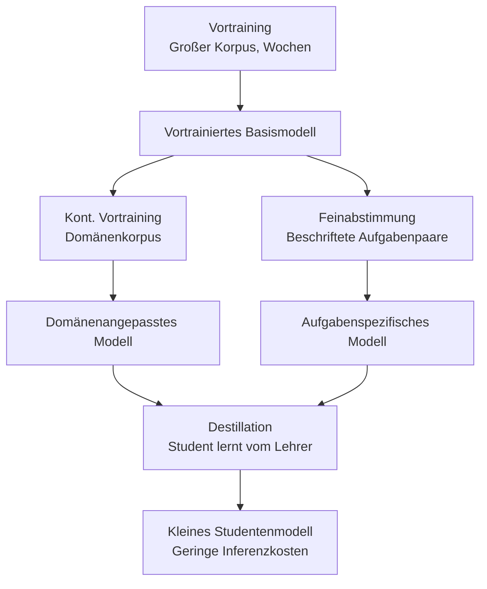
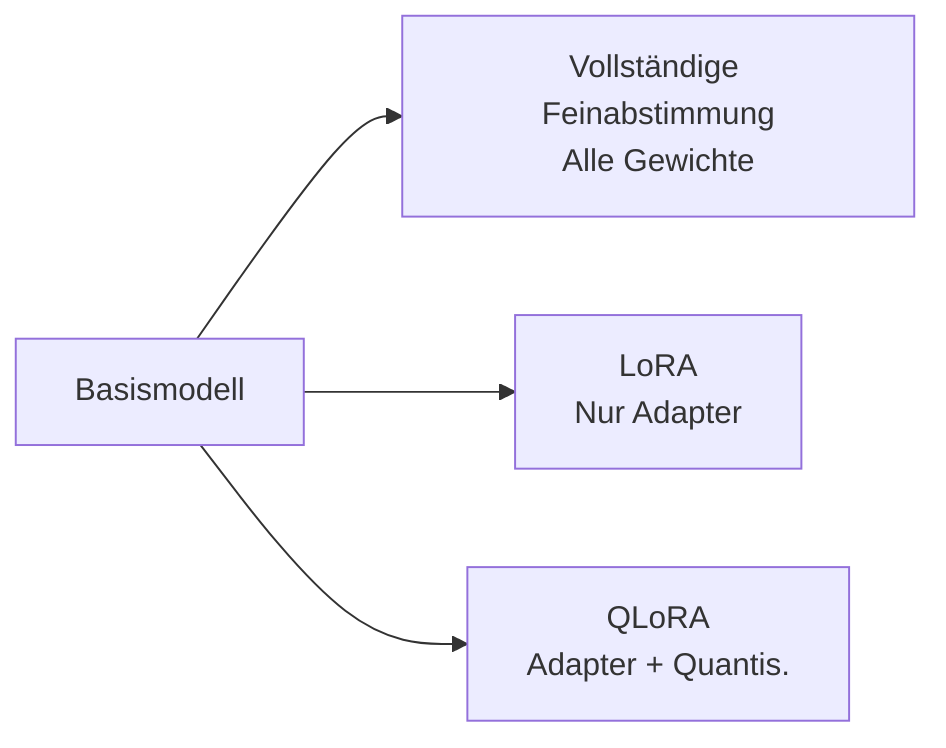
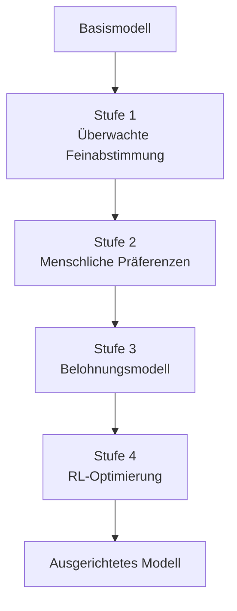
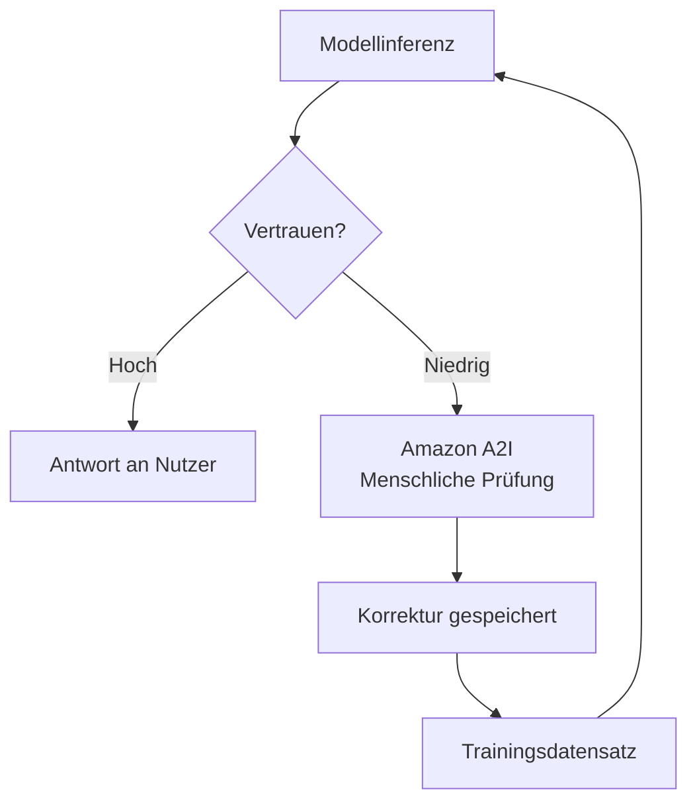
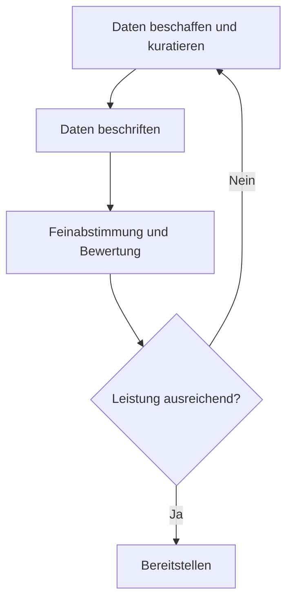

## Aufgabenstellung 3.3: Das Training und die Feinabstimmung von Basismodellen beschreiben

Basismodelle kommen nicht fertig für jeden Geschäftszweck. Sie werden in Stufen aufgebaut, wobei jede Schicht Spezifität hinzufügt, deren Kosten mit steigendem Anspruch stark ansteigen. Das Verständnis, wie Modelle aufgebaut und angepasst werden, ist für den Unternehmensprofi in erster Linie kein technisches, sondern ein Budget- und Planungsthema. Die Unterschiede zwischen Vortraining, Feinabstimmung, kontinuierlichem Vortraining und Destillation zu kennen, ermöglicht es, die richtigen Fragen zu stellen, wenn ein Ingenieurteam ein Anpassungsprojekt vorschlägt, den vorgeschlagenen Zeitplan und das Budget zu beurteilen und zu erkennen, wann ein einfacherer Ansatz vergleichbare Ergebnisse liefern würde.[^303001]

Die drei Ziele dieser Aufgabenstellung folgen einer logischen Abfolge. Das erste behandelt die Taxonomie der Trainingstechniken und ihre Kostenprofile. Das zweite behandelt die spezifischen Methoden, die eingesetzt werden, wenn Feinabstimmung die richtige Wahl ist. Das dritte behandelt, wie Daten vorbereitet werden müssen, bevor ein Feinabstimmungsauftrag beginnen kann, einschließlich der Prozesse mit menschlichem Feedback, die das Verhalten eines Modells an die Geschäftserwartungen anpassen. Zusammen bieten sie den Rahmen, den ein Auftraggeber benötigt, um ein Modellanpassungsprojekt zu beauftragen und zu steuern, ohne eine einzige Zeile Trainingscode schreiben zu müssen.

### 3.3.1 Schlüsselelemente des Trainings eines FM

Das Training eines Basismodells ist keine einzelne Aktivität. Es ist eine Abfolge von Stufen, wobei jede auf der vorherigen aufbaut und jede als Einstiegspunkt zur Verfügung steht, je nachdem, was ein Unternehmen braucht und wie viel es investieren kann. Die Prüfung behandelt vier Stufen: Vortraining, Feinabstimmung, kontinuierliches Vortraining und Destillation. Sie sind grob nach Kosten von am teuersten bis am günstigsten und nach Änderungsumfang von am breitesten bis am engsten angeordnet.

Die vier Techniken sind keine Alternativen zueinander, wie es Feinabstimmung und RAG (Retrieval-Augmented Generation) sind. Das Vortraining schafft das Fundament. Feinabstimmung und kontinuierliches Vortraining passen das Bestehende an. Die Destillation komprimiert das Ergebnis in ein kleineres Paket. Ein Unternehmen kann mehrere Techniken nacheinander einsetzen: mit einem von einem Drittanbieter bereitgestellten vortrainierten Modell beginnen, kontinuierliches Vortraining anwenden, um es Domänenvokabular zu lehren, und das Ergebnis dann für eine kosteneffiziente Produktionsinferenz destillieren.

**Vortraining** ist der Prozess, ein neuronales Netz von zufälligen Anfangsgewichten aus auf einem enormen Korpus aus Text und anderen Daten zu trainieren.[^303002] Das Modell lernt statistische Muster über Milliarden von Beispielen hinweg: Grammatik, faktische Zusammenhänge, Schlussfolgerungsketten und die Beziehungen zwischen Konzepten. Das Vortraining schafft das parametrische Gedächtnis des Modells, also das in seinen Gewichten eingebettete Wissen, auf das es zurückgreifen kann, auch wenn keine externen Dokumente bereitgestellt werden. Der erforderliche Maßstab ist für die meisten Unternehmen unerschwinglich. Ein Trainingslauf für ein modernes großes Sprachmodell (LLM) verbraucht Tausende von GPU-Stunden über Wochen oder Monate, erfordert Petabytes an kuratierten Daten und kostet Millionen von Dollar, bevor das Modell seinen ersten kohärenten Satz produziert.[^303003] Das Vortraining ist in der Prüfung als Ausgangswert relevant, von dem alle anderen Techniken ausgehen, nicht als praktische Maßnahme für Unternehmen außerhalb der großen KI-Forschungslabors.

**Feinabstimmung** beginnt bei einem bestehenden vortrainierten Modell und setzt das Training auf einem viel kleineren, domänenspezifischen Datensatz fort.[^303004] Das Ziel ist es, das Modellverhalten auf eine Zielaufgabe auszurichten: Kundendienstanfragen in einem bestimmten Ton beantworten, strukturierte Felder aus Krankenakten extrahieren oder Code im internen Framework eines Unternehmens generieren. Die Feinabstimmung passt die Gewichte des Modells an, sodass das resultierende Modell ein eigenständiges Artefakt ist, das gespeichert und bereitgestellt werden muss. Sie erfordert beschriftete Beispiele, typischerweise Hunderte bis Zehntausende von Eingabe-Ausgabe-Paaren, und GPU-Rechenkapazität im Bereich von Stunden bis Tagen statt Wochen. **Amazon Bedrock** unterstützt die Feinabstimmung für eine Teilmenge seiner gehosteten Modelle, darunter Amazon Nova, Meta Llama und ausgewählte Versionen von Anthropic Claude Haiku, und produziert ein benutzerdefiniertes Modell, das dann mit bereitgestelltem Durchsatz betrieben werden kann.[^303005] Feinabstimmung ist die richtige Wahl, wenn die Aufgabe stabil ist (das Zielverhalten ändert sich nicht von Monat zu Monat), wenn das Unternehmen ausreichend beschriftete Beispiele produzieren kann und wenn die Leistungsverbesserung die Trainings- und Hostingkosten rechtfertigt.

**Kontinuierliches Vortraining** (auch *fortgesetztes Vortraining* genannt) ist eine Zwischentechnik zwischen Vortraining und Feinabstimmung.[^303006] Anstelle von beschrifteten Eingabe-Ausgabe-Paaren verwendet das kontinuierliche Vortraining unbeschriftete Domänentexte, den gleichen Typ von unüberwachtem Korpus wie beim ursprünglichen Vortraining, jedoch aus einer spezifischen Domäne wie medizinischer Literatur, Finanzberichten oder juristischer Rechtsprechung. Das Ziel ist nicht, dem Modell eine neue Aufgabe beizubringen, sondern ihm Domänenvokabular, Terminologie und faktische Zusammenhänge zu vermitteln, die im ursprünglichen Vortrainingskorpus unterrepräsentiert waren. Ein Modell, das auf allgemeinen Internettexten vortrainiert wurde, behandelt Begriffe wie "Bruttomarge", "Kapitalwert" und "EBITDA" möglicherweise als Fachjargon, den es erkennt, aber im Kontext nicht tiefgehend versteht. Kontinuierliches Vortraining auf einem Korpus aus Jahresberichten, Analystennotizen und Protokollen von Ergebniskonferenzen verbessert dieses Verständnis, ohne beschriftete Paare zu erfordern. Amazon Bedrock unterstützt kontinuierliches Vortraining als Anpassungsoption für ausgewählte Modelle.[^303007]

**Destillation** verfolgt einen anderen Ansatz beim Kostenproblem. Anstatt ein kleineres Modell von Grund auf neu zu trainieren, trainiert die Destillation ein kompaktes *Studentenmodell* darin, die Ausgaben eines größeren, leistungsfähigeren *Lehrermodells* auf einem Zielsatz von Eingabeaufforderungen nachzuahmen.[^303008] Der Lehrer generiert Antworten auf eine große Sammlung von Eingabeaufforderungen; diese Eingabeaufforderungs-Antwort-Paare werden zu den Trainingsdaten des Studenten. Der Student lernt, die Qualität des Lehrers anzunähern, ohne jemals Zugriff auf die Gewichte des Lehrers zu haben. Nach Abschluss der Destillation wird die Produktionsinferenz vom Studenten bedient, der pro Aufruf schneller und günstiger ist als der Lehrer. Amazon Bedrock unterstützt Modelldestillation als verwalteten Workflow, sodass Unternehmen ein Bedrock-Modell als Lehrer festlegen, die Zielverteilung der Eingabeaufforderungen angeben und ein feinabgestimmtes kleineres Modell als Studenten produzieren können.[^303009] Die Wirtschaftlichkeit der Destillation spricht für Anwendungen mit hohem Volumen, bei denen die einmaligen Trainingskosten schnell durch die Einsparungen bei der Inferenz wieder hereingeholt werden.

*Abbildung 3.3.1: Hierarchie der FM-Trainingstechniken. Jede Technik baut auf einem bestehenden Modell auf, statt von Grund auf neu zu beginnen; Kosten und Datenanforderungen sinken von links nach rechts, je reichhaltiger der Ausgangspunkt wird.*

*Tabelle 3.3.1: Vergleich der FM-Trainings- und Anpassungstechniken*

| Technik | Trainingsdaten | Rechenkosten | Zeit bis zur Bereitstellung | Wichtigstes Ergebnis | AWS-Einstiegspunkt |
|---|---|---|---|---|---|
| Vortraining | Petabytes, unbeschriftet | Sehr hoch (Millionen GPU-Stunden) | Monate | Allgemeines Basismodell | Nicht anwendbar (vom Anbieter kaufen) |
| Kontinuierliches Vortraining | Gigabytes bis Terabytes, unbeschriftet | Mittel (Tage) | Tage | Domänenvokabular und faktische Zusammenhänge | Benutzerdefinierte Modelle in Amazon Bedrock |
| Feinabstimmung | Hunderte bis Tausende beschrifteter Paare | Gering bis mittel (Stunden) | Stunden bis Tage | Aufgabenspezifisches Verhalten und Ton | Amazon Bedrock, SageMaker JumpStart |
| Destillation | Vom Lehrer generierte Eingabeaufforderungs-Antwort-Paare | Mittel (einmalig) | Stunden bis Tage | Kleines Modell, das die Qualität des großen Modells annähert | Modelldestillation in Amazon Bedrock |

Die Prüfung präsentiert häufig Szenarien, in denen gefragt wird, welche Technik zu einer bestimmten Einschränkung passt. Die Entscheidungslogik lautet: Wenn das Modell ein neues Vokabular oder eine neue Faktendomäne ohne beschrifteten Datensatz erlernen muss, ist kontinuierliches Vortraining zu verwenden. Wenn das Modell ein bestimmtes Aufgabenverhalten erlernen soll und beschriftete Daten verfügbar sind, ist Feinabstimmung zu verwenden. Wenn das resultierende Modell bei der Inferenz günstiger und schneller sein soll und Trainingskosten akzeptabel sind, kommt Destillation hinzu. Vortraining ist nur dann die Antwort, wenn die Frage ausdrücklich angibt, dass kein geeignetes vortrainiertes Modell existiert, was in einem realen Geschäftsszenario so gut wie nie der Fall ist.

### 3.3.2 Methoden zur Feinabstimmung eines FM

Feinabstimmung ist die am häufigsten diskutierte Anpassungstechnik in unternehmensweiten KI-Projekten, weil ihr Kostenprofil in einem praktikablen Bereich liegt und das Ergebnis ein Modell ist, das die Organisation kontrolliert. Innerhalb der breiten Kategorie der Feinabstimmung gibt es mehrere unterschiedliche Methoden, mit denen die Prüfung Vertrautheit erwartet.

Der gemeinsame Faden aller Feinabstimmungsmethoden ist, dass die Gewichte des vortrainierten Modells den Ausgangspunkt bilden und das Training mit domänenspezifischen Daten diese Gewichte verändert. Was sich unterscheidet, ist das Format der Trainingsdaten, der Teil der Modellarchitektur, der verändert wird, und das spezifische Lernziel.

**Anweisungsabstimmung** (*Instruction Tuning*) ist die Feinabstimmung auf einem Datensatz aus Anweisungs-Antwort-Paaren, bei der jede Anweisung als expliziter Befehl formuliert ist und jede Antwort das gewünschte Verhalten demonstriert.[^303010] Ein Prompt könnte beispielsweise lauten: "Fasse die folgende Kundenbeschwerde in einem Satz zusammen:" gefolgt von einer Kunden-E-Mail, und die Antwort wäre die Zielzusammenfassung. Das Modell lernt, das Anweisungsformat zuverlässig zu befolgen, nicht nur plausibel klingenden Text im Domänenbereich zu erzeugen. Anweisungsabstimmung ist das, was ein Basismodell, das lediglich das nächste Token in einer Sequenz vorhersagt, in ein Assistenzmodell verwandelt, das auf Befehle reagiert. Die meisten kommerziell verfügbaren Modelle, die als "Chat"- oder "Instruct"-Varianten beschrieben werden, haben bereits eine Anweisungsabstimmung durchlaufen; ihre weitere Feinabstimmung mit zusätzlichen Anweisungspaaren erweitert diese Fähigkeit auf eine spezifische Geschäftsaufgabe oder ein spezifisches Vokabular.

**Die Anpassung von Modellen für spezifische Domänen** beschreibt das allgemeine Ziel der Anweisungsabstimmung und der überwachten Feinabstimmung, wenn sie auf Berufsfelder angewendet werden.[^303011] Eine Gesundheitsorganisation könnte eine Feinabstimmung mit klinischen Notizvorlagen und Diagnosecodierungsbeispielen durchführen, damit das Modell Ausgaben im Format von elektronischen Patientenmanagementsystemen produziert. Ein Rechtsteam könnte eine Feinabstimmung mit Vertragsklauselbibliotheken durchführen, um die Fähigkeit des Modells zu verbessern, bestimmte Klauseltypen zu identifizieren. Ein Finanzdienstleistungsunternehmen könnte eine Feinabstimmung mit Protokollen von Ergebniskonferenzen und Analystenberichten durchführen, um den Umgang des Modells mit spezialisierter Finanzterminologie zu verbessern. Die entscheidende Anforderung ist, dass die Trainingsbeispiele die Verteilung der Eingaben, auf die das bereitgestellte Modell treffen wird, genau abbilden; das Training mit klinischen Notizen aus einer Fachdisziplin, die dann in einer anderen Fachdisziplin eingesetzt werden, liefert schlechtere Ergebnisse.

**Transferlernen** ist das übergeordnete theoretische Konzept, das der Feinabstimmung zugrunde liegt.[^303012] Transferlernen bezeichnet das Prinzip, ein für eine Aufgabe trainiertes Modell zu nehmen und seine erlernten Darstellungen als Ausgangspunkt für eine andere Aufgabe wiederzuverwenden. Im Kontext großer Sprachmodelle ist jede Feinabstimmungsoperation eine Instanz von Transferlernen: Das Modell überträgt sein allgemeines Sprachverständnis aus dem Vortraining auf die spezifische Aufgabendomäne. Die Prüfung verwendet Transferlernen als Oberbegriff und Feinabstimmung als spezifische Technik. Zu erkennen, dass eine Frage über "das Anwenden von in einer Aufgabe erlerntem Wissen zur Verbesserung der Leistung bei einer anderen Aufgabe" Transferlernen beschreibt, hilft dabei, die richtige Antwort zuzuordnen.

**Kontinuierliches Vortraining** (behandelt in Abschnitt 3.3.1) wird hier nur erwähnt, um auf das übliche zweistufige Muster hinzuweisen: Zunächst wird kontinuierliches Vortraining auf dem unbeschrifteten Korpus angewendet, um Domänenvokabular und faktische Verankerung aufzubauen; dann wird Anweisungsabstimmung auf einem kleineren beschrifteten Datensatz angewendet, um das aufgabenspezifische Verhalten zu lehren.[^303013] Der zweistufige Ansatz liefert bessere Ergebnisse als jede der Techniken allein, wenn die Domäne hochgradig spezialisiert ist.

**Parametereffiziente Feinabstimmung** (*Parameter-Efficient Fine-Tuning*, PEFT) adressiert eine der wichtigsten praktischen Einschränkungen der Feinabstimmung: Die vollständige Feinabstimmung aktualisiert jedes Gewicht im Modell, was die gleiche Speicher- und Rechenkapazität erfordert wie das ursprüngliche Training des Modells.[^303014] PEFT-Methoden reduzieren diese Last, indem sie den größten Teil der Modellgewichte einfrieren und nur eine kleine Menge zusätzlicher Parameter trainieren. **LoRA** (*Low-Rank Adaptation*, Niedrigrang-Anpassung) ist die am weitesten verbreitete PEFT-Methode. Sie fügt kleine trainierbare Matrizen in bestimmte Schichten der Transformer-Architektur ein; nur diese Adaptermatrizen werden während des Trainings aktualisiert, während die ursprünglichen Gewichte eingefroren bleiben.[^303015] Die Anzahl der trainierbaren Parameter in einer LoRA-Konfiguration kann ein Prozent der Gesamtparameterzahl des Modells betragen, was die GPU-Speicheranforderungen um einen entsprechenden Faktor reduziert. **QLoRA** (*Quantized LoRA*, Quantisierte LoRA) kombiniert LoRA mit *Quantisierung*, der Komprimierung von Modellgewichten von 32-Bit- oder 16-Bit-Gleitkommazahlen auf 4-Bit-Ganzzahlen, was die Feinabstimmung von Modellen ermöglicht, die ansonsten nicht auf die verfügbare Hardware passen würden.[^303016] Für Unternehmenszwecke sind LoRA und QLoRA wichtig, weil sie die Feinabstimmung größerer, hochwertigerer Modelle ohne die teuersten GPU-Instanzen zugänglich machen.

*Abbildung 3.3.2: Parametereffiziente Feinabstimmungsmethoden. LoRA und QLoRA reduzieren die Anzahl der Parameter, die Gradientenaktualisierungen erfordern, und machen die Feinabstimmung auf kleineren Hardwarekonfigurationen zugänglich.*

AWS bietet zwei primäre Einstiegspunkte für die Feinabstimmung. **Amazon Bedrock** unterstützt die Feinabstimmung für seine gehosteten Modelle über einen verwalteten Workflow: Der Kunde lädt einen Trainingsdatensatz in **Amazon S3** hoch, konfiguriert den Feinabstimmungsauftrag in der Bedrock-Konsole oder über die API, und Bedrock übernimmt die Infrastruktur, den Trainingslauf und die Speicherung des resultierenden benutzerdefinierten Modells.[^303017] Das benutzerdefinierte Modell ist dann für die Inferenz über bereitgestellten Durchsatz verfügbar, der dedizierte Kapazität reserviert und stundenweise unabhängig vom Anfragevolumen abgerechnet wird, oder über einen serverlosen Modus für Anwendungsfälle mit geringerem Volumen. **Amazon SageMaker JumpStart** stellt einen Katalog vortrainierter Open-Source-Modelle bereit, darunter die Familien Meta Llama, Mistral und Falcon, zusammen mit Ein-Klick-Feinabstimmungs-Workflows, die den Trainingsauftrag auf der verwalteten SageMaker-Infrastruktur bereitstellen.[^303018] JumpStart ist geeignet, wenn das Unternehmen ein Modell benötigt, das innerhalb seines eigenen AWS-Kontos auf seiner eigenen Recheninfrastruktur läuft, anstatt auf die gehostete API von Bedrock angewiesen zu sein. Es unterstützt auch LoRA- und QLoRA-Konfigurationen für Modelle, bei denen eine vollständige Feinabstimmung den verfügbaren GPU-Speicher überschreiten würde.

*Tabelle 3.3.2: Vergleich der AWS-Einstiegspunkte für die Feinabstimmung*

| Fähigkeit | Amazon Bedrock | Amazon SageMaker JumpStart |
|---|---|---|
| Modellverfügbarkeit | Bedrock-gehostete Modelle (Amazon Nova, Meta Llama, ausgewählte Anthropic Claude Haiku-Versionen) | Open-Source-Modelle (Llama, Mistral, Falcon und andere) |
| Infrastrukturverwaltung | Vollständig von AWS verwaltet | Verwaltetes Training und Bereitstellung auf SageMaker |
| Speicherort der Trainingsdaten | Amazon S3 | Amazon S3 |
| PEFT-Unterstützung (LoRA/QLoRA) | Variiert je nach Modell | Unterstützt für kompatible Modelle |
| Inferenzmodus | Bereitgestellter Durchsatz oder On-Demand | SageMaker-Echtzeit-Inferenzendpunkt oder Batch-Transformation |
| Am besten geeignet für | Kommerzielle Modelle mit geschlossenen Gewichten und verwaltetes Hosting | Open-Source-Modelle, vollständige Modellkontrolle |

Die Entscheidung zwischen Bedrock und JumpStart ist in erster Linie eine Frage der Modelleigentümerschaft. Die Feinabstimmung in Bedrock passt das Verhalten eines gehosteten Modells an, das AWS weiterhin bereitstellt; das Unternehmen besitzt die resultierenden Gewichte nicht. Die Feinabstimmung in JumpStart produziert ein Modellartefakt im eigenen S3-Bucket des Kunden und gewährt vollständige Portabilität und Kontrolle über die Gewichte. Für Unternehmen in regulierten Branchen, in denen Modellartefakte innerhalb ihrer eigenen Umgebung prüfbar und kontrollierbar sein müssen, ist JumpStart der bevorzugte Weg.

### 3.3.3 Datenvorbereitung für die Feinabstimmung eines FM

Datenqualität ist die mit Abstand wichtigste Variable in einem Feinabstimmungsprojekt. Ein Modell, das auf fehlerhaften Daten trainiert wird, lernt fehlerhaftes Verhalten zuverlässig. Ein Modell, das auf exzellenten Daten trainiert wird, kann erhebliche Qualitätsverbesserungen gegenüber einem Basismodell erzielen, selbst mit einer relativ kleinen Anzahl von Beispielen. Der Datenvorbereitungsprozess umfasst mehrere unterschiedliche Aktivitäten, die geplant werden müssen, bevor ein Trainingsauftrag beginnt.

**Datenkuration** ist der Prozess der Auswahl, Filterung und Bereinigung von Beispielen für den Trainingsdatensatz.[^303019] Die Kuration beginnt mit einem Kandidatenpool, der aus vorhandenen Kundeninteraktionen, internen Dokumenten, beschrifteten historischen Ausgaben oder eigens erstellten Beispielen bestehen kann, und entfernt systematisch fehlerhafte, mehrdeutige oder nicht repräsentative Elemente. Konkrete Kurationsaktivitäten umfassen die Entfernung doppelter Beispiele (die zu einer Überanpassung an häufige Muster führen können), die Herausfilterung von Beispielen mit sachlichen Fehlern oder veralteten Informationen, das Entfernen von zu kurzen, uninformativen Beispielen sowie die Ausbalancierung der Verteilung von Beispieltypen, damit das Modell keine verzerrte Version der Aufgabe erlernt. Bei Datensätzen für die Anweisungsabstimmung bedeutet Kuration auch die Überprüfung, ob Anweisung und Antwort tatsächlich aufeinander abgestimmt sind; ein Datensatz, der eine Frage zur Abrechnung mit einer Antwort zum technischen Support verknüpft, lehrt dem Modell eine falsche Zuordnung.

**Datenverwaltung** umfasst die rechtlichen, ethischen und betrieblichen Kontrollen, die für Trainingsdaten gelten.[^303020] Drei Aspekte stehen besonders im Vordergrund. Erstens der Umgang mit *personenbezogenen Daten* (PbD): Trainingsdaten müssen auf Namen, E-Mail-Adressen, Kontonummern, Gesundheitsinformationen und andere personenbezogene Daten geprüft werden. Die Aufnahme solcher Daten in die Trainingsdaten birgt das Risiko, dass das Modell sie in Antworten reproduziert, was in den meisten Rechtssystemen Datenschutzvorschriften verletzt. Automatisierte Erkennungstools für personenbezogene Daten, wie die Entitätserkennungsfunktion von **Amazon Comprehend**, können Dokumente in großem Maßstab durchsuchen, bevor sie in die Trainingspipeline einfließen.[^303021] Zweitens die Einwilligung: Daten, die für das Training verwendet werden, müssen unter Bedingungen gesammelt worden sein, die ihre Verwendung zu diesem Zweck erlauben. Drittens die *Datenherkunft*: Die Organisation sollte in der Lage sein, jedes Trainingsbeispiel bis zu seiner Quelle zurückzuverfolgen, zu überprüfen, dass die Quelle für die Trainingsverwendung lizenziert ist, und den Trainingsdatensatz reproduzieren zu können, falls ein Compliance-Audit dies erfordert. Das Führen eines Verzeichnisses der Trainingsdatenquellen und ihrer Herkunft erfüllt diese Anforderung.

**Datensatzgröße** für die Feinabstimmung ist kleiner, als die Intuition aus dem Vortraining vermuten lässt, aber nicht trivial.[^303022] Ein typischer Anweisungsabstimmungsauftrag zur Aufgabenanpassung erfordert Hunderte bis mehrere Tausend hochwertige beschriftete Beispiele, um eine messbare Verbesserung zu erzielen. Das Prinzip Qualität vor Quantität gilt unmittelbar: Fünfhundert sorgfältig kuratierte, genaue und vielfältige Beispiele übertreffen durchgängig fünftausend Beispiele, die Duplikate, Fehler und themenfremde Einträge enthalten. Das praktische Minimum für eine sinnvolle Feinabstimmung liegt in der Regel bei 200 bis 500 Beispielen; darunter begegnet das Modell nicht genug Vielfalt, um zuverlässig zu generalisieren. Am oberen Ende stagnieren Leistungsverbesserungen typischerweise nach einigen Tausend Beispielen für eine eng definierte Aufgabe; danach bringen zusätzliche Daten abnehmende Erträge, es sei denn, die neuen Beispiele decken tatsächlich neue Teilszenarien ab.

**Beschriftung** ist der Prozess der Erstellung oder Überprüfung der Ausgabeseite jedes Trainingsbeispiels.[^303023] Bei der Anweisungsabstimmung bedeutet Beschriftung das Verfassen oder Überprüfen der Zielantwort für jede Eingabeaufforderung. Die Beschriftungsqualität hat einen überproportionalen Einfluss auf die Ergebnisse der Feinabstimmung, weil das Modell jedes beschriftete Beispiel als Grundwahrheit behandelt. Beschriftungsfehler lehren dem Modell falsches Verhalten, und das Modell kann diese Fehler auf Eingaben verallgemeinern, die es noch nie gesehen hat. Einheitliche Beschriftungsrichtlinien, die von mehr als einem Annotator geprüft und bei Uneinigkeit entschieden werden, bilden die betriebliche Grundlage eines zuverlässigen Trainingsdatensatzes. **Amazon SageMaker Ground Truth** ist der verwaltete AWS-Service für die Organisation von Beschriftungs-Workflows durch Menschen in großem Maßstab, der sowohl integrierte Aufgabentypen (Bildklassifizierung, Textklassifizierung, Erkennung benannter Entitäten) als auch benutzerdefinierte Aufgabenoberflächen für domänenspezifische Beschriftungsanforderungen unterstützt.[^303024] **Amazon SageMaker Ground Truth Plus** erweitert den Service um eine von AWS bereitgestellte verwaltete Belegschaft, wodurch die Notwendigkeit entfällt, externe Annotatoren direkt zu rekrutieren und zu verwalten.[^303025]

**Repräsentativität** ist die Eigenschaft eines Trainingsdatensatzes, die sicherstellt, dass die Beispiele gemeinsam die Verteilung der Eingaben abdecken, auf die das bereitgestellte Modell tatsächlich treffen wird.[^303026] Ein nicht repräsentativer Datensatz produziert ein Modell mit einer verborgenen Schwäche: Es funktioniert gut bei den Eingaben, auf die es trainiert wurde, und verschlechtert sich bei den Eingaben, auf die es nicht trainiert wurde. Ein Kundendienstmodell, das ausschließlich auf englischsprachigen Interaktionen mit Nutzern aus einer Region trainiert wurde, liefert beispielsweise schlechte Ergebnisse, wenn es global für Nutzer bereitgestellt wird, deren Ausdrucksweise andere kulturelle Konventionen widerspiegelt. Repräsentativität erfordert, den Trainingsdatensatz bewusst so zusammenzustellen, dass er Randfälle, sprachliche Vielfalt, thematische Diversität und alle Untergruppen umfasst, die das bereitgestellte Modell bedienen soll. Die Überprüfung der Repräsentativität ist eine fortlaufende Aufgabe; wenn sich die Eingabeverteilung des bereitgestellten Modells mit der Zeit verschiebt, muss der Trainingsdatensatz möglicherweise aktualisiert werden.

**Bestärkendes Lernen aus menschlichem Feedback** (*Reinforcement Learning from Human Feedback*, RLHF) ist eine Trainingsmethodik, die die Ausrichtung eines Modells an menschlichen Präferenzen verbessert, anstatt nur seine Genauigkeit bei einer beschrifteten Aufgabe.[^303027] Produktions-RLHF-Pipelines beginnen typischerweise mit einem überwachten Feinabstimmungs-Warm-up (SFT), das das Basismodell auf die Befolgung von Anweisungen ausrichtet, bevor Präferenzdaten gesammelt werden; dieser SFT-Schritt ist als erstes Feld in Abbildung 3.3.3 dargestellt. Die verbleibenden Stufen verlaufen wie folgt: Erstens ordnen menschliche Annotatoren mehrere vom Modell generierte Antworten auf dieselbe Eingabeaufforderung von der besten bis zur schlechtesten. Zweitens wird ein separates *Belohnungsmodell* trainiert, das diese menschlichen Bewertungen vorhersagt: Gegeben eine Eingabeaufforderung und eine Antwort, sagt es die Punktzahl voraus, die ein menschlicher Annotator vergeben würde. Drittens wird das Hauptmodell mithilfe eines Algorithmus des *Bestärkenden Lernens* feinabgestimmt, in der ursprünglichen Formulierung der *Proximalen Richtlinienoptimierung* (PPO), wobei das Belohnungsmodell das Trainingssignal liefert.[^303028] Das Modell lernt, Antworten zu generieren, die das Belohnungsmodell hoch bewertet, was Antworten entspricht, die menschliche Annotatoren bevorzugen. RLHF ist die Technik, die grundlegende große Sprachmodelle in die hilfreichen, anweisungsbefolgenden Assistenten verwandelt hat, die die meisten Menschen heute nutzen; es ist die Trainingsphase, die dem Modell beibringt, hilfreich statt nur sprachlich flüssig zu sein.

*Abbildung 3.3.3: RLHF-Pipeline. Menschliche Präferenzdaten trainieren ein Belohnungsmodell, das dann das Bestärkende Lernen leitet, um das Hauptmodell auf die Präferenzen der Annotatoren auszurichten.*

**Amazon A2I** (**Amazon Augmented AI**) adressiert ein verwandtes, aber anderes Problem: nicht das Modelltraining, sondern die fortlaufende menschliche Überprüfung von Modellausgaben in der Produktion.[^303029] Während RLHF menschliche Urteile sammelt, um die Modellgewichte zu verbessern, leitet A2I bestimmte Inferenzausgaben an menschliche Prüfer weiter, wenn das Modellvertrauen unter einen Schwellenwert fällt oder wenn der Aufgabentyp eine menschliche Aufsicht erfordert. Ein Workflow zur Verarbeitung von Finanzdokumenten könnte beispielsweise jede Ausgabe, bei der das Modellvertrauen unter 90 % liegt, an eine Warteschlange menschlicher Prüfer senden, wobei die Korrekturen der Prüfer in einen zukünftigen Feinabstimmungszyklus einfließen. A2I integriert sich in SageMaker-Modelle und unterstützt benutzerdefinierte Aufgabenoberflächen für die menschliche Überprüfung, was es zu einer natürlichen Ergänzung von Ground Truth im durchgängigen Datenschwungrad macht.

*Abbildung 3.3.4: Datenschwungrad mit Mensch-in-der-Schleife. Amazon A2I leitet Ausgaben mit geringem Vertrauen an menschliche Prüfer weiter; Korrekturen fließen über Ground Truth in den nächsten Feinabstimmungszyklus zurück und verbessern das Modell kontinuierlich.*

*Tabelle 3.3.3: Datenvorbereitungsaktivitäten und AWS-Tools*

| Aktivität | Was wird adressiert | AWS-Tool oder -Service |
|---|---|---|
| Erkennung und Entfernung personenbezogener Daten | Datenschutz-Compliance, Datenverwaltung | Entitätserkennung von Amazon Comprehend |
| Menschliche Beschriftung im großen Maßstab | Erstellung beschrifteter Datensätze, Beschriftungsqualität | Amazon SageMaker Ground Truth |
| Verwaltete Beschriftungsbelegschaft | Beschaffung und Verwaltung von Annotatoren | Amazon SageMaker Ground Truth Plus |
| Menschliche Überprüfung von Modellausgaben | Laufende Qualitätssicherung, Feedback-Sammlung | Amazon Augmented AI (A2I) |
| Speicherung von Trainingsdaten | Sichere, skalierbare Eingabe für Trainingsaufträge | Amazon S3 |
| Ausführung von Trainingsaufträgen | Rechenkapazität und Orchestrierung der Feinabstimmung | Benutzerdefinierte Modelle in Amazon Bedrock, SageMaker JumpStart |

Der Datenvorbereitungsprozess für ein Feinabstimmungsprojekt ist iterativ, nicht linear. Ein erster Datensatz wird kuratiert, das Modell wird trainiert, seine Ausgaben werden bewertet, Fehler werden diagnostiziert, und die Trainingsdaten werden korrigiert oder ergänzt, bevor der nächste Trainingslauf beginnt. Dieser Zyklus wiederholt sich typischerweise zwei bis viermal, bevor das Modell die Zielqualität erreicht. Unternehmen, die die Datenvorbereitung als einmalige Aktivität vor dem Training betrachten, wiederholen Trainingsaufträge häufiger und zu höheren Gesamtkosten als jene, die von Anfang an in eine systematische Datenpipeline investieren.

*Abbildung 3.3.5: Durchgängiger Workflow zur Datenvorbereitung für die Feinabstimmung. Datenkuration, Beschriftung und Bewertung bilden einen iterativen Zyklus; in der Bewertung festgestellte Lücken treiben gezielte Ergänzungen des Trainingsdatensatzes an.*

Ein Auftraggeber, der ein Feinabstimmungsprojekt überwacht, sollte mit einem Zeitaufwand für die Datenvorbereitung rechnen, der in etwa dem für Modelltraining und -bewertung zusammen entspricht. Die Trainingsrechenkapazität ist messbar und wird von Ingenieurteams oft als Erstes genannt; der Aufwand für die Datenvorbereitung wird häufig unterschätzt, insbesondere wenn die Beschriftung Domänenexperten (Ärzte, Juristen, Finanzanalysten) anstelle von Allzweck-Annotatoren erfordert. Wenn beide Hälften des Aufwands von Anfang an eingeplant werden, entstehen verlässlichere Projektpläne.

## Selbstkontrollfragen

**Frage 1.** Ein Gesundheitsunternehmen möchte ein Basismodell einsetzen, um Ärzten bei der klinischen Dokumentation zu helfen. Das Unternehmen verfügt über ein umfangreiches Archiv de-identifizierter klinischer Notizen, aber über keine beschrifteten Frage-Antwort-Paare. Die hauptsächliche Schwäche des Modells ist die Unvertrautheit mit medizinischer Terminologie. Welche Anpassungstechnik ist als erster Schritt am GEEIGNETSTEN?

A. Feinabstimmung des Modells auf Anweisungs-Antwort-Paare, die aus den klinischen Notizen abgeleitet wurden  
B. Kontinuierliches Vortraining des Modells auf dem unbeschrifteten Archiv klinischer Notizen  
C. Destillation des Modells in ein kleineres Studentenmodell mit von Ärzten erstellten Eingabeaufforderungen  
D. Einsatz von kontextbasiertem Lernen durch Einfügen klinischer Notizen in jede Eingabeaufforderung zur Laufzeit  

**Erläuterung:** Das Szenario weist zwei definitorische Merkmale auf: Es existiert ein großer unbeschrifteter Korpus, und die hauptsächliche Schwäche liegt im Domänenvokabular, nicht im Aufgabenverhalten. Kontinuierliches Vortraining (Antwort B) ist genau für diese Situation konzipiert. Es verwendet unbeschriftete Domänentexte, um dem Modell Terminologie und faktische Zusammenhänge aus der Zieldomäne beizubringen, ohne beschriftete Beispiele zu erfordern. Dies ist der korrekte erste Schritt vor jeder Anweisungsabstimmung. Feinabstimmung auf Anweisungs-Antwort-Paare (Antwort A) würde einen beschrifteten Datensatz erfordern, den das Unternehmen noch nicht besitzt, und würde die grundlegende Vokabularlücke nicht so effizient schließen wie das unüberwachte Training auf den Rohdaten. Destillation (Antwort C) produziert ein kleineres Modell, das die Ausgaben eines Lehrers nachahmt; sie adressiert Domänenvokabular-Schwächen nicht direkt und erfordert ein leistungsfähiges Lehrermodell als Ausgangspunkt. Kontextbasiertes Lernen (Antwort D) kann nicht auf das erforderliche Maß an Domänenabdeckung skalieren und verbraucht Kontextfensterplatz, der andernfalls die eigentlichen klinischen Patientendaten tragen könnte. Die korrekte Abfolge für dieses Unternehmen ist zunächst kontinuierliches Vortraining, gefolgt von Anweisungsabstimmung, sobald ein beschrifteter Datensatz verfügbar ist.[^303030]

---

**Frage 2.** Ein Ingenieurteam schlägt vor, ein Open-Source-Modell mit 70 Milliarden Parametern mit SageMaker JumpStart feinabzustimmen. Die verfügbare GPU-Instanz hat 24 GB VRAM. Das Team schätzt, dass eine vollständige Feinabstimmung etwa 140 GB GPU-Speicher erfordern würde. Welche parametereffiziente Feinabstimmungstechnik ist für diese Einschränkung am GEEIGNETSTEN?

A. Anweisungsabstimmung mit einer größeren Eingabeaufforderungsvorlage, um die Parameterlücke zu kompensieren  
B. QLoRA, das Adapter-Matrix-Training mit 4-Bit-Quantisierung kombiniert, um den Speicherbedarf zu reduzieren  
C. Kontinuierliches Vortraining auf dem unbeschrifteten Basismodellkorpus, das die Anzahl der trainierbaren Parameter reduziert  
D. Destillation, die das Modell mit 70 Milliarden Parametern komprimiert, um in 24 GB zu passen  

**Erläuterung:** Die Einschränkung ist der GPU-Speicher: Eine vollständige Feinabstimmung erfordert 140 GB, aber nur 24 GB sind verfügbar. QLoRA (Antwort B) löst dieses Problem direkt. Es wendet 4-Bit-Quantisierung auf die eingefrorenen Basismodellgewichte an, reduziert deren Speicherbedarf drastisch, und trainiert dann nur kleine LoRA-Adaptermatrizen darüber. Der kombinierte Speicherbedarf eines quantisierten Basismodells plus LoRA-Adaptern fällt typischerweise gut in den VRAM einer einzigen GPU, selbst bei großen Modellen. Anweisungsabstimmung mit einer größeren Eingabeaufforderungsvorlage (Antwort A) ist ein Datenformatierungsansatz, keine Speicherreduktionstechnik; sie würde den GPU-Speicherbedarf nicht verändern. Kontinuierliches Vortraining (Antwort C) ist eine separate Technik, die alle Gewichte unter Verwendung unbeschrifteter Domänentexte aktualisiert; sie adressiert keine GPU-Speicherbeschränkungen und würde sogar mehr Speicher erfordern als die überwachte Feinabstimmung, die das Team durchführen möchte. Destillation (Antwort D) ist eine separate Technik, die ein neues kleineres Modell erstellt; sie komprimiert kein bestehendes Modell für den Betrieb auf kleinerer Hardware so wie QLoRA, und würde selbst einen leistungsfähigen Lehrer benötigen, um Trainingsdaten zu generieren, anstatt das feinabgestimmte 70-Milliarden-Parameter-Modell zu produzieren, das das Team anstrebt.[^303031]

---

**Frage 3.** Ein Unternehmen hat ein Basismodell für den Kundendienst feinabgestimmt und möchte es kontinuierlich auf Basis realer Produktionsinteraktionen verbessern. Das Team plant, Modellantworten unterhalb eines Vertrauensschwellenwerts an menschliche Prüfer weiterzuleiten und die geprüften Korrekturen in den nächsten Trainingszyklus einfließen zu lassen. Welcher AWS-Service ist am DIREKTESTEN dafür ausgelegt, den Schritt der menschlichen Prüfungsweiterleitung zu unterstützen?

A. Amazon SageMaker Ground Truth  
B. Amazon Comprehend  
C. Amazon Augmented AI (A2I)  
D. Amazon SageMaker JumpStart  

**Erläuterung:** Amazon Augmented AI (A2I) (Antwort C) ist der Service, der speziell dafür konzipiert wurde, Produktionsinferenzausgaben an menschliche Prüfer weiterzuleiten, wenn definierte Bedingungen erfüllt sind, beispielsweise wenn ein Modell-Vertrauenswert unter einen Schwellenwert fällt. Er verwaltet die Prüferwarteschlange, die Aufgabenoberfläche und die Ausgabe der geprüften Entscheidungen. Das entspricht genau dem in der Frage beschriebenen Schritt. Amazon SageMaker Ground Truth (Antwort A) wird verwendet, um beschriftete Trainingsdatensätze durch organisierte menschliche Beschriftungs-Workflows zu erstellen; es ist das Tool für den Schritt der Korrekturprotokollierung und der zukünftigen Feinabstimmung im Schwungrad, nicht für die Weiterleitung von Live-Produktionsausgaben an Prüfer. Amazon Comprehend (Antwort B) ist ein Service zur Verarbeitung natürlicher Sprache für Aufgaben wie Stimmungsanalyse und Entitätsextraktion; er leitet keine Modellausgaben zur Überprüfung weiter. Amazon SageMaker JumpStart (Antwort D) ist ein Service für Modelltraining und -bereitstellung; er bietet keine menschliche Prüfungsweiterleitungsfunktion für Produktionsinferenzausgaben. Die korrekte Antwort ist A2I für den Prüfungsweiterleitungsschritt, mit Ground Truth im anschließenden Schritt zur Umwandlung der geprüften Korrekturen in einen beschrifteten Trainingsdatensatz.[^303032]

---

**Frage 4.** Ein Rechtsdienstleistungsunternehmen möchte ein Modell mit internen Vertragsdaten feinabstimmen. Das Rechtsteam befürchtet, dass der Trainingsdatensatz personenbezogene Daten aus echten Kundenverträgen enthalten könnte. Welcher Ansatz adressiert diese Bedenken am BESTEN, bevor der Trainingsauftrag beginnt?

A. Verwendung von Amazon SageMaker JumpStart zur Anwendung von LoRA, das verhindert, dass das Modell spezifische Kundendetails auswendig lernt  
B. Anwendung der Entitätserkennung von Amazon Comprehend zur Erkennung und Entfernung personenbezogener Daten aus dem Trainingskorpus  
C. Verwendung von Amazon Bedrock Guardrails zur Inferenzzeit, um zu verhindern, dass personenbezogene Daten in den Modellantworten erscheinen  
D. Beschränkung des Feinabstimmungsdatensatzes auf Verträge, die weniger als fünf Jahre alt sind  

**Erläuterung:** Die Befürchtung ist, dass personenbezogene Daten in den Trainingsdaten vorhanden sein werden, bevor der Trainingsauftrag ausgeführt wird. Der korrekte Ansatz besteht darin, personenbezogene Daten zum Zeitpunkt der Datenvorbereitung aus dem Trainingskorpus zu erkennen und zu entfernen (Antwort B). Die Entitätserkennungsfunktion von Amazon Comprehend kann Namen, Adressen, Kontonummern und andere Kategorien personenbezogener Daten in großem Maßstab in umfangreichen Dokumentensammlungen identifizieren und so eine automatisierte Vorprüfung vor dem Training ermöglichen. LoRA (Antwort A) reduziert die Anzahl der trainierten Parameter, verhindert aber nicht, dass das Modell Muster aus den Trainingsdaten lernt und reproduziert, einschließlich personenbezogener Daten; parametereffiziente Feinabstimmung ist eine Rechenoptimierung, keine Datenverwaltungskontrolle. Amazon Bedrock Guardrails (Antwort C) filtert Modellausgaben zur Inferenzzeit, was eine nützliche Tiefenverteidigung ist, aber das eigentliche Problem nicht behebt, dass das Modell auf personenbezogenen Daten trainiert wurde und diese möglicherweise internalisiert hat. Die Beschränkung nach Vertragsalter (Antwort D) adressiert die Aktualität der Daten, hat aber keinen Bezug dazu, ob Verträge personenbezogene Daten enthalten; alte und neue Verträge können gleichermaßen sensible Kundeninformationen enthalten. Die korrekte Antwort ist, den Trainingskorpus vor Beginn des Trainings zu prüfen und zu bereinigen.[^303033]

---

**Frage 5.** Ein Unternehmen hat die Feinabstimmung eines Modells zur Bearbeitung von Versicherungsansprüchen abgeschlossen. Bei der Bewertung erzielt das Modell hervorragende Ergebnisse bei einfachen Ansprüchen, aber schlechte Ergebnisse bei Ansprüchen mit ungewöhnlichen Umständen. Das Ingenieurteam vermutet, dass der Trainingsdatensatz Randfälle unterrepräsentiert. Welche Maßnahme adressiert dieses Repräsentativitätsproblem am DIREKTESTEN?

A. Erhöhung der Anzahl der Trainings-Epochen, um dem Modell mehr Zeit zu geben, die Randfälle zu erlernen  
B. Anwendung von QLoRA zur Reduzierung des Speicherbedarfs, was Rechenkapazität für ein vielfältigeres Training freisetzt  
C. Erweiterung des Trainingsdatensatzes um zusätzliche Beispiele, die speziell die unterrepräsentierten Randfalltypen abdecken  
D. Wechsel von der Feinabstimmung in Amazon Bedrock zur Feinabstimmung in SageMaker JumpStart, um Zugang zu einem größeren Modell zu erhalten  

**Erläuterung:** Die Grundursache ist eine Repräsentativitätslücke in den Trainingsdaten: Randfälle sind in der Produktion vorhanden, aber im Trainingssatz fehlen oder sind stark unterrepräsentiert. Die korrekte Maßnahme ist die Erweiterung des Trainingsdatensatzes um zusätzliche Beispiele, die genau diese Randfälle abdecken (Antwort C). Das adressiert die Verteilungsabweichung direkt. Die Erhöhung der Trainings-Epochen (Antwort A) trainiert das Modell häufiger auf denselben Daten; wenn diese Daten keine Randfälle enthalten, lehren mehr Epochen das Modell nicht, sie zu handhaben, und können zu Überanpassung an die vorhandenen Beispiele führen. QLoRA (Antwort B) ist eine Speicheroptimierung für die Feinabstimmung; es hat keinen Einfluss auf die Verteilung der Trainingsdaten oder die Abdeckung von Randfällen durch das Modell. Der Wechsel zu SageMaker JumpStart oder einem größeren Modell (Antwort D) könnte die Kapazität des Modells erhöhen, aber ein größeres Modell, das auf demselben repräsentativitätsmangelhaften Datensatz trainiert wurde, wird bei Randfällen weiterhin schlechte Ergebnisse liefern; die Modellkapazität ist hier nicht die Einschränkung, sondern die Trainingsdatenabdeckung. Die korrekte Antwort ergibt sich direkt aus dem Repräsentativitätsprinzip: Die Datenverteilung korrigieren, um der tatsächlichen Eingabeverteilung zu entsprechen.[^303034]

[^303001]: AWS Certification. AI Practitioner (AIF-C01) Exam Guide v1.1, Task Statement 3.3. URL: <https://docs.aws.amazon.com/aws-certification/latest/ai-practitioner-01/ai-practitioner-01-domain3.html>
[^303002]: Bommasani, R., et al. On the Opportunities and Risks of Foundation Models (Stanford CRFM, 2021). URL: <https://arxiv.org/abs/2108.07258>
[^303003]: Patterson, D., et al. Carbon Emissions and Large Neural Network Training (2021). URL: <https://arxiv.org/abs/2104.10350>
[^303004]: Howard, J., and Ruder, S. Universal Language Model Fine-tuning for Text Classification (ULMFiT, 2018). URL: <https://arxiv.org/abs/1801.06146>
[^303005]: Amazon Bedrock. Fine-tuning foundation models in Amazon Bedrock. URL: <https://docs.aws.amazon.com/bedrock/latest/userguide/custom-models.html>
[^303006]: Amazon Bedrock. Continued pre-training in Amazon Bedrock. URL: <https://docs.aws.amazon.com/bedrock/latest/userguide/custom-models-continued-pretraining.html>
[^303007]: Amazon Bedrock. Customization options for foundation models in Amazon Bedrock. URL: <https://docs.aws.amazon.com/bedrock/latest/userguide/custom-models.html>
[^303008]: Hinton, G., et al. Distilling the Knowledge in a Neural Network (2015). URL: <https://arxiv.org/abs/1503.02531>
[^303009]: Amazon Bedrock. Model distillation in Amazon Bedrock. URL: <https://docs.aws.amazon.com/bedrock/latest/userguide/model-distillation.html>
[^303010]: Wei, J., et al. Finetuned Language Models Are Zero-Shot Learners (FLAN, 2021). URL: <https://arxiv.org/abs/2109.01652>
[^303011]: Amazon Bedrock. Use cases for fine-tuning in Amazon Bedrock. URL: <https://docs.aws.amazon.com/bedrock/latest/userguide/custom-models.html>
[^303012]: Pan, S.J., and Yang, Q. A Survey on Transfer Learning (2010). URL: <https://doi.org/10.1109/TKDE.2009.191>
[^303013]: Amazon Bedrock. Continued pre-training vs. fine-tuning in Amazon Bedrock. URL: <https://docs.aws.amazon.com/bedrock/latest/userguide/custom-models-continued-pretraining.html>
[^303014]: Ding, N., et al. Parameter-Efficient Fine-Tuning of Large-Scale Pre-trained Language Models (2023). URL: <https://arxiv.org/abs/2303.15647>
[^303015]: Hu, E., et al. LoRA: Low-Rank Adaptation of Large Language Models (2021). URL: <https://arxiv.org/abs/2106.09685>
[^303016]: Dettmers, T., et al. QLoRA: Efficient Finetuning of Quantized LLMs (2023). URL: <https://arxiv.org/abs/2305.14314>
[^303017]: Amazon Bedrock. Training data requirements for fine-tuning in Amazon Bedrock. URL: <https://docs.aws.amazon.com/bedrock/latest/userguide/model-customization-prepare.html>
[^303018]: Amazon SageMaker. Amazon SageMaker JumpStart foundation models. URL: <https://docs.aws.amazon.com/sagemaker/latest/dg/studio-jumpstart.html>
[^303019]: Allamanis, M., et al. A Survey of Machine Learning for Big Code and Naturalness (2018). URL: <https://arxiv.org/abs/1709.06182>
[^303020]: NIST. AI Risk Management Framework (AI RMF 1.0), Measure 2.2. URL: <https://airc.nist.gov/RMF>
[^303021]: Amazon Comprehend. Detecting personally identifiable information (PII) using Amazon Comprehend. URL: <https://docs.aws.amazon.com/comprehend/latest/dg/how-pii.html>
[^303022]: Kaplan, J., et al. Scaling Laws for Neural Language Models (2020). URL: <https://arxiv.org/abs/2001.08361>
[^303023]: Northcutt, C., et al. Pervasive Label Errors in Test Sets Destabilize Machine Learning Benchmarks (2021). URL: <https://arxiv.org/abs/2103.14749>
[^303024]: Amazon SageMaker. Amazon SageMaker Ground Truth. URL: <https://docs.aws.amazon.com/sagemaker/latest/dg/sms.html>
[^303025]: Amazon SageMaker. Amazon SageMaker Ground Truth Plus. URL: <https://docs.aws.amazon.com/sagemaker/latest/dg/gtp.html>
[^303026]: Mehrabi, N., et al. A Survey on Bias and Fairness in Machine Learning (2021). URL: <https://arxiv.org/abs/1908.09635>
[^303027]: Ouyang, L., et al. Training language models to follow instructions with human feedback (InstructGPT, 2022). URL: <https://arxiv.org/abs/2203.02155>
[^303028]: Schulman, J., et al. Proximal Policy Optimization Algorithms (2017). URL: <https://arxiv.org/abs/1707.06347>
[^303029]: Amazon Augmented AI. Amazon Augmented AI (Amazon A2I) overview. URL: <https://docs.aws.amazon.com/sagemaker/latest/dg/a2i-use-augmented-ai-a2i-human-review-loops.html>
[^303030]: Amazon Bedrock. Continued pre-training for domain adaptation in Amazon Bedrock. URL: <https://docs.aws.amazon.com/bedrock/latest/userguide/custom-models-continued-pretraining.html>
[^303031]: Dettmers, T., et al. QLoRA: Efficient Finetuning of Quantized LLMs (2023). URL: <https://arxiv.org/abs/2305.14314>
[^303032]: Amazon Augmented AI. When to use Amazon A2I for human review loops. URL: <https://docs.aws.amazon.com/sagemaker/latest/dg/a2i-use-augmented-ai-a2i-human-review-loops.html>
[^303033]: Amazon Comprehend. PII detection and redaction with Amazon Comprehend. URL: <https://docs.aws.amazon.com/comprehend/latest/dg/how-pii.html>
[^303034]: Amazon Bedrock. Preparing training datasets for fine-tuning in Amazon Bedrock. URL: <https://docs.aws.amazon.com/bedrock/latest/userguide/model-customization-prepare.html>
