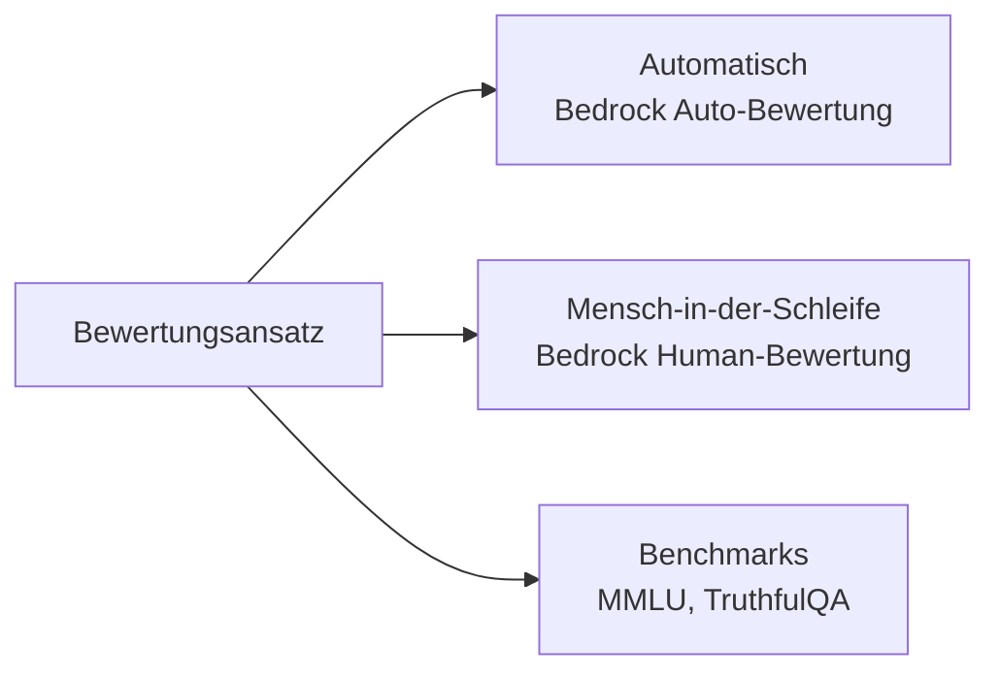
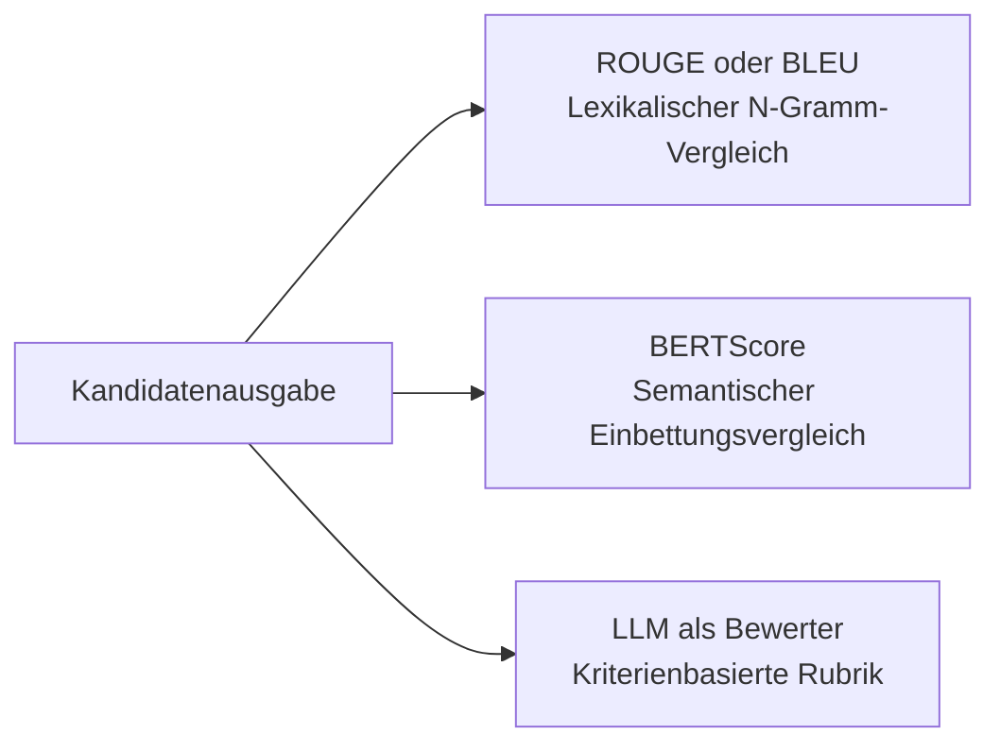
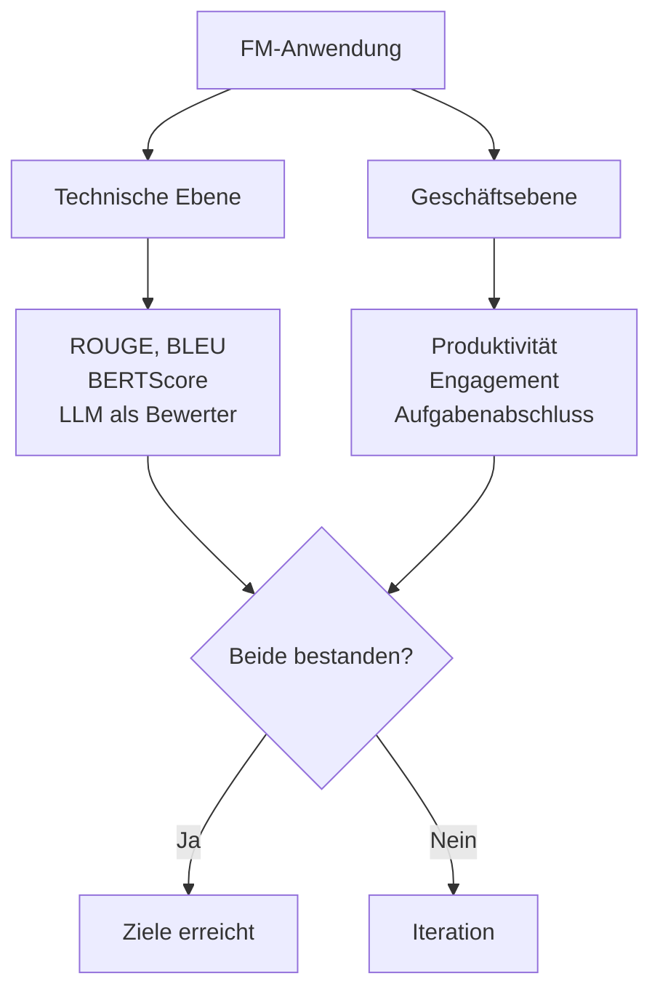
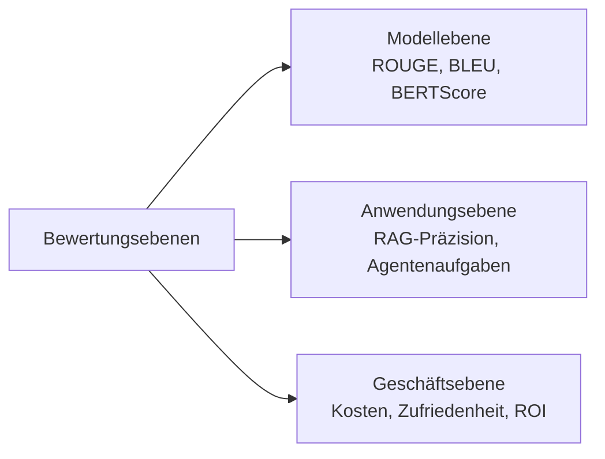

## Aufgabenstellung 3.4: Methoden zur Bewertung der FM-Leistung

Eine Foundation-Model-Anwendung ohne strukturierten Evaluierungsplan auszuliefern ist vergleichbar damit, Software ohne Tests zu veröffentlichen. Ein Modell kann in allgemeinen Benchmarks gute Werte erzielen und dennoch bei der geschäftlichen Aufgabe versagen, für die es entwickelt wurde. Oder es erfüllt technische Genauigkeitsziele, während die Nutzer es still und leise aufgeben. Diese Aufgabenstellung beschreibt, wie die Leistung von Basismodellen (FM) auf drei verschiedenen Ebenen gemessen wird: beim Modell selbst, bei der darauf aufbauenden Anwendung und beim Geschäftsergebnis, das es erbringen soll.[^304001]

### 3.4.1 Ansätze zur Bewertung der FM-Leistung

Die meisten Organisationen investieren mehr Zeit in die Auswahl eines Basismodells als in die Prüfung, ob es mit ihren eigenen Daten und Aufgaben tatsächlich ausreichend gut funktioniert. Diese Umkehrung der Prioritäten ist kostspielig. Ein Modell, das auf einer allgemeinen Rangliste gut abschneidet, kann beim spezialisierten Vokabular, bei den Dokumentlängen oder bei den Denkmustern, die die Arbeitsabläufe Ihrer Organisation erfordern, dennoch hinter den Erwartungen zurückbleiben. Evaluierung muss als erstrangige Aktivität betrachtet werden, die vor dem Einsatz geplant wird, nicht als Diagnoselauf, der erst nach dem Auftreten von Problemen durchgeführt wird.

Es gibt drei sich ergänzende Ansätze zur FM-Evaluierung. Der erste nutzt menschliche Prüfer, die die Ergebnisse direkt beurteilen. Der zweite verwendet kuratierte Benchmark-Datensätze, um die Leistung bei standardisierten Aufgaben zu messen. Der dritte setzt einen verwalteten Dienst ein, **Amazon Bedrock Model Evaluation**, der sowohl automatische als auch menschliche Bewertungen in einem kontrollierten und nachvollziehbaren Arbeitsablauf durchführt.[^304002]

**Mensch-in-der-Schleife-Bewertung** bezeichnet die Praxis, qualifizierte menschliche Prüfer in den Evaluierungsprozess einzubeziehen, um Modellausgaben anhand von Kriterien zu beurteilen, die automatisierte Metriken nicht erfassen können, etwa fachliche Korrektheit bei firmeninternen Themen, Tonangemessenheit oder Unbedenklichkeit.[^304003] In der Prüfungsversion 1.1 wurde dieser Begriff von „menschliche Bewertung" in „Mensch-in-der-Schleife-Bewertung" geändert, um zu betonen, dass Menschen die Evaluierung nicht von Anfang bis Ende durchführen, sondern an bestimmten Beurteilungspunkten innerhalb einer größeren automatisierten Pipeline eingesetzt werden.

In der Produktion treten drei verbreitete Mensch-in-der-Schleife-Muster auf:

- **Seite-an-Seite-Vergleich**: Einem Prüfer werden zwei Modellausgaben für denselben Prompt vorgelegt, und der Prüfer wählt die bessere aus, ohne zu wissen, welches Modell welche Ausgabe erzeugt hat. Dieses Design beseitigt den Ankereffekt und erzeugt eine relative Rangfolge zwischen Modellversionen oder Kandidatenmodellen. Es ist das Standardformat für die Präferenzerhebung in Studien zum *Bestärkenden Lernen aus menschlichem Feedback (RLHF)*.
- **Expertenbegutachtung**: Fachexperten (Ärzte, Juristen, Ingenieure) beurteilen, ob die Ausgaben sachlich korrekt und domänenangemessen sind. Allgemeine Prüfer können Flüssigkeit und Ton beurteilen; für die Korrektheit in Spezialgebieten sind Fachexperten erforderlich.
- **Rubrikbasierte Bewertung**: Prüfer vergeben für die Ausgaben Punkte auf einer Skala von 1 bis 5 entlang definierter Dimensionen, etwa Relevanz, Kohärenz, Unbedenklichkeit und Zitiergenauigkeit. Die rubrikbasierte Bewertung erzeugt numerische Daten, die im Laufe der Zeit aggregiert und verfolgt werden können.

**Amazon Mechanical Turk** (für Annotationsarbeiten mit hohem Volumen) und **Amazon SageMaker Ground Truth** (für verwaltete Beschriftungsworkflows) können die Prüfer-Belegschaft für diese Muster bereitstellen.[^304004] **Amazon Augmented AI (A2I)** stellt die Workflow-Schicht für die menschliche Überprüfung bei SageMaker-gehosteten Modellen und benutzerdefinierten Inferenz-Pipelines bereit: Es leitet Inferenzausgaben an ein Prüferteam weiter, wenn vom Entwickler definierte Bedingungen erfüllt sind, sammelt die Bewertungen und liefert die Ergebnisse zurück.[^304005] A2I ist besonders nützlich für Produktionsüberwachungsszenarien, in denen ein Modell täglich Tausende von Anfragen verarbeitet und nur eine Stichprobe davon eine menschliche Überprüfung erfordert. **Amazon Bedrock Model Evaluation** bietet eigene Aufträge zur menschlichen Bewertung an, die entweder mit einem internen Prüferteam oder einer von AWS verwalteten Belegschaft konfiguriert werden können. Dieser Weg ist die Standardwahl für die Bewertung von Basismodellen, die über Bedrock gehostet werden, und wird im weiteren Verlauf dieses Abschnitts behandelt.

Benchmark-Datensätze sind standardisierte Sammlungen von Eingabeaufforderungen und Referenzantworten, mit denen die Leistung eines Modells in bestimmten Fähigkeitsdimensionen gemessen wird.[^304006] Vier Benchmarks tauchen in der prüfungsrelevanten Literatur regelmäßig auf:

- **MMLU** (*Massive Multitask Language Understanding*): 57 akademische Fachgebiete aus MINT, Geisteswissenschaften, Recht und Medizin. Misst die Breite des allgemeinen Wissens und der Schlussfolgerungsfähigkeit.[^304007]
- **HellaSwag**: Alltagslogik und Satzvervollständigung. Misst, ob ein Modell die plausibleste Fortsetzung einer alltäglichen Situation vorhersagen kann.[^304008]
- **TruthfulQA**: Fragen, die darauf ausgelegt sind, zu prüfen, ob ein Modell bei Themen, zu denen verbreitete Missverständnisse existieren, sachlich korrekte Antworten liefert. Ein Modell, das auf Plausibilität statt auf Richtigkeit optimiert wurde, schneidet hier schlecht ab.[^304009]
- **HumanEval**: Eine Sammlung von Programmieraufgaben mit Testfällen, die die Code-Generierungsfähigkeit eines Modells misst. Ein Modell besteht eine Aufgabe, wenn der von ihm generierte Code die zugehörigen Unit-Tests besteht.[^304010]

Benchmarks liefern eine standardisierte und reproduzierbare Ausgangsbasis für den Vergleich von Modellversionen und Anbietern. Sie haben jedoch eine gut dokumentierte Schwäche namens *Benchmark-Sättigung*: Modelle, die nach der Veröffentlichung eines Benchmarks trainiert werden, können dessen Antworten unbeabsichtigt über aus dem Web gecrawlte Trainingsdaten aufnehmen und so ihre Punktzahlen über das Maß echter Leistungssteigerungen hinaus aufblähen.[^304011] Geschäftsteams sollten Benchmark-Rankings als Filterwerkzeug betrachten, nicht als endgültiges Urteil.

**Amazon Bedrock Model Evaluation** ist der verwaltete Dienst von AWS für automatische und menschliche Bewertungen von Modellen, die über Amazon Bedrock verfügbar sind.[^304012] Er unterstützt zwei Auftragstypen. Ein Auftrag zur *automatischen Bewertung* führt das ausgewählte Modell gegen einen integrierten oder benutzerdefinierten Prompt-Datensatz aus und bewertet die Antworten anhand von Metriken wie Genauigkeit, Robustheit und Toxizität, ohne menschliche Prüfer zu benötigen. Ein Auftrag zur *menschlichen Bewertung* leitet Modellausgaben an eine Prüferbelegschaft weiter, die entweder als internes Team oder als von AWS verwaltete Belegschaft konfiguriert werden kann, und sammelt deren Bewertungen anhand definierter Kriterien.[^304013]

Die integrierten automatischen Metriken in Bedrock Model Evaluation umfassen Genauigkeit (für Frage-Antwort-Aufgaben mit einer Referenzantwort), Robustheit (gemessen durch Variation der Eingabeaufforderungen und Überprüfung der Ausgabekonsistenz) sowie Toxizität (bewertet durch einen Klassifikator, der schädliche oder anstößige Inhalte kennzeichnet).[^304014] Benutzerdefinierte Prompt-Datensätze ermöglichen es Organisationen, mit eigenen repräsentativen Eingaben zu evaluieren, anstatt auf generische Datensätze zu setzen. Das schließt die Lücke zwischen Benchmark-Leistung und Produktionsverhalten.

*Abbildung 3.4.1: Drei FM-Bewertungsansätze. Automatische Metriken, Mensch-in-der-Schleife-Überprüfung und standardisierte Benchmarks erfassen jeweils das, was die anderen auslassen; Produktionsprogramme verwenden typischerweise alle drei in Kombination.*

### 3.4.2 Relevante Metriken zur Bewertung der FM-Leistung

Die Wahl der richtigen Metrik hängt davon ab, was das Modell produzieren soll. Ein Modell zur Zusammenfassung und ein Übersetzungsmodell erzeugen beide Text, aber die Qualität dieses Textes lässt sich am besten auf unterschiedliche Weisen messen. Ein Modell, das Code generiert, wird am besten danach bewertet, ob der Code korrekt ausgeführt wird. Dieser Abschnitt behandelt die vier Metriken, die das Prüfungscurriculum vorschreibt: ROUGE, BLEU, BERTScore und LLM als Bewerter.

**ROUGE** (*Recall-Oriented Understudy for Gisting Evaluation*) misst die Überlappung zwischen einer generierten Zusammenfassung und einer oder mehreren von Menschen verfassten Referenzzusammenfassungen.[^304015] Die gebräuchlichste Variante, ROUGE-L, zählt die längste gemeinsame Teilsequenz von Wörtern zwischen dem Kandidaten und der Referenz. Ein hoher ROUGE-Wert bedeutet, dass das Modell viele der gleichen Wörter wie die menschlich verfasste Referenz verwendet hat. ROUGE ist die Standardmetrik für die Evaluierung von Zusammenfassungen, weil die Zusammenfassungsaufgabe ein klares Erfolgskriterium hat: Die wesentlichen Informationen aus dem Quelldokument müssen in der Zusammenfassung vorhanden sein.

ROUGE hat eine bekannte Einschränkung: Es handelt sich um eine oberflächliche lexikalische Messung. Wenn das Modell eine Zusammenfassung erzeugt, die „der Kunde hat den Vertrag aufgelöst" enthält, während die Referenz „der Auftraggeber hat den Kontrakt storniert" besagt, werden die ROUGE-Werte niedrig ausfallen, obwohl beide Sätze semantisch identisch sind. Aus diesem Grund ist ROUGE am zuverlässigsten, wenn die Referenzzusammenfassungen selbst vielfältig sind (mehrere gültige Formulierungen abdecken) und wenn das Evaluierungskorpus groß genug ist, um Formulierungsvariationen über viele Beispiele hinweg auszugleichen.

**BLEU** (*Bilingual Evaluation Understudy*) wurde speziell für die maschinelle Übersetzung entwickelt und misst die *Präzision*: Welcher Anteil der N-Gramme (Wortfolgen) in der Kandidatenausgabe kommt in der Referenzübersetzung vor?[^304016] Im Unterschied zu ROUGE, das auf Rückruf ausgerichtet ist, bestraft BLEU Kandidaten, die kurze Ausgaben erzeugen, um den Rückruf künstlich zu erhöhen, und fügt einen Kürze-Malus hinzu, um übermäßig kurze Übersetzungen abzuwerten. BLEU bleibt die Standardmetrik beim Benchmarking maschineller Übersetzungen. Seine Einschränkung entspricht der von ROUGE: Es belohnt exakte Übereinstimmungen auf Wortebene und kann eine Übersetzung nicht würdigen, die Synonyme verwendet oder Sätze umstrukturiert, ohne die Bedeutung zu verändern.

**BERTScore** behebt die Schwäche lexikalischer Übereinstimmung von ROUGE und BLEU, indem es ein vortrainiertes BERT-Modell verwendet, um die *semantische Ähnlichkeit* zwischen Kandidat und Referenz auf Token-Ebene zu berechnen.[^304017] Anstatt exakte Wortübereinstimmungen zu zählen, kodiert BERTScore beide Texte in hochdimensionale Vektoren und misst die Kosinus-Ähnlichkeit zwischen den entsprechenden Tokens. Ein Kandidatensatz, der andere Wörter verwendet, um dieselbe Bedeutung auszudrücken, erzielt bei BERTScore einen höheren Wert als bei ROUGE oder BLEU. BERTScore ist robuster gegenüber Paraphrasen und wird zunehmend für die Evaluierung von Zusammenfassungen, Übersetzungen und allgemeiner Textqualität eingesetzt, insbesondere wenn eine Ausgabevielfalt erwartet oder gewünscht wird.

Der praktische Kompromiss zwischen den drei Metriken besteht darin, dass ROUGE und BLEU schnell, deterministisch und ohne zusätzliche Inferenzaufrufe auskommen, während BERTScore die Ausführung des BERT-Encoders sowohl für den Kandidaten als auch für die Referenz erfordert, was Rechenkosten und Latenz erhöht. Bei groß angelegten automatisierten Bewertungs-Pipelines berechnen Teams häufig ROUGE und BLEU für die Geschwindigkeit und ergänzen BERTScore als sekundäre Prüfung an einer Stichprobe.

**LLM als Bewerter** ist ein neuerer Ansatz, der im Prüfungscurriculum v1.1 hinzugefügt wurde. Dabei bewertet ein separates, hochqualitatives *Bewertermodell* die Ausgaben des zu testenden Modells anhand definierter Kriterien.[^304018] Das Bewertermodell erhält einen Prompt, der die ursprüngliche Frage, die Modellantwort und eine Bewertungsrubrik enthält, und gibt eine Punktzahl oder ein vergleichendes Präferenzurteil zurück. Dieser Ansatz ist schneller und kostengünstiger als eine menschliche Bewertung: Ein einzelner Inferenzaufruf des Bewertermodells ersetzt den Zeit- und Kostenaufwand eines menschlichen Prüfers. Außerdem ist er ohne Prüferbelegschaft skalierbar, was ihn für die Bewertung von Modellen an Zehntausenden von Beispielen praktikabel macht.

Die Einschränkungen sind real und für Prüfungsantworten relevant. „LLM als Bewerter" weist drei gut dokumentierte Verzerrungen auf.[^304019] Die *Positionsverzerrung* beschreibt die Tendenz, den Kandidaten zu bevorzugen, der im Prompt zuerst erscheint. Die *Längenverzerrung* beschreibt die Tendenz, längere Antworten höher zu bewerten, selbst wenn die Genauigkeit unverändert bleibt. Die *Selbstbegünstigungsverzerrung* tritt auf, wenn ein Modell zur Beurteilung seiner eigenen Ausgaben eingesetzt wird: Es bevorzugt Text, der seinem eigenen Stil ähnelt. Aus diesen Gründen verwenden Produktions-Pipelines für „LLM als Bewerter" typischerweise ein Bewertermodell, das sich vom getesteten Modell unterscheidet und in der Regel größer ist, variieren die Reihenfolge der Kandidaten bei Seite-an-Seite-Vergleichen und kalibrieren die Bewerterausgaben gegen einen zurückgehaltenen Satz menschlicher Bewertungen.

*Tabelle 3.4.1: Vergleich von FM-Ausgabequalitätsmetriken*

| Metrik | Aufgabenbereich | Was wird gemessen | Stärken | Einschränkungen |
|---|---|---|---|---|
| ROUGE | Zusammenfassung | Rückruf auf Wortebene ggü. Referenz | Schnell, standardisiert, kein Modell erforderlich | Bestraft gültige Paraphrasen |
| BLEU | Übersetzung | Präzision auf Wortebene ggü. Referenz | Schnell, standardisiert, Kürze-Malus | Bestraft gültige Synonyme |
| BERTScore | Allgemeine Textqualität | Semantische Ähnlichkeit via BERT-Einbettungsvektoren | Robust gegenüber Paraphrasen | Erfordert BERT-Inferenz, Rechenkosten |
| LLM als Bewerter | Beliebige generative Aufgabe | Kriterienbasierte Bewertung durch Bewertermodell | Skalierbar, flexible Kriterien | Positions-, Längen- und Selbstbegünstigungsverzerrung |

*Abbildung 3.4.2: Auswahl von Ausgabequalitätsmetriken. Lexikalische Metriken sind schnell, aber oberflächlich; semantische Metriken tolerieren Paraphrasen; kriterienbasierte Metriken sind flexibel, erfordern aber Verzerrungskontrollen.*

### 3.4.3 Prüfen, ob ein FM die Geschäftsziele erfüllt

Technische Metriken beantworten die Frage: „Produziert das Modell guten Text?" Geschäftsziele beantworten eine andere Frage: „Löst das Modell das Problem, für dessen Lösung es eingesetzt wurde?" Der Unterschied ist bedeutsam, denn ein Modell mit einem ROUGE-Wert von 0,72 verbessert die Produktivität von Analysten möglicherweise oder auch nicht. Ein Modell, das einen hohen BERTScore bei Kundenserviceantworten erzielt, senkt die Eskalationsrate von Support-Tickets möglicherweise oder auch nicht.

Um festzustellen, ob ein FM die Geschäftsziele erfüllt, muss das Modellverhalten mit messbaren Ergebnissen verknüpft werden, die für die Unternehmensverantwortlichen relevant sind. Das Prüfungscurriculum benennt drei Kategorien: Produktivität, Nutzerengagement und Aufgaben-Engineering.

**Produktivität** misst die pro Aufgabe eingesparte Zeit oder den eingesparten Aufwand.[^304020] Ein Rechtsteam, das ein FM zum Erstellen von Vertragszusammenfassungen nutzt, sollte berichten können, dass jeder Anwalt jetzt 20 Minuten für die Überprüfung von Zusammenfassungen aufwendet statt 90 Minuten für die manuelle Erstellung. Ein Entwickler-Tools-Team, das ein Code-Vervollständigungsmodell einsetzt, sollte den Pull-Request-Durchsatz oder die Zeit bis zum ersten Commit vor und nach der Einführung messen. Produktivitätssteigerungen sind die direkteste finanzielle Rechtfertigung für den FM-Einsatz und lassen sich am besten in kontrollierten Pilotprojekten messen, in denen eine Testgruppe das FM-gestützte Tool verwendet und eine Kontrollgruppe nicht.

**Nutzerengagement** erfasst, ob Nutzer das System tatsächlich verwenden, wie intensiv sie mit ihm interagieren und ob sie zurückkehren.[^304021] Relevante Indikatoren sind Sitzungen pro Nutzer und Woche, durchschnittliche Sitzungstiefe (Anzahl der Gesprächsrunden, bevor der Nutzer das Gespräch beendet oder die Aufgabe abbricht) und Rückkehrrate (der Anteil der Nutzer, die das System nach ihrer ersten Sitzung erneut nutzen). Engagement-Daten zeigen an, ob die FM-Anwendung ein Problem löst, das Nutzer schätzen, oder ob Nutzer sie nach einer schlechten ersten Erfahrung aufgeben. Ein FM, das technisch präzise Ausgaben produziert, aber verwirrend formuliert ist oder zu langsam antwortet, zeigt sinkendes Engagement, selbst wenn seine ROUGE-Werte stabil bleiben.

**Aufgaben-Engineering** ist der AWS-Prüfungsbegriff dafür, ob der FM-gestützte Arbeitsablauf die Geschäftsaufgabe tatsächlich von Anfang bis Ende abschließt, ohne menschliche Eingriffe in einem Ausmaß zu erfordern, das den Effizienzgewinn zunichte macht.[^304022] (Außerhalb der AWS-Materialien wird dieselbe Idee häufiger als *Workflow-Abschlussrate* oder *autonome Abschlussrate* bezeichnet.) Ein Kundenservice-Bot, der 80 % der Anfragen eigenständig löst, erreicht sein Aufgaben-Engineering-Ziel, wenn das Ziel bei 75 % lag. Ein Dokumentenprüfungs-Workflow, der erfordert, dass ein Mensch 60 % der FM-generierten Zusammenfassungen korrigiert, bevor sie archiviert werden, tut dies nicht. Aufgaben-Engineering auf dieser Zielebene konzentriert sich auf den tatsächlich eingesetzten Workflow; Abschnitt 3.4.5 führt die *Aufgabenabschlussrate* als die Entsprechung auf der Nutzerziel-Ebene ein, die misst, ob die zugrundeliegende Geschäftsaufgabe des Nutzers erledigt wurde.

Die praktische Konsequenz für Prüfungsszenarien: Eine Frage, die Symptome wie „Nutzer kehren nicht zurück" oder „das FM erledigt den ersten Schritt, aber ein Mensch muss den Rest abschließen" beschreibt, sollte das Denken auf Engagement- bzw. Aufgaben-Engineering-Metriken lenken, nicht auf ROUGE oder BLEU. Das Modell mag technisch leistungsfähig sein, scheitert aber auf Workflow-Ebene.

*Abbildung 3.4.3: Duales Bewertungsframework. Ein Modell muss sowohl die technische als auch die geschäftliche Bewertungsebene bestehen, um als geeignet für den vorgesehenen Einsatz zu gelten.*

### 3.4.4 Bewertung der Leistung von FM-basierten Anwendungen

Ein Basismodell wird selten isoliert eingesetzt. Produktionsanwendungen schichten Retrieval-Systeme, Agenten-Orchestrierung und mehrstufige Workflows über das Basismodell. Jede Schicht bringt ihre eigenen Fehlermodi mit sich. Wird nur das Basismodell evaluiert, bleiben die Fehler der Anwendungsschicht unsichtbar, bis sie in Produktionsbeschwerden sichtbar werden.

Das Prüfungscurriculum benennt drei Anwendungsarchitekturen, die jeweils einen eigenen Bewertungsansatz erfordern: Retrieval-Augmented Generation-Pipelines (RAG), KI-Agenten und mehrstufige Workflows.

**RAG-Bewertung** gliedert sich in zwei unabhängige Bereiche: Retrieval-Qualität und Generierungsqualität.[^304023] Die Retrieval-Qualität misst, ob der Vektorspeicher bei der Nutzeranfrage die richtigen Dokumente zurückgegeben hat. Die Generierungsqualität misst, ob das Modell auf Basis der abgerufenen Dokumente eine genaue und treue Antwort produziert hat. Ein Fehler in einem der beiden Teilsysteme führt zu einer schlechten Antwort, aber Ursache und Abhilfe sind unterschiedlich.

Die Retrieval-Qualität wird typischerweise mit *Precision@k* und *Recall@k* gemessen, wobei k die Anzahl der abgerufenen Dokumente ist.[^304024] Precision@k fragt: Welcher Anteil der k abgerufenen Dokumente war tatsächlich relevant? Recall@k fragt: Welcher Anteil aller relevanten Dokumente im Korpus erschien in den Top-k-Ergebnissen? Ein Retrieval-System mit hoher Präzision, aber niedrigem Rückruf findet zuverlässige Dokumente, übersieht aber wichtige. Ein System mit hohem Rückruf, aber niedriger Präzision gibt alles Relevante zurück, vergräbt es aber in Rauschen.

Die Generierungsqualität bei RAG wird durch *Verankertheit* (ob die Modellantwort durch die abgerufenen Dokumente gestützt wird, nicht aus dem parametrischen Modellgedächtnis stammt), *Antworttreue* (ob die Aussagen in der Antwort korrekt wiedergeben, was die abgerufenen Dokumente sagen) und *Zitiergenauigkeit* (ob die zitierten Quellen tatsächlich die ihnen zugeschriebenen Informationen enthalten) gemessen.[^304025] Tools wie **Ragas** bieten ein Open-Source-Evaluierungsframework, das diese Metriken automatisch berechnet, indem ein Bewertermodell über die abgerufenen Dokumente und die generierte Antwort läuft.[^304026]

**Agentenbewertung** misst, ob ein KI-Agent zugewiesene Aufgaben präzise, effizient und zu akzeptablen Kosten abschließt.[^304027] Da Agenten mehrstufige Pläne mit externen Tools ausführen, ist ihre Bewertungsfläche größer als bei einem einzelnen Antwortmodell. Relevante Metriken sind:

- **Aufgabenabschlussrate**: Der Prozentsatz der zugewiesenen Aufgaben, die der Agent ohne menschliches Eingreifen oder Fehlerausgang abschließt.
- **Tool-Auswahlgenauigkeit**: Ob der Agent bei jedem Schritt das richtige Tool gewählt hat (relevant, wenn der Agent auf mehrere APIs zugreifen kann und die richtige Wahl bei gegebener Aufgabenbeschreibung deterministisch ist).
- **Schritteffizienz**: Die Anzahl der Tool-Aufrufe, die zum Abschluss einer Aufgabe erforderlich sind, verglichen mit der Mindestanzahl, die ein gut konzipierter Plan erfordern würde. Eine hohe Schrittanzahl deutet darauf hin, dass der Agent unnötigerweise umplant oder fehlerhafte Tool-Argumente produziert, die Wiederholungsversuche auslösen.
- **Kosten pro Aufgabe**: Der gesamte Inferenz- und Tool-Aufruf-Kostenaufwand für die Erledigung einer Aufgabe. Dies ist eine direkte Geschäftsmetrik für Agenten, die in großem Maßstab betrieben werden.

Amazon Bedrock stellt Agentenbewertungsfähigkeiten für Bedrock Agents und über AgentCore eingesetzte Agenten bereit, einschließlich Test-Harnesses, schrittweiser Traces und integrierter Bewertungsaufträge, die an den oben genannten Agentenmetriken ausgerichtet sind. Die genauen Funktionsnamen und den Umfang entnehmen Sie bitte dem aktuellen Amazon Bedrock User Guide, da die Agentenbewertungsfunktionen weiterentwickelt werden.[^304028]

**Workflow-Bewertung** gilt für mehrstufige Pipelines, die FM-Aufrufe, RAG-Retrievals, Geschäftslogik und menschliche Übergaben zu einem vollständigen Geschäftsprozess verbinden.[^304029] Metriken umfassen die End-to-End-Erfolgsrate (welcher Anteil der Workflow-Instanzen ohne Fehlerausgang oder erzwungenen menschlichen Eingriff abgeschlossen wird), die Fehlerkategorienverteilung (welcher Schritt am häufigsten zu Fehlern führt) und die Fallback-Rate (wie häufig der Workflow auf einen menschlichen Fallback-Pfad umgeleitet wird).

*Tabelle 3.4.2: Bewertungsmetriken nach Anwendungsarchitektur*

| Architektur | Retrieval-Metriken | Generierungsmetriken | Geschäftsmetriken |
|---|---|---|---|
| Nur Basis-FM | Nicht anwendbar | ROUGE, BLEU, BERTScore, LLM als Bewerter | Produktivität, Engagement |
| RAG-Pipeline | Precision@k, Recall@k | Verankertheit, Antworttreue, Zitiergenauigkeit | Aufgabenabschluss, Nutzerzufriedenheit |
| KI-Agent | Tool-Auswahlgenauigkeit, Schritteffizienz | Antwortrichtigkeit, Halluzinationsrate | Aufgabenabschlussrate, Kosten pro Aufgabe |
| Mehrstufiger Workflow | Nicht anwendbar | Fehlerkategorienverteilung | End-to-End-Erfolgsrate, Fallback-Rate |

*Abbildung 3.4.4: Geschichtete Bewertungsarchitektur. Jede Schicht des Anwendungsstapels erfordert einen eigenen Bewertungsansatz; Fehler auf einer Ebene wirken sich auf das Geschäftsergebnis aus.*

### 3.4.5 Metriken zur Ausrichtung an Geschäftszielen für KI-Anwendungen

Die Metriken aus Abschnitt 3.4.2 zeigen, ob das Modell technisch gut funktioniert. Die Metriken aus Abschnitt 3.4.4 zeigen, ob die Anwendung korrekt läuft. Metriken zur Geschäftszielausrichtung beantworten die Frage, die den sponsernden Entscheidungsträger tatsächlich interessiert: Erzeugt diese KI-Investition Wert?

Das Prüfungscurriculum v1.1 hat dies als eigenständiges Lernziel hinzugefügt. Das signalisiert, dass das Examen von den Kandidaten erwartet, die Lücke zwischen technischer Messung und geschäftlicher Verantwortlichkeit zu verstehen und zu wissen, welche Instrumente diese Lücke schließen.

**Aufgabenabschlussrate** ist der Prozentsatz der vom Nutzer initiierten Aufgaben, die die KI-Anwendung erfolgreich abschließt, ohne dass der Nutzer die Aufgabe abbrechen, einen anderen Kanal um Hilfe bitten oder an einen menschlichen Mitarbeiter eskalieren muss.[^304030] Sie unterscheidet sich von der Agenten-Aufgabenabschlussrate (Abschnitt 3.4.4) im Umfang: Die Agenten-Aufgabenabschlussrate misst, ob die Orchestrierungsschicht ihren Plan abgeschlossen hat, während die geschäftliche Aufgabenabschlussrate misst, ob das zugrundeliegende Ziel des Nutzers erreicht wurde. Ein Nutzer, der die KI gebeten hat, einen Konferenzraum zu buchen, eine Bestätigung erhalten hat, dann aber feststellte, dass der Raum bereits belegt war, hat aus Geschäftsperspektive keine abgeschlossene Aufgabe erlebt, auch wenn alle API-Aufrufe des Agenten Erfolgscodes zurückgegeben haben.

Die Aufgabenabschlussrate ist die einzige Metrik, die das Verhalten der FM-Anwendung am direktesten mit dem Geschäftsfall für den Einsatz verbindet. Wurde die Anwendung eingesetzt, um die Anzahl der Support-Tickets zu reduzieren, die einen menschlichen Mitarbeiter erreichen, misst die Aufgabenabschlussrate genau, wie gut sie dieses Ziel erreicht. In Prüfungsszenarien ist die Aufgabenabschlussrate die BESTE Antwort, wenn die Frage lautet, wie gemessen werden soll, ob eine KI-Anwendung ihr primäres Geschäftsziel erfüllt.

**Nutzerzufriedenheit** erfasst, wie Nutzer die Qualität ihrer Interaktionen mit der KI-Anwendung wahrnehmen.[^304031] Gängige Instrumente sind Befragungen nach der Interaktion (*CSAT*, der Customer Satisfaction Score, bei dem Nutzer ihre Erfahrung auf einer numerischen Skala bewerten), *NPS* (Net Promoter Score, der fragt, ob der Nutzer die Anwendung einem Kollegen empfehlen würde) und In-Produkt-Feedback (Daumen-hoch/Daumen-runter-Bewertungen, die am Ende jeder Antwort gesammelt werden). Im Unterschied zur Aufgabenabschlussrate, die eine objektive Messung dessen ist, was passiert ist, ist die Nutzerzufriedenheit eine subjektive Messung, wie der Nutzer es empfunden hat. Beide sind notwendig. Ein Spesenberichts-Assistent, der Einreichungen in zwei Klicks bearbeitet, dabei aber einen knappen Ton verwendet, kann einen CSAT unter 3,5 verzeichnen, selbst wenn seine Aufgabenabschlussrate über 90 Prozent liegt; Nutzer werden nach einem alternativen Tool suchen, sobald eines verfügbar ist.

**Kosten pro Interaktion** misst den gesamten Cloud- und Lizenzierungsaufwand für die Bearbeitung einer Nutzeranfrage durch den gesamten Anwendungsstapel, vom API-Aufruf über den Retrieval-Schritt (falls vorhanden) bis zum FM-Inferenzaufruf und jeder nachgelagerten Verarbeitung.[^304032] In einer RAG-Pipeline umfassen die Kosten pro Interaktion den Einbettungsmodell-Aufruf, die Vektorsuchanfrage und den FM-Generierungsaufruf. In einem Agenten-Workflow zählen dazu alle Tool-Aufrufe und Inferenzschritte im Plan. Die Kosten pro Interaktion müssen dem Erlös oder Wert pro Interaktion gegenübergestellt werden, um zu bestimmen, ob die Stückökonomie der Anwendung bei Skalierung tragfähig ist. Eine Anwendung, die 0,05 US-Dollar pro Interaktion kostet und 0,10 US-Dollar an messbarem Wert erzeugt (etwa durch Einsparungen bei abgelenkten Support-Tickets), ist nachhaltig. Eine, die 0,08 US-Dollar pro Interaktion bei demselben Wert von 0,10 US-Dollar kostet, lässt wenig Spielraum für Infrastrukturreserven.

Die Verfolgung dieser Metriken erfordert die Verknüpfung der Telemetrie der KI-Anwendung mit einer Business-Intelligence-Schicht. **Amazon CloudWatch** erfasst Betriebsmetriken, Protokolle und Traces von Amazon Bedrock und dem Anwendungscode, einschließlich Latenz, Fehlerraten und Aufrufanzahlen pro Modell.[^304033] Diese Betriebssignale können mit Ereignissen der Anwendungsschicht kombiniert werden (Aufgabe abgeschlossen, Nutzer hat Daumen nach unten gegeben, Interaktionskosten protokolliert), um ein vollständiges Bild zu erstellen. **Amazon QuickSight** verbindet sich mit CloudWatch-Daten und anderen Datenquellen, um Dashboards zu erstellen, die Aufgabenabschlussrate, Nutzerzufriedenheitstrends und Kosten pro Interaktion in Formaten präsentieren, die für Unternehmensverantwortliche zugänglich sind, die CloudWatch-Metrikgraphen nicht direkt lesen.[^304034]

*Tabelle 3.4.3: Geschäftsausrichtungsmetriken für KI-Anwendungen*

| Metrik | Was wird gemessen | Datenquelle | Stakeholder | Zu treffende Entscheidung |
|---|---|---|---|---|
| Aufgabenabschlussrate | Ob Nutzerziele erreicht werden | Anwendungsereignisprotokolle | Produkt, Betrieb | Umfang oder Fallback-Logik anpassen |
| Nutzerzufriedenheit (CSAT, NPS) | Nutzerwahrnehmung der Qualität | Befragungen nach der Interaktion, Daumen-Feedback | Produkt, CX | Antwortqualität oder UX verbessern |
| Kosten pro Interaktion | Stückökonomie der KI-Auslieferung | CloudWatch-Abrechnungs- und Aufruf-Daten | Finanzen, Engineering | Modell-Tier, Caching oder Workflow optimieren |

Ein gut konzipiertes Bewertungsprogramm überwacht alle drei Geschäftsmetriken kontinuierlich, nicht nur zum Zeitpunkt der Markteinführung. Die Aufgabenabschlussrate kann sinken, wenn Nutzeranfragen von den Mustern abweichen, an denen das Modell getestet wurde. Die Nutzerzufriedenheit kann sinken, wenn der Neuheitseffekt nachlässt und Nutzer die KI mit verbesserten Alternativen vergleichen. Die Kosten pro Interaktion können steigen, wenn sich die Nutzungsmuster zu längeren und komplexeren Anfragen verschieben. Die regelmäßige Überprüfung aller drei Metriken anhand definierter Schwellenwerte ist die operative Disziplin, die ein verwaltetes KI-Produkt von einem Prototyp unterscheidet, der ausgeliefert und vergessen wurde.

## Selbsttestfragen

**Frage 1.** Eine Gesundheitsorganisation setzt ein FM-gestütztes Tool ein, das Pflegepersonal bei der Suche nach Informationen in klinischen Protokollen unterstützt. Vor dem Produktivbetrieb möchte das Team sicherstellen, dass das Modell sachlich korrekte, domänenangemessene Antworten zu spezialisierten medizinischen Fachbegriffen liefert. Welcher Bewertungsansatz ist für diese Anforderung am geeignetsten?

A. Das Modell gegen den MMLU-Benchmark laufen lassen und es akzeptieren, wenn die Punktzahl 70 % übersteigt  
B. Amazon Bedrock Model Evaluation mit einem automatischen Toxizitätserkennungsauftrag verwenden  
C. Amazon Augmented AI (A2I) verwenden, um Modellausgaben zur rubrikbasierten Bewertung an klinische Experten weiterzuleiten  
D. BLEU-Werte gegenüber einer Menge klinischer Referenzzusammenfassungen berechnen  

**Erläuterung:** Die entscheidende Anforderung in diesem Szenario ist die domänenspezifische sachliche Korrektheit, bewertet durch Personen, die beurteilen können, ob eine medizinische Antwort klinisch präzise ist. Allgemeine Prüfer und automatisierte Metriken können dieses Urteil nicht fällen. Antwort C ist korrekt: Amazon A2I unterstützt Mensch-in-der-Schleife-Bewertungsworkflows, die Ausgaben an einen definierten Prüferpool weiterleiten können, etwa ein Gremium aus klinischen Pflegekräften oder Ärzten, die Antworten anhand einer Rubrik zu Genauigkeit, Klarheit und Angemessenheit bewerten. Antwort A ist falsch, weil MMLU ein allgemeiner akademischer Benchmark ist; 70 % in 57 akademischen Fächern zu erzielen sagt nichts darüber aus, ob das Modell Anfragen zu klinischen Protokollen korrekt behandelt, und der Schwellenwert steht in keinem Zusammenhang mit klinischen Sicherheitsanforderungen. Antwort B ist falsch, weil ein Toxizitätsauftrag misst, ob das Modell schädliche oder anstößige Inhalte produziert; er bewertet keine klinische Genauigkeit. Antwort D ist falsch, weil BLEU die Präzision auf Wortebene gegenüber einem Referenztext misst und nicht erkennt, ob die vermittelten klinischen Informationen korrekt sind; eine plausibel klingende, aber sachlich falsche Antwort könnte bei BLEU gut abschneiden, wenn sie das Vokabular der Referenz teilt.[^304035]

---

**Frage 2.** Eine Organisation vergleicht zwei Basismodelle für eine Nachrichtenzusammenfassungsaufgabe. Beide Modelle produzieren flüssiges Deutsch. Das Bewertungsteam verfügt über 500 von Menschen verfasste Referenzzusammenfassungen zu denselben Artikeln. Welche Metrik ist als primäres Bewertungssignal für diese Aufgabe am geeignetsten?

A. BERTScore, weil es semantische Ähnlichkeit misst und Paraphrasen toleriert  
B. BLEU, weil es für die Bewertung von Textgenerierung gegenüber Referenzen entwickelt wurde  
C. ROUGE, weil es speziell für die Zusammenfassungsbewertung entwickelt wurde und den Rückruf wesentlicher Inhalte misst  
D. LLM als Bewerter, weil ein Bewertermodell Kohärenz ohne Referenzzusammenfassung bewerten kann  

**Erläuterung:** ROUGE (Antwort C) wurde speziell für die Zusammenfassungsbewertung entwickelt, und sein Design spiegelt die Kernanforderung dieser Aufgabe wider: Eine gute Zusammenfassung muss die wesentlichen Informationen aus dem Quelldokument enthalten, was ein Rückrufproblem ist. ROUGE-L, die gebräuchlichste Variante, misst die längste gemeinsame Teilsequenz von Wörtern zwischen Kandidat und Referenz und belohnt Zusammenfassungen, die die Hauptpunkte in beliebiger Reihenfolge abdecken. Antwort A ist technisch gesehen als sekundäre Metrik valide, aber BERTScore erfordert die Ausführung eines BERT-Encoders für jedes Kandidaten-Referenz-Paar, was Rechenkosten erhöht; es ist am wertvollsten, wenn die Referenzzusammenfassungen unterschiedliches Vokabular verwenden und lexikalische Überlappung gültige Paraphrasen ungerechterweise bestrafen würde. Wenn die Organisation semantische Robustheit zur Bewertung hinzufügen möchte, ist BERTScore eine geeignete Ergänzung, kein Ersatz. Antwort B ist falsch, weil BLEU eine präzisionsorientierte Metrik ist, die für die Übersetzung entwickelt wurde, bei der die genaue Formulierung in der Zielsprache wichtig ist; bei der Zusammenfassung hat der Rückruf von Inhalten Vorrang vor der Präzision der Formulierung. Antwort D ist falsch, weil „LLM als Bewerter" am wertvollsten ist, wenn keine Referenzzusammenfassung vorhanden ist und ein menschenähnliches Urteil erforderlich ist; wenn 500 Referenzzusammenfassungen verfügbar sind, sind referenzbasierte Metriken das zuverlässigere und reproduzierbarere primäre Signal.[^304036]

---

**Frage 3.** Ein Unternehmen hat vor drei Monaten ein internes Q&A-Tool auf RAG-Basis eingesetzt. Nutzer berichten, dass das Tool häufig Antworten gibt, die selbstsicher klingen, aber Informationen enthalten, die sich nicht in den Unternehmensdokumenten finden. Welche Bewertungsmetrik identifiziert diesen Fehlermodus am direktesten?

A. ROUGE-L-Wert gegenüber menschlich verfassten Referenzantworten  
B. Verankertheitswert, der misst, ob Antworten durch abgerufene Dokumente gestützt werden  
C. Precision@k, der die Relevanz der k abgerufenen Top-Dokumente misst  
D. Aufgabenabschlussrate, die misst, ob Nutzer das Tool nützlich finden  

**Erläuterung:** Das beschriebene Symptom (selbstsicher klingende Antworten, die Informationen enthalten, die nicht in den Quelldokumenten zu finden sind) ist die Definition schlechter *Verankertheit*: Das Modell generiert Inhalte aus seinem parametrischen Gedächtnis statt aus den abgerufenen Dokumenten. Antwort B ist korrekt. Verankertheit wird bewertet, indem jede Aussage in der generierten Antwort gegen den abgerufenen Dokumentensatz geprüft und bewertet wird, welcher Anteil der Aussagen durch mindestens ein abgerufenes Dokument gestützt wird. Tools wie Ragas berechnen diese Metrik automatisch. Antwort A ist falsch, weil ROUGE-L die Wortüberlappung mit einer menschlichen Referenzantwort misst; es würde halluzinierte Inhalte nicht erkennen, die plausibles Vokabular verwenden, das nicht in der Referenz enthalten ist. Antwort C ist falsch, weil Precision@k die Qualität des Retrievals misst, nicht der Generierung; ein Retrieval-System könnte hochrelevante Dokumente zurückgeben, während das Modell diese ignoriert und aus dem parametrischen Gedächtnis generiert. Antwort D ist falsch, weil die Aufgabenabschlussrate misst, ob das Nutzerziel erreicht wurde; das beschriebene Symptom kann zu geringer Zufriedenheit führen, ohne den formalen Aufgaben-Fehlerpfad auszulösen, den die Anwendung verfolgt.[^304037]

---

**Frage 4.** Ein KI-Produktmanager präsentiert dem CFO den Geschäftsfall für eine FM-gestützte Kundensupport-Chat-Anwendung. Der CFO bittet um eine einzige Metrik, die zeigt, ob die Anwendung bei Skalierung finanziell nachhaltig ist. Welche Metrik beantwortet diese Frage am besten?

A. BLEU-Wert für das Support-Antwort-Korpus  
B. Durchschnittliche Sitzungstiefe pro Nutzer  
C. Kosten pro Interaktion verglichen mit dem erzielten Wert pro Interaktion  
D. Fallback-Rate zu menschlichen Mitarbeitern  

**Erläuterung:** Die Frage des CFO betrifft die Stückökonomie: Erzeugt jede Interaktion einen Wert, der ihre Kosten rechtfertigt? Kosten pro Interaktion (Antwort C) misst den gesamten Cloud- und Lizenzierungsaufwand pro Nutzeranfrage durch den gesamten Anwendungsstapel. Im Vergleich mit dem gemessenen Wert pro Interaktion (zum Beispiel die durchschnittlichen Kosten eines menschlichen Mitarbeiters für dieselbe Anfrage) zeigt sie, ob die Anwendung bei der aktuellen und prognostizierten Nutzungsskala finanziell tragfähig ist. Antwort A ist falsch, weil BLEU eine Textqualitätsmetrik ist; sie hat keine Beziehung zu Kosten oder finanzieller Nachhaltigkeit. Antwort B (Sitzungstiefe) ist eine Engagement-Metrik, die anzeigt, ob Nutzer die Anwendung wertvoll finden, sagt dem CFO aber nichts über die Kostenstruktur. Antwort D (Fallback-Rate) ist eine nützliche Betriebsmetrik, die zum Verständnis der Wirtschaftlichkeit beiträgt, da jeder Fallback zu einem menschlichen Mitarbeiter die vollen Personalkosten statt der KI-Kosten verursacht; sie ist jedoch eine Teilgröße im finanziellen Gesamtbild, nicht die vollständige Sichtweise auf die Stückökonomie, die der CFO sucht. Kosten pro Interaktion, direkt mit dem Wert pro Interaktion verglichen, ist die Metrik, die die Frage des CFO beantwortet.[^304038]

---

**Frage 5.** Ein Team evaluiert eine neue FM-Version als Ersatz für das aktuelle Produktionsmodell. Es soll ermittelt werden, ob das neue Modell Ausgaben produziert, die menschliche Prüfer bevorzugen, ohne dass die Prüfer wissen, welches Modell welche Antwort erzeugt hat. Welcher Bewertungsansatz erfüllt diese Anforderung am direktesten?

A. Beide Modelle gegen den TruthfulQA-Benchmark laufen lassen und Perzentilränge vergleichen  
B. LLM als Bewerter mit dem aktuellen Produktionsmodell als Bewertermodell verwenden  
C. Menschlichen Seite-an-Seite-Vergleich verwenden, bei dem die Prüfer nicht wissen, welches Modell welche Ausgabe erzeugt hat  
D. BERTScore für beide Modelle gegenüber derselben Menge von Referenzausgaben berechnen  

**Erläuterung:** Die Anforderung hat zwei Teile: menschliches Präferenzurteil und Verblindung (Prüfer dürfen nicht wissen, welches Modell welche Ausgabe erzeugt hat). Antwort C ist das Mensch-in-der-Schleife-Bewertungsmuster, das speziell für diesen Anwendungsfall konzipiert wurde. Der Seite-an-Seite-Vergleich legt einem Prüfer zwei Ausgaben für denselben Prompt vor, der Prüfer wählt die bevorzugte Ausgabe, und das Design verhindert den Ankereffekt, indem nicht gekennzeichnet wird, welches Modell welche Ausgabe erzeugt hat. Dies erzeugt direkt eine Präferenzrangliste zwischen den beiden Modellversionen. Antwort A ist falsch, weil TruthfulQA ein Benchmark für sachliche Genauigkeit bei missverständnisanfälligen Themen ist; er misst keine allgemeine Ausgabequalitätspräferenz, und die Frage erwähnt sachliche Genauigkeit nicht als Kriterium. Antwort B ist auf subtile, aber wichtige Weise falsch: Das aktuelle Produktionsmodell als Bewertermodell zu verwenden führt zu Selbstbegünstigungsverzerrung; das aktuelle Modell wird tendenziell Ausgaben höher bewerten, die seinem eigenen Stil ähneln, was den Vergleich für das neue Modell ungerecht macht. Antwort D ist falsch, weil BERTScore die semantische Ähnlichkeit gegenüber Referenztexten berechnet, nicht die menschliche Präferenz zwischen zwei Kandidatenausgaben; es erfasst nicht das qualitative Urteil, das das Team sucht.[^304039]

---

**Frage 6.** Eine Organisation hat vor sechs Wochen einen FM-gestützten Beschaffungsassistenten eingeführt. Nutzungsdaten zeigen, dass 45 % der Nutzer, die den Assistenten ausprobieren, nach ihrer ersten Sitzung nicht zurückkehren. Die ROUGE-Werte des Modells bei Zusammenfassungstests liegen im oberen Quartil seiner Modellfamilie. Welche Geschäftsmetrik diagnostiziert am direktesten, ob dieses Engagementproblem auf die Ausgabequalität des Modells oder auf das Anwendungsdesign zurückzuführen ist?

A. Nutzerzufriedenheit (CSAT oder Daumen-Feedback), die unmittelbar nach jeder Interaktion gesammelt wird  
B. BERTScore, berechnet gegenüber einer Menge von Referenzantworten für Beschaffungsanfragen  
C. Aufgabenabschlussrate, gemessen durch das Anwendungsereignisprotokoll  
D. Precision@k für die RAG-Retrieval-Schicht  

**Erläuterung:** Das Szenario zeigt eine Diskrepanz: ROUGE-Werte sind stark (was darauf hindeutet, dass das Modell Text produziert, der gut mit Referenzen übereinstimmt), aber die Rückkehrrate ist niedrig (was darauf hindeutet, dass Nutzer die Anwendung nicht wertvoll genug finden, um sie wieder zu nutzen). Um zu diagnostizieren, ob das Problem in der Ausgabequalität oder im Anwendungsdesign liegt, benötigt die Organisation ein Signal von echten Nutzern, das deren subjektive Erfahrung widerspiegelt, nicht ein Signal von automatisierten Textüberlappungsmetriken. Nutzerzufriedenheit, die unmittelbar nach jeder Interaktion gesammelt wird (Antwort A), erfasst, ob Nutzer die Antwort hilfreich, präzise und so formuliert fanden, dass sie zurückkehren möchten. Ein Muster aus niedrigem CSAT trotz hohem ROUGE würde darauf hindeuten, dass die für die ROUGE-Bewertung verwendeten Referenzzusammenfassungen nicht widerspiegeln, was Nutzer im Beschaffungskontext tatsächlich schätzen, und auf ein Ausgabequalitäts- oder Formulierungsproblem hinweisen. Ein Muster aus mittlerem CSAT bei niedriger Rückkehrrate würde auf Anwendungsdesign-Faktoren (UX, Geschwindigkeit, Vertrauen) statt auf das Modell selbst hinweisen. Antwort B ist falsch, weil BERTScore eine weitere automatisierte Textqualitätsmetrik ist, die wie ROUGE die Ähnlichkeit mit Referenzen misst; sie würde die Lücke zwischen technischen Werten und Nutzerverhalten nicht erklären. Die Aufgabenabschlussrate (Antwort C) würde anzeigen, ob der Workflow abgeschlossen wurde, aber in diesem Szenario produziert der Workflow bereits starke technische Werte; das fehlende Signal ist das subjektive Urteil des Nutzers über diese abgeschlossene Interaktion, das nur CSAT oder Daumen-Feedback erfasst. Antwort D ist falsch, weil Precision@k die Retrieval-Qualität diagnostiziert; obwohl schlechtes Retrieval zu schlechten Antworten beitragen könnte, wäre dies ein sekundärer Untersuchungsschritt nach der Erhebung von Nutzerzufriedenheitsdaten.[^304040]

[^304001]: AWS Certification. AI Practitioner (AIF-C01) Exam Guide v1.1, Task Statement 3.4. URL: <https://docs.aws.amazon.com/aws-certification/latest/ai-practitioner-01/ai-practitioner-01-domain3.html>
[^304002]: Amazon Bedrock. Amazon Bedrock Model Evaluation overview. URL: <https://docs.aws.amazon.com/bedrock/latest/userguide/model-evaluation.html>
[^304003]: Amazon A2I. How Amazon Augmented AI works. URL: <https://docs.aws.amazon.com/sagemaker/latest/dg/a2i-how-it-works.html>
[^304004]: Amazon SageMaker. Amazon SageMaker Ground Truth labeling workflows. URL: <https://docs.aws.amazon.com/sagemaker/latest/dg/sms.html>
[^304005]: Amazon A2I. Use Amazon Augmented AI for human review. URL: <https://docs.aws.amazon.com/sagemaker/latest/dg/a2i-use-augmented-ai-a2i-human-review-loops.html>
[^304006]: Liang, P., et al. Holistic Evaluation of Language Models (HELM, 2022). URL: <https://arxiv.org/abs/2211.09110>
[^304007]: Hendrycks, D., et al. Measuring Massive Multitask Language Understanding (MMLU, 2020). URL: <https://arxiv.org/abs/2009.03300>
[^304008]: Zellers, R., et al. HellaSwag: Can a Machine Really Finish Your Sentence? (2019). URL: <https://arxiv.org/abs/1905.07830>
[^304009]: Lin, S., et al. TruthfulQA: Measuring How Models Mimic Human Falsehoods (2021). URL: <https://arxiv.org/abs/2109.07958>
[^304010]: Chen, M., et al. Evaluating Large Language Models Trained on Code (HumanEval, 2021). URL: <https://arxiv.org/abs/2107.03374>
[^304011]: Kiela, D., et al. Dynabench: Rethinking Benchmarking in NLP (2021). URL: <https://arxiv.org/abs/2104.14337>
[^304012]: Amazon Bedrock. Amazon Bedrock Model Evaluation jobs. URL: <https://docs.aws.amazon.com/bedrock/latest/userguide/model-evaluation-jobs.html>
[^304013]: Amazon Bedrock. Human evaluation using Amazon Bedrock Model Evaluation. URL: <https://docs.aws.amazon.com/bedrock/latest/userguide/model-evaluation-human.html>
[^304014]: Amazon Bedrock. Automatic evaluation metrics in Amazon Bedrock Model Evaluation. URL: <https://docs.aws.amazon.com/bedrock/latest/userguide/model-evaluation-automatic.html>
[^304015]: Lin, C.-Y. ROUGE: A Package for Automatic Evaluation of Summaries (2004). URL: <https://aclanthology.org/W04-1013>
[^304016]: Papineni, K., et al. BLEU: a Method for Automatic Evaluation of Machine Translation (2002). URL: <https://aclanthology.org/P02-1040>
[^304017]: Zhang, T., et al. BERTScore: Evaluating Text Generation with BERT (2019). URL: <https://arxiv.org/abs/1904.09675>
[^304018]: Zheng, L., et al. Judging LLM-as-a-Judge with MT-Bench and Chatbot Arena (2023). URL: <https://arxiv.org/abs/2306.05685>
[^304019]: Wang, P., et al. Large Language Models are not Fair Evaluators (2023). URL: <https://arxiv.org/abs/2305.17926>
[^304020]: Microsoft Research. The Total Economic Impact of GitHub Copilot (2023). URL: <https://resources.github.com/downloads/The-Total-Economic-Impact-of-GitHub-Copilot.pdf>
[^304021]: Amazon CloudWatch. Using Amazon CloudWatch to track user engagement metrics for AI applications. URL: <https://docs.aws.amazon.com/AmazonCloudWatch/latest/monitoring/working_with_metrics.html>
[^304022]: Amazon Bedrock. Evaluating agent task completion in Amazon Bedrock. URL: <https://docs.aws.amazon.com/bedrock/latest/userguide/agents-evaluation.html>
[^304023]: Es, S., et al. RAGAS: Automated Evaluation of Retrieval Augmented Generation (2023). URL: <https://arxiv.org/abs/2309.15217>
[^304024]: Manning, C., et al. Introduction to Information Retrieval: Precision and Recall at k (2008). URL: <https://nlp.stanford.edu/IR-book/>
[^304025]: Es, S., et al. RAGAS: Faithfulness and Answer Relevance Metrics (2023). URL: <https://arxiv.org/abs/2309.15217>
[^304026]: Ragas. Ragas: Evaluation framework for RAG pipelines. URL: <https://docs.ragas.io/>
[^304027]: Amazon Bedrock. Evaluating Amazon Bedrock Agents. URL: <https://docs.aws.amazon.com/bedrock/latest/userguide/agents-evaluation.html>
[^304028]: Amazon Bedrock User Guide. Evaluation capabilities for Bedrock Agents and AgentCore. URL: <https://docs.aws.amazon.com/bedrock/latest/userguide/agents.html>
[^304029]: Amazon Bedrock. Multi-step workflow evaluation with Amazon Bedrock. URL: <https://docs.aws.amazon.com/bedrock/latest/userguide/agents-test.html>
[^304030]: Amazon Bedrock. Measuring task completion in Amazon Bedrock application monitoring. URL: <https://docs.aws.amazon.com/bedrock/latest/userguide/model-evaluation.html>
[^304031]: Amazon Connect. Customer satisfaction scoring and AI contact center metrics. URL: <https://docs.aws.amazon.com/connect/latest/adminguide/metrics-definitions.html>
[^304032]: Amazon Bedrock. Monitoring Amazon Bedrock usage and costs with AWS Cost Explorer. URL: <https://docs.aws.amazon.com/bedrock/latest/userguide/monitoring-overview.html>
[^304033]: Amazon CloudWatch. Monitoring Amazon Bedrock with Amazon CloudWatch. URL: <https://docs.aws.amazon.com/bedrock/latest/userguide/monitoring-cloudwatch.html>
[^304034]: Amazon QuickSight. Getting started with Amazon QuickSight dashboards. URL: <https://docs.aws.amazon.com/quicksight/latest/user/getting-started.html>
[^304035]: Amazon A2I. Setting up a human review workflow with Amazon Augmented AI. URL: <https://docs.aws.amazon.com/sagemaker/latest/dg/a2i-create-flow-definition.html>
[^304036]: Lin, C.-Y. ROUGE: A Package for Automatic Evaluation of Summaries: task applicability (2004). URL: <https://aclanthology.org/W04-1013>
[^304037]: Es, S., et al. RAGAS: Groundedness evaluation for RAG pipelines (2023). URL: <https://arxiv.org/abs/2309.15217>
[^304038]: Amazon Bedrock. Tracking Amazon Bedrock invocation costs per application. URL: <https://docs.aws.amazon.com/bedrock/latest/userguide/monitoring-overview.html>
[^304039]: Zheng, L., et al. Judging LLM-as-a-Judge: bias characteristics and mitigations (2023). URL: <https://arxiv.org/abs/2306.05685>
[^304040]: Amazon CloudWatch. Collecting user feedback events in AI application telemetry. URL: <https://docs.aws.amazon.com/AmazonCloudWatch/latest/monitoring/working_with_metrics.html>
