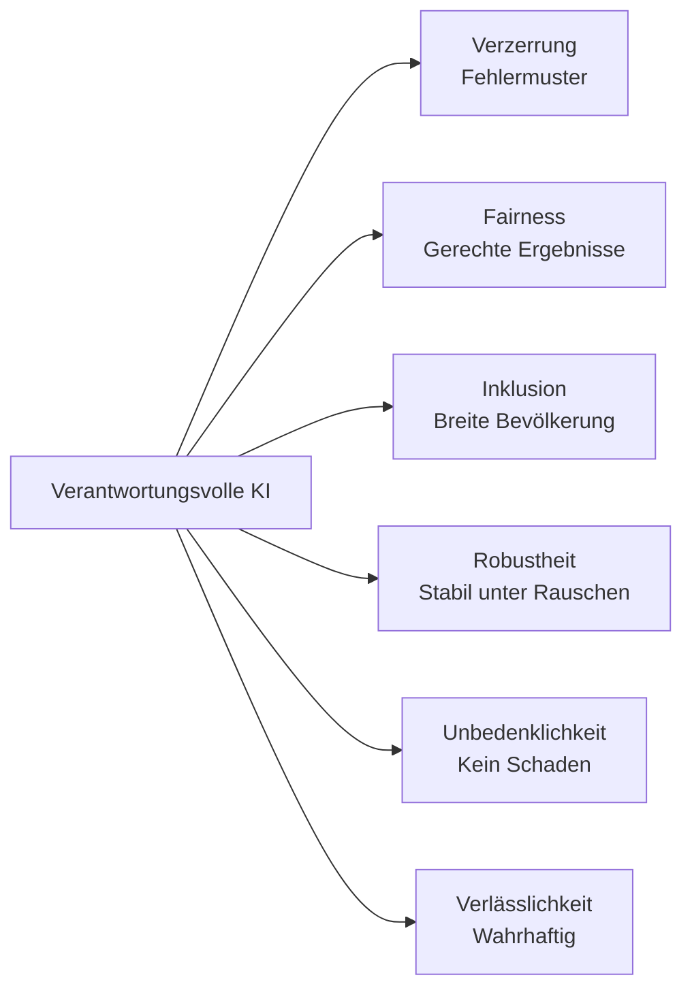
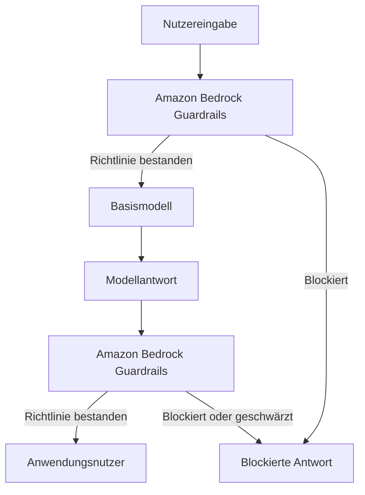
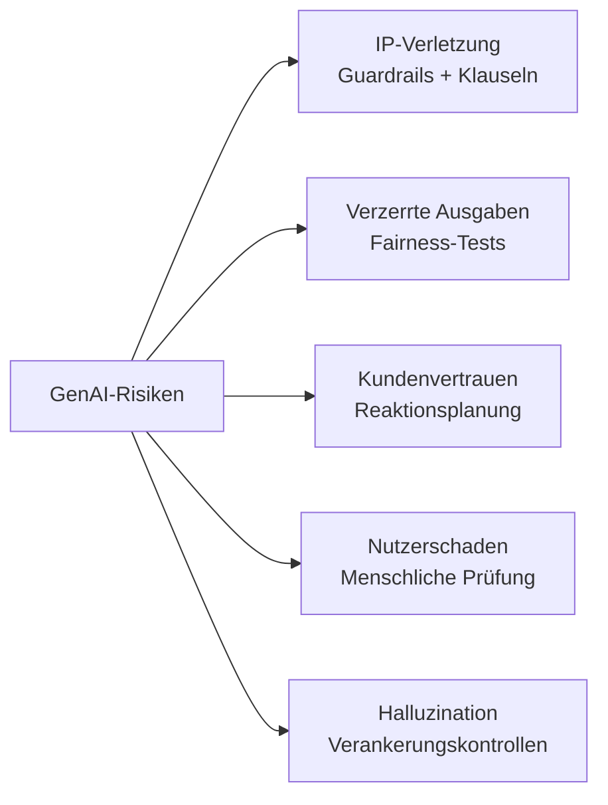
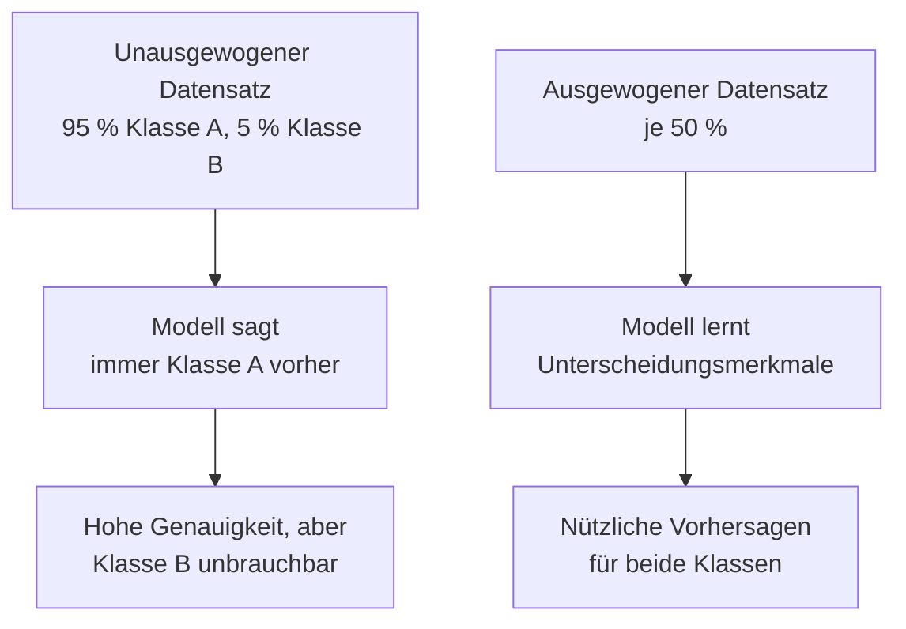
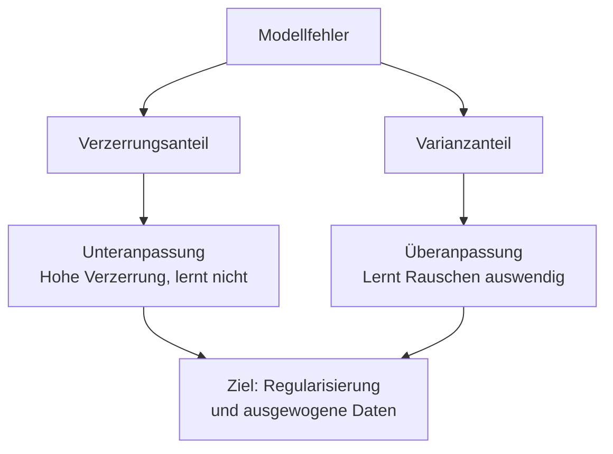

## Aufgabenstellung 4.1: Erklärung der Entwicklung verantwortungsvoller KI-Systeme

Verantwortungsvolle KI ist ein Bündel aus technischen und Governance-Verpflichtungen, das bestimmt, ob ein KI-System Ausgaben erzeugt, die fair, präzise und sicher für alle betroffenen Personen sind. Dieses Kapitel behandelt die sieben Ziele der Aufgabenstellung 4.1: die charakteristischen Merkmale verantwortungsvoller KI, die AWS-Werkzeuge zur Durchsetzung und Erkennung dieser Merkmale, verantwortungsvolle Praktiken bei der Modellauswahl, die spezifischen Rechtsrisiken generativer KI, die Datensatzeigenschaften, die verantwortungsvolle Systeme unterstützen, die Mechanismen von Verzerrung und Varianz sowie die Überwachungswerkzeuge, die verantwortungsvolles Verhalten im Produktionsbetrieb aufrechterhalten.[^401001]

### 4.1.1 Merkmale verantwortungsvoller KI

Ein KI-System, das als „verantwortungsvoll" bezeichnet wird, ist dies nicht in abstrakt allgemeiner Weise. Verantwortung äußert sich in fünf konkreten, nachweisbaren Eigenschaften (Fairness, Inklusion, Robustheit, Unbedenklichkeit und Verlässlichkeit), die jeweils im Gegensatz zu einem spezifischen Fehlermuster definiert sind: Verzerrung, Ausgrenzung, Anfälligkeit, Schaden oder Halluzination. Die *Verzerrung* ist das Fehlermuster, dem Fairness begegnet. Das AIF-C01 v1.1-Prüfungshandbuch führt „Verzerrung" neben den fünf positiven Eigenschaften auf, weil Verzerrung das in Szenariofragen am häufigsten geprüfte Fehlermuster ist. In diesem Buch werden alle sechs gemeinsam behandelt, damit die Zuordnung von Fehlermuster zu Eigenschaft explizit wird.

Die Eigenschaften sind voneinander verschieden, aber miteinander verbunden. Ein System kann bei einer Eigenschaft versagen und bei anderen bestehen. Ein Kreditentscheidungsmodell kann gegenüber verrauschten Eingaben robust sein und dennoch gegenüber einer geschützten demografischen Gruppe systematisch unfair handeln. Ein medizinischer Beratungs-Chatbot kann unbedenklich und inklusiv sein, aber häufig ungenaue Aussagen treffen. Prüfungsfragen testen, ob die Kandidaten diese Eigenschaften benennen und unterscheiden können; jede Definition hat daher ihren eigenen Stellenwert.[^401002] Das NIST AI Risk Management Framework fasst diese Eigenschaften unter dem Begriff „Vertrauenswürdigkeitsmerkmale" zusammen. Kandidaten, die diesen Rahmen kennen, werden Szenariofragen präziser beantworten.[^401050]

Die Eigenschaften sind:

- **Verzerrung** (das Fehlermuster, dem Fairness begegnet): Eine systematische Schiefe in den Vorhersagen eines Modells, die eine bestimmte Gruppe konsistent bevorzugt oder benachteiligt. Ein Modell zur Lebenslaufauswahl, das hauptsächlich auf historischen Einstellungsdaten einer männerdominierten Branche trainiert wurde, kann identische Lebensläufe schlechter bewerten, wenn oben ein weiblicher Name erscheint. Verzerrung in diesem Sinne ist kein zufälliger Fehler, sondern ein vorhersagbarer und gerichteter Fehler, der Schaden auf bestimmte Bevölkerungsgruppen konzentriert.[^401003]
- **Fairness**: Konsistente Behandlung von Einzelpersonen über demografische Gruppen hinweg. Ein Kreditmodell ist fair, wenn es unabhängig von Rasse, Geschlecht oder Alter des Antragstellers dieselben Entscheidungskriterien anwendet. Fairness wird häufig numerisch gemessen, etwa durch den Vergleich von Genehmigungsraten oder Falsch-Positiv-Raten zwischen Gruppen, um sicherzustellen, dass keine Gruppe unverhältnismäßig benachteiligt wird.[^401004]
- **Inklusion**: Das Modell funktioniert gut für eine breite Nutzergruppe, einschließlich Personen, die in den Trainingsdaten möglicherweise unterrepräsentiert sind. Ein Bilderkennungsmodell, das hauptsächlich auf Fotos hellhäutiger Gesichter trainiert wurde, kann für dunkelhäutige Nutzer schlechter abschneiden. *Inklusion* schließt diese Abdeckungslücke, indem sichergestellt wird, dass das Modell über die gesamte zu bedienende Bevölkerung hinweg trainiert und getestet wurde.[^401005]
- **Robustheit**: Gleichmäßiges, vorhersagbares Verhalten bei unerwarteten oder adversariellen Eingaben. Ein Kundendienst-Chatbot sollte keinen schädlichen Inhalt zurückgeben, wenn ein Nutzer eine fehlerhaft geschriebene Anfrage eingibt; ein Betrugserkennungsmodell sollte bei unerwarteten Transaktionsspitzen nicht zusammenbrechen. Robustheit misst, wie gut ein System sein beabsichtigtes Verhalten an den Rändern seiner Eingabeverteilung aufrechterhält.[^401006]
- **Unbedenklichkeit**: Das Modell verursacht keinen Schaden für Nutzer, Dritte oder die Gesellschaft. Unbedenklichkeit umfasst physische Risiken (ein Modell, das Maschinen steuert), informationelle Risiken (ein Modell, das gefährliche medizinische Ratschläge ohne Vorbehalte erteilt) und systemische Risiken (ein Modell, das Fehlinformationen in großem Maßstab verstärkt). Die EU-Regulatoren stufen KI-Systeme ausdrücklich nach ihrem jeweiligen Risikoniveau für Unbedenklichkeit ein und verknüpfen jede Kategorie mit rechtlichen Verpflichtungen.[^401007]
- **Verlässlichkeit**: Das Modell erzeugt Ausgaben, die wahrheitsgemäß und sachlich fundiert sind. Dies ist besonders wichtig für Große Sprachmodelle (LLM), die selbstsicherklingenden Text zu Themen erzeugen können, bei denen die Trainingsdaten spärlich, unvollständig oder veraltet sind. *Halluzinationen* sind der kanonische Verlässlichkeitsfehler: Ein Modell erfindet ein Zitat, eine Statistik oder eine Person und präsentiert dies als Tatsache.[^401008]

*Abbildung 4.1.1: Die im Prüfungshandbuch aufgeführten Eigenschaften verantwortungsvoller KI. Verzerrung ist das Fehlermuster, das die anderen fünf positiven Eigenschaften verhindern sollen.*

Diese Eigenschaften existieren nicht isoliert. Ein Datensatz, dem demografische Vielfalt fehlt (geringe Inklusion auf Datenebene), erzeugt verzerrte Vorhersagen (das Verzerrungsfehlermuster) und führt zu unfairen Ergebnissen (Versagen der Fairness-Eigenschaft). Die Eigenschaften verstärken sich gegenseitig, wenn sie erfüllt sind, und häufen Fehler an, wenn sie verletzt werden: Dieselbe Datenlücke kann gleichzeitig Verzerrung, Unfairness und mangelnde Inklusion auslösen.[^401051]

### 4.1.2 Werkzeuge zur Erkennung von Merkmalen verantwortungsvoller KI

Die sechs Eigenschaften verantwortungsvoller KI zu kennen ist nur nützlich, wenn es praktische Mechanismen gibt, um sie auf Systemebene durchzusetzen. AWS stellt dafür zwei primäre Werkzeuge bereit: **Amazon Bedrock Guardrails** für generative KI-Anwendungen und **Amazon SageMaker Clarify** für klassische Modelle des Maschinellen Lernens (ML). Jedes Werkzeug richtet sich auf einen anderen Punkt in der KI-Pipeline und auf eine andere Art von Risiko.[^401009]

**Amazon Bedrock Guardrails** legt eine konfigurierbare Richtlinienschicht zwischen eine Anwendung und jedes Basismodell (FM), auf das über Amazon Bedrock zugegriffen wird. Wenn ein Nutzer eine Eingabeaufforderung (Prompt) sendet oder wenn das Modell eine Antwort zurückgibt, bewertet Guardrails den Inhalt anhand der konfigurierten Richtlinie und lässt ihn entweder durch, ändert ihn oder blockiert ihn vollständig. Dies geschieht transparent für das zugrundeliegende Modell, was bedeutet, dass derselbe Guardrail mehrere Modelle schützen kann, ohne das Modell selbst zu ändern.[^401010]

Guardrails gruppiert seine Kontrollen in mehrere Filtertypen:

- **Inhaltsfilter**: Blockieren oder schwärzen Inhalte in fünf vordefinierten Schadenskategorien: *Hassrede*, *Beleidigungen*, *sexuelle Inhalte*, *Gewalt* und *Fehlverhalten*. Jede Kategorie kann auf einen Schwellenwert von niedrig bis hoch eingestellt werden, je nach Sensibilität der Anwendung. Eine Bildungsplattform für Kinder würde alle Schwellenwerte auf maximale Einschränkung setzen; ein Cybersicherheits-Forschungswerkzeug könnte mehr technischen Inhalt zulassen.[^401011]
- **Filter für Prompt-Angriffe**: Ein separater Detektor für Jailbreak- und Prompt-Injektionsmuster in der Nutzereingabe, der von den Schadenskategorien oben getrennt ist. Dies ist die Richtlinie, die Versuche erkennt, die Systemaufforderung zu überschreiben oder Inhaltsregeln zu umgehen.
- **Themenfilter**: Sperrlisten für Themen, die die Anwendung nicht erörtern darf. Ein Finanzdienstleistungsunternehmen könnte Guardrails so konfigurieren, dass alle Antworten abgelehnt werden, die spezifische Anlageberatung enthalten; solche Anfragen werden stattdessen an einen zugelassenen Berater weitergeleitet. Das Unternehmen definiert, was als gesperrtes Thema gilt, mittels Beschreibungen in natürlicher Sprache; Guardrails nutzt semantisches Matching, um verwandte Anfragen abzufangen, auch wenn sie anders formuliert sind.[^401012]
- **Wortfilter**: Blockieren bestimmte Wörter oder Phrasen unabhängig vom Kontext, einschließlich einer integrierten Profanität-Liste, die ohne benutzerdefinierte Konfiguration aktiviert werden kann. Diese Schicht behandelt Profanität, Markennamen von Wettbewerbern oder interne Codenamen, die nicht in kundenorientierten Antworten erscheinen sollen.[^401013]
- **Filter für sensible Informationen**: Erkennen personenbezogene Daten (PbD) wie Namen, Telefonnummern, E-Mail-Adressen, Sozialversicherungsnummern und Kreditkartennummern. Der Filter kann entweder die Anfrage blockieren oder den erkannten Wert durch einen Platzhalter ersetzen, bevor die Antwort den Nutzer erreicht; dies hilft Organisationen, Datenminimierungsanforderungen im Rahmen von Datenschutzbestimmungen zu erfüllen.[^401014][^401016]
- **Kontextuelle Verankerungsprüfungen**: Bewerten, ob die Modellantwort in den bereitgestellten Quelldokumenten verankert ist (für RAG-Anwendungen, Retrieval-Augmented Generation) und ob die Antwort für die Anfrage des Nutzers relevant ist. Dies ist die primäre Verlässlichkeitskontrolle in Guardrails: Es wird ein Verankerungsscore und ein Relevanzscore vergeben; Antworten, die konfigurierbare Schwellenwerte unterschreiten, können blockiert werden.[^401015]

Konzeptuell liest sich eine Guardrails-Richtlinie als strukturierter Regelsatz: „Hassrede beim Schwellenwert HOCH blockieren. Themen rund um Anlageberatung ablehnen. Jede E-Mail-Adresse in Antworten schwärzen. Für Retrieval-Antworten einen Verankerungsscore von mindestens 0,75 verlangen." Ein Architekt konfiguriert diese Regeln einmalig und hängt den Guardrail an jeden Inferenzaufruf über Bedrock an.[^401053] Guardrails unterstützt die unabhängige Bewertung sowohl der Nutzereingabe als auch der Modellantwort; ein einzelner Guardrail kann somit eine schädliche Anfrage stoppen, bevor sie das Modell erreicht, oder eine schädliche Antwort blockieren, bevor sie den Nutzer erreicht.[^401054]

**Amazon SageMaker Clarify** adressiert Verzerrungen in klassischen ML-Modellen, nicht in generativer KI. Es analysiert Trainingsdaten und Modellvorhersagen, um Verzerrungsmetriken zu berechnen, etwa den Unterschied in den Positivvorhersageraten zwischen demografischen Gruppen. Ein Kreditrisikomodell kann beispielsweise mit Clarify geprüft werden, um festzustellen, ob sich die Genehmigungsraten zwischen Altersgruppen oder geografischen Regionen statistisch unterscheiden.[^401017]

*Abbildung 4.1.2: Amazon Bedrock Guardrails fängt sowohl die Eingabeaufforderung als auch die Modellantwort ab und wendet die konfigurierte Richtlinie in beiden Verkehrsrichtungen an.*

### 4.1.3 Verantwortungsvolle Praktiken bei der Modellauswahl

Die Wahl eines Basismodells oder eines ML-Modells ist nicht nur eine technische Entscheidung über Genauigkeit und Latenz. Ein verantwortungsvoller Auswahlprozess berücksichtigt die Umweltkosten des Modells, seine langfristige Nachhaltigkeit und ob seine Größe zur jeweiligen Aufgabe passt.

Das Training und der Betrieb großer Modelle erfordert einen erheblichen *Rechenaufwand*: die Elektrizität, die GPUs während des Trainings verbrauchen, das Wasser zur Kühlung der Rechenzentren, die diese GPU beherbergen, sowie die mit diesem Energiemix verbundenen CO2-Emissionen. Ein Modell, das bei einer Klassifizierungsaufgabe 95 % Genauigkeit erreicht, aber zehnmal so viel Rechenleistung benötigt wie ein kleineres Modell mit 93 % Genauigkeit, ist möglicherweise nicht die verantwortungsvolle Wahl, wenn diese zwei Prozentpunkte das Geschäftsergebnis nicht wesentlich beeinflussen.[^401018]

Die verantwortungsvolle Modellauswahl folgt einer Hierarchie. Beginnen Sie mit dem kleinsten Modell, das den Genauigkeitsschwellenwert der Aufgabe erfüllt. Wenn ein destilliertes oder quantisiertes Modell die Leistung seines größeren Ausgangsmodells für den spezifischen Anwendungsfall erreicht, ist das kleinere Modell vorzuziehen. Destillierte Modelle sind komprimierte Versionen größerer Modelle, die einen Großteil der Fähigkeiten des Ausgangsmodells zu einem Bruchteil der Rechenkosten bewahren. Sie sind für viele der über Amazon Bedrock verfügbaren Modelle erhältlich und der richtige Ausgangspunkt für latenzempfindliche oder kosteneingeschränkte Anwendungen.[^401019]

Wenn die Modellgröße bei den Kandidaten vergleichbar ist, empfiehlt sich die Betrachtung der *regionalen Platzierung*. AWS-Regionen unterscheiden sich in ihrem Energiemix. Regionen, die näher an erneuerbaren Energiequellen (Wasserkraft, Wind, Solar) liegen, haben eine geringere CO2-Intensität pro Rechenstunde. Die Platzierung einer Arbeitslast in einer CO2-ärmeren Region ist eine konkrete Nachhaltigkeitsmaßnahme, die gemessen und berichtet werden kann.[^401020]

AWS stellt das **AWS Customer Carbon Footprint Tool** bereit, um Organisationen bei der Messung und Verfolgung der mit ihrer AWS-Nutzung verbundenen CO2-Emissionen zu unterstützen. Das Werkzeug schlüsselt Emissionen nach Dienst, Region und Zeitraum auf und liefert Einkaufs- und Nachhaltigkeitsteams die Daten, die sie benötigen, um Ziele zu setzen und Fortschritte zu verfolgen.[^401021]

Die Entscheidung zur verantwortungsvollen Modellauswahl lässt sich als geordnete Kriterienliste zusammenfassen: Erfüllt das kleinere Modell den Genauigkeitsschwellenwert? Kann eine destillierte Version dieselbe Arbeit leisten? Ist die Einsatzregion CO2-arm? Gibt es Modellkarten des Anbieters zu Trainingsdaten, Umweltkosten und beabsichtigtem Verwendungszweck? Diese Fragen vor der Festlegung auf ein Modell zu beantworten ist die verantwortungsvolle Praxis, die das Prüfungshandbuch von den Kandidaten erwartet.[^401055]

*Tabelle 4.1.1: Kriterien für die verantwortungsvolle Modellauswahl*

| Kriterium | Zu beantwortende Frage | Bevorzugtes Ergebnis |
|-----------|----------------------|---------------------|
| Genauigkeitsschwellenwert | Erfüllt das Modell die Mindestgenauigkeit? | Kleinstes Modell, das besteht |
| Rechenkosten | Wie viele GPU-Stunden und Energie erfordert die Inferenz? | Geringster Rechenaufwand, der das SLA erfüllt |
| Modellgröße | Ist eine destillierte oder quantisierte Version verfügbar? | Destillierte Version verwenden, wenn verfügbar |
| Regionale CO2-Intensität | Ist der Energiemix der Region CO2-arm? | In CO2-armer Region einsetzen |
| Transparenz | Veröffentlicht der Anbieter eine Modellkarte? | Modellkarte vorhanden und aktuell |

### 4.1.4 Rechtsrisiken beim Einsatz generativer KI

Generative KI führt eine Kategorie von Rechtsrisiken ein, die es bei klassischem ML nicht gab, weil das Modell neuartige Inhalte erzeugt statt Vorhersagen aus strukturierten Eingaben abzuleiten. Rechtsteams, die Einsätze generativer KI prüfen, nennen typischerweise fünf Problembereiche; eine für KI-Aufsicht verantwortliche Fachkraft sollte jeden davon beschreiben können.

**Ansprüche wegen Verletzung geistigen Eigentums** entstehen, weil Große Sprachmodelle und Bildmodelle auf umfangreichen Text- und Bildkorpora trainiert werden, die aus dem Internet gesammelt wurden. Ein großer Teil dieser Inhalte ist urheberrechtlich geschützt. Wenn ein Modell Text generiert, der urheberrechtlich geschütztes Material eng reproduziert, oder wenn ein Bildmodell Kunstwerke im Stil eines lebenden Künstlers erzeugt, kann der Urheber des Quellmaterials Ansprüche gegen die Organisation geltend machen, die das Modell betreibt. Mehrere Klagen in den USA und in Europa wurden bereits auf genau dieser Grundlage eingereicht.[^401022] Viele Anbieter kommerzieller Basismodelle schließen *Freistellungsklauseln* in ihre Lizenzen ein, die die IP-Haftung vom Kunden auf den Anbieter verlagern; diese Klauseln verlangen jedoch häufig, dass der Kunde das Modell nur innerhalb definierter Parameter und ohne Änderungen verwendet, die Sicherheitskontrollen aushebeln.[^401023]

**Verzerrte Modellausgaben** begründen rechtliche Risiken nach dem Arbeits- und Bürgerrechtsrecht. Wenn ein Modell, das in Einstellung, Kreditvergabe, Wohnungsvermittlung oder Gesundheitsversorgung eingesetzt wird, Ausgaben erzeugt, die eine geschützte Gruppe systematisch benachteiligen, kann die einsetzende Organisation Ansprüchen nach dem Rahmen der Equal Employment Opportunity Commission (EEOC) in den USA oder gleichwertiger Stellen in anderen Rechtsordnungen ausgesetzt sein. Der EU AI Act stuft KI-Systeme, die in den Bereichen Beschäftigung und Kreditwesen eingesetzt werden, als *hochriskante* Anwendungen ein, die vor dem Einsatz Konformitätsbewertungen durchlaufen müssen.[^401024]

**Verlust des Kundenvertrauens** ist ein rechtliches und Reputationsrisiko, das schwerer zu quantifizieren, aber nicht weniger real ist. Wenn ein weit verbreiteter KI-Fehler öffentlich bekannt wird, etwa ein Kundendienst-Chatbot, der beleidigende Antworten gibt, oder ein medizinisches Beratungswerkzeug, das schädliche Behandlungen vorschlägt, verliert die Organisation das Vertrauen der Kunden. In regulierten Branchen hat dieses Vertrauen häufig vertragliche und regulatorische Dimensionen, was den Reputationsschaden durch mögliche Aufsichtsmaßnahmen verstärkt.[^401025]

**Endnutzerrisiko** ist das Risiko, dass ein Nutzer auf der Grundlage von Modellausgaben handelt, in einem Bereich, wo Fehler schwerwiegende Folgen haben. Ein Rechtsberatungs-Chatbot, der falsche Ratschläge erteilt, ein medizinischer Triage-Assistent, der ein Symptom falsch klassifiziert, oder ein Finanzplanungswerkzeug, das ungeeignete Produkte empfiehlt, setzt die einsetzende Organisation jeweils Ansprüchen aus der Berufshaftung und Fahrlässigkeit aus. Organisationen mindern dieses Risiko, indem sie in hochriskanten Bereichen menschliche Überprüfung in die Entscheidungsschleife einbauen und klare Hinweise auf die beratende Natur der KI-Ausgabe anzeigen.[^401026]

**Halluzinationen** sind ein Verlässlichkeitsfehler mit direkten rechtlichen Folgen. Wenn ein Modell eine erfundene Tatsache mit Überzeugung behauptet, kann ein Nutzer, der auf dieser Grundlage handelt, Schaden nehmen. Ein Anwalt, der einen Schriftsatz einreichte, der von KI erfundene Fallzitate enthielt, wurde vom Gericht sanktioniert, als die Zitate als nicht existent nachgewiesen wurden. Organisationen, die generative KI in rechtlichen, finanziellen oder medizinischen Kontexten einsetzen, müssen Verankerungskontrollen implementieren (wie in Abschnitt 4.1.2 beschrieben) und diese Kontrollen als Nachweis der Sorgfaltspflicht dokumentieren.[^401027]

Der EU AI Act, der im August 2024 in Kraft trat, verhängt Bußgelder von bis zu 35 Millionen Euro oder 7 % des weltweiten Jahresumsatzes (je nachdem, welcher Betrag höher ist) für Verstöße gegen seine Verbotstatbestände sowie bis zu 15 Millionen Euro oder 3 % des Umsatzes für andere Verstöße.[^401028] Diese Strafniveaus bedeuten, dass ein einziger nicht gemilderter Verstoß gegen verantwortungsvolle KI in einem EU-regulierten Kontext die gesamten Entwicklungskosten des KI-Systems selbst übersteigen kann.

*Abbildung 4.1.3: Die fünf rechtlichen Risikokategorien generativer KI und ihre primären Gegenmaßnahmen. Jedes Risiko erfordert eine andere Kontrollstrategie.*

### 4.1.5 Eigenschaften von Datensätzen

Die Eigenschaften des Datensatzes, der zum Training oder zur Feinabstimmung eines Modells verwendet wird, bestimmen in hohem Maße die Eigenschaften verantwortungsvoller KI des resultierenden Systems. Ein Modell kann nicht lernen, demografische Gruppen fair zu behandeln, wenn die Trainingsdaten keine Beispiele aus manchen dieser Gruppen enthalten. Datensatzeigenschaften sind daher vorgelagerte Kontrollen: Werden sie von Anfang an richtig gestaltet, lassen sich Probleme vermeiden, die nach dem Training eines Modells kostspielig zu beheben sind.

Vier Datensatzeigenschaften erscheinen direkt in den Prüfungszielen:

- **Inklusion**: Der Datensatz enthält Beispiele aus der gesamten Bandbreite demografischer Gruppen, Sprachen, Dialekte und Szenarien, auf die das Modell im Produktionsbetrieb treffen wird. Ein Inklusionsfehler liegt vor, wenn ein Spracherkennungsmodell hauptsächlich auf amerikanischen Englischsprechern trainiert und dann weltweit eingesetzt wird; dies führt zu hohen Fehlerquoten bei Nicht-Muttersprachlern und regionalen Akzenten.[^401029]
- **Diversität**: Über die demografische Abdeckung hinaus deckt der Datensatz verschiedene Szenarien, Randfälle und seltene Ereignisse ab. Ein Betrugserkennungsmodell, das nur auf gängigen Betrugsmustern trainiert wurde, wird neuartige Angriffsmethoden übersehen. Diversität bedeutet in diesem Kontext, dass die Trainingsverteilung breit genug ist, um die Variabilität der realen Welt abzubilden, nicht nur deren häufigste Muster.[^401030]
- **Kuratierte Datenquellen**: Die Daten haben eine bekannte Herkunft, wurden mit entsprechender Einwilligung gesammelt und haben einen klaren Lizenzstatus. Kuratierte Daten sind nachvollziehbar: Man kann die Frage beantworten: „Woher stammt dieser Datensatz und haben wir das Recht, ihn zu verwenden?" Bei generativer KI bedeutet Kuration zudem, Trainingsinhalte vor dem Eingang in das Modell auf toxisches, verzerrtes oder urheberrechtlich geschütztes Material zu prüfen.[^401031]
- **Ausgewogene Datensätze**: Kein Klassenlabel oder keine demografische Gruppe ist so überrepräsentiert, dass das Modell lernt, diese Klasse als Abkürzung vorherzusagen, anstatt das zugrunde liegende Signal zu erlernen. Ein unausgewogener Datensatz zur Betrugserkennung könnte 999 legitime Transaktionen auf jede 1 betrügerische enthalten. Ein auf diesen Daten trainiertes Modell kann eine Genauigkeit von 99,9 % erreichen, indem es für alles „legitim" vorhersagt, und dennoch bei seiner eigentlichen Aufgabe vollständig versagen.[^401032]

*Abbildung 4.1.4: Der Effekt von Klassenungleichgewicht auf das Modelllernen. Ein unausgewogener Datensatz erzeugt ein Modell, das die Gesamtgenauigkeit auf Kosten der Leistung für die Minderheitsklasse maximiert.*

Kuratierte Datenquellen und ausgewogene Datensätze schließen sich nicht gegenseitig aus. Ein ausgewogener Datensatz, der aus schlecht beschafften oder nicht eingewilligten Daten zusammengestellt wurde, birgt weiterhin IP- und Datenschutzrisiken. Ein sorgfältig kuratierter Datensatz, der nur eine enge demografische Gruppe abdeckt, produziert dennoch ein exklusives Modell. Alle vier Eigenschaften müssen gleichzeitig vorliegen, damit ein Datensatz als verantwortungsvoll gelten kann.[^401057] Der EU AI Act fordert, dass Trainingsdatensätze für hochriskante KI-Systeme Datenverwaltungspraktiken unterliegen, die den Erhebungszweck, die Verarbeitungsvorgänge und die Einhaltung des Datenschutzrechts abdecken.[^401058]

*Tabelle 4.1.2: Datensatzeigenschaften und die Fehler verantwortungsvoller KI, die sie verhindern*

| Datensatzeigenschaft | Verhindert diesen Fehler | Beispiel |
|---------------------|--------------------------|---------|
| Inklusion | Modelle, die für unterrepräsentierte Bevölkerungsgruppen versagen | Spracherkennung mit Fehlern bei Nicht-Muttersprachlern |
| Diversität | Anfälligkeit gegenüber Randfällen und neuen Eingaben | Betrugsmodell, das neue Angriffsmuster übersieht |
| Kuratierte Datenquellen | IP-, Datenschutz- und Toxizitätsverstöße | Trainingsdaten ohne Einwilligung oder Prüfung gesammelt |
| Ausgewogene Datensätze | Genauigkeit, die Fehler bei der Minderheitsklasse verdeckt | Betrugsmodell, das nie Betrug vorhersagt |

### 4.1.6 Auswirkungen von Verzerrung und Varianz

Verzerrung und Varianz sind die zwei grundlegenden Fehlerquellen in ML-Modellen. Sie stehen in einem Spannungsverhältnis: Die Verringerung der einen neigt dazu, die andere zu erhöhen. Zu verstehen, wie sich jede einzelne äußert und welche nachgelagerten Effekte sie erzeugt, ist ein wesentliches Hintergrundwissen für verantwortungsvolle KI, da beide Konsequenzen für Fairness und Genauigkeit haben.

**Verzerrung** im statistischen Sinne ist systematischer Fehler: Das Modell liegt konsistent in derselben Richtung falsch. Ein verzerrtes Modell hat ein Muster gelernt, das nicht der Realität entspricht, entweder weil die Trainingsdaten nicht repräsentativ waren, die Modellarchitektur zu einfach war, um die wahre Beziehung abzubilden, oder beides. Der Fehler ist nicht zufällig; er ist reproduzierbar. Führt man dieselbe Eingabe hundert Mal durch das Modell, erhält man jedes Mal dieselbe falsche Antwort.[^401033]

**Varianz** ist die Empfindlichkeit gegenüber kleinen Änderungen der Eingabe. Ein hochvariantes Modell hat die Trainingsdaten im Wesentlichen auswendig gelernt und reagiert unvorhersehbar, wenn es auf Eingaben trifft, die sich auch nur geringfügig von dem unterscheiden, was es während des Trainings gesehen hat. Der Fehler ist nicht systematisch; er ist erratisch. Zwei sehr ähnliche Eingaben können sehr unterschiedliche Ausgaben erzeugen, was das Modell im Produktionsbetrieb unzuverlässig macht, selbst wenn es auf dem Trainingsset gut abschnitt.[^401034]

Die zwei klassischen Fehlermuster, die Verzerrung und Varianz kombinieren, sind *Überanpassung* und *Unteranpassung*:

- **Überanpassung** tritt auf, wenn ein Modell geringe Verzerrung, aber hohe Varianz aufweist. Das Modell passt sich den Trainingsdaten sehr präzise an, einschließlich deren Rauschen und Anomalien; daher ist die Trainingsgenauigkeit hoch. Wenn neue Daten eintreffen, hat das Modell kein verallgemeinerbares Muster anzuwenden und schneidet schlecht ab. Ein überangepasstes Betrugserkennungsmodell merkt sich die genauen Transaktionsbeträge und Händler aus historischen Betrugsfällen, versagt aber bei jedem Betrug mit anderen Beträgen oder Händlern.[^401035]
- **Unteranpassung** tritt auf, wenn ein Modell hohe Verzerrung und geringe Varianz aufweist. Das Modell hat die Trainingsdaten nicht gut genug gelernt, um das echte Signal zu erfassen, und schneidet daher sowohl auf dem Trainingsset als auch bei neuen Daten schlecht ab. Ein unterangepasstes Modell zur Kundenabwanderungsvorhersage könnte nur lernen, dass Kunden, die sich nie eingeloggt haben, abwanderungsgefährdet sind, und dabei alle anderen Muster übersehen, die Abwanderung vorhersagen.[^401036]

Die Auswirkungen von Verzerrung und Varianz auf demografische Gruppen sind der Punkt, an dem diese technischen Eigenschaften auf verantwortungsvolle KI treffen. Ein Modell mit systematischer Verzerrung erzeugt konsistente Fehler für Gruppen, die in den Trainingsdaten unterrepräsentiert oder falsch repräsentiert waren. Diese konsistenten Fehler werden zu *disparater Wirkung*: Die Fehler des Modells sind nicht gleichmäßig über die Bevölkerung verteilt, sondern konzentrieren sich auf bestimmte Gruppen. Ein Kreditbewertungsmodell mit hoher Verzerrung kann die Kreditwürdigkeit von Antragstellern aus einer bestimmten Region konsistent unterschätzen, nicht weil diese Antragsteller riskanter sind, sondern weil die Trainingsdaten weniger Beispiele kreditwürdiger Personen aus dieser Region enthielten.[^401037]

*Tabelle 4.1.3: Verzerrung und Varianz: Ursachen, Fehlermuster und demografische Auswirkungen*

| Eigenschaft | Definition | Klassisches Fehlermuster | Demografische Auswirkung |
|------------|-----------|--------------------------|--------------------------|
| Hohe Verzerrung | Systematischer, gerichteter Fehler | Unteranpassung | Konsistente Fehler für unterrepräsentierte Gruppen |
| Hohe Varianz | Empfindlichkeit gegenüber kleinen Eingabeänderungen | Überanpassung | Unvorhersehbare Fehler; inkonsistente Behandlung |
| Geringe Verzerrung, geringe Varianz | Zielzustand | Keines | Konsistente, faire Vorhersagen |
| Geringe Verzerrung, hohe Varianz | Überanpassungszustand | Überanpassung | Genau auf Trainingsverteilung, versagt auf anderen |
| Hohe Verzerrung, geringe Varianz | Unteranpassungszustand | Unteranpassung | Systematisch falsch für alle Gruppen |

*Abbildung 4.1.5: Der Verzerrung-Varianz-Kompromiss und seine Folgen für verantwortungsvolle KI. Sowohl hohe Verzerrung als auch hohe Varianz erzeugen Fehler, die Schaden auf bestimmte demografische Gruppen konzentrieren können.*

Ein gut abgestimmtes Modell minimiert sowohl Verzerrung als auch Varianz gleichzeitig, was ausreichend hochwertige, repräsentative Trainingsdaten und eine Architektur erfordert, die komplex genug ist, das Signal zu erfassen, aber nicht so komplex, dass sie Rauschen auswendig lernt. Die Techniken für dieses Gleichgewicht (Regularisierung, Kreuzvalidierung, Datenerweiterung) werden im Abschnitt über den ML-Lebenszyklus in Domäne 1 behandelt; die Bedeutung für verantwortungsvolle KI liegt darin, dass diese Techniken auch Werkzeuge zur Verzerrungsminderung sind.[^401059] Amazon SageMaker Clarify kann den Beitrag jeder Technik quantifizieren, indem es Verzerrungsmetriken vor und nach ihrer Anwendung vergleicht; Teams erhalten so den Nachweis, dass Minderungsmaßnahmen messbare Ergebnisse erzielt haben.[^401060]

### 4.1.7 Werkzeuge zur Erkennung und Überwachung von Verzerrung, Vertrauenswürdigkeit und Verlässlichkeit

Verantwortungsvolle Eigenschaften bereits zum Zeitpunkt des Trainings in Datensatz und Modell einzubauen ist notwendig, aber nicht hinreichend. Modelle können im Produktionsbetrieb nachlassen, wenn sich die Welt verändert, Nutzergruppen verschieben und adversarielle Akteure nach Schwachstellen suchen. Ein verantwortungsvolles KI-Programm erfordert eine kontinuierliche Überwachung, um zu erkennen, wann ein eingesetztes Modell von seinem beabsichtigten Verhalten abweicht.

AWS stellt eine Reihe von Werkzeugen bereit, die speziell zur Erkennung und Überwachung von Verzerrung, Vertrauenswürdigkeit und Verlässlichkeit über den gesamten Modelllebenszyklus konzipiert sind. Das Prüfungshandbuch erwartet von den Kandidaten, dass sie wissen, was jedes Werkzeug leistet und wann es einzusetzen ist.

**Die Analyse der Labelqualität** ist eine grundlegende Erkennungspraxis, die kein spezifisches Werkzeug erfordert. Sie umfasst die Untersuchung der Labels des Trainingsdatensatzes auf Muster von Inkonsistenz oder systematischem Fehler. Wenn ein Labelingteam bestimmten demografischen Gruppen konsistent häufiger „positiv" zugewiesen hat, als die zugrundeliegenden Daten dies rechtfertigen, ist die Labelqualität verzerrt und erzeugt ein verzerrtes Modell. Die Labelqualitätsanalyse sucht nach Prüfer-Uneinigkeit (zwei Bewerter weisen demselben Beispiel unterschiedliche Labels zu), klassenspezifischen Fehlerquoten und zeitlichem Drift in der Art, wie Labels in verschiedenen Labeling-Sitzungen vergeben wurden.[^401038]

**Menschliche Audits** wenden Expertenurteil auf Stichproben von Modellausgaben an. Anstatt ausschließlich automatisierte Metriken zu verwenden, prüft ein menschlicher Prüfer eine repräsentative Stichprobe von Vorhersagen und bewertet sie auf Richtigkeit, Fairness und Angemessenheit. Menschliche Audits erkennen Fehlermuster, für die automatisierte Metriken möglicherweise nicht ausgelegt sind, wie subtil anstößige Sprache, die Inhaltsfilter passiert, oder Denkfehler bei komplexen analytischen Fragen. Sie sind kostspielig und lassen sich nicht auf 100 % der Ausgaben skalieren, aber sie liefern das zuverlässigste Qualitätssignal für viele hochriskante Anwendungen.[^401039]

**Subgruppenanalyse** misst Modellleistungsmetriken separat für jede relevante demografische Gruppe anstatt für die Gesamtbevölkerung. Eine Gesamtgenauigkeit von 92 % kann eine Genauigkeit von 98 % für die Mehrheitsgruppe und von 71 % für eine Minderheitsgruppe verbergen. Die Subgruppenanalyse macht diese Diskrepanzen sichtbar, indem Präzision, Trefferquote, Falsch-Positiv-Rate und Falsch-Negativ-Rate pro Subgruppe berechnet und die Ergebnisse gegen einen akzeptablen Diskrepanzschwellenwert verglichen werden, der in der Richtlinie für verantwortungsvolle KI definiert ist.[^401040]

**Amazon SageMaker Clarify** automatisiert die Verzerrungserkennung und die Erklärbarkeit von Modellen für klassische ML-Modelle. Zur Trainingszeit berechnet Clarify Verzerrungsmetriken vor dem Training, die erkennen, ob die Trainingsdaten bereits verzerrt sind, sowie Verzerrungsmetriken nach dem Training, die messen, ob das fertige Modell Gruppen bei identischen Eingaben unterschiedlich behandelt. Im Produktionsbetrieb kann Clarify mit Amazon SageMaker Model Monitor integriert werden, um diese Verzerrungsmetriken kontinuierlich neu zu berechnen, wenn neue Inferenzdaten anfallen.[^401041]

**Amazon SageMaker Model Monitor** überwacht einen eingesetzten Inferenzendpunkt im Produktionsbetrieb und löst Warnungen aus, wenn die eingehenden Daten oder die Ausgabeverteilung des Modells von dem bei der Einführung festgelegten Ausgangswert abweicht. Es verfolgt vier Arten von Drift:

- *Datenqualitätsdrift*: Veränderungen in der statistischen Verteilung der Eingabemerkmale. Wenn ein Kreditantragsmodell auf Daten trainiert wurde, bei denen 30 % der Antragsteller Hochschulabschlüsse hatten, und der Live-Verkehr nun 60 % Hochschulabsolventen zeigt, hat sich die Eingabeverteilung verschoben und das Training des Modells ist möglicherweise nicht mehr repräsentativ.
- *Modellqualitätsdrift*: Rückgang der Modellgenauigkeit oder anderer Leistungsmetriken, gemessen anhand von Ground-Truth-Labels, die nach der Inferenz eingehen.
- *Verzerrungsdrift*: Veränderungen in den von Amazon SageMaker Clarify berechneten Verzerrungsmetriken, was darauf hinweist, dass das Modell im Laufe der Zeit mehr oder weniger verzerrt wird, wenn sich die reale Verteilung verschiebt.
- *Merkmalszuschreibungsdrift*: Veränderungen darin, auf welche Eingabemerkmale sich das Modell am stärksten stützt, erkannt durch den Vergleich von SHAP-Werten (SHapley Additive exPlanations) über die Zeit.[^401042]

**Amazon Augmented AI (Amazon A2I)** integriert menschliche Überprüfung in die Inferenz-Pipeline für Vorhersagen mit geringer Konfidenz. Wenn der Konfidenzwert eines Modells unter einen vom Entwickler definierten Schwellenwert fällt, leitet A2I die Vorhersage vor der Ausgabe an einen menschlichen Prüfer weiter. A2I integriert sich deklarativ mit Diensten wie Amazon Textract und Amazon Rekognition; für benutzerdefinierte SageMaker-Modelle ruft der Anwendungscode A2I auf, um eine Mensch-in-der-Schleife-Überprüfung zu starten, wenn die definierte Auslösebedingung erfüllt ist. Prüfer sehen die Eingabe, die Modellvorhersage und den Konfidenzwert und vergeben bei Bedarf ein korrigiertes Label. Diese korrigierten Labels können in eine Neutrainings-Pipeline zurückgeführt werden.[^401043]

*Tabelle 4.1.4: AWS-Werkzeuge zur Erkennung und Überwachung von Eigenschaften verantwortungsvoller KI*

| Werkzeug | Was es erkennt | Wann einsetzen |
|---------|----------------|---------------|
| SageMaker Clarify (Training) | Vor- und Nachtraining-Verzerrung in Datensätzen und Modellen | Vor dem Einsatz, bei der Bewertung der Modell-Fairness |
| SageMaker Clarify (Produktion) | Laufende Verzerrungsmetriken bei anfallenden Inferenzdaten | Nach dem Einsatz, integriert mit Model Monitor |
| SageMaker Model Monitor | Datendrift, Modellqualitätsdrift, Verzerrungsdrift, Merkmalszuschreibungsdrift | Kontinuierlich im Produktionsbetrieb |
| Amazon A2I | Vorhersagen mit geringer Konfidenz, die menschliche Überprüfung erfordern | Für hochriskante Entscheidungen, bei denen Modellunsicherheit nicht tolerierbar ist |
| Labelqualitätsanalyse | Systematische Fehler in Trainingslabels | Während der Datensatzvorbereitung und bei regelmäßigen Audits |
| Menschliche Audits | Qualitative Fehler, die automatisierte Metriken nicht erfassen | Regelmäßig, insbesondere in hochriskanten Bereichen |
| Subgruppenanalyse | Metrikdiskrepanzen zwischen demografischen Gruppen | Vor dem Einsatz und regelmäßig im Produktionsbetrieb |

Zusammen bilden diese Werkzeuge einen geschlossenen Kreislauf für verantwortungsvolle KI. Clarify erkennt Verzerrungen vor dem Einsatz. Model Monitor erkennt Drift nach dem Einsatz. A2I erkennt Vorhersagen mit geringer Konfidenz zum Zeitpunkt der Inferenz. Menschliche Audits liefern eine qualitative Prüfung, die automatisierte Werkzeuge nicht ersetzen können. Das Prüfungshandbuch erwartet von den Kandidaten, dass sie jedes Werkzeug seinem Zweck zuordnen und das Überwachungsmuster beschreiben können, nicht aber, die Werkzeuge auf technischer Ebene zu konfigurieren.[^401044] Amazon SageMaker stellt zudem Modellkarten bereit, die Modellzweck, Bewertungsergebnisse und beabsichtigte Anwendungsfälle dokumentieren; Auditteams erhalten damit eine schriftliche Aufzeichnung der während der Entwicklung getroffenen Entscheidungen zur verantwortungsvollen KI.[^401061] Für generative KI-Anwendungen in Amazon Bedrock ermöglicht die Funktion Amazon Bedrock Model Evaluation Teams, Basismodelle anhand benutzerdefinierter Kriterien zu vergleichen, einschließlich Unbedenklichkeit, Kohärenz und Relevanz, bevor sie sich für den Produktionseinsatz entscheiden.[^401062]

---

**Was dieser Abschnitt behandelt hat:** Dieses Kapitel erklärte die sechs Merkmale verantwortungsvoller KI (Verzerrung, Fairness, Inklusion, Robustheit, Unbedenklichkeit, Verlässlichkeit), die AWS-Werkzeuge zur Durchsetzung und Erkennung dieser Merkmale (Amazon Bedrock Guardrails, Amazon SageMaker Clarify, SageMaker Model Monitor, Amazon A2I), die für den Einsatz generativer KI spezifischen Rechtsrisiken, die Datensatzeigenschaften, die verantwortungsvolle Systeme unterstützen, sowie die Mechanismen von Verzerrung und Varianz und ihre Auswirkungen auf demografische Gruppen. Das nächste Kapitel (Aufgabenstellung 4.2) behandelt Transparenz und Erklärbarkeit: wie opake von transparenten Modellen zu unterscheiden sind, welche AWS-Werkzeuge Modellverhalten dokumentieren und wie menschenzentrierte Designprinzipien auf erklärbare KI angewendet werden.

---

## Selbstkontrollfragen

**Frage 1**

Der Kundendienst-Chatbot eines Unternehmens nutzt ein Großes Sprachmodell, auf das über Amazon Bedrock zugegriffen wird. Das Rechtsteam verlangt, dass der Chatbot niemals Konkurrenzprodukte erörtern und E-Mail-Adressen von Kunden in allen Antworten schwärzen soll. Welche Amazon Bedrock Guardrails-Kontrolltypen erfüllen diese beiden Anforderungen am BESTEN?

A. Inhaltsfilter auf HOCH für die Gewalt-Kategorie gesetzt und Wortfilter mit Konkurrenzproduktnamen  
B. Themenfilter zur Ablehnung von Diskussionen über Konkurrenzprodukte und Filter für sensible Informationen zur Schwärzung von E-Mail-Adressen  
C. Kontextuelle Verankerungsprüfungen mit einem Relevanzschwellenwert von 0,9 und Profanität-Filter  
D. Filter für sensible Informationen für Konkurrenzprodukt-Namen und Inhaltsfilter für personenbezogene Daten  

Themenfilter ermöglichen es einer Organisation, Themenkategorien zu definieren, über die das Modell nicht sprechen darf; die Beschreibungen in natürlicher Sprache werden von Guardrails semantisch abgeglichen, was die Anforderung zur Blockierung von Konkurrenzprodukterörterungen direkt erfüllt. Filter für sensible Informationen erkennen und schwärzen spezifische PbD-Typen, einschließlich E-Mail-Adressen, aus Modellantworten. Inhaltsfilter adressieren Schadenskategorien (Hassrede, Gewalt usw.) und würden Konkurrenzerwähnungen nicht einschränken. Wortfilter blockieren spezifische Zeichenketten wörtlich und würden nicht zuverlässig alle Formulierungen von Konkurrenzprodukterörterungen abfangen. Kontextuelle Verankerungsprüfungen bewerten, ob Antworten sachlich in Quelldokumenten verankert sind, was für keine der beiden Anforderungen relevant ist. Option B ist die korrekte Zuordnung von Kontrollen zu Anforderungen.[^401045]

**Frage 2**

Ein ML-Team hat ein Betrugserkennungsmodell trainiert. Die Gesamtgenauigkeit auf dem Testset beträgt 99,2 %, aber die Betrugs-Trefferquote (der Prozentsatz der tatsächlich erkannten Betrugsfälle) beträgt 8 %. Welche Datensatzeigenschaft erklärt dieses Ergebnis am WAHRSCHEINLICHSTEN?

A. Dem Datensatz fehlen kuratierte Datenquellen mit klarer Herkunft  
B. Der Datensatz ist nicht vielfältig genug, um Randfälle von Betrugsmustern abzudecken  
C. Der Datensatz ist stark unausgewogen, mit weit mehr legitimen Transaktionen als betrügerischen  
D. Dem Datensatz fehlt Inklusion über geografische Regionen hinweg  

Eine Trefferquote von 8 % für die Minderheitsklasse bei einer Gesamtgenauigkeit von 99,2 % ist das Lehrbuchergebnis des Trainings auf einem stark unausgewogenen Datensatz. Wenn legitime Transaktionen betrügerische bei weitem überwiegen, kann ein Modell eine sehr hohe Gesamtgenauigkeit erzielen, indem es für fast jeden Fall „legitim" vorhersagt. Der Wert von 99,2 % spiegelt die hohe Prävalenz der Mehrheitsklasse wider, nicht echte Vorhersageleistung. Fehlende Datenherkunft oder Kuration betrifft IP- und Datenschutzrisiken, erzeugt aber nicht dieses Genauigkeits-Trefferquoten-Muster. Diversität adressiert die Abdeckung neuartiger Betrugsmuster, würde aber keine so geringe Trefferquote wie 8 % für alle Betrugsfälle erzeugen. Inklusion über geografische Regionen betrifft Fairness, nicht die grundlegende Klassenungleichgewichtsdynamik. Option C ist die korrekte Antwort.[^401046]

**Frage 3**

Ein Unternehmen wählt ein Basismodell für eine interne HR-Richtlinienfragen-Anwendung aus. Zwei Kandidatenmodelle erzielen auf einem aufgabenrelevanten Benchmark vergleichbare Genauigkeit. Das Nachhaltigkeitsteam hat darum gebeten, den Umwelteinfluss zu minimieren. Welche Maßnahme spiegelt die verantwortungsvolle Modellauswahlpraxis von AWS am BESTEN wider?

A. Das größere Modell auswählen, da es bei großem Maßstab geringere Latenz pro Anfrage hat  
B. Das Modell auswählen, das in der AWS-Region am nächsten zum Hauptsitz des Unternehmens gehostet wird  
C. Das kleinere oder destillierte Modell auswählen und es in einer Region mit geringerer CO2-Intensität einsetzen  
D. Das Modell mit der höchsten Parameteranzahl auswählen, da mehr Parameter höhere Qualität bedeuten  

Die verantwortungsvolle Modellauswahl beginnt damit, das kleinste Modell zu identifizieren, das den Genauigkeitsschwellenwert erfüllt. Wenn zwei Modelle vergleichbare Genauigkeit erzielen, benötigt das kleinere weniger Rechenleistung pro Inferenz und hat daher einen geringeren Energie- und CO2-Fußabdruck. Die Wahl der Einsatzregion nach CO2-Intensität statt nach geografischer Nähe reduziert den Umwelteinfluss zusätzlich. Größere Modelle haben höhere Parameterzahlen, was aber nicht höhere Qualität bei einer spezifischen Aufgabe bedeutet; die Leistung auf dem aufgabenrelevanten Benchmark ist entscheidend. Latenz pro Anfrage ist keine Umweltmetrik. Option C ist die korrekte Antwort.[^401047]

**Frage 4**

Eine Gesundheitsorganisation setzt ein KI-Modell ein, um Pflegepersonal bei der Triage von Patienten zu unterstützen. Die Gesamtgenauigkeit des Modells über die gesamte Patientenpopulation beträgt 94 %. Eine Subgruppenanalyse zeigt, dass die Genauigkeit des Modells für Patienten über 75 Jahren 61 % beträgt. Welche Eigenschaft verantwortungsvoller KI ist am DIREKTESTEN verletzt, und welcher Überwachungsansatz würde dies fortlaufend erkennen?

A. Robustheit; SageMaker Model Monitor zur Verfolgung von Datenqualitätsdrift  
B. Fairness; Subgruppenanalyse integriert mit Amazon SageMaker Clarify im Produktionsbetrieb  
C. Verlässlichkeit; Amazon A2I, der alle Vorhersagen für ältere Patienten zur menschlichen Überprüfung leitet  
D. Inklusion; Labelqualitätsanalyse der Trainingsdaten-Labels für ältere Patienten  

Wenn ein Modell für eine bestimmte demografische Gruppe (über 75 Jahre) deutlich schlechter abschneidet als für die Gesamtbevölkerung, ist die Fairness-Eigenschaft verletzt: Das Modell erbringt keine konsistente Dienstleistungsqualität über demografische Gruppen hinweg. Der geeignete fortlaufende Überwachungsmechanismus ist die Subgruppenanalyse mithilfe der Verzerrungsmetriken von Amazon SageMaker Clarify, geplant über den Verzerrungsdrift-Monitor von SageMaker Model Monitor, um bei jedem eingehenden Datenbatch neu zu berechnen und zu warnen, wenn die gruppenspezifische Genauigkeitslücke den in der Richtlinie für verantwortungsvolle KI definierten Schwellenwert überschreitet. Robustheit deckt adversarielle oder verrauschte Eingaben ab, nicht demografische Leistungslücken. Verlässlichkeit betrifft die sachliche Richtigkeit von Aussagen, nicht die Klassifizierungsgenauigkeit. Inklusion auf Datensatzebene ist eine beitragende Ursache, aber die im Output des eingesetzten Modells verletzte Eigenschaft ist Fairness. Option B ist die korrekte Antwort.[^401048]

**Frage 5**

Eine generative KI-Anwendung, die von einer Rechtsdienstleistungsfirma genutzt wird, erzeugt einen Schriftsatz, der drei Gerichtsfälle zitiert. Eine anschließende Überprüfung stellt fest, dass zwei der zitierten Fälle nicht existieren. Welches Rechtsrisiko stellt dies dar, und welche Amazon Bedrock Guardrails-Funktion ist am DIREKTESTEN darauf ausgelegt, es zu mindern?

A. Verletzung geistigen Eigentums; Themenfilter, die die Erörterung spezifischer rechtlicher Themen blockieren  
B. Endnutzerrisiko durch verzerrte Ausgaben; Inhaltsfilter auf HOCH für Fehlverhalten gesetzt  
C. Halluzination; kontextuelle Verankerungsprüfungen, die einen Mindest-Verankerungsscore verlangen  
D. Verlust des Kundenvertrauens; Wortfilter, die Muster erfundener Fallnamen blockieren  

Das Szenario beschreibt eine Halluzination: Das Modell hat nicht existierende Gerichtszitate generiert und als real präsentiert. Dies ist der kanonische Verlässlichkeitsfehler bei generativer KI. Die kontextuellen Verankerungsprüfungen von Amazon Bedrock Guardrails bewerten, ob Modellantworten in den dem Modell bereitgestellten Quelldokumenten (dem RAG-Kontext) verankert sind, und vergeben einen Verankerungsscore. Bei einer Rechtsanwendung, die verifizierte Rechtsdatenbanken als Quelldokumente nutzt, würde eine Verankerungsprüfung erkennen, dass die erfundenen Zitate nicht im Quellmaterial erscheinen, und die Antwort blockieren oder kennzeichnen. Verletzung geistigen Eigentums betrifft die Reproduktion urheberrechtlich geschützter Inhalte, nicht die Erfindung von Inhalten. Inhaltsfilter adressieren Schadenskategorien, die mit der Erfindung von Zitaten nichts zu tun haben. Wortfilter arbeiten mit wörtlichen Zeichenketten und können keine strukturell plausiblen, aber nicht existierenden Fallnamen erkennen. Option C ist die korrekte Antwort.[^401049]

---

[^401001]: AWS Certification: AIF-C01 Exam Guide v1.1, Domain 4. URL: <https://docs.aws.amazon.com/aws-certification/latest/ai-practitioner-01/ai-practitioner-01-domain4.html>
[^401002]: NIST AI Risk Management Framework (AI RMF 1.0). URL: <https://airc.nist.gov/Home>
[^401003]: Amazon Machine Learning: Fairness and Bias in Machine Learning. URL: <https://docs.aws.amazon.com/machine-learning/latest/dg/model-fit-underfitting-vs-overfitting.html>
[^401004]: Mehrabi, N. et al., A Survey on Bias and Fairness in Machine Learning, ACM Computing Surveys 54(6), 2022. URL: <https://dl.acm.org/doi/10.1145/3457607>
[^401005]: Microsoft Research: Fairness and Inclusivity in AI Systems. URL: <https://www.microsoft.com/en-us/research/group/fate/>
[^401006]: NIST AI 100-2: Adversarial Machine Learning: A Taxonomy and Terminology of Attacks and Mitigations. URL: <https://airc.nist.gov/Publications/1>
[^401007]: EU AI Act, Regulation (EU) 2024/1689, Title I, Article 3 (Definitions of Safety). URL: <https://eur-lex.europa.eu/legal-content/EN/TXT/?uri=CELEX:32024R1689>
[^401008]: Maynez, J. et al., On Faithfulness and Factuality in Abstractive Summarization, ACL 2020. URL: <https://aclanthology.org/2020.acl-main.173/>
[^401009]: Amazon Bedrock Guardrails Documentation: Overview. URL: <https://docs.aws.amazon.com/bedrock/latest/userguide/guardrails.html>
[^401010]: Amazon Bedrock Guardrails: How Guardrails Work. URL: <https://docs.aws.amazon.com/bedrock/latest/userguide/guardrails-how-it-works.html>
[^401011]: Amazon Bedrock Guardrails: Content Filters. URL: <https://docs.aws.amazon.com/bedrock/latest/userguide/guardrails-content-filters.html>
[^401012]: Amazon Bedrock Guardrails: Denied Topics. URL: <https://docs.aws.amazon.com/bedrock/latest/userguide/guardrails-topic-policy.html>
[^401013]: Amazon Bedrock Guardrails: Word Filters. URL: <https://docs.aws.amazon.com/bedrock/latest/userguide/guardrails-word-policy.html>
[^401014]: Amazon Bedrock Guardrails: Sensitive Information Filters. URL: <https://docs.aws.amazon.com/bedrock/latest/userguide/guardrails-sensitive-info.html>
[^401015]: Amazon Bedrock Guardrails: Contextual Grounding Checks. URL: <https://docs.aws.amazon.com/bedrock/latest/userguide/guardrails-grounding.html>
[^401016]: Amazon Bedrock Guardrails: PII Redaction Configuration. URL: <https://docs.aws.amazon.com/bedrock/latest/userguide/guardrails-sensitive-info.html>
[^401017]: Amazon SageMaker Clarify: Fairness and Explainability Overview. URL: <https://docs.aws.amazon.com/sagemaker/latest/dg/clarify-fairness-and-explainability.html>
[^401018]: AWS Sustainability: The Carbon Footprint of AI Workloads. URL: <https://sustainability.aboutamazon.com/environment/the-cloud>
[^401019]: Amazon Bedrock: Model Distillation Overview. URL: <https://docs.aws.amazon.com/bedrock/latest/userguide/model-distillation.html>
[^401020]: AWS Global Infrastructure: Sustainability by Region. URL: <https://aws.amazon.com/about-aws/global-infrastructure/>
[^401021]: AWS Customer Carbon Footprint Tool Documentation. URL: <https://docs.aws.amazon.com/awsaccountbilling/latest/aboutv2/ccft-overview.html>
[^401022]: Andersen v. Stability AI Ltd., Case No. 23-CV-00201 (N.D. Cal. 2023). URL: <https://www.courtlistener.com/docket/66732129/andersen-v-stability-ai-ltd/>
[^401023]: Amazon Bedrock: Intellectual Property Indemnification. URL: <https://aws.amazon.com/bedrock/faqs/>
[^401024]: EU AI Act, Annex III: High-Risk AI Systems. URL: <https://eur-lex.europa.eu/legal-content/EN/TXT/?uri=CELEX:32024R1689>
[^401025]: McKinsey Global Institute: The State of AI in 2024. URL: <https://www.mckinsey.com/capabilities/quantumblack/our-insights/the-state-of-ai>
[^401026]: FTC: Guidance on AI and Consumer Protection. URL: <https://www.ftc.gov/business-guidance/blog/2023/02/keep-your-ai-claims-in-check>
[^401027]: Matter of Park v. Kim, New York State Court of Appeals, 2024 (attorney sanctioned for AI-fabricated citations). URL: <https://casetext.com/case/park-v-kim-24>
[^401028]: EU AI Act, Article 99: Penalties. URL: <https://eur-lex.europa.eu/legal-content/EN/TXT/?uri=CELEX:32024R1689>
[^401029]: Tatman, R., Gender and Dialect Bias in YouTube's Automatic Captions, ACL Workshop on Ethics in NLP, 2017. URL: <https://aclanthology.org/W17-1606/>
[^401030]: Breck, E. et al., The ML Test Score: A Rubric for ML Production Readiness, IEEE Big Data 2017. URL: <https://research.google/pubs/the-ml-test-score-a-rubric-for-ml-production-readiness-and-technical-debt-reduction/>
[^401031]: AWS Data Exchange: Data Licensing and Provenance. URL: <https://docs.aws.amazon.com/data-exchange/latest/userguide/what-is.html>
[^401032]: He, H. and Garcia, E.A., Learning from Imbalanced Data, IEEE Transactions on Knowledge and Data Engineering 21(9), 2009. URL: <https://ieeexplore.ieee.org/document/5128907>
[^401033]: Hastie, T., Tibshirani, R., and Friedman, J., The Elements of Statistical Learning, 2nd ed., Springer, 2009. URL: <https://hastie.su.domains/ElemStatLearn/>
[^401034]: Amazon SageMaker Developer Guide: Model Fit: Underfitting versus Overfitting. URL: <https://docs.aws.amazon.com/sagemaker/latest/dg/model-fit-underfitting-vs-overfitting.html>
[^401035]: Chollet, F., Deep Learning with Python, Manning Publications, 2021. Chapter 5: Generalization.
[^401036]: AWS Machine Learning Blog: Techniques for Addressing Underfitting and Overfitting. URL: <https://aws.amazon.com/blogs/machine-learning/>
[^401037]: Barocas, S., Hardt, M., and Narayanan, A., Fairness and Machine Learning: Limitations and Opportunities, MIT Press, 2023. URL: <https://fairmlbook.org/>
[^401038]: Northcutt, C., Athalye, A., and Mueller, J., Pervasive Label Errors in Test Sets Destabilize Machine Learning Benchmarks, NeurIPS 2021. URL: <https://arxiv.org/abs/2103.14749>
[^401039]: Partnership on AI: AI Incident Database. URL: <https://incidentdatabase.ai/>
[^401040]: Amazon SageMaker Clarify: Measure Pre-training Bias. URL: <https://docs.aws.amazon.com/sagemaker/latest/dg/clarify-measure-data-bias.html>
[^401041]: Amazon SageMaker Clarify: Detect Post-training Data and Model Bias. URL: <https://docs.aws.amazon.com/sagemaker/latest/dg/clarify-detect-post-training-bias.html>
[^401042]: Amazon SageMaker Model Monitor: Monitor Data and Model Quality. URL: <https://docs.aws.amazon.com/sagemaker/latest/dg/model-monitor.html>
[^401043]: Amazon Augmented AI (A2I): Overview of Human Review Workflows. URL: <https://docs.aws.amazon.com/sagemaker/latest/dg/a2i-use-augmented-ai-a2i-human-review-loops.html>
[^401044]: AWS Well-Architected Framework: Machine Learning Lens, Responsible AI Pillar. URL: <https://docs.aws.amazon.com/wellarchitected/latest/machine-learning-lens/welcome.html>
[^401045]: Amazon Bedrock Guardrails: Create a Guardrail (Combining Policy Types). URL: <https://docs.aws.amazon.com/bedrock/latest/userguide/guardrails-create.html>
[^401046]: Amazon SageMaker Clarify: Class Imbalance Metric. URL: <https://docs.aws.amazon.com/sagemaker/latest/dg/clarify-bias-metric-class-imbalance.html>
[^401047]: AWS Sustainability: AWS Customer Carbon Footprint Tool. URL: <https://docs.aws.amazon.com/awsaccountbilling/latest/aboutv2/ccft-overview.html>
[^401048]: Amazon SageMaker Clarify: Monitor Bias Drift for Models in Production. URL: <https://docs.aws.amazon.com/sagemaker/latest/dg/clarify-model-monitor-bias-drift.html>
[^401049]: Amazon Bedrock Guardrails: Contextual Grounding Check Configuration. URL: <https://docs.aws.amazon.com/bedrock/latest/userguide/guardrails-grounding.html>
[^401050]: NIST AI RMF 1.0: Trustworthy AI Characteristics. URL: <https://airc.nist.gov/Docs/1>
[^401051]: AWS Responsible AI: Overview of Responsible AI Principles. URL: <https://aws.amazon.com/ai/responsible-ai/>
[^401053]: Amazon Bedrock Guardrails: Apply Guardrails to an Inference Request. URL: <https://docs.aws.amazon.com/bedrock/latest/userguide/guardrails-apply.html>
[^401054]: Amazon Bedrock Guardrails: Guardrail Components and Evaluation Order. URL: <https://docs.aws.amazon.com/bedrock/latest/userguide/guardrails-components.html>
[^401055]: Amazon Bedrock: Choosing a Foundation Model. URL: <https://docs.aws.amazon.com/bedrock/latest/userguide/model-evaluation.html>
[^401057]: ISO/IEC 42001:2023, AI Management Systems Standard, Clause 8.4: Data for AI Systems. URL: <https://www.iso.org/standard/81230.html>
[^401058]: EU AI Act, Article 10: Data and Data Governance for High-Risk AI Systems. URL: <https://eur-lex.europa.eu/legal-content/EN/TXT/?uri=CELEX:32024R1689>
[^401059]: Amazon SageMaker Developer Guide: Improve Model Accuracy. URL: <https://docs.aws.amazon.com/sagemaker/latest/dg/best-practice-model-accuracy.html>
[^401060]: Amazon SageMaker Clarify: Bias Metrics Reference. URL: <https://docs.aws.amazon.com/sagemaker/latest/dg/clarify-measure-data-bias.html>
[^401061]: Amazon SageMaker Model Cards Documentation. URL: <https://docs.aws.amazon.com/sagemaker/latest/dg/model-cards.html>
[^401062]: Amazon Bedrock Model Evaluation Documentation. URL: <https://docs.aws.amazon.com/bedrock/latest/userguide/model-evaluation.html>
