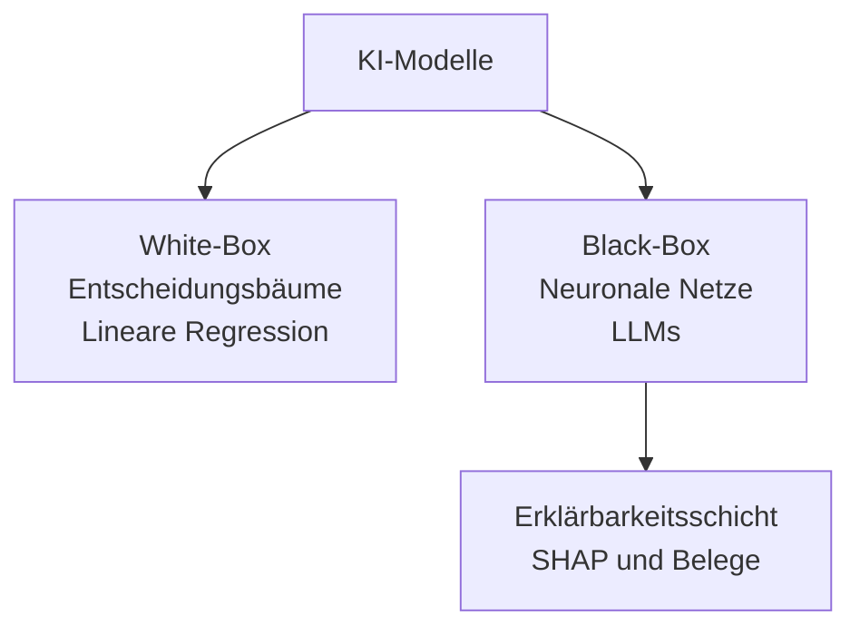
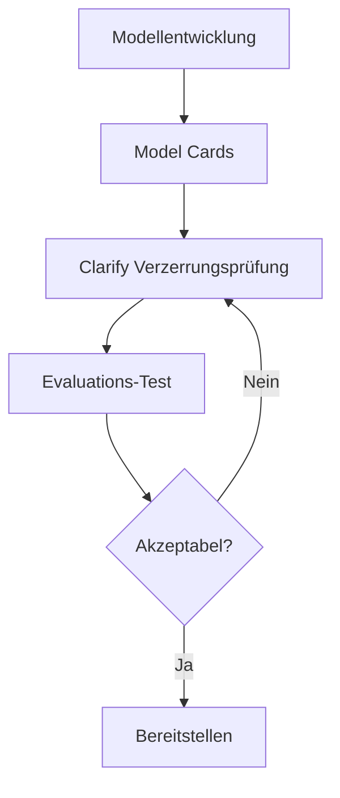
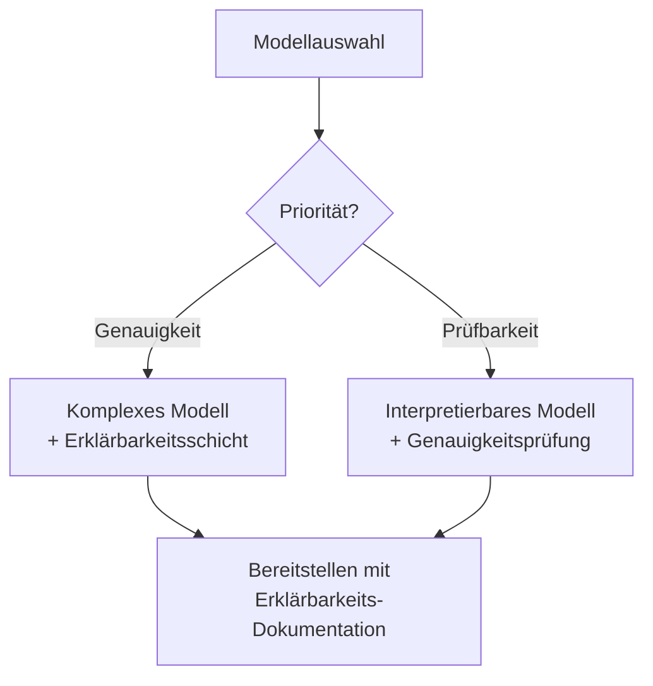
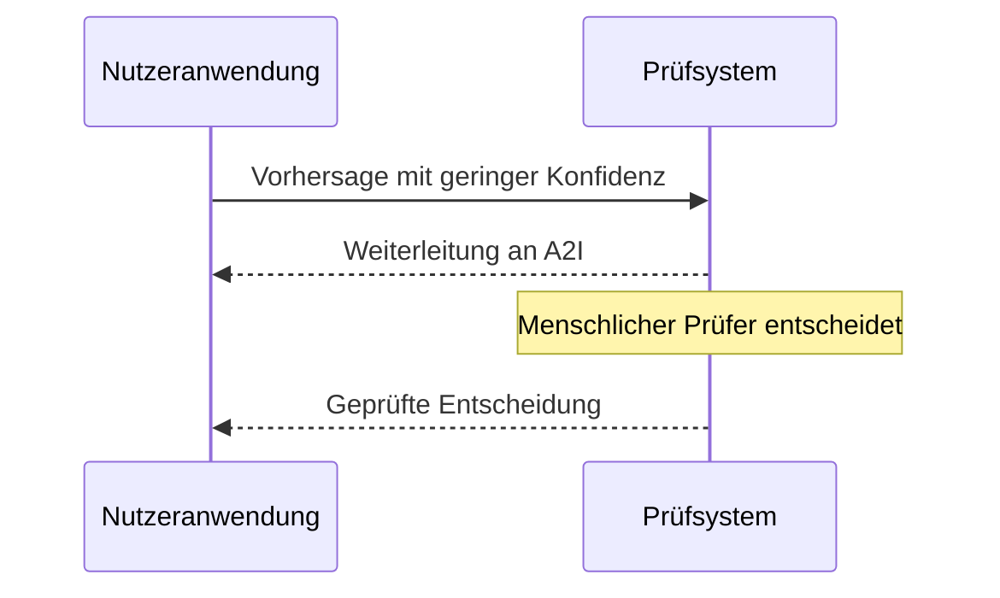

## Aufgabenstellung 4.2: Die Bedeutung transparenter und erklärbarer Modelle erkennen

Wenn ein KI-System eine Entscheidung trifft, die einen Kunden, eine Mitarbeiterin oder ein Geschäftsergebnis betrifft, stellen die Beteiligten fast immer dieselbe Frage: Warum? Die Antwort auf diese Frage ist der Kern von Transparenz und Erklärbarkeit. Diese Aufgabenstellung behandelt, wie man Modelle, die diese Frage beantworten können, von solchen unterscheidet, die es nicht können, welche AWS-Werkzeuge das Modellverhalten dokumentieren und sichtbar machen, welche Abwägungen zwischen Erklärbarkeit und anderen Eigenschaften wie Unbedenklichkeit und Genauigkeit bestehen, und welche Gestaltungsprinzipien sicherstellen, dass Menschen bei folgenreichen KI-Empfehlungen auf sinnvolle Weise in den Entscheidungsprozess eingebunden bleiben.[^402001]

### 4.2.1 Unterschiede zwischen transparenten und erklärbaren Modellen und Modellen ohne diese Eigenschaften

Transparenz und Erklärbarkeit sind verwandte, aber unterschiedliche Eigenschaften. **Transparenz** bezeichnet die Eigenschaft eines Modells, dessen interne Struktur, Trainingsdaten und Entscheidungslogik direkt eingesehen werden können. Ein transparentes Modell ist eines, das man aufschlagen und lesen kann. **Erklärbarkeit** bezeichnet die Eigenschaft eines Modells, dessen Ausgaben von einer für Menschen verständlichen Begründung begleitet werden können, selbst wenn die interne Struktur komplex bleibt. Ein erklärbares Modell kann intern undurchsichtig sein, aber das System um es herum kann eine Begründung liefern, die eine Person nachvollziehen und bewerten kann.[^402002]

Der Unterschied ist in der Praxis bedeutsam. Ein klassischer *Entscheidungsbaum* ist transparent: Man kann den Pfad von der Wurzel bis zum Blatt verfolgen und genau nachvollziehen, welche Eingabewerte das Modell zu einer bestimmten Schlussfolgerung geführt haben.[^402031] Ein *tiefes neuronales Netz* mit Milliarden von Parametern ist hingegen nicht auf dieselbe Weise transparent; kein Mensch kann die Gewichtsmatrix lesen und verstehen, warum eine bestimmte Token-Sequenz eine bestimmte Ausgabe erzeugt hat. Ein gut konzipiertes System um dieses neuronale Netz herum kann dennoch erklärbar sein: Es kann die Merkmale benennen, die am stärksten zur Ausgabe beigetragen haben, die Quelldokumente aufzeigen, die eine Antwort am meisten beeinflusst haben, oder einen Konfidenzwert angeben, der zeigt, wie sicher sich das Modell ist.[^402032]

**White-Box-Modelle** sind solche, bei denen die Entscheidungslogik von Natur aus lesbar ist. Lineare Regression, logistische Regression, Entscheidungsbäume und regelbasierte Klassifikatoren fallen alle in diese Kategorie.[^402003] Ein Kreditprüfungsmodell, das als Entscheidungsbaum umgesetzt wurde, lässt sich einer Aufsichtsbehörde in klaren Worten erläutern: "Anträge mit einem Schulden-zu-Einkommens-Verhältnis über 40 % und weniger als 24 Monaten Beschäftigungsgeschichte wurden abgelehnt." Dieser Satz ist das Modell. White-Box-Modelle sind die Standardwahl in Umgebungen, in denen regulatorische Rechenschaftspflicht eine vollständige Prüfbarkeit jeder einzelnen Entscheidung erfordert, etwa im Verbraucherkreditgeschäft, bei der Versicherungszeichnung und bei bestimmten Klassifizierungen von Medizinprodukten.[^402033]

**Black-Box-Modelle** sind solche, bei denen die interne Berechnung zu komplex ist, um sie direkt zu interpretieren.[^402004] Große Sprachmodelle (LLM), tiefe Faltungsnetze und Ensemble-Verfahren wie Gradient-Boosting-Bäume, die auf Hunderten von Merkmalen trainiert wurden, verhalten sich aus praktischer Sicht allesamt wie Black Boxes. Das Modell erzeugt einen Wert oder eine Token-Sequenz, aber der Weg von der Eingabe zur Ausgabe verläuft durch so viele nichtlineare Transformationen, dass seine Nachverfolgung rechnerisch und konzeptionell nicht handhabbar ist.[^402034] Die meisten KI-Produktivsysteme in der Inhaltsmoderation, der medizinischen Bildgebung, der Betrugserkennung und der Verarbeitung natürlicher Sprache (VNS) arbeiten mit Black-Box-Modellen.

*Abbildung 4.2.1: Taxonomie von White-Box- und Black-Box-Modellen. White-Box-Modelle legen die Entscheidungslogik direkt offen; Black-Box-Modelle benötigen eine separate Erklärbarkeitsschicht, um für Menschen nachvollziehbare Begründungen zu erzeugen.*

In der Realität liegen die meisten KI-Produktivsysteme irgendwo zwischen diesen beiden Extremen. Ein Gradient-Boosting-Klassifikator ist zwar nicht Zeile für Zeile lesbar, aber weniger undurchsichtig als ein tiefes neuronales Netz, weil *Merkmalswichtigkeitswerte* direkt aus der Modellstruktur berechnet werden können.[^402035] Ein großes Sprachmodell ist intern tief undurchsichtig, kann aber so konfiguriert werden, dass es seine Quellen angibt, seine Unsicherheit ausdrückt und seine Schlussfolgerungskette in natürlicher Sprache erläutert, bevor es eine abschließende Antwort liefert. Die praktische Frage lautet nicht, ob ein Modell vollkommen transparent ist, sondern ob es für die Rechenschaftsanforderungen des jeweiligen Anwendungsfalls hinreichend erklärbar ist.[^402036]

Drei Branchen veranschaulichen das Spektrum gut. Bei der Kreditwürdigkeitsprüfung schreiben Vorschriften in vielen Rechtsordnungen vor, dass ein Kreditgeber einem Antragsteller die spezifischen Gründe für eine Kreditentscheidung mitteilen muss; White-Box-Modelle oder SHAP-zugeschriebene Black-Box-Modelle erfüllen diese Anforderung, ein nicht erklärter Wert hingegen nicht.[^402005] Bei der medizinischen Diagnose muss ein Radiologe, der ein KI-Werkzeug zur Auswertung von Röntgenthoraxaufnahmen verwendet, sehen, welche Bildbereiche das Modell am stärksten gewichtet hat, damit er die Hypothese des Modells bestätigen oder verwerfen kann; hier unterstützt die Erklärbarkeit die menschliche Entscheidungsfindung, ohne sie zu ersetzen.[^402037] Bei der Inhaltsmoderation muss der Plattformbetreiber einzelne Moderationsentscheidungen gegenüber Nutzern möglicherweise nicht erläutern, aber interne Prüfteams müssen sicherstellen, dass der Klassifikator konsistente Regeln über demografische Gruppen hinweg anwendet; hier ist Erklärbarkeit in erster Linie ein internes Qualitätssicherungsinstrument.[^402038]

### 4.2.2 Werkzeuge zur Identifizierung transparenter und erklärbarer Modelle

Zu erkennen, dass Erklärbarkeit erforderlich ist, unterscheidet sich davon zu wissen, wie man sie erreicht. AWS stellt eine Reihe von Werkzeugen bereit, die Erklärbarkeit auf verschiedenen Ebenen adressieren: der Dokumentation des Modells, seinem Verhalten während der Inferenz sowie der Unbedenklichkeit und Qualität seiner Ausgaben.[^402039]

**Amazon SageMaker Model Cards** ist das Werkzeug, das AWS entwickelt hat, um die Erstellung und Weitergabe von Modelldokumentation zu standardisieren.[^402006] Eine Modellkarte ist ein strukturiertes, für Menschen lesbares Dokument, das einem Modellartefakt in SageMaker beigefügt ist. Es erfasst die vorgesehenen Anwendungsfälle des Modells, den Trainingsdatensatz und seine Herkunft, Leistungskennzahlen für relevante Untergruppen, bekannte Einschränkungen, ethische Erwägungen und Nutzungsbeschränkungen.[^402007] Eine Fachkraft, die eine Modellkarte vor der Freigabe eines Modells für den Produktionseinsatz prüft, kann feststellen, ob das Modell mit für die Einsatzbevölkerung repräsentativen Daten trainiert wurde, welche Genauigkeitsabwägungen getroffen wurden und welche Risiken das Entwicklungsteam bereits identifiziert hat.

Der Wert von Modellkarten geht über die erste Freigabeentscheidung hinaus. Wenn sich das Verhalten eines Modells im Laufe der Zeit verändert oder wenn eine regulatorische Anfrage eintrifft, liefert die Modellkarte einen prüfbaren Nachweis darüber, was zum Zeitpunkt der Freigabe bekannt war.[^402040] Amazon SageMaker unterstützt die Veröffentlichung von Modellkarten über die AWS-Managementkonsole und das SageMaker Python SDK; Karten können gemeinsam mit dem Modellartefakt versioniert werden.[^402008]

**Amazon SageMaker Clarify** adressiert Erklärbarkeit auf der Inferenzebene.[^402009] Clarify verwendet eine Methode namens *SHAP* (SHapley Additive exPlanations) zur Berechnung von Merkmalszuordnungswerten für klassische Modelle des Maschinellen Lernens (ML).[^402010] Ein SHAP-Wert beantwortet die Frage: "Wie stark hat dieses Merkmal die Vorhersage im Vergleich zum Durchschnitt aller Antragsteller nach oben oder unten verschoben?" Positive Werte erhöhen das vorhergesagte Risiko, negative Werte verringern es. Eine Clarify-Erklärung für eine Vorhersage eines Kreditrisikomodells könnte beispielsweise zeigen, dass das Schulden-zu-Einkommens-Verhältnis des Antragstellers +0,12 zum Risikowert beigetragen hat, während die Länge der Kreditgeschichte -0,08 beigetragen hat. Das gibt dem Zeichner eine quantitative Grundlage für die Entscheidung und einen Ausgangspunkt für eine etwaige Erläuterung gegenüber dem Antragsteller. (Bei Bildmodellen erzeugt das entsprechende Verfahren *Salienz-Karten*, die die Bereiche eines Eingabebildes hervorheben, die das Modell am stärksten gewichtet hat.)

Über die Merkmalszuordnung hinaus misst SageMaker Clarify *Verzerrungsmetriken*, die anzeigen, ob das Modell verschiedene demografische Gruppen unterschiedlich behandelt.[^402011] Vortrainings-Verzerrungsmetriken prüfen, ob der Trainingsdatensatz selbst unausgewogen ist. Nachtrainings-Verzerrungsmetriken prüfen, ob die Vorhersagen des trainierten Modells über Gruppen hinweg systematisch abweichen, die durch ein sensibles Merkmal wie Geschlecht, Alter oder Postleitzahl definiert sind.[^402041] Diese Verzerrungserkennungsfähigkeit knüpft direkt an die in Aufgabenstellung 4.1 behandelten Funktionen verantwortungsvoller KI an und macht Clarify zu einem Doppelzweck-Werkzeug: Es erklärt individuelle Vorhersagen und überwacht die Fairness auf Gruppenebene.

**Amazon Bedrock Model Evaluations** ist das Werkzeug, das AWS zur Bewertung der Qualität und Unbedenklichkeit von Ausgaben von Basismodellen (FM) bereitstellt.[^402012] Im Unterschied zu Clarify, das klassische ML-Merkmalszuordnung adressiert, bewertet Bedrock Model Evaluations LLM-Ausgaben auf Dimensionen wie Genauigkeit, Flüssigkeit, Kohärenz und Toxizität. Die Evaluierung kann als automatisierter Job mit integrierten Bewertungsalgorithmen oder als manueller Evaluierungsjob mit einem internen Team oder einer von AWS verwalteten Prüfbelegschaft konfiguriert werden.[^402013] Die Sicherheitsevaluierungsdimension prüft speziell auf schädliche, toxische oder unangemessene Inhalte und liefert Organisationen einen strukturierten Nachweis darüber, wie ein Modell anhand von Unbedenklichkeitskriterien abschneidet, bevor es in den Produktionseinsatz gelangt. Bedrock Model Evaluations erstellt einen Bericht je Job, der die Ausgaben gegen Kriterien vergleicht; es handelt sich nicht um ein dauerhaftes Governance-Dokument über das Modell als solches, das ist die Aufgabe der Modellkarten.

**Open-Source-Modelle** verdienen besondere Aufmerksamkeit als Transparenzinstrument. Wenn eine Organisation ein Modell einsetzt, dessen Gewichte und Architektur öffentlich verfügbar sind, wie etwa Modelle der Familie Meta Llama oder der Familie Mistral AI, kann sie die Architekturdokumentation einsehen, die vom Modellentwickler veröffentlichten Trainingsdatenkarten überprüfen und Bewertungen durch Dritte durchführen.[^402014] Das ist ein qualitativ anderes Transparenzniveau als es für proprietäre Modelle verfügbar ist, auf die über eine API zugegriffen wird und deren Architektur und Trainingsdaten nicht offengelegt werden.[^402042] Die Bereitstellung eines Open-Source-Modells auf AWS über Amazon Bedrock oder direkt auf Amazon SageMaker AI-Inferenzendpunkten bewahrt diesen Transparenzvorteil und erhält gleichzeitig die Betriebsvorteile der verwalteten Infrastruktur.[^402043]

**Daten- und Lizenzdokumentation** vervollständigt das Bild. Erklärbarkeit ist nur dann sinnvoll, wenn die Daten, aus denen das Modell hervorgegangen ist, rückverfolgbar sind.[^402015] Ein Modell, das auf Daten mit nicht offengelegter Herkunft trainiert wurde, birgt Risiken, die eine Modellkarte nicht vollständig erfassen kann: Wenn sich herausstellt, dass die Trainingsdaten geschützte personenbezogene Daten (PbD), urheberrechtlich geschützte Inhalte oder systematisch verzerrte Bezeichnungen enthalten, erben die Modellausgaben diese Probleme.[^402044] Die Lizenzbedingungen für die Trainingsdaten und die Modellgewichte bestimmen, was die Organisation rechtlich mit den Ausgaben des Modells tun darf, und diese Bestimmung ist selbst eine Form von Transparenz über die Betriebsbeschränkungen des Modells.[^402045]

*Tabelle 4.2.1: AWS-Werkzeuge für Modelltransparenz und Erklärbarkeit*

| Werkzeug | Was es erklärt | Methode | Primäre Zielgruppe |
|---|---|---|---|
| SageMaker Model Cards | Modellzweck, Daten, Evaluierungsergebnisse, Einschränkungen | Strukturierte Dokumentation | Fachliche Prüfer, Auditoren |
| SageMaker Clarify | Einzelvorhersagezuordnung, Verzerrungsmetriken | SHAP-Werte, statistische Tests | Datenwissenschaftler, Compliance |
| Bedrock Model Evaluations | Qualität und Unbedenklichkeit von LLM-Ausgaben | Automatisierte und manuelle Bewertung | KI-Teams, Sicherheitsprüfer |
| Open-Source-Modellprüfung | Architektur und Trainingsdaten | Direkte Überprüfung von Gewichten und Dokumentation | ML-Ingenieure, Forscher |
| Daten- und Lizenzprüfung | Herkunft der Trainingsdaten und Nutzungsrechte | Herkunftsverfolgung, Lizenzprüfung | Recht, Compliance, Einkauf |

Die Prüfung erwartet, dass Sie ein Szenario dem richtigen Werkzeug zuordnen. Wenn eine Frage danach fragt, wie eine Organisation den vorgesehenen Verwendungszweck und die bekannten Einschränkungen eines Modells für eine Prüfung dokumentieren soll, lautet die Antwort SageMaker Model Cards. Wenn eine Frage danach fragt, wie erklärt werden soll, warum ein bestimmtes klassisches ML-Modell eine bestimmte Vorhersage getroffen hat, lautet die Antwort SageMaker Clarify mit SHAP. Wenn eine Frage danach fragt, wie die Unbedenklichkeit der Ausgaben eines generativen Modells vor dem Produktionseinsatz bewertet werden soll, lautet die Antwort Bedrock Model Evaluations.[^402046]

*Abbildung 4.2.2: Erklärbarkeits-Werkzeugkette im Modell-Lebenszyklus. Model Cards liefern den Dokumentationskontext; Clarify misst Vor- und Nachtrainings-Verzerrungen; Bedrock Model Evaluations prüft die Ausgabe-Unbedenklichkeit vor der Bereitstellung.*

### 4.2.3 Abwägungen zwischen Modell-Unbedenklichkeit und Transparenz

Transparenz und Unbedenklichkeit sind nicht immer deckungsgleich. Zu verstehen, wo sie sich gegenseitig stärken und wo sie in Konflikt geraten, ist wichtig für den Entwurf von KI-Systemen, die sowohl vertrauenswürdig als auch sicher sind.[^402047]

Der häufigste Konflikt ergibt sich daraus, dass die Offenlegung der Funktionsweise einer Sicherheitsmaßnahme einem Angreifer ermöglichen kann, sie zu umgehen. Betrachten Sie ein Inhaltsmoderierungssystem, das schädliche Ausgaben blockiert, indem es bestimmte Satzmuster in der Modellantwort erkennt. Würde die genaue Phrasenliste veröffentlicht, könnten böswillige Akteure Anfragen konstruieren, die alle gesperrten Phrasen vermeiden und dennoch schädliche Inhalte hervorrufen. In diesem Fall ist die Undurchsichtigkeit der Sicherheitsmaßnahme beabsichtigt.[^402048] Dieselbe Logik gilt für Abwehrmaßnahmen gegen Prompt-Injektion: Eine Systemaufforderung, die das Modell anweist, Anweisungen zu ignorieren, die auf eine bestimmte Vorlage folgen, ist weniger wirksam, sobald diese Vorlage bekannt ist.[^402016] Sicherheitssysteme behandeln die Details ihrer Erkennungslogik grundsätzlich als vertraulich, und KI-Sicherheitsmaßnahmen bilden da keine Ausnahme.

Der Konflikt wirkt auch in die entgegengesetzte Richtung. Undurchsichtigkeit in einem Modell kann sicherheitsrelevante Einschränkungen verbergen, die Betreiber und Nutzer kennen müssen. Eine Modellkarte, die die Versagensmuster eines Modells genau beschreibt, etwa geringere Genauigkeit bei nicht-englischen Muttersprachlern oder höhere Halluzinationsraten bei sehr aktuellen Ereignissen, ermöglicht es Betreibern, zum Zeitpunkt der Bereitstellung kompensierende Maßnahmen einzuführen.[^402017] Diese Einschränkungen zu verbergen oder wegzulassen bedeutet, dass der Betreiber sie nicht abmildern kann. In diesem Sinne verbessert Transparenz über Einschränkungen die Sicherheitsergebnisse aktiv.[^402049]

Die Abwägung zwischen Leistung und Interpretierbarkeit ist eine zweite Spannung, die die Prüfung abdeckt. Im Allgemeinen sind die Modelle, die bei komplexen Aufgaben die höchste Genauigkeit erzielen, auch die am wenigsten interpretierbaren. Ein tiefes neuronales Netz, das auf Millionen beschrifteter Bilder trainiert wurde, übertrifft einen Entscheidungsbaum bei den meisten Bildklassifizierungsaufgaben, aber die Vorhersagen des Entscheidungsbaums können einem Fachexperten ohne zusätzliche Werkzeuge erläutert werden.[^402018] Ein Gradient-Boosting-Ensemble, das auf Dutzenden konstruierter Merkmale trainiert wurde, übertrifft die logistische Regression bei Tabellendaten häufig, aber die logistische Regression liefert Koeffizienten, die ein Statistiker direkt als Beitrag jeder Variablen lesen kann.[^402050]

*Abbildung 4.2.3: Entscheidungspfad Leistung vs. Interpretierbarkeit. Wenn Genauigkeit die primäre Anforderung ist, wird eine nachgelagerte Erklärbarkeitsschicht ergänzt; wenn Prüfbarkeit Vorrang hat, wird ein interpretierbares Modell gewählt und dessen Genauigkeitsschwelle verifiziert.*

Es gibt kein einheitliches numerisches Maß für Interpretierbarkeit.[^402019] Interpretierbarkeit ist eine Eigenschaft, die je Anwendungsfall bewertet wird, nicht ein Wert auf einer Rangliste. Ein Modell, das ein Radiologe für die Unterstützung beim Screening als hinreichend erklärbar erachtet, ist möglicherweise nicht hinreichend erklärbar für die Erstellung einer formalen Diagnose, die in eine Patientenakte eingeht.[^402051] Ein Kreditrisikomodell, das den Erklärungsanforderungen der Verbraucherkreditregulierung eines Landes genügt, erfüllt möglicherweise nicht die Anforderungen eines anderen Landes. Die Messfrage lautet daher stets: Hinreichend erklärbar für wen, zu welchem Zweck und unter welcher Verpflichtung?[^402052]

*Tabelle 4.2.2: Interaktionsmuster zwischen Transparenz und Unbedenklichkeit*

| Szenario | Transparenzwirkung | Sicherheitswirkung | Lösung |
|---|---|---|---|
| Veröffentlichung der Details der Prompt-Injektions-Abwehr | Hohe Transparenz | Verringerte Sicherheit | Abwehrlogik vertraulich halten; nur übergeordnete Richtlinie veröffentlichen |
| Modellkarte dokumentiert Halluzinations-Versagensmuster | Hohe Transparenz | Verbesserte Sicherheit | Veröffentlichen; Betreiber führen kompensierende Maßnahmen ein |
| Offenlegung der Schwellenwerte der Verzerrungserkennung | Teilweise Transparenz | Manipulationsrisiko | Kategorie veröffentlichen; genaue Schwellenwerte vertraulich halten |
| Open-Source-Modellgewichte | Vollständige Transparenz | Variabel | Spezifische Risiken vor der offenen Bereitstellung bewerten |

Die praktische Orientierung für ein Prüfungsszenario lautet: Wenn eine Frage eine Situation beschreibt, in der die Offenlegung des Mechanismus einer Maßnahme einem Angreifer ermöglichen würde, sie zu umgehen, ist weniger Transparenz für die Sicherheit angemessen. Wenn eine Frage eine Situation beschreibt, in der das Verbergen bekannter Einschränkungen eines Modells Betreiber daran hindert, diese abzumildern, ist mehr Transparenz für die Sicherheit angemessen.[^402053]

### 4.2.4 Grundsätze des menschenzentrierten Designs für erklärbare KI

Erklärbarkeit ist nicht nur eine technische Eigenschaft eines Modells; sie ist auch eine Gestaltungseigenschaft des Systems, das die Ausgaben des Modells den Nutzern präsentiert. Ein Modell kann SHAP-Zuordnungswerte erzeugen, die kein Unternehmensnutzer je zu sehen bekommt, weil die Schnittstelle nicht dafür ausgelegt wurde, sie anzuzeigen.[^402054] Menschenzentriertes Design für erklärbare KI bedeutet, die Präsentationsschicht so zu gestalten, dass Nutzer die Informationen erhalten, die sie benötigen, um KI-Empfehlungen zu verstehen, ihnen zu vertrauen und sie bei Bedarf angemessen zu übersteuern.[^402020]

Der erste Grundsatz lautet, Konfidenz- und Unsicherheitsinformationen dann anzuzeigen, wenn sie für die Entscheidung relevant sind. Ein Modell, das einer Empfehlung einen hohen Konfidenzwert zuweist, und ein Modell, das zwischen zwei Optionen nahezu gleich unsicher ist, sollten für einen Nutzer nicht gleich aussehen. Wenn ein Betrugerkennungssystem eine Transaktion mit 97 % Konfidenz markiert, kann ein Analyst zügig vorgehen. Wenn dasselbe System eine Transaktion mit 54 % Konfidenz markiert, sollte der Analyst wissen, dass das Modell unsicher ist, und größere Sorgfalt walten lassen. Amazon Bedrock-Modelle können Wahrscheinlichkeitswerte zurückgeben und können so gesteuert werden, dass sie Unsicherheit in ihren Ausgaben explizit ausdrücken; die Anwendung so zu gestalten, dass diese Information angezeigt wird, anstatt die Modellausgabe direkt in eine binäre Ja/Nein-Empfehlung umzuwandeln, ist eine bewusste Designentscheidung.[^402021]

Der zweite Grundsatz lautet, Belege und Quellen für generierten Inhalt anzuzeigen. Eine RAG-basierte Anwendung (Retrieval-Augmented Generation), die Informationen aus einem Dokumentenkorpus abruft und eine Antwort in natürlicher Sprache erzeugt, sollte angeben, welche Quelldokumente verwendet wurden. Das ist nicht nur eine Transparenzmaßnahme; es ist ein praktisches Werkzeug, das Nutzern ermöglicht, die Modellausgabe mit der Originalquelle zu vergleichen und Fälle zu identifizieren, in denen das Modell über das hinausgegangen ist, was die Quelle tatsächlich besagt.[^402022] Amazon Bedrock Knowledge Bases gibt Verweise auf Quelldokumente zusammen mit generierten Antworten zurück; Anwendungsdesigns, die diese Verweise für Endnutzer sichtbar machen, erhöhen die Vertrauenswürdigkeit des Systems spürbar.[^402055]

Der dritte Grundsatz lautet, Feedbackschleifen zu gestalten, die die Urteile der Nutzer über die Qualität der KI-Ausgaben erfassen. Ein Daumen-hoch- oder Daumen-runter-Mechanismus, der an eine Modellempfehlung angehängt ist, ist die einfachste Form davon, aber das Design sollte auch den Grund für negatives Feedback erfassen: War die Empfehlung sachlich falsch, nicht anwendbar oder korrekt aber verwirrend formuliert? Dieses strukturierte Feedback, das an das Modellentwicklungsteam zurückgegeben wird, erzeugt die beschrifteten Daten, die benötigt werden, um systematische Versagensmuster zu identifizieren und das Modell im Laufe der Zeit zu verbessern. Amazon A2I, das in Aufgabenstellung 4.1 eingeführt wurde, dient diesem Grundsatz, indem es Ausgaben mit geringer Konfidenz an menschliche Prüfer weiterleitet und deren Entscheidungen als strukturierte Datensätze erfasst.[^402023]

*Abbildung 4.2.4: Feedbackfluss mit Mensch-in-der-Schleife. Die Anwendung zeigt dem Nutzer Konfidenzwerte an, leitet Ausgaben mit geringer Konfidenz oder umstrittene Ausgaben zur menschlichen Prüfung an Amazon A2I weiter und gibt strukturierte Anmerkungen an das Entwicklungsteam zurück.*

Der vierte Grundsatz lautet, das zu trennen, was das Modell gesagt hat, von dem, was das System getan hat. In einer mehrstufigen KI-Anwendung erzeugt das Modell eine Empfehlung, und ein nachgelagertes System handelt auf deren Grundlage. Eine gut gestaltete Schnittstelle zeigt dem Nutzer beide Ebenen: die Empfehlung des Modells und die Systemaktion, die darauf basiert.[^402056] Das ist besonders wichtig, wenn das System Geschäftsregeln hinzufügt, die die Ausgabe des Modells verändern oder übersteuern. Ein Einstellungsunterstützungswerkzeug könnte einem Recruiter beispielsweise sowohl die Kandidatenrangliste des Modells als auch die Regel anzeigen, die das Unternehmen des Recruiters angewendet hat, um Kandidaten unter einem gesetzlichen Mindestalter herauszufiltern. Der Nutzer kann dann die Schlussfolgerung des Modells unabhängig von der Geschäftsregelschicht bewerten.[^402057]

Der fünfte Grundsatz lautet, die Autonomie der Nutzer zu achten, indem Übersteuerungen einfach und gut nachverfolgbar gestaltet werden. Eine KI-Empfehlung, die nicht übersteuert werden kann, ist keine Empfehlung; sie ist eine automatisierte Entscheidung. Nutzer, die KI-Ausgaben verwenden müssen, sie aber nicht übersteuern können, verlieren ihre Fähigkeit, fachkundiges Urteil auf Grenzfälle anzuwenden, und die Organisation verliert das Signal, das Übersteuerungsdaten geliefert hätten.[^402058] Übersteuerungsmechanismen zu gestalten, die gut sichtbar, reibungsarm und mit Prüfprotokoll versehen sind, gibt Nutzern echte Handlungsfreiheit und erzeugt zugleich wertvolles Feedback darüber, wo das Modell an seine Grenzen stößt.[^402024]

*Tabelle 4.2.3: Grundsätze des menschenzentrierten Designs für erklärbare KI*

| Grundsatz | Implementierungsbeispiel | AWS-Werkzeug oder -Muster |
|---|---|---|
| Konfidenz und Unsicherheit anzeigen | Konfidenzwert des Modells neben der Empfehlung darstellen | Inferenzantwort-Metadaten von Bedrock |
| Belege und Quellen anzeigen | Abgerufene Quelldokumente zusammen mit der generierten Antwort auflisten | Quellenzuordnung von Bedrock Knowledge Bases |
| Strukturiertes Feedback erfassen | Daumen runter mit Begründung; automatische Weiterleitung bei geringer Konfidenz | Workflow-Konfiguration von Amazon A2I |
| Modellausgabe von Systemaktion trennen | Modellwert und angewendete Geschäftsregel separat anzeigen | Design der Anwendungsschicht |
| Nutzerautonomie achten | Gut sichtbare Übersteuerungsschaltfläche mit Prüfprotokoll | Design der Anwendungsschicht |

Barrierefreiheit ist eine praktische Überlegung im Rahmen des menschenzentrierten Designs, auf die die Prüfung nicht näher eingeht, die aber jede verantwortungsvolle Implementierung berücksichtigen muss. Konfidenzwerte, die nur als Zahlenwerte präsentiert werden, schließen Nutzer aus, die mit probabilistischem Denken weniger vertraut sind.[^402059] Erklärungen in Fachsprache schließen nicht-fachkundige Nutzer aus. Erklärbarkeit für die tatsächlichen Nutzer des Systems zu gestalten, nicht für die Entwickler, die es gebaut haben, ist die operationale Definition von menschenzentriertem Design in diesem Kontext.[^402060]

## Selbstkontrollfragen

**Frage 1.** Ein Finanzdienstleister setzt ein Gradient-Boosting-Ensemble-Modell ein, um Kreditanträge zu genehmigen oder abzulehnen. Eine Aufsichtsbehörde verlangt, dass das Unternehmen jedem abgelehnten Antragsteller einen spezifischen Ablehnungsgrund mitteilt. Das Modellentwicklungsteam möchte diese Anforderung erfüllen, ohne das Modell zu ersetzen. Welches AWS-Werkzeug oder welche Technik ist am GEEIGNETSTEN?

A. Das Gradient-Boosting-Modell durch ein logistisches Regressionsmodell ersetzen, das von Natur aus transparent ist  
B. Amazon SageMaker Clarify verwenden, um SHAP-basierte Merkmalszuordnungswerte für jede einzelne Vorhersage zu berechnen  
C. Eine SageMaker-Modellkarte veröffentlichen, die die Trainingsdaten und Evaluierungsmetriken dokumentiert  
D. Amazon Bedrock Model Evaluations einsetzen, um die Ausgabegenauigkeit des Modells anhand eines beschrifteten Datensatzes zu bewerten  

**Erläuterung:** Die Aufsichtsbehörde verlangt eine Erklärung je Entscheidung, was bedeutet, dass das System die spezifische Vorhersage für jeden einzelnen Antrag auf spezifische Eingangsmerkmale zurückführen muss. Amazon SageMaker Clarify (Antwort B) berechnet SHAP-Werte, die quantifizieren, wie stark jedes Eingabemerkmal zur Vorhersage des Modells beigetragen hat, und liefert damit genau die entscheidungsbezogene Begründung, die die Aufsichtsbehörde verlangt. Antwort A würde die Anforderung ebenfalls erfüllen, aber die Frage gibt an, dass das Team das Modell nicht ersetzen möchte; außerdem würde ein Modellwechsel allein aus Gründen der Interpretierbarkeit den Genauigkeitsvorteil des Ensembles aufgeben. Antwort C adressiert die Dokumentation des Modells als Ganzes, erzeugt aber keine entscheidungsbezogenen Erklärungen. Antwort D bewertet die aggregierte Genauigkeit von LLM-Ausgaben und ist nicht für die Merkmalszuordnung bei klassischen ML-Modellen ausgelegt. SageMaker Clarify ist das zweckgebundene Werkzeug für die Einzelvorhersage-Zuordnung bei in SageMaker trainierten Modellen.[^402026]

---

**Frage 2.** Ein Unternehmen entwickelt einen KI-gestützten Medizinbild-Assistenten, der Bereiche einer Röntgenthoraxaufnahme für einen Radiologen zur Überprüfung hervorhebt. Das Entwicklungsteam diskutiert, ob es ein tiefes Faltungsnetz mit höherer diagnostischer Genauigkeit oder einen regelbasierten Klassifikator mit geringerer Genauigkeit, aber vollständig prüfbaren Regeln einsetzen soll. Das klinische Team erklärt, dass es das Werkzeug nur nutzen wird, wenn es verstehen kann, warum das Werkzeug einen Bereich markiert. Welcher Ansatz erfüllt BEIDE Anforderungen am besten?

A. Den regelbasierten Klassifikator verwenden, da er vollständig transparent ist und das klinische Team seine Regeln direkt lesen kann  
B. Das tiefe Faltungsnetz verwenden und eine nachgelagerte Erklärbarkeitsschicht hinzufügen, die die Bildbereiche hervorhebt, die das Modell am stärksten gewichtet hat  
C. Das tiefe Faltungsnetz ohne Erklärbarkeitsschicht verwenden und das klinische Team darin schulen, den Ausgaben des Modells zu vertrauen  
D. Amazon Bedrock Model Evaluations einsetzen, um die Ausgaben des tiefen Faltungsnetzes vor jeder Bildgebungssitzung zu validieren  

**Erläuterung:** Die Frage benennt zwei konkurrierende Anforderungen: hohe Genauigkeit (spricht für das tiefe Faltungsnetz) und Nachvollziehbarkeit (spricht für das transparente Modell). Antwort B löst die Spannung auf, indem das genauere Modell verwendet und eine nachgelagerte Erklärbarkeitsschicht ergänzt wird, die *Salienz-Karten* oder gleichwertige Visualisierungen erzeugt, die zeigen, welche Bildbereiche das Modell am stärksten gewichtet hat. Das gibt Radiologen die regionalen Begründungen, die sie benötigen, ohne den Genauigkeitsvorteil aufzugeben. Antwort A akzeptiert die Genauigkeitsbeschränkung unnötigerweise; die Frage besagt nicht, dass die Genauigkeit des regelbasierten Klassifikators ausreichend ist. Antwort C ignoriert die erklärte Anforderung des klinischen Teams und führt ein Patientensicherheitsrisiko ein, indem ein nicht erklärbares System für Kliniker bereitgestellt wird, die angegeben haben, Erklärungen zu benötigen. Antwort D ist die falsche Werkzeugkategorie; Bedrock Model Evaluations adressiert die Qualität von LLM-Ausgaben, nicht die Zuordnung bei der Bildklassifizierung. Die übergeordnete Erkenntnis lautet, dass die Abwägung zwischen Leistung und Interpretierbarkeit häufig dadurch aufgelöst werden kann, dass das leistungsstarke Modell beibehalten und eine Erklärbarkeitsschicht ergänzt wird, anstatt zwischen beiden zu wählen.[^402027]

---

**Frage 3.** Eine Organisation bereitet die Bereitstellung eines generativen KI-Kundenservice-Assistenten vor. Das Compliance-Team verlangt eine Dokumentation des vorgesehenen Verwendungszwecks des Modells, seiner bekannten Versagensmuster und der zur Validierung verwendeten Evaluierungsmetriken, und zwar in einem Format, das ein nicht-technischer Auditor prüfen kann. Welche AWS-Funktion ist für diesen Zweck konzipiert?

A. Verzerrungsberichte von Amazon SageMaker Clarify  
B. Manueller Prüfworkflow von Amazon Bedrock Model Evaluations  
C. Amazon SageMaker Model Cards  
D. Prüfprotokoll-Aufgabenaufzeichnungen von Amazon Augmented AI (Amazon A2I)  

**Erläuterung:** Amazon SageMaker Model Cards (Antwort C) ist das zweckgebundene Werkzeug für strukturierte Modelldokumentation. Eine Modellkarte erfasst den vorgesehenen Verwendungszweck des Modells, die Herkunft der Trainingsdaten, Evaluierungsergebnisse über Untergruppen, bekannte Einschränkungen, ethische Erwägungen und Nutzungsbeschränkungen in einem standardisierten, für Menschen lesbaren Format. Das adressiert direkt alle drei Compliance-Anforderungen: vorgesehenen Verwendungszweck, bekannte Versagensmuster und Evaluierungsmetriken, in einer Form, die ein nicht-technischer Auditor navigieren kann. Antwort A erzeugt Einzelvorhersage-Zuordnungswerte und Verzerrungsmetriken für ein bereitgestelltes Modell, keine zusammenfassende Dokumentation für einen Auditor. Antwort B führt Qualitäts- und Sicherheitsevaluierungen der Inferenz durch, liefert aber Bewertungsergebnisse statt der strukturierten Dokumentation, die eine Modellkarte bietet. Antwort D erzeugt Prüfaufzeichnungen einzelner menschlicher Prüfentscheidungen, was für die Überwachung nützlich ist, aber nicht die Modelldokumentation ersetzt. Modellkarten sind die kanonische Antwort, wenn die Prüfung eine Prüfungs- oder Compliance-Anforderung für vorbereitende Modelldokumentation beschreibt.[^402028]

---

**Frage 4.** Das KI-Produktteam eines Unternehmens hat ein Empfehlungssystem entwickelt. Nutzerforschung zeigt, dass viele Nutzer den Empfehlungen nicht vertrauen, weil sie nicht verstehen, warum ein bestimmter Artikel vorgeschlagen wurde. Das Team möchte menschenzentriertes Design anwenden, um das Nutzervertrauen zu stärken. Welche Option kombiniert zwei Designänderungen, die die Vertrauenslücke am DIREKTESTEN schließen?

A. Das Empfehlungsmodell durch ein genaueres Modell ersetzen und auf einem größeren Datensatz neu trainieren  
B. Den Konfidenzwert des Modells neben jeder Empfehlung anzeigen und die wichtigsten Merkmale der Nutzerhistorie zeigen, die die Empfehlung ausgelöst haben  
C. Die Empfehlungsfunktion entfernen, bis das Modell eine höhere Genauigkeit erreicht  
D. Einen manuellen Amazon-A2I-Prüfschritt einführen, der jede Empfehlung vor der Anzeige an den Nutzer manuell freigibt  

**Erläuterung:** Die Nutzerforschung identifiziert ein Vertrauensproblem, das durch mangelnde Nachvollziehbarkeit verursacht wird, nicht durch geringe Genauigkeit oder unzureichende Prüfung. Antwort B wendet direkt zwei Grundsätze des menschenzentrierten Designs an: Konfidenz anzeigen (damit Nutzer einschätzen können, wie viel Gewicht sie der Empfehlung beimessen sollten) und die Begründung hinter der Empfehlung zeigen (die Merkmale, die sie ausgelöst haben, was einer nachgelagerten Zuordnung entspricht). Beide Änderungen adressieren die benannte Vertrauenslücke. Antwort A verbessert die Genauigkeit, was die Vertrauensfrage möglicherweise gar nicht adressiert; ein genaueres Modell, das weiterhin unerklärbar ist, löst das von der Nutzerforschung identifizierte Problem nicht. Antwort C beseitigt eine Produktfunktion, um dem Problem auszuweichen, anstatt es zu lösen. Antwort D führt manuelle Prüfung für jede Empfehlung ein, was bei der Größenordnung eines Empfehlungssystems betrieblich nicht praktikabel ist und Qualitätskontrolle statt nutzerseitiger Erklärbarkeit adressiert. Das Prüfungsmuster hier lautet: Wenn das Nutzervertrauen das benannte Problem ist, beinhaltet die richtige Antwort Transparenz und Erklärungsgestaltung, nicht Modellersatz oder manuelle Prüfung.[^402029]

---

**Frage 5.** Ein Data-Science-Team prüft, ob es ein Open-Source-Modell oder ein proprietäres Modell mit geschlossener API für eine neue Anwendung verwenden soll. Die Rechtsabteilung des Unternehmens verlangt Einblick in die Trainingsdatenquellen und Lizenzbedingungen, bevor das Modell für den Produktionseinsatz freigegeben wird. Welche Eigenschaft von Open-Source-Modellen erfüllt die Anforderung der Rechtsabteilung am DIREKTESTEN?

A. Open-Source-Modelle sind im Betrieb immer günstiger als proprietäre Modelle, auf die über eine API zugegriffen wird  
B. Open-Source-Modelle können auf proprietären Daten feinabgestimmt werden, sodass die Organisation die resultierenden Gewichte besitzen kann  
C. Open-Source-Modelle veröffentlichen Architekturdokumentation, Trainingsdatenkarten und Lizenzbedingungen, die das Rechtsteam direkt prüfen kann  
D. Open-Source-Modelle erfüllen automatisch alle regulatorischen Transparenzanforderungen für KI in der EU und den USA  

**Erläuterung:** Die erklärte Anforderung der Rechtsabteilung ist Einblick in die Trainingsdatenquellen und Lizenzbedingungen. Antwort C adressiert dies direkt. Öffentlich verfügbare Modelle veröffentlichen in der Regel Modellkarten und Datenkarten (oder gleichwertige Dokumentation), die die Zusammensetzung des Trainingskorpus, bekannte Einschränkungen und die geltende Lizenz beschreiben. Das Rechtsteam kann die veröffentlichte Lizenz (etwa eine Apache-2.0-Lizenz oder eine modellspezifische Kommerzlizenz) prüfen, um festzustellen, welche Verwendungen zulässig sind, und kann die Trainingsdatendokumentation prüfen, um die Risiken der Datenherkunft zu beurteilen. Antwort A ist ein Kostenargument, das die rechtliche Anforderung nicht erfüllt; Open-Source-Modelle sind nicht pauschal günstiger, wenn Infrastruktur- und Betriebskosten einbezogen werden. Antwort B adressiert das Eigentum an feinabgestimmten Modellvarianten, was eine valide rechtliche Überlegung ist, aber nicht die in der Frage genannte Anforderung nach Einblick in Trainingsdaten und Lizenzen. Antwort D ist unzutreffend; Open-Source-Status erfüllt nicht automatisch einen bestimmten regulatorischen Rahmen; Compliance erfordert weiterhin eine Bewertung anhand der Kriterien der jeweiligen Regulierung. Die übergeordnete Erkenntnis lautet, dass Daten- und Lizenztransparenz eine eigenständige Dimension der Modelltransparenz ist, und Open-Source-Modelle bieten ein Herkunftseinsichts-Niveau, das für Modelle, auf die ausschließlich über eine proprietäre API zugegriffen wird, nicht verfügbar ist.[^402030]

---

[^402001]: AWS Certification. AI Practitioner (AIF-C01) Exam Guide v1.1, Domain 4, Task Statement 4.2. URL: <https://docs.aws.amazon.com/aws-certification/latest/ai-practitioner-01/ai-practitioner-01-domain4.html>
[^402002]: Doshi-Velez, F., and Kim, B. Towards a Rigorous Science of Interpretable Machine Learning (2017). URL: <https://arxiv.org/abs/1702.08608>
[^402003]: Breiman, L. Classification and Regression Trees (1984). URL: <https://doi.org/10.1201/9781315139470>
[^402004]: Adadi, A., and Berrada, M. Peeking Inside the Black-Box: A Survey on Explainable AI. IEEE Access (2018). URL: <https://doi.org/10.1109/ACCESS.2018.2870052>
[^402005]: Consumer Financial Protection Bureau. Using Artificial Intelligence to Assist Adverse Action Explanations (2023). URL: <https://www.consumerfinance.gov/about-us/blog/cfpb-issues-guidance-on-credit-denials-by-lenders-using-artificial-intelligence/>
[^402006]: Amazon SageMaker. Amazon SageMaker Model Cards overview. URL: <https://docs.aws.amazon.com/sagemaker/latest/dg/model-cards.html>
[^402007]: Amazon SageMaker. Model Card components and structure. URL: <https://docs.aws.amazon.com/sagemaker/latest/dg/model-cards-create.html>
[^402008]: Amazon SageMaker. Versioning and sharing SageMaker Model Cards. URL: <https://docs.aws.amazon.com/sagemaker/latest/dg/model-cards-export.html>
[^402009]: Amazon SageMaker. Amazon SageMaker Clarify overview. URL: <https://docs.aws.amazon.com/sagemaker/latest/dg/clarify-configure-processing-jobs.html>
[^402010]: Lundberg, S., and Lee, S. A Unified Approach to Interpreting Model Predictions (SHAP, NeurIPS 2017). URL: <https://arxiv.org/abs/1705.07874>
[^402011]: Amazon SageMaker. Measuring bias with SageMaker Clarify. URL: <https://docs.aws.amazon.com/sagemaker/latest/dg/clarify-measure-data-bias.html>
[^402012]: Amazon Bedrock. Amazon Bedrock Model Evaluations overview. URL: <https://docs.aws.amazon.com/bedrock/latest/userguide/model-evaluation.html>
[^402013]: Amazon Bedrock. Human evaluation jobs in Amazon Bedrock Model Evaluations. URL: <https://docs.aws.amazon.com/bedrock/latest/userguide/model-evaluation-human.html>
[^402014]: Meta AI. Llama 3 model card and data documentation. URL: <https://ai.meta.com/research/publications/meta-llama-3/>
[^402015]: Mitchell, M., et al. Model Cards for Model Reporting (FAccT 2019). URL: <https://arxiv.org/abs/1810.03993>
[^402016]: Perez, F., and Ribeiro, I. Ignore Previous Prompt: Attack Techniques for Language Models (2022). URL: <https://arxiv.org/abs/2211.09527>
[^402017]: Raji, I., et al. Closing the AI Accountability Gap: Defining an End-to-End Framework for Internal Algorithmic Auditing (2020). URL: <https://arxiv.org/abs/2001.00973>
[^402018]: Rudin, C. Stop Explaining Black Box Machine Learning Models for High Stakes Decisions and Use Interpretable Models Instead. Nature Machine Intelligence (2019). URL: <https://doi.org/10.1038/s42256-019-0048-x>
[^402019]: Lipton, Z. The Mythos of Model Interpretability. Queue, ACM (2018). URL: <https://dl.acm.org/doi/10.1145/3236386.3241340>
[^402020]: Amershi, S., et al. Guidelines for Human-AI Interaction. CHI 2019. URL: <https://dl.acm.org/doi/10.1145/3290605.3300233>
[^402021]: Amazon Bedrock. Response metadata and confidence in Amazon Bedrock inference. URL: <https://docs.aws.amazon.com/bedrock/latest/userguide/model-invocation-logging.html>
[^402022]: Amazon Bedrock. Source attribution in Knowledge Bases responses. URL: <https://docs.aws.amazon.com/bedrock/latest/userguide/knowledge-base-retrieveandgenerate.html>
[^402023]: Amazon Augmented AI. Amazon A2I overview and human review workflows. URL: <https://docs.aws.amazon.com/sagemaker/latest/dg/a2i-getting-started.html>
[^402024]: Shneiderman, B. Human-Centered AI. Oxford University Press (2022). URL: <https://global.oup.com/academic/product/human-centered-ai-9780192845290>
[^402026]: Amazon SageMaker. Explainability with SageMaker Clarify: SHAP values for predictions. URL: <https://docs.aws.amazon.com/sagemaker/latest/dg/clarify-shapley-values.html>
[^402027]: Selvaraju, R., et al. Grad-CAM: Visual Explanations from Deep Networks via Gradient-Based Localization (2017). URL: <https://arxiv.org/abs/1610.02391>
[^402028]: Amazon SageMaker. Using Model Cards for compliance and auditability. URL: <https://docs.aws.amazon.com/sagemaker/latest/dg/model-cards.html>
[^402029]: Amershi, S., et al. Guidelines for Human-AI Interaction: Principle 7, Show contextual information. CHI 2019. URL: <https://dl.acm.org/doi/10.1145/3290605.3300233>
[^402030]: Linux Foundation AI and Data. Model and Data Card Standards for Open Source AI (2023). URL: <https://lfaidata.foundation/blog/2023/09/18/data-and-model-cards/>
[^402031]: Quinlan, J.R. Induction of Decision Trees. Machine Learning, vol. 1 (1986). URL: <https://doi.org/10.1007/BF00116251>
[^402032]: Guidotti, R., et al. A Survey of Methods for Explaining Black Box Models. ACM Computing Surveys (2018). URL: <https://dl.acm.org/doi/10.1145/3236009>
[^402033]: Board of Governors of the Federal Reserve System. SR 11-7: Guidance on Model Risk Management (2011). URL: <https://www.federalreserve.gov/supervisionreg/srletters/sr1107.htm>
[^402034]: Goodfellow, I., Bengio, Y., and Courville, A. Deep Learning. MIT Press (2016). URL: <https://www.deeplearningbook.org/>
[^402035]: Chen, T., and Guestrin, C. XGBoost: A Scalable Tree Boosting System. KDD 2016. URL: <https://arxiv.org/abs/1603.02754>
[^402036]: European Parliament. EU AI Act: Article 13, Transparency and provision of information to deployers (2024). URL: <https://eur-lex.europa.eu/legal-content/EN/TXT/?uri=CELEX:32024R1689>
[^402037]: Topol, E. High-performance medicine: the convergence of human and artificial intelligence. Nature Medicine (2019). URL: <https://doi.org/10.1038/s41591-018-0300-7>
[^402038]: Raji, I., and Buolamwini, J. Actionable Auditing: Investigating the Impact of Publicly Naming Biased Performance Results of Commercial AI Products. AIES 2019. URL: <https://dl.acm.org/doi/10.1145/3306618.3314244>
[^402039]: NIST. Artificial Intelligence Risk Management Framework (AI RMF 1.0), GOVERN 1.7. URL: <https://doi.org/10.6028/NIST.AI.100-1>
[^402040]: Amazon SageMaker. Model Card audit and governance use cases. URL: <https://docs.aws.amazon.com/sagemaker/latest/dg/model-cards-use-cases.html>
[^402041]: Amazon SageMaker. Post-training bias metrics in SageMaker Clarify. URL: <https://docs.aws.amazon.com/sagemaker/latest/dg/clarify-measure-post-training-bias.html>
[^402042]: Bommasani, R., et al. On the Opportunities and Risks of Foundation Models: Transparency section. Stanford CRFM (2021). URL: <https://arxiv.org/abs/2108.07258>
[^402043]: Amazon Bedrock. Supported open-source models in Amazon Bedrock. URL: <https://docs.aws.amazon.com/bedrock/latest/userguide/models-supported.html>
[^402044]: Gebru, T., et al. Datasheets for Datasets. Communications of the ACM (2021). URL: <https://doi.org/10.1145/3458723>
[^402045]: Open Source Initiative. The Open Source AI Definition, version 1.0 (2024). URL: <https://opensource.org/ai/open-source-ai-definition>
[^402046]: Amazon Bedrock. Choosing between automated and human evaluation in Bedrock Model Evaluations. URL: <https://docs.aws.amazon.com/bedrock/latest/userguide/model-evaluation.html>
[^402047]: Wachter, S., Mittelstadt, B., and Russell, C. Counterfactual Explanations Without Opening the Black Box: Automated Decisions and the GDPR. Harvard Journal of Law and Technology (2018). URL: <https://doi.org/10.2139/ssrn.3063289>
[^402048]: Amazon Bedrock. Amazon Bedrock Guardrails: content filtering configuration. URL: <https://docs.aws.amazon.com/bedrock/latest/userguide/guardrails-filters.html>
[^402049]: Floridi, L., et al. An Ethical Framework for a Good AI Society: Opportunities, Risks, Principles, and Recommendations. Minds and Machines (2018). URL: <https://doi.org/10.1007/s11023-018-9482-5>
[^402050]: Hastie, T., Tibshirani, R., and Friedman, J. The Elements of Statistical Learning, 2nd ed. Springer (2009). URL: <https://doi.org/10.1007/978-0-387-84858-7>
[^402051]: FDA. Artificial Intelligence and Machine Learning in Software as a Medical Device: Action Plan (2021). URL: <https://www.fda.gov/medical-devices/software-medical-device-samd/artificial-intelligence-and-machine-learning-software-medical-device>
[^402052]: European Parliament. EU AI Act: Article 86, Right of explanation of individual decision-making (2024). URL: <https://eur-lex.europa.eu/legal-content/EN/TXT/?uri=CELEX:32024R1689>
[^402053]: NIST. AI RMF Playbook: MAP 1.6, Risk of insufficient explainability. URL: <https://airc.nist.gov/Docs/2>
[^402054]: Yang, Q., et al. Investigating how and why practitioners use machine learning explanation methods. CHI 2023. URL: <https://dl.acm.org/doi/10.1145/3544548.3581219>
[^402055]: Amazon Bedrock. Citations and source attribution in Knowledge Bases responses. URL: <https://docs.aws.amazon.com/bedrock/latest/userguide/knowledge-base-retrieveandgenerate.html>
[^402056]: Cai, C.J., et al. Human-Centered Tools for Coping with Imperfect Algorithms During Medical Decision-Making. CHI 2019. URL: <https://dl.acm.org/doi/10.1145/3290605.3300234>
[^402057]: European Parliament. EU AI Act: Article 26, Obligations of deployers of high-risk AI systems (2024). URL: <https://eur-lex.europa.eu/legal-content/EN/TXT/?uri=CELEX:32024R1689>
[^402058]: Kuo, T., et al. Assessing the AI on AI: Examining the Influence of AI Recommendations on Human Decisions. CHI 2023. URL: <https://dl.acm.org/doi/10.1145/3544548.3581314>
[^402059]: Bunt, A., Lount, M., and Lauzon, C. Are explanations always important? A study of deployed, low-cost intelligent systems. IUI 2012. URL: <https://dl.acm.org/doi/10.1145/2166966.2166996>
[^402060]: Wang, D., et al. Designing Theory-Driven User-Centric Explainable AI. CHI 2019. URL: <https://dl.acm.org/doi/10.1145/3290605.3300831>
