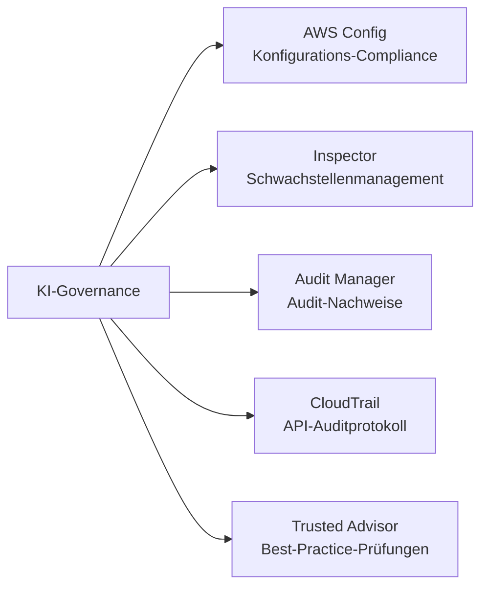
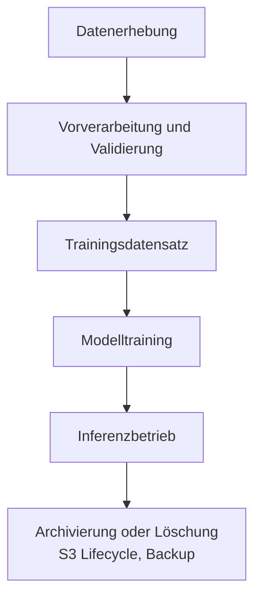
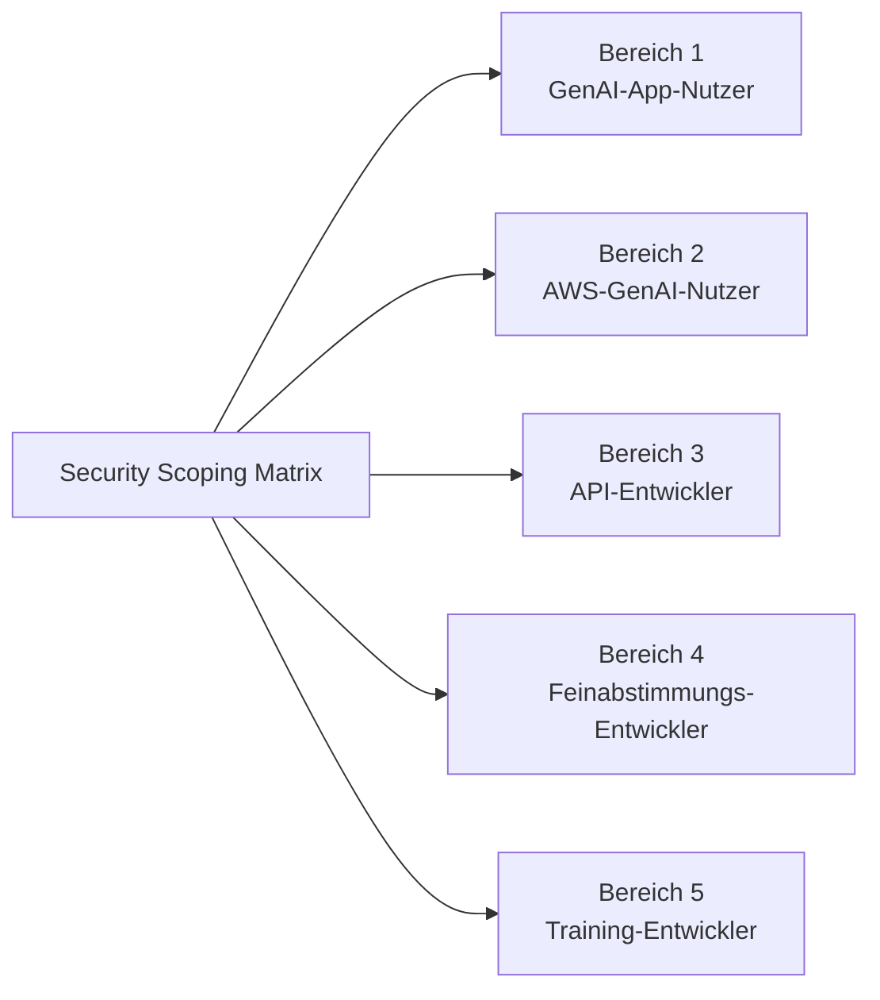
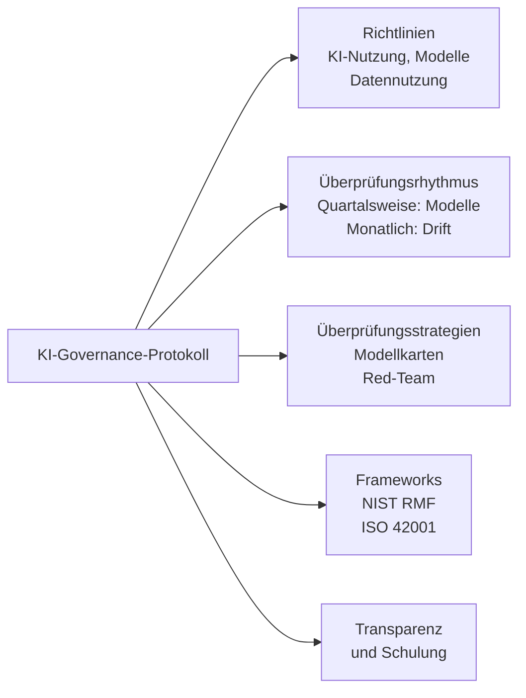

## Aufgabenstellung 5.2: Governance- und Compliance-Anforderungen für KI-Systeme erkennen

Governance und Compliance übersetzen die Grundsätze verantwortungsvoller Künstlicher Intelligenz (KI) in organisatorische Verantwortlichkeit. Während Sicherheitskontrollen die technische Ebene schützen, schaffen Governance-Strukturen die Richtlinien, Überprüfungszyklen, Audit-Trails und regulatorischen Nachweise, die eine Organisation benötigt, um ihre KI-Systeme erklären, verteidigen und kontinuierlich verbessern zu können. Diese Aufgabenstellung behandelt die AWS-Services zur Sammlung von Compliance-Nachweisen, die Datenverwaltungsstrategien, die Prüfer erwarten, sowie die Governance-Prozesse, die KI-Programmen eine dauerhafte institutionelle Grundlage verleihen.[^502001]

### 5.2.1 AWS-Services und -Funktionen für Governance und Compliance

Compliance für eine KI-Arbeitslast ist kein einmaliges Tor, das bei der Bereitstellung durchschritten wird; sie ist ein kontinuierlicher Zustand, der durch fortlaufende Überwachung, Beweiserhebung und Prüfungsbereitschaft aufrechterhalten wird. AWS stellt eine Reihe von verwalteten Diensten bereit, die gemeinsam den gesamten Compliance-Lebenszyklus abdecken: Konfigurationsaufzeichnung, Schwachstellenanalyse, framework-konforme Beweiserhebung, bedarfsgesteuerten Berichtabruf, API-Audit-Protokollierung und Best-Practice-Prüfungen. Im Zusammenspiel ermöglichen es diese Services einer Organisation, Regulierungsbehörden, Prüfern und internen Stakeholdern nachzuweisen, dass ihre KI-Systeme innerhalb definierter Grenzen betrieben werden.

Die Beziehung zwischen diesen Services folgt einer logischen Arbeitsteilung. **AWS Config** verfolgt den Konfigurationszustand von Ressourcen und bewertet, ob sie den definierten Regeln entsprechen. **Amazon Inspector** findet Schwachstellen in den Compute- und Container-Ebenen, auf denen KI-Arbeitslasten betrieben werden. **AWS Audit Manager** organisiert Compliance-Nachweise in prüfungsfertige Pakete, die an spezifische Frameworks ausgerichtet sind. **AWS Artifact** gibt autorisierten Benutzern Zugang zu den eigenen Drittanbieter-Compliance-Zertifizierungen von AWS. **AWS CloudTrail** erstellt das unveränderliche API-Aktivitätsprotokoll, das belegt, wer was wann getan hat. **AWS Trusted Advisor** identifiziert Konfigurationslücken gegenüber AWS-Best-Practices in den Bereichen Kostenoptimierung, Sicherheit, Fehlertoleranz und Servicelimits.

*Abbildung 5.2.1: AWS-Compliance-Service-Kategorien. Jeder Service adressiert eine eigene Ebene des Audit- und Governance-Stacks für KI-Arbeitslasten.*

**AWS Config** ist ein Dienst zur Konfigurationsaufzeichnung und Regelauswertung, der den Zustand von AWS-Ressourcen kontinuierlich verfolgt und mit richtliniendefinierten Compliance-Regeln abgleicht.[^502002] Wenn sich eine Ressource ändert, zeichnet Config die neue Konfiguration auf, vergleicht sie mit den geltenden Regeln und markiert alle nicht konformen Einträge. Für KI-Arbeitslasten sind drei Regelkategorien besonders relevant. Erstens lässt sich die Bedrock-Modellaufrufprotokollierung überprüfen: Eine Config-Regel kann prüfen, ob die Protokollierung für Amazon Bedrock aktiviert ist, und sicherstellen, dass jede Modellanfrage für Audits und Analysen erfasst wird.[^502003] Zweitens kann der Zugang zu SageMaker-Notebooks gesteuert werden: Eine Regel, die prüft, ob Amazon-SageMaker-Notebook-Instanzen IAM-basierten Zugang erfordern, verhindert die direkte Internetexposition von Notebook-Umgebungen, in denen Trainings-Code und -Daten gespeichert sind.[^502004] Drittens lässt sich Verschlüsselung durchsetzen: Eine Regel, die prüft, ob benutzerdefinierte Bedrock-Modellartefakte und SageMaker-Trainingsvolumes im Ruhezustand verschlüsselt sind, stellt sicher, dass sensible Modellparameter und Trainingsdaten stets geschützt bleiben.[^502005]

Config-Regeln lassen sich in *Konformitätspaketen (Conformance Packs)* zusammenfassen, die mehrere verwandte Regeln in einer bereitstellbaren Einheit bündeln, die auf eine bestimmte Compliance-Anforderung wie NIST SP 800-53 oder den AWS Foundational Security Best Practices Standard ausgerichtet ist.[^502006] Wenn eine Organisation nachweisen möchte, dass ihre KI-Umgebung die Kontrollanforderungen eines Frameworks erfüllt, bietet die Bereitstellung des entsprechenden Konformitätspakets und der Export seines Compliance-Dashboards eine einheitliche, reproduzierbare Übersicht über den Kontrollstatus.

**Amazon Inspector** ist ein kontinuierlicher Schwachstellenbewertungsdienst, der Amazon-EC2-Instanzen, AWS-Lambda-Funktionen und Container-Images in Amazon Elastic Container Registry (ECR) auf bekannte Software-Schwachstellen und unbeabsichtigte Netzwerkexposition scannt.[^502007] KI-Arbeitslasten laufen häufig auf Infrastruktur, die Inspector abdeckt: SageMaker-Trainingsaufträge werden auf EC2-Instanzflotten ausgeführt, Inferenz-Container werden in ECR gespeichert, und benutzerdefinierter Inferenz-Code kann als Lambda-Funktionen laufen. Inspector korreliert Befunde mit der CVE-Datenbank (Common Vulnerabilities and Exposures) und weist eine Risikobewertung zu, sodass Sicherheitsteams priorisieren können, welche Schwachstellen zuerst behoben werden sollen, basierend auf Ausnutzbarkeit und Auswirkung.[^502008] Für die Governance fließen Inspector-Befunde direkt in AWS Security Hub ein und liefern ein zentrales Dashboard, das Prüfer zusammen mit anderen Compliance-Signalen einsehen können.

**AWS Audit Manager** automatisiert die Beweiserhebung für Compliance-Audits.[^502009] Statt vor jedem Prüfungszyklus manuell Screenshots und Protokollausschnitte zu extrahieren, konfigurieren Organisationen Audit Manager mit einem Framework, woraufhin der Dienst kontinuierlich Nachweise aus AWS-Config-Regelergebnissen, CloudTrail-API-Aufrufen und Security-Hub-Befunden sammelt. Der Dienst enthält vorgefertigte Frameworks für HIPAA, SOC 2, PCI DSS, ISO 27001, FedRAMP und weitere Standards sowie Werkzeuge zum Aufbau benutzerdefinierter Frameworks für interne Prüfprogramme oder neue KI-spezifische Anforderungen.[^502010] Die Nachweise werden in einem strukturierten Bewertungsbericht gespeichert, den ein Prüfer ohne direkten Zugang zur AWS-Umgebung einsehen kann. Für KI-Programme unter HIPAA kann Audit Manager beispielsweise Nachweise sammeln, dass Trainingsdaten verschlüsselt sind, dass der Zugang zu Modell-Inferenzendpunkten protokolliert wird und dass Änderungen an Modellkonfigurationen aufgezeichnet werden, und so ein Audit-Paket erstellen, das den Betrieb von Kontrollen über einen definierten Zeitraum belegt.

**AWS Artifact** ist das Self-Service-Portal, über das AWS-Kunden die eigenen Compliance-Zertifizierungen und Vereinbarungen von AWS herunterladen können.[^502011] Verfügbare Berichte umfassen SOC-1-, SOC-2- und SOC-3-Berichte (System- und Organisationskontrollprüfungen durch unabhängige Dritte), ISO-27001-, ISO-27017- und ISO-27018-Zertifizierungen (Informationssicherheitsmanagement und Cloud-Datenschutz), die PCI-DSS-Konformitätsbescheinigung (für Zahlungskartenarbeitslasten) sowie HIPAA-Business-Associate-Addenda (BAA) für betroffene Gesundheitseinrichtungen.[^502012] Artifact erzeugt keine Nachweise über die eigenen Arbeitslasten des Kunden; es liefert Nachweise über die Kontrollen von AWS als zugrunde liegendem Infrastrukturanbieter. Dieser Unterschied ist für das gemeinsame Verantwortungsmodell von AWS relevant: Der Kunde legt Artifact-Berichte vor, um nachzuweisen, dass die Cloud-Plattform selbst den Infrastrukturanforderungen des Regulierers entspricht, während Audit-Manager-Nachweise belegen, dass die Konfiguration und der Betrieb des Kunden dieselben Anforderungen erfüllen.

**AWS CloudTrail** zeichnet jeden API-Aufruf an AWS-Services auf und stellt Ereignisaufzeichnungen innerhalb von Minuten nach dem Aufruf in einem Amazon-S3-Bucket bereit.[^502013] Für KI-Arbeitslasten umfasst dies jeden InvokeModel-API-Aufruf von Amazon Bedrock (mit Erfassung des aufgerufenen Modells, des Aufrufers, des Zeitpunkts und des Ergebniscodes), jeden CreateTrainingJob- und CreateEndpoint-Aufruf von SageMaker sowie jede IAM-Richtlinienänderung, die den Modellzugang betrifft. CloudTrail unterstützt auch Datenereignisse, die Aktivitäten auf Objektebene in Amazon S3 aufzeichnen. Die Aktivierung von S3-Datenereignissen auf einem Trainingsdaten-Bucket erzeugt ein Protokoll jedes Lese- und Schreibvorgangs auf Trainingsdateien und schafft so eine überprüfbare Verwahrungskette, die belegt, dass zwischen der Datenvorbereitung und dem Modelltraining keine unautorisierten Änderungen vorgenommen wurden.[^502014] CloudTrail Lake, die verwaltete Analyseebene des Dienstes, ermöglicht SQL-basierte Abfragen des Ereignisverlaufs ohne ein externes Protokollanalysesystem, was es unkompliziert macht, Prüferfragen wie „Zeige mir jede Änderung an der Konfiguration des Produktionsmodell-Inferenzendpunkts in den letzten 90 Tagen" zu beantworten.[^502015]

**AWS Trusted Advisor** bewertet AWS-Kontokonfigurationen anhand von AWS-Best-Practices in fünf Kategorien: Kostenoptimierung, Performance, Sicherheit, Fehlertoleranz und Servicelimits.[^502016] Aus Governance-Perspektive sind die Sicherheitsprüfungen am direktesten für KI-Compliance-Programme relevant. Trusted Advisor markiert Bedingungen wie öffentlicher S3-Bucket-Zugang, unbeschränkte Sicherheitsgruppen-Regeln, IAM-Zugriffsschlüssel, die nicht rotiert wurden, und die Nutzung des Root-Kontos. Für KI-Arbeitslasten sind auch Servicelimit-Prüfungen wichtig: Ein SageMaker-Inferenzendpunkt, der sich seinem Instanzanzahl-Limit nähert, könnte während einer Spitzenlastperiode nicht mehr skalieren, was unter bestimmten SLAs ein meldepflichtiges Verfügbarkeitsproblem darstellen könnte.[^502017] Trusted-Advisor-Ergebnisse stehen in der AWS-Konsole und über die API zur Verfügung und können daher zusammen mit Config-, Inspector- und Security-Hub-Befunden in Compliance-Dashboards eingespeist werden.

*Tabelle 5.2.1: AWS-Governance- und Compliance-Services im Überblick für KI-Anwendungsfälle*

| Service | Primäre Funktion | KI-spezifischer Governance-Anwendungsfall |
|---|---|---|
| AWS Config | Konfigurationsaufzeichnung und Regelauswertung | Bedrock-Protokollierung prüfen; IAM-only-Zugang für SageMaker erzwingen; Verschlüsselung von Modellartefakten prüfen |
| Amazon Inspector | Schwachstellenanalyse für EC2, Lambda, ECR | Inferenz-Container und Lambda-Funktionen auf CVEs scannen; unbeabsichtigte Netzwerkexposition erkennen |
| AWS Audit Manager | Automatisierte Beweiserhebung für Audit-Frameworks | HIPAA-, SOC-2- und PCI-Nachweise für KI-Arbeitslasten sammeln; prüfungsfertige Berichte erstellen |
| AWS Artifact | AWS-Compliance-Zertifizierungen herunterladen | SOC-, ISO-, PCI- und HIPAA-BAA-Berichte für Regulierer abrufen, um Plattform-Compliance nachzuweisen |
| AWS CloudTrail | Unveränderliches API-Auditprotokoll | Jeden Bedrock-InvokeModel-Aufruf protokollieren; S3-Datenereignisse auf Trainings-Buckets aufzeichnen |
| AWS Trusted Advisor | Best-Practice-Prüfungen in Sicherheit, Kosten und Limits | Öffentliche S3-Buckets, nicht rotierte IAM-Schlüssel und SageMaker-Servicelimit-Risiken markieren |

Zusammen bilden diese sechs Services die Compliance-Instrumentierungsebene für eine KI-Arbeitslast auf AWS. Config und Inspector überwachen den aktuellen Zustand. CloudTrail zeichnet den historischen Zustand auf. Audit Manager verpackt beides zu Audit-Nachweisen. Artifact liefert die eigenen Compliance-Zertifizierungen von AWS. Trusted Advisor identifiziert Lücken, bevor Prüfer oder Vorfälle es tun.

AWS Security Hub aggregiert Befunde aus Config, Inspector und Macie in einem einzigen Compliance-Dashboard. Es wird in Aufgabenstellung 5.1 behandelt, weil es auf der Sicherheitsüberwachungsebene angesiedelt ist, ist aber der natürliche Abnehmer der Signale, die diese sechs Governance-Services erzeugen. Der nächste Abschnitt behandelt, wie Datenverwaltungsstrategien auf diese Instrumentierung aufbauen, um die von den KI-Systemen verarbeiteten Informationen zu verwalten.

### 5.2.2 Strategien zur Datenverwaltung

Daten sind die vorgelagerte Eingabe, die bestimmt, was ein KI-System wissen kann und wie es sich verhalten wird. Daten für KI zu verwalten bedeutet, ihren vollständigen Lebenszyklus zu steuern: von der ersten Erhebung über die aktive Nutzung und Archivierung bis zur endgültigen Löschung, mit definierten Kontrollen in jeder Phase. Ein KI-System, das Gesundheitsdaten von Kunden, Finanztransaktionen oder persönliche Kommunikation verarbeitet, trägt die Datenverwaltungsverpflichtungen der Organisation, die diese Daten erhoben hat; ein Modell schafft keine gesetzliche Ausnahme von Datenschutz-, Aufenthaltsorts- oder Aufbewahrungsanforderungen.

Die Disziplin der *Datenverwaltung (Data Governance)* umfasst sechs Praktiken, die Unternehmensprofis laut Prüfungsziel kennen sollten: Lebenszyklusmanagement, Protokollierung, Datenresidenz, Überwachung, Beobachtung und Aufbewahrung. Jede Praktik adressiert eine andere Kategorie von Governance-Risiken.

**Datenlebenszyklus-Management** verfolgt den Weg, den Daten von dem Moment, in dem sie erstellt oder erfasst werden, bis zu dem Moment, in dem sie gelöscht oder archiviert werden.[^502018] Bei einem KI-Trainingsdatensatz durchläuft der Lebenszyklus typischerweise die Phasen Erhebung und Aufnahme, Vorverarbeitung und Validierung, Training und Modellartefakt-Speicherung, Merkmalsableitung zur Inferenzzeit sowie abschließende Archivierung oder Löschung nach der Außerbetriebnahme des Modells. Jede Phase sollte einen dokumentierten Verantwortlichen, definierte Qualitätsstandards und eine Zugriffsrichtlinie haben, die einschränkt, wer Daten in dieser Phase lesen oder ändern darf. **AWS Glue Data Catalog** zeichnet die Metadaten von Datensätzen in jeder Phase auf: Tabellenschemata, Datentypen, Zeitstempel der letzten Änderung und Beschreibungen auf Spaltenebene.[^502019] Wenn ein Prüfer fragt, mit welchen Daten eine bestimmte Modellversion trainiert wurde, liefert der Glue-Data-Catalog-Eintrag für den Trainingsdatensatz, verknüpft mit der SageMaker-Modellkarte, die rückverfolgbare Antwort.

**AWS Lake Formation** erweitert den Glue Data Catalog um eine detaillierte Zugriffskontrolle, die es Organisationen ermöglicht, Berechtigungen auf Spalten-, Zeilen- und Zellenebene für in Amazon S3 gespeicherte Datensätze zu vergeben.[^502020] Für die KI-Governance ist dies wichtig, wenn ein Trainingsdatensatz eine Mischung aus Spalten mit personenbezogenen Daten (PbD) und nicht-personenbezogenen Spalten enthält. Lake Formation kann einem Machine-Learning-Ingenieur Lesezugang zu den nicht-personenbezogenen Spalten erteilen und gleichzeitig den Zugang zu Namen, Adressen und Identifikationsnummern sperren, bis ein formaler Datennutzungsvertrag vorliegt. Dieses *Need-to-know*-Modell auf Spaltenebene ist wesentlich präziser als IAM-Richtlinien auf Bucket-Ebene und entspricht dem Ansatz, den Regulierer für die Verarbeitung sensibler Daten erwarten.

*Abbildung 5.2.2: KI-Datenlebenszyklus. Daten fließen von der Erhebung über Training und Inferenz bis zur Archivierung, wobei in jeder Phase Governance-Kontrollen angewendet werden.*

**Protokollierung** im Kontext der Datenverwaltung bezeichnet das Festhalten, auf welche Daten zugegriffen wurde, von welchem System oder Benutzer, zu welchem Zeitpunkt und zu welchem Zweck.[^502021] Für eine KI-Anwendung sind drei Protokollierungsbereiche relevant. CloudTrail-Datenereignisse zeichnen Lese- und Schreibvorgänge auf S3-Trainings-Buckets und Modellartefakt-Buckets auf und liefern das Zugriffsprotokoll auf Objektebene. Die Amazon-Bedrock-Modellaufrufprotokollierung erfasst den Eingabe-Prompt, die Modellantwort und Metadaten für jeden Inferenzaufruf, was wichtig ist, wenn nachgelagerte Vorschriften verlangen, dass die Organisation rekonstruieren kann, welche Informationen den Benutzern bereitgestellt wurden.[^502022] Amazon CloudWatch Logs bewahrt Protokolle auf Anwendungsebene von Lambda-Funktionen, ECS-Containern und SageMaker-Inferenzendpunkten auf und erfasst Laufzeitfehler und Ausgabemuster, die eine unbeabsichtigte Datenexposition offenbaren können. Protokollaufbewahrungsfristen sollten so festgelegt werden, dass sie der geltenden Vorschrift entsprechen: HIPAA schreibt für bestimmte Aufzeichnungen eine Mindestaufbewahrung von sechs Jahren vor, PCI DSS ein Jahr mit 90 Tagen sofortiger Verfügbarkeit, und viele Finanzregulierer verlangen sieben Jahre.[^502023]

**Datenresidenz** ist die Anforderung, dass Daten innerhalb einer definierten geografischen Grenze verbleiben, in der Regel gesetzlich vorgeschrieben.[^502024] Die Datenschutz-Grundverordnung (DSGVO) der Europäischen Union schränkt die Übermittlung personenbezogener Daten von EU-Bürgern in Länder außerhalb des Europäischen Wirtschaftsraums ein, sofern keine spezifischen Schutzmaßnahmen greifen.[^502025] Bei AWS-KI-Arbeitslasten wird die Datenresidenz durch die Regionsauswahl gesteuert. Trainingsdaten für eine EU-regulierte Anwendung sollten in S3-Buckets in einer `eu-*`-Region liegen, Modelltrainingsaufträge sollten für die Ausführung in dieser Region konfiguriert sein, und Amazon-Bedrock-Modellaufrufe sollten einen Inferenzendpunkt in derselben Region verwenden. **Amazon Bedrock** respektiert die Regionsbezeichnung: Der Modell-Inferenzaufruf wird in der Region verarbeitet, in der der Inferenzendpunkt konfiguriert ist, und die Ein- und Ausgabedaten verlassen diese Region nicht, sofern dies nicht explizit konfiguriert wurde.[^502026] Residenz-Compliance erfordert eine disziplinierte Regionsauswahl entlang der gesamten Pipeline, nicht nur auf der Speicherebene.

**Überwachung** in der Datenverwaltung verfolgt, ob Datenzugriffs- und Nutzungsmuster innerhalb der richtlinienmäßig definierten Grenzen bleiben.[^502027] Bei einem KI-System umfasst die Überwachung die Prüfung, ob das Modell nicht mit Datenkategorien aufgerufen wird, für deren Verarbeitung es nicht freigegeben ist, ob Antworten keine personenbezogenen Daten enthalten, die hätten unterdrückt werden sollen, und ob API-Aufrufvolumina nicht auf eine Weise steigen, die auf Datenexfiltrationsversuche hindeutet. Amazon CloudWatch Metrics erfasst operative Signale, **Amazon Macie** scannt S3-Buckets auf PbD-Inhalte und ungewöhnliche Zugriffsmuster (in Aufgabenstellung 5.1 im Kontext der Datensicherheit behandelt), und die Bedrock-Aufrufprotokollierung liefert das Rohmaterial für benutzerdefinierte Erkennungsregeln in CloudWatch Logs Insights. Während die Überwachung fragt „Verstößt jemand gegen die Regeln?", fragt die Beobachtung (im nächsten Punkt) „Verändern sich die Daten selbst unter uns?"

**Beobachtung** ist die Praxis, die statistischen Eigenschaften der durch ein KI-System fließenden Daten kontinuierlich zu verfolgen, um *Datendrift* zu erkennen.[^502028] Datendrift tritt auf, wenn sich die Verteilung der in der Produktion beobachteten Daten bedeutsam von der Verteilung unterscheidet, die beim Training des Modells verwendet wurde. Beispielsweise kann ein Betrugserkennungsmodell, das auf Transaktionen von 2022 trainiert wurde, Muster gelernt haben, die das Betrugsmuster von 2024 nicht mehr charakterisieren; die Vorhersagen des Modells verschlechtern sich, während seine strukturellen Leistungsmetriken unverändert bleiben. Datendrift zu beobachten erfordert die Erfassung einer repräsentativen Stichprobe von Inferenz-Eingaben, die Berechnung ihrer statistischen Eigenschaften und den Vergleich dieser Eigenschaften mit einem Ausgangswert, der aus dem Trainingsdatensatz abgeleitet wurde. **Amazon SageMaker Model Monitor** automatisiert diesen Prozess, plant Datengüte- und Modellgüte-Vergleiche mit dem Ausgangswert und löst CloudWatch-Alarme aus, wenn der Drift konfigurierbare Schwellenwerte überschreitet.[^502029]

**Aufbewahrung** definiert, wie lange Daten aufbewahrt werden müssen und wann sie gelöscht werden müssen.[^502030] Die Aufbewahrungsrichtlinie umfasst sowohl ein Minimum (gesetzliche und regulatorische Mindestfristen) als auch ein Maximum (Datenschutzgesetze können es verbieten, personenbezogene Daten länger als für den ursprünglichen Zweck notwendig aufzubewahren). **Amazon-S3-Lifecycle-Richtlinien** automatisieren den Übergang von Objekten durch Speichertiers (Standard zu Standard-IA zu Glacier zu Glacier Deep Archive) nach einem definierten Zeitplan und erzwingen die Löschung am Ende der Aufbewahrungsfrist.[^502031] **AWS Backup** bietet einen zentralisierten Dienst zum Planen, Überwachen und Durchsetzen von Backup- und Aufbewahrungsrichtlinien für S3, RDS, DynamoDB, EFS und weitere Services, mit unveränderlichen Wiederherstellungspunkten, die vor Ablauf einer konfigurierten Aufbewahrungsfrist nicht gelöscht werden können, eine Eigenschaft, die Regulierer als äquivalent zu einem gesetzlichen Aufbewahrungsgebot behandeln.[^502032]

*Tabelle 5.2.2: Datenverwaltungspraktiken im Überblick mit AWS-Services und KI-Risiken*

| Verwaltungspraxis | Was sie adressiert | Relevanter AWS-Service | Gemildertes KI-spezifisches Risiko |
|---|---|---|---|
| Datenlebenszyklus-Management | Daten von der Entstehung bis zur Löschung verfolgen | AWS Glue Data Catalog, AWS Lake Formation | Unfähigkeit, die Trainingsdatenquelle bei einem Audit zu identifizieren |
| Protokollierung | Zugriffs- und Nutzungsnachweise erfassen | AWS CloudTrail (Datenereignisse), Bedrock-Aufrufprotokollierung, CloudWatch Logs | Unfähigkeit, Modellinteraktionen bei einer regulatorischen Anfrage zu rekonstruieren |
| Datenresidenz | Daten innerhalb geografischer Grenzen halten | Regionsauswahl, Amazon-Bedrock-regionsgebundene Inferenzendpunkte | DSGVO-Verstoß, grenzüberschreitende Datenübermittlung ohne Schutzmaßnahmen |
| Überwachung | Richtlinienverstöße bei Datenzugriff und Ausgabe erkennen | Amazon Macie, CloudWatch Metrics, Bedrock-Protokollierung | PbD-Exposition in Modellausgaben, unbefugter Datenzugriff |
| Beobachtung | Drift in der Datenverteilung über Zeit erkennen | Amazon SageMaker Model Monitor | Stille Modellverschlechterung durch veränderte Eingabeverteilung |
| Aufbewahrung | Mindest- und Höchstaufbewahrungsfristen für Daten durchsetzen | Amazon-S3-Lifecycle-Richtlinien, AWS Backup | Personenbezogene Daten über die gesetzliche Frist hinaus aufbewahren; vorzeitige Löschung von Nachweisen |

Diese sechs Praktiken gelten für jede Phase des KI-Datenlebenszyklus. Organisationen, die jede Praktik in schriftlichen Richtlinien formalisieren, sie den spezifischen AWS-Services in ihrer Umgebung zuordnen und in regelmäßigen Abständen gegen diese Zuordnung prüfen, sind erheblich besser aufgestellt, wenn Regulierer oder interne Prüfer Nachweise über die Datenverwaltungsreife anfordern. Der folgende Abschnitt behandelt, wie Governance-Protokolle die Richtlinien und Services zu einem strukturierten Programm verbinden.

### 5.2.3 Prozesse zur Einhaltung von Governance-Protokollen

Technische Kontrollen und Datenpraktiken haben begrenzte organisatorische Dauerhaftigkeit, solange sie nicht in formale Governance-Prozesse eingebettet sind: schriftliche Richtlinien, wiederkehrende Überprüfungszyklen, etablierte Frameworks und geschulte Teams. Dieser Abschnitt behandelt die Prozessebene der KI-Governance mit besonderem Augenmerk auf die AWS Generative AI Security Scoping Matrix, die einen praktischen Weg bietet, Governance-Verantwortlichkeiten danach zu kalibrieren, wie eine Organisation KI einsetzt.

**Richtlinien** sind die grundlegenden Governance-Dokumente, die den zulässigen Einsatz festlegen, Verantwortlichkeiten definieren und Grenzen für die Entwicklung und den Betrieb von KI-Systemen setzen.[^502033] Drei Kategorien von Richtlinien sind für ein KI-Programm relevant. Eine *KI-Nutzungsrichtlinie* legt fest, für welche Geschäftsanwendungsfälle die Organisation KI einsetzen darf, welche Datenkategorien KI-Systeme verarbeiten dürfen und welche Entscheidungen KI ohne menschliche Überprüfung beeinflussen darf. Eine *Modellnutzungsrichtlinie* spezifiziert zulässige Modelle für unterschiedliche Risikoniveaus (zum Beispiel ausschließlich genehmigte Amazon-Bedrock-Basismodelle für kundenorientierte Anwendungen, beliebige Modelle für interne Produktivitätswerkzeuge), das Verfahren zur Aufnahme eines neuen Modells in die Genehmigungsliste und Verbote, die unabhängig vom Anwendungsfall gelten. Eine *Datennutzungsrichtlinie* legt fest, welche Datensätze für das Training oder die Feinabstimmung von Modellen verwendet werden dürfen, welche Einwilligung oder Anonymisierung erforderlich ist, bevor personenbezogene Daten in eine Trainingspipeline eingespeist werden, und welche Datenklassifizierungsstufen zusätzliche Genehmigungsschritte erfordern.

Richtlinien benötigen einen Verantwortlichen, einen Versionsverlauf, ein jährliches Überprüfungsdatum und eine Verknüpfung mit den technischen Kontrollen, die sie durchsetzen. Eine Richtlinie, die besagt „alle Trainingsdaten müssen verschlüsselt sein", sollte bis zur AWS-Config-Regel rückverfolgbar sein, die den Verschlüsselungsstatus der betreffenden S3-Buckets und SageMaker-Trainingsvolumes prüft.

**Überprüfungsrhythmus** ist der Zeitplan, nach dem Governance-Entscheidungen überprüft, angepasst oder bestätigt werden.[^502034] KI-Systeme sind nicht statisch: Modelle driften, Bedrohungslandschaften entwickeln sich, Vorschriften ändern sich, und Geschäftsanwendungsfälle weiten sich aus. Drei Überprüfungsfrequenzen adressieren unterschiedliche Kategorien von Veränderungen. Vierteljährliche Modellüberprüfungen beurteilen, ob eingesetzte Modelle weiterhin innerhalb akzeptabler Genauigkeits-, Fairness- und Sicherheitsgrenzen funktionieren, anhand der in der Modellkarte festgelegten Metriken. Monatliche Drift-Überprüfungen analysieren den SageMaker-Model-Monitor-Output und Bedrock-Aufrufprotokolle, um Verteilungsverschiebungen oder anomale Ausgabemuster zu erkennen, bevor sie sich zu einem meldepflichtigen Vorfall kumulieren. Bedrohungsmodell-Überprüfungen bei der Bereitstellung werden durchgeführt, bevor eine neue Modellversion, eine neue Datenquelle oder eine neue Agent-Funktion in die Produktion übergeht; sie bewerten, ob die Änderung neue Angriffsvektoren einführt (zum Beispiel Prompt-Injektionsrisiko aus einer neuen externen Datenquelle) und ob die bestehenden Kontrollen ausreichen.

**Überprüfungsstrategien** sind die strukturierten Methoden, die innerhalb eines Überprüfungszyklus zur Bewertung des KI-Systemverhaltens eingesetzt werden.[^502035] Für KI-Systeme werden typischerweise drei Strategien angewendet. *Modellkarten-Überprüfungen* nutzen die formale Modelldokumentation (in Aufgabenstellung 5.1 im Kontext der Datenherkunft behandelt) als Grundlage für einen strukturierten Vergleich des beabsichtigten mit dem beobachteten Verhalten und prüfen, ob die tatsächliche Produktionsleistung des Modells den bei der Bereitstellung dokumentierten Eigenschaften entspricht. *Red-Team-Übungen* simulieren den adversarialen Einsatz des KI-Systems: Red-Team-Teilnehmer versuchen, schädliche Ausgaben zu erzeugen, Schutzmaßnahmen zu umgehen, Trainingsdaten zu extrahieren oder das System dazu zu bringen, außerhalb seines vorgesehenen Bereichs zu handeln. Red-Teaming produziert einen Ergebnisbericht, der Aktualisierungen von Guardrail-Konfigurationen, Prompt-Vorlagen und Überwachungsregeln antreibt. *Kundenvertrauens-Überprüfungen* prüfen, ob die externen Kommunikationen der Organisation über das KI-System, einschließlich Produktdokumentation, Datenverarbeitungserklärungen und Beschreibungen der Modellfähigkeiten, das aktuelle Systemverhalten genau widerspiegeln; Abweichungen zwischen veröffentlichten Aussagen und tatsächlichem Verhalten setzen die Organisation regulatorischen und reputationellen Risiken aus.

**Governance-Frameworks** stellen das strukturierte Vokabular und die Kontrolltaxonomien bereit, die Organisationen verwenden, um ihre KI-Governance-Programme aufzubauen und zu kommunizieren.[^502036] In den Prüfungszielen oder in den veröffentlichten AWS-Richtlinien erscheinen vier Frameworks.

Die **AWS Generative AI Security Scoping Matrix** ist das operativ spezifischste der vier Frameworks und das, das die Prüfung explizit nennt.[^502037] Sie beschreibt fünf Einsatzbereiche, die zunehmende Kundenzuständigkeiten repräsentieren, von der Nutzung einer GenAI-Anwendung eines Drittanbieters bis zum Training eines vollständig eigenen Modells. Jeder Bereich hat einen definierten Satz von Sicherheits- und Governance-Verantwortlichkeiten, die beim Kunden gegenüber dem Anbieter liegen.

*Abbildung 5.2.3: AWS Generative AI Security Scoping Matrix. Jeder Bereich umfasst einen breiteren Satz von Governance-Verantwortlichkeiten des Kunden.*

In **Bereich 1** nutzt ein Mitarbeiter eine öffentlich verfügbare GenAI-Konsumentenanwendung. Die primäre Verantwortung der Organisation besteht in der Durchsetzung der Nutzungsrichtlinie: sicherzustellen, dass der Mitarbeiter keine sensiblen Unternehmensinformationen in ein System eingibt, das die Organisation nicht kontrolliert.

In **Bereich 2** nutzt die Organisation eine unternehmenseigene SaaS-Anwendung mit integrierten GenAI-Funktionen (zum Beispiel ein CRM, das Kontonotizen zusammenfasst). Der SaaS-Anbieter steuert das Modell und den Großteil der Sicherheitslage; der Kunde steuert, welche Daten die Anwendung aufnehmen darf, wie sie in die interne Identitätsverwaltung integriert wird und welche Offenlegungspflichten gegenüber Endbenutzern bestehen.

In **Bereich 3** entwickelt ein Entwicklungsteam eine Anwendung, die eine Basismodell-API wie Amazon Bedrock aufruft, eigene Prompt-Engineering-Logik schreibt und das Modell in einen Geschäfts-Workflow integriert. Der Kunde steuert nun die Qualität der Eingabeaufforderungen, die Sicherheit der Ausgaben und die Integrationsarchitektur; AWS steuert weiterhin die Modellinfrastruktur und die Sicherheit des zugrunde liegenden Dienstes.

In **Bereich 4** stimmt der Kunde ein Basismodell mithilfe eigener Daten fein ab und übernimmt zusätzlich zu den Zuständigkeiten aus Bereich 3 die Verantwortung für den Trainingsdatensatz, den Feinabstimmungsprozess und das Modellartefakt.

In **Bereich 5** trainiert der Kunde ein Modell von Grund auf und trägt die volle Verantwortung für das Modellverhalten, die Trainingsinfrastruktur und alle zugehörigen Daten.[^502038]

Die Scoping-Matrix ist ein praktischer Ausgangspunkt für die Governance-Planung, weil sie einer Organisation ermöglicht, schnell zu identifizieren, welche ihrer KI-Aktivitäten in welchen Bereich fallen und welche Governance-Kontrollen sie daher implementieren muss, die der Anbieter nicht abdeckt. Die meisten Unternehmen operieren gleichzeitig in mehreren Bereichen: Mitarbeiter nutzen GenAI-Konsumenten-Tools (Bereich 1), Produktteams bauen auf Bedrock-APIs auf (Bereiche 2 und 3), und Data-Science-Teams stimmen domänenspezifische Modelle fein ab (Bereich 4).

*Tabelle 5.2.3: Zusammenfassung der AWS Generative AI Security Scoping Matrix*

| Bereich | Kundentätigkeit | Modellverantwortung | Datenverantwortung | Wichtigste Governance-Maßnahme |
|---|---|---|---|---|
| 1 | GenAI-App eines Drittanbieters nutzen | Drittanbieter | Kunde: was die App eingibt und ausgibt | Nutzungsrichtlinie; Mitarbeiterschulung |
| 2 | Unternehmens-SaaS-App mit eingebetteter GenAI nutzen | SaaS-Anbieter | Kunde: Aufnahmedaten, Integrationen, Offenlegungen | Anbieter-Sorgfaltsprüfung; Integrationsrichtlinie |
| 3 | App auf FM-API aufbauen (z. B. Bedrock) | AWS (Infrastruktur) | Kunde: Eingabeaufforderungen, Ausgaben, Integrationen | Prompt-Sicherheit; Schutzmaßnahmen; Integrations-Bedrohungsmodell |
| 4 | Modell feinabstimmen | Geteilt (Basismodell durch Anbieter) | Kunde: Feinabstimmungs-Datensatz und Artefakt | Trainingsdaten-Governance; Artefaktverschlüsselung |
| 5 | Eigenes Modell trainieren | Kunde | Kunde: alle Daten und das Modell | Vollständiges KI-Sicherheitsprogramm; Modellkarte; umfassende Kontrollen |

Das **NIST-KI-Risikomanagement-Framework (NIST AI RMF)** ist ein freiwilliges Framework des National Institute of Standards and Technology, das vier Funktionen für das Management von KI-Risiken definiert: Govern (Steuern), Map (Abbilden), Measure (Messen) und Respond (Reagieren).[^502039] Die Govern-Funktion etabliert Verantwortungsstrukturen und Richtlinien. Die Map-Funktion identifiziert und kategorisiert KI-Risiken im Kontext. Die Measure-Funktion quantifiziert Risikoniveaus und verfolgt die Wirksamkeit der Minderung. Die Respond-Funktion definiert Maßnahmen zur Adressierung identifizierter Risiken. Das NIST AI RMF passt gut zu den organisatorischen Governance-Praktiken, die in diesem Abschnitt besprochen werden, und wird von Regulierungsbehörden und Branchenstandards-Gremien als empfohlener Ansatz für das KI-Risikomanagement in den Vereinigten Staaten weitgehend zitiert.

**ISO/IEC 42001** ist die internationale Norm für KI-Managementsysteme, veröffentlicht von der Internationalen Organisation für Normung.[^502040] Sie definiert Anforderungen für die Einrichtung, Umsetzung, Aufrechterhaltung und kontinuierliche Verbesserung eines KI-Managementsystems in einer Organisation, einschließlich Ziele, Rollen, Risikobewertung und Leistungsbewertung. Die ISO-42001-Zertifizierung liefert eine Drittanbieter-Validierung, dass das KI-Governance-Programm einer Organisation den Anforderungen der Norm entspricht, was von Unternehmenseinkaufsprozessen und staatlichen Regulierungsbehörden außerhalb der Vereinigten Staaten zunehmend anerkannt wird.

Der **EU AI Act** klassifiziert KI-Systeme nach Risikoniveau und weist entsprechende Compliance-Pflichten zu.[^502041] Systeme der höchsten Risikostufe, die Anwendungen in kritischer Infrastruktur, Beschäftigungsentscheidungen, Bildung, Kreditscoring, Strafverfolgung und biometrischer Identifikation umfasst, müssen vor der Bereitstellung in der EU Anforderungen an Transparenz, menschliche Aufsicht, Datenverwaltung und Genauigkeit erfüllen. Systeme mit geringerem Risiko unterliegen leichteren Pflichten, und einige KI-Anwendungen sind vollständig verboten. Für Unternehmensprofis ist die Risikoklassifizierung des Gesetzes ein Governance-Eingabewert: Bei der Entwicklung eines KI-Systems bestimmt die Feststellung seiner EU-AI-Act-Risikostufe den Umfang der erforderlichen Dokumentation, Tests und Audit-Nachweise.

**Transparenzstandards** definieren, was eine Organisation ihren internen Stakeholdern, externen Nutzern und Regulierungsbehörden über ihre KI-Systeme offenlegt.[^502042] Interne Transparenz bedeutet mindestens das Veröffentlichen von Modellkarten für alle Produktionsmodelle, das Dokumentieren bekannter Einschränkungen, Verzerrungsbewertungen und des vorgesehenen Anwendungsbereichs sowie das Zugänglichmachen dieser Dokumentation für die Sicherheits-, Rechts- und Compliance-Teams, die das System überwachen. Externe Transparenz bedeutet, Nutzern gegenüber offenzulegen, dass sie mit einem KI-System interagieren, wenn diese Interaktion möglicherweise nicht offensichtlich ist, die Datenkategorien zu beschreiben, die zur Personalisierung der Erfahrung verwendet werden, und zu kommunizieren, wie die Systemausgaben validiert werden, bevor sie als Fakten präsentiert werden.

**Schulungsanforderungen für Teams** erkennen an, dass Governance-Programme scheitern, wenn die für den Betrieb von KI-Systemen verantwortlichen Personen die relevanten Richtlinien und Risiken nicht verstehen.[^502043] Drei Schulungsstufen gelten für unterschiedliche Rollen. Die jährliche KI-Grundlagenschulung, für alle Mitarbeiter verpflichtend, behandelt, was KI ist, wie die KI-Nutzungsrichtlinie der Organisation auf ihre Arbeit anwendbar ist und was zu tun ist, wenn sie auf eine KI-Ausgabe stoßen, die sie für falsch oder schädlich halten. Die rollenspezifische Schulung für KI-Entwickler behandelt Datenverwaltungsanforderungen, Modellkarten-Dokumentation, die Nutzung von Amazon Bedrock Guardrails und SageMaker Model Monitor sowie das Bedrohungsmodell für generative KI-Systeme. Die rollenspezifische Schulung für Prüfer und Genehmiger, darunter Produktmanager, Compliance-Beauftragte und Rechtsabteilungsmitarbeiter, behandelt die Bewertung von Modellkarten, die Interpretation von Drift-Überwachungsausgaben und die Durchführung von Modellkarten-Überprüfungen und Red-Team-Übungen. Schulungsabschlussaufzeichnungen sollten im selben Governance-Repository wie Richtliniendokumente und Audit-Nachweise aufbewahrt werden.

*Abbildung 5.2.4: Komponenten des KI-Governance-Protokolls. Jede Komponente schließt eine spezifische Verantwortlichkeitslücke in einem KI-Governance-Programm.*

Ein wirksames Governance-Protokoll verbindet diese sechs Komponenten zu einem wiederkehrenden Zyklus, anstatt sie als unabhängige Kontrollkästchen zu behandeln. Richtlinien definieren die Anforderungen. Frameworks liefern das Vokabular zur Bewertung der Compliance. Überprüfungen wenden diese Bewertung in regelmäßigen Abständen an. Transparenzstandards legen fest, welche Nachweise geteilt werden müssen. Schulungen stellen sicher, dass die für jede Komponente verantwortlichen Personen ihre Rolle verstehen. Zusammen schaffen sie ein Governance-Programm, das einer externen Prüfung standhält und seine Wirksamkeit beibehält, während KI-Systeme sich weiterentwickeln.

Governance auf diesem Niveau erfordert kein dediziertes KI-Governance-Team vom ersten Tag an. Die meisten Organisationen beginnen damit, bestehende Change-Management-, Risiko- und Compliance-Prozesse um KI-spezifische Überlegungen zu ergänzen, nutzen die AWS-Scoping-Matrix, um zu identifizieren, welche neuen Kontrollen der Anbieter nicht abdeckt, und schließen diese Lücken systematisch. Die Reife des Programms wächst mit der Komplexität des KI-Portfolios.

Damit schließen Aufgabenstellung 5.2 und Domäne 5. Das zugehörige Kapitel, Aufgabenstellung 5.1, behandelte die technischen Sicherheitskontrollen, die die hier beschriebenen Governance-Protokolle überwachen sollen. Zusammen vermitteln die beiden Aufgabenstellungen ein vollständiges Bild davon, wie KI-Systeme auf AWS in der Produktion sicher, prüfbar und normkonform gehalten werden.

## Selbstkontrollfragen

**Frage 1.** Eine Gesundheitsorganisation bereitet sich auf ein HIPAA-Compliance-Audit ihrer KI-Arbeitslast auf AWS vor. Die Prüfer verlangen Nachweise, dass alle Änderungen an der Amazon-Bedrock-Modellkonfiguration protokolliert wurden und dass die S3-Trainings-Buckets der Organisation im vergangenen Jahr zu keinem Zeitpunkt öffentlich zugänglich waren. Welche Kombination von AWS-Services liefert diese Nachweise AM DIREKTESTEN?

A. AWS Trusted Advisor und Amazon Inspector  
B. AWS Audit Manager und AWS Config  
C. AWS CloudTrail und Amazon Macie  
D. AWS Artifact und Amazon Inspector  

**Erläuterung:** Das Szenario erfordert zwei Arten von Nachweisen: ein unveränderliches Protokoll von Konfigurationsänderungen und eine Compliance-Aufzeichnung, die zeigt, dass der öffentliche S3-Zugang stets blockiert war. AWS Audit Manager sammelt kontinuierlich Nachweise aus AWS-Config-Regelergebnissen und CloudTrail-API-Aufrufen, verpackt diese Nachweise gegenüber dem HIPAA-Framework und erstellt einen strukturierten Prüfungsbericht, ohne dass der Prüfer direkten Zugang zur AWS-Konsole benötigt. AWS Config zeichnet den Konfigurationsstatus von Ressourcen über die Zeit auf, sodass eine Config-Regel, die das Blockieren des öffentlichen S3-Zugangs erfordert, historische Compliance-Daten liefert.[^502044] Zusammen adressieren diese Services beide Anforderungen. Antwort A (Trusted Advisor und Inspector) erstellt keine historischen Compliance-Aufzeichnungen; Trusted Advisor zeigt den aktuellen Zustand und Inspector findet Software-Schwachstellen, keines davon beantwortet die historischen Fragen des Prüfers. Antwort C (CloudTrail und Macie) adressiert Protokollierung und PbD-Erkennung, verpackt jedoch keine Nachweise gegen ein HIPAA-Framework und bestätigt nicht die kontinuierliche Einhaltung der S3-Richtlinien. Antwort D (Artifact und Inspector) ist falsch, weil Artifact die eigenen Compliance-Zertifizierungen von AWS enthält, keine Nachweise über den Konfigurationsverlauf des Kunden, und Inspector Software-Schwachstellen scannt statt Zugangskontroll-Compliance zu prüfen.[^502045]

---

**Frage 2.** Ein Finanzdienstleistungsunternehmen setzt ein KI-Modell zur Unterstützung von Kreditscoring-Entscheidungen für Kunden in der Europäischen Union ein. Das Datenverwaltungsteam des Unternehmens fragt, welcher AWS-Mechanismus AM BESTEN sicherstellt, dass EU-Kundendaten, die für die Modell-Inferenz verwendet werden, die EU nicht verlassen. Welcher Ansatz adressiert diese Anforderung AM DIREKTESTEN?

A. AWS CloudTrail in allen Regionen aktivieren, um zu verfolgen, wo auf Daten zugegriffen wird  
B. Amazon Macie verwenden, um auf PbD zu scannen und zu warnen, wenn EU-Daten außerhalb von EU-Buckets erkannt werden  
C. Amazon-Bedrock-Inferenzendpunkte und den gesamten zugehörigen Speicher ausschließlich in `eu-*`-Regionen konfigurieren und keine regionsübergreifende Replikation in Ziele außerhalb der EU einrichten  
D. AWS-Config-Konformitätspakete für die DSGVO aktivieren und das Dashboard wöchentlich prüfen  

**Erläuterung:** Datenresidenz wird durch die geografische Platzierung von Compute- und Speicherressourcen gesteuert, nicht durch nachträgliche Überwachung.[^502046] Die Konfiguration von Amazon-Bedrock-Inferenzendpunkten in einer `eu-*`-Region stellt sicher, dass Modell-Inferenzanfragen innerhalb der EU-Infrastruktur verarbeitet werden; Amazon Bedrock leitet Inferenz-Traffic nicht außerhalb der konfigurierten Region weiter. Die Beschränkung aller Trainings- und Inferenzdaten-Buckets auf EU-Regionen und das Vermeiden jeglicher regionsübergreifenden Replikationskonfiguration in Ziele außerhalb der EU schließt den Replikationspfad. Diese Kombination (Antwort C) ist der direkte Mechanismus für Residenz-Compliance. Antwort A ist falsch, weil CloudTrail aufzeichnet, was passiert ist, aber nicht verhindert, dass Daten die EU verlassen. Antwort B ist falsch, weil Macie PbD und anomale Zugriffsmuster im Nachhinein erkennt; es erzwingt keine geografische Platzierung. Antwort D ist falsch, weil ein Config-Konformitätspaket Konfigurationsregeln prüft, aber ohne die zugrunde liegenden S3- und Bedrock-Regionskontrollen hat das Konformitätspaket nichts zu prüfen; die technische Durchsetzung steht an erster Stelle.[^502047]

---

**Frage 3.** Ein Unternehmen hat ein kundenorientiertes Produktempfehlungssystem eingesetzt, das ein Amazon-Bedrock-Basismodell aufruft. Das Modell wurde mithilfe historischer Kaufdaten des Unternehmens feinabgestimmt. Welcher Bereich der AWS Generative AI Security Scoping Matrix beschreibt diesen Einsatz AM BESTEN, und was ist die PRIMÄRE Governance-Verantwortung des Unternehmens, die sein KI-Modellanbieter nicht trägt?

A. Bereich 2; das Unternehmen ist nur dafür verantwortlich, sicherzustellen, dass Mitarbeiter keine sensiblen Daten in die Anwendung eingeben  
B. Bereich 3; das Unternehmen ist verantwortlich für die Qualität und Sicherheit von Eingabeaufforderungen, Ausgaben und der Integrationsarchitektur  
C. Bereich 4; das Unternehmen ist verantwortlich für den Feinabstimmungs-Datensatz, den Trainingsprozess und das daraus resultierende Modellartefakt  
D. Bereich 5; das Unternehmen ist für das gesamte Modell einschließlich der Vortraining-Daten des Basismodells verantwortlich  

**Erläuterung:** Das Unternehmen hat ein bestehendes Basismodell mithilfe eigener Kaufdaten feinabgestimmt.[^502048] Die Feinabstimmung eines Modells ordnet den Einsatz Bereich 4 der AWS Generative AI Security Scoping Matrix zu, in dem der Kunde die Verantwortung für den beim Feinabstimmen verwendeten Trainingsdatensatz, den Feinabstimmungsprozess selbst und das daraus resultierende benutzerdefinierte Modellartefakt (Verschlüsselung, Zugangskontrolle, Versionsverwaltung) übernimmt. Der Modellanbieter (AWS und der zugrunde liegende FM-Entwickler) behält die Verantwortung für die Infrastruktur und Sicherheit des vortrainierten Basismodells, aber die kundenspezifischen Verhaltensmodifikationen, die durch Feinabstimmung eingeführt wurden, liegen in der Verantwortung des Kunden.[^502049] Antwort A beschreibt Bereich 1 (Nutzung einer Drittanbieter-Konsumentenanwendung), was für ein selbst entwickeltes Produktempfehlungssystem nicht zutrifft. Antwort B beschreibt Bereich 3, der gilt, wenn ein Entwickler eine unmodifizierte FM-API aufruft; Feinabstimmung geht über Bereich 3 hinaus, weil der Kunde das Modell verändert hat. Antwort D beschreibt Bereich 5, der nur gilt, wenn der Kunde ein Modell vollständig von Grund auf trainiert, nicht wenn er ein bestehendes Anbietermodell feinabstimmt.

---

**Frage 4.** Der Compliance-Beauftragte eines Unternehmens möchte den AWS-SOC-2-Typ-II-Bericht herunterladen, um ihn einem potenziellen Unternehmenskunden als Nachweis zu präsentieren, dass die AWS-Infrastruktur Sicherheits- und Verfügbarkeitsstandards erfüllt. Welcher AWS-Service stellt diesen Bericht bereit?

A. AWS Audit Manager  
B. AWS Config  
C. AWS Artifact  
D. AWS Trusted Advisor  

**Erläuterung:** AWS Artifact ist das Self-Service-Portal, über das AWS-Kunden die eigenen Drittanbieter-Compliance-Zertifizierungen und Vereinbarungen von AWS herunterladen können, einschließlich SOC-1-, SOC-2- und SOC-3-Berichten, ISO-Zertifizierungen, PCI-DSS-Konformitätsbescheinigung und HIPAA-Business-Associate-Addenda.[^502050] Der SOC-2-Typ-II-Bericht ist ein Bericht über die Kontrollen von AWS, erstellt von einem unabhängigen Prüfer; er ist in Artifact gespeichert und kann von autorisierten AWS-Kunden unter NDA heruntergeladen werden, um ihn eigenen Kunden oder Regulierungsbehörden als Nachweis plattformseitiger Sicherheit vorzulegen. Antwort A (Audit Manager) sammelt Nachweise über die eigenen Arbeitslasten des Kunden und verpackt diese für dessen Audits; er enthält nicht die eigenen Compliance-Berichte von AWS. Antwort B (Config) zeichnet den Konfigurationsstatus der Kundenressourcen auf; es besteht keine Verbindung zu den Drittanbieter-Prüfberichten von AWS. Antwort D (Trusted Advisor) bewertet das Kundenkonto anhand von AWS-Best-Practices; es speichert oder verteilt keine Compliance-Berichte.[^502051]

---

**Frage 5.** Das KI-Modell eines Unternehmens zur Kreditgenehmigung ist seit acht Monaten in der Produktion. Das Data-Science-Team vermutet, dass die Eingabedatenverteilung des Modells gedriftet ist, da sich die aktuellen wirtschaftlichen Bedingungen wesentlich von den Bedingungen im Trainingsdatensatz unterscheiden. Der Compliance-Beauftragte verlangt einen dokumentierten Prozess zum Erkennen und Handeln bei diesem Problem. Welche Kombination aus Tools und Praktiken adressiert sowohl die Erkennungs- als auch die Governance-Anforderungen AM BESTEN?

A. AWS-CloudTrail-Datenereignisse auf dem Trainings-S3-Bucket aktivieren und Zugriffsprotokolle monatlich prüfen  
B. Amazon Inspector auf den Inferenz-EC2-Instanzen einsetzen und wöchentliche Schwachstellenanalysen planen  
C. Amazon SageMaker Model Monitor mit Datengüte-Ausgangswerten konfigurieren und Alarme an einen CloudWatch-Alarm weiterleiten, der mit einem vierteljährlichen Modellüberprüfungsprozess verknüpft ist  
D. AWS Audit Manager mit dem NIST AI RMF Framework verwenden, um vierteljährliche Nachweise über die Modellgenauigkeit zu sammeln  

**Erläuterung:** Das Szenario beschreibt *Datendrift*, die Situation, in der Produktionseingabedaten von der Trainingsverteilung abweichen und eine stille Modellverschlechterung verursachen.[^502052] Amazon SageMaker Model Monitor ist der AWS-Dienst, der speziell dafür konzipiert wurde: Er berechnet einen statistischen Ausgangswert aus dem Trainingsdatensatz, nimmt kontinuierlich Stichproben von Inferenz-Eingaben und löst CloudWatch-Alarme aus, wenn die Produktionsverteilung einen konfigurierbaren Schwellenwert überschreitet. Die Weiterleitung dieser Alarme an den vierteljährlichen Modellüberprüfungsprozess schließt den Governance-Regelkreis, indem sichergestellt wird, dass erkannter Drift eine dokumentierte, geplante Überprüfung auslöst und nicht unbehandelt bleibt.[^502053] Das ist die Kombination, die sowohl die Erkennung (Model Monitor) als auch die Governance (Überprüfungsrhythmus) adressiert. Antwort A (CloudTrail-Datenereignisse) protokolliert, wer auf den Trainings-Bucket zugegriffen hat, liefert aber keine Erkenntnisse über Verteilungsverschiebungen in Inferenz-Eingaben. Antwort B (Inspector-Schwachstellenanalysen) identifiziert Software-Schwachstellen in der Inferenzinfrastruktur; es analysiert keine statistischen Eigenschaften von Modelleingaben. Antwort D (Audit Manager mit NIST AI RMF) ist nützlich für die Sammlung von Compliance-Nachweisen und die Strukturierung des Governance-Programms, aber Audit Manager erkennt keinen Drift; er sammelt Nachweise über Kontrollen, nicht über Statistiken von Modelleingaben.[^502054]

---

[^502001]: AWS Certification. AI Practitioner (AIF-C01) Exam Guide v1.1, Domain 5. URL: <https://docs.aws.amazon.com/aws-certification/latest/ai-practitioner-01/ai-practitioner-01-domain5.html>
[^502002]: AWS Config. What Is AWS Config? URL: <https://docs.aws.amazon.com/config/latest/developerguide/WhatIsConfig.html>
[^502003]: AWS Config. Amazon Bedrock managed rules. URL: <https://docs.aws.amazon.com/config/latest/developerguide/bedrock-model-invocation-logging-enabled.html>
[^502004]: AWS Config. SageMaker notebook instance managed rules. URL: <https://docs.aws.amazon.com/config/latest/developerguide/sagemaker-notebook-instance-inside-vpc.html>
[^502005]: AWS Config. Encryption-at-rest managed rules for SageMaker. URL: <https://docs.aws.amazon.com/config/latest/developerguide/sagemaker-endpoint-configuration-kms-key-configured.html>
[^502006]: AWS Config. Conformance packs in AWS Config. URL: <https://docs.aws.amazon.com/config/latest/developerguide/conformance-packs.html>
[^502007]: Amazon Inspector. What is Amazon Inspector? URL: <https://docs.aws.amazon.com/inspector/latest/user/what-is-inspector.html>
[^502008]: Amazon Inspector. Understanding Amazon Inspector findings. URL: <https://docs.aws.amazon.com/inspector/latest/user/findings-understanding.html>
[^502009]: AWS Audit Manager. What is AWS Audit Manager? URL: <https://docs.aws.amazon.com/audit-manager/latest/userguide/what-is.html>
[^502010]: AWS Audit Manager. Prebuilt frameworks in AWS Audit Manager. URL: <https://docs.aws.amazon.com/audit-manager/latest/userguide/framework-library.html>
[^502011]: AWS Artifact. What is AWS Artifact? URL: <https://docs.aws.amazon.com/artifact/latest/ug/what-is-aws-artifact.html>
[^502012]: AWS Artifact. Reports available in AWS Artifact. URL: <https://docs.aws.amazon.com/artifact/latest/ug/downloading-documents.html>
[^502013]: AWS CloudTrail. What is AWS CloudTrail? URL: <https://docs.aws.amazon.com/awscloudtrail/latest/userguide/cloudtrail-user-guide.html>
[^502014]: AWS CloudTrail. Logging data events with AWS CloudTrail. URL: <https://docs.aws.amazon.com/awscloudtrail/latest/userguide/logging-data-events-with-cloudtrail.html>
[^502015]: AWS CloudTrail. CloudTrail Lake: querying CloudTrail event history. URL: <https://docs.aws.amazon.com/awscloudtrail/latest/userguide/cloudtrail-lake.html>
[^502016]: AWS Trusted Advisor. AWS Trusted Advisor check reference. URL: <https://docs.aws.amazon.com/awssupport/latest/user/trusted-advisor-check-reference.html>
[^502017]: AWS Trusted Advisor. Service limit checks in AWS Trusted Advisor. URL: <https://docs.aws.amazon.com/awssupport/latest/user/service-limits.html>
[^502018]: AWS Well-Architected Framework. Data lifecycle management best practices. URL: <https://docs.aws.amazon.com/wellarchitected/latest/framework/welcome.html>
[^502019]: AWS Glue. AWS Glue Data Catalog. URL: <https://docs.aws.amazon.com/glue/latest/dg/catalog-and-crawler.html>
[^502020]: AWS Lake Formation. AWS Lake Formation: fine-grained access control. URL: <https://docs.aws.amazon.com/lake-formation/latest/dg/access-control-overview.html>
[^502021]: Amazon Bedrock. Model invocation logging for Amazon Bedrock. URL: <https://docs.aws.amazon.com/bedrock/latest/userguide/model-invocation-logging.html>
[^502022]: Amazon Bedrock. Logging Amazon Bedrock API calls with CloudTrail. URL: <https://docs.aws.amazon.com/bedrock/latest/userguide/logging-using-cloudtrail.html>
[^502023]: U.S. Department of Health and Human Services. HIPAA Security Rule: record retention requirements. URL: <https://www.hhs.gov/hipaa/for-professionals/security/index.html>
[^502024]: European Parliament and Council. GDPR Article 44: transfers to third countries. URL: <https://gdpr-info.eu/art-44-gdpr/>
[^502025]: European Data Protection Board. Guidelines on transfers of personal data to third countries. URL: <https://edpb.europa.eu/our-work-tools/our-documents/guidelines/guidelines-052021-interplay-between-application-article-3-and_en>
[^502026]: Amazon Bedrock. Data protection in Amazon Bedrock: regional data processing. URL: <https://docs.aws.amazon.com/bedrock/latest/userguide/data-protection.html>
[^502027]: Amazon CloudWatch. Monitoring AWS resources with Amazon CloudWatch. URL: <https://docs.aws.amazon.com/AmazonCloudWatch/latest/monitoring/WhatIsCloudWatch.html>
[^502028]: Amazon SageMaker. What is Amazon SageMaker Model Monitor? URL: <https://docs.aws.amazon.com/sagemaker/latest/dg/model-monitor.html>
[^502029]: Amazon SageMaker. Schedule model quality monitoring jobs. URL: <https://docs.aws.amazon.com/sagemaker/latest/dg/model-monitor-model-quality.html>
[^502030]: Amazon S3. Managing your storage lifecycle in Amazon S3. URL: <https://docs.aws.amazon.com/AmazonS3/latest/userguide/object-lifecycle-mgmt.html>
[^502031]: Amazon S3. Transitioning objects using Amazon S3 Lifecycle. URL: <https://docs.aws.amazon.com/AmazonS3/latest/userguide/lifecycle-transition-general-considerations.html>
[^502032]: AWS Backup. AWS Backup: immutable backups and legal hold. URL: <https://docs.aws.amazon.com/aws-backup/latest/devguide/aws-backup-immutable-backups.html>
[^502033]: NIST. AI Policy Considerations for Federal Agencies. URL: <https://www.nist.gov/artificial-intelligence>
[^502034]: AWS. AWS Generative AI Security Scoping Matrix. URL: <https://aws.amazon.com/blogs/security/securing-generative-ai-an-introduction-to-the-generative-ai-security-scoping-matrix/>
[^502035]: NIST. AI Risk Management Framework Playbook: review and assessment strategies. URL: <https://airc.nist.gov/Docs/2>
[^502036]: ISO/IEC. ISO/IEC 42001:2023 Artificial Intelligence Management Systems. URL: <https://www.iso.org/standard/81230.html>
[^502037]: AWS Security Blog. Securing generative AI: an introduction to the Generative AI Security Scoping Matrix. URL: <https://aws.amazon.com/blogs/security/securing-generative-ai-an-introduction-to-the-generative-ai-security-scoping-matrix/>
[^502038]: AWS Security Blog. Generative AI Security Scoping Matrix: scope definitions. URL: <https://aws.amazon.com/blogs/security/securing-generative-ai-an-introduction-to-the-generative-ai-security-scoping-matrix/>
[^502039]: NIST. AI Risk Management Framework (AI RMF 1.0). URL: <https://doi.org/10.6028/NIST.AI.100-1>
[^502040]: ISO/IEC. ISO/IEC 42001:2023: Information technology, Artificial intelligence, Management system. URL: <https://www.iso.org/standard/81230.html>
[^502041]: European Parliament. EU Artificial Intelligence Act: risk classification tiers. URL: <https://eur-lex.europa.eu/legal-content/EN/TXT/?uri=CELEX:32024R1689>
[^502042]: AWS. Responsible AI transparency practices. URL: <https://aws.amazon.com/machine-learning/responsible-machine-learning/>
[^502043]: AWS. AWS AI/ML training and certification resources. URL: <https://aws.amazon.com/training/learn-about/machine-learning/>
[^502044]: AWS Audit Manager. Collecting evidence with AWS Audit Manager. URL: <https://docs.aws.amazon.com/audit-manager/latest/userguide/evidence-collection.html>
[^502045]: AWS Artifact. AWS Artifact reports and agreements for compliance. URL: <https://docs.aws.amazon.com/artifact/latest/ug/what-is-aws-artifact.html>
[^502046]: European Data Protection Board. GDPR data residency and processing location requirements. URL: <https://edpb.europa.eu/our-work-tools/our-documents/guidelines/guidelines-052021-interplay-between-application-article-3-and_en>
[^502047]: Amazon Bedrock. Regional endpoints and data processing boundaries. URL: <https://docs.aws.amazon.com/bedrock/latest/userguide/data-protection.html>
[^502048]: AWS Security Blog. Generative AI Security Scoping Matrix: Scope 4, fine-tuned models. URL: <https://aws.amazon.com/blogs/security/securing-generative-ai-an-introduction-to-the-generative-ai-security-scoping-matrix/>
[^502049]: Amazon Bedrock. Fine-tuning and custom model governance in Amazon Bedrock. URL: <https://docs.aws.amazon.com/bedrock/latest/userguide/custom-models.html>
[^502050]: AWS Artifact. AWS compliance reports available for download. URL: <https://docs.aws.amazon.com/artifact/latest/ug/downloading-documents.html>
[^502051]: AWS Artifact. Agreements available in AWS Artifact. URL: <https://docs.aws.amazon.com/artifact/latest/ug/manage-agreements.html>
[^502052]: Amazon SageMaker. Data quality monitoring with Amazon SageMaker Model Monitor. URL: <https://docs.aws.amazon.com/sagemaker/latest/dg/model-monitor-data-quality.html>
[^502053]: Amazon SageMaker. Integrating Model Monitor alerts with Amazon CloudWatch. URL: <https://docs.aws.amazon.com/sagemaker/latest/dg/model-monitor-scheduling.html>
[^502054]: AWS Audit Manager. Using AWS Audit Manager with the NIST AI RMF framework. URL: <https://docs.aws.amazon.com/audit-manager/latest/userguide/NIST-AI-RMF.html>
