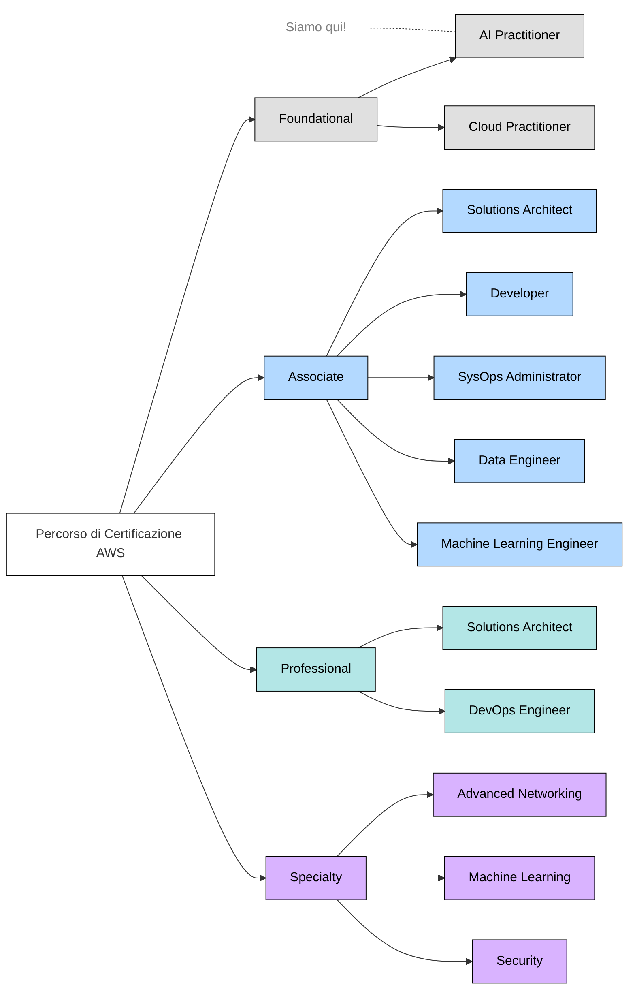
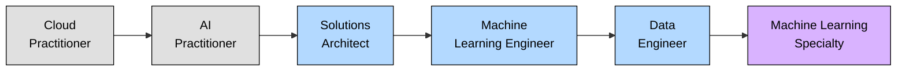
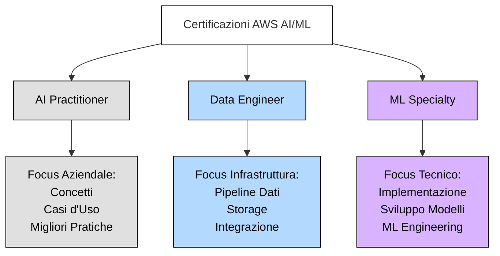
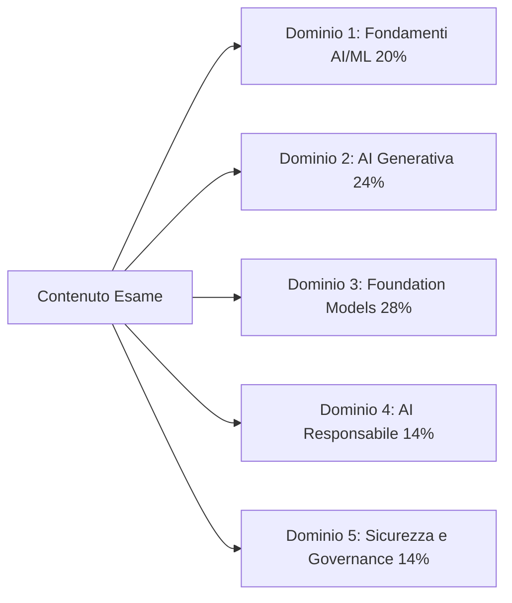
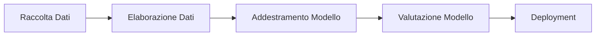

# Certificazioni AWS e l'Esame AI Practitioner

## Introduzione alle Certificazioni AWS

Le certificazioni AWS validano l'expertise nelle tecnologie cloud e AI che alimentano le operazioni aziendali moderne. Queste credenziali riconosciute dal settore servono come benchmark per la competenza tecnica e forniscono percorsi strutturati per i professionisti per sviluppare competenze che sfruttano efficacemente le capacità AWS. Per le organizzazioni che stanno subendo trasformazione digitale, i professionisti certificati portano competenze preziose che guidano innovazione ed efficienza operativa.

Oltre alla validazione, le certificazioni AWS offrono benefici tangibili inclusi riconoscimento professionale, opportunità di avanzamento di carriera e spesso maggiore potenziale di guadagno. Le competenze acquisite attraverso la certificazione si applicano direttamente alle sfide aziendali del mondo reale, consentendo ai professionisti di implementare soluzioni cloud efficaci. Il processo di certificazione promuove anche l'apprendimento continuo, aiutando i professionisti a rimanere aggiornati con le tecnologie cloud in rapida evoluzione.

## Percorso di Certificazione AWS

AWS offre un programma di certificazione completo che copre una gamma di competenze e livelli di expertise. Questo percorso strutturato aiuta i professionisti a costruire basi solide nelle tecnologie cloud e AI, progredendo dalla conoscenza di base alle specializzazioni avanzate attraverso quattro categorie principali: Foundational, Associate, Professional e Specialty.



Questo diagramma illustra la gerarchia di certificazione AWS, con la nuova certificazione **AI Practitioner** che si unisce a Cloud Practitioner al livello foundational. Questa struttura consente ai professionisti di iniziare con conoscenze fondamentali e progredire verso expertise specializzata allineata con i loro obiettivi di carriera.

Per aspiranti specialisti AI/ML su AWS, un percorso di certificazione raccomandato sarebbe:



Questo percorso rappresenta una crescente profondità tecnica nelle tecnologie AI e ML, culminando nella certificazione Machine Learning Specialty, che valida l'expertise completa nella progettazione, implementazione e deployment di soluzioni ML su AWS.

Per mantenere la validità della certificazione, AWS richiede la ricertificazione ogni tre anni, assicurando che gli individui certificati rimangano aggiornati con le ultime tecnologie AWS e le migliori pratiche.

## La Certificazione AWS Certified AI Practitioner

### Panoramica e Posizionamento

La certificazione AWS Certified AI Practitioner affronta la crescente necessità di alfabetizzazione AI attraverso le organizzazioni. Questa certificazione occupa una posizione strategica nell'ecosistema AWS, validando la conoscenza fondamentale dell'intelligenza artificiale, machine learning e tecnologie AI generative con enfasi sulle applicazioni aziendali pratiche.

Questa certificazione valida la conoscenza fondamentale delle tecnologie AI/ML e AI generativa su AWS. Progettata per analisti aziendali, product manager e professionisti non tecnici che lavorano con soluzioni AI, colma il divario tra implementazione tecnica e obiettivi aziendali. Validando la tua capacità di valutare soluzioni AI e comunicare con team tecnici, consente alle organizzazioni di sfruttare efficacemente le capacità AI e guidare l'innovazione.

### Come Differisce da Altre Certificazioni ML

Le certificazioni AWS Certified AI Practitioner, Data Engineer - Associate e Machine Learning - Specialty mirano a diverse audience e livelli di competenza, anche se tutte si riferiscono all'intelligenza artificiale e machine learning su AWS.



La certificazione **Machine Learning - Specialty** valida l'expertise tecnica approfondita nell'implementazione di soluzioni ML. Richiede esperienza di sviluppo pratico e mira a data scientist, ingegneri ML e sviluppatori che costruiscono e deployano modelli ML su AWS.

La certificazione **Data Engineer - Associate** si concentra sull'infrastruttura dati e lo sviluppo di pipeline che supportano le iniziative ML/AI. Mira ai professionisti che progettano e mantengono pipeline dati, implementano soluzioni di storage dati e assicurano qualità e accessibilità dei dati.

Al contrario, la certificazione **AI Practitioner** si concentra sulla conoscenza fondamentale e le applicazioni aziendali. È progettata per professionisti che lavorano con soluzioni AI/ML ma non le costruiscono necessariamente, inclusi analisti aziendali, product manager e professionisti del supporto IT.

Questa differenziazione riflette la crescente importanza dell'alfabetizzazione AI e dell'infrastruttura attraverso le organizzazioni. Mentre i detentori di ML Specialty costruiscono soluzioni AI e i Data Engineer assicurano basi dati robuste, gli AI Practitioner guidano il loro uso efficace e responsabile nei contesti aziendali.

## Dettagli ed Struttura dell'Esame

### Panoramica dell'Esame

L'esame AWS Certified AI Practitioner (AIF-C01) presenta 65 domande da completare in 90 minuti. Disponibile in inglese, giapponese, coreano, portoghese (Brasile) e cinese semplificato, richiede un punteggio di superamento di 700 su 1000 punti.



Foundation Models e AI Generativa comprendono oltre la metà del contenuto dell'esame, riflettendo la loro crescente importanza nell'adozione AI enterprise. L'esame valuta la tua capacità di:
- Dimostrare comprensione completa dei concetti AI/ML e servizi AWS
- Valutare casi d'uso appropriati per diverse tecnologie AI
- Prendere decisioni informate sull'implementazione di soluzioni AI
- Applicare pratiche di AI responsabile e principi di governance

### Audience Target

Il candidato ideale ha circa 6 mesi di esposizione alle tecnologie AI/ML su AWS. Mentre dovresti avere esperienza nell'uso di soluzioni AI/ML, non ci si aspetta che tu le costruisca da solo. Una base solida nei **servizi AWS core** è essenziale, inclusi Amazon EC2, Amazon S3, AWS Lambda e Amazon SageMaker.

I candidati dovrebbero comprendere il **modello di responsabilità condivisa AWS**, i principi di AWS Identity and Access Management (IAM), l'infrastruttura globale AWS e i modelli di pricing dei servizi AWS.

Diversi professionisti possono beneficiare di questa certificazione in modi unici:

Tabella 2. Ruoli che Beneficiano da AWS Certified AI Practitioner

| Categoria Ruolo | Personale Chiave | Benefici Primari | Attività Chiave |
|--------------|---------------|------------------|----------------|
| Decision Maker Aziendali | Project Manager, Analisti Aziendali, Dirigenti | Capacità di pianificazione strategica e valutazione | Valutare iniziative AI, valutare fattibilità, sviluppare roadmap di adozione |
| Professionisti Tecnologici | Staff IT, Cloud Architect, Consulenti Tecnici | Conoscenza di integrazione tecnica e supporto | Supportare sistemi AI, progettare soluzioni integrate, valutazione piattaforme |
| Specialisti di Dominio | Esperti del Settore, Professionisti della Ricerca, Specialisti QA | Intuizioni applicazioni AI specifiche del dominio | Guidare implementazioni, assicurare qualità, esplorare applicazioni |
| Supporto e Operazioni | Team Operazioni, Customer Success Manager, Technical Writer | Eccellenza operativa e capacità di supporto | Gestire servizi AI, documentare sistemi, sviluppare programmi di formazione |

Questa certificazione non si aspetta che tu sviluppi modelli AI/ML, implementi tecniche di data engineering, esegua hyperparameter tuning, costruisca pipeline AI/ML, conduca analisi matematiche di modelli, o sviluppi framework di governance per soluzioni AI/ML.

### Struttura ed Punteggio dell'Esame

L'esame contiene 50 domande valutate più 15 domande non valutate che AWS usa per valutare potenziali contenuti futuri. Le domande non valutate sono distribuite attraverso l'esame e non sono identificate. Non c'è penalità per indovinare, e le domande senza risposta sono marcate come sbagliate.

L'esame impiega un modello di punteggio sofisticato che:
- Usa una scala di 100-1.000 punti
- Richiede un punteggio minimo di superamento di 700
- Implementa **punteggio compensatorio**, significando che non devi superare ogni sezione individualmente
- Usa punteggio scalato per assicurare equità attraverso diverse versioni dell'esame

Il tuo report del punteggio include:
- Stato generale superato/non superato
- Punteggio scalato
- Feedback sulle prestazioni per sezione dell'esame
- Informazioni generali su punti di forza e debolezza

La durata standard dell'esame è 90 minuti. I non madrelingua inglesi possono richiedere un'estensione di 30 minuti ("ESL +30" accommodation) quando sostengono l'esame in inglese, fornendo 120 minuti totali di tempo per l'esame.

## Tipi di Domande dell'Esame

L'esame AWS Certified AI Practitioner include diversi formati di domande per valutare completamente la tua conoscenza. Comprendere questi formati ti aiuta a prepararti più efficacemente e ad affrontare l'esame con fiducia.

### Domande a Scelta Multipla

Le domande a scelta multipla presentano uno scenario o concetto con quattro possibili risposte - una risposta corretta e tre opzioni sbagliate (distrattori). I distrattori testano concezioni errate comuni e validano la tua profondità di comprensione.

Per esempio:

```
Quale servizio AWS fornisce un ambiente completamente gestito per costruire, addestrare e deployare modelli di machine learning su scala?

A) Amazon EC2 - Fornisce server virtuali ma richiede setup ML manuale
B) Amazon S3 - Offre storage ma non capacità ML  
C) Amazon SageMaker - Servizio gestito appositamente costruito per workflow ML
D) Amazon Redshift - Servizio data warehouse senza funzionalità ML native

Risposta Corretta: C
```

Le opzioni sbagliate rappresentano servizi correlati che potrebbero supportare workflow ML ma non forniscono capacità ML complete.

### Domande a Risposta Multipla 

Le domande a risposta multipla richiedono di selezionare due o più risposte corrette da cinque o più opzioni. Devi identificare TUTTE le risposte corrette per ricevere credito - il credito parziale non viene assegnato.

```
Quali DUE capacità fornisce Amazon SageMaker Studio? (Seleziona DUE)

A) Ambiente di sviluppo integrato (IDE) per ML
B) Deployment automatico e monitoraggio del modello
C) Capacità computazionale grezza per addestramento
D) Object storage per dataset
E) Gestione database relazionale

Risposte Corrette: A, B
```

Quando affronti domande a risposta multipla:
1. Leggi attentamente la domanda per identificare esattamente quante risposte sono richieste
2. Valuta ogni opzione indipendentemente
3. Ricontrolla che hai selezionato il numero esatto di risposte specificate
4. Verifica che TUTTE le tue selezioni siano corrette, poiché il credito parziale non viene dato

### Domande di Ordinamento

Le domande di ordinamento testano la tua comprensione di processi sequenziali nelle implementazioni AWS AI e ML. Queste domande presentano 3-5 elementi che devono essere organizzati nell'ordine corretto per completare un'attività o processo specifico.



Ogni passo si basa sui precedenti in una sequenza logica che riflette i workflow AI/ML del mondo reale. Quando rispondi alle domande di ordinamento, considera:
- Dipendenze tra i passi
- Requisiti e prerequisiti dei servizi AWS  
- Workflow standard del settore
- Migliori pratiche AWS

### Domande di Associazione

Le domande di associazione valutano la tua capacità di associare correttamente concetti, servizi o componenti correlati all'interno dell'ecosistema AWS AI/ML. Queste domande presentano due liste di elementi che devono essere abbinati basandosi sulle loro relazioni.

Una domanda di associazione tipicamente contiene:
- Una lista di 3-7 prompt (solitamente servizi AWS, funzionalità o concetti)
- Una lista corrispondente di descrizioni o caratteristiche 
- Istruzioni per abbinare ogni prompt con il suo elemento corrispondente corretto

Esempio di domanda di associazione:

```
Abbina il servizio AWS AI/ML con la sua capacità primaria:

Prompt:
1. Amazon Bedrock
2. Amazon SageMaker Canvas
3. Amazon Comprehend
4. Amazon Rekognition

Descrizioni:
A. Costruzione e inferenza di modelli ML senza codice
B. Elaborazione del linguaggio naturale e analisi del testo
C. Accesso e deployment di foundation model
D. Computer vision e analisi di immagini/video

Abbinamenti corretti: 1-C, 2-A, 3-B, 4-D
```

Quando affronti domande di associazione:
1. Leggi attentamente tutti gli elementi in entrambe le liste prima di fare qualsiasi abbinamento
2. Cerca abbinamenti ovvi prima per restringere le opzioni rimanenti
3. Usa il processo di eliminazione per coppie difficili
4. Verifica che ogni abbinamento si allinei con la tua conoscenza AWS

### Domande Caso di Studio

Le domande caso di studio valutano la tua capacità di analizzare scenari del mondo reale e applicare conoscenze AWS AI/ML per risolvere problemi aziendali. Ogni caso di studio presenta uno scenario seguito da multiple domande correlate che sono valutate indipendentemente.

Le domande caso di studio testano la tua capacità di:
- Analizzare requisiti e vincoli aziendali
- Selezionare servizi e funzionalità AWS AI appropriati
- Applicare migliori pratiche AI/ML e pattern architetturali
- Considerare fattori come costo, prestazioni, sicurezza e conformità

Esempio di formato caso di studio:

```
Scenario: 
Un'azienda di vendita al dettaglio globale vuole migliorare la loro esperienza cliente implementando 
raccomandazioni prodotto alimentate dall'AI attraverso la loro app mobile e sito web. Hanno:
- 50 milioni di clienti attivi
- Catalogo prodotti di 1 milione di articoli
- Storico acquisti clienti degli ultimi 3 anni
- Dati clickstream in tempo reale
- Requisito di aggiornare raccomandazioni ogni ora

Domanda 1: 
Quale combinazione di servizi AWS raccomanderesti per costruire questo sistema di raccomandazioni?

Domanda 2:
Quali considerazioni tecniche sono più importanti per il successo di questa implementazione?
```

Quando affronti casi di studio:
1. Leggi attentamente e analizza lo scenario completo
2. Nota requisiti e vincoli chiave
3. Considera servizi e funzionalità AWS rilevanti
4. Valuta compromessi tra diversi approcci
5. Seleziona soluzioni che meglio soddisfano le esigenze dichiarate

## Consigli per la Preparazione all'Esame

### Gestione del Tempo

Una gestione efficace del tempo è cruciale per il successo dell'esame:

1. Rivedi il numero di domande e tempo consentito
2. Alloca tempo proporzionalmente ai tipi di domande
3. Non spendere troppo tempo su una singola domanda
4. Contrassegna domande difficili per rivedere se il tempo lo permette
5. Lascia tempo per rivedere domande contrassegnate

### Aree di Focus

L'esame enfatizza l'applicazione pratica oltre la memorizzazione. Aree chiave includono:

- Comprendere concetti e terminologia AI/ML core
- Identificare casi d'uso appropriati per diverse tecnologie AI
- Conoscere capacità e limitazioni dei servizi AI AWS
- Comprendere **principi di AI responsabile**
- Riconoscere requisiti di sicurezza e conformità

Ricorda che le domande testano la tua capacità di applicare conoscenze in scenari realistici piuttosto che semplicemente ricordare fatti.

### Risorse di Preparazione

AWS offre risorse complete attraverso AWS Skill Builder, un portale di apprendimento dedicato che fornisce opzioni di formazione sia gratuite che basate su abbonamento per aiutare i professionisti a prepararsi per le loro certificazioni.

Tabella 1. Risorse Chiave di Preparazione per Certificazioni AWS

| Tipo Risorsa | Descrizione | Migliore Per |
|--------------|-------------|-----------|
| Formazione Digitale | Corsi online autodidattici | Comprendere concetti core |
| Formazione in Aula | Sessioni guidate da istruttore | Apprendimento interattivo e guida diretta |
| Esami di Pratica | Domande e scenari di esempio | Preparazione esame e analisi lacune |
| Documentazione | Guide tecniche e whitepaper | Costruzione conoscenza tecnica approfondita |
| Lab Pratici | Esercizi pratici console AWS | Esperienza mondo reale e validazione competenze |

Per la certificazione AWS Certified AI Practitioner specificamente, la preparazione dovrebbe concentrarsi su aree di conoscenza core come concetti fondamentali AI/ML, terminologia chiave e framework, e migliori pratiche del settore. Inoltre, i candidati dovrebbero familiarizzare con i servizi AI AWS, inclusi Amazon SageMaker e Amazon Bedrock, così come governance e migliori pratiche relative ad AI responsabile, requisiti di sicurezza e standard di conformità.

## Conclusione

La certificazione AWS Certified AI Practitioner valida conoscenze essenziali delle moderne tecnologie AI, capacità AI generative e pratiche AI responsabili su AWS. Progettata per analisti aziendali, product manager e professionisti che lavorano con soluzioni AI ma non le costruiscono, questa certificazione dimostra la tua capacità di:

- Prendere decisioni informate sull'adozione della tecnologia AI
- Comunicare efficacemente con team tecnici su iniziative AI
- Identificare casi d'uso appropriati per diverse soluzioni AI
- Applicare pratiche AI responsabili nella tua organizzazione
- Navigare il panorama AI in rapida evoluzione su AWS

Guadagnando questa certificazione, stabilisci una base per comprendere l'AI focalizzandoti sul valore aziendale piuttosto che sull'implementazione tecnica. Questo la rende particolarmente preziosa mentre le organizzazioni sfruttano sempre più le capacità AI attraverso servizi come Amazon Bedrock, Amazon SageMaker e altri strumenti AI AWS.

Le certificazioni AWS servono come percorso vitale per validare l'expertise cloud e accelerare la crescita di carriera in un panorama tecnologico guidato dall'AI. La certificazione AWS Certified AI Practitioner collega domini tecnici e aziendali durante questo periodo trasformativo di adozione AI.

Mentre lavori attraverso questa guida di studio, ricorda che la conoscenza acquisita si estende oltre la preparazione all'esame. Questi concetti forniscono contesto essenziale per valutare soluzioni AI/ML, avere discussioni informate su capacità e limitazioni AI, prendere decisioni responsabili sull'implementazione AI, e sfruttare efficacemente il crescente portfolio di servizi AI di AWS.