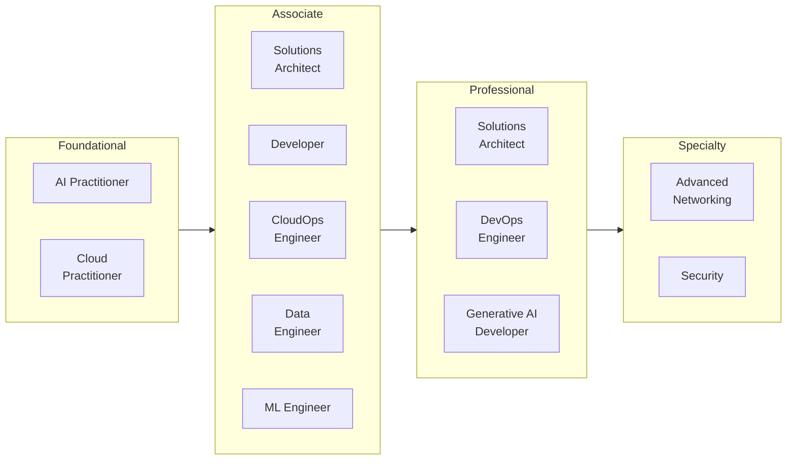
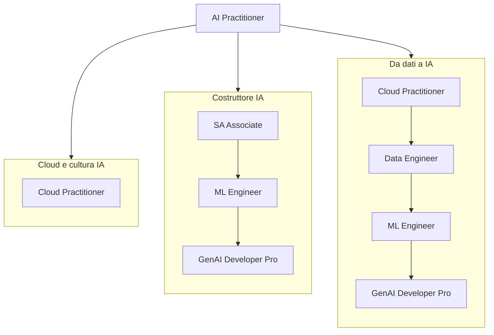
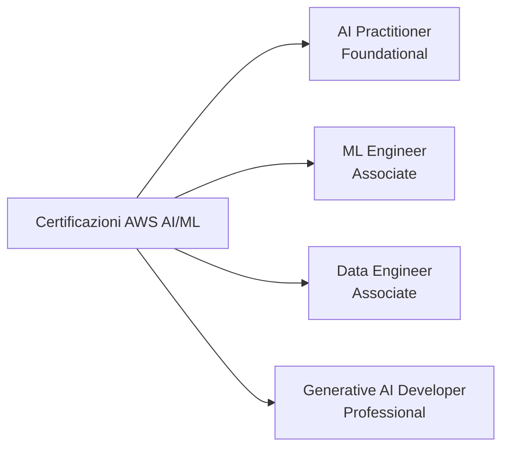
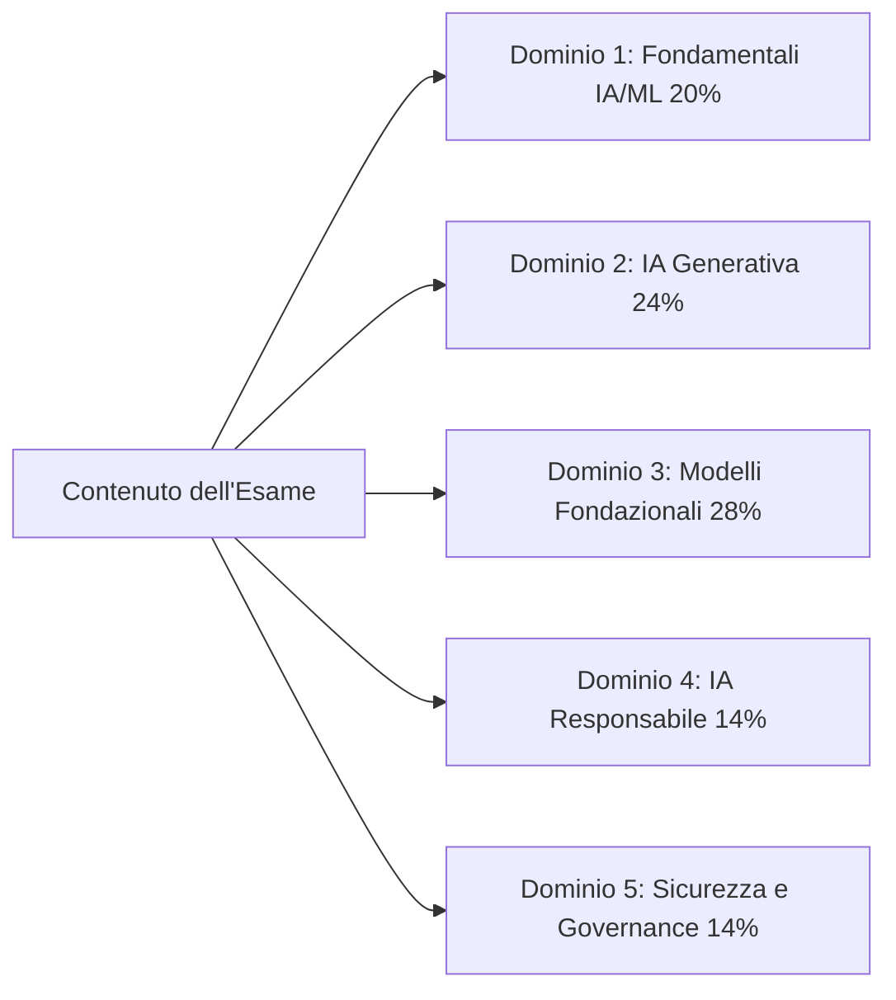
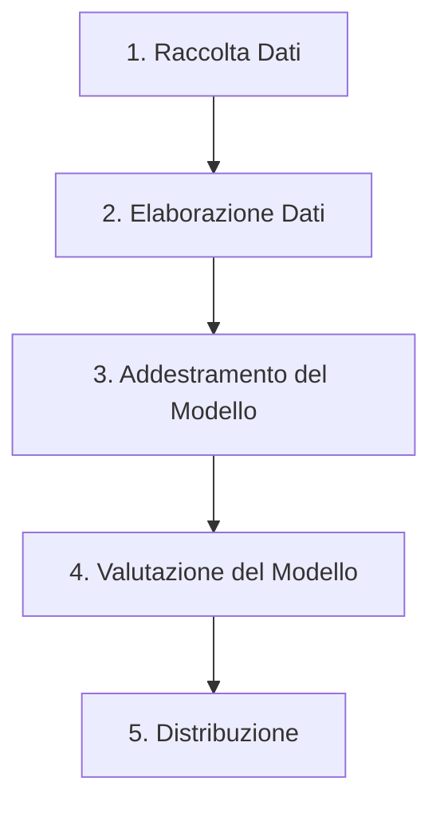

# Certificazioni AWS e l'Esame AI Practitioner

## Introduzione alle Certificazioni AWS

Le certificazioni AWS convalidano la competenza nelle tecnologie cloud e di IA che sono alla base della maggior parte dell'informatica aziendale di oggi. Sono riconosciute a livello di settore come proxy di competenza tecnica e come percorso strutturato per i professionisti che desiderano sviluppare le competenze necessarie per utilizzare AWS in modo efficace. Per le organizzazioni che affrontano la trasformazione digitale, i professionisti certificati portano un'esperienza che si traduce direttamente in una consegna più rapida dei progetti e in meno costosi errori.

I vantaggi vanno oltre la credenziale stessa. I professionisti certificati riportano stipendi più alti, più opportunità di colloquio e un migliore posizionamento per promozioni e incarichi di prestigio.[^006001] Le competenze alla base della certificazione si mappano a sfide del mondo reale, e il ciclo di ricertificazione mantiene i titolari aggiornati man mano che il portfolio AWS si evolve.

## Percorso di Certificazione AWS

AWS organizza il suo programma di certificazione in quattro livelli: Foundational, Associate, Professional e Specialty. La struttura consente ai professionisti di iniziare con conoscenze ampie e progredire verso competenze specializzate che si allineano con i loro obiettivi di carriera.


```mermaid
flowchart LR    
    subgraph F["Foundational"]
        direction LR
        F1[AI Practitioner]
        F2[Cloud<br>Practitioner]
    end
    subgraph A["Associate"]
        direction LR
        A1[Solutions<br>Architect]
        A2[Developer]
        A3[CloudOps<br>Engineer]
        A4[Data<br>Engineer]
        A5[ML Engineer]
    end
    subgraph P["Professional"]
        direction LR
        P1[Solutions<br>Architect]
        P2[DevOps<br>Engineer]
        P3[Generative AI<br>Developer]
    end
    subgraph S["Specialty"]
        direction LR
        S1[Advanced<br>Networking]
        S2[Security]
    end
    F --> A
    A --> P
    P --> S
```

*Figura 0.6.1: Il portfolio completo di certificazioni AWS a maggio 2026, raggruppate per livello. Dodici certificazioni attive coprono ruoli dalla cultura cloud all'ingegneria IA avanzata. AI Practitioner è una delle due certificazioni foundational; Generative AI Developer al livello Professional estende il percorso IA/ML per un pubblico con competenze più approfondite.*

Il diagramma mostra come la certificazione **AI Practitioner** si posizioni accanto a **Cloud Practitioner** al livello foundational.[^006002] La certificazione Machine Learning Specialty, che in passato costituiva il punto di riferimento del percorso tecnico IA/ML approfondito, è stata ritirata il 31 marzo 2026 ed è stata sostituita da **Machine Learning Engineer - Associate** e da **Generative AI Developer - Professional**.[^006003] AWS ha inoltre rinominato SysOps Administrator - Associate in **CloudOps Engineer - Associate** nel 2025.

La scala di certificazione AWS non è una singola linea retta. Ruoli diversi percorrono strade diverse verso le stesse credenziali avanzate. La mappa seguente delinea tre comuni percorsi multi-tappe:


```mermaid
flowchart TB
    
    P[AI Practitioner]

    subgraph B[Cloud e cultura IA]
        direction TB
        B1[Cloud Practitioner]
    end

    subgraph A[Costruttore IA]
        direction TB
        A2[SA Associate]
        A3[ML Engineer]
        A4[GenAI Developer Pro]
    end

    subgraph D[Da dati a IA]
        direction TB
        D1[Cloud Practitioner]
        D2[Data Engineer]
        D3[ML Engineer]
        D4[GenAI Developer Pro]
    end
    
    P --> B
    P --> A
    P --> D
    D1 --> D2 --> D3 --> D4
    A2 --> A3 --> A4
```

*Figura 0.6.2: Tre percorsi rappresentativi attraverso il portfolio di certificazioni AWS. Il percorso business-e-cultura-IA si ferma ad AI Practitioner. I percorsi costruttore-IA e da-dati-a-IA convergono entrambi su Generative AI Developer - Professional ma entrano attraverso credenziali associate diverse.*

Un professionista può fermarsi dopo AI Practitioner se l'obiettivo è il processo decisionale informato piuttosto che l'ingegneria pratica. Un professionista che intende costruire agenti di IA in produzione in genere beneficia almeno di Solutions Architect - Associate e Machine Learning Engineer - Associate prima di passare a Generative AI Developer - Professional.

Per mantenere la validità della certificazione, AWS richiede la ricertificazione ogni tre anni. Questo mantiene i titolari aggiornati con i servizi e le best practice più recenti.

## La Certificazione AWS Certified AI Practitioner

### Panoramica e Posizionamento

La certificazione AWS Certified AI Practitioner risponde alla crescente esigenza di cultura dell'IA nelle organizzazioni. Convalida le conoscenze fondamentali di intelligenza artificiale, machine learning e IA generativa su AWS, con un'enfasi sull'applicazione pratica nel business piuttosto che sui dettagli di implementazione.

La certificazione è rivolta ad analisti del business, product manager, personale del supporto IT e altri professionisti che lavorano a fianco dell'IA ma non la costruiscono necessariamente. Convalidando la tua capacità di valutare le opzioni di IA e di comunicare con i team tecnici, aiuta le organizzazioni ad adottare le capacità di IA in modo più informato ed evitare costosi errori.

### Come Si Differenzia dalle Altre Certificazioni IA/ML

Le certificazioni AWS AI/ML formano ora un insieme chiaramente strutturato per livelli. Si rivolgono a pubblici diversi e a livelli di competenza diversi.


```mermaid
flowchart LR
    A[Certificazioni AWS AI/ML] --> B[AI Practitioner<br/>Foundational]
    A --> C[ML Engineer<br/>Associate]
    A --> D[Data Engineer<br/>Associate]
    A --> E[Generative AI Developer<br/>Professional]
```

*Figura 0.6.3: La mappa delle certificazioni AWS AI/ML. Ogni certificazione si rivolge a un pubblico specifico e a un livello di competenza, dalla cultura del business al livello foundational fino all'architettura in produzione al livello Professional.*

La certificazione **Generative AI Developer - Professional** (AIP-C01) convalida la competenza nella progettazione, costruzione e operatività di soluzioni di IA generativa su AWS su larga scala. Si rivolge ad architetti e ingegneri senior che gestiscono i sistemi di IA dall'inizio alla fine.

La certificazione **Machine Learning Engineer - Associate** (MLA-C01) convalida le competenze necessarie per costruire, distribuire e monitorare modelli ML in produzione. Si rivolge agli ingegneri ML e agli sviluppatori che gestiscono il lato ML di un'applicazione.

La certificazione **Data Engineer - Associate** (DEA-C01) si concentra sull'infrastruttura dei dati da cui dipendono i progetti AI/ML. Si rivolge agli ingegneri che costruiscono e mantengono le pipeline e i layer di archiviazione che alimentano i carichi di lavoro di IA.

Al contrario, la certificazione **AI Practitioner** si concentra sui fondamentali e sull'applicazione nel business. È progettata per i professionisti che utilizzano le soluzioni AI/ML, non per le persone che le costruiscono. Analisti del business, product manager e personale IT tecnicamente preparato sono il pubblico primario.

Questa struttura a quattro livelli riflette la maturazione del mercato AI/ML. La costruzione, la distribuzione e la governance dell'IA richiedono ora competenze specializzate sufficienti che AWS offre una certificazione separata per ogni livello.

## Dettagli e Struttura dell'Esame

### Panoramica dell'Esame

L'esame AWS Certified AI Practitioner (AIF-C01) contiene 65 domande da completare in 90 minuti. È disponibile in inglese, giapponese, coreano, portoghese (Brasile) e cinese semplificato. Il punteggio minimo di superamento è 700 su una scala da 100 a 1.000.

La versione corrente dell'esame è **V1.1**, pubblicata il 30 aprile 2026 ed entrata in vigore nell'esame circa un mese dopo.[^006004] La V1.1 ha aggiunto l'IA agentiva, Amazon Bedrock AgentCore, Strands Agents, Kiro e Amazon Quick al materiale in ambito. Ha anche rimosso Amazon MemoryDB. I cambiamenti degli obiettivi sono abbastanza significativi che qualsiasi materiale di preparazione precedente alla metà del 2026 dovrebbe essere incrociato con la guida all'esame corrente.


```mermaid
flowchart LR
    A[Contenuto dell'Esame] --> B[Dominio 1: Fondamentali IA/ML 20%]
    A --> C[Dominio 2: IA Generativa 24%]
    A --> D[Dominio 3: Modelli Fondazionali 28%]
    A --> E[Dominio 4: IA Responsabile 14%]
    A --> F[Dominio 5: Sicurezza e Governance 14%]
```

*Figura 0.6.4: Pesi dei domini AIF-C01 V1.1. I Domini 2 e 3 coprono insieme le applicazioni di IA generativa e modelli fondazionali e rappresentano oltre la metà del contenuto valutato.*

I modelli fondazionali e l'IA generativa insieme coprono più della metà dell'esame, il che è coerente con la rapidità con cui queste tematiche si sono spostate al centro del lavoro di IA aziendale. L'esame valuta la tua capacità di:

- Dimostrare la comprensione dei concetti AI/ML e di IA generativa e dei servizi AWS
- Valutare i casi d'uso appropriati per le diverse tecnologie di IA
- Prendere decisioni informate sull'implementazione di soluzioni di IA
- Applicare pratiche di IA responsabile e principi di governance

### Pubblico Target

Il candidato ideale ha circa sei mesi di esposizione alle tecnologie AI/ML su AWS. Dovresti essere a tuo agio nell'utilizzare le soluzioni AI/ML, ma non ci si aspetta che le costruisca tu stesso. Una familiarità operativa con i **servizi AWS di base** è essenziale, tra cui Amazon EC2, Amazon S3, AWS Lambda, Amazon Bedrock e Amazon SageMaker AI.[^006005]

Dovresti anche avere una comprensione operativa del **modello di responsabilità condivisa di AWS**, di AWS Identity and Access Management (IAM) e dei modelli di prezzo dei servizi AWS.

Professionisti diversi possono trarre vantaggio da questa certificazione in modi diversi:

*Tabella 0.6.1: Ruoli che beneficiano di AWS Certified AI Practitioner.*

| Categoria di ruolo | Personale chiave | Benefici principali | Attività chiave |
| --- | --- | --- | --- |
| Decisori del business | Project manager, analisti del business, dirigenti | Capacità di pianificazione strategica e valutazione | Valutare le iniziative di IA, valutare la fattibilità, sviluppare roadmap di adozione |
| Professionisti della tecnologia | Personale IT, cloud architect, consulenti tecnici | Conoscenza tecnica di integrazione e supporto | Supportare i sistemi di IA, progettare soluzioni integrate, valutazione delle piattaforme |
| Specialisti di dominio | Esperti di settore, professionisti della ricerca, specialisti QA | Intuizioni sull'applicazione dell'IA specifica per il dominio | Guidare le implementazioni, garantire la qualità, esplorare le applicazioni |
| Supporto e operazioni | Team operativi, customer success manager, scrittori tecnici | Eccellenza operativa e capacità di supporto | Gestire i servizi di IA, documentare i sistemi, sviluppare programmi di formazione |

La certificazione non richiede di sviluppare modelli AI/ML, implementare data engineering, eseguire il tuning degli iperparametri, costruire pipeline AI/ML, condurre analisi matematiche dei modelli o sviluppare framework di governance completi. Queste sono le responsabilità delle certificazioni di livello superiore.

### Struttura e Punteggio dell'Esame

L'esame contiene 50 domande valutate più 15 domande non valutate che AWS utilizza per valutare i potenziali contenuti futuri. Le domande non valutate sono distribuite in tutto l'esame e non sono identificate. Non c'è penalità per indovinare, e le domande senza risposta vengono valutate come errate.

Il modello di punteggio ha quattro caratteristiche degne di nota:

- Punteggio scalato su un intervallo da 100 a 1.000
- Punteggio minimo di superamento di 700
- Punteggio compensativo, il che significa che non è necessario superare ogni sezione individualmente, ma solo l'esame nel complesso
- Punteggio scalato su più moduli d'esame per mantenere la difficoltà equa tra le versioni

Il tuo rapporto di punteggio include lo stato complessivo di superamento o mancato superamento, il punteggio scalato e un feedback sulle prestazioni a livello di sezione che evidenzia punti di forza e debolezze. Il feedback a livello di sezione è un'indicazione generale, non un voto preciso per sezione.

La durata standard dell'esame è di 90 minuti. I parlanti non madrelingua inglese possono richiedere un'estensione di 30 minuti, chiamata "ESL +30", quando sostengono l'esame in inglese, per un totale di 120 minuti.

## Tipi di Domande dell'Esame

L'esame utilizza quattro formati di domanda. Conoscere i formati in anticipo aiuta ad allocare il tempo ed evitare sorprese.

### Domande a Scelta Multipla

Le domande a scelta multipla presentano uno scenario o un concetto con quattro possibili risposte, una corretta e tre distrattori. I distrattori sono progettati per testare le concezioni errate comuni e per convalidare che tu comprenda la profondità dell'argomento, non solo la superficie.

Esempio:

```
Quale servizio AWS fornisce un ambiente completamente gestito per la costruzione,
l'addestramento e la distribuzione di modelli di machine learning su scala?

A) Amazon EC2     - Fornisce server virtuali ma richiede configurazione ML manuale
B) Amazon S3      - Offre archiviazione ma non capacità ML
C) Amazon SageMaker AI - Servizio gestito appositamente per i flussi di lavoro ML
D) Amazon Redshift - Servizio di data warehouse senza funzionalità ML native

Risposta Corretta: C
```

Le opzioni errate sono servizi che toccano i flussi di lavoro ML in qualche modo ma non forniscono l'esperienza ML completamente gestita.

### Domande a Risposta Multipla

Le domande a risposta multipla richiedono di selezionare due o più risposte corrette da cinque o più opzioni. Devi identificare tutte le risposte corrette per ricevere credito. Il credito parziale non è assegnato.

```
Quali DUE capacità fornisce Amazon SageMaker Studio? (Seleziona DUE)

A) Ambiente di sviluppo integrato (IDE) per ML
B) Distribuzione e monitoraggio automatizzato dei modelli
C) Capacità di calcolo raw per l'addestramento
D) Archiviazione di oggetti per i dataset
E) Gestione di database relazionali

Risposte Corrette: A, B
```

Quando vedi una domanda a risposta multipla:

1. Leggi attentamente la domanda e nota esattamente quante risposte sono richieste.
2. Valuta ogni opzione indipendentemente prima di confrontarle.
3. Verifica di aver selezionato il numero esatto di risposte specificato.
4. Conferma che tutte le tue selezioni siano corrette, poiché il credito parziale non viene assegnato.

### Domande di Ordinamento

Le domande di ordinamento testano la tua comprensione dei processi sequenziali. Presentano tre o cinque elementi che devono essere disposti nell'ordine corretto per completare un'attività.


```mermaid
flowchart TD
    A[1. Raccolta Dati] --> B[2. Elaborazione Dati]
    B --> C[3. Addestramento del Modello]
    C --> D[4. Valutazione del Modello]
    D --> E[5. Distribuzione]
```

*Figura 0.6.5: Un flusso di lavoro ML canonico utilizzato come esempio di domanda di ordinamento. Ogni fase dipende dalla precedente e l'ordine riflette la pratica standard.*

Quando vedi una domanda di ordinamento, cerca:

- Dipendenze tra le fasi
- Requisiti e prerequisiti dei servizi AWS
- Flussi di lavoro standard del settore
- Best practice AWS

### Domande di Abbinamento

Le domande di abbinamento chiedono di associare elementi in due elenchi. In genere presentano da tre a sette prompt e un corrispondente elenco di descrizioni, e richiedono di abbinare ogni prompt con la descrizione corretta.

Una tipica domanda di abbinamento:

```
Abbina il servizio AWS AI/ML con la sua capacità principale:

Prompt:
1. Amazon Bedrock
2. Amazon SageMaker Canvas
3. Amazon Comprehend
4. Amazon Rekognition

Descrizioni:
A. Costruzione e inferenza di modelli ML senza codice
B. Elaborazione del linguaggio naturale e analisi del testo
C. Accesso e distribuzione di modelli fondazionali
D. Visione artificiale e analisi di immagini e video

Abbinamenti corretti: 1-C, 2-A, 3-B, 4-D
```

Nell'affrontare le domande di abbinamento:

1. Leggi attentamente tutti gli elementi in entrambi gli elenchi prima di fare qualsiasi abbinamento.
2. Blocca prima gli abbinamenti ovvi, poi restringi gli altri per eliminazione.
3. Utilizza l'eliminazione per le coppie più difficili rimanenti.
4. Verifica ogni abbinamento rispetto alle tue conoscenze AWS.

## Suggerimenti per la Preparazione all'Esame

### Gestione del Tempo

Una gestione efficace del tempo è più importante della semplice conoscenza per molti candidati. Alcune linee guida pratiche:

1. Nota il numero di domande e il tempo disponibile all'inizio.
2. Punta a circa 80 secondi per domanda al primo passaggio.
3. Non dedicare più di due minuti a nessuna singola domanda.
4. Segnala le domande difficili e rivisitale dopo il primo passaggio.
5. Lascia almeno cinque-dieci minuti alla fine per la revisione.

Se l'inglese non è la tua prima lingua, AWS ti consente di richiedere 30 minuti di tempo aggiuntivo per l'esame come misura di accomodamento. La richiesta deve essere presentata tramite il tuo account di certificazione AWS prima di prenotare l'esame, e una volta approvata si applica a ogni esame AWS che pianifichi da quell'account.

### Aree di Interesse

L'esame enfatizza l'applicazione pratica rispetto alla memorizzazione. Aree chiave:

- Concetti e terminologia fondamentali di IA/ML, inclusi IA agentiva, RAG e MCP
- Il servizio di IA giusto per il problema di business giusto
- Capacità e limitazioni dei servizi AWS, in particolare Amazon Bedrock e la famiglia AgentCore
- Principi di IA responsabile inclusi bias, equità, trasparenza e spiegabilità
- Sicurezza, incluse Amazon Bedrock Guardrails e la responsabilità condivisa AWS per l'IA

Le domande testano la tua capacità di applicare le conoscenze in scenari realistici, non la tua capacità di recitare una definizione.

### Risorse per la Preparazione

AWS offre una serie di risorse di preparazione tramite AWS Skill Builder, inclusi contenuti gratuiti e in abbonamento.[^006006]

*Tabella 0.6.2: Risorse chiave per la preparazione alle certificazioni AWS.*

| Tipo di risorsa | Descrizione | Ideale per |
| --- | --- | --- |
| Formazione digitale | Corsi online auto-guidati | Comprensione dei concetti fondamentali |
| Formazione in aula | Sessioni con istruttore | Apprendimento interattivo e orientamento diretto |
| Esami di pratica | Domande ed esempi di scenari | Preparazione all'esame e analisi delle lacune |
| Documentazione | Guide tecniche e whitepaper | Approfondimento delle conoscenze tecniche |
| Laboratori pratici | Esercizi pratici nella console AWS | Esperienza nel mondo reale e validazione delle competenze |

Per AIF-C01 specificamente, concentrati sui fondamentali di IA/ML, sui domini GenAI e FM e sul nuovo materiale sugli agenti agentivi aggiunto nella V1.1. Il tempo pratico con **Amazon Bedrock**, il playground dei modelli e **Amazon Bedrock AgentCore** è il singolo miglior investimento di tempo di studio una volta che i fondamentali sono stati acquisiti.

## Conclusione

La certificazione AWS Certified AI Practitioner convalida le conoscenze essenziali dell'IA moderna su AWS: ML classico, IA generativa, IA agentiva e le pratiche di IA responsabile che sempre più le accompagnano. Progettata per analisti del business, product manager e altri professionisti che utilizzano l'IA piuttosto che costruirla, la certificazione dimostra la tua capacità di:

- Prendere decisioni informate sull'adozione della tecnologia di IA
- Comunicare con i team tecnici sulle iniziative di IA
- Identificare i casi d'uso giusti per i servizi di IA giusti
- Applicare le pratiche di IA responsabile nella tua organizzazione
- Navigare il panorama dell'IA in rapida evoluzione su AWS

Ottenendo questa certificazione stabilisci una base per la comprensione dell'IA, concentrandoti sul valore del business piuttosto che sull'implementazione tecnica. Questo la rende una credenziale utile man mano che più organizzazioni passano dalla sperimentazione dell'IA alla produzione dell'IA attraverso servizi come Amazon Bedrock, Amazon Bedrock AgentCore, Amazon SageMaker AI e Kiro.

Le certificazioni AWS rimangono un percorso per convalidare la competenza cloud e accelerare la crescita della carriera man mano che l'IA si integra nelle operazioni aziendali mainstream. La certificazione AWS Certified AI Practitioner collega i ruoli tecnici e di business durante un periodo di rapida adozione dell'IA, e l'aggiornamento V1.1 porta i contenuti dell'esame in linea con la situazione attuale del mercato nel 2026.

[^006001]: AWS Certifications. URL: <https://aws.amazon.com/certification/>
    
[^006002]: AWS Certified AI Practitioner. URL: <https://aws.amazon.com/certification/certified-ai-practitioner/>
    
[^006003]: AWS Certified Machine Learning Engineer Associate. URL: <https://aws.amazon.com/certification/certified-machine-learning-engineer-associate/>
    
[^006004]: AIF-C01 Exam Guide Revisions. URL: <https://docs.aws.amazon.com/aws-certification/latest/ai-practitioner-01/aif-01-revisions.html>
    
[^006005]: AIF-C01 Target Candidate Description. URL: <https://docs.aws.amazon.com/aws-certification/latest/ai-practitioner-01/ai-practitioner-01.html>
    
[^006006]: AWS Skill Builder. URL: <https://skillbuilder.aws/>
