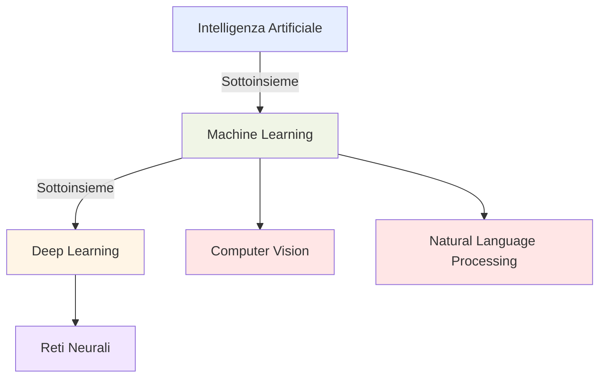
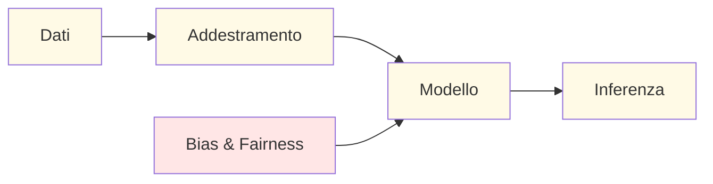

## 1.1 Concetti e Terminologie AI e ML

Comprendere l'intelligenza artificiale (AI) e i suoi concetti correlati è diventato essenziale per i professionisti di tutte le industrie. L'AI trasforma i processi aziendali, il processo decisionale e le esperienze clienti, rendendo vitale afferrare la terminologia fondamentale e i concetti che sostengono questa tecnologia. Questa conoscenza consente comunicazione efficace con team tecnici e dà potere ai leader aziendali di prendere decisioni informate sull'adozione e strategia AI.

L'esame AWS Certified AI Practitioner valuta la tua capacità di spiegare concetti AI di base e le loro applicazioni pratiche in contesti aziendali.[^200] Padroneggiare questi elementi fondamentali ti equipaggerà per identificare opportunità per l'implementazione AI, valutare soluzioni AI e contribuire significativamente a iniziative guidate dall'AI all'interno della tua organizzazione.

### Definire Termini AI di Base

L'Intelligenza Artificiale (AI) comprende un'ampia gamma di tecnologie e approcci progettati per consentire alle macchine di eseguire compiti che tipicamente richiedono intelligenza umana. Per navigare efficacemente nel panorama AI, è cruciale comprendere i seguenti termini chiave:

- **Intelligenza Artificiale (AI)**: Il campo generale di creazione di macchine intelligenti che possono simulare funzioni cognitive simili a quelle umane come apprendimento, risoluzione di problemi e processo decisionale.[^201]

- **Machine Learning (ML)**: Un sottoinsieme dell'AI che si concentra sullo sviluppo di algoritmi e modelli statistici che consentono ai sistemi informatici di migliorare le loro prestazioni su un compito specifico attraverso l'esperienza, senza essere esplicitamente programmati.[^202]

- **Deep Learning**: Un sottoinsieme specializzato del machine learning che usa reti neurali artificiali con multipli strati (reti neurali profonde) per modellare ed elaborare pattern complessi nei dati.[^203]

- **Reti Neurali**: Sistemi computazionali ispirati dalle reti neurali biologiche, costituiti da nodi interconnessi (neuroni) che elaborano e trasmettono informazioni.[^204]

- **Computer Vision**: Un campo dell'AI che consente alle macchine di interpretare e comprendere informazioni visive dal mondo, come immagini e video.[^205]

- **Natural Language Processing (NLP)**: Il ramo dell'AI focalizzato sul consentire alle macchine di comprendere, interpretare e generare il linguaggio umano in modo utile.[^206]

- **Modello**: Una rappresentazione matematica di un processo del mondo reale, addestrato sui dati per fare previsioni o decisioni senza essere esplicitamente programmato per eseguire il compito.[^207]

- **Algoritmo**: Un insieme di regole o istruzioni date a un sistema AI per aiutarlo a imparare dai dati e prendere decisioni.[^208]

- **Addestramento**: Il processo di insegnare a un modello di machine learning a fare previsioni mostrandogli molti esempi di dati di input e i corrispondenti output corretti.[^209]

- **Inferenza**: Il processo di usare un modello addestrato per fare previsioni su dati nuovi, non visti.[^210]

- **Bias**: Errori sistematici nei sistemi AI che possono portare a risultati ingiusti o inaccurati, spesso riflettendo bias umani presenti nei dati di addestramento o nel design dell'algoritmo.[^211]

- **Fairness**: Il principio di assicurare che i sistemi AI non discriminino individui o gruppi basandosi su caratteristiche protette come razza, genere o età.[^212]

- **Fit**: Quanto bene le previsioni di un modello di machine learning corrispondono ai risultati effettivi nei dati di addestramento. Un buon fit significa che il modello cattura accuratamente i pattern sottostanti senza overfitting o underfitting.[^213]

- **AI Generativa**: Una categoria di intelligenza artificiale che può creare nuovo contenuto, inclusi testo, immagini, codice e altro. Questi sistemi imparano pattern dai dati di addestramento e generano output nuovi che riflettono quei pattern. L'AI generativa sta rivoluzionando numerosi campi e applicazioni. Esploreremo questa tecnologia trasformativa in profondità nel prossimo capitolo.

- **Large Language Model (LLM)**: Un tipo di modello AI addestrato su vaste quantità di dati testuali, capace di comprendere e generare testo simile a quello umano attraverso un'ampia gamma di argomenti e compiti.[^214]

Per illustrare le relazioni tra questi concetti, consideriamo un diagramma:

Il diagramma sopra illustra la relazione gerarchica tra concetti chiave nel panorama AI. L'Intelligenza Artificiale rappresenta il dominio più ampio, che comprende tutte le tecnologie che consentono ai computer di imitare l'intelligenza umana. Il Machine Learning è un sottoinsieme dell'AI focalizzato su sistemi che imparano dai dati senza programmazione esplicita. Il Deep Learning restringe ulteriormente il campo come sottoinsieme specializzato del Machine Learning, utilizzando reti neurali complesse e multi-strato. Il diagramma evidenzia anche importanti aree applicative del Machine Learning, incluse Computer Vision e Natural Language Processing. Comprendere questa gerarchia aiuta i professionisti del business a navigare la terminologia AI e concettualizzare come tecnologie specifiche si relazionano a iniziative AI più ampie.

Questo secondo diagramma raffigura il flusso di lavoro essenziale nello sviluppo e deployment di sistemi AI. Il processo inizia con la raccolta e preparazione dei Dati, che alimenta la fase di Addestramento dove gli algoritmi imparano pattern dai dati. Questo risulta in un Modello che incapsula i pattern appresi. Il modello quindi esegue l'Inferenza—applicando ciò che ha imparato a dati nuovi, non visti. Importante, considerazioni di Bias e Fairness devono essere integrate durante lo sviluppo del modello per assicurare sistemi AI etici. I leader aziendali che comprendono questo ciclo di vita possono gestire meglio progetti AI, allocare risorse appropriate a ogni fase e implementare framework di governance appropriati per affrontare preoccupazioni etiche attraverso il processo di sviluppo.

### Similarità e Differenze tra AI, ML e Deep Learning

Mentre AI, ML e deep learning sono strettamente correlati, hanno caratteristiche e applicazioni distinte:

**Intelligenza Artificiale (AI)**:
- Categoria più ampia, che comprende tutti gli sforzi per rendere le macchine intelligenti
- Può includere sistemi basati su regole e AI simbolica, non solo approcci guidati dai dati
- Mira a creare sistemi che possano eseguire compiti che richiedono intelligenza simile a quella umana

**Machine Learning (ML)**:
- Sottoinsieme dell'AI focalizzato su algoritmi che migliorano attraverso l'esperienza
- Si basa su tecniche statistiche per consentire ai computer di "imparare" dai dati
- Include vari approcci come supervised learning, unsupervised learning e reinforcement learning

**Deep Learning**:
- Sottoinsieme specializzato del machine learning
- Usa reti neurali artificiali con multipli strati
- Particolarmente efficace per elaborare dati non strutturati come immagini, audio e testo

Tabella 1.1.1. Confronto di AI, ML e Deep Learning

| Aspetto | Intelligenza Artificiale | Machine Learning | Deep Learning |
|--------|-------------------------|-------------------|----------------|
| Portata | Più ampia | Sottoinsieme dell'AI | Sottoinsieme del ML |
| Approccio | Vario (basato su regole, simbolico, statistico) | Statistico, guidato dai dati | Reti neurali con multipli strati |
| Requisiti Dati | Varia | Dataset grandi | Dataset molto grandi |
| Interpretabilità | Può essere alta (es. sistemi basati su regole) | Da moderata a bassa | Generalmente bassa |
| Applicazioni Tipiche | Sistemi esperti, AI per giochi, robotica | Analisi predittiva, sistemi di raccomandazione | Riconoscimento immagini, elaborazione linguaggio naturale |

In pratica, queste tecnologie spesso lavorano insieme nelle soluzioni AI. Per esempio, un chatbot del servizio clienti potrebbe usare:
- Principi AI per design generale e processo decisionale
- Algoritmi ML per classificazione intenti e riconoscimento entità
- Modelli deep learning (come LLM) per generare risposte simili a quelle umane

Comprendere queste distinzioni aiuta i professionisti del business a scegliere l'approccio giusto per casi d'uso specifici e comunicare più efficacemente con team tecnici.