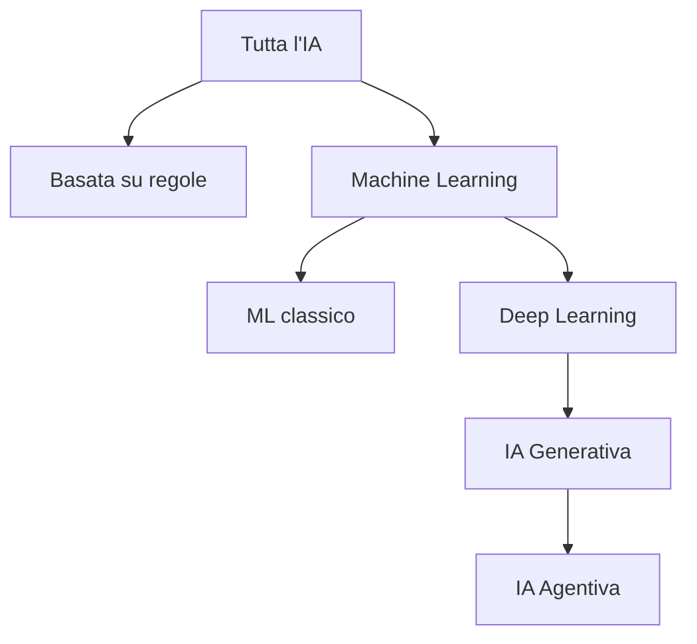
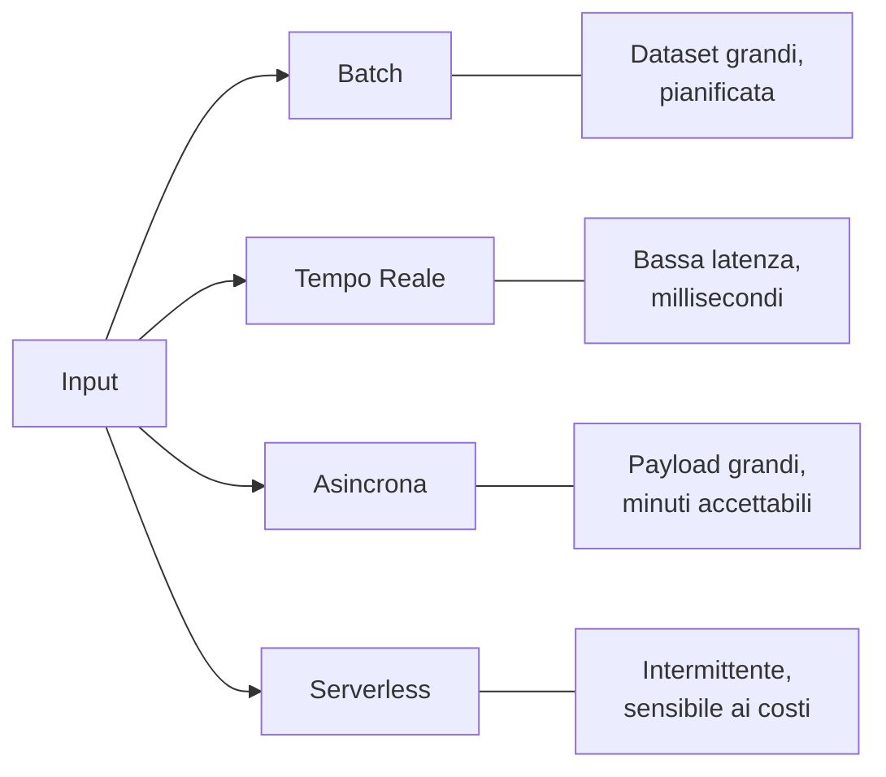
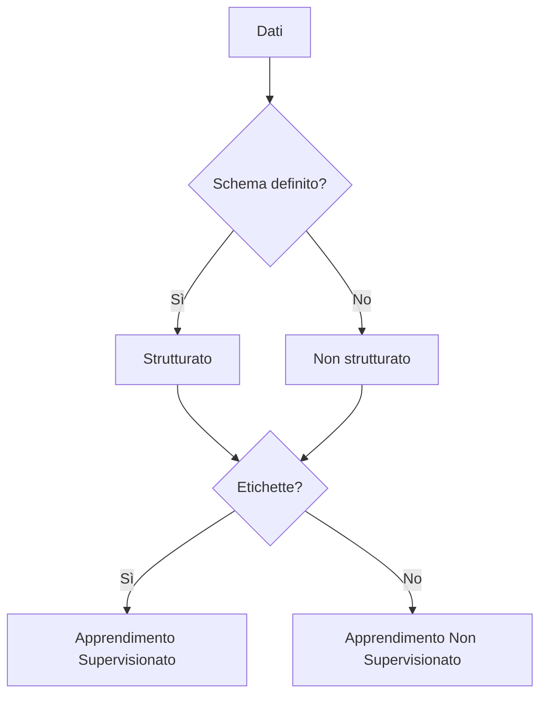
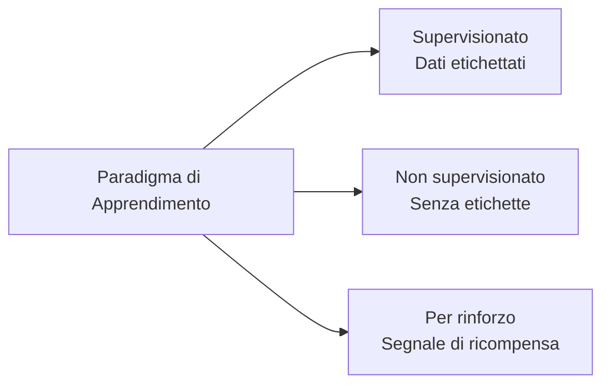

## Dichiarazione di Attività 1.1: Spiegare i concetti e le terminologie di base dell'IA

Il vocabolario dell'IA è il linguaggio condiviso tra i professionisti del business e i team tecnici con cui lavorano. Prima che un product manager possa approvare la distribuzione di un modello o un dirigente possa valutare una proposta di un fornitore di IA, tutti i presenti al tavolo hanno bisogno delle stesse definizioni per termini come addestramento, inferenza, bias ed equità. Questa dichiarazione di attività stabilisce quel vocabolario comune e mappa ogni termine ai servizi AWS e agli obiettivi dell'esame in cui appare.[^101001]

### 1.1.1 Definire i termini di base dell'IA

Comprendere l'IA inizia con definizioni precise. L'esame verifica se sai distinguere i termini adiacenti l'uno dall'altro, e la posta in gioco aziendale è reale perché il linguaggio impreciso porta a aspettative disallineate tra stakeholder tecnici e non tecnici.

**L'intelligenza artificiale (IA)** è il vasto campo dell'informatica che si occupa della costruzione di sistemi in grado di svolgere compiti che normalmente richiederebbero il ragionamento umano, come riconoscere immagini, comprendere il linguaggio o prendere decisioni in condizioni di incertezza.[^101002] L'IA non è una singola tecnologia; è una categoria che include molti approcci, solo alcuni dei quali implicano l'apprendimento dai dati.

**Il machine learning (ML)** è un sottoinsieme dell'IA in cui un sistema apprende schemi dai dati piuttosto che seguire regole scritte esplicitamente da un programmatore.[^101003] Ad esempio, un sistema di rilevamento delle frodi basato su regole tradizionali potrebbe segnalare qualsiasi transazione superiore a una soglia di importo fisso; un sistema basato su ML invece apprende da migliaia di casi storici di frode e generalizza schemi che nessuna regola fissa potrebbe catturare.

**Il deep learning** è un sottoinsieme del ML che utilizza *reti neurali* con molti livelli per rappresentare schemi sempre più astratti.[^101004] Il termine "deep" (profondo) si riferisce alla profondità di questi livelli. Il deep learning alimenta la maggior parte dei moderni sistemi di riconoscimento delle immagini, riconoscimento vocale e comprensione del linguaggio.

Una **rete neurale** è un modello computazionale liberamente ispirato alla struttura dei neuroni biologici. I dati passano attraverso strati di nodi interconnessi, ognuno dei quali applica una trasformazione matematica. La rete impara quali trasformazioni producono output accurati regolando i suoi parametri interni durante l'addestramento. Le reti superficiali hanno due o tre livelli; le reti profonde possono averne centinaia.

La **visione artificiale (VA)** è il ramo dell'IA che consente alle macchine di interpretare immagini e video.[^101006] I sistemi di visione artificiale possono classificare oggetti in una foto, rilevare difetti su una linea di produzione o contare veicoli in un parcheggio. Su AWS, le capacità di visione artificiale sono disponibili tramite **Amazon Rekognition** per l'analisi di immagini e video.[^101007]

**L'elaborazione del linguaggio naturale (NLP)** è il ramo dell'IA che consente alle macchine di leggere, comprendere e generare il linguaggio umano.[^101008] I compiti NLP includono l'analisi del sentiment, il riconoscimento di entità nominate, la traduzione e la sintesi di documenti. AWS mette a disposizione le capacità NLP attraverso servizi come **Amazon Comprehend** per l'analisi del testo, **Amazon Translate** per la traduzione linguistica e **Amazon Transcribe** per la conversione da parlato a testo.[^101009] Questi servizi dedicati sono la scelta giusta per compiti ad alto volume e ben definiti dove contano il costo per chiamata e la latenza. Per lavori linguistici aperti come la generazione di testi lunghi, la sintesi complessa o il ragionamento multi-step, i **modelli linguistici di grandi dimensioni (LLM)** accessibili tramite Amazon Bedrock sono la soluzione migliore; il Dominio 2 di questo libro li tratta in profondità.

Un **algoritmo** è la procedura matematica usata per addestrare un modello dai dati. Gli algoritmi ML comuni includono la regressione lineare per la previsione di valori continui, gli alberi decisionali per la classificazione e il gradient boosting per i dati tabulari strutturati. La scelta dell'algoritmo determina come un modello generalizza dai dati di addestramento a nuovi input.

Un **modello** è l'artefatto prodotto quando un algoritmo viene applicato a un dataset di addestramento. Il modello cattura gli schemi trovati dall'algoritmo e può poi essere usato per fare previsioni su dati nuovi e non visti. Pensa all'algoritmo come alla ricetta e al modello come al piatto finito.

**L'addestramento** è il processo di esposizione di un modello a dati etichettati o non etichettati in modo che i suoi parametri interni si regolino per minimizzare l'errore di previsione. L'addestramento è computazionalmente intensivo e di solito viene eseguito su infrastrutture accelerate da GPU. Su AWS, i job di addestramento vengono eseguiti più comunemente su **Amazon SageMaker AI**.

**L'inferenza** (chiamata anche *scoring*) è il processo di utilizzo di un modello addestrato per generare una previsione o un output per nuovi dati di input.[^101014] L'addestramento avviene una volta o periodicamente; l'inferenza avviene continuamente ogni volta che un utente o un sistema richiede una previsione.

Il **bias** nell'IA si riferisce a errori sistematici negli output di un modello che derivano da dati di addestramento difettosi, progettazione difettosa dell'algoritmo o formulazione difettosa del problema.[^101015] Ad esempio, un modello di selezione del personale addestrato su dati storici di un'azienda con una storia di assunzioni distorta può riprodurre e amplificare questi schemi. Il bias è una preoccupazione centrale nella governance dell'IA responsabile.

L'**equità** è la proprietà di un modello che produce risultati equi tra i gruppi demografici definiti da caratteristiche come il genere, la razza o l'età. Equità e bias sono strettamente correlati: un modello è considerato equo quando il suo bias verso qualsiasi gruppo protetto è al di sotto di una soglia accettabile. AWS fornisce **Amazon SageMaker Clarify** per aiutare i team a rilevare e misurare il bias nei dati di addestramento e nei modelli addestrati.[^101017]

Il **fit** descrive quanto bene gli schemi appresi da un modello corrispondono alla struttura sottostante dei dati.[^101018] Un modello che si adatta troppo ai suoi dati di addestramento è detto *overfitting*: memorizza il rumore piuttosto che generalizzare gli schemi, e la sua accuratezza sui nuovi dati diminuisce bruscamente. Un modello troppo semplice per catturare schemi reali è detto *underfitting*: funziona male sia sui dati di addestramento che su quelli nuovi. Il fit ottimale si trova tra questi estremi.

Un **modello linguistico di grandi dimensioni (LLM)** è un modello di deep learning, specificamente una rete neurale addestrata su un corpus massivo di testi, che può generare, riassumere, tradurre e ragionare sul linguaggio a un livello di fluidità e flessibilità non possibile con le tecniche NLP precedenti.[^101019] Gli LLM come Amazon Titan, Anthropic Claude e Meta Llama sono alla base della maggior parte delle moderne applicazioni di IA generativa. La loro scala, misurata in miliardi di parametri, conferisce loro ampie capacità ma li rende anche costosi da addestrare da zero.

**L'IA generativa (GenAI)** è una classe di IA che produce nuovi contenuti, come testo, immagini, audio o codice, in risposta a un prompt.[^101020] I sistemi di IA generativa sono tipicamente costruiti su LLM o modelli generativi su larga scala simili. A differenza dei modelli ML precedenti che classificano o prevedono un singolo valore, un sistema di IA generativa produce un output di lunghezza variabile e leggibile dall'uomo. L'IA generativa e l'IA agentiva sono state aggiunte alla guida dell'esame nella v1.1 per riflettere la loro diffusa adozione nei progetti aziendali dalla pubblicazione della guida originale.

**L'IA agentiva** è un'estensione dell'IA generativa in cui a un modello viene assegnato un obiettivo e un insieme di strumenti, quindi pianifica ed esegue autonomamente azioni multi-step per raggiungere tale obiettivo senza richiedere l'approvazione umana ad ogni fase.[^101021] Il motore di ragionamento è ancora un modello generativo; l'IA agentiva aggiunge il ciclo di pianificazione, l'accesso agli strumenti e la memoria che trasformano la generazione una tantum in un'azione guidata dagli obiettivi. Un sistema di IA agentiva potrebbe navigare una base di conoscenza, chiamare API esterne, scrivere codice e verificare i suoi risultati in diversi passaggi sequenziali prima di restituire una risposta. Questo è qualitativamente diverso da una singola interazione domanda-risposta. AWS supporta l'IA agentiva attraverso **Amazon Bedrock** Agents e **Amazon Bedrock AgentCore**, che forniscono l'infrastruttura per l'orchestrazione multi-step, la memoria e l'uso degli strumenti.[^101022]

### 1.1.2 Differenze tra IA, ML, GenAI, deep learning e IA agentiva

Questi cinque termini descrivono una gerarchia annidata, non tecnologie separate. La confusione sulle loro relazioni è una delle fonti più comuni di comunicazione errata nella pianificazione dei progetti di IA. Ogni termine rientra completamente nell'ambito del termine superiore.

**L'intelligenza artificiale** è il termine più ampio. Include qualsiasi tecnica che faccia comportare un sistema informatico in un modo che assomiglia al ragionamento umano. Questo include i sistemi esperti basati su regole degli anni '70, il ML statistico degli anni '90 e le reti neurali di oggi.

**Il machine learning** è un sottoinsieme dell'IA che limita la definizione ai sistemi che apprendono dai dati. Un filtro antifrode basato su regole scritto da un programmatore è IA ma non ML. Un modello antifrode addestrato su storie di transazioni è sia IA che ML.

**Il deep learning** è un sottoinsieme del ML che utilizza reti neurali a più livelli. Un modello di regressione lineare è ML ma non deep learning. Una rete neurale convoluzionale che classifica radiografie del torace è ML, deep learning e IA.

**L'IA generativa** è un sottoinsieme del deep learning specificamente orientato alla generazione di nuovi contenuti. Non tutto il deep learning è generativo: un modello di deep learning che classifica le immagini in dieci categorie è discriminativo, non generativo. Un modello che produce un'immagine fotorealistica da una descrizione testuale è IA generativa.

**L'IA agentiva** è un pattern architetturale sovrapposto all'IA generativa. Un sistema agentivo utilizza un LLM o un altro modello generativo come motore di ragionamento, aggiungendo poi un ciclo di pianificazione, accesso agli strumenti e memoria in modo da poter agire su più passaggi. Un chatbot a turno singolo che usa un LLM è IA generativa ma non IA agentiva. Un sistema che riceve un obiettivo di alto livello, lo scompone in sotto-attività, usa strumenti per eseguire ogni sotto-attività e sintetizza i risultati è IA agentiva.

*Figura 1.1.1: Annidamento dei sottocampi dell'IA. Ogni nodo è un sottoinsieme proprio del suo genitore; scendendo nell'albero si aggiungono vincoli e capacità piuttosto che sostituire il concetto genitore.*

L'esame verifica frequentemente i casi limite. Un candidato che tratta "IA" e "ML" come sinonimi, o che confonde "IA generativa" con "deep learning", fraintenderà le domande basate su scenari che dipendono dal sapere quale sottoinsieme si applica. L'implicazione pratica per il business è altrettanto concreta: un team che distribuisce un sistema di IA agentiva affronta considerazioni diverse di governance, costo e sicurezza rispetto a un team che gestisce un modello di classificazione ML classico, perché i sistemi agentivi compiono azioni nel mondo reale piuttosto che produrre output statici.

*Tabella 1.1.1: Distinzioni chiave tra i sottocampi dell'IA*

| Termine | Categoria genitore | Si definisce per | Esempio AWS tipico |
|---------|-------------------|------------------|--------------------|
| Intelligenza Artificiale | Nessuna | Comportamento simile al ragionamento | Qualsiasi servizio AWS AI/ML |
| Machine Learning | IA | Apprende dai dati | Amazon SageMaker AI |
| Deep Learning | ML | Reti neurali a più livelli | SageMaker con istanze GPU |
| IA Generativa | Deep Learning | Produce nuovi contenuti | Amazon Bedrock |
| IA Agentiva | IA Generativa | Azione autonoma multi-step | Bedrock Agents, Bedrock AgentCore |

Una sfumatura degna di nota: alcuni ricercatori classificano l'IA agentiva come un pattern architetturale piuttosto che un sottocampo tecnologico, perché un sistema agentivo è composto da tecnologie esistenti (LLM, strumenti, logica di orchestrazione) piuttosto che essere un nuovo tipo di modello. Per gli scopi dell'esame, tratta l'IA agentiva come il livello più specializzato nella gerarchia.

### 1.1.3 Tipi di inferenza

Dopo che un modello è stato addestrato, deve essere distribuito in modo che possa generare previsioni. Il modo in cui tali previsioni vengono richieste e restituite definisce il pattern di inferenza. La guida dell'esame v1.1 ha aggiunto l'inferenza asincrona e serverless all'elenco perché AWS ha espanso le sue opzioni di inferenza gestita dopo il lancio dell'esame originale.

I quattro pattern standard di inferenza sono batch, tempo reale, asincrono e serverless. Ognuno risolve una diversa combinazione di requisiti di throughput e latenza, e scegliere il pattern sbagliato per un caso d'uso è una delle cause più comuni di problemi di costo e prestazioni nei sistemi IA in produzione.

**L'inferenza in batch** elabora un grande insieme di input in un singolo job, tipicamente secondo un programma.[^101024] Il sistema raccoglie gli input per un periodo di tempo, esegue il modello su tutti in una volta e memorizza i risultati per uso successivo. Un rivenditore che genera raccomandazioni sui prodotti durante la notte per ogni cliente nel suo database utilizza l'inferenza in batch. Su AWS, **Amazon SageMaker AI** Batch Transform esegue job di inferenza in batch su dati archiviati in **Amazon S3**, scalando il cluster di calcolo per la durata del job e spegnendolo al completamento.

**L'inferenza in tempo reale** elabora una singola richiesta di input e restituisce una previsione entro millisecondi.[^101026] Il modello viene distribuito su un endpoint persistente che rimane attivo, accettando richieste dalle applicazioni. Un sistema di rilevamento delle frodi che deve valutare una transazione con carta di credito prima che il terminale di pagamento del cliente vada in timeout richiede l'inferenza in tempo reale. Su AWS, gli endpoint in tempo reale di SageMaker AI ospitano i modelli dietro un endpoint HTTPS persistente e possono applicare l'*Auto Scaling* per gestire volumi di richieste variabili.

**L'inferenza asincrona** accetta una richiesta, la mette in coda e restituisce il risultato tramite un meccanismo di callback o polling piuttosto che entro la finestra di timeout della richiesta originale.[^101028] Questo pattern è appropriato quando gli input sono grandi o quando il modello impiega più tempo ad elaborare di quanto una richiesta web possa ragionevolmente aspettare. Ad esempio, un sistema di document intelligence che elabora contratti di molte pagine può impiegare da 30 a 90 secondi per documento: una chiamata web sincrona andrebbe in timeout, ma un pattern asincrono consente al sistema chiamante di verificare il risultato in seguito. Su AWS, gli endpoint SageMaker AI Async Inference accettano payload di grandi dimensioni, li mettono in coda e scrivono gli output su S3 per il recupero.

**L'inferenza serverless** esegue il modello su richiesta senza richiedere la pre-provisione di un endpoint persistente.[^101030] Il calcolo sottostante scala a zero quando inattivo, eliminando il costo fisso di un endpoint in esecuzione. L'inferenza serverless è adatta a carichi di lavoro intermittenti o imprevedibili dove il costo del calcolo inattivo supera il vantaggio della bassa latenza. Su AWS, SageMaker AI Serverless Inference esegue il provisioning e il de-provisioning del calcolo automaticamente, con il compromesso che la prima richiesta dopo un periodo di inattività potrebbe subire un ritardo da *avvio a freddo*.

*Figura 1.1.2: Selezione del pattern di inferenza. La scelta dipende dalla combinazione di volume di input, latenza accettabile e vincoli di costo per il caso d'uso specifico.*

*Tabella 1.1.2: Confronto dei pattern di inferenza*

| Pattern | Latenza | Dimensione input | Modello di costo | Ideale per |
|---------|---------|------------------|------------------|-----------|
| Batch | Minuti a ore | Molto grande | Per job | Scoring notturno, reportistica massiva |
| Tempo reale | Millisecondi | Piccola | Per ora endpoint | Rilevamento frodi, raccomandazioni live |
| Asincrona | Secondi a minuti | Grande | Per richiesta | Elaborazione documenti, analisi video |
| Serverless | Secondi (freddo), millisecondi (caldo) | Piccola-media | Per inferenza | API a basso traffico, utilizzo intermittente |

Comprendere le differenze di costo è importante per i professionisti del business: un endpoint in tempo reale persistente accumula costi tutto il giorno indipendentemente dal fatto che riceva traffico, mentre l'inferenza serverless addebita solo per l'uso effettivo. Per un sistema che elabora richieste solo durante l'orario di lavoro, la differenza di costo può essere sostanziale.

### 1.1.4 Tipi di dati nei modelli IA

I modelli IA sono plasmati dai dati da cui apprendono, e i dati si presentano in molte forme. Il tipo di dati che un modello si aspetta determina quali algoritmi sono appropriati, quali passaggi di pre-elaborazione sono richiesti e come il modello può essere distribuito. Un professionista del business che sa descrivere i dati della propria organizzazione in questi termini può comunicare in modo molto più efficace con un team di data science.

La prima distinzione fondamentale è tra **dati etichettati** e **dati non etichettati**.[^101032] I dati etichettati includono sia l'input (ad esempio, un'immagine di un gatto) che la risposta corretta (l'etichetta "gatto"). I dati non etichettati includono solo l'input, senza nessuna risposta associata. I dataset etichettati sono più costosi da produrre perché richiedono annotazione umana, ma sono necessari per l'apprendimento supervisionato. I dataset non etichettati sono abbondanti ed economici ma richiedono tecniche non supervisionate o auto-supervisionate per estrarre schemi.

Oltre alla distinzione etichettati-non etichettati, i dati variano anche per struttura e formato:

- I **dati tabulari** sono organizzati in righe e colonne, come in un foglio di calcolo o in una tabella di database relazionale. Ogni colonna rappresenta una caratteristica (ad esempio, età, saldo del conto o importo della transazione) e ogni riga rappresenta un'osservazione. Gli algoritmi ML classici come gli alberi con gradient boosting funzionano particolarmente bene con i dati tabulari.
- I **dati di serie temporali** sono una sequenza di misurazioni registrate a intervalli di tempo regolari. I prezzi azionari, l'utilizzo della CPU del server e le letture della frequenza cardiaca dei pazienti sono dati di serie temporali. I modelli addestrati su dati di serie temporali apprendono schemi temporali come tendenze, stagionalità e anomalie.
- I **dati immagine** consistono in valori di pixel organizzati in una griglia bidimensionale, potenzialmente con più canali di colore. I modelli di visione artificiale imparano a rilevare bordi, forme, texture e oggetti dai dati immagine. I requisiti di volume sono elevati: un dataset di immagini significativo contiene tipicamente da decine di migliaia a milioni di esempi etichettati.
- I **dati testuali** consistono in sequenze di parole o caratteri in un linguaggio naturale. I modelli NLP apprendono grammatica, semantica e associazioni fattuali dai testi. I modelli linguistici di grandi dimensioni sono addestrati su corpus testuali contenenti centinaia di miliardi di parole.

Una seconda distinzione ortogonale si applica a tutti questi formati: i **dati strutturati** hanno uno schema ben definito, come una tabella di database con colonne tipizzate.[^101037] I **dati non strutturati** non hanno uno schema predefinito: includono testo libero, immagini, audio e video. I dati strutturati sono direttamente utilizzabili dagli algoritmi ML classici; i dati non strutturati richiedono tipicamente un modello basato su rete neurale o un passaggio di pre-elaborazione per estrarre caratteristiche strutturate.

*Tabella 1.1.3: Tipi di dati nei modelli IA*

| Tipo di dati | Struttura | Approccio ML tipico | Servizio AWS di esempio |
|-------------|-----------|---------------------|------------------------|
| Tabulare | Strutturato | Gradient boosting, modelli lineari | Algoritmi integrati SageMaker AI |
| Serie temporali | Strutturato | Modelli sequenziali, LSTM, DeepAR | SageMaker AI DeepAR |
| Immagine | Non strutturato | Reti neurali convoluzionali | Amazon Rekognition, SageMaker AI |
| Testo | Non strutturato | Modelli transformer, LLM | Amazon Comprehend, Amazon Bedrock |

**Amazon SageMaker Ground Truth** aiuta i team a creare dataset etichettati combinando l'etichettatura automatizzata con la revisione umana, riducendo il tempo e il costo dell'annotazione su scala.[^101038]

In pratica, i progetti IA del mondo reale spesso combinano tipi di dati. Un modello di abbandono dei clienti potrebbe usare dati CRM tabulari insieme a testi dai ticket di supporto, richiedendo al team di costruire o selezionare modelli in grado di gestire entrambe le modalità. Sapere quali tipi di dati l'azienda ha già in abbondanza aiuta a vincolare quali approcci IA sono fattibili.

*Figura 1.1.3: Albero decisionale per il tipo di dati. La struttura e la disponibilità delle etichette determinano insieme quale approccio di apprendimento è fattibile per un determinato dataset.*

### 1.1.5 Tipi di apprendimento IA/ML

Il modo in cui un modello apprende dai dati è chiamato *paradigma di apprendimento*. Il paradigma di apprendimento determina quale tipo di dati richiede il modello, come generalizza e che tipo di problemi può risolvere. L'esame verifica tutti e tre i principali paradigmi: supervisionato, non supervisionato e per rinforzo.

**L'apprendimento supervisionato** addestra un modello su un dataset in cui ogni input è abbinato a un'etichetta di output corretta.[^101039] Il modello impara a mappare gli input agli output minimizzando la differenza tra le sue previsioni e le etichette note. Questo è il paradigma più comunemente usato nell'IA commerciale perché produce modelli che sono semplici da valutare: si misura l'accuratezza su un set di test separato di esempi etichettati.

L'apprendimento supervisionato copre due principali tipi di problemi. La *regressione* prevede un valore numerico continuo, come il fatturato atteso da un cliente nel trimestre successivo. La *classificazione* assegna un input a una delle categorie discrete, come etichettare un'email come spam o non spam. La maggior parte dei sistemi di raccomandazione prodotti, rilevamento delle frodi e diagnosi medica utilizza modelli di classificazione o regressione supervisionati.

**L'apprendimento non supervisionato** addestra un modello su dati privi di etichette.[^101041] Il modello deve trovare struttura nei dati da solo, senza indicazioni su quale sia la risposta corretta. La tecnica non supervisionata più comune è il *clustering*, in cui il modello raggruppa input simili insieme. Ad esempio, un team di marketing potrebbe usare il clustering non supervisionato sulle storie di acquisto dei clienti per scoprire segmenti di clienti naturali che possono poi ricevere campagne mirate. Un'altra tecnica comune è la *riduzione della dimensionalità*, che comprime i dati ad alta dimensione in meno dimensioni preservandone la struttura più importante, rendendoli più facili da visualizzare o da alimentare in un modello a valle.

**L'apprendimento per rinforzo** addestra un agente a compiere azioni in un ambiente ricompensandolo per i buoni risultati e penalizzandolo per quelli cattivi.[^101043] L'agente apprende una *politica*: una mappatura dallo stato osservato all'azione che massimizza la ricompensa cumulativa nel tempo. L'apprendimento per rinforzo è il paradigma alla base dei sistemi IA che giocano e sempre più alla base di applicazioni industriali come il controllo robotico, l'ottimizzazione della catena di fornitura e i sistemi di raccomandazione di contenuti personalizzati che ottimizzano per l'engagement a lungo termine piuttosto che per il click immediato.

*Tabella 1.1.4: Confronto dei paradigmi di apprendimento IA/ML*

| Paradigma | Dati di input | Impara | Casi d'uso comuni |
|-----------|--------------|--------|-------------------|
| Supervisionato | Etichettati | Mappatura input-output | Classificazione, regressione, rilevamento frodi |
| Non supervisionato | Non etichettati | Struttura nascosta | Segmentazione clienti, rilevamento anomalie |
| Per rinforzo | Segnali di ricompensa | Politica ottimale | Robotica, giochi, personalizzazione |

Due paradigmi aggiuntivi appaiono ai margini dell'ambito dell'esame. L'*apprendimento semi-supervisionato* combina una piccola quantità di dati etichettati con una grande quantità di dati non etichettati, utile quando l'etichettatura è costosa.[^101045] L'*apprendimento auto-supervisionato* genera etichette automaticamente dai dati stessi, ad esempio mascherando una parola in una frase e addestrando il modello a prevedere la parola mancante. L'apprendimento auto-supervisionato è la tecnica alla base della fase di pre-addestramento della maggior parte dei moderni modelli linguistici di grandi dimensioni.

*Figura 1.1.4: Panoramica dei paradigmi di apprendimento. I tre paradigmi fondamentali differiscono per il tipo di feedback che il modello riceve durante l'addestramento.*

La scelta del paradigma di apprendimento è una decisione aziendale pratica, non solo tecnica. L'apprendimento supervisionato richiede dati etichettati, che costano denaro per essere prodotti. L'apprendimento non supervisionato evita quel costo ma non può ottimizzare direttamente per un risultato di business specifico. L'apprendimento per rinforzo può ottimizzare per obiettivi multi-step complessi, ma richiede una progettazione più attenta della funzione di ricompensa ed è più difficile da verificare per equità e bias. Un professionista del business che comprende questi trade-off può fare le domande giuste quando un team di data science propone un approccio.

## Domande di autoverifica

**Domanda 1.** Un'azienda di vendita al dettaglio sta costruendo un sistema che categorizza automaticamente i ticket di supporto clienti in uno dei cinque tipi di problemi (fatturazione, resi, spedizione, qualità del prodotto, altro). Il team dispone di un dataset di 50.000 ticket già esaminati e categorizzati da agenti umani. Quale tipo di paradigma di apprendimento ML è più appropriato per questo caso d'uso?

A. Apprendimento non supervisionato, perché il modello deve trovare struttura nei dati testuali senza guida umana.
B. Apprendimento per rinforzo, perché il modello deve apprendere una politica per indirizzare i ticket al team corretto.
C. Apprendimento supervisionato, perché il team dispone di esempi etichettati e il compito è classificare nuovi input in categorie predefinite.
D. Apprendimento auto-supervisionato, perché il modello deve prevedere parole mascherate nel testo del ticket.

**Risposta: C.**

La caratteristica distintiva dell'apprendimento supervisionato è che ogni esempio di addestramento include sia un input che un'etichetta di output corretta nota. In questo scenario, i 50.000 ticket sono già stati categorizzati da agenti umani, il che significa che ogni ticket ha un'etichetta ("fatturazione", "resi", ecc.). Il compito del modello è apprendere la mappatura dal testo del ticket alla categoria e applicare poi tale mappatura ai nuovi ticket non etichettati. Questo è un classico problema di classificazione, che è un sottotipo dell'apprendimento supervisionato.[^101047]

L'apprendimento non supervisionato (opzione A) è errato perché il dataset è etichettato. Le tecniche non supervisionate come il clustering scoprirebbero gruppi nei dati, ma tali gruppi potrebbero non allinearsi con le cinque categorie di business predefinite. L'apprendimento per rinforzo (opzione B) è errato perché non c'è ambiente in cui un agente possa agire e nessun segnale di ricompensa ritardato; la risposta corretta per ogni esempio di addestramento è nota immediatamente. L'apprendimento auto-supervisionato (opzione D) è una tecnica per il pre-addestramento dei modelli linguistici mascherando i token e prevedendoli; non è la giusta formulazione per un compito di classificazione dove sono disponibili etichette di verità di base.

---

**Domanda 2.** Un'azienda di servizi finanziari vuole distribuire un modello di rilevamento delle frodi che deve restituire una previsione entro 200 millisecondi per ogni transazione con carta presente al punto vendita. Il modello è un modello di classificazione relativamente piccolo. Quale pattern di inferenza dovrebbe usare il team?

A. Inferenza in batch, perché l'alto volume di transazioni rende l'elaborazione batch più conveniente.
B. Inferenza in tempo reale, perché il caso d'uso richiede una previsione prima che la transazione vada in timeout.
C. Inferenza asincrona, perché elaborare ogni transazione individualmente riduce la contesa nella coda.
D. Inferenza serverless, perché le transazioni con carta presente avvengono in modo intermittente.

**Risposta: B.**

L'inferenza in tempo reale è il pattern appropriato quando una previsione deve essere restituita entro la finestra di latenza di un'azione rivolta all'utente o sensibile al tempo.[^101048] Una transazione con carta presente a un terminale punto vendita scade tipicamente in meno di un secondo, rendendo un requisito di 200 millisecondi un vincolo rigido. Gli endpoint in tempo reale in Amazon SageMaker AI mantengono un modello persistente dietro un endpoint HTTPS che risponde in modo sincrono entro millisecondi.

L'inferenza in batch (opzione A) è errata perché i job batch aggregano gli input e li elaborano insieme secondo un programma: la previsione arriverebbe ore dopo la transazione, rendendola inutile per la prevenzione delle frodi in tempo reale. L'inferenza asincrona (opzione C) è errata perché i pattern asincroni accettano una richiesta, la mettono in coda e restituiscono il risultato in seguito tramite callback o polling; il sistema chiamante non ottiene una risposta immediata. L'inferenza serverless (opzione D) potrebbe soddisfare l'obiettivo di latenza se l'endpoint è caldo, ma gli avvii a freddo possono richiedere diversi secondi, il che violerebbe il requisito di 200 millisecondi per la prima richiesta dopo un periodo di inattività. Un endpoint in tempo reale persistente evita gli avvii a freddo ed è il pattern standard per la previsione sensibile alla latenza.

---

**Domanda 3.** Un team di data science sta preparando un dataset di addestramento per un modello di abbandono dei clienti. La metà del dataset contiene etichette esplicite di abbandono (abbandonato vs. mantenuto) da record storici. L'altra metà contiene log di interazione con i clienti senza esito di abbandono registrato. Quale tipo di dati rappresenta la metà etichettata?

A. Dati di serie temporali, perché i record catturano eventi nel corso del tempo.
B. Dati non supervisionati, perché l'obiettivo è scoprire segmenti di clienti nascosti.
C. Dati etichettati, perché ogni record è abbinato a un esito noto (abbandonato o mantenuto).
D. Dati non strutturati, perché i record contengono campi di testo libero dalle interazioni di supporto.

**Risposta: C.**

I dati etichettati sono definiti dalla presenza di un output corretto abbinato a ogni input.[^101049] In questo scenario, i record storici includono la variabile di esito (abbandonato o mantenuto), che è l'etichetta che il modello supervisionato imparerà a prevedere. Il formato dei dati (tabulare, in questo caso) è una dimensione separata dalla distinzione etichettati-non etichettati. Un record può essere sia tabulare che etichettato.

L'opzione A (serie temporali) è una dimensione separata del tipo di dati; i record possono o meno avere un timestamp, ma questo non definisce se sono etichettati. L'opzione B è errata perché "non supervisionato" è un paradigma di apprendimento, non un tipo di dati, e la domanda chiede della classificazione dei dati, non della tecnica che un team applicherebbe. L'opzione D applica erroneamente la distinzione strutturati-non strutturati: i dati strutturati sono definiti dall'avere uno schema (righe e colonne), che è vero per la maggior parte dei record CRM e di transazione indipendentemente dal fatto che siano presenti anche campi di testo libero. La domanda chiede specificamente della metà etichettata, rendendo C l'unica descrizione corretta.

---

**Domanda 4.** Un'organizzazione sta costruendo un sistema IA che riceverà un obiettivo di alto livello come "preparare un rapporto di analisi di mercato sui prezzi dei concorrenti", quindi cercherà autonomamente nelle basi di conoscenza interne, recupererà dati sui prezzi da un'API esterna, redigerà un sommario e verificherà i suoi risultati prima di fornire il risultato. Quale categoria di IA descrive MEGLIO questo sistema?

A. Machine learning classico, perché il sistema usa un modello addestrato per produrre output da input strutturati.
B. IA generativa, perché il sistema produce un nuovo documento testuale come output.
C. IA agentiva, perché il sistema pianifica ed esegue autonomamente più azioni sequenziali per raggiungere un obiettivo.
D. Visione artificiale, perché il sistema deve analizzare e interpretare dati da più fonti.

**Risposta: C.**

L'IA agentiva si distingue per la pianificazione e l'esecuzione autonoma multi-step: il sistema non risponde semplicemente a un singolo prompt, ma scompone un obiettivo di alto livello in sotto-attività, usa strumenti (ricerca nella base di conoscenza, chiamate API esterne), valuta i risultati intermedi e sintetizza un output finale.[^101050] Questa è la caratteristica distintiva dei sistemi agentivi e li separa dalle interazioni di IA generativa a turno singolo.

L'opzione B (IA generativa) è parzialmente corretta in quanto il sistema produce un documento testuale, ma l'IA generativa da sola descrive solo la modalità di output, non il ciclo autonomo di pianificazione e uso degli strumenti. Un chatbot a turno singolo che genera testo è IA generativa ma non IA agentiva. L'opzione A (ML classico) è errata perché il ML classico produce una singola previsione da un input strutturato; non implica ragionamento multi-step o orchestrazione degli strumenti. L'opzione D (visione artificiale) è errata perché la VA è specificamente l'analisi di dati immagine e video; lo scenario riguarda testo, API e basi di conoscenza, non dati pixel.

---

**Domanda 5.** Un analista di marketing vuole capire quali clienti condividono comportamenti di acquisto simili, ma il team non ha categorie predeterminate e non ha etichettato nessun record dei clienti. Quale paradigma IA/ML è più appropriato?

A. Apprendimento supervisionato, perché le storie di acquisto sono dati tabulari strutturati.
B. Apprendimento per rinforzo, perché il sistema deve imparare quali clienti targetizzare.
C. Apprendimento semi-supervisionato, perché alcuni record potrebbero essere parzialmente etichettati dagli standard del settore.
D. Apprendimento non supervisionato, perché non ci sono etichette e l'obiettivo è scoprire raggruppamenti naturali nei dati.

**Risposta: D.**

L'apprendimento non supervisionato è il paradigma appropriato quando il dataset non ha etichette e l'obiettivo è trovare struttura non predefinita.[^101051] Il clustering, una tecnica non supervisionata, suddividerà la base clienti in gruppi basati sulla similarità degli schemi di acquisto. Questi gruppi possono poi essere rivisti dall'analista e mappati ai segmenti di business.

L'opzione A è errata perché il formato dei dati strutturati non determina il paradigma di apprendimento. L'apprendimento supervisionato richiede etichette, che sono esplicitamente assenti in questo scenario. L'opzione B è errata perché l'apprendimento per rinforzo richiede un agente, un ambiente e un segnale di ricompensa legato ad azioni sequenziali; segmentare i clienti esistenti non è un problema di processo decisionale sequenziale. L'opzione C (semi-supervisionato) è errata perché la domanda afferma che nessun record è etichettato; l'apprendimento semi-supervisionato richiede almeno alcuni esempi etichettati per guidare il modello.

---

[^101001]: AWS Certification: AWS Certified AI Practitioner Exam Guide v1.1, Task Statement 1.1. URL: <https://docs.aws.amazon.com/aws-certification/latest/ai-practitioner-01/ai-practitioner-01-domain1.html>
[^101002]: NIST AI 100-1: Artificial Intelligence Risk Management Framework. URL: <https://airc.nist.gov/Home>
[^101003]: Amazon SageMaker AI Developer Guide: What Is Machine Learning? URL: <https://docs.aws.amazon.com/sagemaker/latest/dg/whatis.html>
[^101004]: AWS Machine Learning Blog: Deep Learning. URL: <https://aws.amazon.com/what-is/deep-learning/>
[^101006]: AWS: What Is Computer Vision? URL: <https://aws.amazon.com/what-is/computer-vision/>
[^101007]: Amazon Rekognition Developer Guide: What Is Amazon Rekognition? URL: <https://docs.aws.amazon.com/rekognition/latest/dg/what-is.html>
[^101008]: AWS: What Is Natural Language Processing? URL: <https://aws.amazon.com/what-is/natural-language-processing/>
[^101009]: Amazon Comprehend Developer Guide: What Is Amazon Comprehend? URL: <https://docs.aws.amazon.com/comprehend/latest/dg/what-is.html>
[^101014]: AWS: What Is ML Inference? URL: <https://aws.amazon.com/what-is/ml-inference/>
[^101015]: AWS: What Is AI Bias? URL: <https://aws.amazon.com/what-is/ai-bias/>
[^101017]: Amazon SageMaker Clarify Developer Guide: What Is Amazon SageMaker Clarify? URL: <https://docs.aws.amazon.com/sagemaker/latest/dg/clarify-what-is.html>
[^101018]: AWS: What Is Overfitting in Machine Learning? URL: <https://aws.amazon.com/what-is/overfitting/>
[^101019]: AWS: What Is a Large Language Model? URL: <https://aws.amazon.com/what-is/large-language-model/>
[^101020]: AWS: What Is Generative AI? URL: <https://aws.amazon.com/what-is/generative-ai/>
[^101021]: AWS: What Is Agentic AI? URL: <https://aws.amazon.com/what-is/agentic-ai/>
[^101022]: Amazon Bedrock AgentCore Documentation. URL: <https://docs.aws.amazon.com/bedrock/latest/userguide/agents.html>
[^101024]: Amazon SageMaker AI Developer Guide: Get Inferences for an Entire Dataset with Batch Transform. URL: <https://docs.aws.amazon.com/sagemaker/latest/dg/batch-transform.html>
[^101026]: Amazon SageMaker AI Developer Guide: Deploy Models for Inference. URL: <https://docs.aws.amazon.com/sagemaker/latest/dg/deploy-model.html>
[^101028]: Amazon SageMaker AI Developer Guide: Asynchronous Inference. URL: <https://docs.aws.amazon.com/sagemaker/latest/dg/async-inference.html>
[^101030]: Amazon SageMaker AI Developer Guide: Use Serverless Inference. URL: <https://docs.aws.amazon.com/sagemaker/latest/dg/serverless-endpoints.html>
[^101032]: AWS: What Is Labeled Data? URL: <https://aws.amazon.com/what-is/labeled-data/>
[^101037]: AWS: Structured vs Unstructured Data. URL: <https://aws.amazon.com/what-is/structured-data/>
[^101038]: Amazon SageMaker Ground Truth Developer Guide: Use Amazon SageMaker Ground Truth to Label Data. URL: <https://docs.aws.amazon.com/sagemaker/latest/dg/sms.html>
[^101039]: AWS: What Is Supervised Learning? URL: <https://aws.amazon.com/what-is/supervised-learning/>
[^101041]: AWS: What Is Unsupervised Learning? URL: <https://aws.amazon.com/what-is/unsupervised-learning/>
[^101043]: AWS: What Is Reinforcement Learning? URL: <https://aws.amazon.com/what-is/reinforcement-learning/>
[^101045]: AWS: Semi-Supervised Learning Overview. URL: <https://aws.amazon.com/what-is/semi-supervised-learning/>
[^101047]: Amazon SageMaker AI Developer Guide: Supervised Learning with SageMaker. URL: <https://docs.aws.amazon.com/sagemaker/latest/dg/algos.html>
[^101048]: Amazon SageMaker AI Developer Guide: Real-Time Inference. URL: <https://docs.aws.amazon.com/sagemaker/latest/dg/realtime-endpoints.html>
[^101049]: AWS: What Is Training Data? URL: <https://aws.amazon.com/what-is/training-data/>
[^101050]: Amazon Bedrock Agents Developer Guide: How Amazon Bedrock Agents Work. URL: <https://docs.aws.amazon.com/bedrock/latest/userguide/agents-how.html>
[^101051]: Amazon SageMaker AI Developer Guide: K-Means Clustering Algorithm. URL: <https://docs.aws.amazon.com/sagemaker/latest/dg/k-means.html>
