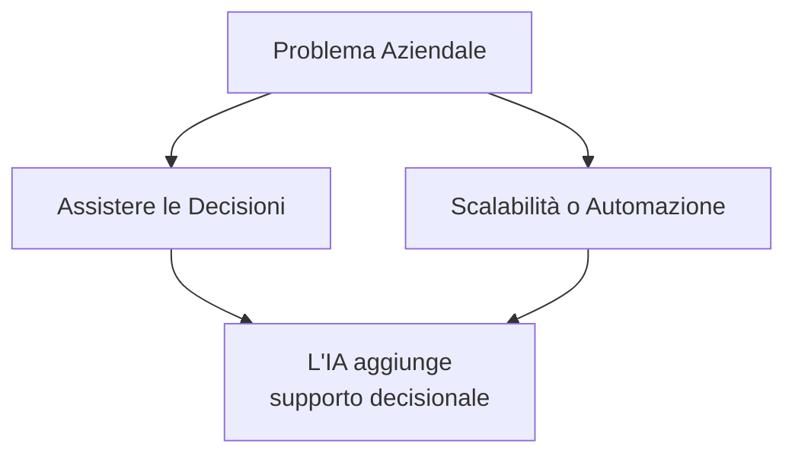
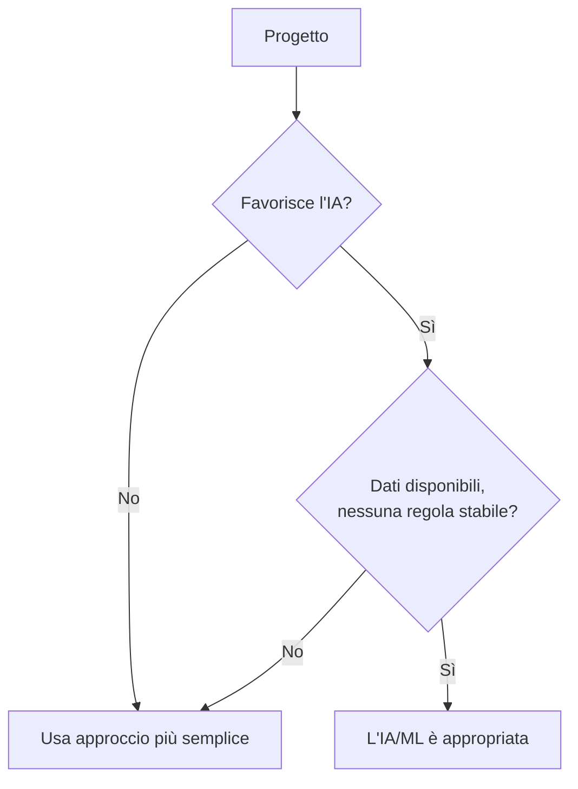
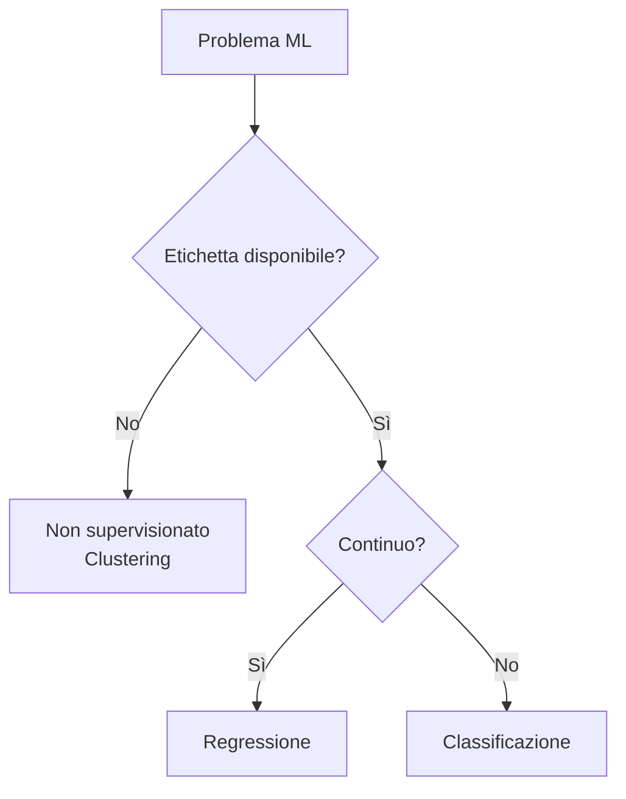
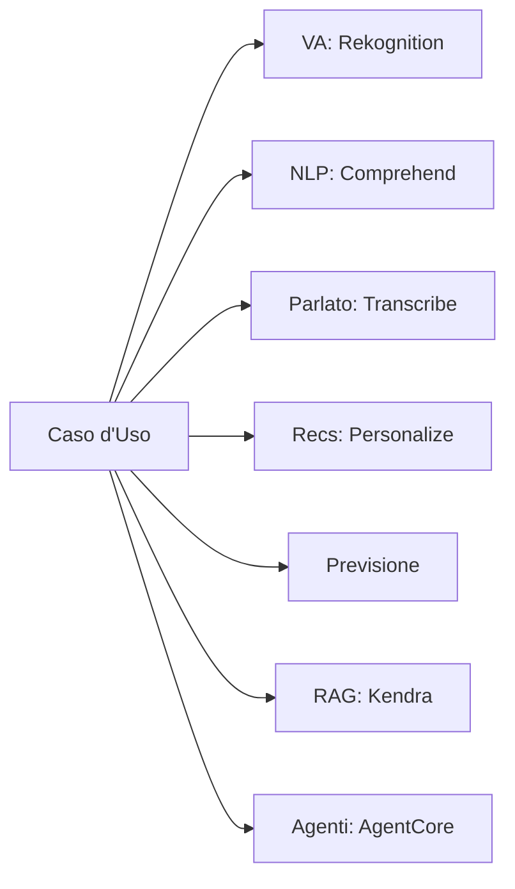
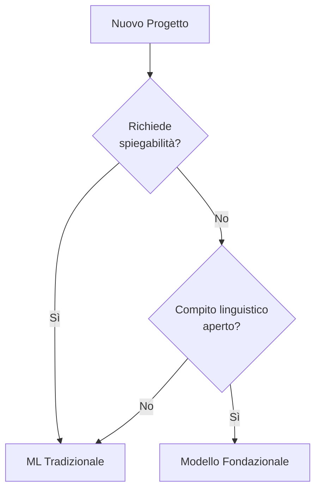

## Dichiarazione di Attività 1.2: Identificare casi d'uso pratici per l'IA

Sapere che l'IA e il ML esistono non è sufficiente per un professionista del business per agire su di essi in modo efficace. La vera domanda è: dove producono risultati migliori rispetto alle alternative, e dove no? La Dichiarazione di Attività 1.2 risponde a questa domanda. Passa dalla teoria alla pratica mappando le categorie di problemi aziendali alle tecniche di IA appropriate, catalogando i servizi gestiti AWS che riducono il carico ingegneristico e introducendo un nuovo punto di decisione della v1.1: quando un modello ML tradizionale è più appropriato di un modello fondazionale. Gli obiettivi trattati qui vanno dall'1.2.1 all'1.2.6.[^102001]

### 1.2.1 Riconoscere dove l'IA/ML fornisce valore

Tre categorie di esigenze aziendali definiscono la maggior parte delle situazioni in cui l'IA e il ML superano le alternative più semplici: assistere il processo decisionale umano, consentire la scalabilità delle soluzioni e automatizzare le attività ripetitive. Queste non sono mutuamente esclusive, e molte distribuzioni in produzione le combinano tutte e tre. Comprendere ogni categoria nei propri termini, tuttavia, rende più facile presentare una proposta di IA agli stakeholder.

**Assistere il processo decisionale umano** è il driver di valore più antico e probabilmente più durevole per il ML. Un modello non sostituisce il decisore; restringe l'intervallo di opzioni che un essere umano deve considerare e associa una stima di probabilità a ciascuna opzione rimanente. Un analista di mutui, ad esempio, esamina decine di segnali quando valuta una domanda di prestito. Un modello ML addestrato sulle prestazioni storiche dei prestiti può classificare quei segnali per peso predittivo e segnalare le domande che si discostano dagli schemi normali, in modo che il valutatore concentri l'attenzione dove conta di più. L'essere umano mantiene la responsabilità e l'autorità; il modello riduce il carico cognitivo e la possibilità di perdere un segnale sepolto in un grande insieme di caratteristiche.[^102002]

**La scalabilità della soluzione** è la capacità che si allinea più direttamente con l'economia del cloud. Un motore di regole deterministico scritto da uno sviluppatore raggiunge un limite quando la logica aziendale diventa abbastanza complessa da rendere il mantenimento manuale delle regole più lento dei cambiamenti aziendali. Un modello ML addestrato sui risultati scala in modo diverso: man mano che il volume di input cresce, il modello esegue la stessa computazione di inferenza indipendentemente da quante regole aziendali sarebbero state necessarie per replicarne l'output. Un modello di rilevamento delle frodi che valuta diecimila transazioni di pagamento al secondo non richiede alcuno sforzo ingegneristico aggiuntivo rispetto a quello che valuta cento transazioni al secondo; cambiano solo le risorse di calcolo, che sono elastiche in AWS.[^102003]

**L'automazione** copre la sostituzione dell'inferenza ML per un'attività che in precedenza richiedeva tempo umano. La classificazione dei documenti, l'ispezione della qualità delle immagini su una linea di produzione e l'instradamento dei centri di contatto basato sull'analisi del sentiment sono tutti esempi. Il valore dell'automazione è più chiaro quando l'attività è ripetitiva, il volume è elevato, il tasso di errore accettabile è ben compreso e il costo degli errori è recuperabile piuttosto che catastrofico. L'automazione non significa operazione incustodita; la maggior parte dei sistemi di automazione IA in produzione includono un percorso di revisione umana per i casi a cui il modello assegna bassa confidenza.[^102004]

*Figura 1.2.1: Tre driver principali del valore aziendale dell'IA/ML. Il diagramma mostra come diverse pressioni aziendali si mappano a distinte categorie di valore dell'IA, ciascuna con il proprio pattern operativo.*

Due altre categorie appaiono meno frequentemente nelle domande dell'esame ma vale la pena notarle. La *personalizzazione della soluzione* applica il ML per adattare contenuti, offerte o flussi di lavoro ai singoli utenti in base alla cronologia comportamentale, particolarmente comune nel retail e nei media. La *manutenzione predittiva* applica modelli di serie temporali ai dati dei sensori delle apparecchiature, segnalando la probabilità di guasto prima che si verifichi e consentendo ai team di manutenzione di agire secondo un programma piuttosto che in risposta ai tempi di inattività.

### 1.2.2 Quando le soluzioni IA/ML non sono appropriate

L'esame tratta questo obiettivo come ad alto rendimento, e il motivo è pratico: le organizzazioni che applicano l'IA in modo indiscriminato sprecano budget e a volte causano danni. Quattro condizioni indicano in modo affidabile che l'IA è la scelta sbagliata.

**Il disallineamento costi-benefici** è il fattore escludente più comune nei progetti reali. Costruire e mantenere un modello ML richiede dati etichettati, run di addestramento, infrastruttura, monitoraggio del modello e riaddestramento periodico man mano che la distribuzione sottostante cambia. Per un problema aziendale che riguarda un piccolo numero di record al giorno o il cui esito varia entro un intervallo stretto e prevedibile, una semplice tabella di ricerca o uno script di decisione di venti righe è più veloce da costruire, meno costoso da gestire e più facile da verificare. Il punto di pareggio dipende dal volume e dalla complessità, ma il principio è coerente: se il costo di sviluppo e gestione del sistema ML supera il valore che restituisce in un orizzonte di pianificazione ragionevole, una soluzione più semplice è quella corretta.[^102005]

**I requisiti di determinismo del risultato** si presentano quando un processo aziendale o normativo richiede una risposta specifica e riproducibile per un dato input piuttosto che una stima probabilistica. I calcoli fiscali, i controlli di eleggibilità normativi e le formule di fatturazione contrattuale rientrano in questa categoria. I modelli ML producono output tratti da una distribuzione appresa; lo stesso input può ricevere punteggi leggermente diversi in momenti diversi se il modello viene riaddestrato, e il modello non può garantire che non si discosterà mai dalla regola. I sistemi basati su regole garantiscono un'esatta riproducibilità. Quando il requisito è "la risposta deve essere sempre X quando le condizioni sono Y", il ML non è lo strumento giusto.[^102006]

**Gli scenari con pochi dati** minano il requisito fondamentale dell'apprendimento supervisionato. Un modello addestrato su meno record di quanti ne servano per coprire la variazione nel mondo reale generalizzerà male. La soglia varia per tecnica e tipo di problema, ma una regola pratica approssimativa è che la classificazione supervisionata ha bisogno di almeno diverse centinaia di esempi etichettati per classe, e la regressione beneficia di diverse migliaia di record con variazione significativa nello spazio delle caratteristiche. Le organizzazioni che vogliono applicare il ML a una nuova linea di prodotti, a una fonte di dati acquisita di recente o a un tipo di evento raro spesso scoprono di non avere ancora abbastanza dati per addestrare un modello affidabile.[^102007]

**I problemi semplici basati su regole** sono situazioni in cui la logica che mappa gli input agli output può essere dichiarata chiaramente in un albero decisionale non più profondo di quattro o cinque livelli. Se un esperto umano può enumerare tutti i casi, le condizioni e gli output corretti in un pomeriggio, e se quelle regole sono stabili nel tempo, allora codificarle esplicitamente è più verificabile, più spiegabile e meno costoso che addestrare un modello. L'idoneità alla restituzione dei clienti basata sulla data di acquisto e sulla categoria dell'articolo è un esempio classico: le regole sono note, fisse e abbastanza poche da mantenere manualmente.

*Figura 1.2.2: Due controlli di sintesi per l'appropriatezza dell'IA/ML. Il primo filtro esclude i progetti che non superano il test costi-benefici o di determinismo; il secondo esclude i progetti privi di dati o che hanno già regole stabili. Un progetto deve superare entrambi i filtri per giustificare l'IA/ML rispetto a un approccio più semplice.*

### 1.2.3 Selezionare tecniche appropriate di IA/ML

La scelta della tecnica giusta inizia con la natura del segnale etichettato disponibile nei dati di addestramento. Tre tecniche fondamentali supervisionate e non supervisionate appaiono esplicitamente negli obiettivi dell'esame; due tecniche aggiuntive appaiono negli obiettivi come menzioni di passaggio.

**La regressione** prevede un output numerico continuo dato un insieme di caratteristiche di input.[^102008] Il modello apprende la relazione tra le caratteristiche e una variabile target che può assumere qualsiasi valore in un intervallo, come il fatturato atteso, le ore fino al guasto delle apparecchiature o la temperatura in una determinata posizione e momento. Una catena di vendita al dettaglio che prevede il volume settimanale delle vendite per ubicazione del negozio usa la regressione. L'output non è una categoria; è un numero su cui l'azienda può agire direttamente in un piano di inventario o di personale.

**La classificazione** assegna un input a una delle categorie di un insieme finito.[^102009] Quando l'insieme delle categorie ha due membri, il problema è *classificazione binaria*; quando ne ha più di due, è *classificazione multiclasse*. Il rilevamento dello spam (spam o non spam), la previsione del default del prestito (default o nessun default) e l'etichettatura delle immagini (gatto, cane o uccello) sono tutti problemi di classificazione. L'output del modello è tipicamente un punteggio di probabilità per ogni classe, e l'applicazione sceglie la classe con il punteggio più alto, facoltativamente combinata con una soglia di confidenza che instrada le previsioni a bassa confidenza a un revisore umano.

**Il clustering** raggruppa i record per somiglianza senza un'etichetta predefinita.[^102010] Poiché non esiste una variabile target etichettata, il clustering è una tecnica non supervisionata. Il modello scopre strutture nei dati che l'analista non aveva pre-specificato. La segmentazione dei clienti è l'esempio canonico: dato lo storico degli acquisti, il comportamento di navigazione e i segnali demografici, il modello potrebbe identificare cinque distinti archetipi di clienti per cui il team di marketing può poi progettare campagne distinte. Il rilevamento delle anomalie è un'applicazione correlata: i record che non si adattano bene a nessun cluster vengono segnalati come insoliti.

*Tabella 1.2.1: Selezione della tecnica ML per tipo di problema*

| Tecnica | Etichetta input | Tipo di output | Esempio aziendale canonico |
|---------|----------------|----------------|---------------------------|
| Regressione | Richiesta (target numerico) | Numero continuo | Previsione della domanda, previsione dei prezzi |
| Classificazione binaria | Richiesta (due classi) | Classe + probabilità | Flag di frode, previsione dell'abbandono |
| Classificazione multiclasse | Richiesta (multi-classe) | Classe + probabilità | Instradamento documenti, categoria difetti |
| Clustering | Non richiesta | Assegnazione cluster | Segmentazione clienti, scoperta temi |
| Rilevamento anomalie | Opzionale | Punteggio anomalia | Intrusione di rete, guasto sensore |

*Figura 1.2.3: Albero decisionale per la selezione della tecnica ML. Il ramo principale separa i problemi supervisionati da quelli non supervisionati; il ramo supervisionato separa poi in base alla natura della variabile target.*

**Amazon SageMaker AI** supporta tutte le tecniche nella Tabella 1.2.1 attraverso i suoi algoritmi integrati e il più ampio ecosistema di framework che ospita.[^102011] Per i team senza personale di data science, la capacità AutoML all'interno di SageMaker AI può selezionare e ottimizzare gli algoritmi automaticamente dato un dataset etichettato, rendendo la selezione della tecnica un'attività di configurazione guidata piuttosto che un problema di ricerca.

### 1.2.4 Applicazioni IA del mondo reale

L'obiettivo dell'esame 1.2.4 si è espanso nella v1.1 per includere le basi di conoscenza e l'IA agentiva insieme alle sei categorie presenti nella v1.0. Queste otto categorie rappresentano l'intero ambito di ciò che l'esame può chiedere ai candidati di riconoscere.

**I sistemi di visione artificiale** interpretano immagini o fotogrammi video per estrarre informazioni strutturate.[^102012] Il rilevamento degli oggetti identifica e individua elementi specifici all'interno di un'immagine; la classificazione delle immagini assegna un'etichetta all'intera immagine; il riconoscimento ottico dei caratteri legge il testo stampato o scritto a mano da una scansione. Un'azienda logistica usa la visione artificiale per leggere le etichette dei pacchi su un nastro trasportatore e instradarli senza intervento umano. Una catena di vendita al dettaglio usa telecamere per la scansione degli scaffali per rilevare quando un prodotto è esaurito. **Amazon Rekognition** è il servizio AWS gestito per la visione artificiale; fornisce modelli pre-addestrati per il rilevamento di oggetti e scene, il riconoscimento del testo e l'analisi dei volti, e accetta sia singole immagini che flussi video.[^102013]

**L'elaborazione del linguaggio naturale (NLP)** consente ai sistemi di derivare significato da testi non strutturati.[^102014] L'analisi del sentiment determina se un testo esprime sentiment positivo, negativo o neutro. Il riconoscimento delle entità estrae entità nominate come nomi di prodotti, luoghi e persone da un documento. La modellazione degli argomenti raggruppa una raccolta di documenti per tema. Un team di customer success esegue l'analisi del sentiment sui ticket di supporto ogni notte per identificare i reclami emergenti sui prodotti prima che si aggravino. **Amazon Comprehend** è il principale servizio NLP gestito di AWS, che fornisce analisi del sentiment, riconoscimento delle entità, estrazione delle frasi chiave e classificazione personalizzata.[^102015]

**Il riconoscimento vocale** converte l'audio parlato in testo, consentendo interfacce vocali, trascrizione delle riunioni e analisi delle chiamate.[^102016] La sfida in produzione è la gestione di accenti diversi, rumori di fondo, vocabolario specifico del dominio e vincoli di latenza in tempo reale. **Amazon Transcribe** converte l'audio in testo e supporta il vocabolario personalizzato, l'identificazione del parlante e la punteggiatura automatica in modalità in tempo reale e batch.[^102017]

**I sistemi di raccomandazione** prevedono quali elementi è più probabile che un utente utilizzi, dato lo storico comportamentale e i segnali contestuali.[^102018] Una piattaforma di e-commerce raccomanda prodotti in base a ciò che un cliente ha navigato e acquistato in precedenza. Un servizio di streaming raccomanda programmi in base alla cronologia e alle valutazioni di visione. La tecnica sottostante è tipicamente il filtro collaborativo, che identifica utenti con comportamento simile e trasferisce le preferenze nel gruppo, o il filtro basato sui contenuti, che abbina elementi i cui attributi assomigliano agli elementi con cui l'utente ha già interagito. **Amazon Personalize** è un servizio di raccomandazione gestito che gestisce la pipeline di addestramento, distribuzione e servizio in tempo reale senza richiedere competenze ML dal team dell'applicazione.[^102019]

**Il rilevamento delle frodi** identifica transazioni o attività dell'account che si discostano dallo schema appreso del comportamento legittimo.[^102020] Le banche applicano il rilevamento delle frodi nella fase di autorizzazione del pagamento, valutando ogni transazione in tempo reale e rifiutando o segnalando quelle sopra una soglia di rischio. Le compagnie assicurative lo applicano alle richieste di rimborso presentate. L'approccio ML supera le regole statiche perché gli schemi di frode si evolvono continuamente, e un modello può essere riaddestrato man mano che emergono nuove tattiche di frode. La tecnica sottostante è spesso la classificazione binaria con uno strato di rilevamento delle anomalie in cima. **Amazon Fraud Detector** è il servizio gestito AWS che comprende questo pattern, con modelli pre-costruiti per le frodi online, le frodi sulle transazioni e le acquisizioni di account.

**La previsione** produce previsioni di valori futuri per una variabile di serie temporali, come la domanda di prodotti, il consumo energetico o i requisiti di personale del call center.[^102021] Gli input sono osservazioni storiche della variabile target più *serie temporali correlate* opzionali (come promozioni, festività e meteo) che il modello può utilizzare per migliorare la precisione. **Amazon Forecast** è un servizio di previsione gestito che seleziona automaticamente tra algoritmi statistici e di deep learning, calcola *previsioni quantili* (ad esempio, livelli di domanda p50 e p90) e scrive i risultati su Amazon S3 per il consumo a valle.[^102022]

**Le basi di conoscenza** sono archivi strutturati di informazioni che i sistemi IA possono interrogare al momento dell'inferenza per basare le proprie risposte su contenuti verificati piuttosto che affidarsi esclusivamente agli schemi codificati nei pesi del modello.[^102023] Una base di conoscenza per un'azienda di servizi finanziari potrebbe contenere documenti normativi, specifiche di prodotto e modelli di risposta approvati. Quando un cliente pone una domanda tramite un assistente IA, il sistema recupera la sezione pertinente dalla base di conoscenza e la utilizza per formulare una risposta fattualmante fondata. Questo pattern è formalmente chiamato *generazione aumentata dal recupero (RAG)*, che il Dominio 3 di questo libro tratta in profondità. **Amazon Kendra** è un servizio di ricerca enterprise gestito che costituisce la base di molte implementazioni di basi di conoscenza, indicizzando i repository di documenti e restituendo passaggi pertinenti in risposta a query in linguaggio naturale.[^102024]

**L'IA agentiva** descrive sistemi in cui uno o più modelli IA pianificano ed eseguono compiti multi-step autonomamente, chiamando strumenti e API per interagire con sistemi esterni.[^102025] Un sistema a singolo agente potrebbe gestire un flusso di lavoro di assistenza clienti dall'inizio alla fine: interpretare la richiesta del cliente, cercare le informazioni sull'account in un CRM, verificare l'inventario dei prodotti, redigere una risoluzione e inviare un'email di conferma, tutto senza un operatore umano. Un sistema multi-agente distribuisce le sotto-attività su agenti specializzati; un agente orchestratore assegna il lavoro, i sub-agenti lo eseguono e l'orchestratore compila i risultati. Le applicazioni aziendali per l'IA agentiva includono le operazioni IT (un agente che monitora gli avvisi, diagnostica la causa principale e applica una correzione da un runbook), l'elaborazione dei documenti (un agente che legge le fatture, estrae le voci e le inserisce in un ERP) e l'onboarding dei clienti (un agente che raccoglie i documenti richiesti, li convalida e attiva il provisioning dell'account).

**Amazon Bedrock AgentCore** è il runtime gestito AWS per carichi di lavoro IA agentivi in produzione, che fornisce gestione della memoria, orchestrazione degli strumenti e persistenza delle sessioni per gli agenti costruiti su modelli fondazionali.[^102026] Per i team che sviluppano applicazioni agentive, **Strands Agents** è un SDK open source che semplifica la composizione multi-agente, mentre gli agenti **Amazon Bedrock** forniscono un livello di orchestrazione completamente gestito che connette i modelli fondazionali ai gruppi di azioni definiti come funzioni Lambda o schemi API.[^102027]

*Figura 1.2.4: Categorie di applicazioni IA del mondo reale e il principale servizio gestito AWS che implementa ciascuna. Il rilevamento delle frodi non è mostrato perché si estende su più servizi (Amazon Fraud Detector e SageMaker AI) a seconda dell'approccio di implementazione.*

### 1.2.5 Servizi AWS gestiti per IA/ML

I servizi IA gestiti AWS rimuovono il requisito di sviluppo di modelli interno all'azienda fornendo capacità pre-addestrate tramite API. L'obiettivo dell'esame 1.2.5 nomina sei servizi esplicitamente e l'elenco dei servizi in ambito ne aggiunge altri quattro che appaiono in pratica e nei distrattori dell'esame.

I sei servizi nominati si dividono perfettamente per funzione. **Amazon SageMaker AI** è la piattaforma ML end-to-end per costruire, addestrare e distribuire modelli personalizzati a qualsiasi scala.[^102028] Non è un servizio pre-addestrato ma un ambiente gestito che gestisce l'infrastruttura per ogni fase del ciclo di vita ML. I team che hanno bisogno di un modello addestrato sui propri dati, piuttosto che di una generica API pre-addestrata, iniziano con SageMaker AI. **Amazon Transcribe** converte il parlato in testo ed è la base di qualsiasi flusso di lavoro che deve acquisire audio.[^102029] **Amazon Translate** fornisce traduzione automatica neurale su un'ampia gamma di coppie di lingue, supportando la localizzazione dei contenuti, la chat multilingue in tempo reale e la traduzione di documenti in batch.[^102030] Amazon Comprehend, introdotto in precedenza in questa sezione, gestisce la fase di analisi del testo su qualsiasi trascritto prodotto da Amazon Transcribe.[^102031] **Amazon Lex** costruisce interfacce conversazionali che comprendono gli intenti del linguaggio naturale e gestiscono lo stato del dialogo, e si integra con **Amazon Polly**, che converte il testo in parlato verosimile per le risposte del canale vocale.[^102032][^102033]

*Tabella 1.2.2: Servizi AWS gestiti IA/ML raggruppati per capacità*

| Capacità | Servizio | Funzione principale |
|----------|---------|---------------------|
| Sviluppo modelli personalizzati | Amazon SageMaker AI | Costruire, addestrare e distribuire modelli ML personalizzati |
| Da parlato a testo | Amazon Transcribe | Riconoscimento vocale automatico con ID parlante |
| Da testo a parlato | Amazon Polly | Sintesi vocale neurale su più voci |
| Traduzione linguistica | Amazon Translate | Traduzione automatica neurale, batch e in tempo reale |
| Analisi del testo | Amazon Comprehend | Sentiment, entità, frasi chiave, classificazione personalizzata |
| IA conversazionale | Amazon Lex | Riconoscimento degli intenti e gestione del dialogo |
| Visione artificiale | Amazon Rekognition | Rilevamento oggetti, riconoscimento testo, moderazione contenuti |
| Estrazione dati da documenti | Amazon Textract | Estrazione strutturata di campi e tabelle dai documenti |
| Raccomandazioni | Amazon Personalize | Raccomandazioni personalizzate in tempo reale |
| Ricerca enterprise | Amazon Kendra | Ricerca in linguaggio naturale su repository di documenti interni |

### 1.2.6 ML tradizionale vs. modelli fondazionali

L'obiettivo 1.2.6 è nuovo nella v1.1, riflettendo la domanda pratica che ogni team IA si trova ora ad affrontare: quando un modello fondazionale (FM) è lo strumento giusto, e quando un modello ML tradizionale costruito e addestrato da zero è la scelta migliore?[^102038] La decisione non riguarda la sofisticazione di nessuna delle due opzioni. Riguarda il fit: abbinare le caratteristiche dei dati disponibili, gli output richiesti, l'ambiente normativo e il budget operativo alle capacità di ciascun approccio.

**I modelli ML tradizionali** sono addestrati su dati etichettati per un compito specifico e ben delimitato. Sono completamente interpretabili nel senso che l'importanza delle caratteristiche e la logica decisionale possono essere estratte e verificate. Eseguono l'inferenza a bassa latenza, tipicamente in millisecondi a una cifra su hardware modesto. Il loro costo computazionale è prevedibile e spesso basso. Richiedono dati di addestramento etichettati per il dominio, che possono essere costosi da acquisire, ma una volta addestrati non hanno alcun costo di calcolo corrente basato su token.[^102039]

**I modelli fondazionali** sono pre-addestrati su corpus ampi e di uso generale e possono gestire una vasta gamma di compiti linguistici e multi-modali con una configurazione aggiuntiva minima.[^102040] Eccellono in compiti che richiedono comprensione del linguaggio naturale, generazione di contenuti, sintesi del codice o ragionamento su argomenti vagamente correlati. Accettano prompt conversazionali e adattano il loro comportamento in base alle istruzioni senza riaddestramento. Il loro modello di costo è tipicamente basato su token, il che significa che ogni chiamata di inferenza ha un prezzo per il numero di token nell'input e nell'output. La latenza è maggiore rispetto al ML tradizionale, tipicamente nell'intervallo da centinaia di millisecondi a secondi.

*Tabella 1.2.3: Criteri di decisione per ML tradizionale vs. modelli fondazionali*

| Criterio | ML tradizionale | Modello fondazionale |
|----------|----------------|---------------------|
| Ambito del compito | Compito singolo, ben definito | Compiti ampi o generali |
| Dati di addestramento | Dataset etichettato per il dominio richiesto | Pre-addestrato; prompt o fine-tuning |
| Spiegabilità | Alta; importanza delle caratteristiche disponibile | Inferiore; ragionamento emergente |
| Latenza | Bassa (millisecondi a una cifra) | Più alta (centinaia di ms a secondi) |
| Costo di inferenza | Prevedibile; nessun addebito per token | Basato su token; variabile con la lunghezza dell'input |
| Adeguatezza normativa | Forte; completa verificabilità | Più debole; preoccupazioni sulla variabilità dell'output |
| Supporto multi-modale | Limitato alle modalità addestrate | Ampio (testo, immagine, audio a seconda del modello) |
| Compito singolo ad alto volume | Alto; scala orizzontalmente | Basso; il costo token cresce con il volume |

Quattro condizioni favoriscono fortemente la scelta di un modello ML tradizionale. Primo, i requisiti normativi o di conformità richiedono un percorso decisionale completamente verificabile e riproducibile. Secondo, il compito di previsione ha un singolo output ben definito e dati di addestramento etichettati sufficienti per raggiungere un'accuratezza accettabile senza ragionamento di uso generale. Terzo, la latenza e il costo sono strettamente vincolati; l'applicazione funziona ad alto volume e deve restituire previsioni in millisecondi a una frazione di centesimo per inferenza. Quarto, l'organizzazione ha una capacità sufficiente di ingegneria ML per gestire la pipeline di addestramento e riaddestramento.

Quattro condizioni favoriscono un modello fondazionale. Primo, il compito richiede la generazione di prosa coerente, il ragionamento su domande ambigue o la sintesi di informazioni da più fonti. Secondo, l'organizzazione ha dati di addestramento etichettati minimi ma ha accesso a una descrizione del compito ben definita che può esprimere come prompt, rendendo l'inferenza few-shot o zero-shot praticabile. Terzo, il caso d'uso è conversazionale, e il modello deve mantenere il contesto su più turni senza logica esplicita di gestione dello stato. Quarto, il volume dell'applicazione è abbastanza basso da rendere accettabile il costo basato su token, oppure i compiti sono sufficientemente unici da consentire a un modello di uso generale di ammortizzare il costo di una build di modello specializzato.

*Figura 1.2.6: Flusso decisionale per scegliere tra un modello ML tradizionale e un modello fondazionale. I requisiti normativi e il tipo di compito sono i due filtri principali; la latenza e la disponibilità dei dati affinano la scelta.*

## Domande di autoverifica

**Domanda 1**

Un'azienda di vendita al dettaglio elabora 50.000 email di supporto clienti al giorno e deve instradare ogni email al reparto corretto in base all'argomento. L'azienda dispone di 12 mesi di email storiche già etichettate con il reparto corretto. Quale approccio si adatta MEGLIO a questo problema?

A. Regressione, perché il modello deve prevedere un punteggio per ogni reparto e il punteggio più alto determina l'instradamento.
B. Classificazione multiclasse, perché l'output è uno dei diversi reparti predefiniti e i dati etichettati sono disponibili.
C. Clustering, perché ci sono troppi dati da etichettare manualmente e i reparti non sono ancora definiti.
D. Un modello fondazionale con prompting zero-shot, perché i dati etichettati rendono il fine-tuning non necessario e il prompting è più semplice.

Con 12 mesi di email etichettate e un insieme fisso di reparti noti, questo è un classico problema di classificazione multiclasse. I dati etichettati sono sufficienti per addestrare un modello ML tradizionale, l'output è una delle categorie di un numero finito e il volume (50.000 al giorno) rende il costo prevedibile e la bassa latenza di un classificatore addestrato preferibili all'inferenza FM basata su token.[^102044]

**Domanda 2**

Un'azienda di servizi finanziari deve spiegare ogni decisione di prestito ai regolatori, incluso quali caratteristiche di input hanno influenzato maggiormente il risultato. Sta valutando se usare un modello ML tradizionale o un modello fondazionale. Quale fattore favorisce MAGGIORMENTE l'approccio ML tradizionale?

A. L'azienda dispone di un grande volume di dati di addestramento etichettati provenienti da domande di prestito passate.
B. Il requisito normativo per la spiegabilità e la logica decisionale verificabile.
C. Il requisito di latenza di inferenza è inferiore a 200 millisecondi per richiesta.
D. L'azienda vuole evitare i prezzi basati su token per controllare i costi di inferenza.

La spiegabilità normativa è il fattore decisivo. I modelli ML tradizionali come la regressione logistica e gli alberi con gradient boosting espongono punteggi di importanza delle caratteristiche e percorsi decisionali che soddisfano i requisiti di audit. I modelli fondazionali producono output attraverso un ragionamento emergente difficile da attribuire a caratteristiche specifiche in una forma accettata dai regolatori.[^102045]

**Domanda 3**

Un'azienda manifatturiera vuole identificare quali macchine sul suo pavimento produttivo potrebbero guastarsi nelle prossime 72 ore, in base alle letture dei sensori raccolte ogni minuto. Il modello deve restituire una previsione, non una regola statica. Non ci sono dati storici di guasto etichettati. Quale approccio ML è PIÙ appropriato?

A. Classificazione binaria utilizzando dati storici dei sensori etichettati con eventi di guasto.
B. Regressione utilizzando il numero di chiamate di manutenzione passate come variabile target.
C. Rilevamento delle anomalie non supervisionato sulle serie temporali dei sensori, segnalando letture che si discostano dal profilo normale appreso di ogni macchina.
D. Classificazione multiclasse per categorizzare la gravità del guasto come bassa, media o alta.

Senza una cronologia di guasto etichettata, gli approcci supervisionati (A, B, D) non possono essere applicati direttamente. Il rilevamento delle anomalie non supervisionato apprende lo schema normale delle letture dei sensori per ogni macchina e segnala le deviazioni da tale schema; su AWS, **Amazon SageMaker AI** offre Random Cut Forest e DeepAR esattamente per questo tipo di rilevamento delle anomalie nelle serie temporali.[^102046]

**Domanda 4**

Un'azienda sta valutando una soluzione IA per automatizzare il calcolo dei bonus dei dipendenti ai sensi di un contratto collettivo. La formula è specificata precisamente nell'accordo, si applica in modo identico a tutti i dipendenti della stessa categoria professionale e non è cambiata in cinque anni. Quale determinazione è PIÙ appropriata?

A. Implementare un modello di classificazione per determinare a quale fascia di bonus appartiene ogni dipendente.
B. Implementare un modello di regressione per prevedere gli importi dei bonus dai dati salariali e di performance.
C. Non usare IA/ML; implementare la formula come codice deterministico, perché il risultato deve essere esatto e riproducibile.
D. Usare un modello fondazionale per interpretare il testo dell'accordo e calcolare il bonus appropriato.

Questo è uno scenario con requisiti di determinismo del risultato. Il calcolo del bonus è una formula fissa senza elemento probabilistico; gli stessi input devono sempre produrre lo stesso output senza varianza. Un'implementazione basata su regole o formula garantisce l'esatta riproducibilità ed è banalmente verificabile.[^102047]

**Domanda 5**

Un'azienda tecnologica vuole costruire un assistente di assistenza clienti in grado di gestire domande in 15 lingue, mantenere il contesto conversazionale su più turni e generare risposte personalizzate che attingono alla documentazione interna sui prodotti dell'azienda. L'azienda non ha dati di addestramento domanda-risposta etichettati. Quale approccio è MIGLIORE?

A. Addestrare un modello di classificazione multiclasse per instradare le domande a risposte pre-scritte in ogni lingua.
B. Usare un modello fondazionale con recupero da una base di conoscenza Amazon Kendra, combinato con Amazon Translate per la gestione della lingua.
C. Usare Amazon Lex per la gestione del dialogo e Amazon Comprehend per l'analisi del sentiment, senza modello fondazionale.
D. Costruire modelli di regressione separati per ogni lingua, ciascuno addestrato a valutare la rilevanza delle risposte candidate.

Questo scenario ha tre requisiti che collettivamente favoriscono un'architettura di modello fondazionale: contesto conversazionale multi-turno, generazione di contenuti da documenti interni e supporto multilingue senza dati di addestramento etichettati. Collegare un modello fondazionale a una base di conoscenza Amazon Kendra fornisce la generazione aumentata dal recupero, fondando le risposte del modello nella documentazione effettiva dell'azienda.[^102048]

---

[^102001]: AWS Certification: AWS Certified AI Practitioner (AIF-C01) Exam Guide v1.1, Task Statement 1.2. URL: <https://docs.aws.amazon.com/aws-certification/latest/ai-practitioner-01/ai-practitioner-01-domain1.html>
[^102002]: Amazon SageMaker AI Developer Guide: Human-in-the-loop workflows. URL: <https://docs.aws.amazon.com/sagemaker/latest/dg/a2i-use-augmented-ai-a2i-human-review-loops.html>
[^102003]: Amazon SageMaker AI: Model deployment and real-time inference. URL: <https://docs.aws.amazon.com/sagemaker/latest/dg/deploy-model.html>
[^102004]: Amazon Augmented AI (A2I) Developer Guide: What is Amazon A2I? URL: <https://docs.aws.amazon.com/sagemaker/latest/dg/a2i-getting-started.html>
[^102005]: AWS Well-Architected Framework: Machine Learning Lens - Cost optimization pillar. URL: <https://docs.aws.amazon.com/wellarchitected/latest/machine-learning-lens/cost-optimization.html>
[^102006]: NIST AI Risk Management Framework (AI RMF 1.0): Trustworthiness characteristic - Explainability. URL: <https://airc.nist.gov/Home>
[^102007]: Amazon SageMaker AI Developer Guide: Prepare your data. URL: <https://docs.aws.amazon.com/sagemaker/latest/dg/data-prep.html>
[^102008]: Amazon SageMaker AI Developer Guide: Linear Learner algorithm. URL: <https://docs.aws.amazon.com/sagemaker/latest/dg/linear-learner.html>
[^102009]: Amazon SageMaker AI Developer Guide: XGBoost algorithm. URL: <https://docs.aws.amazon.com/sagemaker/latest/dg/xgboost.html>
[^102010]: Amazon SageMaker AI Developer Guide: K-Means algorithm. URL: <https://docs.aws.amazon.com/sagemaker/latest/dg/k-means.html>
[^102011]: Amazon SageMaker AI overview. URL: <https://aws.amazon.com/sagemaker/>
[^102012]: Amazon Rekognition Developer Guide: What is Amazon Rekognition? URL: <https://docs.aws.amazon.com/rekognition/latest/dg/what-is.html>
[^102013]: Amazon Rekognition product page. URL: <https://aws.amazon.com/rekognition/>
[^102014]: Amazon Comprehend Developer Guide: What is Amazon Comprehend? URL: <https://docs.aws.amazon.com/comprehend/latest/dg/what-is.html>
[^102015]: Amazon Comprehend product page. URL: <https://aws.amazon.com/comprehend/>
[^102016]: Amazon Transcribe Developer Guide: What is Amazon Transcribe? URL: <https://docs.aws.amazon.com/transcribe/latest/dg/what-is.html>
[^102017]: Amazon Transcribe product page. URL: <https://aws.amazon.com/transcribe/>
[^102018]: Amazon Personalize Developer Guide: What is Amazon Personalize? URL: <https://docs.aws.amazon.com/personalize/latest/dg/what-is-personalize.html>
[^102019]: Amazon Personalize product page. URL: <https://aws.amazon.com/personalize/>
[^102020]: Amazon Fraud Detector product page. URL: <https://aws.amazon.com/fraud-detector/>
[^102021]: Amazon Forecast Developer Guide: What is Amazon Forecast? URL: <https://docs.aws.amazon.com/forecast/latest/dg/what-is-forecast.html>
[^102022]: Amazon Forecast product page. URL: <https://aws.amazon.com/forecast/>
[^102023]: Amazon Kendra Developer Guide: What is Amazon Kendra? URL: <https://docs.aws.amazon.com/kendra/latest/dg/what-is-kendra.html>
[^102024]: Amazon Kendra product page. URL: <https://aws.amazon.com/kendra/>
[^102025]: Amazon Bedrock User Guide: Agents for Amazon Bedrock. URL: <https://docs.aws.amazon.com/bedrock/latest/userguide/agents.html>
[^102026]: Amazon Bedrock AgentCore product page. URL: <https://aws.amazon.com/bedrock/agentcore/>
[^102027]: Strands Agents SDK on GitHub. URL: <https://github.com/strands-agents/sdk-python>
[^102028]: Amazon SageMaker AI Developer Guide: What is Amazon SageMaker AI? URL: <https://docs.aws.amazon.com/sagemaker/latest/dg/whatis.html>
[^102029]: Amazon Transcribe Developer Guide: Real-time transcription. URL: <https://docs.aws.amazon.com/transcribe/latest/dg/getting-started-streaming.html>
[^102030]: Amazon Translate Developer Guide: What is Amazon Translate? URL: <https://docs.aws.amazon.com/translate/latest/dg/what-is.html>
[^102031]: Amazon Comprehend Developer Guide: Sentiment analysis. URL: <https://docs.aws.amazon.com/comprehend/latest/dg/how-sentiment.html>
[^102032]: Amazon Lex Developer Guide: What is Amazon Lex? URL: <https://docs.aws.amazon.com/lexv2/latest/dg/what-is.html>
[^102033]: Amazon Polly Developer Guide: What is Amazon Polly? URL: <https://docs.aws.amazon.com/polly/latest/dg/what-is.html>
[^102038]: AWS Certification: AIF-C01 v1.1 revisions - Objectives added in v1.1, objective 1.2.6. URL: <https://docs.aws.amazon.com/aws-certification/latest/ai-practitioner-01/aif-01-revisions.html>
[^102039]: Amazon SageMaker AI Developer Guide: Training models. URL: <https://docs.aws.amazon.com/sagemaker/latest/dg/how-it-works-training.html>
[^102040]: Amazon Bedrock User Guide: Foundation models in Amazon Bedrock. URL: <https://docs.aws.amazon.com/bedrock/latest/userguide/foundation-models.html>
[^102041]: NIST AI Risk Management Framework AI RMF 1.0 - Govern function. URL: <https://airc.nist.gov/Home>
[^102042]: EU Artificial Intelligence Act, Article 13. URL: <https://eur-lex.europa.eu/legal-content/EN/TXT/?uri=CELEX:32024R1689>
[^102043]: Amazon Bedrock User Guide: Model distillation. URL: <https://docs.aws.amazon.com/bedrock/latest/userguide/model-distillation.html>
[^102044]: Amazon SageMaker AI Developer Guide: Multi-class classification. URL: <https://docs.aws.amazon.com/sagemaker/latest/dg/xgboost.html>
[^102045]: Amazon SageMaker Clarify Developer Guide: Explainability. URL: <https://docs.aws.amazon.com/sagemaker/latest/dg/clarify-model-explainability.html>
[^102046]: Amazon SageMaker AI Developer Guide: Random Cut Forest algorithm. URL: <https://docs.aws.amazon.com/sagemaker/latest/dg/randomcutforest.html>
[^102047]: AWS Well-Architected Machine Learning Lens: Operational Excellence. URL: <https://docs.aws.amazon.com/wellarchitected/latest/machine-learning-lens/operational-excellence.html>
[^102048]: Amazon Bedrock User Guide: Knowledge bases for Amazon Bedrock. URL: <https://docs.aws.amazon.com/bedrock/latest/userguide/knowledge-base.html>
