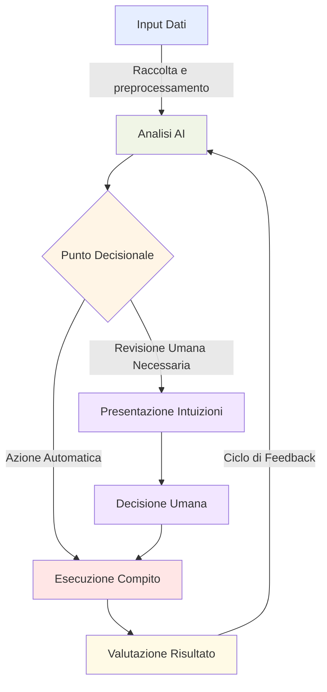

## 1.2 Casi d'uso pratici per l'AI

L'intelligenza artificiale (AI) e il machine learning (ML) sono diventati strumenti potenti che trasformano il modo in cui le organizzazioni operano, servono i clienti e ottengono vantaggi competitivi. Comprendere dove l'AI può fornire valore—e dove potrebbe non essere adatta—consente alle aziende di prendere decisioni tecnologiche strategiche. Questo sottocapitolo esplora applicazioni AI pratiche, ti aiuta a identificare casi d'uso appropriati e introduce i servizi AWS che possono trasformare i concetti AI in soluzioni aziendali.

### Riconoscere applicazioni dove AI/ML può fornire valore

Le tecnologie AI e ML eccellono nell'analizzare grandi dataset, identificare pattern e fare previsioni che migliorano le operazioni aziendali in diverse aree chiave:

1. **Assistere il processo decisionale umano**: I sistemi AI analizzano vaste quantità di dati per fornire intuizioni che aumentano l'expertise umana, portando a decisioni più informate.

2. **Scalabilità delle soluzioni**: I modelli ML possono elaborare volumi crescenti di dati senza aumenti proporzionali delle risorse, consentendo scalabilità aziendale efficiente.

3. **Automazione**: I sistemi alimentati dall'AI gestiscono compiti ripetitivi, liberando risorse umane per lavoro strategico e creativo.

Il seguente diagramma di flusso dimostra come l'AI si integra in un processo aziendale tipico:

*Figura 1.2.1: Flusso del Processo Aziendale Assistito dall'AI. Questo diagramma illustra come l'AI può essere integrata in un processo aziendale tipico, dall'input dei dati alla valutazione dei risultati, mostrando sia azioni automatiche che punti decisionali umani.*

Ecco esempi specifici dove AI/ML fornisce valore aziendale significativo:

- **Servizio Clienti**: Chatbot e assistenti virtuali alimentati dall'AI gestiscono richieste clienti di routine 24/7, migliorando i tempi di risposta mentre permettono agli agenti umani di concentrarsi su problemi complessi. **Amazon Lex**, integrato con Amazon Connect, crea interfacce conversazionali intelligenti che comprendono il linguaggio naturale.[^300]

- **Manutenzione Predittiva**: I modelli ML analizzano dati dei sensori delle attrezzature per predire potenziali guasti prima che si verifichino, riducendo tempi di inattività e costi di manutenzione. **Amazon SageMaker** consente di costruire, addestrare e deployare questi modelli predittivi su scala.[^301]

- **Raccomandazioni Personalizzate**: Le piattaforme e-commerce usano algoritmi ML per analizzare il comportamento clienti e fornire raccomandazioni prodotto su misura, aumentando vendite e soddisfazione. **Amazon Personalize** offre un servizio completamente gestito per creare raccomandazioni personalizzate in tempo reale.[^302]

- **Rilevamento Frodi Finanziarie**: Le banche impiegano modelli ML per analizzare pattern di transazioni e identificare attività potenzialmente fraudolente in tempo reale. **Amazon Fraud Detector** fornisce un servizio completamente gestito che usa ML per rilevare attività sospette.[^303]

- **Ottimizzazione Supply Chain**: L'AI analizza dati storici, trend di mercato e fattori esterni per ottimizzare livelli di inventario, predire domanda e migliorare efficienza della supply chain. **Amazon Forecast** genera previsioni accurate di domanda basate su dati di serie temporali storiche.[^304]

Queste applicazioni AI consentono alle aziende di migliorare efficienza operativa, migliorare esperienze clienti e ottenere vantaggi competitivi nei loro mercati.

### Determinare quando le soluzioni AI/ML non sono appropriate

Riconoscere situazioni dove l'AI potrebbe non essere la soluzione ottimale è ugualmente importante per prendere decisioni tecnologiche solide. Diversi fattori dovrebbero influenzare se implementare l'AI per una particolare sfida aziendale:

1. **Considerazioni costi-benefici**: L'implementazione AI richiede investimenti in infrastruttura dati, sviluppo modelli e manutenzione continua. Per alcuni problemi, questi costi potrebbero superare i benefici potenziali.

2. **Situazioni che richiedono risultati specifici**: Quando sono necessari risultati definitivi basati su regole (come nella conformità normativa), i sistemi tradizionali basati su regole spesso funzionano meglio degli approcci basati su probabilità dell'AI.

3. **Dati limitati o di scarsa qualità**: I modelli AI/ML dipendono da dati sostanziali di alta qualità. Senza dati sufficienti di qualità, le previsioni saranno inaffidabili e potenzialmente dannose per le operazioni aziendali.

4. **Considerazioni etiche**: Usare l'AI per certi processi decisionali solleva preoccupazioni etiche, particolarmente in aree sensibili come diagnostica sanitaria o giustizia penale. Il giudizio umano rimane essenziale per assicurare risultati equi.

5. **Requisiti di spiegabilità**: Alcune industrie richiedono spiegazioni chiare per le decisioni. Mentre l'*AI spiegabile* è avanzata, modelli complessi come reti neurali profonde possono essere difficili da interpretare, rendendoli inadatti quando la trasparenza decisionale è cruciale.

6. **Necessità di elaborazione in tempo reale**: Per applicazioni a latenza ultra-bassa, sistemi tradizionali basati su regole potrebbero fornire tempi di risposta più affidabili di alcuni sistemi AI.

### Selezionare le tecniche ML appropriate per casi d'uso specifici

Abbinare la tecnica di machine learning giusta al tuo problema aziendale impatta significativamente il successo del progetto. Diversi approcci ML si adattano a diversi tipi di problemi e caratteristiche dei dati. Ecco tre tecniche ML fondamentali e le loro applicazioni tipiche:

1. **Regressione**:
   - **Scopo**: Predice valori numerici continui basati su caratteristiche di input.
   - **Casi d'uso**: Previsione vendite, predizione prezzi, stima domanda.
   - **Esempio**: Predire prezzi case basandosi su caratteristiche come metratura, posizione e numero di camere da letto.

2. **Classificazione**:
   - **Scopo**: Categorizza dati di input in classi o categorie predefinite.
   - **Casi d'uso**: Rilevamento spam, analisi sentiment, riconoscimento immagini.
   - **Esempio**: Determinare se un'email è spam o legittima basandosi sul suo contenuto e metadati.

3. **Clustering**:
   - **Scopo**: Raggruppa punti dati simili senza categorie predefinite.
   - **Casi d'uso**: Segmentazione clienti, rilevamento anomalie, sistemi di raccomandazione.
   - **Esempio**: Raggruppare clienti con comportamenti d'acquisto simili per campagne marketing mirate.

*Tabella 1.2.1: Tecniche ML e le loro Applicazioni Aziendali*

| Tecnica ML | Descrizione | Caso d'Uso Aziendale | Servizio AWS |
|--------------|-------------|-------------------|-------------|
| Regressione | Predice valori continui | Previsione vendite | Amazon Forecast |
| Classificazione | Categorizza dati in classi | Analisi sentiment | Amazon Comprehend |
| Clustering | Raggruppa punti dati simili | Segmentazione clienti | Amazon SageMaker |

### Identificare esempi di applicazioni AI del mondo reale

La tecnologia AI ha trasformato operazioni attraverso numerose industrie. Comprendere queste applicazioni pratiche può ispirare nuove idee di implementazione per la tua organizzazione. Ecco esempi prominenti di applicazioni AI in vari domini:

1. **Computer Vision**:
   - **Applicazione**: Rilevamento e riconoscimento oggetti in immagini e video.
   - **Caso d'uso**: Veicoli autonomi usano computer vision per identificare segnali stradali, pedoni e altri veicoli.
   - **Servizio AWS**: **Amazon Rekognition** fornisce capacità computer vision pre-addestrate per analisi di immagini e video.[^305]

2. **Natural Language Processing (NLP)**:
   - **Applicazione**: Comprensione e generazione del linguaggio umano.
   - **Caso d'uso**: Chatbot che comprendono e rispondono a richieste clienti in linguaggio naturale.
   - **Servizio AWS**: **Amazon Comprehend** offre capacità NLP per estrarre intuizioni dal testo.[^306]

3. **Riconoscimento Vocale**:
   - **Applicazione**: Conversione del linguaggio parlato in testo.
   - **Caso d'uso**: Assistenti virtuali a controllo vocale come Alexa o Siri.
   - **Servizio AWS**: **Amazon Transcribe** converte voce in testo in tempo reale.[^307]

4. **Sistemi di Raccomandazione**:
   - **Applicazione**: Suggerimento di elementi rilevanti basati su preferenze e comportamento utenti.
   - **Caso d'uso**: Piattaforme e-commerce che raccomandano prodotti basandosi su cronologia di navigazione e acquisti.
   - **Servizio AWS**: **Amazon Personalize** fornisce capacità di raccomandazione personalizzate.[^308]

5. **Rilevamento Frodi**:
   - **Applicazione**: Identificazione di pattern inusuali che potrebbero indicare attività fraudolenta.
   - **Caso d'uso**: Banche che rilevano e prevengono frodi con carte di credito in tempo reale.
   - **Servizio AWS**: **Amazon Fraud Detector** identifica attività online potenzialmente fraudolente.[^309]

6. **Previsione**:
   - **Applicazione**: Predizione di trend futuri basata su dati storici.
   - **Caso d'uso**: Rivenditori che prevedono domanda prodotti per ottimizzare inventario.
   - **Servizio AWS**: **Amazon Forecast** genera previsioni accurate di domanda da dati storici.[^310]

### Spiegare le capacità dei servizi AI/ML gestiti AWS

AWS offre servizi AI/ML gestiti completi che consentono alle aziende di implementare soluzioni AI senza expertise estesa in-house o infrastruttura. Questi servizi spaziano da strumenti fondamentali per costruire modelli ML personalizzati a servizi AI pre-addestrati per compiti specifici:

*Tabella 1.2.2. Confronto Servizi AI AWS*

| Servizio | Capacità | Caratteristiche | Caso d'Uso |
|---------|------------|----------|----------|
| **Amazon SageMaker** | Piattaforma ML end-to-end per costruire, addestrare e deployare modelli ML su scala. | Ambiente di sviluppo integrato (IDE) per ML, tuning automatico modelli, addestramento distribuito e deployment modelli. | Sviluppo modelli ML personalizzati per varie applicazioni aziendali.[^311] |
| **Amazon Transcribe** | Servizio riconoscimento vocale automatico che converte voce in testo. | Trascrizione tempo reale, vocabolario personalizzato, identificazione parlanti e rilevamento lingua. | Trascrizione chiamate servizio clienti per analisi e garanzia qualità.[^312] |
| **Amazon Translate** | Servizio traduzione automatica neurale che fornisce traduzione linguistica veloce e di alta qualità. | Supporto lingue multiple, terminologia personalizzata e traduzione batch. | Traduzione descrizioni prodotti e recensioni clienti per piattaforme e-commerce globali.[^313] |
| **Amazon Comprehend** | Servizio elaborazione linguaggio naturale per estrarre intuizioni dal testo. | Riconoscimento entità, estrazione frasi chiave, analisi sentiment e topic modeling. | Analisi feedback clienti per identificare problemi comuni e trend sentiment.[^314] |
| **Amazon Lex** | Servizio per costruire interfacce conversazionali usando voce e testo. | Riconoscimento vocale automatico, comprensione linguaggio naturale e gestione dialogo. | Creazione chatbot per servizio clienti e supporto.[^315] |
| **Amazon Polly** | Servizio text-to-speech che converte testo in voce realistica. | Lingue e voci multiple, marcatori vocali per sincronizzazione e lessici personalizzati. | Generazione prompt vocali per sistemi risposta vocale interattiva.[^316] |
| **Amazon Bedrock** | Servizio completamente gestito che fornisce accesso a foundation model (FM) da aziende AI leader attraverso una singola API. | Accesso a modelli da AI21 Labs, Anthropic, Stability AI e Amazon; capacità fine-tuning; sicurezza enterprise-grade. | Costruzione applicazioni AI generative per creazione contenuti, riassunto e question-answering.[^317] |

Vantaggi chiave dei servizi AI/ML gestiti AWS includono:

1. **Complessità ridotta**: Questi servizi astraggono complessità infrastrutturali e ML, permettendo agli sviluppatori di concentrarsi sulla costruzione applicazioni.

2. **Scalabilità**: AWS gestisce la scalabilità delle risorse basata sulla domanda, assicurando prestazioni consistenti sotto carichi variabili.

3. **Costo-efficacia**: Il pricing pay-as-you-go permette alle aziende di iniziare in piccolo e scalare senza grandi investimenti iniziali.

4. **Aggiornamenti continui**: AWS aggiorna regolarmente i servizi con i più recenti progressi AI/ML, fornendo accesso a capacità all'avanguardia.

5. **Integrazione**: Questi servizi si integrano facilmente con altri servizi AWS e applicazioni esistenti attraverso API e SDK.

6. **Sicurezza e conformità**: AWS fornisce robuste funzionalità di sicurezza e certificazioni di conformità, affrontando preoccupazioni comuni nell'adozione AI.

Sfruttando questi servizi gestiti, aziende di tutte le dimensioni possono rapidamente prototipare, sviluppare e deployare soluzioni AI senza estesa expertise AI in-house o infrastruttura.

[^300]: Amazon Lex Overview. URL: <https://aws.amazon.com/lex/>
[^301]: Amazon SageMaker Overview. URL: <https://aws.amazon.com/sagemaker/>
[^302]: Amazon Personalize Overview. URL: <https://aws.amazon.com/personalize/>
[^303]: Amazon Fraud Detector Overview. URL: <https://aws.amazon.com/fraud-detector/>
[^304]: Amazon Forecast Overview. URL: <https://aws.amazon.com/forecast/>
[^305]: Amazon Rekognition Overview. URL: <https://aws.amazon.com/rekognition/>
[^306]: Amazon Comprehend Overview. URL: <https://aws.amazon.com/comprehend/>
[^307]: Amazon Transcribe Overview. URL: <https://aws.amazon.com/transcribe/>
[^308]: Amazon Personalize Overview. URL: <https://aws.amazon.com/personalize/>
[^309]: Amazon Fraud Detector Overview. URL: <https://aws.amazon.com/fraud-detector/>
[^310]: Amazon Forecast Overview. URL: <https://aws.amazon.com/forecast/>
[^311]: Amazon SageMaker Overview. URL: <https://aws.amazon.com/sagemaker/>
[^312]: Amazon Transcribe Overview. URL: <https://aws.amazon.com/transcribe/>
[^313]: Amazon Translate Overview. URL: <https://aws.amazon.com/translate/>
[^314]: Amazon Comprehend Overview. URL: <https://aws.amazon.com/comprehend/>
[^315]: Amazon Lex Overview. URL: <https://aws.amazon.com/lex/>
[^316]: Amazon Polly Overview. URL: <https://aws.amazon.com/polly/>
[^317]: Amazon Bedrock Overview. URL: <https://aws.amazon.com/bedrock/>