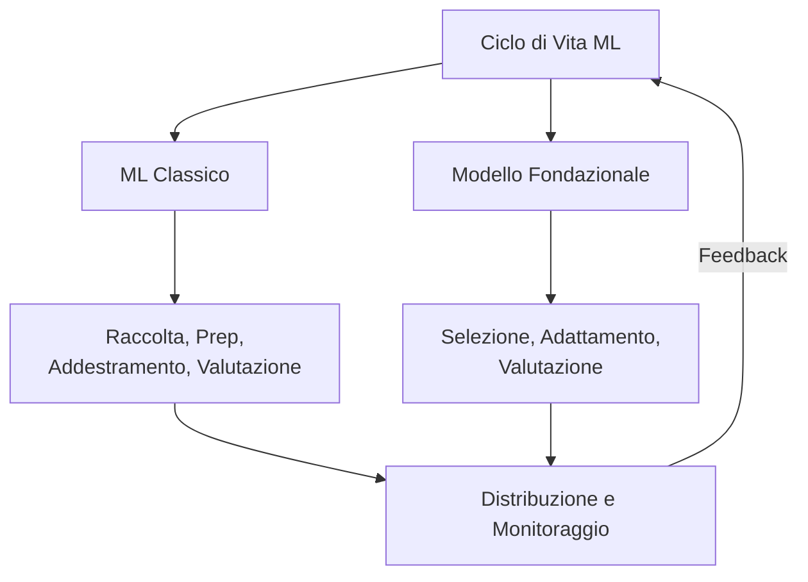
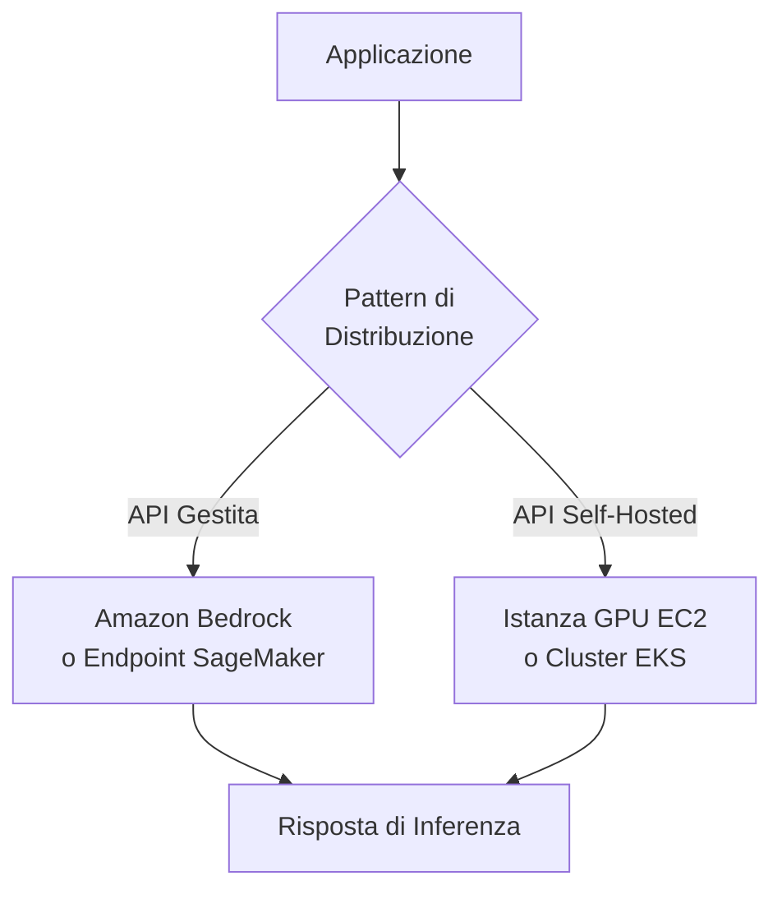

## Dichiarazione di Attività 1.3: Descrivere il ciclo di vita dello sviluppo dell'IA/ML

Il ciclo di vita dello sviluppo dell'IA/ML è la sequenza strutturata di attività che porta un'idea aziendale dai dati grezzi a un sistema di produzione che genera valore nel tempo. Il Dominio 1 ha stabilito il vocabolario e il panorama dei casi d'uso; questa dichiarazione di attività mette in moto queste idee mostrando come i progetti di IA e ML vengono effettivamente costruiti e gestiti. Comprendere il ciclo di vita consente ai professionisti del business di stabilire aspettative realistiche, porre le domande giuste ad ogni checkpoint e riconoscere dove i servizi AWS riducono il costo e la complessità di ogni fase.[^103001]

### 1.3.1 Componenti di una pipeline IA/ML

Una pipeline è la sequenza di passaggi che un team esegue per passare dai dati grezzi a un modello funzionante. Il termine è mutuato dall'ingegneria del software e porta lo stesso significato: ogni fase riceve un artefatto dal passaggio precedente, lo trasforma e passa il risultato in avanti. Il concetto di pipeline è importante per i professionisti del business perché fornisce un vocabolario comune per discutere il progresso, il costo e la qualità ad ogni punto di un progetto IA.[^103048]

Le pipeline di machine learning classico e le pipeline di modelli fondazionali condividono una logica strutturale ma differiscono nelle fasi intermedie. Una pipeline ML classica parte da zero: un team raccoglie dati etichettati, elabora le caratteristiche, seleziona un algoritmo, addestra un modello sui propri dati, lo ottimizza, lo valuta e poi distribuisce e monitora il risultato. Una pipeline di modello fondazionale salta la maggior parte del lavoro pesante di dati e addestramento. Il team invece seleziona un modello pre-addestrato esistente, decide come adattarlo al proprio compito (tramite prompt engineering, fine-tuning o generazione aumentata dal recupero), valuta il modello adattato e lo distribuisce. Entrambe le pipeline convergono alle stesse due fasi finali: distribuzione e monitoraggio.

*Figura 1.3.1: Pipeline IA/ML a doppio percorso. I percorsi ML classico e modello fondazionale convergono alla distribuzione e al monitoraggio; i segnali di feedback si ricollegano al percorso attivo.*

Le fasi del percorso ML classico sono le seguenti. La **raccolta dei dati** è il processo di raccolta dei record etichettati o non etichettati da cui il modello imparerà; i problemi di qualità in questa fase si propagano attraverso ogni passaggio successivo.[^103002] L'**analisi esplorativa dei dati (EDA)** è l'esame dei dati raccolti per comprenderne la distribuzione, le relazioni e le anomalie prima che inizi qualsiasi modellazione.[^103003] La **pre-elaborazione dei dati** comprende la pulizia, l'imputazione dei valori mancanti, la rimozione dei duplicati e la conversione dei dati in un formato che un algoritmo possa consumare.[^103004] L'**ingegneria delle caratteristiche** (feature engineering) è la creazione o trasformazione delle variabili di input per rendere più accessibili al modello gli schemi sottostanti.[^103005] L'**addestramento del modello** è il processo di ottimizzazione mediante il quale un algoritmo trova i valori dei parametri che minimizzano l'errore di previsione sul dataset di addestramento.[^103006] Il **tuning degli iperparametri** regola le impostazioni che governano il comportamento dell'addestramento piuttosto che i pesi appresi stessi.[^103007]

Entrambi i percorsi entrano poi nella fase di **valutazione**, dove il modello adattato o addestrato viene testato su dati separati e valutato rispetto alle metriche di performance. Un modello che supera la valutazione procede alla **distribuzione**. Un modello che non supera torna a una fase precedente, comunemente all'ingegneria delle caratteristiche o al tuning degli iperparametri nel percorso classico, o a una strategia di adattamento rivista nel percorso FM.

Il **monitoraggio** è la fase finale e quella più spesso sottovalutata nella pianificazione. Una volta che un modello è in produzione, il mondo reale non rimane fermo. Il comportamento degli utenti cambia, le pipeline di dati evolvono, e gli schemi statistici che il modello ha appreso potrebbero non corrispondere più a ciò che vede. Il monitoraggio rileva queste deviazioni e innesca un'azione correttiva, sia essa un aggiornamento dei dati, un riaddestramento o una revisione del prompt.[^103009]

### 1.3.2 Fonti di modelli FM

I modelli fondazionali richiedono enormi risorse computazionali per essere addestrati da zero. Un singolo addestramento di un modello linguistico di grandi dimensioni può consumare milioni di ore GPU e costare decine di milioni di dollari.[^103010] Di conseguenza, la maggior parte delle organizzazioni non addestra i propri FM; li ottiene da fonti esterne e li adatta. Le tre fonti principali differiscono per costo, controllo, termini di licenza e capacità.

**I modelli pre-addestrati open source** sono modelli i cui pesi e, nella maggior parte dei casi, il codice di addestramento vengono rilasciati pubblicamente. Gli esempi più prominenti disponibili nel 2025-2026 includono la famiglia Llama di Meta (ora alla 4a generazione), Mistral e Mixtral di Mistral AI, la serie Falcon di TII e Stable Diffusion di Stability AI per la generazione di immagini.[^103011] Il fascino dei modelli open source è diretto: non c'è nessun costo API per token, i pesi possono essere scaricati ed eseguiti sull'infrastruttura propria dell'organizzazione, e il modello può essere ottimizzato senza alcun coinvolgimento del fornitore. Lo svantaggio è la complessità operativa. Il team deve eseguire il provisioning e gestire il calcolo, gestire gli aggiornamenti del modello e assumersi la responsabilità per la sicurezza e la conformità. Anche le licenze variano.[^103012]

**I modelli fondazionali commerciali** sono offerti dalle aziende di IA come servizio API gestito. L'organizzazione consumatrice paga per token elaborato piuttosto che gestire l'infrastruttura. I principali FM commerciali accessibili tramite AWS includono Anthropic Claude, Amazon Nova, i modelli Jamba di AI21 Labs e le famiglie Command ed Embed di Cohere.[^103013] I modelli commerciali non richiedono gestione dell'infrastruttura e vengono continuamente aggiornati dal fornitore, ma l'organizzazione ha meno visibilità sui dati di addestramento e sui pesi.

**I modelli personalizzati addestrati da zero** sono l'opzione più rara. L'addestramento di un nuovo FM su larga scala da zero è appropriato solo quando un'organizzazione ha un dominio così specializzato che nessun FM esistente lo copre adeguatamente e ha il budget e la profondità di ingegneria ML necessari.[^103014]

*Tabella 1.3.1: Opzioni di fonte FM a confronto*

| Fonte | Struttura di costo tipica | Controllo sui pesi | Complessità operativa | Modelli di esempio |
|-------|--------------------------|--------------------|-----------------------|-------------------|
| Open source pre-addestrato | Solo costo infrastruttura | Accesso completo | Alta | Llama 4, Mistral, Falcon |
| API gestita commerciale | Prezzo per token | Nessun accesso | Bassa | Claude, Amazon Nova, Cohere |
| Personalizzato da zero | Capex multimilionario | Piena proprietà | Molto alta | Proprietario |

### 1.3.3 Metodi per usare un modello in produzione

I due principali pattern di distribuzione che l'esame tratta sono il **servizio API gestito** e l'**API self-hosted**. La scelta tra di essi richiede di bilanciare requisiti di latenza, volume di chiamate, esigenze di personalizzazione e vincoli di conformità.

Un **servizio API gestito** astrae tutte le preoccupazioni infrastrutturali dall'applicazione consumatrice. **Amazon Bedrock** è la principale API AWS gestita per i modelli fondazionali, che dà accesso a Claude, Amazon Nova, Cohere, AI21, Meta Llama e altri modelli attraverso una singola API unificata senza la necessità di gestire server o GPU.[^103015] Per le organizzazioni che hanno addestrato modelli ML classici personalizzati o FM ottimizzati, gli endpoint di inferenza in tempo reale di **Amazon SageMaker AI** forniscono la stessa astrazione.[^103016]

Un'**API self-hosted** esegue il modello sull'infrastruttura che l'organizzazione controlla e la espone come propria API. I pattern AWS più comuni sono l'hosting del container del modello su istanze GPU di **Amazon EC2** per la massima flessibilità, o la distribuzione come carico di lavoro Kubernetes su **Amazon EKS** per l'orchestrazione di container su scala.[^103017] Il self-hosting è appropriato quando i requisiti di conformità vietano l'invio di dati all'API di un fornitore, quando il volume di chiamate è abbastanza alto da rendere la capacità EC2 riservata o spot più economica dei costi per token, o quando il team ha bisogno di modificare lo stack di inferenza in modi che un servizio gestito non consente.

*Figura 1.3.2: Pattern di distribuzione del modello. Un'applicazione instrada le richieste di inferenza a un'API gestita o a un'API self-hosted a seconda delle priorità del team in termini di latenza, conformità e costo.*

### 1.3.4 Servizi AWS per ogni fase della pipeline

La guida dell'esame AIF-C01 v1.1 nomina specificamente cinque famiglie di servizi che attraversano la pipeline IA/ML: **Amazon Bedrock**, **Amazon Q**, **Amazon Quick**, **Kiro** e **Amazon SageMaker AI**. Comprendere cosa fa ciascuno e dove si inserisce evita di confonderli nell'esame.

**Amazon Bedrock** si trova nelle fasi di adattamento e distribuzione del FM della pipeline. Fornisce accesso a un catalogo curato di modelli fondazionali attraverso un'API gestita, insieme agli strumenti per il fine-tuning di tali modelli su dati privati e per la costruzione di pipeline RAG utilizzando basi di conoscenza supportate da archivi vettoriali.[^103019]

**Amazon SageMaker AI** copre l'intera pipeline ML classica dalla preparazione dei dati all'addestramento, alla valutazione e alla distribuzione. SageMaker Studio è l'ambiente di sviluppo integrato; SageMaker Pipelines fornisce CI/CD nativo ML per automatizzare la pipeline end-to-end; SageMaker Feature Store gestisce le definizioni e i valori delle caratteristiche; e SageMaker Model Monitor traccia la salute dei modelli distribuiti.[^103020]

**Amazon Q** è una famiglia di assistenti potenziati dall'IA orientati a specifici pubblici professionali. **Amazon Q Business** è un assistente conversazionale per i dipendenti dell'azienda; si connette alle fonti di dati aziendali e risponde a domande basate sul contenuto organizzativo.[^103021] **Amazon Q Developer** è un assistente di codifica integrato negli IDE che suggerisce codice, spiega la logica e identifica le vulnerabilità di sicurezza.

**Kiro** è l'ambiente di sviluppo software potenziato dall'IA di Amazon, annunciato nel 2025.[^103022] Dove Q Developer è principalmente un overlay di completamento del codice e chat all'interno degli IDE esistenti, Kiro è un IDE completo costruito attorno ai flussi di lavoro IA agentivi. Per l'esame, la distinzione chiave è che Kiro si rivolge al ciclo di vita dello sviluppo software assistito dall'IA, non alla Q&A degli utenti finali o all'analisi dei dati.

**Amazon Quick** è il nome della guida dell'esame v1.1 per la famiglia di analisi e assistente IA per utenti business di AWS.[^103023] Le capacità storicamente fornite attraverso Amazon QuickSight (dashboard BI) e Amazon Q Business (risposte conversazionali su contenuti aziendali) stanno convergendo sotto questo nome. Per l'esame, riconosci Amazon Quick come la risposta a "BI self-service potenziata dall'IA generativa per gli utenti business".

*Tabella 1.3.3: Amazon Q, Kiro e Amazon Quick in breve*

| Servizio | Cosa fa | Pubblico | Stato per AIF-C01 v1.1 |
|---------|---------|----------|------------------------|
| Amazon Q Business | Q&A aziendale basata sui contenuti aziendali | Lavoratori della conoscenza | In ambito; converge in Amazon Quick |
| Amazon Q Developer | Completamento del codice e chat negli IDE | Sviluppatori | In ambito; superato da Kiro per i flussi di lavoro IDE completi |
| Kiro | IDE completo per flussi di lavoro IA agentivi | Sviluppatori | In ambito (nuovo nella v1.1); risposta per "IDE potenziato dall'IA" |
| Amazon Quick | BI self-service più assistente IA generativa | Analisti di business | In ambito (nuovo nella v1.1); risposta per "BI + GenAI per utenti business" |

*Tabella 1.3.4: Servizi AWS AI/ML per fase della pipeline*

| Fase della pipeline | Servizio AWS | Ruolo |
|--------------------|-------------|-------|
| Archiviazione e preparazione dei dati | Amazon S3, AWS Glue | Archiviazione dataset; ETL e catalogazione |
| Ingegneria delle caratteristiche | SageMaker Feature Store | Registro centralizzato delle caratteristiche |
| Addestramento modello classico | SageMaker AI Training | Job di addestramento distribuito gestito |
| Tuning degli iperparametri | SageMaker Automatic Model Tuning | Ricerca bayesiana e casuale nello spazio dei parametri |
| Adattamento FM (prompting/RAG) | Amazon Bedrock Knowledge Bases | Pipeline RAG supportate da archivio vettoriale |
| Adattamento FM (fine-tuning) | Amazon Bedrock Fine-Tuning, SageMaker AI | Fine-tuning supervisionato su dati privati |
| Valutazione | SageMaker Model Monitor, Bedrock Model Evaluation | Punteggio di performance e qualità |
| Distribuzione (FM) | Amazon Bedrock Endpoints | API di inferenza FM gestita |
| Distribuzione (ML personalizzato) | SageMaker AI Endpoints, Batch Transform | Inferenza in tempo reale e batch modello personalizzato |
| Monitoraggio | SageMaker Model Monitor | Rilevamento deriva dei dati e qualità del modello |
| Analisi di business | Amazon Quick | Dashboard BI e Q&A dati in linguaggio naturale |
| Q&A aziendale | Amazon Q Business | Risposte conversazionali sui contenuti aziendali |
| Produttività degli sviluppatori | Kiro, Amazon Q Developer | Sviluppo software assistito dall'IA |

### 1.3.5 Concetti fondamentali di MLOps

**MLOps** (Machine Learning Operations) è la disciplina dell'applicazione del rigore dell'ingegneria del software al ciclo di vita ML per rendere la distribuzione dei modelli ripetibile, scalabile e mantenibile nel tempo.[^103024] Il termine è modellato su DevOps: proprio come DevOps ha portato automazione, controllo di versione e integrazione continua allo sviluppo delle applicazioni, MLOps porta quelle stesse pratiche al lavoro di costruzione e gestione dei modelli ML. L'esame copre sette concetti fondamentali di MLOps.

La **sperimentazione** è la pratica di tracciare ogni esecuzione di un tentativo di costruzione di modello in modo che i risultati possano essere riprodotti e confrontati. **Amazon SageMaker Experiments** registra gli iperparametri, le metriche e le versioni degli artefatti associati a ogni esecuzione di addestramento.[^103025]

I **processi ripetibili** sostituiscono gli script ad hoc con pipeline versionizzate e parametrizzate che producono output coerenti da input coerenti. **Amazon SageMaker Pipelines** è il servizio di orchestrazione MLOps nativo; definisce i passaggi della pipeline in codice, memorizza l'output di ogni passaggio come artefatto versionizzato e si integra con il registro dei modelli SageMaker per condizionare le distribuzioni alle soglie di valutazione.[^103026]

I **sistemi scalabili** garantiscono che l'infrastruttura che supporta l'addestramento, la valutazione e l'inferenza possa crescere con la domanda senza riconfigurazione manuale. SageMaker gestisce l'addestramento distribuito su cluster GPU e scala gli endpoint di inferenza su e giù in base al volume delle richieste tramite policy di auto-scaling supportate dalle metriche di **Amazon CloudWatch**.[^103027]

Il **monitoraggio del modello** è la valutazione continua del comportamento di un modello distribuito rispetto alle linee di base stabilite al momento della distribuzione. Due tipi di deriva sono particolarmente importanti. La *deriva dei dati* (chiamata anche *covariate shift*) si verifica quando la distribuzione statistica delle caratteristiche di input cambia nel tempo.[^103030] La *deriva del concetto* si verifica quando cambia la relazione tra gli input e il corretto output. **Amazon SageMaker Model Monitor** confronta continuamente i dati di inferenza live con un dataset di riferimento e solleva allarmi quando la deriva supera una soglia.[^103031]

Il **riaddestramento del modello** è la risposta ai segnali di monitoraggio. Una strategia di riaddestramento dovrebbe specificare il trigger (pianificato, basato su soglia metrica o approvato dall'uomo), la finestra di dati utilizzata e il checkpoint di distribuzione (soglie di superamento/fallimento che il modello riaddestrato deve superare prima di sostituire la versione precedente).[^103032]

### 1.3.6 Metriche di performance e di business

La valutazione di un modello IA/ML richiede due prospettive parallele. Le metriche di performance tecnica dicono al team se il modello sta facendo previsioni accurate. Le metriche di business dicono all'organizzazione se quelle previsioni accurate stanno generando il valore inteso.

Le quattro metriche di performance tecnica esplicitamente nominate sono accuratezza, precisione, richiamo e punteggio F1, tutte applicabili ai problemi di classificazione.[^103033]

**L'accuratezza** è la proporzione di tutte le previsioni che il modello ha fatto correttamente. È semplice ma fuorviante quando le classi sono sbilanciate.[^103034]

**La precisione** è la frazione delle previsioni positive che erano corrette: VP / (VP + FP). Un modello di rilevamento delle frodi con alta precisione solleva pochi falsi allarmi.[^103035]

**Il richiamo** (chiamato anche *sensibilità*) è la frazione degli effettivi positivi che il modello ha identificato con successo: VP / (VP + FN). Un modello di screening medico con alto richiamo rileva la maggior parte dei veri casi della condizione.[^103036]

Il **punteggio F1** è la media armonica di precisione e richiamo: 2 x (Precisione x Richiamo) / (Precisione + Richiamo). È sensibile ai valori bassi in entrambe le metriche, rendendola un riassunto affidabile in un solo numero quando sia i falsi positivi che i falsi negativi sono importanti.[^103037]

Le quattro metriche di business nell'esame sono il costo per utente, i costi di sviluppo, il feedback dei clienti e il ritorno sull'investimento.[^103038]

**Il costo per utente** è il costo totale di inferenza diviso per il numero di utenti serviti in un periodo. **I costi di sviluppo** sono gli investimenti una tantum (o per iterazione) in persone, dati, calcolo e strumenti richiesti per costruire e distribuire un modello. **Il feedback dei clienti** copre i segnali qualitativi e quantitativi sulla soddisfazione degli utenti con la funzionalità potenziata dall'IA. **Il ritorno sull'investimento (ROI)** è il rapporto tra il beneficio finanziario netto e il costo totale in un periodo definito.

## Domande di autoverifica

1. Un team di data science ha costruito un modello di previsione dell'abbandono dei clienti e lo ha distribuito sei mesi fa. Un analista di business nota che il richiamo del modello è sceso dall'82% al 54% anche se il volume e il formato dei dati di input non sono cambiati. Il team sospetta che gli schemi di comportamento dei clienti siano cambiati da quando il modello è stato addestrato. Quale concetto MLOps descrive MEGLIO la causa principale di questo calo del richiamo?

   A. Deriva degli iperparametri
   B. Deriva del concetto
   C. Debito tecnico della pipeline
   D. Invalidazione del feature store

   La deriva del concetto si verifica quando la relazione tra le caratteristiche di input e il corretto output cambia nel tempo, anche quando la distribuzione dei dati di input appare stabile. In questo scenario, il team attribuisce specificamente il cambiamento all'evoluzione del comportamento dei clienti che cambia la relazione input-risultato, che è deriva del concetto, non un cambiamento nella distribuzione delle caratteristiche.[^103043]

2. Un'azienda di vendita al dettaglio sta valutando le opzioni dei modelli fondazionali per un servizio di generazione di descrizioni di prodotti ad alto volume che elaborerà circa 50 milioni di richieste al mese. Il team richiede il pieno controllo sui pesi del modello per ragioni di conformità e vuole minimizzare i costi correnti per unità. Quale approccio di fonte FM è PIÙ appropriato?

   A. API gestita commerciale con un modello a parametri grandi come Claude Opus
   B. Modello pre-addestrato open source ospitato su istanze GPU EC2 self-managed
   C. Amazon Bedrock con prezzi on-demand
   D. Modello personalizzato costruito da zero su dati proprietari dei prodotti

   Lo scenario specifica due vincoli che insieme restringono la scelta: la conformità richiede il controllo a livello di peso, e l'alto volume richiede un'economia migliore dei prezzi API per token. I modelli pre-addestrati open source (opzione B) affrontano entrambi i vincoli.[^103044]

3. Un analista di business sta esaminando un modello di rilevamento delle frodi e vede i seguenti risultati della matrice di confusione: VP=80, FP=40, FN=20, VN=860. L'analista deve riportare la metrica che MEGLIO riflette la capacità del modello di evitare di segnalare erroneamente le transazioni legittime come fraudolente. Quale metrica dovrebbe essere riportata?

   A. Accuratezza
   B. Richiamo
   C. Punteggio F1
   D. Precisione

   La domanda chiede la metrica che riflette la frequenza con cui le previsioni positive (segnalazioni di frode) sono effettivamente corrette, che è la definizione di precisione. Precisione = VP / (VP + FP) = 80 / (80 + 40) = 66,7%.[^103045]

4. Un'organizzazione vuole costruire un assistente conversazionale che risponda alle domande dei dipendenti basandosi su documenti aziendali interni archiviati su SharePoint, Confluence e Amazon S3. Non vogliono gestire nessuna infrastruttura del modello. Quale servizio AWS è PIÙ direttamente progettato per questo caso d'uso?

   A. Amazon SageMaker AI con un modello addestrato su misura
   B. Kiro
   C. Amazon Q Business
   D. Amazon Bedrock con prompt engineering manuale

   Amazon Q Business è il servizio AWS specificamente progettato per gli assistenti conversazionali aziendali che rispondono a domande basandosi sui documenti e le fonti dati proprie di un'organizzazione. Include connettori integrati per SharePoint, Confluence, S3 e decine di altri sistemi aziendali.[^103046]

5. Un team di progetto sta presentando i risultati di un modello di raccomandazione prodotti appena distribuito al CFO. Il modello ha raggiunto un'accuratezza del 91% e un punteggio F1 dell'84% sul set di test. Il CFO chiede cosa ha effettivamente fatto il modello per il business nel primo trimestre di operatività. Quale metrica risponde MEGLIO alla domanda del CFO?

   A. Punteggio F1 dell'84%
   B. Accuratezza del 91%
   C. Ritorno sull'investimento espresso come impatto sui ricavi rispetto al costo operativo
   D. Richiamo sulla classe positiva

   La domanda del CFO riguarda esplicitamente il risultato di business, non la qualità del modello. Il ritorno sull'investimento (ROI), espresso come beneficio netto di fatturato o costo generato dal modello rispetto al costo di costruzione e gestione, è la metrica di business che risponde direttamente se l'investimento era giustificato.[^103047]

---

[^103001]: AWS Certified AI Practitioner Exam Guide v1.1, Task Statement 1.3. URL: <https://docs.aws.amazon.com/aws-certification/latest/ai-practitioner-01/ai-practitioner-01-domain1.html>
[^103002]: Amazon SageMaker Data Wrangler: Preparing ML data. URL: <https://docs.aws.amazon.com/sagemaker/latest/dg/data-wrangler.html>
[^103003]: Exploratory Data Analysis with Amazon SageMaker Studio. URL: <https://docs.aws.amazon.com/sagemaker/latest/dg/studio.html>
[^103004]: Data preprocessing concepts in ML. URL: <https://docs.aws.amazon.com/wellarchitected/latest/machine-learning-lens/data-preprocessing.html>
[^103005]: Amazon SageMaker Feature Store overview. URL: <https://docs.aws.amazon.com/sagemaker/latest/dg/feature-store.html>
[^103006]: Amazon SageMaker Training: training jobs overview. URL: <https://docs.aws.amazon.com/sagemaker/latest/dg/train-model.html>
[^103007]: Amazon SageMaker Automatic Model Tuning. URL: <https://docs.aws.amazon.com/sagemaker/latest/dg/automatic-model-tuning.html>
[^103008]: Amazon Bedrock retrieval-augmented generation overview. URL: <https://docs.aws.amazon.com/bedrock/latest/userguide/knowledge-base.html>
[^103009]: Amazon SageMaker Model Monitor. URL: <https://docs.aws.amazon.com/sagemaker/latest/dg/model-monitor.html>
[^103010]: AWS Blog: Training large language models at scale. URL: <https://aws.amazon.com/blogs/machine-learning/training-large-language-models-on-amazon-sagemaker/>
[^103011]: Meta Llama model family overview. URL: <https://llama.meta.com/>
[^103012]: Mistral AI open-source model licensing. URL: <https://mistral.ai/news/announcing-mistral-7b/>
[^103013]: Amazon Bedrock supported foundation models. URL: <https://docs.aws.amazon.com/bedrock/latest/userguide/models-supported.html>
[^103014]: AWS ML Blog: When to train a custom model vs. use a pre-trained FM. URL: <https://aws.amazon.com/blogs/machine-learning/>
[^103015]: Amazon Bedrock: Fully managed FM service overview. URL: <https://docs.aws.amazon.com/bedrock/latest/userguide/what-is-bedrock.html>
[^103016]: Amazon SageMaker real-time inference endpoints. URL: <https://docs.aws.amazon.com/sagemaker/latest/dg/realtime-endpoints.html>
[^103017]: Running ML inference on Amazon EC2 GPU instances. URL: <https://docs.aws.amazon.com/AWSEC2/latest/UserGuide/accelerated-computing-instances.html>
[^103018]: Amazon SageMaker Batch Transform. URL: <https://docs.aws.amazon.com/sagemaker/latest/dg/batch-transform.html>
[^103019]: Amazon Bedrock Knowledge Bases for RAG. URL: <https://docs.aws.amazon.com/bedrock/latest/userguide/knowledge-base.html>
[^103020]: Amazon SageMaker AI overview. URL: <https://docs.aws.amazon.com/sagemaker/latest/dg/whatis.html>
[^103021]: Amazon Q Business overview. URL: <https://docs.aws.amazon.com/amazonq/latest/qbusiness-ug/what-is.html>
[^103022]: Kiro: AI-powered IDE from AWS. URL: <https://kiro.dev/>
[^103023]: AIF-C01 v1.1 in-scope service list (Amazon Quick). URL: <https://docs.aws.amazon.com/aws-certification/latest/ai-practitioner-01/aif-01-in-scope-services.html>
[^103024]: AWS What is MLOps? URL: <https://aws.amazon.com/what-is/mlops/>
[^103025]: Amazon SageMaker Experiments documentation. URL: <https://docs.aws.amazon.com/sagemaker/latest/dg/experiments.html>
[^103026]: Amazon SageMaker Pipelines: ML CI/CD. URL: <https://docs.aws.amazon.com/sagemaker/latest/dg/pipelines.html>
[^103027]: Amazon SageMaker auto-scaling for inference endpoints. URL: <https://docs.aws.amazon.com/sagemaker/latest/dg/endpoint-auto-scaling.html>
[^103028]: Amazon SageMaker Feature Store: consistent feature transforms. URL: <https://docs.aws.amazon.com/sagemaker/latest/dg/feature-store-use-with-studio.html>
[^103029]: Amazon SageMaker shadow testing for deployments. URL: <https://docs.aws.amazon.com/sagemaker/latest/dg/shadow-tests.html>
[^103030]: Data drift detection with Amazon SageMaker Model Monitor. URL: <https://docs.aws.amazon.com/sagemaker/latest/dg/model-monitor-data-quality.html>
[^103031]: Amazon SageMaker Model Monitor: how it works. URL: <https://docs.aws.amazon.com/sagemaker/latest/dg/model-monitor-how-it-works.html>
[^103032]: Triggering SageMaker Pipelines with CloudWatch alarms. URL: <https://docs.aws.amazon.com/sagemaker/latest/dg/pipeline-eventbridge.html>
[^103033]: AWS Certified AI Practitioner Exam Guide v1.1, Objective 1.3.6. URL: <https://docs.aws.amazon.com/aws-certification/latest/ai-practitioner-01/ai-practitioner-01-domain1.html>
[^103034]: ML classification accuracy limitations. URL: <https://docs.aws.amazon.com/machine-learning/latest/dg/binary-classification.html>
[^103035]: Precision metric in binary classification. URL: <https://docs.aws.amazon.com/machine-learning/latest/dg/binary-classification.html>
[^103036]: Recall (sensitivity) in classification models. URL: <https://docs.aws.amazon.com/machine-learning/latest/dg/binary-classification.html>
[^103037]: F1 score definition and calculation. URL: <https://docs.aws.amazon.com/machine-learning/latest/dg/multiclass-model-insights.html>
[^103038]: AWS Certified AI Practitioner Exam Guide v1.1, business metrics in objective 1.3.6. URL: <https://docs.aws.amazon.com/aws-certification/latest/ai-practitioner-01/ai-practitioner-01-domain1.html>
[^103039]: Amazon Bedrock pricing model and cost management. URL: <https://aws.amazon.com/bedrock/pricing/>
[^103040]: AWS ML cost optimization guidance. URL: <https://aws.amazon.com/blogs/machine-learning/optimizing-costs-for-machine-learning-on-aws/>
[^103041]: Amazon Bedrock human-loop feedback integration. URL: <https://docs.aws.amazon.com/bedrock/latest/userguide/human-loop.html>
[^103042]: Measuring business value of ML with AWS. URL: <https://aws.amazon.com/blogs/machine-learning/measuring-the-business-impact-of-amazon-sagemaker/>
[^103043]: Concept drift and data drift in Amazon SageMaker Model Monitor. URL: <https://docs.aws.amazon.com/sagemaker/latest/dg/model-monitor-model-quality.html>
[^103044]: Deploying open-source models on Amazon EC2 GPU instances. URL: <https://docs.aws.amazon.com/AWSEC2/latest/UserGuide/accelerated-computing-instances.html>
[^103045]: Binary classification metrics: precision and recall. URL: <https://docs.aws.amazon.com/machine-learning/latest/dg/binary-classification.html>
[^103046]: Amazon Q Business: connecting enterprise data sources. URL: <https://docs.aws.amazon.com/amazonq/latest/qbusiness-ug/connectors-list.html>
[^103047]: Business metrics for evaluating ML models. URL: <https://aws.amazon.com/blogs/machine-learning/mlops-foundation-roadmap-for-enterprises-with-amazon-sagemaker/>
[^103048]: AWS Well-Architected Machine Learning Lens: ML lifecycle overview. URL: <https://docs.aws.amazon.com/wellarchitected/latest/machine-learning-lens/well-architected-machine-learning-lifecycle.html>
[^103049]: AWS Blog: Choosing between foundation models and custom ML. URL: <https://aws.amazon.com/blogs/machine-learning/choose-the-right-approach-for-your-generative-ai-use-cases/>
[^103050]: Amazon SageMaker MLOps: continuous evaluation and retraining. URL: <https://docs.aws.amazon.com/sagemaker/latest/dg/model-monitor.html>
