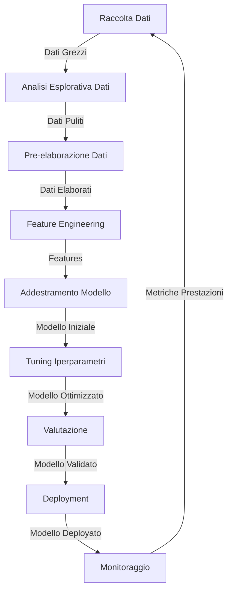

## 1.3 Il Ciclo di Vita dello Sviluppo ML

Comprendere il ciclo di vita dello sviluppo del machine learning (ML) è essenziale per sfruttare efficacemente l'AI negli ambienti aziendali. Questa conoscenza consente ai professionisti di supervisionare con fiducia progetti AI, comunicare con team tecnici e prendere decisioni basate sui dati riguardo alle iniziative AI. Il ciclo di vita dello sviluppo ML consiste di fasi interconnesse dalla raccolta dati al deployment e monitoraggio del modello.[^400] Padroneggiare questo processo aiuta le organizzazioni a semplificare l'implementazione AI, ridurre il time-to-market e massimizzare il ritorno sull'investimento dai progetti AI.

Le seguenti sezioni esplorano il ciclo di vita dello sviluppo ML con focus su applicazioni aziendali pratiche e come i servizi AWS supportano ogni fase. Questa comprensione ti preparerà per l'esame AWS Certified AI Practitioner mentre ti equipaggia con conoscenze per guidare l'innovazione AI all'interno della tua organizzazione.

### Componenti di una Pipeline ML

Le pipeline ML formano la base dei progetti AI, comprendendo diverse fasi critiche che trasformano dati grezzi in intuizioni aziendali preziose. Una chiara comprensione di questi componenti consente gestione efficace di progetti ML e facilita comunicazione produttiva con team di data science.

*Figura 1.3.1: Componenti Pipeline ML. Questo diagramma illustra le fasi chiave del ciclo di vita dello sviluppo ML, mostrando il flusso dalla raccolta dati al monitoraggio del modello e la natura iterativa del processo.*

1. **Raccolta Dati**: Dati di alta qualità e rilevanti formano la base di progetti ML di successo. Questa fase coinvolge la raccolta di dati da fonti diverse come interazioni clienti, dispositivi IoT o dataset di terze parti. Per esempio, un'azienda e-commerce potrebbe raccogliere cronologia di navigazione utenti, dati di acquisto e informazioni prodotti per costruire un sistema di raccomandazione.[^401]

2. **Analisi Esplorativa Dati (EDA)**: I data scientist esaminano i dati raccolti per comprendere pattern, identificare anomalie e formulare ipotesi iniziali durante questo passaggio cruciale. L'EDA guida le fasi successive della pipeline e informa decisioni di preparazione dati. Strumenti come Amazon SageMaker Studio forniscono notebook interattivi per eseguire EDA efficiente.[^402]

3. **Pre-elaborazione Dati**: I dati grezzi tipicamente contengono inconsistenze, valori mancanti o informazioni irrilevanti che devono essere affrontate. La pre-elaborazione coinvolge pulizia dati, gestione valori mancanti e trasformazione in un formato adatto per algoritmi ML. Amazon SageMaker Data Wrangler offre un'interfaccia visuale per compiti collaborativi di preparazione dati.[^403]

4. **Feature Engineering**: Questa fase coinvolge la creazione di nuove features di machine learning o trasformazione di quelle esistenti per migliorare le prestazioni del modello. Per esempio, un modello di predizione churn clienti potrebbe beneficiare di una feature che rappresenta la spesa totale del cliente nell'ultimo anno. Amazon SageMaker Feature Store permette ai team di creare, condividere e gestire features attraverso diversi progetti ML.[^404]

5. **Addestramento Modello**: Con dati preparati e features ingegnerizzate, il passo successivo coinvolge l'addestramento del modello ML selezionando un algoritmo appropriato e usando dati di addestramento per insegnare al modello a fare previsioni. Amazon SageMaker fornisce numerosi algoritmi integrati supportando anche algoritmi personalizzati per sviluppo flessibile di modelli.[^405]

6. **Tuning Iperparametri**: I modelli ML contengono iperparametri che controllano il loro comportamento e impattano significativamente le prestazioni. Amazon SageMaker Automatic Model Tuning impiega tecniche avanzate come l'ottimizzazione Bayesiana per identificare automaticamente configurazioni ottimali di iperparametri.[^406]

7. **Valutazione**: Prima del deployment, le prestazioni del modello devono essere valutate usando varie metriche. Questa fase coinvolge testare il modello su dataset separati per assicurare che si generalizzi bene a dati nuovi, non visti. Amazon SageMaker Model Monitor aiuta a valutare prestazioni del modello nel tempo.[^407]

8. **Deployment**: Una volta che un modello soddisfa i requisiti di prestazione, viene deployato in un ambiente di produzione dove può generare previsioni su dati del mondo reale. Amazon SageMaker offre multiple opzioni di deployment, inclusi endpoint di inferenza in tempo reale e lavori di trasformazione batch.[^408]

9. **Monitoraggio**: Post-deployment, il monitoraggio continuo assicura che il modello mantenga prestazioni nel tempo. Questo coinvolge tracciamento metriche e riaddestramento quando necessario. Amazon SageMaker Model Monitor automatizza rilevamento di deriva concettuale e problemi di qualità dati.[^409]

### Fonti di Modelli ML

Quando si inizia un progetto ML, le organizzazioni possono ottenere modelli da diverse fonti. Comprendere queste opzioni aiuta i decision-maker a sviluppare strategie efficaci di modelli e ottimizzare allocazione risorse.

1. **Modelli Pre-addestrati Open Source**: Questi modelli sono stati addestrati su grandi dataset e resi liberamente disponibili al pubblico, offrendo diversi vantaggi:
   - Tempo e costo di sviluppo ridotti
   - Accesso ad architetture all'avanguardia
   - Supporto della comunità e miglioramenti continui

2. **Addestramento Modelli Personalizzati**: Questo approccio coinvolge sviluppare modelli da zero o fine-tuning di modelli esistenti per necessità aziendali specifiche. I benefici includono:
   - Soluzioni su misura per problemi aziendali unici
   - Maggiore controllo su comportamento e prestazioni del modello
   - Potenziale per vantaggio competitivo attraverso algoritmi proprietari

3. **Servizi AI Pre-addestrati AWS**: AWS offre una gamma di servizi AI con modelli pre-addestrati che possono essere facilmente integrati nelle applicazioni.

4. **Transfer Learning**: Questa tecnica coinvolge usare un modello pre-addestrato come punto di partenza e fine-tuning per un compito specifico.

### Metodi per Usare un Modello in Produzione

Deployare modelli ML in ambienti di produzione è un passo critico per generare valore aziendale dagli investimenti AI. Esistono diversi metodi di deployment, ciascuno con vantaggi e considerazioni distinte.

1. **Servizi API Gestiti**: Questo approccio coinvolge deployare modelli come endpoint API gestiti che si integrano facilmente con applicazioni esistenti.

2. **API Self-hosted**: Organizzazioni con requisiti specifici o infrastruttura esistente potrebbero preferire self-hosting di API modelli.

3. **Inferenza Batch**: Per casi d'uso senza requisiti di previsione in tempo reale, l'inferenza batch fornisce un'opzione efficiente.

4. **Deployment Edge**: Applicazioni che richiedono inferenza a bassa latenza o operano con connettività limitata beneficiano dal deployment su dispositivi edge.

5. **Modelli Embedded**: Alcune applicazioni beneficiano da modelli ML embedded direttamente in applicazioni o dispositivi.

### Servizi AWS per Fasi Pipeline ML

AWS fornisce servizi completi che supportano ogni fase della pipeline ML, consentendo alle organizzazioni di costruire, addestrare e deployare modelli ML efficientemente.

*Tabella 1.3.1: Servizi AWS per Fasi Pipeline ML*

| Fase Pipeline | Servizio AWS | Caratteristiche Chiave |
|----------------|-------------|--------------|
| Raccolta Dati | Amazon S3 | Storage scalabile oggetti per dataset |
| | AWS Glue | Servizio ETL per preparazione dati |
| Analisi Esplorativa Dati | Amazon SageMaker Studio | Notebook interattivi per esplorazione dati |
| | Amazon QuickSight | Strumento business intelligence per visualizzazione dati |
| Pre-elaborazione Dati | Amazon SageMaker Data Wrangler | Interfaccia visuale per preparazione dati |
| | AWS Glue DataBrew | Strumento preparazione dati visuale |
| Feature Engineering | Amazon SageMaker Feature Store | Repository centralizzato per gestione features |
| | Amazon SageMaker Processing | Elaborazione dati distribuita per creazione features |
| Addestramento Modello | Amazon SageMaker Training | Ambiente gestito per addestramento modelli |
| | Amazon EC2 | Istanze computazionali personalizzabili per addestramento |

### Concetti Fondamentali di MLOps

**MLOps** (Machine Learning Operations) combina Machine Learning, DevOps e Data Engineering per semplificare e automatizzare il ciclo di vita ML end-to-end. Le organizzazioni che cercano di scalare efficacemente iniziative AI e mantenere modelli di produzione di alta qualità necessitano di una solida comprensione dei principi MLOps.[^428]

Concetti MLOps chiave includono:

1. **Sperimentazione**: La sperimentazione sistematica forma la base dello sviluppo efficace di modelli
2. **Processi Ripetibili**: Workflow ML standardizzati assicurano consistenza e riducono errori
3. **Sistemi Scalabili**: Man mano che i progetti ML crescono, la scalabilità diventa essenziale
4. **Gestione Debito Tecnico**: MLOps riduce il debito tecnico nei sistemi ML
5. **Raggiungere Prontezza Produzione**: Assicurare che i modelli ML siano pronti per la produzione
6. **Monitoraggio Modello**: Monitoraggio continuo di modelli deployati mantiene l'efficacia
7. **Riaddestramento Modello**: Man mano che i pattern dei dati evolvono, i modelli richiedono aggiornamenti

### Metriche Prestazioni Modello e Aziendali

Valutare il successo di modelli ML richiede esaminare sia metriche di prestazione tecniche che metriche di impatto aziendale. I professionisti del business devono comprendere entrambe le prospettive per prendere decisioni informate di investimento AI e comunicare efficacemente valore agli stakeholder.

#### Metriche Prestazioni Modello

Queste metriche tecniche valutano accuratezza ed efficacia del modello:

1. **Accuratezza**: La proporzione di previsioni corrette tra casi totali esaminati.
2. **Area Under the ROC Curve (AUC)**: Misura la capacità di un modello di distinguere tra classi.
3. **F1 Score**: La media armonica di precisione e recall.
4. **Mean Absolute Error (MAE)** e **Root Mean Square Error (RMSE)**: Usati per problemi di regressione.
5. **Confusion Matrix**: Una tabella che mostra true positives, true negatives, false positives e false negatives.

#### Metriche Aziendali

Queste metriche traducono prestazioni del modello in valore aziendale tangibile:

1. **Costo per Utente**: Il costo operativo di eseguire il modello ML per utente o transazione.
2. **Costi di Sviluppo**: Investimento totale nello sviluppare e deployare il modello ML.
3. **Feedback Clienti**: Feedback qualitativo e quantitativo da utenti che interagiscono con features alimentate da ML.
4. **Return on Investment (ROI)**: Ritorni finanziari generati dal modello ML relativi al suo costo.
5. **Time-to-Market**: Durata dall'iniziazione del progetto al deployment.
6. **Efficienza Operativa**: Miglioramenti in velocità del processo, utilizzo risorse o riduzione errori.
7. **Impatto Revenue**: Aumenti di fatturato diretti o indiretti dal modello ML.

*Tabella 1.3.2: Allineare Metriche ML con Obiettivi Aziendali*

| Obiettivo Aziendale | Metrica Prestazioni Modello | Metrica Aziendale |
|--------------------|--------------------------|-----------------|
| Ridurre Churn Clienti | AUC per predizione churn | Tasso Ritenzione Clienti |
| Aumentare Vendite | Accuratezza sistema raccomandazione | Valore Ordine Medio |
| Migliorare Rilevamento Frodi | F1 Score per classificazione frodi | Perdite Correlate Frodi |
| Migliorare Supporto Clienti | Accuratezza classificazione query | Punteggio Soddisfazione Cliente |
| Ottimizzare Inventario | RMSE previsione domanda | Tasso Rotazione Inventario |

Comprendendo efficacemente sia metriche prestazioni modello che aziendali, le organizzazioni assicurano che le iniziative ML rimangano allineate con obiettivi aziendali, dimostrino valore tangibile e guidino miglioramento continuo in soluzioni alimentate dall'AI.

[^400]: Machine Learning Lifecycle Overview. URL: <https://docs.aws.amazon.com/wellarchitected/latest/machine-learning-lens/well-architected-machine-learning-lifecycle.html>
[^401]: Data Collection in Machine Learning. URL: <https://aws.amazon.com/blogs/machine-learning/building-automating-managing-and-scaling-ml-workflows-using-amazon-sagemaker-pipelines/>
[^402]: Amazon SageMaker Studio for EDA. URL: <https://docs.aws.amazon.com/sagemaker/latest/dg/studio.html>
[^403]: Amazon SageMaker Data Wrangler. URL: <https://aws.amazon.com/sagemaker/data-wrangler/>
[^404]: Amazon SageMaker Feature Store. URL: <https://aws.amazon.com/sagemaker/feature-store/>
[^405]: Amazon SageMaker Training. URL: <https://docs.aws.amazon.com/sagemaker/latest/dg/train-model.html>
[^406]: Amazon SageMaker Automatic Model Tuning. URL: <https://docs.aws.amazon.com/sagemaker/latest/dg/automatic-model-tuning.html>
[^407]: Amazon SageMaker Model Monitor. URL: <https://docs.aws.amazon.com/sagemaker/latest/dg/model-monitor.html>
[^408]: Amazon SageMaker Deployment Options. URL: <https://docs.aws.amazon.com/sagemaker/latest/dg/deploy-model.html>
[^409]: Amazon SageMaker Model Monitor for Continuous Monitoring. URL: <https://aws.amazon.com/sagemaker/model-monitor/>
[^428]: MLOps Overview. URL: <https://aws.amazon.com/blogs/machine-learning/mlops-foundation-roadmap-for-enterprises-with-amazon-sagemaker/>