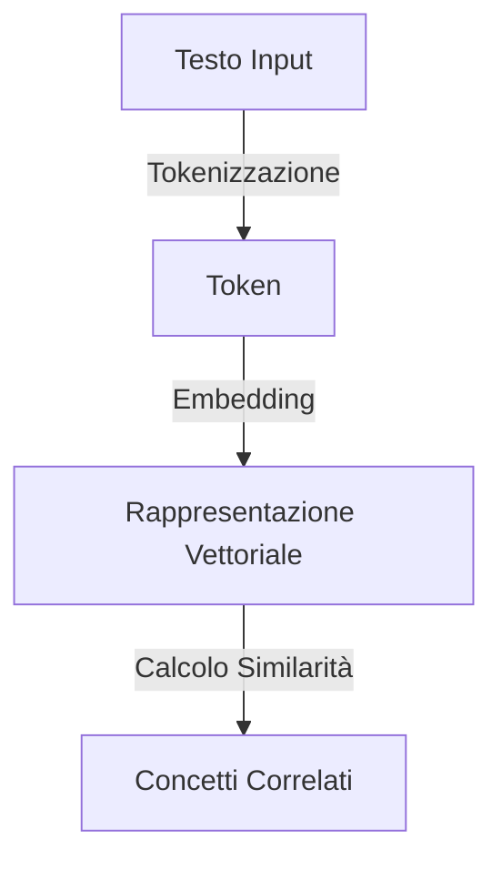
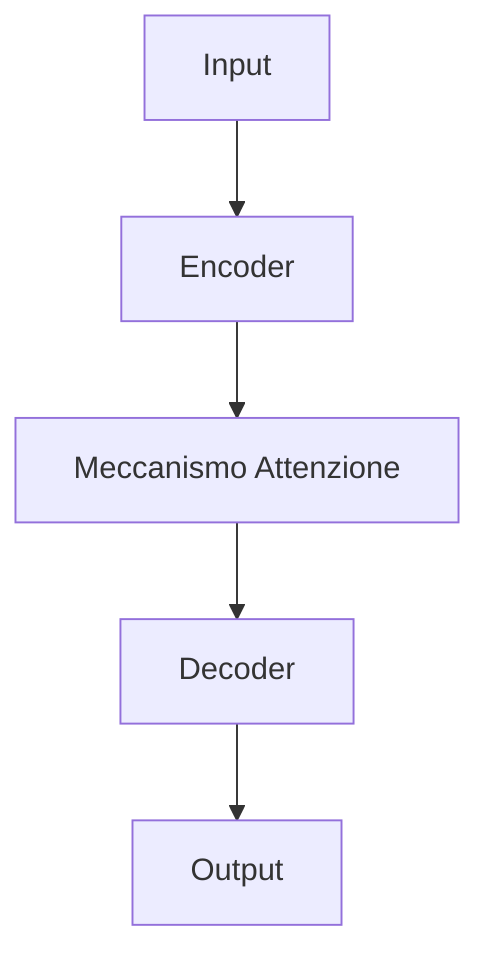
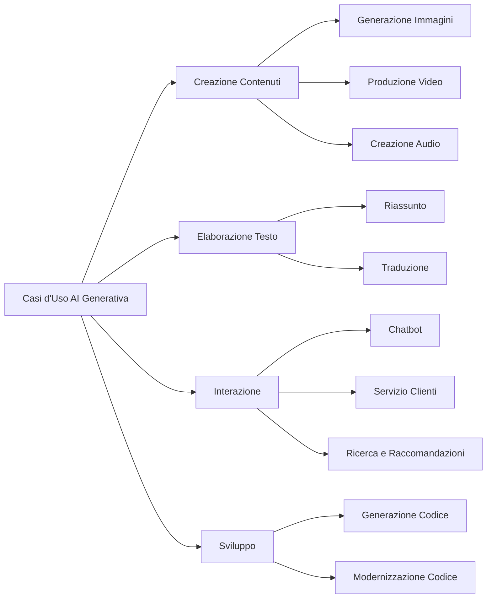
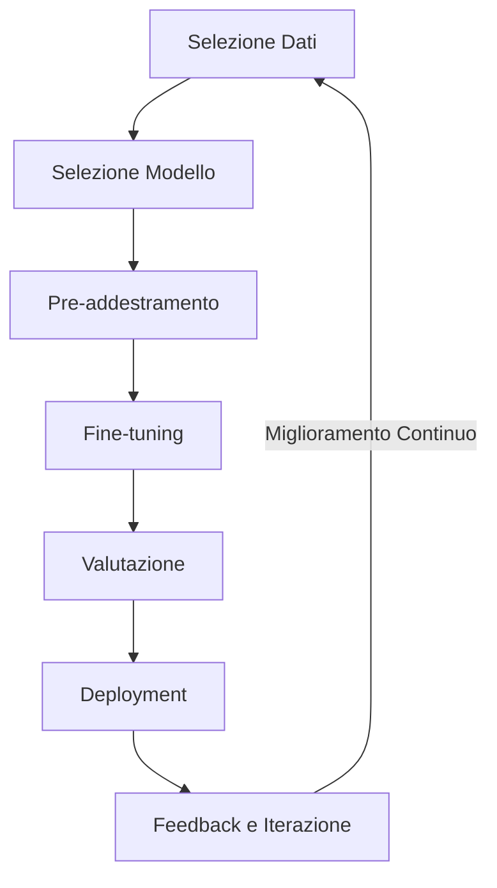

## 2.1 Concetti base dell'AI generativa

L'AI generativa trasforma il modo in cui le aziende risolvono problemi, favoriscono la creatività e prendono decisioni. Questa potente tecnologia crea nuovo contenuto, comprende relazioni complesse e automatizza compiti che una volta richiedevano sforzo umano significativo. Comprendere questi fondamenti è essenziale per chiunque sostenga l'esame AWS Certified AI Practitioner e per professionisti che cercano di sfruttare l'AI nelle loro organizzazioni.

Questo sottocapitolo esplora i concetti core dell'AI generativa, applicazioni pratiche e il ciclo di vita dei foundation model. Che tu stia valutando soluzioni AI o pianificando implementazioni, queste intuizioni ti aiuteranno a identificare opportunità dove l'AI generativa può affrontare sfide aziendali e creare valore.

### Comprendere i concetti fondamentali dell'AI generativa

I sistemi AI generativi combinano diverse tecnologie chiave per creare nuovo contenuto e risolvere problemi complessi. Esaminiamo i componenti essenziali che alimentano questi sistemi:

1. **Token e Chunking**

I token sono i mattoni fondamentali che i modelli AI generativi elaborano. Possono essere parole, frammenti di parole o caratteri, a seconda del design del modello. Il chunking è il processo di suddivisione del testo di input in questi token gestibili.[^200]

Per esempio, la frase "AWS è una piattaforma di cloud computing" potrebbe essere tokenizzata come:
["AWS", "è", "una", "piattaforma", "di", "cloud", "comput", "ing"]. In realtà la tokenizzazione divide anche parole più lunghe in sottounità più piccole, quindi in inglese, una parola è approssimativamente 1,3 token, in cinese sono circa 2,5 token, mentre in arabo possono essere anche 4 token.

Comprendere la tokenizzazione è cruciale per aziende che lavorano con large language model (LLM) poiché influisce sulle prestazioni del modello, costi (spesso basati sul conteggio token) e capacità di gestire diverse lingue o vocabolari specializzati.

2. **Embedding e Vettori**

Gli embedding sono rappresentazioni vettoriali dense di token, parole o interi documenti. Queste rappresentazioni numeriche catturano *significati semantici*, permettendo ai modelli AI di comprendere relazioni tra diversi pezzi di testo. Per esempio, le domande "Quanti anni hai?" e "Qual è la tua età?" hanno lo stesso significato semantico, mentre non hanno parole comuni.[^201]

*Figura 2.1.1: Processo di Embedding nell'AI Generativa. Questo diagramma illustra il processo di conversione del testo di input in rappresentazioni vettoriali, che vengono poi utilizzate per trovare concetti correlati o eseguire altri compiti AI.*

In un contesto aziendale, gli embedding abilitano applicazioni potenti come la ricerca semantica, dove gli utenti possono trovare informazioni basate sul significato piuttosto che su corrispondenze esatte di parole chiave. Per esempio, un sistema di supporto clienti che usa embedding potrebbe comprendere che una query su "politica rimborsi" è correlata a "procedure di reso" anche se quelle parole esatte non vengono usate.

3. **Prompt Engineering**

Il prompt engineering è l'arte e scienza di creare prompt di input per ottenere output desiderati dai modelli AI generativi. Coinvolge la progettazione di istruzioni chiare e specifiche che guidano il modello a produrre le risposte più rilevanti e accurate.[^202]

Per professionisti del business, il prompt engineering efficace può migliorare significativamente il valore derivato dagli strumenti AI generativi. Per esempio, quando si usa Amazon Bedrock per generare copy marketing, un prompt ben strutturato potrebbe includere linee guida specifiche del brand, informazioni sul pubblico target, esempi buoni e cattivi e tono desiderato, risultando in generazione di contenuti più su misura ed efficace.[^203]

4. **LLM basati su Transformer**

I Large Language Model basati su Transformer (LLM) sono la forza trainante dietro molte applicazioni AI generative. Questi modelli usano un'architettura di rete neurale chiamata Transformer, che permette loro di elaborare e generare testo simile a quello umano con accuratezza notevole.[^204]

*Figura 2.1.2: Architettura Transformer Semplificata. Questo diagramma mostra i componenti base di un modello Transformer, evidenziando gli elementi chiave che abilitano le sue potenti capacità di comprensione e generazione linguistica.*

Gli LLM basati su Transformer hanno rivoluzionato i compiti di elaborazione del linguaggio naturale, abilitando chatbot più sofisticati, sistemi di generazione contenuti e servizi di traduzione linguistica. Per le aziende, questo significa interazioni più naturali e context-aware con i clienti, flussi di lavoro di creazione contenuti migliorati e capacità multilingue potenziate.

5. **Foundation Model**

I foundation model sono modelli AI su larga scala addestrati su vaste quantità di dati, capaci di eseguire un'ampia gamma di compiti senza addestramento specifico per compiti. Questi modelli servono come punto di partenza per molte applicazioni AI e possono essere fine-tuned per casi d'uso specifici.[^205]

Nell'ecosistema AWS, Amazon Bedrock fornisce accesso a vari foundation model da aziende AI leader, permettendo alle aziende di sfruttare questi modelli potenti senza necessità di expertise AI estensiva in-house o infrastruttura.[^206]

6. **Modelli Multi-modali**

I modelli multi-modali possono elaborare e generare contenuto attraverso diversi tipi di dati, come testo, immagini e audio. Questi modelli abilitano applicazioni AI più complete che possono comprendere e creare forme diverse di contenuto.[^207]

Per le aziende, i modelli multi-modali aprono nuove possibilità in aree come:
- Raccomandazioni prodotti migliorate combinando dati visivi e testuali
- Funzionalità di accessibilità migliorate che possono tradurre tra testo, voce e immagini
- Sistemi di moderazione contenuti più sofisticati che possono analizzare sia testo che immagini

7. **Modelli di Diffusione**

I modelli di diffusione sono una classe di modelli generativi particolarmente efficaci nei compiti di generazione immagini. Funzionano aggiungendo gradualmente rumore ai dati e poi imparando a invertire questo processo, permettendo la creazione di immagini di alta qualità e diverse.[^208]

*Figura 2.1.3: Processo Semplificato Modello di Diffusione. Questo diagramma illustra il concetto base dei modelli di diffusione, dove il rumore casuale viene gradualmente trasformato in un'immagine coerente attraverso una serie di passi di denoising.*

In un contesto aziendale, i modelli di diffusione possono essere usati per:
- Generare immagini prodotti per piattaforme e-commerce
- Creare modelli 3D realistici per applicazioni di realtà virtuale
- Produrre concept art per campagne marketing o design prodotti

Comprendere questi concetti fondamentali è cruciale per professionisti del business che cercano di sfruttare efficacemente l'AI generativa. Afferrando questi principi, sarai meglio equipaggiato per identificare applicazioni potenziali, comunicare con team tecnici e prendere decisioni informate sull'implementazione di soluzioni AI generative nella tua organizzazione.

### Identificare potenziali casi d'uso per modelli AI generativi

I modelli AI generativi creano nuove opportunità attraverso le industrie automatizzando compiti creativi, migliorando il processo decisionale e migliorando esperienze clienti. Riconoscere queste applicazioni aiuta le aziende a identificare dove l'AI può guidare più valore nel loro contesto specifico. Ecco casi d'uso chiave che dimostrano il potenziale dell'AI generativa:

1. **Generazione Immagini, Video e Audio**

L'AI generativa ha rivoluzionato la creazione di contenuti abilitando la produzione di contenuti visivi e audio di alta qualità. Alcune applicazioni chiave includono:

- **Visualizzazione Prodotti**: Le aziende e-commerce possono usare l'AI per generare immagini prodotti realistiche in vari contesti o colori, riducendo la necessità di servizi fotografici costosi.
- **Produzione Video**: L'AI può creare video animati, effetti visivi o anche scene intere, semplificando il processo di produzione video per industrie marketing e entertainment.
- **Musica e Sound Design**: I modelli generativi possono comporre musica originale o creare effetti sonori, assistendo nella creazione contenuti per giochi, film e pubblicità.

2. **Riassunto**

Gli strumenti di riassunto alimentati dall'AI possono distillare grandi volumi di testo in riassunti concisi e coerenti. Questa capacità è preziosa per:

- **Business Intelligence**: Riassumere rapidamente report di mercato, analisi competitor o feedback clienti per supportare il processo decisionale.
- **Revisione Documenti Legali**: Riassumere documenti legali lunghi per evidenziare punti chiave e risparmiare tempo per professionisti legali.
- **Aggregazione Notizie**: Creare riassunti brevi di articoli di notizie per tenere dipendenti o clienti informati su sviluppi industriali rilevanti.

3. **Chatbot e Assistenti Virtuali**

Chatbot avanzati alimentati dall'AI generativa possono impegnarsi in conversazioni più naturali e context-aware. Le applicazioni includono:

- **Supporto Clienti**: Fornire assistenza 24/7 per query comuni, riducendo il carico di lavoro sui team di supporto umani.
- **Vendite e Lead Generation**: Coinvolgere potenziali clienti, rispondere a domande sui prodotti e qualificare lead.
- **Help Desk Interni**: Assistere dipendenti con problemi IT, query HR o domande su politiche aziendali.

4. **Traduzione**

L'AI generativa ha migliorato significativamente la traduzione automatica, abilitando traduzioni linguistiche più accurate e context-aware. Questo è particolarmente utile per:

- **Comunicazione Aziendale Globale**: Facilitare comunicazione con clienti o partner internazionali.
- **Localizzazione Contenuti**: Adattare rapidamente materiali marketing, descrizioni prodotti o manuali utente per mercati diversi.
- **Interpretazione in Tempo Reale**: Fornire servizi di traduzione istantanea per conferenze o meeting internazionali.

5. **Generazione Codice**

I modelli AI possono assistere nello sviluppo software generando snippet di codice, completando codice parziale o anche creando funzioni intere. Questo può essere applicato in:

- **Sviluppo Accelerato**: Velocizzare il processo di codifica suggerendo completamenti o generando codice boilerplate.
- **Refactoring Codice**: Assistere sviluppatori nel migliorare codice esistente suggerendo ottimizzazioni o implementazioni alternative.
- **Apprendimento e Formazione**: Aiutare programmatori novizi a imparare pratiche di codifica fornendo esempi e spiegazioni.

6. **Agenti Servizio Clienti**

Agenti servizio clienti alimentati dall'AI possono gestire un'ampia gamma di interazioni clienti, offrendo:

- **Assistenza Personalizzata**: Fornire raccomandazioni prodotti o supporto su misura basato su cronologia e preferenze clienti.
- **Supporto Multilingue**: Offrire servizio clienti in multiple lingue senza necessità di staff multilingue grande.
- **Supporto Scalabile**: Gestire alti volumi di richieste clienti durante picchi senza lunghi tempi di attesa.

7. **Motori di Ricerca e Raccomandazione**

L'AI generativa può migliorare funzionalità di ricerca e sistemi di raccomandazione attraverso:

- **Ricerca Semantica**: Comprendere l'intento dietro query utenti per fornire risultati più rilevanti.
- **Raccomandazioni Personalizzate**: Generare raccomandazioni prodotti o contenuti su misura basate su comportamento e preferenze utenti.
- **Scoperta Contenuti**: Aiutare utenti a trovare informazioni o prodotti rilevanti che potrebbero non aver cercato esplicitamente.

*Figura 2.1.4: Casi d'Uso AI Generativa. Questo diagramma illustra le diverse applicazioni dell'AI generativa attraverso varie funzioni aziendali, evidenziando il potenziale per innovazione e miglioramenti di efficienza.*

Comprendendo questi casi d'uso, i professionisti del business possono identificare opportunità per sfruttare l'AI generativa nelle loro organizzazioni. Che si tratti di migliorare interazioni clienti, semplificare creazione contenuti o migliorare processi decisionali, l'AI generativa ha il potenziale di guidare valore significativo attraverso varie funzioni aziendali.

### Descrivere il ciclo di vita dei foundation model

I foundation model alimentano applicazioni AI moderne attraverso un processo strutturato di sviluppo e deployment. Dalla selezione iniziale dei dati ai miglioramenti continui, ogni fase richiede considerazione attenta per assicurare che la soluzione AI risultante soddisfi le necessità aziendali rimanendo etica ed efficace. Comprendere questo ciclo di vita aiuta le organizzazioni a pianificare risorse, impostare aspettative e massimizzare il valore dei loro investimenti AI.

1. **Selezione Dati**

Il primo passo nella creazione di un foundation model è selezionare i dati di addestramento. Questo processo coinvolge:

- **Sourcing Dati**: Identificare e raccogliere dati rilevanti e di alta qualità da varie fonti.
- **Pulizia Dati**: Rimuovere errori, inconsistenze e informazioni irrilevanti dal dataset.
- **Bilanciamento Dati**: Assicurare che il dataset rappresenti una gamma diversa di argomenti, stili e prospettive per evitare bias.

Per le aziende, la qualità e diversità dei dati di addestramento impattano direttamente le prestazioni e applicabilità del modello. Quando si usano servizi come Amazon Bedrock, è importante comprendere la natura dei dati usati per addestrare i modelli disponibili per assicurare allineamento con il vostro caso d'uso specifico.[^209]

2. **Selezione Modello**

Scegliere l'architettura di modello giusta è cruciale per il successo del progetto AI. Le considerazioni includono:

- **Dimensione Modello**: Bilanciare requisiti di prestazioni con risorse computazionali e vincoli di deployment.
- **Architettura Modello**: Selezionare tra diversi tipi di modelli (es. basati su transformer, modelli di diffusione) basandosi sull'applicazione intesa.
- **Pre-addestrato vs Personalizzato**: Decidere se usare un modello pre-addestrato o addestrare un modello personalizzato da zero.

Nell'ecosistema AWS, Amazon SageMaker fornisce una gamma di algoritmi pre-costruiti e la flessibilità di usare modelli personalizzati, permettendo alle aziende di scegliere l'approccio più adatto per le loro necessità.[^210]

3. **Pre-addestramento**

Il pre-addestramento è il processo di addestramento del foundation model su un dataset grande e diverso per sviluppare comprensione linguistica generale o capacità di risoluzione compiti. Questa fase coinvolge:

- **Risorse Computazionali**: Utilizzare infrastruttura computazionale ad alte prestazioni per elaborare vaste quantità di dati.
- **Strategie di Addestramento**: Implementare tecniche come addestramento distribuito per gestire modelli su larga scala efficientemente.
- **Tuning Iperparametri**: Ottimizzare parametri del modello per migliorare prestazioni e generalizzazione.

Per la maggior parte delle aziende, il pre-addestramento da zero è resource-intensive e spesso non necessario. Invece, sfruttare modelli pre-addestrati disponibili attraverso servizi come Amazon Bedrock può fornire un punto di partenza forte per ulteriore personalizzazione.[^211]

4. **Fine-tuning**

Il fine-tuning adatta un modello pre-addestrato a compiti o domini specifici. Questo processo include:

- **Preparazione Dati Specifici per Compito**: Raccogliere e preparare dati rilevanti all'applicazione target.
- **Transfer Learning**: Regolare i parametri del modello pre-addestrato usando i dati specifici per compito.
- **Ottimizzazione Prestazioni**: Raffinare iterativamente il modello per migliorare le sue prestazioni sul compito target.

Il fine-tuning permette alle aziende di sfruttare il potere dei foundation model mentre li adattano a necessità industriali specifiche o dati aziendali. Amazon SageMaker fornisce strumenti e workflow per semplificare il processo di fine-tuning.[^212]

5. **Valutazione**

La valutazione rigorosa assicura che il modello soddisfi standard di prestazioni, equità e sicurezza. Aspetti chiave includono:

- **Test Benchmark**: Valutare le prestazioni del modello contro benchmark stabiliti in compiti rilevanti.
- **Rilevamento Bias**: Identificare e mitigare bias ingiusti negli output del modello.
- **Controlli Sicurezza**: Assicurare che il modello non produca contenuto dannoso o inappropriato.

La valutazione completa è cruciale per le aziende per assicurare che la soluzione AI soddisfi requisiti normativi e si allinei con valori aziendali.

6. **Deployment**

Il deployment del modello coinvolge renderlo disponibile per uso in ambienti di produzione. Le considerazioni includono:

- **Scalabilità**: Assicurare che l'infrastruttura possa gestire carichi variabili e richieste utenti.
- **Latenza**: Ottimizzare tempi di risposta per applicazioni in tempo reale.
- **Gestione Costi**: Bilanciare requisiti di prestazioni con costi operativi.

AWS fornisce varie opzioni di deployment, da soluzioni serverless come AWS Lambda a deployment basati su container con Amazon ECS o EKS, permettendo alle aziende di scegliere l'approccio più adatto per il loro caso d'uso.[^213]

7. **Feedback e Iterazione**

La fase finale coinvolge raccogliere feedback utenti e monitorare prestazioni del modello per guidare miglioramento continuo. Questo include:

- **Raccolta Feedback Utenti**: Raccogliere intuizioni da utenti finali per identificare aree di miglioramento.
- **Monitoraggio Prestazioni**: Tracciare metriche chiave per rilevare degradazione prestazioni o deriva.
- **Aggiornamenti Modello**: Aggiornare regolarmente il modello con nuovi dati o architetture migliorate.

Implementare un ciclo di feedback robusto assicura che la soluzione AI rimanga efficace e rilevante nel tempo.

*Figura 2.1.5: Ciclo di Vita Foundation Model. Questo diagramma illustra la natura ciclica del ciclo di vita dei foundation model, enfatizzando il processo continuo di miglioramento e adattamento.*

Comprendere il ciclo di vita dei foundation model è essenziale per professionisti del business coinvolti in iniziative AI. Fornisce intuizioni nelle risorse richieste, sfide potenziali e opportunità di ottimizzazione in ogni fase. Sfruttando servizi AWS come Amazon Bedrock, Amazon SageMaker e strumenti associati, le aziende possono semplificare questo ciclo di vita, riducendo tempo e risorse necessarie per sviluppare e deployare soluzioni AI efficaci.

In conclusione, padroneggiare i concetti base dell'AI generativa, identificare potenziali casi d'uso e comprendere il ciclo di vita dei foundation model sono passi cruciali per professionisti del business che cercano di sfruttare l'AI nelle loro organizzazioni. Queste intuizioni non solo ti prepareranno per l'esame AWS Certified AI Practitioner ma ti equipaggeranno anche con la conoscenza per prendere decisioni informate sull'adozione e implementazione AI nel tuo contesto aziendale.

[^200]: Understanding Tokenization in NLP. URL: <https://www.analyticsvidhya.com/blog/2020/05/what-is-tokenization-nlp/>

[^201]: Word Embeddings: Explained. URL: <https://medium.com/@manansuri/a-dummys-guide-to-word2vec-456444f3c673>

[^202]: Prompt Engineering Guide. URL: <https://www.promptingguide.ai/>

[^203]: Amazon Bedrock - Foundation Models. URL: <https://aws.amazon.com/bedrock/>

[^204]: Attention Is All You Need. URL: <https://arxiv.org/abs/1706.03762>

[^205]: Foundation Models: What They Are and Why They Matter. URL: <https://hai.stanford.edu/news/what-foundation-model-explainer-non-experts>

[^206]: Amazon Bedrock - Foundation Model Provider. URL: <https://docs.aws.amazon.com/bedrock/latest/userguide/models-supported.html>

[^207]: Multi-modal AI: The Future of Artificial Intelligence. URL: <https://www.v7labs.com/blog/chatgpt-with-vision-guide>

[^208]: Understanding Diffusion Models: A Unified Perspective. URL: <https://arxiv.org/abs/2208.11970>

[^209]: Amazon Bedrock - Responsible AI. URL: <https://aws.amazon.com/ai/responsible-ai/>

[^210]: Amazon SageMaker - Built-in Algorithms. URL: <https://docs.aws.amazon.com/sagemaker/latest/dg/algos.html>

[^211]: Amazon Bedrock - Getting Started. URL: <https://docs.aws.amazon.com/bedrock/latest/userguide/getting-started.html>

[^212]: Amazon SageMaker - Fine-tuning a Pre-trained Model. URL: <https://docs.aws.amazon.com/sagemaker/latest/dg/jumpstart-fine-tune.html>

[^213]: AWS AI Services - Deployment Options. URL: <https://aws.amazon.com/machine-learning/ai-services/>