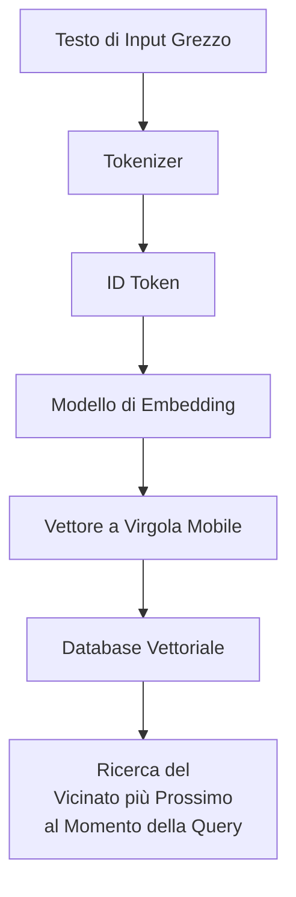
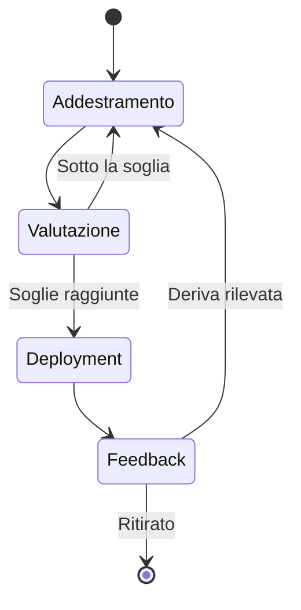
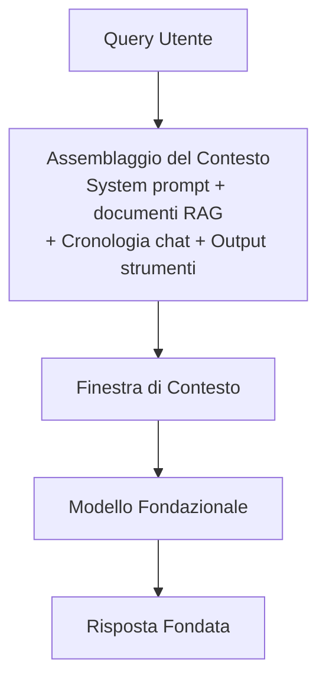
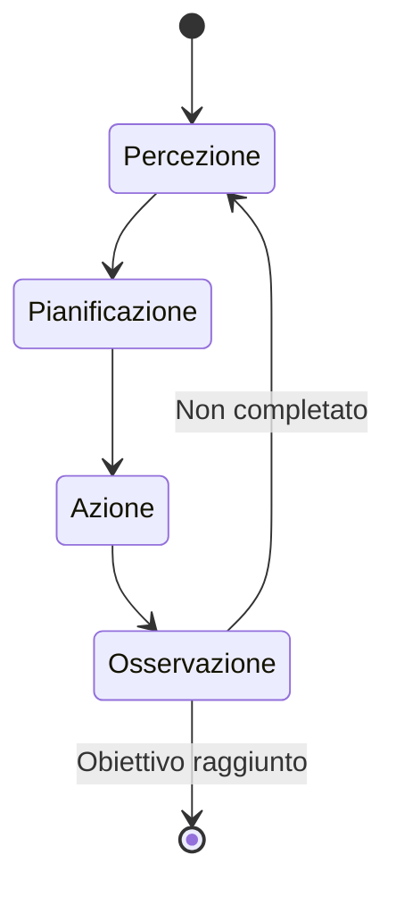
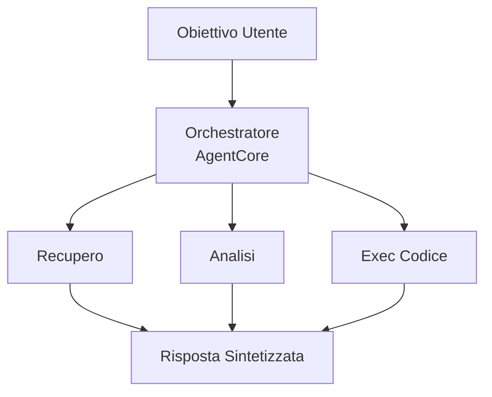

## Task Statement 2.1: Spiegare i concetti fondamentali dell'IA generativa (GenAI)

L'IA generativa produce nuovi contenuti piuttosto che prevedere un'etichetta o classificare un input. Questa distinzione influenza tutto: le architetture di modello utilizzate per costruire questi sistemi, il modo in cui vengono fatturati, le modalità di fallimento che mostrano e la nuova disciplina della context engineering che determina quali informazioni il modello vede prima di rispondere. Questo task statement copre sei aree obiettivo, tre delle quali sono nuove nella guida all'esame v1.1 e riflettono la velocità con cui questa tecnologia si è spostata dalla ricerca ai deployment in produzione.[^201001]

L'introduzione al dominio ha stabilito che l'IA generativa ha un peso del 24% nell'esame e che il suo profilo di costo e di fallimento differisce sostanzialmente dal machine learning classico. Questo task statement fonda tali affermazioni nella meccanica sottostante. Quando avrete terminato, sarete in grado di spiegare cos'è un token e perché il conteggio dei token di un prompt influenza direttamente il costo, descrivere come un FM passa dal testo grezzo a un servizio distribuito, spiegare cosa significa context engineering e come si relaziona alla prompt engineering, e articolare i pattern che i sistemi multi-agente utilizzano quando devono coordinarsi tra più componenti di IA.

### 2.1.1 Concetti fondamentali dell'IA generativa

I modelli di IA generativa condividono un insieme fondamentale di astrazioni che compaiono in tutta la documentazione AWS, nelle pagine dei prezzi dei fornitori e nelle revisioni della progettazione. Comprendere queste astrazioni è il prerequisito per tutto il resto del Dominio 2.

**La tokenizzazione** è il primo passo nell'elaborazione del testo con un modello linguistico. Un *token* è la più piccola unità di testo su cui opera il modello. Nella maggior parte del testo in inglese, un token corrisponde approssimativamente a tre o quattro caratteri, quindi la parola "tokenization" diventa due o tre token a seconda del tokenizer, mentre la parola "cat" è un token. Numeri, punteggiatura e caratteri non inglesi spesso producono più token per parola rispetto alla prosa standard in inglese.[^201002] Il conteggio totale dei token per una richiesta è la somma dei token di input (il testo inviato) più i token di output (il testo generato dal modello in risposta). Entrambi i conteggi appaiono nella fattura.

Il **chunking** è il processo di suddivisione di un documento di grandi dimensioni in segmenti più piccoli prima dell'embedding o del recupero. Un PDF di 50 pagine non può entrare nella finestra di contesto di un modello come un singolo blocco, quindi viene diviso in chunk sovrapposti di poche centinaia di token ciascuno. La dimensione del chunk e la percentuale di sovrapposizione sono parametri regolabili che influenzano l'accuratezza del recupero: chunk troppo piccoli perdono il contesto circostante, mentre chunk troppo grandi sprecano il budget di token quando vengono inseriti in un prompt.[^201003] Il chunking è un passo di preparazione, non una capacità del modello, e viene eseguito al momento della costruzione dell'indice piuttosto che al momento dell'inferenza.

Gli *embedding* sono rappresentazioni numeriche di testo (o immagini, o audio) che codificano il significato semantico come vettori in uno spazio ad alta dimensionalità. Due testi con significati simili avranno vettori di embedding geometricamente vicini tra loro, il che rende possibile la ricerca per similarità in una raccolta di documenti. **Amazon Bedrock** espone modelli di embedding come Amazon Titan Embeddings e Cohere Embed che accettano testo e restituiscono un vettore a virgola mobile.[^201004] Questi vettori vengono poi memorizzati in un database vettoriale, un archivio dati specializzato ottimizzato per le ricerche del vicinato più prossimo. I database vettoriali comuni disponibili su AWS includono **Amazon OpenSearch Service** con il plugin k-NN, **Amazon Aurora** e **Amazon RDS for PostgreSQL** con l'estensione pgvector, e **Amazon Neptune Analytics** con la ricerca vettoriale.[^201005]

*Figura 2.1.1: Pipeline di tokenizzazione ed embedding. Il testo viene prima convertito in ID token dal tokenizer, poi mappato a un vettore ad alta dimensionalità dal modello di embedding, e infine memorizzato in un database vettoriale per il recupero per similarità.*

La **prompt engineering** è la pratica di costruire gli input testuali inviati a un modello per migliorare la qualità, l'accuratezza o il formato dei suoi output. Un prompt ben progettato può includere un'istruzione, un contesto, esempi e un formato di output esplicito. Il Task Statement 3.2 copre le tecniche specifiche di prompt engineering in dettaglio; a questo punto il punto chiave è che la prompt engineering è la leva più immediata che un professionista ha sul comportamento del modello senza modificare il modello stesso.[^201006]

I **modelli linguistici di grandi dimensioni (LLM) basati su transformer** sono l'architettura dominante per i compiti linguistici moderni. L'architettura *transformer*, introdotta nel 2017, utilizza un meccanismo chiamato *self-attention* per pesare la rilevanza di ogni token in una sequenza rispetto a ogni altro token quando produce ogni token di output.[^201007] Il self-attention è ciò che consente a un transformer di mantenere dipendenze a lungo raggio nel testo, come sapere che il pronome "esso" si riferisce a un sostantivo introdotto tre frasi prima. La matematica dell'attenzione non viene testata nell'esame AIF-C01, ma il concetto è importante per capire perché i contesti più lunghi sono computazionalmente più costosi e perché la finestra di contesto ha una dimensione finita.

I **modelli fondazionali (FM)** sono modelli di grandi dimensioni addestrati su dataset ampi e generici su scala enorme.[^201008] Un FM non viene addestrato per un compito specifico; al contrario, apprende rappresentazioni generali del linguaggio (o immagini, o codice) che possono poi essere adattate a molti compiti a valle tramite prompting, recupero o fine-tuning. Esempi disponibili tramite Amazon Bedrock includono Anthropic Claude, Meta Llama, Amazon Nova e i modelli Mistral AI, tra gli altri.[^201009]

I **modelli multi-modali** accettano e producono più di un tipo di dati. Un FM multi-modale potrebbe accettare un'immagine più una domanda testuale e restituire una risposta testuale, oppure accettare testo e restituire sia testo che un'immagine. All'interno della famiglia Amazon Nova su Amazon Bedrock, Lite, Pro e Premier elaborano testo, immagini, video e documenti; Nova Micro è solo testo ed è l'opzione a minor costo per i casi d'uso di puro testo.[^201010]

I **modelli di diffusione** generano output imparando a invertire un processo di aggiunta di rumore. Durante l'addestramento, il modello vede i dati con quantità crescenti di rumore casuale aggiunto, e impara a prevedere e rimuovere quel rumore passo dopo passo. Al momento dell'inferenza, parte da rumore puro e lo denoise iterativamente in un'immagine coerente, una clip audio o altro artefatto.[^201011] I modelli di diffusione sono alla base delle capacità di generazione di immagini. Amazon Bedrock include Stable Diffusion di Stability AI come modello di generazione di immagini in questa categoria.[^201012]

### 2.1.2 Potenziali casi d'uso per i modelli GenAI

L'IA generativa copre una gamma più ampia di compiti aziendali rispetto alla maggior parte dei sistemi ML classici perché i modelli sottostanti si generalizzano tra i domini. La domanda pratica non è se un modello generativo potrebbe essere utile per un dato compito, ma se rappresenta il giusto compromesso economico e di accuratezza per quel caso specifico.

*Tabella 2.1.1: Casi d'uso comuni dell'IA generativa e scenari aziendali rappresentativi*

| Caso d'uso | Cosa fa il modello | Scenario aziendale rappresentativo |
|---|---|---|
| Generazione di immagini | Produce nuove immagini da prompt testuali o di immagini | I team di marketing generano immagini di prodotto senza un servizio fotografico |
| Generazione di video | Genera brevi clip video da descrizioni testuali | Le aziende media producono bozze di video esplicativi per la revisione |
| Generazione audio | Sintetizza parlato o musica | Le piattaforme di e-learning generano narrazioni per aggiornamenti ai corsi durante la notte |
| Riepilogo | Condensa documenti lunghi in versioni più brevi | I dipartimenti legali riassumono i contratti per evidenziare gli obblighi chiave |
| Assistenti IA | Risponde a domande, redige contenuti, spiega concetti | Bot di knowledge base interna rispondono alle domande HR dei dipendenti |
| Traduzione | Converte testo da una lingua a un'altra | I retailer globali localizzano le descrizioni dei prodotti in 20 lingue |
| Generazione di codice | Scrive, revisiona e spiega il codice sorgente | Gli sviluppatori accelerano l'implementazione di funzionalità di routine e la scrittura di test unitari |
| Agenti del servizio clienti | Gestisce le richieste dei clienti tramite conversazione | I contact center deflettono le domande comuni senza il coinvolgimento di agenti umani |
| Ricerca | Restituisce risultati semanticamente rilevanti piuttosto che corrispondenze per parole chiave | I portali documentali aziendali trovano la pagina della policy corretta anche quando la query usa una formulazione diversa |
| Motori di raccomandazione | Suggerisce elementi basandosi sul comportamento dell'utente o sulle preferenze dichiarate | I servizi di streaming raccomandano contenuti utilizzando segnali semantici e collaborativi ibridi |

Ogni tipo di caso d'uso pone richieste diverse al modello sottostante. Riepilogo e traduzione sono principalmente compiti linguistici che favoriscono gli LLM. La generazione di immagini e video richiede modelli di diffusione o altri modelli visivi generativi. La generazione di codice beneficia di modelli specificamente ottimizzati su linguaggi di programmazione. Gli agenti del servizio clienti beneficiano di bassa latenza, forte capacità di seguire le istruzioni e la capacità di chiamare strumenti esterni, il che si collega direttamente ai pattern agentivi trattati nell'obiettivo 2.1.6. Ricerca e raccomandazione utilizzano le capacità di embedding e similarità vettoriale dell'obiettivo 2.1.1, tipicamente combinandole con un pattern di generazione aumentata dal recupero (RAG) trattato nel Task Statement 3.1.

### 2.1.3 Il ciclo di vita degli FM

Un modello fondazionale non passa direttamente dai dati di addestramento alla produzione. Attraversa un ciclo di vita definito che ha più fasi rispetto al ciclo di vita ML classico descritto nel Task Statement 1.3. La pipeline classica si concentra su un dataset etichettato, un modello e un endpoint di previsione. Il ciclo di vita degli FM inizia molto prima, con decisioni su quali dati grezzi usare per il pre-addestramento, e aggiunge cicli di feedback post-deployment che perfezionano continuamente il comportamento del modello.

*Figura 2.1.2: Ciclo di vita del modello fondazionale. Il percorso non è strettamente lineare: i fallimenti di valutazione ritornano al fine-tuning, e il feedback di produzione può innescare ulteriori cicli di adattamento.*

Le sette fasi del ciclo di vita degli FM sono:

- **Selezione dei dati**: Curazione del corpus di addestramento. Per il pre-addestramento, questo è massiccio e ampio (crawl del web, libri, repository di codice). Per il fine-tuning, è specifico del dominio e molto più piccolo. La qualità dei dati in questa fase determina direttamente il comportamento del modello, inclusi i suoi bias.[^201013]
- **Selezione del modello**: Scelta di un'architettura (variante transformer, modello di diffusione, multi-modale), dimensione in parametri, e se addestrare da zero o partire da un FM esistente. La maggior parte dei deployment aziendali salta completamente il pre-addestramento da zero e sceglie tra gli FM disponibili tramite un servizio come Amazon Bedrock.[^201014]
- **Pre-addestramento**: Apprendimento di rappresentazioni generali dal dataset ampio utilizzando grandi quantità di calcolo (cluster GPU in esecuzione per settimane o mesi). Questa è la fase che produce i pesi base degli FM. Il pre-addestramento è così costoso che virtualmente nessuna azienda al di fuori degli hyperscaler lo esegue.[^201015]
- **Fine-tuning**: Aggiornamento dei pesi base degli FM su un dataset più piccolo, specifico per il compito o il dominio. Il fine-tuning adatta il comportamento del modello senza ripetere il costo completo del pre-addestramento. Amazon Bedrock supporta job di fine-tuning personalizzati, e Amazon SageMaker AI supporta sia il fine-tuning che tecniche di fine-tuning a efficienza parametrica più avanzate.[^201016]
- **Valutazione**: Misurazione della qualità del modello su dati di test trattenuti. Per i modelli generativi, la valutazione include metriche automatiche come ROUGE e BLEU per il testo, più la valutazione umana e, sempre più spesso, metodi LLM-as-a-judge. Il Task Statement 3.4 copre la valutazione in profondità.
- **Deployment**: Distribuzione del modello tramite un endpoint API in cui le applicazioni possono inviare prompt e ricevere completamenti. Amazon Bedrock gestisce l'infrastruttura sottostante per i modelli supportati, mentre Amazon SageMaker AI dà ai team il controllo diretto sulla configurazione dell'endpoint.[^201017]
- **Feedback**: Raccolta di segnali dal traffico di produzione (latenza, accuratezza, soddisfazione degli utenti, tassi di errore) e utilizzo per rilevare la deriva o per costruire nuovi dataset di fine-tuning. Questo chiude il ciclo e distingue il ciclo di vita degli FM da un'esecuzione di addestramento unica.

La distinzione chiave rispetto al ciclo di vita ML classico del Task Statement 1.3 è la fase di pre-addestramento. Le pipeline ML classiche iniziano con un dataset etichettato specifico per il problema. Il ciclo di vita degli FM inizia con l'apprendimento auto-supervisionato su testo non etichettato su una scala che crea capacità generali, e solo successivamente si restringe a compiti specifici tramite fine-tuning o prompting. I professionisti aziendali generalmente entrano nel ciclo di vita degli FM nella fase di fine-tuning o deployment, non nel pre-addestramento.

### 2.1.4 Modello di pricing basato su token

L'inferenza ML classica viene tipicamente prezzata per previsione o per ora di endpoint. Il pricing basato su token è diverso: si paga per il numero di token consumati, sia in entrata che in uscita, piuttosto che per la risorsa di calcolo che ha eseguito la richiesta. Comprendere l'economia dei token è direttamente rilevante per la pianificazione del budget di qualsiasi progetto di IA generativa.

I **token di input** sono i token nel prompt inviato al modello: il system prompt, i documenti recuperati, la cronologia della conversazione, gli output degli strumenti e il messaggio dell'utente. I **token di output** sono i token che il modello genera in risposta. Amazon Bedrock, come la maggior parte dei provider cloud di FM, addebita separatamente per i token di input e di output, e i token di output vengono prezzati più in alto perché generare un token è computazionalmente più costoso che elaborare un token di input.[^201018]

*Tabella 2.1.2: Struttura dei prezzi basata su token e leve di costo*

| Fattore di pricing | Descrizione | Effetto sul costo |
|---|---|---|
| Prezzo token di input | Costo per 1.000 token di input (varia per modello) | Direttamente proporzionale alla lunghezza del prompt |
| Prezzo token di output | Costo per 1.000 token di output, tipicamente da 3 a 5 volte il prezzo di input | Direttamente proporzionale alla lunghezza della risposta |
| Caching del prompt | Riutilizzo di prefissi di prompt precedentemente elaborati | Riduce il costo effettivo di input per contesti ripetuti |
| Inferenza in batch | Elaborazione asincrona di molte richieste insieme | Sconto tipico del 50% rispetto al pricing on-demand |
| Throughput provisionato | Capacità riservata per carichi di lavoro ad alto volume e sostenuto | Costo prevedibile ma richiede un impegno di volume |

Per rendere questo concreto, considerate uno scenario di servizio clienti. Una singola interazione potrebbe includere un system prompt da 500 token, un documento recuperato da 1.000 token, un messaggio utente da 50 token e una risposta del modello da 200 token. Questi sono 1.550 token di input e 200 token di output. Per un modello prezzato a $0,003 per 1.000 token di input e $0,015 per 1.000 token di output, il costo per interazione è di circa $0,0077 ($0,00465 di input + $0,003 di output). A 100.000 interazioni al mese, il conto è di circa $770 per quella singola chiamata al modello per interazione. Se il flusso di lavoro chiama il modello più volte per interazione (per il routing, per il re-ranking del recupero, per la generazione della risposta), questi numeri si moltiplicano di conseguenza.[^201019]

Il **caching del prompt** consente al provider del modello di memorizzare la rappresentazione elaborata di un prefisso di prompt ripetuto in modo che le richieste successive che condividono quel prefisso non lo rielaborino da zero. Quando lo stesso system prompt viene inviato con ogni richiesta, il caching di quel prefisso può ridurre il costo effettivo di input per la parte memorizzata nella cache dall'80 al 90 percento.[^201020] Amazon Bedrock supporta il caching del prompt per i modelli applicabili.

L'**inferenza in batch** in Amazon Bedrock elabora le richieste in modo asincrono piuttosto che in tempo reale. Invece di inviare una richiesta e aspettare la risposta, si invia un batch di richieste e si recuperano i risultati dopo che l'elaborazione è completata. Il compromesso è la latenza: le risposte in batch arrivano minuti o ore dopo l'invio piuttosto che secondi. Per i casi d'uso che tollerano la latenza (code di riepilogo di documenti, job di traduzione notturni, generazione di contenuti in massa), l'inferenza in batch è una leva di costo immediata.[^201021]

L'implicazione pratica per la pianificazione aziendale è che i costi dei token si moltiplicano con le decisioni architetturali. Un pattern RAG che recupera tre documenti da 500 token per query aggiunge 1.500 token di input a ogni richiesta. Un flusso di lavoro agentivo che effettua cinque chiamate al modello per richiesta utente moltiplica il costo per richiesta di circa cinque volte. Progettare per l'efficienza dei token, tramite prompt più brevi, caching del prompt, elaborazione in batch dove tollerabile e ridimensionamento del conteggio dei chunk di recupero, è importante quanto scegliere il modello giusto.

### 2.1.5 Context engineering nelle applicazioni FM

La prompt engineering si concentra sulla formulazione e la struttura di un singolo prompt: come formulare un'istruzione, come formattare un esempio, quanti esempi includere. La **context engineering** è una disciplina più ampia che chiede quali informazioni dovrebbero entrare nella finestra di contesto del modello, in quale forma e in quale ordine.[^201022] Un modello non vede il mondo; vede solo ciò che entra nella sua finestra di contesto al momento dell'inferenza. La context engineering è la pratica di curare deliberatamente quel contenuto.

La finestra di contesto è il numero massimo di token che un modello può elaborare in un singolo passaggio in avanti, inclusi sia input che output. Le finestre di contesto dei modelli su Amazon Bedrock variano da decine di migliaia a più di un milione di token a seconda della famiglia di modelli (ad esempio, alcune varianti di Anthropic Claude raggiungono un milione di token con l'intestazione beta 1M-context, e Amazon Nova Premier e Meta Llama 4 Maverick offrono finestre da un milione di token su Bedrock).[^201023] Una finestra di contesto grande non significa che un'applicazione debba riempirla completamente: contesti più lunghi aumentano latenza e costo, e i modelli possono esibire il comportamento *lost-in-the-middle* in cui le informazioni rilevanti sepolte nel mezzo di un contesto lungo ricevono meno attenzione rispetto alle informazioni all'inizio o alla fine.[^201024]

*Figura 2.1.3: Assemblaggio del contesto per applicazioni FM. La context engineering governa cosa entra in ogni slot della finestra di contesto e come viene ordinato l'input assemblato prima che il modello lo elabori.*

I componenti che tipicamente compongono un contesto assemblato includono:

- **System prompt**: L'istruzione permanente che definisce il ruolo del modello, il tono, il formato di output e i vincoli. Il system prompt è solitamente costante tra tutte le richieste in un'applicazione, il che lo rende un buon candidato per il caching del prompt.
- **Documenti recuperati**: Output di una pipeline RAG. Il passo di recupero seleziona i chunk semanticamente più rilevanti da un database vettoriale, ma la context engineering determina quanti chunk includere, come classificarli e se riassumere i chunk prima di includerli per risparmiare token.
- **Cronologia della conversazione**: Turni precedenti di una conversazione multi-turno. Poiché le finestre di contesto sono finite, una lunga conversazione supera eventualmente la finestra. Le strategie di context engineering per la cronologia includono il troncamento (eliminazione dei turni più vecchi), il riepilogo (sostituzione dei turni vecchi con un riepilogo progressivo) e la conservazione selettiva (mantenimento solo dei turni contrassegnati come di alto valore).
- **Output degli strumenti**: Quando un agente chiama una funzione esterna (una query di database, una ricerca web, una chiamata API), il risultato viene iniettato nel contesto affinché il modello possa ragionarci sopra. Il formato degli output degli strumenti influenza l'affidabilità con cui il modello li interpreta.
- **Dati strutturati**: Tabelle, record JSON o coppie chiave-valore che forniscono ancoraggio fattuale. I dati strutturati sono più efficienti in termini di token rispetto alle descrizioni in prosa degli stessi fatti quando il modello deve fare riferimento a valori specifici.

La distinzione dalla prompt engineering è l'ambito. La prompt engineering risponde a "come devo formulare questa istruzione?" La context engineering risponde a "cosa dovrebbe essere nella finestra di contesto, quanto di esso, in quale forma e in quale sequenza?" Entrambe le discipline sono rilevanti per le applicazioni FM in produzione, ma la context engineering è quella che scala con la complessità dell'applicazione. Un semplice chatbot può essere ottimizzato con la prompt engineering una volta sola. Un agente complesso che coordina recuperi, chiamate agli strumenti e cronologia multi-turno richiede una context engineering continua per restare entro i budget di token e mantenere la qualità delle risposte.

*Tabella 2.1.3: Tecniche di context engineering e relativi compromessi*

| Tecnica | Cosa fa | Compromesso |
|---|---|---|
| Riepilogo della finestra di contesto | Comprime i vecchi turni della conversazione in un riepilogo più breve | Perde la formulazione esatta; introduce potenziale distorsione |
| Recupero selettivo | Recupera solo i top-k chunk più rilevanti piuttosto che tutti i candidati | Potrebbe perdere documenti rilevanti se il modello di recupero classifica male |
| Pre-riepilogo dei chunk | Riassume ogni documento recuperato prima di includerlo | Riduce i token per documento al costo di chiamate aggiuntive al modello |
| Caching del prompt | Memorizza rappresentazioni elaborate di prefissi ripetuti | Richiede una struttura del prompt che mantenga stabile la parte nella cache |
| Formattazione degli output degli strumenti | Converte le risposte API grezze in formati compatti e leggibili dal modello | Richiede logica di formattazione per ogni strumento nel livello applicativo |

### 2.1.6 Concetti fondamentali dell'IA agentiva

Un agente IA è un sistema in cui un FM non si limita a rispondere a un singolo prompt ma opera in un ciclo: percepisce un obiettivo o un'osservazione, pianifica un corso d'azione, esegue quell'azione (spesso chiamando uno strumento esterno), e poi osserva il risultato prima di decidere se l'obiettivo è completato.[^201025] Una singola chiamata FM produce una risposta e si ferma. Un agente funziona fino a quando non viene soddisfatta una condizione di arresto, che potrebbe essere il completamento di un compito in più fasi, l'esaurimento di un limite di turni o la determinazione che il compito è impossibile con gli strumenti disponibili.

*Figura 2.1.4: Il ciclo dell'agente. Un agente cicla tra percezione, pianificazione, azione e osservazione fino a quando non viene soddisfatta una condizione di arresto.*

Le architetture a singolo agente gestiscono molti compiti, ma i flussi di lavoro complessi spesso richiedono più agenti che operano in coordinazione. I **sistemi multi-agente** distribuiscono il lavoro tra agenti specializzati, ciascuno responsabile di un aspetto del compito complessivo.[^201026] L'esame testa la conoscenza di quattro pattern di coordinazione:

- **Pattern orchestratore/lavoratore**: Un agente orchestratore centrale riceve l'obiettivo dell'utente, lo scompone in sotto-compiti, invia ogni sotto-compito a un agente lavoratore specializzato, raccoglie i risultati e sintetizza una risposta finale. L'orchestratore non esegue il lavoro stesso; gestisce il flusso di lavoro.
- **Pattern gerarchico**: Una struttura ad albero in cui un agente di livello superiore gestisce agenti di livello intermedio, che a loro volta gestiscono agenti foglia. Questa è un'estensione del pattern orchestratore/lavoratore a più livelli di scomposizione, adatta a compiti che hanno una struttura gerarchica naturale (ad esempio, un compito di ricerca che si scompone in aree tematiche, ciascuna delle quali si scompone in recupero e analisi delle fonti).
- **Pattern sequenziale**: Gli agenti sono disposti in una pipeline in cui l'output di un agente è l'input del successivo. Questo è appropriato quando ogni passo deve completarsi prima che inizi il successivo, e quando non c'è bisogno che l'agente a valle influenzi il comportamento dell'agente a monte.
- **Pattern di dibattito**: Più agenti producono indipendentemente risposte alla stessa query, poi valutano o criticano gli output dell'altro, con un agente finale che sintetizza la risposta migliore. Questo migliora l'accuratezza su compiti in cui diversi approcci di ragionamento raggiungono conclusioni diverse.

Il **Model Context Protocol (MCP)** è un protocollo standardizzato per connettere gli agenti IA a strumenti esterni, fonti di dati e servizi.[^201027] Senza un protocollo comune, ogni integrazione di un agente con un sistema esterno richiede codice personalizzato per gestire autenticazione, formattazione delle richieste e parsing delle risposte. MCP definisce un'interfaccia client-server standard in modo che un agente possa scoprire gli strumenti disponibili, chiamarli con argomenti strutturati e ricevere risultati strutturati senza codice di integrazione specifico. AWS ha dichiarato il supporto per MCP all'interno dell'ecosistema Amazon Bedrock, e **Strands Agents**, l'SDK open-source AWS per la costruzione di applicazioni agentive, implementa l'interfaccia client MCP.[^201028]

I pattern di comunicazione multi-agente descrivono come gli agenti si scambiano messaggi. Gli agenti possono comunicare direttamente (peer-to-peer), tramite una coda di messaggi condivisa o tramite un broker centralizzato. La scelta del pattern di comunicazione influisce sull'affidabilità, sulle garanzie di ordinamento e sulla capacità di verificare cosa ha detto ciascun agente agli altri. Nei sistemi in produzione, le code di messaggi sono preferite rispetto alle chiamate dirette agente-agente perché disaccoppiano l'agente mittente dall'agente ricevente e forniscono un registro durevole di tutti i messaggi inter-agente.

*Tabella 2.1.4: Tipi di memoria nei sistemi IA agentivi*

| Tipo di memoria | Ambito | Dove memorizzata | Caso d'uso |
|---|---|---|---|
| A breve termine (di lavoro) | Sessione corrente o ciclo dell'agente | Finestra di contesto | Ragionamento sul compito corrente |
| A lungo termine (persistente) | Tra sessioni | Database esterno o archivio vettoriale | Ricordare preferenze utente, decisioni passate |
| Episodica | Eventi o interazioni passate specifiche | Archivio di record recuperabili | Richiamare cosa è successo in un'interazione precedente |
| Semantica | Conoscenza generale del mondo o del dominio | Incorporata nei pesi del modello o nell'indice RAG | Rispondere a domande fattuali |

La **gestione della memoria** è la pratica di decidere quali informazioni un agente conserva, in quale livello di memoria e per quanto tempo.[^201029] La memoria a breve termine è la finestra di contesto stessa. Quando il contesto di lavoro di un agente si avvicina al limite della finestra, lo strato di gestione della memoria deve decidere cosa comprimere, riassumere o trasferire alla memoria a lungo termine. La memoria a lungo termine utilizza tipicamente un database vettoriale (come descritto nell'obiettivo 2.1.1) in modo che l'agente possa recuperare esperienze passate rilevanti semanticamente piuttosto che scansionare un registro completo.

L'**utilizzo degli strumenti** nei sistemi agentivi si riferisce alla capacità dell'agente di chiamare funzioni esterne e incorporare i risultati nel suo ragionamento.[^201030] Uno strumento può essere una ricerca web, una query di database, una chiamata REST API, un interprete di codice o qualsiasi funzione che restituisce un risultato che l'agente può osservare. Gli strumenti sono definiti dal loro schema di input e di output; l'FM utilizza questi schemi per decidere quando chiamare uno strumento e quali argomenti passare. Questo è talvolta chiamato *function calling* nella documentazione delle API.

L'**orchestrazione del flusso di lavoro** coordina l'esecuzione di processi agentivi a più fasi, gestendo sequenziamento, recupero dagli errori e gestione dello stato tra le chiamate agli agenti.[^201031] **Amazon Bedrock AgentCore**, il più recente livello di runtime gestito per carichi di lavoro agentivi su Amazon Bedrock, gestisce questo livello di orchestrazione per le applicazioni agentive in produzione, fornendo infrastruttura di esecuzione in modo che i team non debbano costruire e gestire il proprio runtime agentivo.[^201032] Strands Agents è l'SDK open-source che si posiziona sopra il runtime e offre agli sviluppatori un modo basato su Python per definire agenti, strumenti e comportamenti di memoria, con supporto client MCP integrato.[^201033]

*Figura 2.1.5: Pattern orchestratore/lavoratore multi-agente su Amazon Bedrock AgentCore. L'orchestratore gestisce gli agenti lavoratori e assembla i loro output in una risposta finale.*

La rilevanza aziendale dell'IA agentiva è che sblocca casi d'uso che il prompting singolo non riesce a gestire: compiti che richiedono molteplici ricerche tramite strumenti, compiti che devono adattarsi a metà esecuzione in base a risultati intermedi e compiti che coinvolgono la coordinazione tra sotto-sistemi specializzati. Allo stesso tempo, i sistemi agentivi sono più complessi da progettare, più costosi da eseguire (ogni iterazione del ciclo dell'agente consuma token) e più difficili da verificare rispetto alle singole chiamate. Il Task Statement 3.1 rivisita gli agenti IA dalla prospettiva della progettazione, coprendo quando usare gli agenti rispetto a pattern più semplici.

---

Questa sezione ha costruito il vocabolario concettuale per tutto il Dominio 2. Ora potete definire le primitive fondamentali dell'IA generativa (token, embedding, vettori, attenzione, modelli fondazionali, modelli di diffusione), spiegare il ciclo di vita degli FM e come differisce dalla pipeline ML classica, calcolare costi approssimativi basati su token per una data architettura, descrivere cosa significa la context engineering e come differisce dalla prompt engineering, e articolare i principali pattern per i sistemi multi-agente e il ruolo di MCP. Il Task Statement 2.2 fa il passo successivo: date queste capacità, quali sono i reali limiti dell'IA generativa e come dovrebbe un'azienda valutare tali limiti quando seleziona una soluzione generativa?

---

## Domande di autoverifica

**Domanda 1**

Un'azienda sta costruendo un sistema di domande e risposte su documenti che suddivide in chunk un PDF di 200 pagine, incorpora i chunk e li memorizza in un database vettoriale. Quando un utente pone una domanda, il sistema recupera i tre chunk più rilevanti e li include nel prompt a un LLM. Uno sviluppatore riferisce che il modello a volte ignora le informazioni rilevanti che compaiono nel mezzo di chunk recuperati lunghi.

Quale delle seguenti opzioni spiega MEGLIO questo comportamento e indica la mitigazione PIU' appropriata?

A. Il tokenizer del modello sta scartando i token del mezzo del documento prima che il modello di embedding li elabori. Ridurre la dimensione del chunk a meno di 50 token in modo che il tokenizer conservi tutto il contenuto.

B. I modelli linguistici di grandi dimensioni possono esibire il comportamento lost-in-the-middle, in cui il contenuto nel mezzo di un contesto lungo riceve meno attenzione rispetto al contenuto all'inizio o alla fine. Chunk più brevi o il riepilogo dei chunk prima dell'inclusione possono ridurre questo effetto.

C. Il database vettoriale sta eseguendo una ricerca per parole chiave piuttosto che semantica, quindi sta recuperando i chunk in base alla frequenza delle parole piuttosto che al significato. Passare a un indice di ricerca full-text.

D. I modelli di diffusione non sono progettati per compiti di recupero di testo. Sostituire l'LLM con un modello di diffusione addestrato sulla comprensione dei documenti.

*Spiegazione.* L'opzione B è corretta. Il fenomeno lost-in-the-middle è un comportamento documentato degli LLM basati su transformer in cui le informazioni posizionate nel mezzo di una lunga finestra di contesto ricevono proporzionalmente meno peso di attenzione rispetto alle informazioni all'inizio o alla fine del contesto.[^201034] Questo è un problema di context engineering, non un problema di tokenizer (A non è corretta), non un problema di ricerca nel database vettoriale (C non è corretta) e non una questione di selezione della classe di modello (D non è corretta e i modelli di diffusione non eseguono il recupero di testo). Le mitigazioni includono la riduzione della dimensione del chunk in modo che ogni chunk abbia un ambito più stretto, il riepilogo dei chunk prima di includerli per ridurre il conteggio dei token e l'ordinamento dei chunk più rilevanti all'inizio del prompt piuttosto che nel mezzo. Queste sono tutte decisioni di context engineering: governano cosa entra nella finestra di contesto, in quale forma e in quale ordine, che è esattamente la disciplina descritta nell'obiettivo 2.1.5.[^201035]

---

**Domanda 2**

Un'organizzazione sta valutando il costo di eseguire un'applicazione di IA generativa per il servizio clienti su Amazon Bedrock. Ogni interazione con il cliente include un system prompt da 600 token, una media di 900 token di documenti recuperati, un messaggio utente da 100 token e una risposta del modello da 300 token. L'applicazione gestisce 500.000 interazioni al mese.

Quale fattore di pricing avrebbe l'impatto PIU' significativo se l'organizzazione vuole ridurre i costi mensili senza cambiare il modello o la qualità delle risposte?

A. Passare dal throughput provisionato al pricing on-demand per tutte le richieste.

B. Applicare il caching del prompt al system prompt, che è identico per ogni richiesta.

C. Aumentare il numero di chunk di documenti recuperati da 3 a 6 per interazione.

D. Ridurre il limite massimo di token di output da 300 a 100 token.

*Spiegazione.* L'opzione B è corretta. In ogni interazione, il system prompt è di 600 token ed è identico per tutte le 500.000 richieste. Il caching del prompt consente al provider di memorizzare la rappresentazione elaborata di quel prefisso ripetuto e addebitare una tariffa sostanzialmente inferiore (tipicamente dall'80 al 90 percento in meno) per i cache hit su quei 600 token.[^201036] A 500.000 richieste, i risparmi sulla parte memorizzata nella cache sono significativi. L'opzione A non è corretta perché il throughput provisionato fornisce uno sconto per capacità riservata rispetto all'on-demand; passare dal provisionato all'on-demand aumenterebbe il costo, non lo ridurrebbe. L'opzione C non è corretta perché aggiungere più chunk recuperati aumenta il conteggio dei token di input per richiesta, il che aumenta il costo. L'opzione D potrebbe ridurre i costi dei token di output, ma la domanda specifica nessun cambiamento alla qualità della risposta; troncare arbitrariamente l'output ridurrebbe probabilmente la qualità. Il caching del prompt si rivolge alla porzione a più alta ripetizione del prompt e riduce il costo senza cambiare il contenuto inviato al modello.[^201037]

---

**Domanda 3**

Un analista aziendale sta esaminando una proposta per un sistema IA agentivo che gestirà le richieste di rimborso dei clienti. Il sistema proposto utilizza un agente orchestratore che riceve la richiesta di rimborso, chiama un agente lavoratore per cercare la cronologia degli ordini, chiama un secondo agente lavoratore per verificare la politica di rimborso e poi genera una decisione. Ogni passo comporta una chiamata separata al modello.

Quale delle seguenti è la considerazione PRIMARIA che l'analista dovrebbe sollevare riguardo al costo di questa architettura rispetto a una singola chiamata LLM per lo stesso compito?

A. I sistemi multi-agente non sono supportati da Amazon Bedrock AgentCore, quindi il team dovrà costruire un livello di orchestrazione personalizzato che aggiunge costi di ingegneria.

B. Il ciclo dell'agente effettua più chiamate al modello per richiesta utente, e ogni chiamata consuma token di input e di output. Il costo totale dei token per richiesta sarà più alto rispetto a una singola chiamata che include tutto il contesto in un unico prompt.

C. I sistemi agentivi utilizzano internamente modelli di diffusione, che hanno un pricing per token più alto rispetto agli LLM basati su transformer su Amazon Bedrock.

D. Il pattern orchestratore/lavoratore richiede che tutti gli agenti lavoratori utilizzino lo stesso modello fondazionale, il che elimina la possibilità di usare un modello più economico per i passi di ricerca.

*Spiegazione.* L'opzione B è corretta. Ogni chiamata al modello in un ciclo agentivo comporta costi di token di input e di output. Un agente orchestratore che effettua tre chiamate al modello (una per scomporre il compito, una per chiamare ogni lavoratore e una per sintetizzare il risultato) consumerà molte più volte più token per richiesta utente rispetto a un prompt singolo che include tutto il contesto rilevante. Questo è il compromesso di costo centrale per le architetture agentive ed è direttamente affrontato nell'obiettivo 2.1.4 sul pricing basato su token e nell'obiettivo 2.1.6 sull'IA agentiva.[^201038] L'opzione A non è corretta perché Amazon Bedrock AgentCore Runtime è specificamente progettato per supportare l'orchestrazione multi-agente. L'opzione C non è corretta perché i sistemi agentivi utilizzano LLM (modelli basati su transformer) per il ragionamento, non modelli di diffusione; i modelli di diffusione generano immagini e altri media, non i passi di ragionamento in un ciclo agentivo. L'opzione D non è corretta perché il pattern orchestratore/lavoratore supporta modelli eterogenei tra i lavoratori; l'utilizzo di modelli più economici e veloci per i passi di ricerca è una tecnica comune di ottimizzazione dei costi.[^201039]

---

**Domanda 4**

Un team di sviluppo sta costruendo un chatbot aziendale su Amazon Bedrock. Notano che la finestra di contesto si riempie dopo circa 20 turni di conversazione perché ogni turno aggiunge l'intera conversazione precedente alla richiesta successiva. Il team vuole mantenere la coerenza conversazionale oltre i 20 turni senza cambiare il modello.

Quale tecnica di context engineering affronta PIU' direttamente questo problema?

A. Sostituire l'LLM basato su transformer con un modello di diffusione, che non utilizza finestre di contesto e quindi non ha limiti di turni.

B. Passare dal pricing on-demand al throughput provisionato, che alloca una finestra di contesto più grande per l'applicazione.

C. Applicare il riepilogo della finestra di contesto: sostituire i vecchi turni della conversazione con un riepilogo progressivo generato dal modello, e includere solo il riepilogo più i turni recenti in ogni richiesta.

D. Aumentare la dimensione dei chunk dei documenti recuperati per ridurre il numero di chunk inclusi nel contesto, liberando spazio per più cronologia della conversazione.

*Spiegazione.* L'opzione C è corretta. Il riepilogo della finestra di contesto è una tecnica standard di context engineering per le conversazioni multi-turno: man mano che la cronologia accumulata si avvicina al limite della finestra, l'applicazione utilizza il modello per produrre un riepilogo compresso dei turni più vecchi, sostituisce quei turni con il riepilogo e aggiunge solo i turni recenti per intero.[^201040] Questo preserva la sostanza della conversazione senza superare la finestra. L'opzione A non è corretta; i modelli di diffusione generano immagini e audio, non conversazioni testuali, e non risolvono le limitazioni della finestra di contesto. L'opzione B non è corretta; il throughput provisionato è un costrutto di pricing che riserva capacità di calcolo, non un meccanismo per espandere la dimensione della finestra di contesto. L'opzione D affronta uno slot di contesto diverso (documenti recuperati) e aiuterebbe solo se il contesto fosse dominato dall'output di recupero piuttosto che dalla cronologia della conversazione, il che lo scenario non indica.[^201041]

---

**Domanda 5**

Un'azienda vuole integrare i propri strumenti interni, inclusi un sistema CRM, un database di ticket e un'API di inventario, con un agente IA in modo che l'agente possa cercare i record dei clienti, creare ticket di servizio e verificare i livelli di stock all'interno di una singola conversazione. Uno sviluppatore raccomanda di utilizzare il Model Context Protocol (MCP).

Quale affermazione descrive MEGLIO il ruolo di MCP in questa integrazione?

A. MCP è uno standard di formato dati che converte i record CRM, i ticket e i dati di inventario in token prima che vengano inviati al modello fondazionale.

B. MCP è un livello di pricing all'interno di Amazon Bedrock che riduce il costo delle chiamate al modello effettuate da agenti che accedono a strumenti esterni.

C. MCP definisce un'interfaccia client-server standard che consente a un agente di scoprire gli strumenti disponibili, chiamarli con argomenti strutturati e ricevere risultati strutturati senza scrivere codice di integrazione personalizzato per ogni sistema.

D. MCP è un protocollo di gestione della memoria che determina quali turni della conversazione conservare nella memoria a lungo termine e quali scartare dopo ogni iterazione del ciclo agentivo.

*Spiegazione.* L'opzione C è corretta. Il Model Context Protocol definisce un'interfaccia standardizzata tra un agente IA (il client MCP) e strumenti o servizi esterni (server MCP). Quando un sistema CRM, un sistema di ticketing e un'API di inventario espongono ciascuno un endpoint server MCP, l'agente può scoprire e chiamare tutti e tre tramite lo stesso protocollo senza che il team di sviluppo debba scrivere tre livelli di integrazione personalizzata separati.[^201042] Strands Agents, l'SDK open-source AWS, include supporto client MCP integrato, e Amazon Bedrock AgentCore fornisce l'ambiente di runtime in cui tali agenti vengono eseguiti. L'opzione A non è corretta; MCP non è uno standard di tokenizzazione o di conversione del formato dati. L'opzione B non è corretta; MCP non è un costrutto di pricing. L'opzione D non è corretta; la gestione della memoria è una preoccupazione separata dalla connettività degli strumenti, e MCP non governa cosa un agente conserva in memoria tra i turni.[^201043]

---

**Domanda 6**

Un modello fondazionale è stato pre-addestrato su un ampio corpus generale e poi ottimizzato con fine-tuning sulla documentazione tecnica interna di un'azienda. Il modello è ora distribuito tramite Amazon Bedrock. Sei mesi dopo, il team osserva che le risposte del modello sui nuovi prodotti rilasciati dopo la data del fine-tuning sono imprecise.

Quale fase del ciclo di vita degli FM affronta PIU' direttamente questo problema e qual è l'azione raccomandata?

A. Pre-addestramento: l'azienda dovrebbe ripetere l'intero ciclo di pre-addestramento con un corpus aggiornato che include la documentazione dei nuovi prodotti.

B. Selezione dei dati: l'azienda dovrebbe cambiare il tokenizer utilizzato per elaborare i nuovi documenti di prodotto prima che vengano inseriti nel modello esistente.

C. Feedback e fine-tuning: il feedback di produzione mostra il problema del limite di conoscenza; il team dovrebbe eseguire un nuovo job di fine-tuning su un dataset che include la documentazione dei nuovi prodotti, oppure implementare RAG per recuperare le informazioni aggiornate sui prodotti al momento dell'inferenza.

D. Deployment: l'azienda dovrebbe spostare l'endpoint di distribuzione da Amazon Bedrock ad Amazon SageMaker AI, che aggiorna automaticamente il modello con nuovi dati dall'ambiente di produzione.

*Spiegazione.* L'opzione C è corretta. Il ciclo di vita degli FM include una fase di feedback in cui i segnali di produzione (in questo caso, l'imprecisione sui nuovi prodotti) innescano un ritorno al fine-tuning con dati aggiornati.[^201044] Il problema del limite di conoscenza è una sfida standard di gestione del ciclo di vita degli FM: il modello non conosce gli eventi o i documenti successivi alla sua data di addestramento. Esistono due rimedi standard: eseguire un nuovo job di fine-tuning che aggiunge i dati dei nuovi prodotti al corpus di addestramento, oppure implementare la generazione aumentata dal recupero (RAG) in modo che la documentazione aggiornata sui prodotti venga recuperata da un indice aggiornato regolarmente e iniettata nel contesto al momento dell'inferenza. Il RAG è spesso il percorso più veloce perché non richiede un nuovo ciclo di addestramento. L'opzione A non è corretta; ripetere il pre-addestramento completo è proibitivamente costoso e non necessario quando l'obiettivo è aggiungere aggiornamenti specifici del dominio. L'opzione B non è corretta; il tokenizer elabora il testo in token indipendentemente dalla recenza del contenuto e non è la causa dei limiti di conoscenza. L'opzione D non è corretta; il cambiamento dell'infrastruttura di distribuzione non aggiorna i pesi del modello; Amazon SageMaker AI non riaddestra automaticamente un modello distribuito dal traffico di produzione.[^201045]

---

[^201001]: AWS Certification. AIF-C01 Exam Guide v1.1. URL: <https://docs.aws.amazon.com/aws-certification/latest/ai-practitioner-01/ai-practitioner-01.html>
[^201002]: Anthropic. Token counting in Claude models. URL: <https://docs.anthropic.com/en/docs/about-claude/models>
[^201003]: AWS Documentation. Chunking strategies in Amazon Bedrock Knowledge Bases. URL: <https://docs.aws.amazon.com/bedrock/latest/userguide/kb-chunking-parsing.html>
[^201004]: AWS Documentation. Amazon Titan Embeddings models in Amazon Bedrock. URL: <https://docs.aws.amazon.com/bedrock/latest/userguide/titan-embedding-models.html>
[^201005]: AWS Documentation. Vector engine for Amazon OpenSearch Service. URL: <https://docs.aws.amazon.com/opensearch-service/latest/developerguide/knn.html>
[^201006]: AWS Documentation. Prompt engineering guidelines for Amazon Bedrock. URL: <https://docs.aws.amazon.com/bedrock/latest/userguide/prompt-engineering-guidelines.html>
[^201007]: Vaswani, A. et al. Attention Is All You Need. URL: <https://arxiv.org/abs/1706.03762>
[^201008]: AWS Documentation. What are foundation models? URL: <https://docs.aws.amazon.com/bedrock/latest/userguide/what-is-a-foundation-model.html>
[^201009]: AWS Documentation. Supported foundation models in Amazon Bedrock. URL: <https://docs.aws.amazon.com/bedrock/latest/userguide/models-supported.html>
[^201010]: AWS Documentation. Amazon Nova models overview. URL: <https://docs.aws.amazon.com/bedrock/latest/userguide/amazon-nova.html>
[^201011]: Ho, J. et al. Denoising Diffusion Probabilistic Models. URL: <https://arxiv.org/abs/2006.11239>
[^201012]: AWS Documentation. Stability AI models in Amazon Bedrock. URL: <https://docs.aws.amazon.com/bedrock/latest/userguide/stability-ai.html>
[^201013]: AWS Documentation. Data selection best practices for foundation model training. URL: <https://docs.aws.amazon.com/sagemaker/latest/dg/clarify-foundation-model-evaluate.html>
[^201014]: AWS Documentation. Model selection in Amazon Bedrock. URL: <https://docs.aws.amazon.com/bedrock/latest/userguide/model-selection.html>
[^201015]: AWS Blog. Training large language models at scale on AWS. URL: <https://aws.amazon.com/blogs/machine-learning/training-large-language-models-at-scale-on-aws/>
[^201016]: AWS Documentation. Fine-tuning models in Amazon Bedrock. URL: <https://docs.aws.amazon.com/bedrock/latest/userguide/custom-models.html>
[^201017]: AWS Documentation. Deploying models with Amazon Bedrock endpoints. URL: <https://docs.aws.amazon.com/bedrock/latest/userguide/inference.html>
[^201018]: AWS Documentation. Amazon Bedrock pricing. URL: <https://aws.amazon.com/bedrock/pricing/>
[^201019]: AWS Documentation. On-demand token pricing for Amazon Bedrock. URL: <https://aws.amazon.com/bedrock/pricing/>
[^201020]: AWS Documentation. Prompt caching in Amazon Bedrock. URL: <https://docs.aws.amazon.com/bedrock/latest/userguide/prompt-caching.html>
[^201021]: AWS Documentation. Batch inference jobs in Amazon Bedrock. URL: <https://docs.aws.amazon.com/bedrock/latest/userguide/batch-inference.html>
[^201022]: AWS Blog. Context engineering for large language model applications. URL: <https://aws.amazon.com/blogs/machine-learning/context-engineering-for-llm-applications/>
[^201023]: AWS Documentation. Amazon Bedrock supported models and context window sizes. URL: <https://docs.aws.amazon.com/bedrock/latest/userguide/models-supported.html>
[^201024]: Liu, N. F. et al. Lost in the Middle: How Language Models Use Long Contexts. URL: <https://arxiv.org/abs/2307.03172>
[^201025]: AWS Documentation. What are AI agents? Amazon Bedrock Agents overview. URL: <https://docs.aws.amazon.com/bedrock/latest/userguide/agents.html>
[^201026]: AWS Documentation. Multi-agent collaboration in Amazon Bedrock. URL: <https://docs.aws.amazon.com/bedrock/latest/userguide/agents-multi-agents.html>
[^201027]: Anthropic. Model Context Protocol specification. URL: <https://modelcontextprotocol.io/introduction>
[^201028]: AWS Blog. Strands Agents: open-source SDK for building AI agents on AWS. URL: <https://aws.amazon.com/blogs/machine-learning/strands-agents-open-source-sdk/>
[^201029]: AWS Documentation. Memory management in Amazon Bedrock Agents. URL: <https://docs.aws.amazon.com/bedrock/latest/userguide/agents-memory.html>
[^201030]: AWS Documentation. Action groups and tool use in Amazon Bedrock Agents. URL: <https://docs.aws.amazon.com/bedrock/latest/userguide/agents-action-groups.html>
[^201031]: AWS Documentation. Workflow orchestration with Amazon Bedrock Agents. URL: <https://docs.aws.amazon.com/bedrock/latest/userguide/agents.html>
[^201032]: AWS Documentation. Amazon Bedrock AgentCore. URL: <https://aws.amazon.com/bedrock/agentcore/>
[^201033]: AWS GitHub. Strands Agents SDK repository. URL: <https://github.com/strands-agents/sdk-python>
[^201034]: Liu, N. F. et al. Lost in the Middle: How Language Models Use Long Contexts. URL: <https://arxiv.org/abs/2307.03172>
[^201035]: AWS Documentation. Knowledge base chunking and retrieval settings. URL: <https://docs.aws.amazon.com/bedrock/latest/userguide/kb-chunking-parsing.html>
[^201036]: AWS Documentation. Prompt caching pricing in Amazon Bedrock. URL: <https://docs.aws.amazon.com/bedrock/latest/userguide/prompt-caching.html>
[^201037]: AWS Documentation. Amazon Bedrock cost optimization strategies. URL: <https://docs.aws.amazon.com/bedrock/latest/userguide/cost-optimization.html>
[^201038]: AWS Documentation. Token-based pricing for agents in Amazon Bedrock. URL: <https://aws.amazon.com/bedrock/pricing/>
[^201039]: AWS Documentation. Multi-agent collaboration patterns in Amazon Bedrock. URL: <https://docs.aws.amazon.com/bedrock/latest/userguide/agents-multi-agents.html>
[^201040]: AWS Blog. Managing long conversations with context-window summarization. URL: <https://aws.amazon.com/blogs/machine-learning/managing-long-conversations-llm/>
[^201041]: AWS Documentation. Context window management in Amazon Bedrock. URL: <https://docs.aws.amazon.com/bedrock/latest/userguide/inference.html>
[^201042]: Model Context Protocol. Introduction and specification. URL: <https://modelcontextprotocol.io/introduction>
[^201043]: AWS Blog. Using MCP with Strands Agents on Amazon Bedrock. URL: <https://aws.amazon.com/blogs/machine-learning/mcp-strands-agents-bedrock/>
[^201044]: AWS Documentation. FM lifecycle and feedback in Amazon Bedrock. URL: <https://docs.aws.amazon.com/bedrock/latest/userguide/custom-models.html>
[^201045]: AWS Documentation. Retrieval-augmented generation with Amazon Bedrock Knowledge Bases. URL: <https://docs.aws.amazon.com/bedrock/latest/userguide/knowledge-base.html>
