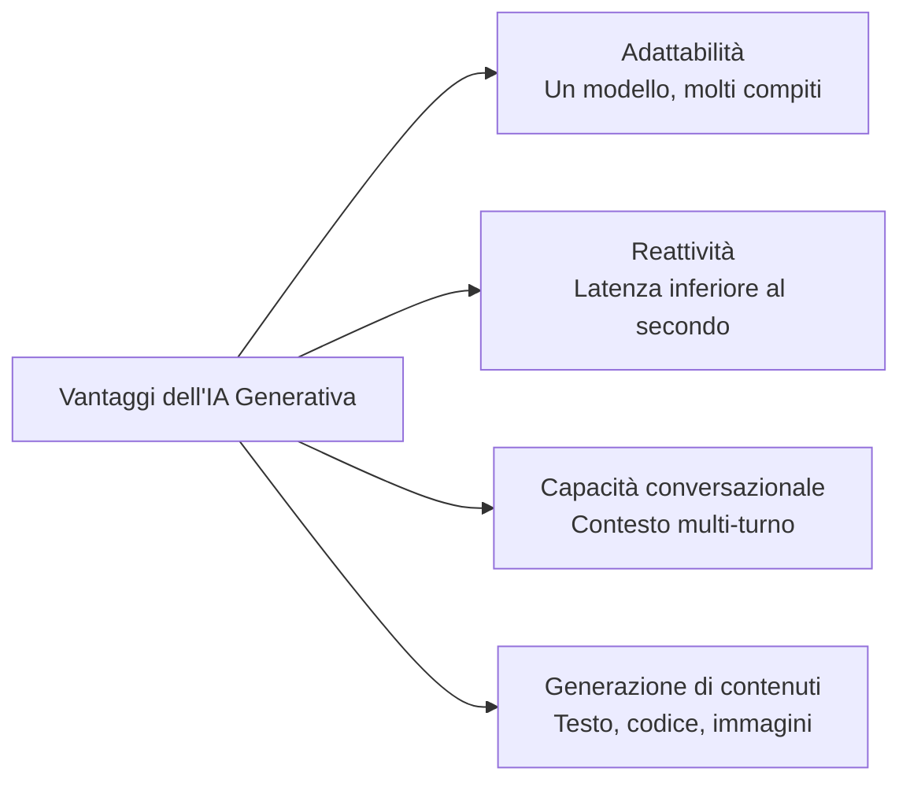
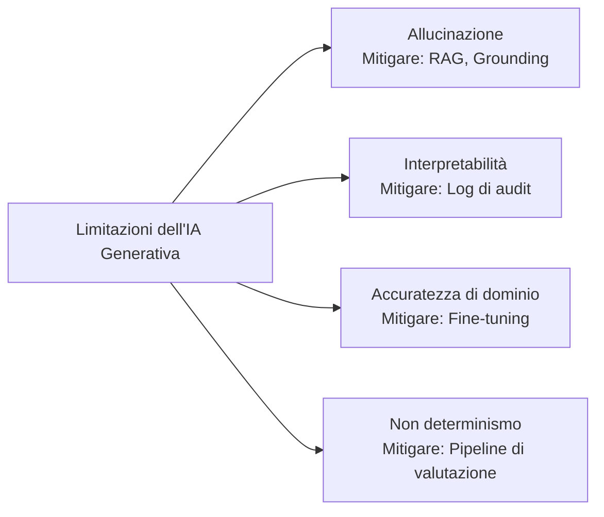
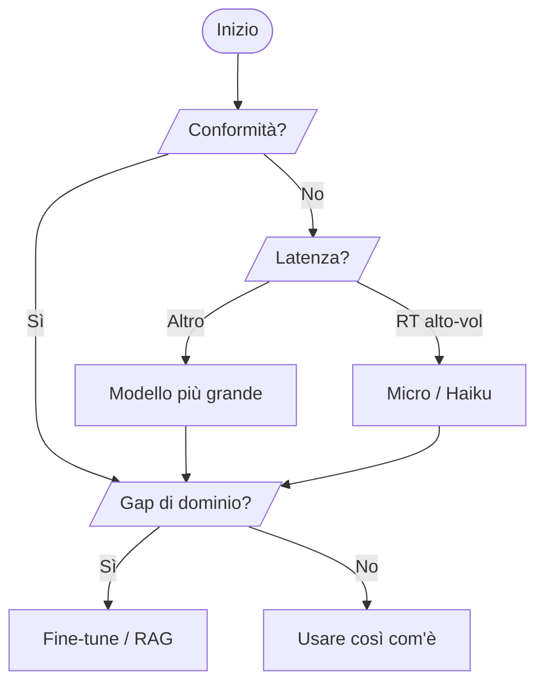
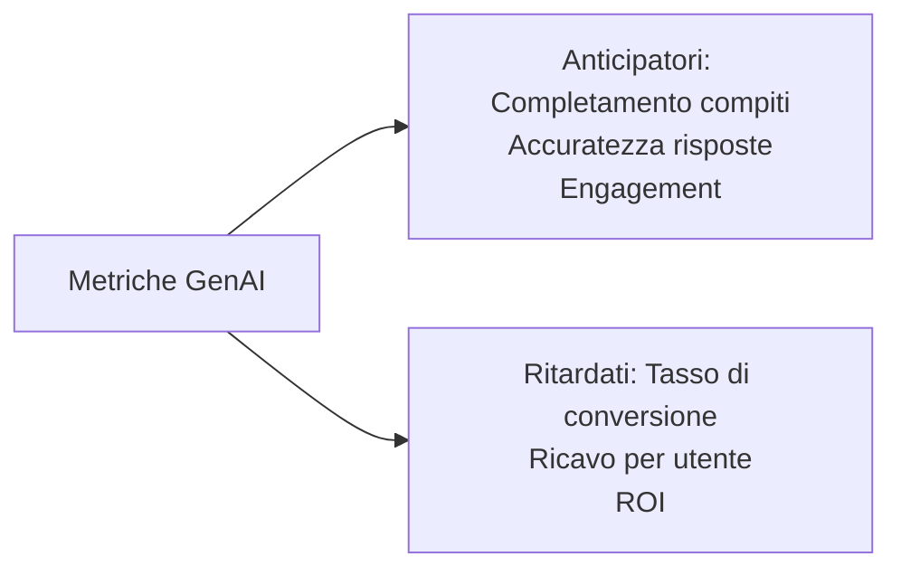

## Task Statement 2.2: Comprendere le capacità e i limiti dell'IA generativa per la risoluzione di problemi aziendali

L'IA generativa può produrre contenuti, sostenere conversazioni estese e adattarsi a compiti che i sistemi di machine learning classico non riescono a gestire senza un riaddestramentcompleto. Allo stesso tempo, allucinazioni con autorevolezza, cambia risposta tra un'esecuzione e l'altra e a volte produce sciocchezze con aria di certezza in domini specializzati scarsamente rappresentati nei suoi dati di addestramento. I professionisti aziendali che sanno articolare entrambi i lati di questa equazione sono quelli che prendono decisioni oculate su quando impegnarsi in un progetto di IA generativa, quando aggiungere misure di sicurezza e quando usare uno strumento diverso. Questo task statement copre i vantaggi, i limiti, i criteri di selezione del modello e le metriche necessarie per valutare il valore aziendale di un'applicazione generativa.[^202001]

### 2.2.1 Vantaggi dell'IA generativa

I modelli di machine learning classico sono costruiti per un singolo lavoro: un modello di rilevamento frodi rileva le frodi, un modello di previsione della domanda prevede la domanda. Il riaddestramentodi ogni modello per un nuovo compito richiede mesi di etichettatura, addestramento e validazione. L'IA generativa rompe questo vincolo. Un singolo modello linguistico di grandi dimensioni può scrivere testi di marketing la mattina e riassumere documenti legali nel pomeriggio, senza alcun riaddestramentosemplicemente ricevendo un prompt diverso. Questo cambiamento ha conseguenze pratiche su come le organizzazioni gestiscono i team AI e su quanto rapidamente possono rispondere a nuove esigenze aziendali.

L'esame elenca quattro vantaggi principali dell'IA generativa: adattabilità, reattività, capacità conversazionali e capacità di generare contenuti. Ognuno affronta una diversa limitazione dei sistemi IA precedenti e si traduce in un concreto beneficio aziendale.

*Figura 2.2.1: Quattro vantaggi principali dell'IA generativa. Ogni vantaggio corrisponde a una limitazione del machine learning classico che i modelli generativi superano.*

L'**adattabilità** è la capacità di un singolo modello fondazionale di gestire un'ampia varietà di compiti senza riaddestramentUn modello addestrato su un ampio corpus di testo può redigere email, classificare il sentiment, estrarre entità nominate, generare query SQL e creare descrizioni di prodotto, tutto tramite semplici modifiche al prompt. Ad esempio, un retailer può usare un singolo modello **Amazon Bedrock** per generare descrizioni di prodotto per nuovi SKU la mattina, tradurre quelle descrizioni in francese e spagnolo a mezzogiorno e riassumere le recensioni dei clienti la sera.[^202002] I risparmi operativi sono reali: invece di mantenere un modello specializzato separato per ogni compito, un singolo endpoint API li gestisce tutti, e le competenze che i prompt engineer sviluppano per un caso d'uso si trasferiscono direttamente agli altri.

La **reattività** si riferisce all'interazione conversazionale a bassa latenza che i modelli generativi consentono. Le pipeline ML batch classiche sono ottimizzate per il throughput, non per la velocità; elaborano migliaia di record ma possono richiedere minuti per esecuzione. Le API generative, al contrario, restituiscono token in modo streaming nell'arco di centinaia di millisecondi, abbastanza veloce per esperienze utente interattive.[^202003] Un'applicazione del servizio clienti che un tempo richiedeva un agente umano per cercare informazioni può ora rispondere a una domanda in meno di un secondo. Ad esempio, una compagnia assicurativa che implementa un chatbot per le richieste di polizza alimentato da Amazon Bedrock può restituire una risposta completa a una domanda sulla copertura in circa lo stesso tempo che impiega un essere umano a digitare una risposta, senza un essere umano nel ciclo.

Le **capacità conversazionali** rappresentano la capacità dei modelli generativi di mantenere il contesto attraverso più turni di dialogo. A differenza di un chatbot basato su regole che dimentica il messaggio precedente dopo ogni risposta, un moderno modello linguistico di grandi dimensioni mantiene l'intera cronologia della conversazione nella sua *finestra di contesto* e può farvi riferimento in modo naturale.[^202004] Un utente può dire "Qual è la politica di rimborso?" seguito da "E se l'ho comprato in saldo?" e il modello capisce che "l'ho" si riferisce al prodotto menzionato in precedenza. Questa coerenza multi-turno consente agenti di supporto, assistenti vendite e strumenti di knowledge base interna che sembrano naturali da usare. Ad esempio, una banca può implementare un assistente multi-turno per le richieste di prestito che raccoglie il tipo di impiego del richiedente, lo scopo del prestito e la fascia di reddito attraverso diversi turni conversazionali prima di presentare i prodotti idonei, un pattern di interazione che richiederebbe una gestione complessa dello stato in un motore di regole tradizionale.

La **capacità di generare contenuti** significa che i modelli generativi producono output originale piuttosto che limitarsi a classificare o recuperare contenuti esistenti. Possono scrivere una bozza di post per un blog, generare una funzione Python da una descrizione, sintetizzare un'immagine di prodotto fotorealistica o comporre un'email al cliente personalizzata in base a un ID ordine specifico e al sentiment.[^202005] Questa proprietà generativa è ciò che separa i modelli fondazionali dai sistemi di recupero. Un motore di ricerca recupera documenti che già esistono; un modello generativo ne compone uno nuovo. Ad esempio, un'azienda farmaceutica può generare una prima bozza di un rapporto di sintesi di un trial clinico dai dati strutturati del trial, permettendo ai medical writer di concentrarsi sulla revisione e il perfezionamento piuttosto che sulla composizione iniziale.

### 2.2.2 Svantaggi delle soluzioni di IA generativa

Ogni vantaggio dell'IA generativa è accompagnato da una limitazione che deve essere compresa prima di distribuire un sistema agli utenti reali. L'esame identifica specificamente quattro svantaggi: allucinazioni, problemi di interpretabilità, imprecisione nei domini specializzati e non determinismo. Nessuno di questi è un motivo per evitare l'IA generativa, ma ciascuno è un motivo per progettare misure di mitigazione in qualsiasi applicazione in produzione.

*Figura 2.2.2: Quattro limitazioni principali dell'IA generativa e l'approccio di mitigazione per ciascuna. Riconoscere la limitazione porta direttamente alla selezione del controllo appropriato.*

Le **allucinazioni** sono il fenomeno in cui un modello generativo produce output fluente e grammaticalmente corretto ma fattualmente errato, inventato o non fondato in alcun documento sorgente.[^202006] Il modello non sa di non sapere; genera la continuazione statisticamente più probabile del prompt, che può includere nomi inventati, statistiche false o citazioni inesistenti. Ad esempio, uno strumento di ricerca legale che utilizza un modello generativo grezzo può produrre la citazione di un caso inesistente, dichiarata con la stessa tonalità confidenziale di una citazione reale. La mitigazione principale è la *Generazione Aumentata dal Recupero* (RAG), un pattern in cui il modello è tenuto a rispondere da documenti recuperati piuttosto che dalla memoria parametrica.[^202007] Amazon Bedrock Knowledge Bases implementa questo pattern recuperando chunk rilevanti da un archivio dati connesso prima che il modello generi una risposta, fondando l'output in documenti verificabili. Controlli aggiuntivi includono **Amazon Bedrock Guardrails**, il cui controllo del grounding contestuale può rilevare e bloccare risposte non supportate dai documenti sorgente recuperati.[^202008]

I **problemi di interpretabilità** emergono perché i modelli linguistici di grandi dimensioni sono opachi. Non esiste un modo diretto per tracciare quali esempi di addestramento abbiano causato un particolare output, o per spiegare in termini umani perché il modello abbia scelto una parola rispetto a un'altra.[^202009] Questa opacità crea problemi nei settori regolamentati. Il sistema di valutazione del credito di una banca deve fornire una motivazione dell'azione negativa quando rifiuta un prestito; un modello generativo black-box non può fornire quella spiegazione nella forma strutturata richiesta dai regolatori. La mitigazione è riservare l'IA generativa per compiti in cui l'interpretabilità non è un obbligo normativo, oppure aggiungere uno strato di ragionamento che forzi il modello a citare le proprie fonti. **Amazon SageMaker AI** e il più ampio set di strumenti di spiegabilità in AWS possono rendere visibili i pesi di attenzione e le attribuzioni a livello di token, ma questi rimangono approssimazioni imperfette piuttosto che spiegazioni causali vere.[^202010]

L'**imprecisione nei domini specializzati senza grounding** è una limitazione distinta dall'allucinazione. Un modello può ricordare correttamente fatti generali sulla cardiologia ma fallire su domande specifiche riguardanti i protocolli clinici di un ospedale, le regole di codifica assicurativa o le interazioni farmacologiche proprietarie, perché quei documenti non erano mai nel suo corpus di addestramento.[^202011] La mitigazione è il fine-tuning (aggiustamento dei pesi del modello su dati specifici del dominio) o il RAG con una knowledge base di dominio curata. Il fine-tuning tramite le API di personalizzazione di Amazon Bedrock può colmare i gap di accuratezza per compiti strettamente definiti, mentre una knowledge base ben strutturata gestisce un recupero di informazioni più ampio senza il costo e il tempo del riaddestrament[^202012]

Il **non determinismo** significa che il modello può produrre una risposta diversa ogni volta che riceve lo stesso prompt, anche con tutte le altre condizioni invariate. Questa proprietà emerge dal processo di campionamento all'interno della maggior parte dei modelli generativi: il modello seleziona il token successivo in modo probabilistico piuttosto che deterministico, quindi due esecuzioni possono divergere dopo pochi token.[^202013] Ad esempio, un modello a cui viene chiesto di riassumere lo stesso reclamo di un cliente due volte può produrre una risposta che enfatizza il ritardo di spedizione e una seconda che enfatizza la qualità del prodotto, entrambe valide ma non identiche. Il parametro *temperatura* controlla quanta casualità il modello applica durante il campionamento; una temperatura più bassa produce output più coerente ma meno creativo. La mitigazione per il non determinismo consiste in rigorous pipeline di valutazione che confrontano gli output attraverso molti campioni e nella revisione umana dei casi limite prima del deployment. Le capacità di valutazione del modello di Amazon Bedrock supportano la valutazione automatica su set di prompt di test per rilevare varianze inattese.[^202014]

*Tabella 2.2.1: Svantaggi dell'IA generativa, causa radice, rischio aziendale e mitigazione principale*

| Svantaggio | Causa radice | Rischio aziendale | Mitigazione principale |
|---|---|---|---|
| Allucinazioni | Generazione parametrica senza grounding | Informazioni false presentate come fatti | RAG, Bedrock Guardrails |
| Interpretabilità | Pesi opachi della rete neurale | Non conformità normativa | Riservare per compiti non regolamentati; log di audit |
| Imprecisione di dominio | Dati di dominio mancanti nel corpus di addestramento | Risposte errate in flussi di lavoro specializzati | Fine-tuning, knowledge base di dominio |
| Non determinismo | Campionamento probabilistico dei token | Output incoerente per compiti di conformità | Pipeline di valutazione, regolazione della temperatura |

### 2.2.3 Fattori nella selezione dei modelli GenAI

La selezione di un modello di IA generativa per un'applicazione aziendale non è principalmente una decisione tecnica; è una decisione di compromesso. Modelli diversi si comportano in modo diverso su compiti diversi, hanno strutture di costo diverse, supportano finestre di contesto di dimensioni diverse e vengono forniti con posizioni di conformità diverse. L'esame si aspetta che ragioniate su otto fattori: tipi di modello, requisiti di performance, capacità, vincoli, conformità, costo, latenza e complessità del modello. L'aggiornamento v1.1 ha aggiunto esplicitamente costo, latenza e complessità del modello all'obiettivo, riflettendo la realtà pratica che la maggior parte delle decisioni in produzione è governata tanto dall'economia e dalla velocità quanto dall'accuratezza sui benchmark.

**Amazon Bedrock** è il servizio AWS principale per accedere a modelli fondazionali di terze parti e nativi Amazon tramite un'API unificata, senza gestire l'infrastruttura.[^202015] I modelli disponibili tramite Bedrock coprono un'ampia gamma di dimensioni, capacità e costo, il che lo rende il punto di riferimento naturale per qualsiasi discussione sulla selezione dei modelli.

*Tabella 2.2.2: Modelli Amazon Bedrock di esempio per livello di capacità e criteri di selezione*

| Famiglia di modelli | Modelli rappresentativi | Punti di forza | Latenza tipica | Costo relativo | Ideale per |
|---|---|---|---|---|---|
| Amazon Nova | Nova Micro, Nova Lite, Nova Pro, Nova Premier | Ottimo per compiti nativi AWS; multilingue; multi-modale (Pro/Premier) | Micro: molto bassa; Premier: moderata | Micro: il più basso; Premier: moderato | Compiti ad alto volume e basso costo (Micro); app aziendali multi-modali (Premier) |
| Anthropic Claude | Claude Haiku 4.x, Sonnet 4.x, Opus 4.x | Lunga finestra di contesto (200K standard, 1M con intestazione beta per Opus e Sonnet); ragionamento; seguire istruzioni | Haiku: bassa; Opus: alta | Haiku: basso; Opus: alto | Supporto clienti (Haiku); analisi complesse (Opus) |
| Meta Llama | Llama 4 Scout, Llama 4 Maverick | Pesi aperti; personalizzabile; finestre di contesto estese (dipendente dalla configurazione su Bedrock; consultare le schede del modello) | Moderata | Da basso a moderato | Fine-tuning personalizzato; analisi di documenti lunghi; inferenza cost-sensitive |
| Mistral AI | Mistral 7B, Mixtral 8x7B | Mixture-of-experts efficiente; compiti di codice | Da bassa a moderata | Basso | Generazione di codice; strumenti per sviluppatori |

Gli otto fattori dell'obiettivo d'esame interagiscono con questo panorama di modelli come segue:

I **tipi di modello** si riferiscono all'architettura e alla modalità del modello. I modelli solo testo gestiscono compiti linguistici; i modelli multi-modali gestiscono combinazioni di testo, immagini, video e audio.[^202016] Un'applicazione del servizio clienti che elabora solo testo può usare un modello testuale più leggero ed economico. Un'applicazione di ispezione prodotti che classifica immagini insieme a descrizioni testuali necessita di un modello multi-modale come Amazon Nova Pro.

I **requisiti di performance** coprono i benchmark di accuratezza e qualità richiesti da un caso d'uso. Un generatore di testi di marketing può tollerare qualche variazione nella qualità. Un assistente alla codifica medica, al contrario, deve mantenere un'alta precisione perché gli errori di codifica risultano in rifiuti delle richieste di rimborso. I punteggi benchmark come MMLU (Massive Multitask Language Understanding) e HumanEval forniscono un punto di partenza, ma il segnale di performance più affidabile è la valutazione sul proprio set di test specifico per il compito.[^202017]

Le **capacità** si riferiscono alle funzionalità specifiche che un modello deve avere: utilizzo di strumenti (function calling), generazione di codice, output strutturato (modalità JSON) o finestre di contesto estese. Ad esempio, un'applicazione che deve chiamare API esterne durante il ragionamento richiede un modello che supporti la function calling, che non tutti i modelli implementano.[^202018]

I **vincoli** coprono le limitazioni organizzative inclusi i requisiti di residenza dei dati, gli elenchi di fornitori approvati e le restrizioni sulle dimensioni dei modelli per il deployment su dispositivo. Le opzioni di inferenza cross-regionale e di throughput provisionato di Amazon Bedrock consentono agli architetti di lavorare entro i vincoli di residenza dei dati mantenendo la disponibilità.[^202019]

La **conformità** copre i requisiti normativi e di settore. Le applicazioni sanitarie regolate da HIPAA devono usare modelli distribuiti entro un perimetro di servizio idoneo HIPAA. Le applicazioni finanziarie possono affrontare restrizioni sull'egresso dei dati che escludono certi provider di modelli esterni. I servizi AWS con supporto Business Associate Agreement restringono l'elenco di modelli idonei per i casi d'uso sanitari.[^202020]

Il **costo** è sempre più il fattore decisivo nei deployment maturi. Il pricing basato su token significa che il costo per inferenza cresce con la lunghezza del contesto: system prompt più lunghi, esempi few-shot e chunk recuperati di grandi dimensioni aumentano tutti il conteggio dei token e quindi il conto.[^202021] Amazon Nova Micro è progettato per compiti testuali ad alto volume e basso costo in cui l'economicità è il vincolo principale. Per un milione di chiamate API al giorno, la differenza tra un modello di livello Micro e uno di livello Premier può ammontare a decine di migliaia di dollari al mese.

La **latenza** determina se un modello è adatto per applicazioni interattive in tempo reale. Un modello che impiega due secondi per rispondere è accettabile per una pipeline di elaborazione batch di documenti ma inaccettabile per un widget di chat live con i clienti in cui gli utenti si aspettano risposte nell'arco di poche centinaia di millisecondi.[^202022] Amazon Nova Micro punta al livello di latenza più bassa nella famiglia Amazon Nova. Il throughput provisionato in Amazon Bedrock può ridurre la varianza della latenza per i carichi di lavoro in produzione sensibili alla latenza.

La **complessità del modello** si riferisce al numero di parametri, alla profondità dell'architettura e alla dimensione della finestra di contesto che un modello può contenere. I modelli più complessi si comportano generalmente meglio su compiti sfumati ma sono più lenti e più costosi per token.[^202023] Un modello da 7 miliardi di parametri può gestire adeguatamente riepiloghi semplici, mentre un modello da 200 miliardi di parametri può essere necessario per il ragionamento in più fasi su un documento legale di 100.000 token. Adeguare la complessità alla difficoltà effettiva del compito mantiene i costi gestibili senza sacrificare la qualità.

*Figura 2.2.3: Un flusso decisionale per la selezione del modello GenAI. Conformità, latenza, volume e gap di accuratezza di dominio filtrano in sequenza il set di modelli praticabili; lo stesso flusso si applica sia che il modello sottostante sia Amazon Nova, Anthropic Claude, Meta Llama o Mistral.*

### 2.2.4 Valore aziendale e metriche per le applicazioni GenAI

L'adozione dell'IA generativa è un investimento aziendale, e ogni investimento deve essere valutato rispetto a risultati misurabili. L'obiettivo dell'esame elenca sette metriche: performance cross-dominio, ROI, efficienza, tasso di conversione, ricavo medio per utente, accuratezza e valore del ciclo di vita del cliente. Queste metriche rientrano in due gruppi naturali. Gli *indicatori anticipatori* sono osservabili presto in un deployment, spesso entro settimane: tasso di completamento del compito, volume di engagement, accuratezza delle risposte su set di test. Gli *indicatori ritardati* richiedono più tempo per materializzarsi perché dipendono dal comportamento dei clienti a valle: ricavo per utente, valore del ciclo di vita del cliente, tasso di abbandono. Un programma maturo di misurazione dell'IA tiene traccia di entrambi, usando gli indicatori anticipatori per ottimizzare il sistema prima che gli indicatori ritardati confermino l'impatto aziendale.

*Figura 2.2.4: Indicatori anticipatori e ritardati per il valore aziendale dell'IA generativa. Gli indicatori anticipatori segnalano la salute del sistema; gli indicatori ritardati confermano che la salute del sistema si traduce in risultati finanziari.*

La **performance cross-dominio** misura quanto bene un modello generativo mantiene la qualità quando applicato a più funzioni aziendali.[^202024] Un modello che si comporta eccellentemente per il supporto clienti ma male per le query HR interne può necessitare di strategie di prompting separate o varianti ottimizzate con fine-tuning separate per ogni dominio. Ad esempio, un'azienda di logistica che testa un singolo modello fondazionale su tracking delle spedizioni, assistenza alla negoziazione dei vettori e documentazione doganale scopre che i punteggi di accuratezza cross-dominio rivelano quali domini necessitano di ulteriore grounding prima del deployment completo.

Il **ROI** (ritorno sull'investimento) quantifica il ritorno finanziario sul costo di costruzione e gestione di un'applicazione di IA generativa rispetto al valore che genera.[^202025] Il calcolo confronta i risparmi operativi (meno agenti umani, elaborazione più rapida dei documenti, costi ridotti di correzione degli errori) e i guadagni di ricavo (conversione più alta, nuove capacità di prodotto) con i costi di inferenza del modello, il lavoro di sviluppo e il costo di valutazione continuativa. Un assistente per contact center che deflette il 40% delle richieste di primo livello all'automazione produce un ROI misurabile man mano che il tasso di deflection scala, perché ogni chiamata deflessa elimina un'unità di costo del lavoro. Il ROI è stato aggiunto esplicitamente all'obiettivo dell'esame nella v1.1, riflettendo che gli stakeholder aziendali si aspettano ora di valutare i progetti AI con lo stesso rigore finanziario che applicano a qualsiasi altro investimento tecnologico.

L'**efficienza** misura quanto più velocemente o economicamente un processo viene eseguito con l'IA generativa rispetto alla baseline.[^202026] Le metriche di efficienza includono il tempo per compito (quanto tempo impiega un analista per completare un briefing di ricerca con assistenza IA rispetto a senza), il throughput (quanti ticket di supporto il sistema elabora per ora) e il costo per unità (il costo in token per generare una descrizione di prodotto rispetto al costo del lavoro di un copywriter che produce lo stesso elemento). Ad esempio, uno studio legale che usa l'IA generativa per produrre bozze di riepiloghi contrattuali riduce il tempo medio dell'avvocato su ogni contratto da 45 minuti a 8 minuti, un rapporto di efficienza documentato che giustifica il costo della piattaforma.

Il **tasso di conversione** misura la percentuale di potenziali clienti o utenti che completano un'azione desiderata, come completare un acquisto, inviare una richiesta di prestito o prenotare un appuntamento di servizio.[^202027] L'IA generativa influisce sulla conversione personalizzando il contenuto che gli utenti vedono in punti decisionali chiave. Un motore di raccomandazione che genera testi promozionali personalizzati per ogni visitatore, piuttosto che mostrare lo stesso banner a tutti, può aumentare i tassi di conversione in modo misurabile. Ad esempio, una piattaforma di e-commerce che usa un modello Amazon Bedrock per generare descrizioni di prodotto dinamiche personalizzate in base alla cronologia di navigazione di un visitatore riporta un tasso di aggiunta al carrello più alto rispetto al gruppo di controllo che riceve descrizioni statiche.

Il **ricavo medio per utente (ARPU)** misura il ricavo totale diviso per il numero di utenti attivi in un periodo.[^202028] L'IA generativa può aumentare l'ARPU rilevando opportunità di upselling all'interno di una conversazione (un chatbot che rileva un utente che chiede di un prodotto di livello base e menziona naturalmente l'opzione premium), riducendo l'abbandono del servizio o generando offerte personalizzate che corrispondono ai pattern di acquisto individuali. Ad esempio, un servizio di streaming che usa l'IA generativa per personalizzare le raccomandazioni di contenuti e comporre campagne email specifiche per ogni abbonato riporta un ARPU più alto nel gruppo di trattamento rispetto al gruppo di controllo che riceve messaggi generici.

L'**accuratezza** in contesto aziendale significa la proporzione di output di IA generativa corretti e completi abbastanza da essere usati senza correzione umana.[^202029] L'accuratezza viene misurata rispetto a un set di valutazione etichettato specifico per il compito. Un modello che risponde correttamente a 95 di 100 domande di test ha un'accuratezza del 95% su quel set di test. L'accuratezza è la metrica di qualità più diretta per i casi d'uso in cui gli errori hanno un costo, come la codifica medica, la rendicontazione di conformità finanziaria o l'estrazione automatizzata di clausole legali. Le capacità di valutazione del modello di Amazon Bedrock permettono ai team di eseguire valutazioni automatiche dell'accuratezza su set di benchmark specifici per il compito prima e dopo le modifiche al modello o al prompt.[^202030]

Il **valore del ciclo di vita del cliente (CLV)** è il ricavo netto totale che un'azienda si aspetta da una relazione con un cliente nel corso della sua durata.[^202031] L'IA generativa influisce sul CLV migliorando la retention (i clienti che ricevono un supporto migliore rimangono più a lungo), espandendo la gamma di servizi che un cliente usa (un assistente personalizzato presenta prodotti di cui il cliente non sapeva l'esistenza) e riducendo l'abbandono attraverso un engagement proattivo. Il CLV è un indicatore ritardato; tipicamente ci vogliono trimestri per osservarlo. Ad esempio, un istituto finanziario che implementa un chatbot di consulenza IA generativa vede le prime metriche di accuratezza e engagement nell'arco di settimane, ma il miglioramento del CLV diventa visibile solo dopo sei-dodici mesi, quando la coorte di clienti assistiti dall'IA mostra un'atttrizione più bassa rispetto alla baseline storica.

*Tabella 2.2.3: Metriche aziendali dell'IA generativa: tipo, approccio di misurazione ed esempio aziendale*

| Metrica | Tipo di indicatore | Come viene misurata | Esempio aziendale |
|---|---|---|---|
| Performance cross-dominio | Anticipatorio | Punteggio di accuratezza per dominio su set di test trattenuti | Modello logistico testato su tre aree funzionali prima del rollout |
| ROI | Ritardato | (Risparmi sui costi + guadagno di ricavo) / investimento totale | Tasso di deflection del contact center moltiplicato per il costo medio del lavoro per ticket |
| Efficienza | Anticipatorio | Tempo per compito o costo per unità prima vs. dopo l'IA | Tempo di riepilogo del contratto ridotto da 45 a 8 minuti |
| Tasso di conversione | Ritardato | Azioni completate / opportunità totali | Tasso di aggiunta al carrello più alto per descrizioni generate dall'IA vs. statiche |
| Ricavo medio per utente | Ritardato | Ricavo totale / utenti attivi per periodo | Aumento dell'ARPU del servizio di streaming da campagne personalizzate |
| Accuratezza | Anticipatorio | Output corretti / output totali su set di valutazione | 95% di accuratezza su un benchmark di codifica di 100 domande |
| Valore del ciclo di vita del cliente | Ritardato | Ricavo netto previsto nel corso della durata della relazione | Atttrizione più bassa nella coorte assistita dall'IA dopo 12 mesi |

Un programma di misurazione pratico non aspetta gli indicatori ritardati prima di agire. La sequenza è: distribuire con gli indicatori anticipatori strumentati dal primo giorno, ottimizzare il modello e i prompt finché gli indicatori anticipatori raggiungono il target, poi aspettare che gli indicatori ritardati confermino che il miglioramento operativo si traduce in valore finanziario. Le metriche di **Amazon CloudWatch** e le dashboard personalizzate in AWS possono tracciare la latenza di inferenza, i tassi di errore e i conteggi di invocazione del modello come indicatori operativi anticipatori, mentre gli strumenti di business intelligence tracciano le metriche di ricavo e retention a valle.[^202032]

---

## Domande di autoverifica

**Domanda 1**

Un'azienda retail distribuisce un generatore di descrizioni di prodotto basato su IA generativa. Durante la revisione della qualità, il team nota che il modello inventa occasionalmente attributi nutrizionali per prodotti alimentari non elencati nei dati sorgente. Quale svantaggio dell'IA generativa descrive MEGLIO questo comportamento e quale mitigazione dovrebbe implementare il team PER PRIMA?

A. Non determinismo; abbassare la temperatura del modello per ridurre la varianza dell'output.
B. Allucinazione; implementare la Generazione Aumentata dal Recupero per fondare le risposte nel catalogo prodotti.
C. Interpretabilità; aggiungere log di audit in modo che i revisori possano tracciare quali dati di addestramento hanno influenzato la risposta.
D. Imprecisione di dominio; ottimizzare con fine-tuning il modello su un dataset curato di prodotti alimentari.

L'allucinazione è il fenomeno in cui un modello generativo produce output fluente e confidenziale non fondato su materiale sorgente fattuale. Il processo di previsione del token successivo dal punto di vista statistico del modello può produrre fatti nutrizionali plausibili che non compaiono da nessuna parte nel catalogo prodotti. Questo è distinto dall'imprecisione di dominio (che riguarda la mancanza di conoscenze specializzate nel corpus di addestramento) perché il modello non è semplicemente disinformato; sta attivamente inventando contenuti. La riduzione della temperatura (risposta A) riduce la varianza nello stile dell'output ma non impedisce al modello di fabbricare fatti. Gli strumenti di interpretabilità (risposta C) aiutano a tracciare gli output ma non impediscono il verificarsi delle allucinazioni. Il fine-tuning (risposta D) regola i pesi del modello e può aiutare con l'imprecisione di dominio, ma per un problema di grounding fattuale specifico del catalogo, il RAG è più rapido da implementare e più mirato: il modello è vincolato a generare risposte da record di prodotto recuperati piuttosto che dalla memoria parametrica. Amazon Bedrock Knowledge Bases fornisce un'implementazione RAG gestita che connette il modello a un catalogo prodotti ricercabile, garantendo che ogni attributo nella descrizione generata possa essere ricondotto a un documento sorgente.[^202033]

**Domanda 2**

Un'azienda sta scegliendo tra Amazon Nova Micro e Amazon Nova Premier per un chatbot di supporto clienti ad alto volume che deve rispondere entro 500 millisecondi ed elaborare circa due milioni di interazioni al giorno. Quale fattore guida PIU' direttamente la raccomandazione di usare Nova Micro rispetto a Nova Premier per questo carico di lavoro?

A. I requisiti di conformità limitano l'uso di modelli più grandi nelle applicazioni rivolte ai clienti.
B. Nova Premier ha una finestra di contesto più piccola e non può mantenere la cronologia delle conversazioni multi-turno.
C. Latenza e costo rendono Nova Micro la scelta appropriata per carichi di lavoro ad alto volume, sensibili alla latenza e ai costi.
D. Nova Micro supporta input multi-modali, rendendolo più adatto per le applicazioni di chat.

La domanda descrive un carico di lavoro in cui due vincoli sono prominenti: un limite di latenza di 500 millisecondi e un volume di due milioni di interazioni giornaliere. Entrambi i vincoli puntano nella stessa direzione. Nova Micro è posizionato come il livello a latenza più bassa e costo più basso nella famiglia Amazon Nova, progettato precisamente per compiti ad alto volume dove l'economicità e la velocità sono i requisiti principali. Nova Premier è la scelta più capace ma anche la più costosa e ad alta latenza della famiglia, appropriata per compiti di ragionamento complessi in più fasi piuttosto che per supporto conversazionale ad alto volume. La risposta A introduce una motivazione di conformità non indicata nello scenario. La risposta B è fattualmente errata su entrambi i punti: Nova Premier ha una finestra di contesto più grande di Nova Micro, e qualsiasi modello Bedrock può mantenere la cronologia delle conversazioni multi-turno fino al limite della propria finestra di contesto, quindi la capacità conversazionale non è vincolata dal livello. La risposta D non è corretta perché l'input multi-modale è una capacità di Nova Pro e Nova Premier, non di Nova Micro. La risposta corretta è C: il requisito di latenza (meno di 500 ms) e il volume (due milioni di chiamate al giorno) rendono costo e latenza i fattori dominanti nella selezione del modello, e Nova Micro è il livello progettato per quella combinazione.[^202034]

**Domanda 3**

Un team AI aziendale presenta un business case per una soluzione di elaborazione documenti con IA generativa. Il CFO chiede come il team dimostrerà il valore finanziario entro i primi 90 giorni dal deployment. Quale metrica è PIU' appropriata per dimostrare l'impatto finanziario precoce?

A. Valore del ciclo di vita del cliente, misurato come variazione del CLV previsto per la coorte di utenti.
B. Efficienza, misurata come tempo per documento e costo per documento rispetto alla baseline manuale.
C. Tasso di conversione, misurato come percentuale di documenti che attivano una vendita successiva.
D. Ricavo medio per utente, misurato nel primo ciclo di fatturazione dopo il deployment.

Il valore del ciclo di vita del cliente e il ricavo medio per utente sono indicatori ritardati che tipicamente richiedono mesi o trimestri di osservazione prima che sia visibile una variazione statisticamente significativa. Entro i primi 90 giorni, nessuna delle due metriche avrà accumulato abbastanza dati per dimostrare una conclusione difendibile. Il tasso di conversione è una metrica plausibile per un'applicazione orientata alle vendite, ma l'elaborazione di documenti è un flusso di lavoro operativo interno, non un funnel di vendita rivolto ai clienti, rendendo il tasso di conversione un adattamento scomodo. L'efficienza è la metrica naturale dei 90 giorni per un progetto di automazione operativa: il team può misurare quanto tempo ci voleva agli analisti per elaborare un documento prima che il sistema IA fosse in funzione, misurare lo stesso compito con assistenza IA e calcolare il risparmio di tempo e la riduzione del costo del lavoro immediatamente dopo il go-live. Il CFO riceve un numero concreto (ad esempio, "il tempo medio di elaborazione dei documenti è sceso da 42 minuti a 9 minuti, risparmiando circa 330 ore di analista a settimana al volume attuale di documenti") che si traduce direttamente in dollari senza richiedere dati longitudinali sui clienti.[^202035]

**Domanda 4**

Un'azienda tecnologica sanitaria sta valutando modelli di IA generativa per un assistente alla documentazione clinica. La soluzione deve operare entro un perimetro di servizio idoneo HIPAA e deve citare la frase sorgente dal record del paziente per ogni affermazione che fa in un riepilogo generato. Quali DUE fattori di selezione del modello sono PIU' rilevanti per questa valutazione?

A. Complessità del modello e tasso di conversione.
B. Conformità e capacità.
C. Latenza e ricavo medio per utente.
D. Costo e performance cross-dominio.

Lo scenario presenta due requisiti distinti. Il primo è normativo: la soluzione deve operare entro i limiti idonei HIPAA, che è un fattore di conformità che limita direttamente il set di modelli e configurazioni di deployment idonee. Non tutti i modelli disponibili tramite Amazon Bedrock sono accessibili in una configurazione idonea HIPAA, quindi la conformità è un criterio di accesso che deve essere risolto prima che qualsiasi altro fattore possa essere valutato. Il secondo requisito è che il modello deve citare le frasi sorgente, che è un requisito di capacità: il modello deve supportare un meccanismo di citazione o attribuzione della fonte, sia nativamente tramite output strutturato, sia tramite un'architettura RAG che restituisce riferimenti alle fonti insieme al testo generato. Il tasso di conversione (risposta A) e il ricavo medio per utente (risposta C) sono metriche di risultato aziendale, non criteri di selezione del modello. Costo e performance cross-dominio (risposta D) sono importanti in qualsiasi deployment ma non sono i fattori PIU' rilevanti dati i requisiti espliciti di HIPAA e citazione indicati nello scenario. La risposta corretta è B.[^202036]

**Domanda 5**

Un team di prodotto distribuisce un assistente IA generativa e nota che la stessa domanda di supporto a volte riceve una risposta che enfatizza un percorso di risoluzione e a volte un percorso di risoluzione diverso, anche se entrambe le risposte sono tecnicamente corrette. Il team vuole capire quale proprietà dell'IA generativa spiega MEGLIO questo comportamento prima di decidere una mitigazione.

A. Allucinazione, perché il modello sta generando contenuti che non compaiono nella knowledge base.
B. Problemi di interpretabilità, perché il modello non riesce a spiegare perché ha scelto un percorso di risoluzione rispetto a un altro.
C. Non determinismo, perché il modello campiona in modo probabilistico da una distribuzione di probabili token successivi ad ogni passo.
D. Imprecisione di dominio, perché il modello non è stato addestrato sugli scenari di supporto specifici.

Lo scenario descrive una situazione in cui entrambi gli output sono tecnicamente corretti ma diversi. Questa è la caratteristica definitoria del non determinismo: il processo di campionamento del modello introduce variabilità tra le esecuzioni anche quando entrambi gli output sono validi. L'allucinazione (risposta A) riguarda la generazione di contenuti fattualmente errati da parte del modello; lo scenario afferma esplicitamente che entrambe le risposte sono corrette. L'interpretabilità (risposta B) riguarda l'incapacità di spiegare le decisioni del modello, non la variabilità dell'output tra le esecuzioni. L'imprecisione di dominio (risposta D) si manifesterebbe come risposte errate o incomplete, non come due diverse risposte corrette. La mitigazione per il non determinismo in un contesto di supporto dipende dal requisito aziendale. Se la coerenza è obbligatoria (ad esempio, nella consulenza finanziaria regolamentata), il team può abbassare il parametro temperatura per ridurre la varianza del campionamento e può aggiungere una pipeline di valutazione che segnala i prompt ad alta varianza per la revisione umana. Il log delle invocazioni del modello di Amazon Bedrock cattura ogni richiesta e risposta, il che consente al team di verificare la varianza tra le esecuzioni e identificare quali tipi di domande producono gli output più divergenti.[^202037]

---

[^202001]: AWS Certification Exam Guide AIF-C01 v1.1, Task Statement 2.2. URL: <https://docs.aws.amazon.com/aws-certification/latest/ai-practitioner-01/ai-practitioner-01-domain2.html>
[^202002]: Amazon Bedrock User Guide: Supported foundation models. URL: <https://docs.aws.amazon.com/bedrock/latest/userguide/models-supported.html>
[^202003]: Amazon Bedrock User Guide: Invoke a model to run inference. URL: <https://docs.aws.amazon.com/bedrock/latest/userguide/inference.html>
[^202004]: Amazon Bedrock User Guide: Conversation history and context windows. URL: <https://docs.aws.amazon.com/bedrock/latest/userguide/conversation-inference.html>
[^202005]: Amazon Bedrock User Guide: Content generation with foundation models. URL: <https://docs.aws.amazon.com/bedrock/latest/userguide/what-is-bedrock.html>
[^202006]: NIST AI 600-1: Artificial Intelligence Risk Management Framework: Generative AI. URL: <https://nvlpubs.nist.gov/nistpubs/ai/nist.ai.600-1.pdf>
[^202007]: Amazon Bedrock User Guide: Knowledge Bases for Amazon Bedrock. URL: <https://docs.aws.amazon.com/bedrock/latest/userguide/knowledge-base.html>
[^202008]: Amazon Bedrock User Guide: Amazon Bedrock Guardrails. URL: <https://docs.aws.amazon.com/bedrock/latest/userguide/guardrails.html>
[^202009]: AWS Machine Learning Blog: Explainability in large language models. URL: <https://aws.amazon.com/blogs/machine-learning/>
[^202010]: Amazon SageMaker AI Developer Guide: Amazon SageMaker Clarify. URL: <https://docs.aws.amazon.com/sagemaker/latest/dg/clarify-model-explainability.html>
[^202011]: Amazon Bedrock User Guide: Custom model fine-tuning. URL: <https://docs.aws.amazon.com/bedrock/latest/userguide/custom-models.html>
[^202012]: Amazon Bedrock User Guide: Fine-tuning and continued pre-training. URL: <https://docs.aws.amazon.com/bedrock/latest/userguide/custom-models.html>
[^202013]: Hugging Face Documentation: Text generation and sampling strategies. URL: <https://huggingface.co/docs/transformers/generation_strategies>
[^202014]: Amazon Bedrock User Guide: Model evaluation in Amazon Bedrock. URL: <https://docs.aws.amazon.com/bedrock/latest/userguide/model-evaluation.html>
[^202015]: Amazon Bedrock User Guide: What is Amazon Bedrock? URL: <https://docs.aws.amazon.com/bedrock/latest/userguide/what-is-bedrock.html>
[^202016]: Amazon Nova User Guide: Amazon Nova model capabilities. URL: <https://docs.aws.amazon.com/nova/latest/userguide/what-is-nova.html>
[^202017]: Papers With Code: MMLU Benchmark. URL: <https://paperswithcode.com/dataset/mmlu>
[^202018]: Amazon Bedrock User Guide: Tool use (function calling) with Amazon Bedrock. URL: <https://docs.aws.amazon.com/bedrock/latest/userguide/tool-use.html>
[^202019]: Amazon Bedrock User Guide: Cross-region inference. URL: <https://docs.aws.amazon.com/bedrock/latest/userguide/inference-profiles-cross-region.html>
[^202020]: AWS Compliance: HIPAA Eligible Services. URL: <https://aws.amazon.com/compliance/hipaa-eligible-services-reference/>
[^202021]: Amazon Bedrock Pricing. URL: <https://aws.amazon.com/bedrock/pricing/>
[^202022]: Amazon Bedrock User Guide: Provisioned throughput. URL: <https://docs.aws.amazon.com/bedrock/latest/userguide/prov-throughput.html>
[^202023]: Amazon Nova User Guide: Choosing the right Amazon Nova model. URL: <https://docs.aws.amazon.com/nova/latest/userguide/nova-pro-overview.html>
[^202024]: AWS Well-Architected Framework: Machine Learning Lens: Performance pillar. URL: <https://docs.aws.amazon.com/wellarchitected/latest/machine-learning-lens/performance-pillar.html>
[^202025]: AWS Executive Insights: Measuring ROI for generative AI. URL: <https://aws.amazon.com/executive-insights/content/calculating-roi-of-generative-ai/>
[^202026]: McKinsey Global Institute: The economic potential of generative AI. URL: <https://www.mckinsey.com/capabilities/mckinsey-digital/our-insights/the-economic-potential-of-generative-ai>
[^202027]: Amazon Personalize Developer Guide: Measuring recommendation effectiveness. URL: <https://docs.aws.amazon.com/personalize/latest/dg/getting-started.html>
[^202028]: AWS Retail Competency: AI-driven personalization and ARPU. URL: <https://aws.amazon.com/retail/>
[^202029]: Amazon Bedrock User Guide: Evaluate model accuracy with model evaluations. URL: <https://docs.aws.amazon.com/bedrock/latest/userguide/model-evaluation.html>
[^202030]: Amazon Bedrock User Guide: Automated model evaluation jobs. URL: <https://docs.aws.amazon.com/bedrock/latest/userguide/model-evaluation-jobs.html>
[^202031]: AWS Customer Experience: Improving customer lifetime value with AI. URL: <https://aws.amazon.com/customer-engagement/>
[^202032]: Amazon CloudWatch User Guide: Metrics, alarms, and dashboards. URL: <https://docs.aws.amazon.com/AmazonCloudWatch/latest/monitoring/working_with_metrics.html>
[^202033]: Amazon Bedrock User Guide: Retrieval Augmented Generation with Knowledge Bases. URL: <https://docs.aws.amazon.com/bedrock/latest/userguide/knowledge-base-overview.html>
[^202034]: Amazon Nova User Guide: Amazon Nova Micro model overview. URL: <https://docs.aws.amazon.com/nova/latest/userguide/nova-micro-overview.html>
[^202035]: AWS Well-Architected Framework: Operational Excellence pillar: measuring improvement. URL: <https://docs.aws.amazon.com/wellarchitected/latest/operational-excellence-pillar/welcome.html>
[^202036]: AWS Compliance: HIPAA and Health Information Portability. URL: <https://aws.amazon.com/compliance/hipaa-compliance/>
[^202037]: Amazon Bedrock User Guide: Model invocation logging. URL: <https://docs.aws.amazon.com/bedrock/latest/userguide/model-invocation-logging.html>
