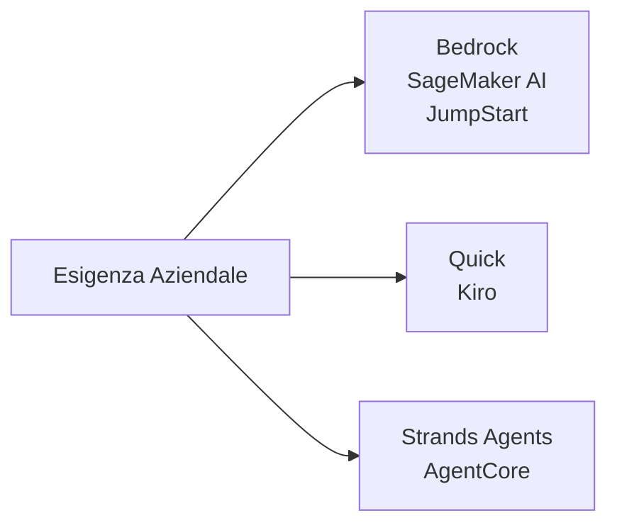
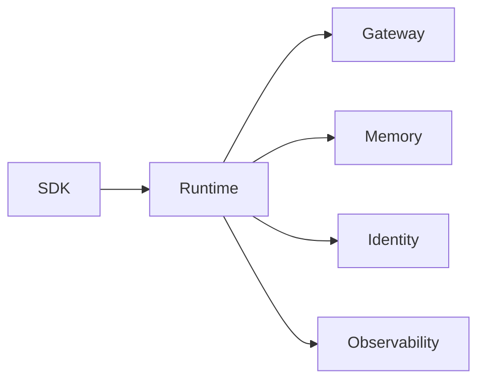
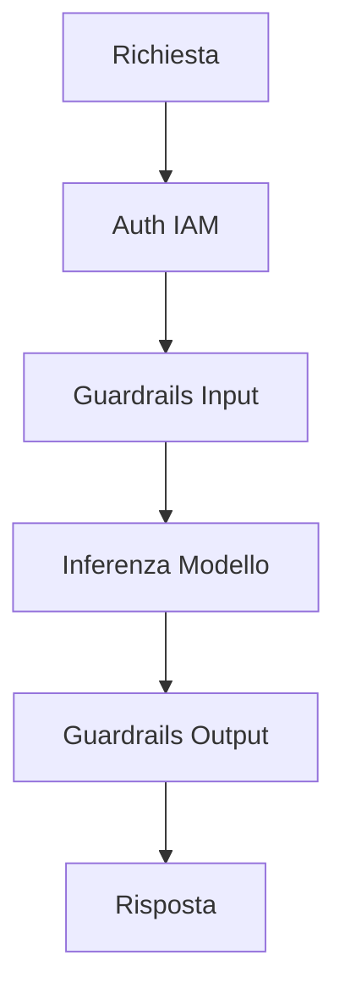
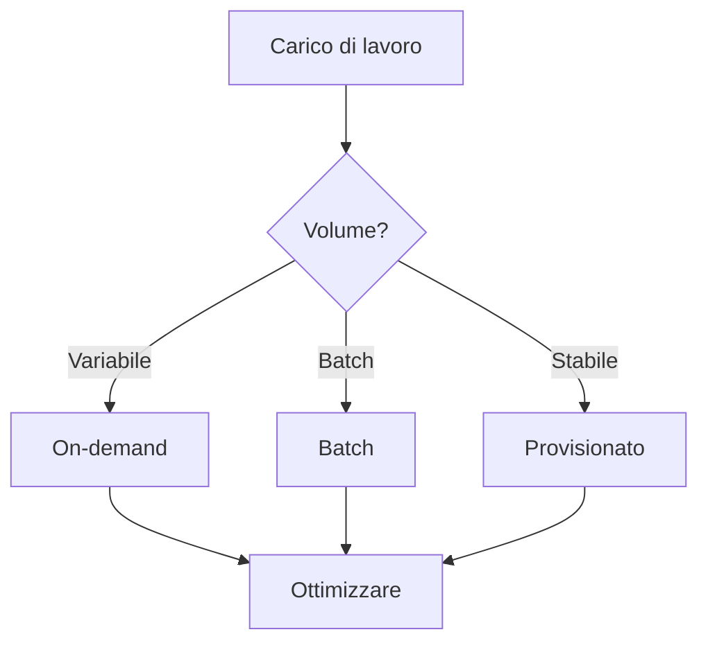
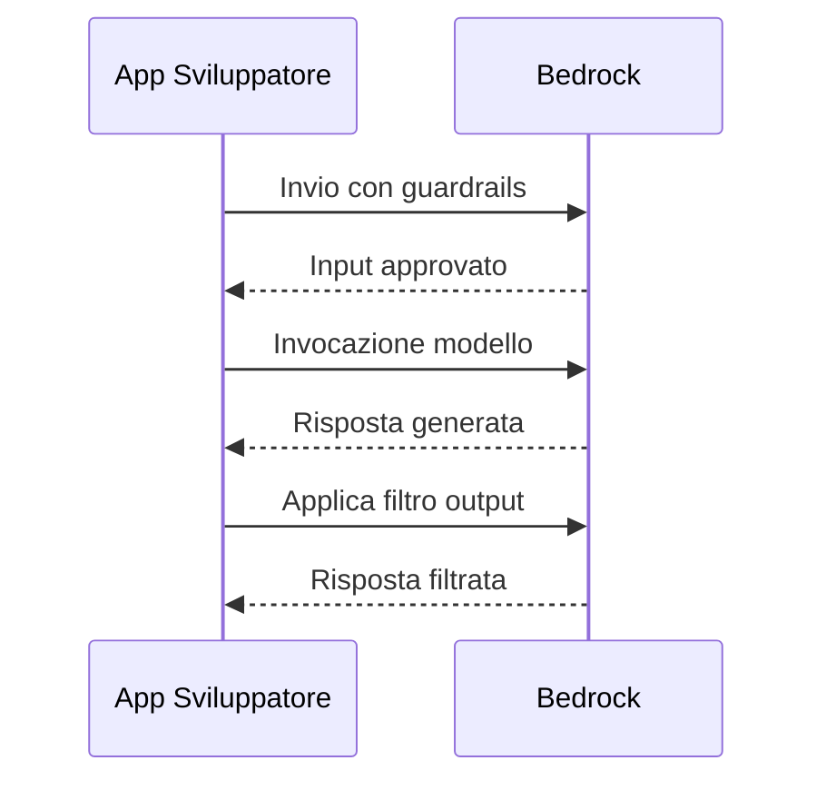

## Task Statement 2.3: Descrivere l'infrastruttura e le tecnologie AWS per la creazione di applicazioni GenAI

La creazione di un'applicazione di IA generativa su AWS richiede la scelta tra un numero crescente di servizi gestiti e strumenti per sviluppatori, ognuno dei quali si rivolge a un punto diverso dello spettro di sviluppo. Il Task Statement 2.3 copre quattro obiettivi: i servizi AWS nominati nella guida all'esame v1.1, i vantaggi del loro utilizzo, le proprietà di sicurezza e conformità che ereditano da AWS e le decisioni sui costi che i team affrontano in produzione.[^203001]

*Figura 2.3.1: Tre punti di ingresso per il lavoro GenAI su AWS. La famiglia Bedrock e SageMaker copre le API dei modelli gestiti e l'addestramento personalizzato, Quick e Kiro coprono gli assistenti per business e sviluppatori, e Strands Agents e AgentCore coprono i framework agentivi e i runtime.*

I servizi di questo task statement non competono tra loro in una singola dimensione. Un team potrebbe usare **Amazon Bedrock** come API di modello, distribuire quell'applicazione tramite **Amazon Bedrock AgentCore**, automatizzare il lavoro di sviluppo all'interno di **Kiro** e interrogare dati aziendali tramite **Amazon Quick**, tutto all'interno dello stesso progetto. Le sezioni che seguono spiegano ciascun servizio, i vantaggi combinati dell'uso della piattaforma AWS, l'infrastruttura di sicurezza e conformità sottostante e le meccaniche di pricing che determinano il costo totale di proprietà.

### 2.3.1 Servizi e funzionalità AWS per applicazioni GenAI

La guida all'esame AWS v1.1 nomina sette servizi e famiglie di strumenti per la creazione di applicazioni di IA generativa: Amazon Bedrock, Amazon SageMaker AI, Amazon SageMaker JumpStart, Amazon Quick, Kiro, Strands Agents e Amazon Bedrock AgentCore.[^203002] Ognuno occupa una nicchia specifica, e capire dove si inserisce ciascuno previene sia l'over-engineering che il sotto-investimento nelle capacità della piattaforma.

**Amazon Bedrock** è un servizio completamente gestito che fornisce accesso API a un catalogo curato di modelli fondazionali da più provider, senza richiedere il provisioning o la gestione di alcuna infrastruttura GPU.[^203003] Un team chiama un singolo endpoint, specifica l'identificatore del modello e riceve una risposta generata fatturata per token. L'infrastruttura sottostante, i pesi del modello e la logica di scaling sono completamente invisibili al chiamante.

Il catalogo di modelli disponibili tramite Amazon Bedrock include i modelli proprietari di Amazon, laboratori di ricerca di terze parti e opzioni open-weight:

- I modelli **Amazon Nova** (Nova Micro, Nova Lite, Nova Pro, Nova Premier) sono la serie proprietaria di Amazon, che va da un livello solo testo a bassa latenza fino a un flagship multi-modale in grado di elaborare immagini, video e documenti.[^203004]
- **Anthropic Claude** (la generazione Claude 4.x: Haiku 4.x, Sonnet 4.x, Opus 4.x) eccelle nel ragionamento, nell'output strutturato e nell'analisi di contesti lunghi. Claude Opus e Sonnet supportano finestre di contesto di 200.000 token per impostazione predefinita e un milione di token con l'intestazione beta 1M-context.[^203005]
- I modelli **Meta Llama** sono modelli linguistici open-weight adatti per la generazione di testo, la codifica e i compiti di dialogo.[^203006]
- I modelli **Mistral AI**, incluso Mixtral, sono robusti nel seguire le istruzioni e nei compiti multilingue con un consumo efficiente di token.[^203007]
- **AI21 Labs Jamba** è orientato alla generazione di testi aziendali e all'elaborazione di contesti lunghi.[^203008]
- I modelli **Cohere Command** sono ottimizzati per il recupero, la classificazione e la ricerca aziendale.[^203009]
- I modelli **Stability AI** gestiscono compiti di generazione di immagini e multi-modale.[^203010]

Oltre all'accesso grezzo ai modelli, Amazon Bedrock include una suite di capacità per la creazione di applicazioni di qualità produttiva. **Knowledge Bases for Amazon Bedrock** gestisce l'intera pipeline di *generazione aumentata dal recupero* (RAG): acquisizione di documenti da Amazon S3 o altre fonti, suddivisione in chunk, generazione di embedding vettoriali, memorizzazione in un archivio vettoriale gestito e recupero dei chunk rilevanti al momento dell'inferenza.[^203011] **Amazon Bedrock Guardrails** applica policy di contenuto configurabili sia al prompt di input che all'output del modello, filtrando categorie dannose, bloccando argomenti non consentiti, oscurando le *informazioni di identificazione personale* (PII) ed eseguendo *controlli del grounding contestuale* che confrontano le risposte con il materiale sorgente per rilevare le allucinazioni.[^203012] **Amazon Bedrock Prompt Management** archivia, versiona e condivide i template di prompt tra i team in modo che gli stessi prompt ottimizzati vengano utilizzati in modo coerente in produzione.[^203013] **Amazon Bedrock Model Evaluation** esegue job di benchmark automatizzati e valutati da esseri umani che valutano le risposte del modello su accuratezza, robustezza, tossicità e metriche specifiche per il compito, consentendo ai team di confrontare i modelli prima di impegnarsi con uno.[^203014] **Agents for Amazon Bedrock** coordina flussi di lavoro agentivi in più fasi consentendo al modello di chiamare API esterne, interrogare Knowledge Bases ed eseguire funzioni AWS Lambda come *strumenti* all'interno di una singola sessione orchestrata.[^203015] **Amazon Bedrock Flows** fornisce un builder visivo di flussi di lavoro per concatenare prompt e sub-agenti in pipeline strutturate senza scrivere codice di orchestrazione.[^203016]

**Amazon SageMaker AI** è la piattaforma di machine learning completa di AWS per i team che hanno bisogno di addestrare, ottimizzare con fine-tuning, valutare e ospitare i propri modelli.[^203017] Dove Amazon Bedrock astrae completamente il modello, Amazon SageMaker AI espone l'intero stack di addestramento e inferenza. Un team di data science usa SageMaker AI per eseguire job di addestramento distribuiti su cluster GPU, registrare i modelli nel SageMaker Model Registry, distribuirli a endpoint di inferenza in tempo reale e monitorare la deriva dei dati in produzione. Per l'IA generativa in modo specifico, SageMaker AI è il servizio di riferimento quando un team ha bisogno di ottimizzare con fine-tuning un modello fondazionale open-weight su dati proprietari su larga scala, o quando i requisiti di latenza o throughput dell'inferenza richiedono deployment di container personalizzati piuttosto che un endpoint API condiviso.

**Amazon SageMaker JumpStart** è una funzionalità di SageMaker AI che accelera il punto di partenza fornendo un catalogo di modelli pre-addestrati, template di soluzione e azioni di deployment con un solo clic.[^203018] Un professionista può sfogliare i modelli di Hugging Face, TII (la serie Falcon) e altri provider, poi distribuire un modello scelto a un endpoint SageMaker privato con pochi clic o una singola chiamata API, senza scrivere codice di addestramento. JumpStart colma il divario tra la praticità di Amazon Bedrock e la piena flessibilità dei deployment SageMaker AI personalizzati: il modello funziona nell'infrastruttura del proprio account, si controlla l'endpoint e si può ottimizzare ulteriormente con fine-tuning se necessario.

**Amazon Quick** è la famiglia unificata di assistenti IA e analisi per utenti aziendali di AWS. Nel 2025 AWS ha rinominato Amazon QuickSight e le parti rivolte alla BI di Amazon Q sotto questo unico nome, con i clienti QuickSight esistenti migrati al nuovo prodotto.[^203019] Gli utenti aziendali interagiscono con Amazon Quick tramite un'interfaccia in linguaggio naturale per interrogare data warehouse, generare grafici, scrivere SQL e riassumere report senza coinvolgere i team di ingegneria. Amazon Quick è strutturato su quattro livelli: Free, Plus, Professional ed Enterprise. Il livello Enterprise si integra con gli indici di Amazon Q Business, consentendo all'assistente di cercare in knowledge base organizzative (SharePoint, Confluence, S3 e altri connettori) oltre ai dati tabulari. Per l'esame, Amazon Quick è la risposta corretta alle domande sull'abilitazione della *BI self-service* potenziata dall'IA generativa per gli utenti aziendali, non per gli sviluppatori.

**Kiro** è l'ambiente di sviluppo software potenziato dall'IA di AWS, rilasciato come generalmente disponibile alla fine del 2025.[^203020] Kiro è un fork di Code OSS (la base open-source di Visual Studio Code) esteso con un assistente IA agentivo che si integra direttamente nel flusso di lavoro di editing. Sostituisce Amazon Q Developer come principale strumento di sviluppo IA nell'ecosistema IDE AWS. Kiro è disponibile in quattro livelli: Free, Pro, Pro+ e Power, con livelli superiori che forniscono più ore di interazione agentiva incluse e accesso a modelli sottostanti più capaci. La caratteristica distintiva di Kiro è lo *sviluppo guidato dalle specifiche*. Dove la maggior parte degli assistenti di codifica IA suggerisce la riga successiva mentre si digita, lo sviluppo guidato dalle specifiche chiede allo sviluppatore di descrivere prima l'intera funzionalità; Kiro poi scrive un documento di specifica strutturato (requisiti, architettura, compiti di implementazione) e modifica più file per implementarla. Per l'esame, Kiro è la risposta corretta alle domande sull'assistenza IA all'interno di un ambiente di sviluppo, non sulla distribuzione o l'hosting di modelli IA.

**Strands Agents** è un SDK open-source di AWS per la creazione di agenti IA in Python e TypeScript.[^203021] Segue un design *agent basato su modello*: si definisce un insieme di strumenti (funzioni Python annotate con type hint), li si passa all'agente Strands insieme a un system prompt, e l'SDK gestisce il ciclo di ragionamento del modello, selezione dello strumento, esecuzione dello strumento e sintesi del risultato. Strands Agents è agnostico rispetto al modello e funziona con Amazon Bedrock, modelli locali e API di modelli di terze parti.

La superficie degli agenti su AWS ha tre elementi nominati che suonano simili e si confondono facilmente. Agents for Amazon Bedrock (anche chiamato Amazon Bedrock Agents) è la funzionalità di orchestrazione originale nella console. AgentCore è il runtime più recente, distribuibile separatamente, per agenti di qualità produttiva che possono essere costruiti con Bedrock Agents, Strands o altri framework. Strands Agents è l'SDK open-source che gli sviluppatori usano per scrivere il codice dell'agente in primo luogo. Per l'esame, Strands Agents è l'SDK per sviluppatori, Bedrock Agents è la funzionalità di orchestrazione nella console e AgentCore è il livello di runtime in produzione.

**Amazon Bedrock AgentCore** è una piattaforma di deployment di agenti in produzione rilasciata da AWS nel 2025 per colmare il divario tra la scrittura di un agente con un framework come Strands e l'esecuzione affidabile di quell'agente su scala aziendale.[^203022] AgentCore raggruppa i problemi infrastrutturali che i team altrimenti costruirebbero da soli. I suoi componenti includono:

- **AgentCore Runtime**: Un ambiente di esecuzione gestito che esegue il codice dell'agente, gestisce l'autoscaling e gestisce il ciclo di vita della sessione.[^203023]
- **AgentCore Gateway**: Un server MCP (*Model Context Protocol*) che espone strumenti e API aziendali agli agenti attraverso un'interfaccia standardizzata, eliminando la necessità di scrivere integrazioni di strumenti personalizzate per ogni fonte di dati.[^203024] Il Model Context Protocol è uno standard aperto, originariamente proposto da Anthropic e ora adottato in tutto il settore, che consente agli agenti di connettersi a strumenti e fonti di dati senza scrivere codice di integrazione personalizzato per ciascuno.
- **AgentCore Memory**: Un archivio di memoria persistente che conserva la cronologia delle conversazioni, le preferenze degli utenti e i fatti appresi tra le sessioni, consentendo agli agenti di ricordare il contesto tra le interazioni.[^203025]
- **AgentCore Identity**: Un livello di autenticazione basato su OAuth 2.0 che consente agli agenti di autenticarsi a servizi di terze parti per conto degli utenti senza memorizzare credenziali a lunga durata nel codice dell'agente.[^203026]
- **AgentCore Policy**: Un livello di governance che impone quali strumenti un agente può chiamare, in quali condizioni e a quali dati può accedere, supportando audit trail per i settori regolamentati.[^203027]
- **AgentCore Evaluations**: Un harness di test automatizzato per i flussi di lavoro degli agenti che misura il tasso di completamento dei compiti, l'accuratezza nella selezione degli strumenti e la qualità delle risposte su set di interazioni di benchmark.[^203028]
- **AgentCore Observability**: Tracciamento distribuito e metriche per le sessioni degli agenti, integrato con Amazon CloudWatch in modo che gli operatori possano diagnosticare i fallimenti in flussi di lavoro in più fasi.[^203029]
- **AgentCore Code Interpreter**: Un ambiente di esecuzione in sandbox che consente a un agente di eseguire codice Python generato al runtime, abilitando l'analisi dei dati, il calcolo matematico e la generazione dinamica di report.[^203030]
- **AgentCore Browser**: Un browser headless gestito che consente a un agente di navigare pagine web, estrarre contenuti e interagire con strumenti basati sul web in modo programmatico.[^203031]

*Tabella 2.3.1: Servizi AWS GenAI mappati ai casi d'uso principali*

| Servizio | Utente principale | Capacità chiave | Caso d'uso tipico |
|---------|-------------|----------------|-----------------|
| Amazon Bedrock | Sviluppatore | API FM gestita con RAG, Guardrails, Agents | Chatbot, riepilogo, Q&A su documenti |
| Amazon SageMaker AI | Ingegnere ML | Piattaforma completa di addestramento e hosting | Fine-tuning di modelli personalizzati, inferenza in batch |
| SageMaker JumpStart | Data Scientist | Deployment di modelli pre-addestrati con un clic | Prototipazione rapida con modelli open-weight |
| Amazon Quick | Analista aziendale | BI e query dati in linguaggio naturale | Analisi self-service, dashboard esecutive |
| Kiro | Sviluppatore software | IDE agentivo con sviluppo guidato dalle specifiche | Generazione di codice, refactoring multi-file |
| Strands Agents | Sviluppatore | SDK agente open-source (Python/TypeScript) | Pipeline agente personalizzate, composizione di strumenti |
| Amazon Bedrock AgentCore | Team di piattaforma | Runtime agente in produzione e strumenti | Deployment agente aziendale, gateway MCP |

I confini tra questi servizi sono importanti per l'esame. Amazon Bedrock è l'API di modello gestita; Amazon Bedrock AgentCore è il runtime in produzione per le applicazioni agentive. Kiro è lo strumento IDE; Strands Agents è il framework di codifica usato per scrivere agenti al di fuori dell'IDE. Amazon SageMaker AI è la piattaforma ML completa; SageMaker JumpStart è il suo collegamento rapido al catalogo di modelli. Amazon Quick è l'assistente di analisi rivolto agli utenti aziendali, non uno strumento per sviluppatori.

*Figura 2.3.2: Architettura di Amazon Bedrock AgentCore. Un agente costruito con Strands viene distribuito su AgentCore Runtime, che coordina tutti i componenti dell'infrastruttura di produzione incluso l'accesso agli strumenti, la memoria, l'identità, l'applicazione delle policy e l'osservabilità.*

### 2.3.2 Vantaggi dell'uso dei servizi AWS GenAI per la creazione di applicazioni

I sei vantaggi elencati nell'obiettivo 2.3.2 non sono affermazioni di marketing: ognuno affronta uno specifico punto di attrito che le organizzazioni incontrano quando costruiscono IA generativa al di fuori di una piattaforma cloud gestita.[^203032]

L'**accessibilità** significa che qualsiasi sviluppatore con un account AWS e credenziali IAM può chiamare un modello fondazionale di classe frontier tramite un'API HTTPS standard in pochi minuti. Non c'è nessun ciclo di approvvigionamento hardware, nessuna configurazione di driver CUDA, nessun download di pesi del modello che può durare centinaia di gigabyte. Un team che in precedenza aveva bisogno di personale specializzato in infrastrutture ML per valutare un nuovo modello può ora farlo con poche righe di codice. Questo elimina la barriera di valutazione che in precedenza rallentava l'adozione dell'IA nelle organizzazioni senza team dedicati all'infrastruttura AI.

La **riduzione della barriera all'ingresso** va oltre l'hardware. Usando Amazon Bedrock, uno sviluppatore non ha bisogno di capire l'architettura transformer, le strategie di quantizzazione o i meccanismi di attenzione per produrre funzionalità utili basate sull'IA. L'API gestita accetta un prompt in testo semplice e restituisce una risposta in testo semplice. Knowledge Bases for Amazon Bedrock elimina la necessità di capire i database vettoriali o le pipeline di embedding. Guardrails elimina la necessità di costruire la moderazione dei contenuti da zero. Il risultato è che l'expertise di dominio necessaria per costruire una funzionalità AI di qualità produttiva è la competenza front-end e di logica business, non la competenza di ingegneria ML.

L'**efficienza** deriva dall'architettura di auto-scaling dei servizi gestiti. Un singolo endpoint API di Amazon Bedrock gestisce una manciata di richieste al secondo durante un job batch notturno e centinaia di richieste al secondo durante le ore di punta senza alcun lavoro di capacity planning da parte del team applicativo. La stessa proprietà si applica agli endpoint di Amazon SageMaker AI con policy di auto-scaling e alla gestione delle sessioni di AgentCore Runtime. I team non pagano per la capacità GPU inattiva tra i picchi.

La **convenienza economica** sui servizi AWS GenAI segue un modello *pay-per-token*: i costi si accumulano solo quando l'inferenza viene effettivamente eseguita, non quando i modelli sono inattivi. Questo contrasta con il self-hosting di un modello su un'istanza GPU dedicata, dove l'istanza funziona e accumula costi 24 ore su 24 indipendentemente dal volume delle richieste. Per le applicazioni a volume basso-medio, il modello API on-demand costa costantemente meno dell'infrastruttura dedicata, e la soglia in cui l'infrastruttura dedicata diventa più economica è abbastanza alta da non essere raggiunta dalla maggior parte delle applicazioni aziendali.

La **velocità di commercializzazione** è l'effetto aggregato dei punti precedenti. Un team che valuta tre modelli, ne sceglie uno, costruisce una pipeline RAG su Knowledge Bases, aggiunge Guardrails per la policy dei contenuti e distribuisce tramite AgentCore può completare tutti questi passaggi in giorni o settimane. La build equivalente su infrastruttura autogestita, inclusa la selezione di un database vettoriale, il provisioning di istanze GPU, la scrittura del codice di orchestrazione e la costruzione di un livello di moderazione dei contenuti, richiede tipicamente mesi. Il divario è maggiore durante la build iniziale e rimane significativo per i successivi aggiornamenti del modello, perché scambiare un modello con un altro in Amazon Bedrock richiede solo una modifica alla configurazione, non una migrazione dell'infrastruttura.

La **capacità di soddisfare gli obiettivi aziendali** si riferisce alle caratteristiche a livello di servizio dell'infrastruttura gestita: impegni di uptime garantiti supportati da SLA AWS, certificazioni di conformità che rimuovono i blocchi per i deployment in settori regolamentati e copertura geografica che consente alle applicazioni di servire gli utenti nelle regioni richieste senza creare stack regionali separati. Un'applicazione costruita su Amazon Bedrock eredita l'architettura di disponibilità di AWS e i limiti di throughput del modello, che sono sufficientemente prevedibili da essere inclusi negli impegni sulle capacità aziendali.

### 2.3.3 Benefici dell'infrastruttura AWS per le applicazioni GenAI

L'infrastruttura AWS offre quattro categorie di benefici alle applicazioni GenAI: sicurezza, conformità, responsabilità e sicurezza del contenuto.[^203033] Questi benefici sono proprietà strutturali della piattaforma, non funzionalità che devono essere abilitate separatamente per ogni applicazione.

La **sicurezza** nel contesto AWS GenAI è costruita dagli stessi primitivi del resto della piattaforma AWS. I dati inviati ad Amazon Bedrock sono crittografati in transito usando TLS e crittografati a riposo usando **AWS Key Management Service (AWS KMS)**.[^203034] I prompt e le risposte dei clienti non vengono mai utilizzati per addestrare o migliorare i modelli base sottostanti, il che significa che i dati proprietari passati al momento dell'inferenza rimangono privati per l'account. L'isolamento di rete è disponibile tramite l'integrazione con **Amazon VPC**: le organizzazioni possono instradare le chiamate API di Bedrock su un endpoint VPC usando **AWS PrivateLink**, garantendo che il traffico di inferenza non attraversi mai l'internet pubblico.[^203035] **AWS Identity and Access Management (IAM)** controlla quali identità, ruoli e servizi sono autorizzati a chiamare quali modelli, con la granularità degli ARN specifici del modello e le azioni Bedrock specifiche come `bedrock:InvokeModel` e `bedrock:InvokeAgent`.[^203036]

Per le applicazioni agentive in modo specifico, Amazon Bedrock AgentCore Identity gestisce l'autenticazione delegata a servizi di terze parti usando token OAuth 2.0 gestiti dalla piattaforma, in modo che il codice dell'agente non gestisca mai credenziali grezze per i sistemi esterni. Questo è un miglioramento della sicurezza significativo rispetto ai framework agentivi in cui i segreti devono essere memorizzati in variabili d'ambiente o gestori di segreti e ruotati manualmente.

La **conformità** è affrontata a livello infrastrutturale dallo stesso programma di conformità AWS che copre tutti gli altri servizi AWS. AWS Artifact fornisce accesso on-demand a report di audit di terze parti che coprono SOC 1, SOC 2, PCI DSS, ISO 27001 e HIPAA.[^203037] **AWS Audit Manager** automatizza la raccolta di prove per i framework di conformità continua, e Amazon Bedrock rientra nell'ambito dei guardrail di governance di AWS Control Tower, il che significa che le organizzazioni che usano Control Tower possono applicare policy di controllo dei servizi per limitare quali account possono usare quali modelli.[^203038] Per le organizzazioni con sede nell'UE, i requisiti di residenza dei dati sono soddisfatti selezionando una regione supportata da Bedrock entro il confine dell'UE.

La **responsabilità** si riferisce al modello di responsabilità condivisa applicato ai servizi AI gestiti. Con Amazon Bedrock, AWS è responsabile della sicurezza dei pesi del modello, dell'infrastruttura GPU sottostante, degli endpoint API e delle funzionalità gestite (Knowledge Bases, Guardrails, Agents). Il cliente è responsabile dei prompt che invia, dei dati che memorizza nelle Knowledge Bases, della configurazione dei Guardrails che applica e delle policy IAM che controllano l'accesso.[^203039] Questa divisione è più favorevole al cliente rispetto al self-hosting: il cliente mantiene il controllo su cosa dice il modello e a chi, senza possedere il peso operativo dell'hardware e del software che esegue il modello. AgentCore Policy estende il modello di responsabilità ai flussi di lavoro agentivi dando agli operatori un controllo formale su quali strumenti gli agenti sono autorizzati a invocare, applicando policy leggibili dall'uomo che possono essere verificate indipendentemente dal codice dell'agente.

La **sicurezza del contenuto** è applicata principalmente tramite Amazon Bedrock Guardrails, che applica policy di contenuto configurabili a livello API prima che le risposte vengano restituite all'applicazione. Le soglie dei filtri di contenuto sono regolabili per categoria (odio, insulti, contenuti sessuali, violenza, comportamenti scorretti, iniezione di prompt). Il controllo del grounding contestuale confronta ogni risposta con i documenti sorgente recuperati da Knowledge Bases e blocca le risposte che affermano fatti non supportati dalla fonte, riducendo direttamente il rischio che output allucinato raggiunga gli utenti.[^203040] Poiché Guardrails opera a livello API, si applica uniformemente indipendentemente dal modello sottostante che viene chiamato, inclusi i modelli ospitati al di fuori di Amazon Bedrock tramite il livello di compatibilità cross-modello dell'API Converse.

*Figura 2.3.3: Controlli di sicurezza in una richiesta Amazon Bedrock. La richiesta passa attraverso l'autorizzazione IAM, il filtraggio dell'input, l'inferenza del modello, il filtraggio dell'output e la verifica del grounding prima di tornare al chiamante, con controlli di rete e crittografia applicati a livello API.*

### 2.3.4 Compromessi di costo dei servizi AWS GenAI

Ogni decisione sui costi per un'applicazione GenAI implica il bilanciamento di una proprietà desiderabile contro un'altra. L'esame copre otto dimensioni specifiche di compromesso: reattività, disponibilità, ridondanza, performance, copertura regionale, pricing basato su token, throughput provisionato e modelli personalizzati.[^203041]

Il **compromesso reattività-costo** è il più fondamentale. I modelli più piccoli e leggeri rispondono più velocemente e costano meno token per richiesta. Un modello nel livello Nova Micro completa un semplice compito di classificazione del testo in decine di millisecondi e costa una frazione di centesimo per mille token di input. Un modello multimodale flagship più grande produce output più ricco e accurato per compiti complessi ma impiega più tempo a rispondere e costa significativamente di più per token. La scelta giusta dipende dal compito: l'estrazione strutturata da un modulo beneficia di un modello piccolo e veloce; l'analisi di un complesso documento di ricerca medica beneficia di un modello di ragionamento più grande.

Il **compromesso disponibilità-costo** diventa rilevante quando un'applicazione richiede un uptime garantito attraverso interruzioni del modello. Amazon Bedrock include routing di *inferenza cross-regionale* integrato che esegue automaticamente il failover a una replica del modello in una regione secondaria quando la regione primaria subisce un evento di servizio.[^203042] L'inferenza cross-regionale migliora la disponibilità ma aumenta la latenza per gli utenti lontani dalla regione secondaria e può incorrere in costi di trasferimento dati inter-regionale. I team che richiedono alta disponibilità senza compromessi di latenza devono valutare questi costi rispetto alla probabilità e frequenza delle interruzioni regionali.

La **ridondanza** in un contesto GenAI si applica sia a livello infrastrutturale (deployment multi-AZ, che Amazon Bedrock gestisce automaticamente) che a livello del modello (avere un modello di fallback configurato quando un modello principale raggiunge i limiti di quota o è temporaneamente non disponibile). Il mantenimento di un modello di fallback aggiunge complessità operativa e può richiedere aggiustamenti al prompt se il modello principale e il fallback si comportano diversamente, ma riduce il rischio di completa indisponibilità del servizio durante le interruzioni del modello.

Il **compromesso performance-costo** interagisce con la selezione del modello in una seconda dimensione: la dimensione della finestra di contesto. L'elaborazione di un documento lungo richiede o un modello con una finestra di contesto grande, che costa di più per token, o una strategia di chunking che divide il documento e lo elabora a pezzi, che costa meno token per chunk ma richiede logica di orchestrazione aggiuntiva e può produrre risposte meno coerenti. I team devono quantificare le loro lunghezze tipiche dei documenti e i pattern di query prima di impegnarsi con un livello di modello.

La **copertura regionale** è un vincolo pratico che l'esame testa direttamente: non ogni modello è disponibile in ogni regione AWS.[^203043] Un team che costruisce per utenti europei può scoprire che uno specifico modello preferito è disponibile solo nelle regioni US, richiedendo o una richiesta di inferenza cross-regionale (aggiungendo latenza e considerazioni sulla residenza dei dati) o il passaggio a un modello alternativo disponibile nella regione desiderata. La disponibilità regionale si espande nel tempo man mano che AWS aggiunge nuovi provider di modelli a regioni aggiuntive, ma in qualsiasi momento il catalogo di modelli disponibili varia per regione.

Il **pricing basato su token** è il modello di fatturazione standard per l'inferenza on-demand di Amazon Bedrock. I costi si accumulano separatamente per i token di input (il prompt, il contesto di sistema, i chunk recuperati dalle Knowledge Bases) e i token di output (la risposta generata). I prezzi dei token di input e output differiscono e variano per modello.[^203044] Un prompt che include un messaggio di sistema di grandi dimensioni e un esteso contesto di Knowledge Bases accumula costi significativi di token di input anche per una breve domanda dell'utente. L'ottimizzazione dei prompt per ridurre il contesto non necessario è quindi una leva diretta di riduzione dei costi, non solo una preoccupazione di qualità.

*Tabella 2.3.2: Modelli di pricing di Amazon Bedrock a confronto*

| Modello di pricing | Come funziona | Ideale per | Caratteristica di costo |
|---------------|-------------|----------|---------------------|
| On-demand | Pagamento per token di input e output, senza impegno | Carichi di lavoro variabili o imprevedibili | Tariffa per token più alta; nessuna spesa sprecata durante i periodi di inattività |
| Inferenza in batch | Invio di un job batch; sconto fino al 50% rispetto all'on-demand | Elaborazione non time-sensitive di grandi dataset | Tariffa più bassa; accetta latenza più alta |
| Throughput provisionato | Acquisto di una capacità fissa di token al minuto per un periodo | Carichi di lavoro in produzione ad alto volume e sensibili alla latenza | Costo prevedibile; la capacità inutilizzata viene comunque addebitata |
| Caching del prompt | Il prefisso di contesto ripetuto viene memorizzato nella cache; fatturato a tariffa ridotta | Applicazioni con system prompt coerenti | Risparmio significativo quando i system prompt sono lunghi e spesso riutilizzati |
| Unità di modello personalizzato | Pricing per unità di modello per modelli ottimizzati con fine-tuning distribuiti su capacità provisionata | Modelli personalizzati con fine-tuning in produzione | Costo base più alto; giustificato dai miglioramenti delle performance specifiche del compito |

Il **throughput provisionato** è un acquisto di impegno: un team riserva un numero specificato di unità di modello per un periodo definito, garantendo un livello minimo di throughput in token al minuto.[^203045] Il throughput provisionato elimina il rischio di throttling che l'inferenza on-demand affronta ad alti tassi di richiesta, il che è importante per le applicazioni rivolte ai clienti in cui gli errori di limite di token producono fallimenti visibili. Il compromesso è che la capacità inutilizzata entro un periodo di impegno viene comunque addebitata, quindi il throughput provisionato riduce il costo totale rispetto all'on-demand solo quando l'utilizzo effettivo è costantemente alto; i team tipicamente eseguono confronti di pricing prima di impegnarsi.

I **modelli personalizzati** introducono una categoria di costo distinta dal pricing dell'inferenza. L'addestramento di un modello ottimizzato con fine-tuning in Amazon Bedrock addebita per il tempo di calcolo usato durante il job di fine-tuning, misurato in *unità di modello personalizzato*.[^203046] La distribuzione di un modello ottimizzato con fine-tuning richiede poi l'acquisto del throughput provisionato, perché i modelli personalizzati non possono essere serviti tramite il pool di inferenza on-demand condiviso. Il costo totale di un deployment di modello personalizzato include quindi il calcolo per il fine-tuning, il throughput provisionato e la manutenzione continua man mano che il modello base evolve. Per la maggior parte dei casi d'uso, la prompt engineering e il RAG offrono un miglioramento della qualità sufficiente senza il sovraccarico della personalizzazione del modello, e gli investimenti in modelli personalizzati sono giustificati solo quando il compito è altamente specializzato, il volume è abbastanza grande da ammortizzare i costi fissi e il gap di qualità tra un modello base con prompting e uno ottimizzato con fine-tuning è misurabile e significativo.

*Figura 2.3.4: Flusso decisionale per la selezione del modello di pricing. I team iniziano caratterizzando il loro profilo di volume e lavorano attraverso le opzioni del modello di pricing, tornando alle leve di ottimizzazione quando i costi superano gli obiettivi.*

*Tabella 2.3.3: Dimensioni dei compromessi di costo per i servizi GenAI*

| Compromesso | Opzione a costo inferiore | Opzione a costo superiore | Cosa si sacrifica |
|-----------|------------------|-------------------|-----------------|
| Reattività | Modello piccolo e veloce | Modello grande e capace | Qualità dell'output per compiti complessi |
| Disponibilità | Inferenza in singola regione | Inferenza cross-regionale | SLA di disponibilità nelle interruzioni regionali |
| Ridondanza | Nessun modello di fallback | Modello di fallback configurato | Resilienza durante eventi di quota del modello |
| Performance | Contesto in chunk con finestra piccola | Modello con finestra di contesto grande | Coerenza della risposta su documenti lunghi |
| Copertura regionale | Richiesta cross-regionale verso la regione disponibile | Attendere il supporto nella regione locale | Latenza e conformità della residenza dei dati |
| Garanzia di throughput | On-demand (pool condiviso, rischio di throttling) | Throughput provisionato | Prevedibilità sotto alto carico concorrente |

*Tabella 2.3.4: Quando usare SageMaker AI rispetto ad Amazon Bedrock per carichi di lavoro generativi*

| Fattore | Amazon Bedrock | Amazon SageMaker AI |
|--------|---------------|---------------------|
| Proprietà del modello | AWS gestisce i pesi del modello | Si controllano i pesi e il container |
| Profondità della personalizzazione | Fine-tuning tramite console Bedrock | Addestramento completo, RLHF, container personalizzati |
| Flessibilità dell'inferenza | API gestita; configurazione runtime limitata | Codice di inferenza personalizzato, strategie di batch |
| Costo a basso volume | Inferiore (pay-per-token, nessun costo di inattività) | Superiore (costo dell'istanza anche a bassa utilizzazione) |
| Costo ad alto volume | Tariffe on-demand si applicano; opzione provisionata disponibile | Le istanze dedicate possono essere più economiche ad alto throughput sostenuto |
| Controllo della conformità | AWS gestisce la conformità del modello base | L'organizzazione controlla l'intero stack |
| Tempo alla prima risposta | Minuti (chiamata API) | Giorni o settimane (addestramento, registrazione, deployment) |

*Figura 2.3.5: Flusso delle richieste in un'applicazione Bedrock in produzione. L'applicazione dello sviluppatore coordina il recupero dalle Knowledge Bases, il filtraggio dei Guardrails, l'invocazione del modello e l'osservabilità in sequenza, con ogni passo che aggiunge latenza e costo che devono essere valutati rispetto ai benefici di qualità e sicurezza.*

**Cosa ha costruito questa sezione.** Questo task statement vi ha fornito il catalogo dei servizi AWS GenAI più le quattro lenti necessarie per confrontarli: capacità (obiettivo 2.3.1), vantaggi della piattaforma (2.3.2), proprietà dell'infrastruttura (2.3.3) e compromessi di pricing (2.3.4). La tabella precedente all'inizio del 2.3.1 porta il carico del recall per i servizi nominati. Il Task Statement 2.3 chiude il Dominio 2. Il Dominio 3 riprende da dove si è interrotto, esaminando in profondità come vengono applicati i modelli fondazionali: considerazioni di progettazione per le applicazioni FM, tecniche di prompt engineering, processi di addestramento e fine-tuning e metodi di valutazione.

---

## Domande di autoverifica

1. Un'azienda retail vuole consentire ai propri analisti aziendali di porre domande in linguaggio naturale sui dati di vendita in Amazon Redshift e generare automaticamente grafici, senza scrivere SQL o coinvolgere il team di data engineering. Quale servizio AWS è PIU' appropriato per questo requisito?

    A. Amazon Bedrock con Knowledge Bases connesse a Redshift
    B. Amazon SageMaker JumpStart con un modello text-to-SQL pre-addestrato
    C. Amazon Quick con il data warehouse connesso come fonte di dati
    D. Strands Agents con uno strumento SQL personalizzato definito in Python

    Amazon Quick è progettato specificamente per gli utenti aziendali che necessitano di accesso in linguaggio naturale a data warehouse e dashboard BI. Si connette nativamente ad Amazon Redshift, traduce le domande in linguaggio naturale in query SQL, le esegue e restituisce visualizzazioni, tutto senza richiedere agli analisti di scrivere codice o agli ingegneri di costruire pipeline personalizzate. Amazon Bedrock con Knowledge Bases è adatto per il recupero di documenti e Q&A, non per la generazione di query su dati strutturati a livello BI. SageMaker JumpStart fornisce modelli pre-addestrati per il deployment ma non include un'interfaccia BI integrata. Strands Agents è un SDK per sviluppatori che richiederebbe uno sviluppo personalizzato significativo per replicare ciò che Amazon Quick fornisce già pronto all'uso, rendendolo la scelta sbagliata quando l'obiettivo è l'abilitazione rapida di utenti non tecnici.[^203047]

2. Un team di sviluppo software sta adottando un IDE potenziato dall'IA che può generare un piano strutturato di requisiti e implementazione da una descrizione di funzionalità in linguaggio naturale, poi implementare autonomamente il piano su più file nel codebase. Quale strumento AWS è PIU' allineato a questo flusso di lavoro?

    A. Amazon Bedrock Agents
    B. Kiro
    C. Amazon SageMaker JumpStart
    D. Amazon Bedrock Flows

    Kiro è l'ambiente di sviluppo software potenziato dall'IA di AWS costruito su Code OSS, progettato specificamente per i flussi di lavoro di *sviluppo guidato dalle specifiche* in cui lo sviluppatore descrive una funzionalità, Kiro genera un documento di specifica che copre requisiti, architettura e compiti di implementazione, e poi esegue autonomamente quei compiti nel codebase. È il sostituto di Amazon Q Developer come principale strumento di sviluppo assistito dall'IA nell'ecosistema IDE AWS. Amazon Bedrock Agents orchestra flussi di lavoro IA in più fasi tramite API ma non è un prodotto IDE. SageMaker JumpStart distribuisce modelli ML pre-addestrati e non è correlato ai flussi di lavoro di sviluppo software. Amazon Bedrock Flows costruisce pipeline di concatenamento di prompt nella console Bedrock, non strumenti per ambienti di sviluppo.[^203048]

3. Un'organizzazione sta distribuendo un chatbot di IA generativa che non deve mai raccomandare prodotti di investimento specifici. Deve anche oscurare qualsiasi numero di conto che compare nei messaggi degli utenti prima che raggiungano il modello. Quale combinazione di funzionalità di Amazon Bedrock affronta MEGLIO entrambi i requisiti?

    A. Knowledge Bases con un corpus di documenti filtrato più fine-tuning su conversazioni conformi
    B. Guardrails con argomenti negati configurati per le raccomandazioni di investimento più filtri di informazioni sensibili per PII
    C. Prompt Management con system prompt orientati alla conformità più Model Evaluation per verificare il comportamento
    D. Throughput provisionato con un'unità di modello specifica per la conformità più isolamento tramite endpoint VPC

    Amazon Bedrock Guardrails affronta direttamente entrambi i requisiti. La capacità degli argomenti negati consente agli operatori di definire categorie di argomenti con cui il modello non deve interagire, incluse le raccomandazioni di prodotti di investimento, e Guardrails applica questa policy su ogni richiesta indipendentemente da come l'utente formula la domanda. Il filtro delle informazioni sensibili rileva e oscura i pattern PII specificati, inclusi i numeri di conto, dai prompt di input prima che raggiungano il modello. Il fine-tuning cambia il comportamento del modello durante l'addestramento ma non può fornire la stessa applicazione deterministica al momento dell'inferenza. Prompt Management controlla i prompt usati dai team ma non può impedire a un utente di fare domande proibite. Il throughput provisionato e l'isolamento VPC affrontano la capacità e la sicurezza di rete, non il controllo dei contenuti.[^203049]

4. L'applicazione di IA generativa di un'azienda funziona bene a bassi volumi di richieste con il pricing on-demand di Amazon Bedrock ma subisce errori di throttling durante i picchi delle ore lavorative che gestiscono migliaia di richieste al minuto. Il team vuole eliminare il throttling mantenendo il controllo dei costi. Quale modello di pricing dovrebbe adottare?

    A. Inferenza in batch, perché elabora le richieste in blocco a costo inferiore
    B. Throughput provisionato, perché riserva una capacità garantita in token al minuto
    C. Deployment di modello personalizzato su istanze dedicate, perché fornisce throughput illimitato
    D. Inferenza cross-regionale, perché distribuisce il carico tra più regioni

    Il throughput provisionato acquista una capacità di throughput riservata misurata in unità di modello, ognuna delle quali rappresenta un numero definito di token al minuto. Questo garantisce che le richieste fino al limite provisionato non vengano mai limitate, risolvendo direttamente il problema delle ore di punta. Il compromesso è che la capacità inutilizzata entro il periodo di impegno viene comunque addebitata, quindi il team deve verificare che l'utilizzo al picco sia abbastanza costante da giustificare l'impegno. L'inferenza in batch risolve un problema diverso: elabora grandi volumi di lavoro non time-sensitive in modo asincrono, il che non eliminerebbe il throttling in tempo reale per un'applicazione rivolta agli utenti. Il deployment di modelli personalizzati non fornisce automaticamente throughput illimitato e introduce costi aggiuntivi e complessità operativa. L'inferenza cross-regionale affronta la disponibilità regionale, non i limiti di throughput all'interno di una regione.[^203050]

5. Un'azienda di servizi finanziari regolamentata sta valutando Amazon Bedrock per uno strumento di consulenza rivolto ai clienti. Il team di sicurezza ha bisogno di confermare che i prompt e le risposte dei clienti non attraversino mai l'internet pubblico e che l'azienda mantenga il controllo sulle chiavi di crittografia per i dati a riposo. Quale combinazione di due funzionalità AWS soddisfa questi requisiti?

    A. Amazon Bedrock Guardrails e Amazon Bedrock Model Evaluation
    B. Endpoint VPC AWS PrivateLink per Amazon Bedrock e chiavi gestite dal cliente di AWS Key Management Service
    C. Policy basate su risorse IAM sui modelli Bedrock e Amazon Bedrock Prompt Management
    D. Inferenza cross-regionale di Amazon Bedrock e report di conformità di AWS Artifact

    AWS PrivateLink consente alle organizzazioni di creare un endpoint VPC per Amazon Bedrock in modo che tutto il traffico API tra l'applicazione e il servizio Bedrock viaggi attraverso la backbone della rete privata AWS piuttosto che l'internet pubblico, soddisfacendo il requisito di isolamento di rete. AWS Key Management Service con chiavi gestite dal cliente (CMK) consente all'azienda di possedere e controllare le chiavi di crittografia usate per proteggere i dati a riposo nelle funzionalità gestite di Amazon Bedrock, incluse Knowledge Bases e prompt memorizzati, soddisfacendo il requisito di controllo della crittografia. Guardrails e Model Evaluation affrontano la sicurezza dei contenuti e la qualità, non i controlli di rete o crittografia. Le policy IAM controllano l'autorizzazione all'accesso ma non influenzano il routing di rete. L'inferenza cross-regionale e Artifact affrontano rispettivamente la disponibilità e il reporting di conformità.[^203051]

6. Un team di ingegneria ha costruito un agente di supporto clienti usando Strands Agents. L'agente deve autenticarsi al sistema CRM dell'azienda per conto di ogni utente, mantenere il contesto della conversazione tra le sessioni in modo che gli utenti che ritornano non debbano ripetersi, e generare codice Python dinamicamente per calcolare gli importi dei rimborsi. Quali tre componenti di Amazon Bedrock AgentCore affrontano questi requisiti specifici?

    A. AgentCore Gateway, AgentCore Evaluations e AgentCore Observability
    B. AgentCore Identity, AgentCore Memory e AgentCore Code Interpreter
    C. AgentCore Runtime, AgentCore Policy e AgentCore Browser
    D. AgentCore Memory, AgentCore Gateway e AgentCore Code Interpreter

    AgentCore Identity gestisce l'autenticazione delegata OAuth 2.0 in modo che l'agente possa autenticarsi al CRM dell'azienda per conto di ogni utente senza memorizzare credenziali nel codice dell'agente. AgentCore Memory fornisce un archivio persistente per la cronologia delle conversazioni e il contesto dell'utente tra le sessioni, in modo che gli utenti che ritornano ricevano continuità senza dover rispiegare la loro situazione. AgentCore Code Interpreter fornisce un ambiente di esecuzione Python in sandbox che consente all'agente di eseguire codice generato dinamicamente, come la logica di calcolo dei rimborsi, in modo sicuro al runtime. Gli altri componenti svolgono funzioni importanti ma diverse: Gateway gestisce le connessioni agli strumenti basate su MCP, Evaluations esegue test automatizzati, Observability gestisce il tracciamento distribuito, Runtime è l'ambiente di esecuzione per l'agente stesso, Policy applica regole di governance e Browser abilita la navigazione web. Solo Identity, Memory e Code Interpreter corrispondono direttamente ai tre requisiti dichiarati.[^203052]

---

[^203001]: AWS Certified AI Practitioner Exam Guide v1.1, Task Statement 2.3. URL: <https://docs.aws.amazon.com/aws-certification/latest/ai-practitioner-01/ai-practitioner-01-domain2.html>

[^203002]: AWS Certified AI Practitioner Exam Guide v1.1, Objective 2.3.1. URL: <https://docs.aws.amazon.com/aws-certification/latest/ai-practitioner-01/ai-practitioner-01-domain2.html>

[^203003]: What is Amazon Bedrock? - Amazon Bedrock User Guide. URL: <https://docs.aws.amazon.com/bedrock/latest/userguide/what-is-bedrock.html>

[^203004]: Amazon Nova Foundation Models - Amazon Bedrock User Guide. URL: <https://docs.aws.amazon.com/bedrock/latest/userguide/models-supported.html>

[^203005]: Anthropic Claude models in Amazon Bedrock. URL: <https://docs.aws.amazon.com/bedrock/latest/userguide/models-supported.html>

[^203006]: Meta Llama models in Amazon Bedrock. URL: <https://docs.aws.amazon.com/bedrock/latest/userguide/models-supported.html>

[^203007]: Mistral AI models in Amazon Bedrock. URL: <https://docs.aws.amazon.com/bedrock/latest/userguide/models-supported.html>

[^203008]: AI21 Labs models in Amazon Bedrock. URL: <https://docs.aws.amazon.com/bedrock/latest/userguide/models-supported.html>

[^203009]: Cohere models in Amazon Bedrock. URL: <https://docs.aws.amazon.com/bedrock/latest/userguide/models-supported.html>

[^203010]: Stability AI models in Amazon Bedrock. URL: <https://docs.aws.amazon.com/bedrock/latest/userguide/models-supported.html>

[^203011]: Knowledge Bases for Amazon Bedrock - Amazon Bedrock User Guide. URL: <https://docs.aws.amazon.com/bedrock/latest/userguide/knowledge-base.html>

[^203012]: Amazon Bedrock Guardrails - Amazon Bedrock User Guide. URL: <https://docs.aws.amazon.com/bedrock/latest/userguide/guardrails.html>

[^203013]: Amazon Bedrock Prompt Management. URL: <https://docs.aws.amazon.com/bedrock/latest/userguide/prompt-management.html>

[^203014]: Model evaluation in Amazon Bedrock. URL: <https://docs.aws.amazon.com/bedrock/latest/userguide/model-evaluation.html>

[^203015]: Agents for Amazon Bedrock. URL: <https://docs.aws.amazon.com/bedrock/latest/userguide/agents.html>

[^203016]: Amazon Bedrock Flows. URL: <https://docs.aws.amazon.com/bedrock/latest/userguide/flows.html>

[^203017]: Amazon SageMaker AI - Developer Guide. URL: <https://docs.aws.amazon.com/sagemaker/latest/dg/whatis.html>

[^203018]: Amazon SageMaker JumpStart - Developer Guide. URL: <https://docs.aws.amazon.com/sagemaker/latest/dg/studio-jumpstart.html>

[^203019]: Amazon Quick - User Guide. URL: <https://docs.aws.amazon.com/quicksight/latest/user/amazon-q-in-quicksight.html>

[^203020]: Kiro - AWS AI-powered development environment. URL: <https://kiro.dev/>

[^203021]: Strands Agents SDK - AWS Developer Tools. URL: <https://strandsagents.com/>

[^203022]: Amazon Bedrock AgentCore - Overview. URL: <https://docs.aws.amazon.com/bedrock/latest/userguide/agentcore.html>

[^203023]: Amazon Bedrock AgentCore Runtime. URL: <https://docs.aws.amazon.com/bedrock/latest/userguide/agentcore-runtime.html>

[^203024]: Amazon Bedrock AgentCore Gateway and MCP. URL: <https://docs.aws.amazon.com/bedrock/latest/userguide/agentcore-gateway.html>

[^203025]: Amazon Bedrock AgentCore Memory. URL: <https://docs.aws.amazon.com/bedrock/latest/userguide/agentcore-memory.html>

[^203026]: Amazon Bedrock AgentCore Identity. URL: <https://docs.aws.amazon.com/bedrock/latest/userguide/agentcore-identity.html>

[^203027]: Amazon Bedrock AgentCore Policy. URL: <https://docs.aws.amazon.com/bedrock/latest/userguide/agentcore-policy.html>

[^203028]: Amazon Bedrock AgentCore Evaluations. URL: <https://docs.aws.amazon.com/bedrock/latest/userguide/agentcore-evaluations.html>

[^203029]: Amazon Bedrock AgentCore Observability. URL: <https://docs.aws.amazon.com/bedrock/latest/userguide/agentcore-observability.html>

[^203030]: Amazon Bedrock AgentCore Code Interpreter. URL: <https://docs.aws.amazon.com/bedrock/latest/userguide/agentcore-code-interpreter.html>

[^203031]: Amazon Bedrock AgentCore Browser. URL: <https://docs.aws.amazon.com/bedrock/latest/userguide/agentcore-browser.html>

[^203032]: AWS Certified AI Practitioner Exam Guide v1.1, Objective 2.3.2. URL: <https://docs.aws.amazon.com/aws-certification/latest/ai-practitioner-01/ai-practitioner-01-domain2.html>

[^203033]: AWS Certified AI Practitioner Exam Guide v1.1, Objective 2.3.3. URL: <https://docs.aws.amazon.com/aws-certification/latest/ai-practitioner-01/ai-practitioner-01-domain2.html>

[^203034]: Amazon Bedrock Security and Privacy. URL: <https://aws.amazon.com/bedrock/security-and-privacy/>

[^203035]: AWS PrivateLink for Amazon Bedrock. URL: <https://docs.aws.amazon.com/bedrock/latest/userguide/vpc-interface-endpoints.html>

[^203036]: Controlling access to Amazon Bedrock using IAM. URL: <https://docs.aws.amazon.com/bedrock/latest/userguide/security-iam.html>

[^203037]: AWS Artifact - Compliance Reports. URL: <https://aws.amazon.com/artifact/>

[^203038]: AWS Audit Manager and Amazon Bedrock compliance. URL: <https://aws.amazon.com/audit-manager/>

[^203039]: Shared responsibility model for Amazon Bedrock. URL: <https://aws.amazon.com/compliance/shared-responsibility-model/>

[^203040]: Amazon Bedrock Guardrails contextual grounding checks. URL: <https://docs.aws.amazon.com/bedrock/latest/userguide/guardrails-grounding.html>

[^203041]: AWS Certified AI Practitioner Exam Guide v1.1, Objective 2.3.4. URL: <https://docs.aws.amazon.com/aws-certification/latest/ai-practitioner-01/ai-practitioner-01-domain2.html>

[^203042]: Amazon Bedrock cross-region inference. URL: <https://docs.aws.amazon.com/bedrock/latest/userguide/cross-region-inference.html>

[^203043]: Amazon Bedrock model availability by region. URL: <https://docs.aws.amazon.com/bedrock/latest/userguide/models-regions.html>

[^203044]: Amazon Bedrock pricing - on-demand token pricing. URL: <https://aws.amazon.com/bedrock/pricing/>

[^203045]: Amazon Bedrock provisioned throughput pricing. URL: <https://aws.amazon.com/bedrock/pricing/>

[^203046]: Amazon Bedrock custom model pricing. URL: <https://aws.amazon.com/bedrock/pricing/>

[^203047]: Amazon Quick - Getting Started. URL: <https://docs.aws.amazon.com/quicksight/latest/user/amazon-q-in-quicksight.html>

[^203048]: Kiro spec-driven development documentation. URL: <https://kiro.dev/docs/>

[^203049]: Amazon Bedrock Guardrails - denied topics and PII filters. URL: <https://docs.aws.amazon.com/bedrock/latest/userguide/guardrails.html>

[^203050]: Amazon Bedrock provisioned throughput - when to use it. URL: <https://docs.aws.amazon.com/bedrock/latest/userguide/prov-throughput.html>

[^203051]: Amazon Bedrock VPC endpoints and KMS encryption. URL: <https://docs.aws.amazon.com/bedrock/latest/userguide/vpc-interface-endpoints.html>

[^203052]: Amazon Bedrock AgentCore components overview. URL: <https://docs.aws.amazon.com/bedrock/latest/userguide/agentcore.html>
