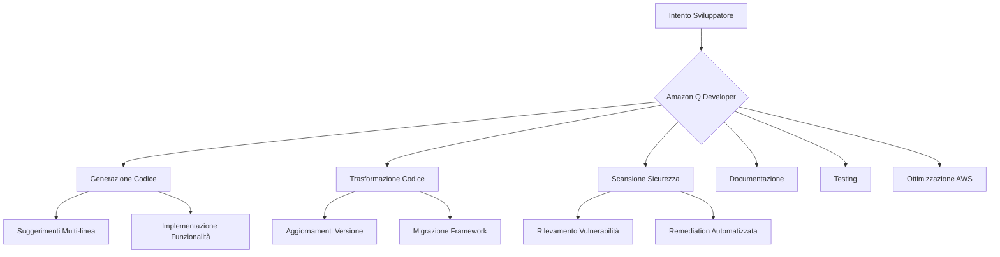

# Amazon Q Developer

## Panoramica

Amazon Q Developer rappresenta un avanzamento trasformativo in come sviluppatori e professionisti IT approcciano lo sviluppo software e le operazioni cloud. Mentre le organizzazioni dipendono sempre più dal software per guidare innovazione e vantaggio competitivo, gli sviluppatori affrontano pressione crescente per fornire codice di alta qualità più velocemente mentre gestiscono requisiti complessi di infrastruttura e sicurezza. **Amazon Q Developer** affronta queste sfide servendo come compagno di codifica alimentato dall'AI che comprende il contesto, genera codice accurato e assiste con l'intero ciclo di vita dello sviluppo software.

La significatività di Amazon Q Developer si estende oltre semplici completamenti di codice. Cambia fondamentalmente come gli sviluppatori interagiscono con il loro ambiente di sviluppo, trasformando ore di lavoro manuale in minuti di produttività assistita dall'AI. Sfruttando **foundation model** avanzati addestrati su vaste quantità di codice ed expertise AWS, Amazon Q Developer permette agli sviluppatori di concentrarsi sulla risoluzione creativa di problemi piuttosto che su compiti ripetitivi.

## Concetti Chiave

Comprendere Amazon Q Developer richiede familiarità con diversi concetti fondamentali che definiscono le sue capacità e integrazione all'interno dell'ecosistema di sviluppo:

**Sviluppo alimentato da AI generativa** si riferisce all'uso di modelli di intelligenza artificiale che possono generare, analizzare e trasformare codice basato su istruzioni in linguaggio naturale e contesto codice esistente. A differenza degli strumenti di completamento codice tradizionali, l'AI generativa comprende l'intento dietro le richieste sviluppatore e può creare implementazioni complesse e multi-file.

**Trasformazione codice** rappresenta la capacità di aggiornare automaticamente e modernizzare codebase esistenti tra diverse versioni linguistiche o framework. Questa capacità va oltre semplici aggiornamenti sintassi per includere miglioramenti architetturali e potenziamenti sicurezza.

**Agenti autonomi** in Amazon Q Developer sono capacità alimentate dall'AI che possono eseguire indipendentemente compiti complessi e multi-step come implementare intere funzionalità, condurre revisioni codice o eseguire remediation sicurezza attraverso un codebase.

**Assistenza context-aware** significa che Amazon Q Developer comprende non solo il codice immediato che viene scritto, ma la struttura progetto più ampia, pattern di codifica e standard organizzativi per fornire suggerimenti più rilevanti e accurati.

**Sicurezza enterprise-grade** comprende le misure di sicurezza complete integrate in Amazon Q Developer, inclusi isolamento dati, crittografia e conformità con controlli di accesso organizzativi.

## Contenuto Principale

### L'Evoluzione dello Sviluppo Alimentato dall'AI

Il panorama dello sviluppo software ha subito trasformazione significativa con l'avvento dell'AI generativa. I workflow di sviluppo tradizionali spesso richiedevano agli sviluppatori di spendere solo il 30% del loro tempo effettivamente scrivendo codice, con il resto consumato da ricerca, debugging, documentazione e compiti di manutenzione. Questa inefficienza non solo rallenta l'innovazione ma contribuisce anche al burnout degli sviluppatori e ritardi nei progetti.

Amazon Q Developer è emerso dal riconoscimento che gli sviluppatori avevano bisogno di più di semplici strumenti migliori—avevano bisogno di un partner intelligente che potesse comprendere il contesto, anticipare necessità e automatizzare compiti di routine. Costruito su **Amazon Bedrock**, il servizio sfrutta foundation model multipli ottimizzati per diversi aspetti dello sviluppo software.

### Capacità e Funzionalità Core

Le capacità di Amazon Q Developer spaziano l'intero ciclo di vita dello sviluppo software, fornendo supporto completo che si adatta a diversi contesti e requisiti di sviluppo:

*Figura 20.50.1: Architettura Capacità Amazon Q Developer. Questo diagramma illustra come Amazon Q Developer elabora l'intento sviluppatore attraverso varie capacità specializzate, ciascuna progettata per affrontare aspetti specifici del ciclo di vita dello sviluppo.*

Le capacità di generazione codice di Amazon Q Developer vanno ben oltre semplice autocompletamento. Quando uno sviluppatore inizia a digitare, il sistema analizza il contesto circostante, incluse librerie importate, struttura progetto e pattern di codifica, per generare suggerimenti rilevanti. Questi suggerimenti spaziano da completamenti singola linea a intere funzioni o classi. Il sistema ha ottenuto tassi di accettazione leader del settore, con organizzazioni come BT Group che riportano 37% di accettazione dei suggerimenti e National Australia Bank che ottiene tassi di accettazione del 50%.

**Amazon Q Developer Agents** rappresentano un approccio rivoluzionario ai compiti di sviluppo automatizzati. Questi agenti possono implementare autonomamente funzionalità complete basate su descrizioni in linguaggio naturale. Per esempio, uno sviluppatore può richiedere "implementa un sistema di autenticazione utenti con supporto OAuth 2.0," e l'agente analizzerà il codebase esistente, creerà un piano di implementazione e genererà tutto il codice, test e documentazione necessari.

### Personalizzazione e Integrazione Enterprise

Le organizzazioni possono migliorare l'efficacia di Amazon Q Developer sfruttando le sue capacità di personalizzazione. Connettendosi in modo sicuro ai repository di codice interni, Amazon Q Developer impara dai pattern di codifica specifici dell'organizzazione, decisioni architetturali e migliori pratiche. Questa personalizzazione assicura che il codice generato si allinei con standard organizzativi e sfrutti librerie e framework interni esistenti.

Il processo di personalizzazione mantiene isolamento dati e sicurezza completi. Il codice cliente usato per la personalizzazione non lascia mai il controllo dell'organizzazione e non viene usato per addestrare modelli per altri clienti.

### Trasformare Applicazioni Legacy

Una delle capacità più impattanti di Amazon Q Developer è la sua capacità di modernizzare applicazioni legacy. La funzionalità di trasformazione codice può automaticamente aggiornare applicazioni tra versioni linguistiche, facendo risparmiare alle organizzazioni mesi o anche anni di sforzo manuale. Questa capacità è particolarmente preziosa per aziende che mantengono codebase grandi che richiedono aggiornamenti regolari per ragioni di sicurezza e conformità.

Durante una dimostrazione notevole di questa capacità, un team di cinque persone ad Amazon ha usato Q Developer per aggiornare più di 1.000 applicazioni di produzione da Java 8 a Java 17 in solo due giorni, con tempo medio di trasformazione di meno di 10 minuti per applicazione.

### Expertise AWS e Ottimizzazione Cloud

L'integrazione profonda di Amazon Q Developer con i servizi AWS lo rende uno strumento inestimabile per sviluppo e operazioni cloud. Il sistema è stato addestrato su oltre 17 anni di esperienza AWS e migliori pratiche, permettendogli di fornire guida esperta su selezione servizi, design architettura e ottimizzazione costi.

Quando si lavora nella Console di Gestione AWS, gli sviluppatori possono fare domande in linguaggio naturale sulla loro infrastruttura e ricevere risposte immediate e contestuali. Per esempio, query come "Quali istanze stanno funzionando in us-east-1?" o "Quali erano i miei costi EC2 per regione il mese scorso?" restituiscono informazioni precise con link rilevanti per esplorazione più profonda.

## Applicazioni Pratiche

Amazon Q Developer trova applicazione attraverso scenari di sviluppo diversi e contesti organizzativi:

Nel **prototipazione rapida e sviluppo funzionalità**, i team usano Amazon Q Developer per implementare rapidamente nuove funzionalità e testare idee. L'assistente AI può generare codice boilerplate, implementare pattern comuni e creare prototipi funzionanti in una frazione del tempo tradizionale.

Per **revisione codice e garanzia qualità**, Amazon Q Developer serve come revisore automatizzato che cattura bug, identifica potenziali problemi di sicurezza e suggerisce miglioramenti. La capacità del sistema di comprendere l'intento codice e identificare anti-pattern aiuta a mantenere standard di qualità codice alti attraverso team di sviluppo grandi.

### Studi di Caso

**National Australia Bank: Trasformare l'Esperienza Sviluppatore**

National Australia Bank (NAB), una delle più grandi istituzioni finanziarie dell'Australia con oltre 10 milioni di clienti, ha implementato con successo Amazon Q Developer per trasformare le loro pratiche di sviluppo software. Con più di 3.000 sviluppatori attraverso Australia, India e Vietnam che gestiscono milioni di linee di codice, NAB affrontava sfide nel mantenere standard di sicurezza, conformità e qualità accelerando lo sviluppo.

I risultati sono stati notevoli:
- **Tasso di accettazione codice 50%** dai suggerimenti Amazon Q Developer
- **40% del codice di produzione** ora proviene da suggerimenti generati dall'AI
- **Aumento produttività complessiva 18%** attraverso team di sviluppo
- Trasformato dozzine di applicazioni da Java 8 a Java 17 in ore invece di settimane[^6]

[^6]: National Australia Bank Case Study - Transforming the Developer Experience with Amazon Q. URL: <https://aws.amazon.com/solutions/case-studies/generative-ai-national-australia-bank/>

**BT Group: Adozione Enterprise-Scale**

BT Group, il gigante delle telecomunicazioni del Regno Unito, ha distribuito Amazon Q Developer a 1.200 sviluppatori dopo trial iniziali di successo. L'azienda ha integrato l'assistente alimentato dall'AI nel loro workflow di sviluppo per affrontare la sfida di mantenere qualità codice consistente attraverso progetti multipli.[^8]

[^8]: BT Group Amazon Q Developer Case Study. URL: <https://www.computerweekly.com/news/366588627/Case-study-BT-rolls-out-Amazons-generative-AI-developer-tool-to-more-coders>

Risultati chiave includono:
- **Tasso di accettazione 37%** dei suggerimenti codice da ingegneri software
- **200.000 linee di codice** scritte con assistenza AI
- **Automazione 12%** di compiti di codifica tediosi e ripetitivi
- Miglioramento significativo nelle metriche di qualità codice

## Riassunto

Amazon Q Developer rappresenta un cambio fondamentale in come il software viene creato, mantenuto e ottimizzato. Combinando capacità AI avanzate con expertise AWS profonda, permette agli sviluppatori di concentrarsi sull'innovazione piuttosto che su compiti ripetitivi. La capacità del sistema di generare codice accurato, trasformare applicazioni legacy, assicurare sicurezza e fornire guida esperta lo rende uno strumento essenziale per team di sviluppo moderni.

L'impatto di Amazon Q Developer si estende oltre guadagni di produttività individuali. Abilita le organizzazioni ad affrontare debito tecnico, migliorare qualità codice e accelerare innovazione su scala. Man mano che la tecnologia continua a evolversi, la sua integrazione con workflow di sviluppo diventerà ancora più seamless, amplificando ulteriormente le capacità sviluppatore e abilitando nuove possibilità nella creazione software.

Per organizzazioni che intraprendono il loro percorso di sviluppo assistito dall'AI, Amazon Q Developer fornisce un percorso sicuro, scalabile ed efficace verso il futuro. Seguendo migliori pratiche, affrontando sfide proattivamente e sfruttando l'intera gamma di capacità, i team possono trasformare i loro processi di sviluppo e fornire maggiore valore alle loro organizzazioni.

[^6]: National Australia Bank Case Study - Transforming the Developer Experience with Amazon Q. URL: <https://aws.amazon.com/solutions/case-studies/generative-ai-national-australia-bank/>
[^8]: BT Group Amazon Q Developer Case Study. URL: <https://www.computerweekly.com/news/366588627/Case-study-BT-rolls-out-Amazons-generative-AI-developer-tool-to-more-coders>