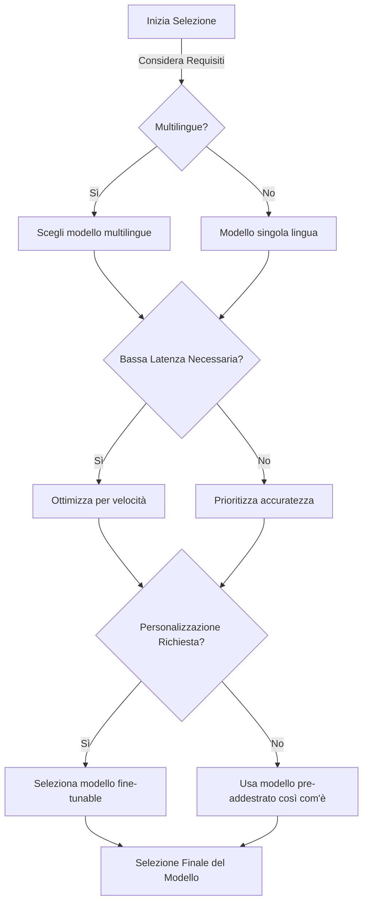
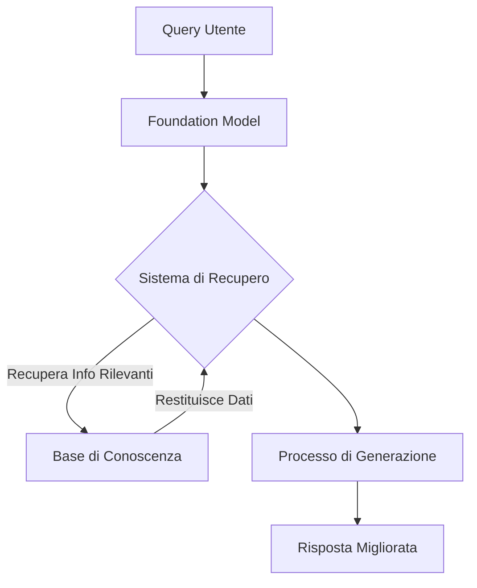
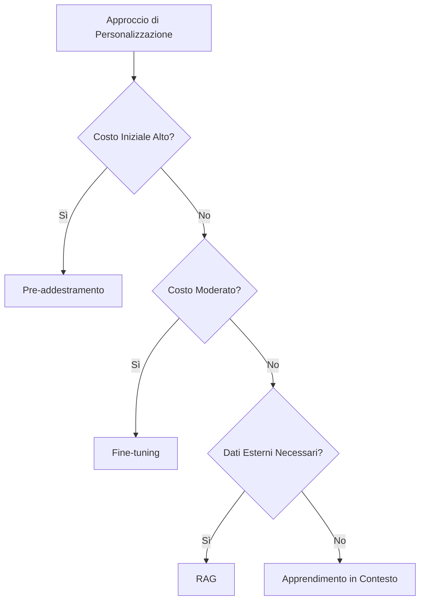
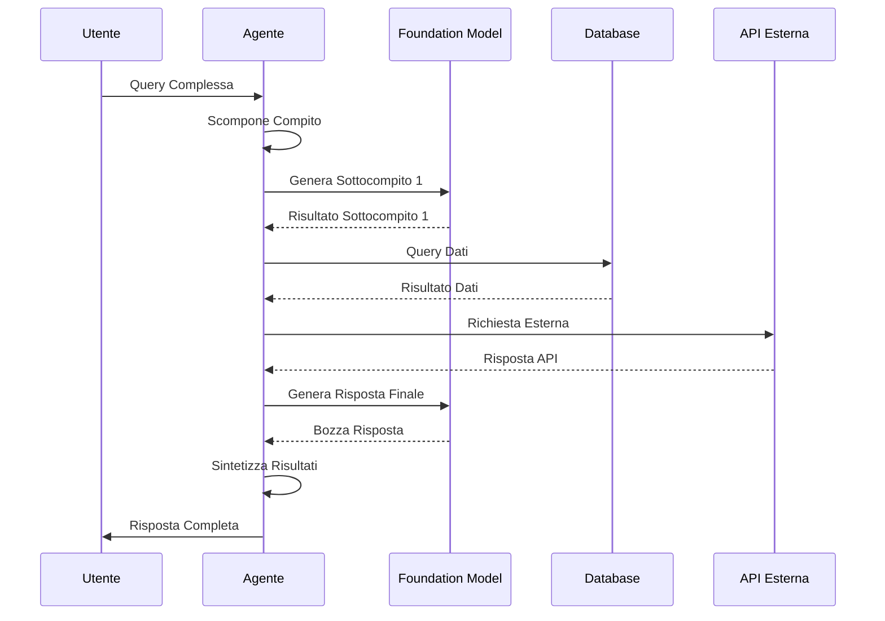

## 3.1 Considerazioni di progettazione per applicazioni che utilizzano foundation model

I foundation model rappresentano un progresso significativo nell'intelligenza artificiale, offrendo potenti capacità nell'elaborazione del linguaggio naturale, nella generazione di immagini e nella risoluzione di problemi complessi. Questi sofisticati modelli di IA, disponibili attraverso servizi come Amazon Bedrock[^600], hanno trasformato il modo in cui le organizzazioni approcciano l'implementazione dell'IA. Comprendere le considerazioni di progettazione per applicazioni che sfruttano questi modelli è essenziale sia per la preparazione all'esame AWS Certified AI Practitioner che per l'implementazione nel mondo reale.

Progettare e implementare efficacemente applicazioni con foundation model è diventata una competenza critica mentre l'adozione dell'IA accelera in tutti i settori. Ogni decisione di progettazione—dalla selezione del modello alla configurazione dei parametri e all'implementazione di tecniche come la **Retrieval Augmented Generation (RAG)**[^601]—influenza significativamente le prestazioni, i costi e il successo complessivo. Rimanere aggiornati con i servizi AWS e le migliori pratiche per la personalizzazione e il deployment dei modelli fornisce alle organizzazioni un vantaggio competitivo in un mercato sempre più guidato dall'IA.

### Identificazione dei criteri di selezione per modelli pre-addestrati

Selezionare il modello pre-addestrato appropriato è un passo fondamentale che influenza significativamente le prestazioni, il costo e l'efficacia della vostra soluzione di IA. Considerate questi criteri di selezione chiave:

1. **Costo**: Le implicazioni finanziarie variano ampiamente tra i modelli. Modelli più grandi e complessi tipicamente comportano costi computazionali più elevati sia per l'addestramento che per l'inferenza, richiedendo un'attenta considerazione del budget.

2. **Modalità**: I foundation model gestiscono vari tipi di dati inclusi testo, immagini, audio e input multimodali. Selezionare un modello allineato con il tipo di dati primario della vostra applicazione garantisce prestazioni ottimali.

3. **Latenza**: Applicazioni in tempo reale come chatbot o sistemi di raccomandazione richiedono bassa latenza. Modelli più piccoli o quelli ottimizzati per la velocità di inferenza spesso performano meglio in questi scenari.

4. **Supporto multilingue**: Per applicazioni globali, modelli con robuste capacità multilingue consentono comunicazione senza interruzioni attraverso diverse lingue e mercati.

5. **Dimensione e complessità del modello**: Modelli più grandi tipicamente offrono maggiore accuratezza ma richiedono più risorse computazionali. Questo richiede il bilanciamento delle esigenze di prestazione con l'infrastruttura disponibile.

6. **Opzioni di personalizzazione**: Alcuni modelli sono più predisposti al fine-tuning o all'adattamento specifico del dominio. Applicazioni che richiedono conoscenza specializzata beneficiano di modelli che supportano personalizzazione efficiente.

7. **Lunghezza di input/output**: I modelli hanno limitazioni variabili nell'elaborazione dell'input e nella generazione dell'output. Assicuratevi che il vostro modello selezionato gestisca le dimensioni dei dati previste.

Per illustrare il processo di selezione, considerate un'azienda di e-commerce globale che progetta un chatbot di servizio clienti alimentato dall'IA:

*Figura 3.1.1: Diagramma di Flusso per la Selezione del Modello. Questo diagramma illustra il processo decisionale per selezionare un foundation model appropriato basato su criteri chiave come supporto multilingue, requisiti di latenza e necessità di personalizzazione.*

In questo scenario, l'azienda potrebbe prioritizzare un modello multilingue con bassa latenza e opzioni di personalizzazione per gestire efficientemente diverse richieste dei clienti attraverso mercati differenti. Potrebbero sfruttare Amazon Bedrock per accedere a una varietà di foundation model e scegliere uno che meglio si adatta a questi criteri, come il modello Anthropic Claude[^602] per le sue forti capacità multilingue e opzioni di personalizzazione.

### Comprensione dell'effetto dei parametri di inferenza sulle risposte del modello

Una volta selezionato un foundation model adatto, ottimizzare i parametri di inferenza diventa cruciale per perfezionare le risposte del modello per soddisfare esigenze specifiche dell'applicazione. Due parametri chiave che influenzano significativamente l'output del modello sono la temperatura e la lunghezza di input/output.

1. **Temperatura**: Questo parametro controlla la casualità o creatività dell'output del modello. 
   - Temperatura più bassa (es. 0.2) risulta in risposte più deterministiche e focalizzate.
   - Temperatura più alta (es. 0.8) porta a output più diversi e creativi.

2. **Lunghezza di Input/Output**: Questi parametri definiscono il conteggio massimo di token per i prompt di input e le risposte generate.
   - Input più lunghi forniscono più contesto ma possono aumentare il tempo di elaborazione e i costi.
   - Output più lunghi consentono risposte più dettagliate ma possono anche introdurre informazioni irrilevanti.

Esaminiamo come questi parametri potrebbero influenzare un chatbot di servizio clienti:

*Tabella 3.1.1: Effetto della Temperatura sulle Risposte del Modello*
| Caratteristica | Temperatura Bassa (0.2) | Temperatura Alta (0.8) |
|---------|----------------------|------------------------|
| **Stile di Risposta** | Risposte concise e fattuali | Risposte creative e varie |
| **Informazioni** | Informazioni consistenti e affidabili | Suggerimenti esplorativi e diversi |
| **Casi d'Uso Migliori** | Query specifiche, informazioni fattuali | Brainstorming, compiti creativi |
| **Prevedibilità** | Alta prevedibilità | Maggiore casualità |
| **Casi d'uso** | - Domande e risposte   - Recupero informazioni fattuali   - Spiegazioni tecniche   - Output consistenti attraverso più esecuzioni   - Seguire istruzioni precise  | - Scrittura creativa  - Generazione di idee  - Soluzioni alternative multiple  - Varietà conversazionale - Esplorazione di possibilità |

In pratica, le aziende potrebbero regolare questi parametri basandosi sul caso d'uso specifico. Per esempio, quando si gestiscono query di supporto tecnico, un'impostazione di temperatura più bassa potrebbe garantire risposte più precise e consistenti. Al contrario, per raccomandazioni di prodotti o generazione di contenuti creativi, una temperatura più alta potrebbe essere preferita per generare suggerimenti diversi.

### Definizione di Retrieval Augmented Generation (RAG) e le sue applicazioni aziendali

**Retrieval Augmented Generation (RAG)** è un approccio innovativo che migliora i foundation model incorporando basi di conoscenza esterne. Questa tecnica consente ai modelli di accedere e utilizzare informazioni aggiornate e specifiche del dominio, migliorando significativamente l'accuratezza e la rilevanza dei loro output[^603].

Componenti chiave di RAG:
1. **Foundation Model**: Il modello linguistico centrale (es. GPT-3, BERT)
2. **Base di Conoscenza**: Fonte di dati esterni contenente informazioni rilevanti
3. **Sistema di Recupero**: Meccanismo per recuperare informazioni pertinenti dalla base di conoscenza
4. **Processo di Generazione**: Combina informazioni recuperate con la conoscenza intrinseca del modello

RAG offre diversi vantaggi per le applicazioni aziendali:
- **Accuratezza Migliorata**: Incorporando informazioni attuali e specifiche
- **Riduzione delle Allucinazioni**: Minimizza la generazione di contenuti falsi o irrilevanti
- **Personalizzazione**: Consente di adattare le risposte a domini aziendali specifici
- **Informazioni Aggiornate**: Permette l'accesso agli ultimi dati senza costante riaddestramento del modello

*Figura 3.1.3: Processo di Retrieval Augmented Generation. Questo diagramma illustra il flusso di informazioni in un sistema RAG, dalla query utente iniziale attraverso il foundation model, il sistema di recupero e la base di conoscenza, culminando in una risposta migliorata.*

Applicazioni aziendali di RAG utilizzando Amazon Bedrock[^604]:
1. **Supporto Clienti**: Integrazione di informazioni specifiche sui prodotti dell'azienda e politiche per risposte accurate
2. **Analisi Finanziaria**: Incorporazione di dati di mercato in tempo reale per decisioni informate
3. **Sanità**: Accesso a ricerca medica aggiornata per raccomandazioni di cura del paziente
4. **Servizi Legali**: Recupero di giurisprudenza attuale e regolamentazioni per consulenza legale
5. **E-commerce**: Miglioramento delle raccomandazioni di prodotto con inventario e prezzi in tempo reale

Sfruttando RAG attraverso Amazon Bedrock, le aziende possono creare applicazioni di IA più intelligenti e consapevoli del contesto che forniscono informazioni accurate, rilevanti e aggiornate agli utenti.

### Identificazione dei servizi AWS per memorizzare embedding nei database vettoriali

Gli **embedding** sono componenti cruciali nelle moderne applicazioni di IA, rappresentando dati complessi (come testo o immagini) come vettori densi. Questi vettori catturano relazioni semantiche, consentendo ricerche di similarità efficienti e migliorando le prestazioni dei modelli di IA. AWS offre diversi servizi che possono essere utilizzati per memorizzare e gestire questi embedding nei database vettoriali:

1. **Amazon OpenSearch Service**[^605]: 
   - Supporta capacità di ricerca vettoriale
   - Ideale per ricerca e analitiche su larga scala e in tempo reale
   - Offre alte prestazioni per ricerche di similarità

2. **Amazon Aurora**[^606]: 
   - L'edizione compatibile con PostgreSQL supporta operazioni vettoriali
   - Si integra bene con flussi di lavoro di database relazionali esistenti
   - Adatto per applicazioni che richiedono sia query tradizionali che basate su vettori

3. **Amazon Neptune**[^607]: 
   - Database a grafo con capacità di ricerca vettoriale
   - Eccellente per query basate su relazioni e raccomandazioni
   - Supporta strutture dati e relazioni complesse

4. **Amazon DocumentDB (con compatibilità MongoDB)**[^608]: 
   - Database di documenti che supporta ricerca vettoriale
   - Ideale per dati semi-strutturati e schemi flessibili
   - Compatibile con driver e strumenti MongoDB

5. **Amazon RDS per PostgreSQL**[^609]: 
   - Database relazionale gestito con supporto per estensioni vettoriali
   - Adatto per applicazioni che richiedono conformità ACID
   - Si integra bene con sistemi basati su PostgreSQL esistenti

Per illustrare come questi servizi potrebbero essere utilizzati in uno scenario del mondo reale, considerate la seguente tabella che confronta le loro caratteristiche:

*Tabella 3.1.2: Confronto dei Servizi AWS per Database Vettoriali*

| Servizio | Capacità Ricerca Vettoriale | Migliore Per | Scalabilità | Integrazione |
|---------|--------------------------|----------|-------------|-------------|
| Amazon OpenSearch Service | Supporto nativo | Ricerca su larga scala e in tempo reale | Alta | API Elasticsearch |
| Amazon Aurora | Via estensione pgvector | Carichi di lavoro ibridi relazionali/vettoriali | Alta | SQL |
| Amazon Neptune | Supporto integrato | Raccomandazioni basate su grafi | Alta | Gremlin, SPARQL |
| Amazon DocumentDB | Via Atlas Vector Search | Dati flessibili basati su documenti | Moderata | API MongoDB |
| Amazon RDS per PostgreSQL | Via estensione pgvector | RDBMS tradizionale con supporto vettoriale | Moderata | SQL |

La scelta del servizio giusto dipende da fattori come:
- Infrastruttura dati esistente
- Pattern di query richiesti
- Scala delle operazioni vettoriali
- Necessità di integrazione con altri servizi AWS

Per esempio, un sistema di raccomandazione per una piattaforma di e-commerce potrebbe sfruttare Amazon Neptune per memorizzare embedding di prodotti e dati di relazioni clienti, consentendo query di raccomandazione complesse che considerano sia la similarità degli articoli che il comportamento degli utenti.

### Spiegazione dei trade-off di costo degli approcci di personalizzazione dei foundation model

Personalizzare i foundation model per soddisfare specifiche esigenze aziendali è un aspetto cruciale dello sviluppo di applicazioni di IA. Tuttavia, diversi approcci di personalizzazione comportano implicazioni di costo variabili. Comprendere questi trade-off è essenziale per prendere decisioni informate sul deployment e l'ottimizzazione dei modelli.

Esploriamo i principali approcci di personalizzazione e le loro considerazioni di costo associate:

1. **Pre-addestramento**:
   - Processo: Addestrare un modello da zero su dati specifici del dominio
   - Costi: Investimento iniziale più alto in risorse computazionali e tempo
   - Benefici: Modello completamente personalizzato adattato al dominio specifico
   - Migliore per: Organizzazioni grandi con dati sostanziali e requisiti unici

2. **Fine-tuning**:
   - Processo: Regolare i pesi del modello pre-addestrato su dati specifici del dominio
   - Costi: Risorse computazionali moderate, tempo di addestramento più breve del pre-addestramento
   - Benefici: Prestazioni migliorate su compiti specifici mentre si sfrutta la conoscenza generale
   - Migliore per: Organizzazioni con dati moderati e casi d'uso specifici

3. **Apprendimento in contesto**:
   - Processo: Fornire esempi o istruzioni all'interno del prompt di input
   - Costi: Costo computazionale aggiuntivo minimo, nessun addestramento richiesto
   - Benefici: Adattamento rapido a nuovi compiti senza modifica del modello
   - Migliore per: Prototipazione rapida o gestione di compiti diversi e a basso volume

4. **Retrieval Augmented Generation (RAG)**:
   - Processo: Migliorare le risposte del modello con base di conoscenza esterna
   - Costi: Costi aggiuntivi di archiviazione e recupero, addestramento minimo richiesto
   - Benefici: Accuratezza migliorata e informazioni aggiornate senza riaddestramento completo
   - Migliore per: Applicazioni che richiedono conoscenza attuale e specifica del dominio

Per visualizzare i trade-off costo-beneficio di questi approcci, considerate il seguente diagramma:

*Figura 3.1.4: Albero Decisionale Costo-Beneficio per la Personalizzazione del Modello. Questo diagramma illustra il processo decisionale per scegliere un approccio di personalizzazione del modello basato su considerazioni di costo e necessità specifiche.*

Quando si sfrutta Amazon Bedrock per la personalizzazione dei foundation model, le aziende possono ottimizzare i costi attraverso:
- Iniziare con l'apprendimento in contesto per esperimenti rapidi
- Utilizzare RAG per incorporare conoscenza del dominio senza riaddestramento completo
- Impiegare il fine-tuning per casi d'uso specifici con volumi di dati moderati
- Considerare il pre-addestramento solo per applicazioni su larga scala e uniche

Valutando attentamente questi trade-off, le organizzazioni possono bilanciare i requisiti di prestazione con i vincoli di budget, garantendo implementazioni di IA efficienti ed efficaci.

### Comprensione del ruolo degli agenti nei compiti multi-step

Gli **agenti** nelle applicazioni di IA, particolarmente quelli costruiti sui foundation model, giocano un ruolo cruciale nella gestione di compiti complessi e multi-step. Questi agenti agiscono come intermediari intelligenti, scomponendo query complesse in passi gestibili, orchestrando molteplici servizi di IA e fornendo risposte coerenti agli utenti. Amazon Bedrock offre capacità di Agenti[^610] che migliorano significativamente l'abilità dei foundation model di performare operazioni sofisticate e multi-step.

Aspetti chiave degli agenti di IA:
1. **Decomposizione dei Compiti**: Scomporre query complesse in sottocmpiti più piccoli e gestibili
2. **Orchestrazione dei Servizi**: Coordinare molteplici servizi di IA e cloud per completare i compiti
3. **Gestione del Contesto**: Mantenere il contesto attraverso molteplici interazioni o passi
4. **Presa di Decisioni**: Scegliere azioni appropriate basate su risultati intermedi
5. **Sintesi delle Risposte**: Combinare risultati da molteplici passi in output coerenti

Esploriamo come gli agenti potrebbero gestire uno scenario aziendale complesso:

*Figura 3.1.5: Flusso di Lavoro dell'Agente per Compiti Multi-step. Questo diagramma illustra come un agente di IA orchestra vari componenti per gestire una query complessa, dalla decomposizione del compito attraverso l'interazione con molteplici servizi alla sintesi finale della risposta.*

Applicazioni aziendali degli agenti in Amazon Bedrock:
1. **Servizio Clienti**: Gestire richieste complesse che richiedono l'accesso a molteplici database, politiche e servizi esterni
2. **Pianificazione Finanziaria**: Orchestrare analisi di mercato, valutazione del rischio e generazione di raccomandazioni personalizzate
3. **Ottimizzazione della Catena di Fornitura**: Coordinare controlli di inventario, previsioni della domanda e pianificazione logistica
4. **Diagnostica Sanitaria**: Gestire processi di analisi dei dati dei pazienti, controllo dei sintomi e raccomandazione dei trattamenti
5. **Pianificazione di Viaggi**: Orchestrare ricerche di voli, prenotazioni alberghiere e ottimizzazione degli itinerari basata sulle preferenze degli utenti

Sfruttando gli agenti in Amazon Bedrock, le aziende possono creare applicazioni di IA più sofisticate capaci di gestire compiti complessi e multi-step che imitano da vicino i processi di risoluzione dei problemi umani. Questo approccio non solo migliora le capacità dei sistemi di IA ma migliora anche l'esperienza utente fornendo risposte complete e consapevoli del contesto a query complesse.

In conclusione, progettare applicazioni che utilizzano efficacemente i foundation model richiede un'attenta considerazione di vari fattori, dalla selezione del modello e la regolazione dei parametri a tecniche avanzate come RAG e l'uso di agenti di IA. Comprendendo queste considerazioni di progettazione e sfruttando le potenti capacità di Amazon Bedrock e servizi AWS correlati, le aziende possono creare applicazioni di IA che sono non solo potenti ed efficienti ma anche adattate alle loro esigenze e vincoli specifici. Mentre il campo dell'IA continua a evolversi rapidamente, rimanere informati su questi principi di progettazione e migliori pratiche sarà cruciale per i professionisti aziendali che mirano a sfruttare il pieno potenziale dell'IA nelle loro organizzazioni.

### Domande per l'auto-verifica

1. **Quando si seleziona un foundation model pre-addestrato per un'applicazione di IA, quale dei seguenti NON è tipicamente una considerazione chiave?**

   A. Dimensione e complessità del modello
   B. Supporto multilingue
   C. La dimensione del dataset di addestramento del modello
   D. Limitazioni della lunghezza di input/output

2. **Un'azienda sta sviluppando un chatbot di servizio clienti alimentato dall'IA che deve fornire risposte consistenti e fattuali. Quale impostazione di temperatura sarebbe più appropriata per questo caso d'uso?**

   A. 0.2
   B. 0.5
   C. 0.8
   D. 1.0

3. **Quale servizio AWS è più adatto per memorizzare embedding in un database vettoriale quando l'applicazione richiede sia query relazionali tradizionali che ricerche di similarità basate su vettori?**

   A. Amazon OpenSearch Service
   B. Amazon Aurora
   C. Amazon Neptune
   D. Amazon DocumentDB

4. **Una startup sta sviluppando un'applicazione di IA che deve sfruttare informazioni aggiornate specifiche del settore senza costante riaddestramento del modello. Quale approccio sarebbe più adatto per questo scenario?**

   A. Pre-addestramento
   B. Fine-tuning
   C. Apprendimento in contesto
   D. Retrieval Augmented Generation (RAG)

5. **Nel contesto degli agenti di IA che gestiscono compiti multi-step, quale dei seguenti NON è un aspetto chiave della loro funzionalità?**

   A. Decomposizione dei compiti
   B. Orchestrazione dei servizi
   C. Pre-addestramento del modello
   D. Sintesi delle risposte

### Risposte e Spiegazioni

1. **Risposta corretta: C. La dimensione del dataset di addestramento del modello**

   Spiegazione: Mentre la dimensione del dataset di addestramento è importante per la qualità complessiva di un foundation model, non è tipicamente una considerazione chiave quando si seleziona un modello pre-addestrato per un'applicazione. Il sottocapitolo menziona costo, modalità, latenza, supporto multilingue, dimensione e complessità del modello, opzioni di personalizzazione e lunghezza di input/output come criteri di selezione primari. La dimensione del dataset di addestramento è generalmente non direttamente rilevante per le esigenze specifiche dell'applicazione ed è più una caratteristica interna dello sviluppo del modello[^611].

2. **Risposta corretta: A. 0.2**

   Spiegazione: Per un chatbot di servizio clienti che deve fornire risposte consistenti e fattuali, un'impostazione di temperatura più bassa è più appropriata. Il sottocapitolo spiega che valori di temperatura più bassi (es. 0.2) risultano in risposte più deterministiche e focalizzate, che è ideale per scenari che richiedono informazioni fattuali e consistenti. Temperature più alte (come 0.8) portano a output più diversi e creativi, che non è desiderabile per questo caso d'uso specifico dove accuratezza e consistenza sono prioritarie[^612].

3. **Risposta corretta: B. Amazon Aurora**

   Spiegazione: Secondo il sottocapitolo, Amazon Aurora (edizione compatibile con PostgreSQL) supporta operazioni vettoriali e si integra bene con flussi di lavoro di database relazionali esistenti. È descritto come adatto per applicazioni che richiedono sia query tradizionali che basate su vettori. Questo lo rende la scelta ideale per uno scenario dove sono necessarie sia query relazionali che ricerche di similarità basate su vettori, offrendo un equilibrio tra funzionalità di database tradizionale e capacità di ricerca vettoriale[^613].

4. **Risposta corretta: D. Retrieval Augmented Generation (RAG)**

   Spiegazione: Retrieval Augmented Generation (RAG) è l'approccio più adatto per questo scenario. Il sottocapitolo descrive RAG come una tecnica che migliora i foundation model incorporando basi di conoscenza esterne, permettendo l'accesso a informazioni aggiornate e specifiche del dominio senza costante riaddestramento del modello. Questo si allinea perfettamente con la necessità della startup di sfruttare informazioni attuali specifiche del settore senza aggiornamenti frequenti del modello, rendendolo più efficiente e conveniente rispetto ad alternative come pre-addestramento o fine-tuning[^614].

5. **Risposta corretta: C. Pre-addestramento del modello**

   Spiegazione: Il pre-addestramento del modello non è elencato come un aspetto chiave della funzionalità degli agenti di IA nella gestione di compiti multi-step. Il sottocapitolo delinea gli aspetti chiave degli agenti di IA come decomposizione dei compiti, orchestrazione dei servizi, gestione del contesto, presa di decisioni e sintesi delle risposte. Il pre-addestramento del modello è un processo separato che avviene prima del deployment del foundation model e non fa parte del ruolo dell'agente nella gestione di compiti complessi e multi-step[^615].

[^600]: Amazon Bedrock Overview. URL: <https://aws.amazon.com/bedrock/>
[^601]: Foundation Models for RAG - Amazon Bedrock Knowledge Bases. URL: <https://aws.amazon.com/bedrock/knowledge-bases/>
[^602]: Anthropic Claude on Amazon Bedrock. URL: <https://aws.amazon.com/bedrock/claude/>
[^603]: Retrieve data and generate AI responses with Amazon Bedrock Knowledge Bases. URL: <https://docs.aws.amazon.com/bedrock/latest/userguide/knowledge-base.html>
[^604]: Build Generative AI Applications with Foundation Models - Amazon Bedrock. URL: <https://aws.amazon.com/bedrock/>
[^605]: Amazon OpenSearch Service Vector Search. URL: <https://docs.aws.amazon.com/opensearch-service/latest/developerguide/vector-search.html>
[^606]: Amazon Aurora PostgreSQL Vector Support. URL: <https://docs.aws.amazon.com/AmazonRDS/latest/AuroraUserGuide/postgresql-vector.html>
[^607]: Amazon Neptune Vector Search. URL: <https://docs.aws.amazon.com/neptune/latest/userguide/vector-search.html>
[^608]: Amazon DocumentDB Vector Search. URL: <https://docs.aws.amazon.com/documentdb/latest/developerguide/vector-search.html>
[^609]: Amazon RDS for PostgreSQL Vector Support. URL: <https://docs.aws.amazon.com/AmazonRDS/latest/UserGuide/PostgreSQL_vector.html>
[^610]: Amazon Bedrock Agents Overview. URL: <https://docs.aws.amazon.com/bedrock/latest/userguide/agents.html>
[^611]: AWS Foundation Model Selection Guide. URL: <https://docs.aws.amazon.com/bedrock/latest/userguide/model-selection.html>
[^612]: AWS Foundation Model Inference Parameters. URL: <https://docs.aws.amazon.com/bedrock/latest/userguide/inference-parameters.html>
[^613]: Building AI-powered search in PostgreSQL using Amazon SageMaker and pgvector. URL: <https://aws.amazon.com/blogs/database/building-ai-powered-search-in-postgresql-using-amazon-sagemaker-and-pgvector/>
[^614]: Retrieve data and generate AI responses with Amazon Bedrock Knowledge Bases. URL: <https://docs.aws.amazon.com/bedrock/latest/userguide/knowledge-base.html>
[^615]: Amazon Bedrock Agents Functionality. URL: <https://docs.aws.amazon.com/bedrock/latest/userguide/agents-functionality.html>