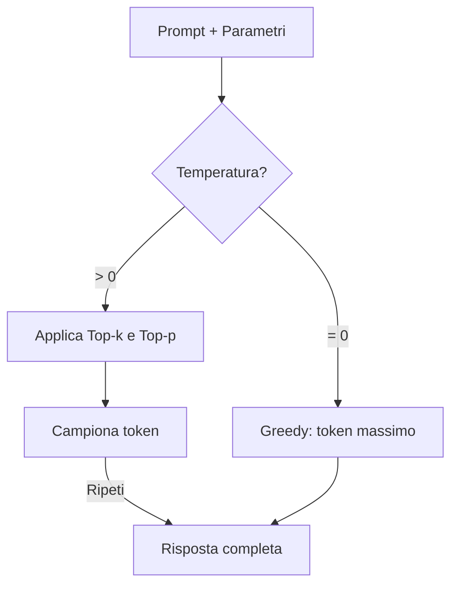
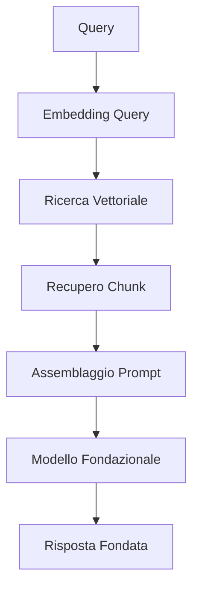
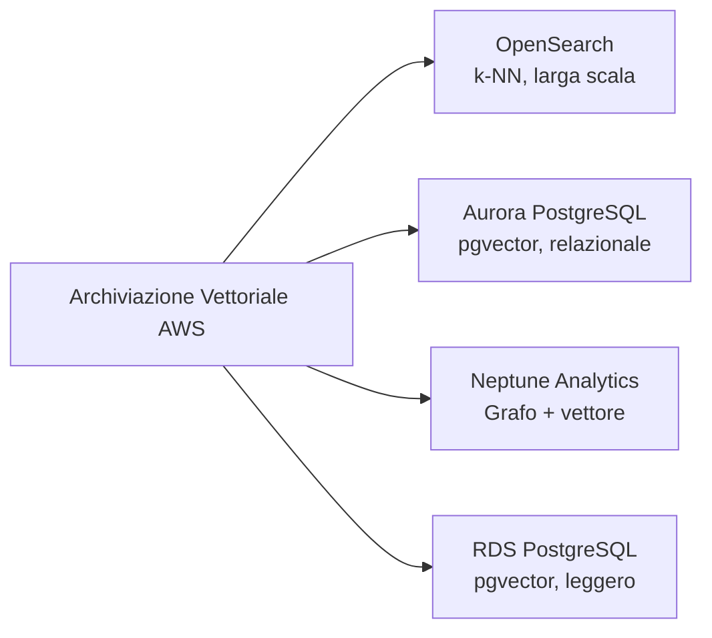
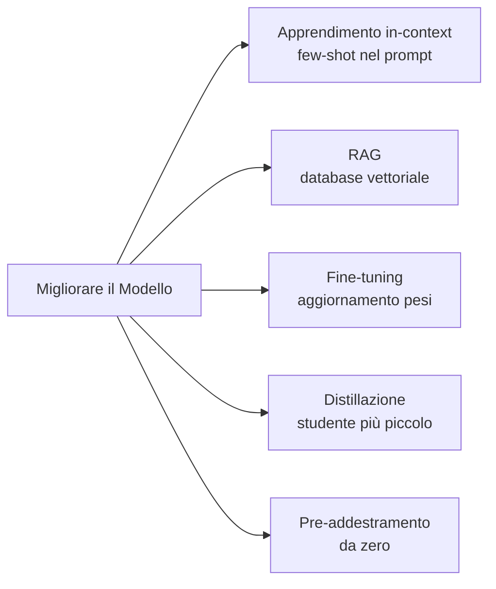
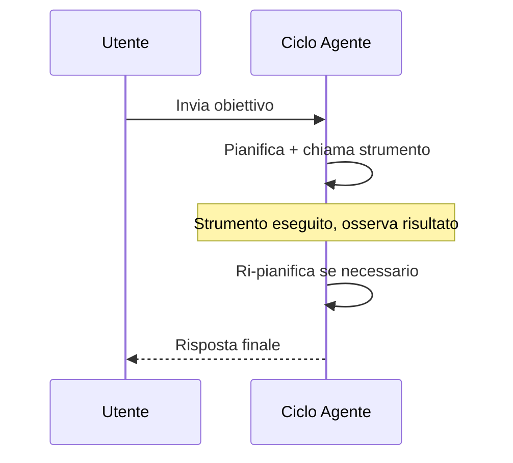

## Task Statement 3.1: Descrivere le considerazioni di progettazione per le applicazioni che utilizzano modelli fondazionali (FM)

La creazione di un'applicazione in produzione su un modello fondazionale inizia molto prima del primo prompt. Le decisioni che si prendono in fase di progettazione, quale modello usare, come regolare i suoi output, come ancorarli a dati privati, dove archiviare questi dati e come scalare la conoscenza nel tempo, determinano se il progetto creerà valore o si bloccherà nella fase pilota. Questo task statement copre quelle decisioni nell'ordine in cui un architetto aziendale le affronterebbe.[^301001]

### 3.1.1 Criteri di selezione per la scelta degli FM

La scelta di un modello fondazionale non è una decisione tecnica una-tantum; ricorre ogni volta che i requisiti aziendali cambiano. Un modello che ha mostrato prestazioni accettabili in un pilota può diventare troppo costoso al volume di produzione. Un modello che rispondeva bene alle domande dei clienti in inglese potrebbe necessitare di sostituzione quando il prodotto si espande nei mercati di lingua spagnola. Comprendere i criteri di selezione mantiene queste decisioni sistematiche piuttosto che reattive.

I criteri che l'esame copre rientrano in tre gruppi. I criteri di costo e performance governano quanto costa eseguire il modello e quanto velocemente risponde. I criteri di capacità governano ciò che il modello può fare. I criteri di flessibilità governano quanto il modello può essere modificato per adattarsi all'azienda.

Il **costo** è misurato per token, dove un token corrisponde approssimativamente a tre quarti di una parola in inglese (o circa quattro caratteri di testo in inglese).[^301036] I token di input (il prompt) e i token di output (la risposta) vengono prezzati separatamente, e i token di output sono costantemente più costosi.[^301002] Un assistente per il servizio clienti che legge una cronologia di 500 parole del cliente e produce una risposta di 100 parole consumerà circa 670 token di input e 130 token di output per interazione. Alla scala produttiva quella aritmetica conta enormemente. Il **caching del prompt** riduce il costo effettivo riutilizzando la rappresentazione elaborata dal modello di un prefisso statico, come un lungo system prompt o un catalogo prodotti, tra più chiamate. Amazon Bedrock supporta il caching del prompt per modelli selezionati, incluso Anthropic Claude su Bedrock, rendendolo una leva di costo significativa quando un grande blocco di contesto viene riutilizzato tra migliaia di richieste giornaliere.[^301003]

La **modalità** si riferisce ai tipi di input che un modello può accettare e ai tipi di output che può produrre.[^301037] Un modello *solo testo* legge testo e produce testo. Un modello *multi-modale* può anche leggere immagini, documenti o audio. Se un'applicazione aziendale ha bisogno di classificare fatture scansionate o rispondere a domande su foto di prodotti, un modello multi-modale è obbligatorio, e il costo per interazione sarà più alto. Selezionare un modello solo testo per un compito di solo testo evita di pagare per capacità multi-modali non utilizzate.

La **latenza** è il tempo dal momento in cui viene inviata una richiesta al momento in cui appare il primo token della risposta.[^301038] Le applicazioni interattive come i chatbot richiedono bassa latenza; una pausa di cinque secondi rompe l'esperienza conversazionale. Le applicazioni in batch come il riepilogo notturno di documenti possono tollerare una latenza più alta in cambio di un costo inferiore. La dimensione del modello è uno dei principali fattori di latenza: i modelli più piccoli funzionano più velocemente ma hanno una capacità di ragionamento inferiore, mentre i modelli più grandi ragionano meglio ma impiegano più tempo a rispondere. La **dimensione del modello** è misurata in miliardi di parametri, i pesi numerici appresi all'interno della rete. Un modello da 7 miliardi di parametri tipicamente risponde in meno di un secondo su infrastruttura appropriata; un modello da 70 miliardi di parametri può richiedere diversi secondi per lo stesso prompt.[^301004]

La **complessità del modello** si riferisce alle scelte di progettazione architetturale che vanno oltre il conteggio dei parametri. Alcuni modelli sono densi, nel senso che tutti i parametri si attivano per ogni token; altri utilizzano architetture *mixture-of-experts* (MoE) che attivano solo un sottoinsieme di parametri per token, ottenendo una qualità migliore a un costo di inferenza inferiore.[^301039] Dal punto di vista della selezione, la complessità è importante perché influisce sul throughput dell'inferenza e sul livello di infrastruttura necessario per servire il modello.

Il **supporto multilingue** copre l'ampiezza linguistica dei dati di pre-addestramento del modello.[^301040] Un modello addestrato principalmente su testo in inglese produce output di qualità inferiore in altre lingue. Per i deployment globali, verificare il supporto linguistico documentato di un modello prima della selezione evita dolorose regressioni di qualità quando si espandono i mercati.

La **personalizzazione** si riferisce alla possibilità di ottimizzare con fine-tuning il modello o di continuare a pre-addestrarlo su dati proprietari.[^301041] Non tutti i modelli disponibili commercialmente supportano il fine-tuning. Se un progetto richiede di insegnare al modello una terminologia specifica del dominio o flussi di lavoro proprietari, è essenziale verificare la disponibilità del fine-tuning prima di firmare un contratto. La sezione 3.1.5 copre i compromessi di costo tra gli approcci di personalizzazione.

La **dimensione della finestra di contesto** imposta il numero massimo di token che il modello può leggere in una singola chiamata, contando sia input che output.[^301042] Un modello con una finestra di contesto di 200.000 token può elaborare un intero contratto legale in una singola richiesta; un modello con una finestra di 4.096 token non può. Diversi modelli flagship su Amazon Bedrock offrono ora finestre di un milione di token (Anthropic Claude Opus e Sonnet tramite l'intestazione beta 1M-context, Amazon Nova Premier e Meta Llama 4 Maverick), che possono contenere un'intera codebase o un anno di corrispondenza in un singolo prompt. Le finestre di contesto più lunghe costano di più per chiamata ma possono eliminare la necessità di complesse strategie di chunking nelle pipeline RAG (si veda la sezione 3.1.3).

La *Tabella 3.1.1* qui sotto confronta le principali famiglie di modelli disponibili tramite Amazon Bedrock al momento della scrittura. I prezzi esatti cambiano; il posizionamento relativo tra i livelli di modello all'interno di una famiglia è stabile.[^301005]

*Tabella 3.1.1: Confronto dei modelli fondazionali per livello e capacità*

| Famiglia di modelli | Livello | Costo relativo | Modalità | Finestra di contesto | Caso d'uso tipico |
|---|---|---|---|---|---|
| Anthropic Claude Opus | Flagship | Alto | Multi-modale | 200K standard, 1M con intestazione beta | Ragionamento complesso, legale/medico |
| Anthropic Claude Sonnet | Bilanciato | Medio | Multi-modale | 200K standard, 1M con intestazione beta | Compiti aziendali generali |
| Anthropic Claude Haiku | Veloce | Basso | Multi-modale | 200K token | Interazioni clienti ad alto volume |
| Amazon Nova Premier | Flagship | Alto | Multi-modale | 1M token | Cross-modale complesso, documenti molto lunghi |
| Amazon Nova Pro | Bilanciato | Medio | Multi-modale | 300K token | Flussi di lavoro aziendali |
| Amazon Nova Lite | Veloce | Basso | Multi-modale | 300K token | Produzione cost-sensitive |
| Amazon Nova Micro | Velocissimo | Minimo | Solo testo | 128K token | Latenza o costo ultra-bassi |
| Meta Llama 4 Maverick | Aperto | Variabile | Multi-modale | 1M token | Deployment personalizzabili e a lungo contesto |
| Mistral Large 2 | Bilanciato | Medio | Solo testo | 128K token | Compiti in lingue europee |

L'esame non si aspetta prezzi memorizzati. Si aspetta che abbiniate uno scenario aziendale (alto volume, multilingue, analisi di immagini, budget limitato) al livello di modello corretto usando questi criteri.

### 3.1.2 Effetto dei parametri di inferenza sulle risposte del modello

Anche un modello selezionato correttamente può produrre output inappropriati se i suoi parametri di inferenza sono mal configurati. I parametri di inferenza sono impostazioni passate al runtime, insieme al prompt, che dicono al modello come campionare dalla distribuzione di probabilità dei possibili token successivi. Regolarli cambia il comportamento del modello senza riaddestrarlo.

La **temperatura** controlla il grado di casualità nel processo di campionamento.[^301043] A una temperatura di 0 il modello seleziona sempre il token con la probabilità più alta, producendo output deterministico e coerente. A una temperatura di 1 il modello campiona secondo la distribuzione di probabilità grezza, producendo output più vario e creativo. Valori superiori a 1 amplificano i token a probabilità più bassa, aumentando la creatività al costo della coerenza.[^301006] L'implicazione aziendale è diretta: uno strumento di riepilogo di documenti legali dovrebbe funzionare a temperatura 0 o molto vicino ad essa, perché la coerenza e l'accuratezza contano più della varietà. Un generatore di testi di marketing potrebbe usare una temperatura di 0,8 o superiore per produrre opzioni creative diverse dallo stesso briefing.

Il **Top-p** (chiamato anche *nucleus sampling*) è un controllo della casualità complementare.[^301044] Invece di regolare le probabilità dei token con un moltiplicatore, top-p definisce una soglia di probabilità cumulativa. Il modello campiona solo dal più piccolo insieme di token la cui probabilità combinata raggiunge la soglia. A top-p = 0,9, il modello considera solo i token che insieme rappresentano il 90% della massa di probabilità, scartando i valori anomali a bassa probabilità. Valori di top-p più bassi rendono l'output più focalizzato; valori più alti consentono più varietà.[^301007]

Il **Top-k** limita il campionamento ai k token con le probabilità individuali più alte, indipendentemente dalla loro probabilità combinata.[^301045] A top-k = 50, il modello campiona solo dai 50 token successivi più probabili. Top-k e top-p vengono spesso usati insieme; il modello prima filtra per top-k e poi applica la soglia top-p ai candidati rimanenti.

Temperatura e top-p interagiscono in pratica. Impostare temperatura = 0 rende top-p irrilevante perché non c'è campionamento stocastico da governare. Impostare top-p = 1,0 disabilita il nucleus sampling, lasciando la temperatura come unico controllo attivo. Una configurazione comune in produzione per un assistente ad alta accuratezza è temperatura = 0,1 e top-p = 0,9, producendo output per lo più deterministico consentendo occasionalmente formulazioni alternative quando il modello è genuinamente incerto.

Le **sequenze di stop** sono stringhe di caratteri che indicano al modello di smettere di generare non appena le produce.[^301046] Ad esempio, un template di prompt che usa un marcatore di fine esplicito potrebbe includere `"\n###FINE###"` come sequenza di stop in modo che il modello si fermi immediatamente dopo aver prodotto il marcatore. Le sequenze di stop sono utili per applicare il formato di output nelle applicazioni in cui un sistema a valle deve analizzare la risposta, e dovrebbero essere scelte in modo da essere inequivocabili nell'output atteso (un letterale `}` è una scelta scadente per JSON annidato perché la parentesi interna terminerebbe la generazione prima che l'oggetto esterno si chiuda).

I parametri di **lunghezza dell'input e dell'output** limitano il numero di token che il modello legge (input) o genera (output). Limitare la lunghezza dell'output controlla il costo sugli endpoint ad alto volume. Limitare la lunghezza dell'input a livello API impedisce ai client di inviare prompt che superano la finestra di contesto del modello e generano un errore. Entrambi i limiti dovrebbero essere impostati in base alla dimensione massima realistica di una richiesta valida, non al massimo supportato dal modello.

```
Esempio di configurazione dei parametri di inferenza:
  temperature:     0.1
  top_p:           0.9
  top_k:           50
  max_new_tokens:  512
  stop_sequences:  ["###FINE###"]
```

La configurazione sopra è adatta a un assistente di estrazione di documenti che deve produrre output brevi e strutturati in modo affidabile. Un assistente di scrittura creativa aumenterebbe la temperatura, aumenterebbe il top-p e rimuoverebbe la sequenza di stop.


*Figura 3.1.1: Pipeline di campionamento dei token. Il modello seleziona ogni token di output filtrando i candidati tramite top-k e top-p prima di applicare il campionamento stocastico scalato dalla temperatura.*

### 3.1.3 Definire RAG e le sue applicazioni aziendali

I modelli fondazionali sono addestrati su grandi dataset pubblici, ma non hanno accesso alle informazioni successive alla loro data limite di addestramento e non hanno accesso ai dati organizzativi proprietari. Un modello addestrato fino alla fine del 2024 non può rispondere a domande su un rilascio di prodotto all'inizio del 2025. Un modello generico non ha mai visto la vostra politica HR interna, i vostri template di contratti con i clienti o i vostri runbook di ingegneria. La **Generazione Aumentata dal Recupero (RAG)** è il pattern architetturale che affronta questa limitazione connettendo il modello a un archivio di conoscenze esterno al momento della query, piuttosto che incorporare la conoscenza nei pesi del modello tramite l'addestramento.[^301008]

La meccanica del RAG si svolge in cinque fasi. Prima, la domanda dell'utente viene convertita in un vettore numerico chiamato *embedding* che ne cattura il significato semantico.[^301047] Secondo, quel vettore viene confrontato con un database di embedding pre-calcolati derivati dai documenti privati dell'organizzazione. Terzo, vengono recuperati i documenti i cui embedding sono più simili all'embedding della query. Quarto, quei documenti vengono assemblati in un blocco di contesto e anteposti alla domanda originale dell'utente per formare il prompt completo. Quinto, il modello fondazionale legge il prompt arricchito e genera una risposta fondata nel contenuto recuperato piuttosto che nella sola memoria parametrica.[^301009]


*Figura 3.1.2: Pipeline di richiesta RAG. La query dell'utente viene incorporata, abbinata ai vettori di documenti memorizzati, e i chunk recuperati vengono uniti alla query originale prima che il modello fondazionale generi la sua risposta.*

**Amazon Bedrock Knowledge Bases** è l'implementazione completamente gestita di AWS di questo pattern.[^301010] Gestisce la pipeline di acquisizione, la generazione degli embedding, l'integrazione del database vettoriale e l'API di recupero, consentendo a un'organizzazione di adottare il RAG senza costruire o gestire alcuna infrastruttura sottostante. L'amministratore configura una Knowledge Base specificando una fonte di dati, una strategia di chunking, un modello di embedding e un backend di archiviazione vettoriale; Bedrock quindi sincronizza automaticamente i documenti.

Le fonti di dati supportate da Amazon Bedrock Knowledge Bases includono i bucket Amazon S3 (la scelta più comune per gli archivi di documenti), gli spazi Atlassian Confluence, i siti Microsoft SharePoint, gli oggetti Salesforce e gli URL web tramite un web crawler integrato.[^301011] Ogni fonte di dati viene sincronizzata su una pianificazione o su richiesta; gli aggiornamenti ai documenti sorgente vengono riflessi nel database vettoriale senza ri-indicizzazione manuale.[^301048]

Il *chunking* è il processo di suddivisione dei documenti sorgente in segmenti abbastanza piccoli da entrare in una finestra di contesto insieme alla query originale.[^301049] Bedrock Knowledge Bases supporta il chunking a dimensione fissa (suddivisione ogni N token), il chunking semantico (suddivisione ai confini naturali degli argomenti identificati da un modello secondario) e il chunking gerarchico (produzione sia di un chunk di riepilogo padre che di chunk di dettaglio figlio più piccoli in modo che il recupero possa operare a due livelli di granularità).[^301012]

Le applicazioni aziendali del RAG coprono diverse categorie:

- **Domande e risposte interne**: I dipendenti fanno domande al sistema sulle politiche HR, le procedure IT o le specifiche dei prodotti. Il sistema recupera i paragrafi di politica rilevanti e genera una risposta precisa con il documento sorgente citato.
- **Supporto clienti**: Un agente di supporto o un chatbot self-service recupera le fasi di risoluzione dei problemi rilevanti da una knowledge base e le presenta in linguaggio conversazionale, riducendo il tempo medio di gestione.
- **Analisi contrattuale e legale**: I team legali acquisiscono biblioteche di contratti. Il modello risponde a domande come "Quali contratti contengono una clausola di risoluzione per convenienza?" o "Qual è il limite di responsabilità nel Contratto di Servizi Quadro con il Fornitore X?"
- **Assistenza alla ricerca**: Scienziati, analisti o product manager interrogano un corpus di report di ricerca interni. Il modello sintetizza i risultati di più documenti piuttosto che restituire un elenco di link.

Il RAG è preferito al fine-tuning quando la knowledge base cambia frequentemente, perché l'aggiornamento di un database vettoriale richiede minuti mentre il riaddestramento di un modello richiede ore o giorni.[^301050] È anche preferito quando i documenti sorgente devono essere verificabili; poiché i chunk recuperati sono visibili nel prompt, uno sviluppatore può ispezionare esattamente quali documenti hanno influenzato la risposta.[^301051]

### 3.1.4 Servizi AWS per la memorizzazione degli embedding nei database vettoriali

Il RAG richiede un posto per memorizzare gli embedding pre-calcolati e cercarli rapidamente usando algoritmi di *vicinato approssimato più prossimo* (ANN) o *k-vicinato più prossimo* (k-NN).[^301052] AWS fornisce quattro servizi gestiti che supportano la memorizzazione vettoriale, ognuno adatto a diversi requisiti di scala, architettura e query.[^301053]


*Figura 3.1.3: Servizi di archiviazione vettoriale AWS. Ogni servizio supporta l'archiviazione degli embedding ma differisce per scala, modello di query e capacità complementari.*

**Amazon OpenSearch Service** supporta la ricerca vettoriale per vicinato approssimato dal momento dell'introduzione del plugin k-NN, e il suo *motore vettoriale* è ottimizzato per carichi di lavoro di ricerca semantica ad alta scala e ad alto throughput.[^301013] Supporta l'algoritmo di indice Hierarchical Navigable Small World (HNSW), che fornisce un recupero inferiore al millisecondo a miliardi di vettori.[^301054] OpenSearch è l'opzione più capace quando il dataset di recupero è grande (milioni di documenti o più), quando la ricerca deve combinare la similarità vettoriale con i filtri tradizionali per parole chiave (ricerca ibrida), o quando l'applicazione già usa OpenSearch per l'analisi dei log e può condividere il cluster. Amazon Bedrock Knowledge Bases usa OpenSearch Service come backend vettoriale predefinito quando non viene specificata alcuna alternativa.[^301055]

**Amazon Aurora** con l'estensione pgvector aggiunge la memorizzazione vettoriale al database relazionale compatibile con PostgreSQL.[^301014] Questa opzione è appropriata quando l'applicazione memorizza già dati strutturati in Aurora e vuole aggiungere la ricerca semantica senza gestire un database vettoriale separato. Un catalogo prodotti memorizzato come righe in Aurora può acquisire colonne di embedding; le query possono poi combinare predicati relazionali ("prodotti nella categoria Elettronica") con la similarità vettoriale ("simile a questa descrizione del prodotto") in una singola istruzione SQL.[^301056] Il compromesso è la scala: pgvector su Aurora funziona bene per dataset nell'ordine di centinaia di migliaia fino a pochi milioni di vettori ma non eguaglia OpenSearch Service a scale molto grandi.

**Amazon Neptune Analytics** estende il database a grafo Neptune con la capacità di ricerca vettoriale, abilitando query che combinano l'attraversamento del grafo con la similarità semantica.[^301015] Un knowledge graph che modella le relazioni tra persone, organizzazioni e documenti può usare Neptune Analytics per rispondere a domande come "Trova i documenti più semanticamente simili a questa query che sono stati scritti da qualcuno del dipartimento legale e citano almeno un regolamento."[^301057] Questa combinazione di ragionamento grafo e recupero vettoriale è difficile da replicare con un archivio puramente relazionale o puramente basato sulla ricerca. Neptune Analytics è la scelta giusta quando il problema di recupero ha una struttura grafo intrinseca, come l'analisi della catena di approvvigionamento, le indagini sulle frodi o la ricerca biomedica.

**Amazon RDS for PostgreSQL** fornisce la stessa capacità pgvector di Aurora ma funziona sull'infrastruttura RDS standard piuttosto che sul cluster Aurora serverless o provisionato.[^301016] È appropriato per carichi di lavoro più piccoli in cui l'istanza RDS esistente già esegue PostgreSQL e l'aggiunta dell'estensione pgvector è il percorso di minima resistenza.[^301058] Gli ambienti di sviluppo e gli strumenti interni leggeri usano frequentemente questa opzione per mantenere l'infrastruttura semplice supportando comunque la ricerca vettoriale.

Per una rapida regola pratica sulla scelta tra questi archivi: pgvector (su RDS o Aurora) gestisce comodamente fino a qualche milione di vettori; Amazon OpenSearch Service è il default una volta che un carico di lavoro supera le decine di milioni, dove il suo indice HNSW mantiene bassa la latenza di recupero a scale molto grandi. Neptune Analytics è la risposta giusta quando i dati sono strutturati fondamentalmente come grafo.

*Tabella 3.1.2: Confronto dei servizi di archiviazione vettoriale AWS*

| Servizio | Algoritmo di indice | Scala | Capacità complementare | Ideale per |
|---|---|---|---|---|
| OpenSearch Service | HNSW, IVF | Molto grande (miliardi) | Ibrido keyword + vettore, analytics | RAG ad alto volume, ricerca aziendale |
| Aurora PostgreSQL (pgvector) | IVFFlat, HNSW | Medio (milioni) | Join SQL relazionali | App già su Aurora |
| Neptune Analytics | Grafo + vettore | Medio | Attraversamento grafo, query di relazione | Knowledge base strutturate come grafo |
| RDS for PostgreSQL (pgvector) | IVFFlat, HNSW | Da piccolo a medio | SQL relazionale, setup semplice | Ambienti di sviluppo, strumenti interni |

Amazon Bedrock Knowledge Bases può essere configurato per usare uno qualsiasi di questi quattro backend.[^301017] Il default, quando non viene specificato alcun backend, è OpenSearch Service.[^301059] Le organizzazioni che già gestiscono Aurora o RDS for PostgreSQL possono puntare una Knowledge Base al loro cluster esistente, evitando il costo di un servizio di ricerca separato. Neptune Analytics viene selezionato esplicitamente quando la knowledge base ha una struttura grafo.

Nota: Amazon MemoryDB era elencato come opzione di archiviazione vettoriale nelle versioni precedenti della guida all'esame AIF-C01. È stato rimosso nella versione 1.1 della guida. Non aspettatevi domande d'esame su MemoryDB nel contesto della ricerca vettoriale.

### 3.1.5 Compromessi di costo della personalizzazione degli FM

Quando il comportamento predefinito di un modello fondazionale non è abbastanza buono per un compito aziendale specifico, esistono cinque ampie strategie per migliorarlo. Differiscono sostanzialmente in costo, tempo, requisiti di dati e durata del miglioramento.

Il **pre-addestramento** è il processo di addestramento di un modello da zero su un ampio corpus di testo (o altri dati).[^301060] Il pre-addestramento determina la conoscenza fondamentale del modello e la comprensione del linguaggio. Richiede enormi risorse di calcolo (centinaia di migliaia di GPU in esecuzione per settimane), petabyte di dati di addestramento curati e un team di ricercatori di machine learning per supervisionare il processo. Pochissime organizzazioni al di fuori dei principali laboratori IA conducono il pre-addestramento. È rilevante nell'esame come baseline da cui partono tutte le altre tecniche, non come opzione pratica per la maggior parte delle aziende.[^301018]

Il **fine-tuning** parte da un modello pre-addestrato esistente e continua l'addestramento su un dataset più piccolo e specifico per il compito.[^301061] I pesi del modello vengono aggiornati per spostare il suo comportamento verso il dominio target. Il fine-tuning richiede esempi etichettati nell'ordine di centinaia o decine di migliaia, ore GPU nell'ordine di ore o giorni piuttosto che settimane, e un processo di preparazione dei dati che produce coppie domanda-risposta o coppie istruzione-risposta. Amazon Bedrock supporta il fine-tuning per modelli selezionati.[^301019] Il risultato è un modello che produce output meglio allineati al compito specifico, memorizzato come versione separata del modello che sostiene costi di hosting anche quando è inattivo.[^301062]

L'**apprendimento in-context** non richiede aggiornamenti dei pesi.[^301063] Al contrario, esempi del comportamento desiderato vengono posizionati direttamente all'interno del prompt. Un prompt zero-shot non fornisce esempi; un prompt few-shot fornisce da due a cinque esempi. Il modello usa la corrispondenza di pattern all'interno della sua finestra di contesto per generalizzare da quegli esempi all'input corrente. L'apprendimento in-context è la strategia di personalizzazione più economica e rapida e non richiede alcuna infrastruttura oltre a quella usata da una normale chiamata di inferenza. La limitazione è che il miglioramento dura solo per la durata del prompt; il modello non conserva gli esempi tra le chiamate, e gli esempi consumano token che altrimenti potrebbero portare contenuto.[^301020]

Il **RAG** (trattato in dettaglio nella sezione 3.1.3) non viene tipicamente descritto come una tecnica di personalizzazione, ma ha effetti aziendali simili: ancora il modello nella conoscenza specifica del dominio e riduce le allucinazioni sugli argomenti proprietari. Il suo profilo di costo è distinto dagli altri. Il costo di setup comporta la costruzione e la sincronizzazione del database vettoriale e l'integrazione del livello di recupero. Il costo per query è leggermente più alto di una semplice chiamata di inferenza perché il passo di recupero e il prompt aumentato più grande consumano entrambi calcolo e token. Il costo di aggiornamento della conoscenza, tuttavia, è molto basso: l'aggiunta di nuovi documenti al database vettoriale richiede minuti piuttosto che le ore che un job di fine-tuning richiede.[^301021]

La **distillazione del modello** è la tecnica più recente nella guida all'esame v1.1. Nella distillazione, un *modello insegnante* grande e di alta qualità genera output per un insieme di prompt, e quelle coppie input-output diventano il dataset di addestramento per un *modello studente* più piccolo.[^301064] Lo studente impara ad approssimare il comportamento dell'insegnante in un dominio di compito specifico senza avere accesso ai pesi dell'insegnante.[^301022] Il beneficio aziendale è che l'inferenza alla scala produttiva viene servita dal modello studente più piccolo, veloce ed economico mentre la qualità delle risposte si avvicina a quella dell'insegnante costoso. Amazon Bedrock supporta la distillazione del modello come flusso di lavoro di prima classe, consentendo alle organizzazioni di usare un modello Bedrock come insegnante e produrre una versione ottimizzata con fine-tuning di un modello più piccolo come studente.[^301023] La distillazione sposta il costo dall'inferenza (che è continua) a un job di addestramento una-tantum (che può essere ammortizzato su migliaia di successive chiamate di inferenza).[^301065]


*Figura 3.1.4: Guida alla selezione della personalizzazione degli FM. La tecnica appropriata dipende dai dati etichettati disponibili, dalla frequenza di aggiornamento, dal budget e dal volume di inferenza.*

*Tabella 3.1.3: Confronto di costo e sforzo degli approcci di personalizzazione degli FM*

| Approccio | Costo di calcolo | Dati necessari | Velocità di aggiornamento | Costo per query | Scenari d'esame |
|---|---|---|---|---|---|
| Pre-addestramento | Molto alto | Petabyte | Settimane | Normale | Solo baseline accademica |
| Fine-tuning | Medio | Da centinaia a migliaia di coppie etichettate | Da ore a giorni | Normale + hosting | Specializzazione di dominio stabile |
| Apprendimento in-context | Nessuno | Pochi esempi | Immediato | Più alto (prompt più grande) | Prototipazione rapida, basso volume |
| RAG | Setup basso | Documenti esistenti | Minuti | Leggermente più alto | Conoscenza aggiornata frequentemente |
| Distillazione del modello | Medio (una-tantum) | Coppie generate dall'insegnante | Da ore a giorni | Più basso (modello più piccolo) | Ottimizzazione dei costi ad alto volume |

L'esame presenta frequentemente scenari in cui un'azienda deve scegliere tra questi approcci. La logica decisionale è: se la conoscenza cambia spesso, scegliere RAG. Se il compito richiede un tono coerente o una terminologia specializzata su un dominio stabile e i dati sono disponibili, scegliere il fine-tuning. Se il volume è molto alto e il costo per query è la preoccupazione principale, valutare la distillazione. Se né il budget né il tempo sono disponibili, usare l'apprendimento in-context con esempi few-shot. Il pre-addestramento non è mai la risposta giusta per uno scenario di prontezza alla produzione a meno che la domanda non stabilisca esplicitamente che esiste un dominio nuovo per il quale non è disponibile alcun modello pre-addestrato.

### 3.1.6 Ruolo degli agenti IA e applicazioni aziendali

Un modello fondazionale che riceve un prompt e restituisce una risposta opera in modalità *single-shot*. Molti compiti aziendali reali non possono essere completati in un singolo passo. La prenotazione di un volo richiede la verifica della disponibilità, il confronto delle opzioni, la selezione dei posti e la conferma del pagamento. L'investigazione di un avviso di sicurezza richiede l'interrogazione dei dati di log, la ricerca di informazioni sulle minacce, la correlazione degli eventi e la redazione di un report. Questi compiti in più fasi richiedono un'architettura diversa.

**Un agente IA** è un sistema che combina un modello fondazionale con la capacità di percepire il proprio ambiente, pianificare una sequenza di azioni, eseguire quelle azioni usando strumenti esterni, osservare i risultati e rivedere il proprio piano in base a ciò che ha appreso.[^301024] Il modello in un agente non sta solo generando testo; sta ragionando su cosa fare dopo, decidendo quale strumento chiamare, valutando se il risultato è sufficiente e continuando finché il compito è completo o viene raggiunta una condizione di arresto.[^301066]

Il ciclo dell'agente ha quattro fasi. Nella fase di *percezione*, l'agente riceve l'obiettivo dell'utente e qualsiasi contesto disponibile sullo stato attuale del mondo.[^301067] Nella fase di *pianificazione*, il modello ragiona su quale azione intraprendere successivamente, scegliendo da un insieme definito di strumenti (API, query di database, esecutori di codice, ricerca web). Nella fase di *azione*, l'agente chiama lo strumento selezionato e gli passa gli argomenti determinati dal modello. Nella fase di *osservazione*, l'agente legge la risposta dello strumento e aggiorna la sua comprensione del progresso verso l'obiettivo. Il ciclo si ripete finché l'agente determina che il compito è completo.[^301025]


*Figura 3.1.5: Ciclo percezione-pianificazione-azione-osservazione dell'agente IA. Il modello fondazionale ragiona su quale strumento chiamare a ogni passo, e il ciclo continua fino a quando l'obiettivo del compito non è soddisfatto.*

La differenza tra un agente e una semplice chiamata LLM conta in termini aziendali. Una semplice chiamata LLM è veloce, economica e senza stato. Una chiamata a un agente è più lenta, più costosa e con stato attraverso più invocazioni di strumenti.[^301068] Gli agenti sono appropriati quando il compito non può essere codificato in un singolo prompt, quando richiede informazioni da sistemi esterni, o quando coinvolge decisioni sequenziali multiple dove ciascuna dipende dal risultato precedente.

AWS fornisce due principali punti di ingresso per la creazione di agenti. **Amazon Bedrock Agents** è il servizio gestito consolidato per la creazione, configurazione e deployment di agenti supportati da qualsiasi modello fondazionale supportato da Bedrock.[^301026] Gestisce l'orchestrazione, il routing degli strumenti (chiamati *action group* nella terminologia Bedrock), la gestione dello stato della sessione e l'integrazione con Knowledge Bases per il RAG. **Amazon Bedrock AgentCore** è il livello di runtime e gestione più recente per agenti di qualità produttiva, aggiungendo osservabilità, memoria, controlli di sicurezza e l'infrastruttura per eseguire agenti su scala.[^301027] **Strands Agents** è un SDK open-source di AWS che consente agli sviluppatori Python di costruire agenti usando una semplice API basata su decorator, con agenti distribuibili su AgentCore per l'esecuzione gestita.[^301028]

Le applicazioni aziendali per gli agenti IA includono:

- **Automazione del servizio clienti**: Un agente gestisce la risoluzione completa di una richiesta di servizio, interrogando il CRM, controllando lo stato dell'ordine, avviando un reso e inviando una conferma, senza che sia coinvolto un agente umano a meno che la situazione non superi l'ambito definito.
- **Operazioni IT**: Un agente investiga un avviso di performance interrogando le metriche di CloudWatch, identificando le risorse interessate, incrociando i dati con il log delle modifiche e proponendo un'azione di remediation che un operatore deve approvare.
- **Elaborazione di documenti**: Un agente legge i contratti in entrata, estrae i termini chiave, li controlla rispetto a un template standard, segnala le deviazioni e crea una bozza di riepilogo per un revisore legale, tutto senza smistamento manuale.
- **Analisi dei dati**: Un agente accetta una domanda aziendale in linguaggio naturale, scrive una query SQL, la esegue su un database, interpreta il risultato e produce un riepilogo in linguaggio naturale con una raccomandazione.

Le architetture *multi-agente*, in cui un agente orchestratore delega sotto-compiti ad agenti specializzati, estendono il pattern a problemi troppo grandi o troppo diversificati perché un singolo agente possa gestirli in modo affidabile.[^301069] Amazon Bedrock Agents supporta nativamente la collaborazione multi-agente.[^301029] I principi di progettazione per i sistemi multi-agente, incluso come partizionare i compiti, come instradare tra gli agenti e come mantenere uno stato di sessione coerente, sono stati trattati in precedenza nel Dominio 2 (capitolo sui concetti fondamentali dell'IA generativa) insieme al più ampio materiale sull'architettura dell'IA agentiva.

*Tabella 3.1.4: Confronto tra agente IA e semplice chiamata LLM*

| Caratteristica | Semplice chiamata LLM | Agente IA |
|---|---|---|
| Ambito del compito | Singolo passo, singolo prompt | Multi-passo, iterativo |
| Accesso a strumenti esterni | Nessuno (solo pesi del modello) | API, database, esecutori di codice |
| Stato tra i passi | Nessuno | Mantenuto all'interno della sessione |
| Latenza per compito | Da millisecondi a secondi | Da secondi a minuti |
| Costo per compito | Basso (una chiamata di inferenza) | Più alto (inferenze multiple + chiamate agli strumenti) |
| Appropriato per | Classificazione, riepilogo, generazione | Ricerca, prenotazione, operazioni IT, flussi di lavoro documentali |

L'esame tratta gli agenti come un pattern architetturale distinto, non come un miglioramento del prompting. Quando una domanda descrive un compito multi-passo che richiede l'interrogazione di sistemi esterni o la presa di decisioni sequenziali, la risposta coinvolge un agente, non un prompt più sofisticato.

## Domande di autoverifica

**Domanda 1.** Un'azienda retail vuole distribuire un chatbot rivolto ai clienti che risponde a domande sul proprio catalogo prodotti in sei lingue. Il catalogo contiene 50.000 SKU; gli aggiornamenti giornalieri toccano meno dell'uno percento degli SKU mentre il system prompt e il blocco tassonomia prodotti sono statici tra le chiamate. Quale combinazione di criteri di selezione dovrebbe MAGGIORMENTE governare la scelta del modello fondazionale?

A. Dimensione del modello, disponibilità del fine-tuning e supporto delle sequenze di stop
B. Supporto multilingue, dimensione della finestra di contesto e idoneità al caching del prompt
C. Modalità di output, recenza dei dati di pre-addestramento e valore predefinito di top-p
D. Costo di addestramento, impronta di memoria GPU e sensibilità alla temperatura

**Spiegazione:** Lo scenario ha tre driver: supporto in sei lingue (supporto multilingue), un ampio ma per lo più stabile contesto di catalogo che deve entrare in un prompt o essere recuperato in modo efficiente (dimensione della finestra di contesto) e controllo dei costi su scala (il caching del prompt si applica al system prompt statico e al blocco tassonomia, non alle righe degli SKU che cambiano giornalmente, il che mantiene il RAG come strumento giusto per la parte volatile). La risposta A è sbagliata perché il fine-tuning non affronterebbe il problema degli aggiornamenti giornalieri e le sequenze di stop non sono un criterio di selezione. La risposta C è sbagliata perché la modalità di output è solo testo (un chatbot), la recenza del pre-addestramento è irrilevante poiché il catalogo viene iniettato al runtime, e top-p è un parametro di inferenza, non un criterio di selezione del modello. La risposta D è sbagliata perché il costo di addestramento non è una considerazione di runtime per un consumatore di FM gestiti, e l'impronta GPU è un dettaglio infrastrutturale astratto da Amazon Bedrock. La risposta B affronta direttamente tutti e tre i vincoli aziendali.[^301030]

---

**Domanda 2.** Un team legale usa un modello fondazionale per riassumere le clausole contrattuali. Notano che i riepiloghi sono incoerenti: la stessa clausola produce riepiloghi leggermente diversi ad ogni esecuzione. Il team richiede la riproducibilità parola per parola quando si riesegue un riepilogo. Quale modifica al parametro di inferenza è PIU' probabile che risolva questo problema?

A. Aumentare top-k da 50 a 200
B. Aumentare la temperatura da 0,7 a 1,0
C. Impostare la temperatura a 0
D. Impostare top-p a 1,0

**Spiegazione:** La temperatura controlla quanto è deterministico il processo di campionamento. A temperatura = 0 il modello seleziona sempre il token successivo con la probabilità più alta, rendendo l'output deterministico per un prompt fisso. Questa è la risposta corretta (C). Aumentare top-k (risposta A) espande il pool di token candidati, il che aumenterebbe la variabilità, non la eliminerebbe. Aumentare la temperatura da 0,7 a 1,0 (risposta B) aumenta la casualità, peggiorando il problema. Impostare top-p a 1,0 (risposta D) disabilita il nucleus sampling ma non rende il campionamento deterministico da solo; se la temperatura è ancora superiore a 0, il modello campionerà comunque stocasticamente dall'intera distribuzione di probabilità. Solo impostare la temperatura esattamente a 0 fa collassare il processo di campionamento alla modalità deterministica greedy di cui il team legale ha bisogno.[^301031]

---

**Domanda 3.** Un'azienda di servizi finanziari vuole fornire ai propri analisti uno strumento che possa rispondere a domande sui report di ricerca interni. I report vengono aggiornati settimanalmente. L'azienda non vuole riaddestrare o ottimizzare con fine-tuning un modello. Quale architettura affronta MEGLIO questi requisiti?

A. Pre-addestrare un modello specifico del dominio sui report di ricerca
B. Ottimizzare con fine-tuning un modello fondazionale ogni settimana quando vengono pubblicati nuovi report
C. Usare il RAG con un database vettoriale sincronizzato dal repository dei report
D. Usare l'apprendimento in-context incollando i report rilevanti nel prompt

**Spiegazione:** Il RAG (risposta C) è progettato appositamente per questo scenario. Consente all'analista di fare domande in linguaggio naturale e recupera le sezioni rilevanti dal database vettoriale, che può essere aggiornato in minuti quando arrivano nuovi report. Non richiede alcun riaddestramento del modello. Il pre-addestramento (risposta A) è escluso dal costo, dal requisito di non-riaddestrare e dalla cadenza di aggiornamento settimanale. Il fine-tuning (risposta B) è escluso dal requisito di non-riaddestrare e dal fatto che i cicli settimanali di fine-tuning sono impraticabili per un problema di aggiornamento della conoscenza. L'apprendimento in-context (risposta D) non è fattibile su scala; incollare interi report di ricerca in un prompt supererebbe la finestra di contesto per una libreria di centinaia di documenti, e l'approccio non funziona per la ricerca retrospettiva in un archivio. Amazon Bedrock Knowledge Bases con una fonte di dati S3 sincronizzata è l'implementazione AWS concreta dell'approccio corretto.[^301032]

---

**Domanda 4.** Un'azienda esegue un'applicazione di supporto clienti ad alto volume alimentata da un modello fondazionale di grandi dimensioni. I costi di inferenza stanno crescendo più velocemente del ricavo. Un ingegnere machine learning propone di usare la distillazione del modello. Qual è il PRINCIPALE beneficio aziendale di questo approccio?

A. Il modello studente apprende nuovi fatti che il modello insegnante non conosceva
B. Il modello studente produce output identici al modello insegnante su tutti gli input
C. L'inferenza su scala viene servita da un modello più piccolo, veloce ed economico che approssima la qualità dell'insegnante
D. I pesi del modello insegnante vengono compressi e serviti direttamente, riducendo il costo della memoria

**Spiegazione:** La distillazione del modello (risposta C) addestra un modello studente più piccolo per approssimare il comportamento di un modello insegnante più grande sul dominio del compito target. Una volta completata la distillazione, l'inferenza in produzione usa il modello studente, che è più veloce ed economico per chiamata. Questo affronta direttamente il problema della crescita dei costi in un'applicazione ad alto volume. La risposta A è sbagliata perché la distillazione insegna allo studente a imitare gli output dell'insegnante, non ad apprendere fatti che l'insegnante non conosce. La risposta B è sbagliata perché lo studente approssima ma non riproduce esattamente l'insegnante; su casi limite e input nuovi gli output differiranno. La risposta D descrive la quantizzazione o la potatura del modello, non la distillazione; la distillazione comporta l'addestramento di un modello separato, non la compressione dei pesi dell'insegnante. L'esame ha introdotto la distillazione nella v1.1 specificamente come tecnica di ottimizzazione dei costi per scenari di inferenza ad alto volume.[^301033]

---

**Domanda 5.** Un'azienda manifatturiera vuole automatizzare il processo di risposta alle richieste dei fornitori. Il processo richiede la verifica del sistema ERP aziendale per i livelli di inventario, l'interrogazione di un database delle politiche di approvvigionamento, il calcolo se un ordine soddisfa le soglie di approvazione e la redazione di una risposta. Quale architettura è PIU' appropriata?

A. Una singola chiamata single-shot al modello fondazionale con tutte le informazioni del fornitore nel prompt
B. Una pipeline RAG che recupera i documenti di policy rilevanti e genera una risposta
C. Un agente IA con action group che si collegano al sistema ERP, al database delle policy e allo strumento di calcolo
D. Un modello ottimizzato con fine-tuning addestrato su risposte storiche ai fornitori

**Spiegazione:** La descrizione del compito è il caso tipico per un agente IA (risposta C). Il processo è multi-passo: tre operazioni distinte di recupero dati (ERP, database delle policy, calcolo della soglia) devono avvenire in sequenza, e il risultato di ogni passo influenza i passi successivi. Una semplice chiamata single-shot (risposta A) non può interrogare sistemi esterni live; può solo usare informazioni inserite nel prompt. Una pipeline RAG (risposta B) recupera documenti rilevanti ma non esegue logica di business o esegue calcoli; è un livello di recupero, non un livello di orchestrazione. Un modello ottimizzato con fine-tuning (risposta D) non avrebbe comunque accesso all'ERP live o ai dati di policy e produrrebbe risposte basate su pattern nei dati di addestramento storici, non sull'inventario o lo stato della policy corrente. Amazon Bedrock Agents, configurato con action group che puntano all'API ERP, al database delle policy e a una funzione Lambda per il calcolo della soglia, è l'implementazione AWS concreta dell'approccio corretto.[^301034]

---

**Domanda 6.** Un'azienda sta valutando se usare Amazon OpenSearch Service o Amazon RDS for PostgreSQL con pgvector per la propria knowledge base RAG. La knowledge base conterrà circa 200.000 chunk di documenti. Il team dell'applicazione già gestisce un cluster RDS for PostgreSQL per i dati transazionali e vuole minimizzare la nuova infrastruttura. Quale raccomandazione è PIU' appropriata?

A. Usare OpenSearch Service perché è l'unico servizio AWS che supporta la ricerca vettoriale
B. Usare OpenSearch Service perché 200.000 vettori richiedono l'algoritmo HNSW su scala
C. Usare RDS for PostgreSQL perché il cluster esistente può essere esteso con pgvector, evitando un nuovo servizio
D. Usare Neptune Analytics perché il recupero strutturato come grafo è sempre più accurato della ricerca k-NN

**Spiegazione:** A 200.000 vettori, entrambi i servizi sono tecnicamente capaci. Il fattore decisivo in questo scenario è la semplicità operativa: il team già esegue un cluster RDS for PostgreSQL, e pgvector può essere abilitato con una singola installazione di estensione. Questo evita il provisioning, la protezione e la gestione di un dominio OpenSearch Service separato (risposta C). La risposta A è sbagliata perché Aurora, RDS for PostgreSQL e Neptune Analytics supportano anche la ricerca vettoriale; OpenSearch non è l'opzione esclusiva. La risposta B è sbagliata perché 200.000 vettori rientra ben all'interno della capacità di pgvector su RDS, che è progettato per dataset di questa scala; l'argomento dell'algoritmo HNSW su scala si applica quando i dataset raggiungono decine di milioni di vettori. La risposta D è sbagliata perché Neptune Analytics è appropriato quando il problema ha una struttura grafo, non come miglioramento universale dell'accuratezza; applicare l'attraversamento del grafo a un problema di recupero generale dei documenti aggiunge complessità senza un corrispondente beneficio.[^301035]

[^301001]: AWS Certification. AI Practitioner (AIF-C01) Exam Guide v1.1, Domain 3. URL: <https://docs.aws.amazon.com/aws-certification/latest/ai-practitioner-01/ai-practitioner-01-domain3.html>
[^301002]: Amazon Bedrock. Amazon Bedrock pricing. URL: <https://aws.amazon.com/bedrock/pricing/>
[^301003]: Amazon Bedrock. Prompt caching for Amazon Bedrock. URL: <https://docs.aws.amazon.com/bedrock/latest/userguide/prompt-caching.html>
[^301004]: Kaplan, J., et al. Scaling Laws for Neural Language Models (2020). URL: <https://arxiv.org/abs/2001.08361>
[^301005]: Amazon Bedrock. Supported foundation models in Amazon Bedrock. URL: <https://docs.aws.amazon.com/bedrock/latest/userguide/models-supported.html>
[^301006]: Amazon Bedrock. Inference parameters for foundation models. URL: <https://docs.aws.amazon.com/bedrock/latest/userguide/inference-parameters.html>
[^301007]: Holtzman, A., et al. The Curious Case of Neural Text Degeneration (2019). URL: <https://arxiv.org/abs/1904.09751>
[^301008]: Lewis, P., et al. Retrieval-Augmented Generation for Knowledge-Intensive NLP Tasks (2020). URL: <https://arxiv.org/abs/2005.11401>
[^301009]: Amazon Bedrock. How Amazon Bedrock Knowledge Bases works. URL: <https://docs.aws.amazon.com/bedrock/latest/userguide/knowledge-base-overview.html>
[^301010]: Amazon Bedrock. Amazon Bedrock Knowledge Bases. URL: <https://docs.aws.amazon.com/bedrock/latest/userguide/knowledge-base.html>
[^301011]: Amazon Bedrock. Data sources for Amazon Bedrock Knowledge Bases. URL: <https://docs.aws.amazon.com/bedrock/latest/userguide/knowledge-base-ds.html>
[^301012]: Amazon Bedrock. Chunking strategies for Amazon Bedrock Knowledge Bases. URL: <https://docs.aws.amazon.com/bedrock/latest/userguide/kb-chunking-parsing.html>
[^301013]: Amazon OpenSearch Service. k-NN search in Amazon OpenSearch Service. URL: <https://docs.aws.amazon.com/opensearch-service/latest/developerguide/knn.html>
[^301014]: Amazon Aurora. Using pgvector to store embeddings in Amazon Aurora PostgreSQL. URL: <https://docs.aws.amazon.com/AmazonRDS/latest/AuroraUserGuide/AuroraPostgreSQL.VectorSearch.html>
[^301015]: Amazon Neptune. Vector search in Amazon Neptune Analytics. URL: <https://docs.aws.amazon.com/neptune-analytics/latest/userguide/vector-search.html>
[^301016]: Amazon RDS. Using the pgvector extension with Amazon RDS for PostgreSQL. URL: <https://docs.aws.amazon.com/AmazonRDS/latest/UserGuide/Appendix.PostgreSQL.CommonDBATasks.pgvector.html>
[^301017]: Amazon Bedrock. Vector store options for Amazon Bedrock Knowledge Bases. URL: <https://docs.aws.amazon.com/bedrock/latest/userguide/knowledge-base-setup.html>
[^301018]: Brown, T., et al. Language Models are Few-Shot Learners (GPT-3 paper, 2020). URL: <https://arxiv.org/abs/2005.14165>
[^301019]: Amazon Bedrock. Fine-tuning foundation models in Amazon Bedrock. URL: <https://docs.aws.amazon.com/bedrock/latest/userguide/custom-models.html>
[^301020]: Min, S., et al. Rethinking the Role of Demonstrations: What Makes In-Context Learning Work? (2022). URL: <https://arxiv.org/abs/2202.12837>
[^301021]: Amazon Bedrock. Retrieval Augmented Generation using Knowledge Bases. URL: <https://docs.aws.amazon.com/bedrock/latest/userguide/knowledge-base-retrieveandgenerate.html>
[^301022]: Hinton, G., et al. Distilling the Knowledge in a Neural Network (2015). URL: <https://arxiv.org/abs/1503.02531>
[^301023]: Amazon Bedrock. Model distillation in Amazon Bedrock. URL: <https://docs.aws.amazon.com/bedrock/latest/userguide/model-distillation.html>
[^301024]: Yao, S., et al. ReAct: Synergizing Reasoning and Acting in Language Models (2022). URL: <https://arxiv.org/abs/2210.03629>
[^301025]: Amazon Bedrock. How Amazon Bedrock Agents works. URL: <https://docs.aws.amazon.com/bedrock/latest/userguide/agents-how-it-works.html>
[^301026]: Amazon Bedrock. Amazon Bedrock Agents. URL: <https://docs.aws.amazon.com/bedrock/latest/userguide/agents.html>
[^301027]: Amazon Bedrock. Amazon Bedrock AgentCore overview. URL: <https://docs.aws.amazon.com/bedrock/latest/userguide/agent-core.html>
[^301028]: AWS. Strands Agents SDK. URL: <https://strandsagents.com/>
[^301029]: Amazon Bedrock. Multi-agent collaboration in Amazon Bedrock Agents. URL: <https://docs.aws.amazon.com/bedrock/latest/userguide/agents-multi-agent-collaboration.html>
[^301030]: Amazon Bedrock. Multilingual model support and prompt caching overview. URL: <https://docs.aws.amazon.com/bedrock/latest/userguide/prompt-caching.html>
[^301031]: Amazon Bedrock. Temperature and sampling parameters for inference. URL: <https://docs.aws.amazon.com/bedrock/latest/userguide/inference-parameters.html>
[^301032]: Amazon Bedrock. Knowledge Bases for Amazon Bedrock: use cases. URL: <https://docs.aws.amazon.com/bedrock/latest/userguide/knowledge-base-overview.html>
[^301033]: Amazon Bedrock. Model distillation use cases and cost benefits. URL: <https://docs.aws.amazon.com/bedrock/latest/userguide/model-distillation.html>
[^301034]: Amazon Bedrock. Creating and configuring action groups for Amazon Bedrock Agents. URL: <https://docs.aws.amazon.com/bedrock/latest/userguide/agents-action-groups.html>
[^301035]: Amazon RDS. pgvector support for RDS for PostgreSQL: scale and performance characteristics. URL: <https://docs.aws.amazon.com/AmazonRDS/latest/UserGuide/Appendix.PostgreSQL.CommonDBATasks.pgvector.html>
[^301036]: Amazon Bedrock. Tokens and token pricing in Amazon Bedrock. URL: <https://docs.aws.amazon.com/bedrock/latest/userguide/inference-invoke.html>
[^301037]: Amazon Bedrock. Multimodal capabilities for foundation models. URL: <https://docs.aws.amazon.com/bedrock/latest/userguide/models-supported.html>
[^301038]: Amazon Bedrock. Latency and performance considerations for Amazon Bedrock. URL: <https://docs.aws.amazon.com/bedrock/latest/userguide/model-ids.html>
[^301039]: Fedus, W., et al. Switch Transformers: Scaling to Trillion Parameter Models with Simple and Efficient Sparsity (2021). URL: <https://arxiv.org/abs/2101.03961>
[^301040]: Amazon Bedrock. Language support for foundation models in Amazon Bedrock. URL: <https://docs.aws.amazon.com/bedrock/latest/userguide/models-supported.html>
[^301041]: Amazon Bedrock. Customization options for foundation models in Amazon Bedrock. URL: <https://docs.aws.amazon.com/bedrock/latest/userguide/custom-models.html>
[^301042]: Amazon Bedrock. Context window sizes for foundation models in Amazon Bedrock. URL: <https://docs.aws.amazon.com/bedrock/latest/userguide/models-supported.html>
[^301043]: Amazon Bedrock. Temperature parameter for inference requests. URL: <https://docs.aws.amazon.com/bedrock/latest/userguide/inference-parameters.html>
[^301044]: Holtzman, A., et al. The Curious Case of Neural Text Degeneration: nucleus sampling definition (2019). URL: <https://arxiv.org/abs/1904.09751>
[^301045]: Fan, A., et al. Hierarchical Neural Story Generation: top-k sampling (2018). URL: <https://arxiv.org/abs/1805.04833>
[^301046]: Amazon Bedrock. Stop sequences for inference in Amazon Bedrock. URL: <https://docs.aws.amazon.com/bedrock/latest/userguide/inference-parameters.html>
[^301047]: Amazon Bedrock. Embedding models for Amazon Bedrock Knowledge Bases. URL: <https://docs.aws.amazon.com/bedrock/latest/userguide/knowledge-base-setup-emb.html>
[^301048]: Amazon Bedrock. Syncing data sources for Amazon Bedrock Knowledge Bases. URL: <https://docs.aws.amazon.com/bedrock/latest/userguide/knowledge-base-ingest.html>
[^301049]: Amazon Bedrock. Chunking configurations for Amazon Bedrock Knowledge Bases. URL: <https://docs.aws.amazon.com/bedrock/latest/userguide/kb-chunking-parsing.html>
[^301050]: Amazon Bedrock. Comparing RAG and fine-tuning for FM customization. URL: <https://docs.aws.amazon.com/bedrock/latest/userguide/knowledge-base-overview.html>
[^301051]: Amazon Bedrock. Source attribution in RAG responses from Knowledge Bases. URL: <https://docs.aws.amazon.com/bedrock/latest/userguide/knowledge-base-retrieveandgenerate.html>
[^301052]: Johnson, J., et al. Billion-scale similarity search with GPUs (FAISS paper, 2017). URL: <https://arxiv.org/abs/1702.08734>
[^301053]: Amazon Bedrock. Supported vector stores for Amazon Bedrock Knowledge Bases. URL: <https://docs.aws.amazon.com/bedrock/latest/userguide/knowledge-base-setup.html>
[^301054]: Amazon OpenSearch Service. HNSW algorithm for k-NN in OpenSearch. URL: <https://docs.aws.amazon.com/opensearch-service/latest/developerguide/knn-index.html>
[^301055]: Amazon Bedrock. Default vector store configuration for Amazon Bedrock Knowledge Bases. URL: <https://docs.aws.amazon.com/bedrock/latest/userguide/knowledge-base-setup-osscr.html>
[^301056]: Amazon Aurora. Combining relational and vector queries with pgvector in Aurora PostgreSQL. URL: <https://docs.aws.amazon.com/AmazonRDS/latest/AuroraUserGuide/AuroraPostgreSQL.VectorSearch.html>
[^301057]: Amazon Neptune Analytics. Graph and vector search use cases in Neptune Analytics. URL: <https://docs.aws.amazon.com/neptune-analytics/latest/userguide/vector-search.html>
[^301058]: Amazon RDS. Installing the pgvector extension on Amazon RDS for PostgreSQL. URL: <https://docs.aws.amazon.com/AmazonRDS/latest/UserGuide/Appendix.PostgreSQL.CommonDBATasks.pgvector.html>
[^301059]: Amazon Bedrock. OpenSearch Service as default vector store for Knowledge Bases. URL: <https://docs.aws.amazon.com/bedrock/latest/userguide/knowledge-base-setup-osscr.html>
[^301060]: Bommasani, R., et al. On the Opportunities and Risks of Foundation Models (Stanford CRFM, 2021). URL: <https://arxiv.org/abs/2108.07258>
[^301061]: Howard, J., and Ruder, S. Universal Language Model Fine-tuning for Text Classification (ULMFiT, 2018). URL: <https://arxiv.org/abs/1801.06146>
[^301062]: Amazon Bedrock. Provisioned throughput for custom models in Amazon Bedrock. URL: <https://docs.aws.amazon.com/bedrock/latest/userguide/prov-throughput.html>
[^301063]: Brown, T., et al. Language Models are Few-Shot Learners (in-context learning definition, 2020). URL: <https://arxiv.org/abs/2005.14165>
[^301064]: Gou, J., et al. Knowledge Distillation: A Survey (2021). URL: <https://arxiv.org/abs/2006.05525>
[^301065]: Amazon Bedrock. Cost savings with model distillation in Amazon Bedrock. URL: <https://docs.aws.amazon.com/bedrock/latest/userguide/model-distillation.html>
[^301066]: Wang, L., et al. A Survey on Large Language Model Based Autonomous Agents (2023). URL: <https://arxiv.org/abs/2308.11432>
[^301067]: Wooldridge, M., and Jennings, N. Intelligent Agents: Theory and Practice (1995). URL: <https://doi.org/10.1017/S0269888900007524>
[^301068]: Amazon Bedrock. Session management and state in Amazon Bedrock Agents. URL: <https://docs.aws.amazon.com/bedrock/latest/userguide/agents-session-state.html>
[^301069]: Amazon Bedrock. Multi-agent collaboration patterns in Amazon Bedrock. URL: <https://docs.aws.amazon.com/bedrock/latest/userguide/agents-multi-agent-collaboration.html>
