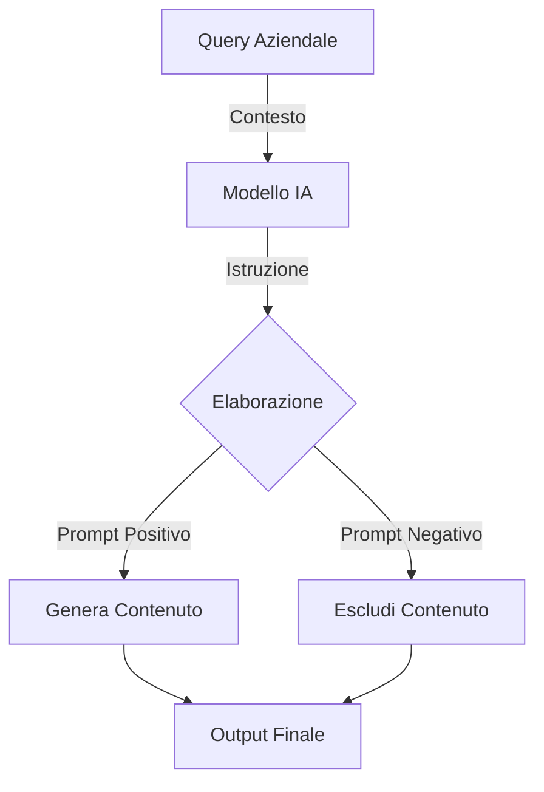
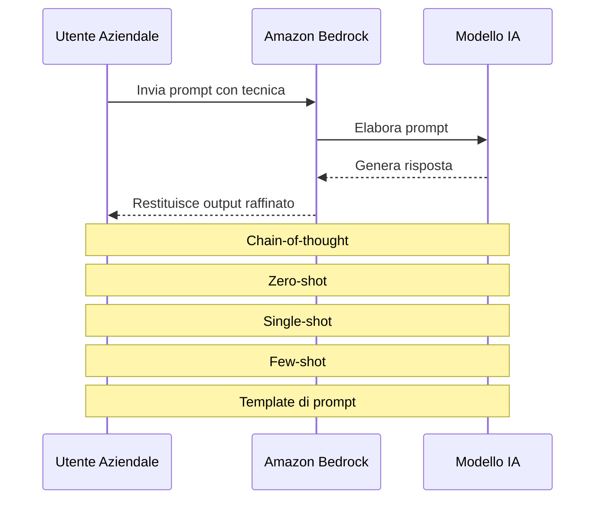
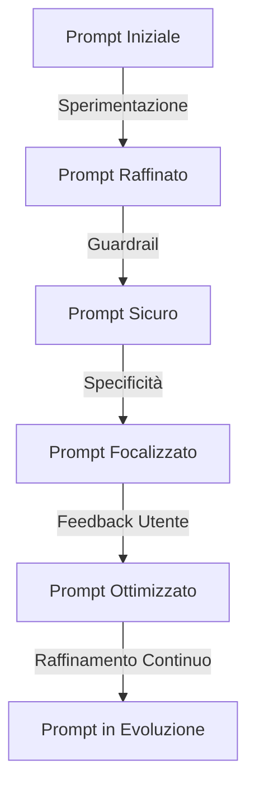
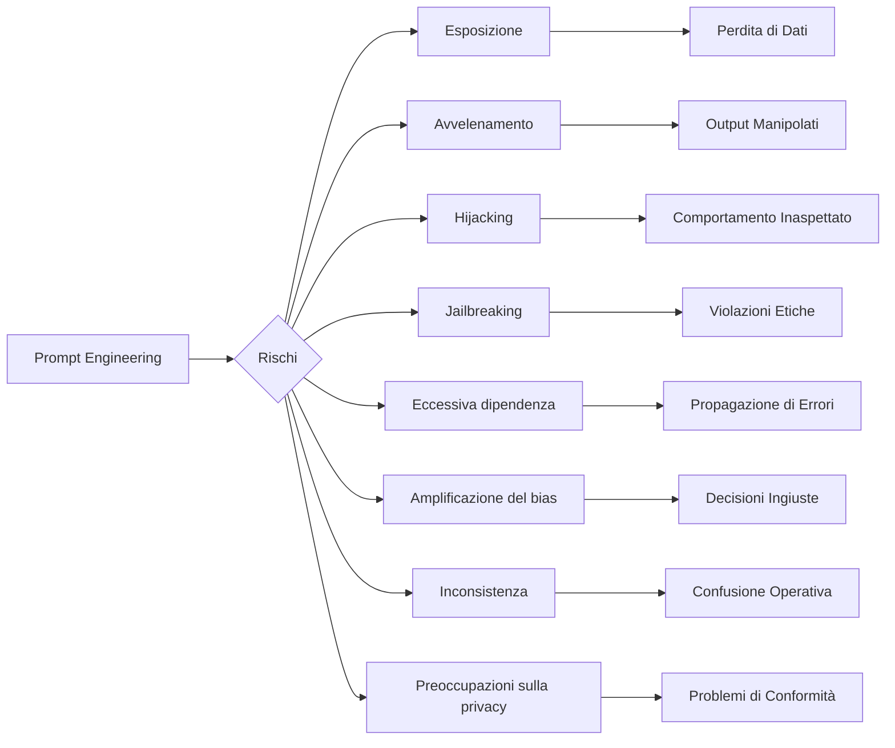

## 3.2 Scegliere tecniche efficaci di prompt engineering

Il prompt engineering è una competenza critica per massimizzare il valore dei foundation model nel business. Questa disciplina specializzata si concentra sulla creazione di query di input che elicitano risposte ottimali dai modelli di IA, particolarmente dai large language model (LLM) disponibili attraverso Amazon Bedrock.[^701] Mentre le organizzazioni adottano soluzioni guidate dall'IA, la capacità di progettare prompt efficaci influenza direttamente la qualità degli insight generati, dei contenuti prodotti e dei problemi risolti.

I professionisti aziendali che padroneggiano il prompt engineering ottengono vantaggi significativi nell'estrarre valore dagli investimenti in IA. Che si tratti di sviluppare chatbot di servizio clienti, generare contenuti di marketing o analizzare dataset complessi, la qualità degli output di IA dipende largamente dai prompt forniti. Attraverso i settori—dalla finanza e sanità al retail e manifatturiero—il prompt engineering continua a guidare innovazione e vantaggio competitivo.[^702]

Questo sottocapitolo esplora i fondamenti del prompt engineering, tecniche avanzate, migliori pratiche di implementazione e limitazioni potenziali. Comprendere questi elementi consente ai professionisti aziendali di sfruttare efficacemente i foundation model, migliorare il processo decisionale e creare soluzioni più sofisticate alimentate dall'IA.

### Concetti e costrutti del prompt engineering

Il prompt engineering è costruito su diversi concetti chiave che formano la base per un'interazione efficace con i modelli di IA. Comprendere questi elementi è cruciale per creare prompt che producano risposte accurate, rilevanti e utili.

1. **Contesto**: Informazioni di background fornite al modello di IA che inquadrano il compito o la domanda. Il contesto appropriato aiuta il modello a comprendere il dominio specifico, la situazione o la prospettiva necessaria per generare una risposta appropriata. Per esempio, quando si analizzano dati finanziari, specificare il settore, il periodo temporale o l'azienda migliora significativamente rilevanza e accuratezza.

2. **Istruzione**: Direttive esplicite date al modello su quale compito eseguire o come processare l'input. Istruzioni chiare e precise guidano il comportamento del modello e il formato di output. Gli esempi includono "Riassumi il seguente testo in tre punti elenco" o "Traduci questa frase dall'inglese al francese."

3. **Prompt negativi**: Istruzioni che dicono al modello cosa evitare o escludere nella sua risposta. Questa tecnica affina gli output e previene contenuti indesiderati. Per esempio, "Genera una descrizione del prodotto senza menzionare prezzi o concorrenti" focalizza l'output del modello specificando esplicitamente esclusioni.

4. **Spazio latente del modello**: La rappresentazione ad alta dimensionalità della conoscenza all'interno del modello di IA. Mentre non direttamente manipolabile, comprendere questo concetto informa strategie per navigare più efficacemente la base di conoscenza del modello per recuperare informazioni rilevanti.[^703]

Il seguente diagramma illustra come questi concetti lavorano insieme in un contesto aziendale:



*Figura 3.2.1: Flusso di Lavoro del Prompt Engineering. Questo diagramma illustra il processo di prompt engineering, mostrando come contesto, istruzioni e sia prompt positivi che negativi interagiscono con il modello di IA per produrre l'output finale.*

In pratica, un team di marketing che utilizza Amazon Bedrock per generare descrizioni di prodotti potrebbe creare prompt che includano:[^704]

- Contesto: "Sei un copywriter esperto per un marchio di orologi di lusso."
- Istruzione: "Scrivi una descrizione del prodotto di 100 parole per il nostro nuovo smartwatch."
- Prompt positivo: "Evidenzia il suo design elegante e le funzionalità avanzate di monitoraggio della salute."
- Prompt negativo: "Non menzionare la durata della batteria o confrontarlo con i concorrenti."

Applicando strategicamente questi costrutti di prompt engineering, le aziende possono guidare i modelli di IA a produrre output più mirati e rilevanti che servono meglio le loro esigenze specifiche e migliorano i processi decisionali.

### Tecniche per il prompt engineering

Il prompt engineering comprende varie tecniche che consentono interazioni sofisticate con i modelli di IA. Questi metodi permettono ai professionisti aziendali di estrarre risposte più sfumate e contestualmente appropriate dai foundation model:

1. **Chain-of-thought**: Scomporre problemi complessi in una serie di passi intermedi, guidando il modello di IA attraverso un processo di ragionamento logico. Questa tecnica porta a risultati più accurati e spiegabili, particolarmente per compiti che richiedono ragionamento multi-step.[^705]

2. **Apprendimento zero-shot**: Chiedere al modello di eseguire un compito senza fornire esempi specifici. Questa tecnica sfrutta la conoscenza generale del modello per affrontare situazioni nuove, rendendola preziosa per gestire query inaspettate o esplorare nuovi domini problematici.[^706]

3. **Apprendimento single-shot**: Fornire un esempio per illustrare il formato di output desiderato o l'approccio. Questa tecnica calibra lo stile di risposta del modello e migliora la consistenza negli output.

4. **Apprendimento few-shot**: Offrire molteplici esempi (tipicamente 2-5) per guidare la comprensione del modello del compito. Questo approccio migliora significativamente le prestazioni su compiti specifici dimostrando pattern e aspettative attraverso esempi.[^707]

5. **Template di prompt**: Strutture pre-progettate per prompt che possono essere personalizzate per casi d'uso specifici. I template mantengono consistenza attraverso diverse interazioni e possono essere ottimizzati nel tempo per prestazioni migliori.

Il seguente diagramma illustra come queste tecniche sono applicate in un contesto aziendale utilizzando Amazon Bedrock:



*Figura 3.2.2: Tecniche di Prompt Engineering in Azione. Questo diagramma di sequenza mostra come diverse tecniche di prompt engineering sono applicate quando si interagisce con un modello di IA attraverso Amazon Bedrock.*

Applicazioni pratiche di queste tecniche includono:

1. **Esempio di Chain-of-thought**:
   Prompt: "Calcola il ricavo totale per Q1 2025. Passo 1: Elenca i ricavi mensili. Passo 2: Somma le cifre mensili. Passo 3: Presenta il totale."

2. **Esempio Zero-shot**:
   Prompt: "Suggerisci tre funzionalità innovative per un dispositivo smart home destinato agli utenti anziani."

3. **Esempio Single-shot**:
   Prompt: "Riassumi il feedback dei clienti in una frase. Esempio: 'Il Prodotto X ha ricevuto recensioni positive per la sua durabilità ma critiche per il prezzo elevato.' Ora riassumi il feedback per il Prodotto Y."

4. **Esempio Few-shot**:
   Prompt: "Classifica il sentiment delle recensioni dei clienti:
   1. 'Ottimo prodotto!' - Positivo
   2. 'Esperienza terribile.' - Negativo
   3. 'Va bene.' - Neutrale
   Ora classifica: 'Sono soddisfatto del mio acquisto.'"

5. **Esempio di template di prompt**:
   Template: "Come [RUOLO], fornisci [NUMERO] [TIPO] per [CONTESTO]. Focalizzati su [ASPETTO] ed evita [ESCLUSIONE]."
   Template compilato: "Come analista finanziario, fornisci 3 insight per il nostro report degli utili Q1 2025. Focalizzati sulla crescita dei ricavi ed evita di menzionare clienti specifici."

Padroneggiare queste tecniche consente ai professionisti aziendali di estrarre insight preziosi e generare output di alta qualità dai modelli di IA attraverso varie applicazioni—dall'analisi delle tendenze di mercato alla generazione di contenuti creativi e alla risoluzione di problemi aziendali complessi.

### Benefici e migliori pratiche per il prompt engineering

Il prompt engineering efficace offre benefici sostanziali per le aziende che utilizzano tecnologie di IA, mentre seguire le migliori pratiche garantisce risultati consistenti e di alta qualità.

**Benefici del Prompt Engineering Efficace:**

1. **Miglioramento della qualità delle risposte**: Prompt ben costruiti migliorano la rilevanza, accuratezza e utilità degli output generati dall'IA, portando a insight più affidabili e migliore processo decisionale.

2. **Maggiore efficienza**: Il prompting strategico riduce la necessità di multiple iterazioni o intervento umano, snellendo i flussi di lavoro e risparmiando tempo prezioso.

3. **Personalizzazione e flessibilità**: Il prompt engineering adatta le risposte dell'IA a esigenze specifiche, settori o voci del marchio senza richiedere un riaddestramento estensivo del modello.

4. **Ottimizzazione dei costi**: Prompt efficienti riducono le risorse computazionali e le chiamate API, potenzialmente abbassando i costi associati all'uso dell'IA.[^708]

5. **Esperienza utente migliorata**: Per applicazioni rivolte ai clienti, prompt migliori creano interazioni di IA più naturali e utili, migliorando la soddisfazione complessiva dell'utente.

**Migliori Pratiche per il Prompt Engineering:**

1. **Sperimentazione**: Testare diverse strutture di prompt e tecniche per identificare cosa funziona meglio per compiti specifici. Il test A/B può essere particolarmente efficace nell'ottimizzare i prompt per risultati consistenti.

2. **Implementazione di guardrail**: Incorporare salvaguardie nei prompt per garantire che gli output dell'IA si allineino con le politiche aziendali, le linee guida etiche e i requisiti legali. Questo include specificare tono, restrizioni sui contenuti e disclaimer richiesti.[^709]

3. **Prompting orientato alla scoperta**: Utilizzare prompt aperti per esplorare nuove possibilità o generare idee creative durante sessioni di brainstorming o sviluppo prodotti.

4. **Specificità e concisione**: Creare prompt chiari e specifici che forniscano il contesto necessario senza sopraffare il modello. Evitare ambiguità e verbosità non necessaria.

5. **Utilizzo di prompt multipli**: Per compiti complessi, scomporre il problema in prompt multipli, ciascuno che affronta un aspetto specifico. Questo approccio porta a risultati più completi e accurati.

6. **Raffinamento continuo**: Rivedere e aggiornare regolarmente i prompt basandosi su metriche di prestazione, feedback degli utenti e esigenze aziendali in evoluzione per garantire miglioramento continuo.

Il seguente diagramma illustra il processo di raffinamento del prompt:



*Figura 3.2.3: Processo di Raffinamento del Prompt. Questo diagramma illustra il processo iterativo di raffinamento dei prompt basato su migliori pratiche e feedback, portando a interazioni di IA in continuo miglioramento.*

Un'applicazione pratica utilizzando Amazon Bedrock potrebbe apparire così:

**Scenario**: Un'azienda di retail vuole generare descrizioni di prodotti per una nuova linea di prodotti per la casa eco-friendly.

**Prompt Iniziale**: "Scrivi una descrizione del prodotto per una bottiglia d'acqua eco-friendly."

**Prompt Raffinato** (dopo aver applicato le migliori pratiche):

```
Contesto: Sei un copywriter per EcoHome, un marchio noto per prodotti per la casa sostenibili.

Compito: Genera una descrizione del prodotto per la nostra nuova bottiglia d'acqua in acciaio inossidabile.

Specifiche:
- Capacità 20 oz
- Isolamento a doppia parete
- Realizzata con materiali 100% riciclati
- Disponibile in 3 colori: Blu Oceano, Verde Foresta e Arancione Tramonto

Linee Guida di Stile:
- Enfatizza sostenibilità e durabilità
- Usa un tono amichevole e conversazionale
- Includi almeno un appello emotivo per i consumatori eco-consapevoli
- Mantieni la descrizione tra 75-100 parole

Vincoli:
- Non menzionare prezzi specifici
- Evita confronti con altri marchi
- Assicurati che tutte le affermazioni siano fattuali e accurate, evita il greenwashing

Formato di Output:
Fornisci la descrizione del prodotto seguita da 3 hashtag suggeriti per la promozione sui social media.
```

Questo prompt raffinato incorpora specificità, guardrail e istruzioni chiare per generare una descrizione del prodotto più mirata ed efficace. Applicando consistentemente queste migliori pratiche e raffinando i prompt basandosi su prestazioni e feedback, le aziende possono migliorare significativamente i loro processi guidati dall'IA.

### Rischi potenziali e limitazioni del prompt engineering

Mentre il prompt engineering offre benefici significativi, le aziende devono comprendere i suoi rischi e limitazioni inerenti per implementare salvaguardie efficaci. Le preoccupazioni principali includono:

1. **Esposizione**: Divulgazione involontaria di informazioni sensibili quando i prompt contengono dati confidenziali o quando le risposte dell'IA rivelano informazioni proprietarie.[^710]

2. **Avvelenamento**: Attacchi avversari dove input malevoli manipolano il comportamento del modello, risultando in output distorti o dannosi che potrebbero danneggiare la reputazione o i processi decisionali.[^711]

3. **Hijacking**: Avviene quando gli input sovrascrivono il comportamento previsto del sistema di IA, portando a risposte inaspettate o malevoli che compromettono l'integrità dell'applicazione.[^712]

4. **Jailbreaking**: Tentativi di aggirare le linee guida etiche o le restrizioni sui contenuti creando prompt specificamente progettati per eludere le salvaguardie del modello.

5. **Eccessiva dipendenza**: Dipendenza eccessiva dagli output generati dall'IA senza supervisione umana, permettendo agli errori di propagarsi attraverso i processi aziendali.

6. **Amplificazione del bias**: Prompt mal progettati possono rafforzare o amplificare bias presenti nei dati di addestramento, portando a output ingiusti o discriminatori.[^713]

7. **Inconsistenza**: Prompt diversi per compiti simili che producono risultati variabili, potenzialmente causando confusione o errori nelle operazioni aziendali.

8. **Preoccupazioni sulla privacy**: Prompt contenenti informazioni personali o sensibili possono creare problemi di privacy, specialmente quando si utilizzano servizi di IA di terze parti.[^714]

Il seguente diagramma illustra questi rischi e i loro potenziali impatti aziendali:



*Figura 3.2.4: Rischi e Impatti del Prompt Engineering. Questo diagramma di flusso illustra i vari rischi associati al prompt engineering e i loro potenziali impatti sulle operazioni aziendali.*

Per mitigare questi rischi, le aziende dovrebbero implementare salvaguardie robuste:

1. **Sanificazione dei dati**: Rimuovere informazioni sensibili dai prompt prima di inviarli ai modelli di IA.

2. **Validazione dell'input**: Sviluppare meccanismi di validazione forti per rilevare e prevenire prompt potenzialmente malevoli.

3. **Filtraggio dell'output**: Implementare filtri post-elaborazione per controllare gli output generati dall'IA per contenuti inappropriati o sensibili.

4. **Human-in-the-loop**: Mantenere supervisione umana nei processi decisionali critici, utilizzando l'IA come strumento di supporto piuttosto che sostituto del giudizio umano.[^715]

5. **Audit regolari**: Condurre audit periodici delle interazioni di IA per identificare bias potenziali, inconsistenze o vulnerabilità di sicurezza.

6. **Linee guida etiche**: Stabilire linee guida etiche chiare per l'uso dell'IA e garantire che tutti i dipendenti ricevano formazione appropriata.

7. **Tecniche privacy-preserving**: Utilizzare tecnologie come federated learning o differential privacy quando si gestiscono dati sensibili.[^716]

8. **Monitoraggio continuo**: Implementare sistemi di monitoraggio in tempo reale per rilevare pattern inusuali o attacchi potenziali.

Riconoscendo queste limitazioni e implementando salvaguardie appropriate, le aziende possono sfruttare il potere del prompt engineering minimizzando i rischi associati. Mentre le tecnologie di IA evolvono, rimanere informati sulle vulnerabilità potenziali e adattare di conseguenza le misure di sicurezza rimane cruciale per mantenere l'integrità dei processi aziendali guidati dall'IA.

In conclusione, il prompt engineering è una capacità potente che migliora significativamente le applicazioni di IA nei contesti aziendali. Comprendendo i suoi concetti, padroneggiando varie tecniche, implementando migliori pratiche e affrontando i rischi potenziali, le organizzazioni possono sfruttare i foundation model per guidare innovazione, migliorare il processo decisionale e ottenere vantaggi competitivi. La capacità di creare prompt efficaci sta diventando una competenza essenziale per i professionisti aziendali in tutti i settori, consentendo loro di sbloccare il pieno potenziale dell'IA nella risoluzione di sfide aziendali complesse.

### Domande per l'auto-verifica

1. **Quale tecnica di prompt engineering coinvolge la scomposizione di problemi complessi in una serie di passi intermedi per guidare il modello di IA attraverso un processo di ragionamento logico?**

   A. Apprendimento zero-shot
   B. Chain-of-thought
   C. Apprendimento few-shot
   D. Template di prompt

2. **Un team di marketing vuole generare descrizioni di prodotti per una nuova linea di prodotti eco-friendly senza fornire esempi specifici. Quale tecnica di prompt engineering è più appropriata?**

   A. Apprendimento single-shot
   B. Apprendimento few-shot
   C. Apprendimento zero-shot
   D. Chain-of-thought

3. **Quale dei seguenti NON è un beneficio del prompt engineering efficace nei contesti aziendali?**

   A. Miglioramento della qualità delle risposte
   B. Maggiore efficienza
   C. Eliminazione di tutti i bias negli output dell'IA
   D. Ottimizzazione dei costi

4. **Un analista finanziario è preoccupato per potenziali perdite di dati quando utilizza modelli di IA per analisi di mercato. A quale rischio del prompt engineering si riferisce principalmente questo scenario?**

   A. Jailbreaking
   B. Esposizione
   C. Avvelenamento
   D. Hijacking

5. **Quale migliore pratica per il prompt engineering coinvolge il testare regolarmente diverse strutture di prompt e tecniche per identificare cosa funziona meglio per compiti o domini specifici?**

   A. Implementazione di guardrail
   B. Specificità e concisione
   C. Sperimentazione
   D. Raffinamento continuo

### Risposte e Spiegazioni

1. **Risposta corretta: B. Chain-of-thought**

   Spiegazione: Chain-of-thought è una tecnica di prompt engineering che coinvolge la scomposizione di problemi complessi in una serie di passi intermedi, guidando il modello di IA attraverso un processo di ragionamento logico. Questa tecnica è particolarmente utile per compiti che richiedono ragionamento multi-step e può portare a risultati più accurati e spiegabili. Apprendimento zero-shot, apprendimento few-shot e template di prompt sono altre tecniche di prompt engineering ma non coinvolgono specificamente la scomposizione di problemi in passi intermedi.[^717]

2. **Risposta corretta: C. Apprendimento zero-shot**

   Spiegazione: I prompt zero-shot chiedono al modello di eseguire un compito o rispondere a una domanda senza alcun esempio specifico o addestramento precedente su quel compito esatto. Questa tecnica sfrutta la conoscenza generale del modello per affrontare situazioni nuove, rendendola particolarmente utile per gestire query inaspettate o esplorare nuovi domini problematici. In questo scenario, il team di marketing vuole generare descrizioni di prodotti senza fornire esempi specifici, il che si allinea perfettamente con l'approccio di apprendimento zero-shot.[^718]

3. **Risposta corretta: C. Eliminazione di tutti i bias negli output dell'IA**

   Spiegazione: Mentre il prompt engineering efficace offre numerosi benefici, inclusi miglioramento della qualità delle risposte, maggiore efficienza e ottimizzazione dei costi, non può eliminare completamente tutti i bias negli output dell'IA. I bias possono essere inerenti nei dati di addestramento o nel modello stesso, e mentre il prompt engineering può aiutare a mitigare alcuni bias, non può garantire la loro completa eliminazione. Le altre opzioni (A, B e D) sono tutti benefici genuini del prompt engineering efficace come menzionato nel sottocapitolo.[^719]

4. **Risposta corretta: B. Esposizione**

   Spiegazione: Lo scenario descrive una preoccupazione per potenziali perdite di dati quando si utilizzano modelli di IA per analisi di mercato, che si riferisce direttamente al rischio di esposizione nel prompt engineering. L'esposizione avviene quando i prompt contengono involontariamente o rivelano informazioni sensibili. Nell'analisi finanziaria, c'è un alto rischio di esporre dati di mercato confidenziali o informazioni proprietarie se i prompt non sono gestiti con attenzione. Questo è distinto dal jailbreaking (aggirare linee guida etiche), avvelenamento (input malevoli che manipolano il comportamento del modello), o hijacking (sovrascrivere il comportamento previsto).[^720]

5. **Risposta corretta: C. Sperimentazione**

   Spiegazione: La sperimentazione è la migliore pratica che coinvolge il testare regolarmente diverse strutture di prompt e tecniche per identificare cosa funziona meglio per compiti o domini specifici. Il sottocapitolo menziona esplicitamente che "Testare regolarmente diverse strutture di prompt e tecniche per identificare cosa funziona meglio per compiti o domini specifici. Il test A/B può essere particolarmente efficace nell'ottimizzare i prompt." Questo approccio consente alle aziende di migliorare continuamente le loro strategie di prompt engineering e adattarsi a esigenze o contesti che cambiano.[^721]

[^700]: AWS AI Services Overview. URL: <https://aws.amazon.com/machine-learning/ai-services/>

[^701]: Amazon Bedrock Overview. URL: <https://aws.amazon.com/bedrock/>

[^702]: Gartner Forecasts Worldwide Artificial Intelligence Software Market to Reach $62 Billion in 2022. URL: <https://www.gartner.com/en/newsroom/press-releases/2021-11-22-gartner-forecasts-worldwide-artificial-intelligence-software-market-to-reach-62-billion-in-2022>

[^703]: Understanding Latent Space in Machine Learning. URL: <https://towardsdatascience.com/understanding-latent-space-in-machine-learning-de5a7c687d8d>

[^704]: Amazon Bedrock Prompt Engineering Guide. URL: <https://docs.aws.amazon.com/bedrock/latest/userguide/prompt-engineering.html>

[^705]: Chain-of-Thought Prompting Elicits Reasoning in Large Language Models. URL: <https://arxiv.org/abs/2201.11903>

[^706]: Zero-Shot Learning - A Comprehensive Evaluation of the Good, the Bad and the Ugly. URL: <https://arxiv.org/abs/1707.00600>

[^707]: Few-Shot Learning: A Survey. URL: <https://arxiv.org/abs/1904.05046>

[^708]: AWS Cost Optimization for Machine Learning. URL: <https://aws.amazon.com/blogs/machine-learning/cost-optimization-for-machine-learning-in-the-cloud/>

[^709]: AWS AI Service Cards. URL: <https://aws.amazon.com/machine-learning/ai-services/ai-service-cards/>

[^710]: AWS Security Best Practices for Machine Learning. URL: <https://docs.aws.amazon.com/whitepapers/latest/security-best-practices-for-machine-learning/security-best-practices-for-machine-learning.html>

[^711]: Prompt Injection Attacks Against GPT-3. URL: <https://arxiv.org/abs/2206.11349>

[^712]: Defending Against Prompt Injection Attacks. URL: <https://docs.anthropic.com/en/docs/test-and-evaluate/strengthen-guardrails/mitigate-jailbreaks>

[^713]: Bias in AI: Sources and Mitigation Strategies. URL: <https://aws.amazon.com/blogs/publicsector/framework-mitigate-bias-improve-outcomes-new-age-ai/>

[^714]: AWS Privacy Considerations for Machine Learning. URL: <https://www.ibm.com/think/insights/ai-privacy>

[^715]: Human-in-the-Loop Machine Learning. URL: <https://aws.amazon.com/blogs/machine-learning/automated-exploratory-data-analysis-and-model-operationalization-framework-with-a-human-in-the-loop/>

[^716]: AWS Privacy-Preserving Machine Learning. URL: <https://aws.amazon.com/blogs/machine-learning/large-language-model-inference-over-confidential-data-using-aws-nitro-enclaves/>

[^717]: Chain-of-Thought Prompting Elicits Reasoning in Large Language Models. URL: <https://arxiv.org/abs/2201.11903>

[^718]: Zero-Shot Learning - A Comprehensive Evaluation of the Good, the Bad and the Ugly. URL: <https://arxiv.org/abs/1707.00600>

[^719]: Mitigating Bias in Artificial Intelligence (AI) Models. URL: <https://aws.amazon.com/blogs/publicsector/framework-mitigate-bias-improve-outcomes-new-age-ai/>

[^720]: AWS Security Best Practices for Machine Learning. URL: <https://docs.aws.amazon.com/whitepapers/latest/security-best-practices-for-machine-learning/security-best-practices-for-machine-learning.html>

[^721]: Amazon SageMaker Experiments - Organize, Track, and Compare Your Machine Learning Trainings. URL: <https://aws.amazon.com/blogs/aws/amazon-sagemaker-experiments-organize-track-and-compare-your-machine-learning-trainings/>