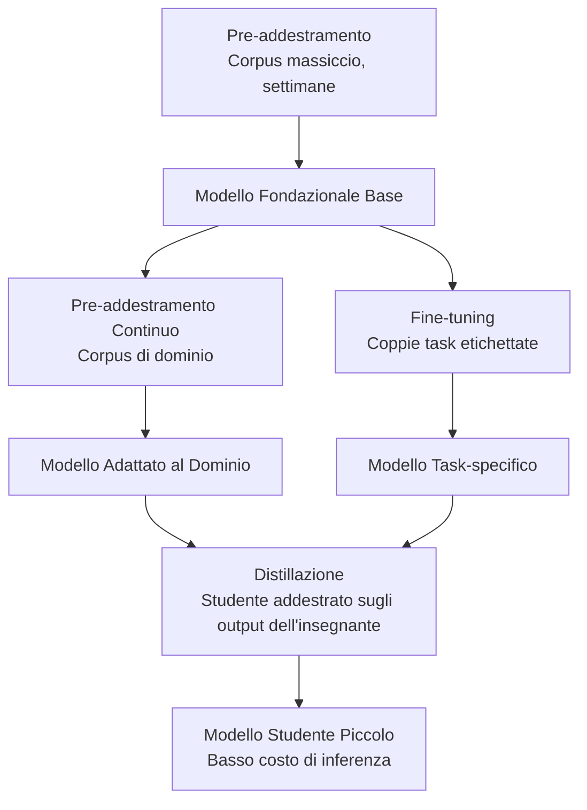
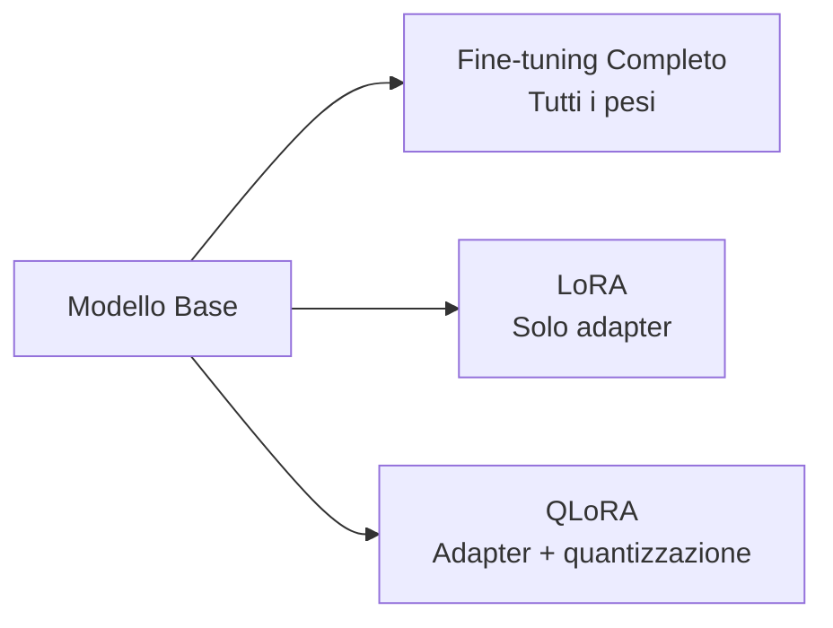
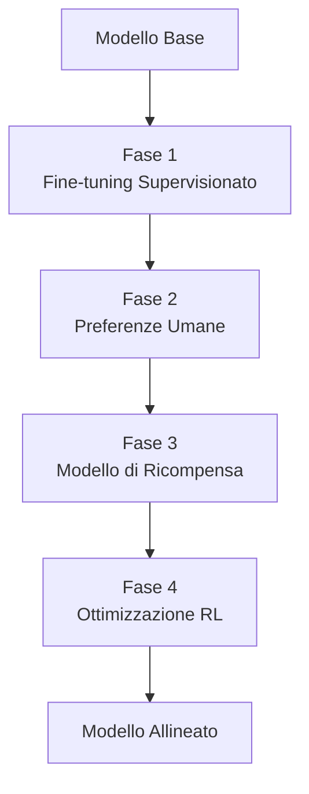
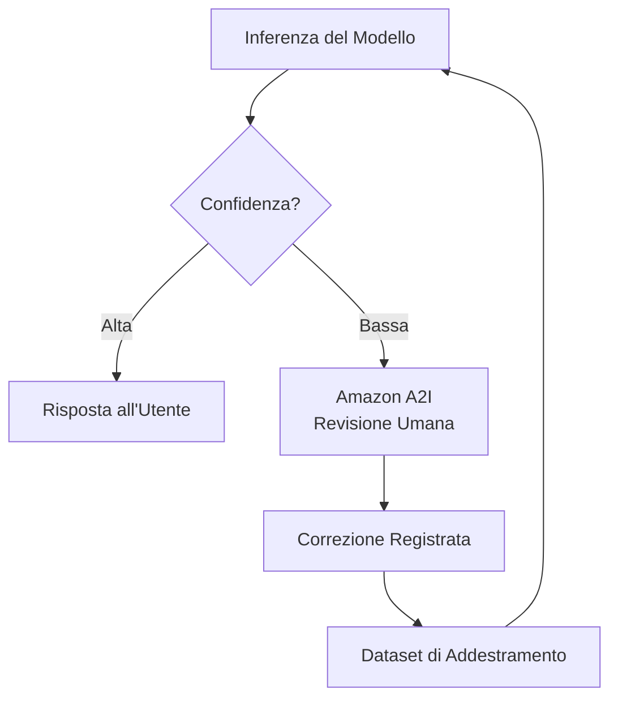
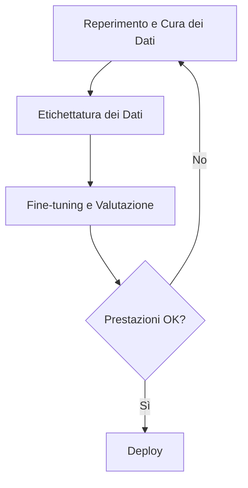

## Task Statement 3.3: Descrivere il processo di addestramento e fine-tuning per gli FM

I modelli fondazionali non arrivano pronti per ogni scopo aziendale. Vengono costruiti per fasi, con ogni livello che aggiunge specificità a un costo che cresce rapidamente con l'ambizione. Comprendere come i modelli vengono costruiti e adattati non è principalmente un esercizio tecnico per il professionista del business; è un esercizio di pianificazione del budget e definizione dell'ambito. Conoscere la differenza tra pre-addestramento, fine-tuning, pre-addestramento continuo e distillazione consente di porre le domande giuste quando un team di ingegneria propone un progetto di personalizzazione, valutare la timeline e il budget proposti, e riconoscere quando un approccio più semplice produrrebbe risultati comparabili.[^303001]

I tre obiettivi di questo task statement seguono una sequenza logica. Il primo copre la tassonomia delle tecniche di addestramento e i loro profili di costo. Il secondo copre i metodi specifici utilizzati quando il fine-tuning è la scelta giusta. Il terzo copre come i dati devono essere preparati prima che qualsiasi job di fine-tuning possa iniziare, inclusi i processi di feedback umano che allineano il comportamento di un modello con le aspettative aziendali. Insieme forniscono il quadro di riferimento necessario a uno sponsor aziendale per commissionare e supervisionare un progetto di personalizzazione del modello senza dover scrivere una riga di codice di addestramento.

### 3.3.1 Elementi chiave dell'addestramento di un FM

L'addestramento di un modello fondazionale non è un'attività singola. È una progressione di fasi, ciascuna che si costruisce sulla precedente, e ciascuna disponibile come punto di ingresso a seconda di cosa un'azienda necessita e quanto può investire. L'esame copre quattro fasi: pre-addestramento, fine-tuning, pre-addestramento continuo e distillazione. Sono organizzate approssimativamente per costo dal più costoso al meno costoso, e per ampiezza del cambiamento dalla più ampia alla più ridotta.

Le quattro tecniche non sono alternative tra loro nel modo in cui il fine-tuning e il RAG sono alternative. Il pre-addestramento crea le fondamenta. Il fine-tuning e il pre-addestramento continuo aggiustano ciò che già esiste. La distillazione comprime il risultato in un pacchetto più piccolo. Un'azienda può utilizzarne diversi in sequenza: partire da un modello pre-addestrato fornito da un terzo, applicare il pre-addestramento continuo per insegnargli il vocabolario di dominio, quindi distillare il risultato per un'inferenza in produzione più economica.

Il **pre-addestramento** è il processo di addestramento di una rete neurale da pesi iniziali casuali su un enorme corpus di testo e altri dati.[^303002] Il modello impara pattern statistici attraverso miliardi di esempi: grammatica, associazioni fattuali, catene di ragionamento e le relazioni tra concetti. Il pre-addestramento crea la memoria parametrica del modello, la conoscenza incorporata nei suoi pesi da cui può attingere anche quando non vengono forniti documenti esterni. La scala richiesta è proibitiva per la maggior parte delle organizzazioni. Un ciclo di addestramento per un moderno modello linguistico di grandi dimensioni consuma migliaia di ore GPU nell'arco di settimane o mesi, richiede petabyte di dati curati e costa milioni di dollari prima che il modello produca la sua prima frase coerente.[^303003] Il pre-addestramento è rilevante nell'esame come punto di partenza da cui tutte le altre tecniche si discostano, non come azione pratica per qualsiasi azienda al di fuori dei principali laboratori di ricerca sull'IA.

Il **fine-tuning** parte da un modello pre-addestrato esistente e continua l'addestramento su un dataset molto più piccolo e specifico per il dominio.[^303004] L'obiettivo è spostare il comportamento del modello verso un compito target: rispondere alle domande del servizio clienti con un tono particolare, estrarre campi strutturati da cartelle cliniche, o generare codice nel framework interno di un'azienda. Il fine-tuning aggiusta i pesi del modello, quindi il modello risultante è un artefatto distinto che deve essere archiviato e servito. Richiede esempi etichettati, tipicamente da centinaia a decine di migliaia di coppie input-output, e risorse di calcolo GPU nell'ordine di ore o giorni piuttosto che settimane. **Amazon Bedrock** supporta il fine-tuning per un sottoinsieme dei suoi modelli ospitati, inclusi Amazon Nova, Meta Llama e selezionate versioni di Anthropic Claude Haiku, producendo un modello personalizzato che può poi essere distribuito con throughput provisionato.[^303005] Il fine-tuning è la scelta giusta quando il compito è stabile (il comportamento target non cambia mese per mese), quando l'azienda può produrre esempi etichettati sufficienti e quando il miglioramento delle prestazioni giustifica il costo di addestramento e hosting.

Il **pre-addestramento continuo** (chiamato anche *continued pre-training*) è una tecnica intermedia tra pre-addestramento e fine-tuning.[^303006] Invece di coppie input-output etichettate, il pre-addestramento continuo utilizza testo di dominio non etichettato, lo stesso tipo di corpus non supervisionato usato nel pre-addestramento originale, ma tratto da un dominio specifico come letteratura medica, bilanci finanziari o giurisprudenza. L'obiettivo non è insegnare al modello un nuovo compito ma insegnargli il vocabolario di dominio, la terminologia e le associazioni fattuali che erano sottorappresentate nel corpus di pre-addestramento originale. Un modello che è stato pre-addestrato su testo generico di internet può trattare "margine lordo," "valore attuale netto" e "EBITDA" come gergo finanziario che riconosce ma non comprende profondamente nel contesto. Il pre-addestramento continuo su un corpus di relazioni annuali, note di analisti e trascrizioni di chiamate sugli utili migliora tale comprensione senza richiedere coppie etichettate. Amazon Bedrock supporta il pre-addestramento continuo come opzione di personalizzazione per selezionati modelli.[^303007]

La **distillazione** adotta un approccio diverso al problema dei costi. Invece di addestrare un modello più piccolo da zero, la distillazione addestra un compatto *modello studente* per imitare gli output di un *modello insegnante* più grande e capace su un insieme target di prompt.[^303008] Il modello insegnante genera risposte a un'ampia raccolta di prompt; quelle coppie prompt-risposta diventano i dati di addestramento dello studente. Lo studente impara ad approssimare la qualità dell'insegnante senza mai accedere ai pesi dell'insegnante. Una volta completata la distillazione, l'inferenza in produzione viene servita dallo studente, che è più veloce e più economico per chiamata rispetto all'insegnante. Amazon Bedrock supporta la distillazione del modello come flusso di lavoro gestito, consentendo alle organizzazioni di designare un modello Bedrock come insegnante, specificare la distribuzione target dei prompt e produrre un modello più piccolo con fine-tuning come studente.[^303009] L'economia della distillazione favorisce le applicazioni ad alto volume dove il costo di addestramento una tantum viene rapidamente recuperato dai risparmi sull'inferenza.

*Figura 3.3.1: Gerarchia delle tecniche di addestramento degli FM. Ogni tecnica si basa su un modello esistente piuttosto che partire da zero, con costo e requisiti di dati che diminuiscono da sinistra a destra man mano che il punto di partenza diventa più ricco.*

*Tabella 3.3.1: Confronto delle tecniche di addestramento e adattamento degli FM*

| Tecnica | Dati di addestramento | Costo di calcolo | Tempo per il deploy | Risultato principale | Punto di ingresso AWS |
|---|---|---|---|---|---|
| Pre-addestramento | Petabyte, non etichettati | Molto alto (milioni di ore GPU) | Mesi | Modello base general-purpose | Non applicabile (acquistare dal fornitore) |
| Pre-addestramento continuo | Da gigabyte a terabyte, non etichettati | Medio (giorni) | Giorni | Vocabolario di dominio e associazioni fattuali | Modelli personalizzati Amazon Bedrock |
| Fine-tuning | Da centinaia a migliaia di coppie etichettate | Da basso a medio (ore) | Da ore a giorni | Comportamento e tono task-specifici | Amazon Bedrock, SageMaker JumpStart |
| Distillazione | Coppie prompt-risposta generate dall'insegnante | Medio (una tantum) | Da ore a giorni | Modello piccolo che approssima la qualità del modello grande | Distillazione modelli Amazon Bedrock |

L'esame presenta frequentemente scenari che chiedono quale tecnica corrisponde a un dato vincolo. La logica decisionale è: se il modello ha bisogno di imparare un nuovo vocabolario o un dominio fattuale senza un dataset etichettato, usare il pre-addestramento continuo. Se il modello ha bisogno di imparare un comportamento specifico per un compito e sono disponibili dati etichettati, usare il fine-tuning. Se il modello risultante deve essere più economico e più veloce nell'inferenza e il costo di addestramento è accettabile, aggiungere la distillazione. Il pre-addestramento è la risposta solo quando la domanda indica esplicitamente che non esiste alcun modello pre-addestrato adatto, cosa che non accade praticamente mai in uno scenario aziendale reale.

### 3.3.2 Metodi per il fine-tuning di un FM

Il fine-tuning è la tecnica di personalizzazione più comunemente discussa nei progetti di IA aziendale perché il suo profilo di costo si colloca in un intervallo pratico e il suo output è un modello che un'organizzazione controlla. Esistono diversi metodi distinti nella vasta categoria del fine-tuning, e l'esame si aspetta familiarità con ciascuno.

Il filo conduttore tra tutti i metodi di fine-tuning è che i pesi del modello pre-addestrato sono il punto di partenza, e l'addestramento su dati specifici del dominio sposta quei pesi. Ciò che differisce è il formato dei dati di addestramento, la parte dell'architettura del modello che viene modificata e lo specifico obiettivo di apprendimento.

L'**instruction tuning** è il fine-tuning su un dataset di coppie prompt-risposta, dove ogni prompt è scritto come un'istruzione esplicita e ogni risposta dimostra il comportamento desiderato.[^303010] Per esempio, un prompt potrebbe essere "Riassumi il seguente reclamo del cliente in una frase:" seguito da un'email del cliente, e la risposta sarebbe il riassunto target. Il modello impara a seguire il formato delle istruzioni in modo affidabile, non solo a produrre testo plausibile nel dominio. L'instruction tuning è ciò che trasforma un modello base, che semplicemente prevede il token successivo in una sequenza, in un modello assistente che risponde ai comandi. La maggior parte dei modelli commercialmente disponibili descritti come varianti "chat" o "instruct" hanno già subito l'instruction tuning; il loro fine-tuning su coppie di istruzioni aggiuntive estende questa capacità a un compito o vocabolario aziendale specifico.

L'**adattamento dei modelli per domini specifici** descrive l'obiettivo generale dell'instruction tuning e del fine-tuning supervisionato quando applicati a campi professionali.[^303011] Un'organizzazione sanitaria potrebbe eseguire il fine-tuning su modelli di note cliniche ed esempi di codifica diagnostica in modo che il modello produca output formattati per i sistemi di cartelle cliniche elettroniche. Un team legale potrebbe eseguire il fine-tuning su librerie di clausole contrattuali per migliorare la capacità del modello di identificare tipi specifici di clausole. Una società di servizi finanziari potrebbe eseguire il fine-tuning su trascrizioni di chiamate sugli utili e report di analisti per migliorare la gestione del modello della terminologia finanziaria specializzata. Il requisito chiave è che gli esempi di addestramento rappresentino accuratamente la distribuzione degli input che il modello distribuito incontrerà; l'addestramento su note cliniche di una specialità e poi l'utilizzo su una specialità diversa produce risultati degradati.

Il **transfer learning** è il concetto teorico più ampio che sta alla base del fine-tuning.[^303012] Il transfer learning si riferisce al principio di prendere un modello addestrato per un compito e riutilizzare le sue rappresentazioni apprese come punto di partenza per un compito diverso. Nel contesto dei modelli linguistici di grandi dimensioni, ogni operazione di fine-tuning è un'istanza di transfer learning: il modello trasferisce la sua comprensione generale del linguaggio dal pre-addestramento al dominio del compito specifico. L'esame usa il transfer learning come termine ombrello e il fine-tuning come tecnica specifica. Riconoscere che una domanda che riguarda "l'applicazione della conoscenza appresa su un compito per migliorare le prestazioni su un compito diverso" descrive il transfer learning aiuta ad allineare correttamente la risposta.

Il **pre-addestramento continuo** (trattato nella sezione 3.3.1) è menzionato qui solo per evidenziare il comune pattern a due fasi: prima applicare il pre-addestramento continuo sul corpus non etichettato per stabilire il vocabolario di dominio e l'ancoraggio fattuale, poi applicare l'instruction tuning su un dataset etichettato più piccolo per insegnare il comportamento task-specifico.[^303013] L'approccio a due fasi produce risultati migliori rispetto a entrambe le tecniche usate singolarmente quando il dominio è altamente specializzato.

Il **parameter-efficient fine-tuning** (PEFT) affronta uno dei principali vincoli pratici del fine-tuning: il fine-tuning completo aggiorna ogni peso del modello, il che richiede la stessa capacità di memoria e calcolo dell'addestramento del modello da zero.[^303014] I metodi PEFT riducono questo onere congelando la maggior parte dei pesi del modello e addestrando solo un piccolo insieme di parametri aggiuntivi. **LoRA** (*Low-Rank Adaptation*) è il metodo PEFT più utilizzato. Inserisce piccole matrici addestrabili in certi livelli dell'architettura transformer; solo queste matrici adapter vengono aggiornate durante l'addestramento mentre i pesi originali rimangono congelati.[^303015] Il numero di parametri addestrabili in una configurazione LoRA potrebbe essere l'uno per cento del conteggio totale dei parametri del modello, riducendo i requisiti di memoria GPU di un fattore corrispondente. **QLoRA** (*Quantized LoRA*) combina LoRA con la *quantizzazione*, che è la compressione dei pesi del modello da valori in virgola mobile a 32 o 16 bit a interi a 4 bit, consentendo il fine-tuning di modelli che altrimenti non entrerebbero nell'hardware disponibile.[^303016] Per gli scopi aziendali, LoRA e QLoRA contano perché rendono accessibile il fine-tuning di modelli più grandi e di qualità superiore senza richiedere le istanze GPU più costose.

*Figura 3.3.2: Metodi di parameter-efficient fine-tuning. LoRA e QLoRA riducono il numero di parametri che richiedono aggiornamenti del gradiente, rendendo il fine-tuning accessibile su configurazioni hardware più piccole.*

AWS fornisce due principali punti di ingresso per il fine-tuning. **Amazon Bedrock** supporta il fine-tuning per i suoi modelli ospitati attraverso un flusso di lavoro gestito: il cliente carica un dataset di addestramento su **Amazon S3**, configura il job di fine-tuning nella console o API di Bedrock, e Bedrock gestisce l'infrastruttura, il ciclo di addestramento e l'archiviazione del modello personalizzato risultante.[^303017] Il modello personalizzato è poi disponibile per l'inferenza attraverso il throughput provisionato, che riserva capacità dedicata e viene fatturato all'ora indipendentemente dal volume delle richieste, o attraverso una modalità serverless per casi d'uso a volume inferiore. **Amazon SageMaker JumpStart** fornisce un catalogo di modelli open-source pre-addestrati, incluse le famiglie Meta Llama, Mistral e Falcon, insieme a flussi di lavoro di fine-tuning con un clic che distribuiscono il job di addestramento all'infrastruttura gestita di SageMaker.[^303018] JumpStart è appropriato quando l'azienda richiede un modello che possa eseguire nel proprio account AWS sul proprio calcolo, piuttosto che affidarsi all'API ospitata di Bedrock. Supporta anche configurazioni LoRA e QLoRA per modelli dove il fine-tuning completo supererebbe la memoria GPU disponibile.

*Tabella 3.3.2: Confronto dei punti di ingresso per il fine-tuning AWS*

| Capacità | Amazon Bedrock | Amazon SageMaker JumpStart |
|---|---|---|
| Disponibilità del modello | Modelli ospitati da Bedrock (Amazon Nova, Meta Llama, selezionate versioni di Anthropic Claude Haiku) | Modelli open-source (Llama, Mistral, Falcon e altri) |
| Gestione dell'infrastruttura | Completamente gestita da AWS | Addestramento e deploy gestiti su SageMaker |
| Posizione dei dati di addestramento | Amazon S3 | Amazon S3 |
| Supporto PEFT (LoRA/QLoRA) | Varia per modello | Supportato per modelli compatibili |
| Modalità di inferenza | Throughput provisionato o on-demand | Endpoint in tempo reale SageMaker o batch transform |
| Ideale per | Modelli commerciali a peso chiuso con hosting gestito | Modelli open-source, piena proprietà del modello |

La scelta tra Bedrock e JumpStart è principalmente una questione di proprietà del modello. Il fine-tuning con Bedrock aggiusta il comportamento di un modello ospitato che AWS continua a servire; l'azienda non possiede i pesi risultanti. Il fine-tuning con JumpStart produce un artefatto del modello nel bucket S3 del cliente, garantendo piena portabilità e controllo sui pesi. Per le organizzazioni in settori regolamentati dove gli artefatti del modello devono essere verificabili e controllabili nel proprio ambiente, JumpStart è il percorso preferito.

### 3.3.3 Come preparare i dati per il fine-tuning di un FM

La qualità dei dati è la singola variabile più importante in un progetto di fine-tuning. Un modello addestrato su dati difettosi impara comportamenti difettosi in modo affidabile. Un modello addestrato su dati eccellenti può ottenere sostanziali miglioramenti di qualità rispetto a un modello base anche con un numero relativamente piccolo di esempi. Il processo di preparazione dei dati coinvolge diverse attività distinte che devono essere pianificate prima che inizi qualsiasi job di addestramento.

La **cura dei dati** (data curation) è il processo di selezione, filtraggio e pulizia degli esempi da includere nel dataset di addestramento.[^303019] La cura inizia con un pool di candidati, che possono essere interazioni esistenti con i clienti, documenti interni, output storici etichettati o esempi creati appositamente, e rimuove sistematicamente gli elementi che sono errati, ambigui o non rappresentativi. Le attività concrete di cura includono la rimozione di esempi duplicati (che possono causare overfitting del modello su pattern comuni), il filtraggio di esempi contenenti errori fattuali o informazioni obsolete, la rimozione di esempi troppo brevi per essere informativi e il bilanciamento della distribuzione dei tipi di esempi in modo che il modello non impari una versione distorta del compito. Per i dataset di instruction tuning, la cura significa anche verificare che l'istruzione e la risposta siano effettivamente allineate; un dataset che associa una domanda sulla fatturazione a una risposta sul supporto tecnico insegnerà al modello un'associazione errata.

La **governance dei dati** copre i controlli legali, etici e operativi che si applicano ai dati di addestramento.[^303020] Tre preoccupazioni sono più prominenti. Prima, la gestione delle *informazioni di identificazione personale* (PII): i dati di addestramento devono essere esaminati per nomi, indirizzi email, numeri di conto, informazioni sanitarie e altri tipi di PII. L'inclusione di PII nei dati di addestramento crea il rischio che il modello le riproduca nelle risposte, violando le normative sulla privacy nella maggior parte delle giurisdizioni. Gli strumenti automatizzati di rilevamento PII, come la capacità di riconoscimento delle entità di **Amazon Comprehend**, possono esaminare i documenti su larga scala prima che entrino nel pipeline di addestramento.[^303021] Seconda, il consenso: i dati utilizzati per l'addestramento devono essere stati raccolti con termini che ne permettano l'uso per questo scopo. Terza, la *provenienza dei dati*: l'organizzazione deve essere in grado di tracciare ogni esempio di addestramento fino alla sua fonte, verificare che la fonte sia autorizzata per l'uso nell'addestramento e riprodurre il dataset di addestramento se un audit di conformità lo richiede. La manutenzione di un manifesto delle fonti dei dati di addestramento e della loro provenienza soddisfa questo requisito.

La **dimensione del dataset** per il fine-tuning è più piccola di quanto le intuizioni derivanti dal pre-addestramento suggerirebbero, ma non è banale.[^303022] Un tipico job di instruction tuning per l'adattamento a un compito richiede da centinaia a diverse migliaia di esempi etichettati di alta qualità per produrre un miglioramento misurabile. Il principio qualità-versus-quantità si applica direttamente: cinquecento esempi accurati, diversificati e curati con cura superano costantemente cinquemila esempi che includono duplicati, errori ed elementi fuori tema. Il minimo pratico per un fine-tuning significativo è solitamente nell'intervallo da duecento a cinquecento esempi; al di sotto di questo, il modello non incontra una varietà sufficiente per generalizzare in modo affidabile. All'estremo superiore, i miglioramenti nelle prestazioni del compito tipicamente si appiattiscono dopo diverse migliaia di esempi per un compito definito in modo ristretto, a quel punto l'aggiunta di altri dati produce rendimenti decrescenti a meno che i nuovi esempi non coprano sottoscenari genuinamente nuovi.

L'**etichettatura** (labeling) è il processo di creazione o verifica del lato output di ogni esempio di addestramento.[^303023] Per l'instruction tuning, l'etichettatura significa scrivere o revisionare la risposta target per ogni prompt. La qualità dell'etichettatura ha un effetto sproporzionato sui risultati del fine-tuning perché il modello tratta ogni esempio etichettato come verità assoluta. Gli errori di etichettatura insegnano al modello comportamenti errati, e il modello può generalizzare quegli errori agli input che non ha mai visto. Linee guida di etichettatura coerenti, riviste da più di un annotatore e arbitrate quando gli annotatori non concordano, sono la base operativa di un dataset di addestramento affidabile. **Amazon SageMaker Ground Truth** è il servizio gestito AWS per organizzare flussi di lavoro di etichettatura umana su larga scala, supportando sia tipi di task integrati (classificazione delle immagini, classificazione del testo, riconoscimento di entità denominate) che interfacce di task personalizzate per esigenze di etichettatura specifiche del dominio.[^303024] **Amazon SageMaker Ground Truth Plus** estende il servizio con una forza lavoro gestita fornita da AWS, eliminando la necessità di reclutare e gestire direttamente annotatori esterni.[^303025]

La **rappresentatività** è la proprietà di un dataset di addestramento che garantisce che gli esempi coprano collettivamente la distribuzione degli input che il modello distribuito incontrerà effettivamente.[^303026] Un dataset non rappresentativo produce un modello con un punto debole nascosto: funziona bene sugli input su cui è stato addestrato e si degrada sugli input su cui non è stato addestrato. Per esempio, un modello di servizio clienti addestrato esclusivamente su interazioni in italiano con utenti di una regione funzionerà male quando distribuito globalmente a utenti le cui formulazioni riflettono diverse convenzioni culturali. La rappresentatività richiede di costruire intenzionalmente il dataset di addestramento per includere casi limite, varietà linguistica, diversità tematica e qualsiasi sottopopolazione che il modello distribuito si prevede di servire. Verificare la rappresentatività è una responsabilità continua; man mano che la distribuzione degli input del modello distribuito cambia nel tempo, potrebbe essere necessario aggiornare il dataset di addestramento.

Il **reinforcement learning dal feedback umano (RLHF)** è una metodologia di addestramento che migliora l'allineamento di un modello con le preferenze umane piuttosto che solo la sua accuratezza su un compito etichettato.[^303027] Le pipeline RLHF in produzione tipicamente iniziano con un warm-up di fine-tuning supervisionato (SFT) che allinea il modello base sul seguire le istruzioni prima che vengano raccolti dati di preferenza; quel passaggio SFT è mostrato come la prima casella nella Figura 3.3.3. Le fasi rimanenti sono: gli annotatori umani classificano più risposte generate dal modello allo stesso prompt dalla migliore alla peggiore, un *modello di ricompensa* separato viene addestrato a prevedere quelle classificazioni umane (dato un prompt e una risposta, il modello di ricompensa prevede il punteggio che un annotatore umano assegnerebbe), e il modello principale viene poi ottimizzato con un algoritmo di *reinforcement learning*, specificamente la *Proximal Policy Optimization* (PPO) nella formulazione originale, con il modello di ricompensa che fornisce il segnale di addestramento.[^303028] Il modello impara a generare risposte che il modello di ricompensa valuta in modo elevato, il che corrisponde a risposte che gli annotatori umani preferiscono. RLHF è la tecnica che ha trasformato i modelli linguistici di grandi dimensioni base negli assistenti utili e che seguono le istruzioni che la maggior parte delle persone usa oggi; è la fase di addestramento che insegna al modello ad essere utile piuttosto che solo fluente.

*Figura 3.3.3: Pipeline RLHF. I dati delle preferenze umane addestrano un modello di ricompensa, che poi guida il reinforcement learning per allineare il modello principale con le preferenze degli annotatori.*

**Amazon A2I** (**Amazon Augmented AI**) affronta un problema correlato ma distinto: non l'addestramento del modello, ma la revisione umana continua degli output del modello in produzione.[^303029] Mentre RLHF raccoglie giudizi umani per migliorare i pesi del modello, A2I instrada specifici output di inferenza a revisori umani quando la confidenza del modello scende al di sotto di una soglia o quando il tipo di compito richiede supervisione umana. Per esempio, un flusso di lavoro di elaborazione di documenti finanziari potrebbe inviare ogni output dove la confidenza del modello è inferiore al 90% a una coda di revisori umani, con le correzioni dei revisori che si alimentano in un futuro ciclo di fine-tuning. A2I si integra con i modelli SageMaker e supporta interfacce di task di revisione umana personalizzate, rendendolo un complemento naturale di Ground Truth nel volano dei dati end-to-end.

*Figura 3.3.4: Volano dei dati con human-in-the-loop. Amazon A2I instrada gli output a bassa confidenza ai revisori umani; le correzioni confluiscono attraverso Ground Truth nel prossimo ciclo di fine-tuning, migliorando continuamente il modello.*

*Tabella 3.3.3: Attività di preparazione dei dati e strumenti AWS*

| Attività | Cosa affronta | Strumento o servizio AWS |
|---|---|---|
| Rilevamento e rimozione PII | Conformità privacy, governance dei dati | Riconoscimento entità Amazon Comprehend |
| Etichettatura umana su larga scala | Creazione dataset etichettati, qualità delle etichette | Amazon SageMaker Ground Truth |
| Forza lavoro di etichettatura gestita | Reperimento e gestione degli annotatori | Amazon SageMaker Ground Truth Plus |
| Revisione umana degli output del modello | Garanzia di qualità continua, raccolta di feedback | Amazon Augmented AI (A2I) |
| Archiviazione dei dati di addestramento | Input sicuro e scalabile ai job di addestramento | Amazon S3 |
| Esecuzione del job di addestramento | Calcolo e orchestrazione del fine-tuning | Modelli personalizzati Amazon Bedrock, SageMaker JumpStart |

Il processo di preparazione dei dati per un progetto di fine-tuning è iterativo, non lineare. Un dataset iniziale viene curato, il modello viene addestrato, i suoi output vengono valutati, gli errori vengono diagnosticati e i dati di addestramento vengono corretti o ampliati prima del prossimo ciclo di addestramento. Questo ciclo tipicamente si ripete da due a quattro volte prima che il modello raggiunga la qualità target. Le organizzazioni che trattano la preparazione dei dati come un'attività una tantum prima dell'addestramento finiscono per ripetere i job di addestramento più spesso e a un costo totale più elevato rispetto a quelle che investono in un pipeline di dati sistematico fin dall'inizio.

*Figura 3.3.5: Flusso di lavoro end-to-end di preparazione dei dati per il fine-tuning. La cura dei dati, l'etichettatura e la valutazione formano un ciclo iterativo; le lacune identificate nella valutazione guidano aggiunte mirate al dataset di addestramento.*

Uno sponsor aziendale che supervisiona un progetto di fine-tuning dovrebbe aspettarsi di investire in tempo per la preparazione dei dati all'incirca uguale al tempo speso per l'addestramento del modello e la valutazione combinati. Il calcolo dell'addestramento è misurabile e spesso citato per primo dai team di ingegneria; il lavoro di preparazione dei dati è frequentemente sottostimato, in particolare quando l'etichettatura richiede esperti di dominio (medici, avvocati, analisti finanziari) piuttosto che annotatori generici. La pianificazione del budget per entrambe le metà dell'impegno in anticipo produce piani di progetto più affidabili.

## Domande di autoverifica

**Domanda 1.** Una società sanitaria vuole usare un modello fondazionale per assistere i medici con la documentazione clinica. L'azienda ha un grande archivio di note cliniche de-identificate ma nessuna coppia domanda-risposta etichettata. Il principale punto debole del modello è la scarsa familiarità con la terminologia medica. Quale tecnica di personalizzazione è PIU' appropriata come primo passo?

A. Fine-tuning del modello su coppie istruzione-risposta tratte dalle note cliniche  
B. Pre-addestramento continuo del modello sull'archivio di note cliniche non etichettate  
C. Distillazione del modello in un modello studente più piccolo usando prompt generati dai medici  
D. Utilizzo dell'apprendimento in-context incollando le note cliniche in ogni prompt al momento dell'esecuzione  

**Spiegazione:** Lo scenario ha due caratteristiche distintive: esiste un grande corpus non etichettato e il principale punto debole è il vocabolario di dominio piuttosto che il comportamento del compito. Il pre-addestramento continuo (Risposta B) è progettato precisamente per questa situazione. Utilizza testo di dominio non etichettato per insegnare al modello la terminologia e le associazioni fattuali del dominio target senza richiedere esempi etichettati. Questo è il corretto primo passo prima di qualsiasi instruction tuning. Il fine-tuning su coppie istruzione-risposta (Risposta A) richiederebbe un dataset etichettato che l'azienda non possiede ancora e non affronterebbe il divario di vocabolario radice in modo efficiente quanto l'addestramento non supervisionato sulle note grezze. La distillazione (Risposta C) produce un modello più piccolo che imita gli output di un insegnante; non affronta direttamente i punti deboli del vocabolario di dominio e richiede un modello insegnante capace come punto di partenza. L'apprendimento in-context (Risposta D) non può scalare al livello di copertura del dominio necessario e consuma spazio della finestra di contesto che altrimenti potrebbe contenere i dati clinici effettivi del paziente. La sequenza corretta per questa organizzazione è prima il pre-addestramento continuo, seguito dall'instruction tuning una volta disponibile un dataset etichettato.[^303030]

---

**Domanda 2.** Un team di ingegneria propone il fine-tuning di un modello open-source da 70 miliardi di parametri usando SageMaker JumpStart. L'istanza GPU disponibile ha 24 GB di VRAM. Il team stima che il fine-tuning completo richiederebbe circa 140 GB di memoria GPU. Quale tecnica di parameter-efficient fine-tuning è PIU' appropriata per questo vincolo?

A. Instruction tuning con un template di prompt più grande per compensare il divario di parametri  
B. QLoRA, che combina l'addestramento su matrici adapter con la quantizzazione a 4 bit per ridurre i requisiti di memoria  
C. Pre-addestramento continuo sul corpus del modello base non etichettato, che riduce il conteggio dei parametri addestrabili  
D. Distillazione, che comprime il modello da 70 miliardi di parametri per adattarlo a 24 GB  

**Spiegazione:** Il vincolo è la memoria GPU: il fine-tuning completo richiede 140 GB ma sono disponibili solo 24 GB. QLoRA (Risposta B) risolve direttamente questo problema. Applica la quantizzazione a 4 bit ai pesi del modello base congelato, riducendo drasticamente il loro footprint di memoria, e poi addestra solo piccole matrici adapter LoRA sopra di essi. Il requisito di memoria combinato di un modello base quantizzato più gli adapter LoRA tipicamente rientra ben all'interno della VRAM di una singola GPU anche per modelli grandi. L'instruction tuning con un template di prompt più grande (Risposta A) è un approccio di formattazione dei dati, non una tecnica di riduzione della memoria; non farebbe differenza al requisito di memoria GPU. Il pre-addestramento continuo (Risposta C) è una tecnica separata che aggiorna tutti i pesi usando testo di dominio non etichettato; non affronta i vincoli di memoria GPU e richiederebbe ancora più memoria del fine-tuning supervisionato che il team sta cercando di eseguire. La distillazione (Risposta D) è una tecnica separata che crea un nuovo modello più piccolo; non comprime un modello esistente per farlo girare su hardware più piccolo nel modo in cui lo fa QLoRA, e richiederebbe essa stessa un insegnante capace per generare dati di addestramento piuttosto che produrre il modello da 70B con fine-tuning che il team vuole.[^303031]

---

**Domanda 3.** Un'azienda ha eseguito il fine-tuning di un modello fondazionale per il supporto clienti e vuole migliorarlo continuamente basandosi sulle interazioni di produzione reali. Il team pianifica di instradare le risposte del modello al di sotto di una soglia di confidenza a revisori umani e di incorporare le correzioni revisionate nel prossimo ciclo di addestramento. Quale servizio AWS è PIU' direttamente progettato per supportare il passaggio di instradamento alla revisione umana?

A. Amazon SageMaker Ground Truth  
B. Amazon Comprehend  
C. Amazon Augmented AI (A2I)  
D. Amazon SageMaker JumpStart  

**Spiegazione:** Amazon Augmented AI (A2I) (Risposta C) è il servizio specificamente progettato per instradare gli output di inferenza in produzione ai revisori umani quando vengono soddisfatte le condizioni definite, come un punteggio di confidenza del modello che scende al di sotto di una soglia. Gestisce la coda dei revisori, l'interfaccia del task e l'output delle decisioni revisionate. Questo è esattamente il passaggio descritto nella domanda. Amazon SageMaker Ground Truth (Risposta A) è usato per creare dataset di addestramento etichettati attraverso flussi di lavoro di etichettatura umana organizzati; è lo strumento per il passaggio di registrazione delle correzioni e futuro fine-tuning nel volano, non per instradare gli output di produzione live ai revisori. Amazon Comprehend (Risposta B) è un servizio di elaborazione del linguaggio naturale usato per compiti come l'analisi del sentiment e l'estrazione di entità; non instrada gli output del modello per la revisione. Amazon SageMaker JumpStart (Risposta D) è un servizio di addestramento e deploy di modelli; non fornisce una capacità di instradamento alla revisione umana per gli output di inferenza in produzione. La risposta corretta è A2I per il passaggio di instradamento alla revisione, con Ground Truth usato nel passaggio successivo per convertire le correzioni revisionate in un dataset di addestramento etichettato.[^303032]

---

**Domanda 4.** Una società di servizi legali vuole eseguire il fine-tuning di un modello su dati contrattuali interni. Il team legale è preoccupato che il dataset di addestramento possa includere informazioni di identificazione personale da contratti reali dei clienti. Quale approccio affronta MEGLIO questa preoccupazione prima che inizi il job di addestramento?

A. Usare Amazon SageMaker JumpStart per applicare LoRA, che impedisce al modello di memorizzare dettagli specifici dei clienti  
B. Applicare il riconoscimento di entità di Amazon Comprehend per rilevare e rimuovere le PII dal corpus di addestramento  
C. Usare Amazon Bedrock Guardrails al momento dell'inferenza per impedire alle PII di apparire nelle risposte del modello  
D. Limitare il dataset di fine-tuning ai contratti che hanno meno di cinque anni  

**Spiegazione:** La preoccupazione è che le PII siano presenti nei dati di addestramento prima che inizi il job di addestramento. L'approccio corretto è rilevare e rimuovere le PII dal corpus di addestramento al momento della preparazione dei dati (Risposta B). La capacità di riconoscimento delle entità di Amazon Comprehend può identificare nomi, indirizzi, numeri di conto e altre categorie di PII su larga scala attraverso grandi raccolte di documenti, consentendo lo screening pre-addestramento automatizzato. LoRA (Risposta A) riduce il numero di parametri addestrati ma non impedisce al modello di imparare e riprodurre i pattern presenti nei dati di addestramento, incluse le PII; il fine-tuning efficiente dei parametri è un'ottimizzazione del calcolo, non un controllo di governance dei dati. Amazon Bedrock Guardrails (Risposta C) filtra gli output del modello al momento dell'inferenza, che è una difesa in profondità utile ma non affronta il problema alla radice che il modello è stato addestrato su PII e potrebbe averle interiorizzate. Limitare per età del contratto (Risposta D) affronta la recency dei dati ma non ha alcun impatto sul fatto che i contratti contengano PII; i contratti vecchi e nuovi possono ugualmente contenere informazioni sensibili sui clienti. La risposta corretta è esaminare e sanificare il corpus di addestramento prima che l'addestramento inizi.[^303033]

---

**Domanda 5.** Un'azienda ha completato il fine-tuning di un modello per l'elaborazione dei sinistri assicurativi. Durante la valutazione, il modello funziona eccellentemente sui sinistri semplici ma male sui sinistri che coinvolgono circostanze insolite. Il team di ingegneria sospetta che il dataset di addestramento sottorappresenti i casi limite. Quale azione affronta PIU' direttamente questo problema di rappresentatività?

A. Aumentare il numero di epoche di addestramento per dare al modello più tempo per imparare i casi limite  
B. Applicare QLoRA per ridurre i requisiti di memoria, il che libererà calcolo per un addestramento più diversificato  
C. Ampliare il dataset di addestramento con esempi aggiuntivi che coprono specificamente i tipi di casi limite sottorappresentati  
D. Passare dal fine-tuning con Amazon Bedrock a SageMaker JumpStart per accedere a un modello più grande  

**Spiegazione:** La causa principale è un divario di rappresentatività nei dati di addestramento: i casi limite sono presenti in produzione ma assenti o gravemente sottorappresentati nel set di addestramento. L'azione corretta è ampliare il dataset di addestramento con esempi aggiuntivi che coprono quei casi limite specifici (Risposta C). Questo affronta direttamente il disallineamento della distribuzione. Aumentare le epoche di addestramento (Risposta A) addestra il modello più volte sugli stessi dati; se quei dati non includono i casi limite, più epoche non insegneranno al modello a gestirli e potranno causare overfitting sugli esempi presenti. QLoRA (Risposta B) è un'ottimizzazione della memoria per il fine-tuning; non ha effetto sulla distribuzione dei dati di addestramento o sulla copertura dei casi limite del modello. Passare a SageMaker JumpStart o a un modello più grande (Risposta D) potrebbe aumentare la capacità del modello, ma un modello più grande addestrato sullo stesso dataset con deficit di rappresentatività funzionerà comunque male sui casi limite; la capacità del modello non è il vincolo qui, è la copertura dei dati di addestramento. La risposta corretta deriva direttamente dal principio di rappresentatività: correggere la distribuzione dei dati per corrispondere alla distribuzione degli input target.[^303034]

[^303001]: AWS Certification. AI Practitioner (AIF-C01) Exam Guide v1.1, Task Statement 3.3. URL: <https://docs.aws.amazon.com/aws-certification/latest/ai-practitioner-01/ai-practitioner-01-domain3.html>
[^303002]: Bommasani, R., et al. On the Opportunities and Risks of Foundation Models (Stanford CRFM, 2021). URL: <https://arxiv.org/abs/2108.07258>
[^303003]: Patterson, D., et al. Carbon Emissions and Large Neural Network Training (2021). URL: <https://arxiv.org/abs/2104.10350>
[^303004]: Howard, J., and Ruder, S. Universal Language Model Fine-tuning for Text Classification (ULMFiT, 2018). URL: <https://arxiv.org/abs/1801.06146>
[^303005]: Amazon Bedrock. Fine-tuning foundation models in Amazon Bedrock. URL: <https://docs.aws.amazon.com/bedrock/latest/userguide/custom-models.html>
[^303006]: Amazon Bedrock. Continued pre-training in Amazon Bedrock. URL: <https://docs.aws.amazon.com/bedrock/latest/userguide/custom-models-continued-pretraining.html>
[^303007]: Amazon Bedrock. Customization options for foundation models in Amazon Bedrock. URL: <https://docs.aws.amazon.com/bedrock/latest/userguide/custom-models.html>
[^303008]: Hinton, G., et al. Distilling the Knowledge in a Neural Network (2015). URL: <https://arxiv.org/abs/1503.02531>
[^303009]: Amazon Bedrock. Model distillation in Amazon Bedrock. URL: <https://docs.aws.amazon.com/bedrock/latest/userguide/model-distillation.html>
[^303010]: Wei, J., et al. Finetuned Language Models Are Zero-Shot Learners (FLAN, 2021). URL: <https://arxiv.org/abs/2109.01652>
[^303011]: Amazon Bedrock. Use cases for fine-tuning in Amazon Bedrock. URL: <https://docs.aws.amazon.com/bedrock/latest/userguide/custom-models.html>
[^303012]: Pan, S.J., and Yang, Q. A Survey on Transfer Learning (2010). URL: <https://doi.org/10.1109/TKDE.2009.191>
[^303013]: Amazon Bedrock. Continued pre-training vs. fine-tuning in Amazon Bedrock. URL: <https://docs.aws.amazon.com/bedrock/latest/userguide/custom-models-continued-pretraining.html>
[^303014]: Ding, N., et al. Parameter-Efficient Fine-Tuning of Large-Scale Pre-trained Language Models (2023). URL: <https://arxiv.org/abs/2303.15647>
[^303015]: Hu, E., et al. LoRA: Low-Rank Adaptation of Large Language Models (2021). URL: <https://arxiv.org/abs/2106.09685>
[^303016]: Dettmers, T., et al. QLoRA: Efficient Finetuning of Quantized LLMs (2023). URL: <https://arxiv.org/abs/2305.14314>
[^303017]: Amazon Bedrock. Training data requirements for fine-tuning in Amazon Bedrock. URL: <https://docs.aws.amazon.com/bedrock/latest/userguide/model-customization-prepare.html>
[^303018]: Amazon SageMaker. Amazon SageMaker JumpStart foundation models. URL: <https://docs.aws.amazon.com/sagemaker/latest/dg/studio-jumpstart.html>
[^303019]: Allamanis, M., et al. A Survey of Machine Learning for Big Code and Naturalness (2018). URL: <https://arxiv.org/abs/1709.06182>
[^303020]: NIST. AI Risk Management Framework (AI RMF 1.0), Measure 2.2. URL: <https://airc.nist.gov/RMF>
[^303021]: Amazon Comprehend. Detecting personally identifiable information (PII) using Amazon Comprehend. URL: <https://docs.aws.amazon.com/comprehend/latest/dg/how-pii.html>
[^303022]: Kaplan, J., et al. Scaling Laws for Neural Language Models (2020). URL: <https://arxiv.org/abs/2001.08361>
[^303023]: Northcutt, C., et al. Pervasive Label Errors in Test Sets Destabilize Machine Learning Benchmarks (2021). URL: <https://arxiv.org/abs/2103.14749>
[^303024]: Amazon SageMaker. Amazon SageMaker Ground Truth. URL: <https://docs.aws.amazon.com/sagemaker/latest/dg/sms.html>
[^303025]: Amazon SageMaker. Amazon SageMaker Ground Truth Plus. URL: <https://docs.aws.amazon.com/sagemaker/latest/dg/gtp.html>
[^303026]: Mehrabi, N., et al. A Survey on Bias and Fairness in Machine Learning (2021). URL: <https://arxiv.org/abs/1908.09635>
[^303027]: Ouyang, L., et al. Training language models to follow instructions with human feedback (InstructGPT, 2022). URL: <https://arxiv.org/abs/2203.02155>
[^303028]: Schulman, J., et al. Proximal Policy Optimization Algorithms (2017). URL: <https://arxiv.org/abs/1707.06347>
[^303029]: Amazon Augmented AI. Amazon Augmented AI (Amazon A2I) overview. URL: <https://docs.aws.amazon.com/sagemaker/latest/dg/a2i-use-augmented-ai-a2i-human-review-loops.html>
[^303030]: Amazon Bedrock. Continued pre-training for domain adaptation in Amazon Bedrock. URL: <https://docs.aws.amazon.com/bedrock/latest/userguide/custom-models-continued-pretraining.html>
[^303031]: Dettmers, T., et al. QLoRA: Efficient Finetuning of Quantized LLMs (2023). URL: <https://arxiv.org/abs/2305.14314>
[^303032]: Amazon Augmented AI. When to use Amazon A2I for human review loops. URL: <https://docs.aws.amazon.com/sagemaker/latest/dg/a2i-use-augmented-ai-a2i-human-review-loops.html>
[^303033]: Amazon Comprehend. PII detection and redaction with Amazon Comprehend. URL: <https://docs.aws.amazon.com/comprehend/latest/dg/how-pii.html>
[^303034]: Amazon Bedrock. Preparing training datasets for fine-tuning in Amazon Bedrock. URL: <https://docs.aws.amazon.com/bedrock/latest/userguide/model-customization-prepare.html>
