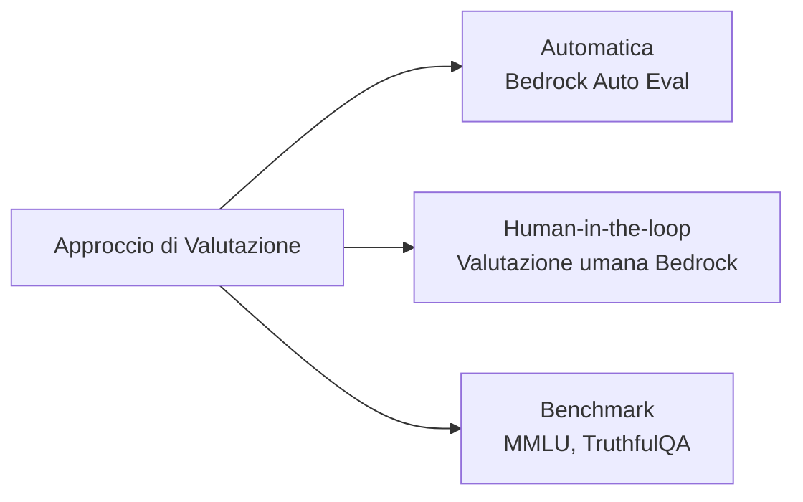
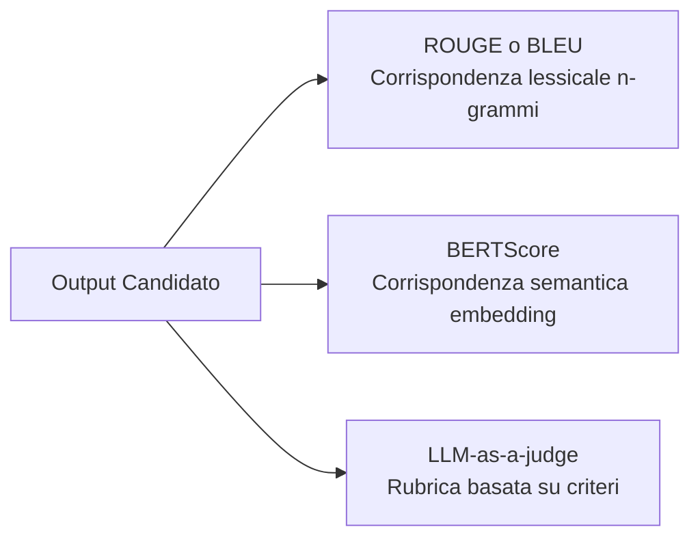
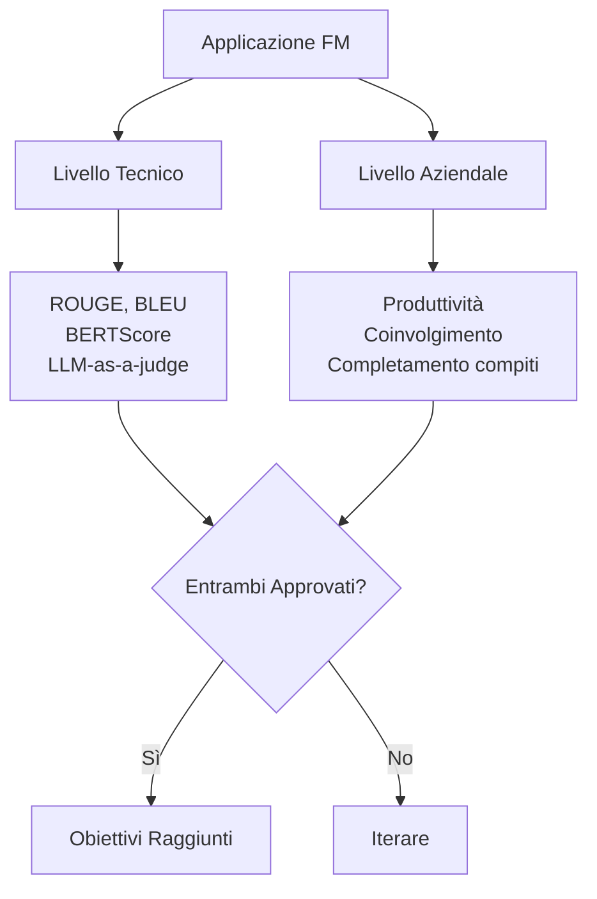
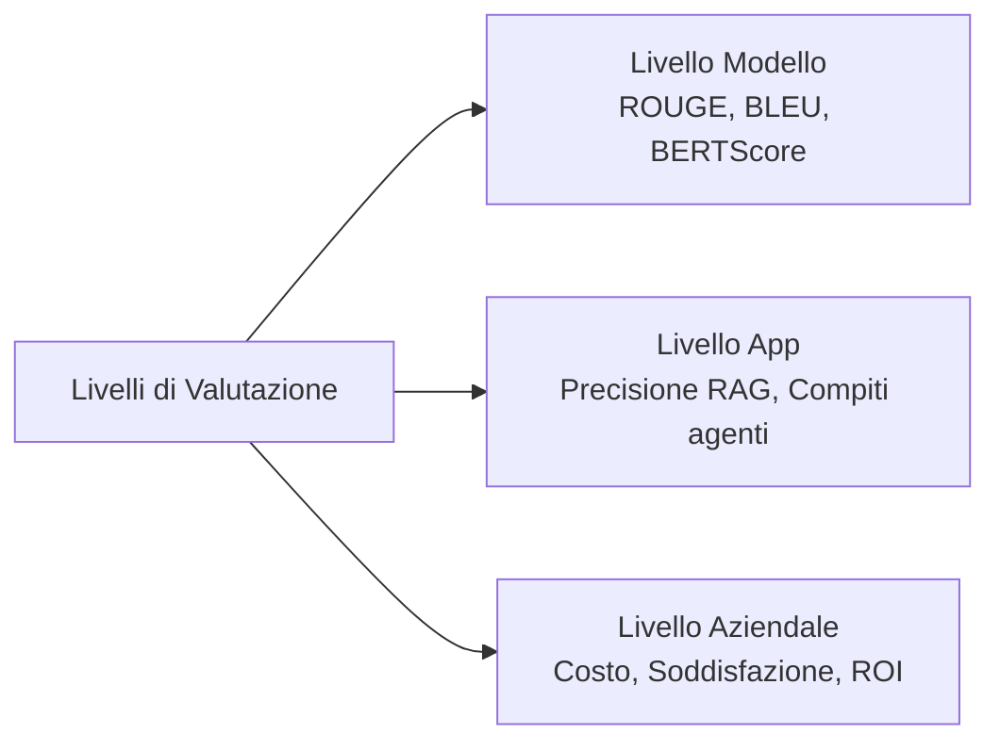

## Task Statement 3.4: Descrivere i metodi per valutare le prestazioni degli FM

Distribuire un'applicazione di modello fondazionale senza un piano di valutazione strutturato equivale a rilasciare software senza test. Un modello può ottenere punteggi elevati su benchmark generici eppure fallire il compito aziendale per cui è stato costruito, oppure può soddisfare gli obiettivi di accuratezza tecnica mentre gli utenti smettono silenziosamente di interagirci. Questo task statement copre come misurare le prestazioni degli FM a tre livelli distinti: il modello stesso, l'applicazione costruita su di esso e il risultato aziendale per cui è stato distribuito.[^304001]

### 3.4.1 Approcci per valutare le prestazioni degli FM

La maggior parte delle organizzazioni spende più tempo a selezionare un modello fondazionale che a valutare se funziona adeguatamente sui propri dati e compiti. Questa inversione è costosa. Un modello che supera una classifica general-purpose può comunque sottoperformare nel vocabolario specializzato, nelle lunghezze dei documenti o nei pattern di ragionamento che i flussi di lavoro della propria organizzazione richiedono. La valutazione deve essere trattata come un'attività di primo piano pianificata prima del deployment, non come un'analisi diagnostica dopo che emergono i problemi.

Esistono tre approcci complementari alla valutazione degli FM. Il primo utilizza revisori umani per giudicare direttamente gli output. Il secondo utilizza dataset di benchmark curati per misurare le prestazioni su compiti standardizzati. Il terzo utilizza un servizio gestito, **Amazon Bedrock Model Evaluation**, per eseguire valutazioni sia automatiche che umane all'interno di un flusso di lavoro controllato e verificabile.[^304002]

La **valutazione con human-in-the-loop** è la pratica di incorporare revisori umani qualificati nel processo di valutazione per giudicare gli output del modello rispetto a criteri che le metriche automatizzate non riescono a catturare, come la correttezza fattuale su argomenti proprietari, l'appropriatezza del tono o la sicurezza.[^304003] L'esame ha aggiornato questo termine da "valutazione umana" a "valutazione con human-in-the-loop" nella v1.1 per sottolineare che gli esseri umani non eseguono la valutazione dall'inizio alla fine; vengono inseriti in punti di giudizio specifici all'interno di una pipeline automatizzata più ampia.

Tre pattern comuni con human-in-the-loop compaiono in produzione:

- **Confronto affiancato**: Due output del modello per lo stesso prompt vengono presentati a un revisore, che seleziona quello migliore senza sapere quale modello ha prodotto ciascuno. Questo schema rimuove il bias di ancoraggio e produce una classifica relativa tra versioni del modello o tra modelli candidati. È il formato standard per la raccolta delle preferenze negli studi di *reinforcement learning dal feedback umano (RLHF)*.
- **Revisione da esperti**: Esperti di materia (medici, avvocati, ingegneri) valutano se gli output sono fattualmene corretti e appropriati per il dominio. I lavoratori generici possono giudicare la fluidità e il tono; gli esperti di dominio sono necessari per giudicare la correttezza in campi specializzati.
- **Punteggio basato su rubrica**: I revisori assegnano agli output un punteggio da 1 a 5 lungo dimensioni definite, come pertinenza, coerenza, sicurezza e accuratezza delle citazioni. Il punteggio basato su rubrica produce dati numerici che possono essere aggregati e tracciati nel tempo.

**Amazon Mechanical Turk** (per l'annotazione ad alto volume) e **Amazon SageMaker Ground Truth** (per i flussi di lavoro di etichettatura gestiti) possono fornire la forza lavoro di revisori umani per questi pattern.[^304004] **Amazon Augmented AI (A2I)** fornisce il livello di flusso di lavoro di revisione umana per i modelli ospitati su SageMaker e le pipeline di inferenza personalizzate: instrada gli output di inferenza a un team di revisione quando vengono soddisfatte le condizioni definite dallo sviluppatore, raccoglie le valutazioni e restituisce i risultati.[^304005] A2I è particolarmente utile per gli scenari di monitoraggio in produzione dove un modello gestisce migliaia di richieste al giorno e solo un sottoinsieme campionato richiede revisione umana. **Amazon Bedrock Model Evaluation** fornisce i propri job di valutazione umana che possono essere configurati con un team di revisori interni o una forza lavoro gestita da AWS; questo percorso è quello predefinito per la valutazione dei modelli fondazionali ospitati da Bedrock ed è trattato più avanti in questa sezione.

I dataset di benchmark sono raccolte standardizzate di prompt e risposte di riferimento utilizzate per misurare le prestazioni di un modello attraverso dimensioni specifiche di capacità.[^304006] Quattro benchmark compaiono costantemente nella letteratura rilevante per l'esame:

- **MMLU** (*Massive Multitask Language Understanding*): 57 materie accademiche che spaziano da STEM a discipline umanistiche, diritto e medicina. Verifica la conoscenza generale e l'ampiezza del ragionamento.[^304007]
- **HellaSwag**: Ragionamento di buon senso e completamento di frasi. Misura se un modello riesce a prevedere la continuazione più plausibile di uno scenario quotidiano.[^304008]
- **TruthfulQA**: Domande progettate per verificare se un modello produce risposte fattualmene corrette su argomenti dove esistono diffusi luoghi comuni errati. Un modello ottimizzato per la plausibilità piuttosto che per l'accuratezza otterrà un punteggio basso qui.[^304009]
- **HumanEval**: Un insieme di problemi di programmazione con casi di test, utilizzato per misurare la capacità di generazione di codice di un modello. Un modello supera un problema se il codice che produce supera i test unitari associati.[^304010]

I benchmark forniscono una base standardizzata e riproducibile tra versioni del modello e vendor, ma hanno un limite ben documentato chiamato *saturazione del benchmark*: i modelli addestrati dopo la pubblicazione di un benchmark possono assorbire inavvertitamente le risposte del benchmark attraverso dati di addestramento ottenuti via web, gonfiando i punteggi oltre il genuino miglioramento delle capacità.[^304011] I team aziendali dovrebbero trattare le classifiche dei benchmark come uno strumento di filtraggio, non come un verdetto finale.

**Amazon Bedrock Model Evaluation** è il servizio gestito AWS per l'esecuzione di valutazioni sia automatiche che umane sui modelli disponibili attraverso Amazon Bedrock.[^304012] Supporta due tipi di job. Un job di *valutazione automatica* esegue il modello selezionato su un dataset di prompt integrato o personalizzato e valuta le risposte usando metriche come accuratezza, robustezza e tossicità senza richiedere revisori umani. Un job di *valutazione umana* instrada gli output del modello a una forza lavoro di revisori, configurabile come un team interno o come una forza lavoro gestita da AWS, e raccoglie le loro valutazioni su criteri definiti.[^304013]

Le metriche automatiche integrate in Bedrock Model Evaluation includono accuratezza (per compiti di risposta alle domande con una risposta di riferimento), robustezza (misurata perturbando i prompt e verificando la coerenza degli output) e tossicità (valutata da un classificatore che segnala contenuti dannosi o offensivi).[^304014] I dataset di prompt personalizzati consentono alle organizzazioni di eseguire la valutazione sui propri input rappresentativi piuttosto che affidarsi a dataset generici, colmando il divario tra le prestazioni sui benchmark e il comportamento in produzione.

*Figura 3.4.1: Tre approcci di valutazione degli FM. Le metriche automatiche, la revisione human-in-the-loop e i benchmark standardizzati coprono ciascuno ciò che gli altri mancano; i programmi in produzione tipicamente usano tutti e tre in combinazione.*

### 3.4.2 Metriche rilevanti per valutare le prestazioni degli FM

La scelta della metrica giusta dipende da cosa si chiede al modello di produrre. Un modello di riepilogo e un modello di traduzione producono testo, ma la qualità di quel testo viene misurata meglio in modo diverso. Un modello che genera codice viene misurato al meglio da se il codice funziona correttamente. Questa sezione copre le quattro metriche specificate dall'esame: ROUGE, BLEU, BERTScore e LLM-as-a-judge.

**ROUGE** (*Recall-Oriented Understudy for Gisting Evaluation*) misura la sovrapposizione tra un riassunto generato e uno o più riassunti di riferimento scritti da esseri umani.[^304015] La variante più comune, ROUGE-L, conta la sottosequenza comune più lunga di parole tra il candidato e il riferimento. Un punteggio ROUGE alto significa che il modello ha usato molte delle stesse parole del riferimento scritto dall'uomo. ROUGE è la metrica standard per la valutazione del riassunto perché il riassunto ha un criterio chiaro di successo: le informazioni chiave del documento sorgente devono essere presenti nel riassunto.

ROUGE ha un limite noto: è una misura lessicale a livello superficiale. Se il modello produce un riassunto che dice "il cliente ha rescisso il contratto" mentre il riferimento dice "il cliente ha annullato l'accordo," i punteggi ROUGE saranno bassi nonostante le due frasi siano semanticamente identiche. Per questo motivo, ROUGE è più affidabile quando i riassunti di riferimento sono essi stessi diversificati (coprendo più formulazioni valide) e quando il corpus di valutazione è abbastanza grande da attenuare la variazione di formulazione su molti esempi.

**BLEU** (*Bilingual Evaluation Understudy*) è stato sviluppato specificamente per la traduzione automatica e misura la *precisione*: che frazione degli n-grammi (sequenze di parole) nell'output candidato appaiono nella traduzione di riferimento.[^304016] A differenza di ROUGE, che è orientato al recall, BLEU penalizza i candidati che producono output brevi per ingannare il recall e poi aggiunge una penalità di brevità per scontare le traduzioni eccessivamente brevi. BLEU rimane la metrica standard nel benchmarking della traduzione automatica. Il suo limite rispecchia quello di ROUGE: premia la sovrapposizione esatta a livello di parola e non riesce a dare credito a una traduzione che usa sinonimi o ristruttura le frasi senza cambiare il significato.

**BERTScore** affronta il limite di corrispondenza lessicale sia di ROUGE che di BLEU utilizzando un modello BERT pre-addestrato per calcolare la *similarità semantica* tra il candidato e il riferimento a livello di token.[^304017] Invece di contare le corrispondenze esatte di parole, BERTScore codifica entrambi i testi in vettori ad alta dimensione e misura la similarità coseno tra i token corrispondenti. Una frase candidata che usa parole diverse per esprimere lo stesso significato otterrà un punteggio più alto su BERTScore che su ROUGE o BLEU. BERTScore è più robusto alla parafrasi e viene sempre più utilizzato nella valutazione di riassunti, traduzioni e qualità generale del testo, in particolare quando la diversità degli output è attesa o auspicabile.

Il compromesso pratico tra le tre metriche è che ROUGE e BLEU sono veloci, deterministici e non richiedono chiamate di inferenza aggiuntive, mentre BERTScore richiede l'esecuzione del codificatore BERT sia sul candidato che sul riferimento, aggiungendo costo di calcolo e latenza. Per le pipeline di valutazione automatizzata su larga scala, i team spesso calcolano ROUGE e BLEU per velocità e aggiungono BERTScore come verifica secondaria su un sottoinsieme campionato.

**LLM-as-a-judge** è un approccio più recente, aggiunto alla guida dell'esame v1.1, in cui un separato *modello giudice* di alta qualità valuta gli output del modello sotto test rispetto a criteri definiti.[^304018] Il giudice riceve un prompt che contiene la domanda originale, la risposta del modello e una rubrica di punteggio, e restituisce un punteggio o un giudizio comparativo di preferenza. L'approccio è più veloce e meno costoso della valutazione umana: una singola chiamata di inferenza del modello giudice sostituisce il tempo e il costo di un revisore umano. Si scala anche senza una forza lavoro di revisori, rendendolo pratico per la valutazione di modelli su decine di migliaia di esempi.

Le avvertenze sono reali e importanti per le risposte all'esame. LLM-as-a-judge ha tre bias ben documentati.[^304019] Il *bias posizionale* è la tendenza a favorire qualunque candidato appaia per primo nel prompt. Il *bias di lunghezza* è la tendenza a valutare risposte più lunghe più in alto anche quando l'accuratezza è invariata. Il *bias di auto-valorizzazione* è ciò che accade quando un modello viene usato per giudicare i propri output: favorisce il testo che assomiglia al proprio stile. Per questi motivi, le pipeline LLM-as-a-judge in produzione tipicamente usano un modello giudice diverso da e generalmente più grande del modello sotto valutazione, ruotano l'ordine dei candidati nei confronti affiancati e calibrano gli output del giudice rispetto a un insieme di valutazioni umane tenute da parte.

*Tabella 3.4.1: Confronto delle metriche di qualità degli output degli FM*

| Metrica | Dominio del compito | Cosa misura | Punti di forza | Limiti |
|---|---|---|---|---|
| ROUGE | Riassunto | Recall a livello di parola vs. riferimento | Veloce, standard, nessun modello necessario | Penalizza parafrasi valide |
| BLEU | Traduzione | Precisione a livello di parola vs. riferimento | Veloce, standard, penalità di brevità | Penalizza sinonimi validi |
| BERTScore | Qualità del testo generale | Similarità semantica tramite embedding BERT | Robusto alla parafrasi | Richiede inferenza BERT, costo di calcolo |
| LLM-as-a-judge | Qualsiasi compito generativo | Punteggio basato su criteri da un modello giudice | Scalabile, criteri flessibili | Bias posizionale, di lunghezza e di auto-valorizzazione |

*Figura 3.4.2: Selezione della metrica di qualità degli output. Le metriche lessicali sono veloci ma superficiali; le metriche semantiche tollerano la parafrasi; le metriche basate su criteri sono flessibili ma richiedono controlli del bias.*

### 3.4.3 Determinare se un FM soddisfa gli obiettivi aziendali

Le metriche tecniche rispondono alla domanda "il modello sta producendo testo di buona qualità?" Gli obiettivi aziendali rispondono a una domanda diversa: "il modello sta risolvendo il problema per cui è stato distribuito?" La distinzione è importante perché un modello che ottiene 0,72 su ROUGE può o non può migliorare la produttività degli analisti. Un modello che raggiunge un BERTScore elevato sulle risposte al servizio clienti può o non può ridurre i tassi di escalation dei ticket.

Determinare se un FM soddisfa gli obiettivi aziendali richiede di collegare il comportamento del modello a risultati misurabili che interessano agli stakeholder aziendali. L'esame identifica tre categorie: produttività, coinvolgimento degli utenti e task engineering.

La **produttività** misura il tempo o lo sforzo risparmiati per compito.[^304020] Un team legale che usa un FM per elaborare riassunti di contratti dovrebbe essere in grado di riferire che ogni avvocato ora spende 20 minuti sulla revisione del riassunto piuttosto che 90 minuti sulla bozza manuale. Un team di strumenti per sviluppatori che usa un modello di completamento del codice dovrebbe misurare la produttività delle pull request o il tempo alla prima commit prima e dopo l'adozione. I miglioramenti della produttività sono il caso finanziario più diretto per il deployment degli FM e vengono misurati meglio attraverso pilot controllati dove un gruppo di trattamento usa lo strumento basato su FM e un gruppo di controllo no.

Il **coinvolgimento degli utenti** copre se gli utenti usano effettivamente il sistema, quanto profondamente interagiscono con esso e se ritornano.[^304021] Gli indicatori rilevanti includono sessioni per utente a settimana, profondità media della sessione (numero di turni prima che l'utente termini la conversazione o abbandoni il compito) e tasso di ritorno (la proporzione di utenti che usano di nuovo il sistema dopo la prima sessione). I dati di coinvolgimento segnalano se l'applicazione FM sta risolvendo un problema che gli utenti apprezzano o se gli utenti la stanno abbandonando dopo una scarsa esperienza iniziale. Un FM che produce output tecnicamente accurati ma è presentato in modo confuso o risponde troppo lentamente mostrerà un coinvolgimento in calo anche se i suoi punteggi ROUGE sono stabili.

Il **task engineering** è il termine dell'esame AWS per indicare se il flusso di lavoro basato su FM completa effettivamente il compito aziendale dall'inizio alla fine, senza richiedere un fallback umano a tassi che annullano il guadagno di efficienza.[^304022] (Al di fuori dei materiali AWS, la stessa idea è più comunemente chiamata *tasso di completamento del flusso di lavoro* o *tasso di completamento autonomo*.) Un bot di assistenza clienti che risolve autonomamente l'80% delle richieste sta raggiungendo il suo obiettivo di task engineering se il target era il 75%. Un flusso di lavoro di revisione documenti che richiede a un essere umano di correggere il 60% dei riassunti generati dall'FM prima dell'archiviazione non lo è. Il task engineering a questo livello obiettivo si concentra sul flusso di lavoro come distribuito; la sezione 3.4.5 introduce il *tasso di completamento dei compiti* come versione a livello dell'obiettivo dell'utente della stessa idea, applicata a se il compito aziendale sottostante dell'utente è stato completato.

L'implicazione pratica per gli scenari d'esame è che una domanda che descrive sintomi come "gli utenti non ritornano" o "l'FM completa il primo passo ma un essere umano deve finire il resto" dovrebbe dirigere il pensiero rispettivamente verso le metriche di coinvolgimento e di task engineering, non verso ROUGE o BLEU. Il modello potrebbe essere tecnicamente competente ma fallire a livello di flusso di lavoro.

*Figura 3.4.3: Framework di valutazione a doppio livello. Un modello deve superare sia il livello di valutazione tecnica che quello aziendale per essere considerato adatto al deployment previsto.*

### 3.4.4 Valutare le prestazioni delle applicazioni costruite con FM

Un modello fondazionale è raramente distribuito in isolamento. Le applicazioni in produzione stratificano sistemi di recupero, orchestrazione di agenti e flussi di lavoro multi-step sopra il modello base. Ogni livello introduce le proprie modalità di errore. Valutare solo il modello base lascia invisibili gli errori a livello di applicazione fino a quando non emergono in reclami in produzione.

L'esame identifica tre architetture applicative che richiedono ciascuna il proprio approccio di valutazione: pipeline RAG, agenti IA e flussi di lavoro multi-step.

La **valutazione RAG** si divide in due preoccupazioni indipendenti: qualità del recupero e qualità della generazione.[^304023] La qualità del recupero misura se il database vettoriale ha restituito i documenti giusti data la query dell'utente. La qualità della generazione misura se il modello ha prodotto una risposta accurata e fedele dati i documenti recuperati. Un errore in uno dei due sottosistemi produce una risposta errata, ma la causa principale e la soluzione sono diverse.

La qualità del recupero viene tipicamente misurata usando *precision@k* e *recall@k*, dove k è il numero di documenti recuperati.[^304024] Precision@k chiede: dei k documenti recuperati, che frazione era effettivamente pertinente? Recall@k chiede: di tutti i documenti pertinenti nel corpus, che frazione è apparsa nei risultati top-k? Un sistema di recupero con alta precisione ma basso recall trova documenti affidabili ma ne manca di importanti. Un sistema con alto recall ma bassa precisione restituisce tutto ciò che è pertinente ma lo seppellisce nel rumore.

La qualità della generazione per RAG viene misurata dalla *groundedness* (se la risposta del modello è supportata dai documenti recuperati, non inventata dalla memoria parametrica), la *fedeltà della risposta* (se le affermazioni nella risposta riflettono accuratamente ciò che dicono i documenti recuperati) e l'*accuratezza delle citazioni* (se le fonti citate contengono effettivamente le informazioni ad esse attribuite).[^304025] Strumenti come **Ragas** forniscono un framework di valutazione open-source che calcola automaticamente queste metriche eseguendo un modello giudice sui documenti recuperati e sulla risposta generata.[^304026]

La **valutazione degli agenti** misura se un agente IA completa i compiti assegnati con accuratezza, efficienza e a un costo accettabile.[^304027] Poiché gli agenti eseguono piani multi-step usando strumenti esterni, la loro superficie di valutazione è più grande di un modello con risposta singola. Le metriche rilevanti includono:

- **Tasso di completamento dei compiti**: La percentuale di compiti assegnati che l'agente completa senza intervento umano o uscita in stato di errore.
- **Accuratezza della selezione degli strumenti**: Se l'agente ha scelto lo strumento corretto ad ogni passo (rilevante quando l'agente ha accesso a più API e la scelta giusta è deterministica data la descrizione del compito).
- **Efficienza dei passi**: Il numero di chiamate agli strumenti necessarie per completare un compito, rispetto al numero minimo che un piano ben progettato richiederebbe. Conteggi di passi elevati suggeriscono che l'agente sta ripianificando inutilmente o producendo argomenti degli strumenti errati che attivano nuovi tentativi.
- **Costo per compito**: Il costo totale di inferenza e chiamata agli strumenti necessario per completare un compito. Questa è una metrica aziendale diretta per gli agenti che operano su larga scala.

Amazon Bedrock fornisce capacità di valutazione degli agenti per Bedrock Agents e gli agenti distribuiti con AgentCore, inclusi test harness, tracce per ogni passo e job di valutazione integrati allineati con le metriche degli agenti sopra indicate; consultare l'attuale Amazon Bedrock User Guide per i nomi e l'ambito esatti delle funzionalità, poiché la superficie di valutazione degli agenti continua ad evolversi.[^304028]

La **valutazione del flusso di lavoro** si applica alle pipeline multi-step che combinano chiamate FM, recuperi RAG, logica di business e handoff umani in un processo aziendale completo.[^304029] Le metriche includono il tasso di successo end-to-end (che proporzione di istanze del flusso di lavoro si completa senza un'uscita in errore o un override umano forzato), la distribuzione delle categorie di errore (quale passo produce errori più spesso) e il tasso di fallback (con quale frequenza il flusso di lavoro instrada a un percorso di fallback umano).

*Tabella 3.4.2: Metriche di valutazione per architettura applicativa*

| Architettura | Metriche di recupero | Metriche di generazione | Metriche aziendali |
|---|---|---|---|
| Solo FM base | Non applicabile | ROUGE, BLEU, BERTScore, LLM-as-a-judge | Produttività, coinvolgimento |
| Pipeline RAG | Precision@k, Recall@k | Groundedness, Fedeltà, Accuratezza citazioni | Completamento compiti, soddisfazione utente |
| Agente IA | Accuratezza selezione strumenti, Efficienza passi | Correttezza risposta, Tasso allucinazioni | Tasso completamento compiti, Costo per compito |
| Flusso di lavoro multi-step | Non applicabile | Distribuzione categorie errore | Tasso successo end-to-end, Tasso fallback |

*Figura 3.4.4: Architettura di valutazione a livelli. Ogni livello dello stack applicativo richiede il proprio approccio di valutazione; i fallimenti a qualsiasi livello influiscono sul risultato aziendale.*

### 3.4.5 Metriche di allineamento degli obiettivi aziendali per le applicazioni IA

Le metriche nella Sezione 3.4.2 indicano se il modello sta funzionando bene tecnicamente. Le metriche nella Sezione 3.4.4 indicano se l'applicazione sta funzionando correttamente. Le metriche di allineamento degli obiettivi aziendali rispondono alla domanda che l'executive sponsor si pone effettivamente: questo investimento in IA sta generando valore?

La guida dell'esame v1.1 ha aggiunto questo come obiettivo distinto, segnalando che l'esame si aspetta che i candidati comprendano il divario tra la misurazione tecnica e la responsabilità aziendale e sappiano quali strumenti colmano tale divario.

Il **tasso di completamento dei compiti** è la percentuale di compiti avviati dall'utente che l'applicazione IA completa con successo senza richiedere all'utente di abbandonare il compito, cercare aiuto da un altro canale o escalare a un agente umano.[^304030] È distinto dal tasso di completamento dei compiti degli agenti (Sezione 3.4.4) nell'ambito: il completamento dei compiti degli agenti misura se il livello di orchestrazione ha terminato il suo piano, mentre il completamento dei compiti aziendali misura se l'obiettivo sottostante dell'utente è stato soddisfatto. Un utente che ha chiesto all'IA di prenotare una sala conferenze, ha ricevuto una conferma, ma in seguito ha scoperto che la sala era già occupata non ha vissuto un compito completato dal punto di vista aziendale, anche se le chiamate API dell'agente hanno tutte restituito codici di successo.

Il tasso di completamento dei compiti è la singola metrica che più direttamente collega il comportamento dell'applicazione FM al caso aziendale per il deployment. Se l'applicazione è stata distribuita per ridurre il numero di ticket di supporto che raggiungono un agente umano, il tasso di completamento dei compiti misura esattamente quanto bene sta raggiungendo quell'obiettivo. Per gli scenari d'esame, il tasso di completamento dei compiti è la risposta MIGLIORE quando la domanda chiede come misurare se un'applicazione IA sta soddisfacendo il suo obiettivo aziendale principale.

La **soddisfazione degli utenti** cattura come gli utenti percepiscono la qualità delle loro interazioni con l'applicazione IA.[^304031] Gli strumenti comuni includono sondaggi post-interazione (*CSAT*, il Customer Satisfaction Score, dove gli utenti valutano la loro esperienza su una scala numerica), *NPS* (Net Promoter Score, che chiede se l'utente raccomanderebbe l'applicazione a un collega) e feedback in-product (valutazioni pollice su/pollice giù raccolte alla fine di ogni risposta). A differenza del tasso di completamento dei compiti, che è una misura oggettiva di ciò che è accaduto, la soddisfazione degli utenti è una misura soggettiva di come l'utente si è sentito riguardo ad esso. Entrambe sono necessarie. Un assistente per le note spese che risolve le sottomissioni in due click ma usa un tono brusco può vedere il CSAT scendere sotto 3,5 anche quando il suo tasso di completamento dei compiti rimane sopra il 90%; gli utenti cercheranno uno strumento diverso quando uno diventerà disponibile.

Il **costo per interazione** misura il costo totale cloud e di licenza sostenuto per servire una richiesta utente attraverso l'intero stack applicativo, dalla chiamata API al passo di recupero (se presente) alla chiamata di inferenza FM e all'eventuale elaborazione successiva.[^304032] In una pipeline RAG, il costo per interazione include la chiamata al modello di embedding, l'operazione di ricerca vettoriale e la chiamata di generazione FM. In un flusso di lavoro di agenti, include ogni passo di chiamata agli strumenti e di inferenza nel piano. Il costo per interazione deve essere tracciato rispetto al ricavo o al valore per interazione per determinare se l'economia unitaria dell'applicazione è sostenibile su larga scala. Un'applicazione che costa 0,05 euro per interazione e genera 0,10 euro di valore misurato (attraverso risparmi sul deflection dei ticket, per esempio) è sostenibile. Una che costa 0,08 euro per interazione per lo stesso valore di 0,10 euro lascia poco margine per la capacità dell'infrastruttura.

Tracciare queste metriche richiede di connettere la telemetria dell'applicazione IA a un livello di business intelligence. **Amazon CloudWatch** raccoglie metriche operative, log e tracce da Amazon Bedrock e dal codice applicativo, inclusi latenza, tassi di errore e conteggi di invocazioni per modello.[^304033] Questi segnali operativi possono essere combinati con eventi a livello applicativo (compito completato, utente ha dato pollice giù, costo dell'interazione registrato) per costruire un quadro completo. **Amazon QuickSight** si connette ai dati di CloudWatch e ad altre fonti di dati per produrre dashboard che presentano il tasso di completamento dei compiti, le tendenze di soddisfazione degli utenti e il costo per interazione in formati accessibili agli stakeholder aziendali che non leggono direttamente i grafici delle metriche di CloudWatch.[^304034]

*Tabella 3.4.3: Metriche di allineamento aziendale per le applicazioni IA*

| Metrica | Cosa misura | Fonte dei dati | Stakeholder | Decisione che informa |
|---|---|---|---|---|
| Tasso di completamento dei compiti | Se gli obiettivi degli utenti sono soddisfatti | Log eventi applicativi | Prodotto, Operazioni | Adeguare l'ambito o la logica di fallback |
| Soddisfazione utente (CSAT, NPS) | Percezione degli utenti sulla qualità | Sondaggi post-interazione, feedback pollice | Prodotto, CX | Migliorare la qualità delle risposte o l'UX |
| Costo per interazione | Economia unitaria della consegna IA | Dati di fatturazione e invocazione CloudWatch | Finanza, Ingegneria | Ottimizzare il livello del modello, il caching o il flusso di lavoro |

Un programma di valutazione ben progettato monitora tutte e tre le metriche aziendali continuamente, non solo al lancio. Il tasso di completamento dei compiti può diminuire man mano che le query degli utenti si spostano dai pattern su cui il modello è stato testato. La soddisfazione degli utenti può diminuire man mano che la novità si esaurisce e gli utenti confrontano l'IA con alternative migliorate. Il costo per interazione può aumentare se i pattern di utilizzo si spostano verso query più lunghe e complesse. La revisione regolare di tutte e tre le metriche rispetto a soglie definite è la disciplina operativa che distingue un prodotto IA gestito da un prototipo che è stato spedito e dimenticato.

## Domande di autoverifica

**Domanda 1.** Un'organizzazione sanitaria sta distribuendo uno strumento basato su FM che aiuta gli infermieri a recuperare informazioni dai protocolli clinici. Prima di andare in produzione, il team vuole verificare che il modello produca risposte fattualmene accurate e appropriate per il dominio sul vocabolario medico specializzato. Quale approccio di valutazione è PIU' appropriato per questo requisito?

A. Eseguire il modello sul benchmark MMLU e accettarlo se il punteggio supera il 70%  
B. Usare Amazon Bedrock Model Evaluation con un job automatico di rilevamento della tossicità  
C. Usare Amazon Augmented AI (A2I) per instradare gli output del modello a esperti clinici per un punteggio basato su rubrica  
D. Calcolare i punteggi BLEU rispetto a un insieme di riassunti clinici di riferimento  

**Spiegazione:** Il vincolo chiave in questo scenario è la correttezza fattuale specifica del dominio valutata da persone in grado di giudicare se una risposta medica è clinicamente accurata. I lavoratori generici e le metriche automatizzate non possono fare questo giudizio. La Risposta C è corretta: Amazon A2I supporta flussi di lavoro di valutazione human-in-the-loop che possono instradare gli output a un pool di revisori definito, come un panel di infermieri o medici clinici, che valutano le risposte su una rubrica che copre accuratezza, chiarezza e appropriatezza. La Risposta A è sbagliata perché MMLU è un benchmark accademico generale; ottenere il 70% su 57 materie accademiche non indica se il modello gestisce correttamente le query sui protocolli clinici, e la soglia non ha alcuna relazione con i requisiti di sicurezza clinica. La Risposta B è sbagliata perché un job di tossicità misura se il modello produce contenuti dannosi o offensivi; non valuta l'accuratezza clinica. La Risposta D è sbagliata perché BLEU misura la precisione a livello di parola rispetto a un testo di riferimento e non cattura se le informazioni cliniche trasmesse sono corrette; una risposta plausibile ma fattualmene errata potrebbe ottenere un buon punteggio su BLEU se condivide il vocabolario con il riferimento.[^304035]

---

**Domanda 2.** Un'organizzazione sta confrontando due modelli fondazionali per un compito di riassunto di notizie. Entrambi i modelli producono inglese scorrevole. Il team di valutazione ha un insieme di 500 riassunti di riferimento scritti da esseri umani per gli stessi articoli. Quale metrica è PIU' appropriata come segnale di valutazione principale per questo compito?

A. BERTScore, perché misura la similarità semantica e tollera la parafrasi  
B. BLEU, perché è stata progettata per la valutazione della generazione di testo rispetto a riferimenti  
C. ROUGE, perché è stata progettata specificamente per il riassunto e misura il recall delle informazioni chiave  
D. LLM-as-a-judge, perché un modello giudice può valutare la coerenza senza un riassunto di riferimento  

**Spiegazione:** ROUGE (Risposta C) è stata sviluppata specificamente per la valutazione del riassunto e il suo design riflette il requisito principale di quel compito: un buon riassunto deve contenere le informazioni chiave del documento sorgente, il che è un problema di recall. ROUGE-L, la variante più comune, misura la sottosequenza comune più lunga di parole tra il candidato e il riferimento, premiando i riassunti che coprono i punti principali in qualsiasi ordine. La Risposta A è tecnicamente valida come metrica secondaria, ma BERTScore richiede l'esecuzione di un codificatore BERT su ogni coppia candidato-riferimento, aggiungendo costo computazionale; è più utile quando i riassunti di riferimento usano un vocabolario vario e la sovrapposizione lessicale penalizzerebbe ingiustamente le parafrasi valide. Se l'organizzazione vuole aggiungere robustezza semantica alla valutazione, BERTScore è un complemento appropriato, non un sostituto. La Risposta B è sbagliata perché BLEU è una metrica orientata alla precisione progettata per la traduzione, dove conta la formulazione esatta della lingua target; il riassunto privilegia il recall dei contenuti piuttosto che la precisione della formulazione. La Risposta D è sbagliata perché LLM-as-a-judge è più utile quando non è disponibile un riassunto di riferimento e è richiesto un giudizio in stile umano; quando sono disponibili 500 riassunti di riferimento, le metriche basate su riferimenti sono il segnale principale più affidabile e riproducibile.[^304036]

---

**Domanda 3.** Un'azienda ha distribuito uno strumento di Q&A interno basato su RAG tre mesi fa. Gli utenti riferiscono che lo strumento spesso fornisce risposte che sembrano sicure ma contengono informazioni non trovate nei documenti aziendali. Quale metrica di valutazione identifica PIU' direttamente questa modalità di errore?

A. Punteggio ROUGE-L rispetto a risposte di riferimento scritte da esseri umani  
B. Punteggio di groundedness che misura se le risposte sono supportate dai documenti recuperati  
C. Precision@k che misura se i principali documenti recuperati sono pertinenti  
D. Tasso di completamento dei compiti che misura se gli utenti trovano lo strumento utile  

**Spiegazione:** Il sintomo descritto (risposte sicure che contengono informazioni non presenti nei documenti sorgente) è la definizione di scarsa *groundedness*: il modello sta generando contenuto dalla sua memoria parametrica piuttosto che dai documenti recuperati. La Risposta B è corretta. La groundedness viene valutata verificando ogni affermazione nella risposta generata rispetto all'insieme dei documenti recuperati e calcolando che frazione delle affermazioni è supportata da almeno un documento recuperato. Strumenti come Ragas calcolano automaticamente questa metrica. La Risposta A è sbagliata perché ROUGE-L misura la sovrapposizione di parole con una risposta di riferimento umana; non rilevare il contenuto allucinato che usa parole plausibili non presenti nel riferimento. La Risposta C è sbagliata perché precision@k misura la qualità del recupero, non della generazione; un sistema di recupero potrebbe restituire documenti altamente pertinenti mentre il modello li ignora comunque e genera dalla memoria parametrica. La Risposta D è sbagliata perché il tasso di completamento dei compiti misura se l'obiettivo dell'utente è stato soddisfatto; il sintomo descritto potrebbe causare bassa soddisfazione senza attivare il percorso formale di fallimento del compito tracciato dall'applicazione.[^304037]

---

**Domanda 4.** Un product manager IA sta presentando il caso aziendale per un'applicazione di chat di assistenza clienti basata su FM al CFO. Il CFO chiede un'unica metrica che mostri se l'applicazione è finanziariamente sostenibile su larga scala. Quale metrica risponde MEGLIO a questa domanda?

A. Punteggio BLEU sul corpus delle risposte di supporto  
B. Profondità media della sessione per utente  
C. Costo per interazione rispetto al valore consegnato per interazione  
D. Tasso di fallback agli agenti umani  

**Spiegazione:** La domanda del CFO riguarda l'economia unitaria: ogni interazione genera valore che giustifica il suo costo? Il costo per interazione (Risposta C) misura la spesa cloud e di licenza totale per ogni richiesta utente attraverso l'intero stack applicativo. Quando viene confrontato con il valore misurato per interazione (per esempio, il costo medio di un agente umano che gestisce la stessa richiesta), stabilisce se l'applicazione è finanziariamente sostenibile alla scala di utilizzo attuale e prevista. La Risposta A è sbagliata perché BLEU è una metrica di qualità del testo; non ha alcuna relazione con il costo o la sostenibilità finanziaria. La Risposta B (profondità della sessione) è una metrica di coinvolgimento che segnala se gli utenti trovano utile l'applicazione, ma non indica nulla al CFO sulla struttura dei costi. La Risposta D (tasso di fallback) è una metrica operativa utile che contribuisce alla comprensione dell'economia, poiché ogni fallback a un agente umano comporta il costo umano completo anziché il costo IA, ma è un input componente del quadro finanziario, non la visione completa dell'economia unitaria che il CFO sta chiedendo. Il costo per interazione, confrontato direttamente con il valore per interazione, è la metrica che risponde alla domanda del CFO.[^304038]

---

**Domanda 5.** Un team sta valutando una nuova versione FM per sostituire il modello di produzione corrente. Vogliono determinare se il nuovo modello produce output che i revisori umani preferiscono, senza richiedere ai revisori di sapere quale modello ha prodotto ogni risposta. Quale approccio di valutazione soddisfa PIU' direttamente questo requisito?

A. Eseguire entrambi i modelli sul benchmark TruthfulQA e confrontare le classifiche percentili  
B. Usare LLM-as-a-judge con il modello di produzione corrente come modello giudice  
C. Usare il confronto umano affiancato con le identità dei revisori rese ignare dell'identità del modello  
D. Calcolare BERTScore per entrambi i modelli rispetto allo stesso insieme di output di riferimento  

**Spiegazione:** Il requisito ha due parti: giudizio di preferenza umana e accecamento (i revisori non devono sapere quale modello ha prodotto quale output). La Risposta C è il pattern di valutazione human-in-the-loop specificamente progettato per questo caso d'uso. Il confronto affiancato presenta due output a un revisore per lo stesso prompt, il revisore seleziona l'output preferito, e il design previene il bias di ancoraggio non etichettando quale modello ha prodotto ciascuno. Questo produce direttamente una classifica di preferenza tra le due versioni del modello. La Risposta A è sbagliata perché TruthfulQA è un benchmark per l'accuratezza fattuale su argomenti soggetti a luoghi comuni errati; non misura la preferenza generale sulla qualità degli output, e la domanda non menziona l'accuratezza fattuale come criterio. La Risposta B è sbagliata in modo sottile ma importante: usare il modello di produzione corrente come modello giudice introduce il bias di auto-valorizzazione; il modello corrente tenderà a valutare più favorevolmente gli output simili al proprio stile, rendendo il confronto ingiusto per il nuovo modello. La Risposta D è sbagliata perché BERTScore calcola la similarità semantica rispetto a testi di riferimento, non la preferenza umana tra due output candidati; non cattura il giudizio qualitativo che il team sta cercando.[^304039]

---

**Domanda 6.** Un'organizzazione ha lanciato un assistente agli approvvigionamenti basato su FM sei settimane fa. I dati di utilizzo mostrano che il 45% degli utenti che provano l'assistente non ritorna dopo la prima sessione. I punteggi ROUGE del modello sui test di riassunto sono nel quartile superiore per la sua famiglia di modelli. Quale metrica aziendale diagnostica PIU' direttamente se questo problema di coinvolgimento deriva dalla qualità degli output del modello o dalla progettazione dell'applicazione?

A. Soddisfazione degli utenti (CSAT o feedback pollice) raccolto immediatamente dopo ogni interazione  
B. BERTScore calcolato rispetto a un insieme di risposte di riferimento per query di approvvigionamento  
C. Tasso di completamento dei compiti misurato dal log degli eventi applicativi  
D. Precision@k per il livello di recupero RAG  

**Spiegazione:** Lo scenario presenta una dissociazione: i punteggi ROUGE sono elevati (suggerendo che il modello produce testo che si sovrappone bene ai riferimenti) ma il tasso di ritorno è basso (suggerendo che gli utenti non trovano l'applicazione abbastanza utile da usarla di nuovo). Per diagnosticare se il problema riguarda la qualità degli output o la progettazione dell'applicazione, l'organizzazione ha bisogno di un segnale dagli utenti reali che rifletta la loro esperienza soggettiva, non un segnale da metriche di sovrapposizione automatizzata del testo. La soddisfazione degli utenti raccolta immediatamente dopo ogni interazione (Risposta A) cattura se gli utenti hanno trovato la risposta utile, accurata e consegnata in un modo che li facesse voler tornare. Un pattern di basso CSAT nonostante un alto ROUGE indicherebbe che i riassunti di riferimento usati per la valutazione ROUGE non riflettono ciò che gli utenti apprezzano effettivamente nel contesto degli approvvigionamenti, indicando un problema di qualità degli output o di inquadratura. Un pattern di CSAT moderato con basso tasso di ritorno indicherebbe fattori di progettazione dell'applicazione (UX, velocità, fiducia) piuttosto che il modello stesso. La Risposta B è sbagliata perché BERTScore è un'altra metrica automatizzata di qualità del testo che, come ROUGE, misura la similarità ai riferimenti; non spiegherebbe il divario tra i punteggi tecnici e il comportamento degli utenti. Il tasso di completamento dei compiti (Risposta C) direbbe se il flusso di lavoro è terminato, ma in questo scenario il flusso di lavoro già produce punteggi tecnici elevati; il segnale mancante è il giudizio soggettivo dell'utente su quella interazione completata, che solo CSAT o il feedback pollice cattura. La Risposta D è sbagliata perché precision@k diagnostica la qualità del recupero; sebbene un recupero scarso possa contribuire a risposte scadenti, sarebbe un passo di indagine secondario dopo aver stabilito i dati di soddisfazione degli utenti.[^304040]

[^304001]: AWS Certification. AI Practitioner (AIF-C01) Exam Guide v1.1, Task Statement 3.4. URL: <https://docs.aws.amazon.com/aws-certification/latest/ai-practitioner-01/ai-practitioner-01-domain3.html>
[^304002]: Amazon Bedrock. Amazon Bedrock Model Evaluation overview. URL: <https://docs.aws.amazon.com/bedrock/latest/userguide/model-evaluation.html>
[^304003]: Amazon A2I. How Amazon Augmented AI works. URL: <https://docs.aws.amazon.com/sagemaker/latest/dg/a2i-how-it-works.html>
[^304004]: Amazon SageMaker. Amazon SageMaker Ground Truth labeling workflows. URL: <https://docs.aws.amazon.com/sagemaker/latest/dg/sms.html>
[^304005]: Amazon A2I. Use Amazon Augmented AI for human review. URL: <https://docs.aws.amazon.com/sagemaker/latest/dg/a2i-use-augmented-ai-a2i-human-review-loops.html>
[^304006]: Liang, P., et al. Holistic Evaluation of Language Models (HELM, 2022). URL: <https://arxiv.org/abs/2211.09110>
[^304007]: Hendrycks, D., et al. Measuring Massive Multitask Language Understanding (MMLU, 2020). URL: <https://arxiv.org/abs/2009.03300>
[^304008]: Zellers, R., et al. HellaSwag: Can a Machine Really Finish Your Sentence? (2019). URL: <https://arxiv.org/abs/1905.07830>
[^304009]: Lin, S., et al. TruthfulQA: Measuring How Models Mimic Human Falsehoods (2021). URL: <https://arxiv.org/abs/2109.07958>
[^304010]: Chen, M., et al. Evaluating Large Language Models Trained on Code (HumanEval, 2021). URL: <https://arxiv.org/abs/2107.03374>
[^304011]: Kiela, D., et al. Dynabench: Rethinking Benchmarking in NLP (2021). URL: <https://arxiv.org/abs/2104.14337>
[^304012]: Amazon Bedrock. Amazon Bedrock Model Evaluation jobs. URL: <https://docs.aws.amazon.com/bedrock/latest/userguide/model-evaluation-jobs.html>
[^304013]: Amazon Bedrock. Human evaluation using Amazon Bedrock Model Evaluation. URL: <https://docs.aws.amazon.com/bedrock/latest/userguide/model-evaluation-human.html>
[^304014]: Amazon Bedrock. Automatic evaluation metrics in Amazon Bedrock Model Evaluation. URL: <https://docs.aws.amazon.com/bedrock/latest/userguide/model-evaluation-automatic.html>
[^304015]: Lin, C.-Y. ROUGE: A Package for Automatic Evaluation of Summaries (2004). URL: <https://aclanthology.org/W04-1013>
[^304016]: Papineni, K., et al. BLEU: a Method for Automatic Evaluation of Machine Translation (2002). URL: <https://aclanthology.org/P02-1040>
[^304017]: Zhang, T., et al. BERTScore: Evaluating Text Generation with BERT (2019). URL: <https://arxiv.org/abs/1904.09675>
[^304018]: Zheng, L., et al. Judging LLM-as-a-Judge with MT-Bench and Chatbot Arena (2023). URL: <https://arxiv.org/abs/2306.05685>
[^304019]: Wang, P., et al. Large Language Models are not Fair Evaluators (2023). URL: <https://arxiv.org/abs/2305.17926>
[^304020]: Microsoft Research. The Total Economic Impact of GitHub Copilot (2023). URL: <https://resources.github.com/downloads/The-Total-Economic-Impact-of-GitHub-Copilot.pdf>
[^304021]: Amazon CloudWatch. Using Amazon CloudWatch to track user engagement metrics for AI applications. URL: <https://docs.aws.amazon.com/AmazonCloudWatch/latest/monitoring/working_with_metrics.html>
[^304022]: Amazon Bedrock. Evaluating agent task completion in Amazon Bedrock. URL: <https://docs.aws.amazon.com/bedrock/latest/userguide/agents-evaluation.html>
[^304023]: Es, S., et al. RAGAS: Automated Evaluation of Retrieval Augmented Generation (2023). URL: <https://arxiv.org/abs/2309.15217>
[^304024]: Manning, C., et al. Introduction to Information Retrieval: Precision and Recall at k (2008). URL: <https://nlp.stanford.edu/IR-book/>
[^304025]: Es, S., et al. RAGAS: Faithfulness and Answer Relevance Metrics (2023). URL: <https://arxiv.org/abs/2309.15217>
[^304026]: Ragas. Ragas: Evaluation framework for RAG pipelines. URL: <https://docs.ragas.io/>
[^304027]: Amazon Bedrock. Evaluating Amazon Bedrock Agents. URL: <https://docs.aws.amazon.com/bedrock/latest/userguide/agents-evaluation.html>
[^304028]: Amazon Bedrock User Guide. Evaluation capabilities for Bedrock Agents and AgentCore. URL: <https://docs.aws.amazon.com/bedrock/latest/userguide/agents.html>
[^304029]: Amazon Bedrock. Multi-step workflow evaluation with Amazon Bedrock. URL: <https://docs.aws.amazon.com/bedrock/latest/userguide/agents-test.html>
[^304030]: Amazon Bedrock. Measuring task completion in Amazon Bedrock application monitoring. URL: <https://docs.aws.amazon.com/bedrock/latest/userguide/model-evaluation.html>
[^304031]: Amazon Connect. Customer satisfaction scoring and AI contact center metrics. URL: <https://docs.aws.amazon.com/connect/latest/adminguide/metrics-definitions.html>
[^304032]: Amazon Bedrock. Monitoring Amazon Bedrock usage and costs with AWS Cost Explorer. URL: <https://docs.aws.amazon.com/bedrock/latest/userguide/monitoring-overview.html>
[^304033]: Amazon CloudWatch. Monitoring Amazon Bedrock with Amazon CloudWatch. URL: <https://docs.aws.amazon.com/bedrock/latest/userguide/monitoring-cloudwatch.html>
[^304034]: Amazon QuickSight. Getting started with Amazon QuickSight dashboards. URL: <https://docs.aws.amazon.com/quicksight/latest/user/getting-started.html>
[^304035]: Amazon A2I. Setting up a human review workflow with Amazon Augmented AI. URL: <https://docs.aws.amazon.com/sagemaker/latest/dg/a2i-create-flow-definition.html>
[^304036]: Lin, C.-Y. ROUGE: A Package for Automatic Evaluation of Summaries: task applicability (2004). URL: <https://aclanthology.org/W04-1013>
[^304037]: Es, S., et al. RAGAS: Groundedness evaluation for RAG pipelines (2023). URL: <https://arxiv.org/abs/2309.15217>
[^304038]: Amazon Bedrock. Tracking Amazon Bedrock invocation costs per application. URL: <https://docs.aws.amazon.com/bedrock/latest/userguide/monitoring-overview.html>
[^304039]: Zheng, L., et al. Judging LLM-as-a-Judge: bias characteristics and mitigations (2023). URL: <https://arxiv.org/abs/2306.05685>
[^304040]: Amazon CloudWatch. Collecting user feedback events in AI application telemetry. URL: <https://docs.aws.amazon.com/AmazonCloudWatch/latest/monitoring/working_with_metrics.html>
