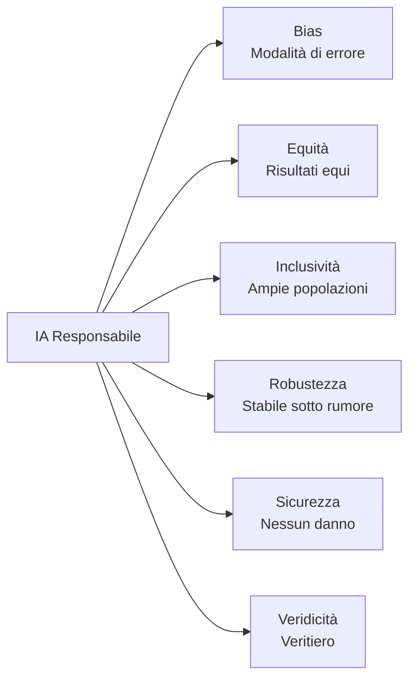
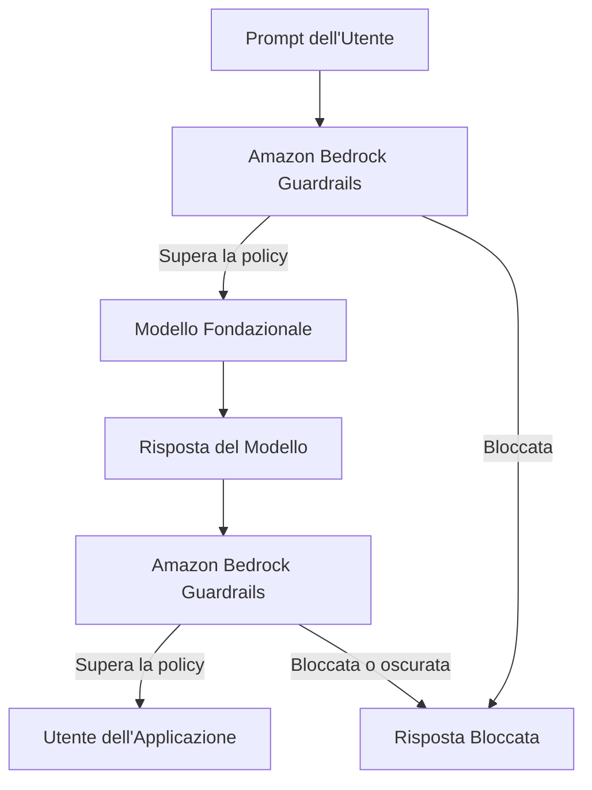
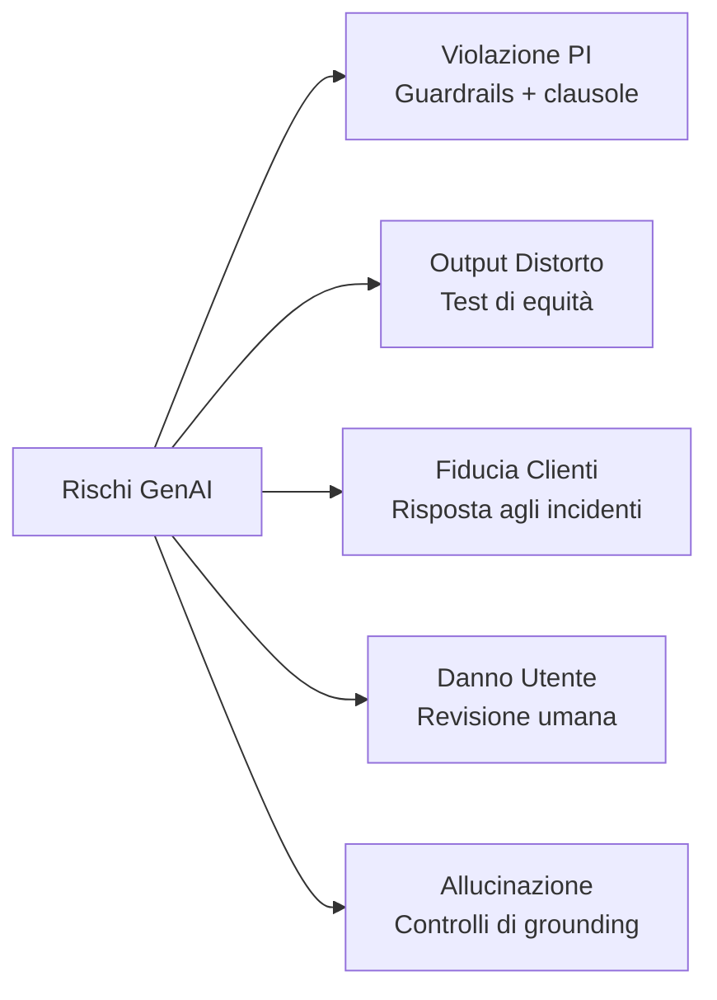
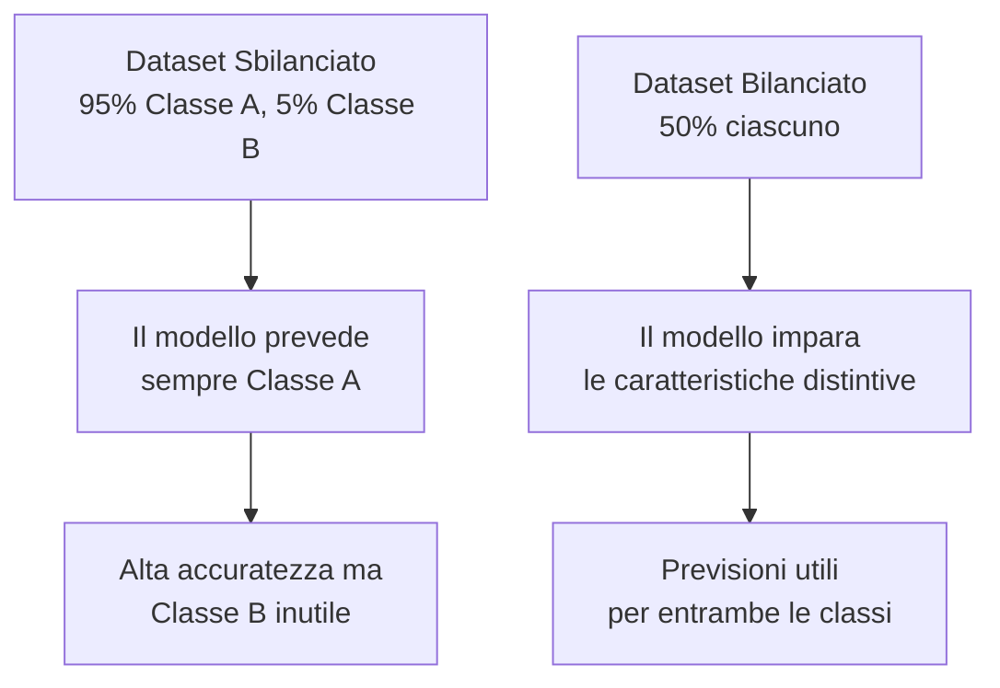
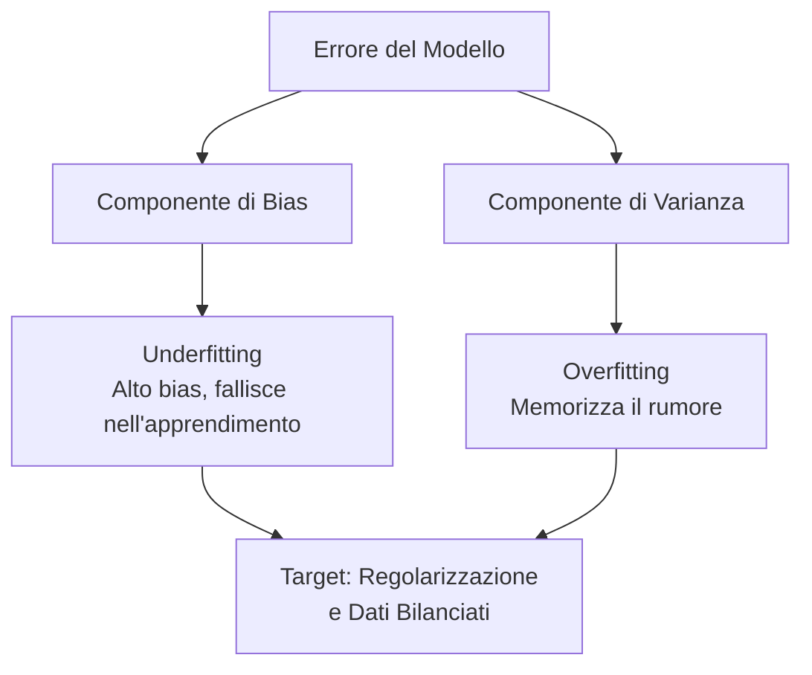

## Task Statement 4.1: Spiegare lo sviluppo di sistemi IA responsabili

L'IA responsabile è un insieme di impegni di ingegneria e governance che determinano se un sistema IA produce output equi, accurati e sicuri per l'intera gamma di persone che saranno influenzate. Questo capitolo copre i sette obiettivi del Task Statement 4.1: le caratteristiche definitive dell'IA responsabile, gli strumenti AWS che applicano e rilevano tali caratteristiche, le pratiche responsabili per la selezione del modello, i rischi legali specifici dell'IA generativa, le caratteristiche dei dataset che supportano i sistemi responsabili, la meccanica del bias e della varianza, e gli strumenti di monitoraggio che sostengono il comportamento responsabile in produzione.[^401001]

### 4.1.1 Caratteristiche dell'IA responsabile

Un sistema IA descritto come "responsabile" non è responsabile in astratto. La responsabilità si esprime attraverso cinque proprietà concrete e verificabili (equità, inclusività, robustezza, sicurezza e veridicità), ciascuna definita in opposizione a una specifica modalità di errore come il bias, l'esclusione, la fragilità, il danno o l'allucinazione. Il *bias* è la modalità di errore che l'equità affronta, e la guida dell'esame AIF-C01 v1.1 elenca il "bias" accanto alle cinque proprietà positive perché il bias è il pattern di errore più comunemente testato nelle domande di scenario; in questo libro trattiamo tutti e sei insieme in modo che l'accoppiamento modalità-di-errore-proprietà sia esplicito.

Le proprietà sono distinte ma correlate. Un sistema può fallire una mentre supera le altre. Un modello di decisione sui prestiti potrebbe essere robusto contro gli input rumorosi ma sistematicamente iniquo verso un gruppo demografico protetto. Un chatbot di consulenza medica potrebbe essere sicuro e inclusivo ma frequentemente impreciso. Le domande d'esame verificano se i candidati riescono a nominare e distinguere queste proprietà, quindi ogni definizione conta da sola.[^401002] Il NIST AI Risk Management Framework raggruppa queste proprietà sotto ciò che chiama "caratteristiche di affidabilità", e i candidati all'esame che riconoscono tale inquadratura risponderanno alle domande di scenario con maggiore accuratezza.[^401050]

Le proprietà sono:

- **Bias** (la modalità di errore che l'equità affronta): Una distorsione sistematica nelle previsioni di un modello che favorisce o penalizza costantemente un particolare gruppo. Per esempio, un modello di selezione dei curriculum addestrato principalmente su assunzioni storiche provenienti da un settore a predominanza maschile può classificare curriculum identici più in basso quando un nome femminile appare in cima. Il bias in questo senso non è un errore casuale; è un errore prevedibile e direzionale che concentra il danno su specifiche popolazioni.[^401003]
- **Equità** (fairness): Trattamento coerente degli individui tra i gruppi demografici. Un modello di prestito è equo se applica gli stessi criteri decisionali indipendentemente dalla razza, dal genere o dall'età del richiedente. L'equità viene spesso misurata numericamente, per esempio confrontando i tassi di approvazione o i tassi di falsi positivi tra i gruppi per garantire che nessun gruppo sia svantaggiato in modo sproporzionato.[^401004]
- **Inclusività**: Il modello funziona bene per un ampio insieme di utenti, inclusi quelli che potrebbero essere sottorappresentati nei dati di addestramento. Un modello di riconoscimento delle immagini costruito principalmente su foto di persone con pelle chiara può funzionare male per gli utenti con pelle scura. L'*inclusività* affronta quel divario di copertura garantendo che il modello sia stato addestrato e testato sull'intera popolazione che servirà.[^401005]
- **Robustezza**: Comportamento elegante e prevedibile in condizioni di input imprevisti o avversariali. Un chatbot di assistenza clienti non dovrebbe restituire contenuti dannosi quando un utente invia una query con errori di ortografia, e un modello di rilevamento delle frodi non dovrebbe crollare in accuratezza quando i volumi delle transazioni aumentano inaspettatamente. La robustezza misura quanto bene un sistema mantiene il suo comportamento previsto ai margini della sua distribuzione degli input.[^401006]
- **Sicurezza** (safety): Il modello non causa danni agli utenti, a terzi o alla società. La sicurezza copre i rischi fisici (un modello che controlla macchinari), i rischi informativi (un modello che fornisce consigli medici pericolosi senza avvertenze) e i rischi sistemici (un modello che amplifica la disinformazione su larga scala). I regolatori nell'UE categorizzano esplicitamente i sistemi IA per livello di rischio di sicurezza e collegano obblighi legali a ciascuna categoria.[^401007]
- **Veridicità** (veracity): Il modello produce output veritieri e fattualmene fondati. Questo è particolarmente importante per i modelli linguistici di grandi dimensioni che possono generare testo dal suono sicuro su argomenti dove i dati di addestramento sono scarsi, incompleti o obsoleti. Le *allucinazioni* sono il fallimento canonico della veridicità: un modello fabbrica una citazione, una statistica o una persona e la presenta come un fatto.[^401008]

*Figura 4.1.1: Le proprietà dell'IA responsabile elencate nell'esame. Il bias è la modalità di errore che le altre cinque proprietà positive sono progettate per prevenire.*

Queste proprietà non esistono in isolamento. Un dataset privo di diversità demografica (bassa inclusività a livello di dati) produrrà previsioni distorte (il fallimento del bias) e creerà risultati iniqui (fallendo la proprietà di equità). Le proprietà si rafforzano a vicenda quando soddisfatte e compongono i fallimenti quando violate; lo stesso divario nel dataset può contemporaneamente innescare bias, iniquità e mancanza di inclusività.[^401051]

### 4.1.2 Strumenti per identificare le caratteristiche dell'IA responsabile

Conoscere le sei proprietà dell'IA responsabile è utile solo se esistono meccanismi pratici per applicarle a livello di sistema. AWS fornisce due strumenti principali per questo: **Amazon Bedrock Guardrails** per le applicazioni di IA generativa e **Amazon SageMaker Clarify** per i modelli di machine learning classici. Ciascuno punta a un punto diverso nella pipeline IA e a un tipo diverso di rischio.[^401009]

**Amazon Bedrock Guardrails** applica un livello di policy configurabile tra un'applicazione e qualsiasi modello fondazionale a cui si accede attraverso Amazon Bedrock. Quando un utente invia un prompt o quando il modello restituisce una risposta, Guardrails valuta il contenuto rispetto alla policy configurata e lo lascia passare, lo modifica o lo blocca completamente. Questo avviene in modo trasparente per il modello sottostante, il che significa che lo stesso guardrail può proteggere più modelli senza modificare il modello stesso.[^401010]

Guardrails raggruppa i suoi controlli in diversi tipi di filtri:

- **Filtri di contenuto**: Bloccano o oscurano i contenuti in cinque categorie di danno predefinite: *odio*, *insulti*, *sessuale*, *violenza* e *comportamento scorretto*. Ogni categoria può essere impostata a una soglia da bassa ad alta a seconda della sensibilità dell'applicazione. Una piattaforma educativa per bambini imposterebbe tutte le soglie al massimo restrittivo; uno strumento di ricerca sulla sicurezza informatica potrebbe permettere contenuti più tecnici.[^401011]
- **Filtro di attacchi ai prompt**: Un rilevatore separato per i pattern di jailbreak e iniezione di prompt nell'input dell'utente, distinto dalle categorie di danno sopra indicate. Questa è la policy che intercetta i tentativi di sovrascrivere il system prompt o di aggirare le regole sui contenuti.
- **Filtri sugli argomenti**: Argomenti nella deny-list che l'applicazione non deve discutere. Una società di servizi finanziari potrebbe configurare Guardrails per rifiutare qualsiasi risposta che fornisca consigli di investimento specifici, instradando tali query a un consulente autorizzato. L'azienda definisce cosa costituisce un argomento negato usando descrizioni in linguaggio naturale, e Guardrails usa la corrispondenza semantica per intercettare le query correlate anche quando formulate in modo diverso.[^401012]
- **Filtri sulle parole**: Bloccano parole o frasi specifiche indipendentemente dal contesto, inclusa una lista di parolacce integrata che può essere abilitata senza configurazione personalizzata. Questo livello gestisce le parolacce, i nomi dei brand dei concorrenti o i nomi in codice interni che non dovrebbero apparire nelle risposte rivolte ai clienti.[^401013]
- **Filtri sulle informazioni sensibili**: Rilevano informazioni di identificazione personale come nomi, numeri di telefono, indirizzi email, codici fiscali e numeri di carta di credito. Il filtro può bloccare la richiesta o oscurare il valore rilevato con un segnaposto prima che la risposta raggiunga l'utente, aiutando le organizzazioni a soddisfare i requisiti di minimizzazione dei dati secondo le normative sulla privacy.[^401014][^401016]
- **Verifiche di grounding contestuale**: Valutano se la risposta di un modello è fondata nei documenti sorgente forniti (per le applicazioni di generazione aumentata dal recupero) e se la risposta è pertinente alla query dell'utente. Questo è il controllo principale della veridicità in Guardrails: assegna un punteggio di grounding e un punteggio di rilevanza e può bloccare le risposte che scendono al di sotto delle soglie configurabili.[^401015]

A livello concettuale, una policy Guardrails si legge come un insieme strutturato di regole: "Blocca i discorsi di odio alla soglia ALTA. Nega gli argomenti relativi ai consigli di investimento. Oscura qualsiasi indirizzo email nelle risposte. Richiedi un punteggio di grounding di almeno 0,75 per le risposte di recupero." Un architetto configura queste regole una volta e allega il guardrail a qualsiasi chiamata di inferenza effettuata attraverso Bedrock.[^401053] Guardrails supporta la valutazione indipendente sia del prompt di input dell'utente che della risposta di output del modello, quindi un singolo guardrail può fermare una query dannosa prima che raggiunga il modello o bloccare una risposta dannosa prima che raggiunga l'utente.[^401054]

**Amazon SageMaker Clarify** affronta il bias nei modelli di machine learning classici piuttosto che nell'IA generativa. Analizza i dati di addestramento e le previsioni del modello per calcolare metriche di bias come la differenza nei tassi di previsione positiva tra i gruppi demografici. Un modello di rischio creditizio, per esempio, può essere testato con Clarify per determinare se i tassi di approvazione differiscono statisticamente tra fasce di età o regioni geografiche.[^401017]

*Figura 4.1.2: Amazon Bedrock Guardrails intercetta sia il prompt che la risposta del modello, applicando la policy configurata in ciascuna direzione del traffico.*

### 4.1.3 Pratiche responsabili per la selezione di un modello

La scelta di un modello fondazionale o di un modello di machine learning non è solo una decisione tecnica sull'accuratezza e la latenza. Un processo di selezione responsabile tiene conto del costo ambientale del modello, della sua sostenibilità a lungo termine e se la sua dimensione corrisponde al compito da svolgere.

L'addestramento e l'esecuzione di modelli di grandi dimensioni richiede un significativo *footprint computazionale*: l'elettricità assorbita dalle GPU durante l'addestramento, l'acqua utilizzata per raffreddare i data center che ospitano quelle GPU e le emissioni di carbonio associate a quel mix energetico. Un modello che raggiunge il 95% di accuratezza su un compito di classificazione ma richiede 10 volte il calcolo di un modello più piccolo che raggiunge il 93% di accuratezza potrebbe non essere la scelta responsabile quando quei due punti di accuratezza non influenzano materialmente il risultato aziendale.[^401018]

La selezione responsabile del modello segue una gerarchia. Iniziare con il modello più piccolo che soddisfa la soglia di accuratezza del compito. Se un modello distillato o quantizzato corrisponde alle prestazioni del suo modello padre più grande sul caso d'uso specifico, preferire il modello più piccolo. I modelli distillati sono versioni compresse di modelli più grandi che preservano gran parte della capacità del modello padre a una frazione del costo computazionale. Esistono per molti dei modelli disponibili attraverso Amazon Bedrock, e sono il punto di partenza giusto per le applicazioni sensibili alla latenza o con vincoli di costo.[^401019]

Quando la dimensione del modello è comparabile tra i candidati, considerare il *posizionamento regionale*. Le regioni AWS differiscono nel loro mix energetico. Le regioni più vicine a fonti di energia rinnovabile (idroelettrico, eolico, solare) hanno una minore intensità di carbonio per ora di calcolo. Collocare un carico di lavoro in una regione a bassa emissione di carbonio è un'azione concreta di sostenibilità che può essere misurata e rendicontata.[^401020]

AWS fornisce il **AWS Customer Carbon Footprint Tool** per aiutare le organizzazioni a misurare e tracciare le emissioni di carbonio associate al loro utilizzo di AWS. Lo strumento suddivide le emissioni per servizio, regione e periodo di tempo, fornendo ai team di approvvigionamento e sostenibilità i dati necessari per stabilire obiettivi e monitorare i progressi.[^401021]

La decisione di selezione responsabile del modello può essere riassunta come un insieme di criteri applicati in ordine: Il modello più piccolo soddisfa la soglia di accuratezza? Una versione distillata può svolgere lo stesso lavoro? La regione di deployment è a bassa emissione di carbonio? Ci sono dichiarazioni della scheda modello da parte del fornitore sui dati di addestramento, il costo ambientale e l'uso previsto? Rispondere a queste domande prima di impegnarsi con un modello è la pratica responsabile che l'esame si aspetta che i candidati descrivano.[^401055]

*Tabella 4.1.1: Criteri di selezione responsabile del modello*

| Criterio | Domanda a cui rispondere | Risultato preferito |
|-----------|-------------------|------------------|
| Soglia di accuratezza | Il modello soddisfa l'accuratezza minima richiesta? | Il modello più piccolo che supera il test |
| Costo computazionale | Quante ore GPU ed energia richiede l'inferenza? | Il calcolo minimo che soddisfa il SLA |
| Dimensione del modello | È disponibile una versione distillata o quantizzata? | Usare quella distillata quando disponibile |
| Intensità di carbonio della regione | Il mix energetico della regione è a bassa emissione di carbonio? | Deploy in regione a bassa emissione di carbonio |
| Trasparenza | Il fornitore pubblica una scheda modello? | Scheda modello esiste ed è aggiornata |

### 4.1.4 Rischi legali del lavorare con l'IA generativa

L'IA generativa introduce una categoria di rischio legale che non esisteva con il machine learning tradizionale perché il modello produce contenuto nuovo piuttosto che previsioni derivate da input strutturati. I team legali che esaminano i deployment di IA generativa tipicamente sollevano cinque aree di preoccupazione, e un professionista del business responsabile della supervisione dell'IA dovrebbe essere in grado di descrivere ciascuna.

Le **rivendicazioni di violazione della proprietà intellettuale** sorgono perché i modelli linguistici di grandi dimensioni e i modelli di immagini sono addestrati su vasti corpus di testo e immagini raccolti da internet. Gran parte di quel contenuto è protetto da copyright. Quando un modello genera testo che riproduce fedelmente materiale protetto da copyright, o quando un modello di immagini genera opere d'arte nello stile di un artista vivente, il creatore del materiale sorgente può avanzare una rivendicazione contro l'organizzazione che opera il modello. Diverse cause legali negli Stati Uniti e in Europa sono già state intentate precisamente su questa teoria.[^401022] Molti fornitori commerciali di modelli fondazionali includono *clausole di indennizzo* nelle loro licenze che spostano la responsabilità IP dal cliente al fornitore, ma quelle clausole spesso richiedono che il cliente utilizzi il modello solo entro parametri definiti e senza modifiche che annullano i controlli di sicurezza.[^401023]

Gli **output distorti del modello** creano esposizione legale ai sensi della legislazione sull'occupazione e sui diritti civili. Se un modello utilizzato nelle assunzioni, nei prestiti, nell'edilizia abitativa o nell'assistenza sanitaria produce output che svantaggiano sistematicamente una classe protetta, l'organizzazione che distribuisce il modello può affrontare rivendicazioni ai sensi del framework della Equal Employment Opportunity Commission (EEOC) negli Stati Uniti o di organi equivalenti in altre giurisdizioni. L'EU AI Act classifica i sistemi IA utilizzati nell'occupazione e nel credito come applicazioni *ad alto rischio* che devono sottoporsi a valutazioni di conformità prima del deployment.[^401024]

La **perdita di fiducia dei clienti** è un rischio legale e reputazionale più difficile da quantificare ma non meno reale. Quando si verifica un fallimento dell'IA ampiamente pubblicizzato, come un chatbot di assistenza clienti che fornisce risposte offensive o uno strumento di consulenza medica che suggerisce trattamenti dannosi, l'organizzazione perde la fiducia dei clienti. Nei settori regolamentati quella fiducia spesso ha dimensioni contrattuali e normative, aggravando il danno reputazionale con potenziali azioni regolamentari.[^401025]

Il **rischio per l'utente finale** è il rischio che un utente agisca in base all'output del modello in un dominio dove gli errori hanno conseguenze serie. Un chatbot di servizi legali che fornisce consigli errati, un assistente di triage medico che classifica erroneamente un sintomo o uno strumento di pianificazione finanziaria che raccomanda prodotti inadatti espongono ciascuno l'organizzazione che lo distribuisce a rivendicazioni di responsabilità professionale e negligenza. Le organizzazioni mitigano questo garantendo che i domini ad alto rischio includano la revisione umana nel ciclo decisionale e visualizzando avvertenze chiare sulla natura consultiva dell'output dell'IA.[^401026]

Le **allucinazioni** sono un fallimento della veridicità con dirette conseguenze legali. Quando un modello asserisce un fatto fabbricato con sicurezza, un utente che agisce su quella asserzione può subire danni. Un avvocato che ha presentato un atto legale contenente citazioni di casi fabbricati dall'IA ha ricevuto sanzioni giudiziarie quando le citazioni si sono rivelate inesistenti. Le organizzazioni che distribuiscono l'IA generativa in contesti legali, finanziari o medici devono implementare controlli di grounding (come descritto nella Sezione 4.1.2) e documentare tali controlli come prova di diligenza.[^401027]

L'EU AI Act, entrato in vigore nell'agosto 2024, impone sanzioni fino a 35 milioni di euro o il 7% del fatturato annuale globale (il più alto dei due) per le violazioni delle disposizioni sulle pratiche vietate, e fino a 15 milioni di euro o il 3% del fatturato per altre violazioni.[^401028] Questi livelli di sanzione significano che un singolo fallimento dell'IA responsabile non mitigato in un contesto regolamentato dall'UE può superare il costo totale di sviluppo del sistema IA stesso.

*Figura 4.1.3: Le cinque categorie di rischio legale dell'IA generativa e le loro principali mitigazioni. Ogni rischio richiede una strategia di controllo diversa.*

### 4.1.5 Caratteristiche dei dataset

Le proprietà del dataset utilizzato per addestrare o eseguire il fine-tuning di un modello determinano, in larga misura, le proprietà di IA responsabile del sistema risultante. Un modello non può imparare a trattare i gruppi demografici equamente se i dati di addestramento non contengono esempi di alcuni di quei gruppi. Le caratteristiche del dataset sono quindi controlli a monte: ottenerle correttamente previene problemi costosi da rimediare dopo che il modello è addestrato.

Quattro caratteristiche del dataset compaiono direttamente negli obiettivi dell'esame:

- **Inclusività**: Il dataset contiene esempi dalla gamma completa di gruppi demografici, lingue, dialetti e scenari che il modello incontrerà in produzione. Un fallimento dell'inclusività si verifica quando un modello di riconoscimento vocale viene addestrato principalmente su parlanti inglesi americani e poi distribuito globalmente, producendo alti tassi di errore per i parlanti non nativi e gli accenti regionali.[^401029]
- **Diversità**: Oltre alla copertura demografica, il dataset copre scenari variati, casi limite ed eventi rari. Un modello di rilevamento delle frodi addestrato solo su pattern di frode comuni mancherà i nuovi metodi di attacco. La diversità in questo contesto significa che la distribuzione dell'addestramento è abbastanza ampia da catturare la variabilità del mondo reale, non solo i suoi pattern più frequenti.[^401030]
- **Fonti di dati curate**: I dati hanno provenienza nota, sono stati raccolti con il consenso appropriato e hanno uno stato di licenza chiaro. I dati curati sono tracciabili: si può rispondere alla domanda "Da dove viene questo record e abbiamo il diritto di usarlo?" Per l'IA generativa, la cura significa anche esaminare i contenuti di addestramento per materiale tossico, distorto o protetto da copyright prima che entri nel modello.[^401031]
- **Dataset bilanciati**: Nessuna etichetta di classe o gruppo demografico è così sovrarappresentato che il modello impara a prevedere quella classe come scorciatoia invece di imparare il segnale sottostante. Un dataset sbilanciato per il rilevamento delle frodi potrebbe contenere 999 transazioni legittime per ogni 1 transazione fraudolenta. Un modello addestrato su quei dati può raggiungere il 99,9% di accuratezza semplicemente prevedendo "legittimo" per tutto, mentre fallisce completamente nel suo compito effettivo.[^401032]

*Figura 4.1.4: L'effetto dello squilibrio delle classi sull'apprendimento del modello. Un dataset sbilanciato produce un modello che massimizza l'accuratezza complessiva a spese delle prestazioni sulla classe minoritaria.*

Le fonti di dati curate e i dataset bilanciati non sono requisiti mutuamente esclusivi. Un dataset bilanciato assemblato da dati mal reperiti o non consentiti comporta ancora rischi IP e di privacy. Un dataset ben curato che copre solo una fascia demografica ristretta produce comunque un modello esclusivo. Tutte e quattro le caratteristiche devono essere presenti insieme affinché un dataset sia considerato responsabile.[^401057] L'EU AI Act richiede che i dataset di addestramento per i sistemi IA ad alto rischio siano soggetti a pratiche di governance dei dati che coprono lo scopo della raccolta, le operazioni di elaborazione e la conformità con la legge sulla protezione dei dati.[^401058]

*Tabella 4.1.2: Caratteristiche dei dataset e i fallimenti dell'IA responsabile che prevengono*

| Caratteristica del dataset | Fallimento che previene | Esempio |
|-----------------------|--------------------|---------| 
| Inclusività | Modelli che falliscono per le popolazioni sottorappresentate | Riconoscimento vocale che sbaglia con parlanti non nativi |
| Diversità | Fragilità ai casi limite e agli input nuovi | Modello di frode che manca i nuovi pattern di attacco |
| Fonti di dati curate | Violazioni IP, privacy e contenuti tossici | Dati di addestramento raccolti senza consenso o screening |
| Dataset bilanciati | Accuratezza che maschera il fallimento della classe minoritaria | Modello di frode che non prevede mai la frode |

### 4.1.6 Effetti del bias e della varianza

Il bias e la varianza sono le due fonti fondamentali di errore nei modelli di machine learning. Esistono in tensione: ridurne uno tende ad aumentare l'altro. Capire come ciascuno si manifesta, e quali effetti a valle produce ciascuno, è uno sfondo essenziale per l'IA responsabile perché entrambi hanno conseguenze per l'equità e l'accuratezza.

Il **bias** nel senso statistico è un errore sistematico: il modello è costantemente sbagliato nella stessa direzione. Un modello distorto ha imparato un pattern che non corrisponde alla realtà, sia perché i dati di addestramento erano non rappresentativi, sia perché l'architettura del modello era troppo semplice per catturare la relazione vera, o entrambe. L'errore non è casuale; è riproducibile. Se si esegue lo stesso input attraverso il modello cento volte, si ottiene ogni volta la stessa risposta errata.[^401033]

La **varianza** è la sensibilità a piccole variazioni dell'input. Un modello ad alta varianza ha essenzialmente memorizzato i dati di addestramento e risponde in modo imprevedibile quando incontra input che differiscono anche solo leggermente da ciò che ha visto durante l'addestramento. L'errore non è sistematico; è erratico. Due input molto simili possono produrre output molto diversi, rendendo il modello inaffidabile in produzione anche se ha funzionato bene sul set di addestramento.[^401034]

Le due modalità di errore classiche che combinano bias e varianza sono l'*overfitting* e l'*underfitting*:

- L'**overfitting** si verifica quando un modello ha basso bias ma alta varianza. Il modello si adatta molto precisamente ai dati di addestramento, inclusi il loro rumore e le anomalie, quindi la sua accuratezza sul set di addestramento è alta. Quando arrivano nuovi dati, il modello non ha un pattern generalizzabile da applicare e funziona male. Un modello di frode in overfitting memorizza gli importi esatti delle transazioni e i merchant associati ai casi storici di frode ma fallisce su qualsiasi frode che utilizza importi o merchant diversi.[^401035]
- L'**underfitting** si verifica quando un modello ha alto bias e bassa varianza. Il modello non ha imparato abbastanza bene i dati di addestramento da catturare il segnale reale, quindi funziona male sia sul set di addestramento che sui nuovi dati. Un modello in underfitting per la previsione dell'abbandono potrebbe imparare solo che i clienti che non hanno mai effettuato l'accesso sono a rischio di abbandono, mancando ogni altro pattern che prevede l'abbandono.[^401036]

Gli effetti del bias e della varianza sui gruppi demografici sono il punto in cui queste proprietà tecniche si intersecano con l'IA responsabile. Un modello con bias sistematico produrrà errori coerenti per i gruppi che erano sottorappresentati o mal rappresentati nei dati di addestramento. Quegli errori coerenti diventano *impatto disparato*: i fallimenti del modello non sono distribuiti uniformemente nella popolazione ma sono concentrati su gruppi specifici. Un modello di credit scoring con alto bias può sistematicamente sottostimare la solvibilità dei richiedenti di una particolare regione, non perché quei richiedenti siano più rischiosi, ma perché i dati di addestramento contenevano meno esempi di individui solvibili di quella regione.[^401037]

*Tabella 4.1.3: Bias e varianza: cause, modalità di errore ed effetti demografici*

| Proprietà | Definizione | Modalità di errore classica | Effetto demografico |
|----------|-----------|---------------------|--------------------|
| Alto bias | Errore sistematico e direzionale | Underfitting | Errori coerenti per i gruppi sottorappresentati |
| Alta varianza | Sensibilità a piccole variazioni dell'input | Overfitting | Errori imprevedibili; trattamento incoerente |
| Basso bias, bassa varianza | Stato target | Nessuno | Previsioni coerenti ed eque |
| Basso bias, alta varianza | Stato di overfitting | Overfitting | Accurato sulla distribuzione di addestramento, fallisce sulle altre |
| Alto bias, bassa varianza | Stato di underfitting | Underfitting | Sistematicamente sbagliato su tutti i gruppi |

*Figura 4.1.5: Il compromesso bias-varianza e le sue conseguenze sull'IA responsabile. Sia l'alto bias che l'alta varianza producono fallimenti che possono concentrare il danno su specifici gruppi demografici.*

Un modello ben ottimizzato minimizza simultaneamente sia il bias che la varianza, il che richiede dati di addestramento di alta qualità, rappresentativi e in quantità sufficiente, e un'architettura abbastanza complessa da catturare il segnale ma non così complessa da memorizzare il rumore. Le tecniche per raggiungere questo equilibrio (regolarizzazione, cross-validazione, data augmentation) sono trattate nel materiale del ciclo di vita del machine learning nel Dominio 1; il significato per l'IA responsabile è che quelle tecniche sono anche strumenti di mitigazione del bias.[^401059] SageMaker Clarify può quantificare il contributo di ciascuna tecnica confrontando le metriche di bias prima e dopo la loro applicazione, fornendo ai team prove che gli sforzi di mitigazione hanno prodotto risultati misurabili.[^401060]

### 4.1.7 Strumenti per rilevare e monitorare bias, affidabilità e veridicità

Incorporare le proprietà responsabili in un dataset e in un modello al momento dell'addestramento è necessario ma non sufficiente. I modelli possono degradarsi in produzione man mano che il mondo cambia, le popolazioni degli utenti si spostano e gli attori avversariali cercano punti deboli. Un programma di IA responsabile richiede un monitoraggio continuo per rilevare quando un modello distribuito si è allontanato dal suo comportamento previsto.

AWS fornisce un insieme di strumenti specificamente progettati per rilevare e monitorare bias, affidabilità e veridicità lungo tutto il ciclo di vita del modello. L'esame si aspetta che i candidati sappiano cosa fa ciascuno strumento e quando applicarlo.

**L'analisi della qualità delle etichette** è una pratica fondamentale di rilevamento che non richiede uno strumento specifico. Comporta l'esame delle etichette del dataset di addestramento per pattern di incoerenza o errore sistematico. Se un team di etichettatura ha costantemente assegnato "positivo" a certi gruppi demografici a tassi più alti di quanto i dati sottostanti giustificassero, la qualità delle etichette è distorta e produrrà un modello distorto. L'analisi della qualità delle etichette cerca il disaccordo tra annotatori (due etichettatori che assegnano etichette diverse allo stesso esempio), i tassi di errore specifici per classe e il drift temporale in come le etichette sono state assegnate attraverso diverse sessioni di etichettatura.[^401038]

Gli **audit umani** applicano il giudizio di esperti a campioni di output del modello. Piuttosto che sole metriche automatizzate, un revisore umano esamina un campione rappresentativo di previsioni e le valuta per accuratezza, equità e appropriatezza. Gli audit umani rilevano modalità di errore che le metriche automatizzate potrebbero non essere progettate per rilevare, come il linguaggio sottilmente offensivo che supera i filtri dei contenuti o gli errori di ragionamento in domande analitiche complesse. Sono costosi e non si scalano al 100% degli output, ma sono il segnale di qualità più affidabile disponibile per molte applicazioni ad alto rischio.[^401039]

L'**analisi per sottogruppi** misura le metriche di prestazione del modello separatamente per ogni gruppo demografico rilevante piuttosto che sull'intera popolazione. Un'accuratezza complessiva del 92% può mascherare un'accuratezza del 98% per il gruppo maggioritario e del 71% per un gruppo minoritario. L'analisi per sottogruppi rende visibili queste disparità calcolando precisione, recall, tasso di falsi positivi e tasso di falsi negativi per sottogruppo e confrontando i risultati con una soglia di disparità accettabile definita nella policy di IA responsabile.[^401040]

**Amazon SageMaker Clarify** automatizza il rilevamento del bias e la spiegabilità del modello per i modelli di machine learning classici. Al momento dell'addestramento, Clarify calcola le metriche di bias pre-addestramento che identificano se i dati di addestramento sono distorti, e le metriche di bias post-addestramento che misurano se il modello addestrato tratta i gruppi in modo diverso anche quando vengono dati input identici. In produzione, Clarify può essere integrato con SageMaker Model Monitor per ricalcolare continuamente quelle metriche di bias man mano che si accumulano nuovi dati di inferenza.[^401041]

**Amazon SageMaker Model Monitor** osserva un endpoint del modello distribuito in produzione e lancia alert quando i dati in ingresso o la distribuzione degli output del modello si discostano dalla baseline stabilita al momento del deployment. Traccia quattro tipi di drift:

- *Drift della qualità dei dati*: Cambiamenti nella distribuzione statistica delle feature di input. Se un modello per le domande di prestito è stato addestrato su dati dove il 30% dei richiedenti aveva una laurea e il traffico live ora mostra il 60% di laureati, la distribuzione degli input si è spostata e l'addestramento del modello potrebbe non essere più rappresentativo.
- *Drift della qualità del modello*: Declino nell'accuratezza del modello o in altre metriche di prestazione misurate rispetto a etichette di verità di base ricevute dopo l'inferenza.
- *Drift del bias*: Cambiamenti nelle metriche di bias calcolate da SageMaker Clarify, indicando che il modello sta diventando più o meno distorto nel tempo man mano che la distribuzione del mondo reale si sposta.
- *Drift dell'attribuzione delle feature*: Cambiamenti nelle feature di input su cui il modello si affida maggiormente per fare previsioni, rilevati confrontando i valori SHAP (SHapley Additive exPlanations) nel tempo.[^401042]

**Amazon Augmented AI (Amazon A2I)** integra la revisione umana nella pipeline di inferenza per le previsioni a bassa confidenza. Quando il punteggio di confidenza di un modello scende al di sotto di una soglia definita dallo sviluppatore, A2I instrada la previsione a un revisore umano prima che l'output raggiunga l'utente finale. A2I si integra in modo dichiarativo con servizi come Amazon Textract e Amazon Rekognition; per i modelli SageMaker personalizzati, il codice applicativo chiama A2I per avviare un ciclo di revisione umana quando viene soddisfatta la condizione trigger definita dallo sviluppatore. I revisori vedono l'input, la previsione del modello e il punteggio di confidenza, e forniscono un'etichetta corretta se il modello era sbagliato. Quelle etichette corrette possono alimentare di nuovo una pipeline di re-addestramento.[^401043]

*Tabella 4.1.4: Strumenti AWS per il rilevamento e il monitoraggio delle proprietà di IA responsabile*

| Strumento | Cosa rileva | Quando usarlo |
|------|----------------|-------------|
| SageMaker Clarify (addestramento) | Bias pre-addestramento e post-addestramento in dataset e modelli | Prima del deployment, nella valutazione dell'equità del modello |
| SageMaker Clarify (produzione) | Metriche di bias continue man mano che si accumulano dati di inferenza | Dopo il deployment, integrato con Model Monitor |
| SageMaker Model Monitor | Drift dei dati, drift della qualità del modello, drift del bias, drift dell'attribuzione delle feature | Continuamente in produzione |
| Amazon A2I | Previsioni a bassa confidenza che richiedono revisione umana | Per decisioni ad alto rischio dove l'incertezza del modello è inaccettabile |
| Analisi della qualità delle etichette | Errori sistematici nelle etichette di addestramento | Durante la preparazione del dataset e gli audit periodici |
| Audit umani | Fallimenti qualitativi non catturati dalle metriche automatizzate | Periodicamente, specialmente nei domini ad alto rischio |
| Analisi per sottogruppi | Disparità delle metriche tra i gruppi demografici | Prima del deployment e periodicamente in produzione |

Insieme, questi strumenti creano un ciclo chiuso per l'IA responsabile. Clarify identifica il bias prima del deployment. Model Monitor rileva il drift dopo il deployment. A2I cattura le previsioni a bassa confidenza al momento dell'inferenza. Gli audit umani forniscono un controllo qualitativo che gli strumenti automatizzati non possono sostituire. L'esame si aspetta che i candidati associno ogni strumento al suo scopo e descrivano il pattern di monitoraggio, non configurino gli strumenti a livello tecnico.[^401044] Amazon SageMaker fornisce anche le Model Cards, che documentano lo scopo del modello, i risultati della valutazione e i casi d'uso previsti, fornendo ai team di audit un registro scritto delle decisioni di IA responsabile prese durante lo sviluppo.[^401061] Per le applicazioni di IA generativa in Amazon Bedrock, la funzionalità Bedrock Model Evaluation consente ai team di confrontare i modelli fondazionali con criteri personalizzati tra cui sicurezza, coerenza e rilevanza prima di impegnarsi nel deployment in produzione.[^401062]

---

**Cosa ha coperto questa sezione:** Questo capitolo ha spiegato le sei caratteristiche dell'IA responsabile (bias, equità, inclusività, robustezza, sicurezza, veridicità), gli strumenti AWS che le applicano e le rilevano (Amazon Bedrock Guardrails, Amazon SageMaker Clarify, SageMaker Model Monitor, Amazon A2I), i rischi legali specifici del deployment dell'IA generativa, le caratteristiche del dataset che supportano i sistemi responsabili, e la meccanica del bias e della varianza e i loro effetti sui gruppi demografici. Il prossimo capitolo (Task Statement 4.2) copre la trasparenza e la spiegabilità: come distinguere i modelli opachi da quelli trasparenti, quali strumenti AWS documentano il comportamento del modello, e come si applicano i principi di progettazione centrata sull'uomo all'IA spiegabile.

---

## Domande di autoverifica

**Domanda 1**

Il chatbot di assistenza clienti di un'azienda utilizza un modello linguistico di grandi dimensioni accessibile attraverso Amazon Bedrock. Il team legale richiede che il chatbot non discuta mai di prodotti concorrenti e che oscuri gli indirizzi email dei clienti da tutte le risposte. Quali tipi di controllo di Amazon Bedrock Guardrails rispondono MEGLIO a questi due requisiti?

A. Filtri di contenuto impostati su ALTO per la categoria violenza, e filtri sulle parole che elencano i nomi dei prodotti concorrenti  
B. Filtri sugli argomenti configurati per negare le discussioni sui prodotti concorrenti, e filtri sulle informazioni sensibili per l'oscuramento degli indirizzi email  
C. Verifiche di grounding contestuale con una soglia di rilevanza di 0,9, e filtri per le parolacce  
D. Filtri sulle informazioni sensibili per i nomi dei prodotti concorrenti, e filtri di contenuto per le PII  

I filtri sugli argomenti consentono a un'organizzazione di definire categorie di soggetti che il modello non deve discutere, usando descrizioni in linguaggio naturale che Guardrails abbina semanticamente, il che affronta direttamente il requisito di bloccare le discussioni sui prodotti concorrenti. I filtri sulle informazioni sensibili rilevano e oscurano tipi specifici di PII inclusi gli indirizzi email dalle risposte del modello. I filtri di contenuto riguardano le categorie di danno (odio, violenza, ecc.) e non limiterebbero le menzioni dei concorrenti. I filtri sulle parole bloccano stringhe specifiche alla lettera e non intercetterebbero in modo affidabile tutte le formulazioni delle discussioni sui prodotti concorrenti. Le verifiche di grounding contestuale valutano se le risposte sono fattualmene fondate nei documenti sorgente, il che non è correlato a nessuno dei due requisiti. L'Opzione B è l'abbinamento corretto dei controlli ai requisiti.[^401045]

**Domanda 2**

Un team di machine learning ha addestrato un modello di rilevamento delle frodi. L'accuratezza complessiva sul set di test è del 99,2%, ma il tasso di recall per le frodi (la percentuale di casi effettivi di frode correttamente identificati) è dell'8%. Quale caratteristica del dataset spiega PIU' probabilmente questo risultato?

A. Il dataset manca di fonti di dati curate con provenienza chiara  
B. Il dataset non è sufficientemente diversificato da coprire i pattern di frode nei casi limite  
C. Il dataset è gravemente sbilanciato, con molte più transazioni legittime che fraudolente  
D. Il dataset manca di inclusività tra le regioni geografiche  

Un tasso di recall dell'8% per la classe minoritaria mentre l'accuratezza complessiva è del 99,2% è il risultato da manuale dell'addestramento su un dataset gravemente sbilanciato. Quando le transazioni legittime superano di gran lunga quelle fraudolente, un modello può raggiungere un'accuratezza complessiva molto alta prevedendo "legittimo" per quasi ogni caso. Il valore di accuratezza del 99,2% riflette l'alta prevalenza della classe maggioritaria, non una reale capacità predittiva. La mancanza di provenienza o cura dei dati influisce sul rischio IP e sulla privacy ma non produce questo pattern accuratezza-recall. La diversità affronta la copertura di nuovi pattern di frode ma non produrrebbe un tasso di recall basso come l'8% su tutte le frodi. L'inclusività geografica influisce sull'equità ma non sulla dinamica fondamentale dello squilibrio delle classi. L'Opzione C è la risposta corretta.[^401046]

**Domanda 3**

Un'azienda sta selezionando un modello fondazionale per un'applicazione di domande sulle policy HR interne. Due modelli candidati raggiungono un'accuratezza comparabile su un benchmark rilevante per il compito. Il team di sostenibilità ha chiesto che l'impatto ambientale sia minimizzato. Quale azione riflette MEGLIO la pratica di selezione responsabile del modello descritta da AWS?

A. Selezionare il modello più grande perché ha una latenza per query più bassa su larga scala  
B. Selezionare il modello ospitato nella regione AWS più vicina alla sede dell'azienda  
C. Selezionare il modello più piccolo o distillato e distribuirlo in una regione con minore intensità di carbonio  
D. Selezionare il modello con il numero più alto di parametri perché più parametri indicano una qualità superiore  

La selezione responsabile del modello inizia identificando il modello più piccolo che soddisfa la soglia di accuratezza. Quando due modelli raggiungono un'accuratezza comparabile, quello più piccolo richiede meno calcolo per inferenza e quindi ha un footprint energetico e di carbonio inferiore. Scegliere la regione di deployment in base all'intensità di carbonio piuttosto che alla vicinanza geografica riduce ulteriormente l'impatto ambientale. I modelli più grandi hanno conteggi di parametri più alti ma ciò non significa una qualità superiore su un compito specifico; ciò che conta è la prestazione sul benchmark rilevante per il compito. La latenza per query non è una metrica ambientale. L'Opzione C è la risposta corretta.[^401047]

**Domanda 4**

Un'organizzazione sanitaria usa un modello IA per assistere gli infermieri nel triage dei pazienti. L'accuratezza complessiva del modello sull'intera popolazione di pazienti è del 94%. Un'analisi per sottogruppi rivela che l'accuratezza del modello per i pazienti di oltre 75 anni è del 61%. Quale proprietà di IA responsabile è PIU' direttamente violata, e quale approccio di monitoraggio lo rileverebbe in modo continuativo?

A. Robustezza; SageMaker Model Monitor che traccia il drift della qualità dei dati  
B. Equità; analisi per sottogruppi integrata con SageMaker Clarify in produzione  
C. Veridicità; Amazon A2I che instrada tutte le previsioni sui pazienti anziani per la revisione umana  
D. Inclusività; analisi della qualità delle etichette dei dati di addestramento per i pazienti anziani  

Quando un modello funziona significativamente peggio per un specifico gruppo demografico (pazienti di oltre 75 anni) rispetto all'intera popolazione, la proprietà di equità è violata: il modello non fornisce una qualità di servizio coerente tra i gruppi demografici. Il meccanismo di monitoraggio continuo appropriato è l'analisi per sottogruppi usando le metriche di bias di SageMaker Clarify, pianificate attraverso il monitor di drift del bias di SageMaker Model Monitor per ricalcolare su ogni batch di dati in arrivo e lanciare un alert quando il divario di accuratezza per gruppo supera la soglia definita nella policy di IA responsabile. La robustezza copre gli input avversariali o rumorosi, non i divari nelle prestazioni demografiche. La veridicità copre l'accuratezza fattuale delle asserzioni, non l'accuratezza della classificazione. L'inclusività a livello del dataset è una causa contributiva ma la proprietà violata nell'output del modello distribuito è l'equità. L'Opzione B è la risposta corretta.[^401048]

**Domanda 5**

Un'applicazione di IA generativa usata da una società di servizi legali produce un atto che cita tre casi giudiziari. Una revisione successiva scopre che due dei casi citati non esistono. Quale rischio legale rappresenta questo, e quale funzionalità di Amazon Bedrock Guardrails è PIU' direttamente progettata per mitigarlo?

A. Violazione della proprietà intellettuale; filtri sugli argomenti che bloccano la discussione di specifici argomenti legali  
B. Rischio per l'utente finale dovuto a output distorti; filtri di contenuto impostati su ALTO per il comportamento scorretto  
C. Allucinazione; verifiche di grounding contestuale che richiedono un punteggio di grounding minimo  
D. Perdita di fiducia dei clienti; filtri sulle parole che bloccano i pattern di nomi di casi fabbricati  

Lo scenario descrive un'allucinazione: il modello ha generato citazioni giudiziarie inesistenti e le ha presentate come reali. Questo è il fallimento canonico della veridicità nell'IA generativa. Le verifiche di grounding contestuale di Amazon Bedrock Guardrails valutano se le risposte del modello sono fondate nei documenti sorgente forniti al modello (il contesto di recupero aumentato), assegnando un punteggio di grounding. Per un'applicazione legale che utilizza database legali verificati come documenti sorgente, una verifica di grounding rileverebbe che le citazioni fabbricate non appaiono nel materiale sorgente e bloccherebbe o segnalerebbe la risposta. La violazione della proprietà intellettuale riguarda la riproduzione di contenuto protetto da copyright, non la fabbricazione. I filtri di contenuto riguardano le categorie di danno non correlate alla fabbricazione di citazioni. I filtri sulle parole operano su stringhe letterali e non possono rilevare nomi di casi strutturalmente plausibili ma inesistenti. L'Opzione C è la risposta corretta.[^401049]

---

[^401001]: AWS Certification: AIF-C01 Exam Guide v1.1, Domain 4. URL: <https://docs.aws.amazon.com/aws-certification/latest/ai-practitioner-01/ai-practitioner-01-domain4.html>
[^401002]: NIST AI Risk Management Framework (AI RMF 1.0). URL: <https://airc.nist.gov/Home>
[^401003]: Amazon Machine Learning: Fairness and Bias in Machine Learning. URL: <https://docs.aws.amazon.com/machine-learning/latest/dg/model-fit-underfitting-vs-overfitting.html>
[^401004]: Mehrabi, N. et al., A Survey on Bias and Fairness in Machine Learning, ACM Computing Surveys 54(6), 2022. URL: <https://dl.acm.org/doi/10.1145/3457607>
[^401005]: Microsoft Research: Fairness and Inclusivity in AI Systems. URL: <https://www.microsoft.com/en-us/research/group/fate/>
[^401006]: NIST AI 100-2: Adversarial Machine Learning: A Taxonomy and Terminology of Attacks and Mitigations. URL: <https://airc.nist.gov/Publications/1>
[^401007]: EU AI Act, Regulation (EU) 2024/1689, Title I, Article 3 (Definitions of Safety). URL: <https://eur-lex.europa.eu/legal-content/EN/TXT/?uri=CELEX:32024R1689>
[^401008]: Maynez, J. et al., On Faithfulness and Factuality in Abstractive Summarization, ACL 2020. URL: <https://aclanthology.org/2020.acl-main.173/>
[^401009]: Amazon Bedrock Guardrails Documentation: Overview. URL: <https://docs.aws.amazon.com/bedrock/latest/userguide/guardrails.html>
[^401010]: Amazon Bedrock Guardrails: How Guardrails Work. URL: <https://docs.aws.amazon.com/bedrock/latest/userguide/guardrails-how-it-works.html>
[^401011]: Amazon Bedrock Guardrails: Content Filters. URL: <https://docs.aws.amazon.com/bedrock/latest/userguide/guardrails-content-filters.html>
[^401012]: Amazon Bedrock Guardrails: Denied Topics. URL: <https://docs.aws.amazon.com/bedrock/latest/userguide/guardrails-topic-policy.html>
[^401013]: Amazon Bedrock Guardrails: Word Filters. URL: <https://docs.aws.amazon.com/bedrock/latest/userguide/guardrails-word-policy.html>
[^401014]: Amazon Bedrock Guardrails: Sensitive Information Filters. URL: <https://docs.aws.amazon.com/bedrock/latest/userguide/guardrails-sensitive-info.html>
[^401015]: Amazon Bedrock Guardrails: Contextual Grounding Checks. URL: <https://docs.aws.amazon.com/bedrock/latest/userguide/guardrails-grounding.html>
[^401016]: Amazon Bedrock Guardrails: PII Redaction Configuration. URL: <https://docs.aws.amazon.com/bedrock/latest/userguide/guardrails-sensitive-info.html>
[^401017]: Amazon SageMaker Clarify: Fairness and Explainability Overview. URL: <https://docs.aws.amazon.com/sagemaker/latest/dg/clarify-fairness-and-explainability.html>
[^401018]: AWS Sustainability: The Carbon Footprint of AI Workloads. URL: <https://sustainability.aboutamazon.com/environment/the-cloud>
[^401019]: Amazon Bedrock: Model Distillation Overview. URL: <https://docs.aws.amazon.com/bedrock/latest/userguide/model-distillation.html>
[^401020]: AWS Global Infrastructure: Sustainability by Region. URL: <https://aws.amazon.com/about-aws/global-infrastructure/>
[^401021]: AWS Customer Carbon Footprint Tool Documentation. URL: <https://docs.aws.amazon.com/awsaccountbilling/latest/aboutv2/ccft-overview.html>
[^401022]: Andersen v. Stability AI Ltd., Case No. 23-CV-00201 (N.D. Cal. 2023). URL: <https://www.courtlistener.com/docket/66732129/andersen-v-stability-ai-ltd/>
[^401023]: Amazon Bedrock: Intellectual Property Indemnification. URL: <https://aws.amazon.com/bedrock/faqs/>
[^401024]: EU AI Act, Annex III: High-Risk AI Systems. URL: <https://eur-lex.europa.eu/legal-content/EN/TXT/?uri=CELEX:32024R1689>
[^401025]: McKinsey Global Institute: The State of AI in 2024. URL: <https://www.mckinsey.com/capabilities/quantumblack/our-insights/the-state-of-ai>
[^401026]: FTC: Guidance on AI and Consumer Protection. URL: <https://www.ftc.gov/business-guidance/blog/2023/02/keep-your-ai-claims-in-check>
[^401027]: Matter of Park v. Kim, New York State Court of Appeals, 2024 (attorney sanctioned for AI-fabricated citations). URL: <https://casetext.com/case/park-v-kim-24>
[^401028]: EU AI Act, Article 99: Penalties. URL: <https://eur-lex.europa.eu/legal-content/EN/TXT/?uri=CELEX:32024R1689>
[^401029]: Tatman, R., Gender and Dialect Bias in YouTube's Automatic Captions, ACL Workshop on Ethics in NLP, 2017. URL: <https://aclanthology.org/W17-1606/>
[^401030]: Breck, E. et al., The ML Test Score: A Rubric for ML Production Readiness, IEEE Big Data 2017. URL: <https://research.google/pubs/the-ml-test-score-a-rubric-for-ml-production-readiness-and-technical-debt-reduction/>
[^401031]: AWS Data Exchange: Data Licensing and Provenance. URL: <https://docs.aws.amazon.com/data-exchange/latest/userguide/what-is.html>
[^401032]: He, H. and Garcia, E.A., Learning from Imbalanced Data, IEEE Transactions on Knowledge and Data Engineering 21(9), 2009. URL: <https://ieeexplore.ieee.org/document/5128907>
[^401033]: Hastie, T., Tibshirani, R., and Friedman, J., The Elements of Statistical Learning, 2nd ed., Springer, 2009. URL: <https://hastie.su.domains/ElemStatLearn/>
[^401034]: Amazon SageMaker Developer Guide: Model Fit: Underfitting versus Overfitting. URL: <https://docs.aws.amazon.com/sagemaker/latest/dg/model-fit-underfitting-vs-overfitting.html>
[^401035]: Chollet, F., Deep Learning with Python, Manning Publications, 2021. Chapter 5: Generalization.
[^401036]: AWS Machine Learning Blog: Techniques for Addressing Underfitting and Overfitting. URL: <https://aws.amazon.com/blogs/machine-learning/>
[^401037]: Barocas, S., Hardt, M., and Narayanan, A., Fairness and Machine Learning: Limitations and Opportunities, MIT Press, 2023. URL: <https://fairmlbook.org/>
[^401038]: Northcutt, C., Athalye, A., and Mueller, J., Pervasive Label Errors in Test Sets Destabilize Machine Learning Benchmarks, NeurIPS 2021. URL: <https://arxiv.org/abs/2103.14749>
[^401039]: Partnership on AI: AI Incident Database. URL: <https://incidentdatabase.ai/>
[^401040]: Amazon SageMaker Clarify: Measure Pre-training Bias. URL: <https://docs.aws.amazon.com/sagemaker/latest/dg/clarify-measure-data-bias.html>
[^401041]: Amazon SageMaker Clarify: Detect Post-training Data and Model Bias. URL: <https://docs.aws.amazon.com/sagemaker/latest/dg/clarify-detect-post-training-bias.html>
[^401042]: Amazon SageMaker Model Monitor: Monitor Data and Model Quality. URL: <https://docs.aws.amazon.com/sagemaker/latest/dg/model-monitor.html>
[^401043]: Amazon Augmented AI (A2I): Overview of Human Review Workflows. URL: <https://docs.aws.amazon.com/sagemaker/latest/dg/a2i-use-augmented-ai-a2i-human-review-loops.html>
[^401044]: AWS Well-Architected Framework: Machine Learning Lens, Responsible AI Pillar. URL: <https://docs.aws.amazon.com/wellarchitected/latest/machine-learning-lens/welcome.html>
[^401045]: Amazon Bedrock Guardrails: Create a Guardrail (Combining Policy Types). URL: <https://docs.aws.amazon.com/bedrock/latest/userguide/guardrails-create.html>
[^401046]: Amazon SageMaker Clarify: Class Imbalance Metric. URL: <https://docs.aws.amazon.com/sagemaker/latest/dg/clarify-bias-metric-class-imbalance.html>
[^401047]: AWS Sustainability: AWS Customer Carbon Footprint Tool. URL: <https://docs.aws.amazon.com/awsaccountbilling/latest/aboutv2/ccft-overview.html>
[^401048]: Amazon SageMaker Clarify: Monitor Bias Drift for Models in Production. URL: <https://docs.aws.amazon.com/sagemaker/latest/dg/clarify-model-monitor-bias-drift.html>
[^401049]: Amazon Bedrock Guardrails: Contextual Grounding Check Configuration. URL: <https://docs.aws.amazon.com/bedrock/latest/userguide/guardrails-grounding.html>
[^401050]: NIST AI RMF 1.0: Trustworthy AI Characteristics. URL: <https://airc.nist.gov/Docs/1>
[^401051]: AWS Responsible AI: Overview of Responsible AI Principles. URL: <https://aws.amazon.com/ai/responsible-ai/>
[^401053]: Amazon Bedrock Guardrails: Apply Guardrails to an Inference Request. URL: <https://docs.aws.amazon.com/bedrock/latest/userguide/guardrails-apply.html>
[^401054]: Amazon Bedrock Guardrails: Guardrail Components and Evaluation Order. URL: <https://docs.aws.amazon.com/bedrock/latest/userguide/guardrails-components.html>
[^401055]: Amazon Bedrock: Choosing a Foundation Model. URL: <https://docs.aws.amazon.com/bedrock/latest/userguide/model-evaluation.html>
[^401057]: ISO/IEC 42001:2023, AI Management Systems Standard, Clause 8.4: Data for AI Systems. URL: <https://www.iso.org/standard/81230.html>
[^401058]: EU AI Act, Article 10: Data and Data Governance for High-Risk AI Systems. URL: <https://eur-lex.europa.eu/legal-content/EN/TXT/?uri=CELEX:32024R1689>
[^401059]: Amazon SageMaker Developer Guide: Improve Model Accuracy. URL: <https://docs.aws.amazon.com/sagemaker/latest/dg/best-practice-model-accuracy.html>
[^401060]: Amazon SageMaker Clarify: Bias Metrics Reference. URL: <https://docs.aws.amazon.com/sagemaker/latest/dg/clarify-measure-data-bias.html>
[^401061]: Amazon SageMaker Model Cards Documentation. URL: <https://docs.aws.amazon.com/sagemaker/latest/dg/model-cards.html>
[^401062]: Amazon Bedrock Model Evaluation Documentation. URL: <https://docs.aws.amazon.com/bedrock/latest/userguide/model-evaluation.html>
