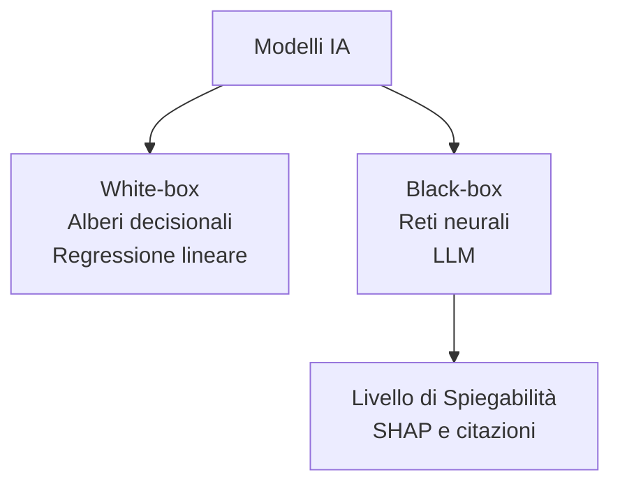
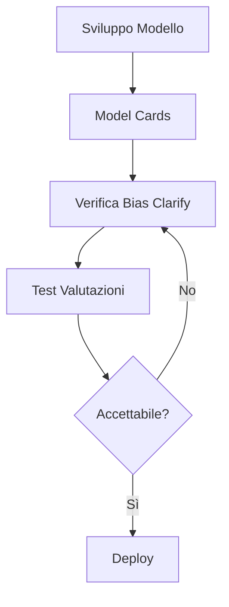
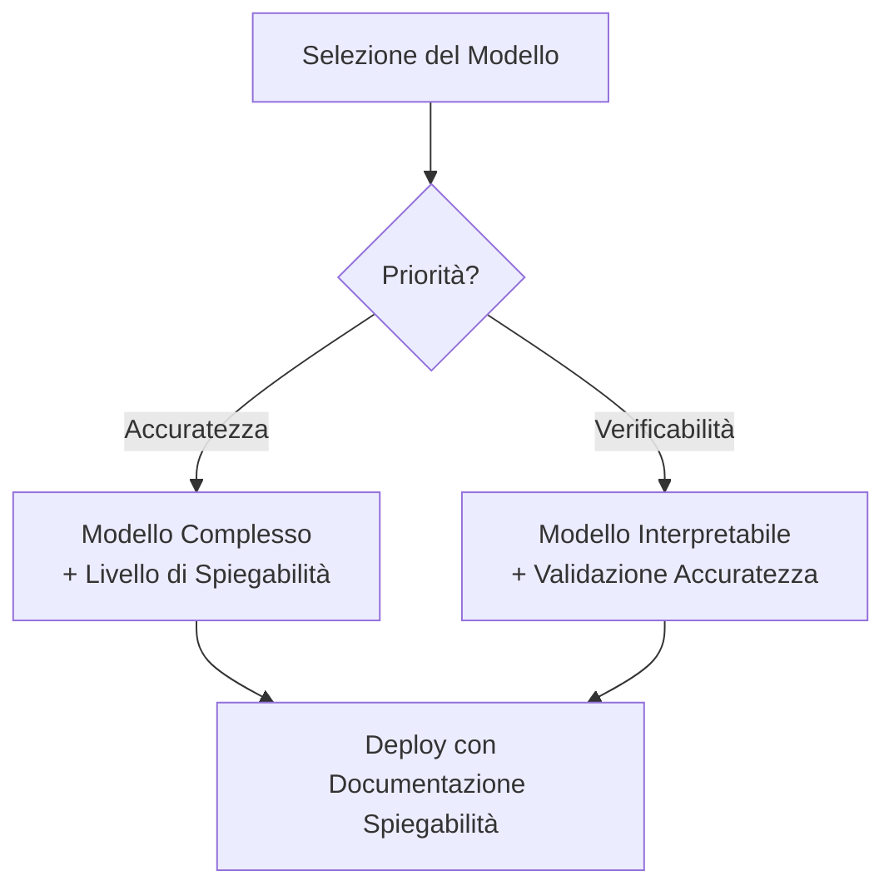
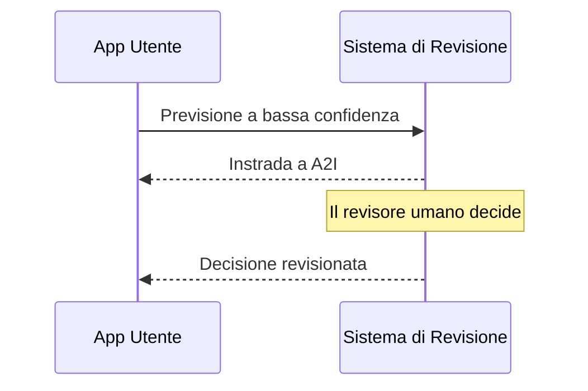

## Task Statement 4.2: Riconoscere l'importanza dei modelli trasparenti e spiegabili

Quando un sistema IA prende una decisione che influisce su un cliente, un dipendente o un risultato aziendale, le persone coinvolte chiedono quasi sempre la stessa domanda: perché? La risposta a quella domanda è l'oggetto della trasparenza e della spiegabilità. Questo task statement copre come distinguere i modelli che possono rispondere a quella domanda dai modelli che non possono farlo, gli strumenti AWS che documentano e rendono visibile il comportamento del modello, i compromessi tra spiegabilità e altre proprietà come la sicurezza e le prestazioni, e i principi di progettazione che mantengono gli esseri umani in modo significativo nel ciclo quando i sistemi IA formulano raccomandazioni consequenziali.[^402001]

### 4.2.1 Differenze tra modelli trasparenti e spiegabili e modelli che non lo sono

La trasparenza e la spiegabilità sono proprietà correlate ma distinte. La **trasparenza** è la proprietà di un modello la cui struttura interna, dati di addestramento e logica decisionale possono essere ispezionati direttamente. Un modello trasparente è uno che si può aprire e leggere. La **spiegabilità** è la proprietà di un modello i cui output possono essere accompagnati da una ragione comprensibile all'uomo, anche se la struttura interna rimane complessa. Un modello spiegabile può essere opaco internamente, ma il sistema intorno ad esso può produrre una motivazione che una persona può valutare.[^402002]

La distinzione conta nella pratica. Un classico *albero decisionale* è trasparente: si possono seguire i rami dalla radice alle foglie e tracciare esattamente quali valori di input hanno causato al modello di raggiungere una determinata conclusione.[^402031] Una *rete neurale profonda* con miliardi di parametri non è trasparente nello stesso modo; nessun essere umano può leggere la matrice dei pesi e capire perché una particolare sequenza di token ha prodotto un particolare output. Tuttavia, un sistema ben progettato intorno a quella rete neurale può comunque essere spiegabile: può riferire le caratteristiche che hanno contribuito maggiormente all'output, rendere visibili i documenti sorgente che hanno maggiormente influenzato una risposta, o assegnare un punteggio di confidenza che segnali quanto è certo il modello.[^402032]

I **modelli white-box** sono quelli dove la logica decisionale è intrinsecamente leggibile. La regressione lineare, la regressione logistica, gli alberi decisionali e i classificatori basati su regole rientrano tutti in questa categoria.[^402003] Un modello di sottoscrizione di prestiti costruito come albero decisionale può essere descritto in linguaggio comune a un regolatore: "Le domande con un rapporto debito-reddito superiore al 40% e meno di 24 mesi di storia lavorativa sono state rifiutate." Quella frase è il modello. I modelli white-box sono la scelta predefinita negli ambienti dove la responsabilità normativa richiede la completa verificabilità di ogni singola decisione, come il credito al consumo, la sottoscrizione assicurativa e alcune classificazioni di dispositivi medici.[^402033]

I **modelli black-box** sono quelli dove il calcolo interno è troppo complesso per essere interpretato direttamente.[^402004] I modelli linguistici di grandi dimensioni, le reti convoluzionali profonde e i metodi ensemble come gli alberi con gradient-boosting addestrati su decine di feature si comportano tutti come scatole nere da un punto di vista pratico. Il modello produce un punteggio o una sequenza di token, ma il percorso dall'input all'output passa attraverso così tante trasformazioni non lineari che tracciarlo è computazionalmente e concettualmente intrattabile.[^402034] La maggior parte dei sistemi IA in produzione nella moderazione dei contenuti, nell'imaging medico, nel rilevamento delle frodi e nell'elaborazione del linguaggio naturale operano con modelli black-box.

*Figura 4.2.1: Tassonomia modelli white-box vs. black-box. I modelli white-box espongono direttamente la logica decisionale; i modelli black-box richiedono un livello di spiegabilità separato per produrre motivazioni comprensibili all'uomo.*

La realtà della maggior parte dei sistemi IA in produzione è che si trovano da qualche parte tra i due estremi. Un classificatore con gradient-boosting potrebbe non essere leggibile riga per riga, ma è meno opaco di una rete neurale profonda perché i punteggi di *importanza delle feature* possono essere calcolati direttamente dalla struttura del modello.[^402035] Un modello linguistico di grandi dimensioni è profondamente opaco internamente ma può essere configurato per citare le sue fonti, riferire la sua incertezza e spiegare la sua catena di ragionamento in linguaggio comune prima di produrre una risposta finale. La domanda pratica non è se un modello è perfettamente trasparente ma se è sufficientemente spiegabile per i requisiti di responsabilità del caso d'uso.[^402036]

Tre settori illustrano bene lo spettro. Nel credit scoring, le normative in molte giurisdizioni richiedono che un istituto di credito fornisca al richiedente le ragioni specifiche per cui è stata presa una decisione di credito; i modelli white-box o i modelli black-box attribuiti con SHAP soddisfano entrambi questo requisito, mentre un punteggio non spiegato non lo fa.[^402005] Nella diagnosi medica, un radiologo che usa uno strumento IA per esaminare le radiografie del torace deve vedere quali regioni dell'immagine il modello ha pesato maggiormente in modo che il medico possa confermare o annullare l'ipotesi del modello; qui la spiegabilità supporta il processo decisionale umano senza sostituirlo.[^402037] Nella moderazione dei contenuti, l'operatore della piattaforma potrebbe non essere tenuto a spiegare le singole decisioni di moderazione agli utenti, ma i team di audit interni devono verificare che il classificatore stia applicando regole coerenti tra i gruppi demografici; qui la spiegabilità è principalmente uno strumento di controllo qualità interno.[^402038]

### 4.2.2 Strumenti per identificare modelli trasparenti e spiegabili

Riconoscere che la spiegabilità è necessaria è diverso dal sapere come ottenerla. AWS fornisce un insieme di strumenti che affrontano la spiegabilità a diversi livelli: la documentazione del modello, il suo comportamento durante l'inferenza e la sicurezza e la qualità dei suoi output.[^402039]

**Amazon SageMaker Model Cards** è lo strumento che AWS ha progettato per standardizzare come viene creata e condivisa la documentazione del modello.[^402006] Una Model Card è un documento strutturato e leggibile dall'uomo allegato a un artefatto del modello in SageMaker. Registra i casi d'uso previsti del modello, il dataset di addestramento e la sua provenienza, le metriche di prestazione tra i sottogruppi rilevanti, le limitazioni note, le considerazioni etiche e le restrizioni di utilizzo.[^402007] Un professionista del business che esamina una Model Card prima di approvare un modello per la produzione può determinare se il modello è stato addestrato su dati rappresentativi della popolazione di deployment, quali compromessi di accuratezza sono stati fatti e quali rischi il team di sviluppo ha già identificato.

Il valore delle Model Cards si estende oltre la decisione iniziale di deployment. Quando il comportamento di un modello cambia nel tempo, o quando arriva un'indagine normativa, la Model Card fornisce un registro verificabile di ciò che era noto al momento del deployment.[^402040] Amazon SageMaker supporta la pubblicazione di Model Cards attraverso la AWS Management Console e l'SDK Python di SageMaker, e le schede possono essere versionate insieme all'artefatto del modello.[^402008]

**Amazon SageMaker Clarify** affronta la spiegabilità a livello di inferenza.[^402009] Clarify usa una tecnica chiamata *SHAP* (SHapley Additive exPlanations) per calcolare i punteggi di attribuzione delle feature per i modelli di machine learning classici.[^402010] Si può pensare a un valore SHAP come "quanto questa feature ha spinto la risposta su o giù rispetto alla previsione media su tutti i richiedenti." I numeri positivi spingono verso un rischio previsto più alto; i numeri negativi spingono verso un rischio più basso. Per esempio, una spiegazione Clarify per la previsione di un modello di rischio creditizio potrebbe mostrare che il rapporto debito-reddito del richiedente ha contribuito +0,12 al punteggio di rischio mentre la durata della storia creditizia ha contribuito -0,08, fornendo al sottoscrittore una base quantitativa per la decisione e un punto di partenza per qualsiasi spiegazione richiesta al richiedente. (Per i modelli di immagini, la tecnica equivalente produce *mappe di salienza* che evidenziano le regioni di un'immagine di input che il modello ha pesato maggiormente.)

Oltre all'attribuzione delle feature, SageMaker Clarify misura le *metriche di bias* che riflettono se il modello tratta diversamente i diversi gruppi demografici.[^402011] Le metriche di bias pre-addestramento valutano se il dataset di addestramento stesso è sbilanciato. Le metriche di bias post-addestramento valutano se le previsioni del modello addestrato differiscono sistematicamente tra i gruppi definiti da un attributo sensibile come il genere, l'età o il codice postale.[^402041] Questa capacità di rilevamento del bias si collega direttamente alle caratteristiche dell'IA responsabile trattate nel Task 4.1 e rende Clarify uno strumento a doppio scopo: spiega sia le previsioni individuali che monitora l'equità a livello di popolazione.

**Amazon Bedrock Model Evaluations** è lo strumento che AWS fornisce per valutare la qualità e la sicurezza degli output dei modelli fondazionali.[^402012] A differenza di Clarify, che affronta l'attribuzione delle feature del ML classico, Bedrock Model Evaluations valuta gli output degli LLM su dimensioni come accuratezza, fluidità, coerenza e tossicità. La valutazione può essere configurata come un job automatico usando algoritmi di punteggio integrati o come un job di valutazione umana con un team interno o una forza lavoro gestita da AWS.[^402013] La dimensione di valutazione della sicurezza verifica specificamente la presenza di contenuti dannosi, tossici o inappropriati, fornendo alle organizzazioni un registro strutturato di come un modello performa sui criteri di sicurezza prima di essere messo in produzione. Bedrock Model Evaluations produce un report per job che confronta gli output con i criteri; non è un documento di governance permanente sul modello stesso, che è ciò che forniscono le Model Cards.

I **modelli open-source** meritano attenzione specifica come strumento di trasparenza. Quando un'organizzazione distribuisce un modello i cui pesi e la cui architettura sono pubblicamente disponibili, come i modelli della famiglia Meta Llama o della famiglia Mistral, può ispezionare la documentazione dell'architettura, rivedere le schede dati di addestramento pubblicate dagli sviluppatori del modello ed eseguire valutazioni di terze parti.[^402014] Questo è un livello qualitativamente diverso di trasparenza rispetto a quello disponibile per i modelli proprietari accessibili tramite API, dove l'architettura e i dati di addestramento non vengono divulgati.[^402042] Distribuire un modello open-source su AWS attraverso Amazon Bedrock o direttamente sugli endpoint di Amazon SageMaker preserva questo vantaggio di trasparenza mantenendo i benefici operativi dell'infrastruttura gestita.[^402043]

La **documentazione sui dati e sulle licenze** completa il quadro. La spiegabilità è significativa solo se i dati che hanno prodotto il modello sono tracciabili.[^402015] Un modello addestrato su dati con provenienza non divulgata comporta rischi che una Model Card non può catturare completamente: se i dati di addestramento risultano contenere dati personali protetti, contenuto protetto da copyright o etichette sistematicamente distorte, gli output del modello ereditano quei problemi.[^402044] I termini di licenza sia per i dati di addestramento che per i pesi del modello determinano cosa l'organizzazione può legalmente fare con gli output del modello, e tale determinazione è essa stessa una forma di trasparenza sui vincoli operativi del modello.[^402045]

*Tabella 4.2.1: Strumenti AWS per la trasparenza e la spiegabilità del modello*

| Strumento | Cosa spiega | Tecnica | Pubblico principale |
|---|---|---|---|
| SageMaker Model Cards | Intento del modello, dati, risultati della valutazione, limitazioni | Documentazione strutturata | Revisori aziendali, auditor |
| SageMaker Clarify | Attribuzione della previsione individuale, metriche di bias | Valori SHAP, test statistici | Data scientist, conformità |
| Bedrock Model Evaluations | Qualità e sicurezza dell'output LLM | Punteggio automatico e umano | Team IA, revisori della sicurezza |
| Ispezione del modello open-source | Architettura e dati di addestramento | Revisione diretta di pesi e documentazione | Ingegneri ML, ricercatori |
| Revisione dei dati e delle licenze | Provenienza dei dati di addestramento e diritti di utilizzo | Tracciamento della provenienza, revisione della licenza | Legale, conformità, approvvigionamento |

L'esame si aspetta che si abbini uno scenario allo strumento corretto. Quando una domanda chiede come un'organizzazione dovrebbe documentare l'uso previsto di un modello e le sue limitazioni note per un audit, la risposta è SageMaker Model Cards. Quando una domanda chiede come spiegare perché è stata fatta una previsione specifica da un modello ML classico, la risposta è SageMaker Clarify con SHAP. Quando una domanda chiede come valutare se gli output di un modello generativo sono sicuri prima del deployment in produzione, la risposta è Bedrock Model Evaluations.[^402046]

*Figura 4.2.2: Toolchain di spiegabilità nel ciclo di vita del modello. Le Model Cards forniscono il contesto documentale; Clarify misura il bias pre- e post-addestramento; Bedrock Model Evaluations valida la sicurezza degli output prima del deployment.*

### 4.2.3 Compromessi tra sicurezza del modello e trasparenza

La trasparenza e la sicurezza non sono sempre allineate. Capire dove si rafforzano a vicenda e dove entrano in conflitto è importante per progettare sistemi IA che siano allo stesso tempo affidabili e sicuri.[^402047]

Il conflitto più comune nasce dal fatto che rivelare come funziona un controllo di sicurezza può consentire a un avversario di aggirarlo. Si consideri un sistema di moderazione dei contenuti che blocca gli output dannosi rilevando certi pattern di frasi nella risposta del modello. Pubblicare la lista esatta delle frasi consentirebbe a un attore malintenzionato di costruire richieste che evitano tutte le frasi bloccate pur elicitando comunque contenuti dannosi. In questo caso, l'opacità nel controllo di sicurezza è intenzionale.[^402048] La stessa logica si applica alle difese contro l'iniezione di prompt: un system prompt che istruisce il modello a ignorare le istruzioni che seguono un certo template è meno efficace una volta che quel template è noto.[^402016] I sistemi di sicurezza trattano abitualmente i dettagli della loro logica di rilevamento come riservati, e i controlli di sicurezza dell'IA non fanno eccezione.

Il conflitto va anche nella direzione opposta. L'opacità in un modello può nascondere limitazioni rilevanti per la sicurezza che gli operatori e gli utenti devono conoscere. Una Model Card che descrive accuratamente le modalità di errore di un modello, come la minore accuratezza sui parlanti non nativi di inglese o i tassi di allucinazione più elevati su eventi molto recenti, consente agli operatori di aggiungere controlli compensativi al momento del deployment.[^402017] Nascondere o omettere quelle limitazioni significa che l'operatore non può mitigarle. In questo senso, la trasparenza sulle limitazioni migliora attivamente i risultati della sicurezza.[^402049]

Il compromesso prestazioni-versus-interpretabilità è una seconda tensione che l'esame tratta. In generale, i modelli che raggiungono la massima accuratezza su compiti complessi sono anche i meno interpretabili. Una rete neurale profonda addestrata su milioni di immagini etichettate supererà un albero decisionale sulla maggior parte dei compiti di classificazione delle immagini, ma le previsioni dell'albero decisionale possono essere spiegate a un esperto di dominio senza alcuno strumento aggiuntivo.[^402018] Un ensemble con gradient-boosting addestrato su decine di feature ingegnerizzate spesso supererà la regressione logistica sui dati tabulari, ma la regressione logistica produce coefficienti che uno statistico può leggere direttamente come il contributo di ogni variabile.[^402050]

*Figura 4.2.3: Percorso decisionale prestazioni vs. interpretabilità. Quando l'accuratezza è il requisito principale, aggiungere un livello di spiegabilità post-hoc; quando la verificabilità è principale, scegliere un modello interpretabile e verificarne la soglia di accuratezza.*

Non esiste una singola misura numerica dell'interpretabilità.[^402019] L'interpretabilità è una proprietà valutata per caso d'uso, non un punteggio in una classifica. Un modello che un radiologo considera sufficientemente spiegabile per l'assistenza alla screening potrebbe non essere sufficientemente spiegabile per generare una diagnosi formale che appare in una cartella clinica.[^402051] Un modello di rischio creditizio che soddisfa i requisiti di spiegazione della normativa sul credito al consumo di un paese potrebbe non soddisfare quella di un altro. La domanda di misurazione è quindi sempre: abbastanza spiegabile per chi, per quale scopo e sotto quale obbligo?[^402052]

*Tabella 4.2.2: Pattern di interazione trasparenza-sicurezza*

| Scenario | Effetto trasparenza | Effetto sicurezza | Risoluzione |
|---|---|---|---|
| Pubblicazione dei dettagli della difesa contro l'iniezione di prompt | Alta trasparenza | Sicurezza ridotta | Mantenere riservata la logica difensiva; pubblicare solo la policy di alto livello |
| La Model Card documenta le modalità di errore da allucinazione | Alta trasparenza | Sicurezza migliorata | Pubblicare; gli operatori aggiungono controlli compensativi |
| Rivelare i valori soglia del rilevamento del bias | Trasparenza parziale | Rischio di gaming | Pubblicare la categoria; mantenere riservate le soglie esatte |
| Pesi del modello open-source | Piena trasparenza | Variabile | Valutare i rischi specifici prima del deployment aperto |

La guida pratica per uno scenario d'esame è: quando una domanda descrive una situazione in cui rivelare il meccanismo di un controllo consentirebbe a un attaccante di aggirarlo, meno trasparenza è appropriata per la sicurezza. Quando una domanda descrive una situazione in cui nascondere le limitazioni note di un modello impedisce agli operatori di mitigarle, più trasparenza è appropriata per la sicurezza.[^402053]

### 4.2.4 Principi della progettazione centrata sull'uomo per l'IA spiegabile

La spiegabilità non è solo una proprietà tecnica di un modello; è anche una proprietà di progettazione del sistema che presenta gli output del modello agli utenti. Un modello può produrre punteggi di attribuzione SHAP che nessun utente aziendale vedrà mai perché l'interfaccia non è stata progettata per renderli visibili.[^402054] La progettazione centrata sull'uomo per l'IA spiegabile significa costruire il livello di presentazione in modo che gli utenti ricevano le informazioni di cui hanno bisogno per capire, fidarsi e sovrascrivere appropriatamente le raccomandazioni dell'IA.[^402020]

Il primo principio è rendere visibili le informazioni di confidenza e incertezza quando sono rilevanti per la decisione. Un modello che assegna un punteggio di confidenza elevato a una raccomandazione e un modello che è quasi ugualmente incerto tra due opzioni non dovrebbero sembrare uguali a un utente. Quando un sistema di rilevamento delle frodi segnala una transazione con il 97% di confidenza, un analista può procedere rapidamente. Quando lo stesso sistema segnala una transazione con il 54% di confidenza, l'analista dovrebbe sapere che il modello è incerto e applicare maggiore scrutinio. I modelli Amazon Bedrock possono restituire punteggi di probabilità e possono essere sollecitati a esprimere esplicitamente l'incertezza nei loro output; progettare l'applicazione per visualizzare queste informazioni, piuttosto che convertire l'output del modello direttamente in una raccomandazione binaria sì/no, è una scelta di progettazione deliberata.[^402021]

Il secondo principio è mostrare le citazioni e le fonti per il contenuto generato. Un'applicazione basata su RAG che recupera informazioni da un corpus di documenti e genera una risposta in linguaggio naturale dovrebbe identificare quali documenti sorgente sono stati utilizzati. Non è solo una misura di trasparenza; è uno strumento pratico che consente a un utente di verificare l'output del modello rispetto alla fonte originale e di identificare i casi in cui il modello ha generalizzato oltre ciò che la fonte ha effettivamente affermato.[^402022] Amazon Bedrock Knowledge Bases restituisce riferimenti ai documenti sorgente insieme alle risposte generate, e i design delle applicazioni che rendono visibili quei riferimenti agli utenti finali rendono il sistema materialmente più affidabile.[^402055]

Il terzo principio è progettare cicli di feedback che catturino i giudizi degli utenti sulla qualità degli output dell'IA. Un meccanismo pollice su/pollice giù allegato alla raccomandazione di un modello è la forma più semplice di questo, ma il design dovrebbe anche catturare la ragione del feedback negativo: la raccomandazione era fattualmene errata, non applicabile, o corretta ma presentata in modo confuso? Quel feedback strutturato, trasmesso di nuovo al team di sviluppo del modello, produce i dati etichettati necessari per identificare le modalità di errore sistematiche e migliorare il modello nel tempo. Amazon A2I, introdotto nel Task 4.1, si adatta a questo principio instradando gli output a bassa confidenza ai revisori umani e catturando le loro decisioni come record strutturati.[^402023]

*Figura 4.2.4: Flusso di feedback human-in-the-loop. L'applicazione rende visibili i punteggi di confidenza all'utente, instrada gli output a bassa confidenza o contestati ad Amazon A2I per la revisione umana e restituisce annotazioni strutturate al team di sviluppo.*

Il quarto principio è separare ciò che il modello ha detto da ciò che il sistema ha fatto. In un'applicazione IA a più livelli, il modello produce una raccomandazione, e poi un sistema a valle agisce su di essa. Un'interfaccia ben progettata mostra all'utente entrambi i livelli: la raccomandazione del modello e l'azione del sistema basata su quella raccomandazione.[^402056] Questo è importante quando il sistema aggiunge regole aziendali che modificano o annullano l'output del modello. Per esempio, uno strumento di supporto alle assunzioni potrebbe mostrare a un reclutatore sia la classifica dei candidati del modello che la regola che l'azienda del reclutatore ha applicato per filtrare i candidati al di sotto di una soglia di età prevista per legge. L'utente può quindi valutare il ragionamento del modello indipendentemente dal livello delle regole aziendali.[^402057]

Il quinto principio è rispettare l'autonomia dell'utente rendendo le sovrascritture facili e ben tracciate. Una raccomandazione dell'IA che non può essere sovrascritta non è affatto una raccomandazione; è una decisione automatizzata. Gli utenti che sono tenuti a utilizzare gli output dell'IA ma non possono sovrascriverli perdono la capacità di applicare il giudizio professionale ai casi limite, e l'organizzazione perde il segnale che i dati di sovrascrittura avrebbero fornito.[^402058] Progettare meccanismi di sovrascrittura che siano ben visibili, a bassa frizione e registrati nell'audit log fornisce agli utenti una reale autonomia generando allo stesso tempo preziosi feedback su dove il modello è carente.[^402024]

*Tabella 4.2.3: Principi della progettazione centrata sull'uomo per l'IA spiegabile*

| Principio | Esempio di implementazione | Strumento o pattern AWS |
|---|---|---|
| Rendere visibile confidenza e incertezza | Visualizzare il punteggio di confidenza del modello insieme alla raccomandazione | Metadati della risposta di inferenza Bedrock |
| Mostrare citazioni e fonti | Elencare i documenti sorgente recuperati con la risposta generata | Attribuzione delle fonti di Bedrock Knowledge Bases |
| Catturare feedback strutturato | Pollice giù con motivo; instradamento automatico a bassa confidenza | Configurazione del flusso di lavoro Amazon A2I |
| Separare l'output del modello dall'azione del sistema | Mostrare il punteggio del modello e la regola aziendale applicata separatamente | Design del livello applicativo |
| Rispettare l'autonomia dell'utente | Pulsante di sovrascrittura ben visibile con audit log | Design del livello applicativo |

L'accessibilità è una considerazione pratica nella progettazione centrata sull'uomo che l'esame non elabora ma che qualsiasi implementazione responsabile deve affrontare. I punteggi di confidenza presentati solo come valori numerici escludono gli utenti meno a loro agio con il ragionamento probabilistico.[^402059] Le spiegazioni scritte in linguaggio tecnico escludono gli utenti non esperti. Progettare la spiegabilità per gli utenti effettivi del sistema, non per gli sviluppatori che lo hanno costruito, è la definizione operativa della progettazione centrata sull'uomo in questo contesto.[^402060]

## Domande di autoverifica

**Domanda 1.** Una società di servizi finanziari usa un modello ensemble con gradient-boosting per approvare o rifiutare le domande di prestito. Un regolatore richiede all'azienda di fornire a ogni richiedente rifiutato una ragione specifica per la decisione. Il team di sviluppo del modello vuole soddisfare questo requisito senza sostituire il modello. Quale strumento o tecnica AWS è PIU' appropriata?

A. Sostituire il modello con gradient-boosting con un modello di regressione logistica che è trasparente per design  
B. Usare Amazon SageMaker Clarify per generare punteggi di attribuzione delle feature basati su SHAP per ogni previsione individuale  
C. Pubblicare una SageMaker Model Card che documenta i dati di addestramento e le metriche di valutazione  
D. Usare Amazon Bedrock Model Evaluations per valutare l'accuratezza dell'output del modello rispetto a un dataset etichettato  

**Spiegazione:** Il regolatore richiede una spiegazione per decisione, il che significa che il sistema ha bisogno di attribuire la previsione specifica a specifiche feature di input per ogni singola domanda. Amazon SageMaker Clarify (Risposta B) calcola i valori SHAP che quantificano quanto ogni feature di input ha contribuito alla previsione del modello, producendo precisamente la motivazione per decisione che il regolatore richiede. La Risposta A soddisferebbe il requisito ma la domanda specifica che il team vuole evitare di sostituire il modello; inoltre, sostituire il modello unicamente per l'interpretabilità sacrifica il vantaggio di accuratezza dell'ensemble. La Risposta C affronta la documentazione del modello nel suo complesso ma non genera spiegazioni per decisione. La Risposta D valuta l'accuratezza aggregata degli output LLM e non è progettata per l'attribuzione delle feature sui modelli ML classici. SageMaker Clarify è lo strumento appositamente costruito per l'attribuzione delle previsioni individuali sui modelli addestrati con SageMaker.[^402026]

---

**Domanda 2.** Un'azienda sta sviluppando un assistente IA per l'imaging medico che evidenzia le regioni di una radiografia del torace che un radiologo deve esaminare. Il team di sviluppo dibatte se usare una rete convoluzionale profonda con maggiore accuratezza diagnostica o un classificatore basato su regole con minore accuratezza ma regole completamente verificabili. Il team clinico dice che userà lo strumento solo se riesce a capire perché lo strumento sta segnalando una regione. Quale approccio soddisfa MEGLIO sia il requisito del team clinico che il bisogno di accuratezza?

A. Usare il classificatore basato su regole perché è completamente trasparente e il team clinico può leggere le sue regole direttamente  
B. Usare la rete convoluzionale profonda e aggiungere un livello di spiegabilità post-hoc che evidenzia le regioni dell'immagine che il modello ha pesato maggiormente  
C. Usare la rete convoluzionale profonda senza un livello di spiegabilità e addestrare il team clinico a fidarsi dell'output del modello  
D. Usare Amazon Bedrock Model Evaluations per validare gli output della rete convoluzionale profonda prima di ogni sessione di imaging  

**Spiegazione:** La domanda identifica due requisiti in competizione: alta accuratezza (favorisce la rete convoluzionale profonda) e comprensibilità (favorisce il modello trasparente). La Risposta B risolve la tensione usando il modello con maggiore accuratezza e aggiungendo un livello di spiegabilità post-hoc che produce *mappe di salienza* o visualizzazioni equivalenti che mostrano quali regioni dell'immagine il modello ha pesato maggiormente. Questo fornisce ai radiologi la motivazione regionale di cui hanno bisogno senza sacrificare il vantaggio di accuratezza. La Risposta A accetta inutilmente la limitazione di accuratezza; la domanda non afferma che l'accuratezza del classificatore basato su regole è sufficiente. La Risposta C ignora il requisito dichiarato del team clinico e introduce un rischio per la sicurezza del paziente distribuendo un sistema inspiegabile a clinici che hanno detto di aver bisogno di spiegazioni. La Risposta D è la categoria di strumenti sbagliata; Bedrock Model Evaluations affronta la qualità dell'output LLM, non l'attribuzione della classificazione delle immagini. La lezione più ampia è che il compromesso prestazioni-versus-interpretabilità può spesso essere risolto mantenendo il modello ad alte prestazioni e aggiungendo un livello di spiegabilità piuttosto che scegliere tra i due.[^402027]

---

**Domanda 3.** Un'organizzazione si prepara a distribuire un assistente IA generativo per il servizio clienti. Il team di conformità richiede la documentazione dell'uso previsto del modello, delle sue modalità di errore note e delle metriche di valutazione usate per validarlo, tutto in un formato che un auditor non tecnico possa esaminare. Quale capacità AWS è progettata per questo scopo?

A. Report di bias di Amazon SageMaker Clarify  
B. Flusso di lavoro di revisione umana di Amazon Bedrock Model Evaluations  
C. Amazon SageMaker Model Cards  
D. Log di audit dei task di revisione di Amazon Augmented AI (Amazon A2I)  

**Spiegazione:** Amazon SageMaker Model Cards (Risposta C) è lo strumento appositamente costruito per la documentazione strutturata del modello. Una Model Card registra i casi d'uso previsti del modello, la provenienza dei dati di addestramento, i risultati della valutazione tra i sottogruppi, le limitazioni note, le considerazioni etiche e le restrizioni di utilizzo in un formato standardizzato e leggibile dall'uomo. Questo affronta direttamente tutti e tre i requisiti di conformità: uso previsto, modalità di errore note e metriche di valutazione, in una forma che un auditor non tecnico può navigare. La Risposta A produce punteggi di attribuzione per previsione e metriche di bias per un modello distribuito, non la documentazione riassuntiva per un auditor. La Risposta B esegue valutazioni della qualità e della sicurezza dell'inferenza ma produce punteggi di valutazione piuttosto che la documentazione strutturata che fornisce una Model Card. La Risposta D produce record di audit delle singole decisioni di revisione umana, utile per il monitoraggio ma non un sostituto della documentazione del modello. Le Model Cards sono la risposta canonica quando l'esame descrive un requisito di audit o conformità per la documentazione del modello pre-deployment.[^402028]

---

**Domanda 4.** Il team del prodotto IA di un'azienda ha costruito un motore di raccomandazione. La ricerca sugli utenti mostra che molti utenti non si fidano delle raccomandazioni perché non riescono a capire perché è stato suggerito un particolare articolo. Il team vuole applicare la progettazione centrata sull'uomo per aumentare la fiducia degli utenti. Quale opzione accoppia due cambiamenti di design che affrontano PIU' direttamente il divario di fiducia?

A. Sostituire il modello di raccomandazione con un modello più accurato e ri-addestrare su un dataset più grande  
B. Visualizzare il punteggio di confidenza del modello accanto a ogni raccomandazione e mostrare gli attributi principali della cronologia dell'utente che hanno guidato il suggerimento  
C. Rimuovere la funzionalità di raccomandazione fino a quando il modello raggiunge una maggiore accuratezza  
D. Aggiungere un passaggio di revisione umana con Amazon A2I per approvare manualmente ogni raccomandazione prima che venga mostrata a un utente  

**Spiegazione:** La ricerca sugli utenti identifica un problema di fiducia causato dalla mancanza di comprensibilità, non da bassa accuratezza o revisione insufficiente. La Risposta B applica direttamente due principi della progettazione centrata sull'uomo: rendere visibile la confidenza (in modo che gli utenti possano calibrare quanto peso dare alla raccomandazione) e mostrare il ragionamento dietro la raccomandazione (gli attributi che l'hanno guidata, che è una forma di attribuzione post-hoc). Entrambi i cambiamenti affrontano il divario di fiducia dichiarato. La Risposta A migliora l'accuratezza, che può o non può affrontare la fiducia; un modello più accurato che rimane inspiegabile non risolve il problema identificato dalla ricerca sugli utenti. La Risposta C rimuove una funzionalità del prodotto per evitare il problema piuttosto che risolverlo. La Risposta D introduce la revisione umana per ogni raccomandazione, che è operativamente impraticabile alla scala di un sistema di raccomandazione e affronta il controllo qualità piuttosto che la spiegabilità rivolta agli utenti. Il pattern dell'esame qui è che quando la fiducia degli utenti è il problema dichiarato, la risposta corretta coinvolge la trasparenza e il design della spiegazione, non la sostituzione del modello o la revisione manuale.[^402029]

---

**Domanda 5.** Un team di data science sta valutando se usare un modello open-source o un modello API chiuso proprietario per una nuova applicazione. Il dipartimento legale del team richiede visibilità sulle fonti di dati di addestramento e sui termini di licenza prima di approvare il modello per l'uso in produzione. Quale caratteristica dei modelli open-source affronta PIU' direttamente il requisito del dipartimento legale?

A. I modelli open-source sono sempre meno costosi da eseguire rispetto ai modelli proprietari accessibili tramite API  
B. I modelli open-source possono essere sottoposti a fine-tuning su dati proprietari, il che consente all'organizzazione di possedere i pesi risultanti  
C. I modelli open-source pubblicano la documentazione dell'architettura, le schede dati di addestramento e i termini di licenza che il team legale può esaminare direttamente  
D. I modelli open-source soddisfano automaticamente tutti i requisiti normativi per la trasparenza dell'IA nell'UE e negli USA  

**Spiegazione:** Il requisito dichiarato del dipartimento legale è la visibilità sulle fonti dei dati di addestramento e sui termini di licenza. La Risposta C affronta questo direttamente. I modelli pubblicamente disponibili tipicamente pubblicano schede modello e schede dati (o documentazione equivalente) che descrivono la composizione del corpus di addestramento, eventuali limitazioni note e la licenza applicabile. Il team legale può esaminare la licenza pubblicata (come Apache 2.0 o una licenza commerciale specifica del modello) per determinare quali usi sono consentiti e può esaminare la documentazione sui dati di addestramento per valutare i rischi di provenienza dei dati. La Risposta A è un argomento di costo che non affronta il requisito legale; i modelli open-source non sono universalmente meno costosi una volta inclusi i costi di infrastruttura e operativi. La Risposta B affronta la proprietà dei derivati con fine-tuning, che è una considerazione legale valida ma non affronta il requisito di visibilità sui dati di addestramento e sulle licenze dichiarato nella domanda. La Risposta D è errata; lo status open-source non soddisfa automaticamente nessun framework normativo specifico; la conformità richiede ancora la valutazione rispetto ai criteri della normativa pertinente. La lezione più ampia è che la trasparenza dei dati e delle licenze è una dimensione distinta della trasparenza del modello, e i modelli open-source forniscono un livello di visibilità della provenienza che non è disponibile per i modelli accessibili solo tramite un'API proprietaria.[^402030]

---

[^402001]: AWS Certification. AI Practitioner (AIF-C01) Exam Guide v1.1, Domain 4, Task Statement 4.2. URL: <https://docs.aws.amazon.com/aws-certification/latest/ai-practitioner-01/ai-practitioner-01-domain4.html>
[^402002]: Doshi-Velez, F., and Kim, B. Towards a Rigorous Science of Interpretable Machine Learning (2017). URL: <https://arxiv.org/abs/1702.08608>
[^402003]: Breiman, L. Classification and Regression Trees (1984). URL: <https://doi.org/10.1201/9781315139470>
[^402004]: Adadi, A., and Berrada, M. Peeking Inside the Black-Box: A Survey on Explainable AI. IEEE Access (2018). URL: <https://doi.org/10.1109/ACCESS.2018.2870052>
[^402005]: Consumer Financial Protection Bureau. Using Artificial Intelligence to Assist Adverse Action Explanations (2023). URL: <https://www.consumerfinance.gov/about-us/blog/cfpb-issues-guidance-on-credit-denials-by-lenders-using-artificial-intelligence/>
[^402006]: Amazon SageMaker. Amazon SageMaker Model Cards overview. URL: <https://docs.aws.amazon.com/sagemaker/latest/dg/model-cards.html>
[^402007]: Amazon SageMaker. Model Card components and structure. URL: <https://docs.aws.amazon.com/sagemaker/latest/dg/model-cards-create.html>
[^402008]: Amazon SageMaker. Versioning and sharing SageMaker Model Cards. URL: <https://docs.aws.amazon.com/sagemaker/latest/dg/model-cards-export.html>
[^402009]: Amazon SageMaker. Amazon SageMaker Clarify overview. URL: <https://docs.aws.amazon.com/sagemaker/latest/dg/clarify-configure-processing-jobs.html>
[^402010]: Lundberg, S., and Lee, S. A Unified Approach to Interpreting Model Predictions (SHAP, NeurIPS 2017). URL: <https://arxiv.org/abs/1705.07874>
[^402011]: Amazon SageMaker. Measuring bias with SageMaker Clarify. URL: <https://docs.aws.amazon.com/sagemaker/latest/dg/clarify-measure-data-bias.html>
[^402012]: Amazon Bedrock. Amazon Bedrock Model Evaluations overview. URL: <https://docs.aws.amazon.com/bedrock/latest/userguide/model-evaluation.html>
[^402013]: Amazon Bedrock. Human evaluation jobs in Amazon Bedrock Model Evaluations. URL: <https://docs.aws.amazon.com/bedrock/latest/userguide/model-evaluation-human.html>
[^402014]: Meta AI. Llama 3 model card and data documentation. URL: <https://ai.meta.com/research/publications/meta-llama-3/>
[^402015]: Mitchell, M., et al. Model Cards for Model Reporting (FAccT 2019). URL: <https://arxiv.org/abs/1810.03993>
[^402016]: Perez, F., and Ribeiro, I. Ignore Previous Prompt: Attack Techniques for Language Models (2022). URL: <https://arxiv.org/abs/2211.09527>
[^402017]: Raji, I., et al. Closing the AI Accountability Gap: Defining an End-to-End Framework for Internal Algorithmic Auditing (2020). URL: <https://arxiv.org/abs/2001.00973>
[^402018]: Rudin, C. Stop Explaining Black Box Machine Learning Models for High Stakes Decisions and Use Interpretable Models Instead. Nature Machine Intelligence (2019). URL: <https://doi.org/10.1038/s42256-019-0048-x>
[^402019]: Lipton, Z. The Mythos of Model Interpretability. Queue, ACM (2018). URL: <https://dl.acm.org/doi/10.1145/3236386.3241340>
[^402020]: Amershi, S., et al. Guidelines for Human-AI Interaction. CHI 2019. URL: <https://dl.acm.org/doi/10.1145/3290605.3300233>
[^402021]: Amazon Bedrock. Response metadata and confidence in Amazon Bedrock inference. URL: <https://docs.aws.amazon.com/bedrock/latest/userguide/model-invocation-logging.html>
[^402022]: Amazon Bedrock. Source attribution in Knowledge Bases responses. URL: <https://docs.aws.amazon.com/bedrock/latest/userguide/knowledge-base-retrieveandgenerate.html>
[^402023]: Amazon Augmented AI. Amazon A2I overview and human review workflows. URL: <https://docs.aws.amazon.com/sagemaker/latest/dg/a2i-getting-started.html>
[^402024]: Shneiderman, B. Human-Centered AI. Oxford University Press (2022). URL: <https://global.oup.com/academic/product/human-centered-ai-9780192845290>
[^402026]: Amazon SageMaker. Explainability with SageMaker Clarify: SHAP values for predictions. URL: <https://docs.aws.amazon.com/sagemaker/latest/dg/clarify-shapley-values.html>
[^402027]: Selvaraju, R., et al. Grad-CAM: Visual Explanations from Deep Networks via Gradient-Based Localization (2017). URL: <https://arxiv.org/abs/1610.02391>
[^402028]: Amazon SageMaker. Using Model Cards for compliance and auditability. URL: <https://docs.aws.amazon.com/sagemaker/latest/dg/model-cards.html>
[^402029]: Amershi, S., et al. Guidelines for Human-AI Interaction: Principle 7, Show contextual information. CHI 2019. URL: <https://dl.acm.org/doi/10.1145/3290605.3300233>
[^402030]: Linux Foundation AI and Data. Model and Data Card Standards for Open Source AI (2023). URL: <https://lfaidata.foundation/blog/2023/09/18/data-and-model-cards/>
[^402031]: Quinlan, J.R. Induction of Decision Trees. Machine Learning, vol. 1 (1986). URL: <https://doi.org/10.1007/BF00116251>
[^402032]: Guidotti, R., et al. A Survey of Methods for Explaining Black Box Models. ACM Computing Surveys (2018). URL: <https://dl.acm.org/doi/10.1145/3236009>
[^402033]: Board of Governors of the Federal Reserve System. SR 11-7: Guidance on Model Risk Management (2011). URL: <https://www.federalreserve.gov/supervisionreg/srletters/sr1107.htm>
[^402034]: Goodfellow, I., Bengio, Y., and Courville, A. Deep Learning. MIT Press (2016). URL: <https://www.deeplearningbook.org/>
[^402035]: Chen, T., and Guestrin, C. XGBoost: A Scalable Tree Boosting System. KDD 2016. URL: <https://arxiv.org/abs/1603.02754>
[^402036]: European Parliament. EU AI Act: Article 13, Transparency and provision of information to deployers (2024). URL: <https://eur-lex.europa.eu/legal-content/EN/TXT/?uri=CELEX:32024R1689>
[^402037]: Topol, E. High-performance medicine: the convergence of human and artificial intelligence. Nature Medicine (2019). URL: <https://doi.org/10.1038/s41591-018-0300-7>
[^402038]: Raji, I., and Buolamwini, J. Actionable Auditing: Investigating the Impact of Publicly Naming Biased Performance Results of Commercial AI Products. AIES 2019. URL: <https://dl.acm.org/doi/10.1145/3306618.3314244>
[^402039]: NIST. Artificial Intelligence Risk Management Framework (AI RMF 1.0), GOVERN 1.7. URL: <https://doi.org/10.6028/NIST.AI.100-1>
[^402040]: Amazon SageMaker. Model Card audit and governance use cases. URL: <https://docs.aws.amazon.com/sagemaker/latest/dg/model-cards-use-cases.html>
[^402041]: Amazon SageMaker. Post-training bias metrics in SageMaker Clarify. URL: <https://docs.aws.amazon.com/sagemaker/latest/dg/clarify-measure-post-training-bias.html>
[^402042]: Bommasani, R., et al. On the Opportunities and Risks of Foundation Models: Transparency section. Stanford CRFM (2021). URL: <https://arxiv.org/abs/2108.07258>
[^402043]: Amazon Bedrock. Supported open-source models in Amazon Bedrock. URL: <https://docs.aws.amazon.com/bedrock/latest/userguide/models-supported.html>
[^402044]: Gebru, T., et al. Datasheets for Datasets. Communications of the ACM (2021). URL: <https://doi.org/10.1145/3458723>
[^402045]: Open Source Initiative. The Open Source AI Definition, version 1.0 (2024). URL: <https://opensource.org/ai/open-source-ai-definition>
[^402046]: Amazon Bedrock. Choosing between automated and human evaluation in Bedrock Model Evaluations. URL: <https://docs.aws.amazon.com/bedrock/latest/userguide/model-evaluation.html>
[^402047]: Wachter, S., Mittelstadt, B., and Russell, C. Counterfactual Explanations Without Opening the Black Box: Automated Decisions and the GDPR. Harvard Journal of Law and Technology (2018). URL: <https://doi.org/10.2139/ssrn.3063289>
[^402048]: Amazon Bedrock. Amazon Bedrock Guardrails: content filtering configuration. URL: <https://docs.aws.amazon.com/bedrock/latest/userguide/guardrails-filters.html>
[^402049]: Floridi, L., et al. An Ethical Framework for a Good AI Society: Opportunities, Risks, Principles, and Recommendations. Minds and Machines (2018). URL: <https://doi.org/10.1007/s11023-018-9482-5>
[^402050]: Hastie, T., Tibshirani, R., and Friedman, J. The Elements of Statistical Learning, 2nd ed. Springer (2009). URL: <https://doi.org/10.1007/978-0-387-84858-7>
[^402051]: FDA. Artificial Intelligence and Machine Learning in Software as a Medical Device: Action Plan (2021). URL: <https://www.fda.gov/medical-devices/software-medical-device-samd/artificial-intelligence-and-machine-learning-software-medical-device>
[^402052]: European Parliament. EU AI Act: Article 86, Right of explanation of individual decision-making (2024). URL: <https://eur-lex.europa.eu/legal-content/EN/TXT/?uri=CELEX:32024R1689>
[^402053]: NIST. AI RMF Playbook: MAP 1.6, Risk of insufficient explainability. URL: <https://airc.nist.gov/Docs/2>
[^402054]: Yang, Q., et al. Investigating how and why practitioners use machine learning explanation methods. CHI 2023. URL: <https://dl.acm.org/doi/10.1145/3544548.3581219>
[^402055]: Amazon Bedrock. Citations and source attribution in Knowledge Bases responses. URL: <https://docs.aws.amazon.com/bedrock/latest/userguide/knowledge-base-retrieveandgenerate.html>
[^402056]: Cai, C.J., et al. Human-Centered Tools for Coping with Imperfect Algorithms During Medical Decision-Making. CHI 2019. URL: <https://dl.acm.org/doi/10.1145/3290605.3300234>
[^402057]: European Parliament. EU AI Act: Article 26, Obligations of deployers of high-risk AI systems (2024). URL: <https://eur-lex.europa.eu/legal-content/EN/TXT/?uri=CELEX:32024R1689>
[^402058]: Kuo, T., et al. Assessing the AI on AI: Examining the Influence of AI Recommendations on Human Decisions. CHI 2023. URL: <https://dl.acm.org/doi/10.1145/3544548.3581314>
[^402059]: Bunt, A., Lount, M., and Lauzon, C. Are explanations always important? A study of deployed, low-cost intelligent systems. IUI 2012. URL: <https://dl.acm.org/doi/10.1145/2166966.2166996>
[^402060]: Wang, D., et al. Designing Theory-Driven User-Centric Explainable AI. CHI 2019. URL: <https://dl.acm.org/doi/10.1145/3290605.3300831>
