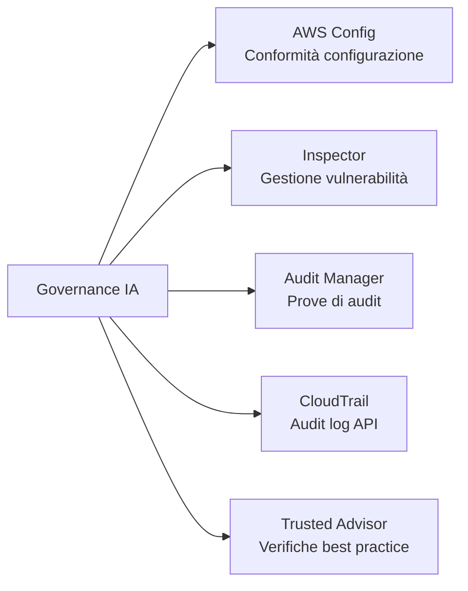
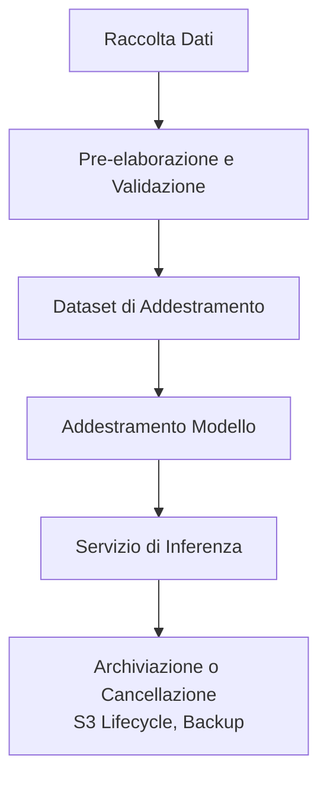
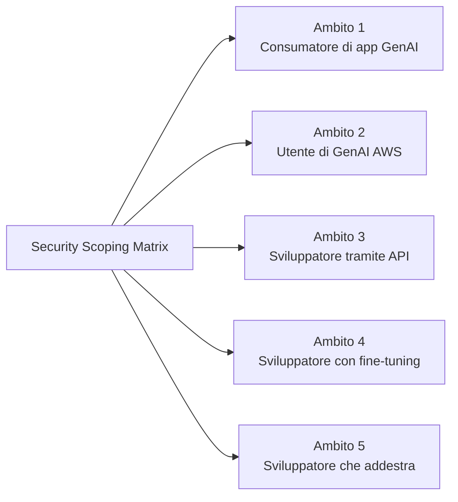
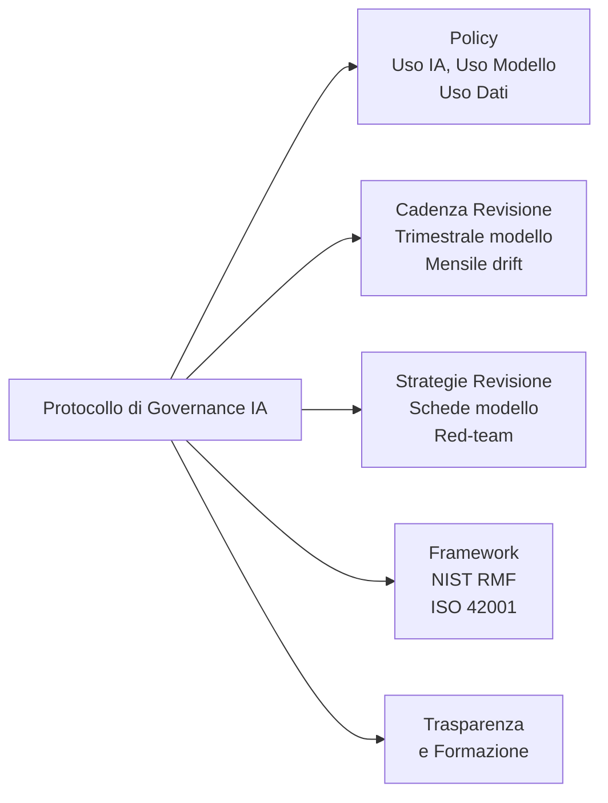

## Task Statement 5.2: Riconoscere le normative di governance e conformità per i sistemi IA

La governance e la conformità traducono i principi dell'IA responsabile in responsabilità organizzativa. Mentre i controlli di sicurezza proteggono il livello tecnico, le strutture di governance creano le policy, i cicli di revisione, le audit trail e le prove normative che permettono a un'organizzazione di spiegare, difendere e migliorare continuamente i propri sistemi IA. Questo task statement copre i servizi AWS che supportano la raccolta di prove di conformità, le strategie di governance dei dati che gli auditor si aspettano e i processi di governance che danno ai programmi IA un supporto istituzionale durevole.[^502001]

### 5.2.1 Servizi e funzionalità AWS per la governance e la conformità

La conformità per un carico di lavoro IA non è un singolo gate superato al momento della distribuzione; è uno stato continuo mantenuto attraverso monitoraggio continuo, raccolta di prove e prontezza all'audit. AWS fornisce un insieme di servizi gestiti che coprono collettivamente l'intero ciclo di vita della conformità: registrazione della configurazione, scansione delle vulnerabilità, raccolta di prove allineata ai framework, recupero di report su richiesta, audit log delle API e verifiche delle best practice. Usati insieme, questi servizi permettono a un'organizzazione di dimostrare a regolatori, auditor e stakeholder interni che i propri sistemi IA operano entro i limiti definiti.

La relazione tra questi servizi segue una divisione logica del lavoro. **AWS Config** traccia lo stato di configurazione delle risorse e valuta se rispettano le regole definite. **Amazon Inspector** individua le vulnerabilità nei livelli di calcolo e container che ospitano i carichi di lavoro IA. **AWS Audit Manager** organizza le prove di conformità in pacchetti pronti per l'audit allineati a framework specifici. **AWS Artifact** fornisce agli utenti autorizzati l'accesso alle certificazioni di conformità di terze parti di AWS. **AWS CloudTrail** crea il log immutabile dell'attività API che dimostra chi ha fatto cosa e quando. **AWS Trusted Advisor** identifica le lacune di configurazione rispetto alle best practice AWS in termini di costi, sicurezza, tolleranza ai guasti e limiti di servizio.

*Figura 5.2.1: Categorie di servizi di conformità AWS. Ogni servizio affronta uno strato distinto dello stack di audit e governance per i carichi di lavoro IA.*

**AWS Config** è un servizio di registrazione della configurazione e valutazione delle regole che traccia continuamente lo stato delle risorse AWS e le confronta con le regole di conformità definite dalla policy.[^502002] Quando una risorsa cambia, Config registra la nuova configurazione, la confronta con le regole applicabili e segnala quelle non conformi. Per i carichi di lavoro IA, tre categorie di regole sono particolarmente rilevanti. In primo luogo, il logging delle invocazioni del modello Bedrock può essere verificato: una regola Config può controllare che il logging sia abilitato per Amazon Bedrock, assicurando che ogni richiesta al modello venga catturata per audit e analisi.[^502003] In secondo luogo, l'accesso ai notebook SageMaker può essere controllato: una regola che verifica che le istanze notebook di Amazon SageMaker richiedano l'accesso basato su IAM impedisce l'esposizione diretta a internet degli ambienti notebook dove risiedono il codice di addestramento e i dati.[^502004] In terzo luogo, la crittografia può essere applicata: una regola che verifica che gli artifact dei modelli personalizzati Bedrock e i volumi di addestramento SageMaker siano crittografati a riposo assicura che i parametri sensibili del modello e i dati di addestramento siano sempre protetti.[^502005]

Le regole Config possono essere raggruppate in *conformance pack*, che raggruppano più regole correlate in un'unità distribuibile allineata a un requisito di conformità specifico come NIST SP 800-53 o lo standard AWS Foundational Security Best Practices.[^502006] Quando un'organizzazione vuole dimostrare che il proprio ambiente IA soddisfa i requisiti di controllo di un framework, la distribuzione del conformance pack corrispondente e l'esportazione del suo dashboard di conformità fornisce una visione singola e riproducibile dello stato dei controlli.

**Amazon Inspector** è un servizio di valutazione continua delle vulnerabilità che scansiona le istanze Amazon EC2, le funzioni AWS Lambda e le immagini container archiviate in Amazon Elastic Container Registry (ECR) alla ricerca di vulnerabilità software note ed esposizioni di rete non intenzionali.[^502007] I carichi di lavoro IA girano frequentemente su infrastrutture coperte da Inspector: i job di addestramento SageMaker vengono eseguiti su flotte di istanze EC2, i container di inferenza sono archiviati in ECR e il codice di inferenza personalizzato può girare come funzioni Lambda. Inspector correla i risultati con il database Common Vulnerabilities and Exposures (CVE) e assegna un punteggio di rischio, permettendo ai team di sicurezza di dare priorità alle vulnerabilità da correggere per prime in base alla sfruttabilità e all'impatto.[^502008] Per la governance, i risultati di Inspector alimentano direttamente AWS Security Hub, fornendo un dashboard centralizzato che gli auditor possono esaminare insieme ad altri segnali di conformità.

**AWS Audit Manager** automatizza la raccolta di prove per gli audit di conformità.[^502009] Invece di estrarre manualmente screenshot ed estratti di log prima di ogni ciclo di audit, le organizzazioni configurano Audit Manager con un framework e il servizio raccoglie continuamente prove dai risultati delle regole AWS Config, dalle chiamate API CloudTrail e dai risultati di Security Hub. Il servizio include framework preconfigurati per HIPAA, SOC 2, PCI DSS, ISO 27001, FedRAMP e altri standard, oltre a strumenti per costruire framework personalizzati per programmi di audit interni o requisiti specifici dell'IA in evoluzione.[^502010] Le prove sono archiviate in un report di valutazione strutturato che un auditor può esaminare senza richiedere accesso diretto all'ambiente AWS. Per i programmi IA soggetti a HIPAA, ad esempio, Audit Manager può raccogliere prove che i dati di addestramento sono crittografati, che l'accesso agli endpoint del modello viene registrato e che le modifiche alle configurazioni del modello vengono tracciate, producendo un pacchetto di audit che dimostra l'operatività dei controlli nel periodo definito.

**AWS Artifact** è il portale self-service dove i clienti AWS possono scaricare le certificazioni di conformità e gli accordi di AWS.[^502011] I report disponibili includono i report SOC 1, SOC 2 e SOC 3 (audit dei controlli di sistema e organizzazione eseguiti da terze parti indipendenti), le certificazioni ISO 27001, ISO 27017 e ISO 27018 (gestione della sicurezza delle informazioni e privacy cloud), l'Attestazione di Conformità PCI DSS (per i carichi di lavoro con carte di pagamento) e i Business Associate Addendum (BAA) HIPAA per le entità sanitarie coperte.[^502012] Artifact non genera prove sulle installazioni del cliente; fornisce prove sui controlli di AWS come provider dell'infrastruttura sottostante. Questa distinzione è importante per il modello di responsabilità condivisa: il cliente presenta i report Artifact per dimostrare che la piattaforma cloud stessa soddisfa i requisiti infrastrutturali del regolatore, mentre le prove di Audit Manager dimostrano che la configurazione e le operazioni del cliente soddisfano gli stessi requisiti.

**AWS CloudTrail** registra ogni chiamata API effettuata ai servizi AWS e consegna i record degli eventi in un bucket Amazon S3 entro pochi minuti dalla chiamata.[^502013] Per i carichi di lavoro IA, questo include ogni chiamata API Amazon Bedrock InvokeModel (catturando quale modello è stato invocato, da chi, quando e con quale codice di risultato), ogni chiamata SageMaker CreateTrainingJob e CreateEndpoint, e ogni modifica alla policy IAM che influisce sull'accesso al modello. CloudTrail supporta anche gli eventi dati, che registrano l'attività a livello di oggetto in Amazon S3. L'abilitazione degli eventi dati S3 su un bucket di dati di addestramento produce un log di ogni lettura e scrittura sui file di addestramento, creando una catena di custodia verificabile che dimostra che non si sono verificate modifiche non autorizzate tra la preparazione dei dati e l'addestramento del modello.[^502014] CloudTrail Lake, il livello di analisi gestita del servizio, consente query basate su SQL sulla cronologia degli eventi senza richiedere un sistema esterno di analisi dei log, rendendo semplice rispondere alle domande degli auditor come "Mostrami ogni volta che la configurazione dell'endpoint del modello di produzione è cambiata negli ultimi 90 giorni."[^502015]

**AWS Trusted Advisor** valuta le configurazioni degli account AWS rispetto alle best practice AWS in cinque categorie: ottimizzazione dei costi, prestazioni, sicurezza, tolleranza ai guasti e limiti di servizio.[^502016] Dal punto di vista della governance, i controlli di sicurezza sono più direttamente rilevanti per i programmi di conformità IA. Trusted Advisor segnala condizioni come l'accesso pubblico ai bucket S3, regole di security group senza restrizioni, chiavi di accesso IAM non ruotate e utilizzo dell'account root. Per i carichi di lavoro IA, anche i controlli dei limiti di servizio sono importanti: un endpoint SageMaker che si avvicina al suo limite di conteggio istanze potrebbe non riuscire a scalare durante un picco di inferenza, il che potrebbe costituire un problema di disponibilità del servizio segnalabile sotto certi SLA.[^502017] I risultati di Trusted Advisor sono disponibili nella console AWS e tramite API, quindi possono essere inseriti nei dashboard di conformità insieme ai risultati di Config, Inspector e Security Hub.

*Tabella 5.2.1: Servizi di governance e conformità AWS mappati ai casi d'uso IA*

| Servizio | Funzione principale | Caso d'uso di governance specifico per IA |
|---|---|---|
| AWS Config | Registrazione della configurazione e valutazione delle regole | Verificare che il logging Bedrock sia abilitato; applicare l'accesso solo IAM a SageMaker; controllare la crittografia sugli artifact del modello |
| Amazon Inspector | Scansione delle vulnerabilità per EC2, Lambda, ECR | Scansionare i container di inferenza e le funzioni Lambda per CVE; rilevare l'esposizione di rete non intenzionale |
| AWS Audit Manager | Raccolta automatizzata di prove per i framework di audit | Raccogliere prove HIPAA, SOC 2, PCI per i carichi di lavoro IA; produrre report pronti per l'audit |
| AWS Artifact | Scaricare le certificazioni di conformità AWS | Recuperare SOC, ISO, PCI, HIPAA BAA per dimostrare la conformità della piattaforma ai regolatori |
| AWS CloudTrail | Log di audit API immutabile | Registrare ogni chiamata Bedrock InvokeModel; tracciare l'accesso agli eventi dati S3 sui bucket di addestramento |
| AWS Trusted Advisor | Verifiche delle best practice su sicurezza, costi, limiti | Segnalare bucket S3 pubblici, chiavi IAM non ruotate, rischi di limite di servizio SageMaker |

Insieme, questi sei servizi formano il livello di strumentazione della conformità per un carico di lavoro IA su AWS. Config e Inspector monitorano lo stato attuale. CloudTrail registra lo stato storico. Audit Manager raccoglie entrambi in prove di audit. Artifact fornisce le certificazioni di conformità di AWS. Trusted Advisor identifica le lacune prima che lo facciano gli auditor o gli incidenti.

AWS Security Hub aggrega i risultati di Config, Inspector e Macie in un unico dashboard di conformità. È trattato nel Task 5.1 perché si trova al livello di monitoraggio della sicurezza, ma è il consumatore naturale dei segnali prodotti da questi sei servizi di governance. La sezione successiva copre come le strategie di governance dei dati si stratificano su questa strumentazione per gestire le informazioni elaborate dai sistemi IA.

### 5.2.2 Strategie di governance dei dati

I dati sono l'input a monte che determina cosa un sistema IA può sapere e come si comporterà. Governare i dati per l'IA significa gestire l'intero ciclo di vita, dall'acquisizione iniziale attraverso l'uso attivo, l'archiviazione e la cancellazione finale, con controlli definiti in ogni fase. Un sistema IA che elabora cartelle cliniche dei clienti, transazioni finanziarie o comunicazioni personali porta con sé gli obblighi di governance dei dati dell'organizzazione che ha raccolto quei dati; un modello non crea un'esenzione legale dai requisiti di privacy, residenza o conservazione.

La disciplina della *governance dei dati* copre sei pratiche che l'esame si aspetta che i professionisti del business riconoscano: gestione del ciclo di vita, logging, residenza, monitoraggio, osservazione e conservazione. Ogni pratica affronta una categoria diversa di rischio di governance.

**La gestione del ciclo di vita dei dati** traccia il percorso che i dati seguono dal momento in cui vengono creati o acquisiti al momento in cui vengono cancellati o archiviati.[^502018] Per un dataset di addestramento IA, il ciclo di vita si muove tipicamente attraverso la raccolta e l'ingestione, la pre-elaborazione e la validazione, l'addestramento e l'archiviazione degli artifact del modello, la derivazione delle feature al momento dell'inferenza e l'archiviazione o cancellazione finale quando il modello viene ritirato. Ogni fase dovrebbe avere un proprietario documentato, standard di qualità definiti e una policy di accesso che limiti chi può leggere o modificare i dati in quella fase. **AWS Glue Data Catalog** registra i metadati dei dataset in ogni fase: schemi delle tabelle, tipi di dati, timestamp dell'ultima modifica e descrizioni a livello di colonna.[^502019] Quando un auditor chiede su quali dati è stata addestrata una specifica versione del modello, la voce del Glue Data Catalog per il dataset di addestramento, collegata alla scheda del modello SageMaker, fornisce la risposta tracciabile.

**AWS Lake Formation** estende il Glue Data Catalog con il controllo degli accessi a grana fine, permettendo alle organizzazioni di concedere permessi a livello di colonna, riga e cella sui dataset archiviati in Amazon S3.[^502020] Per la governance dell'IA, questo è importante quando un dataset di addestramento contiene un mix di colonne con informazioni di identificazione personale (PII) e colonne non-PII. Lake Formation può concedere a un ingegnere di machine learning l'accesso in lettura alle colonne non-PII impedendo l'accesso a nomi, indirizzi e numeri identificativi fino a quando non è in vigore un accordo formale sull'uso dei dati. Questo modello *need-to-know* a livello di colonna è sostanzialmente più preciso delle policy IAM a livello di bucket ed è l'approccio che i regolatori si aspettano per l'elaborazione di dati sensibili.

*Figura 5.2.2: Ciclo di vita dei dati IA. I dati fluiscono dalla raccolta attraverso l'addestramento e l'inferenza fino all'archiviazione, con controlli di governance applicati in ogni fase.*

**Il logging** nel contesto della governance dei dati si riferisce alla cattura di quali dati sono stati acceduti, da quale sistema o utente, a che ora e per quale scopo.[^502021] Per un'applicazione IA, tre superfici di logging sono rilevanti. Gli eventi dati CloudTrail registrano letture e scritture sui bucket S3 di addestramento e sugli artifact del modello, fornendo il log degli accessi a livello di oggetto. Il logging delle invocazioni del modello Amazon Bedrock cattura il prompt di input, la risposta del modello e i metadati per ogni chiamata di inferenza, il che è importante quando le normative a valle richiedono che l'organizzazione sia in grado di ricostruire le informazioni fornite agli utenti.[^502022] Amazon CloudWatch Logs conserva i log a livello applicativo delle funzioni Lambda, dei container ECS e degli endpoint di inferenza SageMaker, catturando errori di runtime e pattern di output che possono rivelare un'esposizione non intenzionale dei dati. I periodi di conservazione del logging dovrebbero essere impostati per soddisfare la normativa vigente: HIPAA richiede un minimo di sei anni per certi record, PCI DSS richiede un anno con 90 giorni di disponibilità immediata e molti regolatori finanziari richiedono sette anni.[^502023]

**La residenza dei dati** è il requisito che i dati rimangano entro un confine geografico definito, tipicamente guidato dalla legge.[^502024] Il Regolamento Generale sulla Protezione dei Dati (GDPR) dell'Unione Europea limita il trasferimento di dati personali dei residenti UE verso paesi al di fuori dello Spazio Economico Europeo a meno che non siano in atto specifiche garanzie.[^502025] Per i carichi di lavoro IA su AWS, la residenza è controllata attraverso la selezione della regione. I dati di addestramento per un'applicazione regolamentata nell'UE dovrebbero risiedere in bucket S3 in una regione `eu-*`, i job di addestramento del modello dovrebbero essere configurati per girare in quella regione e le invocazioni del modello Amazon Bedrock dovrebbero usare un endpoint nella stessa regione. **Amazon Bedrock** rispetta la designazione della regione: la chiamata di inferenza del modello viene elaborata nella regione in cui è configurato l'endpoint e i dati di input e output non lasciano quella regione se non come esplicitamente configurato.[^502026] La conformità alla residenza richiede una selezione disciplinata della regione in tutta la pipeline, non solo al livello di archiviazione.

**Il monitoraggio** nella governance dei dati traccia se i pattern di accesso e utilizzo dei dati rimangono entro i limiti definiti dalla policy.[^502027] Per un sistema IA, il monitoraggio include la verifica che il modello non venga invocato con categorie di dati che non è stato autorizzato a elaborare, che le risposte di output non contengano PII che avrebbero dovuto essere soppresse e che i volumi di chiamate API non aumentino bruscamente in modi che suggeriscano tentativi di esfiltrazione dei dati. Amazon CloudWatch Metrics cattura i segnali operativi, **Amazon Macie** scansiona i bucket S3 alla ricerca di contenuto PII e pattern di accesso insoliti (discusso nel Task 5.1 nel contesto della sicurezza dei dati) e il logging delle invocazioni Bedrock fornisce il materiale grezzo per regole di rilevamento personalizzate costruite in CloudWatch Logs Insights. Mentre il monitoraggio chiede "qualcuno sta infrangendo le regole?", l'osservazione (trattata di seguito) chiede "i dati stessi stanno cambiando sotto di noi?"

**L'osservazione** è la pratica di tracciare continuamente le proprietà statistiche dei dati che fluiscono attraverso un sistema IA per rilevare il *data drift*.[^502028] Il data drift si verifica quando la distribuzione dei dati visti in produzione differisce in modo significativo dalla distribuzione utilizzata per addestrare il modello. Ad esempio, un modello di rilevamento delle frodi addestrato sulle transazioni del 2022 potrebbe aver appreso pattern che non caratterizzano più il comportamento delle frodi del 2024; le previsioni del modello si degradano mentre le sue metriche di prestazione strutturali rimangono invariate. L'osservazione del data drift richiede la cattura di un campione rappresentativo degli input di inferenza, il calcolo delle loro proprietà statistiche e il confronto di quelle proprietà con una baseline stabilita dal dataset di addestramento. **Amazon SageMaker Model Monitor** automatizza questo processo, pianificando confronti di baseline della qualità dei dati e del modello e generando allarmi CloudWatch quando il drift supera le soglie configurabili.[^502029]

**La conservazione** definisce per quanto tempo i dati devono essere conservati e quando devono essere cancellati.[^502030] La policy di conservazione copre sia un minimo (periodi minimi legali e normativi) sia un massimo (le leggi sulla privacy possono vietare la conservazione dei dati personali più a lungo del necessario per lo scopo originale). **Le policy Amazon S3 Lifecycle** automatizzano la transizione degli oggetti attraverso i livelli di archiviazione (Standard a Standard-IA a Glacier a Glacier Deep Archive) secondo una pianificazione definita e applicano la cancellazione al termine della conservazione.[^502031] **AWS Backup** fornisce un servizio centralizzato per la pianificazione, il monitoraggio e l'applicazione delle policy di backup e conservazione su S3, RDS, DynamoDB, EFS e altri servizi, con recovery point immutabili che non possono essere cancellati prima della scadenza di un periodo di conservazione configurato, una proprietà che i regolatori trattano come equivalente a un blocco legale.[^502032]

*Tabella 5.2.2: Pratiche di governance dei dati mappate ai servizi AWS e ai rischi IA*

| Pratica di governance | Cosa affronta | Servizio AWS rilevante | Rischio IA mitigato |
|---|---|---|---|
| Gestione del ciclo di vita dei dati | Tracciare i dati dalla creazione alla cancellazione | AWS Glue Data Catalog, AWS Lake Formation | Impossibilità di identificare la fonte dei dati di addestramento durante l'audit |
| Logging | Catturare i record di accesso e utilizzo | AWS CloudTrail (eventi dati), logging invocazioni Bedrock, CloudWatch Logs | Impossibilità di ricostruire le interazioni del modello per un'indagine normativa |
| Residenza dei dati | Mantenere i dati entro confini geografici | Selezione della regione, endpoint Bedrock bloccati per regione | Violazione GDPR, trasferimento transfrontaliero di dati senza garanzie |
| Monitoraggio | Rilevare violazioni delle policy nell'accesso e nell'output dei dati | Amazon Macie, CloudWatch Metrics, logging Bedrock | Esposizione di PII nell'output del modello, accesso non autorizzato ai dati |
| Osservazione | Rilevare il drift nella distribuzione dei dati nel tempo | Amazon SageMaker Model Monitor | Degrado silenzioso del modello dovuto alla distribuzione degli input |
| Conservazione | Applicare la conservazione minima e massima dei dati | Amazon S3 Lifecycle policies, AWS Backup | Conservazione dei dati personali oltre il limite legale; cancellazione prematura delle prove |

Queste sei pratiche si applicano a ogni fase del ciclo di vita dei dati IA. Le organizzazioni che formalizzano ogni pratica in una policy scritta, la mappano ai servizi AWS specifici del loro ambiente e svolgono verifiche periodiche rispetto a quella mappatura si trovano in una posizione notevolmente migliore quando i regolatori o gli auditor interni chiedono prove della maturità della governance dei dati. La sezione seguente copre come i protocolli di governance collegano le policy e i servizi in un programma strutturato.

### 5.2.3 Processi per seguire i protocolli di governance

I controlli tecnici e le pratiche sui dati hanno una durata organizzativa limitata a meno che non siano incorporati in processi di governance formali: policy scritte, cicli di revisione ripetuti, framework consolidati e team formati. Questa sezione copre il livello di processo della governance IA, con particolare attenzione alla AWS Generative AI Security Scoping Matrix, che fornisce un modo pratico per calibrare le responsabilità di governance in base a come un'organizzazione si impegna con l'IA.

**Le policy** sono i documenti di governance fondamentali che stabiliscono l'uso accettabile, definiscono le responsabilità e fissano i limiti per lo sviluppo e l'operatività dei sistemi IA.[^502033] Tre categorie di policy sono rilevanti per un programma IA. Una *policy sull'uso dell'IA* definisce quali casi d'uso aziendali l'organizzazione è autorizzata ad applicare all'IA, quali categorie di dati i sistemi IA possono elaborare e quali decisioni l'IA è autorizzata a influenzare senza revisione umana. Una *policy sull'uso del modello* specifica i modelli accettabili per diversi livelli di rischio (ad esempio, solo i modelli fondazionali Amazon Bedrock approvati per le applicazioni rivolte ai clienti, qualsiasi modello per gli strumenti di produttività interni), il processo per aggiungere un nuovo modello all'elenco approvato e le proibizioni che si applicano indipendentemente dal caso d'uso. Una *policy sull'uso dei dati* definisce quali dataset possono essere utilizzati per addestrare o fare il fine-tuning dei modelli, quale consenso o anonimizzazione è richiesto prima che i dati personali entrino in una pipeline di addestramento e quali livelli di classificazione dei dati richiedono ulteriori gate di approvazione.

Le policy necessitano di un proprietario, una cronologia delle versioni, una data di revisione annuale e un collegamento ai controlli tecnici che le applicano. Una policy che afferma "tutti i dati di addestramento devono essere crittografati" dovrebbe essere tracciabile alla regola AWS Config che verifica lo stato della crittografia sui bucket S3 e sui volumi di addestramento SageMaker pertinenti.

**La cadenza di revisione** è il calendario con cui le decisioni di governance vengono rivisitate, adeguate o riconfermate.[^502034] I sistemi IA non sono statici: i modelli vanno in drift, i panorami delle minacce evolvono, le normative cambiano e i casi d'uso aziendali si espandono. Tre frequenze di revisione affrontano diverse categorie di cambiamento. Le revisioni trimestrali del modello valutano se i modelli distribuiti continuano a operare entro limiti accettabili di accuratezza, equità e sicurezza, utilizzando le metriche stabilite nella scheda del modello. Le revisioni mensili del drift esaminano l'output di SageMaker Model Monitor e i log delle invocazioni Bedrock per rilevare spostamenti distribuzionali o pattern di output anomali prima che si accumulino in un incidente segnalabile. Le revisioni del modello di minaccia al momento della distribuzione vengono condotte prima che qualsiasi nuova versione del modello, nuova fonte di dati o nuova capacità agentiva entri in produzione; valutano se il cambiamento introduce nuovi vettori di attacco (ad esempio, il rischio di iniezione di prompt da una nuova fonte di dati esterna) e se i controlli esistenti sono sufficienti.

**Le strategie di revisione** sono i metodi strutturati usati all'interno di un ciclo di revisione per valutare il comportamento del sistema IA.[^502035] Tre strategie vengono comunemente applicate ai sistemi IA. Le *revisioni della scheda del modello* usano la documentazione formale del modello (discussa nel Task 5.1 nel contesto della lineage dei dati) come base per un confronto strutturato tra il comportamento previsto e quello osservato, verificando che le prestazioni effettive del modello in produzione corrispondano alle caratteristiche documentate al momento della distribuzione. Gli *esercizi di red-team* simulano l'uso avversariale del sistema IA: i partecipanti al red-team tentano di elicitare output dannosi, aggirare i guardrail, estrarre dati di addestramento o far agire il sistema al di fuori del suo ambito progettato. Il red-teaming produce un report dei risultati che guida gli aggiornamenti alle configurazioni dei guardrail, ai template dei prompt e alle regole di monitoraggio. Le *revisioni della fiducia dei clienti* esaminano se le comunicazioni esterne dell'organizzazione sul sistema IA, inclusa la documentazione del prodotto, le dichiarazioni sulla gestione dei dati e le descrizioni delle capacità del modello, riflettono accuratamente il comportamento attuale del sistema; le discrepanze tra le affermazioni pubblicate e il comportamento effettivo espongono l'organizzazione a rischi normativi e reputazionali.

**I framework di governance** forniscono il vocabolario strutturato e le tassonomie di controllo che le organizzazioni usano per costruire e comunicare i loro programmi di governance IA.[^502036] Quattro framework compaiono negli obiettivi dell'esame o nelle linee guida pubblicate da AWS.

La **AWS Generative AI Security Scoping Matrix** è il più specifico operativamente dei quattro ed è quello che l'esame cita esplicitamente.[^502037] Descrive cinque ambiti di distribuzione che rappresentano livelli crescenti di responsabilità del cliente, dal consumo di un'applicazione GenAI di terze parti all'addestramento di un modello completamente personalizzato. Ogni ambito ha un insieme definito di responsabilità di sicurezza e governance che ricadono sul cliente rispetto al provider.

*Figura 5.2.3: AWS Generative AI Security Scoping Matrix. Ogni ambito rappresenta un insieme più ampio di responsabilità di governance del cliente.*

Nell'**Ambito 1**, un dipendente usa un'applicazione GenAI di consumo disponibile pubblicamente. La responsabilità principale dell'organizzazione è l'applicazione della policy sull'uso accettabile: assicurare che il dipendente non inserisca informazioni aziendali sensibili in un sistema che l'organizzazione non controlla.

Nell'**Ambito 2**, l'organizzazione usa un'applicazione SaaS enterprise che ha funzionalità GenAI integrate (ad esempio, un CRM che riassume le note degli account). Il provider SaaS governa il modello e la maggior parte della postura di sicurezza; il cliente governa quali dati l'applicazione è autorizzata ad acquisire, come si integra con l'identità interna e quali dichiarazioni sono richieste agli utenti finali.

Nell'**Ambito 3**, un team di sviluppo costruisce un'applicazione che chiama un'API di modello fondazionale come Amazon Bedrock, scrive la propria logica di prompt engineering e integra il modello in un flusso di lavoro aziendale. Il cliente governa ora la qualità dei prompt, la sicurezza degli output e l'architettura di integrazione; AWS continua a governare l'infrastruttura del modello e la sicurezza del servizio sottostante.

Nell'**Ambito 4**, il cliente fa il fine-tuning di un modello fondazionale usando dati proprietari, assumendosi la responsabilità del dataset di addestramento, del processo di fine-tuning e dell'artifact del modello in aggiunta alle responsabilità dell'Ambito 3.

Nell'**Ambito 5**, il cliente addestra un modello da zero, assumendosi la piena responsabilità del comportamento del modello, dell'infrastruttura di addestramento e di tutti i dati associati.[^502038]

La scoping matrix è un punto di partenza pratico per la pianificazione della governance perché permette a un'organizzazione di identificare rapidamente quale delle sue attività IA rientra in quale ambito e quindi quali controlli di governance deve mettere in atto che il provider non coprirà. La maggior parte delle aziende opera su più ambiti simultaneamente: i dipendenti usano strumenti GenAI di consumo (Ambito 1), i team di prodotto costruiscono sulle API Bedrock (Ambiti 2 e 3) e i team di data science fanno il fine-tuning di modelli specifici del dominio (Ambito 4).

*Tabella 5.2.3: Riepilogo della AWS Generative AI Security Scoping Matrix*

| Ambito | Attività del cliente | Responsabilità del modello | Responsabilità dei dati | Azione di governance chiave |
|---|---|---|---|---|
| 1 | Consumo di app GenAI di terze parti | Terza parte | Cliente: cosa entra ed esce dall'app | Policy sull'uso accettabile; formazione dei dipendenti |
| 2 | Utilizzo di un'app SaaS enterprise con GenAI integrata | Provider SaaS | Cliente: dati di ingestione, integrazioni, dichiarazioni | Due diligence del fornitore; policy di integrazione |
| 3 | Costruzione di app su API FM (ad es., Bedrock) | AWS (infrastruttura) | Cliente: prompt, output, integrazioni | Sicurezza dei prompt; guardrail; modello di minaccia dell'integrazione |
| 4 | Fine-tuning di un modello | Condivisa (modello base dal provider) | Cliente: dataset di fine-tuning e artifact | Governance dei dati di addestramento; crittografia degli artifact |
| 5 | Addestramento di un modello personalizzato | Cliente | Cliente: tutti i dati e il modello | Programma completo di sicurezza IA; scheda del modello; controlli completi |

Il **NIST AI Risk Management Framework (AI RMF)** è un framework volontario del National Institute of Standards and Technology che definisce quattro funzioni per la gestione del rischio IA: Govern (Governare), Map (Mappare), Measure (Misurare) e Respond (Rispondere).[^502039] La funzione Govern stabilisce strutture di responsabilità e policy. La funzione Map identifica e categorizza i rischi IA nel contesto. La funzione Measure quantifica i livelli di rischio e traccia l'efficacia della mitigazione. La funzione Respond definisce le azioni per affrontare i rischi identificati. Il NIST AI RMF si allinea bene con le pratiche di governance organizzativa discusse in questa sezione ed è ampiamente citato dai regolatori e dagli organismi di standardizzazione del settore come l'approccio raccomandato per la gestione del rischio IA negli Stati Uniti.

**ISO/IEC 42001** è lo standard internazionale per i sistemi di gestione dell'IA pubblicato dall'Organizzazione Internazionale per la Standardizzazione.[^502040] Definisce i requisiti per stabilire, implementare, mantenere e migliorare continuamente un sistema di gestione dell'IA all'interno di un'organizzazione, coprendo obiettivi, ruoli, valutazione del rischio e valutazione delle prestazioni. La certificazione ISO 42001 fornisce una validazione di terze parti che il programma di governance IA di un'organizzazione soddisfa i requisiti dello standard, riconosciuta sempre più dai processi di procurement aziendale e dai regolatori governativi al di fuori degli Stati Uniti.

Il **Regolamento UE sull'IA (EU AI Act)** classifica i sistemi IA per livello di rischio e assegna obblighi di conformità di conseguenza.[^502041] I sistemi nel livello di rischio più elevato, che copre applicazioni in infrastrutture critiche, decisioni occupazionali, istruzione, scoring del credito, forze dell'ordine e identificazione biometrica, devono soddisfare i requisiti di trasparenza, supervisione umana, governance dei dati e accuratezza prima della distribuzione nell'UE. I sistemi a rischio più basso affrontano obblighi più leggeri e alcune applicazioni IA sono completamente vietate. Per i professionisti del business, la classificazione del rischio dell'Atto è un input di governance: quando si costruisce un sistema IA, determinare il suo livello di rischio secondo l'EU AI Act determina il livello di documentazione, test e prove di audit richieste.

**Gli standard di trasparenza** definiscono cosa un'organizzazione divulga sui propri sistemi IA agli stakeholder interni, agli utenti esterni e ai regolatori.[^502042] Come minimo, la trasparenza interna significa pubblicare schede del modello per tutti i modelli in produzione, documentare le limitazioni note, le valutazioni del bias e l'ambito previsto, e rendere quella documentazione accessibile ai team di sicurezza, legale e conformità che sovrintendono al sistema. La trasparenza esterna significa comunicare agli utenti che stanno interagendo con un sistema IA quando tale interazione potrebbe non essere ovvia, descrivere le categorie di dati usate per personalizzare l'esperienza e comunicare come gli output del sistema vengono validati prima di essere presentati come fattuali.

**I requisiti di formazione del team** riconoscono che i programmi di governance falliscono quando le persone responsabili dell'operatività dei sistemi IA non comprendono le policy e i rischi rilevanti.[^502043] Tre livelli di formazione si applicano a ruoli diversi. La formazione annuale sull'alfabetizzazione IA, richiesta a tutti i dipendenti, copre cos'è l'IA, come la policy sull'uso dell'IA dell'organizzazione si applica al loro lavoro e cosa fare quando incontrano un output IA che sospettano sia errato o dannoso. La formazione specifica per ruolo per i costruttori IA copre i requisiti di governance dei dati, la documentazione delle schede del modello, l'uso di Amazon Bedrock Guardrails e SageMaker Model Monitor e il modello di minaccia per i sistemi IA generativi. La formazione specifica per ruolo per i revisori e gli approvatori, inclusi product manager, responsabili della conformità e personale legale, copre come valutare le schede del modello, come interpretare gli output del monitoraggio del drift e come condurre revisioni delle schede del modello ed esercizi di red-team. I record di completamento della formazione dovrebbero essere mantenuti nello stesso repository di governance dei documenti di policy e delle prove di audit.

*Figura 5.2.4: Componenti del protocollo di governance IA. Ogni componente affronta una lacuna di responsabilità distinta in un programma di governance IA.*

Un protocollo di governance efficace collega questi sei componenti in un ciclo ripetuto piuttosto che trattarli come caselle di controllo indipendenti. Le policy definiscono i requisiti. I framework forniscono il vocabolario per valutare la conformità. Le revisioni applicano quella valutazione a intervalli regolari. Gli standard di trasparenza determinano quali prove devono essere condivise. La formazione assicura che le persone responsabili di ogni componente comprendano il proprio ruolo. Insieme, creano un programma di governance che può resistere al scrutinio esterno e mantenere la propria efficacia man mano che i sistemi IA evolvono.

La governance a questo livello non richiede un team dedicato alla governance dell'IA fin dal primo giorno. La maggior parte delle organizzazioni inizia adattando i processi esistenti di gestione del cambiamento, rischio e conformità per includere considerazioni specifiche per l'IA, usando la scoping matrix AWS per identificare quali nuovi controlli il provider non copre e colmando sistematicamente quelle lacune. La maturità del programma cresce con la complessità del portfolio IA.

Questo chiude il Task 5.2 e il Dominio 5. Il capitolo complementare, Task 5.1, ha coperto i controlli tecnici di sicurezza che i protocolli di governance descritti qui sono progettati per sovraintendere. Insieme, i due task statement offrono una visione completa di come i sistemi IA su AWS vengono mantenuti sicuri, verificabili e conformi in produzione.

## Domande di autoverifica

**Domanda 1.** Un'organizzazione sanitaria si sta preparando per un audit di conformità HIPAA del suo carico di lavoro IA su AWS. Gli auditor richiedono prove che tutte le modifiche alla configurazione del modello Amazon Bedrock siano state registrate e che i bucket S3 dei dati di addestramento dell'organizzazione non siano stati accessibili pubblicamente in nessun momento nell'ultimo anno. Quale combinazione di servizi AWS produce DIRETTAMENTE questa prova?

A. AWS Trusted Advisor e Amazon Inspector  
B. AWS Audit Manager e AWS Config  
C. AWS CloudTrail e Amazon Macie  
D. AWS Artifact e Amazon Inspector  

**Spiegazione:** Lo scenario richiede due tipi di prove: un log immutabile delle modifiche alla configurazione e un record di conformità che dimostri che l'accesso pubblico a S3 è stato bloccato. AWS Audit Manager raccoglie continuamente prove dai risultati delle regole AWS Config e dalle chiamate API CloudTrail, le raggruppa rispetto al framework HIPAA e produce un report di audit strutturato senza richiedere all'auditor l'accesso diretto alla console AWS. AWS Config registra lo stato di configurazione delle risorse nel tempo, quindi una regola Config che richiede le impostazioni di blocco dell'accesso pubblico S3 fornisce dati storici di conformità.[^502044] Insieme, questi servizi soddisfano entrambi i requisiti. La risposta A (Trusted Advisor e Inspector) non produce record storici di conformità; Trusted Advisor mostra lo stato attuale e Inspector trova vulnerabilità software, nessuno dei due risponde alle domande storiche dell'auditor. La risposta C (CloudTrail e Macie) affronta il logging e il rilevamento di PII ma non raggruppa le prove rispetto a un framework HIPAA né conferma la conformità continua della policy S3. La risposta D (Artifact e Inspector) è errata perché Artifact contiene le certificazioni di conformità di AWS, non prove sulla cronologia della configurazione del cliente, e Inspector scansiona le vulnerabilità software piuttosto che la conformità del controllo degli accessi.[^502045]

---

**Domanda 2.** Una società di servizi finanziari sta distribuendo un modello IA per supportare le decisioni di scoring del credito per i clienti dell'Unione Europea. Il team di governance dei dati dell'azienda chiede quale meccanismo AWS garantisce MEGLIO che i dati dei clienti UE usati per l'inferenza del modello non lascino l'UE. Quale approccio soddisfa DIRETTAMENTE questo requisito?

A. Abilitare AWS CloudTrail in tutte le regioni per tracciare dove vengono acceduti i dati  
B. Usare Amazon Macie per scansionare alla ricerca di PII e avvisare quando vengono rilevati dati UE fuori dai bucket UE  
C. Configurare gli endpoint Amazon Bedrock e tutto lo storage di supporto solo nelle regioni `eu-*` e non configurare la replica cross-region verso destinazioni non-UE  
D. Abilitare i conformance pack AWS Config per il GDPR e rivedere il dashboard settimanalmente  

**Spiegazione:** La residenza dei dati è controllata attraverso il posizionamento geografico di calcolo e archiviazione, non attraverso il monitoraggio a posteriori.[^502046] La configurazione degli endpoint Amazon Bedrock in una regione `eu-*` assicura che le richieste di inferenza del modello vengano elaborate nell'infrastruttura UE; Amazon Bedrock non instrada il traffico di inferenza al di fuori della regione configurata. La restrizione di tutti i bucket di dati di addestramento e inferenza alle regioni UE ed evitare qualsiasi configurazione di replica cross-region verso destinazioni non-UE chiude il percorso di replica. Questa combinazione (risposta C) è il meccanismo diretto per la conformità alla residenza. La risposta A è errata perché CloudTrail registra cosa è successo ma non impedisce ai dati di lasciare l'UE. La risposta B è errata perché Macie rileva PII e pattern di accesso anomali dopo il fatto; non applica il posizionamento geografico. La risposta D è errata perché un conformance pack Config controlla le regole di configurazione, ma senza i controlli di regione S3 e Bedrock sottostanti in vigore, il conformance pack non ha nulla da verificare; l'applicazione tecnica viene prima.[^502047]

---

**Domanda 3.** Un'azienda ha distribuito un sistema di raccomandazione prodotti rivolto ai clienti che chiama un modello fondazionale Amazon Bedrock. Il modello è stato sottoposto a fine-tuning sui dati storici degli acquisti dell'azienda. Basandosi sulla AWS Generative AI Security Scoping Matrix, quale ambito descrive MEGLIO questa distribuzione e qual è la responsabilità di governance PRINCIPALE che l'azienda detiene e che il suo provider di modelli IA non detiene?

A. Ambito 2; l'azienda è responsabile solo di assicurare che i dipendenti non inseriscano dati sensibili nell'applicazione  
B. Ambito 3; l'azienda è responsabile della qualità e della sicurezza dei prompt, degli output e dell'architettura di integrazione  
C. Ambito 4; l'azienda è responsabile del dataset di fine-tuning, del processo di addestramento e dell'artifact del modello risultante  
D. Ambito 5; l'azienda è responsabile dell'intero modello inclusi i dati di pre-addestramento del modello base  

**Spiegazione:** L'azienda ha sottoposto a fine-tuning un modello fondazionale esistente usando dati proprietari di acquisto.[^502048] Il fine-tuning di un modello colloca la distribuzione nell'Ambito 4 della AWS Generative AI Security Scoping Matrix, dove il cliente si assume la responsabilità del dataset di addestramento usato nel fine-tuning, del processo di fine-tuning stesso e dell'artifact del modello personalizzato risultante (crittografia, controllo degli accessi, gestione delle versioni). Il provider del modello (AWS e il sottostante sviluppatore del FM) mantiene la responsabilità dell'infrastruttura e della sicurezza del modello pre-addestrato di base, ma le modifiche comportamentali specifiche del cliente introdotte attraverso il fine-tuning sono responsabilità del cliente.[^502049] La risposta A descrive l'Ambito 1 (consumo di un'applicazione di consumo di terze parti), che non si applica a un sistema di raccomandazione prodotti costruito su misura. La risposta B descrive l'Ambito 3, che si applica quando uno sviluppatore chiama un'API FM non modificata; il fine-tuning va oltre l'Ambito 3 perché il cliente ha modificato il modello. La risposta D descrive l'Ambito 5, che si applica solo quando il cliente addestra un modello interamente da zero, non quando fa il fine-tuning di un modello provider esistente.

---

**Domanda 4.** Il responsabile della conformità di un'azienda vuole scaricare il report AWS SOC 2 Type II da presentare a un potenziale cliente enterprise come prova che l'infrastruttura AWS soddisfa gli standard di sicurezza e disponibilità. Quale servizio AWS fornisce questo report?

A. AWS Audit Manager  
B. AWS Config  
C. AWS Artifact  
D. AWS Trusted Advisor  

**Spiegazione:** AWS Artifact è il portale self-service dove i clienti AWS possono scaricare le certificazioni di conformità e gli accordi di terze parti di AWS, inclusi i report SOC 1, SOC 2 e SOC 3, le certificazioni ISO, l'Attestazione di Conformità PCI DSS e i Business Associate Addendum HIPAA.[^502050] Il report SOC 2 Type II è un report sui controlli di AWS, prodotto da un auditor indipendente; è archiviato in Artifact e può essere scaricato sotto NDA dai clienti AWS autorizzati per presentarlo ai propri clienti o regolatori come prova della sicurezza a livello di piattaforma. La risposta A (Audit Manager) raccoglie prove sui carichi di lavoro del cliente e raggruppa quelle prove per gli audit del cliente; non contiene i propri report di conformità di AWS. La risposta B (Config) registra lo stato di configurazione delle risorse del cliente; non ha connessione con i report di audit di terze parti di AWS. La risposta D (Trusted Advisor) valuta l'account del cliente rispetto alle best practice AWS; non archivia o distribuisce report di conformità.[^502051]

---

**Domanda 5.** Il modello IA di un'azienda per l'approvazione dei prestiti è in produzione da otto mesi. Il team di data science sospetta che la distribuzione dei dati di input del modello si sia spostata perché le condizioni economiche recenti differiscono sostanzialmente dalle condizioni nel dataset di addestramento. Il responsabile della conformità richiede un processo documentato per rilevare e agire su questa preoccupazione. Quale combinazione di strumenti e pratiche soddisfa MEGLIO entrambi i requisiti di rilevamento e governance?

A. Abilitare gli eventi dati AWS CloudTrail sul bucket S3 di addestramento e rivedere i log degli accessi mensilmente  
B. Distribuire Amazon Inspector sulle istanze EC2 di inferenza e pianificare scansioni settimanali delle vulnerabilità  
C. Configurare Amazon SageMaker Model Monitor con baseline di qualità dei dati e instradare gli allarmi a un allarme CloudWatch collegato a un processo di revisione trimestrale del modello  
D. Usare AWS Audit Manager con il framework NIST AI RMF per raccogliere prove trimestrali dell'accuratezza del modello  

**Spiegazione:** Lo scenario descrive il *data drift*, la situazione in cui i dati di input in produzione divergono dalla distribuzione di addestramento, causando un degrado silenzioso del modello.[^502052] Amazon SageMaker Model Monitor è il servizio AWS progettato specificamente per questo: calcola una baseline statistica dal dataset di addestramento, campiona continuamente gli input di inferenza e genera allarmi CloudWatch quando la distribuzione in produzione diverge oltre una soglia configurata. L'instradamento di quegli allarmi nel processo di revisione trimestrale del modello chiude il ciclo di governance assicurando che il drift rilevato generi una revisione documentata e pianificata piuttosto che restare irrisolto.[^502053] Questa è la combinazione che affronta sia il rilevamento (Model Monitor) che la governance (cadenza di revisione). La risposta A (eventi dati CloudTrail) registra chi ha acceduto al bucket di addestramento ma non fornisce alcuna informazione sullo spostamento distribuzionale negli input di inferenza. La risposta B (scansioni delle vulnerabilità Inspector) identifica le vulnerabilità software nell'infrastruttura di inferenza; non analizza le proprietà statistiche degli input del modello. La risposta D (Audit Manager con NIST AI RMF) è utile per raccogliere prove di conformità e inquadrare il programma di governance, ma Audit Manager non rileva il drift; raccoglie prove sui controlli, non sulle statistiche degli input del modello.[^502054]

---

[^502001]: AWS Certification. AI Practitioner (AIF-C01) Exam Guide v1.1, Domain 5. URL: <https://docs.aws.amazon.com/aws-certification/latest/ai-practitioner-01/ai-practitioner-01-domain5.html>
[^502002]: AWS Config. What Is AWS Config? URL: <https://docs.aws.amazon.com/config/latest/developerguide/WhatIsConfig.html>
[^502003]: AWS Config. Amazon Bedrock managed rules. URL: <https://docs.aws.amazon.com/config/latest/developerguide/bedrock-model-invocation-logging-enabled.html>
[^502004]: AWS Config. SageMaker notebook instance managed rules. URL: <https://docs.aws.amazon.com/config/latest/developerguide/sagemaker-notebook-instance-inside-vpc.html>
[^502005]: AWS Config. Encryption-at-rest managed rules for SageMaker. URL: <https://docs.aws.amazon.com/config/latest/developerguide/sagemaker-endpoint-configuration-kms-key-configured.html>
[^502006]: AWS Config. Conformance packs in AWS Config. URL: <https://docs.aws.amazon.com/config/latest/developerguide/conformance-packs.html>
[^502007]: Amazon Inspector. What is Amazon Inspector? URL: <https://docs.aws.amazon.com/inspector/latest/user/what-is-inspector.html>
[^502008]: Amazon Inspector. Understanding Amazon Inspector findings. URL: <https://docs.aws.amazon.com/inspector/latest/user/findings-understanding.html>
[^502009]: AWS Audit Manager. What is AWS Audit Manager? URL: <https://docs.aws.amazon.com/audit-manager/latest/userguide/what-is.html>
[^502010]: AWS Audit Manager. Prebuilt frameworks in AWS Audit Manager. URL: <https://docs.aws.amazon.com/audit-manager/latest/userguide/framework-library.html>
[^502011]: AWS Artifact. What is AWS Artifact? URL: <https://docs.aws.amazon.com/artifact/latest/ug/what-is-aws-artifact.html>
[^502012]: AWS Artifact. Reports available in AWS Artifact. URL: <https://docs.aws.amazon.com/artifact/latest/ug/downloading-documents.html>
[^502013]: AWS CloudTrail. What is AWS CloudTrail? URL: <https://docs.aws.amazon.com/awscloudtrail/latest/userguide/cloudtrail-user-guide.html>
[^502014]: AWS CloudTrail. Logging data events with AWS CloudTrail. URL: <https://docs.aws.amazon.com/awscloudtrail/latest/userguide/logging-data-events-with-cloudtrail.html>
[^502015]: AWS CloudTrail. CloudTrail Lake: querying CloudTrail event history. URL: <https://docs.aws.amazon.com/awscloudtrail/latest/userguide/cloudtrail-lake.html>
[^502016]: AWS Trusted Advisor. AWS Trusted Advisor check reference. URL: <https://docs.aws.amazon.com/awssupport/latest/user/trusted-advisor-check-reference.html>
[^502017]: AWS Trusted Advisor. Service limit checks in AWS Trusted Advisor. URL: <https://docs.aws.amazon.com/awssupport/latest/user/service-limits.html>
[^502018]: AWS Well-Architected Framework. Data lifecycle management best practices. URL: <https://docs.aws.amazon.com/wellarchitected/latest/framework/welcome.html>
[^502019]: AWS Glue. AWS Glue Data Catalog. URL: <https://docs.aws.amazon.com/glue/latest/dg/catalog-and-crawler.html>
[^502020]: AWS Lake Formation. AWS Lake Formation: fine-grained access control. URL: <https://docs.aws.amazon.com/lake-formation/latest/dg/access-control-overview.html>
[^502021]: Amazon Bedrock. Model invocation logging for Amazon Bedrock. URL: <https://docs.aws.amazon.com/bedrock/latest/userguide/model-invocation-logging.html>
[^502022]: Amazon Bedrock. Logging Amazon Bedrock API calls with CloudTrail. URL: <https://docs.aws.amazon.com/bedrock/latest/userguide/logging-using-cloudtrail.html>
[^502023]: U.S. Department of Health and Human Services. HIPAA Security Rule: record retention requirements. URL: <https://www.hhs.gov/hipaa/for-professionals/security/index.html>
[^502024]: European Parliament and Council. GDPR Article 44: transfers to third countries. URL: <https://gdpr-info.eu/art-44-gdpr/>
[^502025]: European Data Protection Board. Guidelines on transfers of personal data to third countries. URL: <https://edpb.europa.eu/our-work-tools/our-documents/guidelines/guidelines-052021-interplay-between-application-article-3-and_en>
[^502026]: Amazon Bedrock. Data protection in Amazon Bedrock: regional data processing. URL: <https://docs.aws.amazon.com/bedrock/latest/userguide/data-protection.html>
[^502027]: Amazon CloudWatch. Monitoring AWS resources with Amazon CloudWatch. URL: <https://docs.aws.amazon.com/AmazonCloudWatch/latest/monitoring/WhatIsCloudWatch.html>
[^502028]: Amazon SageMaker. What is Amazon SageMaker Model Monitor? URL: <https://docs.aws.amazon.com/sagemaker/latest/dg/model-monitor.html>
[^502029]: Amazon SageMaker. Schedule model quality monitoring jobs. URL: <https://docs.aws.amazon.com/sagemaker/latest/dg/model-monitor-model-quality.html>
[^502030]: Amazon S3. Managing your storage lifecycle in Amazon S3. URL: <https://docs.aws.amazon.com/AmazonS3/latest/userguide/object-lifecycle-mgmt.html>
[^502031]: Amazon S3. Transitioning objects using Amazon S3 Lifecycle. URL: <https://docs.aws.amazon.com/AmazonS3/latest/userguide/lifecycle-transition-general-considerations.html>
[^502032]: AWS Backup. AWS Backup: immutable backups and legal hold. URL: <https://docs.aws.amazon.com/aws-backup/latest/devguide/aws-backup-immutable-backups.html>
[^502033]: NIST. AI Policy Considerations for Federal Agencies. URL: <https://www.nist.gov/artificial-intelligence>
[^502034]: AWS. AWS Generative AI Security Scoping Matrix. URL: <https://aws.amazon.com/blogs/security/securing-generative-ai-an-introduction-to-the-generative-ai-security-scoping-matrix/>
[^502035]: NIST. AI Risk Management Framework Playbook: review and assessment strategies. URL: <https://airc.nist.gov/Docs/2>
[^502036]: ISO/IEC. ISO/IEC 42001:2023 Artificial Intelligence Management Systems. URL: <https://www.iso.org/standard/81230.html>
[^502037]: AWS Security Blog. Securing generative AI: an introduction to the Generative AI Security Scoping Matrix. URL: <https://aws.amazon.com/blogs/security/securing-generative-ai-an-introduction-to-the-generative-ai-security-scoping-matrix/>
[^502038]: AWS Security Blog. Generative AI Security Scoping Matrix: scope definitions. URL: <https://aws.amazon.com/blogs/security/securing-generative-ai-an-introduction-to-the-generative-ai-security-scoping-matrix/>
[^502039]: NIST. AI Risk Management Framework (AI RMF 1.0). URL: <https://doi.org/10.6028/NIST.AI.100-1>
[^502040]: ISO/IEC. ISO/IEC 42001:2023: Information technology, Artificial intelligence, Management system. URL: <https://www.iso.org/standard/81230.html>
[^502041]: European Parliament. EU Artificial Intelligence Act: risk classification tiers. URL: <https://eur-lex.europa.eu/legal-content/EN/TXT/?uri=CELEX:32024R1689>
[^502042]: AWS. Responsible AI transparency practices. URL: <https://aws.amazon.com/machine-learning/responsible-machine-learning/>
[^502043]: AWS. AWS AI/ML training and certification resources. URL: <https://aws.amazon.com/training/learn-about/machine-learning/>
[^502044]: AWS Audit Manager. Collecting evidence with AWS Audit Manager. URL: <https://docs.aws.amazon.com/audit-manager/latest/userguide/evidence-collection.html>
[^502045]: AWS Artifact. AWS Artifact reports and agreements for compliance. URL: <https://docs.aws.amazon.com/artifact/latest/ug/what-is-aws-artifact.html>
[^502046]: European Data Protection Board. GDPR data residency and processing location requirements. URL: <https://edpb.europa.eu/our-work-tools/our-documents/guidelines/guidelines-052021-interplay-between-application-article-3-and_en>
[^502047]: Amazon Bedrock. Regional endpoints and data processing boundaries. URL: <https://docs.aws.amazon.com/bedrock/latest/userguide/data-protection.html>
[^502048]: AWS Security Blog. Generative AI Security Scoping Matrix: Scope 4, fine-tuned models. URL: <https://aws.amazon.com/blogs/security/securing-generative-ai-an-introduction-to-the-generative-ai-security-scoping-matrix/>
[^502049]: Amazon Bedrock. Fine-tuning and custom model governance in Amazon Bedrock. URL: <https://docs.aws.amazon.com/bedrock/latest/userguide/custom-models.html>
[^502050]: AWS Artifact. AWS compliance reports available for download. URL: <https://docs.aws.amazon.com/artifact/latest/ug/downloading-documents.html>
[^502051]: AWS Artifact. Agreements available in AWS Artifact. URL: <https://docs.aws.amazon.com/artifact/latest/ug/manage-agreements.html>
[^502052]: Amazon SageMaker. Data quality monitoring with Amazon SageMaker Model Monitor. URL: <https://docs.aws.amazon.com/sagemaker/latest/dg/model-monitor-data-quality.html>
[^502053]: Amazon SageMaker. Integrating Model Monitor alerts with Amazon CloudWatch. URL: <https://docs.aws.amazon.com/sagemaker/latest/dg/model-monitor-scheduling.html>
[^502054]: AWS Audit Manager. Using AWS Audit Manager with the NIST AI RMF framework. URL: <https://docs.aws.amazon.com/audit-manager/latest/userguide/NIST-AI-RMF.html>
