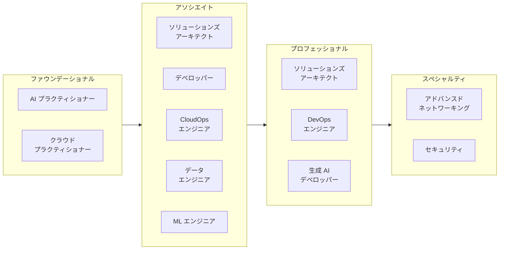
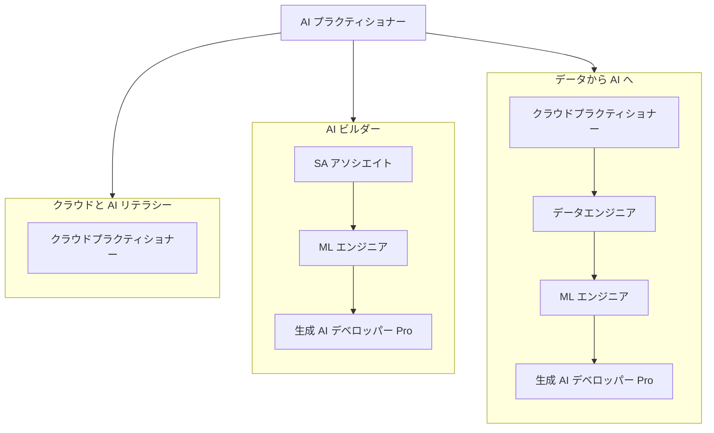
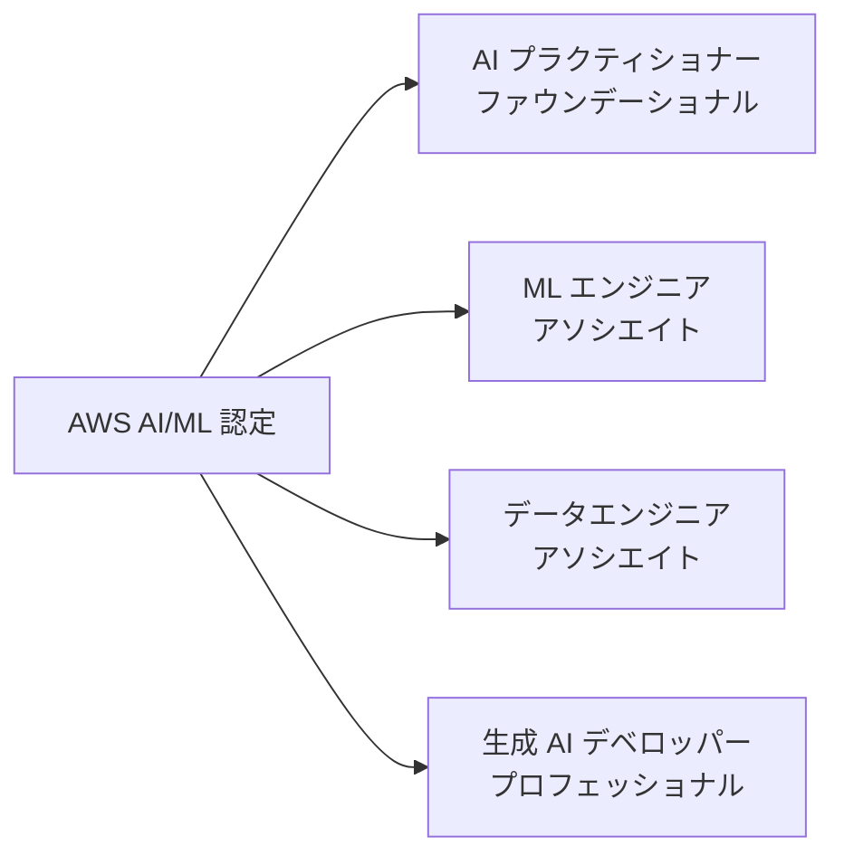
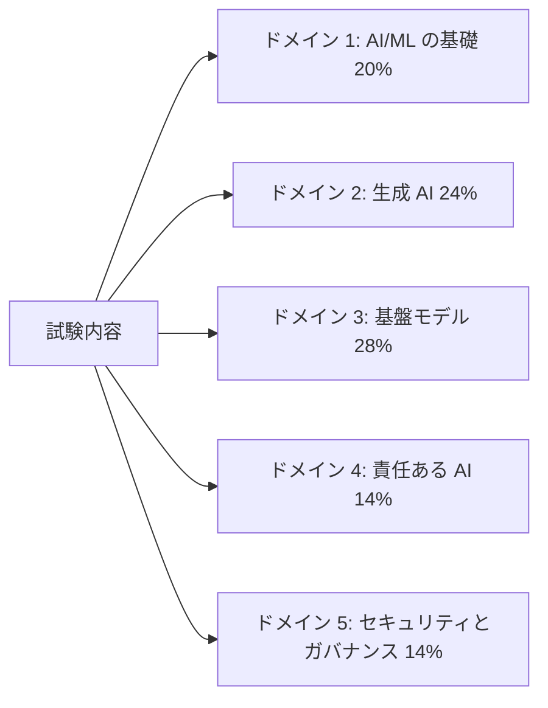
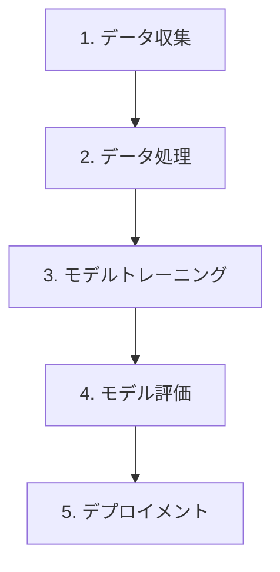

# AWS 認定と AI プラクティショナー試験

## AWS 認定の概要

AWS 認定は、現代のエンタープライズコンピューティングを支えるクラウドおよび AI テクノロジーの専門知識を検証します。技術的な熟練度の代理指標として業界全体で認められており、AWS を効果的に活用するために必要なスキルを身につけたい専門家に向けた体系的なパスとなっています。デジタル変革を進める組織にとって、認定資格を持つ専門家はより迅速なプロジェクト遂行と高価なミスの削減につながる専門知識をもたらします。

メリットは認定資格そのものを超えています。認定取得者はより高い給与、より多くの面接機会、そして昇進やストレッチアサインメントへのより良いポジショニングを報告しています。[^006001] 認定の背後にあるスキルは実際の課題に対応しており、再認定サイクルによって取得者は AWS ポートフォリオの進化に合わせて最新の状態を保ちます。

## AWS 認定パス

AWS はその認定プログラムをファウンデーショナル、アソシエイト、プロフェッショナル、スペシャルティの 4 つのレベルに整理しています。この構造により、専門家は幅広い知識から始め、キャリア目標に沿った専門的な専門知識へと進歩できます。



*図 0.6.1: 2026 年 5 月時点の AWS 認定ポートフォリオ全体（ティア別）。12 の有効な認定はクラウドリテラシーから深い AI エンジニアリングまでの役割をカバーしています。AI プラクティショナーはファウンデーショナルレベルの 2 つの認定の 1 つです。プロフェッショナルレベルの生成 AI デベロッパーは、より高度なスキルを持つ対象者向けの AI/ML トラックを拡張します。*

この図は、**AI プラクティショナー**認定がファウンデーショナルレベルで**クラウドプラクティショナー**と並んでいる位置を示しています。[^006002] かつて深い技術的な AI/ML トラックの基盤だった Machine Learning Specialty 認定は 2026 年 3 月 31 日に廃止され、**Machine Learning Engineer - Associate** と **Generative AI Developer - Professional** に置き換えられました。[^006003] AWS はまた、2025 年に SysOps Administrator - Associate を **CloudOps Engineer - Associate** に改名しました。

AWS 認定ラダーは一本の直線ではありません。異なる役割が同じ上級資格に向けて異なるパスをたどります。以下のマップは 3 つの一般的なマルチパスルートを示しています。



*図 0.6.2: AWS 認定ポートフォリオを通る 3 つの代表的なパス。ビジネスと AI リテラシーのトラックは AI プラクティショナーで終わります。AI ビルダーとデータから AI へのトラックはどちらも生成 AI デベロッパー - プロフェッショナルに収束しますが、異なるアソシエイトレベルの認定を経由します。*

目標が実際のエンジニアリングよりも informed な意思決定であれば、AI プラクティショナーの後で止めることができます。本番環境で AI エージェントを構築する計画のある実務者は、生成 AI デベロッパー - プロフェッショナルに進む前に、少なくとも Solutions Architect - Associate と Machine Learning Engineer - Associate を取得することで恩恵を受けることが多いです。

認定の有効性を維持するために、AWS は 3 年ごとの再認定を要求します。これにより取得者は最新のサービスとベストプラクティスに対応し続けます。

## AWS 認定 AI プラクティショナー認定

### 概要とポジショニング

AWS 認定 AI プラクティショナー認定は、組織全体での AI リテラシーに対する急速に高まるニーズに対応しています。実装の詳細よりも実践的なビジネス応用を重視しながら、AWS 上の人工知能、機械学習、および生成 AI の基礎知識を検証します。

この認定は、AI の隣で働くがそれを必ずしも構築するわけではないビジネスアナリスト、プロダクトマネージャー、IT サポートスタッフ、およびその他の専門家を対象としています。AI の選択肢を評価し、エンジニアリングチームとコミュニケーションを取る能力を検証することで、組織がより informed な方法で AI 機能を採用し、高価なミスを避けるのに役立ちます。

### 他の AI/ML 認定との違い

AWS AI/ML 認定は現在、明確に階層化されたセットを形成しています。異なる対象者と異なるスキルレベルを対象としています。



*図 0.6.3: AWS AI/ML 認定マップ。各認定はファウンデーショナルレベルのビジネスリテラシーからプロフェッショナルレベルの本番アーキテクチャまで、特定の対象者とスキルの深さを対象としています。*

**Generative AI Developer - Professional** 認定（AIP-C01）は、AWS 上で生成 AI ソリューションを大規模に設計、構築、および運用化する専門知識を検証します。エンドツーエンドで AI システムを担当するアーキテクトおよびシニアエンジニアを対象としています。

**Machine Learning Engineer - Associate**（MLA-C01）は、本番環境で ML モデルを構築、デプロイ、および監視するために必要なスキルを検証します。アプリケーションの ML 側を担当する ML エンジニアと開発者を対象としています。

**Data Engineer - Associate**（DEA-C01）は、AI/ML プロジェクトが依存するデータインフラストラクチャに焦点を当てています。AI ワークロードを供給するパイプラインとストレージレイヤーを構築・維持するエンジニアを対象としています。

対照的に、**AI プラクティショナー**は基礎とビジネス応用に焦点を当てています。AI/ML ソリューションを使用する専門家向けに設計されており、それを構築する人向けではありません。ビジネスアナリスト、プロダクトマネージャー、および技術に精通した IT サポートスタッフが主な対象者です。

この 4 段階の階層化は成熟した AI/ML 市場を反映しています。AI の構築、デプロイ、およびガバナンスには、AWS が各レイヤーに別々の認定を提供するほどの特化したスキルが必要になりました。

## 試験の詳細と構造

### 試験の概要

AWS 認定 AI プラクティショナー（AIF-C01）試験は、90 分で完了する 65 問の問題が含まれています。英語、日本語、韓国語、ポルトガル語（ブラジル）、および簡体字中国語で受験可能です。最低合格スコアは 100 から 1,000 のスケールで 700 です。

現在の試験バージョンは **V1.1** で、2026 年 4 月 30 日に公開され、約 1 か月後に試験で有効になりました。[^006004] V1.1 では、エージェント型 AI、Amazon Bedrock AgentCore、Strands Agents、Kiro、および Amazon Quick が範囲内の教材に追加されました。また、Amazon MemoryDB が削除されました。目標の変更は十分に重要であるため、2026 年中頃以前の準備教材は現在の試験ガイドと照合する必要があります。



*図 0.6.4: AIF-C01 V1.1 のドメインウェイト。ドメイン 2 と 3 は合わせて生成 AI と基盤モデルアプリケーションをカバーし、スコア付きコンテンツの半数以上を占めます。*

基盤モデルと生成 AI を合わせると試験の半分以上をカバーしており、これらのトピックがエンタープライズ AI 業務の中心にいかに急速に移行したかと一致しています。試験は以下の能力を評価します。

- AI/ML および生成 AI のコンセプトと AWS サービスの理解を示す
- 異なる AI テクノロジーの適切なユースケースを評価する
- AI ソリューションの実装について informed な決断を下す
- 責任ある AI の実践とガバナンスの原則を適用する

### 対象者

理想的な受験者は、AWS 上の AI/ML テクノロジーに約 6 か月間接触した経験を持ちます。AI/ML ソリューションを使用することに慣れている必要がありますが、自分でそれらを構築することは期待されていません。Amazon EC2、Amazon S3、AWS Lambda、Amazon Bedrock、Amazon SageMaker AI などの**コア AWS サービス**の実用的な知識が必要です。[^006005]

また、**AWS 責任共有モデル**、AWS Identity and Access Management（IAM）、および AWS サービス価格モデルの実用的な理解が必要です。

さまざまな専門家がこの認定から異なる方法で恩恵を受けることができます。

*表 0.6.1: AWS 認定 AI プラクティショナーから恩恵を受ける役割。*

| 役割カテゴリ | 主なスタッフ | 主なメリット | 主な活動 |
|-------------|------------|------------|---------|
| ビジネス意思決定者 | プロジェクトマネージャー、ビジネスアナリスト、経営幹部 | 戦略的計画と評価能力 | AI イニシアティブの評価、実現可能性の評価、採用ロードマップの策定 |
| テクノロジー専門家 | IT スタッフ、クラウドアーキテクト、テクニカルコンサルタント | 技術的統合とサポートの知識 | AI システムのサポート、統合ソリューションの設計、プラットフォーム評価 |
| ドメインスペシャリスト | 業界の専門家、研究専門家、QA スペシャリスト | ドメイン固有の AI 応用の洞察 | 実装のガイド、品質の確保、応用の探索 |
| サポートと運用 | 運用チーム、カスタマーサクセスマネージャー、テクニカルライター | 運用の卓越性とサポート能力 | AI サービスの管理、システムの文書化、トレーニングプログラムの開発 |

この認定では、AI/ML モデルの開発、データエンジニアリングの実装、ハイパーパラメータのチューニング、AI/ML パイプラインの構築、モデルの数学的分析、または完全なガバナンスフレームワークの開発は必要ありません。これらは上位レベルの認定の責任です。

### 試験構造とスコアリング

試験には 50 問のスコア付き問題と、AWS が将来のコンテンツ候補を評価するために使用する 15 問のスコアなし問題が含まれています。スコアなし問題は試験全体に分散されており、識別されません。推測によるペナルティはなく、未回答の問題は不正解としてスコアされます。

スコアリングモデルには 4 つの特徴があります。

- 100 から 1,000 の範囲のスケールドスコア
- 最低合格スコア 700
- 補完的スコアリング（各セクションを個別に合格する必要はなく、試験全体のみ合格が必要）
- 複数の試験形式にわたる難易度の公平性を維持するためのスケールドスコア

スコアレポートには、全体の合否ステータス、スケールドスコア、および強みと弱みを強調するセクションレベルのパフォーマンスフィードバックが含まれています。セクションレベルのフィードバックは一般的なガイダンスであり、正確なセクション別成績ではありません。

標準の試験時間は 90 分です。英語を母国語としない受験者は、英語での受験時に「ESL +30」調整と呼ばれる 30 分の延長を要求でき、合計 120 分になります。

## 試験の問題形式

試験では 4 つの問題形式が使用されます。形式を事前に知っておくと、時間配分が容易になり、驚きを避けることができます。

### 多肢選択問題

多肢選択問題は、シナリオまたはコンセプトを 4 つの可能な回答（正解 1 つと誤答 3 つ）とともに提示します。誤答は一般的な誤解をテストし、表面だけでなくトピックの深さを理解しているかを検証するために設計されています。

例：

```
機械学習モデルを大規模に構築、トレーニング、
デプロイするための完全マネージド環境を提供する AWS サービスはどれですか？

A) Amazon EC2     - 仮想サーバーを提供するが ML の手動セットアップが必要
B) Amazon S3      - ストレージを提供するが ML 機能はない
C) Amazon SageMaker AI - ML ワークフロー向けの専用マネージドサービス
D) Amazon Redshift - ネイティブ ML 機能のないデータウェアハウスサービス

正解: C
```

不正解の選択肢は、ML ワークフローに何らかの形で関わっているが、完全なマネージド ML エクスペリエンスを提供しないサービスです。

### 複数回答問題

複数回答問題は、5 つ以上の選択肢から 2 つ以上の正解を選択する必要があります。クレジットを受けるためにはすべての正解を識別する必要があります。部分点は与えられません。

```
Amazon SageMaker Studio が提供する機能は 2 つはどれですか？（2 つ選択）

A) ML のための統合開発環境（IDE）
B) 自動モデルデプロイとモニタリング
C) トレーニング用の生コンピュートキャパシティ
D) データセット用のオブジェクトストレージ
E) リレーショナルデータベース管理

正解: A、B
```

複数回答問題に取り組む際は以下を行います。

1. 問題を注意深く読み、必要な回答の数を正確に確認する。
2. 各選択肢を比較する前に独立して評価する。
3. 指定された数の回答を正確に選択したことを確認する。
4. 部分点が与えられないため、すべての選択が正確であることを確認する。

### 順序付け問題

順序付け問題は、連続したプロセスの理解をテストします。タスクを完了するために正しい順序に並べる必要がある 3 から 5 項目が提示されます。



*図 0.6.5: 順序付け問題の例として使用される標準的な ML ワークフロー。各ステップは前のステップに依存しており、順序は標準的な慣行を反映しています。*

順序付け問題では以下を確認します。

- ステップ間の依存関係
- AWS サービスの要件と前提条件
- 業界標準のワークフロー
- AWS のベストプラクティス

### マッチング問題

マッチング問題では、2 つのリスト内の項目を関連付けることが求められます。通常、3 から 7 つのプロンプトと対応する説明のリストが提示され、各プロンプトを正しい説明と一致させる必要があります。

典型的なマッチング問題：

```
AWS AI/ML サービスとその主な機能を一致させてください。

プロンプト：
1. Amazon Bedrock
2. Amazon SageMaker Canvas
3. Amazon Comprehend
4. Amazon Rekognition

説明：
A. コードなしの ML モデル構築と推論
B. 自然言語処理とテキスト分析
C. 基盤モデルへのアクセスとデプロイ
D. コンピュータビジョンと画像・動画分析

正解の一致: 1-C, 2-A, 3-B, 4-D
```

マッチング問題に取り組む際は以下を行います。

1. 一致を始める前に両方のリストのすべての項目を注意深く読む。
2. 明らかな一致を最初に確定し、残りを消去法で絞り込む。
3. 残りのより難しいペアに消去法を使用する。
4. AWS の知識に照らして各一致を確認する。

## 試験準備のヒント

### 時間管理

多くの受験者にとって、効果的な時間管理は純粋な知識よりも重要です。実践的なガイドライン：

1. 最初に問題数と試験時間を確認する。
2. 最初のパスで問題あたり約 80 秒を目標とする。
3. 1 つの問題に 2 分以上費やさない。
4. 難しい問題にフラグを付け、最初のパス後に再確認する。
5. 最後に少なくとも 5 から 10 分間のレビュー時間を残す。

英語が第一言語でない場合、AWS は調整として 30 分の追加試験時間を要求できます。リクエストは試験予約前に AWS Certification アカウントを通じて提出する必要があり、承認されると、そのアカウントからスケジュールするすべての AWS 試験に適用されます。

### 重点分野

試験は記憶よりも実践的な応用を重視しています。主要な分野：

- エージェント型 AI、RAG、MCP を含むコア AI/ML のコンセプトと用語
- 適切なビジネス問題に対する適切な AI サービス
- 特に Amazon Bedrock と AgentCore ファミリーの AWS サービス機能と制限
- バイアス、公平性、透明性、および説明可能性を含む責任ある AI の原則
- Amazon Bedrock Guardrails と AI に対する AWS 責任共有を含むセキュリティ

問題は定義を暗唱する能力ではなく、現実的なシナリオで知識を応用する能力をテストします。

### 準備リソース

AWS は無料および有料コンテンツを含む AWS Skill Builder を通じてさまざまな準備リソースを提供しています。[^006006]

*表 0.6.2: AWS 認定の主な準備リソース。*

| リソースタイプ | 説明 | 最適な用途 |
|-------------|------|---------|
| デジタルトレーニング | セルフペースのオンラインコース | コアコンセプトの理解 |
| クラスルームトレーニング | インストラクター主導のセッション | インタラクティブな学習と直接ガイダンス |
| 練習問題 | サンプル問題とシナリオ | 試験準備とギャップ分析 |
| ドキュメント | テクニカルガイドとホワイトペーパー | 深い技術的知識の構築 |
| ハンズオンラボ | AWS コンソールの実践演習 | 実際の経験とスキル検証 |

AIF-C01 については、AI/ML の基礎、GenAI と FM のドメイン、そして V1.1 で追加された新しいエージェント型 AI 素材に焦点を当ててください。**Amazon Bedrock**、モデルプレイグラウンド、および **Amazon Bedrock AgentCore** でのハンズオン時間は、基礎が整った後の学習時間の最も高い投資対効果をもたらします。

## まとめ

AWS 認定 AI プラクティショナー認定は、AWS 上の現代 AI に関する本質的な知識を検証します。クラシカル ML、生成 AI、エージェント型 AI、そして increasingly それらに伴う責任ある AI の実践です。AI を使用するビジネスアナリスト、プロダクトマネージャー、およびその他の専門家向けに設計されており、この認定はあなたの以下の能力を証明します。

- AI テクノロジー採用について informed な決断を下す
- AI イニシアティブについてテクニカルチームとコミュニケーションを取る
- 適切な AI サービスに対する適切なユースケースを識別する
- 組織内で責任ある AI の実践を適用する
- AWS 上で急速に進化する AI の状況をナビゲートする

この認定を取得することで、ビジネス価値に焦点を当てながら AI を理解するための基盤が確立されます。これにより、より多くの組織が Amazon Bedrock、Amazon Bedrock AgentCore、Amazon SageMaker AI、Kiro などのサービスを通じて AI 実験から AI 本番へと移行するにつれて、有用な資格となります。

AWS 認定は、AI が主流のビジネス運営に入り込むにつれてクラウドの専門知識を検証し、キャリア成長を加速するパスであり続けます。AWS 認定 AI プラクティショナー認定は、急速な AI 採用期間に技術的役割とビジネス的役割を橋渡しし、V1.1 アップデートにより試験内容が 2026 年の市場の実情に更新されました。

[^006001]: AWS Certifications. URL: [https://aws.amazon.com/certification/](https://aws.amazon.com/certification/)
    
[^006002]: AWS Certified AI Practitioner. URL: [https://aws.amazon.com/certification/certified-ai-practitioner/](https://aws.amazon.com/certification/certified-ai-practitioner/)
    
[^006003]: AWS Certified Machine Learning Engineer Associate. URL: [https://aws.amazon.com/certification/certified-machine-learning-engineer-associate/](https://aws.amazon.com/certification/certified-machine-learning-engineer-associate/)
    
[^006004]: AIF-C01 Exam Guide Revisions. URL: [https://docs.aws.amazon.com/aws-certification/latest/ai-practitioner-01/aif-01-revisions.html](https://docs.aws.amazon.com/aws-certification/latest/ai-practitioner-01/aif-01-revisions.html)
    
[^006005]: AIF-C01 Target Candidate Description. URL: [https://docs.aws.amazon.com/aws-certification/latest/ai-practitioner-01/ai-practitioner-01.html](https://docs.aws.amazon.com/aws-certification/latest/ai-practitioner-01/ai-practitioner-01.html)
    
[^006006]: AWS Skill Builder. URL: [https://skillbuilder.aws/](https://skillbuilder.aws/)
