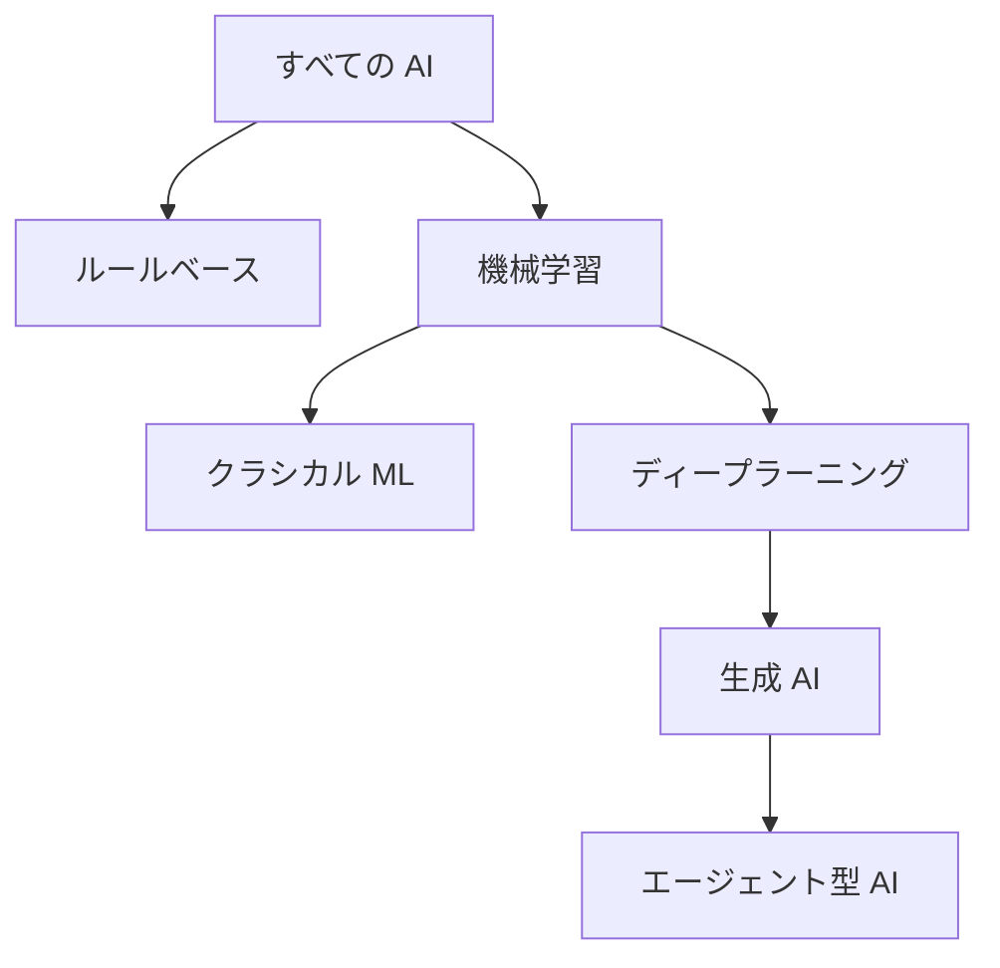
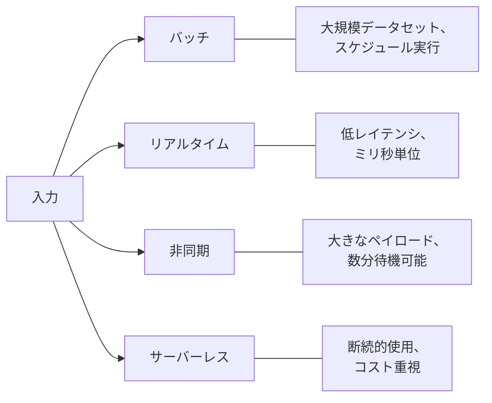
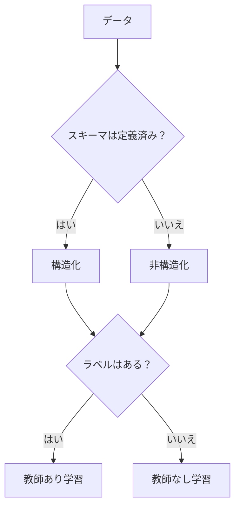
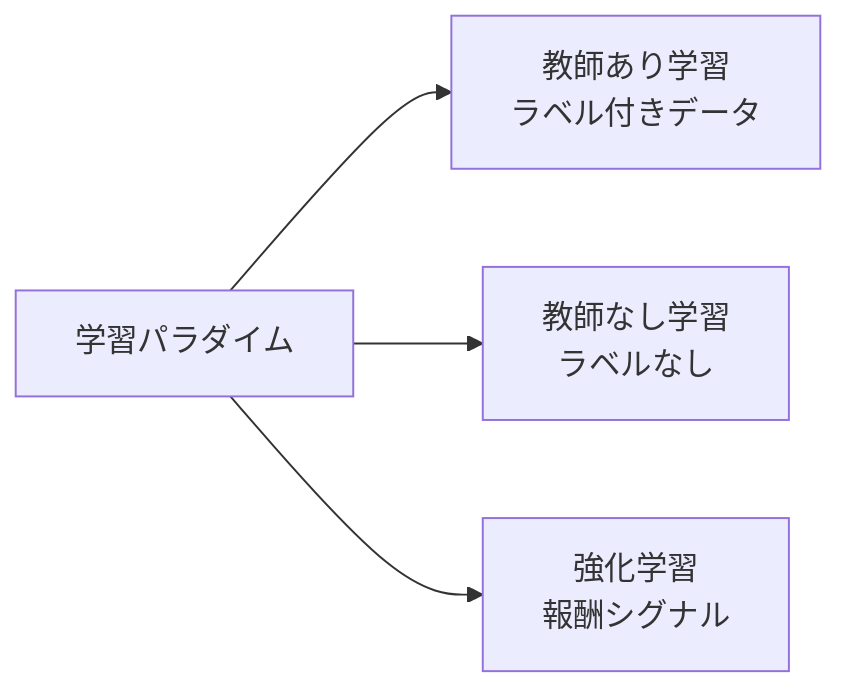

## タスクステートメント 1.1: AI の基本概念と用語の説明

AI の語彙は、ビジネスプロフェッショナルとそれを支えるエンジニアリングチームの共通言語です。プロダクトマネージャーがモデルのデプロイメントを承認したり、経営幹部が AI ベンダーの提案を評価したりする前に、テーブルのすべての人が、トレーニング、推論、バイアス、公平性などの用語について同じ定義を持つ必要があります。このタスクステートメントは、その共通語彙を確立し、各用語が登場する AWS サービスと試験目標にマッピングします。[^101001]

### 1.1.1 AI の基本用語の定義

AI の理解は正確な定義から始まります。試験は隣接する用語を区別できるかをテストしており、不正確な言語は技術的なステークホルダーと非技術的なステークホルダーの間での期待のずれにつながるため、ビジネスにとっての危険も現実的です。

**人工知能（AI）** は、画像認識、言語理解、不確実性の下での意思決定など、通常は人間の推論を必要とするタスクを実行できるシステムを構築するコンピュータサイエンスの広い分野です。[^101002] AI は単一の技術ではありません。それはデータからの学習を含むものとそうでないものを含む、多くのアプローチを含むカテゴリです。

**機械学習（ML）** は AI のサブセットであり、プログラマーが明示的に書いたルールに従うのではなく、データからパターンを学習するシステムです。[^101003] 例えば、従来のルールベースの不正検出システムは固定のドル閾値を超えるトランザクションにフラグを立てるかもしれませんが、ML ベースのシステムは代わりに数千の歴史的な不正事例から学習し、固定ルールでは捉えられないパターンを一般化します。

**ディープラーニング** は、ますます抽象的なパターンを表現するために多くの層を持つ*ニューラルネットワーク*を使用する ML のサブセットです。[^101004] 「深い」という用語はこれらの層の深さを指します。ディープラーニングは、現代のほとんどの画像認識、音声認識、言語理解システムを動かしています。

**ニューラルネットワーク** は、生物学的なニューロンの構造から大まかにインスパイアされた計算モデルです。データは相互接続されたノードの層を通過し、それぞれが数学的変換を適用します。ネットワークは、トレーニング中に内部パラメータを調整することによって、正確な出力を生成する変換を学習します。浅いネットワークは 2 つまたは 3 つの層を持ちますが、深いネットワークは数百の層を持つことがあります。

**コンピュータビジョン（CV）** は、機械が画像やビデオを解釈できるようにする AI の分野です。[^101006] コンピュータビジョンシステムは、写真内のオブジェクトを分類したり、製造ラインの欠陥を検出したり、駐車場の車両を数えることができます。AWS では、コンピュータビジョン機能は画像・動画分析のための **Amazon Rekognition** を通じて利用できます。[^101007]

**自然言語処理（NLP）** は、機械が人間の言語を読み、理解し、生成できるようにする AI の分野です。[^101008] NLP のタスクには、感情分析、固有表現認識、翻訳、文書要約が含まれます。AWS は、テキスト分析のための **Amazon Comprehend**、言語翻訳のための **Amazon Translate**、音声テキスト変換のための **Amazon Transcribe** などのサービスを通じて NLP 機能を提供しています。[^101009] これらの専用サービスは、コスト効率とレイテンシが重要な大量の明確に定義されたタスクに最適な選択肢です。長文生成、複雑な要約、複数ステップの推論などのオープンエンドな言語作業には、Amazon Bedrock を通じてアクセスできる**大規模言語モデル（LLM）** の方が適しています。本書のドメイン 2 でそれらを詳しく説明します。

**アルゴリズム** はデータからモデルをトレーニングするために使用される数学的手順です。一般的な ML アルゴリズムには、連続値の予測のための線形回帰、分類のための決定木、構造化された表形式データのための勾配ブースティングが含まれます。アルゴリズムの選択は、モデルがトレーニングデータから新しい入力への汎化方法を決定します。

**モデル** は、アルゴリズムがトレーニングデータセットに適用されたときに生成されるアーティファクトです。モデルはアルゴリズムが見つけたパターンをキャプチャし、新しい未見のデータに対して予測を行うために使用できます。アルゴリズムをレシピ、モデルを完成した料理として考えてください。

**トレーニング** は、内部パラメータが予測誤差を最小化するように調整されるよう、モデルをラベル付きまたはラベルなしデータにさらすプロセスです。トレーニングは計算集約的であり、通常は GPU アクセラレーテッドインフラストラクチャで実行されます。AWS では、トレーニングジョブは最も一般的に **Amazon SageMaker AI** で実行されます。

**推論**（*inference* または *scoring* とも呼ばれる）は、トレーニングされたモデルを使用して、新しい入力データに対する予測または出力を生成するプロセスです。[^101014] トレーニングは一度または定期的に行われますが、推論はユーザーまたはシステムが予測を要求するたびに継続的に行われます。

AI における**バイアス（偏り）** は、欠陥のあるトレーニングデータ、欠陥のあるアルゴリズム設計、または欠陥のある問題の組み立てから生じるモデルの出力における系統的なエラーを指します。[^101015] 例えば、偏った採用履歴を持つ企業の歴史的データでトレーニングされた採用モデルは、そのパターンを再現して増幅する可能性があります。バイアスは責任ある AI ガバナンスにおける核心的な懸念です。

**公平性** は、性別、人種、年齢などの特性によって定義される人口統計学的グループにわたって公平な結果を生み出すモデルの性質です。公平性とバイアスは密接に関連しています。保護されたグループに対するバイアスが許容可能な閾値を下回っている場合、そのモデルは公平と見なされます。AWS は、トレーニングデータとトレーニングされたモデルのバイアスを検出・測定するために **Amazon SageMaker Clarify** を提供しています。[^101017]

**適合度** は、モデルが学習したパターンがデータの根本的な構造とどの程度一致しているかを示します。[^101018] トレーニングデータに近すぎるモデルは*過学習*と言われます。ノイズを記憶し、パターンを一般化しないため、新しいデータに対する精度が急落します。実際のパターンを捉えるには単純すぎるモデルは*未学習（アンダーフィッティング）* と言われます。トレーニングデータと新しいデータの両方でパフォーマンスが低下します。適切な適合度はこれらの極端な間にあります。

**大規模言語モデル（LLM）** は、ディープラーニングモデルであり、具体的には膨大なテキストコーパスでトレーニングされたニューラルネットワークで、以前の NLP 技術では不可能だったレベルの流暢さと柔軟性で言語を生成、要約、翻訳、推論できます。[^101019] Amazon Titan、Anthropic Claude、Meta Llama などの LLM は、現代のほとんどの生成 AI アプリケーションの基盤となっています。数十億のパラメータで測定されるそのスケールは、広い能力を与えますが、ゼロからのトレーニングを非常に高価にします。

**生成 AI（GenAI）** は、プロンプトに応じてテキスト、画像、音声、コードなどの新しいコンテンツを生成する AI のクラスです。[^101020] GenAI システムは通常、LLM または類似の大規模生成モデルの上に構築されます。単一の値を分類または予測する以前の ML モデルとは異なり、生成 AI システムは可変長の人間が読めるコンテンツを生成します。生成 AI とエージェント型 AI は、元のガイドが公開されて以来、両者がエンタープライズプロジェクトにいかに広く採用されたかに合わせて、v1.1 の試験ガイドに追加されました。

**エージェント型 AI** は、モデルに目標とツールセットが与えられ、各ステップで人間の承認を必要とせずに、その目標に向けて自律的に複数ステップのアクションを計画・実行する生成 AI の拡張です。[^101021] 推論エンジンは依然として生成モデルです。エージェント型 AI は、ワンオフの生成を目標駆動のアクションに変える計画ループ、ツールアクセス、およびメモリを追加します。エージェント型 AI システムは、回答を返す前にナレッジベースを参照し、外部 API を呼び出し、コードを書き、複数の連続ステップにわたって結果を確認する場合があります。これは一回限りの Q&A インタラクションとは質的に異なります。AWS は、複数ステップのオーケストレーション、メモリ、ツール使用のためのインフラストラクチャを提供する **Amazon Bedrock** Agents と **Amazon Bedrock AgentCore** を通じてエージェント型 AI をサポートしています。[^101022]

### 1.1.2 AI、ML、GenAI、ディープラーニング、エージェント型 AI の違い

これら 5 つの用語は、別々の技術ではなく、入れ子状の階層を説明しています。それらの関係についての混乱は、AI プロジェクト計画における誤解の最も一般的な原因の一つです。各用語はその上の用語の範囲内に完全に含まれています。

**人工知能** は最も広い用語です。コンピュータシステムを人間の推論に似た方法で動作させるあらゆる技術が含まれます。1970 年代のルールベースのエキスパートシステム、1990 年代の統計的 ML、そして今日のニューラルネットワークが含まれます。

**機械学習** は、データから学習するシステムに定義を限定する AI のサブセットです。プログラマーによって書かれたルールベースの不正フィルターは AI ですが ML ではありません。トランザクション履歴でトレーニングされた不正モデルは AI でも ML でもあります。

**ディープラーニング** は、層状のニューラルネットワークを使用する ML のサブセットです。線形回帰モデルは ML ですがディープラーニングではありません。胸部 X 線を分類する畳み込みニューラルネットワークは ML、ディープラーニング、および AI です。

**生成 AI** は、特に新しいコンテンツの生成に関わるディープラーニングのサブセットです。すべてのディープラーニングが生成的というわけではありません。10 のカテゴリに画像を分類するディープラーニングモデルは識別的であり、生成的ではありません。テキストの説明からフォトリアリスティックな画像を生成するモデルが生成 AI です。

**エージェント型 AI** は、生成 AI の上に層を加えたアーキテクチャパターンです。エージェント型システムは、LLM または他の生成モデルを推論エンジンとして使用し、複数のステップにわたって行動できるよう計画ループ、ツールアクセス、およびメモリを追加します。LLM を使用した一回限りのチャットボットは生成 AI ですがエージェント型 AI ではありません。高レベルの目標を受け取り、それをサブタスクに分解し、各サブタスクを実行するためのツールを使用し、結果を統合するシステムがエージェント型 AI です。

*図 1.1.1: AI サブフィールドの入れ子構造。各ノードはその親の真のサブセットです。下に移動するにつれて、親のコンセプトを置き換えるのではなく、制約と機能が追加されます。*

試験は境界ケースを頻繁にテストします。「AI」と「ML」を同義語として扱ったり、「生成 AI」と「ディープラーニング」を混同する候補者は、どのサブセットが適用されるかを知ることに依存するシナリオ問題を誤読します。実際のビジネスへの影響も同様に具体的です。エージェント型 AI システムをデプロイするチームは、エージェント型システムが静的な出力を生成するのではなく、実際のアクションを取るため、クラシカル ML 分類モデルを実行するチームとは異なるガバナンス、コスト、セキュリティの考慮事項に直面します。

*表 1.1.1: AI サブフィールドの主な区別*

| 用語 | 親カテゴリ | 定義 | AWS の典型的な例 |
|------|-----------|------|----------------|
| 人工知能 | なし | 推論に似た動作 | AWS AI/ML サービス全般 |
| 機械学習 | AI | データから学習 | Amazon SageMaker AI |
| ディープラーニング | ML | 層状のニューラルネットワーク | GPU インスタンス付きの SageMaker |
| 生成 AI | ディープラーニング | 新しいコンテンツを生成 | Amazon Bedrock |
| エージェント型 AI | 生成 AI | 複数ステップの自律的アクション | Bedrock Agents、Bedrock AgentCore |

注意すべき点として、一部の研究者はエージェント型 AI をテクノロジーサブフィールドよりもアーキテクチャパターンとして分類しています。なぜなら、エージェント型システムは新しいモデルタイプではなく、既存の技術（LLM、ツール、オーケストレーションロジック）から構成されるからです。試験のためには、エージェント型 AI を階層の最も特化した層として扱ってください。

### 1.1.3 推論のタイプ

モデルがトレーニングされた後、予測を生成できるようにデプロイする必要があります。これらの予測がどのように要求され、返されるかが推論パターンを定義します。試験ガイド v1.1 では、元の試験が開始された後に AWS がマネージド推論オプションを拡張したため、非同期推論とサーバーレス推論がリストに追加されました。

4 つの標準的な推論パターンは、バッチ、リアルタイム、非同期、サーバーレスです。それぞれがスループットとレイテンシの要件の異なる組み合わせを解決します。ユースケースに対して間違ったパターンを選択することは、本番 AI システムにおけるコストとパフォーマンスの問題の最も一般的な原因の一つです。

**バッチ推論** は、大きな入力セットを単一のジョブで処理します。通常はスケジュールに従って実行されます。[^101024] システムは一定期間にわたって入力を収集し、モデルをすべての入力に対して一度に実行し、後で使用するために結果を保存します。データベース内のすべての顧客に対して毎晩製品推薦を生成する小売業者はバッチ推論を使用しています。AWS では、**Amazon SageMaker AI** Batch Transform が **Amazon S3** に保存されたデータに対してバッチ推論ジョブを実行し、ジョブ期間中コンピュートフリートをスケーリングして完了時にシャットダウンします。

**リアルタイム推論** は、単一の入力リクエストを処理し、ミリ秒以内に予測を返します。[^101026] モデルは、アプリケーションからのリクエストを受け入れ続ける永続エンドポイントにデプロイされます。顧客の決済端末がタイムアウトする前にクレジットカードトランザクションをスコアリングしなければならない不正検出システムは、リアルタイム推論を必要とします。AWS では、SageMaker AI リアルタイムエンドポイントは永続的な HTTPS エンドポイントの背後にモデルをホストし、可変のリクエスト量を処理するために*Auto Scaling* を適用できます。

**非同期推論**（キューに入れられた、またはバッチジョブのキュー処理モデルを共有しながら一度に一つのリクエストを処理するため、*ニアバッチ推論*とも呼ばれる）は、リクエストを受け付け、キューに入れ、元のリクエストのタイムアウトウィンドウ内ではなく、コールバックまたはポーリングメカニズムを通じて結果を返します。[^101028] このパターンは、入力が大きい場合や、モデルの処理に Web リクエストが合理的に待てる時間よりも長くかかる場合に適しています。例えば、複数ページの契約書を処理するドキュメントインテリジェンスシステムは、ドキュメントあたり 30 から 90 秒かかる場合があります。同期的な Web 呼び出しはタイムアウトしますが、非同期パターンでは呼び出し元システムが後で結果を確認できます。AWS では、SageMaker AI Async Inference エンドポイントは大きなペイロードを受け入れ、キューに入れ、取得のために結果を S3 に書き出します。

**サーバーレス推論** は、永続エンドポイントを事前にプロビジョニングすることなく、オンデマンドでモデルを実行します。[^101030] 基盤となるコンピュートはアイドル時にゼロにスケールし、実行中のエンドポイントの固定コストを排除します。サーバーレス推論は、アイドルコンピュートのコストが低レイテンシのメリットを超える断続的または予測不可能なワークロードに適しています。AWS では、SageMaker AI Serverless Inference はコンピュートを自動的にプロビジョニングおよびデプロビジョニングします。トレードオフとして、非アクティブ期間後の最初のリクエストは*コールドスタート*遅延が発生する場合があります。

*図 1.1.2: 推論パターンの選択。選択は入力量、許容レイテンシ、特定ユースケースのコスト制約の組み合わせに依存します。*

*表 1.1.2: 推論パターンの比較*

| パターン | レイテンシ | 入力サイズ | コストモデル | 最適なユースケース |
|---------|-----------|----------|------------|-----------------|
| バッチ | 分から時間 | 非常に大きい | ジョブ単位 | 夜間スコアリング、一括レポート |
| リアルタイム | ミリ秒 | 小さい | エンドポイント時間単位 | 不正検出、ライブ推薦 |
| 非同期 | 秒から分 | 大きい | リクエスト単位 | 文書処理、動画分析 |
| サーバーレス | 秒（コールド）、ミリ秒（ウォーム） | 小から中 | 推論単位 | 低トラフィック API、断続的使用 |

コストの違いはビジネスプロフェッショナルにとって重要です。永続リアルタイムエンドポイントはトラフィックを受信するかどうかに関わらず一日中コストがかかりますが、サーバーレス推論は実際の使用にのみ課金されます。ビジネスアワーのみリクエストを処理するシステムでは、コストの差は大きくなります。

### 1.1.4 AI モデルにおけるデータのタイプ

AI モデルは学習するデータによって形成され、データはさまざまな形式で存在します。モデルが期待するデータのタイプは、どのアルゴリズムが適切か、どの前処理ステップが必要か、およびモデルのデプロイ方法を決定します。これらの用語で組織のデータを記述できるビジネスプロフェッショナルは、データサイエンスチームとはるかに効果的にコミュニケーションを取ることができます。

最初の基本的な区別は**ラベル付きデータ**と**ラベルなしデータ**の間にあります。[^101032] ラベル付きデータには、入力（例えば、猫の画像）と正解（ラベル「猫」）の両方が含まれます。ラベルなしデータには入力のみが含まれ、関連する回答はありません。ラベル付きデータセットは人間によるアノテーションが必要なため作成にコストがかかりますが、教師あり学習には必要です。ラベルなしデータセットは豊富で安価ですが、パターンを抽出するために教師なし学習または自己教師あり学習技術が必要です。

ラベル付き・ラベルなしの区別を超えて、データは構造と形式によっても異なります。

- **表形式データ** はスプレッドシートやリレーショナルデータベーステーブルのように、行と列に整理されています。各列はフィーチャー（例えば、年齢、口座残高、トランザクション金額）を表し、各行は 1 つの観測を表します。勾配ブースティングツリーなどのクラシカル ML アルゴリズムは、表形式データに特に適しています。
- **時系列データ** は、定期的な時間間隔で記録された測定値のシーケンスです。株価、サーバー CPU 使用率、患者の心拍数読み取り値は時系列データです。時系列データでトレーニングされたモデルは、トレンド、季節性、異常などの時間的パターンを学習します。
- **画像データ** は、複数のカラーチャンネルが存在する場合がある 2 次元グリッドに整理されたピクセル値で構成されています。コンピュータビジョンモデルは画像データからエッジ、形状、テクスチャ、オブジェクトを検出することを学習します。ボリューム要件は高く、意味のある画像データセットには通常、数万から数百万のラベル付きサンプルが含まれます。
- **テキストデータ** は、自然言語における単語や文字のシーケンスで構成されています。NLP モデルはテキストから文法、意味論、および事実的な関連性を学習します。大規模言語モデルは数千億の単語を含むテキストコーパスでトレーニングされています。

すべてのこれらの形式に適用される 2 番目の直交する区別があります。**構造化データ** は、型付きの列を持つデータベーステーブルのように、明確に定義されたスキーマを持ちます。[^101037] **非構造化データ** には事前定義されたスキーマがありません。自由形式のテキスト、画像、音声、動画が含まれます。構造化データはクラシカル ML アルゴリズムでより直接的に使用できます。非構造化データは通常、ニューラルネットワークベースのモデルまたは構造化フィーチャーを抽出するための前処理ステップが必要です。

*表 1.1.3: AI モデルにおけるデータタイプ*

| データタイプ | 構造 | 典型的な ML アプローチ | AWS サービス例 |
|------------|-----|---------------------|--------------|
| 表形式 | 構造化 | 勾配ブースティング、線形モデル | SageMaker AI 組み込みアルゴリズム |
| 時系列 | 構造化 | シーケンスモデル、LSTM、DeepAR | SageMaker AI DeepAR |
| 画像 | 非構造化 | 畳み込みニューラルネットワーク | Amazon Rekognition、SageMaker AI |
| テキスト | 非構造化 | Transformer モデル、LLM | Amazon Comprehend、Amazon Bedrock |

**Amazon SageMaker Ground Truth** は、自動ラベリングと人間によるレビューを組み合わせることで、大規模なアノテーションの時間とコストを削減してラベル付きデータセットを作成するのを支援します。[^101038]

実際には、現実のAI プロジェクトはしばしばデータタイプを組み合わせます。顧客離脱モデルは、サポートチケットのテキストと一緒に表形式の CRM データを使用する場合があり、チームが両方のモダリティを処理できるモデルを構築または選択する必要があります。ビジネスがすでに豊富に持っているデータタイプを知ることで、どの AI アプローチが実現可能かを絞り込むことができます。

*図 1.1.3: データタイプの決定ツリー。構造とラベルの有無が組み合わさって、特定のデータセットに対してどの学習アプローチが実現可能かを決定します。*

### 1.1.5 AI/ML 学習のタイプ

モデルがデータから学習する方法は*学習パラダイム*と呼ばれます。学習パラダイムは、モデルが必要とするデータの種類、どのように汎化するか、どのような問題を解決できるかを決定します。試験では 3 つの主要なパラダイムすべてをテストします。教師あり学習、教師なし学習、強化学習です。

**教師あり学習** は、すべての入力に正しい出力ラベルが対応するデータセットでモデルをトレーニングします。[^101039] モデルは、その予測と既知のラベルの差を最小化することで入力から出力へのマッピングを学習します。これはラベル付きのテストセットでの精度を測定できるため評価が簡単なモデルを生成するため、商業 AI で最も一般的に使用されるパラダイムです。

教師あり学習は 2 つの主要な問題タイプをカバーします。*回帰* は、次四半期の顧客からの期待収益など、連続した数値を予測します。*分類* は、メールをスパムかどうかにラベル付けするなど、入力を離散的なカテゴリセットの 1 つに割り当てます。ほとんどの製品推薦、不正検出、医療診断システムは、教師あり分類または回帰モデルを使用しています。

**教師なし学習** は、ラベルのないデータでモデルをトレーニングします。[^101041] モデルは、正しい回答についてのガイダンスなしに、自らデータの構造を見つけなければなりません。最も一般的な教師なし技術は*クラスタリング*で、モデルは類似した入力をグループにまとめます。例えば、マーケティングチームは顧客の購買履歴に対して教師なしクラスタリングを使用して、ターゲットキャンペーンを受け取れる自然な顧客セグメントを発見するかもしれません。別の一般的な技術は*次元削減*で、最も重要な構造を保持しながら高次元データをより少ない次元に圧縮し、視覚化や下流モデルへの供給を容易にします。

**強化学習** は、良い結果には報酬を与え、悪い結果にはペナルティを与えることで、エージェントが環境内でアクションを取ることを学習します。[^101043] エージェントは*ポリシー*を学習します。累積報酬を最大化する、観察された状態からアクションへのマッピングです。強化学習は、ゲームプレイ AI システムの背後にあるパラダイムであり、ロボット制御、サプライチェーン最適化、即時クリックスルーではなく長期エンゲージメントを最適化する個人化されたコンテンツ推薦システムなどの産業応用にも使われるようになっています。

*表 1.1.4: AI/ML 学習パラダイムの比較*

| パラダイム | 入力データ | 学習内容 | 一般的なユースケース |
|----------|----------|---------|-----------------|
| 教師あり学習 | ラベル付き | 入力・出力マッピング | 分類、回帰、不正検出 |
| 教師なし学習 | ラベルなし | 隠れた構造 | 顧客セグメンテーション、異常検出 |
| 強化学習 | 報酬シグナル | 最適ポリシー | ロボット制御、ゲームプレイ、個人化 |

試験の範囲の端に 2 つの追加学習パラダイムが登場します。*半教師あり学習* は、少量のラベル付きデータと大量のラベルなしデータを組み合わせます。ラベリングが高価な場合に役立ちます。[^101045] *自己教師あり学習* は、文の中の単語をマスクし、欠けている単語を予測するようにモデルをトレーニングするなど、データ自体からラベルを自動的に生成します。自己教師あり学習は、ほとんどの現代の大規模言語モデルの事前学習フェーズの背後にある技術です。

*図 1.1.4: 学習パラダイムの概要。3 つのコアパラダイムは、トレーニング中にモデルが受けるフィードバックのタイプが異なります。*

学習パラダイムの選択は、技術的な選択だけでなく実践的なビジネス上の決定でもあります。教師あり学習にはラベル付きデータが必要で、その作成にコストがかかります。教師なし学習はそのコストを回避しますが、特定のビジネス成果を直接最適化することはできません。強化学習は複雑な複数ステップの目標を最適化できますが、報酬関数の設計がより慎重に行われる必要があり、公平性とバイアスの監査が困難です。このようなトレードオフを理解しているビジネスプロフェッショナルは、データサイエンスチームがアプローチを提案する際に適切な質問をすることができます。

## セルフチェック問題

**問題 1.** 小売会社が顧客サポートチケットを 5 つの問題タイプ（請求、返品、配送、製品品質、その他）の 1 つに自動的に分類するシステムを構築しています。チームには、人間のエージェントによってすでにレビューおよび分類された 50,000 件のチケットのデータセットがあります。このユースケースに最も適した ML 学習パラダイムはどれですか？

A. データを人間の指導なしに構造を見つける必要があるため、教師なし学習。
B. チケットを正しいチームにルーティングするためのポリシーを学習する必要があるため、強化学習。
C. チームにはラベル付きサンプルがあり、タスクは新しい入力を事前定義されたカテゴリに分類することであるため、教師あり学習。
D. テキスト内のマスクされた単語を予測する必要があるため、自己教師あり学習。

**答え：C。**

教師あり学習の定義的特性は、すべてのトレーニング例に入力と既知の正解ラベルの両方が含まれているということです。このシナリオでは、50,000 件のチケットはすでに人間のエージェントによって分類されており、各チケットにラベル（「請求」、「返品」など）があります。モデルの仕事は、チケットテキストからカテゴリへのマッピングを学習し、そのマッピングを新しいラベルのないチケットに適用することです。これは教師あり学習のサブタイプである典型的な分類問題です。[^101047]

教師なし学習（選択肢 A）はデータセットがラベル付きであるため誤りです。クラスタリングなどの教師なし技術はデータのグループを発見しますが、それらのグループは 5 つの事前定義されたビジネスカテゴリと一致しない可能性があります。強化学習（選択肢 B）は誤りです。エージェントが行動する環境がなく、遅延報酬シグナルもないためです。各トレーニング例の正しい答えはすぐにわかります。自己教師あり学習（選択肢 D）は、トークンをマスクしてそれらを予測することで言語モデルを事前学習するための技術です。正解ラベルが利用可能な分類タスクの正しいフレーミングではありません。

---

**問題 2.** 金融サービス企業が、販売時点でのすべてのカード現物取引に対して 200 ミリ秒以内に予測を返す必要がある不正検出モデルをデプロイしたいと考えています。モデルは比較的小さな分類モデルです。チームが使用すべき推論パターンはどれですか？

A. トランザクションの大量はバッチ処理をよりコスト効率的にするため、バッチ推論。
B. ユースケースではトランザクションがタイムアウトする前に予測が必要なため、リアルタイム推論。
C. 各トランザクションを個別に処理することでキューの競合を減らすため、非同期推論。
D. カード現物取引が断続的に発生するため、サーバーレス推論。

**答え：B。**

リアルタイム推論は、ユーザー向けまたは時間的に重要なアクションのレイテンシウィンドウ内に予測を返す必要がある場合に適切なパターンです。[^101048] 販売時点端末でのカード現物取引は通常 1 秒以内にタイムアウトし、200 ミリ秒の要件はハードな制約となります。Amazon SageMaker AI のリアルタイムエンドポイントは、ミリ秒以内に同期的に応答する HTTPS エンドポイントの後ろに永続モデルを維持します。

バッチ推論（選択肢 A）は誤りです。バッチジョブは入力をまとめてスケジュールに従って処理します。予測はトランザクションの何時間後にも届き、リアルタイムの不正防止には役に立ちません。非同期推論（選択肢 C）は誤りです。非同期パターンはリクエストを受け付け、キューに入れ、コールバックまたはポーリングで後で結果を返します。呼び出し元システムは即時の応答を得られません。サーバーレス推論（選択肢 D）はエンドポイントがウォームであればレイテンシ目標を達成できますが、コールドスタートには数秒かかる場合があり、アイドル期間後の最初のリクエストで 200 ミリ秒の要件に違反します。永続リアルタイムエンドポイントはコールドスタートを回避し、レイテンシに敏感な予測の標準パターンです。

---

**問題 3.** データサイエンスチームが顧客離脱モデルのトレーニングデータセットを準備しています。データセットの半分には、歴史的なレコードからの明示的な離脱ラベル（離脱か維持か）が含まれています。残りの半分には、離脱結果が記録されていない顧客インタラクションログが含まれています。ラベル付きの半分はどのタイプのデータを表していますか？

A. レコードが一定期間にわたるイベントをキャプチャしているため、時系列データ。
B. 目標が隠れた顧客セグメントを発見することであるため、教師なしデータ。
C. 各レコードは既知の結果（離脱または維持）と対応しているため、ラベル付きデータ。
D. レコードにサポートインタラクションからの自由形式テキストフィールドが含まれているため、非構造化データ。

**答え：C。**

ラベル付きデータは、各入力と正しい出力が対応していることによって定義されます。[^101049] このシナリオでは、歴史的なレコードには教師ありモデルが予測することを学習する結果変数（離脱または維持）が含まれており、これがラベルです。データの形式（この場合は表形式）は、ラベル付き・ラベルなしの区別とは別の次元です。レコードは表形式でかつラベル付きの両方であり得ます。

選択肢 A（時系列）は別のデータタイプの次元です。レコードにタイムスタンプが付いているかどうかは、それらがラベル付きかどうかを定義しません。選択肢 B は誤りです。「教師なし」は学習パラダイムであり、データタイプではありません。問題はデータの分類を尋ねており、技術ではありません。選択肢 D は構造化・非構造化の区別を誤って適用しています。構造化データはスキーマを持つことによって定義されます（行と列）。これはほとんどの CRM およびトランザクションレコードに当てはまり、自由形式テキストフィールドが存在するかどうかに関わらずそうです。問題はラベル付きの半分について具体的に尋ねているため、C のみが正しい説明です。

---

**問題 4.** ある組織が、「競合他社の価格設定に関する市場分析レポートを準備する」などの高レベルな目標を受け取り、内部ナレッジベースを独自に検索し、外部 API から価格データを取得し、サマリーを下書きし、結果を届ける前に調査結果を確認する AI システムを構築しています。このシステムを最もよく説明する AI のカテゴリはどれですか？

A. 構造化された入力からの出力を生成するためにトレーニングされたモデルを使用しているため、クラシカル機械学習。
B. システムが出力として新しいテキスト文書を生成するため、生成 AI。
C. システムが目標を達成するために自律的に複数の連続したアクションを計画・実行するため、エージェント型 AI。
D. システムが複数のソースからデータを分析・解釈しなければならないため、コンピュータビジョン。

**答え：C。**

エージェント型 AI は、自律的な複数ステップの計画と実行によって区別されます。システムは単一のプロンプトに応答するだけでなく、高レベルの目標をサブタスクに分解し、ツール（ナレッジベース検索、外部 API 呼び出し）を使用し、中間結果を評価し、最終出力を統合します。[^101050] これがエージェント型システムの定義的特性であり、単一ターン生成 AI インタラクションと区別します。

選択肢 B（生成 AI）は、システムがテキスト文書を生成するという点では部分的に正しいですが、生成 AI 単独では出力モダリティのみを説明しており、自律的な計画とツール使用のループは説明していません。LLM を使用してテキストを生成する単一ターンのチャットボットは生成 AI ですがエージェント型 AI ではありません。選択肢 A（クラシカル ML）は誤りです。クラシカル ML は構造化された入力から単一の予測を生成し、複数ステップの推論やツールオーケストレーションを含みません。選択肢 D（コンピュータビジョン）は誤りです。CV は特に画像や動画データの分析です。シナリオにはテキスト、API、ナレッジベースが含まれており、ピクセルデータではありません。

---

**問題 5.** マーケティングアナリストが類似した購買行動を共有する顧客を理解したいと考えていますが、チームには事前定義されたカテゴリがなく、顧客レコードにラベルを付けていません。最も適切な AI/ML パラダイムはどれですか？

A. 購買履歴は構造化された表形式データであるため、教師あり学習。
B. システムがどの顧客をターゲットにするかを学習しなければならないため、強化学習。
C. 一部のレコードが業界標準によって部分的にラベル付けされる可能性があるため、半教師あり学習。
D. ラベルがなく、目標はデータの自然なグループを発見することであるため、教師なし学習。

**答え：D。**

教師なし学習は、データセットにラベルがなく、目的が事前定義されていない構造を見つけることである場合に適切なパラダイムです。[^101051] クラスタリング（教師なし技術）は、購買パターンの類似性に基づいて顧客ベースをグループに分割します。これらのグループはアナリストによってレビューされ、ビジネスセグメントにマッピングできます。

選択肢 A は誤りです。構造化データ形式は学習パラダイムを決定しません。教師あり学習にはラベルが必要であり、このシナリオでは明示的にラベルがありません。選択肢 B は誤りです。強化学習にはエージェント、環境、連続したアクションに結びついた報酬シグナルが必要です。既存の顧客のセグメント化は連続的な意思決定問題ではありません。選択肢 C（半教師あり学習）は誤りです。問題にはラベル付きレコードがないと述べられており、半教師あり学習はモデルをガイドするために少なくとも一部のラベル付きサンプルが必要です。

---

[^101001]: AWS Certification: AWS Certified AI Practitioner Exam Guide v1.1, Task Statement 1.1. URL: <https://docs.aws.amazon.com/aws-certification/latest/ai-practitioner-01/ai-practitioner-01-domain1.html>
[^101002]: NIST AI 100-1: Artificial Intelligence Risk Management Framework. URL: <https://airc.nist.gov/Home>
[^101003]: Amazon SageMaker AI Developer Guide: What Is Machine Learning? URL: <https://docs.aws.amazon.com/sagemaker/latest/dg/whatis.html>
[^101004]: AWS Machine Learning Blog: Deep Learning. URL: <https://aws.amazon.com/what-is/deep-learning/>
[^101006]: AWS: What Is Computer Vision? URL: <https://aws.amazon.com/what-is/computer-vision/>
[^101007]: Amazon Rekognition Developer Guide: What Is Amazon Rekognition? URL: <https://docs.aws.amazon.com/rekognition/latest/dg/what-is.html>
[^101008]: AWS: What Is Natural Language Processing? URL: <https://aws.amazon.com/what-is/natural-language-processing/>
[^101009]: Amazon Comprehend Developer Guide: What Is Amazon Comprehend? URL: <https://docs.aws.amazon.com/comprehend/latest/dg/what-is.html>
[^101014]: AWS: What Is ML Inference? URL: <https://aws.amazon.com/what-is/ml-inference/>
[^101015]: AWS: What Is AI Bias? URL: <https://aws.amazon.com/what-is/ai-bias/>
[^101017]: Amazon SageMaker Clarify Developer Guide: What Is Amazon SageMaker Clarify? URL: <https://docs.aws.amazon.com/sagemaker/latest/dg/clarify-what-is.html>
[^101018]: AWS: What Is Overfitting in Machine Learning? URL: <https://aws.amazon.com/what-is/overfitting/>
[^101019]: AWS: What Is a Large Language Model? URL: <https://aws.amazon.com/what-is/large-language-model/>
[^101020]: AWS: What Is Generative AI? URL: <https://aws.amazon.com/what-is/generative-ai/>
[^101021]: AWS: What Is Agentic AI? URL: <https://aws.amazon.com/what-is/agentic-ai/>
[^101022]: Amazon Bedrock AgentCore Documentation. URL: <https://docs.aws.amazon.com/bedrock/latest/userguide/agents.html>
[^101024]: Amazon SageMaker AI Developer Guide: Get Inferences for an Entire Dataset with Batch Transform. URL: <https://docs.aws.amazon.com/sagemaker/latest/dg/batch-transform.html>
[^101026]: Amazon SageMaker AI Developer Guide: Deploy Models for Inference. URL: <https://docs.aws.amazon.com/sagemaker/latest/dg/deploy-model.html>
[^101028]: Amazon SageMaker AI Developer Guide: Asynchronous Inference. URL: <https://docs.aws.amazon.com/sagemaker/latest/dg/async-inference.html>
[^101030]: Amazon SageMaker AI Developer Guide: Use Serverless Inference. URL: <https://docs.aws.amazon.com/sagemaker/latest/dg/serverless-endpoints.html>
[^101032]: AWS: What Is Labeled Data? URL: <https://aws.amazon.com/what-is/labeled-data/>
[^101037]: AWS: Structured vs Unstructured Data. URL: <https://aws.amazon.com/what-is/structured-data/>
[^101038]: Amazon SageMaker Ground Truth Developer Guide: Use Amazon SageMaker Ground Truth to Label Data. URL: <https://docs.aws.amazon.com/sagemaker/latest/dg/sms.html>
[^101039]: AWS: What Is Supervised Learning? URL: <https://aws.amazon.com/what-is/supervised-learning/>
[^101041]: AWS: What Is Unsupervised Learning? URL: <https://aws.amazon.com/what-is/unsupervised-learning/>
[^101043]: AWS: What Is Reinforcement Learning? URL: <https://aws.amazon.com/what-is/reinforcement-learning/>
[^101045]: AWS: Semi-Supervised Learning Overview. URL: <https://aws.amazon.com/what-is/semi-supervised-learning/>
[^101047]: Amazon SageMaker AI Developer Guide: Supervised Learning with SageMaker. URL: <https://docs.aws.amazon.com/sagemaker/latest/dg/algos.html>
[^101048]: Amazon SageMaker AI Developer Guide: Real-Time Inference. URL: <https://docs.aws.amazon.com/sagemaker/latest/dg/realtime-endpoints.html>
[^101049]: AWS: What Is Training Data? URL: <https://aws.amazon.com/what-is/training-data/>
[^101050]: Amazon Bedrock Agents Developer Guide: How Amazon Bedrock Agents Work. URL: <https://docs.aws.amazon.com/bedrock/latest/userguide/agents-how.html>
[^101051]: Amazon SageMaker AI Developer Guide: K-Means Clustering Algorithm. URL: <https://docs.aws.amazon.com/sagemaker/latest/dg/k-means.html>
