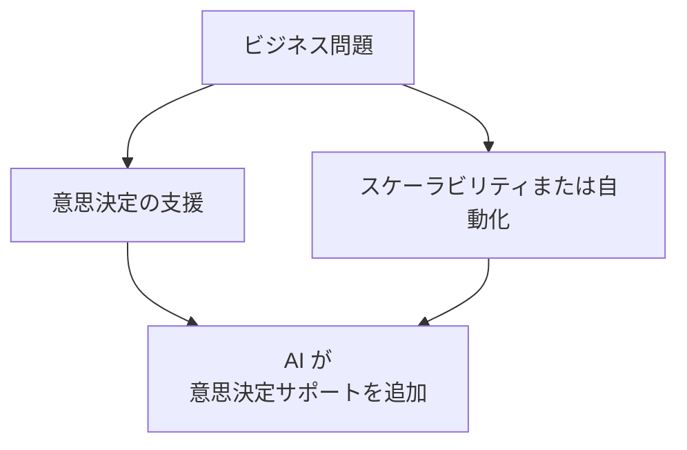
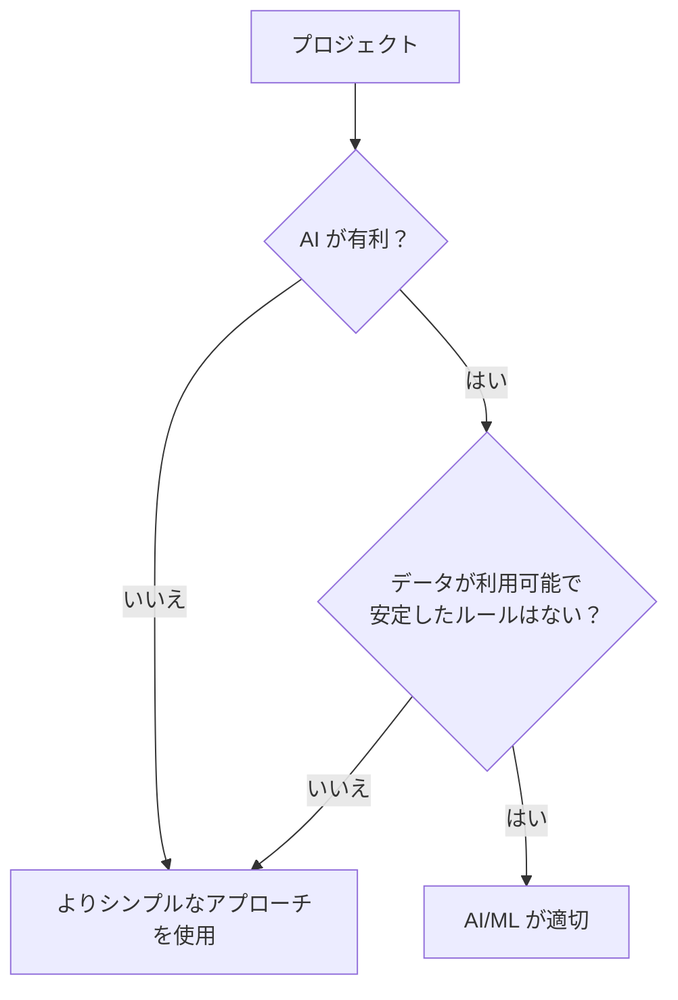
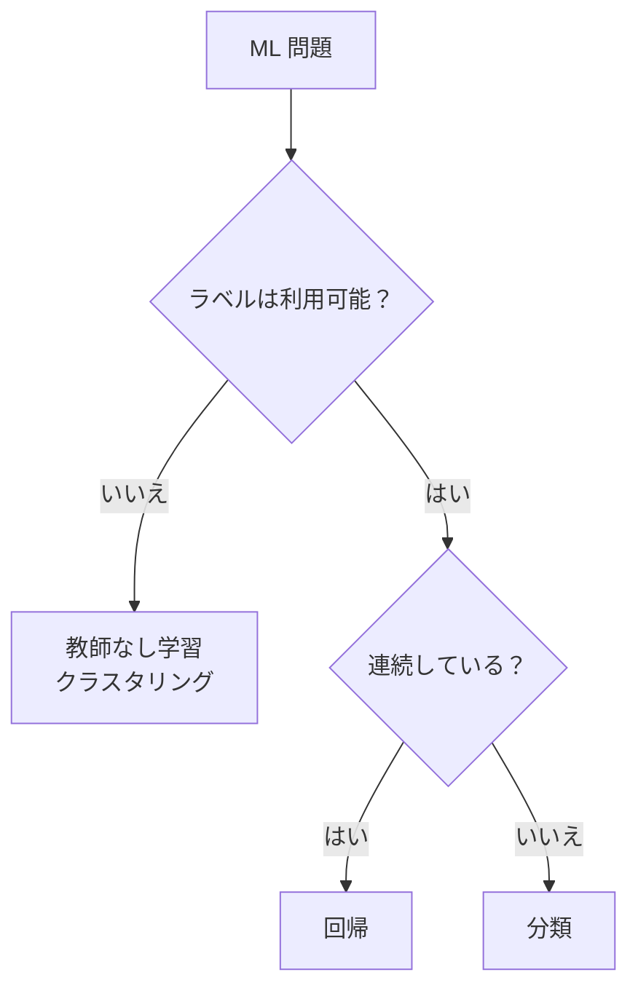
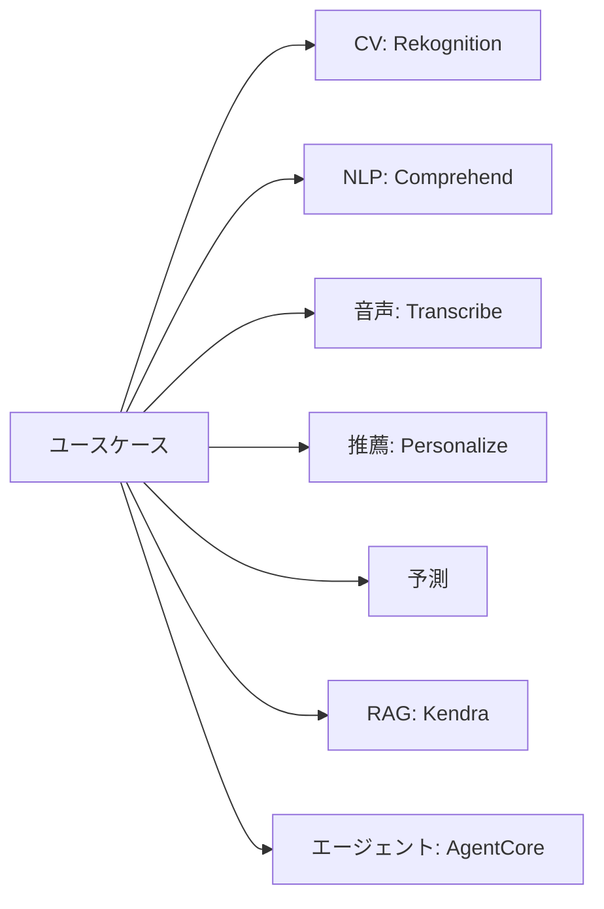
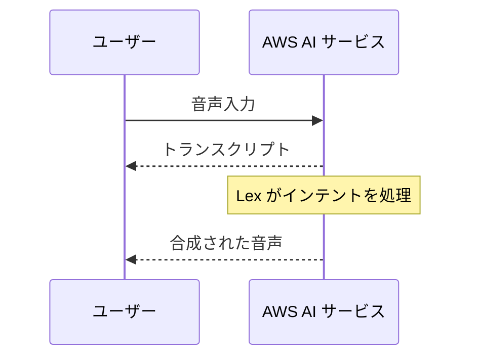
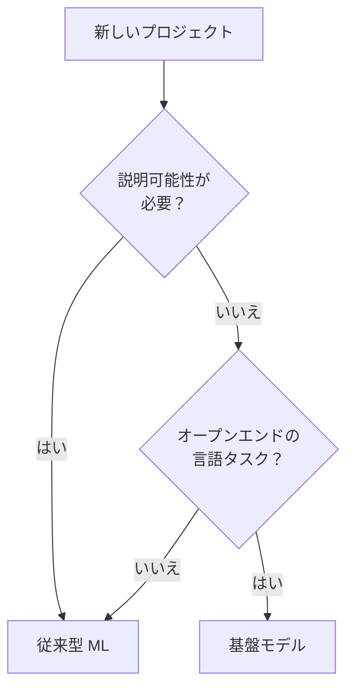

## タスクステートメント 1.2: AI の実践的なユースケースの特定

AI と ML の存在を知るだけでは、ビジネスプロフェッショナルがそれらを効果的に活用するには不十分です。本質的な問いは「どこで代替手段より良い結果をもたらし、どこではそうでないか」です。タスクステートメント 1.2 はその問いに答えます。理論から実践へと移行し、ビジネス問題のカテゴリを適切な AI 技術にマッピングし、エンジニアリングの負担を軽減する AWS マネージドサービスのカタログを作成し、v1.1 の新しい意思決定ポイントとして「基盤モデルより従来型 ML モデルが適切な場合はいつか」を紹介します。ここでカバーする目標は 1.2.1 から 1.2.6 です。[^102001]

### 1.2.1 AI/ML が価値を提供する場所の認識

AI と ML がよりシンプルな代替手段を凌ぐほとんどの状況を定義する 3 つのビジネスニーズのカテゴリがあります。人間の意思決定の支援、ソリューションのスケーラビリティの実現、反復タスクの自動化です。これらは相互に排他的ではなく、多くの本番デプロイメントは 3 つすべてを組み合わせています。ただし、各カテゴリをそれ自体の観点から理解することで、ステークホルダーへの AI 提案のフレームを組みやすくなります。

**人間の意思決定の支援** は ML がもたらす最も古く、おそらく最も持続性のある価値です。モデルは意思決定者に取って代わるのではなく、人間が検討すべき選択肢の範囲を絞り込み、各選択肢に確率的な根拠を付与します。例えば、住宅ローンの引受担当者はローン申請を評価する際に多数のシグナルをレビューします。過去のローンパフォーマンスでトレーニングされた ML モデルは、これらのシグナルを予測的な重みでランク付けし、通常のパターンから外れた申請にフラグを立てることができます。これにより引受担当者は最も重要なところに注意を集中できます。人間は説明責任と権限を保持し、モデルは認知負荷と大量のフィーチャーセットに埋もれたシグナルを見逃す可能性を軽減します。[^102002]

**ソリューションのスケーラビリティ** は、クラウドエコノミクスに最も直接的に合致する機能です。開発者によって書かれた決定論的なルールエンジンは、ビジネスロジックが複雑になりすぎて手動でルールを維持することがビジネスの変化よりも遅くなる際に上限に達します。ML モデルは成果でトレーニングされ、異なる方法でスケールします。入力量が増えても、モデルはその出力を再現するのに必要だったビジネスルールの数に関わらず、同じ推論計算を実行します。毎秒 1 万件の決済トランザクションをスコアリングする不正検出モデルは、毎秒 100 件をスコアリングするものと比較して追加のエンジニアリング工数を必要としません。変化するのはコンピュートリソースだけであり、AWS では弾力的です。[^102003]

**自動化** は、以前は人間の時間を必要としていたタスクに ML 推論を代替することをカバーします。文書の分類、製造ラインでの画像品質検査、感情分析に基づくコールセンターのルーティングはすべてその例です。自動化の価値は、タスクが反復的で、量が多く、許容可能なエラー率が明確に理解されており、エラーのコストが壊滅的ではなく回復可能な場合に最も明確です。自動化とは無人操作を意味しません。ほとんどの本番 AI 自動化システムには、モデルが低い信頼度を割り当てるケースのための人間のレビューパスが含まれています。[^102004]

*図 1.2.1: AI/ML のビジネス価値の 3 つの主要ドライバー。この図は、異なるビジネス的プレッシャーが、それぞれ独自の運用パターンを持つ別々の AI 価値カテゴリにどのようにマッピングされるかを示しています。*

試験問題にはあまり頻繁に登場しないが注目すべき 2 つのカテゴリがあります。*ソリューションのパーソナライゼーション* は ML を適用して、行動履歴に基づいて個々のユーザーにコンテンツ、オファー、またはワークフローを調整します。これは小売とメディアで特に一般的です。*予知保全* は機器のセンサーデータに時系列モデルを適用し、故障が発生する前に確率にフラグを立て、メンテナンスチームがダウンタイムへの対応ではなくスケジュールに基づいて行動できるようにします。

### 1.2.2 AI/ML ソリューションが適切でない場合

試験はこの目標を高得点が期待できるものとして扱っており、その理由は実践的なものです。AI を無差別に適用する組織は予算を無駄にし、時に害を引き起こします。4 つの条件が AI が誤った選択であることを確実に示します。

**コスト便益の不一致** は実際のプロジェクトで最も一般的な失格要因です。ML モデルの構築と維持には、データのラベリング、トレーニング実行、インフラストラクチャ、モデルモニタリング、および基礎となる分布が変化するにつれての定期的な再トレーニングが必要です。1 日に少数のレコードに影響するビジネス問題や、狭く予測可能な範囲内で変動する成果については、単純なルックアップテーブルや 20 行の決定スクリプトの方が構築が速く、運用コストが低く、監査も容易です。損益分岐点は量と複雑さに依存しますが、原則は一貫しています。ML システムの開発・運用コストが合理的な計画期間にわたって返す価値を超える場合、よりシンプルなソリューションが正しいです。[^102005]

**決定論的アウトカム要件** は、ビジネスまたは規制プロセスが確率的推定ではなく、特定の入力に対して特定の再現可能な回答を要求する場合に生じます。税計算、規制適格性チェック、および契約上の請求フォーミュラはこのカテゴリに該当します。ML モデルは学習された分布から引き出された出力を生成します。モデルが再トレーニングされた場合、同じ入力が異なるスコアを受けることがあり、モデルはルールから逸脱しないことを保証できません。ルールベースのシステムは正確な再現性を保証します。「条件が Y の場合、答えは常に X でなければならない」という要件がある場合、ML は適切なツールではありません。[^102006]

**データが少ないシナリオ** は、教師あり学習の核心的な要件を損ないます。現実世界のバリエーションをカバーするために必要な数より少ないレコードでトレーニングされたモデルは、汎化の精度が低くなります。閾値は技術と問題のタイプによって異なりますが、大まかな目安として、教師あり分類はクラスあたり少なくとも数百のラベル付きサンプルが必要であり、回帰はフィーチャー空間にわたる意味のあるバリエーションを持つ数千のレコードで恩恵を受けます。新しい製品ライン、最近取得したデータソース、またはまれなイベントタイプに ML を適用したい組織は、しばしば信頼性の高いモデルをトレーニングするための十分なデータをまだ持っていないと気づきます。[^102007]

**シンプルなルールベースの問題** は、入力を出力にマッピングするロジックが、4 つまたは 5 つのレベルより深くない決定ツリーで明確に述べられる状況です。人間の専門家が 1 つの午後のうちにすべてのケース、条件、および正しい出力を列挙できる場合、それらのルールが時間の経過とともに安定している場合は、それらを明示的にエンコードする方が、モデルをトレーニングするよりも監査可能性が高く、説明可能性が高く、低コストです。購入日と商品カテゴリに基づく顧客の返品資格は古典的な例です。ルールは既知であり、固定されており、手動で維持するのに十分少ないです。

*図 1.2.2: AI/ML の適切性の 2 つの概要チェック。最初のゲートはコスト便益または決定論のテストに失敗したプロジェクトをフィルタリングします。2 番目はデータが不足しているか安定したルールが既にあるプロジェクトをフィルタリングします。プロジェクトはよりシンプルなアプローチよりも AI/ML を正当化するために両方のゲートをクリアする必要があります。*

試験の文言にはあまり直接的に登場しないが言及する価値のある 2 つの追加考慮事項があります。*倫理的・規制的制約* は、特に信用スコアリング、採用、臨床診断などの高リスクドメインで確率的モデルが動作できる場所を制限する場合があります。*レイテンシ制約* は、アプリケーションが一桁のミリ秒で応答を必要とする場合に重要です。特定の複雑なモデルはそれ以上の推論時間を必要とし、ハードコードされた決定パスが SLA を満たす唯一のオプションである場合があります。

### 1.2.3 適切な AI/ML 技術の選択

適切な技術の選択は、トレーニングデータで利用可能なラベルシグナルの性質から始まります。3 つの基本的な教師ありおよび教師なし技術が試験目標に明示的に登場します。2 つの追加技術が目標に短い言及として登場します。

**回帰** は、入力フィーチャーセットが与えられた際に、連続した数値出力を予測します。[^102008] モデルは、期待収益、機器が故障するまでの時間、特定の場所と時間の気温など、範囲内の任意の値を取ることができるターゲット変数とフィーチャーの関係を学習します。店舗の場所別に週間売上高を予測する小売チェーンは回帰を使用しています。出力はカテゴリではありません。ビジネスが在庫や人員計画で直接行動できる数値です。

**分類** は、入力を有限のカテゴリセットの 1 つに割り当てます。[^102009] カテゴリセットに 2 つのメンバーがある場合、問題は*二項分類*です。3 つ以上ある場合は*多クラス分類*です。スパム検出（スパムかどうか）、ローンデフォルト予測（デフォルトかどうか）、画像ラベリング（猫、犬、または鳥）はすべて分類問題です。モデル出力は通常、各クラスの確率スコアであり、アプリケーションが最も高いスコアを持つクラスを選択します。場合によっては、低信頼度の予測を人間のレビュアーにルーティングする信頼度閾値と組み合わせます。

**クラスタリング** は、事前定義されたラベルなしに、類似性によってレコードをグループ化します。[^102010] ラベル付きのターゲット変数が存在しないため、クラスタリングは教師なし技術です。モデルはアナリストが事前に指定しなかったデータの構造を発見します。顧客セグメンテーションは古典的な例です。購買履歴、閲覧行動、人口統計信号が与えられた場合、モデルはマーケティングチームが異なるキャンペーンを設計できる 5 つの異なる顧客アーキタイプを識別するかもしれません。異常検出は関連する応用です。どのクラスターにもしっかりフィットしないレコードは異常としてフラグが立てられます。

2 つの追加技術は試験目標にそれらを名指ししているため簡単に言及する価値があります。*次元削減* は高次元フィーチャー空間をより少ない次元に圧縮し、コンピュートコストを削減し、相関のある不要なフィーチャーを削除することで下流モデルのパフォーマンスを向上させる場合があります。*異常検出* は正常な動作の学習された分布から大幅に逸脱するデータポイントを特定します。一部の分類モデルがこの目的に適応されていても、これは分類とは異なるフレーミングです。

*表 1.2.1: 問題タイプ別の ML 技術選択*

| 技術 | 入力ラベル | 出力タイプ | 代表的なビジネス例 |
|-----|----------|----------|-----------------|
| 回帰 | 必要（数値ターゲット） | 連続した数値 | 需要予測、価格予測 |
| 二項分類 | 必要（二クラス） | クラス＋確率 | 不正フラグ、離脱予測 |
| 多クラス分類 | 必要（多クラス） | クラス＋確率 | 文書ルーティング、欠陥カテゴリ |
| クラスタリング | 不要 | クラスター割り当て | 顧客セグメンテーション、トピック発見 |
| 異常検出 | オプション | 異常スコア | ネットワーク侵入、センサー障害 |

*図 1.2.3: ML 技術選択の決定ツリー。主要な分岐は教師ありと教師なしの問題を分離し、教師ありの分岐はターゲット変数の性質によって分離します。*

**Amazon SageMaker AI** は、組み込みアルゴリズムとそれがホストする広範なフレームワークエコシステムを通じて、表 1.2.1 のすべての技術をサポートしています。[^102011] データサイエンスのスタッフがいないチームには、SageMaker AI 内の AutoML 機能が、ラベル付きデータセットが与えられた場合にアルゴリズムを自動的に選択・調整できるため、技術の選択は研究上の問題ではなくガイド付きの設定タスクになります。

### 1.2.4 現実世界の AI 応用

試験目標 1.2.4 は、v1.0 に存在した 6 つのカテゴリに加えて、ナレッジベースとエージェント型 AI を含めるよう v1.1 で拡張されました。これらの 8 つのカテゴリは、試験が候補者に認識を求める可能性のある完全な範囲を表しています。

**コンピュータビジョン** システムは、画像やビデオフレームを解釈して構造化された情報を抽出します。[^102012] オブジェクト検出は画像内の特定のアイテムを識別・定位し、画像分類は画像全体にラベルを割り当て、光学文字認識はスキャンから印刷または手書きのテキストを読みます。物流会社はコンベアベルト上のパッケージラベルを読み取り、人間の介入なしにルーティングするためにコンピュータビジョンを使用します。小売チェーンは棚スキャンカメラを使用して製品が在庫切れになった際を検出します。**Amazon Rekognition** はコンピュータビジョン向けの AWS マネージドサービスで、オブジェクトとシーン検出、テキスト認識、顔分析のための事前トレーニング済みモデルを提供し、個別の画像とビデオストリームの両方を受け付けます。[^102013]

**自然言語処理（NLP）** は、システムが非構造化テキストから意味を導き出すことを可能にします。[^102014] 感情分析はテキストが肯定的、否定的、または中立の感情を表現しているかを判断します。エンティティ認識はドキュメントから製品名、場所、人物などの固有表現を抽出します。トピックモデリングはテーマ別にドキュメントのコレクションをグループ化します。カスタマーサクセスチームは毎晩サポートチケットに対して感情分析を実行し、製品の不満がエスカレートする前に新たな傾向を特定します。**Amazon Comprehend** は主要な AWS マネージド NLP サービスであり、感情分析、エンティティ認識、キーフレーズ抽出、およびカスタム分類を提供しています。[^102015]

**音声認識** は音声オーディオをテキストに変換し、音声インターフェース、会議の書き起こし、およびコール分析を可能にします。[^102016] 本番環境の課題は、多様なアクセント、背景ノイズ、ドメイン固有の語彙、およびリアルタイムのレイテンシ制約に対応することです。**Amazon Transcribe** はオーディオをテキストに変換し、カスタム語彙、話者識別、およびリアルタイムとバッチモードでの自動句読点をサポートしています。[^102017]

**レコメンデーションシステム** は、行動履歴とコンテキストシグナルが与えられた場合に、ユーザーが最もエンゲージする可能性が高いアイテムを予測します。[^102018] EC サイトは、顧客が以前に参照・購入したものに基づいて製品を推薦します。ストリーミングサービスは視聴履歴と評価に基づいてコンテンツを推薦します。基礎となる技術は通常、類似した行動を持つユーザーを識別し、グループ全体に好みを転送する協調フィルタリング、またはユーザーが以前にエンゲージしたアイテムに類似した属性を持つアイテムをマッチングするコンテンツベースフィルタリングです。**Amazon Personalize** は、アプリケーションチームから ML の専門知識を必要とせずに、トレーニング、デプロイ、およびリアルタイムサービングパイプラインを処理するマネージドレコメンデーションサービスです。[^102019]

**不正検出** は、正規の動作の学習されたパターンから逸脱するトランザクションやアカウントアクティビティを識別します。[^102020] 銀行は決済承認ステージで不正検出を適用し、各トランザクションをリアルタイムでスコアリングし、リスク閾値を超えるものを拒否またはフラグします。保険会社は払い戻しのために提出されたクレームに適用します。不正パターンは継続的に進化し、モデルは新しい不正戦術が現れるにつれて再トレーニングできるため、ML アプローチは静的ルールより優れています。基礎となる技術は多くの場合、その上に異常検出レイヤーを持つ二項分類です。**Amazon Fraud Detector** は、このパターンをパッケージ化した AWS マネージドサービスで、オンライン不正、トランザクション不正、アカウント乗っ取りのための事前構築済みモデルを持っています。

**予測** は、製品需要、エネルギー消費、コールセンターの人員要件など、時系列変数の将来の値の予測を生成します。[^102021] 入力はターゲット変数の歴史的な観測値に加え、モデルが精度を向上させるために使用できるオプションの*関連時系列*（プロモーション、祝日、天気など）です。**Amazon Forecast** は、統計的およびディープラーニングアルゴリズムの中から自動的に選択し、*分位数予測*（例えば p50 と p90 の需要レベル）を計算し、下流消費のために Amazon S3 に結果を書き出すマネージド予測サービスです。[^102022]

**ナレッジベース** は、AI システムが推論時にクエリして、モデルの重みにエンコードされたパターンだけに頼るのではなく、検証済みのコンテンツに基づいた回答を提供するための情報の構造化されたストアです。[^102023] 金融サービス会社のナレッジベースには、規制ドキュメント、製品仕様、承認済み回答テンプレートが含まれる場合があります。顧客が AI アシスタントを通じて質問すると、システムはナレッジベースから関連するセクションを取得し、事実に基づいた回答を策定するために使用します。このパターンは正式に*検索拡張生成（RAG）*と呼ばれ、本書のドメイン 3 で詳しく説明します。**Amazon Kendra** は多くのナレッジベース実装を支えるマネージドエンタープライズ検索サービスであり、ドキュメントリポジトリにインデックスを付け、自然言語クエリに応じて関連する段落を返します。[^102024]

**エージェント型 AI** は、1 つ以上の AI モデルが外部システムと対話するためにツールと API を呼び出し、複数ステップのタスクを自律的に計画・実行するシステムを説明します。[^102025] 単一エージェントシステムはエンドツーエンドのカスタマーサービスワークフローを処理するかもしれません。顧客のリクエストを解釈し、CRM でアカウント情報を検索し、製品在庫を確認し、解決策を下書きし、確認メールを送信することを、人間のオペレーターなしにすべて行います。マルチエージェントシステムは専門エージェント全体にサブタスクを分散させます。オーケストレーターエージェントが作業を割り当て、サブエージェントがそれを実行し、オーケストレーターが結果を取りまとめます。エージェント型 AI のビジネス応用には、IT オペレーション（アラートを監視し、根本原因を診断し、ランブックから修正を適用するエージェント）、文書処理（請求書を読み取り、行項目を抽出し、ERP に入力するエージェント）、顧客オンボーディング（必要な書類を収集し、検証し、アカウントプロビジョニングをトリガーするエージェント）が含まれます。

**Amazon Bedrock AgentCore** は本番エージェント型 AI ワークロードの AWS マネージドランタイムであり、基盤モデル上に構築されたエージェントのためのメモリ管理、ツールオーケストレーション、およびセッション永続性を提供します。[^102026] エージェント型アプリケーションを開発するチームには、**Strands Agents** がマルチエージェントの構成を簡素化するオープンソース SDK であり、**Amazon Bedrock** エージェントは Lambda 関数または API スキーマとして定義されたアクショングループに基盤モデルを接続する完全マネージドオーケストレーションレイヤーを提供します。[^102027]

*図 1.2.4: 現実世界の AI アプリケーションカテゴリと各を実装する主要な AWS マネージドサービス。不正検出は実装アプローチに応じて複数のサービス（Amazon Fraud Detector と SageMaker AI）にまたがるため表示されていません。*

### 1.2.5 AWS マネージド AI/ML サービス

AWS マネージド AI サービスは、API を通じて事前トレーニング済みの機能を提供することで、社内モデル開発の要件を取り除きます。試験目標 1.2.5 では 6 つのサービスを明示的に名指しし、範囲内のサービスリストには実際に使用され試験の誤答選択肢として登場する 4 つのサービスが追加されています。

6 つの名指しされたサービスは機能別に整然と分かれています。**Amazon SageMaker AI** は、あらゆるスケールでカスタムモデルを構築、トレーニング、デプロイするためのエンドツーエンドの ML プラットフォームです。[^102028] これは事前トレーニング済みサービスではなく、ML ライフサイクルのすべての段階でインフラストラクチャを処理するマネージド環境です。汎用的な事前トレーニング済み API ではなく、自社データでトレーニングされたモデルを必要とするチームは SageMaker AI から始めます。**Amazon Transcribe** は音声をテキストに変換し、オーディオを取り込む必要があるあらゆるワークフローの基盤です。[^102029] **Amazon Translate** は幅広い言語ペアにわたってニューラル機械翻訳を提供し、コンテンツのローカライゼーション、リアルタイムの多言語チャット、バッチ文書翻訳をサポートしています。[^102030] このセクションで先に紹介した Amazon Comprehend は、Amazon Transcribe が生成するトランスクリプトに対してテキスト分析ステージを処理します。[^102031] **Amazon Lex** は自然言語のインテントを理解しダイアログ状態を管理する会話型インターフェースを構築し、音声チャンネルの応答のためにテキストを生き生きとした音声に変換する **Amazon Polly** と統合しています。[^102032][^102033]

4 つの追加のスコープ内サービスが試験問題と現実のアーキテクチャで定期的に登場します。**Amazon Rekognition** はオブジェクト検出、テキスト認識、コンテンツモデレーションを含む画像・動画分析を処理します。[^102034] **Amazon Textract** は光学文字認識を超え、スキャンされた文書からフォームフィールドやテーブル値などの構造化データを抽出します。[^102035] **Amazon Personalize** は顧客が提供したインタラクションデータでトレーニングされた個人化された推薦を提供します。[^102036] **Amazon Kendra** は内部ドキュメントにインデックスを付け自然言語の質問に応じて関連する段落を返すエンタープライズ検索サービスで、ナレッジベースアーキテクチャの検索レイヤーとして機能します。[^102037]

*表 1.2.2: 機能別にグループ化された AWS マネージド AI/ML サービス*

| 機能 | サービス | 主要機能 |
|-----|---------|---------|
| カスタムモデル開発 | Amazon SageMaker AI | カスタム ML モデルの構築、トレーニング、デプロイ |
| 音声からテキストへ | Amazon Transcribe | 話者 ID 付き自動音声認識 |
| テキストから音声へ | Amazon Polly | 複数の音声にわたるニューラルテキスト読み上げ |
| 言語翻訳 | Amazon Translate | ニューラル機械翻訳、バッチとリアルタイム |
| テキスト分析 | Amazon Comprehend | 感情、エンティティ、キーフレーズ、カスタム分類 |
| 会話型 AI | Amazon Lex | インテント認識とダイアログ管理 |
| コンピュータビジョン | Amazon Rekognition | オブジェクト検出、テキスト認識、コンテンツモデレーション |
| 文書データ抽出 | Amazon Textract | 文書からの構造化フィールドとテーブル抽出 |
| 推薦 | Amazon Personalize | リアルタイム個人化推薦 |
| エンタープライズ検索 | Amazon Kendra | 内部ドキュメントリポジトリへの自然言語検索 |

一般的な試験の落とし穴は、重複する表面領域を持つサービスを混同することです。**Amazon Transcribe** はテキストトランスクリプトを生成します。**Amazon Comprehend** はそのトランスクリプトを意味のために分析します。**Amazon Lex** はリアルタイムで会話のインテントを理解します。**Amazon Polly** は応答を読み上げます。**Amazon Textract** はスキャンされたページから構造化データを読み取ります。**Amazon Rekognition** は同じ画像のオブジェクトとシーンを検出します。これらのペアはアーキテクチャの質問で一緒に登場することが多く、どのサービスがどのステージに属するかを知ることが正しい答えを選択する鍵です。

*図 1.2.5: 概念的な音声チャンネルのフロー。ユーザーはオーディオを転記し、インテントを解釈し、口頭の返答を合成する AWS AI サービスのチェーンに話しかけます。具体的なサービスハンドオフ（Transcribe から Lex、Comprehend、Polly へ）は前述の段落で説明されています。*

### 1.2.6 従来型 ML と基盤モデルの比較

目標 1.2.6 は v1.1 で新しく追加されました。これはすべての AI チームが今直面している実践的な問いを反映しています。基盤モデル（FM）は適切なツールで、従来型 ML モデルをゼロから構築・トレーニングする方が良い選択はいつですか？[^102038] この決定はどちらのオプションの洗練さについてではありません。適合性についてです。利用可能なデータの特性、必要なアウトプット、規制環境、および運用予算を、各アプローチの機能に合わせることです。

**従来型 ML モデル** は、特定の明確に限定されたタスクのためにラベル付きデータでトレーニングされます。フィーチャーの重要性と決定ロジックを抽出・監査できるという意味で完全に解釈可能です。通常は控えめなハードウェアで一桁のミリ秒という低いレイテンシで推論を実行します。計算コストは予測可能で多くの場合低いです。ドメインラベル付きトレーニングデータが必要で、取得にコストがかかる場合がありますが、一度トレーニングされると継続的なトークンベースのコンピュートチャージはありません。[^102039]

**基盤モデル** は広範な汎用コーパスで事前トレーニングされており、最小限の追加設定で幅広い言語およびマルチモーダルタスクを処理できます。[^102040] 自然言語の理解、コンテンツ生成、コード合成、または緩やかに関連するトピックにわたる推論を必要とするタスクに優れています。再トレーニングなしに、会話的なプロンプトを受け付け、指示に基づいて動作を調整します。コストモデルは通常トークンベースです。すべての推論呼び出しは入力と出力のトークン数によって価格が決まります。レイテンシは従来型 ML より高く、通常は数百ミリ秒から秒の範囲です。

*表 1.2.3: 従来型 ML と基盤モデルの決定基準*

| 基準 | 従来型 ML | 基盤モデル |
|-----|----------|----------|
| タスクの範囲 | 単一の明確に定義されたタスク | 幅広いまたは一般的なタスク |
| トレーニングデータ | ドメインラベル付きデータセットが必要 | 事前トレーニング済み。プロンプトまたはファインチューニング |
| 説明可能性 | 高い。フィーチャーの重要性が利用可能 | 低い。創発的な推論 |
| レイテンシ | 低い（一桁のミリ秒） | 高い（数百ミリ秒から秒） |
| 推論コスト | 予測可能。トークン単位の課金なし | トークンベース。入力長によって変動 |
| 規制への適合 | 強い。完全な監査可能性 | 弱い。アウトプットのばらつきが懸念 |
| マルチモーダルサポート | トレーニングされたモダリティに限定 | 幅広い（モデルによってテキスト、画像、音声） |
| 高量の単一タスク | 高い。水平にスケール | 低い。量に応じてトークンコストが増加 |

4 つの条件が従来型 ML モデルの選択を強く支持します。第一に、規制やコンプライアンス要件が完全に監査可能で再現可能な決定パスを要求しています。例えば銀行規制下の信用リスクスコアリングは、通常、個々の決定を説明する能力を必要とし、勾配ブースティングツリーまたはロジスティック回帰モデルが規制当局が受け入れる形式でその説明を提供できます。[^102041] 第二に、予測タスクには単一の明確に定義された出力（数値、カテゴリ、またはスコア）があり、汎用的な推論なしに許容可能な精度に達するための十分なラベル付きトレーニングデータがあります。第三に、レイテンシとコストが厳しく制約されており、アプリケーションは高い量で実行され、1 セントの一部で推論をミリ秒以内に返す必要があります。第四に、組織にはトレーニングと再トレーニングパイプラインを管理するための十分な ML エンジニアリング能力があります。

4 つの条件が基盤モデルを支持します。第一に、タスクが一貫した文章の生成、曖昧な質問についての推論、または複数のソースからの情報の統合を必要としており、これらは従来型 ML モデルが提供できない機能です。第二に、組織にはラベル付きトレーニングデータがほとんどなく、プロンプトとして表現できる明確に定義されたタスクの説明へのアクセスがあり、フューショットまたはゼロショット推論が実行可能です。第三に、ユースケースは会話的で、モデルは明示的な状態管理ロジックなしに複数のターンにわたってコンテキストを維持する必要があります。第四に、アプリケーションの量はトークンベースのコストが許容可能なほど低いか、タスクが十分にユニークで汎用モデルが専用モデルの構築コストを分散させます。

*図 1.2.6: 従来型 ML モデルと基盤モデルを選択するための決定フロー。規制要件とタスクタイプが 2 つの主要フィルターです。レイテンシとデータの可用性が選択を洗練させます。*

NIST AI リスク管理フレームワークと EU AI 法はどちらも、高リスクな決定に使用される AI システムにトレーサビリティ要件を課しています。[^102042] 実際には、これらのフレームワークの対象となる組織はハイブリッドパターンを採用することが多いです。従来型 ML モデルがコアな予測タスクを処理して監査可能な出力を生成し、基盤モデルが非構造化ドキュメントから決定の顧客向け説明の生成や裏付け証拠の要約などの隣接する言語タスクを処理します。

2 つのアプローチの境界は動いています。**Amazon Bedrock** 内の AWS モデル蒸留機能により、チームは大きな基盤モデルから特定のタスクに調整された、より小さく、より速く、より安価なモデルに推論動作を転送できます。[^102043] 結果は、その狭いドメイン内では基盤モデルのように動作しながら、従来型 ML モデルに近いコストとレイテンシプロファイルで実行するモデルです。この技術は目標 3.1.5 に登場し、2 つのカテゴリの橋渡しとしてここで注目する価値があります。

**このセクションがカバーした内容：** タスクステートメント 1.2 では、AI と ML が価値を追加する場所を認識する方法、それらを避ける場合、問題タイプに技術をマッチングさせる方法、および各アプリケーションカテゴリを処理する AWS マネージドサービスを確立しました。また、従来型 ML モデルと基盤モデルを選択するための新しい v1.1 の決定フレームワークを紹介しました。続くタスクステートメント 1.3 では、AI/ML 開発ライフサイクルのエンドツーエンドをカバーし、各ステージをサポートする AWS サービスにマッピングします。

## セルフチェック問題

**問題 1**

小売会社は 1 日 50,000 件の顧客サポートメールを処理しており、各メールをそのトピックに基づいて正しい部門にルーティングする必要があります。会社には、正しい部門でラベル付けされた 12 か月分の歴史的なメールがあります。この問題に最もよく適合するアプローチはどれですか？

A. 最も高いスコアがルーティングを決定するため、モデルは各部門のスコアを予測する必要があるから、回帰。

B. 出力がいくつかの事前定義された部門の 1 つであり、ラベル付きデータが利用可能なため、多クラス分類。

C. データが多すぎて手動でラベル付けできず、部門がまだ定義されていないため、クラスタリング。

D. ラベル付きデータでファインチューニングを不要にし、プロンプティングがより簡単であるため、ゼロショットプロンプティングを用いた基盤モデル。

12 か月のラベル付きメールと固定の既知の部門セットがあるため、これは教科書的な多クラス分類問題です。ラベル付きデータは従来型 ML モデルのトレーニングに十分であり、出力は有限の数のカテゴリの 1 つであり、量（1 日 50,000 件）はトークンベースの FM 推論よりもトレーニング済み分類器の予測可能なコストと低レイテンシを好ましくします。回帰は連続した数値を予測し、カテゴリを予測しません。クラスタリングは部門が不明であるかラベルがない場合に適切ですが、どちらの条件もここでは当てはまりません。ゼロショットプロンプティングを使用した基盤モデルはテキストを分類できますが、1 日 50,000 件のメールではトークンコストが急速に積み上がり、レイテンシはトレーニング済み分類器より高くなります。ラベル付きデータは破棄するのではなく、専用モデルをトレーニングするために使用するべきです。[^102044]

**問題 2**

金融サービス会社は、どの入力フィーチャーが最も結果に影響したかを含め、すべての融資決定を規制当局に説明しなければなりません。会社は従来型 ML モデルを使用するか基盤モデルを使用するかを評価しています。どの要因が従来型 ML アプローチを最も強く支持しますか？

A. 会社には過去のローン申請からの大量のラベル付きトレーニングデータがある。

B. 説明可能性と監査可能な決定ロジックに関する規制要件。

C. 推論レイテンシ要件はリクエストあたり 200 ミリ秒未満である。

D. 会社は推論コストを管理するためにトークンベースの価格を避けたい。

規制の説明可能性がここでは決定的な要素です。ロジスティック回帰や勾配ブースティングツリーなどの従来型 ML モデルは、監査要件を満たすフィーチャーの重要性スコアと決定パスを公開します。基盤モデルは、規制当局が受け入れる形式で特定のフィーチャーに帰属させることが難しい創発的な推論を通じて出力を生成します。ラベル付きトレーニングデータの存在（A）は従来型 ML をサポートする要素ですが、規制要件と比較して最も強い差別化要因ではありません。200ms 以下のレイテンシ（C）は従来型 ML モデルが達成しますが、多くの基盤モデルのデプロイもこの閾値を達成します。トークンベースの価格（D）はコスト上の考慮事項ですが、規制コンプライアンスほど縛りはありません。[^102045]

**問題 3**

製造会社は、毎分収集されるセンサーデータに基づいて、今後 72 時間以内に故障する可能性の高い生産フロアの機械を特定したいと考えています。モデルは静的なルールではなく予測を返す必要があります。ラベル付きの故障履歴はありません。最も適切な ML アプローチはどれですか？

A. 故障イベントでラベル付けされた歴史的センサーデータを使用した二項分類。

B. 過去のメンテナンス呼び出し数をターゲット変数として使用した回帰。

C. センサー時系列の教師なし異常検出で、各機械の学習された正常プロファイルから逸脱する読み取りにフラグを立てる。

D. 故障の深刻さを低、中、高に分類する多クラス分類。

ラベル付きの故障履歴がなければ、教師ありアプローチ（A、B、D）は直接適用できません。教師なし異常検出は各機械のセンサー読み取りの正常なパターンを学習し、そのパターンからの逸脱にフラグを立てます。AWS では、**Amazon SageMaker AI** がこのスタイルの時系列異常検出のためにまさに Random Cut Forest と DeepAR を提供しており、結果の異常スコアが故障リスクの教師なしプロキシとして機能します。二項分類（A）はラベルが利用可能になったときの理想的なアプローチであり、組織は将来の教師ありモデルトレーニングのためにラベル付きの故障イベントを収集する計画を立てるべきです。回帰（B）には数値ターゲット変数が必要です。過去のメンテナンス呼び出し数はプロキシですが、特定のウィンドウ内の将来の故障を直接予測しません。多クラス分類（D）も存在しない深刻度カテゴリのラベルが必要です。[^102046]

**問題 4**

企業が団体交渉協定に基づいて従業員のボーナスの計算を自動化する AI ソリューションを評価しています。フォーミュラは協定で正確に規定されており、同じ職務グレードのすべての従業員に同一に適用され、5 年間変更されていません。最も適切な判断はどれですか？

A. 各従業員がどのボーナス層に属するかを決定するために分類モデルを実装する。

B. 給与とパフォーマンスデータからボーナス金額を予測するために回帰モデルを実装する。

C. AI/ML を使用しない。アウトカムは正確で再現可能でなければならないため、フォーミュラを決定論的なコードとして実装する。

D. 協定のテキストを解釈して適切なボーナスを計算するために基盤モデルを使用する。

これは決定論的アウトカムのシナリオです。ボーナス計算は確率的要素のない固定フォーミュラです。同じ入力は常に同じ出力を生成し、分散はありません。ルールベースまたはフォーミュラの実装は正確な再現性を保証し、簡単に監査できます。分類モデル（A）は確率推定を導入し、協定内の正確な境界条件が尊重されることを保証できません。回帰モデル（B）は学習されたパターンから連続した値を予測しますが、正しい値はすでにフォーミュラで指定されています。ここで ML を使用すると、利益なしに複雑さが増します。基盤モデル（D）はテキストを解釈できますが、算術的な正確さを保証せず、FM の機能を必要としないタスクにレイテンシとコストをもたらします。[^102047]

**問題 5**

テクノロジー会社が 15 の言語で質問を処理でき、複数ターンにわたって会話コンテキストを維持し、会社の内部製品ドキュメントから引き出した個人化された応答を生成できるカスタマーサービスアシスタントを構築したいと考えています。会社にはラベル付きの質問回答トレーニングデータはありません。最もよいアプローチはどれですか？

A. 各言語の事前に書かれた回答に質問をルーティングするために多クラス分類モデルをトレーニングする。

B. Amazon Kendra ナレッジベースからの検索と、言語処理のための Amazon Translate と組み合わせた基盤モデルを使用する。

C. ダイアログ管理に Amazon Lex、感情分析に Amazon Comprehend を使用し、基盤モデルなし。

D. 各言語向けに別々の回帰モデルを構築し、それぞれが候補回答の関連性をスコアリングするようにトレーニングする。

このシナリオには、基盤モデルアーキテクチャを支持する 3 つの要件が組み合わさっています。会話型の複数ターンのコンテキスト、内部ドキュメントからのコンテンツ生成、およびラベル付きトレーニングデータなしのマルチ言語サポートです。基盤モデルを Amazon Kendra ナレッジベースに接続することで、検索拡張生成が提供され、会社の実際のドキュメントにモデルの応答を基づかせます。多くの基盤モデルは複数の言語をネイティブに処理しますが、FM の処理が弱い言語については Amazon Translate が補完できます。分類モデル（A）は静的な回答にルーティングできますが、個人化された応答を生成したり複数ターンにわたってコンテキストを維持したりできません。Amazon Lex と Comprehend（C）はダイアログと感情を管理しますが、内部ドキュメントから取得したり新しい応答を生成したりしません。この組み合わせだけでは生成要件を満たしません。回帰モデル（D）は回答候補をスコアリングできますが、新しい応答を生成したり会話状態を維持したりできません。このアプローチは 15 の別々のモデルの構築・維持が必要です。[^102048]

---

[^102001]: AWS Certification: AWS Certified AI Practitioner (AIF-C01) Exam Guide v1.1, Task Statement 1.2. URL: <https://docs.aws.amazon.com/aws-certification/latest/ai-practitioner-01/ai-practitioner-01-domain1.html>
[^102002]: Amazon SageMaker AI Developer Guide: Human-in-the-loop workflows. URL: <https://docs.aws.amazon.com/sagemaker/latest/dg/a2i-use-augmented-ai-a2i-human-review-loops.html>
[^102003]: Amazon SageMaker AI: Model deployment and real-time inference. URL: <https://docs.aws.amazon.com/sagemaker/latest/dg/deploy-model.html>
[^102004]: Amazon Augmented AI (A2I) Developer Guide: What is Amazon A2I? URL: <https://docs.aws.amazon.com/sagemaker/latest/dg/a2i-getting-started.html>
[^102005]: AWS Well-Architected Framework: Machine Learning Lens - Cost optimization pillar. URL: <https://docs.aws.amazon.com/wellarchitected/latest/machine-learning-lens/cost-optimization.html>
[^102006]: NIST AI Risk Management Framework (AI RMF 1.0): Trustworthiness characteristic - Explainability. URL: <https://airc.nist.gov/Home>
[^102007]: Amazon SageMaker AI Developer Guide: Prepare your data. URL: <https://docs.aws.amazon.com/sagemaker/latest/dg/data-prep.html>
[^102008]: Amazon SageMaker AI Developer Guide: Linear Learner algorithm. URL: <https://docs.aws.amazon.com/sagemaker/latest/dg/linear-learner.html>
[^102009]: Amazon SageMaker AI Developer Guide: XGBoost algorithm. URL: <https://docs.aws.amazon.com/sagemaker/latest/dg/xgboost.html>
[^102010]: Amazon SageMaker AI Developer Guide: K-Means algorithm. URL: <https://docs.aws.amazon.com/sagemaker/latest/dg/k-means.html>
[^102011]: Amazon SageMaker AI overview. URL: <https://aws.amazon.com/sagemaker/>
[^102012]: Amazon Rekognition Developer Guide: What is Amazon Rekognition? URL: <https://docs.aws.amazon.com/rekognition/latest/dg/what-is.html>
[^102013]: Amazon Rekognition product page. URL: <https://aws.amazon.com/rekognition/>
[^102014]: Amazon Comprehend Developer Guide: What is Amazon Comprehend? URL: <https://docs.aws.amazon.com/comprehend/latest/dg/what-is.html>
[^102015]: Amazon Comprehend product page. URL: <https://aws.amazon.com/comprehend/>
[^102016]: Amazon Transcribe Developer Guide: What is Amazon Transcribe? URL: <https://docs.aws.amazon.com/transcribe/latest/dg/what-is.html>
[^102017]: Amazon Transcribe product page. URL: <https://aws.amazon.com/transcribe/>
[^102018]: Amazon Personalize Developer Guide: What is Amazon Personalize? URL: <https://docs.aws.amazon.com/personalize/latest/dg/what-is-personalize.html>
[^102019]: Amazon Personalize product page. URL: <https://aws.amazon.com/personalize/>
[^102020]: Amazon Fraud Detector product page. URL: <https://aws.amazon.com/fraud-detector/>
[^102021]: Amazon Forecast Developer Guide: What is Amazon Forecast? URL: <https://docs.aws.amazon.com/forecast/latest/dg/what-is-forecast.html>
[^102022]: Amazon Forecast product page. URL: <https://aws.amazon.com/forecast/>
[^102023]: Amazon Kendra Developer Guide: What is Amazon Kendra? URL: <https://docs.aws.amazon.com/kendra/latest/dg/what-is-kendra.html>
[^102024]: Amazon Kendra product page. URL: <https://aws.amazon.com/kendra/>
[^102025]: Amazon Bedrock User Guide: Agents for Amazon Bedrock. URL: <https://docs.aws.amazon.com/bedrock/latest/userguide/agents.html>
[^102026]: Amazon Bedrock AgentCore product page. URL: <https://aws.amazon.com/bedrock/agentcore/>
[^102027]: Strands Agents SDK on GitHub. URL: <https://github.com/strands-agents/sdk-python>
[^102028]: Amazon SageMaker AI Developer Guide: What is Amazon SageMaker AI? URL: <https://docs.aws.amazon.com/sagemaker/latest/dg/whatis.html>
[^102029]: Amazon Transcribe Developer Guide: Real-time transcription. URL: <https://docs.aws.amazon.com/transcribe/latest/dg/getting-started-streaming.html>
[^102030]: Amazon Translate Developer Guide: What is Amazon Translate? URL: <https://docs.aws.amazon.com/translate/latest/dg/what-is.html>
[^102031]: Amazon Comprehend Developer Guide: Sentiment analysis. URL: <https://docs.aws.amazon.com/comprehend/latest/dg/how-sentiment.html>
[^102032]: Amazon Lex Developer Guide: What is Amazon Lex? URL: <https://docs.aws.amazon.com/lexv2/latest/dg/what-is.html>
[^102033]: Amazon Polly Developer Guide: What is Amazon Polly? URL: <https://docs.aws.amazon.com/polly/latest/dg/what-is.html>
[^102034]: Amazon Rekognition Developer Guide: Detecting objects and scenes. URL: <https://docs.aws.amazon.com/rekognition/latest/dg/labels.html>
[^102035]: Amazon Textract Developer Guide: What is Amazon Textract? URL: <https://docs.aws.amazon.com/textract/latest/dg/what-is.html>
[^102036]: Amazon Personalize Developer Guide: Getting recommendations. URL: <https://docs.aws.amazon.com/personalize/latest/dg/getting-recommendations.html>
[^102037]: Amazon Kendra Developer Guide: Querying an index. URL: <https://docs.aws.amazon.com/kendra/latest/dg/searching-example.html>
[^102038]: AWS Certification: AIF-C01 v1.1 revisions - Objectives added in v1.1, objective 1.2.6. URL: <https://docs.aws.amazon.com/aws-certification/latest/ai-practitioner-01/aif-01-revisions.html>
[^102039]: Amazon SageMaker AI Developer Guide: Training models. URL: <https://docs.aws.amazon.com/sagemaker/latest/dg/how-it-works-training.html>
[^102040]: Amazon Bedrock User Guide: Foundation models in Amazon Bedrock. URL: <https://docs.aws.amazon.com/bedrock/latest/userguide/foundation-models.html>
[^102041]: NIST AI Risk Management Framework AI RMF 1.0 - Govern function: Policies and accountability. URL: <https://airc.nist.gov/Home>
[^102042]: EU Artificial Intelligence Act, Article 13: Transparency and provision of information to users. URL: <https://eur-lex.europa.eu/legal-content/EN/TXT/?uri=CELEX:32024R1689>
[^102043]: Amazon Bedrock User Guide: Model distillation. URL: <https://docs.aws.amazon.com/bedrock/latest/userguide/model-distillation.html>
[^102044]: Amazon SageMaker AI Developer Guide: Multi-class classification. URL: <https://docs.aws.amazon.com/sagemaker/latest/dg/xgboost.html>
[^102045]: Amazon SageMaker Clarify Developer Guide: Explainability. URL: <https://docs.aws.amazon.com/sagemaker/latest/dg/clarify-model-explainability.html>
[^102046]: Amazon SageMaker AI Developer Guide: Random Cut Forest algorithm for time-series anomaly detection. URL: <https://docs.aws.amazon.com/sagemaker/latest/dg/randomcutforest.html>
[^102047]: AWS Well-Architected Machine Learning Lens: Operational Excellence - Model governance. URL: <https://docs.aws.amazon.com/wellarchitected/latest/machine-learning-lens/operational-excellence.html>
[^102048]: Amazon Bedrock User Guide: Knowledge bases for Amazon Bedrock. URL: <https://docs.aws.amazon.com/bedrock/latest/userguide/knowledge-base.html>
