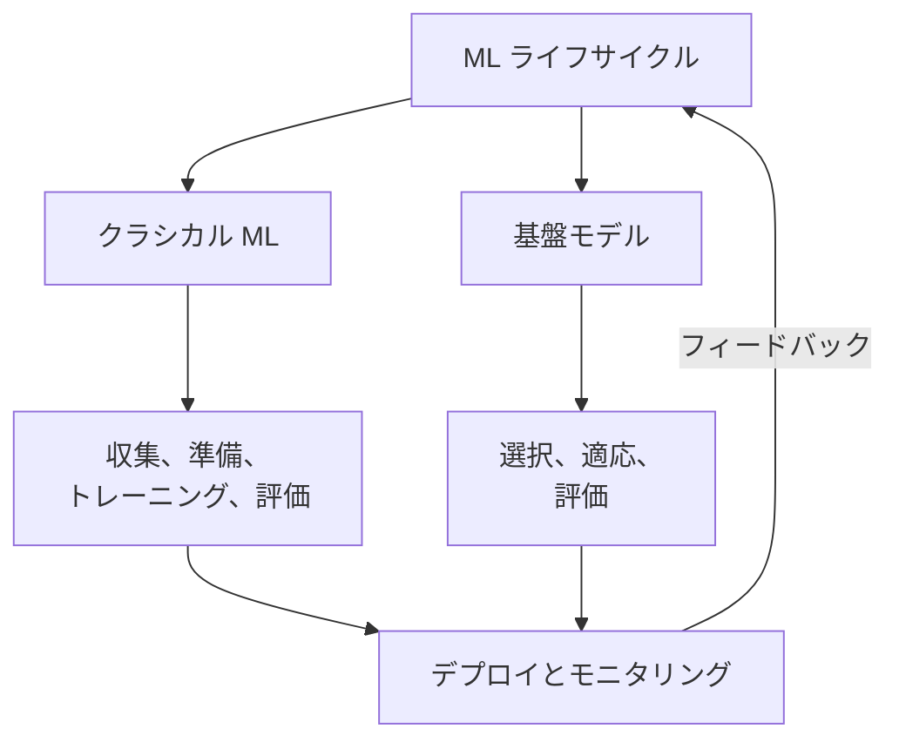
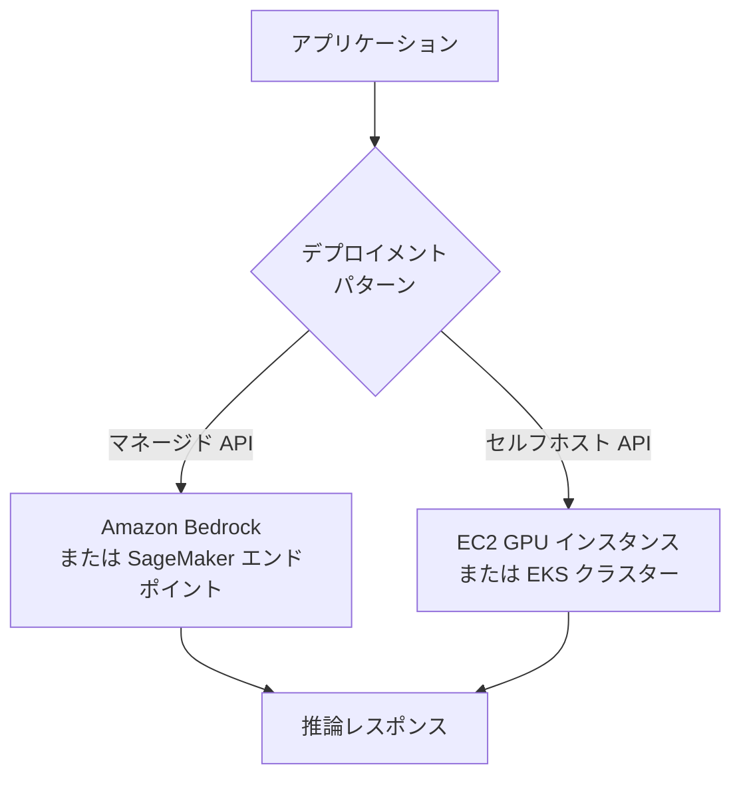
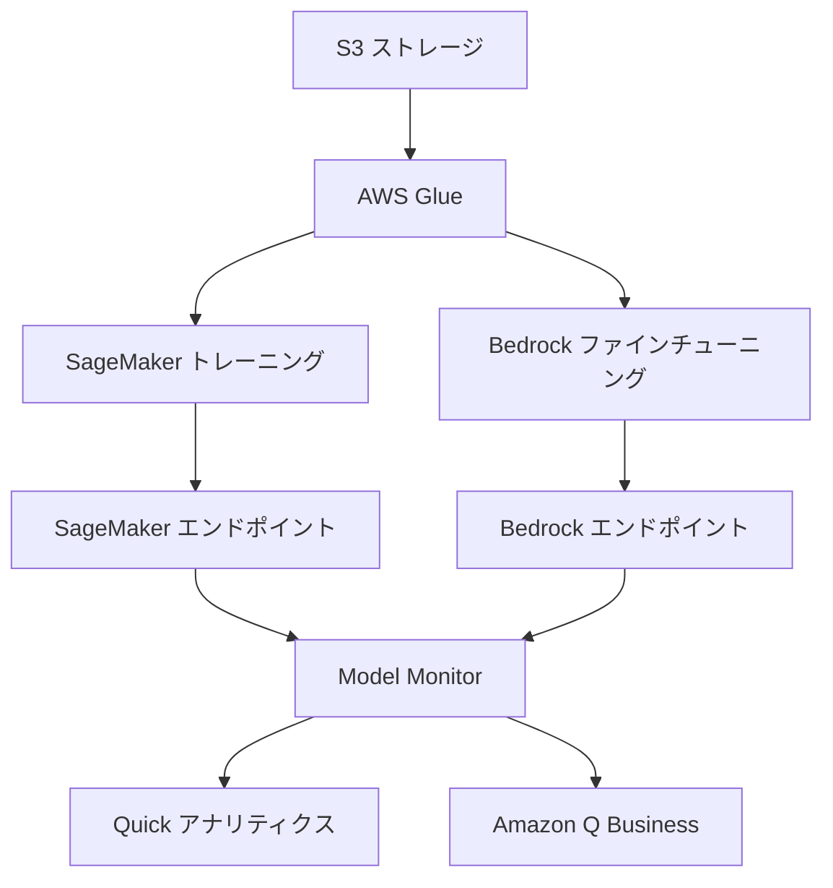
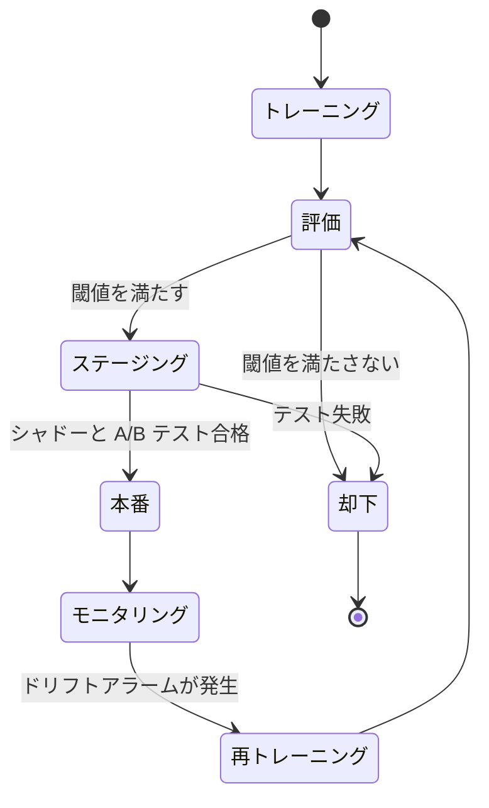
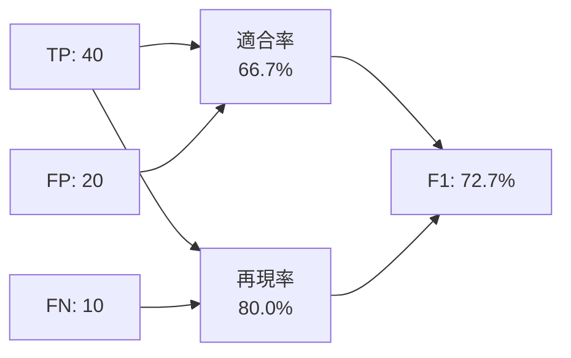

## タスクステートメント 1.3: AI/ML 開発ライフサイクルの説明

AI/ML 開発ライフサイクルは、ビジネスのアイデアから生のデータを経て、長期的に価値を生み出す本番システムへと導く構造化された活動の順序です。ドメイン 1 では語彙とユースケースの全体像を確立しました。このタスクステートメントでは、AI と ML のプロジェクトが実際にどのように構築・管理されるかを示すことで、これらのアイデアを動かします。ライフサイクルを理解することで、ビジネスプロフェッショナルは現実的な期待を設定し、各ゲートで適切な質問をし、AWS サービスが各ステージのコストと複雑さをどのように削減するかを認識できます。[^103001]

### 1.3.1 AI/ML パイプラインのコンポーネント

パイプラインは、チームが生のデータから動作するモデルへと進むために実行するステップの順序です。この言葉はソフトウェアエンジニアリングから借用され、同じ意味を持っています。各ステージは前のステップからアーティファクトを受け取り、それを変換して次に渡します。パイプラインのコンセプトはビジネスプロフェッショナルにとって重要です。なぜなら、AI プロジェクトの各ポイントでの進捗、コスト、品質について議論するための共通の語彙を提供するからです。[^103048]

クラシカル機械学習パイプラインと基盤モデルパイプラインは構造的なロジックを共有していますが、中間ステージで異なります。クラシカル ML パイプラインはゼロから始まります。チームはラベル付きデータを収集し、フィーチャーをエンジニアリングし、アルゴリズムを選択し、所有データでモデルをトレーニングし、チューニングし、評価し、結果をデプロイ・モニタリングします。基盤モデルパイプラインは重いデータとトレーニング作業のほとんどをスキップします。代わりに、チームは既存の事前トレーニング済みモデルを選択し、タスクへの適応方法（プロンプトエンジニアリング、ファインチューニング、または検索拡張生成）を決定し、適応されたモデルを評価し、デプロイします。両トラックは同じ 2 つのステージで終わります。デプロイメントとモニタリングです。

*図 1.3.1: デュアルトラック AI/ML パイプライン。クラシカル ML と基盤モデルのトラックはデプロイメントとモニタリングで収束します。フィードバックシグナルはアクティブなトラックにループバックします。*

クラシカル ML トラックのステージは以下のとおりです。**データ収集** は、モデルが学習するラベル付きまたはラベルなしレコードを収集するプロセスです。このステージでの品質問題はその後のすべてのステップに伝播します。[^103002] **探索的データ分析（EDA）** は、モデリングを始める前に収集されたデータの分布、関係、異常を理解するための収集データの調査です。[^103003] **データ前処理** は、クリーニング、欠損値の補完、重複の削除、アルゴリズムが処理できる形式へのデータ変換をカバーします。[^103004] **フィーチャーエンジニアリング** は、入力変数の作成または変換で、モデルが基礎となるパターンにより簡単にアクセスできるようにします。例えば、離脱モデルのために生のトランザクションタイムスタンプを「最後の購入からの日数」フィーチャーに変換します。[^103005] **モデルトレーニング** は、アルゴリズムがトレーニングデータセットの予測誤差を最小化するパラメータ値を見つける最適化プロセスです。[^103006] **ハイパーパラメータチューニング** は、学習した重みではなくトレーニング動作を制御する設定を調整します。例えば、勾配ブースティングモデルの学習率と最大ツリー深度があります。[^103007]

基盤モデルトラックは**データ選択**から始まります。ここでは、ゼロからトレーニングするのではなくファインチューニングに使用するドキュメントやサンプルの選択を意味します。**モデル選択** は、どの事前トレーニング済み FM を適応させるかの選択です。機能、コスト、レイテンシ、ライセンス制約によって決まります（セクション 1.3.2 で説明します）。**適応** は、汎用的な FM が特定のタスクで良好に機能するようにするための 3 つの主要技術をカバーします。プロンプトエンジニアリング（モデルの重みを変更せずに指示を作成）、ファインチューニング（ドメイン固有のサンプルを使用して重みのサブセットを更新）、および*検索拡張生成（RAG）*（推論時に関連ドキュメントを取得することでモデルの知識を拡張）です。[^103008] ドメイン 3 では各適応技術を深く扱います。ここでは、それらが存在し、ライフサイクルのどこに位置するかを知れば十分です。

両トラックは次に**評価**ステージに入ります。適応またはトレーニングされたモデルは、ホールドアウトデータでテストされ、パフォーマンス指標に対してスコアリングされます（セクション 1.3.6 参照）。評価に合格したモデルは**デプロイメント**に進みます。失敗したモデルは、クラシカルトラックでは一般的にフィーチャーエンジニアリングまたはハイパーパラメータチューニングに、FM トラックでは修正された適応戦略に戻ります。

**モニタリング** は最終ステージであり、計画において最も過小評価されるステージです。モデルが本番環境に入ると、現実の世界は静止しません。ユーザーの行動が変化し、データパイプラインが進化し、モデルが学習した統計パターンが見るものと一致しなくなる場合があります。モニタリングはこれらの逸脱を検出し、データの更新、再トレーニング、またはプロンプトの修正などの是正アクションをトリガーします。[^103009]

### 1.3.2 FM モデルのソース

基盤モデルはゼロからトレーニングするために膨大な計算リソースを必要とします。単一の大規模言語モデルのトレーニング実行は数百万 GPU 時間を消費し、数千万ドルのコストがかかります。[^103010] その結果、ほとんどの組織は独自の FM をトレーニングせず、外部ソースから取得して適応させます。3 つの主要なソースは、コスト、コントロール、ライセンス条件、および機能において異なります。

**オープンソースの事前トレーニング済みモデル** は、重みと、ほとんどの場合トレーニングコードが公開されているモデルです。2025 年から 2026 年時点で利用可能な最も著名な例には、Meta の Llama ファミリー（現在第 4 世代。Llama 4 Scout と Maverick バリアントは非常に長いコンテキストウィンドウを提供します）、Mistral AI の Mistral と Mixtral、TII の Falcon シリーズ、画像生成の Stability AI の Stable Diffusion が含まれます。[^103011] オープンソースモデルの魅力は直接的です。トークン単位の API コストがなく、重みを組織の独自インフラストラクチャにダウンロードして実行でき、ベンダーの関与なしにファインチューニングできます。欠点は運用上の複雑さです。チームはコンピュートをプロビジョニング・管理し、モデルの更新を処理し、セキュリティとコンプライアンスの責任を負う必要があります。ライセンスも異なります。Llama モデルは使用量ベースの商業制限を持つコミュニティライセンスを持ちます。Mistral モデルはそのような制限のない Apache 2.0 ライセンスを持ちます。[^103012] ビジネスチームは本番製品でオープンソース FM を使用する前に適用可能なライセンスを確認するべきです。

**商業基盤モデル** は、マネージド API サービスとして AI 企業が提供しています。利用する組織はインフラストラクチャを管理するのではなく、処理されたトークンあたりの費用を払います。AWS を通じてアクセス可能な主要な商業 FM には、Anthropic Claude（コスト重視のタスクには Haiku、複雑な推論には Opus と Sonnet、複数の世代が含まれる）、Amazon Nova（Nova Micro、Lite、Pro、Premier にまたがる Amazon 自身のファミリー）、AI21 Labs の Jamba モデル、および Cohere の Command と Embed ファミリーが含まれます。[^103013] 商業モデルはインフラストラクチャ管理を必要とせず、ベンダーによって継続的に更新されますが、組織はトレーニングデータと重みへの可視性が低く、規制された業界ではコンプライアンスの問題が生じる場合があります。

**ゼロからトレーニングしたカスタムモデル** は最もまれなオプションです。新しい大規模 FM をゼロからトレーニングすることは、既存の FM がそれを十分にカバーしていないほど特化したドメインを持つ組織（例えば、公開トレーニングコーパスとの重複がない語彙と推論パターンを持つゲノミクス会社）のみに適しており、そのための予算と ML エンジニアリングの深さが必要です。コストとタイムラインは相当なものです。ほとんどの組織はこのパスを評価し、商業またはオープンソース FM のファインチューニングがリソースのより良い使い方であると結論付けます。[^103014]

*表 1.3.1: FM ソースオプションの比較*

| ソース | 典型的なコスト構造 | 重みへのコントロール | 運用上の複雑さ | モデル例 |
|-------|-----------------|-------------------|--------------|---------|
| オープンソース事前トレーニング済み | インフラストラクチャコストのみ | フルアクセス | 高い | Llama 4、Mistral、Falcon |
| 商業マネージド API | トークン単位の価格 | アクセスなし | 低い | Claude、Amazon Nova、Cohere |
| ゼロからのカスタムトレーニング | 数百万ドルの設備投資 | 完全な所有権 | 非常に高い | プロプライエタリ |

これらのソースの間の選択が全か無かの決定であることはまずありません。多くの本番アーキテクチャはすべての 3 つを重ね合わせます。汎用クエリのための商業 API、コスト重視の大量タスクのためのファインチューニングされたオープンソースモデル、説明可能性が必須の狭い予測問題のための従来型 ML モデルです。[^103049]

### 1.3.3 本番環境でモデルを使用する方法

トレーニングまたは選択されたモデルを本番環境に移行するには、その予測をユーザーとアプリケーションが利用できるようにする必要があります。試験がカバーする 2 つの主要なデプロイメントパターンは**マネージド API サービス**と**セルフホスト API** です。どちらを選ぶかは、レイテンシ要件、呼び出し量、カスタマイズのニーズ、コンプライアンス制約のバランスを考慮して決定します。

**マネージド API サービス** は、すべてのインフラストラクチャの懸念をコンシューミングアプリケーションから抽象化します。アプリケーションは AWS が管理するエンドポイントに HTTP リクエストを送り、レスポンスとして予測を受け取り、コンピュートレイヤーに直接触れることはありません。**Amazon Bedrock** は基盤モデルのための主要な AWS マネージド API であり、サーバーやGPUを管理することなく、単一の統合 API を通じて Claude、Amazon Nova、Cohere、AI21、Meta Llama、その他のモデルへのアクセスを提供します。[^103015] カスタムクラシカル ML モデルをトレーニングしたか FM をファインチューニングした組織には、**Amazon SageMaker AI** リアルタイム推論エンドポイントが同じ抽象化を提供します。チームはモデルアーティファクトを登録し、エンドポイントを設定すれば、SageMaker がインスタンスのプロビジョニング、ロードバランシング、Auto Scaling を処理します。[^103016] マネージド API サービスの利点は、迅速な本番展開、組み込みのスケーリング、チームの責任からのインフラストラクチャ運用の除去です。制限は、サービングスタックへの細粒度コントロール（例えば、カスタムトークン化や GPU メモリ管理）が利用できないことです。

**セルフホスト API** は、組織がコントロールするインフラストラクチャでモデルを実行し、独自の API として公開します。最も一般的な AWS パターンは、完全な柔軟性のために **Amazon EC2** GPU インスタンスでモデルコンテナをホストするか、スケールでのコンテナオーケストレーションのために **Amazon EKS** に Kubernetes ワークロードとしてデプロイすることです。[^103017] セルフホスティングは、コンプライアンス要件がベンダーの API にデータを送ることを禁止する場合、呼び出し量が、予約またはスポット EC2 キャパシティがトークン単位の料金より安価になるほど高い場合、またはチームがマネージドサービスが許可しない方法で推論スタックを変更する必要がある場合に適しています。トレードオフは運用上のオーバーヘッドです。チームはインスタンスのスケーリング、モデルの更新、セキュリティパッチ、およびモニタリングを管理します。

*図 1.3.2: モデルデプロイメントパターン。アプリケーションはチームのレイテンシ、コンプライアンス、コストの優先順位に応じて、マネージド API またはセルフホスト API のいずれかに推論リクエストをルーティングします。*

*表 1.3.2: マネージド API とセルフホスト API の決定基準*

| 基準 | マネージド API | セルフホスト API |
|-----|-------------|---------------|
| インフラストラクチャ管理 | AWS マネージド | チームマネージド |
| スケーリング | 自動 | 手動または Auto Scaling 設定が必要 |
| サービングスタックのカスタマイズ | 限定的 | 完全 |
| データパス | 顧客データはカスタマーの AWS アカウント内のマネージドサービスコントロールプレーンを通過。モデルの重みへのアクセスなし | データはチームがコントロールするインフラストラクチャに留まる。重みへのフルアクセス |
| コストモデル | トークン単位またはリクエスト単位 | 予約またはスポットコンピュート |
| 最初のデプロイまでの時間 | 時間 | 日から週 |

これら 2 つのパターンを超えて、組織は時間的に重要でない大量タスクに**バッチ推論**を使用することがあります。Amazon SageMaker Batch Transform は Amazon S3 からデータセットを読み取り、各レコードをモデルに通し、結果を S3 に書き戻します。これは顧客ポートフォリオ全体での月次リスクスコアリングなどのタスクに適しています。[^103018] バッチ推論は従来の意味でのエンドポイントではありません。オンデマンドでジョブとして実行され、処理中のみコストがかかります。

### 1.3.4 各パイプラインステージの AWS サービス

AIF-C01 v1.1 試験では、AI/ML パイプラインにまたがる 5 つのサービスファミリーを具体的に名指ししています。**Amazon Bedrock**、**Amazon Q**、**Amazon Quick**、**Kiro**、**Amazon SageMaker AI** です。それぞれの機能とどこに適合するかを理解することで、試験でそれらを混同することを防ぎます。

**Amazon Bedrock** はパイプラインの FM 適応とデプロイメントステージにあります。マネージド API を通じて基盤モデルのキュレートされたカタログへのアクセスを提供し、プライベートデータでそれらのモデルをファインチューニングするためのツール、およびベクトルストアによって支援されるナレッジベースを使用した RAG パイプラインを構築するためのツールを提供します。[^103019] ビジネスチームには、Bedrock は ML インフラストラクチャを管理せずに GenAI を使ったアプリケーションを構築するためのエントリーポイントです。

**Amazon SageMaker AI** はデータ準備からトレーニング、評価、デプロイメントまで、完全なクラシカル ML パイプラインをカバーします。SageMaker Studio は統合開発環境で、SageMaker Pipelines はパイプラインをエンドツーエンドで自動化する ML ネイティブの CI/CD を提供し、SageMaker Feature Store はフィーチャーの定義と値を管理し、SageMaker Model Monitor はデプロイされたモデルの健全性を追跡します。[^103020] SageMaker はまた、ファインチューニングされたカスタムモデルをエンドポイントとしてホストするため、組織が商業 API ではなくオープンソースモデルをファインチューニングする場合は FM トラックにも参加します。

**Amazon Q** は特定の専門的対象者向けの AI 搭載アシスタントのファミリーです。**Amazon Q Business** はエンタープライズ従業員向けの会話型アシスタントで、会社のデータソース（SharePoint、Confluence、S3 バケット、チケットシステム）に接続し、組織コンテンツに基づいた質問に答えます。[^103021] **Amazon Q Developer** は IDE に統合されたコーディングアシスタントで、コードを提案し、ロジックを説明し、セキュリティの脆弱性を特定します。2025 年から 2026 年にかけて、Amazon Q Developer は完全なソフトウェア開発ワークフローの IDE として **Kiro** に置き換えられつつあります。新しい IDE ベースの AI 開発プロジェクトを行うチームは Q Developer ではなく Kiro を評価すべきですが、Q Developer は引き続き利用可能で試験ガイドでも参照されています。

**Kiro** は 2025 年に発表された Amazon の AI 搭載統合開発環境です。[^103022] Q Developer が主に VS Code や JetBrains などの既存の IDE 内のコード補完とチャットオーバーレイであるのに対し、Kiro はエージェント型 AI ワークフローの周りに構築されたフル IDE です。Kiro は仕様を受け取り、実装計画を生成し、複数のファイルにわたってコードを書き、テストを実行し、計画が満たされるまで反復できます。試験のためには、Kiro が AI を活用したソフトウェア開発ライフサイクルを対象とし、エンドユーザー Q&A やデータ分析ではないという主要な区別が重要です。

**Amazon Quick** は v1.1 試験ガイドでの AWS ビジネスユーザー向けアナリティクスと AI アシスタントファミリーの名称です。[^103023] Amazon QuickSight（BI ダッシュボード）と Amazon Q Business（エンタープライズコンテンツへの会話型回答）を通じて歴史的に提供されてきた機能は、ビジネスアナリストがツールを切り替えずにダッシュボードを構築し、データについて自然言語で質問し、AI が生成したナラティブサマリーを受け取ることができる目標のもとでこの名前の下に統合されています。試験のために、Amazon Quick は「ビジネスユーザー向けの生成 AI で強化されたセルフサービス BI」という質問への正しい答えとして認識してください。開発者向けではありません。

試験の記憶のため、下の表はどのアシスタントファミリーがどの対象者を対象とするか、各が v1.1 ステータスにどのようにマッピングされるかをまとめています。

*表 1.3.3: Amazon Q、Kiro、Amazon Quick の概要*

| サービス | 機能 | 対象者 | AIF-C01 v1.1 ステータス |
|---------|------|-------|---------------------|
| Amazon Q Business | 会社コンテンツに基づいたエンタープライズ Q&A | ナレッジワーカー | スコープ内。Amazon Quick に統合中 |
| Amazon Q Developer | 既存の IDE 内のコード補完とチャットオーバーレイ | VS Code、JetBrains を使用する開発者 | スコープ内。完全な IDE ワークフローは Kiro に置き換え |
| Kiro | エージェント型 AI ワークフローを中心に構築されたフル IDE | AI を活用した機能を構築する開発者 | スコープ内（v1.1 の新機能）。「AI 搭載 IDE」への回答 |
| Amazon Quick | セルフサービス BI と生成 AI アシスタント | ビジネスアナリストとオペレーション | スコープ内（v1.1 の新機能）。「ビジネスユーザー向けの BI + GenAI」への回答 |

*表 1.3.4: パイプラインステージ別の AWS AI/ML サービス*

| パイプラインステージ | AWS サービス | 役割 |
|------------------|------------|------|
| データストレージと準備 | Amazon S3、AWS Glue | データセットストレージ、ETL とカタログ作成 |
| フィーチャーエンジニアリング | SageMaker Feature Store | 一元化されたフィーチャーレジストリ |
| クラシカルモデルトレーニング | SageMaker AI Training | マネージド分散トレーニングジョブ |
| ハイパーパラメータチューニング | SageMaker Automatic Model Tuning | パラメータ空間のベイズランダム検索 |
| FM 適応（プロンプティング/RAG） | Amazon Bedrock Knowledge Bases | ベクトルストアが支援する RAG パイプライン |
| FM 適応（ファインチューニング） | Amazon Bedrock Fine-Tuning、SageMaker AI | プライベートデータの教師ありファインチューニング |
| 評価 | SageMaker Model Monitor、Bedrock Model Evaluation | パフォーマンスと品質スコアリング |
| デプロイメント（FM） | Amazon Bedrock Endpoints | マネージド FM 推論 API |
| デプロイメント（カスタム ML） | SageMaker AI Endpoints、Batch Transform | リアルタイムとバッチカスタムモデル推論 |
| モニタリング | SageMaker Model Monitor | データドリフトとモデル品質検出 |
| ビジネスアナリティクス | Amazon Quick | BI ダッシュボードと自然言語データ Q&A |
| エンタープライズ Q&A | Amazon Q Business | 会社コンテンツへの会話型回答 |
| 開発者生産性 | Kiro、Amazon Q Developer | AI を活用したソフトウェア開発 |

*図 1.3.3: AI/ML パイプラインにまたがる AWS サービスマップ。ストレージと ETL はクラシカルトレーニングと FM ファインチューニングの両方を供給します。出力はモニタリングで収束し、エンドユーザーツールに流れます。*

### 1.3.5 MLOps の基本概念

**MLOps**（機械学習オペレーション）は、モデルのデリバリーを繰り返し可能で、スケーラブルで、時間をかけて維持可能にするために、ML ライフサイクルにソフトウェアエンジニアリングの厳格さを適用する規律です。[^103024] この用語は DevOps をモデルにしています。DevOps がアプリケーション開発に自動化、バージョン管理、継続的インテグレーションをもたらしたように、MLOps は ML モデルの構築・運用作業に同じ慣行をもたらします。試験は 7 つのコア MLOps 概念をカバーします。

**実験** は、モデル構築の試みのすべての実行を追跡して、結果を再現・比較できるようにする慣行です。体系的な追跡がなければ、コードを変更した後に良好な検証スコアを達成したチームがそれを確実に再現できません。**Amazon SageMaker Experiments** は各トレーニング実行に関連するハイパーパラメータ、メトリクス、アーティファクトバージョンを記録します。[^103025] 結果は「どの実行がその結果を生み出し、それはどのような設定だったか？」という質問に答える検索可能な履歴です。

**繰り返し可能なプロセス** は、アドホックなスクリプトを、一貫した入力から一貫した出力を生成するバージョン管理されたパラメータ化されたパイプラインに置き換えます。**Amazon SageMaker Pipelines** はネイティブの MLOps オーケストレーションサービスです。パイプラインのステップをコードで定義し、各ステップの出力をバージョン管理されたアーティファクトとして保存し、SageMaker モデルレジストリと統合して評価閾値に基づいてデプロイメントをゲートします。[^103026] パイプラインがこのように定義されると、新しいデータで再実行すると、入力データへの監査可能なリネージを持つ新しいモデルバージョンが生成されます。

**スケーラブルなシステム** は、トレーニング、評価、推論をサポートするインフラストラクチャが手動での再設定なしに需要に応じて拡大できることを保証します。SageMaker は GPU クラスター全体の分散トレーニングを処理し、**Amazon CloudWatch** メトリクスによって支援された Auto Scaling ポリシーを通じてリクエスト量に基づいて推論エンドポイントをスケールアップ・ダウンします。[^103027]

ML における**技術的負債の管理** は、パイプライン内の隠れた仮定、文書化されていないフィーチャー変換、誰もトレーニングデータまで遡れないモデルバージョンの蓄積を防ぐことを意味します。具体的な慣行には、SageMaker Feature Store にフィーチャーの定義を保持すること（トレーニングと推論で同じ変換が一貫して使用されるよう）、メタデータを付けて SageMaker モデルレジストリにモデルアーティファクトを保存すること、および使用されなくなったコンポーネントのパイプラインをレビューすることが含まれます。[^103028]

**本番稼働への準備達成** は、モデルが顧客に届く前に定義された品質バーを通過していることを意味します。これには、シャドーテスト（新しいモデルをライブモデルと並行して実行して出力を比較）、A/B テスト（新しいバージョンにトラフィックの一定割合をルーティング）、負荷テスト（エンドポイントがレイテンシの低下なしにピークトラフィックを処理することを確認）が含まれます。これらのゲートを通過した後にのみ、新しいバージョンが本番モデルを置き換えます。[^103029]

**モデルモニタリング** は、デプロイ時に確立されたベースラインに対してデプロイされたモデルの動作を継続的に評価します。2 つのドリフトタイプが特に重要です。*データドリフト*（*共変量シフト*とも呼ばれる）は、入力フィーチャーの統計分布が時間の経過とともに変化する場合に発生します。例えば、2023 年のトランザクションパターンでトレーニングされた不正検出モデルは、消費習慣が進化するにつれて異なるフィーチャー分布に直面します。[^103030] *概念ドリフト* は、入力と正しい出力の関係が変化する場合に発生します。例えば、製品自体が変わるにつれて、離脱モデルのリスクのある行動の定義が変化する場合があります。**Amazon SageMaker Model Monitor** はライブ推論データをベースラインデータセットと継続的に比較し、ドリフトが閾値を超えた時にアラームを発します。[^103031]

**モデルの再トレーニング** はモニタリングシグナルへの対応です。再トレーニング戦略は、トリガー（スケジュール、メトリクス閾値、または人間による承認）、使用されるデータウィンドウ（すべての歴史的データ、最近のローリングウィンドウ、または特定の日付範囲）、およびデプロイメントゲート（再トレーニングされたモデルが前のバージョンを置き換える前にクリアしなければならない合否閾値）を指定するべきです。SageMaker Pipelines はトリガーベースの実行をサポートしており、Model Monitor によって発せられた CloudWatch アラームは自動的に再トレーニングの実行を開始できます。[^103032]

*図 1.3.4: MLOps モデルライフサイクル状態。モデルはトレーニングから評価とステージングゲートを経て本番環境に移行し、モニタリングがドリフトを検出するとサイクルに再び入ります。*

### 1.3.6 パフォーマンスとビジネスメトリクス

AI/ML モデルの評価には 2 つの並行した視点が必要です。技術パフォーマンスメトリクスはチームにモデルが正確な予測をしているかどうかを伝えます。ビジネスメトリクスは組織にその正確な予測が意図した価値を生み出しているかどうかを伝えます。モデルは技術メトリクスで高いスコアを示しても、間違った問題を解決している場合や大規模で運用するにはコストがかかりすぎる場合にはビジネスリターンを生み出せない可能性があります。

#### 技術パフォーマンスメトリクス

AIF-C01 v1.1 試験ガイドでは、v1.0 のリストから *AUC* が*精度*と*再現率*に置き換えられました。明示的に名指しされた 4 つのメトリクスは、精度（Accuracy）、適合率（Precision）、再現率（Recall）、F1 スコアで、すべて分類問題に適用されます。[^103033]

**精度（Accuracy）** はモデルが正しく予測した割合です。顧客メールをクレームまたはクレームなしに分類するモデルの場合、精度は（正しく分類されたメール数）/（総メール数）です。精度はシンプルですが、クラスが不均衡な場合は誤解を招きます。メールの 95% がクレームでない場合、常にクレームなしと予測するモデルは 95% の精度を持ちますが実用性はゼロです。[^103034]

**混同行列** はすべての他の分類メトリクスを理解するための基礎です。4 つのセルで結果を数える 2x2 テーブルです（二項分類の場合）。

*表 1.3.5: 混同行列の構造*

| | 予測陽性 | 予測陰性 |
|--|---------|---------|
| 実際陽性 | 真陽性（TP） | 偽陰性（FN） |
| 実際陰性 | 偽陽性（FP） | 真陰性（TN） |

**適合率（Precision）** は正しかった陽性予測の割合です。TP / (TP + FP)。高い適合率を持つ不正検出モデルは少ない誤検知を発生させます。フラグが立てられたほとんどのトランザクションは真に不正です。偽陽性がコストのかかる場合（例えば、正当な顧客トランザクションをブロックする）、適合率の最大化が優先事項です。[^103035]

**再現率（Recall）**（*感度*とも呼ばれる）は、モデルが正常に識別した実際の陽性の割合です。TP / (TP + FN)。高い再現率を持つ医療スクリーニングモデルはほとんどの真のケースをキャッチします。偽陰性がコストのかかる場合（例えば、がんの診断を見逃す）、再現率の最大化が優先事項です。[^103036]

適合率と再現率はトレードオフの関係にあります。分類閾値を下げると再現率が上がりますが適合率が下がります。上げると適合率が上がりますが再現率が下がります。**F1 スコア** は適合率と再現率の調和平均です。2 × (適合率 × 再現率) / (適合率 + 再現率)。算術平均ではなく調和平均を使用するため、どちらかの指標が低い値に対して敏感であり、偽陽性と偽陰性の両方が重要な場合の信頼できる単一数値サマリーとなります。[^103037]

例を見ると、トレードオフが具体的になります。不正検出モデルが 1,000 件のトランザクションのテストセットで評価されます。そのうち 50 件が不正です。モデルは 60 件のトランザクションを不正としてフラグします。そのフラグのうち 40 件が正しく、10 件の真の不正が見逃されました。

- 精度（Accuracy）: (40 + 940) / 1,000 = 98.0%
- 適合率（Precision）: 40 / 60 = 66.7%
- 再現率（Recall）: 40 / 50 = 80.0%
- F1 スコア: 2 × (0.667 × 0.800) / (0.667 + 0.800) = 72.7%

98% の精度は強く見えますが、72.7% の F1 スコアはモデルが重要なクラスでのパフォーマンスについてより正直な絵を提供します。

*図 1.3.5: 不正検出の例の適合率、再現率、F1 の計算。この図は、真陽性、偽陽性、偽陰性がどのように組み合わさって F1 サマリースコアになるかを追跡します。*

#### ビジネスメトリクス

技術メトリクスはモデルが機能するかどうかを答えます。ビジネスメトリクスはモデルを運用する価値があるかどうかを答えます。試験ガイドの 4 つのビジネスメトリクスは、ユーザーあたりのコスト、開発コスト、顧客フィードバック、および投資対効果です。[^103038]

**ユーザーあたりのコスト** は、期間内のユーザー数で割った総推論コスト（コンピュート、API 料金、および運用オーバーヘッド）です。このメトリクスはモデルの継続的な経済性を可視化します。10,000 ユーザーで 1 ユーザーあたり月 0.001 ドルのモデルは、コストが量によって下がらない場合、1,000 万ユーザーでは手に負えなくなる可能性があります。ユーザーあたりのコストを時間の経過とともにモニタリングすることで、モデルの効率性が低下している場合も明らかになります。多くの場合、入力ペイロードが増加しているか、モデルが必要以上に呼び出されているサインです。[^103039]

**開発コスト** は、モデルを構築・デプロイするために必要な人、データ、コンピュート、ツールへの一回限りの（またはイテレーションごとの）投資です。Bedrock でファインチューニングされた FM の場合、開発コストにはデータラベリングの工数とファインチューニングジョブのコンピュートが含まれます。カスタムトレーニングモデルの場合、数か月の ML エンジニアの時間と GPU クラスターの時間が含まれます。提供されたビジネス価値に対する開発コストを追跡することで、将来のプロジェクトのビルド対バイの問いに答えます。[^103040]

**顧客フィードバック** は、AI を活用した機能に対するユーザー満足度の定性的・定量的シグナルをカバーします。一般的な手段には、ネットプロモータースコア調査、AI の応答に対するアプリ内のサムズアップまたはサムズダウン評価、AI 機能にタグ付けされたカスタマーサポートチケット量が含まれます。顧客フィードバックは技術メトリクスが見逃す問題を検出することが多いです。モデルは高い適合率と再現率を持っていても、ユーザーが役に立たないまたはブランドにそぐわないと感じる出力を生成する場合があります。[^103041]

**投資対効果（ROI）** は、定義された期間にわたる総コストに対する正味の財務的便益の比率です。年間 200 万ドルの損失を防ぐ不正検出モデルで、年間総コスト（開発費の償却プラス推論費）が 40 万ドルの場合、ROI は 400% です。ROI は財務リーダーシップへの AI 投資を正当化し、最初のデプロイ後にプロジェクトが継続的な資金を受けるかどうかを決定するメトリクスです。[^103042]

*表 1.3.6: ユースケース別の技術メトリクスとビジネスメトリクスの対応*

| ユースケース | 技術メトリクス | ビジネスメトリクス |
|----------|-------------|----------------|
| 不正検出 | 不正クラスの F1 スコア | 防止された不正損失 / 誤検知処理コスト |
| 顧客離脱予測 | 離脱顧客の再現率 | リスクのある顧客から維持された収益 |
| 文書分類 | 各カテゴリの適合率 | 週あたりの節約スタッフ時間 |
| 製品推薦 | クリックされた推薦の精度 | 平均注文額の増加 |
| 医療スクリーニング | 陽性ケースの再現率 | 検出されたケースあたりのコスト対晩期治療コスト |

効果的な AI プログラム管理には両方の列の追跡が必要です。強い F1 スコアを持ちながら負の ROI を持つモデルは再設計または置き換えるべきです。強い ROI を持ちながら再現率が低下しているモデルは、ビジネス成果が悪化する前に再トレーニングが必要です。[^103050]

---

**このセクションが構築したもの：** タスクステートメント 1.3 は、AI/ML ライフサイクルの構造をカバーしました。デュアルトラックパイプライン、FM ソーシング、本番デプロイメントパターン、各ステージにマッピングされる AWS サービスです。また、本番モデルを健全に保つ MLOps の慣行と、モデルが機能しているかどうかを判断する技術メトリクスとビジネスメトリクスも紹介しました。タスクステートメント 2.1 では、これらの概念のいくつかを深く掘り下げ、生成 AI がどのように機能するか、それが導入する独自の語彙に焦点を当てます。

---

## セルフチェック問題

1. データサイエンスチームが顧客離脱予測モデルを構築し、6 か月前にデプロイしました。ビジネスアナリストは、入力データの量と形式が変わっていないにもかかわらず、モデルの再現率が 82% から 54% に低下していることに気づきます。チームはモデルがトレーニングされて以来、顧客の行動パターンが変化したと疑っています。この再現率の低下の根本原因を最もよく説明する MLOps 概念はどれですか？

   A. ハイパーパラメータドリフト
   B. 概念ドリフト
   C. パイプラインの技術的負債
   D. フィーチャーストアの無効化

   概念ドリフトは、入力フィーチャーの分布が安定して見えても、入力フィーチャーと正しい出力の関係が時間とともに変化する場合に発生します。このシナリオでは、チームは変化を進化した顧客行動が入力から成果への関係を変えることに起因するとしています。これはフィーチャー分布のシフトではなく概念ドリフトです。モデルが、トレーニング時代のパターンとは異なる現在の行動を持つリスクのある顧客を見逃すため再現率が低下します。データドリフト（共変量シフト）は入力フィーチャー自体の分布がシフトしたことを意味しますが、設問はそれを除外しています。ハイパーパラメータドリフトは MLOps の語彙で認識された用語ではありません。フィーチャーストアの無効化はエラーや欠損値を生成しますが、再現率の緩やかな低下ではありません。正解は概念ドリフトであり、モデルが最近のラベル付きデータで再トレーニングする必要があることを示しています。[^103043]

2. 小売会社が月約 5000 万件のリクエストを処理する高量の製品説明生成サービスに基盤モデルのオプションを評価しています。チームはコンプライアンス上の理由でモデルの重みへのフルコントロールが必要で、継続的なユニットコストを最小化したいと考えています。最も適切な FM ソースアプローチはどれですか？

   A. Claude Opus などの大パラメータモデルを使用した商業マネージド API
   B. セルフマネージドの EC2 GPU インスタンスでホストされたオープンソース事前トレーニング済みモデル
   C. オンデマンド価格の Amazon Bedrock
   D. プロプライエタリな製品データでゼロからトレーニングしたカスタムモデル

   シナリオは 2 つの制約を指定しており、それらが組み合わさって選択を絞り込みます。コンプライアンスは重みレベルのコントロールを必要とし、高量はトークン単位の API 価格よりも良い経済性を必要とします。オープンソース事前トレーニング済みモデル（選択肢 B）は両方の制約に対応します。重みへのフルアクセス（コンプライアンスを満たす）を提供し、予約またはスポット EC2 インスタンスにデプロイされると、月 5000 万件のリクエストで商業トークン単位の料金と比較して限界コストを大幅に削減します。商業マネージド API（選択肢 A と C）は重みレベルのコントロールを提供しません。シナリオが明示的に必要としている条件です。ゼロからの構築（選択肢 D）は既存のオープンソースモデルを適応させるよりもはるかにコストがかかり、既存のモデルがドメインをカバーしていない場合にのみ正当化されます。最も適切な選択は選択肢 B です。[^103044]

3. ビジネスアナリストが不正検出モデルを確認し、次の混同行列の結果を見ています。TP=80、FP=40、FN=20、TN=860。アナリストは、正当なトランザクションを不正として誤ってフラグするのを避けるモデルの能力を最もよく反映するメトリクスを報告する必要があります。どのメトリクスを報告すべきですか？

   A. 精度（Accuracy）
   B. 再現率（Recall）
   C. F1 スコア
   D. 適合率（Precision）

   この質問は、陽性予測（不正フラグ）が実際に正しい頻度を反映するメトリクスを求めており、それが適合率の定義です。適合率 = TP / (TP + FP) = 80 / (80 + 40) = 66.7%。このコンテキストでの偽陽性は、正当なトランザクションが誤って不正としてフラグされたものです。銀行や小売業者は正規の顧客が断られる際に実際のコストを支払います。適合率はモデルの視点から偽陽性率を直接測定します。再現率（TP / (TP + FN) = 80 / 100 = 80%）はモデルが実際の不正トランザクションをキャッチする能力を測定し、正当なものを誤ってフラグすることを避ける能力ではありません。精度（Accuracy）は 4 つのセルすべてを含み、真陰性の多さに支配されるため、ここでは情報が少ないです。F1 は組み合わせたメトリクスです。適合率の動作を単独で示しません。報告すべき最も良いメトリクスは適合率です。[^103045]

4. 組織が SharePoint、Confluence、Amazon S3 に保存された社内文書に基づいて従業員の質問に答える会話型アシスタントを構築したいと考えています。モデルのインフラストラクチャを管理したくないと考えています。このユースケースのために最も直接的に設計された AWS サービスはどれですか？

   A. カスタムトレーニングモデルを使用した Amazon SageMaker AI
   B. Kiro
   C. Amazon Q Business
   D. 手動プロンプトエンジニアリングを使用した Amazon Bedrock

   Amazon Q Business は、組織自身のドキュメントとデータソースに基づいて質問に答えるエンタープライズ会話型アシスタント向けに特別に設計された AWS サービスです。SharePoint、Confluence、S3、および数十の他のエンタープライズシステムの組み込みコネクターを持ち、チャンキング、インデックス作成、検索を自動的に処理し、インフラストラクチャ管理を必要とせずにマネージド Web インターフェースと API を通じてアシスタントを公開します。Kiro は開発タスク向けの AI 搭載 IDE であり、エンタープライズ Q&A サービスではありません。カスタムトレーニングモデルを使用した SageMaker AI は、組織が検索、グラウンディング、回答生成コンポーネントをゼロから構築する必要があります。これは「インフラストラクチャ管理なし」のパスではありません。手動プロンプトエンジニアリングを使用した Amazon Bedrock は、チームがすべてのコネクターと検索ロジックを自分で構築する必要があります。これは Q Business を直接使用するよりも大幅に多い作業です。最も直接的に設計されたサービスは Amazon Q Business です。[^103046]

5. プロジェクトチームが CFO に新しくデプロイされた製品推薦モデルの結果を発表しています。モデルはテストセットで 91% の精度と 84% の F1 スコアを達成しました。CFO は最初の四半期の運用でビジネスに実際に何をしたのかを尋ねます。CFO の質問に最もよく答えるメトリクスはどれですか？

   A. 84% の F1 スコア
   B. 91% の精度（Accuracy）
   C. 運用コストに対する収益影響として表された投資対効果
   D. 陽性クラスの再現率

   CFO の質問はモデルの品質ではなく、ビジネス成果について明示的に尋ねています。精度、F1 スコア、再現率などの技術メトリクスは、ラベル付きテストデータでモデルがどのように機能するかを説明しますが、CFO がプロジェクトへの投資を評価するために使用する財務的な用語に直接翻訳されません。投資対効果（ROI）は、モデルの構築・運用コストに対してモデルによって生成された正味の収益またはコストメリットとして表現され、投資が正当化されたかどうかを直接答えるビジネスメトリクスです。推薦システムの場合、ROI は推薦によって駆動された購入に起因する増分収益から四半期のモデルの総コストを差し引いて計算される場合があります。このフレーミングは、CFO がプロジェクトへの継続的な資金提供または拡大を決定するために直接実行可能です。最も良いメトリクスは ROI です。[^103047]

---

[^103001]: AWS Certified AI Practitioner Exam Guide v1.1, Task Statement 1.3. URL: <https://docs.aws.amazon.com/aws-certification/latest/ai-practitioner-01/ai-practitioner-01-domain1.html>
[^103002]: Amazon SageMaker Data Wrangler: Preparing ML data. URL: <https://docs.aws.amazon.com/sagemaker/latest/dg/data-wrangler.html>
[^103003]: Exploratory Data Analysis with Amazon SageMaker Studio. URL: <https://docs.aws.amazon.com/sagemaker/latest/dg/studio.html>
[^103004]: Data preprocessing concepts in ML. URL: <https://docs.aws.amazon.com/wellarchitected/latest/machine-learning-lens/data-preprocessing.html>
[^103005]: Amazon SageMaker Feature Store overview. URL: <https://docs.aws.amazon.com/sagemaker/latest/dg/feature-store.html>
[^103006]: Amazon SageMaker Training: training jobs overview. URL: <https://docs.aws.amazon.com/sagemaker/latest/dg/train-model.html>
[^103007]: Amazon SageMaker Automatic Model Tuning. URL: <https://docs.aws.amazon.com/sagemaker/latest/dg/automatic-model-tuning.html>
[^103008]: Amazon Bedrock retrieval-augmented generation overview. URL: <https://docs.aws.amazon.com/bedrock/latest/userguide/knowledge-base.html>
[^103009]: Amazon SageMaker Model Monitor: continuous monitoring of deployed models. URL: <https://docs.aws.amazon.com/sagemaker/latest/dg/model-monitor.html>
[^103010]: AWS Blog: Training large language models at scale. URL: <https://aws.amazon.com/blogs/machine-learning/training-large-language-models-on-amazon-sagemaker/>
[^103011]: Meta Llama model family overview. URL: <https://llama.meta.com/>
[^103012]: Mistral AI open-source model licensing. URL: <https://mistral.ai/news/announcing-mistral-7b/>
[^103013]: Amazon Bedrock supported foundation models. URL: <https://docs.aws.amazon.com/bedrock/latest/userguide/models-supported.html>
[^103014]: AWS ML Blog: When to train a custom model vs. use a pre-trained FM. URL: <https://aws.amazon.com/blogs/machine-learning/>
[^103015]: Amazon Bedrock: Fully managed FM service overview. URL: <https://docs.aws.amazon.com/bedrock/latest/userguide/what-is-bedrock.html>
[^103016]: Amazon SageMaker real-time inference endpoints. URL: <https://docs.aws.amazon.com/sagemaker/latest/dg/realtime-endpoints.html>
[^103017]: Running ML inference on Amazon EC2 GPU instances. URL: <https://docs.aws.amazon.com/AWSEC2/latest/UserGuide/accelerated-computing-instances.html>
[^103018]: Amazon SageMaker Batch Transform. URL: <https://docs.aws.amazon.com/sagemaker/latest/dg/batch-transform.html>
[^103019]: Amazon Bedrock Knowledge Bases for RAG. URL: <https://docs.aws.amazon.com/bedrock/latest/userguide/knowledge-base.html>
[^103020]: Amazon SageMaker AI overview: features and capabilities. URL: <https://docs.aws.amazon.com/sagemaker/latest/dg/whatis.html>
[^103021]: Amazon Q Business overview. URL: <https://docs.aws.amazon.com/amazonq/latest/qbusiness-ug/what-is.html>
[^103022]: Kiro: AI-powered IDE from AWS. URL: <https://kiro.dev/>
[^103023]: AIF-C01 v1.1 in-scope service list (Amazon Quick). URL: <https://docs.aws.amazon.com/aws-certification/latest/ai-practitioner-01/aif-01-in-scope-services.html>
[^103024]: AWS What is MLOps? URL: <https://aws.amazon.com/what-is/mlops/>
[^103025]: Amazon SageMaker Experiments documentation. URL: <https://docs.aws.amazon.com/sagemaker/latest/dg/experiments.html>
[^103026]: Amazon SageMaker Pipelines: ML CI/CD. URL: <https://docs.aws.amazon.com/sagemaker/latest/dg/pipelines.html>
[^103027]: Amazon SageMaker auto-scaling for inference endpoints. URL: <https://docs.aws.amazon.com/sagemaker/latest/dg/endpoint-auto-scaling.html>
[^103028]: Amazon SageMaker Feature Store: consistent feature transforms. URL: <https://docs.aws.amazon.com/sagemaker/latest/dg/feature-store-use-with-studio.html>
[^103029]: Amazon SageMaker shadow testing for deployments. URL: <https://docs.aws.amazon.com/sagemaker/latest/dg/shadow-tests.html>
[^103030]: Data drift detection with Amazon SageMaker Model Monitor. URL: <https://docs.aws.amazon.com/sagemaker/latest/dg/model-monitor-data-quality.html>
[^103031]: Amazon SageMaker Model Monitor: how it works. URL: <https://docs.aws.amazon.com/sagemaker/latest/dg/model-monitor-how-it-works.html>
[^103032]: Triggering SageMaker Pipelines with CloudWatch alarms. URL: <https://docs.aws.amazon.com/sagemaker/latest/dg/pipeline-eventbridge.html>
[^103033]: AWS Certified AI Practitioner Exam Guide v1.1, Objective 1.3.6. URL: <https://docs.aws.amazon.com/aws-certification/latest/ai-practitioner-01/ai-practitioner-01-domain1.html>
[^103034]: ML classification accuracy limitations. URL: <https://docs.aws.amazon.com/machine-learning/latest/dg/binary-classification.html>
[^103035]: Precision metric in binary classification. URL: <https://docs.aws.amazon.com/machine-learning/latest/dg/binary-classification.html>
[^103036]: Recall (sensitivity) in classification models. URL: <https://docs.aws.amazon.com/machine-learning/latest/dg/binary-classification.html>
[^103037]: F1 score definition and calculation. URL: <https://docs.aws.amazon.com/machine-learning/latest/dg/multiclass-model-insights.html>
[^103038]: AWS Certified AI Practitioner Exam Guide v1.1, business metrics in objective 1.3.6. URL: <https://docs.aws.amazon.com/aws-certification/latest/ai-practitioner-01/ai-practitioner-01-domain1.html>
[^103039]: Amazon Bedrock pricing model and cost management. URL: <https://aws.amazon.com/bedrock/pricing/>
[^103040]: AWS ML cost optimization guidance. URL: <https://aws.amazon.com/blogs/machine-learning/optimizing-costs-for-machine-learning-on-aws/>
[^103041]: Amazon Bedrock human-loop feedback integration. URL: <https://docs.aws.amazon.com/bedrock/latest/userguide/human-loop.html>
[^103042]: Measuring business value of ML with AWS. URL: <https://aws.amazon.com/blogs/machine-learning/measuring-the-business-impact-of-amazon-sagemaker/>
[^103043]: Concept drift and data drift in Amazon SageMaker Model Monitor. URL: <https://docs.aws.amazon.com/sagemaker/latest/dg/model-monitor-model-quality.html>
[^103044]: Deploying open-source models on Amazon EC2 GPU instances. URL: <https://docs.aws.amazon.com/AWSEC2/latest/UserGuide/accelerated-computing-instances.html>
[^103045]: Binary classification metrics: precision and recall. URL: <https://docs.aws.amazon.com/machine-learning/latest/dg/binary-classification.html>
[^103046]: Amazon Q Business: connecting enterprise data sources. URL: <https://docs.aws.amazon.com/amazonq/latest/qbusiness-ug/connectors-list.html>
[^103047]: Business metrics for evaluating ML models. URL: <https://aws.amazon.com/blogs/machine-learning/mlops-foundation-roadmap-for-enterprises-with-amazon-sagemaker/>
[^103048]: AWS Well-Architected Machine Learning Lens: ML lifecycle overview. URL: <https://docs.aws.amazon.com/wellarchitected/latest/machine-learning-lens/well-architected-machine-learning-lifecycle.html>
[^103049]: AWS Blog: Choosing between foundation models and custom ML. URL: <https://aws.amazon.com/blogs/machine-learning/choose-the-right-approach-for-your-generative-ai-use-cases/>
[^103050]: Amazon SageMaker MLOps: continuous evaluation and retraining. URL: <https://docs.aws.amazon.com/sagemaker/latest/dg/model-monitor.html>
