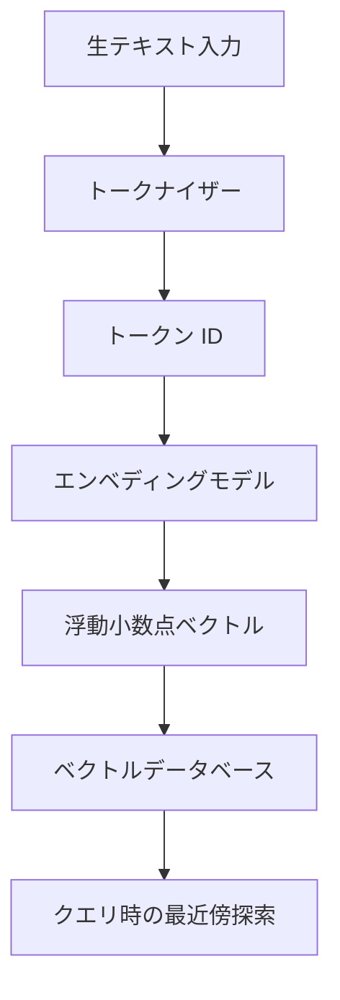
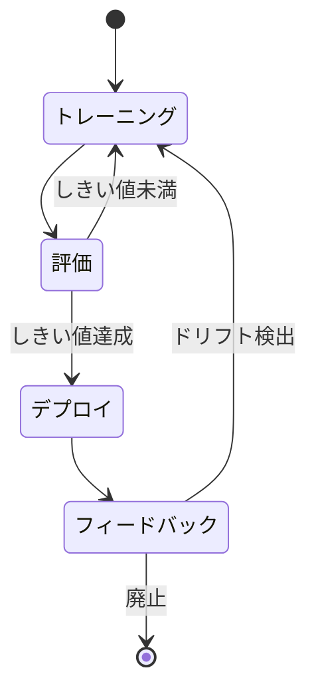
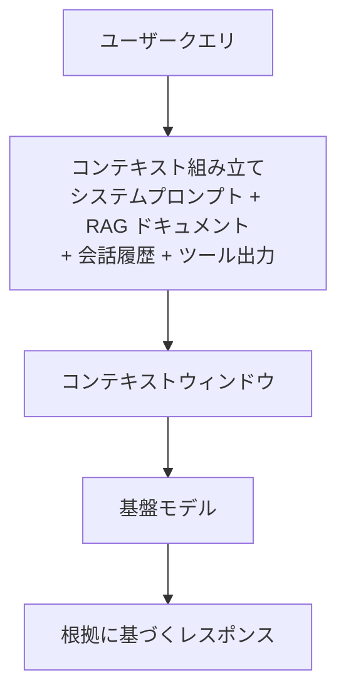
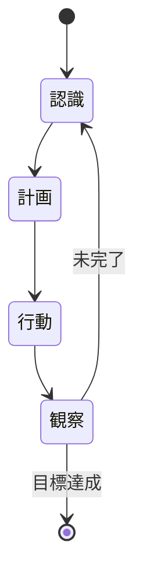
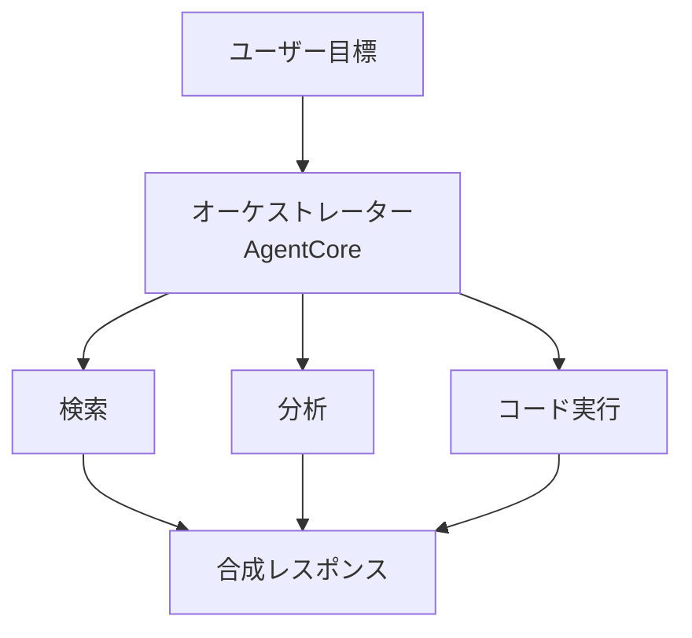

## タスクステートメント 2.1: 生成 AI（GenAI）の基本概念を説明する

生成 AI は、ラベルを予測したり入力を分類したりするのではなく、新しいコンテンツを生成します。この違いが、これらのシステムを構築するために使われるモデルアーキテクチャ、料金体系、失敗のパターン、そしてモデルが応答する前にどの情報を参照するかを決定するコンテキストエンジニアリングという新しい分野に至るまで、あらゆる側面を形作っています。このタスクステートメントは 6 つの客観的領域をカバーしており、そのうち 3 つは試験ガイド v1.1 で新たに追加されたもので、この技術がいかに急速に研究から本番デプロイへと移行したかを反映しています。[^201001]

ドメインの導入部では、生成 AI が試験配点の 24% を占め、そのコストと失敗プロファイルが従来の機械学習とは大きく異なると説明しました。このタスクステートメントでは、その主張の根拠となる仕組みを詳しく解説します。このタスクステートメントを終えると、次のことが説明できるようになります。トークンとは何か、プロンプトのトークン数がどのように料金に直接影響するか。基盤モデルが生のテキストからデプロイされたサービスへとどのように変化するか。コンテキストエンジニアリングの意味とプロンプトエンジニアリングとの関係。そして、マルチエージェントシステムが複数の AI コンポーネントにまたがって連携する場面で使われるパターンです。

### 2.1.1 生成 AI の基礎概念

生成 AI モデルには、AWS のドキュメント、ベンダーの料金ページ、設計レビューのいたるところに登場する中核的な抽象概念があります。これらの抽象概念を理解することが、ドメイン 2 の残りすべての前提条件です。

**トークン化（Tokenization）**は、言語モデルでテキストを処理する最初のステップです。*トークン*はモデルが操作するテキストの最小単位です。英語の一般的なテキストでは、トークンはおおよそ 3 から 4 文字で、「tokenization」という単語はトークナイザーによって 2 つか 3 つのトークンになりますが、「cat」という単語は 1 トークンです。数字、句読点、英語以外の文字は、標準的な英語の散文よりも 1 単語あたりのトークン数が多くなりがちです。[^201002] リクエストの総トークン数は、入力トークン（モデルに送るテキスト）と出力トークン（モデルが返すテキスト）の合計です。両方のカウントが請求書に表示されます。

**チャンキング（Chunking）**は、埋め込みや検索の前に大きなドキュメントを小さなセグメントに分割するプロセスです。50 ページの PDF は 1 つのブロックとしてモデルのコンテキストウィンドウに収まらないため、数百トークンずつ重複を持たせながら分割されます。チャンクサイズと重複の割合は、検索精度に影響するチューニング可能なパラメータです。小さすぎるチャンクは周囲のコンテキストを失い、大きすぎるチャンクはプロンプトに挿入されるときにトークン予算を無駄にします。[^201003] チャンキングは準備ステップであり、モデルの機能ではありません。推論時ではなく、インデックス構築時に実行されます。

*エンベディング*は、テキスト（または画像、音声）の数値表現で、意味論的な意味を高次元空間のベクトルとして符号化したものです。意味が似ている 2 つのテキストは幾何学的に近いエンベディングベクトルを持ちます。これが、ドキュメントコレクション上での類似検索を可能にする仕組みです。**Amazon Bedrock** は、Amazon Titan Embeddings や Cohere Embed などのエンベディングモデルを提供しており、テキストを受け取って浮動小数点ベクトルを返します。[^201004] それらのベクトルはベクトルデータベースに格納されます。ベクトルデータベースは最近傍探索に最適化された特殊なデータストアです。AWS で利用可能な一般的なベクトルデータベースには、k-NN プラグインを備えた **Amazon OpenSearch Service**、pgvector 拡張を持つ **Amazon Aurora** および **Amazon RDS for PostgreSQL**、ベクトル検索を備えた **Amazon Neptune Analytics** などがあります。[^201005]

*図 2.1.1: トークン化とエンベディングのパイプライン。テキストはまずトークナイザーによってトークン ID に変換され、次にエンベディングモデルによって高次元ベクトルにマッピングされ、最後に類似検索のためにベクトルデータベースに格納されます。*

**プロンプトエンジニアリング**は、出力の品質、精度、形式を向上させるために、モデルに送るテキスト入力を工夫する実践です。よく設計されたプロンプトには、指示、コンテキスト、例、明示的な出力形式を含めることができます。タスクステートメント 3.2 では具体的なプロンプトエンジニアリング技法を詳しく説明します。この段階での重要なポイントは、プロンプトエンジニアリングが、モデル自体を変えずにモデルの動作に影響を与えるための最も直接的な手段であるということです。[^201006]

**トランスフォーマーベースの大規模言語モデル（LLM）**は、現代の言語タスクにおける支配的なアーキテクチャです。2017 年に発表された*トランスフォーマー*アーキテクチャは、各出力トークンを生成する際に、シーケンス内のすべてのトークンの他のすべてのトークンに対する関連性を重み付けする*自己注意（self-attention）*と呼ばれる仕組みを使います。[^201007] 自己注意により、「それ」という代名詞が 3 文前に登場した名詞を指していることを認識するような、テキスト内の長距離依存関係をトランスフォーマーが維持できます。注意機構の数学的な詳細は AIF-C01 試験では出題されませんが、コンテキストが長くなるほど計算コストが高くなる理由と、コンテキストウィンドウが有限のサイズを持つ理由を理解するうえで概念として重要です。

**基盤モデル（FM）**は、膨大なスケールで広範な汎用データセット上でトレーニングされた大規模なモデルです。[^201008] FM は 1 つの特定のタスク向けにトレーニングされるのではなく、言語（または画像、コード）の一般的な表現を学習し、プロンプト、検索、またはファインチューニングを通じて多くの下流タスクに適応させることができます。Amazon Bedrock を通じて利用可能な例には、Anthropic Claude、Meta Llama、Amazon Nova、Mistral AI のモデルなどがあります。[^201009]

**マルチモーダルモデル**は複数のデータ型を受け取り、生成します。マルチモーダル FM は、画像とテキストの質問を受け取ってテキストの回答を返したり、テキストを受け取ってテキストと画像の両方を返したりする場合があります。Amazon Bedrock 上の Amazon Nova ファミリーでは、Lite、Pro、Premier がテキスト、画像、動画、ドキュメントを処理します。Nova Micro はテキストのみで、純粋なテキストユースケース向けの最も低コストのオプションです。[^201010]

**拡散モデル（Diffusion models）**は、ノイズ付加プロセスを逆転することを学習して出力を生成します。トレーニング中、モデルはランダムノイズを増やしながら追加されたデータを見て、そのノイズをステップバイステップで予測して除去することを学びます。推論時には純粋なノイズから始まり、それを繰り返しデノイズして一貫した画像、オーディオクリップ、またはその他のアーティファクトにします。[^201011] 拡散モデルは画像生成機能の基盤です。Amazon Bedrock には、このカテゴリの画像生成モデルとして Stability AI の Stable Diffusion が含まれています。[^201012]

### 2.1.2 生成 AI モデルの潜在的ユースケース

生成 AI は、基盤となるモデルがドメインを超えて汎化するため、ほとんどの古典的な ML システムよりも広い範囲のビジネスタスクをカバーします。実際的な問いは、生成モデルが特定のタスクに役立てられるかどうかではなく、その特定のケースにおいて経済的かつ精度的に適切なトレードオフかどうかです。

*表 2.1.1: 生成 AI の一般的なユースケースと代表的なビジネスシナリオ*

| ユースケース | モデルが行うこと | 代表的なビジネスシナリオ |
|---|---|---|
| 画像生成 | テキストや画像プロンプトから新しい画像を生成する | マーケティングチームが撮影なしで商品のライフスタイル画像を生成する |
| 動画生成 | テキストの説明から短い動画クリップを生成する | メディア企業がレビュー用の説明動画の草稿を生成する |
| 音声生成 | 音声や音楽を合成する | e ラーニングプラットフォームがコース更新のナレーションを夜間に生成する |
| 要約 | 長い文書を短い版に凝縮する | 法務部が主要義務を強調するために契約書を要約する |
| AI アシスタント | 質問に答え、コンテンツを下書きし、概念を説明する | 社内知識ベースのボットが従業員の HR 質問に答える |
| 翻訳 | テキストをある言語から別の言語に変換する | グローバル小売業者が商品説明を 20 言語にローカライズする |
| コード生成 | ソースコードを作成、レビュー、説明する | 開発者が定例的な機能実装や単体テストの作成を加速する |
| カスタマーサービスエージェント | 会話を通じて顧客の問い合わせを処理する | コンタクトセンターがライブエージェントなしで一般的な問い合わせを自動対応する |
| 検索 | キーワード一致ではなく意味的に関連する結果を返す | 企業のドキュメントポータルが、クエリの表現が異なっていても適切なポリシーページを表示する |
| レコメンデーションエンジン | ユーザーの行動や表明した嗜好に基づいてアイテムを提案する | ストリーミングサービスがセマンティックと協調フィルタリングのハイブリッドシグナルを使ってコンテンツを推薦する |

各ユースケースタイプは基盤となるモデルに対して異なる要求を課します。要約と翻訳は主に LLM に適した言語タスクです。画像と動画の生成には拡散モデルや他の生成的な視覚モデルが必要です。コード生成はプログラミング言語で特別にファインチューニングされたモデルが有利です。カスタマーサービスエージェントは低レイテンシ、強力な指示への従順さ、外部ツールを呼び出す能力を必要とし、これは目標 2.1.6 でカバーするエージェント型パターンに直接つながります。検索とレコメンデーションは目標 2.1.1 のエンベディングとベクトル類似性の機能を使い、タスク 3.1 でカバーされる検索拡張生成（RAG）パターンと組み合わせることが一般的です。

### 2.1.3 FM ライフサイクル

基盤モデルは、トレーニングデータから直接本番環境へと飛び出すわけではありません。タスク 1.3 で説明した古典的な ML ライフサイクルよりも多くのステージを持つ定義されたライフサイクルを経ます。古典的なパイプラインは、ラベル付きデータセット、モデル、予測エンドポイントに焦点を当てています。FM ライフサイクルははるかに早い段階、すなわち事前トレーニングに使う生データの決定から始まり、モデルの動作を継続的に改善するデプロイ後のフィードバックループが追加されます。

*図 2.1.2: 基盤モデルのライフサイクル。経路は厳密に線形ではありません。評価の失敗はファインチューニングにループバックし、本番環境のフィードバックはさらなる適応サイクルを引き起こすことがあります。*

FM ライフサイクルの 7 つのステージは次のとおりです。

- **データ選択**: トレーニングコーパスのキュレーション。事前トレーニングの場合、これは大規模かつ広範（ウェブクロール、書籍、コードリポジトリ）です。ファインチューニングの場合はドメイン固有でずっと小規模です。この段階でのデータ品質がバイアスを含むモデルの動作を直接決定します。[^201013]
- **モデル選択**: アーキテクチャ（トランスフォーマー変種、拡散モデル、マルチモーダル）、パラメータ数によるサイズ、ゼロから学習するか既存の FM から始めるかの選択。ほとんどのビジネスデプロイは、ゼロからの事前トレーニングを完全にスキップし、Amazon Bedrock などのサービスを通じて利用可能な FM から選択します。[^201014]
- **事前トレーニング**: 大量のコンピュート（数週間から数ヶ月間稼働する GPU クラスター）を使って、広範なデータセットから一般的な表現を学習します。これが基本的な FM の重みを生成するステージです。事前トレーニングは、ハイパースケーラー以外の企業が行うには費用が高すぎます。[^201015]
- **ファインチューニング**: より小さなタスク固有またはドメイン固有のデータセットで基本的な FM の重みを更新します。ファインチューニングは、完全な事前トレーニングコストを繰り返すことなくモデルの動作を適応させます。Amazon Bedrock はカスタムファインチューニングジョブをサポートし、Amazon SageMaker AI はファインチューニングと、より高度なパラメータ効率的なファインチューニング技法の両方をサポートします。[^201016]
- **評価**: ホールドアウトテストデータでモデルの品質を測定します。生成モデルの評価には、テキスト用の ROUGE や BLEU などの自動メトリクス、ヒューマン評価、そして増加しつつある LLM-as-a-judge 手法が含まれます。タスク 3.4 では評価を詳しくカバーします。
- **デプロイ**: アプリケーションがプロンプトを送信してコンプリーションを受け取れる API エンドポイントを通じてモデルを提供します。Amazon Bedrock はサポートされているモデルの基盤インフラを管理し、Amazon SageMaker AI はチームにエンドポイント設定の直接制御を提供します。[^201017]
- **フィードバック**: 本番トラフィックからシグナル（レイテンシ、精度、ユーザー満足度、エラー率）を収集し、ドリフトを検出したり、新しいファインチューニングデータセットを構築したりするために使います。これがループを閉じ、一度限りのトレーニング実行と FM ライフサイクルを区別するものです。

タスク 1.3 の古典的な ML ライフサイクルとの主な違いは事前トレーニングステージです。古典的な ML パイプラインは問題に特化したラベル付きデータセットから始まります。FM ライフサイクルは、一般的な能力を生み出す規模でラベルなしテキストに対する自己教師あり学習から始まり、ファインチューニングまたはプロンプティングを通じてのみ特定のタスクに絞り込まれます。ビジネスの実務者は通常、事前トレーニングではなく、ファインチューニングまたはデプロイのステージから FM ライフサイクルに入ります。

### 2.1.4 トークンベースの料金モデル

古典的な ML 推論は通常、予測ごとまたはエンドポイント時間ごとに価格が設定されます。トークンベースの料金体系はこれとは異なります。リクエストを実行したコンピュートリソースではなく、入ってくるものと出ていくものの両方について消費されたトークン数に対して支払います。トークンの経済性を理解することは、生成 AI プロジェクトの予算計画に直接関係します。

**入力トークン**は、モデルに送るプロンプトのトークンです。システムプロンプト、取得されたドキュメント、会話履歴、ツールの出力、ユーザーのメッセージが含まれます。**出力トークン**はモデルが応答として生成するトークンです。Amazon Bedrock は、ほとんどのクラウド FM プロバイダーと同様に、入力と出力のトークンに別々に課金します。トークンを生成することは入力トークンを処理するより計算コストが高いため、出力トークンの方が高い価格が設定されています。[^201018]

*表 2.1.2: トークン料金体系とコストレバー*

| 料金要素 | 説明 | コストへの影響 |
|---|---|---|
| 入力トークン価格 | 1,000 入力トークンあたりのコスト（モデルによって異なる） | プロンプトの長さに正比例 |
| 出力トークン価格 | 1,000 出力トークンあたりのコスト（通常は入力の 3 倍から 5 倍） | レスポンスの長さに正比例 |
| プロンプトキャッシング | 以前に処理したプロンプトプレフィックスの再利用 | 繰り返されるコンテキストの実効入力コストを削減 |
| バッチ推論 | 多くのリクエストを非同期で一括処理 | オンデマンド価格に対して通常 50% の割引 |
| プロビジョニングスループット | 持続的な高ボリュームワークロード向けの予約容量 | 予測可能なコストだがボリュームコミットメントが必要 |

具体的に考えてみましょう。カスタマーサービスのシナリオでは、1 回のインタラクションに 500 トークンのシステムプロンプト、1,000 トークンの取得済みドキュメント、50 トークンのユーザーメッセージ、200 トークンのモデルレスポンスが含まれるとします。これは 1,550 入力トークンと 200 出力トークンです。入力トークン 1,000 あたり $0.003、出力トークン 1,000 あたり $0.015 のモデルの場合、1 インタラクションあたりのコストは約 $0.0077（$0.00465 入力 + $0.003 出力）です。月間 10 万件のインタラクションでは、その単一のモデル呼び出しの請求額は約 $770 になります。ワークフローがインタラクションごとに複数回モデルを呼び出す場合（ルーティング、検索のリランキング、レスポンス生成）、これらの数字はそれに応じて増加します。[^201019]

**プロンプトキャッシング**により、モデルプロバイダーは繰り返されるプロンプトプレフィックスの処理済み表現を保存できます。その結果、そのプレフィックスを共有するその後のリクエストはそれらのトークンをゼロから再処理する必要がありません。同じシステムプロンプトがすべてのリクエストと一緒に送信される場合、そのプレフィックスをキャッシングすることで、キャッシュされた部分の実効入力コストを 80 から 90% 削減できます。[^201020] Amazon Bedrock は対象モデルのプロンプトキャッシングをサポートしています。

Amazon Bedrock の**バッチ推論**はリアルタイムではなく非同期でリクエストを処理します。1 つのリクエストを送信してレスポンスを待つのではなく、リクエストのバッチを送信し、処理が完了した後に結果を取得します。トレードオフはレイテンシです。バッチのレスポンスは数秒ではなく、送信後数分から数時間で届きます。レイテンシを許容できるユースケース（ドキュメント要約キュー、夜間翻訳ジョブ、一括コンテンツ生成）では、バッチ推論は簡単なコストレバーです。[^201021]

ビジネス計画への実際的な意味は、トークンコストがアーキテクチャの決定とともに増加するということです。クエリごとに 3 つの 500 トークンドキュメントを取得する RAG パターンは、すべてのリクエストに 1,500 入力トークンを追加します。ユーザーリクエストごとに 5 回のモデル呼び出しを行うエージェント型ワークフローは、リクエストあたりのコストをおよそ 5 倍にします。短いプロンプト、プロンプトキャッシング、許容できる場合のバッチ処理、取得チャンク数の適正サイズ化などを通じてトークン効率のために設計することは、適切なモデルを選択することと同様に重要です。

### 2.1.5 FM アプリケーションにおけるコンテキストエンジニアリング

プロンプトエンジニアリングは、単一プロンプトの表現と構造に焦点を当てます。指示をどのように表現するか、例をどのようにフォーマットするか、いくつの例を含めるかなどです。**コンテキストエンジニアリング**はより広い分野で、どの情報をモデルのコンテキストウィンドウに入れるべきか、どのような形式で、どのような順序でという問いに答えます。[^201022] モデルは世界を見ていません。推論時にコンテキストウィンドウ内に収まるものだけを見ています。コンテキストエンジニアリングは、その内容を意図的にキュレーションする実践です。

コンテキストウィンドウとは、モデルが 1 回のフォワードパスで処理できる最大トークン数で、入力と出力の両方を含みます。Amazon Bedrock のモデルコンテキストウィンドウは、モデルファミリーによって数万から 100 万以上のトークンまで多様です（例えば、特定の Anthropic Claude バリアントは 1M コンテキストベータヘッダーで 100 万トークンに達し、Amazon Nova Premier と Meta Llama 4 Maverick は Bedrock 上で 100 万トークンのウィンドウを提供します）。[^201023] コンテキストウィンドウが大きいからといって、アプリケーションがそれを完全に埋めるべきというわけではありません。コンテキストが長くなるほどレイテンシとコストが増加し、モデルは長いコンテキストの中間に埋もれた関連情報が最初または最後の情報よりも注意を受けにくい*lost-in-the-middle*（中間消失）現象を示す場合があります。[^201024]

*図 2.1.3: FM アプリケーションのコンテキスト組み立て。コンテキストエンジニアリングは、コンテキストウィンドウの各スロットに入るものと、モデルが処理する前に組み立てられた入力がどのように順序付けられるかを管理します。*

組み立てられたコンテキストを通常構成するコンポーネントには次のものが含まれます。

- **システムプロンプト**: モデルの役割、トーン、出力形式、制約を定義する常駐指示。システムプロンプトは通常、アプリケーション内のすべてのリクエストで一定であり、プロンプトキャッシングの良い候補となります。
- **取得済みドキュメント**: RAG パイプラインからの出力。検索ステップはベクトルデータベースから最も意味的に関連するチャンクを選択しますが、コンテキストエンジニアリングは含めるチャンクの数、ランク付けの方法、トークンを節約するためにチャンクを要約してから含めるかどうかを決定します。
- **会話履歴**: マルチターン会話の以前のターン。コンテキストウィンドウは有限のため、長い会話は最終的にウィンドウを超えます。履歴に対するコンテキストエンジニアリング戦略には、切り詰め（最古のターンを削除）、要約（古いターンをローリングサマリーに置き換え）、選択的保持（高価値としてフラグ付けされたターンのみ保持）が含まれます。
- **ツール出力**: エージェントが外部関数（データベースクエリ、ウェブ検索、API 呼び出し）を呼び出すと、結果はモデルが推論するためにコンテキストに再注入されます。ツール出力のフォーマットは、モデルがそれらを解釈する信頼性に影響します。
- **構造化データ**: テーブル、JSON レコード、またはキーバリューペアで、事実の根拠を提供します。構造化データは、モデルが特定の値を参照する必要があるとき、同じ事実の散文的な説明よりもトークン効率が高いです。

プロンプトエンジニアリングとの違いはスコープです。プロンプトエンジニアリングは「この指示をどのように表現すべきか？」という問いに答えます。コンテキストエンジニアリングは「コンテキストウィンドウには何を入れるべきか、どのくらいの量を、どのような形式で、どのような順序で？」という問いに答えます。どちらの分野も本番 FM アプリケーションに関連していますが、コンテキストエンジニアリングはアプリケーションの複雑さとともにスケールするものです。単純なチャットボットは一度プロンプトエンジニアリングされれば済みます。検索、ツール呼び出し、マルチターン履歴を調整する複雑なエージェントは、トークン予算内に収まり応答品質を維持するために継続的なコンテキストエンジニアリングが必要です。

*表 2.1.3: コンテキストエンジニアリング技法とそのトレードオフ*

| 技法 | 何をするか | トレードオフ |
|---|---|---|
| コンテキストウィンドウ要約 | 古い会話ターンをより短いサマリーに圧縮する | 正確な表現が失われ、潜在的な歪曲が生じる |
| 選択的検索 | すべての候補ではなく上位 k 個の最も関連するチャンクのみを取得する | 検索モデルのランキングが不良な場合、関連ドキュメントが欠落する可能性がある |
| チャンク事前要約 | 取得した各ドキュメントを含める前に要約する | ドキュメントあたりのトークン削減だが、追加のモデル呼び出しコストが発生 |
| プロンプトキャッシング | 繰り返されるプレフィックスの処理済み表現を保存する | キャッシュされた部分を安定に保つプロンプト構造が必要 |
| ツール出力フォーマット | 生の API レスポンスをコンパクトなモデル可読形式に変換する | アプリケーション層でツールごとのフォーマットロジックが必要 |

### 2.1.6 エージェント型 AI の基礎概念

AI エージェントは、FM が単一のプロンプトに応答するだけでなく、ループで動作するシステムです。目標や観察を認識し、行動方針を計画し、その行動を実行し（多くの場合、外部ツールを呼び出すことで）、目標が完了したかどうかを判断する前に結果を観察します。[^201025] シングルショットの FM 呼び出しは 1 つのレスポンスを生成して停止します。エージェントは停止条件が満たされるまで実行し続けます。停止条件とは、マルチステップタスクの完了、ターン制限の超過、または利用可能なツールではタスクが不可能だという判断です。

*図 2.1.4: エージェントループ。エージェントは停止条件が満たされるまで認識、計画、行動、観察を循環します。*

シングルエージェントアーキテクチャは多くのタスクを処理しますが、複雑なワークフローでは複数のエージェントが連携して動作することが必要になることが多くあります。**マルチエージェントシステム**は、各エージェントが全体的なタスクの 1 つの側面を担当するよう、作業を専門エージェントに分散させます。[^201026] 試験では 4 つの連携パターンの認識が問われます。

- **オーケストレーター/ワーカーパターン**: 中央のオーケストレーターエージェントがユーザーの目標を受け取り、サブタスクに分解し、各サブタスクを専門のワーカーエージェントに委任し、結果を収集して最終レスポンスを合成します。オーケストレーターは作業自体を実行せず、ワークフローを管理します。
- **階層型パターン**: トップレベルのエージェントが中間レベルのエージェントを管理し、それがリーフレベルのエージェントを管理するツリー構造です。これはオーケストレーター/ワーカーパターンを複数レベルの分解に拡張したもので、自然な階層構造を持つタスク（例えば、トピック領域に分解され、各トピック領域がソース検索と分析に分解される研究タスク）に適しています。
- **シーケンシャルパターン**: エージェントがパイプライン状に配置され、あるエージェントの出力が次のエージェントの入力になります。これは各ステップが次のステップを開始する前に完了しなければならず、下流のエージェントが上流のエージェントの動作に影響を与える必要がない場合に適しています。
- **議論パターン**: 複数のエージェントが同じクエリに対して独立してレスポンスを生成し、互いの出力を評価または批評し、最終エージェントが最良の回答を合成します。これにより、異なる推論アプローチが異なる結論に到達するタスクでの精度が向上します。

**モデルコンテキストプロトコル（MCP）**は、AI エージェントを外部ツール、データソース、サービスに接続するための標準化されたプロトコルです。[^201027] 共通プロトコルがなければ、外部システムとのエージェントの各統合には認証、リクエストフォーマット、レスポンス解析を処理するカスタムコードが必要です。MCP は標準的なクライアントサーバーインターフェースを定義し、エージェントが統合固有のコードなしに、利用可能なツールを検出し、構造化された引数で呼び出し、構造化された結果を受け取れるようにします。AWS は Amazon Bedrock エコシステム内での MCP サポートを表明しており、**Strands Agents**（エージェント型アプリケーション構築のための AWS オープンソース SDK）は MCP クライアントインターフェースを実装しています。[^201028]

マルチエージェントの通信パターンは、エージェントがどのようにメッセージを交換するかを説明します。エージェントは直接（ピアツーピア）、共有メッセージキューを通じて、または集中型ブローカーを通じて通信できます。通信パターンの選択は信頼性、順序付けの保証、あるエージェントが他のエージェントに何を言ったかを監査する能力に影響します。本番システムでは、送信エージェントと受信エージェントをデカップリングし、エージェント間のすべてのメッセージの耐久性のある記録を提供するため、エージェント間の直接呼び出しよりもメッセージキューが推奨されます。

*表 2.1.4: エージェント型 AI システムにおけるメモリタイプ*

| メモリタイプ | スコープ | 格納場所 | ユースケース |
|---|---|---|---|
| 短期（ワーキング） | 現在のセッションまたはエージェントループ | コンテキストウィンドウ | 現在のタスクに対する推論 |
| 長期（永続的） | セッションをまたいで | 外部データベースまたはベクトルストア | ユーザーの好みや過去の決定を記憶 |
| エピソード的 | 特定の過去のイベントやインタラクション | 取得可能なレコードストア | 以前のエンゲージメントで何が起きたかを想起 |
| セマンティック | 一般的な世界またはドメイン知識 | モデルの重みまたは RAG インデックスに埋め込まれた | 事実に関する質問への回答 |

**メモリ管理**は、エージェントが何の情報をどのメモリ層に、どのくらいの期間保持するかを決定する実践です。[^201029] 短期メモリはコンテキストウィンドウ自体です。エージェントのワーキングコンテキストがウィンドウの上限に近づくと、メモリ管理レイヤーは何を圧縮、要約、または長期ストレージにオフロードするかを決定しなければなりません。長期メモリは通常ベクトルデータベースを使用し（目標 2.1.1 で説明したように）、エージェントが完全なログをスキャンするのではなく意味的に関連する過去の経験を取得できます。

エージェント型システムにおける**ツール使用**は、エージェントが外部関数を呼び出し、その結果を推論に組み込む能力を指します。[^201030] ツールはウェブ検索、データベースクエリ、REST API 呼び出し、コードインタープリター、または結果を返す任意の関数です。ツールは入力スキーマと出力スキーマによって定義されます。FM はこれらのスキーマを使ってツールをいつ呼び出すか、どの引数を渡すかを判断します。これは API ドキュメントでは*関数呼び出し*と呼ばれることがあります。

**ワークフローオーケストレーション**は、エージェント呼び出し全体にわたってシーケンシング、エラー回復、状態管理を処理しながら、マルチステップのエージェント型プロセスの実行を調整します。[^201031] Amazon Bedrock 上のエージェント型ワークロードのより新しいマネージドランタイムレイヤーである **Amazon Bedrock AgentCore** は、本番エージェント型アプリケーションのためにこのオーケストレーションレイヤーを処理し、チームが独自のエージェントランタイムを構築して運用する必要がないよう実行インフラを提供します。[^201032] Strands Agents は、ランタイムの上に位置するオープンソース SDK で、開発者が Python ベースの方法でエージェント、ツール、メモリの動作を定義できます。組み込みの MCP クライアントサポートが含まれています。[^201033]

*図 2.1.5: Amazon Bedrock AgentCore 上のマルチエージェントオーケストレーター/ワーカーパターン。オーケストレーターがワーカーエージェントを管理し、その出力を最終レスポンスに組み立てます。*

エージェント型 AI のビジネス上の関連性は、シングルショットプロンプトでは処理できないユースケースを解放することです。複数のツール検索を必要とするタスク、中間結果に基づいて実行中に適応しなければならないタスク、専門サブシステム間の調整を含むタスクなどです。同時に、エージェント型システムは設計がより複雑で、実行コストが高く（各エージェントループのイテレーションはトークンを消費します）、シングルショット呼び出しよりも監査が難しいです。タスクステートメント 3.1 では、エージェントをいつ使うか対シンプルなパターンについて設計の観点から再検討します。

---

このセクションはドメイン 2 全体の概念的な語彙を構築しました。生成 AI の中核プリミティブ（トークン、エンベディング、ベクトル、注意機構、基盤モデル、拡散モデル）を定義できます。FM ライフサイクルと古典的な ML パイプラインとの違いを説明できます。特定のアーキテクチャについてのおおよそのトークンベースのコストを計算できます。コンテキストエンジニアリングの意味とプロンプトエンジニアリングとの違いを説明できます。また、マルチエージェントシステムの主なパターンと MCP の役割を明確に述べることができます。タスクステートメント 2.2 では次のステップへ進みます。これらの能力を踏まえて、生成 AI の実際の限界は何か、そしてビジネスはそれらの限界を生成ソリューションを選択する際にどのように考慮すべきかを扱います。

---

## セルフチェック問題

**問題 1**

ある会社が、200 ページの PDF をチャンクに分割し、チャンクを埋め込んでベクトルデータベースに格納する文書 Q&A システムを構築しています。ユーザーが質問すると、システムは最も関連性の高い 3 つのチャンクを取得し、LLM へのプロンプトに含めます。開発者から、長い取得済みチャンクの中間に現れる関連情報をモデルが無視する場合があるという報告があります。

この動作を最もよく説明するものと、最も適切な緩和策はどれですか？

A. モデルのトークナイザーがエンベディングモデルが処理する前にドキュメント中間のトークンを破棄している。トークナイザーがすべてのコンテンツを保持できるよう、チャンクサイズを 50 トークン未満に削減する。

B. 大規模言語モデルはlost-in-the-middle（中間消失）現象を示す場合があり、長いコンテキストの中間にあるコンテンツは最初や最後にあるコンテンツよりも注意を受けにくくなる。チャンクを短くするかチャンクを含める前に要約することで、この効果を軽減できる。

C. ベクトルデータベースが意味的な検索ではなくキーワードベースの検索を実行しているため、意味ではなく単語頻度に基づいてチャンクを取得している。全文検索インデックスに切り替える。

D. 拡散モデルはテキスト検索タスク用に設計されていない。LLM を文書理解のためにトレーニングされた拡散モデルに置き換える。

*解説.* 選択肢 B が正解です。中間消失現象は、長いコンテキストウィンドウにおいて中間に位置する情報が、コンテキストの最初または最後の情報と比較して比例的に少ない注意を受けるというトランスフォーマーベース LLM の文書化された動作です。[^201034] これはコンテキストエンジニアリングの問題であり、トークナイザーの問題（A は不正解）でも、ベクトルデータベース検索の問題（C は不正解）でも、モデルクラスの選択に関する問いでもありません（D は不正解で、拡散モデルはテキスト検索を実行しません）。緩和策には、各チャンクがより厳密なスコープを持つようにチャンクサイズを短くすること、トークン数を削減するためにチャンクを含める前に要約すること、最も関連性の高いチャンクをプロンプトの最初に配置して中間に埋もれないようにすることが含まれます。これらはすべてコンテキストエンジニアリングの決定です。コンテキストウィンドウに入るもの、その形式、その順序を管理するもので、まさに目標 2.1.5 で説明された分野です。[^201035]

---

**問題 2**

ある組織が Amazon Bedrock 上で生成 AI カスタマーサービスアプリケーションを実行するコストを評価しています。各顧客インタラクションには、600 トークンのシステムプロンプト、平均 900 トークンの取得済みドキュメント、100 トークンのユーザーメッセージ、300 トークンのモデルレスポンスが含まれます。アプリケーションは月間 50 万件のインタラクションを処理します。

モデルやレスポンスの品質を変えずに月間コストを削減したい場合、どの料金要素が最も大きな影響を持つでしょうか？

A. すべてのリクエストについてプロビジョニングスループットからオンデマンド料金に切り替える。

B. すべてのリクエストで同一のシステムプロンプトにプロンプトキャッシングを適用する。

C. インタラクションごとに取得するドキュメントチャンクを 3 つから 6 つに増やす。

D. 最大出力トークン制限を 300 から 100 トークンに削減する。

*解説.* 選択肢 B が正解です。各インタラクションにおいて、システムプロンプトは 600 トークンで、50 万件すべてのリクエストで同一です。プロンプトキャッシングにより、プロバイダーはその繰り返されるプレフィックスの処理済み表現を保存し、そのプレフィックスを共有するその後のリクエストに対して、それらの 600 トークンのキャッシュヒット部分に大幅に低いレート（通常 80 から 90% 削減）を請求できます。[^201036] 50 万件のリクエストでは、キャッシュされた部分の節約は相当な額になります。選択肢 A は不正解です。プロビジョニングスループットはオンデマンドよりも割引された予約容量を提供します。プロビジョニングからオンデマンドに切り替えるとコストが削減されるのではなく増加します。選択肢 C は不正解です。取得するチャンクを増やすとリクエストごとの入力トークン数が増加し、コストが増加します。選択肢 D は出力トークンコストを削減できますが、質問ではレスポンスの品質を変えないことを指定しています。出力を任意に切り詰めると品質が低下する可能性が高いです。プロンプトキャッシングはプロンプトの最も高い繰り返し部分を対象とし、モデルに送信するコンテンツを変えずにコストを削減します。[^201037]

---

**問題 3**

ビジネスアナリストが、顧客の返金リクエストを処理するエージェント型 AI システムの提案をレビューしています。提案システムは、返金リクエストを受け取るオーケストレーターエージェントを使用し、注文履歴を調べるワーカーエージェントを呼び出し、次に返金ポリシーを確認する 2 番目のワーカーエージェントを呼び出し、決定を生成します。各ステップには個別のモデル呼び出しが含まれます。

同じタスクに対するシングルショット LLM 呼び出しと比較したこのアーキテクチャのコストに関して、アナリストが提起すべき主要な考慮事項はどれですか？

A. マルチエージェントシステムは Amazon Bedrock AgentCore ではサポートされていないため、チームはエンジニアリングコストを追加するカスタムオーケストレーションレイヤーを構築する必要がある。

B. エージェントループはユーザーリクエストごとに複数のモデル呼び出しを行い、各呼び出しは入力と出力のトークンを消費する。リクエストあたりの総トークンコストは、すべてのコンテキストを 1 つのプロンプトに含めるシングルショット呼び出しより高くなる。

C. エージェント型システムは内部で拡散モデルを使用しており、Amazon Bedrock 上のトランスフォーマーベース LLM よりもトークンあたりの価格が高い。

D. オーケストレーター/ワーカーパターンでは、すべてのワーカーエージェントが同じ基盤モデルを使用する必要があり、検索ステップに安価なモデルを使用できなくなる。

*解説.* 選択肢 B が正解です。エージェントループの各モデル呼び出しには入力と出力のトークンコストが発生します。3 回のモデル呼び出し（タスクを分解するための呼び出し、各ワーカーへの呼び出し、結果を合成するための呼び出し）を行うオーケストレーターエージェントは、関連するすべてのコンテキストを含むシングルショットプロンプトよりも、ユーザーリクエストごとに何倍ものトークンを消費します。これはエージェント型アーキテクチャの中核的なコストトレードオフであり、トークンベースの料金に関する目標 2.1.4 とエージェント型 AI に関する目標 2.1.6 で直接扱われています。[^201038] 選択肢 A は不正解です。Amazon Bedrock AgentCore Runtime はマルチエージェントオーケストレーションをサポートするために特別に設計されています。選択肢 C は不正解です。エージェント型システムは推論に拡散モデルではなく LLM（トランスフォーマーベースモデル）を使用します。拡散モデルは画像やその他のメディアを生成しますが、エージェントループの推論ステップは行いません。選択肢 D は不正解です。オーケストレーター/ワーカーパターンはワーカー間で異種のモデルをサポートしています。検索ステップに安価で高速なモデルを使用することは一般的なコスト最適化技術です。[^201039]

---

**問題 4**

あるビジネスチームが Amazon Bedrock 上でエンタープライズチャットボットを構築しています。各ターンが完全な以前の会話を次のリクエストに追加するため、コンテキストウィンドウは約 20 ターン後に一杯になってしまいます。チームはモデルを変えずに 20 ターン以上にわたって会話の一貫性を維持したいと考えています。

この問題に最も直接的に対応するコンテキストエンジニアリング技法はどれですか？

A. トランスフォーマーベース LLM をコンテキストウィンドウを使用せず、ターン制限がない拡散モデルに置き換える。

B. オンデマンド料金からプロビジョニングスループットに切り替え、アプリケーション用により大きなコンテキストウィンドウを割り当てる。

C. コンテキストウィンドウ要約を適用する: 古い会話ターンをモデルが生成するローリングサマリーに置き換え、各リクエストにはサマリーと最近のターンのみを含める。

D. 取得済みドキュメントのチャンクサイズを増やして、コンテキストに含めるチャンク数を減らし、より多くの会話履歴のためのスペースを確保する。

*解説.* 選択肢 C が正解です。コンテキストウィンドウ要約はマルチターン会話のための標準的なコンテキストエンジニアリング技法です。累積された履歴がウィンドウの上限に近づくと、アプリケーションはモデルを使って最古のターンの圧縮サマリーを生成し、それらのターンをサマリーに置き換え、最近のターンのみを完全な形で追加します。[^201040] これにより会話の実質的な内容をウィンドウを超えずに維持します。選択肢 A は不正解です。拡散モデルは画像と音声を生成するものであり、テキスト会話を行いません。また、コンテキストウィンドウの制限を解決しません。選択肢 B は不正解です。プロビジョニングスループットはコンピュート容量を予約する料金の仕組みであり、コンテキストウィンドウサイズを拡大するメカニズムではありません。選択肢 D は別のコンテキストスロット（取得済みドキュメント）を対象としており、コンテキストが会話履歴ではなく検索出力によって支配されている場合のみ有効ですが、シナリオはそれを示していません。[^201041]

---

**問題 5**

ある会社が、CRM システム、チケットデータベース、在庫 API を含む社内ツールを AI エージェントと統合し、エージェントが単一の会話内で顧客レコードの検索、サービスチケットの作成、在庫レベルの確認ができるようにしたいと考えています。開発者がモデルコンテキストプロトコル（MCP）の使用を勧めています。

この統合における MCP の役割を最もよく説明しているのはどれですか？

A. MCP は、CRM レコード、チケット、在庫データを基盤モデルに送信する前にトークンに変換するデータフォーマット標準です。

B. MCP は Amazon Bedrock 内の料金層であり、外部ツールにアクセスするエージェントが行うモデル呼び出しのコストを削減します。

C. MCP は標準的なクライアントサーバーインターフェースを定義し、エージェントが各システムのカスタム統合コードを作成せずに、利用可能なツールを検出し、構造化された引数でそれらを呼び出し、構造化された結果を受け取ることができます。

D. MCP はメモリ管理プロトコルで、エージェントループの各イテレーション後にどの会話ターンを長期ストレージに保持し、どれを破棄するかを決定します。

*解説.* 選択肢 C が正解です。モデルコンテキストプロトコルは、AI エージェント（MCP クライアント）と外部ツールまたはサービス（MCP サーバー）の間の標準化されたインターフェースを定義します。CRM システム、チケットシステム、在庫 API がそれぞれ MCP サーバーエンドポイントを公開している場合、開発チームが 3 つの別々のカスタム統合レイヤーを作成することなく、エージェントは同じプロトコルを通じてすべてを検出して呼び出せます。[^201042] AWS のオープンソース SDK である Strands Agents には組み込みの MCP クライアントサポートが含まれており、Amazon Bedrock AgentCore はそのようなエージェントが実行されるランタイム環境を提供します。選択肢 A は不正解です。MCP はトークン化またはデータフォーマット変換標準ではありません。選択肢 B は不正解です。MCP は料金の仕組みではありません。選択肢 D は不正解です。メモリ管理はツール接続性とは別の懸念事項であり、MCP はターン間のエージェントのメモリ保持を管理しません。[^201043]

---

**問題 6**

基盤モデルが大規模な一般的なコーパスで事前トレーニングされ、その後会社の社内技術ドキュメントでファインチューニングされました。このモデルは現在 Amazon Bedrock を通じてデプロイされています。6 ヶ月後、チームはファインチューニングの日付以降にリリースされた新しい製品についてのモデルの応答が不正確であることを観察します。

この問題に最も直接的に対応する FM ライフサイクルのステージはどれであり、推奨されるアクションは何ですか？

A. 事前トレーニング: 会社は新しい製品ドキュメントを含む更新されたコーパスで完全な事前トレーニング実行を繰り返す必要がある。

B. データ選択: 会社は既存のモデルに入力される前に新しい製品ドキュメントを処理するために使われるトークナイザーを変更する必要がある。

C. フィードバックとファインチューニング: 本番環境のフィードバックが知識カットオフの問題を示しています。チームは新しい製品ドキュメントを含むデータセットで新しいファインチューニングジョブを実行するか、推論時に現在の製品情報を取得するために RAG を実装する必要がある。

D. デプロイ: 会社はサービングエンドポイントを Amazon Bedrock から Amazon SageMaker AI に切り替える必要があります。これにより本番環境からの新しいデータでモデルが自動的に更新されます。

*解説.* 選択肢 C が正解です。FM ライフサイクルには、本番シグナル（この場合は新しい製品に対する不正確さ）がファインチューニングへの回帰を引き起こすフィードバックステージが含まれています。[^201044] 知識カットオフの問題は標準的な FM ライフサイクル管理の課題です。モデルはそのトレーニングの日付以降のイベントやドキュメントを知りません。2 つの標準的な解決策があります。新しい製品データをトレーニングコーパスに追加する新しいファインチューニングジョブを実行するか、定期的に更新されるインデックスから現在の製品ドキュメントを取得して推論時にコンテキストに注入する RAG を実装します。RAG は新しいトレーニング実行を必要としないため、多くの場合より速いアプローチです。選択肢 A は不正解です。完全な事前トレーニングを繰り返すことは費用が高すぎ、目標がドメイン固有の更新を追加することである場合は不必要です。選択肢 B は不正解です。トークナイザーはコンテンツの新しさに関係なくテキストをトークンに処理するものであり、知識カットオフの原因ではありません。選択肢 D は不正解です。サービングインフラを切り替えてもモデルの重みは更新されません。Amazon SageMaker AI はデプロイされたモデルを本番トラフィックから自動的に再トレーニングしません。[^201045]

---

[^201001]: AWS Certification. AIF-C01 Exam Guide v1.1. URL: <https://docs.aws.amazon.com/aws-certification/latest/ai-practitioner-01/ai-practitioner-01.html>
[^201002]: Anthropic. Token counting in Claude models. URL: <https://docs.anthropic.com/en/docs/about-claude/models>
[^201003]: AWS Documentation. Chunking strategies in Amazon Bedrock Knowledge Bases. URL: <https://docs.aws.amazon.com/bedrock/latest/userguide/kb-chunking-parsing.html>
[^201004]: AWS Documentation. Amazon Titan Embeddings models in Amazon Bedrock. URL: <https://docs.aws.amazon.com/bedrock/latest/userguide/titan-embedding-models.html>
[^201005]: AWS Documentation. Vector engine for Amazon OpenSearch Service. URL: <https://docs.aws.amazon.com/opensearch-service/latest/developerguide/knn.html>
[^201006]: AWS Documentation. Prompt engineering guidelines for Amazon Bedrock. URL: <https://docs.aws.amazon.com/bedrock/latest/userguide/prompt-engineering-guidelines.html>
[^201007]: Vaswani, A. et al. Attention Is All You Need. URL: <https://arxiv.org/abs/1706.03762>
[^201008]: AWS Documentation. What are foundation models? URL: <https://docs.aws.amazon.com/bedrock/latest/userguide/what-is-a-foundation-model.html>
[^201009]: AWS Documentation. Supported foundation models in Amazon Bedrock. URL: <https://docs.aws.amazon.com/bedrock/latest/userguide/models-supported.html>
[^201010]: AWS Documentation. Amazon Nova models overview. URL: <https://docs.aws.amazon.com/bedrock/latest/userguide/amazon-nova.html>
[^201011]: Ho, J. et al. Denoising Diffusion Probabilistic Models. URL: <https://arxiv.org/abs/2006.11239>
[^201012]: AWS Documentation. Stability AI models in Amazon Bedrock. URL: <https://docs.aws.amazon.com/bedrock/latest/userguide/stability-ai.html>
[^201013]: AWS Documentation. Data selection best practices for foundation model training. URL: <https://docs.aws.amazon.com/sagemaker/latest/dg/clarify-foundation-model-evaluate.html>
[^201014]: AWS Documentation. Model selection in Amazon Bedrock. URL: <https://docs.aws.amazon.com/bedrock/latest/userguide/model-selection.html>
[^201015]: AWS Blog. Training large language models at scale on AWS. URL: <https://aws.amazon.com/blogs/machine-learning/training-large-language-models-at-scale-on-aws/>
[^201016]: AWS Documentation. Fine-tuning models in Amazon Bedrock. URL: <https://docs.aws.amazon.com/bedrock/latest/userguide/custom-models.html>
[^201017]: AWS Documentation. Deploying models with Amazon Bedrock endpoints. URL: <https://docs.aws.amazon.com/bedrock/latest/userguide/inference.html>
[^201018]: AWS Documentation. Amazon Bedrock pricing. URL: <https://aws.amazon.com/bedrock/pricing/>
[^201019]: AWS Documentation. On-demand token pricing for Amazon Bedrock. URL: <https://aws.amazon.com/bedrock/pricing/>
[^201020]: AWS Documentation. Prompt caching in Amazon Bedrock. URL: <https://docs.aws.amazon.com/bedrock/latest/userguide/prompt-caching.html>
[^201021]: AWS Documentation. Batch inference jobs in Amazon Bedrock. URL: <https://docs.aws.amazon.com/bedrock/latest/userguide/batch-inference.html>
[^201022]: AWS Blog. Context engineering for large language model applications. URL: <https://aws.amazon.com/blogs/machine-learning/context-engineering-for-llm-applications/>
[^201023]: AWS Documentation. Amazon Bedrock supported models and context window sizes. URL: <https://docs.aws.amazon.com/bedrock/latest/userguide/models-supported.html>
[^201024]: Liu, N. F. et al. Lost in the Middle: How Language Models Use Long Contexts. URL: <https://arxiv.org/abs/2307.03172>
[^201025]: AWS Documentation. What are AI agents? Amazon Bedrock Agents overview. URL: <https://docs.aws.amazon.com/bedrock/latest/userguide/agents.html>
[^201026]: AWS Documentation. Multi-agent collaboration in Amazon Bedrock. URL: <https://docs.aws.amazon.com/bedrock/latest/userguide/agents-multi-agents.html>
[^201027]: Anthropic. Model Context Protocol specification. URL: <https://modelcontextprotocol.io/introduction>
[^201028]: AWS Blog. Strands Agents: open-source SDK for building AI agents on AWS. URL: <https://aws.amazon.com/blogs/machine-learning/strands-agents-open-source-sdk/>
[^201029]: AWS Documentation. Memory management in Amazon Bedrock Agents. URL: <https://docs.aws.amazon.com/bedrock/latest/userguide/agents-memory.html>
[^201030]: AWS Documentation. Action groups and tool use in Amazon Bedrock Agents. URL: <https://docs.aws.amazon.com/bedrock/latest/userguide/agents-action-groups.html>
[^201031]: AWS Documentation. Workflow orchestration with Amazon Bedrock Agents. URL: <https://docs.aws.amazon.com/bedrock/latest/userguide/agents.html>
[^201032]: AWS Documentation. Amazon Bedrock AgentCore. URL: <https://aws.amazon.com/bedrock/agentcore/>
[^201033]: AWS GitHub. Strands Agents SDK repository. URL: <https://github.com/strands-agents/sdk-python>
[^201034]: Liu, N. F. et al. Lost in the Middle: How Language Models Use Long Contexts. URL: <https://arxiv.org/abs/2307.03172>
[^201035]: AWS Documentation. Knowledge base chunking and retrieval settings. URL: <https://docs.aws.amazon.com/bedrock/latest/userguide/kb-chunking-parsing.html>
[^201036]: AWS Documentation. Prompt caching pricing in Amazon Bedrock. URL: <https://docs.aws.amazon.com/bedrock/latest/userguide/prompt-caching.html>
[^201037]: AWS Documentation. Amazon Bedrock cost optimization strategies. URL: <https://docs.aws.amazon.com/bedrock/latest/userguide/cost-optimization.html>
[^201038]: AWS Documentation. Token-based pricing for agents in Amazon Bedrock. URL: <https://aws.amazon.com/bedrock/pricing/>
[^201039]: AWS Documentation. Multi-agent collaboration patterns in Amazon Bedrock. URL: <https://docs.aws.amazon.com/bedrock/latest/userguide/agents-multi-agents.html>
[^201040]: AWS Blog. Managing long conversations with context-window summarization. URL: <https://aws.amazon.com/blogs/machine-learning/managing-long-conversations-llm/>
[^201041]: AWS Documentation. Context window management in Amazon Bedrock. URL: <https://docs.aws.amazon.com/bedrock/latest/userguide/inference.html>
[^201042]: Model Context Protocol. Introduction and specification. URL: <https://modelcontextprotocol.io/introduction>
[^201043]: AWS Blog. Using MCP with Strands Agents on Amazon Bedrock. URL: <https://aws.amazon.com/blogs/machine-learning/mcp-strands-agents-bedrock/>
[^201044]: AWS Documentation. FM lifecycle and feedback in Amazon Bedrock. URL: <https://docs.aws.amazon.com/bedrock/latest/userguide/custom-models.html>
[^201045]: AWS Documentation. Retrieval-augmented generation with Amazon Bedrock Knowledge Bases. URL: <https://docs.aws.amazon.com/bedrock/latest/userguide/knowledge-base.html>
