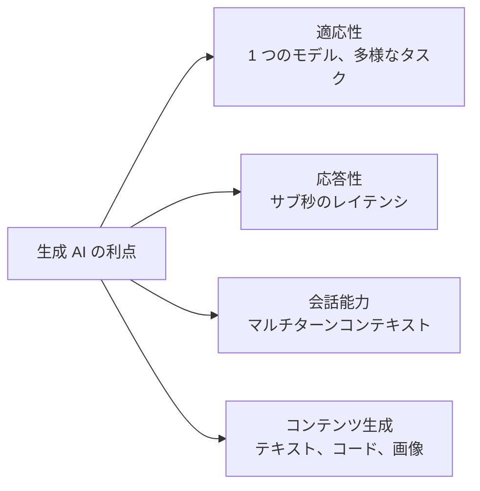
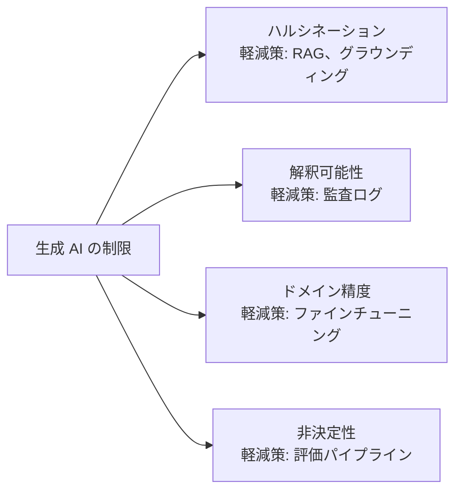
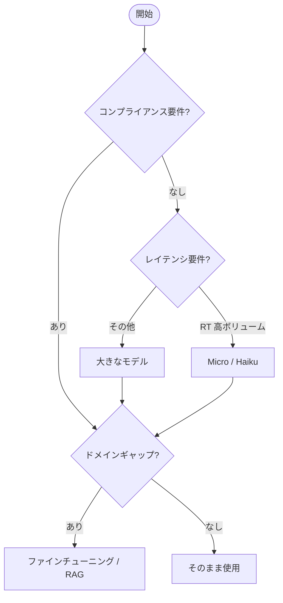
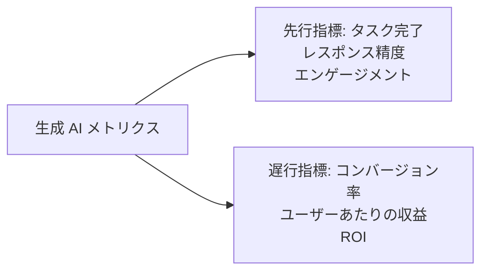

## タスクステートメント 2.2: ビジネス課題解決における生成 AI の能力と制限を理解する

生成 AI は、完全な再トレーニングなしに古典的な機械学習システムが処理できないタスクに対して、コンテンツを生成し、長時間の会話を維持し、適応することができます。その一方で、権威ある口調でハルシネーションを起こし、実行するたびに回答が変わり、学習データに薄くしか含まれていなかった専門分野では確信を持った誤りを生じさせることがあります。この方程式の両面を明確に述べられるビジネスの専門家こそが、生成 AI プロジェクトにいつ取り組むか、いつセーフガードを追加するか、そしていつ全く別のツールを使うかについて、健全な判断を下せます。このタスクステートメントでは、生成アプリケーションのビジネス価値を評価するために必要な利点、制限、モデル選択基準、メトリクスをカバーします。[^202001]

### 2.2.1 生成 AI の利点

古典的な機械学習モデルは 1 つの仕事のために作られています。不正検出モデルは不正を検出し、需要予測モデルは需要を予測します。各モデルを新しいタスク向けに再トレーニングするには、ラベリング、トレーニング、検証に数ヶ月かかります。生成 AI はこの制約を打ち破ります。単一の大規模言語モデルが、再トレーニングなしに異なるプロンプトを受け取るだけで、朝はマーケティングコピーを書き、午後は法的文書を要約できます。このシフトは、組織が AI プロジェクトに人員を配置する方法と、新たなビジネス要件への対応速度に実際的な影響をもたらします。

試験には生成 AI の 4 つの核心的な利点が挙げられています。適応性、応答性、会話能力、コンテンツ生成能力です。それぞれが以前の AI システムの異なる制限に対処し、それぞれが具体的なビジネス上の恩恵をもたらします。

*図 2.2.1: 生成 AI の 4 つの核心的利点。各利点は、生成モデルが克服する古典的な機械学習の制限に対応しています。*

**適応性**は、単一の基盤モデルが再トレーニングなしに幅広いタスクを処理する能力です。広範なテキストコーパスでトレーニングされたモデルは、プロンプトの変更だけで、メールの下書き、感情分類、固有表現の抽出、SQL クエリの生成、商品説明の作成をすべて行えます。例えば、小売業者は単一の **Amazon Bedrock** モデルを使って、朝は新しい SKU の商品説明を生成し、昼はそれらをフランス語とスペイン語に翻訳し、夕方は顧客レビューを要約できます。[^202002] 運用上の節約は現実的です。タスクごとに別々の専門モデルを保守する代わりに、単一の API エンドポイントがすべてを処理し、あるユースケース向けに構築されたプロンプトエンジニアリングのスキルが他のユースケースにも直接転用できます。

**応答性**とは、生成モデルが実現する低レイテンシの会話型インタラクションを指します。古典的なバッチ ML パイプラインはスループット向けに最適化されており、速度ではありません。数千のレコードを処理しますが、1 回の実行に数分かかる場合があります。生成 API は対照的に、数百ミリ秒以内にストリーミング形式でトークンを返します。これはインタラクティブなユーザー体験に十分な速さです。[^202003] 以前はヒューマンエージェントが情報を調べる必要があったカスタマーサービスアプリケーションが、代わりに 1 秒以内に質問に答えられます。例えば、Amazon Bedrock を使ったポリシー照会チャットボットをデプロイした保険会社は、ヒューマンループなしで、人間が返信を入力するのとほぼ同じ時間で保険内容の質問に完全に形成された回答を返せます。

**会話能力**は、生成モデルが複数ターンの対話にわたってコンテキストを維持する能力を表します。各応答後に以前のメッセージを忘れるルールベースのチャットボットと異なり、現代の大規模言語モデルは完全な会話履歴を*コンテキストウィンドウ*に保持し、自然にそれを参照できます。[^202004] ユーザーが「返金ポリシーは何ですか？」と尋ねた後に「セール品を購入した場合は？」と続けると、モデルは「それ」が先ほど言及した商品を指していることを理解します。このマルチターンの一貫性により、使いやすいサポートエージェント、セールスアシスタント、社内ナレッジツールが実現します。例えば、銀行はマルチターンの住宅ローン照会アシスタントをデプロイでき、いくつかの会話ターンを通じて申請者の雇用形態、ローンの目的、収入水準を収集してから対象商品を提示できます。これは従来のルールエンジンでは複雑な状態管理が必要なインタラクションパターンです。

**コンテンツ生成能力**とは、生成モデルが単に既存のコンテンツを分類または取得するのではなく、新しい出力を生成することを意味します。ブログ記事の下書きを書いたり、説明から Python 関数を生成したり、フォトリアリスティックな商品画像を合成したり、特定の注文 ID と感情に合わせたカスタマーメールを作成したりできます。[^202005] この生成的特性が基盤モデルと検索システムを区別するものです。検索エンジンは既存のドキュメントを取得します。生成モデルは新しいものを作成します。例えば、製薬会社は構造化された試験データから臨床試験サマリーレポートの最初の草稿を生成でき、医学ライターは最初の作成ではなくレビューと改良に集中できます。

### 2.2.2 生成 AI ソリューションの欠点

生成 AI の各利点には、実際のユーザーにシステムをデプロイする前に理解しなければならない制限が伴います。試験では特に 4 つの欠点が挙げられています。ハルシネーション、解釈可能性の問題、専門ドメインでの不正確さ、非決定性です。これらはどれも生成 AI を避ける理由ではありませんが、いずれも本番アプリケーションに軽減策を設計すべき理由です。

*図 2.2.2: 生成 AI の 4 つの核心的制限と各制限に対する軽減アプローチ。制限を認識することが適切なコントロールの選択に直結します。*

**ハルシネーション**は、生成モデルが流暢で文法的に正しいが事実として誤っている、捏造されている、またはソースドキュメントに基づいていない出力を生成する現象です。[^202006] モデルは自分が知らないことを知りません。プロンプトの統計的に最も確率の高い継続を生成し、その中には発明された名前、誤った統計、存在しない引用が含まれることがあります。例えば、生の生成モデルを使う法律調査ツールは、実際の引用と同じ確信のある口調で、存在しない事件への引用を生成することがあります。主な軽減策は*検索拡張生成（RAG）*で、モデルがパラメトリックメモリではなく取得されたドキュメントから回答することを要求するパターンです。[^202007] Amazon Bedrock Knowledge Bases は、モデルがレスポンスを生成する前に接続されたデータストアから関連するチャンクを取得することでこのパターンを実装し、検証できるドキュメントに出力を根拠づけます。追加のコントロールとして **Amazon Bedrock Guardrails** のコンテキストグラウンディングチェックがあり、取得されたソースドキュメントでサポートされていないレスポンスを検出してブロックできます。[^202008]

**解釈可能性の問題**は、大規模言語モデルが不透明であるために生じます。特定の出力を引き起こしたトレーニング例を追跡したり、モデルがある単語を別の単語より選んだ理由を人間の言葉で説明したりする簡単な方法はありません。[^202009] この不透明さは規制産業で問題を生じさせます。銀行の信用決定システムはローンを拒否するときに不利なアクション理由を提供しなければなりません。ブラックボックスの生成モデルは規制機関が必要とする構造化された形式でその説明を提供できません。軽減策は、生成 AI を解釈可能性が規制上の義務でないタスクに限定するか、モデルにソースを引用することを強制する推論レイヤーを追加することです。**Amazon SageMaker AI** と AWS のより広い説明可能性ツールセットは注意重みとトークンレベルの帰属を表示できますが、これらは真の因果的説明ではなく不完全な近似のままです。[^202010]

**グラウンディングなしの専門ドメインでの不正確さ**はハルシネーションとは異なる制限です。モデルは心臓学に関する一般的な事実を正確に思い出せても、病院の臨床プロトコル、保険コーディングルール、または独自の薬物相互作用に関する質問では失敗することがあります。これらのドキュメントはトレーニングコーパスに含まれていなかったためです。[^202011] 軽減策は、ファインチューニング（ドメイン固有のデータでモデルの重みを調整すること）または精選されたドメイン知識ベースを用いた RAG のどちらかです。Amazon Bedrock のカスタマイズ API を通じたファインチューニングは、狭く定義されたタスクの精度ギャップを埋めることができます。また、構造の良い知識ベースは再トレーニングのコストと時間なしにより広い情報検索を処理します。[^202012]

**非決定性**とは、モデルが他のすべての条件を一定に保っていても、同じプロンプトを受け取るたびに異なるレスポンスを生成する可能性があることを意味します。この特性は、ほとんどの生成モデル内部のサンプリングプロセスから生じます。モデルは決定論的にではなく確率的に次のトークンを選択するため、2 回の実行はわずか数トークン後に分岐することがあります。[^202013] 例えば、同じ顧客の苦情を 2 回要約するよう求められたモデルは、配送遅延を強調するレスポンスと商品品質を強調するレスポンスを生成するかもしれません。どちらも有効ですが同一ではありません。*温度（temperature）*パラメータはサンプリング中にモデルが適用するランダム性の量を制御します。温度が低いほど一貫性は高くなりますが、創造性は低くなります。非決定性の軽減策は、多くのサンプルにわたって出力を比較する厳格な評価パイプラインと、デプロイ前のエッジケースのヒューマンレビューです。Amazon Bedrock のモデル評価機能はテストプロンプトセットにわたる自動スコアリングをサポートし、予期しない分散を検出します。[^202014]

*表 2.2.1: 生成 AI の欠点、根本原因、ビジネスリスク、主要な軽減策*

| 欠点 | 根本原因 | ビジネスリスク | 主要な軽減策 |
|---|---|---|---|
| ハルシネーション | グラウンディングなしのパラメトリック生成 | 誤った情報が事実として提示される | RAG、Bedrock Guardrails |
| 解釈可能性 | 不透明なニューラルネットワークの重み | 規制上の非コンプライアンス | 非規制タスクに限定、監査ログ |
| ドメイン不正確さ | トレーニングコーパスのドメインデータ不足 | 専門ワークフローでの誤った回答 | ファインチューニング、ドメイン知識ベース |
| 非決定性 | 確率的トークンサンプリング | コンプライアンスタスクでの不一致な出力 | 評価パイプライン、温度チューニング |

### 2.2.3 生成 AI モデル選択の要素

ビジネスアプリケーション向けに生成 AI モデルを選択することは、主に技術的な決定ではなく、トレードオフの決定です。異なるモデルは異なるタスクで異なるパフォーマンスを発揮し、異なるコスト構造を持ち、異なるコンテキストウィンドウサイズをサポートし、異なるコンプライアンス姿勢を持っています。試験では 8 つの要素を通じて推論することが求められます。モデルの種類、パフォーマンス要件、能力、制約、コンプライアンス、コスト、レイテンシ、モデルの複雑さです。v1.1 更新では、ほとんどの本番決定がベンチマーク精度と同様に経済性と速度によって決まるという現実を反映して、コスト、レイテンシ、モデルの複雑さが目標に明示的に追加されました。

**Amazon Bedrock** は、インフラを管理することなく、統一された API を通じてサードパーティおよび Amazon ネイティブの基盤モデルにアクセスするための主要な AWS サービスです。[^202015] Bedrock を通じて利用可能なモデルはサイズ、能力、コストの幅広い範囲にわたっており、モデル選択の議論の自然な錨となっています。

*表 2.2.2: 能力層と選択基準による Amazon Bedrock モデルの例*

| モデルファミリー | 代表的なモデル | 強み | 典型的なレイテンシ | 相対コスト | 最適用途 |
|---|---|---|---|---|---|
| Amazon Nova | Nova Micro、Nova Lite、Nova Pro、Nova Premier | AWS ネイティブタスクに強い。多言語。マルチモーダル（Pro/Premier） | Micro: 非常に低い。Premier: 中程度 | Micro: 最低。Premier: 中程度 | 高ボリューム低コストタスク（Micro）。マルチモーダルエンタープライズアプリ（Premier） |
| Anthropic Claude | Claude Haiku 4.x、Sonnet 4.x、Opus 4.x | 長いコンテキストウィンドウ（標準 200K、Opus と Sonnet のベータヘッダーで 1M）。推論。指示への従順さ | Haiku: 低い。Opus: 高い | Haiku: 低い。Opus: 高い | カスタマーサポート（Haiku）。複雑な分析（Opus） |
| Meta Llama | Llama 4 Scout、Llama 4 Maverick | オープンウェイト。カスタマイズ可能。拡張コンテキストウィンドウ | 中程度 | 低から中程度 | カスタムファインチューニング。長文書分析。コスト重視の推論 |
| Mistral AI | Mistral 7B、Mixtral 8x7B | 効率的な mixture-of-experts。コードタスク | 低から中程度 | 低い | コード生成。開発者ツーリング |

試験目標の 8 つの要素は、このモデルランドスケープと次のように相互作用します。

**モデルの種類**とは、モデルのアーキテクチャとモダリティを指します。テキストのみのモデルは言語タスクを処理し、マルチモーダルモデルはテキスト、画像、動画、音声の組み合わせを処理します。[^202016] テキストのみを処理するカスタマーサービスアプリケーションは、より軽量で安価なテキストモデルを使用できます。テキストの説明と並行して画像を分類する商品検査アプリケーションには、Amazon Nova Pro などのマルチモーダルモデルが必要です。

**パフォーマンス要件**は、ユースケースが要求する精度と品質のベンチマークをカバーします。マーケティングコピージェネレーターは品質のある程度のばらつきを許容できます。対照的に、医療コーディングアシスタントはコーディングエラーがクレームの否認につながるため、高い精度を維持しなければなりません。MMLU（大規模多タスク言語理解）や HumanEval などのベンチマークスコアは出発点を提供しますが、最も信頼性の高いパフォーマンスシグナルは自分のタスク固有のテストセットでの評価です。[^202017]

**能力**とは、モデルが持つ必要のある特定の機能を指します。ツール使用（関数呼び出し）、コード生成、構造化出力（JSON モード）、または拡張コンテキストウィンドウなどです。例えば、推論中に外部 API を呼び出す必要があるアプリケーションには、すべてのモデルが実装しているわけではない関数呼び出しをサポートするモデルが必要です。[^202018]

**制約**は、データ居住地要件、承認済みベンダーリスト、オンデバイスデプロイ向けのモデルサイズ制限を含む組織的な制限をカバーします。Amazon Bedrock のクロスリージョン推論とプロビジョニングスループットオプションにより、アーキテクトはデータ居住地の制約内で働きながら可用性を維持できます。[^202019]

**コンプライアンス**は、規制と業界の要件をカバーします。HIPAA が適用されるヘルスケアアプリケーションは、HIPAA 対象サービス境界内でデプロイされたモデルを使用しなければなりません。金融アプリケーションは特定の外部モデルプロバイダーを排除するデータ送出制限に直面することがあります。Business Associate Agreement サポートを持つ AWS サービスは、ヘルスケアユースケースの対象モデルリストを絞り込みます。[^202020]

**コスト**は成熟したデプロイにおいて決定的な要素となりつつあります。トークンベースの料金体系は、推論あたりのコストがコンテキストの長さとともに増加することを意味します。長いシステムプロンプト、few-shot の例、大きな取得済みチャンクはすべてトークン数を増やし、したがって請求額を増加させます。[^202021] Amazon Nova Micro は、手頃な価格が主要な制約である高ボリューム低コストのテキストタスク向けに設計されています。1 日に 100 万回の API 呼び出しでは、Micro 層と Premier 層のモデルの差は月に数万ドルに達する可能性があります。

**レイテンシ**は、モデルがリアルタイムのインタラクティブアプリケーションに適しているかを決定します。応答に 2 秒かかるモデルは、バッチ文書処理パイプラインでは許容されますが、ユーザーが数百ミリ秒以内の応答を期待するライブカスタマーチャットウィジェットでは許容されません。[^202022] Amazon Nova Micro は Amazon Nova ファミリーの最低レイテンシ層を対象としています。Amazon Bedrock のプロビジョニングスループットは、レイテンシに敏感な本番ワークロードのレイテンシ分散を削減できます。

**モデルの複雑さ**とは、パラメータ数、アーキテクチャの深さ、モデルが保持できるコンテキストウィンドウのサイズを指します。より複雑なモデルは一般的に微妙なタスクでより良いパフォーマンスを発揮しますが、トークンあたりの速度は遅く、コストが高くなります。[^202023] 70 億パラメータのモデルは単純な要約を十分に処理できるかもしれませんが、100,000 トークンの法的文書にわたるマルチステップ推論には 2,000 億パラメータのモデルが必要になる場合があります。タスクの実際の難しさに複雑さを合わせることで、品質を犠牲にせずにコストを管理できます。

*図 2.2.3: 生成 AI モデル選択の決定フロー。コンプライアンス、レイテンシ、ボリューム、ドメイン精度のギャップが順番に実行可能なモデルセットをフィルタリングします。同じフローが Amazon Nova、Anthropic Claude、Meta Llama、Mistral など基盤となるモデルが何であっても適用されます。*

### 2.2.4 生成 AI アプリケーションのビジネス価値とメトリクス

生成 AI の採用はビジネス上の投資であり、すべての投資は測定可能な成果に照らして評価されなければなりません。試験目標には 7 つのメトリクスが挙げられています。クロスドメインパフォーマンス、ROI、効率、コンバージョン率、ユーザーあたりの平均収益、精度、顧客生涯価値です。これらのメトリクスは 2 つの自然なグループに分類されます。*先行指標*はデプロイの早期段階で、多くの場合数週間以内に観察できます。タスク完了率、エンゲージメントボリューム、テストセットでのレスポンス精度などです。*遅行指標*は下流の顧客行動に依存するため、具体化するまでに時間がかかります。ユーザーあたりの収益、顧客生涯価値、チャーン率などです。成熟した AI 測定プログラムは両方を追跡し、先行指標を使ってシステムを調整しながら、遅行指標がビジネスへの影響を確認するのを待ちます。

*図 2.2.4: 生成 AI ビジネス価値の先行指標と遅行指標。先行指標はシステムの健全性を示し、遅行指標はシステムの健全性が財務的成果に変換されることを確認します。*

**クロスドメインパフォーマンス**は、複数のビジネス機能に適用されたときに生成モデルが品質を維持する度合いを測定します。[^202024] カスタマーサポートでは優れていても社内 HR クエリでは不十分なモデルは、各ドメインに対して別々のプロンプティング戦略または別々のファインチューニングバリアントが必要になる場合があります。例えば、配送追跡、配送業者交渉支援、通関書類にわたって単一の基盤モデルをテストしているロジスティクス企業は、クロスドメイン精度スコアにより、本格的なデプロイ前にどのドメインで追加のグラウンディングが必要かを明らかにできます。

**ROI（投資対効果）**は、生成 AI アプリケーションを構築・運用するコストに対して生み出す価値の財務的リターンを定量化します。[^202025] 計算は、運用上の節約（人間エージェントの削減、文書処理の高速化、エラー修正コストの削減）と収益の増加（高いコンバージョン、新しい製品機能）を、モデル推論コスト、開発作業、継続的な評価オーバーヘッドと比較します。1 次問い合わせの 40% を自動化に deflect するコンタクトセンターアシスタントは、deflect 率が上がるにつれて測定可能な ROI を生み出します。各 deflect されたコールが労働コストの単位を排除するためです。ROI は v1.1 で試験目標に明示的に追加されました。ビジネスのステークホルダーが AI プロジェクトを他のあらゆる技術投資に適用するのと同じ財務的厳格さで評価することが期待されるようになったことを反映しています。

**効率**は、生成 AI を使ってプロセスがベースラインと比較してどれだけ速くまたは安く実行されるかを捉えます。[^202026] 効率メトリクスには、タスクあたりの時間（AI の助けありとなしでアナリストがリサーチブリーフを完了するのにかかる時間）、スループット（システムが 1 時間あたりに処理するサポートチケットの数）、単位あたりのコスト（1 つの商品説明を生成するトークンコスト対コピーライターが同じアイテムを制作する人件費）が含まれます。例えば、生成 AI を使って契約書サマリーの最初の草稿を生成する法律事務所は、各契約書に費やす平均弁護士時間を 45 分から 8 分に短縮でき、プラットフォームコストを正当化する文書化された効率比率です。

**コンバージョン率**は、購入完了、ローン申請提出、サービス予約のような望ましいアクションを完了した見込み客またはユーザーの割合を測定します。[^202027] 生成 AI は、主要な意思決定時点でユーザーが目にするコンテンツをパーソナライズすることでコンバージョンに影響します。すべての訪問者に同じバナーを表示するのではなく、各訪問者向けにパーソナライズされたプロモーションコピーを生成するレコメンデーションエンジンは、コンバージョン率を測定可能に向上させることができます。例えば、Amazon Bedrock モデルを使って訪問者の閲覧履歴に合わせた動的な商品説明を生成する EC プラットフォームは、静的な説明を受け取るコントロールグループよりも高いカートへの追加率を報告しています。

**ユーザーあたりの平均収益（ARPU）**は、ある期間における総収益をアクティブユーザー数で割ったものを測定します。[^202028] 生成 AI は、会話内でアップセルの機会を発見すること（基本層の商品について尋ねているユーザーを検出して自然にプレミアムオプションに言及するチャットボット）、サービス離脱を減らすこと、または個人の購買パターンに合ったパーソナライズされたオファーを生成することによって ARPU を増加させることができます。例えば、生成 AI を使ってコンテンツのレコメンデーションをパーソナライズし、購読者固有のメールキャンペーンを作成するストリーミングサービスは、汎用メッセージングを受け取るコントロールグループと比較して、処置グループでより高い ARPU を報告しています。

**精度**は、ビジネスの文脈において、人間による修正なしに使用するのに十分正確かつ完全な生成 AI 出力の割合を意味します。[^202029] 精度はタスク固有のラベル付き評価セットに対して測定されます。100 問のテスト問題のうち 95 問に正解するモデルは、そのテストセットで 95% の精度を持ちます。精度は、医療コーディング、財務コンプライアンス報告、自動法的条項抽出など、エラーにコストが伴うユースケースの最も直接的な品質メトリクスです。Amazon Bedrock のモデル評価機能により、チームはモデルやプロンプトの変更の前後にタスク固有のベンチマークセットに対して自動精度評価を実行できます。[^202030]

**顧客生涯価値（CLV）**は、企業が顧客関係の期間にわたって期待する総純収益です。[^202031] 生成 AI は、保持を改善することで（より良いサポートを受けた顧客はより長く留まる）、顧客が使用するサービスの範囲を拡大することで（パーソナライズされたアシスタントが顧客が知らなかった製品を発見させる）、プロアクティブなエンゲージメントによってチャーンを減らすことで CLV に影響します。CLV は遅行指標であり、通常は四半期後に観察されます。例えば、生成 AI アドバイザリーチャットボットをデプロイする金融機関は、精度とエンゲージメントの初期メトリクスを数週間以内に確認できますが、CLV の改善は、AI 支援を受けた顧客のコホートが歴史的なベースラインよりも低い離脱を示す 6 ヶ月から 12 ヶ月後にのみ見えてきます。

*表 2.2.3: 生成 AI ビジネスメトリクス: 種類、測定アプローチ、ビジネス例*

| メトリクス | 指標の種類 | 測定方法 | ビジネス例 |
|---|---|---|---|
| クロスドメインパフォーマンス | 先行 | ホールドアウトテストセットでのドメインごとの精度スコア | 展開前に 3 つの機能領域でテストされたロジスティクスモデル |
| ROI | 遅行 | (コスト節約 + 収益増加) / 総投資 | チケットあたりの平均人件費に deflect 率を乗じたコンタクトセンター |
| 効率 | 先行 | AI 前後のタスクあたりの時間またはユニットあたりのコスト | 契約サマリー時間が 45 分から 8 分に短縮 |
| コンバージョン率 | 遅行 | 完了したアクション / 総機会 | AI 生成の説明 vs 静的説明のカートへの追加率の向上 |
| ユーザーあたりの平均収益 | 遅行 | 期間あたりの総収益 / アクティブユーザー | パーソナライズされたキャンペーンからのストリーミングサービス ARPU 向上 |
| 精度 | 先行 | 評価セットでの正しい出力 / 総出力 | 100 問のコーディングベンチマークで 95% の精度 |
| 顧客生涯価値 | 遅行 | 関係期間にわたる予測純収益 | 12 ヶ月後の AI 支援コホートでの低い離脱 |

実際的な測定プログラムは遅行指標を待ってから行動するわけではありません。シーケンスは次のとおりです。1 日目から先行指標を計測してデプロイし、先行指標がターゲットに達するまでモデルとプロンプトを調整し、次に遅行指標が運用上の改善が財務的価値に変換されることを確認するまで待ちます。AWS の **Amazon CloudWatch** メトリクスとカスタムダッシュボードは、推論レイテンシ、エラー率、モデル呼び出し数などの運用上の先行指標を追跡でき、ビジネスインテリジェンスツールは下流の収益と保持メトリクスを追跡します。[^202032]

---

## セルフチェック問題

**問題 1**

ある小売会社が生成 AI の商品説明ジェネレーターをデプロイしました。品質レビュー中、チームはモデルがソースデータに記載されていない食品の栄養属性を時々発明することに気づきました。この動作を最もよく表す生成 AI の欠点はどれで、チームが最初に実施すべき軽減策は何ですか？

A. 非決定性。出力のばらつきを減らすためにモデルの温度を下げる。
B. ハルシネーション。商品カタログにレスポンスを根拠づけるために検索拡張生成を実装する。
C. 解釈可能性。レビュアーがどのトレーニングデータがレスポンスに影響を与えたかを追跡できるよう監査ログを追加する。
D. ドメイン不正確さ。精選された食品データセットでモデルをファインチューニングする。

ハルシネーションは、生成モデルが流暢で確信に満ちた、しかし事実の出典に根拠を持たない出力を生成する現象です。モデルの統計的な次トークン予測プロセスは、商品カタログのどこにも表示されない、もっともらしく聞こえる栄養情報を生成することがあります。これはドメイン不正確さ（トレーニングコーパスに特化した知識が欠如していること）とは異なります。なぜならモデルは単に知識がないのではなく、積極的にコンテンツを発明しているからです。温度の低下（回答 A）は出力スタイルのばらつきを減らしますが、モデルが事実を捏造するのを防ぎません。解釈可能性ツーリング（回答 C）は出力を追跡するのに役立ちますが、ハルシネーションの発生を止めません。ファインチューニング（回答 D）はモデルの重みを調整し、ドメイン不正確さに役立ちますが、カタログ固有の事実のグラウンディング問題に対しては、RAG の方が実装が速くより的を絞っています。モデルはパラメトリックメモリではなく取得された商品レコードからレスポンスを生成するよう制約されます。Amazon Bedrock Knowledge Bases は、モデルを検索可能な商品カタログに接続するマネージドな RAG 実装を提供し、生成された説明のすべての属性がソースドキュメントに追跡できることを保証します。[^202033]

**問題 2**

ある会社が高ボリュームのカスタマーサポートチャットボット向けに Amazon Nova Micro と Amazon Nova Premier のどちらかを選択しています。このチャットボットは 500 ミリ秒以内に応答しなければならず、1 日あたり約 200 万件のインタラクションを処理します。このワークロードに対して Nova Premier よりも Nova Micro を推奨する要因として最も直接的なものはどれですか？

A. コンプライアンス要件により、顧客向けアプリケーションでの大きなモデルの使用が制限されている。
B. Nova Premier はコンテキストウィンドウが小さく、マルチターンの会話履歴を保持できない。
C. レイテンシとコストにより、Nova Micro が高ボリューム、レイテンシ重視、コスト重視のワークロードに適した選択肢となる。
D. Nova Micro はマルチモーダル入力をサポートしており、チャットアプリケーションに適している。

質問には 2 つの顕著な制約があるワークロードが説明されています。500 ミリ秒のレイテンシ上限と 200 万件の日次インタラクションのボリュームです。どちらの制約も同じ方向を指しています。Nova Micro は Amazon Nova ファミリーの最低レイテンシ、最低コスト層として位置付けられており、手頃な価格と速度が主要な要件である高ボリュームタスクのために特別に設計されています。Nova Premier はファミリーの中で最も高機能ですが、最も高価でレイテンシが最も高いオプションでもあります。高ボリュームの会話型サポートではなく、複雑なマルチステップ推論タスクに適しています。回答 A はシナリオに記載されていないコンプライアンス根拠を導入しています。回答 B は両方の点で事実として誤りです。Nova Premier は Nova Micro よりも大きいコンテキストウィンドウを持っており、任意の Bedrock モデルはコンテキストウィンドウの上限まで会話履歴を保持できるため、会話能力は層によって制限されません。回答 D は不正解です。マルチモーダル入力は Nova Pro と Nova Premier の機能であり、Nova Micro ではありません。正解は C です。レイテンシ要件（500ms 未満）とボリューム（1 日あたり 200 万コール）により、コストとレイテンシが支配的なモデル選択要素となり、Nova Micro はその組み合わせのために設計された層です。[^202034]

**問題 3**

あるエンタープライズ AI チームが生成 AI 文書処理ソリューションのビジネスケースを提示しています。CFO がデプロイの最初の 90 日以内に財務的価値を実証する方法を尋ねています。初期の財務的インパクトを実証するのに最適なメトリクスはどれですか？

A. ユーザーコホートの予測 CLV の変化として測定される顧客生涯価値。
B. 手動のベースラインと比較したドキュメントあたりの時間とドキュメントあたりのコストとして測定される効率。
C. フォローアップ販売を引き起こすドキュメントの割合として測定されるコンバージョン率。
D. デプロイ後の最初の請求サイクルにわたって測定されるユーザーあたりの平均収益。

顧客生涯価値とユーザーあたりの平均収益は遅行指標であり、統計的に意味のある変化が見えるまでに通常数ヶ月から四半期の観察が必要です。最初の 90 日以内には、どちらのメトリクスも防御可能な結論を実証するのに十分なデータが蓄積されません。コンバージョン率は販売志向のアプリケーションでは妥当なメトリクスですが、文書処理は顧客向けの販売ファネルではなく、内部の運用ワークフローであり、コンバージョン率は不適切です。効率は運用自動化プロジェクトの自然な 90 日間メトリクスです。チームは AI システムが導入される前にアナリストが文書を処理するのにかかった時間を測定し、AI の助けを借りた同じタスクを測定し、稼働日から即座に時間の節約と人件費の削減を計算できます。CFO は縦断的な顧客データを必要とせず、ドルに直接変換できる具体的な数字（例えば「平均文書処理時間が 42 分から 9 分に短縮し、現在の文書ボリュームで週あたり約 330 アナリスト時間を節約しています」）を受け取ります。[^202035]

**問題 4**

あるヘルスケアテクノロジー企業が臨床文書アシスタントの生成 AI モデルを評価しています。このソリューションは HIPAA 対象サービス境界内で動作しなければならず、生成されたサマリーで行うすべての主張について患者記録からのソース文を引用しなければなりません。この評価に最も関連する 2 つのモデル選択要素はどれですか？

A. モデルの複雑さとコンバージョン率。
B. コンプライアンスと能力。
C. レイテンシとユーザーあたりの平均収益。
D. コストとクロスドメインパフォーマンス。

シナリオには 2 つの異なる要件が示されています。最初は規制上のもので、ソリューションは HIPAA 対象の境界内で動作しなければなりません。これは対象モデルとデプロイ設定のセットを直接制限するコンプライアンス要素です。Amazon Bedrock を通じて利用可能なすべてのモデルが HIPAA 対象の設定でアクセスできるわけではないため、コンプライアンスは他のすべての要素が評価される前に解決しなければならないゲーティング基準です。2 番目の要件は、モデルがソース文を引用しなければならないというもので、これは能力要件です。モデルは、構造化出力を通じてネイティブに、またはソース参照を生成テキストと並んで返す RAG アーキテクチャを通じて、引用またはソース帰属メカニズムをサポートしなければなりません。コンバージョン率（回答 A）とユーザーあたりの平均収益（回答 C）はビジネス成果メトリクスであり、モデル選択基準ではありません。コストとクロスドメインパフォーマンス（回答 D）はあらゆるデプロイで重要ですが、シナリオで明示的に述べられた HIPAA と引用の要件を考えると最も関連性の高い要素ではありません。正解は B です。[^202036]

**問題 5**

あるプロダクトチームが生成 AI アシスタントをデプロイし、同じサポート質問が時々ある解決パスを強調した回答を受け取り、時々別の解決パスを強調した回答を受け取ることに気づきます。どちらの回答も技術的に正しいにもかかわらず、チームは軽減策を決定する前に、この動作を最もよく説明する生成 AI の特性を理解したいと思っています。

A. ハルシネーション。モデルが知識ベースに表示されないコンテンツを生成しているため。
B. 解釈可能性の問題。モデルがある解決パスを別のパスより選んだ理由を説明できないため。
C. 非決定性。モデルが各ステップで確率分布から次のトークンをサンプリングするため。
D. ドメイン不正確さ。モデルが特定のサポートシナリオでトレーニングされていなかったため。

シナリオでは両方の出力が技術的に正しいが異なるという状況が説明されています。これが非決定性の定義的な特性です。モデルのサンプリングプロセスは、両方の出力が有効であっても、実行間で可変性を引き起こします。ハルシネーション（回答 A）はモデルが事実として誤ったコンテンツを生成することを含みます。シナリオでは両方の回答が正しいと明示的に述べています。解釈可能性（回答 B）はモデルの決定を説明する能力についてです。実行間の出力可変性についてではありません。ドメイン不正確さ（回答 D）は不正確または不完全な回答として現れます。2 つの異なる正しい回答としてではありません。サポートの文脈での非決定性の軽減策は、ビジネス要件によって異なります。一貫性が必須の場合（例えば規制された金融アドバイスで）、チームはサンプリングの分散を減らすために温度パラメータを下げ、ハイバリアンスのプロンプトをヒューマンレビューのためにフラグする評価パイプラインを追加できます。Amazon Bedrock のモデル呼び出しログはすべてのリクエストとレスポンスを記録し、チームが実行間の分散を監査し、どの質問タイプが最も分岐する出力を生成するかを特定できます。[^202037]

---

[^202001]: AWS Certification Exam Guide AIF-C01 v1.1, Task Statement 2.2. URL: <https://docs.aws.amazon.com/aws-certification/latest/ai-practitioner-01/ai-practitioner-01-domain2.html>
[^202002]: Amazon Bedrock User Guide: Supported foundation models. URL: <https://docs.aws.amazon.com/bedrock/latest/userguide/models-supported.html>
[^202003]: Amazon Bedrock User Guide: Invoke a model to run inference. URL: <https://docs.aws.amazon.com/bedrock/latest/userguide/inference.html>
[^202004]: Amazon Bedrock User Guide: Conversation history and context windows. URL: <https://docs.aws.amazon.com/bedrock/latest/userguide/conversation-inference.html>
[^202005]: Amazon Bedrock User Guide: Content generation with foundation models. URL: <https://docs.aws.amazon.com/bedrock/latest/userguide/what-is-bedrock.html>
[^202006]: NIST AI 600-1: Artificial Intelligence Risk Management Framework: Generative AI. URL: <https://nvlpubs.nist.gov/nistpubs/ai/nist.ai.600-1.pdf>
[^202007]: Amazon Bedrock User Guide: Knowledge Bases for Amazon Bedrock. URL: <https://docs.aws.amazon.com/bedrock/latest/userguide/knowledge-base.html>
[^202008]: Amazon Bedrock User Guide: Amazon Bedrock Guardrails. URL: <https://docs.aws.amazon.com/bedrock/latest/userguide/guardrails.html>
[^202009]: AWS Machine Learning Blog: Explainability in large language models. URL: <https://aws.amazon.com/blogs/machine-learning/>
[^202010]: Amazon SageMaker AI Developer Guide: Amazon SageMaker Clarify. URL: <https://docs.aws.amazon.com/sagemaker/latest/dg/clarify-model-explainability.html>
[^202011]: Amazon Bedrock User Guide: Custom model fine-tuning. URL: <https://docs.aws.amazon.com/bedrock/latest/userguide/custom-models.html>
[^202012]: Amazon Bedrock User Guide: Fine-tuning and continued pre-training. URL: <https://docs.aws.amazon.com/bedrock/latest/userguide/custom-models.html>
[^202013]: Hugging Face Documentation: Text generation and sampling strategies. URL: <https://huggingface.co/docs/transformers/generation_strategies>
[^202014]: Amazon Bedrock User Guide: Model evaluation in Amazon Bedrock. URL: <https://docs.aws.amazon.com/bedrock/latest/userguide/model-evaluation.html>
[^202015]: Amazon Bedrock User Guide: What is Amazon Bedrock? URL: <https://docs.aws.amazon.com/bedrock/latest/userguide/what-is-bedrock.html>
[^202016]: Amazon Nova User Guide: Amazon Nova model capabilities. URL: <https://docs.aws.amazon.com/nova/latest/userguide/what-is-nova.html>
[^202017]: Papers With Code: MMLU Benchmark. URL: <https://paperswithcode.com/dataset/mmlu>
[^202018]: Amazon Bedrock User Guide: Tool use (function calling) with Amazon Bedrock. URL: <https://docs.aws.amazon.com/bedrock/latest/userguide/tool-use.html>
[^202019]: Amazon Bedrock User Guide: Cross-region inference. URL: <https://docs.aws.amazon.com/bedrock/latest/userguide/inference-profiles-cross-region.html>
[^202020]: AWS Compliance: HIPAA Eligible Services. URL: <https://aws.amazon.com/compliance/hipaa-eligible-services-reference/>
[^202021]: Amazon Bedrock Pricing. URL: <https://aws.amazon.com/bedrock/pricing/>
[^202022]: Amazon Bedrock User Guide: Provisioned throughput. URL: <https://docs.aws.amazon.com/bedrock/latest/userguide/prov-throughput.html>
[^202023]: Amazon Nova User Guide: Choosing the right Amazon Nova model. URL: <https://docs.aws.amazon.com/nova/latest/userguide/nova-pro-overview.html>
[^202024]: AWS Well-Architected Framework: Machine Learning Lens: Performance pillar. URL: <https://docs.aws.amazon.com/wellarchitected/latest/machine-learning-lens/performance-pillar.html>
[^202025]: AWS Executive Insights: Measuring ROI for generative AI. URL: <https://aws.amazon.com/executive-insights/content/calculating-roi-of-generative-ai/>
[^202026]: McKinsey Global Institute: The economic potential of generative AI. URL: <https://www.mckinsey.com/capabilities/mckinsey-digital/our-insights/the-economic-potential-of-generative-ai>
[^202027]: Amazon Personalize Developer Guide: Measuring recommendation effectiveness. URL: <https://docs.aws.amazon.com/personalize/latest/dg/getting-started.html>
[^202028]: AWS Retail Competency: AI-driven personalization and ARPU. URL: <https://aws.amazon.com/retail/>
[^202029]: Amazon Bedrock User Guide: Evaluate model accuracy with model evaluations. URL: <https://docs.aws.amazon.com/bedrock/latest/userguide/model-evaluation.html>
[^202030]: Amazon Bedrock User Guide: Automated model evaluation jobs. URL: <https://docs.aws.amazon.com/bedrock/latest/userguide/model-evaluation-jobs.html>
[^202031]: AWS Customer Experience: Improving customer lifetime value with AI. URL: <https://aws.amazon.com/customer-engagement/>
[^202032]: Amazon CloudWatch User Guide: Metrics, alarms, and dashboards. URL: <https://docs.aws.amazon.com/AmazonCloudWatch/latest/monitoring/working_with_metrics.html>
[^202033]: Amazon Bedrock User Guide: Retrieval Augmented Generation with Knowledge Bases. URL: <https://docs.aws.amazon.com/bedrock/latest/userguide/knowledge-base-overview.html>
[^202034]: Amazon Nova User Guide: Amazon Nova Micro model overview. URL: <https://docs.aws.amazon.com/nova/latest/userguide/nova-micro-overview.html>
[^202035]: AWS Well-Architected Framework: Operational Excellence pillar: measuring improvement. URL: <https://docs.aws.amazon.com/wellarchitected/latest/operational-excellence-pillar/welcome.html>
[^202036]: AWS Compliance: HIPAA and Health Information Portability. URL: <https://aws.amazon.com/compliance/hipaa-compliance/>
[^202037]: Amazon Bedrock User Guide: Model invocation logging. URL: <https://docs.aws.amazon.com/bedrock/latest/userguide/model-invocation-logging.html>
