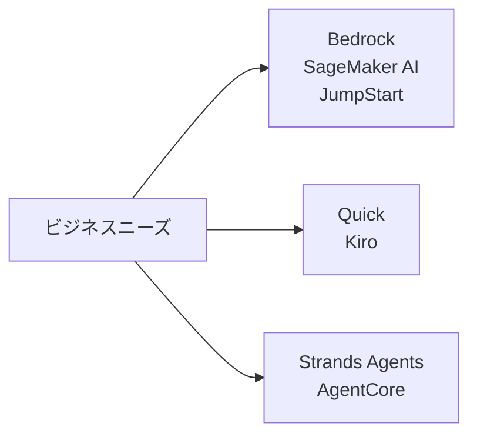
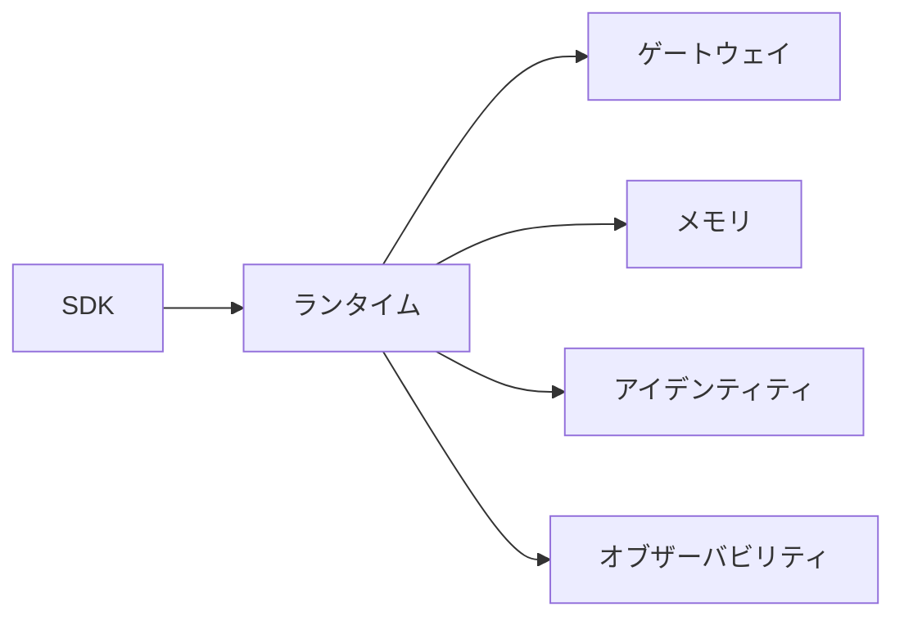
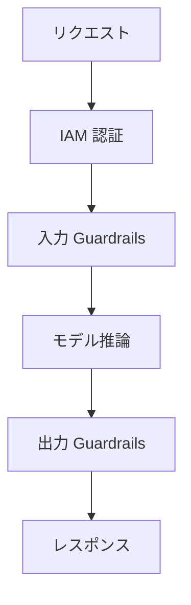
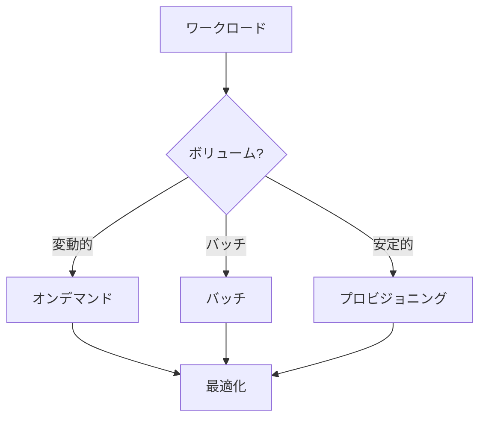
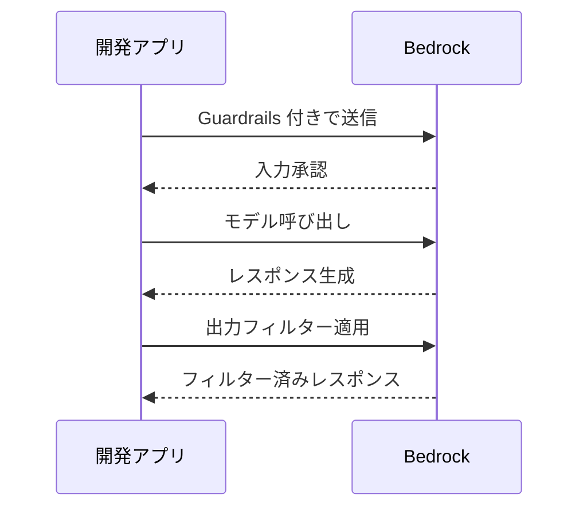

## タスクステートメント 2.3: 生成 AI アプリケーション構築のための AWS インフラとテクノロジーを説明する

AWS 上で生成 AI アプリケーションを構築するには、開発スペクトラムの異なるポイントをターゲットにしたマネージドサービスと開発者ツールの成長するセットから選択する必要があります。タスク 2.3 は 4 つの目標をカバーします。v1.1 試験ガイドで指定された AWS サービス、それらを使用する利点、それらが AWS から継承するセキュリティとコンプライアンスの特性、そして本番環境でチームが直面するコスト上の決定です。[^203001]

*図 2.3.1: AWS 上での生成 AI 作業の 3 つのエントリポイント。Bedrock と SageMaker ファミリーはマネージドモデル API とカスタムトレーニングをカバーし、Quick と Kiro はビジネスと開発者アシスタントをカバーし、Strands Agents と AgentCore はエージェントフレームワークとランタイムをカバーします。*

このタスクステートメントのサービスは単一の次元で競合するものではありません。チームは同じプロジェクト内で、**Amazon Bedrock** をモデル API として使用し、そのアプリケーションを **Amazon Bedrock AgentCore** を通じてデプロイし、**Kiro** の中で開発作業を自動化し、**Amazon Quick** を通じてビジネスデータをクエリすることもできます。以下のセクションでは、各サービス、AWS プラットフォームを使用することの総合的な利点、その下にあるセキュリティとコンプライアンスのインフラ、そして総所有コストを決定する料金のメカニズムを説明します。

### 2.3.1 生成 AI アプリケーション向け AWS サービスと機能

AWS v1.1 試験ガイドは、生成 AI アプリケーション構築のために 7 つのサービスとツールファミリーを指定しています。Amazon Bedrock、Amazon SageMaker AI、Amazon SageMaker JumpStart、Amazon Quick、Kiro、Strands Agents、Amazon Bedrock AgentCore です。[^203002] 各サービスは特定のニッチを占め、各サービスの位置付けを理解することで、過剰なエンジニアリングとプラットフォーム機能への過小投資の両方を防げます。

**Amazon Bedrock** は、GPU インフラをプロビジョニングまたは管理することなく、複数のプロバイダーから精選された基盤モデルのカタログへの API アクセスを提供するフルマネージドサービスです。[^203003] チームは単一のエンドポイントを呼び出し、モデル識別子を指定し、トークンごとに課金される生成レスポンスを受け取ります。基盤となるインフラ、モデルの重み、スケーリングロジックは呼び出し元には完全に見えません。

Amazon Bedrock を通じて利用可能なモデルカタログには、Amazon 独自モデル、サードパーティの研究機関、オープンウェイトのオプションが含まれます。

- **Amazon Nova** モデル（Nova Micro、Nova Lite、Nova Pro、Nova Premier）は Amazon 独自のシリーズで、テキストのみの低レイテンシ層から画像、動画、ドキュメントを処理できるマルチモーダルフラグシップまで多様です。[^203004]
- **Anthropic Claude**（Claude 4.x 世代: Haiku 4.x、Sonnet 4.x、Opus 4.x）は推論、構造化出力、長コンテキスト分析に優れています。Claude Opus と Sonnet はデフォルトで 20 万トークンのコンテキストウィンドウをサポートし、1M コンテキストベータヘッダーで 100 万トークンに対応します。[^203005]
- **Meta Llama** モデルはテキスト生成、コーディング、対話タスクに適したオープンウェイトの大規模言語モデルです。[^203006]
- **Mistral AI** モデル（Mixtral を含む）は効率的なトークン消費で指示への従順さと多言語タスクに優れています。[^203007]
- **AI21 Labs Jamba** はエンタープライズのテキスト生成と長コンテキスト処理をターゲットにしています。[^203008]
- **Cohere Command** モデルは検索、分類、エンタープライズ検索に最適化されています。[^203009]
- **Stability AI** モデルは画像とマルチモーダル生成タスクを処理します。[^203010]

生のモデルアクセスを超えて、Amazon Bedrock は本番グレードのアプリケーション構築のための一連の機能を組み合わせています。**Amazon Bedrock の Knowledge Bases** は完全な*検索拡張生成（RAG）*パイプラインを管理します。Amazon S3 または他のソースからドキュメントを取り込み、チャンク化し、ベクトルエンベディングを生成し、マネージドベクトルストアに格納し、推論時に関連するチャンクを取得します。[^203011] **Amazon Bedrock Guardrails** は入力プロンプトとモデル出力の両方に設定可能なコンテンツポリシーを適用し、有害なカテゴリをフィルタリングし、禁止トピックをブロックし、*個人識別情報（PII）*を編集し、レスポンスをソースマテリアルと比較してハルシネーションを検出する*コンテキストグラウンディングチェック*を実行します。[^203012] **Amazon Bedrock Prompt Management** はチーム全体でプロンプトテンプレートを保存、バージョン管理、共有し、同じ最適化されたプロンプトが本番環境で一貫して使用されるようにします。[^203013] **Amazon Bedrock Model Evaluation** は、精度、堅牢性、毒性、タスク固有のメトリクスでモデルレスポンスをスコアリングする自動および人間による評価ベンチマークジョブを実行し、チームがコミットする前にモデルを比較できます。[^203014] **Amazon Bedrock の Agents** は、単一のオーケストレートされたセッション内でモデルが外部 API を呼び出し、Knowledge Bases をクエリし、AWS Lambda 関数を*ツール*として実行できるようにすることで、マルチステップのエージェント型ワークフローを調整します。[^203015] **Amazon Bedrock Flows** は、オーケストレーションコードを書かずにプロンプトとサブエージェントを構造化されたパイプラインにチェーンするためのビジュアルワークフロービルダーを提供します。[^203016]

**Amazon SageMaker AI** は、自分たちのモデルをトレーニング、ファインチューニング、評価、ホストする必要があるチームのための AWS のフル機能の機械学習プラットフォームです。[^203017] Amazon Bedrock がモデルを完全に抽象化するのに対し、Amazon SageMaker AI は完全なトレーニングと推論スタックを公開します。データサイエンスチームは SageMaker AI を使って GPU クラスターで分散トレーニングジョブを実行し、モデルを SageMaker Model Registry に登録し、リアルタイム推論エンドポイントにデプロイし、本番環境でのデータドリフトを監視します。生成 AI 固有の用途としては、チームが独自データで大規模にオープンウェイト基盤モデルをファインチューニングする必要がある場合、または推論レイテンシやスループット要件が共有 API エンドポイントではなくカスタムコンテナデプロイを要求する場合に SageMaker AI が選ばれます。

**Amazon SageMaker JumpStart** は、事前トレーニング済みモデル、ソリューションテンプレート、ワンクリックデプロイアクションのカタログを提供することで出発点を加速する SageMaker AI の機能です。[^203018] 実務者は Hugging Face、TII（Falcon シリーズ）、その他のプロバイダーのモデルを閲覧し、選択したモデルをトレーニングコードを書かずに数クリックまたは単一の API 呼び出しでプライベートな SageMaker エンドポイントにデプロイできます。JumpStart は Amazon Bedrock の利便性とカスタム SageMaker AI デプロイの完全な柔軟性の間のギャップを埋めます。モデルはアカウントのインフラで実行され、エンドポイントを制御でき、必要に応じてさらにファインチューニングできます。

**Amazon Quick** は AWS の統合されたビジネスユーザー向け分析と AI アシスタントファミリーです。2025 年、AWS は Amazon QuickSight と Amazon Q のビジネスインテリジェンス向け部分をこの単一の名称でリブランドし、既存の QuickSight ユーザーは新製品に移行されました。[^203019] ビジネスユーザーは自然言語インターフェースを通じて Amazon Quick と対話し、エンジニアリングチームを巻き込まずにデータウェアハウスをクエリし、グラフを生成し、SQL を書き、レポートを要約できます。Amazon Quick は 4 つの層で構成されています。Free、Plus、Professional、Enterprise です。Enterprise 層は Amazon Q Business インデックスと統合し、表形式データだけでなく組織の知識ベース（SharePoint、Confluence、S3、その他のコネクタ）を横断して検索できます。試験において、Amazon Quick は開発者ではなくビジネスユーザー向けの、生成 AI で強化された*セルフサービス BI* を実現する質問への正解です。

**Kiro** は 2025 年後半に一般提供が開始された AWS の AI 搭載ソフトウェア開発環境です。[^203020] Kiro は Code OSS（Visual Studio Code のオープンソースベース）のフォークで、編集ワークフローに直接統合されたエージェント型 AI アシスタントで拡張されています。Amazon Q Developer の代わりに AWS IDE エコシステムの主要な AI 開発ツールとなりました。Kiro は 4 つの層で提供されています。Free、Pro、Pro+、Power で、より高い層はより多くのエージェントインタラクション時間と、より高性能な基盤モデルへのアクセスを提供します。Kiro の特徴的な機能は*スペック駆動開発*です。ほとんどの AI コーディングアシスタントが入力中に次の行を提案するのに対し、スペック駆動開発は開発者にまずフィーチャー全体を説明するよう求め、Kiro は構造化された仕様ドキュメント（要件、アーキテクチャ、実装タスク）を作成し、それを実装するために複数のファイルを編集します。試験において、Kiro は AI モデルのデプロイやホスティングに関する質問ではなく、開発環境内での AI アシスタンスに関する質問への正解です。

**Strands Agents** は Python と TypeScript で AI エージェントを構築するための AWS のオープンソース SDK です。[^203021] *モデル駆動エージェント*設計に従っています。一連のツール（型ヒントで注釈付けされた Python 関数）を定義し、システムプロンプトと一緒に Strands エージェントに渡すと、SDK はモデルの推論、ツール選択、ツール実行、結果の合成のループを処理します。Strands Agents はモデルに依存せず、Amazon Bedrock、ローカルモデル、サードパーティのモデル API で動作します。

AWS のエージェントサーフェスには、似たような名前で混同されやすい 3 つのものがあります。Agents for Amazon Bedrock（Amazon Bedrock Agents とも呼ばれる）はオリジナルのコンソール内オーケストレーション機能です。AgentCore は、Bedrock Agents、Strands、またはその他のフレームワークで構築されたエージェントのための、より新しい個別にデプロイ可能な本番グレードエージェント向けランタイムです。Strands Agents は開発者が最初にエージェントコードを書くために使用するオープンソース SDK です。試験において、Strands Agents は開発者 SDK で、Bedrock Agents はコンソール内オーケストレーション機能、AgentCore は本番ランタイム層です。

**Amazon Bedrock AgentCore** は、Strands のようなフレームワークでエージェントを書くことと、そのエージェントをエンタープライズスケールで信頼性高く実行することの間のギャップに対処するために 2025 年に AWS がリリースした本番エージェントデプロイプラットフォームです。[^203022] AgentCore は、チームがそれなしで自分たちで構築しなければならなかったインフラの懸念事項をまとめています。そのコンポーネントには次のものが含まれます。

- **AgentCore Runtime**: エージェントコードを実行し、オートスケーリングを処理し、セッションライフサイクルを管理するマネージド実行環境。[^203023]
- **AgentCore Gateway**: エンタープライズのツールと API をエージェントに標準化されたインターフェースを通じて公開する MCP（*モデルコンテキストプロトコル*）サーバー。各データソースのカスタムツール統合を書く必要をなくします。[^203024] モデルコンテキストプロトコルは、もともと Anthropic によって提案され、現在は業界全体で採用されているオープン標準で、エージェントが各ツールのカスタム統合コードを書かずにツールとデータソースに接続できます。
- **AgentCore Memory**: セッションをまたいで会話履歴、ユーザーの好み、学習した事実を保持する永続メモリストア。エージェントがインタラクション間でコンテキストを記憶できます。[^203025]
- **AgentCore Identity**: エージェントがエージェントコードに長期間有効な資格情報を保存することなく、ユーザーの代わりにサードパーティサービスに認証できるようにする OAuth 2.0 ベースの認証レイヤー。[^203026]
- **AgentCore Policy**: エージェントがどのツールをどのような条件で呼び出せるか、どのデータにアクセスできるかを強制し、規制産業向けの監査証跡をサポートするガバナンスレイヤー。[^203027]
- **AgentCore Evaluations**: タスク完了率、ツール選択精度、ベンチマークインタラクションセットにわたるレスポンス品質を測定するエージェントワークフローの自動テストハーネス。[^203028]
- **AgentCore Observability**: エージェントセッションの分散トレーシングとメトリクスで、Amazon CloudWatch と統合してオペレーターがマルチステップワークフローの失敗を診断できます。[^203029]
- **AgentCore Code Interpreter**: エージェントが実行時に生成した Python コードを実行できるサンドボックス実行環境。データ分析、数学的計算、動的レポート生成を可能にします。[^203030]
- **AgentCore Browser**: エージェントがウェブページをナビゲートし、コンテンツを抽出し、プログラムによってウェブベースのツールと対話できるマネージドヘッドレスブラウザ。[^203031]

*表 2.3.1: 主要ユースケースにマッピングされた AWS 生成 AI サービス*

| サービス | 主要ユーザー | 主要機能 | 典型的なユースケース |
|---------|-------------|----------------|-----------------|
| Amazon Bedrock | 開発者 | RAG、Guardrails、Agents を備えたマネージド FM API | チャットボット、要約、文書 Q&A |
| Amazon SageMaker AI | ML エンジニア | 完全なトレーニングとホスティングプラットフォーム | カスタムモデルファインチューニング、バッチ推論 |
| SageMaker JumpStart | データサイエンティスト | ワンクリック事前トレーニング済みモデルデプロイ | オープンウェイトモデルによる迅速なプロトタイピング |
| Amazon Quick | ビジネスアナリスト | 自然言語 BI とデータクエリ | セルフサービス分析、エグゼクティブダッシュボード |
| Kiro | ソフトウェア開発者 | スペック駆動開発のエージェント型 IDE | コード生成、マルチファイルリファクタリング |
| Strands Agents | 開発者 | オープンソースエージェント SDK（Python/TypeScript） | カスタムエージェントパイプライン、ツール構成 |
| Amazon Bedrock AgentCore | プラットフォームチーム | 本番エージェントランタイムとツーリング | エンタープライズエージェントデプロイ、MCP ゲートウェイ |

これらのサービスの境界は試験において重要です。Amazon Bedrock はマネージドモデル API で、Amazon Bedrock AgentCore はエージェントアプリケーションの本番ランタイムです。Kiro は IDE ツールで、Strands Agents は IDE の外でエージェントを書くために使用するコーディングフレームワークです。Amazon SageMaker AI は完全な ML プラットフォームで、SageMaker JumpStart はそのモデルカタログのショートカットです。Amazon Quick はビジネスユーザー向けの分析アシスタントであり、開発者ツールではありません。

*図 2.3.2: Amazon Bedrock AgentCore アーキテクチャ。Strands で構築されたエージェントは AgentCore Runtime にデプロイされ、ツールアクセス、メモリ、アイデンティティ、ポリシー強制、オブザーバビリティを含むすべての本番インフラコンポーネントを調整します。*

### 2.3.2 生成 AI アプリケーション構築に AWS 生成 AI サービスを使用する利点

目標 2.3.2 に挙げられた 6 つの利点はマーケティング上の主張ではありません。それぞれが、マネージドクラウドプラットフォームの外で生成 AI を構築する際に組織が遭遇する特定の摩擦点に対処しています。[^203032]

**アクセシビリティ**とは、AWS アカウントと IAM クレデンシャルを持つ任意の開発者が、数分以内に標準的な HTTPS API を通じてフロンティアクラスの基盤モデルを呼び出せることを意味します。ハードウェアの調達サイクルも、CUDA ドライバの設定も、数百ギガバイトに及ぶモデルウェイトのダウンロードも必要ありません。以前は新しいモデルを評価するために特化した ML インフラスタッフが必要だったチームが、数行のコードで同じことができます。これにより、以前は専用の AI インフラチームのない組織での AI 採用を遅らせていた評価の障壁が取り除かれます。

**参入障壁の低さ**はハードウェアを超えています。Amazon Bedrock を使用することで、開発者は有用な AI 搭載機能を生み出すためにトランスフォーマーアーキテクチャ、量子化戦略、注意メカニズムを理解する必要はありません。マネージド API はプレーンテキストのプロンプトを受け取り、プレーンテキストのレスポンスを返します。Amazon Bedrock の Knowledge Bases はベクトルデータベースやエンベディングパイプラインを理解する必要をなくします。Guardrails はコンテンツモデレーションをゼロから構築する必要をなくします。その結果、本番品質の AI 機能を構築するために必要なドメイン専門知識は、ML エンジニアリングスキルではなく、フロントエンドとビジネスロジックのスキルになります。

**効率**はマネージドサービスのオートスケーリングアーキテクチャから生まれます。単一の Amazon Bedrock API エンドポイントが、夜間バッチジョブ中の 1 秒あたり数件のリクエストと、ビジネスアワーのピーク時の 1 秒あたり数百件のリクエストを、アプリケーションチームによる容量計画作業なしに処理します。同じ特性がオートスケーリングポリシーを持つ Amazon SageMaker AI エンドポイントと、AgentCore Runtime のセッション管理にも適用されます。チームはピーク間でアイドル GPU 容量に対して支払う必要はありません。

**コスト効率**は、AWS 生成 AI サービスの*トークンあたり払い*モデルに従います。料金は推論が実際に実行されたときのみ発生し、モデルがアイドル状態のときは発生しません。これは専用 GPU インスタンスでモデルをセルフホストすることとは対照的で、そこではリクエストボリュームに関係なくインスタンスが 24 時間稼働して料金が発生します。低から中程度のボリュームアプリケーションでは、オンデマンド API モデルは一貫して専用インフラよりも低コストで、専用インフラがより安くなるしきい値はほとんどのエンタープライズアプリケーションが到達しないほど高いです。

**市場投入速度**は前の点の総合的な効果です。3 つのモデルを評価し、1 つを選択し、Knowledge Bases 上で RAG パイプラインを構築し、コンテンツポリシー用に Guardrails を追加し、AgentCore を通じてデプロイするチームは、これらすべてのステップを数日から数週間で完了できます。セルフマネージドインフラでの同等の構築は、ベクトルデータベースの選択、GPU インスタンスのプロビジョニング、オーケストレーションコードの作成、コンテンツモデレーションレイヤーの構築を含み、通常数ヶ月かかります。最初の構築時にギャップが最も大きく、その後のモデルアップグレードでも重要なままです。Amazon Bedrock でモデルを別のモデルに入れ替えるのは設定変更のみで、インフラ移行は不要だからです。

**ビジネス目標を達成する能力**とは、マネージドインフラのサービスレベル特性を指します。AWS SLA によって裏付けられた保証されたアップタイムコミットメント、規制産業のデプロイメントへの障壁を取り除くコンプライアンス認証、必要なリージョンでユーザーにサービスを提供するための別々のリージョナルスタックを立ち上げることなく可能にする地理的カバレッジです。Amazon Bedrock 上に構築されたアプリケーションは AWS の可用性アーキテクチャとモデルのスループット制限を継承し、ビジネス能力コミットメントに記載できるほど予測可能です。

### 2.3.3 生成 AI アプリケーションへの AWS インフラの恩恵

AWS インフラは生成 AI アプリケーションに 4 つのカテゴリの恩恵をもたらします。セキュリティ、コンプライアンス、責任、安全性です。[^203033] これらの恩恵はプラットフォームの構造的な特性であり、アプリケーションごとに個別に有効にしなければならない機能ではありません。

**セキュリティ**は AWS 生成 AI のコンテキストにおいて、AWS プラットフォームの他の部分と同じプリミティブから構築されています。Amazon Bedrock に送信されるデータは TLS を使用して転送中に暗号化され、**AWS Key Management Service（AWS KMS）**を使用して保存時に暗号化されます。[^203034] 顧客のプロンプトとレスポンスは、基盤となるベースモデルのトレーニングや改善に使用されることはなく、推論時に渡される独自データはアカウントに対してプライベートなままです。**Amazon VPC** との統合によるネットワーク分離が利用できます。組織は **AWS PrivateLink** を使用して Amazon Bedrock 用の VPC エンドポイントを作成でき、推論トラフィックが公共インターネットを経由しないことを保証します。[^203035] **AWS Identity and Access Management（IAM）**は、どのアイデンティティ、ロール、サービスがどのモデルを呼び出せるかを、`bedrock:InvokeModel` や `bedrock:InvokeAgent` などの特定の Bedrock アクションの特定のモデル ARN の粒度で制御します。[^203036]

エージェントアプリケーションについては、Amazon Bedrock AgentCore Identity がプラットフォームによって管理される OAuth 2.0 トークンを使用して、サードパーティサービスへの委任認証を処理します。エージェントコードは外部システムの生の資格情報を処理しません。これは、シークレットを環境変数やシークレットマネージャーに保存して手動でローテーションしなければならないエージェントフレームワークよりも実質的なセキュリティ改善です。

**コンプライアンス**はインフラレベルで対処され、他のすべての AWS サービスをカバーする同じ AWS コンプライアンスプログラムによって提供されます。AWS Artifact は SOC 1、SOC 2、PCI DSS、ISO 27001、HIPAA をカバーするサードパーティ監査レポートへのオンデマンドアクセスを提供します。[^203037] **AWS Audit Manager** は継続的なコンプライアンスフレームワークのための証拠収集を自動化し、Amazon Bedrock は AWS の Control Tower ガバナンスガードレールの範囲内に入ります。つまり、Control Tower を使用している組織は、どのアカウントがどのモデルを使用できるかを制限するサービスコントロールポリシーを適用できます。[^203038] EU ベースの組織については、EU 境界内の Bedrock 対応リージョンを選択することでデータ居住地要件を満たします。

**責任**とは、マネージド AI サービスに適用される共有責任モデルを指します。Amazon Bedrock では、AWS はモデルの重み、基盤となる GPU インフラ、API エンドポイント、マネージド機能（Knowledge Bases、Guardrails、Agents）のセキュリティに責任を持ちます。顧客は送信するプロンプト、Knowledge Bases に保存するデータ、適用する Guardrails の設定、アクセスを制御する IAM ポリシーに責任を持ちます。[^203039] この分担はセルフホスティングより顧客に有利です。顧客はモデルが何を言いどに誰に言うかの制御を保持しながら、モデルを実行するハードウェアとソフトウェアの運用負担を負いません。AgentCore Policy は、エージェントが呼び出せるツールについて事業者に正式な制御を与え、エージェントコードから独立して監査できる人間可読のポリシーを強制することで、責任モデルをエージェント型ワークフローに拡張します。

**安全性**は主に Amazon Bedrock Guardrails によって強制され、アプリケーションにレスポンスが返される前に API 層でカスタマイズ可能なコンテンツポリシーを適用します。コンテンツフィルターのしきい値はカテゴリ（憎悪、侮辱、性的コンテンツ、暴力、不正行為、プロンプトインジェクション）ごとに調整可能です。コンテキストグラウンディングチェックは各レスポンスを Knowledge Bases が取得したソースドキュメントと比較し、ソースでサポートされていない事実を主張するレスポンスをブロックし、ハルシネーションされた出力がユーザーに届くリスクを直接削減します。[^203040] Guardrails は API 層で動作するため、Amazon Bedrock 外でホストされているモデルを含む、どの基盤モデルが呼び出されているかに関係なく均一に適用されます（Converse API クロスモデル互換性レイヤーを通じて）。

*図 2.3.3: Amazon Bedrock リクエストにおけるセキュリティと安全性のコントロール。リクエストは IAM 認可、入力フィルタリング、モデル推論、出力フィルタリング、グラウンディング検証を経て呼び出し元に返されます。ネットワークと暗号化のコントロールは API 層で適用されます。*

### 2.3.4 AWS 生成 AI サービスのコストトレードオフ

生成 AI アプリケーションのすべてのコスト決定には、望ましい特性を別の特性と交換することが含まれます。試験では 8 つの特定のトレードオフ次元をカバーします。応答性、可用性、冗長性、パフォーマンス、リージョンカバレッジ、トークンベースの料金体系、プロビジョニングスループット、カスタムモデルです。[^203041]

**応答性対コスト**は最も基本的なトレードオフです。より小さく、より軽量なモデルはより速く応答し、リクエストあたりより少ないトークンのコストがかかります。Nova Micro 層のモデルは単純なテキスト分類タスクを数十ミリ秒で完了し、1,000 入力トークンあたりのコストは数分の一セントです。より大きなマルチモーダルフラグシップモデルは複雑なタスクに対してより豊かで正確な出力を生み出しますが、応答に時間がかかり、トークンあたりのコストが大幅に高くなります。適切な選択はタスクによります。フォームからの構造化抽出は小さく速いモデルが有利で、複雑な医療研究論文の分析はより大きな推論モデルが有利です。

**可用性対コスト**は、アプリケーションがモデルの中断にわたって保証されたアップタイムを必要とする場合に関連します。Amazon Bedrock には、プライマリリージョンでサービスイベントが発生したときにセカンダリリージョンのモデルのレプリカに自動的にフェイルオーバーする組み込みの*クロスリージョン推論*ルーティングが含まれています。[^203042] クロスリージョン推論は可用性を向上させますが、セカンダリリージョンから遠いユーザーのレイテンシを増加させ、リージョン間データ転送料金が発生することがあります。レイテンシを妥協せずに高可用性を必要とするチームは、それらのコストをリージョナル中断の確率と頻度に照らして検討しなければなりません。

**冗長性**は生成 AI のコンテキストでは、インフラ層（Amazon Bedrock が自動的に処理するマルチ AZ デプロイ）とモデル層（プライマリモデルがクォータ制限に達したり一時的に利用できなくなったりした場合のフォールバックモデルの設定）の両方に適用されます。フォールバックモデルを維持すると運用上の複雑さが増し、プライマリとフォールバックモデルの動作が異なる場合はプロンプトの調整が必要になるかもしれませんが、モデルの停止中に完全なサービス利用不可のリスクを減らします。

**パフォーマンス対コスト**はモデル選択と 2 番目の次元で相互作用します。コンテキストウィンドウサイズです。長いドキュメントの処理には、より大きなコンテキストウィンドウを持つモデル（トークンあたりのコストが高い）、またはドキュメントを分割して部分的に処理するチャンキング戦略（チャンクあたりのトークンは少ないが追加のオーケストレーションロジックが必要で一貫性の低いレスポンスが生じる可能性がある）のどちらかが必要です。チームはモデル層にコミットする前に、典型的なドキュメントの長さとクエリパターンを定量化しなければなりません。

**リージョンカバレッジ**は、試験が直接テストする実際的な制約です。すべてのモデルがすべての AWS リージョンで利用できるわけではありません。[^203043] 欧州のユーザー向けに構築しているチームは、特定の優先モデルが US リージョンでのみ利用可能であることがわかり、クロスリージョン推論リクエスト（レイテンシとデータ居住地の考慮事項を追加する）を使用するか、希望するリージョンで利用可能な代替モデルに切り替えるかの選択が必要になるかもしれません。リージョンの可用性は AWS が新しいモデルプロバイダーを追加のリージョンにオンボードするにつれて拡大していますが、任意の時点で利用可能なモデルカタログはリージョンによって異なります。

**トークンベースの料金体系**は Amazon Bedrock オンデマンド推論の標準請求モデルです。料金は入力トークン（プロンプト、システムコンテキスト、取得された Knowledge Base チャンク）と出力トークン（生成されたレスポンス）に対して別々に発生します。入力と出力のトークン価格は異なり、モデルによって異なります。[^203044] 大きなシステムメッセージと広範な Knowledge Base コンテキストを含むプロンプトは、短いユーザーの質問に対しても重要な入力トークン料金を積み上げます。プロンプトを最適化して不必要なコンテキストを減らすことは、品質の懸念だけでなく、直接的なコスト削減レバーです。

*表 2.3.2: Amazon Bedrock の料金モデルの比較*

| 料金モデル | 仕組み | 最適用途 | コスト特性 |
|---------------|-------------|----------|---------------------|
| オンデマンド | 入力と出力トークンごとに支払い、コミットメントなし | 変動的または予測不可能なワークロード | 最も高いトークンあたりレート。アイドル期間中の無駄なコストなし |
| バッチ推論 | バッチジョブを送信。オンデマンドより最大 50% の割引 | 大規模データセットの時間に敏感でない処理 | 低いレート。より高いレイテンシを受け入れる |
| プロビジョニングスループット | 期間中固定のトークン/分容量を購入 | 高ボリューム、レイテンシ重視の本番ワークロード | 予測可能なコスト。未使用容量も請求される |
| プロンプトキャッシング | 繰り返されるコンテキストプレフィックスがキャッシュされ、低いレートで課金 | 一貫したシステムプロンプトを持つアプリケーション | システムプロンプトが長く頻繁に再利用される場合に大きな節約 |
| カスタムモデルユニット | プロビジョニング容量にデプロイされたファインチューニング済みモデルのモデルユニットごとの料金 | 本番環境のカスタムファインチューニング済みモデル | 高いベースコスト。タスク固有のパフォーマンス向上で正当化 |

**プロビジョニングスループット**はコミットメント購入です。チームは特定の期間中、指定されたモデルユニット数を予約し、最小トークン/分のスループットレベルを保証します。[^203045] プロビジョニングスループットは、高いリクエスト率でオンデマンド推論が直面するスロットリングリスクを排除します。これは、トークン制限エラーが目に見える障害を生み出す顧客向けアプリケーションにとって重要です。トレードオフとして、コミットメント期間内の未使用容量は依然として課金されるため、プロビジョニングスループットが実際の利用率が一貫して高い場合にのみオンデマンドよりも総コストを削減します。チームはコミットメントを行う前に通常料金比較を実施します。

**カスタムモデル**は推論料金とは異なるコストカテゴリを導入します。Amazon Bedrock でのファインチューニング済みモデルのトレーニングは、*カスタムモデルユニット*単位で測定されるファインチューニングジョブ中に使用されるコンピュート時間に対して課金されます。[^203046] ファインチューニング済みモデルのデプロイには次にプロビジョニングスループットの購入が必要です。カスタムモデルは共有オンデマンド推論プールを通じてサービスできないためです。したがって、カスタムモデルデプロイの総コストには、ファインチューニングコンピュート、プロビジョニングスループット、ベースモデルの進化に合わせた継続的なメンテナンスが含まれます。ほとんどのユースケースでは、プロンプトエンジニアリングと RAG がモデルカスタマイズのオーバーヘッドなしに十分な品質の向上をもたらし、カスタムモデルへの投資はタスクが高度に専門化され、固定コストを償却するのに十分なボリュームがあり、プロンプトされたベースモデルとファインチューニング済みモデルの品質ギャップが測定可能かつ重要な場合にのみ正当化されます。

*図 2.3.4: 料金モデル選択の決定フロー。チームはボリュームプロファイルを特定することから始め、料金モデルのオプションを検討し、コストが目標を超えると最適化レバーに戻ります。*

*表 2.3.3: 生成 AI サービスのコストトレードオフ次元*

| トレードオフ | 低コストオプション | 高コストオプション | 諦めるもの |
|-----------|------------------|-------------------|-----------------|
| 応答性 | 小型で速いモデル | 大型で高性能なモデル | 複雑なタスクでの出力品質 |
| 可用性 | 単一リージョン推論 | クロスリージョン推論 | リージョナル中断時の可用性 SLA |
| 冗長性 | フォールバックモデルなし | フォールバックモデル設定済み | モデルクォータイベント時の回復力 |
| パフォーマンス | 小ウィンドウの分割コンテキスト | 大コンテキストウィンドウモデル | 長文書にわたるレスポンスの一貫性 |
| リージョンカバレッジ | 利用可能なリージョンへのクロスリージョンリクエスト | ローカルリージョンサポートを待つ | レイテンシとデータ居住地コンプライアンス |
| スループット保証 | オンデマンド（共有プール、スロットリングリスク） | プロビジョニングスループット | 高い同時負荷時の予測可能性 |

*表 2.3.4: 生成ワークロードに SageMaker AI と Amazon Bedrock のどちらを使うか*

| 要素 | Amazon Bedrock | Amazon SageMaker AI |
|--------|---------------|---------------------|
| モデルの所有権 | AWS がモデルの重みを管理 | 重みとコンテナを自分で制御 |
| カスタマイズの深さ | Bedrock コンソールを通じたファインチューニング | 完全なトレーニング、RLHF、カスタムコンテナ |
| 推論の柔軟性 | マネージド API。限定的なランタイム設定 | カスタム推論コード、バッチ戦略 |
| 低ボリュームでのコスト | 低い（トークンあたり払い、アイドル料金なし） | 高い（低利用率でもインスタンスコスト発生） |
| 高ボリュームでのコスト | オンデマンドレートが適用。プロビジョニングオプション利用可能 | 専用インスタンスは持続的な高スループットで安くなることがある |
| コンプライアンスコントロール | AWS がベースモデルのコンプライアンスを管理 | 組織がフルスタックを制御 |
| 最初のレスポンスまでの時間 | 分単位（API 呼び出し） | 日から週単位（トレーニング、登録、デプロイ） |

*図 2.3.5: 本番 Bedrock アプリケーションでのリクエストフロー。開発者のアプリケーションが Knowledge Bases の検索、Guardrails フィルタリング、モデル呼び出し、オブザーバビリティをシーケンスで調整します。各ステップは品質と安全性の恩恵に対して検討しなければならないレイテンシとコストを追加します。*

**このセクションが構築したもの.** このタスクステートメントは AWS 生成 AI のサービスカタログと、それらを比較するために必要な 4 つのレンズを提供しました。機能（目標 2.3.1）、プラットフォームの利点（2.3.2）、インフラの特性（2.3.3）、料金のトレードオフ（2.3.4）です。冒頭の 2.3.1 の表が名前付きサービスの記憶負荷を担っています。タスクステートメント 2.3 はドメイン 2 を締めくくります。ドメイン 3 では、基盤モデルの適用方法を詳しく検討します。FM アプリケーションの設計上の考慮事項、プロンプトエンジニアリング技法、トレーニングとファインチューニングプロセス、評価手法です。

---

## セルフチェック問題

1. ある小売会社が、SQL を書いたりデータエンジニアリングチームを巻き込んだりすることなく、Amazon Redshift の販売データに自然言語の質問をして自動的にグラフを生成できるようにしたいと考えています。この要件に最も適した AWS サービスはどれですか？

    A. Redshift に接続された Knowledge Bases を持つ Amazon Bedrock  
    B. 事前トレーニング済みの text-to-SQL モデルを持つ Amazon SageMaker JumpStart  
    C. データウェアハウスをデータソースとして接続した Amazon Quick  
    D. Python でカスタム SQL ツールを定義した Strands Agents  

    Amazon Quick は自然言語でデータウェアハウスや BI ダッシュボードにアクセスする必要があるビジネスユーザーのために特別に設計されています。Amazon Redshift にネイティブに接続し、自然言語の質問を SQL クエリに変換し、それらを実行し、アナリストがコードを書いたりエンジニアがカスタムパイプラインを構築したりすることなく可視化を返します。Knowledge Bases を持つ Amazon Bedrock は文書の検索と Q&A に適しており、BI 層での構造化データクエリ生成ではありません。SageMaker JumpStart はデプロイ用の事前トレーニング済みモデルを提供しますが、組み込みの BI インターフェースは含まれていません。Strands Agents は、Amazon Quick がすぐに提供するものを複製するのに大幅なカスタム開発が必要な開発者 SDK です。非技術系ユーザーの迅速な有効化が目標の場合、間違った選択です。[^203047]

2. あるソフトウェア開発チームが、自然言語のフィーチャー説明から構造化された要件と実装計画を生成し、コードベース内の複数のファイルにまたがって計画を自律的に実装できる AI 搭載 IDE を採用しています。このワークフローに最も適合した AWS ツールはどれですか？

    A. Amazon Bedrock Agents  
    B. Kiro  
    C. Amazon SageMaker JumpStart  
    D. Amazon Bedrock Flows  

    Kiro は Code OSS 上に構築された AWS の AI 搭載ソフトウェア開発環境で、開発者がフィーチャーを説明し、Kiro が要件、アーキテクチャ、実装タスクをカバーする仕様ドキュメントを生成し、コードベース全体でそれらのタスクを自律的に実行する*スペック駆動開発*ワークフローのために特別に設計されています。AWS IDE エコシステムの主要な AI 支援開発ツールとして Amazon Q Developer の後継です。Amazon Bedrock Agents は API を通じてマルチステップ AI ワークフローをオーケストレートしますが、IDE 製品ではありません。SageMaker JumpStart は事前トレーニング済みの ML モデルをデプロイし、ソフトウェア開発ワークフローとは無関係です。Amazon Bedrock Flows は Bedrock コンソールでプロンプトチェーニングパイプラインを構築しますが、開発環境ツーリングではありません。[^203048]

3. ある組織が特定の投資商品を推薦してはならない生成 AI チャットボットをデプロイしています。また、ユーザーメッセージに表示される口座番号をモデルに届く前に編集しなければなりません。この両方の要件に最もよく対応する Amazon Bedrock の機能の組み合わせはどれですか？

    A. 投資推奨に準拠した会話でファインチューニングするための、フィルタリングされた文書コーパスを持つ Knowledge Bases  
    B. 投資推奨のために設定された禁止トピックと PII 用の機密情報フィルターを持つ Guardrails  
    C. コンプライアンス重視のシステムプロンプトを持つ Prompt Management と動作を検証するための Model Evaluation  
    D. コンプライアンス固有のモデルユニットを持つプロビジョニングスループットと VPC エンドポイントの分離  

    Amazon Bedrock Guardrails は両方の要件に直接対応しています。禁止トピック機能により、オペレーターはユーザーがどのように質問を言い回しても Guardrails がすべてのリクエストにそのポリシーを適用して、投資商品の推薦を含む、モデルが関与してはならないトピックカテゴリを定義できます。機密情報フィルターはモデルに届く前に入力プロンプトから口座番号を含む指定された PII パターンを検出して編集します。ファインチューニングはトレーニング中にモデルの動作を変えますが、推論時に同じ決定論的な強制を提供できません。Prompt Management はチームが使用するプロンプトを制御しますが、ユーザーが禁止された質問をするのを防げません。プロビジョニングスループットと VPC の分離は容量とネットワークセキュリティに対応しており、コンテンツコントロールではありません。[^203049]

4. ある会社の生成 AI アプリケーションが Amazon Bedrock のオンデマンド料金で低いリクエストボリュームでは適切に動作していますが、1 分あたり数千件のリクエストを処理するビジネスアワーのピーク中にスロットリングエラーが発生しています。チームはコスト管理を維持しながらスロットリングを排除したいと考えています。どの料金モデルを採用すべきですか？

    A. バッチ推論。リクエストを一括で低コストで処理するため。  
    B. プロビジョニングスループット。保証されたトークン/分容量を予約するため。  
    C. 専用インスタンスでのカスタムモデルデプロイ。無制限のスループットを提供するため。  
    D. クロスリージョン推論。複数のリージョンに負荷を分散するため。  

    プロビジョニングスループットは、各モデルユニットが定義されたトークン/分数を表すモデルユニット単位で測定される予約スループット容量を購入します。これにより、プロビジョニングされた制限までのリクエストが決してスロットリングされないことが保証され、ピーク時の問題を直接解決します。トレードオフとして、コミットメント期間内の未使用容量は依然として課金されるため、チームはコミットメントを行う前にピーク時の利用率が一貫しているか確認しなければなりません。バッチ推論は異なる問題を解決します。大量の時間に敏感でない作業を非同期で処理するもので、ユーザー向けアプリケーションのリアルタイムスロットリングを排除しません。カスタムモデルデプロイは自動的に無制限のスループットを提供せず、追加のコストと運用上の複雑さを導入します。クロスリージョン推論はリージョナルの可用性に対応しており、リージョン内のスループット制限には対応しません。[^203050]

5. ある規制された金融サービス会社が顧客向けアドバイザリーツール向けに Amazon Bedrock を評価しています。セキュリティチームは、顧客のプロンプトとレスポンスが公共インターネットを経由しないことと、保存時のデータに対する暗号化キーの制御を会社が保持することを確認する必要があります。この 2 つの要件を満たす AWS 機能の組み合わせはどれですか？

    A. Amazon Bedrock Guardrails と Amazon Bedrock Model Evaluation  
    B. Amazon Bedrock 用の AWS PrivateLink VPC エンドポイントと AWS Key Management Service の顧客管理キー  
    C. Bedrock モデルの IAM リソースベースポリシーと Amazon Bedrock Prompt Management  
    D. Amazon Bedrock クロスリージョン推論と AWS Artifact コンプライアンスレポート  

    AWS PrivateLink により、組織は Amazon Bedrock 用の VPC エンドポイントを作成し、アプリケーションと Bedrock サービス間のすべての API トラフィックが公共インターネットではなく AWS プライベートネットワークバックボーンを経由するようにし、ネットワーク分離要件を満たします。顧客管理キー（CMK）を持つ AWS Key Management Service は、Knowledge Bases や格納されたプロンプトを含む Amazon Bedrock のマネージド機能の保存時データを保護するために使用する暗号化キーを会社が所有・制御できるようにし、暗号化コントロール要件を満たします。Guardrails と Model Evaluation はコンテンツの安全性と品質に対応しており、ネットワークや暗号化のコントロールではありません。IAM ポリシーはアクセス認可を制御しますがネットワークルーティングには影響しません。クロスリージョン推論と Artifact はそれぞれ可用性とコンプライアンスレポートに対応しています。[^203051]

6. あるエンジニアリングチームが Strands Agents を使ってカスタマーサポートエージェントを構築しました。エージェントは各ユーザーの代わりに会社の CRM システムに認証し、返ってきたユーザーが繰り返す必要がないようにセッション間で会話コンテキストを永続化し、払い戻し金額を計算するために動的に Python コードを生成する必要があります。これらの特定の要件に対応する 3 つの Amazon Bedrock AgentCore コンポーネントはどれですか？

    A. AgentCore Gateway、AgentCore Evaluations、AgentCore Observability  
    B. AgentCore Identity、AgentCore Memory、AgentCore Code Interpreter  
    C. AgentCore Runtime、AgentCore Policy、AgentCore Browser  
    D. AgentCore Memory、AgentCore Gateway、AgentCore Code Interpreter  

    AgentCore Identity は、エージェントがエージェントコードにクレデンシャルを保存することなく各ユーザーの代わりに会社の CRM に認証できるよう OAuth 2.0 委任認証を管理します。AgentCore Memory はセッション間の会話履歴とユーザーコンテキストの永続ストアを提供し、返ってきたユーザーが状況を再説明する必要なく継続性を受けられます。AgentCore Code Interpreter は、払い戻し計算ロジックなど、動的に生成されたコードをエージェントが安全に実行できるサンドボックス Python 実行環境を提供します。他のコンポーネントは重要ですが異なる目的を果たします。Gateway は MCP ベースのツール接続を管理し、Evaluations は自動テストを実行し、Observability は分散トレーシングを処理し、Runtime はエージェント自体の実行環境であり、Policy はガバナンスルールを強制し、Browser はウェブナビゲーションを可能にします。Identity、Memory、Code Interpreter のみが 3 つの述べられた要件に直接マッピングされます。[^203052]

---

[^203001]: AWS Certified AI Practitioner Exam Guide v1.1, Task Statement 2.3. URL: <https://docs.aws.amazon.com/aws-certification/latest/ai-practitioner-01/ai-practitioner-01-domain2.html>
[^203002]: AWS Certified AI Practitioner Exam Guide v1.1, Objective 2.3.1. URL: <https://docs.aws.amazon.com/aws-certification/latest/ai-practitioner-01/ai-practitioner-01-domain2.html>
[^203003]: What is Amazon Bedrock? - Amazon Bedrock User Guide. URL: <https://docs.aws.amazon.com/bedrock/latest/userguide/what-is-bedrock.html>
[^203004]: Amazon Nova Foundation Models - Amazon Bedrock User Guide. URL: <https://docs.aws.amazon.com/bedrock/latest/userguide/models-supported.html>
[^203005]: Anthropic Claude models in Amazon Bedrock. URL: <https://docs.aws.amazon.com/bedrock/latest/userguide/models-supported.html>
[^203006]: Meta Llama models in Amazon Bedrock. URL: <https://docs.aws.amazon.com/bedrock/latest/userguide/models-supported.html>
[^203007]: Mistral AI models in Amazon Bedrock. URL: <https://docs.aws.amazon.com/bedrock/latest/userguide/models-supported.html>
[^203008]: AI21 Labs models in Amazon Bedrock. URL: <https://docs.aws.amazon.com/bedrock/latest/userguide/models-supported.html>
[^203009]: Cohere models in Amazon Bedrock. URL: <https://docs.aws.amazon.com/bedrock/latest/userguide/models-supported.html>
[^203010]: Stability AI models in Amazon Bedrock. URL: <https://docs.aws.amazon.com/bedrock/latest/userguide/models-supported.html>
[^203011]: Knowledge Bases for Amazon Bedrock - Amazon Bedrock User Guide. URL: <https://docs.aws.amazon.com/bedrock/latest/userguide/knowledge-base.html>
[^203012]: Amazon Bedrock Guardrails - Amazon Bedrock User Guide. URL: <https://docs.aws.amazon.com/bedrock/latest/userguide/guardrails.html>
[^203013]: Amazon Bedrock Prompt Management. URL: <https://docs.aws.amazon.com/bedrock/latest/userguide/prompt-management.html>
[^203014]: Model evaluation in Amazon Bedrock. URL: <https://docs.aws.amazon.com/bedrock/latest/userguide/model-evaluation.html>
[^203015]: Agents for Amazon Bedrock. URL: <https://docs.aws.amazon.com/bedrock/latest/userguide/agents.html>
[^203016]: Amazon Bedrock Flows. URL: <https://docs.aws.amazon.com/bedrock/latest/userguide/flows.html>
[^203017]: Amazon SageMaker AI - Developer Guide. URL: <https://docs.aws.amazon.com/sagemaker/latest/dg/whatis.html>
[^203018]: Amazon SageMaker JumpStart - Developer Guide. URL: <https://docs.aws.amazon.com/sagemaker/latest/dg/studio-jumpstart.html>
[^203019]: Amazon Quick - User Guide. URL: <https://docs.aws.amazon.com/quicksight/latest/user/amazon-q-in-quicksight.html>
[^203020]: Kiro - AWS AI-powered development environment. URL: <https://kiro.dev/>
[^203021]: Strands Agents SDK - AWS Developer Tools. URL: <https://strandsagents.com/>
[^203022]: Amazon Bedrock AgentCore - Overview. URL: <https://docs.aws.amazon.com/bedrock/latest/userguide/agentcore.html>
[^203023]: Amazon Bedrock AgentCore Runtime. URL: <https://docs.aws.amazon.com/bedrock/latest/userguide/agentcore-runtime.html>
[^203024]: Amazon Bedrock AgentCore Gateway and MCP. URL: <https://docs.aws.amazon.com/bedrock/latest/userguide/agentcore-gateway.html>
[^203025]: Amazon Bedrock AgentCore Memory. URL: <https://docs.aws.amazon.com/bedrock/latest/userguide/agentcore-memory.html>
[^203026]: Amazon Bedrock AgentCore Identity. URL: <https://docs.aws.amazon.com/bedrock/latest/userguide/agentcore-identity.html>
[^203027]: Amazon Bedrock AgentCore Policy. URL: <https://docs.aws.amazon.com/bedrock/latest/userguide/agentcore-policy.html>
[^203028]: Amazon Bedrock AgentCore Evaluations. URL: <https://docs.aws.amazon.com/bedrock/latest/userguide/agentcore-evaluations.html>
[^203029]: Amazon Bedrock AgentCore Observability. URL: <https://docs.aws.amazon.com/bedrock/latest/userguide/agentcore-observability.html>
[^203030]: Amazon Bedrock AgentCore Code Interpreter. URL: <https://docs.aws.amazon.com/bedrock/latest/userguide/agentcore-code-interpreter.html>
[^203031]: Amazon Bedrock AgentCore Browser. URL: <https://docs.aws.amazon.com/bedrock/latest/userguide/agentcore-browser.html>
[^203032]: AWS Certified AI Practitioner Exam Guide v1.1, Objective 2.3.2. URL: <https://docs.aws.amazon.com/aws-certification/latest/ai-practitioner-01/ai-practitioner-01-domain2.html>
[^203033]: AWS Certified AI Practitioner Exam Guide v1.1, Objective 2.3.3. URL: <https://docs.aws.amazon.com/aws-certification/latest/ai-practitioner-01/ai-practitioner-01-domain2.html>
[^203034]: Amazon Bedrock Security and Privacy. URL: <https://aws.amazon.com/bedrock/security-and-privacy/>
[^203035]: AWS PrivateLink for Amazon Bedrock. URL: <https://docs.aws.amazon.com/bedrock/latest/userguide/vpc-interface-endpoints.html>
[^203036]: Controlling access to Amazon Bedrock using IAM. URL: <https://docs.aws.amazon.com/bedrock/latest/userguide/security-iam.html>
[^203037]: AWS Artifact - Compliance Reports. URL: <https://aws.amazon.com/artifact/>
[^203038]: AWS Audit Manager and Amazon Bedrock compliance. URL: <https://aws.amazon.com/audit-manager/>
[^203039]: Shared responsibility model for Amazon Bedrock. URL: <https://aws.amazon.com/compliance/shared-responsibility-model/>
[^203040]: Amazon Bedrock Guardrails contextual grounding checks. URL: <https://docs.aws.amazon.com/bedrock/latest/userguide/guardrails-grounding.html>
[^203041]: AWS Certified AI Practitioner Exam Guide v1.1, Objective 2.3.4. URL: <https://docs.aws.amazon.com/aws-certification/latest/ai-practitioner-01/ai-practitioner-01-domain2.html>
[^203042]: Amazon Bedrock cross-region inference. URL: <https://docs.aws.amazon.com/bedrock/latest/userguide/cross-region-inference.html>
[^203043]: Amazon Bedrock model availability by region. URL: <https://docs.aws.amazon.com/bedrock/latest/userguide/models-regions.html>
[^203044]: Amazon Bedrock pricing - on-demand token pricing. URL: <https://aws.amazon.com/bedrock/pricing/>
[^203045]: Amazon Bedrock provisioned throughput pricing. URL: <https://aws.amazon.com/bedrock/pricing/>
[^203046]: Amazon Bedrock custom model pricing. URL: <https://aws.amazon.com/bedrock/pricing/>
[^203047]: Amazon Quick - Getting Started. URL: <https://docs.aws.amazon.com/quicksight/latest/user/amazon-q-in-quicksight.html>
[^203048]: Kiro spec-driven development documentation. URL: <https://kiro.dev/docs/>
[^203049]: Amazon Bedrock Guardrails - denied topics and PII filters. URL: <https://docs.aws.amazon.com/bedrock/latest/userguide/guardrails.html>
[^203050]: Amazon Bedrock provisioned throughput - when to use it. URL: <https://docs.aws.amazon.com/bedrock/latest/userguide/prov-throughput.html>
[^203051]: Amazon Bedrock VPC endpoints and KMS encryption. URL: <https://docs.aws.amazon.com/bedrock/latest/userguide/vpc-interface-endpoints.html>
[^203052]: Amazon Bedrock AgentCore components overview. URL: <https://docs.aws.amazon.com/bedrock/latest/userguide/agentcore.html>
