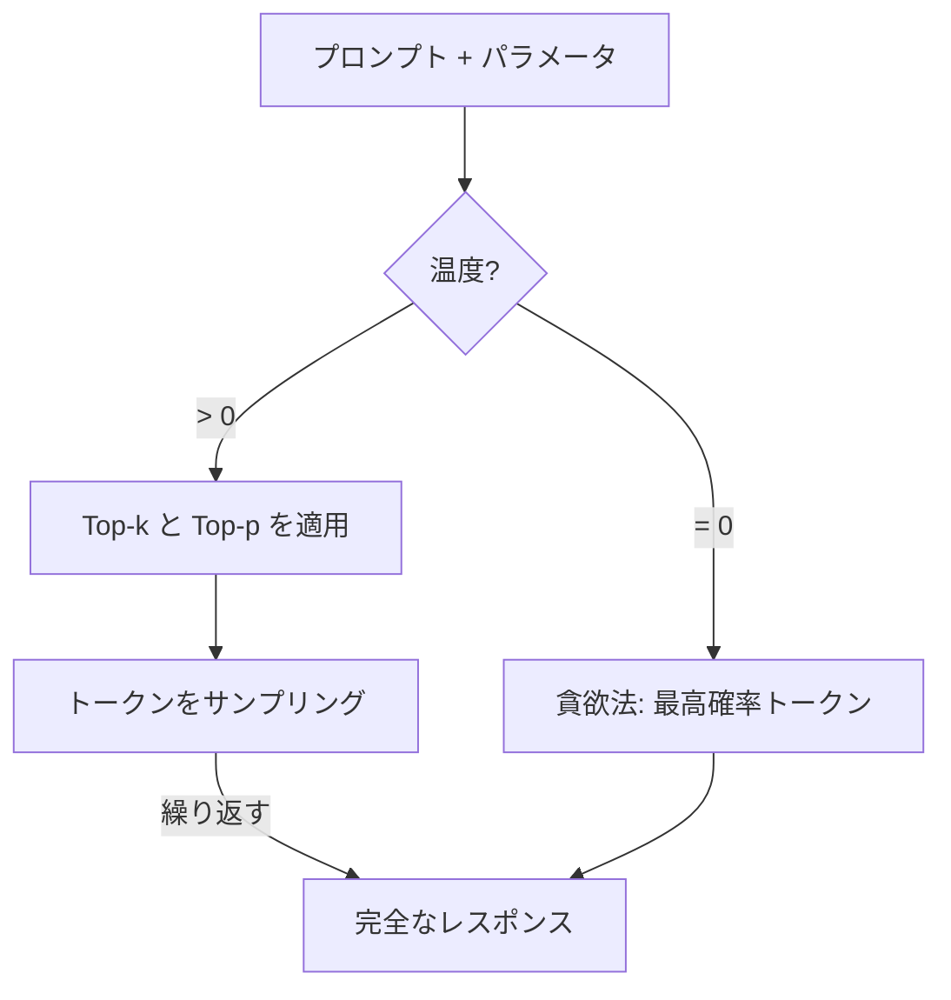
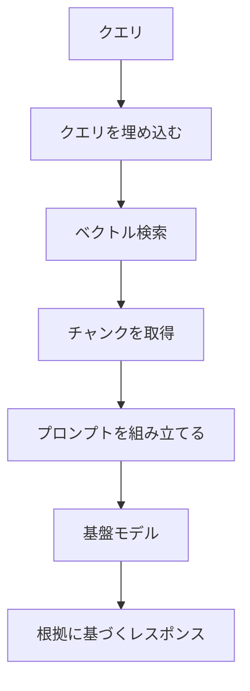
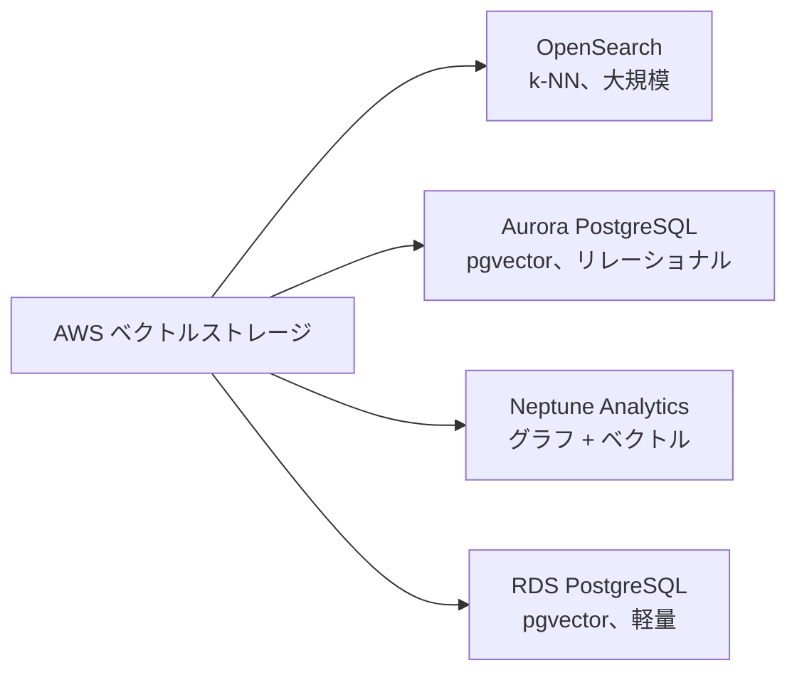
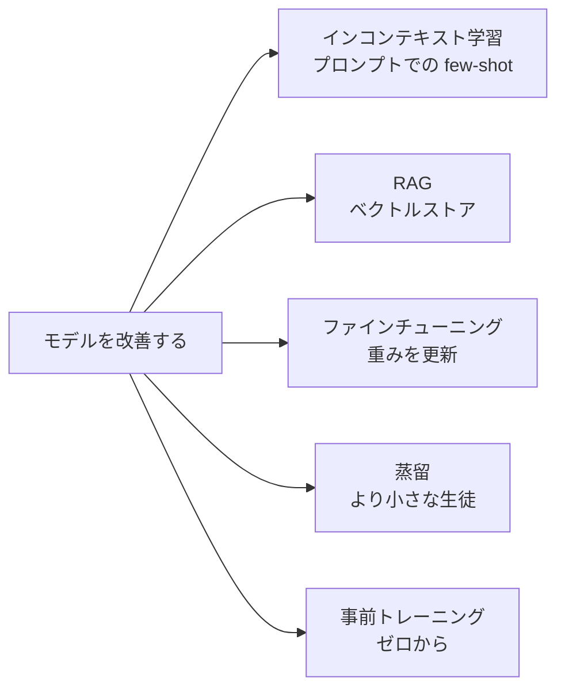
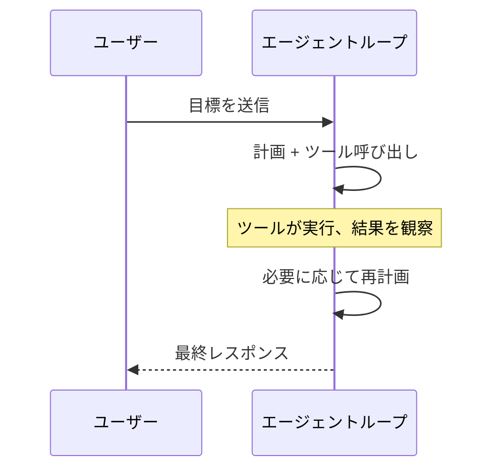

## タスクステートメント 3.1: 基盤モデル（FM）を使用するアプリケーションの設計上の考慮事項を説明する

基盤モデル上で本番アプリケーションを構築するには、最初のプロンプトを書く前から多くの準備が必要です。設計時に行う決定、どのモデルを使用するか、その出力をどう調整するか、プライベートデータでどうグラウンドするか、そのデータをどこに格納するか、時間とともにどのように知識をスケールするか、これらがプロジェクトが価値を生み出すかパイロット段階で停滞するかを決定します。このタスクステートメントでは、ビジネスアーキテクトが直面する順序でそれらの決定を解説します。[^301001]

### 3.1.1 FM を選択するための選択基準

基盤モデルを選択することは一回限りの技術的決定ではありません。ビジネス要件が変わるたびに再発します。パイロットで許容可能だったモデルが、本番ボリュームになると高すぎることがあります。英語の顧客質問に良く答えたモデルが、製品がスペイン語市場に拡大するときに替える必要が生じることがあります。選択基準を理解することで、それらの決定をリアクティブではなくシステマティックに保てます。

試験がカバーする基準は 3 つのグループに分類されます。コストとパフォーマンスの基準はモデルの実行コストと応答速度を支配します。能力の基準はモデルが何をできるかを支配します。柔軟性の基準はモデルをビジネスに合わせてどれほど変えられるかを支配します。

**コスト**はトークンあたりで測定されます。トークンはおおよそ英語の単語の 4 分の 3（または英語テキスト約 4 文字）です。[^301036] 入力トークン（プロンプト）と出力トークン（レスポンス）は別々に価格設定され、出力トークンは常により高価です。[^301002] 500 語の顧客履歴を読んで 100 語の返答を生成するカスタマーサービスアシスタントは、インタラクションごとに約 670 入力トークンと 130 出力トークンを消費します。本番スケールではその計算が非常に重要です。**プロンプトキャッシング**は、長いシステムプロンプトや商品カタログなどの静的なプレフィックスのモデルの処理済み表現を複数の呼び出しにわたって再利用することで、実効コストを削減します。Amazon Bedrock は Amazon Bedrock 上の Anthropic Claude を含む一部のモデルのプロンプトキャッシングをサポートしており、大きなコンテキストブロックが毎日数千件のリクエストにわたって再利用される場合の有意義なコストレバーとなります。[^301003]

**モダリティ**とは、モデルが受け取れる入力の種類と生成できる出力の種類を指します。[^301037] *テキストのみ*のモデルはテキストを読んでテキストを生成します。*マルチモーダル*モデルは画像、ドキュメント、音声も読めます。スキャンした請求書を分類したり商品写真について質問に答えたりするビジネスアプリケーションには、マルチモーダルモデルが必須で、インタラクションあたりのコストは高くなります。テキストのみのタスクにテキストのみモデルを選択することで、使われないマルチモーダル機能への料金支払いを避けられます。

**レイテンシ**とは、リクエストが送信された瞬間からレスポンスの最初のトークンが表示されるまでの時間です。[^301038] チャットボットなどのインタラクティブなアプリケーションは低レイテンシを必要とします。5 秒の一時停止は会話体験を壊します。夜間の文書要約などのバッチアプリケーションは、低コストと引き換えにより高いレイテンシを許容できます。モデルサイズはレイテンシの最大の要因の 1 つです。より小さなモデルは速く実行されますが推論能力は低く、より大きなモデルはより良く推論しますが応答に時間がかかります。**モデルサイズ**はパラメータ数（ネットワーク内の学習済み数値ウェイト）の 10 億単位で測定されます。70 億パラメータのモデルは適切なインフラで通常 1 秒以内に応答します。700 億パラメータのモデルは同じプロンプトに数秒かかることがあります。[^301004]

**モデルの複雑さ**はパラメータ数を超えたアーキテクチャ上の設計選択に関係します。一部のモデルは密（dense）で、すべてのトークンについてすべてのパラメータが活性化します。その他は*混合エキスパート（MoE）*アーキテクチャを使用し、トークンあたりパラメータのサブセットのみを活性化して、低い推論コストでより良い品質を達成します。[^301039] 選択の観点からは、複雑さは推論スループットとモデルをサービスするために必要なインフラ層に影響するため重要です。

**多言語サポート**とは、モデルの事前トレーニングデータの言語的な幅をカバーします。[^301040] 主に英語テキストでトレーニングされたモデルは他の言語での出力品質が低くなります。グローバル展開では、市場拡大時に痛みを伴う品質低下を避けるために、選択前にモデルの文書化された言語サポートを確認することが重要です。

**カスタマイズ**とは、モデルが独自データでファインチューニングまたは継続的な事前トレーニングができるかどうかを指します。[^301041] 商業的に利用可能なすべてのモデルがファインチューニングをサポートするわけではありません。プロジェクトがドメイン固有の用語や独自のワークフローをモデルに教えることを必要とする場合、契約を結ぶ前にファインチューニングの可用性を確認することが不可欠です。セクション 3.1.5 ではカスタマイズアプローチのコストトレードオフを説明します。

**コンテキストウィンドウサイズ**は、入力と出力の両方を合計して、モデルが 1 回の呼び出しで読める最大トークン数を設定します。[^301042] 200,000 トークンのコンテキストウィンドウを持つモデルは 1 回のリクエストで法的契約書全体を処理できます。4,096 トークンのウィンドウを持つモデルはできません。Amazon Bedrock の複数のフラグシップモデルは現在 100 万トークンのウィンドウを提供しています（Anthropic Claude Opus と Sonnet は 1M コンテキストベータヘッダーを通じて、Amazon Nova Premier と Meta Llama 4 Maverick）。これらは単一のプロンプトにコードベース全体や 1 年分のやり取りを収めることができます。長いコンテキストウィンドウは呼び出しあたりのコストが高くなりますが、RAG パイプラインでの複雑なチャンキング戦略の必要性を排除できる場合があります（セクション 3.1.3 参照）。

以下の*表 3.1.1* は、執筆時点で Amazon Bedrock を通じて利用可能な主要モデルファミリーを比較しています。正確な価格は変わりますが、ファミリー内のモデル層間の相対的な位置付けは安定しています。[^301005]

*表 3.1.1: 層と能力による基盤モデルの比較*

| モデルファミリー | 層 | 相対コスト | モダリティ | コンテキストウィンドウ | 典型的なユースケース |
|---|---|---|---|---|---|
| Anthropic Claude Opus | フラグシップ | 高い | マルチモーダル | 標準 200K、ベータヘッダーで 1M | 複雑な推論、法律/医療 |
| Anthropic Claude Sonnet | バランス | 中程度 | マルチモーダル | 標準 200K、ベータヘッダーで 1M | 一般的なエンタープライズタスク |
| Anthropic Claude Haiku | 高速 | 低い | マルチモーダル | 200K トークン | 高ボリュームの顧客対応 |
| Amazon Nova Premier | フラグシップ | 高い | マルチモーダル | 1M トークン | 複雑なクロスモーダル、非常に長い文書 |
| Amazon Nova Pro | バランス | 中程度 | マルチモーダル | 300K トークン | エンタープライズワークフロー |
| Amazon Nova Lite | 高速 | 低い | マルチモーダル | 300K トークン | コスト重視の本番 |
| Amazon Nova Micro | 最速 | 最低 | テキストのみ | 128K トークン | 超低レイテンシまたはコスト |
| Meta Llama 4 Maverick | オープン | 変動 | マルチモーダル | 1M トークン | カスタマイズ可能、長コンテキストデプロイ |
| Mistral Large 2 | バランス | 中程度 | テキストのみ | 128K トークン | ヨーロッパ言語タスク |

試験は価格の記憶を期待していません。ビジネスシナリオ（高ボリューム、多言語、画像分析、予算の制約）をこれらの基準を使って適切なモデル層に合わせることを期待しています。

### 3.1.2 推論パラメータがモデルレスポンスに与える影響

正しく選択されたモデルでも、推論パラメータが誤って設定されると不適切な出力を生成することがあります。推論パラメータは、プロンプトと一緒に実行時に渡される設定で、可能な次のトークンの確率分布からどのようにサンプリングするかをモデルに指示します。それらを調整することで、モデルを再トレーニングすることなく動作を変えられます。

**温度（Temperature）**はサンプリングプロセスにおけるランダム性の度合いを制御します。[^301043] 温度 0 では、モデルは常に最も高い確率のトークンを選択し、決定論的で一貫した出力を生成します。温度 1 では、モデルは生の確率分布に従ってサンプリングし、より多様で創造的な出力を生成します。1 を超える値は低確率のトークンを増幅し、一貫性を犠牲にして創造性を高めます。[^301006] ビジネス上の意味は直接的です。法的文書要約ツールは温度 0 またはそれに非常に近い値で実行すべきです。多様性よりも一貫性と精度の方が重要だからです。マーケティングコピージェネレーターは、同じブリーフから多様な創造的オプションを生成するために温度 0.8 以上を使用することがあります。

**Top-p**（*ニュークリアスサンプリング*とも呼ばれる）は補完的なランダム性の制御です。[^301044] トークンの確率を乗数で調整する代わりに、top-p は累積確率のしきい値を定義します。モデルは、組み合わせた確率がしきい値に達する最小のトークンセットからのみサンプリングします。top-p = 0.9 では、モデルは確率質量の 90% を占めるトークンのみを考慮し、低確率の外れ値を除外します。top-p の値が低いと出力がより焦点を絞ったものになり、高い値はより多様性を許容します。[^301007]

**Top-k** は、組み合わせた確率に関係なく、個別の確率が最も高い k 個のトークンにサンプリングを制限します。[^301045] top-k = 50 では、モデルは最も可能性の高い次のトークン 50 個からのみサンプリングします。top-k と top-p は一緒に使われることが多く、モデルはまず top-k でフィルタリングし、残りの候補に top-p のしきい値を適用します。

温度と top-p は実際には相互作用します。温度 = 0 に設定すると、確率的サンプリングがないため top-p は無関係になります。top-p = 1.0 に設定するとニュークリアスサンプリングが無効化され、温度だけがアクティブなコントロールになります。高精度アシスタントの一般的な本番設定は temperature = 0.1 と top-p = 0.9 で、モデルが本当に不確かな場合に時折別の言い回しを許容しながら、ほとんどの場合決定論的な出力を生成します。

**ストップシーケンス**は、モデルが生成したときに即座に停止するよう指示する文字列です。[^301046] 例えば、明示的な終了マーカーを使うプロンプトテンプレートは、モデルがマーカーを生成したらすぐに停止するよう `"\n###END###"` をストップシーケンスとして含めることがあります。ストップシーケンスは、下流のシステムがレスポンスを解析しなければならないアプリケーションで出力形式を強制するのに役立ちます。期待される出力で曖昧でないものを選ぶべきで（ネストされた JSON の場合、リテラルの `}` は内側の波括弧が外側のオブジェクトが閉じる前に生成を終了させてしまうため不適切）。

**入力と出力の長さ**パラメータは、モデルが読む（入力）または生成する（出力）トークン数を制限します。出力長の制限は高ボリュームエンドポイントでのコストを制御します。API レベルでの入力長の制限は、クライアントがモデルのコンテキストウィンドウを超えるプロンプトを送信してエラーを引き起こすのを防ぎます。どちらの制限も、モデルがサポートする最大値ではなく、有効なリクエストの現実的な最大サイズに基づいて設定すべきです。

```
推論パラメータ設定の例:
  temperature:     0.1
  top_p:           0.9
  top_k:           50
  max_new_tokens:  512
  stop_sequences:  ["###END###"]
```

上記の設定は、短い構造化出力を確実に生成しなければならない文書抽出アシスタントに適しています。創作文章アシスタントでは温度を上げ、top-p を上げ、ストップシーケンスを削除します。


*図 3.1.1: トークンサンプリングパイプライン。モデルは温度スケールの確率的サンプリングを適用する前に top-k と top-p でフィルタリングして各出力トークンを選択します。*

### 3.1.3 RAG とそのビジネス応用を定義する

基盤モデルは大規模な公開データセットでトレーニングされていますが、トレーニングのカットオフ以降の情報にはアクセスできず、独自の組織データにもアクセスできません。2024 年後半までトレーニングされたモデルは 2025 年初頭の製品リリースについての質問に答えられません。汎用モデルは社内の HR ポリシー、顧客契約テンプレート、エンジニアリングランブックを見たことがありません。**検索拡張生成（RAG）**は、トレーニングを通じてモデルの重みに知識を組み込むのではなく、クエリ時にモデルを外部の知識ストアに接続することでこの制限に対処するアーキテクチャパターンです。[^301008]

RAG のメカニズムは 5 つのステップで進みます。第一に、ユーザーの質問がその意味を捉えた数値ベクトルである*エンベディング*に変換されます。[^301047] 第二に、そのベクトルは組織のプライベートドキュメントから導出された事前計算されたエンベディングのデータベースと比較されます。第三に、エンベディングがクエリのエンベディングに最も類似しているドキュメントが取得されます。第四に、それらのドキュメントがコンテキストブロックに組み立てられ、ユーザーの元の質問の前に追加されて完全なプロンプトが形成されます。第五に、基盤モデルは充実したプロンプトを読み、パラメトリックメモリだけでなく取得されたコンテンツに基づいてレスポンスを生成します。[^301009]


*図 3.1.2: RAG リクエストパイプライン。ユーザークエリが埋め込まれ、格納されたドキュメントベクトルと照合され、取得されたチャンクが元のクエリと統合されてから基盤モデルがレスポンスを生成します。*

**Amazon Bedrock Knowledge Bases** は、このパターンの AWS のフルマネージドな実装です。[^301010] 取り込みパイプライン、エンベディング生成、ベクトルストア統合、検索 API を処理し、組織が基礎となるインフラを構築・運用することなく RAG を採用できます。管理者はデータソース、チャンキング戦略、エンベディングモデル、ベクトルストレージバックエンドを指定して Knowledge Base を設定します。Bedrock はその後、ドキュメントを自動的に同期します。

Amazon Bedrock Knowledge Bases がサポートするデータソースには、Amazon S3 バケット（ドキュメントアーカイブ向けの最も一般的な選択肢）、Atlassian Confluence スペース、Microsoft SharePoint サイト、Salesforce オブジェクト、組み込みウェブクローラーを経由したウェブ URL が含まれます。[^301011] 各データソースはスケジュールに基づいてまたはオンデマンドで同期されます。ソースドキュメントへの更新は手動の再インデックスなしにベクトルストアに反映されます。[^301048]

*チャンキング*は、元のクエリとともにコンテキストウィンドウに収まるほど小さなセグメントにソースドキュメントを分割するプロセスです。[^301049] Bedrock Knowledge Bases は、固定サイズのチャンキング（N トークンごとに分割）、セマンティックチャンキング（二次モデルによって識別された自然なトピック境界で分割）、階層型チャンキング（親のサマリーチャンクと小さな子の詳細チャンクの両方を生成して、検索が 2 つの粒度レベルで動作できる）をサポートします。[^301012]

RAG のビジネス応用はいくつかのカテゴリにわたります。

- **社内 Q&A**: 従業員が HR ポリシー、IT 手順、製品仕様についてシステムに質問します。システムは関連するポリシーの段落を取得し、ソースドキュメントを引用した正確な回答を生成します。
- **カスタマーサポート**: サポートエージェントまたはセルフサービスチャットボットが知識ベースから関連するトラブルシューティング手順を取得し、会話的な言語で提示して、平均処理時間を削減します。
- **契約と法律の分析**: 法務チームが契約書ライブラリを取り込みます。モデルは「解約便宜条項を含む契約書はどれですか？」や「ベンダー X とのマスターサービス契約の責任上限はいくらですか？」などの質問に答えます。
- **研究支援**: 科学者、アナリスト、プロダクトマネージャーが社内研究レポートのコーパスをクエリします。モデルはリンクのリストを返すのではなく、複数のドキュメントにわたって調査結果を合成します。

RAG はファインチューニングよりも、知識ベースが頻繁に変更される場合に推奨されます。ベクトルストアの更新には数分かかるのに対し、モデルの再トレーニングには数時間または数日かかるためです。[^301050] また、ソースドキュメントが監査可能でなければならない場合にも推奨されます。取得されたチャンクはプロンプトに表示されるため、開発者はレスポンスにどのドキュメントが影響を与えたかを正確に調べることができます。[^301051]

### 3.1.4 ベクトルデータベースにエンベディングを格納するための AWS サービス

RAG には、事前計算されたエンベディングを格納して、*近似最近傍（ANN）*または*k 最近傍（k-NN）*アルゴリズムを使って素早く検索する場所が必要です。[^301052] AWS は、それぞれ異なるスケール、アーキテクチャ、クエリ要件に適した、ベクトルストレージをサポートする 4 つのマネージドサービスを提供しています。[^301053]


*図 3.1.3: AWS ベクトルストレージサービス。各サービスはエンベディングストレージをサポートしますが、スケール、クエリモデル、補完的な機能が異なります。*

**Amazon OpenSearch Service** は k-NN プラグインが導入されて以来、近似最近傍ベクトル検索をサポートしており、その*ベクトルエンジン*は大規模で高スループットのセマンティック検索ワークロードに最適化されています。[^301013] 数十億のベクトルでサブミリ秒の検索を実現する Hierarchical Navigable Small World（HNSW）インデックスアルゴリズムをサポートしています。[^301054] OpenSearch は、検索データセットが大規模（数百万件以上のドキュメント）な場合、検索がベクトル類似性と従来のキーワードフィルタを組み合わせなければならない場合（ハイブリッド検索）、またはアプリケーションがすでにログ分析に OpenSearch を使用してクラスターを共有できる場合に最も有力なオプションです。Amazon Bedrock Knowledge Bases は、代替が指定されない場合のデフォルトのベクトルバックエンドとして OpenSearch Service を使用します。[^301055]

pgvector 拡張を持つ **Amazon Aurora** は、PostgreSQL 互換のリレーショナルデータベースにベクトルストレージを追加します。[^301014] このオプションは、アプリケーションがすでに Aurora に構造化データを格納していて、別のベクトルストアを運用せずにセマンティック検索を追加したい場合に適しています。Aurora の行として格納された商品カタログはエンベディング列を追加でき、クエリは「Electronics カテゴリの商品」というリレーショナル述語と「この商品説明に類似している」というベクトル類似性を単一の SQL 文で組み合わせることができます。[^301056] トレードオフはスケールです。Aurora 上の pgvector は数十万から数百万のベクトル規模では良いパフォーマンスを発揮しますが、非常に大きなスケールでは OpenSearch Service に及びません。

**Amazon Neptune Analytics** は Neptune グラフデータベースをベクトル検索機能で拡張し、グラフトラバーサルと意味的類似性を組み合わせたクエリを可能にします。[^301015] 人、組織、ドキュメント間の関係をモデル化した知識グラフは、Neptune Analytics を使って「法務部門の誰かが書いて少なくとも 1 つの規制を引用している、このクエリに最も意味的に類似したドキュメントを見つけてください」というような質問に答えることができます。[^301057] グラフ推論とベクトル検索のこの組み合わせは、純粋なリレーショナルまたは純粋な検索ベースのストアでは再現が難しいです。Neptune Analytics は、サプライチェーン分析、不正調査、生物医学研究など、検索問題が固有のグラフ構造を持つ場合に適切な選択です。

**Amazon RDS for PostgreSQL** は Aurora と同じ pgvector 機能を提供しますが、Aurora のサーバーレスまたはプロビジョニングされたクラスターではなく標準の RDS インフラで実行されます。[^301016] これは既存の RDS インスタンスがすでに PostgreSQL を実行していて、pgvector 拡張の追加が最も抵抗の少ないパスである小規模なワークロードに適しています。[^301058] 開発環境と軽量な社内ツールは、インフラをシンプルに保ちながらベクトル検索をサポートするためにこのオプションを頻繁に使用します。

これらのストアを選ぶ場合の簡単な目安として：pgvector（RDS または Aurora 上）は数百万ベクトルまで快適に処理します。Amazon OpenSearch Service は、ワークロードが数千万を超えると標準になります。HNSW インデックスにより、非常に大きなスケールでの検索レイテンシを低く保ちます。Neptune Analytics はデータが基本的にグラフ構造化されている場合に適切な答えです。

*表 3.1.2: AWS ベクトルストレージサービスの比較*

| サービス | インデックスアルゴリズム | スケール | 補完的な機能 | 最適用途 |
|---|---|---|---|---|
| OpenSearch Service | HNSW、IVF | 非常に大規模（数十億） | ハイブリッドキーワード + ベクトル、分析 | 高ボリューム RAG、エンタープライズ検索 |
| Aurora PostgreSQL（pgvector） | IVFFlat、HNSW | 中規模（数百万） | リレーショナル SQL 結合 | すでに Aurora を使っているアプリ |
| Neptune Analytics | グラフ + ベクトル | 中規模 | グラフトラバーサル、関係クエリ | グラフ構造の知識ベース |
| RDS for PostgreSQL（pgvector） | IVFFlat、HNSW | 小〜中規模 | リレーショナル SQL、シンプルな設定 | 開発環境、社内ツール |

Amazon Bedrock Knowledge Bases はこれらの 4 つのバックエンドのいずれかを使用するよう設定できます。[^301017] バックエンドが指定されない場合のデフォルトは OpenSearch Service です。[^301059] すでに Aurora または RDS for PostgreSQL を運用している組織は、既存のクラスターに Knowledge Base を向けることができ、別の検索サービスのコストを避けられます。Neptune Analytics は、知識ベースにグラフ構造がある場合に明示的に選択されます。

注意: Amazon MemoryDB は AIF-C01 試験ガイドの旧バージョンでベクトルストレージオプションとして挙げられていました。ガイドのバージョン 1.1 で削除されました。ベクトル検索の文脈での MemoryDB に関する試験問題は期待しないでください。

### 3.1.5 FM カスタマイズのコストトレードオフ

基盤モデルのデフォルトの動作が特定のビジネスタスクに十分でない場合、それを改善するための 5 つの広い戦略があります。それらはコスト、時間、データ要件、改善の耐久性において大きく異なります。

**事前トレーニング**は、大規模なテキスト（またはその他のデータ）コーパス上でモデルをゼロからトレーニングするプロセスです。[^301060] 事前トレーニングはモデルの基本的な知識と言語理解を決定します。大量のコンピュートリソース（数週間稼働する数百〜数千の GPU）、精選されたトレーニングデータのペタバイト、プロセスを監督する機械学習研究者のチームが必要です。主要な AI ラボ以外の組織で事前トレーニングを行うところはほとんどありません。ほとんどのビジネスにとって現実的なオプションとしてではなく、他のすべての技法が出発するベースラインとして試験に関連します。[^301018]

**ファインチューニング**は既存の事前トレーニング済みモデルから始まり、より小さなタスク固有のデータセットでトレーニングを続けます。[^301061] モデルの重みはターゲットドメインに向けて動作をシフトするよう更新されます。ファインチューニングには、数百から数万件のラベル付き例、数週間ではなく数時間から数日の GPU 時間、質問回答ペアまたは指示レスポンスペアを生成するデータ準備プロセスが必要です。Amazon Bedrock は一部のモデルのファインチューニングをサポートしています。[^301019] 結果は特定のタスクにより合致した出力を生成するモデルで、アイドル状態でもホスティングコストが発生する別のモデルバージョンとして格納されます。[^301062]

**インコンテキスト学習**は重みの更新を必要としません。[^301063] 代わりに、望ましい動作の例がプロンプト内に直接配置されます。ゼロショットプロンプトは例を与えません。few-shot プロンプトは 2 から 5 の例を与えます。モデルはコンテキストウィンドウ内のパターンマッチングを使って、それらの例から現在の入力に一般化します。インコンテキスト学習は最も安く、最も速いカスタマイズ戦略で、通常の推論呼び出しが使用するインフラ以外何も必要としません。制限は、改善がプロンプトの期間のみ続くことです。モデルは呼び出し間で例を保持せず、例はそうでなければコンテンツを運べたトークンを消費します。[^301020]

**RAG**（セクション 3.1.3 で詳しく説明）は通常カスタマイズ技法として説明されませんが、同様のビジネス効果を持ちます。ドメイン固有の知識でモデルをグラウンドし、独自のトピックでのハルシネーションを削減します。そのコストプロファイルは他のものとは異なります。セットアップコストはベクトルストアの構築と同期、検索レイヤーの統合を含みます。クエリあたりのコストは、検索ステップと大きなオーグメントされたプロンプトの両方がコンピュートとトークンを消費するため、通常の推論呼び出しより若干高くなります。しかし、知識の更新コストは非常に低いです。ベクトルストアに新しいドキュメントを追加するには、ファインチューニングジョブが必要とする数時間ではなく数分かかります。[^301021]

**モデル蒸留**は v1.1 試験ガイドの最も新しい技法です。蒸留では、大きく高品質な*教師モデル*が一連のプロンプトに対して出力を生成し、それらの入出力ペアがより小さな*生徒モデル*のトレーニングデータセットになります。[^301064] 生徒は教師の重みにアクセスすることなく、特定のタスクドメインで教師の動作を近似することを学びます。[^301022] ビジネス上の恩恵は、本番スケールでの推論がより小さく、速く、安い生徒モデルによって提供され、レスポンスの品質は高価な教師に近いことです。Amazon Bedrock はモデル蒸留を一流のワークフローとしてサポートし、組織が Bedrock モデルを教師として使用し、より小さなモデルのファインチューニングされたバージョンを生徒として生成できます。[^301023] 蒸留はコストを推論（継続的）から 1 回のトレーニングジョブ（その後の何千もの推論呼び出しにわたって償却できる）にシフトします。[^301065]


*図 3.1.4: FM カスタマイズ選択ガイド。適切な技法は利用可能なラベル付きデータ、更新頻度、予算、推論ボリュームによって異なります。*

*表 3.1.3: FM カスタマイズアプローチのコストと労力の比較*

| アプローチ | コンピュートコスト | 必要なデータ | 更新速度 | クエリあたりのコスト | 試験シナリオ |
|---|---|---|---|---|---|
| 事前トレーニング | 非常に高い | ペタバイト | 数週間 | 通常 | 学術的なベースラインのみ |
| ファインチューニング | 中程度 | 数百〜数千のラベル付きペア | 数時間〜数日 | 通常 + ホスティング | 安定したドメイン特化 |
| インコンテキスト学習 | なし | 少数の例 | 即時 | 高い（より大きなプロンプト） | 素早いプロトタイピング、低ボリューム |
| RAG | 低いセットアップ | 既存のドキュメント | 数分 | 若干高い | 頻繁に更新される知識 |
| モデル蒸留 | 中程度（1 回） | 教師が生成したペア | 数時間〜数日 | 低い（より小さなモデル） | 高ボリュームのコスト最適化 |

試験はビジネスがこれらのアプローチのどれかを選ばなければならないシナリオを頻繁に提示します。決定ロジックは次のとおりです。知識が頻繁に変わる場合は RAG を選択してください。タスクが安定したドメインで一貫したトーンや特殊な用語を必要とし、データが利用可能な場合はファインチューニングを選択してください。ボリュームが非常に高くクエリあたりのコストが主要な懸念事項の場合は蒸留を評価してください。予算も時間もない場合は few-shot の例を使ったインコンテキスト学習を使用してください。事前トレーニングは、質問が学習済みモデルが存在しない新しいドメインが存在することを明示的に示さない限り、本番準備シナリオで正しい答えになることはありません。

### 3.1.6 AI エージェントの役割とビジネス応用

1 つのプロンプトを受け取って 1 つのレスポンスを返す基盤モデルは*シングルショット*モードで動作します。多くの実際のビジネスタスクは 1 つのステップでは完了できません。フライトを予約するには、空き状況の確認、オプションの比較、シートの選択、支払いの確認が必要です。セキュリティアラートを調査するには、ログデータのクエリ、脅威インテリジェンスの検索、イベントの相関、レポートの下書きが必要です。これらのマルチステップタスクには異なるアーキテクチャが必要です。

**AI エージェント**は、基盤モデルと環境を認識し、一連のアクションを計画し、外部ツールを使ってそれらのアクションを実行し、結果を観察し、学習した内容に基づいて計画を修正する能力を組み合わせたシステムです。[^301024] エージェント内のモデルは単にテキストを生成しているわけではありません。次に何をすべきかを推論し、どのツールを呼び出すかを決定し、結果が十分かを評価し、タスクが完了するか停止条件に達するまで継続します。[^301066]

エージェントループには 4 つのフェーズがあります。*認識*フェーズでは、エージェントはユーザーの目標と世界の現在の状態に関する利用可能なコンテキストを受け取ります。[^301067] *計画*フェーズでは、モデルは次にどのアクションを取るかを推論し、定義されたツールセット（API、データベースクエリ、コードエグゼキュータ、ウェブ検索）から選択します。*行動*フェーズでは、エージェントは選択されたツールを呼び出し、モデルが決定した引数を渡します。*観察*フェーズでは、エージェントはツールのレスポンスを読み、目標に向けた進捗の理解を更新します。ループはエージェントがタスクが完了したと判断するまで繰り返されます。[^301025]


*図 3.1.5: AI エージェントの認識-計画-行動-観察ループ。基盤モデルは各ステップでどのツールを呼び出すかを推論し、タスク目標が達成されるまでループが続きます。*

エージェントと通常の LLM 呼び出しの違いはビジネス的な意味を持ちます。通常の LLM 呼び出しは速く、安く、ステートレスです。エージェント呼び出しは遅く、高価で、複数のツール呼び出しにわたってステートフルです。[^301068] エージェントは、タスクが 1 つのプロンプトにエンコードできない場合、外部システムからの情報が必要な場合、または各ステップが前のステップに依存する複数の連続した決定を含む場合に適しています。

AWS はエージェント構築のための 2 つの主要なエントリポイントを提供しています。**Amazon Bedrock Agents** は、Bedrock がサポートする基盤モデルをバックとしたエージェントの作成、設定、デプロイのための確立されたマネージドサービスです。[^301026] オーケストレーション、ツールルーティング（Bedrock 用語では*アクショングループ*と呼ばれる）、セッション状態管理、RAG のための Knowledge Bases との統合を処理します。**Amazon Bedrock AgentCore** は本番グレードエージェントのための新しいランタイムおよび管理レイヤーで、オブザーバビリティ、メモリ、セキュリティコントロール、大規模でエージェントを実行するインフラを追加します。[^301027] **Strands Agents** は AWS のオープンソース SDK で、Python 開発者がシンプルなデコレーターベースの API を使ってエージェントを構築できます。エージェントはマネージドな実行のために AgentCore にデプロイできます。[^301028]

AI エージェントのビジネス応用には以下が含まれます。

- **カスタマーサービスの自動化**: エージェントがサービスリクエストの完全な解決を処理します。CRM のクエリ、注文ステータスの確認、返品の開始、確認メールの送信を、状況が定義されたスコープを超えない限り人間のエージェントなしで行います。
- **IT 運用**: エージェントが CloudWatch メトリクスをクエリし、影響を受けたリソースを特定し、変更ログと照合し、オペレーターが承認するための修復アクションを提案することでパフォーマンスアラートを調査します。
- **文書処理**: エージェントが受信した契約書を読み、重要な条項を抽出し、標準テンプレートと照合し、逸脱をフラグし、法務レビュアーの下書きサマリーを作成します。すべて手動のトリアージなしで行います。
- **データ分析**: エージェントが自然言語のビジネス質問を受け取り、SQL クエリを作成し、データベースに対して実行し、結果を解釈し、推奨事項を含む自然言語サマリーを生成します。

1 つのオーケストレーターエージェントが専門的なサブエージェントにサブタスクを委任する*マルチエージェント*アーキテクチャは、単一のエージェントが確実に処理するには大きすぎるまたは多様すぎる問題にパターンを拡張します。[^301069] Amazon Bedrock Agents はマルチエージェントコラボレーションをネイティブにサポートしています。[^301029] タスクの分割方法、エージェント間のルーティング方法、一貫したセッション状態の維持方法を含むマルチエージェントシステムの設計原則は、ドメイン 2（生成 AI の基本概念に関する章）で広い意味でのエージェント型 AI アーキテクチャ材料と一緒に説明しました。

*表 3.1.4: AI エージェント対通常の LLM 呼び出しの比較*

| 特性 | 通常の LLM 呼び出し | AI エージェント |
|---|---|---|
| タスクスコープ | シングルステップ、単一プロンプト | マルチステップ、反復的 |
| 外部ツールアクセス | なし（モデルの重みのみ） | API、データベース、コードエグゼキュータ |
| ステップをまたいだ状態 | なし | セッション内で維持 |
| タスクあたりのレイテンシ | ミリ秒〜秒 | 秒〜分 |
| タスクあたりのコスト | 低い（1 回の推論呼び出し） | 高い（複数の推論 + ツール呼び出し） |
| 適切な用途 | 分類、要約、生成 | リサーチ、予約、IT 運用、文書ワークフロー |

試験はエージェントをプロンプティングの改良ではなく、異なるアーキテクチャパターンとして扱います。質問が外部システムのクエリや連続した決定を必要とするマルチステップタスクを説明している場合、答えはより洗練されたプロンプトではなくエージェントを含みます。

## セルフチェック問題

**問題 1.** ある小売会社が、6 言語で商品カタログについての質問に答える顧客向けチャットボットをデプロイしたいと考えています。カタログには 50,000 の SKU が含まれています。日々の更新は SKU の 1% 未満しか変更せず、システムプロンプトと商品分類ブロックは呼び出しにわたって静的です。基盤モデルの選択を最も直接的に規定する選択基準の組み合わせはどれですか？

A. モデルサイズ、ファインチューニングの可用性、ストップシーケンスのサポート  
B. 多言語サポート、コンテキストウィンドウサイズ、プロンプトキャッシング適格性  
C. 出力モダリティ、事前トレーニングデータの新しさ、top-p のデフォルト値  
D. トレーニングコスト、GPU メモリフットプリント、温度感度  

**解説:** シナリオには 3 つのドライバーがあります。6 言語サポート（多言語サポート）、コンテキストに収まるまたは効率的に取得される必要がある大きいが主に静的なカタログコンテキスト（コンテキストウィンドウサイズ）、スケールでのコスト制御（プロンプトキャッシングは静的なシステムプロンプトと分類ブロックに適用され、日々変わる SKU 行は変動する部分に適したツールとして RAG を維持する）。回答 A は不正解です。ファインチューニングは日々の更新問題に対応せず、ストップシーケンスは選択基準ではありません。回答 C は不正解です。出力モダリティはテキストのみ（チャットボット）で、事前トレーニングの新しさはカタログが実行時に注入されるため無関係で、top-p は推論パラメータでありモデル選択基準ではありません。回答 D は不正解です。トレーニングコストはマネージド FM のコンシューマーにとって実行時の考慮事項ではなく、GPU フットプリントは Amazon Bedrock によって抽象化されたインフラの詳細です。回答 B は 3 つのビジネス制約すべてに直接対応しています。[^301030]

---

**問題 2.** 法律チームが契約条項を要約するために基盤モデルを使用しています。要約が一貫していないことに気づきました。同じ条項が実行するたびにわずかに異なる要約を生成します。チームは要約を再実行するときに逐語的な再現性を必要としています。この問題を解決する可能性が最も高い推論パラメータの変更はどれですか？

A. top-k を 50 から 200 に増やす  
B. 温度を 0.7 から 1.0 に増やす  
C. 温度を 0 に設定する  
D. top-p を 1.0 に設定する  

**解説:** 温度はサンプリングプロセスがどれほど決定論的かを制御します。温度 = 0 では、モデルは常に最も確率の高い次のトークンを選択し、固定されたプロンプトに対して出力を決定論的にします。これが正解（C）です。top-k を増やすこと（回答 A）は候補トークンのプールを拡大し、可変性が増加して排除されません。温度を 0.7 から 1.0 に増やすこと（回答 B）はランダム性を増加させ、問題を悪化させます。top-p を 1.0 に設定すること（回答 D）はニュークリアスサンプリングを無効化しますが、それだけでサンプリングを決定論的にしません。温度がまだ 0 より大きい場合、モデルは全確率分布から確率的にサンプリングし続けます。温度をちょうど 0 に設定することのみが、法律チームが必要とする貪欲な決定論的モードにサンプリングプロセスを折り畳みます。[^301031]

---

**問題 3.** ある金融サービス会社が、アナリストが社内の調査レポートについて質問できるツールを提供したいと考えています。レポートは毎週更新されます。会社はモデルを再トレーニングまたはファインチューニングしたくありません。これらの要件に最もよく対応するアーキテクチャはどれですか？

A. 調査レポートでドメイン固有のモデルを事前トレーニングする  
B. 新しいレポートが公開されるたびに週次で基盤モデルをファインチューニングする  
C. レポートリポジトリから同期されたベクトルストアを使った RAG を使用する  
D. 関連するレポートをプロンプトに貼り付けたインコンテキスト学習を使用する  

**解説:** RAG（回答 C）はこのシナリオのために構築されています。アナリストが自然言語の質問をでき、新しいレポートが到着したときに数分でベクトルストアを更新できる関連セクションを取得します。モデルの再トレーニングは不要です。事前トレーニング（回答 A）はコスト、再トレーニングなしの要件、週次の更新ケイデンスによって排除されます。ファインチューニング（回答 B）は再トレーニングなしの要件と週次のファインチューニングサイクルが知識更新の問題には実用的でないという事実によって排除されます。インコンテキスト学習（回答 D）はスケールでは実行不可能です。研究レポート全体をプロンプトに貼り付けると、数百のドキュメントのライブラリのコンテキストウィンドウを超え、アーカイブにわたる回顧的な検索にはアプローチが機能しません。Amazon Bedrock Knowledge Bases と同期された S3 データソースが正しいアプローチの具体的な AWS 実装です。[^301032]

---

**問題 4.** ある会社が大規模言語モデルを使った高ボリュームのカスタマーサポートアプリケーションを実行しています。推論コストが収益より速く増加しています。機械学習エンジニアがモデル蒸留の使用を提案しています。このアプローチの主要なビジネス上の恩恵は何ですか？

A. 生徒モデルは教師モデルが知らなかった新しい事実を学習する  
B. 生徒モデルはすべての入力で教師モデルと同一の出力を生成する  
C. スケールでの推論は、教師の品質に近いレスポンスを生成するより小さく速く安いモデルによって提供される  
D. 教師モデルの重みが圧縮されて直接サービスされ、メモリコストを削減する  

**解説:** モデル蒸留（回答 C）はより大きな教師モデルの動作をターゲットタスクドメインで近似するよう、より小さな生徒モデルをトレーニングします。蒸留が完了すると、本番推論は生徒モデルを使用します。呼び出しあたりより速く安いです。これは高ボリュームアプリケーションでのコスト増加の問題に直接対処します。回答 A は不正解です。蒸留は生徒が教師の出力を模倣することを教えますが、教師が知らない事実を学習することではありません。回答 B は不正解です。生徒は教師を近似しますが完全には再現しません。エッジケースや新しい入力では出力が異なります。回答 D はモデルの量子化またはプルーニングを説明しており、蒸留ではありません。蒸留は教師の重みを圧縮するのではなく、別のモデルのトレーニングを含みます。試験は高ボリュームの推論シナリオのコスト最適化技法として v1.1 で特別に蒸留を導入しました。[^301033]

---

**問題 5.** ある製造会社がサプライヤーの問い合わせに応答するプロセスを自動化したいと考えています。プロセスは、在庫レベルのために会社の ERP システムを確認し、調達ポリシーデータベースをクエリし、注文が承認しきい値を満たすかどうかを計算し、レスポンスの下書きを作成することを必要とします。最も適切なアーキテクチャはどれですか？

A. プロンプトにすべてのサプライヤー情報を含むシングルショットの基盤モデル呼び出し  
B. 関連するポリシードキュメントを取得してレスポンスを生成する RAG パイプライン  
C. ERP システム、ポリシーデータベース、計算ツールに接続するアクショングループを持つ AI エージェント  
D. 過去のサプライヤーレスポンスでトレーニングされたファインチューニング済みモデル  

**解説:** タスクの説明は AI エージェントの教科書的なケースです（回答 C）。プロセスはマルチステップです。3 つの異なるデータ取得操作（ERP、ポリシーデータベース、しきい値計算）がシーケンスで発生しなければならず、各ステップの結果が後続のステップに影響します。通常のシングルショット呼び出し（回答 A）はライブ外部システムをクエリできません。プロンプトに配置された情報のみを使用できます。RAG パイプライン（回答 B）は関連するドキュメントを取得しますが、ビジネスロジックを実行したり計算を行ったりしません。検索レイヤーであり、オーケストレーションレイヤーではありません。ファインチューニング済みモデル（回答 D）はライブ ERP やポリシーデータへのアクセスがなく、現在の在庫やポリシー状態ではなく、過去のトレーニングデータのパターンに基づいてレスポンスを生成します。ERP API、ポリシーデータベース、しきい値計算のための Lambda 関数を指すアクショングループを設定した Amazon Bedrock Agents が正しいアプローチの具体的な AWS 実装です。[^301034]

---

**問題 6.** ある会社が RAG 知識ベースに Amazon OpenSearch Service と pgvector を持つ Amazon RDS for PostgreSQL のどちらを使用するかを評価しています。知識ベースには約 200,000 件のドキュメントチャンクが含まれます。アプリケーションチームはすでにトランザクションデータのために RDS for PostgreSQL クラスターを運用していて、新しいインフラを最小化したいと考えています。最も適切な推奨はどれですか？

A. OpenSearch Service を使用する。AWS でベクトル検索をサポートする唯一のサービスだから。  
B. OpenSearch Service を使用する。200,000 ベクトルはスケールで HNSW アルゴリズムを必要とするから。  
C. RDS for PostgreSQL を使用する。既存のクラスターを pgvector で拡張でき、新しいサービスを避けられるから。  
D. Neptune Analytics を使用する。グラフ構造の検索は常に k-NN 検索よりも正確だから。  

**解説:** 200,000 ベクトルでは、両方のサービスが技術的に可能です。このシナリオでの決定要因は運用上のシンプルさです。チームはすでに RDS for PostgreSQL クラスターを実行しており、pgvector は単一の拡張機能のインストールで有効化できます。これにより、別の OpenSearch Service ドメインのプロビジョニング、セキュリティ確保、運用が避けられます（回答 C）。回答 A は不正解です。Aurora、RDS for PostgreSQL、Neptune Analytics もベクトル検索をサポートしています。OpenSearch は唯一のオプションではありません。回答 B は不正解です。200,000 ベクトルは RDS 上の pgvector の能力の範囲内で、このスケール範囲のデータセットのために設計されています。スケールでの HNSW アルゴリズムの議論はデータセットが数千万のベクトルに達するときに適用されます。回答 D は不正解です。Neptune Analytics は問題がグラフ構造を持つときに適しており、一般的な精度の向上としてではありません。一般的な文書検索問題にグラフトラバーサルを適用することは、対応する恩恵なしに複雑さを追加します。[^301035]

[^301001]: AWS Certification. AI Practitioner (AIF-C01) Exam Guide v1.1, Domain 3. URL: <https://docs.aws.amazon.com/aws-certification/latest/ai-practitioner-01/ai-practitioner-01-domain3.html>
[^301002]: Amazon Bedrock. Amazon Bedrock pricing. URL: <https://aws.amazon.com/bedrock/pricing/>
[^301003]: Amazon Bedrock. Prompt caching for Amazon Bedrock. URL: <https://docs.aws.amazon.com/bedrock/latest/userguide/prompt-caching.html>
[^301004]: Kaplan, J., et al. Scaling Laws for Neural Language Models (2020). URL: <https://arxiv.org/abs/2001.08361>
[^301005]: Amazon Bedrock. Supported foundation models in Amazon Bedrock. URL: <https://docs.aws.amazon.com/bedrock/latest/userguide/models-supported.html>
[^301006]: Amazon Bedrock. Inference parameters for foundation models. URL: <https://docs.aws.amazon.com/bedrock/latest/userguide/inference-parameters.html>
[^301007]: Holtzman, A., et al. The Curious Case of Neural Text Degeneration (2019). URL: <https://arxiv.org/abs/1904.09751>
[^301008]: Lewis, P., et al. Retrieval-Augmented Generation for Knowledge-Intensive NLP Tasks (2020). URL: <https://arxiv.org/abs/2005.11401>
[^301009]: Amazon Bedrock. How Amazon Bedrock Knowledge Bases works. URL: <https://docs.aws.amazon.com/bedrock/latest/userguide/knowledge-base-overview.html>
[^301010]: Amazon Bedrock. Amazon Bedrock Knowledge Bases. URL: <https://docs.aws.amazon.com/bedrock/latest/userguide/knowledge-base.html>
[^301011]: Amazon Bedrock. Data sources for Amazon Bedrock Knowledge Bases. URL: <https://docs.aws.amazon.com/bedrock/latest/userguide/knowledge-base-ds.html>
[^301012]: Amazon Bedrock. Chunking strategies for Amazon Bedrock Knowledge Bases. URL: <https://docs.aws.amazon.com/bedrock/latest/userguide/kb-chunking-parsing.html>
[^301013]: Amazon OpenSearch Service. k-NN search in Amazon OpenSearch Service. URL: <https://docs.aws.amazon.com/opensearch-service/latest/developerguide/knn.html>
[^301014]: Amazon Aurora. Using pgvector to store embeddings in Amazon Aurora PostgreSQL. URL: <https://docs.aws.amazon.com/AmazonRDS/latest/AuroraUserGuide/AuroraPostgreSQL.VectorSearch.html>
[^301015]: Amazon Neptune. Vector search in Amazon Neptune Analytics. URL: <https://docs.aws.amazon.com/neptune-analytics/latest/userguide/vector-search.html>
[^301016]: Amazon RDS. Using the pgvector extension with Amazon RDS for PostgreSQL. URL: <https://docs.aws.amazon.com/AmazonRDS/latest/UserGuide/Appendix.PostgreSQL.CommonDBATasks.pgvector.html>
[^301017]: Amazon Bedrock. Vector store options for Amazon Bedrock Knowledge Bases. URL: <https://docs.aws.amazon.com/bedrock/latest/userguide/knowledge-base-setup.html>
[^301018]: Brown, T., et al. Language Models are Few-Shot Learners (GPT-3 paper, 2020). URL: <https://arxiv.org/abs/2005.14165>
[^301019]: Amazon Bedrock. Fine-tuning foundation models in Amazon Bedrock. URL: <https://docs.aws.amazon.com/bedrock/latest/userguide/custom-models.html>
[^301020]: Min, S., et al. Rethinking the Role of Demonstrations: What Makes In-Context Learning Work? (2022). URL: <https://arxiv.org/abs/2202.12837>
[^301021]: Amazon Bedrock. Retrieval Augmented Generation using Knowledge Bases. URL: <https://docs.aws.amazon.com/bedrock/latest/userguide/knowledge-base-retrieveandgenerate.html>
[^301022]: Hinton, G., et al. Distilling the Knowledge in a Neural Network (2015). URL: <https://arxiv.org/abs/1503.02531>
[^301023]: Amazon Bedrock. Model distillation in Amazon Bedrock. URL: <https://docs.aws.amazon.com/bedrock/latest/userguide/model-distillation.html>
[^301024]: Yao, S., et al. ReAct: Synergizing Reasoning and Acting in Language Models (2022). URL: <https://arxiv.org/abs/2210.03629>
[^301025]: Amazon Bedrock. How Amazon Bedrock Agents works. URL: <https://docs.aws.amazon.com/bedrock/latest/userguide/agents-how-it-works.html>
[^301026]: Amazon Bedrock. Amazon Bedrock Agents. URL: <https://docs.aws.amazon.com/bedrock/latest/userguide/agents.html>
[^301027]: Amazon Bedrock. Amazon Bedrock AgentCore overview. URL: <https://docs.aws.amazon.com/bedrock/latest/userguide/agent-core.html>
[^301028]: AWS. Strands Agents SDK. URL: <https://strandsagents.com/>
[^301029]: Amazon Bedrock. Multi-agent collaboration in Amazon Bedrock Agents. URL: <https://docs.aws.amazon.com/bedrock/latest/userguide/agents-multi-agent-collaboration.html>
[^301030]: Amazon Bedrock. Multilingual model support and prompt caching overview. URL: <https://docs.aws.amazon.com/bedrock/latest/userguide/prompt-caching.html>
[^301031]: Amazon Bedrock. Temperature and sampling parameters for inference. URL: <https://docs.aws.amazon.com/bedrock/latest/userguide/inference-parameters.html>
[^301032]: Amazon Bedrock. Knowledge Bases for Amazon Bedrock: use cases. URL: <https://docs.aws.amazon.com/bedrock/latest/userguide/knowledge-base-overview.html>
[^301033]: Amazon Bedrock. Model distillation use cases and cost benefits. URL: <https://docs.aws.amazon.com/bedrock/latest/userguide/model-distillation.html>
[^301034]: Amazon Bedrock. Creating and configuring action groups for Amazon Bedrock Agents. URL: <https://docs.aws.amazon.com/bedrock/latest/userguide/agents-action-groups.html>
[^301035]: Amazon RDS. pgvector support for RDS for PostgreSQL: scale and performance characteristics. URL: <https://docs.aws.amazon.com/AmazonRDS/latest/UserGuide/Appendix.PostgreSQL.CommonDBATasks.pgvector.html>
[^301036]: Amazon Bedrock. Tokens and token pricing in Amazon Bedrock. URL: <https://docs.aws.amazon.com/bedrock/latest/userguide/inference-invoke.html>
[^301037]: Amazon Bedrock. Multimodal capabilities for foundation models. URL: <https://docs.aws.amazon.com/bedrock/latest/userguide/models-supported.html>
[^301038]: Amazon Bedrock. Latency and performance considerations for Amazon Bedrock. URL: <https://docs.aws.amazon.com/bedrock/latest/userguide/model-ids.html>
[^301039]: Fedus, W., et al. Switch Transformers: Scaling to Trillion Parameter Models with Simple and Efficient Sparsity (2021). URL: <https://arxiv.org/abs/2101.03961>
[^301040]: Amazon Bedrock. Language support for foundation models in Amazon Bedrock. URL: <https://docs.aws.amazon.com/bedrock/latest/userguide/models-supported.html>
[^301041]: Amazon Bedrock. Customization options for foundation models in Amazon Bedrock. URL: <https://docs.aws.amazon.com/bedrock/latest/userguide/custom-models.html>
[^301042]: Amazon Bedrock. Context window sizes for foundation models in Amazon Bedrock. URL: <https://docs.aws.amazon.com/bedrock/latest/userguide/models-supported.html>
[^301043]: Amazon Bedrock. Temperature parameter for inference requests. URL: <https://docs.aws.amazon.com/bedrock/latest/userguide/inference-parameters.html>
[^301044]: Holtzman, A., et al. The Curious Case of Neural Text Degeneration: nucleus sampling definition (2019). URL: <https://arxiv.org/abs/1904.09751>
[^301045]: Fan, A., et al. Hierarchical Neural Story Generation: top-k sampling (2018). URL: <https://arxiv.org/abs/1805.04833>
[^301046]: Amazon Bedrock. Stop sequences for inference in Amazon Bedrock. URL: <https://docs.aws.amazon.com/bedrock/latest/userguide/inference-parameters.html>
[^301047]: Amazon Bedrock. Embedding models for Amazon Bedrock Knowledge Bases. URL: <https://docs.aws.amazon.com/bedrock/latest/userguide/knowledge-base-setup-emb.html>
[^301048]: Amazon Bedrock. Syncing data sources for Amazon Bedrock Knowledge Bases. URL: <https://docs.aws.amazon.com/bedrock/latest/userguide/knowledge-base-ingest.html>
[^301049]: Amazon Bedrock. Chunking configurations for Amazon Bedrock Knowledge Bases. URL: <https://docs.aws.amazon.com/bedrock/latest/userguide/kb-chunking-parsing.html>
[^301050]: Amazon Bedrock. Comparing RAG and fine-tuning for FM customization. URL: <https://docs.aws.amazon.com/bedrock/latest/userguide/knowledge-base-overview.html>
[^301051]: Amazon Bedrock. Source attribution in RAG responses from Knowledge Bases. URL: <https://docs.aws.amazon.com/bedrock/latest/userguide/knowledge-base-retrieveandgenerate.html>
[^301052]: Johnson, J., et al. Billion-scale similarity search with GPUs (FAISS paper, 2017). URL: <https://arxiv.org/abs/1702.08734>
[^301053]: Amazon Bedrock. Supported vector stores for Amazon Bedrock Knowledge Bases. URL: <https://docs.aws.amazon.com/bedrock/latest/userguide/knowledge-base-setup.html>
[^301054]: Amazon OpenSearch Service. HNSW algorithm for k-NN in OpenSearch. URL: <https://docs.aws.amazon.com/opensearch-service/latest/developerguide/knn-index.html>
[^301055]: Amazon Bedrock. Default vector store configuration for Amazon Bedrock Knowledge Bases. URL: <https://docs.aws.amazon.com/bedrock/latest/userguide/knowledge-base-setup-osscr.html>
[^301056]: Amazon Aurora. Combining relational and vector queries with pgvector in Aurora PostgreSQL. URL: <https://docs.aws.amazon.com/AmazonRDS/latest/AuroraUserGuide/AuroraPostgreSQL.VectorSearch.html>
[^301057]: Amazon Neptune Analytics. Graph and vector search use cases in Neptune Analytics. URL: <https://docs.aws.amazon.com/neptune-analytics/latest/userguide/vector-search.html>
[^301058]: Amazon RDS. Installing the pgvector extension on Amazon RDS for PostgreSQL. URL: <https://docs.aws.amazon.com/AmazonRDS/latest/UserGuide/Appendix.PostgreSQL.CommonDBATasks.pgvector.html>
[^301059]: Amazon Bedrock. OpenSearch Service as default vector store for Knowledge Bases. URL: <https://docs.aws.amazon.com/bedrock/latest/userguide/knowledge-base-setup-osscr.html>
[^301060]: Bommasani, R., et al. On the Opportunities and Risks of Foundation Models (Stanford CRFM, 2021). URL: <https://arxiv.org/abs/2108.07258>
[^301061]: Howard, J., and Ruder, S. Universal Language Model Fine-tuning for Text Classification (ULMFiT, 2018). URL: <https://arxiv.org/abs/1801.06146>
[^301062]: Amazon Bedrock. Provisioned throughput for custom models in Amazon Bedrock. URL: <https://docs.aws.amazon.com/bedrock/latest/userguide/prov-throughput.html>
[^301063]: Brown, T., et al. Language Models are Few-Shot Learners (in-context learning definition, 2020). URL: <https://arxiv.org/abs/2005.14165>
[^301064]: Gou, J., et al. Knowledge Distillation: A Survey (2021). URL: <https://arxiv.org/abs/2006.05525>
[^301065]: Amazon Bedrock. Cost savings with model distillation in Amazon Bedrock. URL: <https://docs.aws.amazon.com/bedrock/latest/userguide/model-distillation.html>
[^301066]: Wang, L., et al. A Survey on Large Language Model Based Autonomous Agents (2023). URL: <https://arxiv.org/abs/2308.11432>
[^301067]: Wooldridge, M., and Jennings, N. Intelligent Agents: Theory and Practice (1995). URL: <https://doi.org/10.1017/S0269888900007524>
[^301068]: Amazon Bedrock. Session management and state in Amazon Bedrock Agents. URL: <https://docs.aws.amazon.com/bedrock/latest/userguide/agents-session-state.html>
[^301069]: Amazon Bedrock. Multi-agent collaboration patterns in Amazon Bedrock. URL: <https://docs.aws.amazon.com/bedrock/latest/userguide/agents-multi-agent-collaboration.html>
