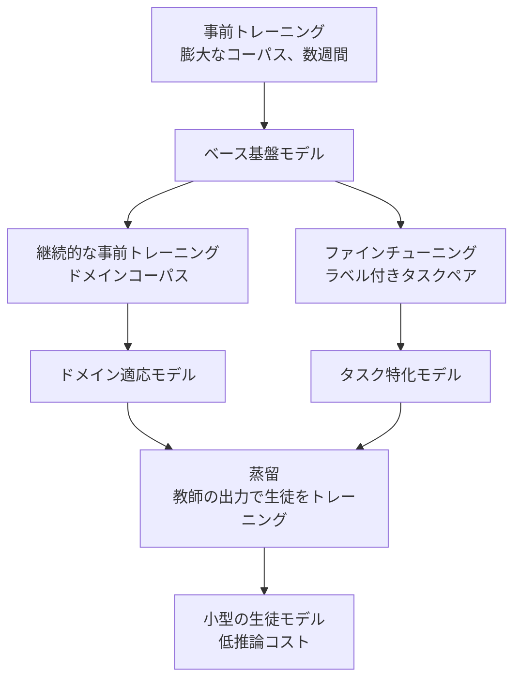
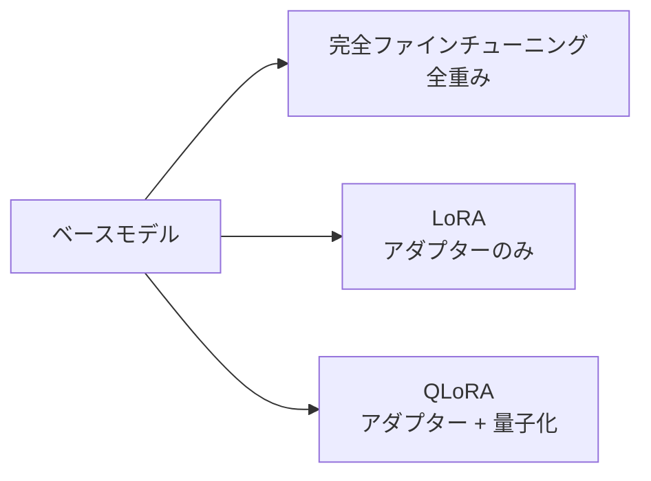
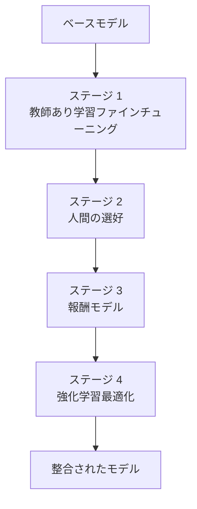
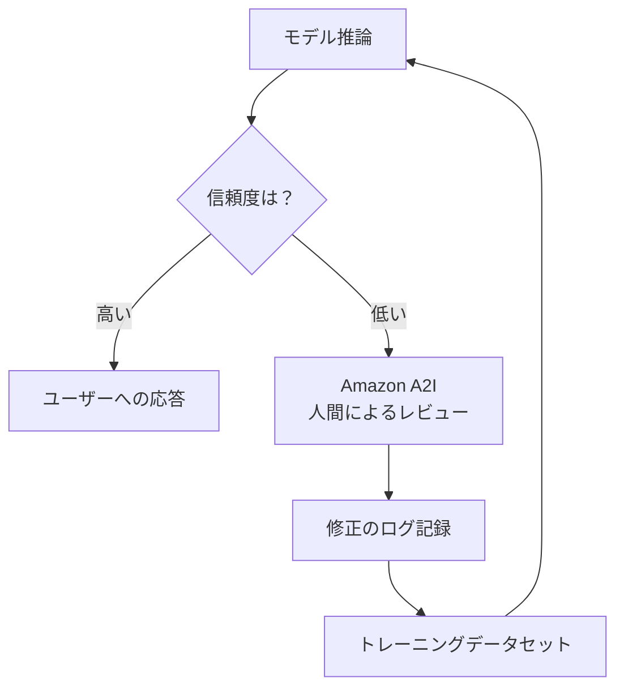
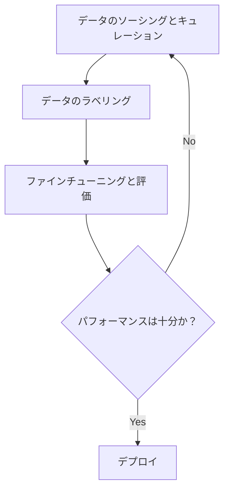

## タスクステートメント 3.3: 基盤モデルのトレーニングとファインチューニングのプロセス

基盤モデルは、すべてのビジネス目的に対応できる状態で提供されるわけではありません。段階的に構築されており、各層が投資規模と目的に応じて特異性を高めていきます。ビジネスプロフェッショナルにとって、モデルがどのように構築・適応されるかを理解することは、主に技術的な演習ではなく、予算策定とスコーピングの演習です。事前トレーニング、ファインチューニング、継続的な事前トレーニング、および蒸留の違いを理解することで、エンジニアリングチームからカスタマイズ提案を受けた際に的確な質問ができます。提案されたタイムラインと予算を評価し、よりシンプルなアプローチで同等の結果が得られる場合を見抜く力も身につきます。[^303001]

このタスクステートメントの 3 つの目標は論理的な順序で構成されています。最初の目標は、トレーニング技術の分類とそのコストプロファイルを扱います。2 番目は、ファインチューニングが適切な選択肢となる場面で使用される具体的な手法を扱います。3 番目は、ファインチューニングジョブを開始する前のデータ準備プロセスを扱います。これにはモデルの動作をビジネスの期待に合わせる人間のフィードバックプロセスも含まれます。これら 3 つが組み合わさることで、ビジネスのスポンサーがトレーニングコードを一行も書かずに、モデルカスタマイズプロジェクトを委託・監督するための枠組みが整います。

### 3.3.1 基盤モデルトレーニングの主要要素

基盤モデルのトレーニングは単一の活動ではなく、各段階が前の段階の上に構築される積み上げ式のプロセスです。ビジネスが何を必要とし、どれだけ投資できるかに応じて、各段階をエントリーポイントとして利用できます。試験では 4 つの段階をカバーします。事前トレーニング、ファインチューニング、継続的な事前トレーニング、および蒸留です。並び順はおおむね、コストが高いものから低いもの、変更の範囲が広いものから狭いものの順になっています。

4 つの技術は、ファインチューニングと RAG が代替手段であるような形で互いの代替手段ではありません。事前トレーニングは基盤を作ります。ファインチューニングと継続的な事前トレーニングは既存のものを調整します。蒸留は結果をより小さなパッケージに圧縮します。ビジネスはこれらを順番に複数使用する場合があります。サードパーティが提供する事前トレーニング済みモデルから始め、継続的な事前トレーニングを適用してドメイン語彙を教え、その結果をコスト効率の高い本番推論のために蒸留します。

**事前トレーニング**は、巨大なテキストおよびその他のデータのコーパスで、ランダムな初期重みからニューラルネットワークをトレーニングするプロセスです。[^303002] モデルは数十億の例から統計的なパターンを学習します。文法、事実の関連性、推論チェーン、および概念間の関係です。事前トレーニングは、外部ドキュメントが提供されない場合でもモデルが引き出せる、重みに埋め込まれた知識であるモデルのパラメトリックメモリを作成します。必要なスケールはほとんどの組織にとって法外なものです。現代の大規模言語モデルのトレーニング実行は、数週間から数ヶ月にわたって数千 GPU 時間を消費し、ペタバイト単位の厳選されたデータを必要とし、モデルが最初の一貫した文章を生成する前に数百万ドルのコストがかかります。[^303003] 事前トレーニングは、すべての技術が出発するベースラインとして試験上で関連しますが、主要な AI 研究機関以外のビジネスにとって実際的な行動項目としてではありません。

**ファインチューニング**は既存の事前トレーニング済みモデルから始まり、はるかに小規模なドメイン固有のデータセットでトレーニングを続けます。[^303004] 目的は、特定のタスクに向けてモデルの動作を変化させることです。特定のトーンで顧客サービスの質問に答える、医療記録から構造化フィールドを抽出する、または会社内部フレームワークでコードを生成するなどです。ファインチューニングはモデルの重みを調整するため、結果として得られるモデルは保存・提供されなければならない独自のアーティファクトです。ラベル付きの例が必要であり、通常は数百から数万のインプット・アウトプットペアが必要で、GPU コンピュートは数週間ではなく数時間から数日の範囲です。**Amazon Bedrock** は、Amazon Nova、Meta Llama、および一部の Anthropic Claude Haiku バージョンを含む、ホストされているモデルのサブセットのファインチューニングをサポートしており、カスタマイズしたモデルをプロビジョンドスループットでデプロイできます。[^303005] ファインチューニングは、タスクが安定している（ターゲットの動作が月ごとに変わらない）場合、ビジネスが十分なラベル付きの例を生成できる場合、そしてパフォーマンスの向上がトレーニングとホスティングのコストを正当化する場合に適切な選択です。

**継続的な事前トレーニング**（*continued pre-training* とも呼ばれます）は、事前トレーニングとファインチューニングの中間的な技術です。[^303006] ラベル付きのインプット・アウトプットペアの代わりに、継続的な事前トレーニングはラベルなしのドメインテキストを使用します。元の事前トレーニングで使用された教師なしコーパスと同じ種類ですが、医学文献、財務報告、または法律判例集などの特定のドメインから抽出されます。目的はモデルに新しいタスクを教えることではなく、元の事前トレーニングコーパスで過少表現されていたドメイン語彙、専門用語、および事実の関連性を教えることです。一般的なインターネットテキストで事前トレーニングされたモデルは、「粗利益」、「純現在価値」、「EBITDA」を認識するが、コンテキスト内で深く理解していない財務用語として扱う場合があります。年次報告書、アナリストノート、決算説明会トランスクリプトのコーパスでの継続的な事前トレーニングは、ラベル付きペアを必要とせずにその理解を向上させます。Amazon Bedrock は一部のモデルのカスタマイズオプションとして継続的な事前トレーニングをサポートしています。[^303007]

**蒸留**はコスト問題に対して異なるアプローチを取ります。より小さなモデルをゼロから訓練する代わりに、蒸留はコンパクトな*生徒モデル*を訓練して、ターゲットとするプロンプトのセットで、より大きく能力の高い*教師モデル*の出力を模倣させます。[^303008] 教師は大規模なプロンプトコレクションに対してレスポンスを生成し、それらのプロンプト・レスポンスペアが生徒のトレーニングデータになります。生徒は教師の重みに決してアクセスせずに、教師の品質を近似することを学習します。蒸留が完了すると、本番推論は生徒によって提供されます。教師よりも呼び出しごとのコストが安く、速いです。Amazon Bedrock はマネージドワークフローとしてモデル蒸留をサポートしており、組織が Bedrock モデルを教師として指定し、ターゲットプロンプト分布を指定し、生徒としてファインチューニングされた小型モデルを生成できます。[^303009] 蒸留の経済性は、1 回限りのトレーニングコストが推論の節約によって迅速に回収されるような高ボリュームアプリケーションに有利です。

*図 3.3.1: FM トレーニング技術の階層。各技術は最初から始めるのではなく、既存のモデルの上に構築され、出発点が豊かになるにつれてコストとデータ要件が減少します。*

*表 3.3.1: FM トレーニングと適応技術の比較*

| 技術 | トレーニングデータ | コンピュートコスト | デプロイまでの時間 | 主な成果 | AWS エントリーポイント |
|------|----------------|----------------|----------------|----------|-------------------|
| 事前トレーニング | ペタバイト、ラベルなし | 非常に高い（数百万 GPU 時間） | 数ヶ月 | 汎用ベースモデル | 対象外（プロバイダーから購入） |
| 継続的な事前トレーニング | ギガバイトからテラバイト、ラベルなし | 中程度（数日） | 数日 | ドメイン語彙と事実の関連性 | Amazon Bedrock カスタムモデル |
| ファインチューニング | 数百から数千のラベル付きペア | 低から中程度（数時間） | 数時間から数日 | タスク固有の動作とトーン | Amazon Bedrock、SageMaker JumpStart |
| 蒸留 | 教師生成のプロンプト・レスポンスペア | 中程度（1 回限り） | 数時間から数日 | 大型モデルの品質を近似する小型モデル | Amazon Bedrock モデル蒸留 |

試験ではしばしば、特定の制約に一致する技術を問うシナリオが出題されます。判断ロジックは次の通りです。ラベル付きデータセットなしで新しい語彙やファクトドメインをモデルに学習させる必要がある場合は、継続的な事前トレーニングを使用します。モデルが特定のタスク動作を学習する必要があり、ラベル付きデータが利用可能な場合は、ファインチューニングを使用します。結果として得られるモデルが推論でより安く、速く、かつトレーニングコストが許容できる場合は、蒸留を追加します。事前トレーニングは、適切な事前トレーニング済みモデルが全く存在しないと質問が明示的に述べている場合にのみ答えですが、現実のビジネスシナリオではほぼありえません。

### 3.3.2 基盤モデルのファインチューニング手法

ファインチューニングはエンタープライズ AI プロジェクトで最も一般的に議論されるカスタマイズ技術です。そのコストプロファイルが実際的な範囲にあり、その出力が組織が管理できるモデルだからです。ファインチューニングという大きなカテゴリの中に、いくつかの異なる手法が存在し、試験ではそれぞれについての理解が求められます。

すべてのファインチューニング手法に共通しているのは、事前トレーニング済みモデルの重みが出発点であり、ドメイン固有のデータでのトレーニングがその重みを変化させるということです。異なるのは、トレーニングデータの形式、変更されるモデルアーキテクチャの部分、および具体的な学習目標です。

**インストラクションチューニング**は、プロンプトと応答のペアのデータセットでファインチューニングを行うものです。各プロンプトは明示的な指示として書かれており、各応答は望ましい動作を示しています。[^303010] 例えば、プロンプトは「以下の顧客苦情を 1 文で要約してください：」に顧客のメールを続けたものであり、応答はターゲットの要約です。モデルは、ドメイン内で尤もらしいテキストを生成するだけでなく、指示形式に確実に従うことを学習します。インストラクションチューニングは、単にシーケンスの次のトークンを予測するだけのベースモデルを、コマンドに応答するアシスタントモデルに変換するものです。「チャット」または「インストラクト」バリアントとして説明されている商業的に利用可能なモデルのほとんどは、すでにインストラクションチューニングを受けています。追加のインストラクションペアでそれらをファインチューニングすることで、この機能が特定のビジネスタスクや語彙に拡張されます。

**特定のドメインへのモデル適応**は、専門的な分野に適用された場合のインストラクションチューニングと教師あり学習ファインチューニングの一般的な目標を説明しています。[^303011] 医療機関は、モデルが電子健康記録システム用にフォーマットされた出力を生成するように、臨床記録テンプレートと診断コードの例でファインチューニングする場合があります。法律チームは、モデルが特定の条項タイプを識別する能力を向上させるために、契約条項ライブラリでファインチューニングする場合があります。金融サービス会社は、特殊な財務用語のモデルの処理を向上させるために、決算説明会トランスクリプトとアナリストレポートでファインチューニングする場合があります。主要な要件は、トレーニング例がデプロイされたモデルが遭遇する入力の分布を正確に表すことです。ある専門分野の臨床記録でトレーニングして別の専門分野で使用すると、結果が劣化します。

**転移学習**は、ファインチューニングの基礎にある広範な理論的概念です。[^303012] 転移学習とは、あるタスクのためにトレーニングされたモデルを取り、その学習された表現を別のタスクの出発点として再利用する原則を指します。大規模言語モデルのコンテキストでは、すべてのファインチューニング操作は転移学習のインスタンスです。モデルは事前トレーニングから特定のタスクドメインへの一般的な言語理解を転移します。「あるタスクで学習した知識を別のタスクのパフォーマンス向上に適用する」ことについて尋ねる質問が転移学習を説明していると認識することで、答えを正確に合わせるのに役立ちます。

**継続的な事前トレーニング**（セクション 3.3.1 でカバー済み）は、一般的な 2 段階パターンを示すためにここで言及しています。まずラベルなしのコーパスでの継続的な事前トレーニングを適用してドメイン語彙と事実の根拠を確立し、次により小規模なラベル付きデータセットでインストラクションチューニングを適用してタスク固有の動作を教えます。[^303013] 2 段階のアプローチは、ドメインが高度に専門化されている場合に、いずれかの技術を単独で使用するよりも良い結果を生みます。

**パラメーター効率ファインチューニング**（PEFT）は、ファインチューニングの主な実際的制約の 1 つに対処します。完全なファインチューニングはモデルのすべての重みを更新するため、モデル自体のトレーニングと同じメモリとコンピュートキャパシティが必要です。[^303014] PEFT 手法はモデルの重みのほとんどを凍結し、少量の追加パラメーターのみをトレーニングすることでこの負担を軽減します。**LoRA**（*低ランク適応*）は最も広く使用される PEFT 手法です。トランスフォーマーアーキテクチャの特定のレイヤーに小さなトレーニング可能な行列を挿入します。トレーニング中に更新されるのはこれらのアダプター行列だけで、元の重みは凍結されたままです。[^303015] LoRA 設定のトレーニング可能なパラメーター数は、フルモデルのパラメーター数の 1 パーセント程度であり、それに対応して GPU メモリ要件を削減します。**QLoRA**（*量子化 LoRA*）は LoRA と*量子化*を組み合わせます。量子化とは、モデルの重みを 32 ビットまたは 16 ビット浮動小数点値から 4 ビット整数に圧縮することで、そうでなければ利用可能なハードウェアに収まらないモデルのファインチューニングを可能にします。[^303016] ビジネスの観点からは、LoRA と QLoRA が重要なのは、それらが最も高価な GPU インスタンスを必要とせずに、より大きく高品質なモデルのファインチューニングをアクセス可能にするからです。

*図 3.3.2: パラメーター効率ファインチューニング手法。LoRA と QLoRA は勾配更新が必要なパラメーター数を削減し、より小さなハードウェア構成でのファインチューニングをアクセス可能にします。*

AWS はファインチューニングのための 2 つの主要なエントリーポイントを提供しています。**Amazon Bedrock** はマネージドワークフローを通じてホスト型モデルのファインチューニングをサポートします。顧客はトレーニングデータセットを **Amazon S3** にアップロードし、Bedrock コンソールまたは API でファインチューニングジョブを設定し、Bedrock がインフラ、トレーニング実行、および結果として得られるカスタムモデルの保存を処理します。[^303017] カスタムモデルはその後、プロビジョンドスループット（専用キャパシティを確保し、リクエストボリュームに関係なく時間単位で課金）または低ボリュームのユースケース向けのサーバーレスモードによる推論に利用できます。**Amazon SageMaker JumpStart** は、Meta Llama、Mistral、Falcon ファミリーを含む事前トレーニング済みオープンソースモデルのカタログと、SageMaker マネージドインフラにトレーニングジョブをデプロイするワンクリックのファインチューニングワークフローを提供します。[^303018] JumpStart は、ビジネスが Bedrock のホスト型 API に依存するのではなく、自社の AWS アカウント内で自社のコンピュートで実行できるモデルを必要とする場合に適しています。また、完全なファインチューニングが利用可能な GPU メモリを超えるモデルのための LoRA および QLoRA 設定もサポートしています。

*表 3.3.2: AWS ファインチューニングエントリーポイントの比較*

| 機能 | Amazon Bedrock | Amazon SageMaker JumpStart |
|------|--------------|--------------------------|
| モデルの利用可能性 | Bedrock ホスト型モデル（Amazon Nova、Meta Llama、一部の Anthropic Claude Haiku バージョン） | オープンソースモデル（Llama、Mistral、Falcon などを含む） |
| インフラ管理 | AWS が完全管理 | SageMaker でのマネージドトレーニングとデプロイ |
| トレーニングデータの場所 | Amazon S3 | Amazon S3 |
| PEFT サポート（LoRA/QLoRA） | モデルによって異なる | 対応モデルでサポート |
| 推論モード | プロビジョンドスループットまたはオンデマンド | SageMaker リアルタイムエンドポイントまたはバッチ変換 |
| 最適な用途 | マネージドホスティングを持つ商業クローズドウェイトモデル | オープンソースモデル、完全なモデル所有権 |

Bedrock と JumpStart の選択は、主にモデルの所有権の問題です。Bedrock のファインチューニングは、AWS が引き続き提供するホスト型モデルの動作を調整します。ビジネスは結果として得られる重みを所有しません。JumpStart のファインチューニングは顧客自身の S3 バケットにモデルアーティファクトを生成し、重みに対する完全なポータビリティと制御を提供します。モデルアーティファクトが自社環境内で監査・制御可能でなければならない規制業界の組織にとっては、JumpStart が推奨されるパスです。

### 3.3.3 基盤モデルのファインチューニングのためのデータ準備

データ品質はファインチューニングプロジェクトで最大の変数です。欠陥のあるデータでトレーニングされたモデルは欠陥のある動作を確実に学習します。優れたデータでトレーニングされたモデルは、比較的少数の例であっても、ベースモデルよりも大幅な品質改善を達成できます。データ準備プロセスには、トレーニングジョブが開始される前に計画されなければならないいくつかの異なる活動が含まれます。

**データキュレーション**は、トレーニングデータセットに含める例を選択、フィルタリング、クリーニングするプロセスです。[^303019] キュレーションは候補プールから始まります。これは既存の顧客インタラクション、内部文書、ラベル付きの過去の出力、または目的に合わせて作成された例であり、誤り、曖昧さ、または非代表的なアイテムを体系的に削除します。具体的なキュレーション活動には、重複例の削除（一般的なパターンにモデルが過学習する原因となる可能性がある）、事実誤りや時代遅れの情報を含む例のフィルタリング、情報量の少ない短すぎる例の削除、モデルがタスクのゆがんだバージョンを学習しないように例のタイプの分布のバランス調整が含まれます。インストラクションチューニングデータセットの場合、キュレーションは指示と応答が実際に一致していることを確認することも意味します。請求に関する質問と技術サポートに関する回答をペアにしたデータセットは、不正確な関連性をモデルに教えます。

**データガバナンス**は、トレーニングデータに適用される法的、倫理的、および運用上の制御をカバーします。[^303020] 3 つの懸念が最も顕著です。第一に、*個人識別情報*（PII）の取り扱いです。トレーニングデータは名前、メールアドレス、口座番号、健康情報、およびその他の PII についてスクリーニングされなければなりません。トレーニングデータに PII を含めると、モデルが応答でそれを再現するリスクが生じ、ほとんどの法域でプライバシー規制に違反します。**Amazon Comprehend** のエンティティ認識機能などの自動 PII 検出ツールは、トレーニングパイプラインに入る前に大規模なスケールでドキュメントをスクリーニングできます。[^303021] 第二に、同意です。トレーニングに使用されるデータは、この目的での使用を許可する条件で収集されたものでなければなりません。第三に、*データリネージ*です。組織は各トレーニング例をそのソースまでさかのぼり、ソースがトレーニング使用のライセンスを持っていることを確認し、コンプライアンス監査で必要な場合にトレーニングデータセットを再現できるべきです。トレーニングデータソースとそのプロベナンスのマニフェストを維持することで、この要件を満たします。

ファインチューニングの**データセットサイズ**は、事前トレーニングからの直感が示すよりも小さいですが、些細なものでもありません。[^303022] タスク適応のための典型的なインストラクションチューニングジョブは、測定可能な改善を生み出すために数百から数千の高品質なラベル付き例を必要とします。品質対量の原則が直接適用されます。重複、誤り、トピック外のアイテムを含む 5,000 の例よりも、注意深くキュレートされた、正確で多様な 500 の例が一貫して優れています。意味のあるファインチューニングの実際的な最小値は通常 200 から 500 の例の範囲です。それ以下では、モデルが確実に汎化するのに十分な多様性に遭遇しません。上限については、狭く定義されたタスクではタスクパフォーマンスの向上が数千の例あたりでプラトーに達することが多く、それ以降は新たなサブシナリオをカバーする例でなければ追加データの効果が逓減します。

**ラベリング**は、各トレーニング例の出力側を作成または確認するプロセスです。[^303023] インストラクションチューニングの場合、ラベリングとは各プロンプトのターゲット応答を書くまたはレビューすることを意味します。ラベリングの品質はファインチューニングの結果に特に大きな影響を与えます。モデルはすべてのラベル付き例をグラウンドトゥルースとして扱うからです。ラベルエラーは誤った動作をモデルに教え、モデルはそれらのエラーを見たことのない入力に汎化する可能性があります。1 人以上のアノテーターによってレビューされ、アノテーターが不一致の場合に調停される一貫したラベリングガイドラインが、信頼性の高いトレーニングデータセットの運用基盤です。**Amazon SageMaker Ground Truth** は大規模な人間のラベリングワークフローを整理するための AWS マネージドサービスで、組み込みのタスクタイプ（画像分類、テキスト分類、固有表現認識）とドメイン固有のラベリングニーズのためのカスタムタスクインターフェースの両方をサポートしています。[^303024] **Amazon SageMaker Ground Truth Plus** は AWS が提供するマネージドワークフォースでサービスを拡張し、外部アノテーターを直接採用・管理する必要性をなくします。[^303025]

**代表性**は、例が全体としてデプロイされたモデルが実際に遭遇する入力の分布をカバーすることを確保するトレーニングデータセットの特性です。[^303026] 代表性のないデータセットは、隠れた弱点を持つモデルを生み出します。トレーニングされた入力では良いパフォーマンスを発揮し、されていない入力では劣化します。例えば、1 つの地域のユーザーとの英語のインタラクションのみでトレーニングされたカスタマーサービスモデルは、フレーズが異なる文化的慣習を反映したユーザーを対象にグローバルにデプロイされた場合にパフォーマンスが低下します。代表性の確保は、エッジケース、言語的多様性、トピックの多様性、およびデプロイされたモデルが対象とすることが期待されるサブ集団を含むようにトレーニングデータセットを意図的に構築することを必要とします。代表性の確認は継続的な責任です。デプロイされたモデルの入力分布が時間とともに変化するにつれて、トレーニングデータセットを更新する必要がある場合があります。

**人間のフィードバックによる強化学習（RLHF）**は、ラベル付きタスクでの精度だけでなく、人間の好みへのモデルの整合性を向上させるトレーニング方法論です。[^303027] 本番の RLHF パイプラインは通常、教師あり学習ファインチューニング（SFT）ウォームアップから始まります。これにより、選好データが収集される前に、ベースモデルが指示に従うように整合されます。この SFT ステップは図 3.3.3 の最初のボックスとして示されています。残りのステージは次の通りです。人間のアノテーターが同じプロンプトに対する複数のモデル生成応答を最良から最悪の順にランク付けし、別の*報酬モデル*がそれらの人間のランキングを予測するようにトレーニングされます（プロンプトと応答を与えられると、報酬モデルは人間のアノテーターが付けるスコアを予測します）。そして主要モデルは、報酬モデルをトレーニングシグナルとして使用した*強化学習*アルゴリズム（元の定式化では*近位方策最適化*（PPO））を使用してファインチューニングされます。[^303028] モデルは報酬モデルが高くスコアする応答を生成することを学習します。これは人間のアノテーターが好む応答に対応します。RLHF は、ベースの大規模言語モデルをほとんどの人が今日使用する役立つ指示に従うアシスタントに変換した技術です。モデルが単に流暢であるだけでなく役立つようになるトレーニングフェーズです。

*図 3.3.3: RLHF パイプライン。人間の選好データが報酬モデルをトレーニングし、その報酬モデルが主要モデルをアノテーターの好みに整合させるための強化学習を誘導します。*

**Amazon A2I**（**Amazon Augmented AI**）は関連するが異なる問題に対処します。モデルトレーニングではなく、本番でのモデル出力の継続的な人間によるレビューです。[^303029] RLHF が人間の判断を収集してモデルの重みを向上させるのに対し、A2I はモデルの信頼度が閾値を下回る場合またはタスクタイプが人間の監視を義務付ける場合に、特定の推論出力を人間のレビュアーにルーティングします。例えば、金融文書処理ワークフローは、モデルの信頼度が 90% を下回るすべての出力を人間のレビュアーキューに送信し、レビュアーの修正が将来のファインチューニングサイクルにフィードバックされる場合があります。A2I は SageMaker モデルと統合し、カスタムの人間レビュータスクインターフェースをサポートし、エンドツーエンドのデータフライホイールの Ground Truth への自然な補完となっています。

*図 3.3.4: 人間を組み込んだデータフライホイール。Amazon A2I は信頼度の低い出力を人間のレビュアーにルーティングし、修正は Ground Truth を通じて次のファインチューニングサイクルにフィードバックされ、モデルを継続的に改善します。*

*表 3.3.3: データ準備活動と AWS ツール*

| 活動 | 対処する課題 | AWS ツールまたはサービス |
|------|------------|----------------------|
| PII の検出と削除 | プライバシーコンプライアンス、データガバナンス | Amazon Comprehend エンティティ認識 |
| 大規模な人間ラベリング | ラベル付きデータセットの作成、ラベル品質 | Amazon SageMaker Ground Truth |
| マネージドラベリングワークフォース | アノテーターの調達と管理 | Amazon SageMaker Ground Truth Plus |
| モデル出力の人間レビュー | 継続的な品質保証、フィードバック収集 | Amazon Augmented AI (A2I) |
| トレーニングデータの保存 | セキュアでスケーラブルなトレーニングジョブへの入力 | Amazon S3 |
| トレーニングジョブの実行 | ファインチューニングのコンピュートとオーケストレーション | Amazon Bedrock カスタムモデル、SageMaker JumpStart |

ファインチューニングプロジェクトのデータ準備プロセスは線形ではなく、反復的なものです。最初のデータセットがキュレートされ、モデルがトレーニングされ、出力が評価され、エラーが診断され、次のトレーニング実行の前にトレーニングデータが修正または補強されます。このサイクルは通常、モデルがターゲット品質に達するまで 2 から 4 回繰り返されます。データ準備を 1 回限りの活動として扱う組織は、体系的なデータパイプラインに最初から投資する組織よりも、より頻繁により高い総コストでトレーニングジョブを繰り返す結果になります。

*図 3.3.5: エンドツーエンドのファインチューニングデータ準備ワークフロー。データキュレーション、ラベリング、評価は反復的なサイクルを形成し、評価で特定されたギャップがトレーニングデータセットへの目標を絞った追加を促します。*

ファインチューニングプロジェクトを監督するビジネスのスポンサーは、データ準備への時間投資が、モデルトレーニングと評価に費やす時間の合計とほぼ等しくなることを期待すべきです。トレーニングコンピュートは測定可能で、エンジニアリングチームが最初に引用することが多いですが、データ準備の労力はしばしば過小評価されます。特にラベリングが汎用のアノテーターではなくドメインエキスパート（医師、弁護士、金融アナリスト）を必要とする場合はなおさらです。最初から両方の半分の努力のための予算を立てることで、より信頼性の高いプロジェクト計画が生まれます。

## セルフチェック問題

**問題 1.** ある医療機関は、医師の臨床文書作成を支援するために基盤モデルを使用したいと考えています。同社には大量の匿名化された臨床記録のアーカイブがありますが、ラベル付きの質問・回答ペアはありません。モデルの主な弱点は医療用語への不慣れです。最初のステップとして最も適したカスタマイズ技術はどれですか？

A. 臨床記録からのインストラクション・レスポンスペアでモデルをファインチューニングする
B. ラベルなしの臨床記録アーカイブでモデルの継続的な事前トレーニングを行う
C. 医師が生成したプロンプトを使用して、モデルをより小型の生徒モデルに蒸留する
D. 実行時に各プロンプトに臨床記録を貼り付けることでインコンテキスト学習を使用する

**解説:** シナリオには 2 つの定義的な特徴があります。大量のラベルなしコーパスが存在し、主な弱点はタスク動作ではなくドメイン語彙であることです。継続的な事前トレーニング（答え B）は、まさにこの状況のために設計されています。ラベル付き例を必要とせずに、未加工の記録の教師なしトレーニングを通じてドメインの専門用語と事実の関連性をモデルに教えます。これは、利用可能なラベル付きデータセットがなく、根本的な語彙のギャップを生の記録での教師なしトレーニングほど効率的に解決しないインストラクション・レスポンスペアでのファインチューニング（答え A）の前に行うべき正しい最初のステップです。蒸留（答え C）は教師の出力を模倣するより小型のモデルを生成します。ドメイン語彙の弱点に直接対処するものではなく、開始点として有能な教師モデルを必要とします。インコンテキスト学習（答え D）は必要なドメインカバレッジのレベルにスケールできず、その代わりに患者の実際の臨床データを保持できたはずのコンテキストウィンドウスペースを消費します。この組織に適した手順は、まず継続的な事前トレーニングを行い、ラベル付きデータセットが揃い次第インストラクションチューニングを適用するというものです。[^303030]

---

**問題 2.** エンジニアリングチームが SageMaker JumpStart を使用して 700 億パラメーターのオープンソースモデルのファインチューニングを提案しています。利用可能な GPU インスタンスには 24 GB の VRAM があります。チームは、完全なファインチューニングには約 140 GB の GPU メモリが必要と見積もっています。この制約に対して最も適したパラメーター効率ファインチューニング技術はどれですか？

A. パラメーターギャップを補うためにより大きなプロンプトテンプレートを使用したインストラクションチューニング
B. メモリ要件を削減するためにアダプター行列のトレーニングと 4 ビット量子化を組み合わせた QLoRA
C. トレーニング可能なパラメーター数を削減するラベルなしベースモデルコーパスでの継続的な事前トレーニング
D. 700 億パラメーターモデルを 24 GB に収まるように圧縮する蒸留

**解説:** 制約は GPU メモリです。完全なファインチューニングには 140 GB が必要ですが、利用可能なのは 24 GB だけです。QLoRA（答え B）はこれを直接解決します。凍結されたベースモデルの重みに 4 ビット量子化を適用してメモリフットプリントを大幅に削減し、その上に小さな LoRA アダプター行列のみをトレーニングします。量子化されたベースモデルと LoRA アダプターの組み合わせメモリ要件は、大型モデルでも通常 1 つの GPU の VRAM に収まります。より大きなプロンプトテンプレートを使用したインストラクションチューニング（答え A）はデータフォーマットアプローチであり、メモリ削減技術ではありません。GPU メモリ要件には何も影響しません。継続的な事前トレーニング（答え C）は、ラベルなしのドメインテキストを使用してすべての重みを更新する別の技術です。GPU メモリの制約に対処しておらず、チームが実行しようとしている教師あり学習ファインチューニングよりもさらに多くのメモリが必要です。蒸留（答え D）は新しいより小さなモデルを作成する別の技術です。QLoRA が行うような方法で既存のモデルをより小さなハードウェアで実行できるように圧縮するものではなく、チームが望むファインチューニングされた 70B モデルを生成するのではなく、トレーニングデータを生成するための有能な教師が必要です。[^303031]

---

**問題 3.** ある会社がカスタマーサポート向けに基盤モデルをファインチューニングし、実際の本番インタラクションに基づいて継続的に改善したいと考えています。チームは、信頼度の閾値を下回るモデルの応答を人間のレビュアーにルーティングし、レビュー済みの修正を次のトレーニングサイクルに組み込む計画です。人間のレビューのルーティングステップを最も直接的にサポートするよう設計された AWS サービスはどれですか？

A. Amazon SageMaker Ground Truth
B. Amazon Comprehend
C. Amazon Augmented AI (A2I)
D. Amazon SageMaker JumpStart

**解説:** Amazon Augmented AI (A2I)（答え C）は、モデルの信頼スコアが閾値を下回るなど、定義された条件が満たされたときに本番推論出力を人間のレビュアーにルーティングするために特別に設計されたサービスです。レビュアーキュー、タスクインターフェース、レビュー済み決定の出力を管理します。これはまさに質問で説明されているステップです。Amazon SageMaker Ground Truth（答え A）は組織化された人間のラベリングワークフローを通じてラベル付きトレーニングデータセットを作成するために使用されます。フライホイールの修正ログと将来のファインチューニングステップのためのツールですが、ライブ本番出力をレビュアーにルーティングするためのものではありません。Amazon Comprehend（答え B）は感情分析やエンティティ抽出などのタスクに使用される自然言語処理サービスです。モデル出力をレビューにルーティングしません。Amazon SageMaker JumpStart（答え D）はモデルのトレーニングとデプロイメントサービスです。本番推論出力のための人間レビュールーティング機能は提供していません。正しい答えはレビューのルーティングステップには A2I で、その後のステップで Ground Truth を使用してレビュー済みの修正をラベル付きトレーニングデータセットに変換します。[^303032]

---

**問題 4.** ある法律サービス会社が社内の契約データでモデルをファインチューニングしたいと考えています。法務チームは、トレーニングデータセットに実際のクライアント契約書からの個人識別情報が含まれている可能性を懸念しています。トレーニングジョブが開始される前にこの懸念に最もよく対処するアプローチはどれですか？

A. Amazon SageMaker JumpStart を使用して LoRA を適用する。LoRA はモデルが特定のクライアントの詳細を記憶するのを防ぐため。
B. Amazon Comprehend エンティティ認識を適用して、トレーニングコーパスから PII を検出し削除する。
C. 推論時に Amazon Bedrock Guardrails を使用して、モデルの応答に PII が現れるのを防ぐ。
D. ファインチューニングデータセットを 5 年未満の契約に限定する。

**解説:** 懸念事項は、トレーニングジョブが実行される前にトレーニングデータに PII が存在することです。正しいアプローチは、データ準備時にトレーニングコーパスから PII を検出し削除することです（答え B）。Amazon Comprehend のエンティティ認識機能は、大規模なドキュメントコレクション全体で名前、住所、口座番号、およびその他の PII カテゴリを識別でき、自動化された事前トレーニングスクリーニングを可能にします。LoRA（答え A）はトレーニングされるパラメーターの数を削減しますが、モデルがトレーニングデータに存在するパターン（PII を含む）を学習・再現するのを防ぎません。パラメーター効率ファインチューニングはコンピュート最適化であり、データガバナンス制御ではありません。Amazon Bedrock Guardrails（答え C）は推論時にモデル出力をフィルタリングします。これは有用な多層防御ですが、モデルが PII でトレーニングされており、それを内部化している可能性があるという根本的な問題に対処しません。契約の年齢による制限（答え D）はデータの新鮮さに対処しますが、契約に PII が含まれているかどうかとは関係ありません。古い契約も新しい契約も同様に機密クライアント情報を含む可能性があります。正しい答えはトレーニングが開始される前にトレーニングコーパスをスクリーニングしてサニタイズすることです。[^303033]

---

**問題 5.** ある会社が保険請求を処理するためのモデルのファインチューニングを完了しました。評価中、モデルは単純な請求では優れたパフォーマンスを発揮しますが、異常な状況を含む請求ではパフォーマンスが低いです。エンジニアリングチームは、トレーニングデータセットがエッジケースを過少表現していると疑っています。この代表性の問題を最も直接的に解決するアクションはどれですか？

A. トレーニングエポック数を増やして、モデルがエッジケースを学習するためにより多くの時間を与える
B. QLoRA を適用してメモリ要件を削減する。これにより、より多様なトレーニングのためのコンピュートが解放される
C. 過少表現されているエッジケースのタイプを具体的にカバーする追加の例でトレーニングデータセットを補強する
D. Amazon Bedrock ファインチューニングから SageMaker JumpStart に切り替えて、より大型のモデルへのアクセスを得る

**解説:** 根本的な原因はトレーニングデータの代表性のギャップです。エッジケースは本番に存在しますが、トレーニングセットには存在しないか、大幅に過少表現されています。正しいアクションは、それらの特定のエッジケースをカバーする追加の例でトレーニングデータセットを補強することです（答え C）。これは分布のミスマッチに直接対処します。トレーニングエポックの増加（答え A）はモデルを同じデータで更に多くの回数トレーニングします。そのデータがエッジケースを含まない場合、より多くのエポックはそれらを処理することをモデルに教えず、存在する例への過学習を引き起こす場合があります。QLoRA（答え B）はファインチューニングのメモリ最適化です。トレーニングデータの分布やモデルのエッジケースのカバレッジには影響しません。SageMaker JumpStart または大型モデルへの切り替え（答え D）はモデルの容量を増やす可能性がありますが、同じ代表性の欠けたデータセットでトレーニングされた大型モデルは依然としてエッジケースで低いパフォーマンスを発揮します。モデルの容量が制約ではなく、トレーニングデータのカバレッジが制約です。正しい答えは代表性の原則から直接導かれます。ターゲットの入力分布に一致するようにデータ分布を修正します。[^303034]

[^303001]: AWS Certification. AI Practitioner (AIF-C01) Exam Guide v1.1, Task Statement 3.3. URL: <https://docs.aws.amazon.com/aws-certification/latest/ai-practitioner-01/ai-practitioner-01-domain3.html>
[^303002]: Bommasani, R., et al. On the Opportunities and Risks of Foundation Models (Stanford CRFM, 2021). URL: <https://arxiv.org/abs/2108.07258>
[^303003]: Patterson, D., et al. Carbon Emissions and Large Neural Network Training (2021). URL: <https://arxiv.org/abs/2104.10350>
[^303004]: Howard, J., and Ruder, S. Universal Language Model Fine-tuning for Text Classification (ULMFiT, 2018). URL: <https://arxiv.org/abs/1801.06146>
[^303005]: Amazon Bedrock. Fine-tuning foundation models in Amazon Bedrock. URL: <https://docs.aws.amazon.com/bedrock/latest/userguide/custom-models.html>
[^303006]: Amazon Bedrock. Continued pre-training in Amazon Bedrock. URL: <https://docs.aws.amazon.com/bedrock/latest/userguide/custom-models-continued-pretraining.html>
[^303007]: Amazon Bedrock. Customization options for foundation models in Amazon Bedrock. URL: <https://docs.aws.amazon.com/bedrock/latest/userguide/custom-models.html>
[^303008]: Hinton, G., et al. Distilling the Knowledge in a Neural Network (2015). URL: <https://arxiv.org/abs/1503.02531>
[^303009]: Amazon Bedrock. Model distillation in Amazon Bedrock. URL: <https://docs.aws.amazon.com/bedrock/latest/userguide/model-distillation.html>
[^303010]: Wei, J., et al. Finetuned Language Models Are Zero-Shot Learners (FLAN, 2021). URL: <https://arxiv.org/abs/2109.01652>
[^303011]: Amazon Bedrock. Use cases for fine-tuning in Amazon Bedrock. URL: <https://docs.aws.amazon.com/bedrock/latest/userguide/custom-models.html>
[^303012]: Pan, S.J., and Yang, Q. A Survey on Transfer Learning (2010). URL: <https://doi.org/10.1109/TKDE.2009.191>
[^303013]: Amazon Bedrock. Continued pre-training vs. fine-tuning in Amazon Bedrock. URL: <https://docs.aws.amazon.com/bedrock/latest/userguide/custom-models-continued-pretraining.html>
[^303014]: Ding, N., et al. Parameter-Efficient Fine-Tuning of Large-Scale Pre-trained Language Models (2023). URL: <https://arxiv.org/abs/2303.15647>
[^303015]: Hu, E., et al. LoRA: Low-Rank Adaptation of Large Language Models (2021). URL: <https://arxiv.org/abs/2106.09685>
[^303016]: Dettmers, T., et al. QLoRA: Efficient Finetuning of Quantized LLMs (2023). URL: <https://arxiv.org/abs/2305.14314>
[^303017]: Amazon Bedrock. Training data requirements for fine-tuning in Amazon Bedrock. URL: <https://docs.aws.amazon.com/bedrock/latest/userguide/model-customization-prepare.html>
[^303018]: Amazon SageMaker. Amazon SageMaker JumpStart foundation models. URL: <https://docs.aws.amazon.com/sagemaker/latest/dg/studio-jumpstart.html>
[^303019]: Allamanis, M., et al. A Survey of Machine Learning for Big Code and Naturalness (2018). URL: <https://arxiv.org/abs/1709.06182>
[^303020]: NIST. AI Risk Management Framework (AI RMF 1.0), Measure 2.2. URL: <https://airc.nist.gov/RMF>
[^303021]: Amazon Comprehend. Detecting personally identifiable information (PII) using Amazon Comprehend. URL: <https://docs.aws.amazon.com/comprehend/latest/dg/how-pii.html>
[^303022]: Kaplan, J., et al. Scaling Laws for Neural Language Models (2020). URL: <https://arxiv.org/abs/2001.08361>
[^303023]: Northcutt, C., et al. Pervasive Label Errors in Test Sets Destabilize Machine Learning Benchmarks (2021). URL: <https://arxiv.org/abs/2103.14749>
[^303024]: Amazon SageMaker. Amazon SageMaker Ground Truth. URL: <https://docs.aws.amazon.com/sagemaker/latest/dg/sms.html>
[^303025]: Amazon SageMaker. Amazon SageMaker Ground Truth Plus. URL: <https://docs.aws.amazon.com/sagemaker/latest/dg/gtp.html>
[^303026]: Mehrabi, N., et al. A Survey on Bias and Fairness in Machine Learning (2021). URL: <https://arxiv.org/abs/1908.09635>
[^303027]: Ouyang, L., et al. Training language models to follow instructions with human feedback (InstructGPT, 2022). URL: <https://arxiv.org/abs/2203.02155>
[^303028]: Schulman, J., et al. Proximal Policy Optimization Algorithms (2017). URL: <https://arxiv.org/abs/1707.06347>
[^303029]: Amazon Augmented AI. Amazon Augmented AI (Amazon A2I) overview. URL: <https://docs.aws.amazon.com/sagemaker/latest/dg/a2i-use-augmented-ai-a2i-human-review-loops.html>
[^303030]: Amazon Bedrock. Continued pre-training for domain adaptation in Amazon Bedrock. URL: <https://docs.aws.amazon.com/bedrock/latest/userguide/custom-models-continued-pretraining.html>
[^303031]: Dettmers, T., et al. QLoRA: Efficient Finetuning of Quantized LLMs (2023). URL: <https://arxiv.org/abs/2305.14314>
[^303032]: Amazon Augmented AI. When to use Amazon A2I for human review loops. URL: <https://docs.aws.amazon.com/sagemaker/latest/dg/a2i-use-augmented-ai-a2i-human-review-loops.html>
[^303033]: Amazon Comprehend. PII detection and redaction with Amazon Comprehend. URL: <https://docs.aws.amazon.com/comprehend/latest/dg/how-pii.html>
[^303034]: Amazon Bedrock. Preparing training datasets for fine-tuning in Amazon Bedrock. URL: <https://docs.aws.amazon.com/bedrock/latest/userguide/model-customization-prepare.html>
