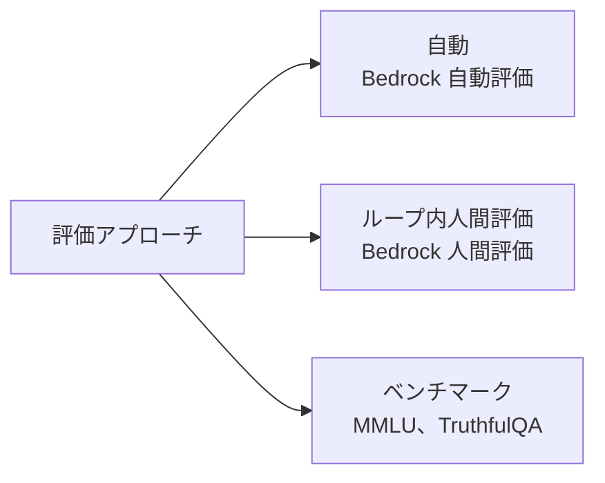
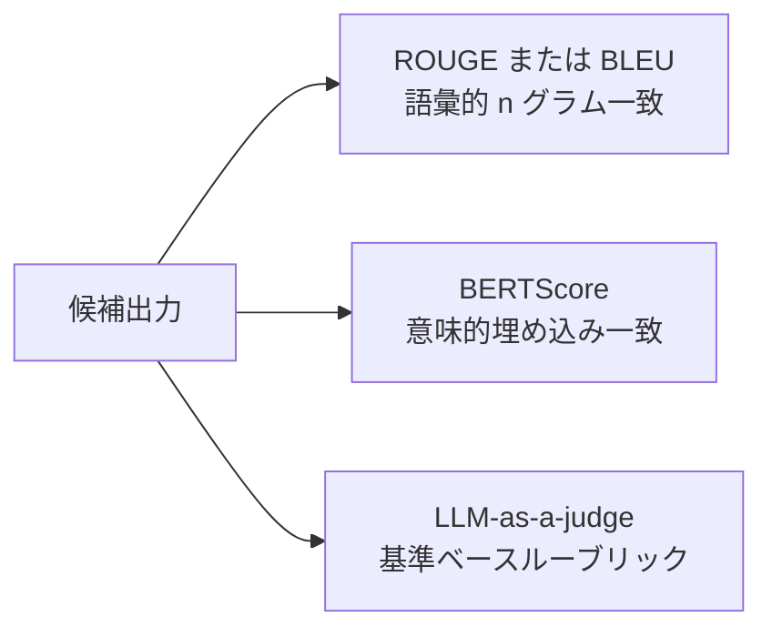
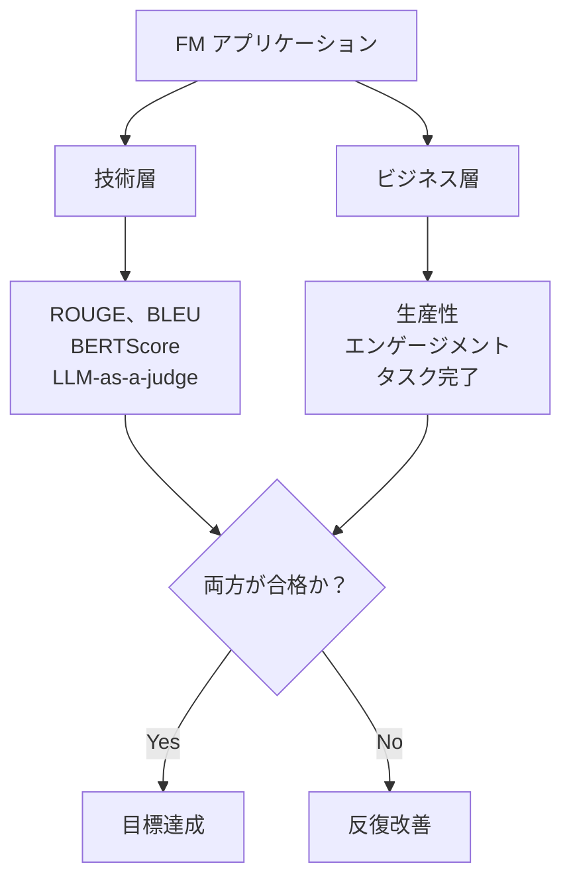
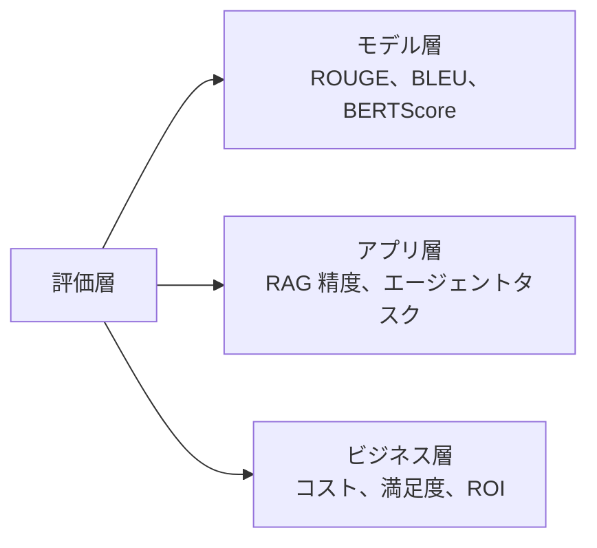

## タスクステートメント 3.4: 基盤モデルのパフォーマンス評価方法

構造化された評価計画なしに基盤モデルのアプリケーションをリリースすることは、テストなしにソフトウェアをリリースするのと同等です。モデルは一般的なベンチマークで高いスコアを出しながらも、構築された対象のビジネスタスクで失敗することがあります。あるいは技術的な精度目標を達成しながらも、ユーザーが静かに使用をやめてしまうことがあります。このタスクステートメントでは、FM のパフォーマンスを 3 つの異なる層で測定する方法をカバーします。モデル自体、その上に構築されたアプリケーション、そしてデプロイの目的であるビジネス成果です。[^304001]

### 3.4.1 基盤モデルのパフォーマンス評価アプローチ

ほとんどの組織は、実際に自社のデータとタスクで十分に機能するかどうかを評価するよりも、基盤モデルの選定に多くの時間を費やします。この優先順位の逆転はコスト増加につながります。汎用ランキングで上位のモデルでも、組織のワークフローが必要とする特殊な語彙、文書の長さ、または推論パターンでは依然として低いパフォーマンスを示す場合があります。評価は、問題発生後の後付けの診断作業としてではなく、デプロイ前から計画する重要な工程として位置づけるべきです。

FM 評価には 3 つの補完的なアプローチがあります。最初は人間のレビュアーが出力を直接評価します。2 番目は精選されたベンチマークデータセットを使用して標準化されたタスクでのパフォーマンスを測定します。3 番目はマネージドサービス **Amazon Bedrock Model Evaluation** を使用して、制御された監査可能なワークフロー内で自動評価と人間評価の両方を実行します。[^304002]

**ループ内人間評価**は、自動化されたメトリクスでは捉えられない基準（専有トピックに関する事実の正確さ、トーンの適切さ、または安全性）に対してモデル出力を評価するために、評価プロセスに資格のある人間のレビュアーを組み込む実践です。[^304003] 試験では v1.1 でこの用語を「人間評価」から「ループ内人間評価」に更新しました。人間がエンドツーエンドで評価を実行するのではなく、より大きな自動化パイプラインの特定の判断ポイントに挿入されることを強調するためです。

本番環境で見られる 3 つの一般的なループ内人間評価パターンがあります。

- **並べて比較**: 同じプロンプトに対する 2 つのモデル出力がレビュアーに提示され、どのモデルがそれぞれを生成したかを知らない状態でより良い方を選択します。この設計はアンカリングバイアスを排除し、モデルバージョン間または候補モデル間の相対ランキングを生成します。*人間のフィードバックによる強化学習（RLHF）*研究での選好収集の標準的な形式です。
- **エキスパートレビュー**: 対象領域の専門家（医師、弁護士、エンジニア）が出力が事実的に正確でドメインに適しているかどうかを評価します。クラウドワーカーは流暢さとトーンを判断できますが、専門分野の正確さを判断するにはドメインエキスパートが必要です。
- **ルーブリックベーススコアリング**: レビュアーが関連性、一貫性、安全性、引用精度などの定義された次元で出力を 1 から 5 のスケールでスコアします。ルーブリックベーススコアリングは、時間をかけて集計・追跡できる数値データを生成します。

**Amazon Mechanical Turk**（高ボリュームアノテーション用）および **Amazon SageMaker Ground Truth**（マネージドラベリングワークフロー用）は、これらのパターンのための人間のレビュアーワークフォースを提供できます。[^304004] **Amazon Augmented AI (A2I)** は、SageMaker ホスト型モデルとカスタム推論パイプラインのための人間レビューワークフロー層を提供します。開発者が定義した条件が満たされたときに推論出力をレビューチームにルーティングし、評価を収集し、結果を返します。[^304005] A2I は、モデルが 1 日に数千のリクエストを処理し、サンプリングされたサブセットのみが人間レビューを必要とする本番モニタリングシナリオで特に有用です。**Amazon Bedrock Model Evaluation** は、社内のレビュアーチームまたは AWS マネージドワークフォースで設定できる独自の人間評価ジョブを提供します。このパスは Bedrock ホスト型基盤モデルの評価のデフォルトであり、このセクションの後半でカバーします。

ベンチマークデータセットは、特定の能力次元でのモデルのパフォーマンスを測定するために使用される標準化されたプロンプトと参照回答のコレクションです。[^304006] 試験で関連する文献に一貫して登場する 4 つのベンチマークがあります。

- **MMLU**（*大規模マルチタスク言語理解*）: STEM、人文科学、法律、医学にわたる 57 の学術科目。一般知識と推論の幅を測定します。[^304007]
- **HellaSwag**: 常識推論と文完成。モデルが日常的なシナリオの最も妥当な続きを予測できるかどうかを測定します。[^304008]
- **TruthfulQA**: 一般的な誤解が存在するトピックでモデルが事実的に正確な回答を生成するかどうかを調べるよう設計された質問。正確さよりも尤もらしさに最適化されたモデルはここで低いスコアを出します。[^304009]
- **HumanEval**: テストケースを持つプログラミング問題のセット。モデルのコード生成能力を測定します。モデルが生成したコードが関連するユニットテストに合格した場合に問題をクリアしたとみなします。[^304010]

ベンチマークはモデルバージョンとベンダー間で標準化された再現可能なベースラインを提供しますが、*ベンチマーク飽和*と呼ばれる既知の限界があります。ベンチマークが公開された後にトレーニングされたモデルは、Web クロールされたトレーニングデータを通じて意図せずベンチマークの回答を吸収し、真の能力向上を超えてスコアが膨張することがあります。[^304011] ビジネスチームはベンチマークランキングを最終的な評決ではなく、フィルタリングツールとして扱うべきです。

**Amazon Bedrock Model Evaluation** は、Amazon Bedrock を通じて利用可能なモデルに対して自動評価と人間評価の両方を実行するための AWS マネージドサービスです。[^304012] 2 種類のジョブをサポートします。*自動評価*ジョブは選択したモデルを組み込みまたはカスタムプロンプトデータセットに対して実行し、人間のレビュアーを必要とせずに精度、堅牢性、および毒性などのメトリクスを使用して応答にスコアを付けます。*人間評価*ジョブはモデル出力をレビュアーワークフォースにルーティングし、社内チームまたは AWS マネージドワークフォースとして設定可能で、定義された基準について評価を収集します。[^304013]

Bedrock Model Evaluation の組み込み自動メトリクスには、精度（参照回答がある質問応答タスク用）、堅牢性（プロンプトを摂動させて出力の一貫性を確認することで測定）、および毒性（有害または不快なコンテンツにフラグを立てる分類器でスコア付け）が含まれます。[^304014] カスタムプロンプトデータセットにより、組織は汎用データセットに頼るのではなく、自社の代表的な入力に対して評価でき、ベンチマークパフォーマンスと本番動作のギャップを埋めることができます。

*図 3.4.1: 3 つの FM 評価アプローチ。自動メトリクス、ループ内人間評価、標準化ベンチマークはそれぞれ他のものが見逃すものをカバーします。本番プログラムは通常 3 つを組み合わせて使用します。*

### 3.4.2 基盤モデルのパフォーマンスを評価する関連メトリクス

適切なメトリクスの選択は、モデルに何を生成させるかによって異なります。要約モデルと翻訳モデルはどちらもテキストを生成しますが、そのテキストの品質は最もよく測定される方法が異なります。コードを生成するモデルは、コードが正しく実行されるかどうかで最もよく測定されます。このセクションでは、試験が指定する 4 つのメトリクスをカバーします。ROUGE、BLEU、BERTScore、および LLM-as-a-judge です。

**ROUGE**（*要約評価のための再現率指向の代替評価指標*）は、生成された要約と人間が書いた 1 つ以上の参照要約との間の重複を測定します。[^304015] 最も一般的なバリアント ROUGE-L は、候補と参照の間のワードの最長共通部分列を数えます。ROUGE スコアが高いということは、モデルが人間の参照と同じ多くの単語を使用したことを意味します。ROUGE は要約評価の標準的なメトリクスです。要約には明確な成功基準があるからです。ソースドキュメントの重要な情報が要約に含まれていなければなりません。

ROUGE には既知の限界があります。表面レベルの語彙的な尺度です。モデルが「クライアントが契約を終了した」という要約を生成し、参照が「顧客が契約をキャンセルした」と言う場合、2 つの文が意味的に同一であるにもかかわらず、ROUGE スコアは低くなります。このため、ROUGE は参照要約自体が多様で（複数の有効なフレーズをカバー）、評価コーパスが多くの例にわたるフレーズのバリエーションを平準化するのに十分な大きさの場合に最も信頼性が高いです。

**BLEU**（*バイリンガル評価代替評価指標*）は機械翻訳のために特別に開発され、*精度*を測定します。候補出力の n グラム（単語シーケンス）のうちどの程度の割合が参照翻訳に含まれるかです。[^304016] 再現率指向の ROUGE とは異なり、BLEU は再現率を稼ぐために短い出力を生成する候補を罰し、過度に短い翻訳を割り引くための簡潔さペナルティを追加します。BLEU は機械翻訳ベンチマークの標準メトリクスのままです。その限界は ROUGE のそれと同じです。正確な単語レベルの重複を報酬とし、意味を変えずに同義語を使用したり文章を再構成したりする翻訳を評価できません。

**BERTScore** は、事前トレーニング済みの BERT モデルを使用してトークンレベルで候補と参照の間の*意味的類似性*を計算することで、ROUGE と BLEU 両方の語彙マッチングの限界に対処します。[^304017] 正確な単語の一致を数える代わりに、BERTScore は両テキストを高次元ベクトルに符号化し、対応するトークン間のコサイン類似性を測定します。同じ意味を表現するために異なる単語を使用する候補文は、ROUGE や BLEU よりも BERTScore で高いスコアを出します。BERTScore は言い換えに対してより堅牢で、出力の多様性が期待されるか望ましい場合に特に、要約、翻訳、および一般的なテキスト品質評価にますます使用されています。

3 つのメトリクス間の実際的なトレードオフは、ROUGE と BLEU は高速で決定論的で追加の推論呼び出しが不要であるのに対し、BERTScore は候補と参照の両方で BERT エンコーダーを実行する必要があり、コンピュートコストとレイテンシが増加することです。大規模な自動評価パイプラインでは、チームはしばしば速度のために ROUGE と BLEU を計算し、サンプリングされたサブセットでの二次チェックとして BERTScore を追加します。

**LLM-as-a-judge** は v1.1 試験ガイドに追加された新しいアプローチで、別の高品質な*判断モデル*がテスト対象モデルの出力を定義された基準に対して評価します。[^304018] 判断モデルは元の質問、モデルの回答、およびスコアリングルーブリックを含むプロンプトを受け取り、スコアまたは比較選好判断を返します。このアプローチは人間評価よりも高速で安価です。1 つの判断モデル推論呼び出しが人間のレビュアーの時間とコストを置き換えます。また、レビュアーワークフォースなしにスケールするため、数万の例でモデルを評価することが実用的です。

注意点は実際のものであり、試験の回答に重要です。LLM-as-a-judge には文書化された 3 つのバイアスがあります。[^304019] *位置バイアス*は、プロンプトに最初に表示された候補を好む傾向です。*長さバイアス*は、精度が変わらなくても長い回答を高くスコアする傾向です。*自己強化バイアス*は、モデルが自身の出力を判断するために使用される場合に起こります。自分自身のスタイルに似たテキストを優先します。これらの理由から、本番の LLM-as-a-judge パイプラインは通常、評価されるモデルとは異なる、一般的にはより大きな判断モデルを使用し、並べて比較での候補の順序をローテーションし、保留された人間の評価のセットに対して判断モデルの出力を調整します。

*表 3.4.1: FM 出力品質メトリクスの比較*

| メトリクス | タスクドメイン | 測定内容 | 強み | 限界 |
|-----------|-------------|---------|-----|-----|
| ROUGE | 要約 | 参照に対する単語レベルの再現率 | 高速、標準的、モデル不要 | 有効な言い換えを罰する |
| BLEU | 翻訳 | 参照に対する単語レベルの精度 | 高速、標準的、簡潔さペナルティあり | 有効な同義語を罰する |
| BERTScore | 一般テキスト品質 | BERT 埋め込みによる意味的類似性 | 言い換えに堅牢 | BERT 推論が必要、コンピュートコストあり |
| LLM-as-a-judge | 任意の生成タスク | 判断モデルによる基準ベーススコアリング | スケーラブル、柔軟な基準 | 位置・長さ・自己強化バイアスあり |

*図 3.4.2: 出力品質メトリクスの選択。語彙的メトリクスは高速だが表面的です。意味的メトリクスは言い換えを許容します。基準ベースのメトリクスは柔軟ですが、バイアス制御が必要です。*

### 3.4.3 基盤モデルがビジネス目標を満たすかどうかの判断

技術的メトリクスは「モデルは良いテキストを生成しているか？」という質問に答えます。ビジネス目標は別の質問に答えます。「モデルはデプロイされた目的の問題を解決しているか？」この区別が重要です。ROUGE で 0.72 を獲得したモデルは、アナリストの生産性を向上させているかもしれないし、そうでないかもしれません。カスタマーサービスの応答で高い BERTScore を達成したモデルは、チケットのエスカレーション率を下げているかもしれないし、そうでないかもしれません。

FM がビジネス目標を満たすかどうかを判断するには、モデルの動作をビジネスステークホルダーが重視する測定可能な成果に結びつける必要があります。試験では 3 つのカテゴリを特定しています。生産性、ユーザーエンゲージメント、およびタスクエンジニアリングです。

**生産性**はタスクごとに節約された時間または労力を測定します。[^304020] 契約要約のドラフト作成に FM を使用する法律チームは、各弁護士が手動ドラフト作成に 90 分かけるのではなく、要約レビューに 20 分かけるようになったと報告できるはずです。コード補完モデルを使用する開発者ツールチームは、採用前後のプルリクエストのスループットまたは最初のコミットまでの時間を測定すべきです。生産性の向上は FM デプロイの最も直接的な財務的根拠であり、FM を活用したツールを使用するトリートメントグループとそうでないコントロールグループによる管理されたパイロットを通じて最もよく測定されます。

**ユーザーエンゲージメント**は、ユーザーが実際にシステムを使用しているかどうか、どの程度深く利用しているか、再び戻ってくるかどうかをカバーします。[^304021] 関連する指標には、1 週間あたりのユーザーあたりのセッション数、平均セッション深度（ユーザーが会話を終了するかタスクを中断する前のターン数）、およびリターン率（最初のセッションの後で再びシステムを使用するユーザーの割合）が含まれます。エンゲージメントデータは、FM アプリケーションがユーザーが価値を感じる問題を解決しているかどうか、またはユーザーが最初の不良体験の後に放棄しているかどうかを示します。技術的に正確な出力を生成するが、わかりにくい形式で表現されるか応答が遅すぎる FM は、ROUGE スコアが安定していてもエンゲージメントの低下を示します。

**タスクエンジニアリング**は、FM を活用したワークフローが実際にビジネスタスクをエンドツーエンドで完了しているかどうかについての AWS 試験の用語です。効率化のメリットを打ち消すほどの割合で人間のフォールバックを必要とせずにです。[^304022] （AWS の資料以外では、同じ考え方は*ワークフロー完了率*または*自律完了率*とより一般的に呼ばれます。）目標が 75% であった場合、問い合わせの 80% を自律的に解決するカスタマーサービスボットはそのタスクエンジニアリングの目標を達成しています。ドキュメントレビューワークフローで、提出前に FM が生成した要約の 60% を人間が修正する必要がある場合はそうではありません。この目標のタスクエンジニアリングはデプロイされたワークフローに焦点を当てます。セクション 3.4.5 では*タスク完了率*を同じ考え方のユーザーゴールレベルのバージョンとして紹介します。これはユーザーの根本的なビジネスタスクが達成されたかどうかに適用されます。

試験のシナリオへの実際的な意味は、「ユーザーが戻ってこない」または「FM が最初のステップを完了するが人間が残りを終了しなければならない」といった症状を説明する質問は、ROUGE や BLEU ではなく、それぞれエンゲージメントとタスクエンジニアリングのメトリクスへと思考を導くべきだということです。モデルは技術的に優れているかもしれませんが、ワークフローレベルで失敗している可能性があります。

*図 3.4.3: 二重評価フレームワーク。モデルは技術的およびビジネス的な評価層の両方に合格して初めて、意図されたデプロイに適していると見なされます。*

### 3.4.4 基盤モデルで構築されたアプリケーションのパフォーマンス評価

基盤モデルが単体でデプロイされることはほとんどありません。本番アプリケーションはベースモデルの上に検索システム、エージェントオーケストレーション、および多段階ワークフローを重ねます。各層には独自の障害モードがあります。ベースモデルのみを評価すると、アプリケーション層の障害が本番のクレームとして表面化するまで見えなくなります。

試験では、それぞれ独自の評価アプローチを必要とする 3 つのアプリケーションアーキテクチャを特定しています。RAG パイプライン、AI エージェント、および多段階ワークフローです。

**RAG 評価**は 2 つの独立した懸念事項に分かれます。検索品質と生成品質です。[^304023] 検索品質は、ユーザーのクエリが与えられたときにベクトルストアが正しいドキュメントを返したかどうかを測定します。生成品質は、取得されたドキュメントが与えられたときにモデルが正確で忠実な回答を生成したかどうかを測定します。どちらのサブシステムの障害も悪い回答を生みますが、根本原因と修正は異なります。

検索品質は通常 *precision@k* と *recall@k* を使用して測定されます。k は取得されるドキュメントの数です。[^304024] Precision@k は「取得された k ドキュメントのうち、実際に関連していたものは何割か？」と尋ねます。Recall@k は「コーパス内のすべての関連ドキュメントのうち、上位 k 件の結果に含まれていたものは何割か？」と尋ねます。高精度で低再現率の検索システムは信頼できるドキュメントを見つけますが、重要なものを見逃します。高再現率で低精度のシステムは関連するすべてのものを返しますが、ノイズに埋もれてしまいます。

RAG の生成品質は*グラウンデッドネス*（モデルの回答が取得されたドキュメントによって裏付けられているか、パラメトリックメモリから発明されたものではないか）、*回答の忠実さ*（回答の主張が取得されたドキュメントの内容を正確に反映しているか）、および*引用精度*（引用されたソースが実際に帰属する情報を含んでいるか）によって測定されます。[^304025] **Ragas** などのツールは、取得されたドキュメントと生成された回答に対して判断モデルを実行することで、これらのメトリクスを自動的に計算するオープンソースの評価フレームワークを提供します。[^304026]

**エージェント評価**は、AI エージェントが割り当てられたタスクを正確に、効率的に、許容できるコストで完了するかどうかを測定します。[^304027] エージェントは外部ツールを使用して多段階のプランを実行するため、単一レスポンスモデルよりも評価面が広くなります。関連するメトリクスには以下が含まれます。

- **タスク完了率**: 人間の介入やエラー状態の終了なしにエージェントが完了した割り当てタスクのパーセンテージ。
- **ツール選択精度**: エージェントが各ステップで正しいツールを選択したかどうか（エージェントが複数の API にアクセスでき、タスクの説明から正しい選択が決定論的に決まる場合に関連）。
- **ステップ効率性**: タスクを完了するために必要なツール呼び出しの数。適切に設計されたプランが必要とする最小数と比較します。高いステップ数は、エージェントが不必要に再計画しているか、誤ったツール引数を生成してリトライを引き起こしていることを示唆します。
- **タスクあたりのコスト**: 1 つのタスクを完了するために必要な総推論とツール呼び出しのコスト。スケールで実行するエージェントの直接的なビジネスメトリクスです。

Amazon Bedrock は Bedrock Agents と AgentCore デプロイのエージェント向け評価機能を提供しており、テストハーネス、ステップごとのトレース、および上記のエージェントメトリクスに合わせた組み込みの評価ジョブが含まれています。エージェント評価の表面は引き続き進化しているため、正確な機能名とスコープについては最新の Amazon Bedrock ユーザーガイドを参照してください。[^304028]

**ワークフロー評価**は、FM 呼び出し、RAG 取得、ビジネスロジック、および人間のハンドオフを完全なビジネスプロセスに組み合わせた多段階パイプラインに適用されます。[^304029] メトリクスには、エンドツーエンドの成功率（エラー終了または強制的な人間のオーバーライドなしに完了するワークフローインスタンスの割合）、エラーカテゴリ分布（どのステップが最も頻繁に障害を生成するか）、およびフォールバック率（ワークフローが人間のフォールバックパスにルーティングする頻度）が含まれます。

*表 3.4.2: アプリケーションアーキテクチャ別の評価メトリクス*

| アーキテクチャ | 検索メトリクス | 生成メトリクス | ビジネスメトリクス |
|-------------|-------------|-------------|---------------|
| ベース FM のみ | 対象外 | ROUGE、BLEU、BERTScore、LLM-as-a-judge | 生産性、エンゲージメント |
| RAG パイプライン | Precision@k、Recall@k | グラウンデッドネス、忠実さ、引用精度 | タスク完了、ユーザー満足度 |
| AI エージェント | ツール選択精度、ステップ効率性 | 回答の正確さ、ハルシネーション率 | タスク完了率、タスクあたりのコスト |
| 多段階ワークフロー | 対象外 | エラーカテゴリ分布 | エンドツーエンド成功率、フォールバック率 |

*図 3.4.4: 層状評価アーキテクチャ。アプリケーションスタックの各層には独自の評価アプローチが必要です。どの層での障害もビジネス成果に影響します。*

### 3.4.5 AI アプリケーションのビジネス目標整合メトリクス

セクション 3.4.2 のメトリクスは、モデルが技術的に良いパフォーマンスを発揮しているかどうかを示します。セクション 3.4.4 のメトリクスは、アプリケーションが正しく動作しているかどうかを示します。ビジネス目標整合メトリクスは、スポンサーの役員が実際に気にしている質問に答えます。この AI 投資は価値を提供しているか？

v1.1 試験ガイドでこれが独自の目標として追加されたことは、試験が受験者に技術的な測定とビジネスの説明責任の間のギャップを理解し、そのギャップを橋渡しする手段を把握していることを求めていることを示しています。

**タスク完了率**は、AI アプリケーションがタスクを中断したり、別のチャネルで助けを求めたり、人間のエージェントにエスカレーションしたりすることなくユーザーが開始したタスクを正常に完了するパーセンテージです。[^304030] これはスコープにおいてエージェントのタスク完了率（セクション 3.4.4）とは異なります。エージェントのタスク完了はオーケストレーション層がプランを終了したかどうかを測定し、ビジネスのタスク完了はユーザーの根本的な目標が達成されたかどうかを測定します。会議室を予約するよう AI に頼んだユーザーが確認を受け取ったものの、その部屋がすでに使用中だったと後で判明した場合、エージェントの API 呼び出しがすべて成功コードを返したとしても、ビジネスの観点からはタスクが完了したとは言えません。

タスク完了率は、FM アプリケーションの動作をデプロイのビジネスケースに最も直接的に結びつける単一のメトリクスです。アプリケーションが人間のエージェントに達するサポートチケットの数を減らすためにデプロイされた場合、タスク完了率はその目標をどれだけうまく達成しているかを正確に測定します。試験のシナリオでは、AI アプリケーションが主なビジネス目標を達成しているかどうかを測定する方法を尋ねる場合、タスク完了率が最良の回答です。

**ユーザー満足度**は、ユーザーが AI アプリケーションとのインタラクションの品質をどのように認識するかを捉えます。[^304031] 一般的な計測手段には、インタラクション後の調査（*CSAT*、顧客満足スコア。ユーザーが数値スケールで体験を評価）、*NPS*（ネットプロモータースコア。同僚にアプリケーションを推薦するかどうかを尋ねる）、およびアプリ内フィードバック（各応答の最後に収集される高評価/低評価の評価）が含まれます。タスク完了率が起こったことの客観的な測定であるのに対し、ユーザー満足度はユーザーがそれについてどのように感じたかの主観的な測定です。両方が必要です。2 回のクリックで申請を解決しながらも簡潔なトーンを使用する経費精算アシスタントは、タスク完了率が 90% を超えていても CSAT が 3.5 を下回る可能性があります。代替ツールが利用可能になれば、ユーザーは別のツールを探すでしょう。

**インタラクションあたりのコスト**は、API 呼び出しから検索ステップ（存在する場合）、FM 推論呼び出し、および下流の処理まで、完全なアプリケーションスタックを通じて 1 つのユーザーリクエストを処理するために発生した総クラウドおよびライセンスコストを測定します。[^304032] RAG パイプラインでは、インタラクションあたりのコストに埋め込みモデルの呼び出し、ベクトル検索操作、および FM 生成の呼び出しが含まれます。エージェントワークフローでは、プランのすべてのツール呼び出しと推論ステップが含まれます。インタラクションあたりのコストは、アプリケーションのユニット経済がスケールで実行可能かどうかを判断するために、インタラクションあたりの収益または価値に対して追跡されなければなりません。例えば、インタラクションあたり 0.05 ドルのコストに対してチケット偏向などの節約効果として 0.10 ドルの価値を生み出すアプリケーションは経済的に持続可能です。一方、同じ 0.10 ドルの価値に対して 0.08 ドルのコストがかかるアプリケーションは、インフラ増強の余裕がほとんどありません。

これらのメトリクスを追跡するには、AI アプリケーションのテレメトリをビジネスインテリジェンス層に接続する必要があります。**Amazon CloudWatch** は Amazon Bedrock とアプリケーションコードから運用メトリクス、ログ、トレースを収集します。モデルごとのレイテンシ、エラー率、呼び出し数を含みます。[^304033] これらの運用シグナルは、アプリケーション層のイベント（タスク完了、ユーザーが低評価、インタラクションコストのログ記録）と組み合わせて、完全な像を構築できます。**Amazon QuickSight** は CloudWatch データやその他のデータソースに接続して、タスク完了率、ユーザー満足度のトレンド、インタラクションあたりのコストを、CloudWatch メトリクスグラフを直接読まないビジネスステークホルダーがアクセスしやすい形式でダッシュボードに表示します。[^304034]

*表 3.4.3: AI アプリケーションのビジネス整合メトリクス*

| メトリクス | 測定内容 | データソース | ステークホルダー | 判断内容 |
|----------|---------|------------|---------------|--------|
| タスク完了率 | ユーザーの目標が達成されたか | アプリケーションイベントログ | プロダクト、運用 | スコープまたはフォールバックロジックの調整 |
| ユーザー満足度（CSAT、NPS） | ユーザーの品質認識 | インタラクション後の調査、評価フィードバック | プロダクト、カスタマーエクスペリエンス | 応答品質または UX の改善 |
| インタラクションあたりのコスト | AI 提供のユニット経済 | CloudWatch の課金と呼び出しデータ | 財務、エンジニアリング | モデルティア、キャッシング、またはワークフローの最適化 |

適切に設計された評価プログラムは、ローンチ時だけでなく継続的に 3 つのビジネスメトリクスすべてを監視します。タスク完了率は、ユーザーのクエリがモデルがテストされたパターンから逸脱するにつれて低下する可能性があります。ユーザー満足度は、新鮮さが薄れ、ユーザーが改善された代替手段と AI を比較するにつれて低下する可能性があります。インタラクションあたりのコストは、使用パターンがより長く複雑なクエリに移行するにつれて増加する可能性があります。定義されたしきい値に照らして 3 つのメトリクスすべてを定期的に確認することが、リリース後に放置されたプロトタイプと継続的に管理された AI プロダクトを区別する運用規律です。

## セルフチェック問題

**問題 1.** ある医療機関は、看護師が臨床プロトコルから情報を検索するのを助ける FM を活用したツールをデプロイしようとしています。稼働前に、チームは専門的な医療用語でモデルが事実的に正確でドメインに適した応答を生成することを確認したいと考えています。この要件に最も適した評価アプローチはどれですか？

A. モデルを MMLU ベンチマークで実行し、スコアが 70% を超えたら受け入れる
B. Amazon Bedrock Model Evaluation で自動毒性検出ジョブを使用する
C. Amazon Augmented AI (A2I) を使用して、モデル出力をルーブリックベーススコアリングのために臨床エキスパートにルーティングする
D. 参照臨床要約のセットに対して BLEU スコアを計算する

**解説:** このシナリオの主要な制約は、医療上の回答が臨床的に正確かどうかを判断できる人物が評価するドメイン固有の事実の正確さです。クラウドワーカーと自動化されたメトリクスはその判断を行えません。答え C が正解です。Amazon A2I は、臨床看護師や医師のパネルなどの定義されたレビュアープールに出力をルーティングし、正確さ、明確さ、および適切さをカバーするルーブリックで応答を評価できるループ内人間評価ワークフローをサポートします。答え A は間違いです。MMLU は一般的な学術ベンチマークです。57 の学術科目で 70% を獲得しても、臨床プロトコルのクエリをモデルが正しく処理するかどうかは分かりません。しきい値は臨床安全要件と関係がありません。答え B は間違いです。毒性ジョブはモデルが有害または不快なコンテンツを生成するかどうかを測定します。臨床精度は評価しません。答え D は間違いです。BLEU は参照テキストに対する単語レベルの精度を測定し、伝えられた臨床情報が正確かどうかをキャプチャしません。参照と語彙を共有する尤もらしく聞こえるが事実的に誤った回答は BLEU で高いスコアを出す可能性があります。[^304035]

---

**問題 2.** ある組織がニュース要約タスクで 2 つの基盤モデルを比較しています。両方のモデルは流暢な日本語を生成します。評価チームは同じ記事に対する 500 の人間が書いた参照要約のセットを持っています。このタスクの主要な評価シグナルとして最も適したメトリクスはどれですか？

A. BERTScore。意味的類似性を測定し、言い換えを許容するため
B. BLEU。参照に対するテキスト生成の評価のために設計されたため
C. ROUGE。要約のために特別に設計され、重要コンテンツの再現率を測定するため
D. LLM-as-a-judge。判断モデルが参照要約なしに一貫性をスコア付けできるため

**解説:** ROUGE（答え C）は要約評価のために特別に開発され、そのデザインはそのタスクの核心的な要件を反映しています。良い要約はソースドキュメントの重要な情報を含まなければなりませんが、これは再現率の問題です。最も一般的なバリアントである ROUGE-L は、候補と参照の間のワードの最長共通部分列を測定し、どの順序でも主要ポイントをカバーする要約を報酬とします。答え A は二次メトリクスとして技術的に有効ですが、BERTScore はすべての候補・参照ペアで BERT エンコーダーを実行することを必要とし、計算コストが増加します。参照要約が多様な語彙を使用し、語彙的重複が有効な言い換えを不当にペナルティするような場合に最も価値があります。組織が評価に意味的堅牢性を追加したい場合、BERTScore は代替としてではなく補完として適切です。答え B は間違いです。BLEU はターゲット言語の正確な語彙が重要な翻訳のために設計された精度指向のメトリクスです。要約はフレーズの精度ではなくコンテンツの再現率を優先します。答え D は間違いです。LLM-as-a-judge は参照要約がなく人間スタイルの判断が必要な場合に最も価値があります。500 の参照要約が利用可能な場合、参照ベースのメトリクスがより信頼性が高く再現可能な主要シグナルです。[^304036]

---

**問題 3.** ある会社が 3 か月前に RAG を活用した社内 Q&A ツールをデプロイしました。ユーザーは、ツールが自信を持って聞こえるが会社のドキュメントに見つからない情報を含む回答をよく与えると報告しています。この障害モードを最も直接的に特定する評価メトリクスはどれですか？

A. 人間が書いた参照回答に対する ROUGE-L スコア
B. 回答が取得されたドキュメントによって裏付けられているかどうかを測定するグラウンデッドネススコア
C. 上位の取得ドキュメントが関連しているかどうかを測定する Precision@k
D. ユーザーがツールを有用と感じるかどうかを測定するタスク完了率

**解説:** 説明された症状（ソースドキュメントにない情報を含む自信を持った回答）は不良な*グラウンデッドネス*の定義です。モデルは取得されたドキュメントからではなく、パラメトリックメモリからコンテンツを生成しています。答え B が正解です。グラウンデッドネスは、生成された回答の各主張を取得されたドキュメントセットに対して確認し、少なくとも 1 つの取得ドキュメントによって裏付けられている主張の割合をスコア付けすることで評価されます。Ragas などのツールはこのメトリクスを自動的に計算します。答え A は間違いです。ROUGE-L は人間の参照回答との単語の重複を測定します。参照にない尤もらしい単語を使用するハルシネーションされたコンテンツは検出されません。答え C は間違いです。Precision@k は生成ではなく検索の品質を測定します。検索システムが高度に関連するドキュメントを返しながら、モデルがそれらを無視してパラメトリックメモリから生成することがあります。答え D は間違いです。タスク完了率はユーザーの目標が達成されたかどうかを測定します。説明された症状は、アプリケーションが追跡する正式なタスク失敗パスをトリガーせずに低い満足度を引き起こしている可能性があります。[^304037]

---

**問題 4.** AI プロダクトマネージャーが FM を活用したカスタマーサポートチャットアプリケーションのビジネスケースを CFO に提示しています。CFO は、アプリケーションがスケールで財務的に持続可能かどうかを示す単一のメトリクスを求めています。この質問に最もよく対応するメトリクスはどれですか？

A. サポート応答コーパスの BLEU スコア
B. ユーザーあたりの平均セッション深度
C. インタラクションあたりのコストと提供される価値との比較
D. 人間のエージェントへのフォールバック率

**解説:** CFO の質問はユニット経済に関するものです。各インタラクションはそのコストを正当化する価値を提供しているか？インタラクションあたりのコスト（答え C）は、完全なアプリケーションスタックを通じた各ユーザーリクエストの総クラウドおよびライセンス費用を測定します。インタラクションあたりの測定された価値（例えば、同じリクエストを処理する人間のエージェントの平均コスト）と比較することで、現在および将来の使用スケールでアプリケーションが財務的に実行可能かどうかを確立します。答え A は間違いです。BLEU はテキスト品質メトリクスです。コストや財務的な持続可能性との関係はありません。答え B（セッション深度）はユーザーがアプリケーションを価値があると感じるかどうかを示すエンゲージメントメトリクスですが、CFO にコスト構造については何も伝えません。答え D（フォールバック率）は、人間のエージェントへのすべてのフォールバックが AI コストではなく完全な人件費を発生させるため、経済性を理解するための有用な運用メトリクスですが、これは財務的な絵への構成要素入力であり、CFO が求める完全なユニット経済の視点ではありません。インタラクションあたりのコストをインタラクションあたりの価値と直接比較することが、CFO の質問に答えるメトリクスです。[^304038]

---

**問題 5.** チームが現在の本番モデルを置き換えるために新しい FM バージョンを評価しています。レビュアーがどちらのモデルが各回答を生成したかを知らない状態で、新しいモデルが人間のレビュアーが好む出力を生成するかどうかを判断したいと考えています。この要件に最も直接的に対応する評価アプローチはどれですか？

A. 両方のモデルを TruthfulQA ベンチマークで実行し、パーセンタイルランキングを比較する
B. 現在の本番モデルを判断モデルとして LLM-as-a-judge を使用する
C. レビュアーのモデルアイデンティティを隠した並べて人間比較を使用する
D. 同じ参照出力セットに対して両方のモデルの BERTScore を計算する

**解説:** 要件には 2 つの部分があります。人間の選好判断とブラインディング（レビュアーはどちらのモデルがどちらの出力を生成したかを知ってはならない）です。答え C は、このユースケースのために特別に設計されたループ内人間評価パターンです。並べて比較は、同じプロンプトの 2 つの出力をレビュアーに提示し、レビュアーが好ましい出力を選択します。どちらのモデルがそれぞれを生成したかのラベルを付けないことでアンカリングバイアスを防ぐ設計です。これは 2 つのモデルバージョン間の選好ランキングを直接生成します。答え A は間違いです。TruthfulQA は誤解が生じやすいトピックの事実精度のためのベンチマークです。一般的な出力品質の選好を測定しません。質問は事実精度を基準として言及していません。答え B には微妙だが重要な問題があります。現在の本番モデルを判断モデルとして使用すると、自己強化バイアスが導入されます。現在のモデルは自分自身のスタイルに似た出力をより高く評価する傾向があり、新しいモデルへの比較が不公平になります。答え D は間違いです。BERTScore は 2 つの候補出力間の人間の選好ではなく、参照テキストに対する意味的類似性を計算します。チームが求める定性的な判断はキャプチャしません。[^304039]

---

**問題 6.** ある組織が 6 週間前に FM を活用した調達アシスタントを立ち上げました。使用データは、アシスタントを試みた 45% のユーザーが最初のセッション後に戻ってこないことを示しています。要約テストでのモデルの ROUGE スコアはそのモデルファミリーの上位四分位です。このエンゲージメントの問題がモデルの出力品質に起因するものかアプリケーション設計に起因するものかを最も直接的に診断するビジネスメトリクスはどれですか？

A. 各インタラクションの直後に収集されるユーザー満足度（CSAT またはいいね/よくないねフィードバック）
B. 調達クエリの参照回答セットに対して計算される BERTScore
C. アプリケーションイベントログで測定されるタスク完了率
D. RAG 検索層の Precision@k

**解説:** シナリオには乖離が示されています。ROUGE スコアは高い（モデルが参照との重複が高いテキストを生成することを示唆）一方で、リターン率が低い（ユーザーがアプリケーションを再使用するほど価値があるとは感じていないことを示唆）。問題が出力品質かアプリケーション設計かを診断するために、組織は自動化されたテキスト重複メトリクスからのシグナルではなく、実際のユーザーからの主観的な体験を反映するシグナルが必要です。各インタラクションの直後に収集されるユーザー満足度（答え A）は、ユーザーが応答を役立てた、正確と感じた、再び使用したいと思えるような方法で提供されたかどうかをキャプチャします。高い ROUGE にもかかわらず低い CSAT のパターンは、ROUGE 評価に使用された参照要約が調達コンテキストでユーザーが実際に評価するものを反映していないことを示し、出力品質またはフレーミングの問題を指摘します。中程度の CSAT と低いリターン率のパターンは、モデル自体ではなくアプリケーション設計要因（UX、スピード、信頼性）を指摘します。答え B は間違いです。BERTScore は、ROUGE と同様に参照への類似性を測定する別の自動テキスト品質メトリクスです。技術的なスコアとユーザー行動のギャップを説明しません。タスク完了率（答え C）はワークフローが終了したかどうかを示しますが、このシナリオでは強い技術的スコアがすでに示されています。欠けているシグナルは完了したインタラクションについてのユーザーの主観的な判断であり、CSAT またはいいね/よくないね フィードバックのみがキャプチャします。答え D は間違いです。Precision@k は検索品質を診断します。不良な検索は不良な回答に貢献する可能性がありますが、ユーザー満足度データを確立した後の二次的な調査ステップです。[^304040]

---

[^304001]: AWS Certification. AI Practitioner (AIF-C01) Exam Guide v1.1, Task Statement 3.4. URL: <https://docs.aws.amazon.com/aws-certification/latest/ai-practitioner-01/ai-practitioner-01-domain3.html>
[^304002]: Amazon Bedrock. Amazon Bedrock Model Evaluation overview. URL: <https://docs.aws.amazon.com/bedrock/latest/userguide/model-evaluation.html>
[^304003]: Amazon A2I. How Amazon Augmented AI works. URL: <https://docs.aws.amazon.com/sagemaker/latest/dg/a2i-how-it-works.html>
[^304004]: Amazon SageMaker. Amazon SageMaker Ground Truth labeling workflows. URL: <https://docs.aws.amazon.com/sagemaker/latest/dg/sms.html>
[^304005]: Amazon A2I. Use Amazon Augmented AI for human review. URL: <https://docs.aws.amazon.com/sagemaker/latest/dg/a2i-use-augmented-ai-a2i-human-review-loops.html>
[^304006]: Liang, P., et al. Holistic Evaluation of Language Models (HELM, 2022). URL: <https://arxiv.org/abs/2211.09110>
[^304007]: Hendrycks, D., et al. Measuring Massive Multitask Language Understanding (MMLU, 2020). URL: <https://arxiv.org/abs/2009.03300>
[^304008]: Zellers, R., et al. HellaSwag: Can a Machine Really Finish Your Sentence? (2019). URL: <https://arxiv.org/abs/1905.07830>
[^304009]: Lin, S., et al. TruthfulQA: Measuring How Models Mimic Human Falsehoods (2021). URL: <https://arxiv.org/abs/2109.07958>
[^304010]: Chen, M., et al. Evaluating Large Language Models Trained on Code (HumanEval, 2021). URL: <https://arxiv.org/abs/2107.03374>
[^304011]: Kiela, D., et al. Dynabench: Rethinking Benchmarking in NLP (2021). URL: <https://arxiv.org/abs/2104.14337>
[^304012]: Amazon Bedrock. Amazon Bedrock Model Evaluation jobs. URL: <https://docs.aws.amazon.com/bedrock/latest/userguide/model-evaluation-jobs.html>
[^304013]: Amazon Bedrock. Human evaluation using Amazon Bedrock Model Evaluation. URL: <https://docs.aws.amazon.com/bedrock/latest/userguide/model-evaluation-human.html>
[^304014]: Amazon Bedrock. Automatic evaluation metrics in Amazon Bedrock Model Evaluation. URL: <https://docs.aws.amazon.com/bedrock/latest/userguide/model-evaluation-automatic.html>
[^304015]: Lin, C.-Y. ROUGE: A Package for Automatic Evaluation of Summaries (2004). URL: <https://aclanthology.org/W04-1013>
[^304016]: Papineni, K., et al. BLEU: a Method for Automatic Evaluation of Machine Translation (2002). URL: <https://aclanthology.org/P02-1040>
[^304017]: Zhang, T., et al. BERTScore: Evaluating Text Generation with BERT (2019). URL: <https://arxiv.org/abs/1904.09675>
[^304018]: Zheng, L., et al. Judging LLM-as-a-Judge with MT-Bench and Chatbot Arena (2023). URL: <https://arxiv.org/abs/2306.05685>
[^304019]: Wang, P., et al. Large Language Models are not Fair Evaluators (2023). URL: <https://arxiv.org/abs/2305.17926>
[^304020]: Microsoft Research. The Total Economic Impact of GitHub Copilot (2023). URL: <https://resources.github.com/downloads/The-Total-Economic-Impact-of-GitHub-Copilot.pdf>
[^304021]: Amazon CloudWatch. Using Amazon CloudWatch to track user engagement metrics for AI applications. URL: <https://docs.aws.amazon.com/AmazonCloudWatch/latest/monitoring/working_with_metrics.html>
[^304022]: Amazon Bedrock. Evaluating agent task completion in Amazon Bedrock. URL: <https://docs.aws.amazon.com/bedrock/latest/userguide/agents-evaluation.html>
[^304023]: Es, S., et al. RAGAS: Automated Evaluation of Retrieval Augmented Generation (2023). URL: <https://arxiv.org/abs/2309.15217>
[^304024]: Manning, C., et al. Introduction to Information Retrieval: Precision and Recall at k (2008). URL: <https://nlp.stanford.edu/IR-book/>
[^304025]: Es, S., et al. RAGAS: Faithfulness and Answer Relevance Metrics (2023). URL: <https://arxiv.org/abs/2309.15217>
[^304026]: Ragas. Ragas: Evaluation framework for RAG pipelines. URL: <https://docs.ragas.io/>
[^304027]: Amazon Bedrock. Evaluating Amazon Bedrock Agents. URL: <https://docs.aws.amazon.com/bedrock/latest/userguide/agents-evaluation.html>
[^304028]: Amazon Bedrock User Guide. Evaluation capabilities for Bedrock Agents and AgentCore. URL: <https://docs.aws.amazon.com/bedrock/latest/userguide/agents.html>
[^304029]: Amazon Bedrock. Multi-step workflow evaluation with Amazon Bedrock. URL: <https://docs.aws.amazon.com/bedrock/latest/userguide/agents-test.html>
[^304030]: Amazon Bedrock. Measuring task completion in Amazon Bedrock application monitoring. URL: <https://docs.aws.amazon.com/bedrock/latest/userguide/model-evaluation.html>
[^304031]: Amazon Connect. Customer satisfaction scoring and AI contact center metrics. URL: <https://docs.aws.amazon.com/connect/latest/adminguide/metrics-definitions.html>
[^304032]: Amazon Bedrock. Monitoring Amazon Bedrock usage and costs with AWS Cost Explorer. URL: <https://docs.aws.amazon.com/bedrock/latest/userguide/monitoring-overview.html>
[^304033]: Amazon CloudWatch. Monitoring Amazon Bedrock with Amazon CloudWatch. URL: <https://docs.aws.amazon.com/bedrock/latest/userguide/monitoring-cloudwatch.html>
[^304034]: Amazon QuickSight. Getting started with Amazon QuickSight dashboards. URL: <https://docs.aws.amazon.com/quicksight/latest/user/getting-started.html>
[^304035]: Amazon A2I. Setting up a human review workflow with Amazon Augmented AI. URL: <https://docs.aws.amazon.com/sagemaker/latest/dg/a2i-create-flow-definition.html>
[^304036]: Lin, C.-Y. ROUGE: A Package for Automatic Evaluation of Summaries: task applicability (2004). URL: <https://aclanthology.org/W04-1013>
[^304037]: Es, S., et al. RAGAS: Groundedness evaluation for RAG pipelines (2023). URL: <https://arxiv.org/abs/2309.15217>
[^304038]: Amazon Bedrock. Tracking Amazon Bedrock invocation costs per application. URL: <https://docs.aws.amazon.com/bedrock/latest/userguide/monitoring-overview.html>
[^304039]: Zheng, L., et al. Judging LLM-as-a-Judge: bias characteristics and mitigations (2023). URL: <https://arxiv.org/abs/2306.05685>
[^304040]: Amazon CloudWatch. Collecting user feedback events in AI application telemetry. URL: <https://docs.aws.amazon.com/AmazonCloudWatch/latest/monitoring/working_with_metrics.html>
