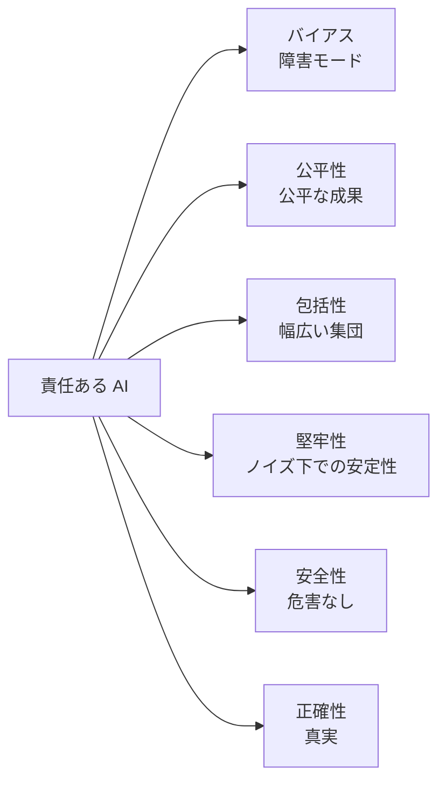
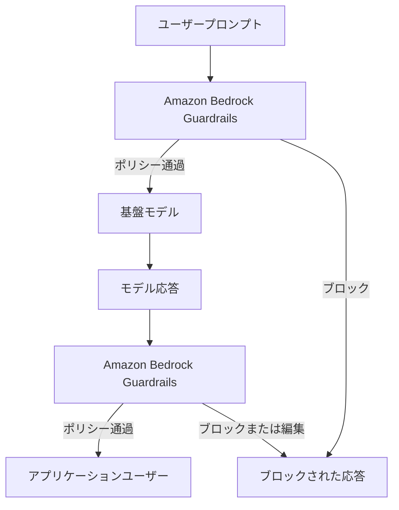
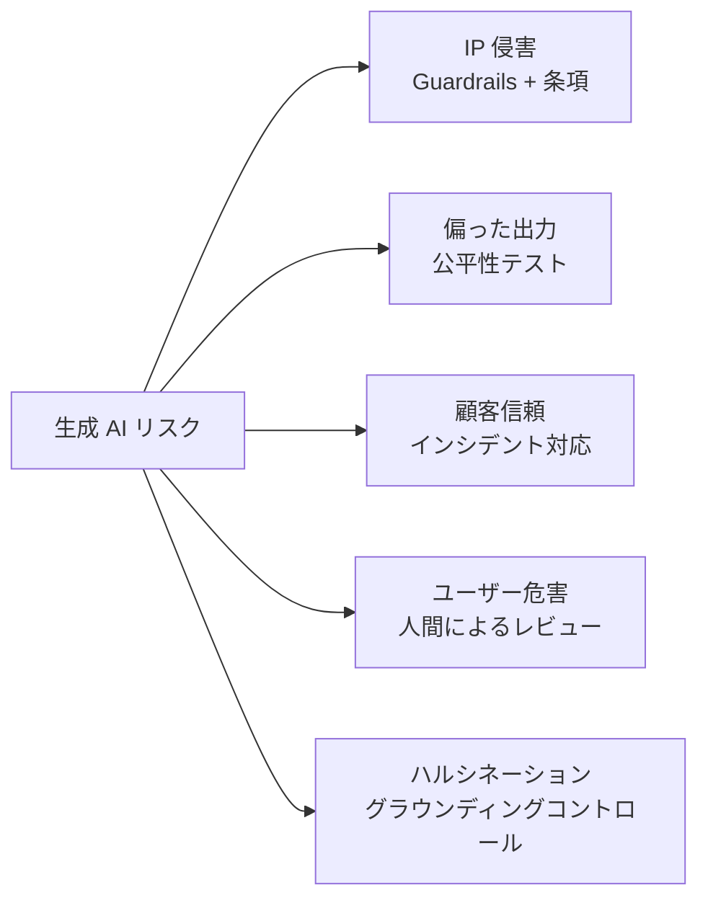
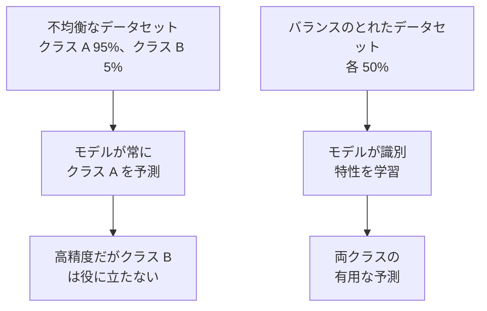
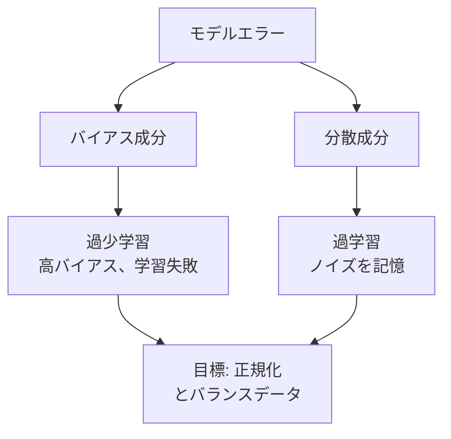

## タスクステートメント 4.1: 責任ある AI システムの開発

責任ある AI とは、AI システムが影響を及ぼすすべての人々に対して公正で正確かつ安全な出力を生成するかどうかを決定する、エンジニアリングとガバナンスのコミットメントのセットです。この章はタスクステートメント 4.1 の 7 つの目標をカバーします。責任ある AI の定義的な特性、それらの特性を適用・検出する AWS ツール、モデル選択の責任ある実践、生成 AI 固有の法的リスク、責任あるシステムを支援するデータセットの特性、バイアスと分散のメカニズム、そして本番環境での責任ある動作を維持するモニタリングツールです。[^401001]

### 4.1.1 責任ある AI の特性

「責任ある」と表現された AI システムは、抽象的な意味で責任があるわけではありません。責任は 5 つの具体的かつテスト可能な特性（公平性、包括性、堅牢性、安全性、正確性）を通じて表現され、各特性はバイアス、排除、脆弱性、危害、またはハルシネーションといった特定の障害モードに対抗するものとして定義されます。*バイアス*は公平性が対処する障害モードであり、AIF-C01 v1.1 試験ガイドは 5 つの肯定的な特性と並んで「バイアス」を挙げています。バイアスはシナリオ問題で最も頻繁にテストされる障害パターンだからです。本書では障害モードと特性のペアリングを明確にするため、6 つすべてをまとめて扱います。

これらの特性は異なりますが、関連しています。システムはあるものに失敗しながら他のものに合格することがあります。ローン決定モデルはノイズの多い入力に対して堅牢でありながら、保護された人口統計グループに対して系統的に不公平な場合があります。医療アドバイスチャットボットは安全で包括的でありながら、頻繁に不正確な場合があります。試験問題はこれらの特性を名前で呼び区別できるかどうかをテストするため、各定義はそれ自体で重要です。[^401002] NIST AI リスク管理フレームワークはこれらの特性を「信頼性の特性」と呼ぶ枠組みでグループ化しており、この枠組みを認識する試験受験者はシナリオ問題に正確に答えられます。[^401050]

特性は以下の通りです。

- **バイアス**（公平性が対処する障害モード）: モデルの予測における系統的な歪みで、特定のグループを一貫して優遇したりペナルティを課したりします。例えば、男性が多い業界の過去の採用データで主にトレーニングされた履歴書スクリーニングモデルは、女性名が上部に表示されると同一の履歴書を低くランク付けする場合があります。この意味でのバイアスはランダムなエラーではありません。特定の集団に害を集中させる予測可能で方向性のあるエラーです。[^401003]
- **公平性**: 人口統計グループ全体にわたる個人の一貫した扱い。融資モデルは、申請者の人種、性別、年齢に関係なく同じ判断基準を適用する場合に公平です。公平性はしばしば数値的に測定されます。例えば、グループ間の承認率または偽陽性率を比較して、どのグループも不当に不利にならないようにします。[^401004]
- **包括性**: モデルは、トレーニングデータで過少表現されているユーザーを含む幅広いユーザーセットに対してうまく機能します。主に明るい肌色の顔の写真で構築された画像認識モデルは、暗い肌色のユーザーに対してパフォーマンスが低い場合があります。*包括性*は、モデルが対象とする全人口に対してトレーニングおよびテストされることを確保することで、そのカバレッジのギャップに対処します。[^401005]
- **堅牢性**: 予期しない入力または敵対的な入力の下での適切で予測可能な動作。カスタマーサービスチャットボットは、ユーザーがスペルミスのクエリを送信したときに有害なコンテンツを返してはなりません。また、不正検出モデルは、取引量が予期せず急増したときに精度が崩壊してはなりません。堅牢性は、システムが入力分布のエッジで意図した動作をどの程度維持するかを測定します。[^401006]
- **安全性**: モデルはユーザー、第三者、または社会に危害を与えません。安全性は身体的リスク（機械を制御するモデル）、情報リスク（注意書きなしに危険な医療アドバイスを提供するモデル）、および系統的リスク（大規模に誤情報を増幅するモデル）をカバーします。EU の規制当局は AI システムを安全リスクレベルによって明示的に分類し、各カテゴリに法的義務を付与しています。[^401007]
- **正確性**: モデルは真実で事実に基づいた出力を生成します。これは、トレーニングデータが薄い、不完全、または古くなっているトピックについて自信を持って聞こえるテキストを生成できる大規模言語モデルにとって特に重要です。*ハルシネーション*は典型的な正確性の障害です。モデルが引用、統計、または人物を捏造して事実として提示します。[^401008]

*図 4.1.1: 試験に記載される責任ある AI の特性。バイアスは他の 5 つの肯定的な特性が防ぐよう設計された障害モードです。*

これらの特性は孤立して存在するものではありません。人口統計的多様性が欠けているデータセット（データレベルの低い包括性）は、偏った予測（バイアスの障害）を生み出し、不公平な結果（公平性の特性の失敗）を引き起こします。特性は満たされると互いに強化し合い、違反されると障害を複合させます。同じデータセットのギャップが、バイアス、不公平、包括性の欠如を同時に引き起こすことがあります。[^401051]

### 4.1.2 責任ある AI の特性を特定するツール

6 つの責任ある AI の特性を知ることは、システムレベルでそれらを強制する実際的なメカニズムがある場合にのみ有用です。AWS はこのために 2 つの主要なツールを提供しています。生成 AI アプリケーション用の **Amazon Bedrock Guardrails** と、古典的な機械学習モデル用の **Amazon SageMaker Clarify** です。各ツールは AI パイプラインの異なるポイントと異なる種類のリスクに対応します。[^401009]

**Amazon Bedrock Guardrails** は、アプリケーションと Amazon Bedrock を通じてアクセスされる任意の基盤モデルの間に設定可能なポリシー層を適用します。ユーザーがプロンプトを送信するとき、またはモデルが応答を返すとき、Guardrails はコンテンツを設定されたポリシーに対して評価し、通過させるか、変更するか、完全にブロックするかを決定します。これは基礎となるモデルに対して透過的に行われ、同じガードレールがモデル自体を変更することなく複数のモデルを保護できることを意味します。[^401010]

Guardrails はコントロールをいくつかのフィルタータイプにグループ化しています。

- **コンテンツフィルター**: 5 つの事前定義された有害カテゴリのコンテンツをブロックまたは編集します。*ヘイト*、*侮辱*、*性的*、*暴力*、*非行*です。各カテゴリは、アプリケーションの感度に応じて低から高の閾値に設定できます。子供の教育プラットフォームはすべての閾値を最大制限に設定します。サイバーセキュリティ研究ツールはより技術的なコンテンツを許可する場合があります。[^401011]
- **プロンプト攻撃フィルター**: 上記の有害カテゴリとは別に、ユーザー入力のジェイルブレーキングおよびプロンプトインジェクションパターンを検出する専用の検出器。これはシステムプロンプトを上書きしたりコンテンツルールを回避しようとする試みをキャッチするポリシーです。
- **トピックフィルター**: アプリケーションが議論してはならないトピックの拒否リスト。金融サービス会社は、Guardrails を設定して特定の投資アドバイスを提供する応答を拒否し、そのようなクエリを代わりにライセンスを持つアドバイザーにルーティングすることができます。会社は平易な言葉で拒否トピックを定義し、Guardrails は異なる表現でも関連するクエリを傍受するために意味的マッチングを使用します。[^401012]
- **単語フィルター**: コンテキストに関係なく特定の単語やフレーズをブロックします。カスタム設定なしで有効にできる組み込みの冒涜リストを含みます。このレイヤーは冒涜語、競合他社のブランド名、または顧客向けの応答に表示されるべきでない社内コードネームを処理します。[^401013]
- **機密情報フィルター**: 名前、電話番号、メールアドレス、社会保障番号、クレジットカード番号などの個人を特定できる情報を検出します。フィルターはリクエストをブロックするか、応答がユーザーに届く前に検出された値をプレースホルダーで編集することができ、組織がプライバシー規制に基づくデータ最小化要件を満たすのに役立ちます。[^401014][^401016]
- **コンテキストグラウンディングチェック**: モデルの応答が（検索拡張生成アプリケーション向けに）提供されたソースドキュメントに基づいているかどうか、および応答がユーザーのクエリに関連しているかどうかを評価します。これは Guardrails の主要な正確性コントロールです。グラウンディングスコアと関連性スコアを割り当て、設定可能な閾値を下回る応答をブロックできます。[^401015]

概念レベルでは、Guardrails のポリシーは構造化されたルールセットとして読めます。「ヘイトスピーチを HIGH 閾値でブロックします。投資アドバイスに関連するトピックを拒否します。応答のメールアドレスを編集します。取得応答には 0.75 以上のグラウンディングスコアを要求します」のように。アーキテクトはこれらのルールを一度設定し、Bedrock 経由で行われる任意の推論呼び出しにガードレールを接続します。[^401053] Guardrails はユーザーの入力プロンプトとモデルの出力応答の両方の独立した評価をサポートするため、単一のガードレールが有害なクエリがモデルに届く前に止めることも、有害な応答がユーザーに届く前にブロックすることもできます。[^401054]

**Amazon SageMaker Clarify** は生成 AI ではなく、古典的な機械学習モデルのバイアスに対処します。トレーニングデータとモデルの予測を分析して、人口統計グループ間の陽性予測率の差などのバイアスメトリクスを計算します。例えば、信用リスクモデルを Clarify に対してテストして、承認率が年齢層や地理的地域間で統計的に異なるかどうかを判断することができます。[^401017]

*図 4.1.2: Amazon Bedrock Guardrails はプロンプトとモデル応答の両方を傍受し、各トラフィック方向で設定されたポリシーを適用します。*

### 4.1.3 モデルを選択するための責任ある実践

基盤モデルや機械学習モデルの選択は、精度とレイテンシに関する技術的な決定だけではありません。責任ある選択プロセスは、モデルの環境コスト、長期的な持続可能性、そしてそのサイズが手元のタスクに合致するかどうかを考慮します。

大型モデルのトレーニングと実行には相当な*コンピュートフットプリント*が必要です。トレーニング中に GPU が消費する電力、それらの GPU をホストするデータセンターの冷却に使用される水、そしてそのエネルギーミックスに関連する炭素排出量です。分類タスクで 95% の精度を達成するが、93% の精度を達成する小型モデルの 10 倍のコンピュートを必要とするモデルは、その 2 ポイントの精度差がビジネス上の成果に大きな影響を与えない場合、責任ある選択ではないかもしれません。[^401018]

責任あるモデル選択は階層に従います。タスクの精度閾値を満たす最小のモデルから始めます。蒸留または量子化されたモデルが特定のユースケースでより大型の親モデルのパフォーマンスに匹敵する場合は、小型モデルを優先します。蒸留されたモデルは、コンピュートコストのわずかな部分で親の能力の多くを保持する大型モデルの圧縮バージョンです。Amazon Bedrock を通じて利用可能な多くのモデルに存在し、レイテンシに敏感なまたはコスト制約のあるアプリケーションの適切な出発点です。[^401019]

モデルサイズが候補間で同等の場合は、*地域配置*を考慮してください。AWS リージョンはエネルギーミックスが異なります。再生可能エネルギー源（水力発電、風力、太陽光）に近いリージョンは、コンピュート時間あたりの炭素強度が低くなります。より低炭素のリージョンにワークロードを配置することは、測定・報告できる具体的な持続可能性のアクションです。[^401020]

AWS は組織が AWS 使用に関連する炭素排出量を測定・追跡するのを助けるために **AWS Customer Carbon Footprint Tool** を提供しています。このツールはサービス、リージョン、時間帯別に排出量を分解し、調達・持続可能性チームが目標を設定して進捗を追跡するために必要なデータを提供します。[^401021]

責任あるモデル選択の決定は、順番に適用される基準のセットとして要約できます。小型モデルは精度の閾値を満たすか？蒸留されたバージョンは同じ作業をできるか？デプロイリージョンは低炭素か？プロバイダーからトレーニングデータ、環境コスト、意図された使用に関するモデルカードの開示はあるか？モデルにコミットする前にこれらの質問に答えることが、試験が候補者に説明を求める責任ある実践です。[^401055]

*表 4.1.1: 責任あるモデル選択基準*

| 基準 | 答えるべき質問 | 好ましい結果 |
|-----|-------------|-----------|
| 精度閾値 | モデルは最小要求精度を満たすか？ | 合格する最小モデル |
| コンピュートコスト | 推論に必要な GPU 時間とエネルギーは？ | SLA を満たす最低コンピュート |
| モデルサイズ | 蒸留または量子化されたバージョンはあるか？ | 利用可能な場合は蒸留を使用 |
| 地域の炭素強度 | リージョンのエネルギーミックスは低炭素か？ | 低炭素リージョンにデプロイ |
| 透明性 | プロバイダーはモデルカードを公開しているか？ | モデルカードが存在し最新 |

### 4.1.4 生成 AI を扱う際の法的リスク

生成 AI は、モデルが構造化された入力から得られた予測ではなく新しいコンテンツを生成するため、従来の機械学習では存在しなかった法的リスクのカテゴリを導入します。生成 AI のデプロイメントを審査する法務チームは通常 5 つの懸念事項を提起し、AI の監督を担うビジネスプロフェッショナルはそれぞれについて説明できるべきです。

**知的財産侵害の主張**は、大規模言語モデルと画像モデルがインターネットから収集された膨大なテキストと画像のコーパスでトレーニングされているために発生します。そのコンテンツの多くは著作権で保護されています。モデルが著作権で保護されたマテリアルを密接に再現するテキストを生成する場合、または画像モデルが存命のアーティストのスタイルで芸術作品を生成する場合、ソースマテリアルの発信者はモデルを運営する組織に対して請求を持つ可能性があります。米国とヨーロッパでいくつかの訴訟がまさにこの理論で既に提起されています。[^401022] 多くの商業基盤モデルプロバイダーは、IP 責任を顧客からプロバイダーに戻す*補償条項*をライセンスに含めていますが、これらの条項はしばしば顧客が定義されたパラメーター内でのみモデルを使用し、安全コントロールを上書きする変更を加えないことを要求します。[^401023]

**偏ったモデル出力**は雇用・公民権法に基づく法的リスクを生じさせます。採用、融資、住宅、またはヘルスケアに使用されるモデルが保護されたクラスを系統的に不利に扱う出力を生成する場合、モデルをデプロイした組織は米国の雇用機会均等委員会（EEOC）の枠組みまたは他の法域の同等機関に基づく主張に直面する可能性があります。EU AI 法は雇用と信用に使用される AI システムを、デプロイ前に適合性評価を受けなければならない*高リスク*アプリケーションとして分類しています。[^401024]

**顧客信頼の喪失**は定量化が難しいものの、同様に現実の法的・評判上のリスクです。顧客サービスチャットボットが不快な応答を提供したり、医療アドバイスツールが有害な治療を提案したりするような広く公表された AI の失敗が発生すると、組織は顧客の信頼を失います。規制業界では、その信頼はしばしば契約上および規制上の側面を持ち、評判へのダメージに潜在的な規制上の行動を重ね合わせます。[^401025]

**エンドユーザーリスク**は、ユーザーがエラーに深刻な結果が伴うドメインでモデル出力に基づいて行動するリスクです。不正確なアドバイスを提供する法律サービスチャットボット、症状を誤分類する医療トリアージアシスタント、不適切な製品を推薦する財務計画ツールはそれぞれ、デプロイしている組織を専門家責任および過失の主張にさらします。組織は高リスクドメインで意思決定ループに人間によるレビューを含めること、および AI 出力の助言的性質について明確な免責事項を表示することで軽減します。[^401026]

**ハルシネーション**は直接的な法的結果をもたらす正確性の障害です。モデルが捏造した事実を自信を持って主張し、ユーザーがその主張に基づいて行動すると害を被る可能性があります。AI が捏造した判例引用を含む法律書面を提出した弁護士は、引用が存在しないと判明したときに裁判所の制裁を受けました。法律、財務、または医療のコンテキストで生成 AI をデプロイする組織は、グラウンディングコントロール（セクション 4.1.2 で説明）を実装し、デューデリジェンスの証拠としてそれらのコントロールを文書化しなければなりません。[^401027]

2024 年 8 月に発効した EU AI 法は、禁止された行為の規定への違反に対して最大 3,500 万ユーロまたはグローバル年間売上高の 7%（いずれか高い方）の罰金を、その他の違反に対して最大 1,500 万ユーロまたは売上高の 3% の罰金を課します。[^401028] このペナルティ水準は、EU 規制の下では、一度でも軽減措置を講じないまま責任ある AI の違反が発生した場合、罰金額が AI システム自体の総開発コストを上回る可能性があることを意味します。

*図 4.1.3: 生成 AI の 5 つの法的リスクカテゴリとその主要な軽減策。各リスクには異なる制御戦略が必要です。*

### 4.1.5 データセットの特性

モデルのトレーニングまたはファインチューニングに使用されるデータセットの特性は、結果として得られるシステムの責任ある AI の特性を大部分において決定します。トレーニングデータにそれらのグループの例が含まれていなければ、モデルは人口統計グループを公平に扱うことを学習できません。データセットの特性は上流のコントロールです。正しく行うことで、モデルがトレーニングされた後では高コストの修正が必要になる問題を防ぎます。

4 つのデータセットの特性が試験目標に直接記載されています。

- **包括性**: データセットには、モデルが本番環境で遭遇する人口統計グループ、言語、方言、シナリオの全範囲からの例が含まれています。包括性の失敗とは、音声認識モデルが主にアメリカ英語話者でトレーニングされてからグローバルにデプロイされ、非ネイティブスピーカーや地域のアクセントに対して高いエラー率を生じさせる場合です。[^401029]
- **多様性**: 人口統計的カバレッジを超えて、データセットは多様なシナリオ、エッジケース、および稀なイベントをカバーします。一般的な不正パターンのみでトレーニングされた不正検出モデルは、新しい攻撃手法を見逃します。この文脈での多様性は、トレーニング分布が最も頻繁なパターンだけでなく、現実世界の変動性を捉えるのに十分な幅広さがあることを意味します。[^401030]
- **精選されたデータソース**: データは既知のプロベナンスを持ち、適切な同意を得て収集され、明確なライセンス状況を持っています。精選されたデータはトレーサブルです。「このレコードはどこから来たのか、使用する権利はあるか？」という質問に答えることができます。生成 AI の場合、精選には、モデルに投入する前にトレーニングコンテンツから有害・偏った内容や著作権で保護された素材をスクリーニングすることも含まれます。[^401031]
- **バランスのとれたデータセット**: クラスラベルまたは人口統計グループが、モデルが根本的なシグナルを学習するのではなく、そのクラスをショートカットとして予測することを学習するほど過剰に表現されていません。不正検出のための不均衡なデータセットは、1 件の不正な取引に対して 999 件の正当な取引を含む場合があります。そのデータでトレーニングされたモデルは、すべてに「正当」と予測するだけで 99.9% の精度を達成できますが、実際のタスクには完全に失敗します。[^401032]

*図 4.1.4: クラス不均衡がモデル学習に与える影響。不均衡なデータセットは、少数クラスのパフォーマンスを犠牲にして全体的な精度を最大化するモデルを生み出します。*

精選されたデータソースとバランスのとれたデータセットは相互に排他的な要件ではありません。ソースが不明または同意のないデータから組み立てられたバランスのとれたデータセットは依然として IP とプライバシーのリスクを持っています。狭い人口統計のみをカバーする適切に精選されたデータセットは依然として排他的なモデルを生み出します。データセットが責任あるものとみなされるためには、4 つの特性すべてが揃って存在しなければなりません。[^401057] EU AI 法は、高リスク AI システムのトレーニングデータセットが、収集目的、処理操作、データ保護法への準拠をカバーするデータガバナンスの実践に従うことを要求しています。[^401058]

*表 4.1.2: データセットの特性と防ぐ責任ある AI の障害*

| データセットの特性 | 防ぐ障害 | 例 |
|----------------|---------|---|
| 包括性 | 過少表現された集団に失敗するモデル | 非ネイティブスピーカーでエラーが多い音声認識 |
| 多様性 | エッジケースや新しい入力に対する脆弱性 | 新しい攻撃パターンを見逃す不正モデル |
| 精選されたデータソース | IP、プライバシー、有害コンテンツ違反 | 同意やスクリーニングなしにスクレイピングされたトレーニングデータ |
| バランスのとれたデータセット | 少数クラスの失敗を隠す精度 | 不正を予測しない不正モデル |

### 4.1.6 バイアスと分散の影響

バイアスと分散は機械学習モデルにおける 2 つの基本的なエラーソースです。それらは対立して存在します。一方を減らすともう一方を増加させる傾向があります。各がどのように現れるか、そして各が下流にどのような影響を与えるかを理解することは、責任ある AI にとって不可欠な背景です。どちらも公平性と精度に結果をもたらすからです。

**バイアス**は統計的な意味では系統的なエラーです。モデルは一貫して同じ方向に誤ります。偏ったモデルは現実と一致しないパターンを学習しており、トレーニングデータが代表的でなかったか、モデルアーキテクチャが真の関係を捉えるには単純すぎたか、またはその両方が原因です。エラーはランダムではありません。再現可能です。同じ入力をモデルに 100 回実行すると、毎回同じ間違った答えが得られます。[^401033]

**分散**は入力の小さな変化に対する感度です。高分散モデルは本質的にトレーニングデータを記憶しており、トレーニング中に見たものとわずかでも異なる入力に遭遇したときに予測不可能に応答します。エラーは系統的ではありません。不規則です。非常に似た 2 つの入力が非常に異なる出力を生成する場合があり、トレーニングセットで良いパフォーマンスを発揮したとしても、本番環境でのモデルの信頼性が低くなります。[^401034]

バイアスと分散を組み合わせる 2 つの古典的な障害モードは*過学習*と*過少学習*です。

- **過学習**はモデルのバイアスが低く分散が高い場合に発生します。モデルはそのノイズと異常を含めてトレーニングデータに非常に正確に適合するため、トレーニングセットの精度は高くなります。新しいデータが届くと、モデルには適用できる汎化可能なパターンがなく、パフォーマンスが低下します。過学習した不正モデルは、過去の不正ケースに関連する正確な取引金額と取引先を記憶しますが、異なる金額や取引先を使用する不正には失敗します。[^401035]
- **過少学習**はモデルのバイアスが高く分散が低い場合に発生します。モデルは実際のシグナルを捉えるのに十分にトレーニングデータを学習しておらず、トレーニングセットと新しいデータの両方でパフォーマンスが低下します。解約予測の過少学習モデルは、一度もログインしたことがない顧客が解約リスクにさらされているということだけを学習し、解約を予測する他のすべてのパターンを見逃す場合があります。[^401036]

バイアスと分散が人口統計グループに与える影響は、これらの技術的特性が責任ある AI と交差する部分です。系統的なバイアスを持つモデルは、トレーニングデータで過少表現または誤って表現されていたグループに対して一貫したエラーを生み出します。それらの一貫したエラーは*不均衡な影響*になります。モデルの障害は人口全体に均等に分散されず、特定のグループに集中します。高バイアスの信用スコアリングモデルは、特定の地域からの申請者の信用力を一貫して過小評価する場合があります。それらの申請者がより高リスクだからではなく、トレーニングデータにその地域からの信用力のある個人の例が少なかったためです。[^401037]

*表 4.1.3: バイアスと分散: 原因、障害モード、人口統計的影響*

| 特性 | 定義 | 古典的な障害モード | 人口統計的影響 |
|------|-----|----------------|-------------|
| 高バイアス | 系統的な方向性のあるエラー | 過少学習 | 過少表現されたグループへの一貫したエラー |
| 高分散 | 小さな入力変化に対する感度 | 過学習 | 予測不可能なエラー。一貫性のない扱い |
| 低バイアス、低分散 | 目標状態 | なし | 一貫した公平な予測 |
| 低バイアス、高分散 | 過学習状態 | 過学習 | トレーニング分布では精度高。他では失敗 |
| 高バイアス、低分散 | 過少学習状態 | 過少学習 | すべてのグループにわたって系統的に誤り |

*図 4.1.5: バイアスと分散のトレードオフとその責任ある AI への影響。高バイアスと高分散の両方が、特定の人口統計グループに害を集中させる可能性のある障害を生みます。*

適切に調整されたモデルはバイアスと分散の両方を同時に最小化します。これには、シグナルを捉えるのに十分複雑だがノイズを記憶するほど複雑でないアーキテクチャと、十分な高品質で代表的なトレーニングデータが必要です。このバランスを達成するための技術（正規化、クロスバリデーション、データ拡張）はドメイン 1 の機械学習ライフサイクルの内容でカバーされています。責任ある AI における重要性は、それらの技術がバイアス軽減ツールでもあるということです。[^401059] SageMaker Clarify は、軽減前後のバイアスメトリクスを比較することで各技術の寄与を定量化でき、軽減努力が測定可能な結果を生んだ証拠をチームに提供します。[^401060]

### 4.1.7 バイアス、信頼性、真実性の検出および監視ツール

トレーニング時にデータセットとモデルに責任ある特性を組み込むことは必要ですが、十分ではありません。世界が変化し、ユーザー集団が変化し、敵対的な行為者が弱点を探るにつれて、モデルは本番環境で劣化する可能性があります。責任ある AI プログラムは、デプロイされたモデルが意図した動作から逸脱したときを検出するための継続的なモニタリングを必要とします。

AWS はモデルのライフサイクル全体でバイアス、信頼性、真実性を検出・監視するために特別に設計されたツールセットを提供しています。試験では各ツールが何をするか、いつ適用するかを知ることが求められます。

**ラベル品質の分析**は、特定のツールを必要としない基礎的な検出実践です。トレーニングデータセットのラベルを矛盾や系統的エラーのパターンについて調べることです。ラベリングチームが特定の人口統計グループに、基礎となるデータが正当化する以上の割合で一貫して「陽性」を割り当てた場合、ラベルの品質に偏りがあり、偏ったモデルを生成します。ラベル品質分析は、評価者間の不一致（2 人のラベラーが同じ例に異なるラベルを割り当てる）、クラス固有のエラー率、および異なるラベリングセッションにわたるラベルの割り当て方法の時間的ドリフトを調べます。[^401038]

**人間監査**は専門家の判断をモデル出力のサンプルに適用します。自動化されたメトリクスだけでなく、人間の監査者は予測の代表的なサンプルをレビューし、精度、公平性、適切さを評価します。人間監査は自動化されたメトリクスが検出するように設計されていない可能性がある障害モードをキャッチします。コンテンツフィルターを通過する微妙に不快な言語や、複雑な分析的質問における推論エラーなどです。高コストで出力の 100% にスケールしませんが、多くの高リスクアプリケーションで利用可能な最も信頼性の高い品質シグナルです。[^401039]

**サブグループ分析**は、全体的な集団ではなく各関連する人口統計グループに対してモデルパフォーマンスメトリクスを個別に測定します。全体的な精度 92% は、多数グループの精度 98% と少数グループの 71% を隠す可能性があります。サブグループ分析は、サブグループごとに精度、再現率、偽陽性率、偽陰性率を計算し、責任ある AI ポリシーで定義された許容可能な格差の閾値と結果を比較することで、それらの格差を可視化します。[^401040]

**Amazon SageMaker Clarify** は古典的な機械学習モデルのバイアス検出とモデル説明可能性を自動化します。トレーニング時に、Clarify はトレーニングデータが歪んでいるかどうかを特定する事前トレーニングバイアスメトリクスと、同一の入力が与えられた場合でもトレーニング済みモデルがグループを異なる扱いをするかどうかを測定するポストトレーニングバイアスメトリクスを計算します。本番環境では、Clarify は SageMaker Model Monitor と統合して、新しい推論データが蓄積されるにつれてそれらのバイアスメトリクスを継続的に再計算できます。[^401041]

**Amazon SageMaker Model Monitor** はデプロイされたモデルエンドポイントを本番環境で監視し、着信データまたはモデルの出力分布がデプロイ時に確立されたベースラインから逸脱したときにアラートを発生させます。4 種類のドリフトを追跡します。

- *データ品質ドリフト*: 入力特徴の統計的分布の変化。ローン申請モデルが大学卒業者の 30% でトレーニングされ、ライブトラフィックが 60% の大学卒業者を示している場合、入力分布がシフトし、モデルのトレーニングが代表的でなくなる可能性があります。
- *モデル品質ドリフト*: 推論後に受け取ったグラウンドトゥルースラベルに対して測定されたモデルの精度またはその他のパフォーマンスメトリクスの低下。
- *バイアスドリフト*: SageMaker Clarify によって計算されたバイアスメトリクスの変化。実世界の分布がシフトするにつれてモデルがより偏ったり、より少なく偏ったりしていることを示します。
- *特徴帰属ドリフト*: SHAP（SHApley 加法的説明）値を時間をかけて比較することによって検出される、モデルが予測を行うために最も依存している入力特徴の変化。[^401042]

**Amazon Augmented AI（Amazon A2I）** は、信頼度の低い予測の推論パイプラインに人間レビューを統合します。モデルの信頼度スコアが開発者定義の閾値を下回ると、A2I は出力がエンドユーザーに届く前に予測を人間のレビュアーにルーティングします。A2I は Amazon Textract や Amazon Rekognition などのサービスと宣言的に統合します。カスタム SageMaker モデルの場合、アプリケーションコードは開発者定義のトリガー条件が満たされたときに A2I を呼び出して人間レビューループを開始します。レビュアーは入力、モデルの予測、および信頼度スコアを確認し、モデルが間違っていた場合は修正されたラベルを提供します。それらの修正されたラベルは再トレーニングパイプラインにフィードバックできます。[^401043]

*表 4.1.4: 責任ある AI 特性を検出・監視するための AWS ツール*

| ツール | 検出内容 | 使用タイミング |
|-------|--------|-------------|
| SageMaker Clarify（トレーニング時） | データセットとモデルの事前・事後トレーニングバイアス | デプロイ前、モデルの公平性を評価する際 |
| SageMaker Clarify（本番時） | 推論データが蓄積するにつれた継続的なバイアスメトリクス | デプロイ後、Model Monitor と統合 |
| SageMaker Model Monitor | データドリフト、モデル品質ドリフト、バイアスドリフト、特徴帰属ドリフト | 本番環境で継続的に |
| Amazon A2I | 人間によるレビューが必要な信頼度の低い予測 | モデルの不確実性が許容できない高リスクな決定 |
| ラベル品質分析 | トレーニングラベルの系統的エラー | データセット準備中および定期的な監査 |
| 人間監査 | 自動化されたメトリクスでキャプチャされない定性的な障害 | 定期的に、特に高リスクドメインで |
| サブグループ分析 | 人口統計グループ間のメトリクス格差 | デプロイ前および本番環境で定期的に |

これらのツールは合わさって責任ある AI のクローズドループを作成します。Clarify はデプロイ前にバイアスを特定します。Model Monitor はデプロイ後にドリフトを検出します。A2I は推論時に信頼度の低い予測をキャッチします。人間監査は自動化されたツールが代替できない定性的なチェックを提供します。試験は各ツールをその目的に対応させ、技術レベルでツールを設定するのではなく、モニタリングパターンを説明することを候補者に求めます。[^401044] Amazon SageMaker はまた、モデルの目的、評価結果、意図されたユースケースを文書化するモデルカードも提供します。これにより監査チームは開発中に行われた責任ある AI の決定の書面による記録を持つことができます。[^401061] Amazon Bedrock の生成 AI アプリケーションでは、Bedrock Model Evaluation 機能により、チームが本番デプロイにコミットする前に安全性、一貫性、関連性などのカスタム基準に対して基盤モデルをベンチマークすることができます。[^401062]

---

## セルフチェック問題

**問題 1.** ある会社のカスタマーサービスチャットボットは Amazon Bedrock を通じてアクセスされた大規模言語モデルを使用しています。法務チームは、チャットボットが競合他社の製品について話さないこと、またすべての応答から顧客のメールアドレスを編集することを要求しています。これら 2 つの要件に最もよく対応する Amazon Bedrock Guardrails のコントロールタイプはどれですか？

A. 暴力カテゴリを HIGH に設定したコンテンツフィルターと、競合他社の製品名をリストした単語フィルター
B. 競合他社製品の議論を拒否するように設定したトピックフィルターと、メールアドレス編集のための機密情報フィルター
C. 関連性閾値 0.9 のコンテキストグラウンディングチェックと、冒涜語フィルター
D. 競合他社の製品名の機密情報フィルターと、PII のコンテンツフィルター

トピックフィルターは、組織が平易な言葉による説明（Guardrails が意味的にマッチングする）を使用して、モデルが議論してはならないトピックカテゴリを定義できるようにするものです。これは競合他社製品の議論をブロックするという要件に直接対処します。機密情報フィルターはモデルの応答から特定の PII タイプ（メールアドレスを含む）を検出・編集します。コンテンツフィルターは危害カテゴリ（ヘイト、暴力など）に対処し、競合他社への言及を制限しません。単語フィルターは特定の文字列を文字通りにブロックし、競合他社製品の議論のすべてのフレーズを確実に傍受しません。コンテキストグラウンディングチェックは応答がソースドキュメントに基づいているかどうかを評価します。どちらの要件とも無関係です。選択肢 B が要件に対するコントロールの正しいペアリングです。[^401045]

**問題 2.** 機械学習チームが不正検出モデルをトレーニングしました。テストセット全体の精度は 99.2% ですが、不正再現率（実際の不正ケースのうち正しく特定された割合）は 8% です。この結果を最もよく説明するデータセットの特性はどれですか？

A. データセットに明確なプロベナンスを持つ精選されたデータソースが欠けている
B. データセットがエッジケースの不正パターンをカバーするのに十分な多様性がない
C. データセットが著しく不均衡で、不正な取引よりも正当な取引がはるかに多い
D. データセットに地理的地域にわたる包括性が欠けている

全体的な精度が 99.2% であるにもかかわらず少数クラスの再現率が 8% であるのは、著しく不均衡なデータセットでトレーニングした場合の教科書的な結果です。正当な取引が不正なものを大幅に上回る場合、モデルはほぼすべてのケースに「正当」と予測することで非常に高い全体的な精度を達成できます。99.2% の精度の数値は、多数クラスの高い有病率を反映しており、真の予測スキルではありません。データプロベナンスや精選の欠如は IP とプライバシーリスクに影響しますが、この精度・再現率パターンを生みません。多様性はノベルな不正パターンのカバレッジに対処しますが、すべての不正で 8% と低い再現率を生みません。地理全体の包括性は公平性に影響しますが、基本的なクラス不均衡のダイナミクスではありません。選択肢 C が正解です。[^401046]

**問題 3.** ある会社が内部 HR ポリシー質問アプリケーション向けの基盤モデルを選択しています。2 つの候補モデルはタスクに関連するベンチマークで同等の精度を達成しています。持続可能性チームは環境への影響を最小限に抑えるよう求めています。AWS が説明する責任あるモデル選択の実践を最もよく反映するアクションはどれですか？

A. より大型のモデルを選択する。スケールでのクエリあたりのレイテンシが低いため
B. 会社本社に最も近い AWS リージョンにホストされているモデルを選択する
C. より小型または蒸留されたモデルを選択し、炭素強度の低いリージョンにデプロイする
D. パラメーター数が最も多いモデルを選択する。パラメーターが多いほど品質が高いため

責任あるモデル選択は、精度の閾値を満たす最小のモデルを特定することから始まります。2 つのモデルが同等の精度を達成する場合、小型の方が推論あたりのコンピュートが少なく、したがってエネルギーと炭素のフットプリントが低くなります。地理的近接ではなく炭素強度でデプロイリージョンを選択することで、環境への影響をさらに削減します。より大型のモデルはパラメーター数が多いですが、特定のタスクでの高品質を意味するわけではありません。関連するタスクのベンチマークパフォーマンスが重要です。クエリあたりのレイテンシは環境メトリクスではありません。選択肢 C が正解です。[^401047]

**問題 4.** ある医療機関は患者をトリアージするための看護師を支援する AI モデルを使用しています。全患者集団全体のモデルの全体的な精度は 94% です。サブグループ分析により、75 歳以上の患者に対するモデルの精度は 61% であることが明らかになりました。最も直接的に違反されている責任ある AI 特性はどれか、そしてこれを継続的に検出するためのモニタリングアプローチはどれか？

A. 堅牢性。SageMaker Model Monitor でのデータ品質ドリフトの追跡
B. 公平性。本番環境での SageMaker Clarify と統合されたサブグループ分析
C. 正確性。高齢患者のすべての予測を人間レビューにルーティングする Amazon A2I
D. 包括性。高齢患者のトレーニングデータラベルのラベル品質分析

モデルが特定の人口統計グループ（75 歳以上）に対して全体的な集団と比較して著しく低いパフォーマンスを示す場合、公平性の特性が違反されています。モデルは人口統計グループ全体にわたって一貫したサービス品質を提供していません。適切な継続的モニタリングメカニズムは、SageMaker Model Monitor のバイアスドリフトモニターによってスケジュールされた SageMaker Clarify バイアスメトリクスを使用したサブグループ分析です。着信データの各バッチで再計算し、グループごとの精度ギャップが責任ある AI ポリシーで定義された閾値を超えたときにアラートを発します。堅牢性は敵対的またはノイズの多い入力をカバーし、人口統計的パフォーマンスのギャップではありません。正確性は分類精度ではなく主張の事実的精度をカバーします。データレベルの包括性は貢献する原因ですが、デプロイされたモデルの出力で違反された特性は公平性です。選択肢 B が正解です。[^401048]

**問題 5.** 法律サービス会社が使用する生成 AI アプリケーションが、3 つの判例を引用する書面を生成しました。その後のレビューで、引用された判例のうち 2 つが存在しないことが判明しました。これはどの法的リスクを表しており、Amazon Bedrock Guardrails のどの機能がそれを最も直接的に軽減するよう設計されていますか？

A. 知的財産侵害。特定の法的トピックの議論をブロックするトピックフィルター
B. 偏った出力によるエンドユーザーリスク。非行に HIGH を設定したコンテンツフィルター
C. ハルシネーション。最小グラウンディングスコアを要求するコンテキストグラウンディングチェック
D. 顧客信頼の喪失。捏造された判例名のパターンをブロックする単語フィルター

シナリオはハルシネーションを説明しています。モデルが存在しない判例引用を生成して本物として提示したのです。これは生成 AI における典型的な正確性の障害です。Amazon Bedrock Guardrails のコンテキストグラウンディングチェックは、モデルの応答がモデルに提供されたソースドキュメント（取得拡張コンテキスト）に基づいているかどうかを評価し、グラウンディングスコアを割り当てます。検証済みの法律データベースをソースドキュメントとして使用する法律アプリケーションでは、グラウンディングチェックが捏造された引用がソースマテリアルに表示されないことを検出し、応答をブロックまたはフラグを立てます。知的財産侵害は著作権で保護されたコンテンツの複製に関連し、捏造ではありません。コンテンツフィルターは引用の捏造とは無関係な危害カテゴリに対処します。単語フィルターはリテラルな文字列で動作し、構造的には妥当だが存在しない判例名を検出できません。選択肢 C が正解です。[^401049]

---

[^401001]: AWS Certification: AIF-C01 Exam Guide v1.1, Domain 4. URL: <https://docs.aws.amazon.com/aws-certification/latest/ai-practitioner-01/ai-practitioner-01-domain4.html>
[^401002]: NIST AI Risk Management Framework (AI RMF 1.0). URL: <https://airc.nist.gov/Home>
[^401003]: Amazon Machine Learning: Fairness and Bias in Machine Learning. URL: <https://docs.aws.amazon.com/machine-learning/latest/dg/model-fit-underfitting-vs-overfitting.html>
[^401004]: Mehrabi, N. et al., A Survey on Bias and Fairness in Machine Learning, ACM Computing Surveys 54(6), 2022. URL: <https://dl.acm.org/doi/10.1145/3457607>
[^401005]: Microsoft Research: Fairness and Inclusivity in AI Systems. URL: <https://www.microsoft.com/en-us/research/group/fate/>
[^401006]: NIST AI 100-2: Adversarial Machine Learning: A Taxonomy and Terminology of Attacks and Mitigations. URL: <https://airc.nist.gov/Publications/1>
[^401007]: EU AI Act, Regulation (EU) 2024/1689, Title I, Article 3 (Definitions of Safety). URL: <https://eur-lex.europa.eu/legal-content/EN/TXT/?uri=CELEX:32024R1689>
[^401008]: Maynez, J. et al., On Faithfulness and Factuality in Abstractive Summarization, ACL 2020. URL: <https://aclanthology.org/2020.acl-main.173/>
[^401009]: Amazon Bedrock Guardrails Documentation: Overview. URL: <https://docs.aws.amazon.com/bedrock/latest/userguide/guardrails.html>
[^401010]: Amazon Bedrock Guardrails: How Guardrails Work. URL: <https://docs.aws.amazon.com/bedrock/latest/userguide/guardrails-how-it-works.html>
[^401011]: Amazon Bedrock Guardrails: Content Filters. URL: <https://docs.aws.amazon.com/bedrock/latest/userguide/guardrails-content-filters.html>
[^401012]: Amazon Bedrock Guardrails: Denied Topics. URL: <https://docs.aws.amazon.com/bedrock/latest/userguide/guardrails-topic-policy.html>
[^401013]: Amazon Bedrock Guardrails: Word Filters. URL: <https://docs.aws.amazon.com/bedrock/latest/userguide/guardrails-word-policy.html>
[^401014]: Amazon Bedrock Guardrails: Sensitive Information Filters. URL: <https://docs.aws.amazon.com/bedrock/latest/userguide/guardrails-sensitive-info.html>
[^401015]: Amazon Bedrock Guardrails: Contextual Grounding Checks. URL: <https://docs.aws.amazon.com/bedrock/latest/userguide/guardrails-grounding.html>
[^401016]: Amazon Bedrock Guardrails: PII Redaction Configuration. URL: <https://docs.aws.amazon.com/bedrock/latest/userguide/guardrails-sensitive-info.html>
[^401017]: Amazon SageMaker Clarify: Fairness and Explainability Overview. URL: <https://docs.aws.amazon.com/sagemaker/latest/dg/clarify-fairness-and-explainability.html>
[^401018]: AWS Sustainability: The Carbon Footprint of AI Workloads. URL: <https://sustainability.aboutamazon.com/environment/the-cloud>
[^401019]: Amazon Bedrock: Model Distillation Overview. URL: <https://docs.aws.amazon.com/bedrock/latest/userguide/model-distillation.html>
[^401020]: AWS Global Infrastructure: Sustainability by Region. URL: <https://aws.amazon.com/about-aws/global-infrastructure/>
[^401021]: AWS Customer Carbon Footprint Tool Documentation. URL: <https://docs.aws.amazon.com/awsaccountbilling/latest/aboutv2/ccft-overview.html>
[^401022]: Andersen v. Stability AI Ltd., Case No. 23-CV-00201 (N.D. Cal. 2023). URL: <https://www.courtlistener.com/docket/66732129/andersen-v-stability-ai-ltd/>
[^401023]: Amazon Bedrock: Intellectual Property Indemnification. URL: <https://aws.amazon.com/bedrock/faqs/>
[^401024]: EU AI Act, Annex III: High-Risk AI Systems. URL: <https://eur-lex.europa.eu/legal-content/EN/TXT/?uri=CELEX:32024R1689>
[^401025]: McKinsey Global Institute: The State of AI in 2024. URL: <https://www.mckinsey.com/capabilities/quantumblack/our-insights/the-state-of-ai>
[^401026]: FTC: Guidance on AI and Consumer Protection. URL: <https://www.ftc.gov/business-guidance/blog/2023/02/keep-your-ai-claims-in-check>
[^401027]: Matter of Park v. Kim, New York State Court of Appeals, 2024 (attorney sanctioned for AI-fabricated citations). URL: <https://casetext.com/case/park-v-kim-24>
[^401028]: EU AI Act, Article 99: Penalties. URL: <https://eur-lex.europa.eu/legal-content/EN/TXT/?uri=CELEX:32024R1689>
[^401029]: Tatman, R., Gender and Dialect Bias in YouTube's Automatic Captions, ACL Workshop on Ethics in NLP, 2017. URL: <https://aclanthology.org/W17-1606/>
[^401030]: Breck, E. et al., The ML Test Score: A Rubric for ML Production Readiness, IEEE Big Data 2017. URL: <https://research.google/pubs/the-ml-test-score-a-rubric-for-ml-production-readiness-and-technical-debt-reduction/>
[^401031]: AWS Data Exchange: Data Licensing and Provenance. URL: <https://docs.aws.amazon.com/data-exchange/latest/userguide/what-is.html>
[^401032]: He, H. and Garcia, E.A., Learning from Imbalanced Data, IEEE Transactions on Knowledge and Data Engineering 21(9), 2009. URL: <https://ieeexplore.ieee.org/document/5128907>
[^401033]: Hastie, T., Tibshirani, R., and Friedman, J., The Elements of Statistical Learning, 2nd ed., Springer, 2009. URL: <https://hastie.su.domains/ElemStatLearn/>
[^401034]: Amazon SageMaker Developer Guide: Model Fit: Underfitting versus Overfitting. URL: <https://docs.aws.amazon.com/sagemaker/latest/dg/model-fit-underfitting-vs-overfitting.html>
[^401035]: Chollet, F., Deep Learning with Python, Manning Publications, 2021. Chapter 5: Generalization.
[^401036]: AWS Machine Learning Blog: Techniques for Addressing Underfitting and Overfitting. URL: <https://aws.amazon.com/blogs/machine-learning/>
[^401037]: Barocas, S., Hardt, M., and Narayanan, A., Fairness and Machine Learning: Limitations and Opportunities, MIT Press, 2023. URL: <https://fairmlbook.org/>
[^401038]: Northcutt, C., Athalye, A., and Mueller, J., Pervasive Label Errors in Test Sets Destabilize Machine Learning Benchmarks, NeurIPS 2021. URL: <https://arxiv.org/abs/2103.14749>
[^401039]: Partnership on AI: AI Incident Database. URL: <https://incidentdatabase.ai/>
[^401040]: Amazon SageMaker Clarify: Measure Pre-training Bias. URL: <https://docs.aws.amazon.com/sagemaker/latest/dg/clarify-measure-data-bias.html>
[^401041]: Amazon SageMaker Clarify: Detect Post-training Data and Model Bias. URL: <https://docs.aws.amazon.com/sagemaker/latest/dg/clarify-detect-post-training-bias.html>
[^401042]: Amazon SageMaker Model Monitor: Monitor Data and Model Quality. URL: <https://docs.aws.amazon.com/sagemaker/latest/dg/model-monitor.html>
[^401043]: Amazon Augmented AI (A2I): Overview of Human Review Workflows. URL: <https://docs.aws.amazon.com/sagemaker/latest/dg/a2i-use-augmented-ai-a2i-human-review-loops.html>
[^401044]: AWS Well-Architected Framework: Machine Learning Lens, Responsible AI Pillar. URL: <https://docs.aws.amazon.com/wellarchitected/latest/machine-learning-lens/welcome.html>
[^401045]: Amazon Bedrock Guardrails: Create a Guardrail (Combining Policy Types). URL: <https://docs.aws.amazon.com/bedrock/latest/userguide/guardrails-create.html>
[^401046]: Amazon SageMaker Clarify: Class Imbalance Metric. URL: <https://docs.aws.amazon.com/sagemaker/latest/dg/clarify-bias-metric-class-imbalance.html>
[^401047]: AWS Sustainability: AWS Customer Carbon Footprint Tool. URL: <https://docs.aws.amazon.com/awsaccountbilling/latest/aboutv2/ccft-overview.html>
[^401048]: Amazon SageMaker Clarify: Monitor Bias Drift for Models in Production. URL: <https://docs.aws.amazon.com/sagemaker/latest/dg/clarify-model-monitor-bias-drift.html>
[^401049]: Amazon Bedrock Guardrails: Contextual Grounding Check Configuration. URL: <https://docs.aws.amazon.com/bedrock/latest/userguide/guardrails-grounding.html>
[^401050]: NIST AI RMF 1.0: Trustworthy AI Characteristics. URL: <https://airc.nist.gov/Docs/1>
[^401051]: AWS Responsible AI: Overview of Responsible AI Principles. URL: <https://aws.amazon.com/ai/responsible-ai/>
[^401053]: Amazon Bedrock Guardrails: Apply Guardrails to an Inference Request. URL: <https://docs.aws.amazon.com/bedrock/latest/userguide/guardrails-apply.html>
[^401054]: Amazon Bedrock Guardrails: Guardrail Components and Evaluation Order. URL: <https://docs.aws.amazon.com/bedrock/latest/userguide/guardrails-components.html>
[^401055]: Amazon Bedrock: Choosing a Foundation Model. URL: <https://docs.aws.amazon.com/bedrock/latest/userguide/model-evaluation.html>
[^401057]: ISO/IEC 42001:2023, AI Management Systems Standard, Clause 8.4: Data for AI Systems. URL: <https://www.iso.org/standard/81230.html>
[^401058]: EU AI Act, Article 10: Data and Data Governance for High-Risk AI Systems. URL: <https://eur-lex.europa.eu/legal-content/EN/TXT/?uri=CELEX:32024R1689>
[^401059]: Amazon SageMaker Developer Guide: Improve Model Accuracy. URL: <https://docs.aws.amazon.com/sagemaker/latest/dg/best-practice-model-accuracy.html>
[^401060]: Amazon SageMaker Clarify: Bias Metrics Reference. URL: <https://docs.aws.amazon.com/sagemaker/latest/dg/clarify-measure-data-bias.html>
[^401061]: Amazon SageMaker Model Cards Documentation. URL: <https://docs.aws.amazon.com/sagemaker/latest/dg/model-cards.html>
[^401062]: Amazon Bedrock Model Evaluation Documentation. URL: <https://docs.aws.amazon.com/bedrock/latest/userguide/model-evaluation.html>
