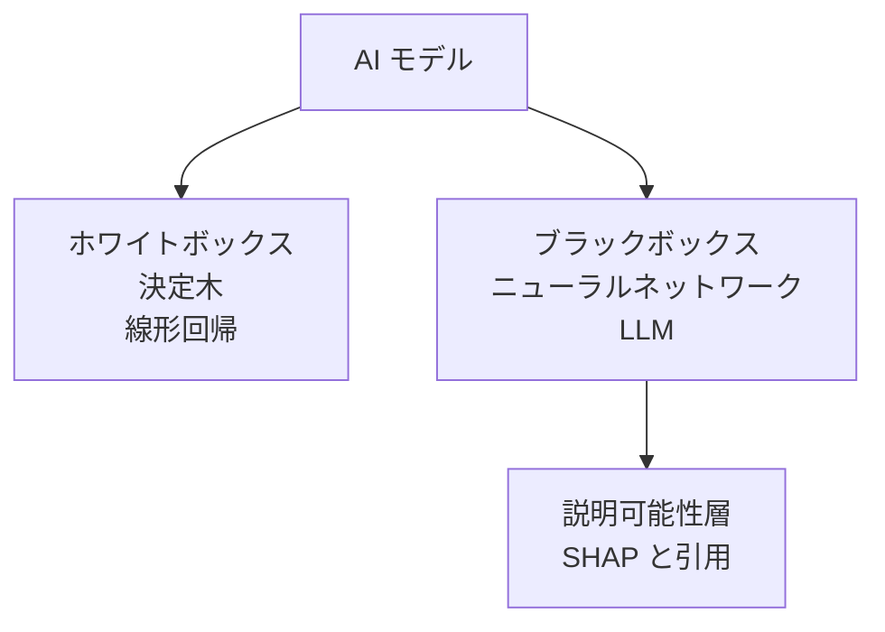
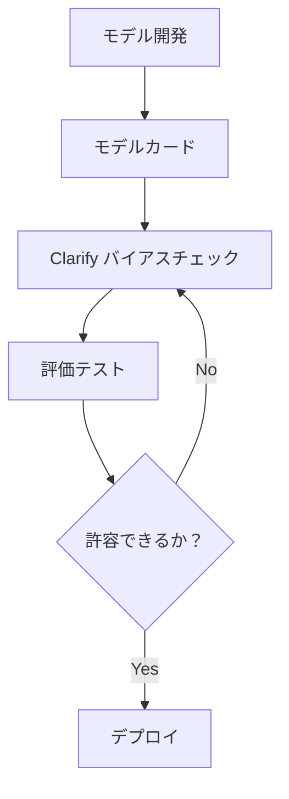
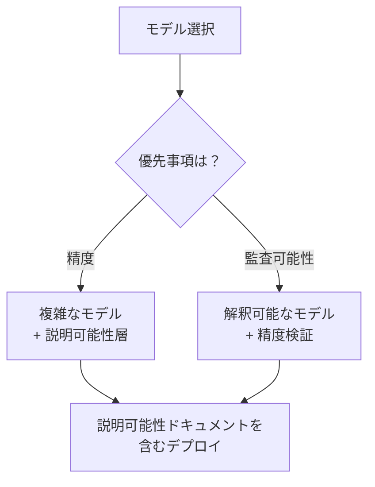
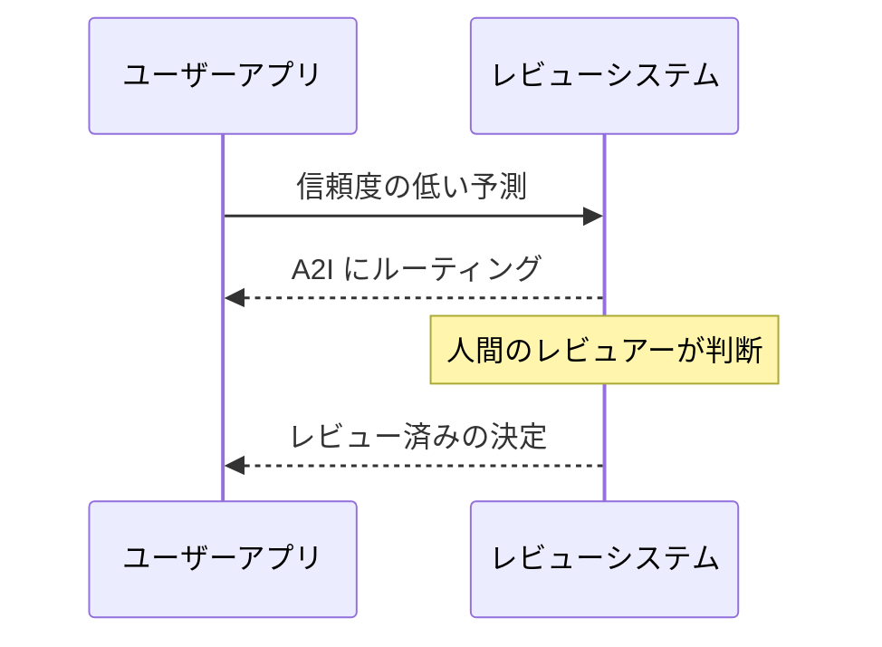

## タスクステートメント 4.2: 透明で説明可能なモデルの重要性

AI システムが顧客、従業員、またはビジネス上の成果に影響を与える決定を下す場合、関係する人々はほぼ常に同じ質問をします。なぜか？その質問に答えることが、透明性と説明可能性の本質です。このタスクステートメントでは、その質問に答えられるモデルと答えられないモデルの違いの識別方法、モデルの動作を文書化・明示する AWS ツール、説明可能性と安全性やパフォーマンスなどの他の特性のトレードオフ、そして AI システムが重要な推奨事項を行う際に人間が意味のある形でループに入れておくための設計原則をカバーします。[^402001]

### 4.2.1 透明で説明可能なモデルとそうでないモデルの違い

透明性と説明可能性は関連していますが異なる特性です。**透明性**は、内部構造、トレーニングデータ、意思決定ロジックを直接検査できるモデルの特性です。透明なモデルは開けて読めるものです。**説明可能性**は、内部構造が複雑なままであっても、出力に人間が理解できる理由を添えることができるモデルの特性です。説明可能なモデルは内部的には不透明かもしれませんが、その周辺システムが人間が評価できる根拠を生成できます。[^402002]

この区別は実際に重要です。古典的な*決定木*は透明です。根からリーフへとブランチをたどり、どの入力値がモデルを特定の結論に導いたかを正確にトレースできます。[^402031] 数十億のパラメーターを持つ*深いニューラルネットワーク*は同じ意味では透明ではありません。人間は重み行列を読んで、特定のトークンシーケンスが特定の出力を生み出した理由を理解することはできません。しかし、そのニューラルネットワークを取り巻くよく設計されたシステムは依然として説明可能にすることができます。出力に最も寄与した特徴を報告したり、応答に最も影響を与えたソースドキュメントを表示したり、モデルがどの程度確信しているかを示す信頼度スコアを割り当てたりできます。[^402032]

**ホワイトボックスモデル**は意思決定ロジックが本質的に読みやすいものです。線形回帰、ロジスティック回帰、決定木、ルールベース分類器はすべてこのカテゴリに属します。[^402003] 決定木として構築されたローン審査モデルは、規制当局に平易な英語で説明できます。「負債対収入比率が 40% を超え、雇用履歴が 24 か月未満の申請は拒否されました」という文がモデルそのものです。ホワイトボックスモデルは、消費者信用、保険引受、および一部の医療機器分類など、すべての個別の決定の完全な監査可能性が規制上の説明責任に必要な環境でのデフォルトの選択です。[^402033]

**ブラックボックスモデル**は内部計算が直接解釈するには複雑すぎるものです。[^402004] 大規模言語モデル、深い畳み込みネットワーク、数百の特徴でトレーニングされた勾配ブースティングツリーなどのアンサンブル手法はすべて、実際的な観点からブラックボックスとして動作します。モデルはスコアまたはトークンシーケンスを生成しますが、入力から出力へのパスは非常に多くの非線形変換を経るため、それをトレースすることは計算上および概念上、扱いにくいです。[^402034] コンテンツモデレーション、医療画像診断、不正検出、自然言語処理のほとんどの本番 AI システムは、ブラックボックスモデルで動作します。

*図 4.2.1: ホワイトボックス対ブラックボックスモデルの分類。ホワイトボックスモデルは意思決定ロジックを直接公開します。ブラックボックスモデルは人間が理解できる根拠を生成するための別の説明可能性層を必要とします。*

ほとんどの本番 AI システムの現実は、2 つの極端の間のどこかに位置することです。勾配ブースティング分類器は行ごとに読めないかもしれませんが、モデルの構造から直接*特徴の重要度*スコアを計算できるため、深いニューラルネットワークよりも不透明度が低いです。[^402035] 大規模言語モデルは内部的に深く不透明ですが、ソースを引用し、不確実性を報告し、最終回答を生成する前に平易な言語で推論の連鎖を説明するように設定できます。実際的な質問は、モデルが完全に透明かどうかではなく、ユースケースの説明責任要件に対して十分に説明可能かどうかです。[^402036]

3 つの業界がスペクトルをよく示しています。信用スコアリングでは、多くの法域の規制が貸し手に申請者に信用決定が行われた具体的な理由を提供することを要求します。ホワイトボックスモデルまたは SHAP 帰属のブラックボックスモデルはどちらもこの要件を満たしますが、説明のないスコアは満たしません。[^402005] 医療診断では、胸部 X 線をスクリーニングするために AI ツールを使用する放射線科医は、モデルが最も重く重み付けした画像の領域を確認して、医師がモデルの仮説を確認または上書きできるようにする必要があります。ここでは説明可能性が人間の意思決定を支援しますが、置き換えることはありません。[^402037] コンテンツモデレーションでは、プラットフォームオペレーターはユーザーに個別のモデレーション決定を説明する必要がないかもしれませんが、内部監査チームは分類器が人口統計グループ間で一貫したルールを適用していることを確認する必要があります。ここでは説明可能性は主に内部品質保証ツールです。[^402038]

### 4.2.2 透明で説明可能なモデルを特定するツール

説明可能性が必要であると認識することは、それを達成する方法を知ることとは異なります。AWS は異なるレベルで説明可能性に対処するツールのセットを提供しています。モデルのドキュメント、推論中の動作、および出力の安全性と品質です。[^402039]

**Amazon SageMaker Model Cards** は AWS がモデルドキュメントの作成と共有を標準化するために設計したツールです。[^402006] モデルカードは SageMaker のモデルアーティファクトに添付された構造化された人間が読めるドキュメントです。モデルの意図されたユースケース、トレーニングデータセットとそのプロベナンス、関連するサブグループ全体のパフォーマンスメトリクス、既知の限界、倫理的考慮事項、および使用制限を記録します。[^402007] モデルを本番環境に承認する前にモデルカードをレビューするビジネスプロフェッショナルは、モデルがデプロイ対象の集団を代表するデータでトレーニングされたか、どのような精度のトレードオフが行われたか、開発チームがすでに特定したリスクは何かを判断できます。

モデルカードの価値は最初のデプロイ決定を超えて延びています。モデルの動作が時間とともに変化したとき、または規制上の問い合わせが届いたとき、モデルカードはデプロイ時点で何が知られていたかの監査可能な記録を提供します。[^402040] Amazon SageMaker は AWS マネジメントコンソールと SageMaker Python SDK を通じたモデルカードの公開をサポートし、カードはモデルアーティファクトと共にバージョン管理できます。[^402008]

**Amazon SageMaker Clarify** は推論レベルで説明可能性に対処します。[^402009] Clarify は、古典的な機械学習モデルの特徴帰属スコアを計算するために *SHAP*（SHApley 加法的説明）と呼ばれる技術を使用します。[^402010] SHAP 値を「この特徴は、すべての申請者にわたる平均的な予測と比較して、回答をどの程度上げ下げしたか」として考えてください。正の数は高いリスク予測に向けてプッシュします。負の数はリスクの低減に向けてプッシュします。例えば、信用リスクモデルの予測に対する Clarify の説明では、申請者の負債対収入比率がリスクスコアに +0.12 貢献し、信用履歴の長さが -0.08 貢献したことが示され、審査担当者に決定の定量的根拠と申請者への必要な説明の出発点を提供します。（画像モデルの場合、同等の技術はモデルが最も重く重み付けした入力画像の領域を強調表示する*顕著性マップ*を生成します。）

特徴帰属を超えて、SageMaker Clarify はモデルが異なる人口統計グループを異なる扱いをするかどうかを反映する*バイアスメトリクス*を測定します。[^402011] 事前トレーニングバイアスメトリクスは、トレーニングデータセット自体が不均衡かどうかを評価します。ポストトレーニングバイアスメトリクスは、トレーニング済みモデルの予測が性別、年齢、郵便番号などの機密属性によって定義されたグループ全体で系統的に異なるかどうかを評価します。[^402041] このバイアス検出機能はタスクステートメント 4.1 でカバーされた責任ある AI 特性に直接つながり、Clarify を二重目的のツールにしています。個々の予測を説明し、集団レベルの公平性を監視します。

**Amazon Bedrock Model Evaluations** は AWS が基盤モデル出力の品質と安全性を評価するために提供するツールです。[^402012] 古典的な ML の特徴帰属に対処する Clarify とは異なり、Bedrock Model Evaluations は精度、流暢さ、一貫性、毒性などの次元で LLM の出力を評価します。評価は組み込みのスコアリングアルゴリズムを使用した自動化されたジョブとして、または社内チームまたは AWS マネージドワークフォースによる人間評価ジョブとして設定できます。[^402013] 安全性評価次元は有害、毒性、または不適切なコンテンツを特別に確認し、組織が本番環境に置く前にモデルが安全性基準でどのように機能するかの構造化された記録を提供します。Bedrock Model Evaluations はジョブごとに基準に対して出力を比較するレポートを生成します。モデル自体についての継続的なガバナンスドキュメントではなく、それはモデルカードが提供するものです。

**オープンソースモデル**は透明性ツールとして特別な注目に値します。組織が Meta Llama ファミリーや Mistral ファミリーのモデルなど、重みとアーキテクチャが公開されているモデルをデプロイする場合、アーキテクチャのドキュメントを検査し、モデル開発者が公開しているトレーニングデータカードをレビューし、サードパーティの評価を実行できます。[^402014] これは API を通じてアクセスされる専有モデルで利用可能な透明性とは質的に異なるレベルです。専有モデルではアーキテクチャとトレーニングデータは開示されません。[^402042] Amazon Bedrock または Amazon SageMaker エンドポイントを通じて AWS 上でオープンソースモデルをデプロイすることで、管理されたインフラの運用上のメリットを保持しながらこの透明性の利点が維持されます。[^402043]

**データとライセンスのドキュメント**が全体像を補完します。説明可能性は、モデルを生み出したデータがトレーサブルである場合にのみ意味があります。[^402015] 非開示のプロベナンスのデータでトレーニングされたモデルは、モデルカードが完全に捉えることができないリスクを持っています。トレーニングデータに保護された個人データ、著作権で保護されたコンテンツ、または系統的に偏ったラベルが含まれていると判明した場合、モデルの出力はそれらの問題を継承します。[^402044] トレーニングデータとモデルの重みの両方のライセンス条件は、組織がモデルの出力で合法的に何ができるかを決定します。その決定自体がモデルの運用上の制約についての透明性の形です。[^402045]

*表 4.2.1: モデルの透明性と説明可能性のための AWS ツール*

| ツール | 何を説明するか | 技術 | 主な対象者 |
|-------|-------------|-----|---------|
| SageMaker Model Cards | モデルの意図、データ、評価結果、限界 | 構造化ドキュメント | ビジネスレビュアー、監査者 |
| SageMaker Clarify | 個々の予測帰属、バイアスメトリクス | SHAP 値、統計的テスト | データサイエンティスト、コンプライアンス |
| Bedrock Model Evaluations | LLM 出力品質と安全性 | 自動化および人間スコアリング | AI チーム、安全性レビュアー |
| オープンソースモデル検査 | アーキテクチャとトレーニングデータ | 重みとドキュメントの直接レビュー | ML エンジニア、研究者 |
| データとライセンスレビュー | トレーニングデータのプロベナンスと使用権 | プロベナンス追跡、ライセンスレビュー | 法務、コンプライアンス、調達 |

試験ではシナリオを正しいツールに対応させることが求められます。組織が監査のためにモデルの意図された使用と既知の限界を文書化する方法を尋ねる場合、答えは SageMaker Model Cards です。古典的な ML モデルによる特定の予測が行われた理由を説明する方法を尋ねる場合、答えは SHAP を使用した SageMaker Clarify です。生成モデルの出力が本番デプロイ前に安全かどうかを評価する方法を尋ねる場合、答えは Bedrock Model Evaluations です。[^402046]

*図 4.2.2: モデルライフサイクルにおける説明可能性ツールチェーン。モデルカードはドキュメントのコンテキストを提供します。Clarify は事前・事後トレーニングバイアスを測定します。Bedrock Model Evaluations はデプロイ前に出力の安全性を検証します。*

### 4.2.3 モデルの安全性と透明性のトレードオフ

透明性と安全性は常に一致しているわけではありません。それらが互いに強化し合う場所と対立する場所を理解することは、信頼できながらも安全な AI システムを設計するために重要です。[^402047]

最も一般的な対立は、安全性コントロールの仕組みを明らかにすることで攻撃者がそれを回避できるという事実から生じます。有害なコンテンツをブロックするコンテンツモデレーションシステムが、モデルの応答内の特定のフレーズパターンを検出することによって機能することを考えてください。正確なフレーズリストを公開すると、悪意ある行為者がブロックされたフレーズをすべて避けながらも有害なコンテンツを引き出すリクエストを構築できます。この場合、安全性コントロールの不透明さは意図的なものです。[^402048] 同じロジックはプロンプトインジェクション防御に適用されます。特定のテンプレートに続く指示を無視するようモデルに指示するシステムプロンプトは、そのテンプレートが知られると効果が薄れます。[^402016] セキュリティシステムは定期的に検出ロジックの詳細を機密扱いにし、AI 安全コントロールも例外ではありません。

対立は反対方向にも走ります。モデルの不透明さは、オペレーターとユーザーが知る必要がある安全性に関連する限界を隠す可能性があります。英語を母国語としないスピーカーに対する精度の低さや最近のイベントに関するハルシネーション率の高さなど、モデルの障害モードを正確に説明するモデルカードは、オペレーターがデプロイ時に補償コントロールを追加できるようにします。[^402017] それらの限界を隠すまたは省略すると、オペレーターはそれらを軽減できません。この意味で、限界についての透明性は積極的に安全性の成果を向上させます。[^402049]

パフォーマンス対解釈可能性のトレードオフは試験がカバーする 2 番目の緊張です。一般的に、複雑なタスクで最高の精度を達成するモデルは最も解釈しにくいものでもあります。数百万のラベル付き画像でトレーニングされた深いニューラルネットワークは、ほとんどの画像分類タスクで決定木を上回りますが、決定木の予測は追加のツールなしにドメインエキスパートに説明できます。[^402018] 数十のエンジニアリングされた特徴でトレーニングされた勾配ブーストアンサンブルは、表形式データで多くの場合ロジスティック回帰を上回りますが、ロジスティック回帰は統計学者が各変数の寄与として直接読める係数を生成します。[^402050]

*図 4.2.3: パフォーマンス対解釈可能性の決定パス。精度が主要な要件である場合は、事後的な説明可能性層を追加します。監査可能性が主要な場合は、解釈可能なモデルを選び、精度閾値を検証します。*

解釈可能性の単一の数値的尺度はありません。[^402019] 解釈可能性はリーダーボードのスコアではなく、ユースケースごとに評価される特性です。放射線科医がスクリーニング支援に十分に説明可能と考えるモデルは、医療記録に記載される正式な診断を生成するのに十分に説明可能ではないかもしれません。[^402051] ある国の消費者信用規制の説明要件を満たす信用リスクモデルは、別の国の要件を満たさないかもしれません。測定の質問は常に「誰のために、何の目的で、どの義務の下で、十分に説明可能か？」です。[^402052]

*表 4.2.2: 透明性・安全性の相互作用パターン*

| シナリオ | 透明性の影響 | 安全性の影響 | 解決策 |
|---------|-----------|-----------|------|
| プロンプトインジェクション防御の詳細を公開する | 高い透明性 | 安全性の低下 | 防御ロジックを機密に保ち、高レベルのポリシーのみを公開 |
| モデルカードがハルシネーション障害モードを文書化する | 高い透明性 | 安全性の向上 | 公開する。オペレーターが補償コントロールを追加 |
| バイアス検出の閾値値を明かす | 部分的な透明性 | 不正利用のリスク | カテゴリを公開し、正確な閾値は機密に保つ |
| オープンソースモデルの重み | 完全な透明性 | 様々 | オープンデプロイ前に特定のリスクを評価 |

試験シナリオへの実際的なガイダンスは次の通りです。コントロールのメカニズムを明かすことで攻撃者がそれを回避できるような状況を説明する場合、安全性のために透明性を低くする方が適切です。モデルの既知の限界を隠すことでオペレーターがそれらを軽減できなくなるような状況を説明する場合、安全性のために透明性を高くする方が適切です。[^402053]

### 4.2.4 説明可能な AI の人間中心の設計原則

説明可能性はモデルの技術的な特性だけではありません。モデルの出力をユーザーに提示するシステムの設計上の特性でもあります。モデルは SHAP 帰属スコアを生成できますが、インターフェースがそれらを表示するように設計されていなければ、どのビジネスユーザーも見ることはありません。[^402054] 説明可能な AI の人間中心の設計とは、ユーザーが AI の推奨事項を理解し、信頼し、適切に上書きするために必要な情報を受け取れるようにプレゼンテーション層を構築することです。[^402020]

最初の原則は、決定に関連する場合に信頼度と不確実性の情報を表示することです。高い信頼度スコアを割り当てる推奨事項と、2 つの選択肢に対してほぼ同じくらい不確実なモデルは、ユーザーに同じように見えるべきではありません。不正検出システムが 97% の信頼度でトランザクションにフラグを立てる場合、アナリストはすぐに進むことができます。同じシステムが 54% の信頼度でトランザクションにフラグを立てる場合、アナリストはモデルが不確実であることを知り、より精査を加えるべきです。Amazon Bedrock モデルは確率スコアを返すことができ、出力に不確実性を明示的に表現するようプロンプトできます。モデルの出力をバイナリの yes/no の推奨事項に直接変換するのではなく、その情報を表示するようにアプリケーションを設計することは、意図的なデザインの選択です。[^402021]

2 番目の原則は、生成されたコンテンツの引用とソースを表示することです。ドキュメントコーパスから情報を取得して自然言語の回答を生成する RAG ベースのアプリケーションは、どのソースドキュメントが使用されたかを特定すべきです。これは透明性の尺度だけでなく、ユーザーがモデルの出力を元のソースに対して検証し、モデルがソースが実際に述べたことを超えて汎化したケースを特定できる実際的なツールです。[^402022] Amazon Bedrock Knowledge Bases は生成された応答と共にソースドキュメントの参照を返します。それらの参照をエンドユーザーに表示するアプリケーション設計はシステムを実質的により信頼できるものにします。[^402055]

3 番目の原則は、AI 出力品質についてのユーザーの判断をキャプチャするフィードバックループを設計することです。モデルの推奨事項に添付された高評価/低評価メカニズムはこの最も単純な形ですが、設計はまた否定的なフィードバックの理由もキャプチャすべきです。推奨事項は事実的に誤りだったか、適用できなかったか、それとも正しかったが分かりにくい方法で提示されたか？モデル開発チームにルーティングされるその構造化されたフィードバックは、系統的な障害モードを特定し、時間をかけてモデルを改善するために必要なラベル付きデータを生成します。タスクステートメント 4.1 で紹介された Amazon A2I は、信頼度の低い出力を人間のレビュアーにルーティングし、彼らの決定を構造化された記録としてキャプチャすることで、この原則に適合します。[^402023]

*図 4.2.4: ループ内人間フィードバックフロー。アプリケーションは信頼度スコアをユーザーに表示し、信頼度の低いまたは争われた出力を Amazon A2I に人間レビューにルーティングし、構造化されたアノテーションを開発チームに返します。*

4 番目の原則は、モデルが言ったことをシステムが行ったこととを分離することです。マルチ層の AI アプリケーションでは、モデルは推奨事項を生成し、次に下流のシステムがその推奨事項に基づいて行動します。よく設計されたインターフェースは、ユーザーに両方の層を表示します。モデルの推奨事項と、その推奨事項に基づいたシステムのアクションです。[^402056] これは、システムがモデルの出力を変更または上書きするビジネスルールを追加する場合に重要です。例えば、採用支援ツールは法定年齢閾値を下回る候補者を除外するために会社が適用したルールと共に、モデルの候補者ランキングの両方をリクルーターに表示するかもしれません。ユーザーはビジネスルール層とは独立してモデルの推論を評価できます。[^402057]

5 番目の原則は、上書きを簡単で十分に追跡されたものにすることで、ユーザーの自律性を尊重することです。上書きできない AI の推奨事項は推奨事項ではありません。自動化された決定です。AI の出力を使用することを要求されているが上書きできないユーザーは、エッジケースに専門的な判断を適用する能力を失い、組織は上書きデータが提供したはずのシグナルを失います。[^402058] 目立ち、摩擦が少なく、監査ログが記録される上書きメカニズムを設計することで、ユーザーに真の主体性を与えながら、モデルが不足している場所についての価値あるフィードバックも生成します。[^402024]

*表 4.2.3: 説明可能な AI のための人間中心の設計原則*

| 原則 | 実装例 | AWS ツールまたはパターン |
|-----|-------|---------------------|
| 信頼度と不確実性を表示 | 推奨事項の横にモデルの信頼度スコアを表示 | Bedrock 推論応答メタデータ |
| 引用とソースを表示 | 生成された応答と共に取得されたソースドキュメントをリスト | Bedrock Knowledge Bases のソース帰属 |
| 構造化されたフィードバックをキャプチャ | 理由を含む低評価。信頼度の低い自動ルーティング | Amazon A2I ワークフロー設定 |
| モデル出力をシステムアクションから分離 | モデルスコアと適用されたビジネスルールを別々に表示 | アプリケーション層の設計 |
| ユーザーの自律性を尊重 | 監査ログを含む目立つ上書きボタン | アプリケーション層の設計 |

アクセシビリティは試験が詳しく述べていないが、責任ある実装が対処しなければならない人間中心の設計における実際的な考慮事項です。数値のみで提示された信頼度スコアは、確率的推論に不慣れなユーザーを除外します。[^402059] 技術的な言語で書かれた説明は非専門家のユーザーを除外します。そのシステムを構築した開発者のためではなく、実際のユーザーのために説明可能性を設計することが、このコンテキストにおける人間中心の設計の運用上の定義です。[^402060]

## 自己確認問題

**問題 1.** 金融サービス会社はローン申請を承認または拒否するために勾配ブーストアンサンブルモデルを使用しています。規制当局は、会社が拒否された各申請者に決定の具体的な理由を提供することを要求しています。モデル開発チームはモデルを置き換えることなくこの要件を満たしたいと考えています。最も適切な AWS ツールまたは技術はどれですか？

A. 勾配ブーストモデルをデザインによって透明なロジスティック回帰モデルに置き換える
B. Amazon SageMaker Clarify を使用して、各個別の予測に対して SHAP ベースの特徴帰属スコアを生成する
C. トレーニングデータと評価メトリクスを文書化する SageMaker Model Card を公開する
D. Amazon Bedrock Model Evaluations を使用して、ラベル付きデータセットに対するモデルの出力精度をスコア付けする

**解説:** 規制当局は予測ごとの説明を要求しており、これはシステムが各個別の申請に対して特定の入力特徴に特定の予測を帰属させる必要があることを意味します。Amazon SageMaker Clarify（答え B）は各入力特徴がモデルの予測にどの程度寄与したかを定量化する SHAP 値を計算し、規制当局が要求する予測ごとの根拠を正確に生成します。答え A は要件を満たしますが、質問ではチームがモデルを置き換えたくないと指定しています。また、解釈可能性のためだけにモデルを置き換えることは、アンサンブルの精度上のメリットを犠牲にします。答え C はモデル全体のドキュメントに対処しますが、予測ごとの説明を生成しません。答え D は LLM 出力の総合精度を評価するものであり、古典的な ML モデルの特徴帰属のために設計されていません。SageMaker Clarify は SageMaker でトレーニングされたモデルの個別の予測帰属のための専用ツールです。[^402026]

---

**問題 2.** ある会社が放射線科医がレビューするために胸部 X 線の領域を強調表示する AI 医療画像診断アシスタントを開発しています。開発チームは、より高い診断精度を持つ深い畳み込みネットワークと、より低い精度だが完全に監査可能なルールを持つルールベース分類器のどちらを使用するかを議論しています。臨床チームは、ツールが領域にフラグを立てている理由を理解できる場合にのみツールを使用するとしています。2 つの要件に最もよく対応するアプローチはどれですか？

A. 完全に透明でありその規則を臨床チームが直接読めるため、ルールベース分類器を使用する
B. 深い畳み込みネットワークを使用し、モデルが最も重く重み付けした画像領域を強調表示する事後的な説明可能性層を追加する
C. 説明可能性層なしで深い畳み込みネットワークを使用し、モデルの出力を信頼するよう臨床チームをトレーニングする
D. Amazon Bedrock Model Evaluations を使用して、各画像診断セッションの前に深い畳み込みネットワークの出力を検証する

**解説:** 質問は 2 つの競合する要件を特定しています。高精度（深い畳み込みネットワークを支持）と理解可能性（透明なモデルを支持）です。答え B は、より高精度のモデルを使用し、モデルが最も重く重み付けした画像領域を示す*顕著性マップ*または同等の可視化を生成する事後的な説明可能性層を追加することで緊張を解決します。これにより放射線科医は精度上の利点を犠牲にすることなく必要な地域的な根拠を得られます。答え A は精度の制限を不必要に受け入れます。質問はルールベース分類器の精度が十分であるとは述べていません。答え C は述べられた臨床チームの要件を無視し、説明を必要とすると述べた臨床医に未説明のシステムをデプロイすることで患者の安全リスクをもたらします。答え D はツールカテゴリが間違っています。Bedrock Model Evaluations は LLM の出力品質に対処し、画像分類の帰属に対応していません。より広いレッスンは、パフォーマンス対解釈可能性のトレードオフは 2 つの間で選択するのではなく、高性能モデルを保持して説明可能性層を追加することで解決できることが多いということです。[^402027]

---

**問題 3.** ある組織が生成 AI のカスタマーサービスアシスタントをデプロイする準備をしています。コンプライアンスチームは、モデルの意図された使用、既知の障害モード、それを検証するために使用された評価メトリクスのドキュメントが、技術に詳しくない監査者がレビューできる形式であることを要求しています。この目的のために設計された AWS 機能はどれですか？

A. Amazon SageMaker Clarify バイアスレポート
B. Amazon Bedrock Model Evaluations 人間レビューワークフロー
C. Amazon SageMaker Model Cards
D. Amazon Augmented AI（Amazon A2I）レビュータスク監査ログ

**解説:** Amazon SageMaker Model Cards（答え C）は構造化されたモデルドキュメントのための専用ツールです。モデルカードは標準化された人間が読める形式で、モデルの意図されたユースケース、トレーニングデータのプロベナンス、サブグループ全体の評価結果、既知の限界、倫理的考慮事項、および使用制限を記録します。これは 3 つのコンプライアンス要件すべてに直接対処します。意図された使用、既知の障害モード、評価メトリクス、技術に詳しくない監査者がナビゲートできる形式で。答え A はデプロイされたモデルの予測ごとの帰属スコアとバイアスメトリクスを生成します。監査者向けの要約ドキュメントではありません。答え B は推論品質と安全性の評価を実行しますが、モデルカードが提供する構造化されたドキュメントではなく評価スコアを生成します。答え D は個別の人間レビュー決定の監査記録を生成します。これはモニタリングには有用ですが、モデルのドキュメントの代替にはなりません。モデルカードは試験が事前デプロイのモデルドキュメントに関する監査またはコンプライアンス要件を説明するときの標準的な答えです。[^402028]

---

**問題 4.** ある会社の AI プロダクトチームが推薦エンジンを構築しました。ユーザー調査により、多くのユーザーが特定のアイテムが提案された理由を理解できないため、推薦を信頼していないことが明らかになりました。チームは人間中心の設計を適用してユーザーの信頼を高めたいと考えています。信頼のギャップを最も直接的に解決する 2 つのデザイン変更はどれですか？

A. 推薦モデルをより精度の高いモデルに置き換え、より大きなデータセットで再トレーニングする
B. 各推薦の横にモデルの信頼度スコアを表示し、提案を促したユーザーの履歴の主要な属性を示す
C. モデルがより高い精度を達成するまで推薦機能を削除する
D. 各推薦がユーザーに表示される前に手動で承認する Amazon A2I の人間レビューステップを追加する

**解説:** ユーザー調査は精度の低さやレビューの不足ではなく、理解可能性の欠如によって引き起こされる信頼の問題を特定しています。答え B は 2 つの人間中心の設計原則を直接適用します。信頼度の表示（ユーザーが推薦にどれだけの重みを置くかを調整できるように）と推薦の背後にある推論の表示（それを促した属性。これは事後的な帰属の一形態）です。両方の変更が述べられた信頼のギャップに対処します。答え A は精度を向上させますが、信頼の問題を解決するかどうかは不明です。より精度の高いが依然として未説明のモデルは、ユーザー調査が特定した問題を解決しません。答え C は問題を解決するのではなく問題を避けるために製品機能を削除します。答え D はすべての推薦に人間レビューを導入します。推薦システムのスケールでは運用的に実用的でなく、モデルの置き換えや手動レビューではなく透明性と説明の設計が正しい答えであるという試験のパターンに沿っています。[^402029]

---

**問題 5.** データサイエンスチームが新しいアプリケーション向けにオープンソースモデルまたは専有クローズド API モデルを使用するかどうかを評価しています。チームの法務部門は、モデルを本番環境に承認する前に、トレーニングデータのソースとライセンス条件の可視性を要求しています。法務部門の要件に最も直接的に対応するオープンソースモデルの特性はどれですか？

A. オープンソースモデルは常に API 経由でアクセスされる専有モデルよりも安価に実行できる
B. オープンソースモデルは専有データでファインチューニングできる。これにより組織が結果として得られる重みを所有できる
C. オープンソースモデルは法務チームが直接レビューできるアーキテクチャドキュメント、トレーニングデータカード、ライセンス条件を公開する
D. オープンソースモデルは EU と米国の AI 透明性に関するすべての規制要件を自動的に満たす

**解説:** 法務部門の述べられた要件はトレーニングデータのソースとライセンス条件の可視性です。答え C はこれに直接対処します。公開されているモデルは通常、トレーニングコーパスの構成、既知の限界、および適用されるライセンスを説明するモデルカードとデータカード（または同等のドキュメント）を公開します。法務チームは公開されたライセンス（Apache 2.0 やモデル固有の商業ライセンスなど）をレビューして許可される使用を決定し、トレーニングデータのドキュメントをレビューしてデータプロベナンスのリスクを評価できます。答え A はコストの議論であり、法律上の要件には対処しません。インフラと運用コストを含めると、オープンソースモデルが普遍的に安価なわけではありません。答え B はファインチューニングされた派生物の所有権に対処します。これは有効な法律上の考慮事項ですが、質問で述べられたトレーニングデータとライセンスの可視性の要件には対処しません。答え D は間違いです。オープンソースの状態は特定の規制フレームワークを自動的に満たしません。コンプライアンスには関連する規制の基準に対する評価が依然として必要です。より広いレッスンは、データとライセンスの透明性はモデルの透明性の独自の次元であり、オープンソースモデルは専有 API のみを通じてアクセスされるモデルには利用できないプロベナンスの可視性レベルを提供するということです。[^402030]

---

[^402001]: AWS Certification. AI Practitioner (AIF-C01) Exam Guide v1.1, Domain 4, Task Statement 4.2. URL: <https://docs.aws.amazon.com/aws-certification/latest/ai-practitioner-01/ai-practitioner-01-domain4.html>
[^402002]: Doshi-Velez, F., and Kim, B. Towards a Rigorous Science of Interpretable Machine Learning (2017). URL: <https://arxiv.org/abs/1702.08608>
[^402003]: Breiman, L. Classification and Regression Trees (1984). URL: <https://doi.org/10.1201/9781315139470>
[^402004]: Adadi, A., and Berrada, M. Peeking Inside the Black-Box: A Survey on Explainable AI. IEEE Access (2018). URL: <https://doi.org/10.1109/ACCESS.2018.2870052>
[^402005]: Consumer Financial Protection Bureau. Using Artificial Intelligence to Assist Adverse Action Explanations (2023). URL: <https://www.consumerfinance.gov/about-us/blog/cfpb-issues-guidance-on-credit-denials-by-lenders-using-artificial-intelligence/>
[^402006]: Amazon SageMaker. Amazon SageMaker Model Cards overview. URL: <https://docs.aws.amazon.com/sagemaker/latest/dg/model-cards.html>
[^402007]: Amazon SageMaker. Model Card components and structure. URL: <https://docs.aws.amazon.com/sagemaker/latest/dg/model-cards-create.html>
[^402008]: Amazon SageMaker. Versioning and sharing SageMaker Model Cards. URL: <https://docs.aws.amazon.com/sagemaker/latest/dg/model-cards-export.html>
[^402009]: Amazon SageMaker. Amazon SageMaker Clarify overview. URL: <https://docs.aws.amazon.com/sagemaker/latest/dg/clarify-configure-processing-jobs.html>
[^402010]: Lundberg, S., and Lee, S. A Unified Approach to Interpreting Model Predictions (SHAP, NeurIPS 2017). URL: <https://arxiv.org/abs/1705.07874>
[^402011]: Amazon SageMaker. Measuring bias with SageMaker Clarify. URL: <https://docs.aws.amazon.com/sagemaker/latest/dg/clarify-measure-data-bias.html>
[^402012]: Amazon Bedrock. Amazon Bedrock Model Evaluations overview. URL: <https://docs.aws.amazon.com/bedrock/latest/userguide/model-evaluation.html>
[^402013]: Amazon Bedrock. Human evaluation jobs in Amazon Bedrock Model Evaluations. URL: <https://docs.aws.amazon.com/bedrock/latest/userguide/model-evaluation-human.html>
[^402014]: Meta AI. Llama 3 model card and data documentation. URL: <https://ai.meta.com/research/publications/meta-llama-3/>
[^402015]: Mitchell, M., et al. Model Cards for Model Reporting (FAccT 2019). URL: <https://arxiv.org/abs/1810.03993>
[^402016]: Perez, F., and Ribeiro, I. Ignore Previous Prompt: Attack Techniques for Language Models (2022). URL: <https://arxiv.org/abs/2211.09527>
[^402017]: Raji, I., et al. Closing the AI Accountability Gap: Defining an End-to-End Framework for Internal Algorithmic Auditing (2020). URL: <https://arxiv.org/abs/2001.00973>
[^402018]: Rudin, C. Stop Explaining Black Box Machine Learning Models for High Stakes Decisions and Use Interpretable Models Instead. Nature Machine Intelligence (2019). URL: <https://doi.org/10.1038/s42256-019-0048-x>
[^402019]: Lipton, Z. The Mythos of Model Interpretability. Queue, ACM (2018). URL: <https://dl.acm.org/doi/10.1145/3236386.3241340>
[^402020]: Amershi, S., et al. Guidelines for Human-AI Interaction. CHI 2019. URL: <https://dl.acm.org/doi/10.1145/3290605.3300233>
[^402021]: Amazon Bedrock. Response metadata and confidence in Amazon Bedrock inference. URL: <https://docs.aws.amazon.com/bedrock/latest/userguide/model-invocation-logging.html>
[^402022]: Amazon Bedrock. Source attribution in Knowledge Bases responses. URL: <https://docs.aws.amazon.com/bedrock/latest/userguide/knowledge-base-retrieveandgenerate.html>
[^402023]: Amazon Augmented AI. Amazon A2I overview and human review workflows. URL: <https://docs.aws.amazon.com/sagemaker/latest/dg/a2i-getting-started.html>
[^402024]: Shneiderman, B. Human-Centered AI. Oxford University Press (2022). URL: <https://global.oup.com/academic/product/human-centered-ai-9780192845290>
[^402026]: Amazon SageMaker. Explainability with SageMaker Clarify: SHAP values for predictions. URL: <https://docs.aws.amazon.com/sagemaker/latest/dg/clarify-shapley-values.html>
[^402027]: Selvaraju, R., et al. Grad-CAM: Visual Explanations from Deep Networks via Gradient-Based Localization (2017). URL: <https://arxiv.org/abs/1610.02391>
[^402028]: Amazon SageMaker. Using Model Cards for compliance and auditability. URL: <https://docs.aws.amazon.com/sagemaker/latest/dg/model-cards.html>
[^402029]: Amershi, S., et al. Guidelines for Human-AI Interaction: Principle 7, Show contextual information. CHI 2019. URL: <https://dl.acm.org/doi/10.1145/3290605.3300233>
[^402030]: Linux Foundation AI and Data. Model and Data Card Standards for Open Source AI (2023). URL: <https://lfaidata.foundation/blog/2023/09/18/data-and-model-cards/>
[^402031]: Quinlan, J.R. Induction of Decision Trees. Machine Learning, vol. 1 (1986). URL: <https://doi.org/10.1007/BF00116251>
[^402032]: Guidotti, R., et al. A Survey of Methods for Explaining Black Box Models. ACM Computing Surveys (2018). URL: <https://dl.acm.org/doi/10.1145/3236009>
[^402033]: Board of Governors of the Federal Reserve System. SR 11-7: Guidance on Model Risk Management (2011). URL: <https://www.federalreserve.gov/supervisionreg/srletters/sr1107.htm>
[^402034]: Goodfellow, I., Bengio, Y., and Courville, A. Deep Learning. MIT Press (2016). URL: <https://www.deeplearningbook.org/>
[^402035]: Chen, T., and Guestrin, C. XGBoost: A Scalable Tree Boosting System. KDD 2016. URL: <https://arxiv.org/abs/1603.02754>
[^402036]: European Parliament. EU AI Act: Article 13, Transparency and provision of information to deployers (2024). URL: <https://eur-lex.europa.eu/legal-content/EN/TXT/?uri=CELEX:32024R1689>
[^402037]: Topol, E. High-performance medicine: the convergence of human and artificial intelligence. Nature Medicine (2019). URL: <https://doi.org/10.1038/s41591-018-0300-7>
[^402038]: Raji, I., and Buolamwini, J. Actionable Auditing: Investigating the Impact of Publicly Naming Biased Performance Results of Commercial AI Products. AIES 2019. URL: <https://dl.acm.org/doi/10.1145/3306618.3314244>
[^402039]: NIST. Artificial Intelligence Risk Management Framework (AI RMF 1.0), GOVERN 1.7. URL: <https://doi.org/10.6028/NIST.AI.100-1>
[^402040]: Amazon SageMaker. Model Card audit and governance use cases. URL: <https://docs.aws.amazon.com/sagemaker/latest/dg/model-cards-use-cases.html>
[^402041]: Amazon SageMaker. Post-training bias metrics in SageMaker Clarify. URL: <https://docs.aws.amazon.com/sagemaker/latest/dg/clarify-measure-post-training-bias.html>
[^402042]: Bommasani, R., et al. On the Opportunities and Risks of Foundation Models: Transparency section. Stanford CRFM (2021). URL: <https://arxiv.org/abs/2108.07258>
[^402043]: Amazon Bedrock. Supported open-source models in Amazon Bedrock. URL: <https://docs.aws.amazon.com/bedrock/latest/userguide/models-supported.html>
[^402044]: Gebru, T., et al. Datasheets for Datasets. Communications of the ACM (2021). URL: <https://doi.org/10.1145/3458723>
[^402045]: Open Source Initiative. The Open Source AI Definition, version 1.0 (2024). URL: <https://opensource.org/ai/open-source-ai-definition>
[^402046]: Amazon Bedrock. Choosing between automated and human evaluation in Bedrock Model Evaluations. URL: <https://docs.aws.amazon.com/bedrock/latest/userguide/model-evaluation.html>
[^402047]: Wachter, S., Mittelstadt, B., and Russell, C. Counterfactual Explanations Without Opening the Black Box: Automated Decisions and the GDPR. Harvard Journal of Law and Technology (2018). URL: <https://doi.org/10.2139/ssrn.3063289>
[^402048]: Amazon Bedrock. Amazon Bedrock Guardrails: content filtering configuration. URL: <https://docs.aws.amazon.com/bedrock/latest/userguide/guardrails-filters.html>
[^402049]: Floridi, L., et al. An Ethical Framework for a Good AI Society: Opportunities, Risks, Principles, and Recommendations. Minds and Machines (2018). URL: <https://doi.org/10.1007/s11023-018-9482-5>
[^402050]: Hastie, T., Tibshirani, R., and Friedman, J. The Elements of Statistical Learning, 2nd ed. Springer (2009). URL: <https://doi.org/10.1007/978-0-387-84858-7>
[^402051]: FDA. Artificial Intelligence and Machine Learning in Software as a Medical Device: Action Plan (2021). URL: <https://www.fda.gov/medical-devices/software-medical-device-samd/artificial-intelligence-and-machine-learning-software-medical-device>
[^402052]: European Parliament. EU AI Act: Article 86, Right of explanation of individual decision-making (2024). URL: <https://eur-lex.europa.eu/legal-content/EN/TXT/?uri=CELEX:32024R1689>
[^402053]: NIST. AI RMF Playbook: MAP 1.6, Risk of insufficient explainability. URL: <https://airc.nist.gov/Docs/2>
[^402054]: Yang, Q., et al. Investigating how and why practitioners use machine learning explanation methods. CHI 2023. URL: <https://dl.acm.org/doi/10.1145/3544548.3581219>
[^402055]: Amazon Bedrock. Citations and source attribution in Knowledge Bases responses. URL: <https://docs.aws.amazon.com/bedrock/latest/userguide/knowledge-base-retrieveandgenerate.html>
[^402056]: Cai, C.J., et al. Human-Centered Tools for Coping with Imperfect Algorithms During Medical Decision-Making. CHI 2019. URL: <https://dl.acm.org/doi/10.1145/3290605.3300234>
[^402057]: European Parliament. EU AI Act: Article 26, Obligations of deployers of high-risk AI systems (2024). URL: <https://eur-lex.europa.eu/legal-content/EN/TXT/?uri=CELEX:32024R1689>
[^402058]: Kuo, T., et al. Assessing the AI on AI: Examining the Influence of AI Recommendations on Human Decisions. CHI 2023. URL: <https://dl.acm.org/doi/10.1145/3544548.3581314>
[^402059]: Bunt, A., Lount, M., and Lauzon, C. Are explanations always important? A study of deployed, low-cost intelligent systems. IUI 2012. URL: <https://dl.acm.org/doi/10.1145/2166966.2166996>
[^402060]: Wang, D., et al. Designing Theory-Driven User-Centric Explainable AI. CHI 2019. URL: <https://dl.acm.org/doi/10.1145/3290605.3300831>
