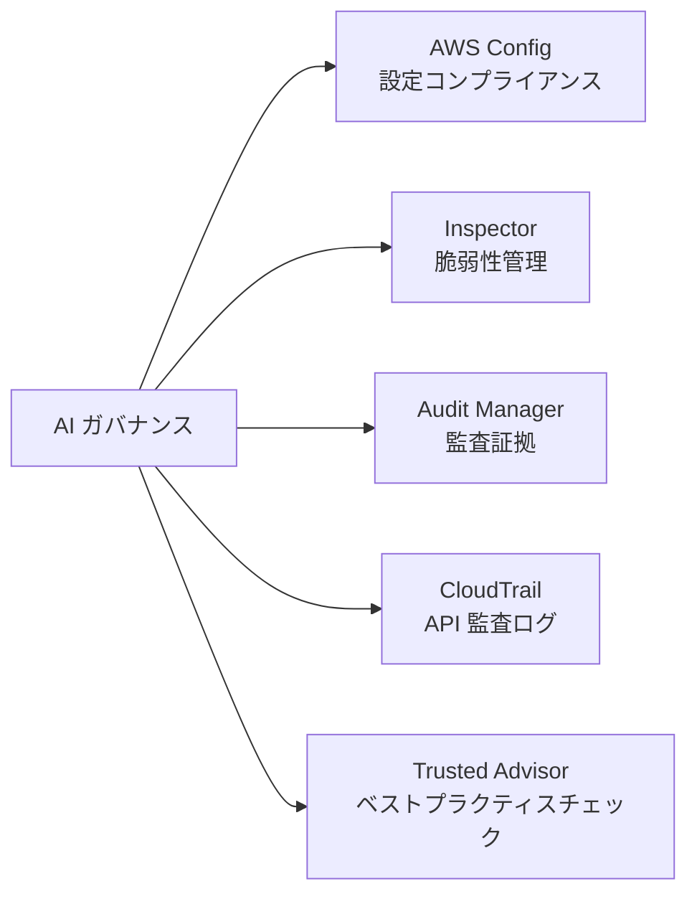
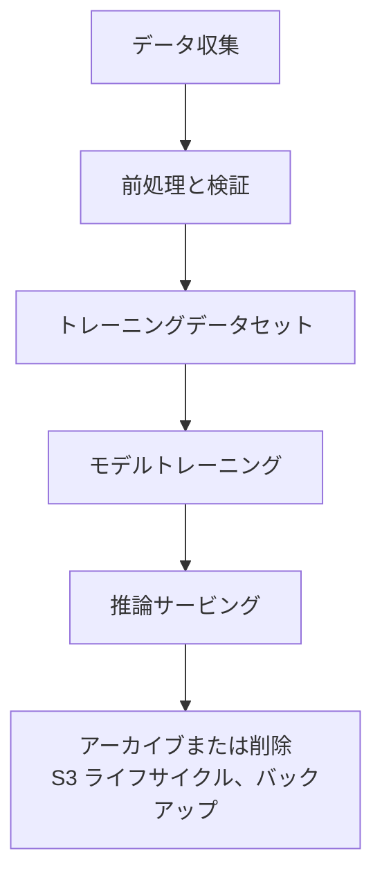
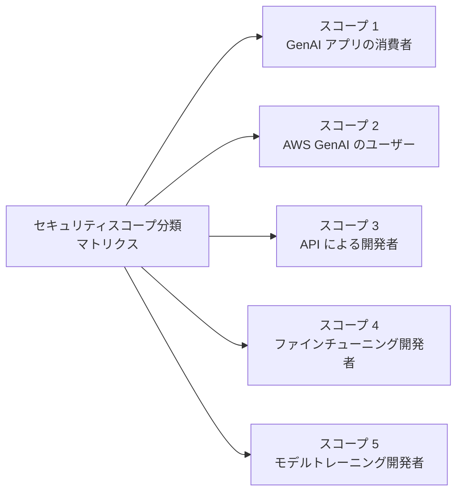
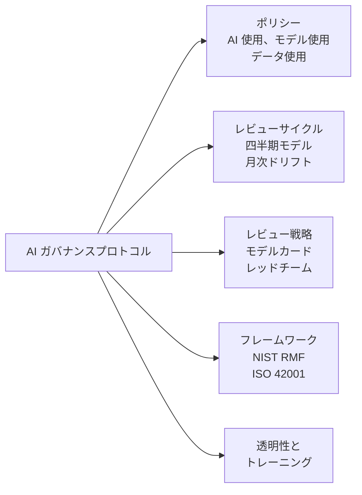

## タスクステートメント 5.2: AI システムのガバナンスとコンプライアンス規制の認識

ガバナンスとコンプライアンスは、責任ある AI の原則を組織の説明責任へと転換します。セキュリティ制御が技術レイヤーを保護するのに対し、ガバナンス構造は組織が AI システムを説明し、守り、継続的に改善するためのポリシー、レビューサイクル、監査証跡、規制証拠を作り出します。このタスクステートメントでは、コンプライアンス証拠収集をサポートする AWS サービス、監査人が期待するデータガバナンス戦略、そして AI プログラムに持続的な組織的基盤を与えるガバナンスプロセスを扱います。[^502001]

### 5.2.1 ガバナンスとコンプライアンスのための AWS サービスと機能

AI ワークロードのコンプライアンスは、デプロイ時に通過するひとつのゲートではありません。継続的なモニタリング、証拠収集、監査対応の準備によって維持される継続的な状態です。AWS はコンプライアンスのライフサイクル全体をカバーする一連のマネージドサービスを提供しています。設定の記録、脆弱性スキャン、フレームワーク対応の証拠収集、オンデマンドのレポート取得、API 監査ログ、ベストプラクティスチェックです。これらのサービスを組み合わせることで、組織は AI システムが定義された境界内で運用されていることを規制当局、監査人、および内部ステークホルダーに証明できます。

これらのサービスの関係は論理的な分業に従っています。**AWS Config** はリソースの設定状態を追跡し、それが定義されたルールに準拠しているかを評価します。**Amazon Inspector** は AI ワークロードをホストするコンピューティングおよびコンテナレイヤーの脆弱性を検出します。**AWS Audit Manager** はコンプライアンス証拠を特定のフレームワークに対応した監査対応パッケージにまとめます。**AWS Artifact** は認可されたユーザーに AWS 自身のサードパーティコンプライアンス認証へのアクセスを提供します。**AWS CloudTrail** は誰がいつ何をしたかを証明する不変の API アクティビティログを作成します。**AWS Trusted Advisor** はコスト、セキュリティ、フォールトトレランス、サービス制限にわたって AWS ベストプラクティスに対する設定のギャップを特定します。

*図 5.2.1: AWS コンプライアンスサービスのカテゴリ。各サービスは AI ワークロードの監査とガバナンススタックの異なるレイヤーに対処します。*

**AWS Config** は設定の記録とルール評価のサービスで、AWS リソースの状態を継続的に追跡し、ポリシーで定義されたコンプライアンスルールに照らして確認します。[^502002] リソースが変更されると、Config は新しい設定を記録し、適用可能なルールと比較し、コンプライアンス違反のものにフラグを立てます。AI ワークロードでは、3 つのルールカテゴリが特に関連します。第 1 に Bedrock モデル呼び出しログの確認です。Amazon Bedrock のログが有効であることを確認する Config ルールを設定し、すべてのモデルリクエストが監査と分析のために記録されることを保証できます。[^502003] 第 2 に SageMaker ノートブックアクセスの制御です。Amazon SageMaker ノートブックインスタンスに IAM ベースのアクセスが必要であることを確認するルールにより、トレーニングコードとデータが存在するノートブック環境のパブリックインターネットへの直接公開を防げます。[^502004] 第 3 に暗号化の適用です。Bedrock カスタムモデルアーティファクトと SageMaker トレーニングボリュームが保存時に暗号化されていることを確認するルールにより、機密モデルパラメータとトレーニングデータが常に保護されることを確保します。[^502005]

Config ルールは*コンフォーマンスパック*にグループ化でき、NIST SP 800-53 や AWS Foundational Security Best Practices 標準などの特定のコンプライアンス要件に対応した複数の関連ルールをデプロイ可能なユニットにまとめます。[^502006] AI 環境がフレームワークの制御要件を満たしていることを証明したい組織は、対応するコンフォーマンスパックをデプロイしてそのコンプライアンスダッシュボードをエクスポートすることで、制御ステータスの単一の再現可能なビューを提供できます。

**Amazon Inspector** は、Amazon EC2 インスタンス、AWS Lambda 関数、Amazon Elastic Container Registry（ECR）に保存されたコンテナイメージを継続的にスキャンして既知のソフトウェア脆弱性および意図しないネットワーク公開を検出するサービスです。[^502007] AI ワークロードは Inspector がカバーするインフラ上で頻繁に実行されます。SageMaker トレーニングジョブは EC2 インスタンスフリートで実行され、推論コンテナは ECR に保存され、カスタム推論コードは Lambda 関数として実行される場合があります。Inspector は調査結果を Common Vulnerabilities and Exposures（CVE）データベースと照合してリスクスコアを割り当て、セキュリティチームが悪用可能性と影響に基づいて最初に対処すべき脆弱性を優先できるようにします。[^502008] ガバナンスの観点では、Inspector の調査結果は AWS Security Hub に直接フィードされ、監査人が他のコンプライアンスシグナルとともに確認できる一元化されたダッシュボードが提供されます。

**AWS Audit Manager** はコンプライアンス監査の証拠収集を自動化します。[^502009] 各監査サイクルの前にスクリーンショットやログの抜粋を手動で抽出する代わりに、組織は Audit Manager をフレームワークで設定すると、サービスが AWS Config ルールの結果、CloudTrail API 呼び出し、Security Hub の調査結果から継続的に証拠を収集します。このサービスには HIPAA、SOC 2、PCI DSS、ISO 27001、FedRAMP などの標準に対応した事前構築済みフレームワークと、内部監査プログラムや新たな AI 固有要件のためのカスタムフレームワーク構築ツールが付属しています。[^502010] 証拠は構造化された評価レポートに保存されており、監査人は AWS 環境への直接アクセスなしにレビューできます。たとえば HIPAA 対象の AI プログラムでは、Audit Manager はトレーニングデータが暗号化されていること、モデルエンドポイントへのアクセスがログに記録されていること、モデル設定の変更が記録されていることの証拠を収集し、定義された期間にわたる制御の運用を実証する監査パッケージを生成できます。

**AWS Artifact** は AWS の顧客が AWS 自身のコンプライアンス認証と契約をダウンロードできるセルフサービスポータルです。[^502011] 利用可能なレポートには SOC 1、SOC 2、SOC 3 レポート（独立したサードパーティが実施したシステムと組織の制御の監査）、ISO 27001、ISO 27017、ISO 27018 認証（情報セキュリティ管理とクラウドプライバシー）、PCI DSS コンプライアンス証明書（ペイメントカードワークロード向け）、対象となる医療機関向けの HIPAA Business Associate Addenda（BAA）が含まれます。[^502012] Artifact は顧客自身のワークロードに関する証拠を生成しません。基盤インフラプロバイダーとしての AWS の制御に関する証拠を提供します。この違いは共有責任モデルにとって重要です。顧客はクラウドプラットフォーム自体が規制当局のインフラ要件を満たすことを示すために Artifact レポートを提示し、Audit Manager の証拠は顧客の設定と運用が同じ要件を満たすことを示します。

**AWS CloudTrail** は AWS サービスに対するすべての API 呼び出しを記録し、呼び出しから数分以内にイベントレコードを Amazon S3 バケットに配信します。[^502013] AI ワークロードでは、これにはすべての Amazon Bedrock InvokeModel API 呼び出し（どのモデルが誰によっていつどのような結果コードで呼び出されたかを記録）、すべての SageMaker CreateTrainingJob および CreateEndpoint 呼び出し、モデルアクセスに影響するすべての IAM ポリシー変更が含まれます。CloudTrail はデータイベントもサポートしており、Amazon S3 のオブジェクトレベルのアクティビティを記録します。トレーニングデータバケットの S3 データイベントを有効にすると、トレーニングファイルへのすべての読み取りと書き込みのログが生成され、データの準備とモデルトレーニングの間に不正な変更がなかったことを示す監査可能な管理の連鎖が作成されます。[^502014] CloudTrail Lake（サービスのマネージド分析レイヤー）を使用すると、外部のログ分析システムを必要とせずにイベント履歴に対して SQL ベースのクエリを実行でき、「過去 90 日間に本番モデルエンドポイントの設定が変更されたすべての場合を示してください」という監査人の質問に答えることが容易になります。[^502015]

**AWS Trusted Advisor** は AWS アカウントの設定を、コスト最適化、パフォーマンス、セキュリティ、フォールトトレランス、サービス制限の 5 つのカテゴリにわたって AWS ベストプラクティスに照らして評価します。[^502016] ガバナンスの観点では、セキュリティチェックが AI コンプライアンスプログラムに最も直接関連します。Trusted Advisor は S3 バケットのパブリックアクセス、無制限のセキュリティグループルール、ローテーションされていない IAM アクセスキー、ルートアカウントの使用などの状況にフラグを立てます。AI ワークロードでは、サービス制限チェックも重要です。インスタンス数の制限に近づいている SageMaker エンドポイントは、ピーク推論時間にスケールに失敗する可能性があり、これは特定の SLA の下で報告すべきサービス可用性の問題となる可能性があります。[^502017] Trusted Advisor の結果は AWS コンソールと API で利用可能なため、Config、Inspector、Security Hub の調査結果とともにコンプライアンスダッシュボードに取り込めます。

*表 5.2.1: AI ユースケースにマッピングされた AWS ガバナンスとコンプライアンスサービス*

| サービス | 主な機能 | AI 固有のガバナンスユースケース |
|---|---|---|
| AWS Config | 設定の記録とルール評価 | Bedrock ログが有効であることを確認。SageMaker の IAM のみのアクセスを適用。モデルアーティファクトの暗号化を確認 |
| Amazon Inspector | EC2、Lambda、ECR の脆弱性スキャン | 推論コンテナと Lambda 関数の CVE をスキャン。意図しないネットワーク露出を検出 |
| AWS Audit Manager | 監査フレームワークの自動化された証拠収集 | AI ワークロードの HIPAA、SOC 2、PCI 証拠を収集。監査対応レポートを生成 |
| AWS Artifact | AWS コンプライアンス認証のダウンロード | SOC、ISO、PCI、HIPAA BAA を取得してプラットフォームコンプライアンスを規制当局に示す |
| AWS CloudTrail | 不変の API 監査ログ | すべての Bedrock InvokeModel 呼び出しをログに記録。トレーニングバケットの S3 データイベントアクセスを記録 |
| AWS Trusted Advisor | セキュリティ、コスト、制限にわたるベストプラクティスチェック | パブリック S3 バケット、未ローテーションの IAM キー、SageMaker サービス制限リスクにフラグ |

これら 6 つのサービスは、AWS 上の AI ワークロードのコンプライアンス計測レイヤーを形成します。Config と Inspector は現在の状態を監視します。CloudTrail は過去の状態を記録します。Audit Manager は両方を監査証拠にパッケージ化します。Artifact は AWS 自身のコンプライアンス認証を提供します。Trusted Advisor は監査人やインシデントが発生する前にギャップを特定します。

AWS Security Hub は Config、Inspector、Macie からの調査結果を単一のコンプライアンスダッシュボードに集約します。タスク 5.1 でセキュリティモニタリングレイヤーに位置するものとして扱いましたが、これら 6 つのガバナンスサービスが生成するシグナルの自然な消費者です。次のセクションでは、AI システムが処理する情報を管理するために、この計測の上にデータガバナンス戦略がどのように重なるかを扱います。

### 5.2.2 データガバナンス戦略

データは AI システムが何を知ることができるか、またどのように動作するかを決定する上流の入力です。AI のデータをガバナンスするということは、最初の収集から始まり、アクティブな使用、アーカイブ、最終的な削除に至るまで、各段階で定義された制御を持つ完全なライフサイクルを管理することを意味します。顧客の健康記録、金融取引、または個人通信を処理する AI システムは、そのデータを収集した組織のデータガバナンス義務を負います。モデルはプライバシー、レジデンシー、または保持要件からの法的免除を作り出しません。

*データガバナンス*の規律は、試験がビジネスプロフェッショナルに認識を期待する 6 つのプラクティスをカバーします。ライフサイクル管理、ログ記録、レジデンシー、モニタリング、観測、保持です。各プラクティスは異なるカテゴリのガバナンスリスクに対処します。

**データライフサイクル管理**は、データが作成または取得された瞬間から削除またはアーカイブされた瞬間まで辿る経路を追跡します。[^502018] AI トレーニングデータセットのライフサイクルは通常、収集とインジェスト、前処理と検証、トレーニングとモデルアーティファクトの保存、推論時のフィーチャー導出、モデルの廃止時の最終アーカイブまたは削除を経ます。各ステージには文書化されたオーナー、定義された品質標準、そのステージでデータを読み取りまたは変更できる人を制限するアクセスポリシーが必要です。**AWS Glue Data Catalog** は各ステージのデータセットのメタデータを記録します。テーブルスキーマ、データ型、最終変更タイムスタンプ、カラムレベルの説明です。[^502019] 監査人が特定のモデルバージョンがどのデータでトレーニングされたかを問う場合、トレーニングデータセットの Glue Data Catalog エントリと SageMaker モデルカードをリンクすることで追跡可能な回答が得られます。

**AWS Lake Formation** は Glue Data Catalog を細粒度のアクセス制御で拡張し、組織が Amazon S3 に保存されたデータセットに対してカラムレベル、行レベル、セルレベルの権限を付与できるようにします。[^502020] AI ガバナンスでは、トレーニングデータセットに個人識別情報（PII）カラムと非 PII カラムが混在している場合に重要です。Lake Formation は機械学習エンジニアに非 PII カラムへの読み取りアクセスを許可しながら、正式なデータ使用契約が締結されるまで名前、住所、識別番号へのアクセスを防ぐことができます。このカラムレベルの*知る必要のある*モデルはバケットレベルの IAM ポリシーよりも実質的に精確であり、機密データ処理に対して規制当局が期待するアプローチです。

*図 5.2.2: AI データライフサイクル。データは収集からトレーニングと推論を経てアーカイブへと流れ、各ステージでガバナンス制御が適用されます。*

データガバナンスの文脈での**ログ記録**は、どのデータにどのシステムまたはユーザーがいつどの目的でアクセスしたかを記録することを指します。[^502021] AI アプリケーションでは、3 つのログ記録領域が関連します。CloudTrail データイベントは S3 トレーニングバケットとモデルアーティファクトバケットの読み取りと書き込みを記録し、オブジェクトレベルでのアクセスログを提供します。Amazon Bedrock モデル呼び出しログは、すべての推論呼び出しの入力プロンプト、モデル応答、メタデータを記録します。これは下流の規制でユーザーに提供された情報を再構築できることを組織に要求する場合に重要です。[^502022] Amazon CloudWatch Logs は Lambda 関数、ECS コンテナ、SageMaker 推論エンドポイントからのアプリケーションレベルのログを保持し、意図しないデータ露出を明らかにする可能性のあるランタイムエラーと出力パターンを記録します。ログの保持期間は準拠する規制を満たすよう設定する必要があります。HIPAA は特定のレコードに対して最低 6 年を要求し、PCI DSS は 90 日間の即時利用可能性を持つ 1 年を要求し、多くの金融規制当局は 7 年を要求しています。[^502023]

**データレジデンシー**は、データが定義された地理的境界内に留まることの要件であり、通常は法律によって定められます。[^502024] 欧州連合の一般データ保護規則（GDPR）は、特定の保護措置が整っていない限り、EU 居住者の個人データをヨーロッパ経済領域外の国への転送を制限しています。[^502025] AWS AI ワークロードでは、レジデンシーはリージョンの選択によって制御されます。EU 規制対象アプリケーションのトレーニングデータは `eu-*` リージョンの S3 バケットに存在し、モデルトレーニングジョブはそのリージョンで実行されるよう設定し、Amazon Bedrock モデル呼び出しは同じリージョンのエンドポイントを使用する必要があります。**Amazon Bedrock** はリージョン指定を遵守します。モデル推論呼び出しはエンドポイントが設定されているリージョンで処理され、入力および出力データは明示的に設定された場合を除いてそのリージョン外に出ません。[^502026] レジデンシーコンプライアンスは、ストレージレイヤーだけでなくパイプライン全体での厳格なリージョン選択を必要とします。

データガバナンスにおける**モニタリング**は、データアクセスと使用パターンがポリシーで定義された境界内に留まっているかどうかを追跡します。[^502027] AI システムでは、モニタリングには、モデルが処理を承認されていないデータカテゴリで呼び出されていないこと、出力応答に抑制されるべき PII が含まれていないこと、API 呼び出し量がデータ窃取の試みを示すような急増をしていないことの確認が含まれます。Amazon CloudWatch Metrics は運用シグナルを記録し、**Amazon Macie** は PII コンテンツと異常なアクセスパターンについて S3 バケットをスキャンし（タスク 5.1 のデータセキュリティのコンテキストで説明）、Bedrock 呼び出しログは CloudWatch Logs Insights で構築されたカスタム検出ルールの原材料を提供します。モニタリングが「誰かがルールを破っているか」を問うのに対し、観測（次に説明）は「データ自体が私たちの下で変化しているか」を問います。

**観測**は、AI システムを流れるデータの統計的特性を継続的に追跡して*データドリフト*を検出するプラクティスです。[^502028] データドリフトは、本番環境で見られるデータの分布がモデルのトレーニングに使用された分布と著しく異なる場合に発生します。たとえば 2022 年の取引でトレーニングされた不正検出モデルは、2024 年の不正行動をもはや特徴付けないパターンを学習している可能性があります。モデルの予測が劣化する一方でその構造的なパフォーマンス指標は変わらないままです。データドリフトを観測するには、推論入力の代表的なサンプルを収集し、その統計的特性を計算し、トレーニングデータセットから確立されたベースラインと比較する必要があります。**Amazon SageMaker Model Monitor** はこのプロセスを自動化し、データ品質とモデル品質のベースライン比較をスケジュールし、ドリフトが設定可能なしきい値を超えると CloudWatch アラームを発生させます。[^502029]

**保持**はデータをどのくらいの期間保持しなければならないか、いつ削除しなければならないかを定義します。[^502030] 保持ポリシーは最小値（法的および規制上の最低期間）と最大値（プライバシー法は個人データを当初の目的に必要以上に長く保持することを禁止する場合がある）の両方をカバーします。**Amazon S3 ライフサイクルポリシー**は、定義されたスケジュールでオブジェクトをストレージ層（Standard から Standard-IA、Glacier、Glacier Deep Archive）に移行させ、保持期間終了時に削除を適用することを自動化します。[^502031] **AWS Backup** は S3、RDS、DynamoDB、EFS などにわたるバックアップと保持ポリシーのスケジュール設定、モニタリング、適用のための一元化されたサービスを提供します。設定された保持期間が終了する前に削除できない不変のリカバリポイントを備えており、規制当局はこの特性を法的保持と同等のものとして扱います。[^502032]

*表 5.2.2: AWS サービスと AI リスクにマッピングされたデータガバナンスプラクティス*

| ガバナンスプラクティス | 対処内容 | 関連 AWS サービス | 緩和される AI 固有リスク |
|---|---|---|---|
| データライフサイクル管理 | 作成から削除までのデータ追跡 | AWS Glue Data Catalog、AWS Lake Formation | 監査時にトレーニングデータソースを特定できない |
| ログ記録 | アクセスと使用記録の記録 | AWS CloudTrail（データイベント）、Bedrock 呼び出しログ、CloudWatch Logs | 規制当局からの問い合わせに対してモデルインタラクションを再構築できない |
| データレジデンシー | 地理的境界内にデータを保持 | リージョン選択、Amazon Bedrock リージョンロックエンドポイント | GDPR 違反、保護措置なしの国境を越えたデータ転送 |
| モニタリング | データアクセスと出力のポリシー違反検出 | Amazon Macie、CloudWatch Metrics、Bedrock ログ | モデル出力での PII 露出、不正なデータアクセス |
| 観測 | 時間経過によるデータ分布のドリフト検出 | Amazon SageMaker Model Monitor | 入力分布の変化によるサイレントなモデル劣化 |
| 保持 | データの最小および最大保持の適用 | Amazon S3 ライフサイクルポリシー、AWS Backup | 法的制限を超えた個人データの保持。証拠の早期削除 |

これら 6 つのプラクティスは AI データライフサイクルのすべての段階に適用されます。各プラクティスを書面ポリシーに明文化し、自組織の環境内の特定の AWS サービスにマッピングし、そのマッピングに対して定期的なチェックを実行する組織は、規制当局または内部監査人がデータガバナンスの成熟度の証拠を求める際に実質的に有利な立場にあります。次のセクションでは、ガバナンスプロトコルがポリシーとサービスをどのように構造化されたプログラムに結び付けるかを扱います。

### 5.2.3 ガバナンスプロトコルに従うプロセス

技術的な制御とデータプラクティスは、書面ポリシー、繰り返されるレビューサイクル、確立されたフレームワーク、トレーニングを受けたチームという正式なガバナンスプロセスに組み込まれない限り、組織としての耐久性は限られています。このセクションでは AI ガバナンスのプロセスレイヤーをカバーします。特に AWS Generative AI Security Scoping Matrix に注目します。これは組織が AI にどのように関与するかに基づいてガバナンス責任を調整する実践的な方法を提供するものです。

**ポリシー**は、許容される使用を確立し、説明責任を定義し、AI システムの開発と運用の境界を設定する基礎的なガバナンス文書です。[^502033] AI プログラムには 3 つのカテゴリのポリシーが関連します。*AI 使用ポリシー*は、組織が AI を適用する権限を持つビジネスユースケース、AI システムが処理できるデータのカテゴリ、人間のレビューなしに AI が影響を与えることが許可されている決定を定義します。*モデル使用ポリシー*は、異なるリスクレベルに対して許容されるモデル（たとえば顧客向けアプリケーションには承認された AWS Bedrock 基盤モデルのみ、内部の生産性ツールには任意のモデル）、承認リストに新しいモデルを追加するプロセス、ユースケースに関係なく適用される禁止事項を指定します。*データ使用ポリシー*は、モデルのトレーニングまたはファインチューニングに使用できるデータセット、個人データがトレーニングパイプラインに入る前に必要な同意または匿名化、追加の承認ゲートが必要なデータ分類レベルを定義します。

ポリシーにはオーナー、バージョン履歴、年次レビュー日、それを実施する技術的な制御へのリンクが必要です。「すべてのトレーニングデータは暗号化されなければならない」と書かれたポリシーは、関連する S3 バケットと SageMaker トレーニングボリュームの暗号化ステータスを確認する AWS Config ルールに追跡可能であるべきです。

**レビューサイクル**は、ガバナンス決定が再検討、調整、または再確認されるスケジュールです。[^502034] AI システムは静的ではありません。モデルはドリフトし、脅威の状況は進化し、規制は変わり、ビジネスユースケースは拡大します。3 つのレビュー頻度が異なるカテゴリの変化に対処します。四半期ごとのモデルレビューでは、デプロイされたモデルがモデルカードで確立されたメトリクスを使用して、許容される精度、公平性、安全性の境界内で動作し続けているかを評価します。月次のドリフトレビューでは、SageMaker Model Monitor の出力と Bedrock 呼び出しログを調べて、報告すべきインシデントに累積する前に分布の変化や異常な出力パターンを検出します。デプロイ時の脅威モデルレビューは、新しいモデルバージョン、新しいデータソース、または新しいエージェント機能が本番環境に入る前に実施されます。変更が新しい攻撃ベクター（たとえば新しい外部データソースからのプロンプトインジェクションリスク）を導入するかどうか、および既存の制御が十分かどうかを評価します。

**レビュー戦略**は、AI システムの動作を評価するためにレビューサイクル内で使用される構造化された方法です。[^502035] 3 つの戦略が AI システムに一般的に適用されます。*モデルカードレビュー*は正式なモデル文書（タスク 5.1 でデータ系譜の文脈で説明）を、意図された動作と観察された動作の構造化された比較の基礎として使用し、モデルの実際の本番パフォーマンスがデプロイ時に文書化された特性と一致していることを確認します。*レッドチーム演習*は AI システムの敵対的な使用をシミュレートします。レッドチームの参加者は有害な出力を引き出したり、ガードレールを回避したり、トレーニングデータを抽出したり、システムを設計されたスコープ外で動作させたりしようとします。レッドチーミングは、ガードレール設定、プロンプトテンプレート、モニタリングルールの更新を促す調査結果レポートを生成します。*顧客信頼レビュー*は、製品文書、データ処理の開示、モデル機能の説明を含む AI システムに関する組織の外部コミュニケーションが現在のシステムの動作を正確に反映しているかどうかを調べます。公開された主張と実際の動作の間の不一致は、組織を規制上およびレピュテーション上のリスクにさらします。

**ガバナンスフレームワーク**は、組織が AI ガバナンスプログラムを構築して伝達するために使用する構造化された語彙と制御の分類法を提供します。[^502036] 試験の目標または AWS の公開ガイダンスに登場するフレームワークが 4 つあります。

**AWS Generative AI Security Scoping Matrix** は 4 つの中で最も運用上具体的なものであり、試験が明示的に名前を挙げるものです。[^502037] これはサードパーティの GenAI アプリケーションの消費から完全にカスタムなモデルのトレーニングまで、顧客の責任レベルが高まる 5 つのデプロイスコープを説明します。各スコープには、顧客とプロバイダーに分かれるセキュリティとガバナンスの責任の定義されたセットがあります。

*図 5.2.3: AWS Generative AI Security Scoping Matrix。各スコープはより広い顧客のガバナンス責任のセットを表します。*

**スコープ 1** では、従業員が公開されている GenAI コンシューマーアプリケーションを使用します。組織の主な責任は許容される使用ポリシーの適用です。従業員が組織がコントロールしないシステムに機密の企業情報を入力しないことを確保することです。

**スコープ 2** では、組織は GenAI 機能が組み込まれたエンタープライズ SaaS アプリケーション（たとえば取引先ノートを要約する CRM）を使用します。SaaS プロバイダーがモデルとセキュリティ態勢の大部分を管理します。顧客は、アプリケーションがインジェストを許可されるデータ、内部アイデンティティとの統合方法、エンドユーザーへの必要な開示を管理します。

**スコープ 3** では、開発チームが Amazon Bedrock などの基盤モデル API を呼び出すアプリケーションを構築し、独自のプロンプトエンジニアリングロジックを書き、モデルをビジネスワークフローに統合します。顧客は今やプロンプトの品質、出力の安全性、統合アーキテクチャを管理します。AWS はモデルインフラと基盤サービスのセキュリティの管理を継続します。

**スコープ 4** では、顧客が独自のデータを使用して基盤モデルをファインチューニングし、スコープ 3 の責任に加えてトレーニングデータセット、ファインチューニングプロセス、モデルアーティファクトの責任を負います。

**スコープ 5** では、顧客がモデルをゼロからトレーニングし、モデルの動作、トレーニングインフラ、および関連するすべてのデータの完全な責任を負います。[^502038]

スコープ分類マトリクスはガバナンス計画の実践的な出発点です。組織が自組織の AI アクティビティがどのスコープに該当するかを素早く特定し、したがってプロバイダーがカバーしないどのガバナンス制御を整備する必要があるかを把握できるからです。ほとんどの企業は複数のスコープにまたがって同時に運用しています。従業員はコンシューマー GenAI ツール（スコープ 1）を使用し、製品チームは Bedrock API 上で構築し（スコープ 2 と 3）、データサイエンスチームはドメイン固有のモデルをファインチューニングします（スコープ 4）。

*表 5.2.3: AWS Generative AI Security Scoping Matrix サマリー*

| スコープ | 顧客のアクティビティ | モデルの責任 | データの責任 | 主要なガバナンスアクション |
|---|---|---|---|---|
| 1 | サードパーティ GenAI アプリの消費 | サードパーティ | 顧客: アプリに入出力されるもの | 許容される使用ポリシー。従業員トレーニング |
| 2 | 組み込み GenAI を持つエンタープライズ SaaS アプリの使用 | SaaS プロバイダー | 顧客: インジェストデータ、統合、開示 | ベンダーのデューデリジェンス。統合ポリシー |
| 3 | FM API 上でのアプリ構築（Bedrock など） | AWS（インフラ） | 顧客: プロンプト、出力、統合 | プロンプトの安全性。ガードレール。統合脅威モデル |
| 4 | モデルのファインチューニング | 共有（ベースモデルはプロバイダー） | 顧客: ファインチューニングデータセットとアーティファクト | トレーニングデータガバナンス。アーティファクト暗号化 |
| 5 | カスタムモデルのトレーニング | 顧客 | 顧客: すべてのデータとモデル | 完全な AI 安全プログラム。モデルカード。包括的な制御 |

**NIST AI リスク管理フレームワーク（AI RMF）** は、米国国立標準技術研究所による自発的なフレームワークで、AI リスクを管理するための 4 つの機能、Govern（管理）、Map（マッピング）、Measure（測定）、Respond（対応）を定義しています。[^502039] Govern 機能は説明責任の構造とポリシーを確立します。Map 機能はコンテキスト内の AI リスクを特定してカテゴリ化します。Measure 機能はリスクレベルを定量化し緩和の有効性を追跡します。Respond 機能は特定されたリスクに対処するためのアクションを定義します。NIST AI RMF はこのセクションで議論した組織的ガバナンスプラクティスとよく整合し、米国における AI リスク管理の推奨アプローチとして規制当局と業界標準機関から広く引用されています。

**ISO/IEC 42001** は国際標準化機構が発行した AI 管理システムの国際規格です。[^502040] これは組織内での AI 管理システムの確立、実装、維持、継続的改善のための要件を定義しており、目標、役割、リスクアセスメント、パフォーマンス評価をカバーしています。ISO 42001 認証は、組織の AI ガバナンスプログラムが規格の要件を満たすことのサードパーティによる検証を提供し、米国外のエンタープライズ調達プロセスと政府規制当局によってますます認識されています。

**EU AI 法**は AI システムをリスクレベルで分類し、それに応じてコンプライアンス義務を割り当てます。[^502041] 重要インフラ、雇用決定、教育、与信スコアリング、法執行、生体認証識別のアプリケーションをカバーする最高リスク層のシステムは、EU でのデプロイ前に透明性、人間による監視、データガバナンス、精度の要件を満たす必要があります。リスクの低いシステムは軽い義務に直面し、一部の AI アプリケーションは完全に禁止されています。ビジネスプロフェッショナルにとって、同法のリスク分類はガバナンスの入力です。AI システムを構築する際に EU AI 法のリスク層を決定することで、必要な文書化、テスト、監査証拠のレベルが決まります。

**透明性基準**は、組織が AI システムについて内部ステークホルダー、外部ユーザー、および規制当局に開示する内容を定義します。[^502042] 最低限、内部の透明性は、すべての本番モデルに対してモデルカードを発行し、既知の制限、バイアス評価、意図したスコープを文書化し、システムを監視するセキュリティ、法務、コンプライアンスチームにその文書化を利用可能にすることを意味します。外部の透明性は、そのインタラクションが明らかでない場合にユーザーに AI システムとインタラクションしていることを開示し、エクスペリエンスのカスタマイズに使用されるデータカテゴリを説明し、システムの出力が事実として提示される前にどのように検証されているかを伝えることを意味します。

**チームトレーニング要件**は、AI システムの運用に責任を持つ人々が関連するポリシーとリスクを理解していない場合にガバナンスプログラムが失敗することを認識しています。[^502043] 3 つのレベルのトレーニングが異なる役割に適用されます。すべての従業員に義務付けられた年次 AI リテラシートレーニングは、AI とは何か、組織の AI 使用ポリシーが自分の仕事にどのように適用されるか、誤りまたは有害と疑われる AI 出力に遭遇した場合の対処法をカバーします。AI ビルダー向けの役割固有のトレーニングは、データガバナンス要件、モデルカードの文書化、Amazon Bedrock Guardrails と SageMaker Model Monitor の使用、生成 AI システムの脅威モデルをカバーします。製品マネージャー、コンプライアンス担当者、法務スタッフを含むレビュアーと承認者向けの役割固有のトレーニングは、モデルカードの評価方法、ドリフトモニタリング出力の解釈方法、モデルカードレビューとレッドチーム演習の実施方法をカバーします。トレーニング完了記録は、ポリシー文書および監査証拠と同じガバナンスリポジトリに維持されるべきです。

*図 5.2.4: AI ガバナンスプロトコルのコンポーネント。各コンポーネントは AI ガバナンスプログラムの個別の説明責任のギャップに対処します。*

効果的なガバナンスプロトコルは、これら 6 つのコンポーネントを独立したチェックリストとして扱うのではなく、繰り返されるサイクルに結び付けます。ポリシーが要件を定義します。フレームワークがコンプライアンスを評価するための語彙を提供します。レビューが定期的な間隔でその評価を適用します。透明性基準がどの証拠を共有しなければならないかを決定します。トレーニングが各コンポーネントを担当する人々が自分の役割を理解することを確保します。合わせると、外部の精査に耐え、AI システムが進化するにつれてその有効性を維持できるガバナンスプログラムが作られます。

このレベルのガバナンスは最初から専任の AI ガバナンスチームを必要としません。ほとんどの組織は、AI 固有の考慮事項を含むよう既存の変更管理、リスク、コンプライアンスプロセスを適応させることから始め、AWS スコープ分類マトリクスを使用してプロバイダーがカバーしない新しい制御を特定し、それらのギャップを体系的に埋めます。プログラムの成熟度は AI ポートフォリオの複雑さとともに高まります。

これはタスク 5.2 とドメイン 5 を締めくくります。ここで説明されたガバナンスプロトコルが監視するよう設計された技術的なセキュリティ制御は、姉妹章のタスク 5.1 でカバーしました。2 つのタスクステートメントが合わさることで、AWS 上の AI システムが本番環境でどのように安全で、監査可能で、コンプライアンスに準拠した状態に保たれるかの完全なビューが得られます。

## 自己確認問題

**問題 1.** ある医療機関が AWS 上の AI ワークロードの HIPAA コンプライアンス監査に備えています。監査人は Amazon Bedrock モデル設定へのすべての変更がログに記録されたこと、および組織の S3 トレーニングデータバケットが過去 1 年間のどの時点でもパブリックアクセス可能でなかったことの証拠を要求しています。この証拠を最も直接的に生成する AWS サービスの組み合わせはどれですか？

A. AWS Trusted Advisor と Amazon Inspector

B. AWS Audit Manager と AWS Config

C. AWS CloudTrail と Amazon Macie

D. AWS Artifact と Amazon Inspector

**解説:** このシナリオには 2 種類の証拠が必要です。設定変更の不変のログと、S3 パブリックアクセスが常にブロックされていたことを示すコンプライアンス記録です。AWS Audit Manager は AWS Config ルールの結果と CloudTrail API 呼び出しから継続的に証拠を収集し、その証拠を HIPAA フレームワークに対してパッケージ化し、監査人が直接 AWS コンソールにアクセスすることなく確認できる構造化された監査レポートを生成します。AWS Config はリソースの設定状態を時系列で記録するため、S3 ブロックパブリックアクセス設定を要求する Config ルールが過去のコンプライアンスデータを提供します。[^502044] これら 2 つのサービスを合わせると両方の要件に対処できます。選択肢 A（Trusted Advisor と Inspector）は過去のコンプライアンス記録を生成しません。Trusted Advisor は現在の状態を表示し、Inspector はソフトウェア脆弱性を発見します。どちらも監査人の過去の質問には答えません。選択肢 C（CloudTrail と Macie）はログと PII 検出に対処しますが、HIPAA フレームワークに対して証拠をパッケージ化したり、継続的な S3 ポリシーコンプライアンスを確認したりしません。選択肢 D（Artifact と Inspector）は、Artifact に顧客の設定履歴ではなく AWS 自身のコンプライアンス認証が含まれているため誤りです。Inspector はアクセス制御コンプライアンスではなくソフトウェア脆弱性をスキャンします。[^502045]

---

**問題 2.** ある金融サービス会社が欧州連合の顧客向けの与信スコアリング決定を支援する AI モデルをデプロイしています。会社のデータガバナンスチームは、モデル推論に使用される EU の顧客データが EU を離れないことを最もよく保証する AWS メカニズムを問い合わせています。この要件に最も直接的に対処するアプローチはどれですか？

A. すべてのリージョンで AWS CloudTrail を有効にして、データがどこでアクセスされているかを追跡する

B. Amazon Macie を使用して PII をスキャンし、EU データが EU バケット外で検出された場合にアラートを出す

C. `eu-*` リージョンのみで Amazon Bedrock エンドポイントとすべてのサポートストレージを設定し、非 EU の宛先へのクロスリージョンレプリケーションを設定しない

D. GDPR の AWS Config コンフォーマンスパックを有効にして毎週ダッシュボードをレビューする

**解説:** データレジデンシーは事後のモニタリングではなく、コンピューティングとストレージの地理的配置によって制御されます。[^502046] `eu-*` リージョンで Amazon Bedrock エンドポイントを設定することで、モデル推論リクエストが EU インフラ内で処理されることを保証します。Amazon Bedrock は推論トラフィックを設定されたリージョン外にルーティングしません。すべてのトレーニングと推論データバケットを EU リージョンに制限し、非 EU の宛先へのクロスリージョンレプリケーション設定を避けることでレプリケーションパスが閉じられます。この組み合わせ（選択肢 C）がレジデンシーコンプライアンスの直接的なメカニズムです。選択肢 A は CloudTrail が何が起こったかを記録しますが、データが EU を離れることを防ぎません。選択肢 B は Macie が事後に PII と異常なアクセスパターンを検出しますが、地理的な配置を強制しません。選択肢 D は Config コンフォーマンスパックが設定ルールを確認しますが、基盤となる S3 と Bedrock リージョン制御が整っていなければコンフォーマンスパックには確認するものがありません。技術的な適用が先です。[^502047]

---

**問題 3.** ある会社が Amazon Bedrock 基盤モデルを呼び出す顧客向けの商品推薦システムをデプロイしました。モデルは会社の過去の購入データでファインチューニングされています。AWS Generative AI Security Scoping Matrix に基づいて、このデプロイを最もよく説明するスコープはどれですか、そして会社が AI モデルプロバイダーが持たない主要なガバナンス責任は何ですか？

A. スコープ 2。会社は従業員がアプリケーションに機密データを入力しないことを確保する責任のみを持つ

B. スコープ 3。会社はプロンプト、出力、統合アーキテクチャの品質と安全性に責任を持つ

C. スコープ 4。会社はファインチューニングデータセット、トレーニングプロセス、および結果として得られたモデルアーティファクトに責任を持つ

D. スコープ 5。会社はベースモデルの事前トレーニングデータを含むモデル全体に責任を持つ

**解説:** 会社は独自の購入データを使用して既存の基盤モデルをファインチューニングしました。[^502048] モデルのファインチューニングにより、デプロイは AWS Generative AI Security Scoping Matrix のスコープ 4 に位置付けられます。顧客はファインチューニングに使用されたトレーニングデータセット、ファインチューニングプロセス自体、および結果として得られたカスタムモデルアーティファクト（暗号化、アクセス制御、バージョン管理）の責任を負います。モデルプロバイダー（AWS と基盤 FM 開発者）はベースの事前トレーニング済みモデルのインフラとセキュリティの責任を保持しますが、ファインチューニングを通じて導入された顧客固有の動作上の変更は顧客の責任です。[^502049] 選択肢 A はスコープ 1（サードパーティのコンシューマーアプリケーションの消費）を説明しており、カスタム構築の商品推薦システムには適用されません。選択肢 B はスコープ 3 を説明しており、変更されていない FM API を呼び出す開発者に適用されます。ファインチューニングはモデルを変更したためスコープ 3 を超えます。選択肢 D はスコープ 5 を説明しており、既存のプロバイダーモデルをファインチューニングするのではなく、顧客がモデルをゼロからトレーニングする場合にのみ適用されます。

---

**問題 4.** 会社のコンプライアンス担当者が、AWS インフラがセキュリティと可用性の標準を満たすことの証拠として見込み企業顧客に提示するために、AWS SOC 2 Type II レポートをダウンロードしたいと思っています。このレポートを提供する AWS サービスはどれですか？

A. AWS Audit Manager

B. AWS Config

C. AWS Artifact

D. AWS Trusted Advisor

**解説:** AWS Artifact は AWS の顧客が AWS 自身のサードパーティコンプライアンス認証と契約をダウンロードできるセルフサービスポータルです。SOC 1、SOC 2、SOC 3 レポート、ISO 認証、PCI DSS コンプライアンス証明書、HIPAA Business Associate Addenda が含まれます。[^502050] SOC 2 Type II レポートは AWS の制御に関するレポートで、独立した監査人によって作成されます。Artifact に保存されており、認可された AWS 顧客が NDA の下でダウンロードして、プラットフォームレベルのセキュリティの証拠として自社の顧客や規制当局に提示できます。選択肢 A（Audit Manager）は顧客自身のワークロードに関する証拠を収集し、顧客の監査のためにその証拠をパッケージ化します。AWS 自身のコンプライアンスレポートは保持しません。選択肢 B（Config）は顧客のリソース設定状態を記録します。AWS のサードパーティ監査レポートとは関係ありません。選択肢 D（Trusted Advisor）は AWS ベストプラクティスに対して顧客のアカウントを評価します。コンプライアンスレポートを保存または配布しません。[^502051]

---

**問題 5.** 会社のローン承認 AI モデルは 8 か月間本番環境で稼働しています。データサイエンスチームは、最近の経済状況がトレーニングデータセットの状況と実質的に異なるため、モデルの入力データ分布が変化したと疑っています。コンプライアンス担当者はこの懸念を検出して対応するための文書化されたプロセスを要求しています。検出とガバナンスの両方の要件を最もよく対処するツールとプラクティスの組み合わせはどれですか？

A. トレーニング S3 バケットの AWS CloudTrail データイベントを有効にして、毎月アクセスログをレビューする

B. 推論 EC2 インスタンスで Amazon Inspector をデプロイして、週次の脆弱性スキャンをスケジュールする

C. データ品質ベースラインで Amazon SageMaker Model Monitor を設定し、アラートを四半期モデルレビュープロセスにリンクした CloudWatch アラームにルーティングする

D. NIST AI RMF フレームワークで AWS Audit Manager を使用して、モデル精度の四半期証拠を収集する

**解説:** このシナリオは*データドリフト*を説明しています。本番入力データがトレーニング分布から乖離し、サイレントなモデル劣化を引き起こす状況です。[^502052] Amazon SageMaker Model Monitor はまさにこのために設計された AWS サービスです。トレーニングデータセットから統計的ベースラインを計算し、推論入力を継続的にサンプリングし、本番分布が設定されたしきい値を超えて乖離すると CloudWatch アラームを発生させます。これらのアラームを四半期モデルレビュープロセスにルーティングすることで、検出されたドリフトが未対処のままにならずに文書化されスケジュールされたレビューをトリガーすることを確保し、ガバナンスのループを閉じます。[^502053] これは検出（Model Monitor）とガバナンス（レビューサイクル）の両方に対処する組み合わせです。選択肢 A（CloudTrail データイベント）はトレーニングバケットにアクセスした人を記録しますが、推論入力の分布の変化については何も洞察を与えません。選択肢 B（Inspector 脆弱性スキャン）は推論インフラのソフトウェア脆弱性を特定します。モデル入力の統計的特性は分析しません。選択肢 D（NIST AI RMF を使用した Audit Manager）はコンプライアンス証拠の収集とガバナンスプログラムの枠組みに有用ですが、Audit Manager はドリフトを検出しません。モデル入力統計ではなく制御に関する証拠を収集します。[^502054]

---

[^502001]: AWS Certification. AI Practitioner (AIF-C01) Exam Guide v1.1, Domain 5. URL: <https://docs.aws.amazon.com/aws-certification/latest/ai-practitioner-01/ai-practitioner-01-domain5.html>
[^502002]: AWS Config. What Is AWS Config? URL: <https://docs.aws.amazon.com/config/latest/developerguide/WhatIsConfig.html>
[^502003]: AWS Config. Amazon Bedrock managed rules. URL: <https://docs.aws.amazon.com/config/latest/developerguide/bedrock-model-invocation-logging-enabled.html>
[^502004]: AWS Config. SageMaker notebook instance managed rules. URL: <https://docs.aws.amazon.com/config/latest/developerguide/sagemaker-notebook-instance-inside-vpc.html>
[^502005]: AWS Config. Encryption-at-rest managed rules for SageMaker. URL: <https://docs.aws.amazon.com/config/latest/developerguide/sagemaker-endpoint-configuration-kms-key-configured.html>
[^502006]: AWS Config. Conformance packs in AWS Config. URL: <https://docs.aws.amazon.com/config/latest/developerguide/conformance-packs.html>
[^502007]: Amazon Inspector. What is Amazon Inspector? URL: <https://docs.aws.amazon.com/inspector/latest/user/what-is-inspector.html>
[^502008]: Amazon Inspector. Understanding Amazon Inspector findings. URL: <https://docs.aws.amazon.com/inspector/latest/user/findings-understanding.html>
[^502009]: AWS Audit Manager. What is AWS Audit Manager? URL: <https://docs.aws.amazon.com/audit-manager/latest/userguide/what-is.html>
[^502010]: AWS Audit Manager. Prebuilt frameworks in AWS Audit Manager. URL: <https://docs.aws.amazon.com/audit-manager/latest/userguide/framework-library.html>
[^502011]: AWS Artifact. What is AWS Artifact? URL: <https://docs.aws.amazon.com/artifact/latest/ug/what-is-aws-artifact.html>
[^502012]: AWS Artifact. Reports available in AWS Artifact. URL: <https://docs.aws.amazon.com/artifact/latest/ug/downloading-documents.html>
[^502013]: AWS CloudTrail. What is AWS CloudTrail? URL: <https://docs.aws.amazon.com/awscloudtrail/latest/userguide/cloudtrail-user-guide.html>
[^502014]: AWS CloudTrail. Logging data events with AWS CloudTrail. URL: <https://docs.aws.amazon.com/awscloudtrail/latest/userguide/logging-data-events-with-cloudtrail.html>
[^502015]: AWS CloudTrail. CloudTrail Lake: querying CloudTrail event history. URL: <https://docs.aws.amazon.com/awscloudtrail/latest/userguide/cloudtrail-lake.html>
[^502016]: AWS Trusted Advisor. AWS Trusted Advisor check reference. URL: <https://docs.aws.amazon.com/awssupport/latest/user/trusted-advisor-check-reference.html>
[^502017]: AWS Trusted Advisor. Service limit checks in AWS Trusted Advisor. URL: <https://docs.aws.amazon.com/awssupport/latest/user/service-limits.html>
[^502018]: AWS Well-Architected Framework. Data lifecycle management best practices. URL: <https://docs.aws.amazon.com/wellarchitected/latest/framework/welcome.html>
[^502019]: AWS Glue. AWS Glue Data Catalog. URL: <https://docs.aws.amazon.com/glue/latest/dg/catalog-and-crawler.html>
[^502020]: AWS Lake Formation. AWS Lake Formation: fine-grained access control. URL: <https://docs.aws.amazon.com/lake-formation/latest/dg/access-control-overview.html>
[^502021]: Amazon Bedrock. Model invocation logging for Amazon Bedrock. URL: <https://docs.aws.amazon.com/bedrock/latest/userguide/model-invocation-logging.html>
[^502022]: Amazon Bedrock. Logging Amazon Bedrock API calls with CloudTrail. URL: <https://docs.aws.amazon.com/bedrock/latest/userguide/logging-using-cloudtrail.html>
[^502023]: U.S. Department of Health and Human Services. HIPAA Security Rule: record retention requirements. URL: <https://www.hhs.gov/hipaa/for-professionals/security/index.html>
[^502024]: European Parliament and Council. GDPR Article 44: transfers to third countries. URL: <https://gdpr-info.eu/art-44-gdpr/>
[^502025]: European Data Protection Board. Guidelines on transfers of personal data to third countries. URL: <https://edpb.europa.eu/our-work-tools/our-documents/guidelines/guidelines-052021-interplay-between-application-article-3-and_en>
[^502026]: Amazon Bedrock. Data protection in Amazon Bedrock: regional data processing. URL: <https://docs.aws.amazon.com/bedrock/latest/userguide/data-protection.html>
[^502027]: Amazon CloudWatch. Monitoring AWS resources with Amazon CloudWatch. URL: <https://docs.aws.amazon.com/AmazonCloudWatch/latest/monitoring/WhatIsCloudWatch.html>
[^502028]: Amazon SageMaker. What is Amazon SageMaker Model Monitor? URL: <https://docs.aws.amazon.com/sagemaker/latest/dg/model-monitor.html>
[^502029]: Amazon SageMaker. Schedule model quality monitoring jobs. URL: <https://docs.aws.amazon.com/sagemaker/latest/dg/model-monitor-model-quality.html>
[^502030]: Amazon S3. Managing your storage lifecycle in Amazon S3. URL: <https://docs.aws.amazon.com/AmazonS3/latest/userguide/object-lifecycle-mgmt.html>
[^502031]: Amazon S3. Transitioning objects using Amazon S3 Lifecycle. URL: <https://docs.aws.amazon.com/AmazonS3/latest/userguide/lifecycle-transition-general-considerations.html>
[^502032]: AWS Backup. AWS Backup: immutable backups and legal hold. URL: <https://docs.aws.amazon.com/aws-backup/latest/devguide/aws-backup-immutable-backups.html>
[^502033]: NIST. AI Policy Considerations for Federal Agencies. URL: <https://www.nist.gov/artificial-intelligence>
[^502034]: AWS. AWS Generative AI Security Scoping Matrix. URL: <https://aws.amazon.com/blogs/security/securing-generative-ai-an-introduction-to-the-generative-ai-security-scoping-matrix/>
[^502035]: NIST. AI Risk Management Framework Playbook: review and assessment strategies. URL: <https://airc.nist.gov/Docs/2>
[^502036]: ISO/IEC. ISO/IEC 42001:2023 Artificial Intelligence Management Systems. URL: <https://www.iso.org/standard/81230.html>
[^502037]: AWS Security Blog. Securing generative AI: an introduction to the Generative AI Security Scoping Matrix. URL: <https://aws.amazon.com/blogs/security/securing-generative-ai-an-introduction-to-the-generative-ai-security-scoping-matrix/>
[^502038]: AWS Security Blog. Generative AI Security Scoping Matrix: scope definitions. URL: <https://aws.amazon.com/blogs/security/securing-generative-ai-an-introduction-to-the-generative-ai-security-scoping-matrix/>
[^502039]: NIST. AI Risk Management Framework (AI RMF 1.0). URL: <https://doi.org/10.6028/NIST.AI.100-1>
[^502040]: ISO/IEC. ISO/IEC 42001:2023: Information technology, Artificial intelligence, Management system. URL: <https://www.iso.org/standard/81230.html>
[^502041]: European Parliament. EU Artificial Intelligence Act: risk classification tiers. URL: <https://eur-lex.europa.eu/legal-content/EN/TXT/?uri=CELEX:32024R1689>
[^502042]: AWS. Responsible AI transparency practices. URL: <https://aws.amazon.com/machine-learning/responsible-machine-learning/>
[^502043]: AWS. AWS AI/ML training and certification resources. URL: <https://aws.amazon.com/training/learn-about/machine-learning/>
[^502044]: AWS Audit Manager. Collecting evidence with AWS Audit Manager. URL: <https://docs.aws.amazon.com/audit-manager/latest/userguide/evidence-collection.html>
[^502045]: AWS Artifact. AWS Artifact reports and agreements for compliance. URL: <https://docs.aws.amazon.com/artifact/latest/ug/what-is-aws-artifact.html>
[^502046]: European Data Protection Board. GDPR data residency and processing location requirements. URL: <https://edpb.europa.eu/our-work-tools/our-documents/guidelines/guidelines-052021-interplay-between-application-article-3-and_en>
[^502047]: Amazon Bedrock. Regional endpoints and data processing boundaries. URL: <https://docs.aws.amazon.com/bedrock/latest/userguide/data-protection.html>
[^502048]: AWS Security Blog. Generative AI Security Scoping Matrix: Scope 4, fine-tuned models. URL: <https://aws.amazon.com/blogs/security/securing-generative-ai-an-introduction-to-the-generative-ai-security-scoping-matrix/>
[^502049]: Amazon Bedrock. Fine-tuning and custom model governance in Amazon Bedrock. URL: <https://docs.aws.amazon.com/bedrock/latest/userguide/custom-models.html>
[^502050]: AWS Artifact. AWS compliance reports available for download. URL: <https://docs.aws.amazon.com/artifact/latest/ug/downloading-documents.html>
[^502051]: AWS Artifact. Agreements available in AWS Artifact. URL: <https://docs.aws.amazon.com/artifact/latest/ug/manage-agreements.html>
[^502052]: Amazon SageMaker. Data quality monitoring with Amazon SageMaker Model Monitor. URL: <https://docs.aws.amazon.com/sagemaker/latest/dg/model-monitor-data-quality.html>
[^502053]: Amazon SageMaker. Integrating Model Monitor alerts with Amazon CloudWatch. URL: <https://docs.aws.amazon.com/sagemaker/latest/dg/model-monitor-scheduling.html>
[^502054]: AWS Audit Manager. Using AWS Audit Manager with the NIST AI RMF framework. URL: <https://docs.aws.amazon.com/audit-manager/latest/userguide/NIST-AI-RMF.html>
