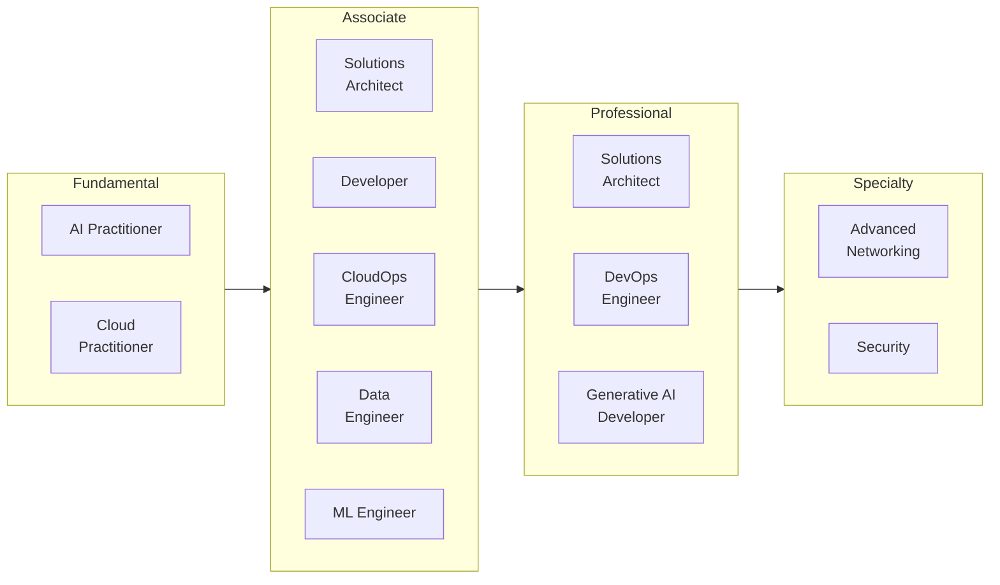
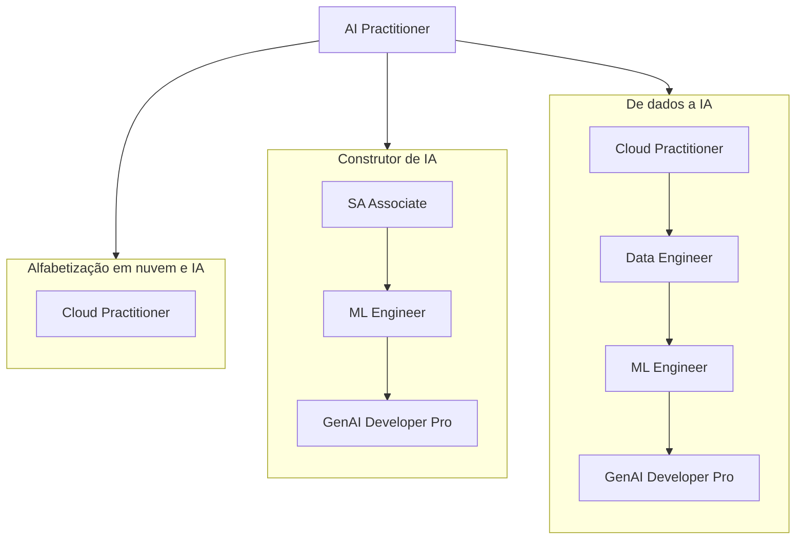
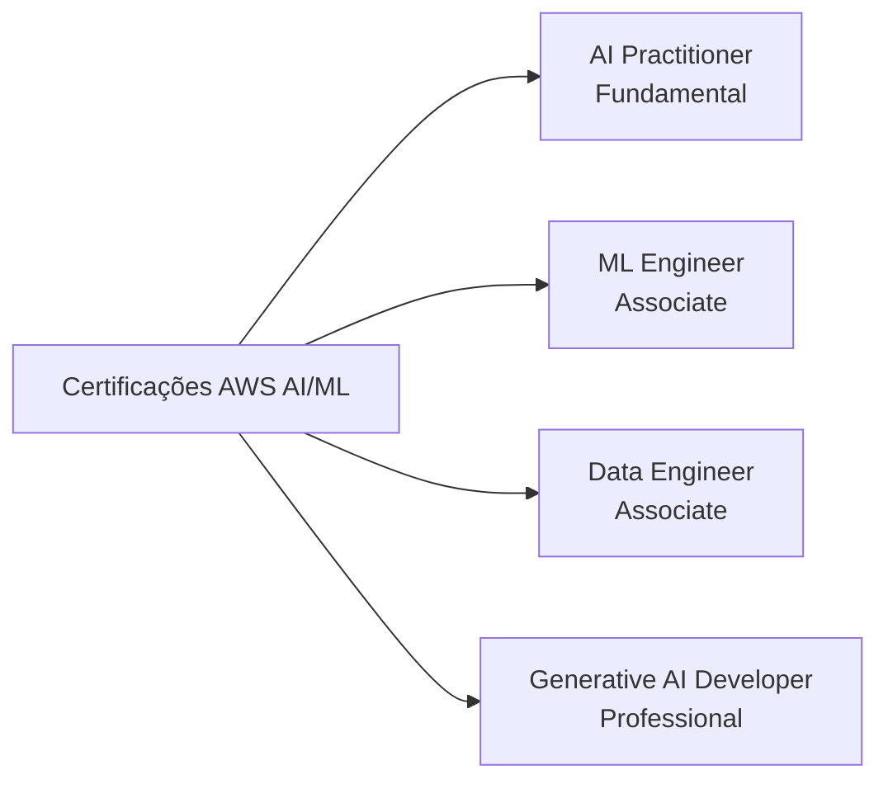
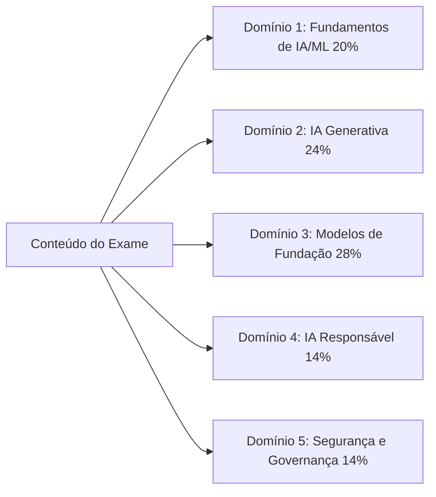
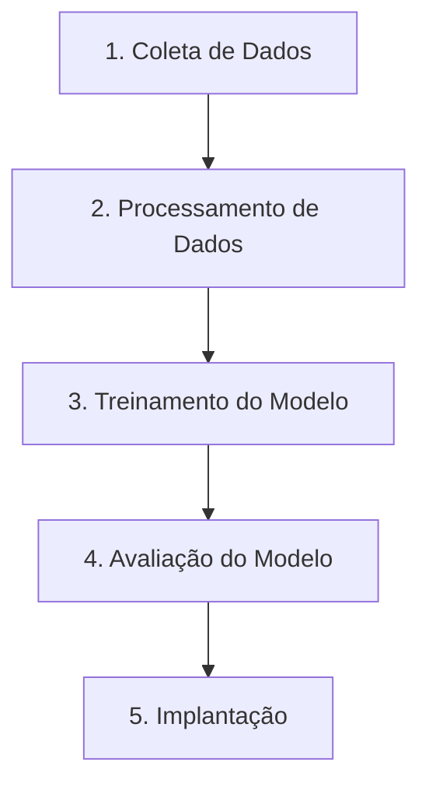

# Certificações AWS e o Exame AI Practitioner

## Introdução às Certificações AWS

As certificações AWS validam expertise em tecnologias de nuvem e IA que fundamentam a maior parte da computação empresarial atual. Elas são reconhecidas em todo o setor como um indicador de proficiência técnica e como um caminho estruturado para profissionais que desejam desenvolver as habilidades necessárias para usar a AWS com eficácia. Para organizações que passam por transformação digital, profissionais certificados trazem expertise que se traduz diretamente em entregas mais rápidas de projetos e menos erros onerosos.

Os benefícios vão além da credencial em si. Profissionais certificados relatam salários mais altos, mais pipeline de entrevistas e melhor posicionamento para promoções e atribuições de maior responsabilidade.[^006001] As habilidades por trás da certificação mapeiam desafios do mundo real, e o ciclo de recertificação mantém os detentores atualizados à medida que o portfólio AWS evolui.

## Trilha de Certificação AWS

A AWS organiza seu programa de certificação em quatro níveis: Fundamental, Associate, Professional e Specialty. A estrutura permite que os profissionais comecem com conhecimento amplo e progridam para expertise especializada alinhada com seus objetivos de carreira.



*Figura 0.6.1: O portfólio completo de certificações AWS em maio de 2026, agrupado por nível. Doze certificações ativas cobrem funções desde alfabetização em nuvem até engenharia profunda de IA. O AI Practitioner é uma das duas certificações fundamentais; o Generative AI Developer no nível Professional estende a trilha de IA/ML para públicos com habilidades mais aprofundadas.*

O diagrama mostra como a certificação **AI Practitioner** se encaixa ao lado do **Cloud Practitioner** no nível fundamental.[^006002] A certificação Machine Learning Specialty, que costumava ancorar a trilha técnica profunda de IA/ML, foi aposentada em 31 de março de 2026 e foi substituída pelo **Machine Learning Engineer - Associate** e pelo **Generative AI Developer - Professional**.[^006003] A AWS também renomeou o SysOps Administrator - Associate para **CloudOps Engineer - Associate** em 2025.

A escada de certificação AWS não é uma linha reta única. Diferentes funções seguem caminhos diferentes para as mesmas credenciais avançadas. O mapa abaixo esboça três rotas comuns com múltiplas passagens:



*Figura 0.6.2: Três caminhos representativos pelo portfólio de certificações AWS. A trilha de negócios e alfabetização em IA para no AI Practitioner. As trilhas de construtor de IA e de dados para IA convergem no Generative AI Developer - Professional, mas entram por diferentes credenciais de nível Associate.*

Um profissional pode parar após o AI Practitioner se o objetivo for a tomada de decisões informadas, e não a engenharia prática. Um profissional que planeja construir agentes de IA em produção normalmente se beneficia de pelo menos o Solutions Architect - Associate e o Machine Learning Engineer - Associate antes de avançar para o Generative AI Developer - Professional.

Para manter a validade da certificação, a AWS exige recertificação a cada três anos. Isso mantém os detentores atualizados com os serviços e as melhores práticas mais recentes.

## A Certificação AWS Certified AI Practitioner

### Visão Geral e Posicionamento

A certificação AWS Certified AI Practitioner aborda a necessidade crescente de alfabetização em IA nas organizações. Ela valida o conhecimento fundamental de inteligência artificial, aprendizado de máquina e IA generativa na AWS, com ênfase na aplicação prática nos negócios, e não nos detalhes de implementação.

A certificação é voltada para analistas de negócios, gerentes de produto, equipes de suporte de TI e outros profissionais que trabalham com IA, mas não necessariamente a constroem. Ao validar sua capacidade de avaliar opções de IA e comunicar-se com equipes de engenharia, ela ajuda as organizações a adotar capacidades de IA de forma mais informada e a evitar erros onerosos.

### Como ela Difere de Outras Certificações de IA/ML

As certificações de IA/ML da AWS agora formam um conjunto claramente hierarquizado. Elas visam públicos diferentes e diferentes níveis de habilidade.



*Figura 0.6.3: O mapa de certificações AWS de IA/ML. Cada certificação visa um público específico e uma profundidade de habilidade, desde alfabetização em negócios no nível fundamental até arquitetura de produção no nível Professional.*

A certificação **Generative AI Developer - Professional** (AIP-C01) valida expertise em projetar, construir e operacionalizar soluções de IA generativa na AWS em escala. Ela visa arquitetos e engenheiros sênior que possuem sistemas de IA de ponta a ponta.

O **Machine Learning Engineer - Associate** (MLA-C01) valida as habilidades necessárias para construir, implantar e monitorar modelos de ML em produção. Ele visa engenheiros e desenvolvedores de ML que possuem o lado de ML de uma aplicação.

O **Data Engineer - Associate** (DEA-C01) foca na infraestrutura de dados da qual os projetos de IA/ML dependem. Ele visa engenheiros que constroem e mantêm os pipelines e as camadas de armazenamento que alimentam as cargas de trabalho de IA.

Em contraste, o **AI Practitioner** foca em fundamentos e aplicação nos negócios. Ele foi projetado para profissionais que *usam* soluções de IA/ML, não as pessoas que as constroem. Analistas de negócios, gerentes de produto e equipes de suporte de TI com conhecimento técnico são o público principal.

Essa hierarquização em quatro níveis reflete o mercado de IA/ML maduro. Construir, implantar e governar IA agora requerem habilidades especializadas suficientes para que a AWS ofereça uma certificação separada para cada camada.

## Detalhes e Estrutura do Exame

### Visão Geral do Exame

O exame AWS Certified AI Practitioner (AIF-C01) contém 65 questões para serem concluídas em 90 minutos. Está disponível em inglês, japonês, coreano, português (Brasil) e chinês simplificado. A pontuação mínima para aprovação é 700 em uma escala de 100 a 1.000.

A versão atual do exame é a **V1.1**, publicada em 30 de abril de 2026, e passou a vigorar no exame aproximadamente um mês depois.[^006004] A V1.1 adicionou IA agêntica, Amazon Bedrock AgentCore, Strands Agents, Kiro e Amazon Quick ao material no escopo. Também removeu o Amazon MemoryDB. As mudanças nos objetivos são significativas o suficiente para que qualquer material de preparação mais antigo que meados de 2026 deva ser confrontado com o guia atual do exame.



*Figura 0.6.4: Pesos dos domínios do AIF-C01 V1.1. Os Domínios 2 e 3 juntos cobrem IA generativa e aplicações de modelos de fundação e respondem por mais da metade do conteúdo avaliado.*

Os modelos de fundação e a IA generativa juntos cobrem mais da metade do exame, o que é consistente com a rapidez com que esses tópicos migraram para o centro do trabalho de IA empresarial. O exame avalia sua capacidade de:

- Demonstrar compreensão dos conceitos de IA/ML e IA generativa e dos serviços AWS
- Avaliar casos de uso apropriados para diferentes tecnologias de IA
- Tomar decisões informadas sobre a implementação de soluções de IA
- Aplicar práticas de IA responsável e princípios de governança

### Público-Alvo

O candidato ideal tem aproximadamente seis meses de exposição a tecnologias de IA/ML na AWS. Você deve estar confortável em usar soluções de IA/ML, mas não se espera que você as construa por conta própria. Uma familiaridade funcional com os **principais serviços AWS** é essencial, incluindo Amazon EC2, Amazon S3, AWS Lambda, Amazon Bedrock e Amazon SageMaker AI.[^006005]

Você também deve ter uma compreensão funcional do **modelo de responsabilidade compartilhada da AWS**, do AWS Identity and Access Management (IAM) e dos modelos de preços de serviços AWS.

Diferentes profissionais podem se beneficiar desta certificação de diferentes formas:

*Tabela 0.6.1: Funções que se beneficiam do AWS Certified AI Practitioner.*

| Categoria de função | Pessoal-chave | Benefícios principais | Atividades-chave |
|---|---|---|---|
| Tomadores de decisão de negócios | Gerentes de projeto, analistas de negócios, executivos | Capacidades de planejamento estratégico e avaliação | Avaliar iniciativas de IA, avaliar viabilidade, desenvolver roteiros de adoção |
| Profissionais de tecnologia | Equipes de TI, arquitetos de nuvem, consultores técnicos | Conhecimento de integração e suporte técnico | Apoiar sistemas de IA, projetar soluções integradas, avaliação de plataformas |
| Especialistas de domínio | Especialistas do setor, profissionais de pesquisa, especialistas em QA | Visão de aplicação de IA específica ao domínio | Orientar implementações, garantir qualidade, explorar aplicações |
| Suporte e operações | Equipes de operações, gerentes de sucesso do cliente, redatores técnicos | Excelência operacional e capacidade de suporte | Gerenciar serviços de IA, documentar sistemas, desenvolver programas de treinamento |

A certificação não exige que você desenvolva modelos de IA/ML, implemente engenharia de dados, realize ajuste de hiperparâmetros, construa pipelines de IA/ML, conduza análises matemáticas de modelos ou desenvolva frameworks completos de governança. Essas são responsabilidades das certificações de nível mais alto.

### Estrutura e Pontuação do Exame

O exame contém 50 questões pontuadas mais 15 questões não pontuadas que a AWS usa para avaliar conteúdo futuro potencial. As questões não pontuadas são distribuídas ao longo do exame e não são identificadas. Não há penalidade por adivinhar, e questões não respondidas são pontuadas como incorretas.

O modelo de pontuação tem quatro características que vale a pena conhecer:

- Pontuação escalonada em uma faixa de 100 a 1.000
- Pontuação mínima de aprovação de 700
- Pontuação compensatória, o que significa que você não precisa passar em cada seção individualmente, apenas no exame como um todo
- Pontuação escalonada em múltiplos formulários de exame para manter a dificuldade justa entre as versões

Seu relatório de pontuação inclui o status geral de aprovação ou reprovação, a pontuação escalonada e feedback de desempenho em nível de seção que destaca pontos fortes e fracos. O feedback em nível de seção é uma orientação geral, não uma nota precisa por seção.

A duração padrão do exame é de 90 minutos. Falantes não nativos de inglês podem solicitar uma extensão de 30 minutos, chamada de acomodação "ESL +30", ao fazer o exame em inglês, totalizando 120 minutos.

## Tipos de Questões do Exame

O exame usa quatro formatos de questões. Conhecer os formatos com antecedência ajuda a alocar o tempo e evitar surpresas.

### Questões de Múltipla Escolha

As questões de múltipla escolha apresentam um cenário ou conceito com quatro respostas possíveis, uma correta e três distratoras. Os distratores são projetados para testar equívocos comuns e para validar que você entende a profundidade do tópico, não apenas a superfície.

Exemplo:

```
Qual serviço AWS fornece um ambiente totalmente gerenciado para construir, treinar e
implantar modelos de aprendizado de máquina em escala?

A) Amazon EC2     - Fornece servidores virtuais, mas requer configuração manual de ML
B) Amazon S3      - Oferece armazenamento, mas não capacidades de ML
C) Amazon SageMaker AI - Serviço gerenciado criado especificamente para fluxos de trabalho de ML
D) Amazon Redshift - Serviço de data warehouse sem recursos nativos de ML

Resposta Correta: C
```

As opções incorretas são serviços que se relacionam com fluxos de trabalho de ML de alguma forma, mas não fornecem a experiência completa de ML gerenciado.

### Questões de Resposta Múltipla

As questões de resposta múltipla exigem a seleção de duas ou mais respostas corretas entre cinco ou mais opções. Você deve identificar todas as respostas corretas para receber crédito. Crédito parcial não é concedido.

```
Quais DUAS capacidades o Amazon SageMaker Studio fornece? (Selecione DUAS)

A) Ambiente de desenvolvimento integrado (IDE) para ML
B) Implantação e monitoramento automatizados de modelos
C) Capacidade de computação bruta para treinamento
D) Armazenamento de objetos para conjuntos de dados
E) Gerenciamento de banco de dados relacional

Respostas Corretas: A, B
```

Ao ver uma questão de resposta múltipla:

1. Leia a questão com cuidado e observe exatamente quantas respostas são necessárias.
2. Avalie cada opção de forma independente antes de compará-las.
3. Verifique se selecionou o número exato de respostas especificado.
4. Confirme que todas as suas seleções estão corretas, pois crédito parcial não é concedido.

### Questões de Ordenação

As questões de ordenação testam sua compreensão de processos sequenciais. Elas apresentam três a cinco itens que devem ser organizados na ordem correta para concluir uma tarefa.



*Figura 0.6.5: Um fluxo de trabalho de ML canônico usado como exemplo de questão de ordenação. Cada etapa depende de sua antecessora, e a ordem reflete a prática padrão.*

Ao ver uma questão de ordenação, procure por:

- Dependências entre etapas
- Requisitos e pré-requisitos de serviços AWS
- Fluxos de trabalho padrão do setor
- Melhores práticas da AWS

### Questões de Correspondência

As questões de correspondência pedem que você associe itens em duas listas. Elas tipicamente apresentam três a sete prompts e uma lista correspondente de descrições, e exigem que você combine cada prompt com sua descrição correta.

Uma típica questão de correspondência:

```
Combine o serviço AWS de IA/ML com sua capacidade principal:

Prompts:
1. Amazon Bedrock
2. Amazon SageMaker Canvas
3. Amazon Comprehend
4. Amazon Rekognition

Descrições:
A. Construção e inferência de modelos de ML sem código
B. Processamento de linguagem natural e análise de texto
C. Acesso e implantação de modelos de fundação
D. Visão computacional e análise de imagens e vídeos

Correspondências corretas: 1-C, 2-A, 3-B, 4-D
```

Ao abordar questões de correspondência:

1. Leia todos os itens em ambas as listas com cuidado antes de fazer qualquer correspondência.
2. Bloqueie as correspondências óbvias primeiro, depois reduza o restante por eliminação.
3. Use o processo de eliminação para os pares mais difíceis restantes.
4. Verifique cada correspondência em relação ao seu conhecimento da AWS.

## Dicas de Preparação para o Exame

### Gestão do Tempo

A gestão eficaz do tempo importa mais do que o conhecimento bruto para muitos candidatos. Algumas diretrizes práticas:

1. Anote a contagem de questões e o tempo permitido no início.
2. Mire em aproximadamente 80 segundos por questão na primeira passagem.
3. Não gaste mais de dois minutos em nenhuma questão única.
4. Marque as questões difíceis e revisite-as após a primeira passagem.
5. Reserve pelo menos cinco a dez minutos no final para revisão.

Se inglês não é seu primeiro idioma, a AWS permite que você solicite 30 minutos extras de tempo de exame como acomodação. A solicitação deve ser enviada por meio de sua conta de Certificação AWS antes de agendar o exame, e uma vez aprovada se aplica a todos os exames AWS que você agendar a partir dessa conta.

### Áreas de Foco

O exame enfatiza a aplicação prática em vez da memorização. Áreas-chave:

- Conceitos e terminologia de IA/ML, incluindo IA agêntica, RAG e MCP
- O serviço de IA certo para o problema de negócio certo
- Capacidades e limitações de serviços AWS, especialmente Amazon Bedrock e a família AgentCore
- Princípios de IA responsável, incluindo viés, equidade, transparência e explicabilidade
- Segurança, incluindo Amazon Bedrock Guardrails e a responsabilidade compartilhada da AWS para IA

As questões testam sua capacidade de aplicar conhecimento em cenários realistas, não sua capacidade de recitar uma definição.

### Recursos de Preparação

A AWS oferece uma variedade de recursos de preparação por meio do AWS Skill Builder, incluindo conteúdo gratuito e por assinatura.[^006006]

*Tabela 0.6.2: Principais recursos de preparação para certificações AWS.*

| Tipo de recurso | Descrição | Melhor para |
|---|---|---|
| Treinamento digital | Cursos online em ritmo próprio | Compreensão de conceitos fundamentais |
| Treinamento em sala de aula | Sessões com instrutor | Aprendizado interativo e orientação direta |
| Exames práticos | Questões e cenários de amostra | Preparação para o exame e análise de lacunas |
| Documentação | Guias técnicos e whitepapers | Aprofundamento de conhecimento técnico |
| Laboratórios práticos | Exercícios práticos no console AWS | Experiência no mundo real e validação de habilidades |

Para o AIF-C01 especificamente, foque nos fundamentos de IA/ML, nos domínios de GenAI e FM, e no novo material de IA agêntica adicionado na V1.1. O tempo prático com **Amazon Bedrock**, o playground do modelo e o **Amazon Bedrock AgentCore** é o único melhor retorno sobre o tempo de estudo uma vez que os fundamentos estejam em ordem.

## Conclusão

A certificação AWS Certified AI Practitioner valida o conhecimento essencial sobre IA moderna na AWS: ML clássico, IA generativa, IA agêntica e as práticas de IA responsável que cada vez mais as acompanham. Projetada para analistas de negócios, gerentes de produto e outros profissionais que *usam* IA em vez de construí-la, a certificação demonstra sua capacidade de:

- Tomar decisões informadas sobre adoção de tecnologia de IA
- Comunicar-se com equipes técnicas sobre iniciativas de IA
- Identificar os casos de uso certos para os serviços de IA certos
- Aplicar práticas de IA responsável em sua organização
- Navegar no cenário de IA em rápida evolução na AWS

Ao obter essa certificação, você estabelece uma base para compreender a IA enquanto se concentra no valor para os negócios em vez da implementação técnica. Isso a torna uma credencial útil à medida que mais organizações passam da experimentação de IA para a produção de IA por meio de serviços como Amazon Bedrock, Amazon Bedrock AgentCore, Amazon SageMaker AI e Kiro.

As certificações AWS continuam sendo um caminho para validar expertise em nuvem e acelerar o crescimento profissional à medida que a IA migra para as operações de negócios convencionais. A certificação AWS Certified AI Practitioner conecta funções técnicas e de negócios durante um período de rápida adoção de IA, e a atualização V1.1 traz o conteúdo do exame para refletir onde o mercado realmente está em 2026.

[^006001]: AWS Certifications. URL: [https://aws.amazon.com/certification/](https://aws.amazon.com/certification/)
    
[^006002]: AWS Certified AI Practitioner. URL: [https://aws.amazon.com/certification/certified-ai-practitioner/](https://aws.amazon.com/certification/certified-ai-practitioner/)
    
[^006003]: AWS Certified Machine Learning Engineer Associate. URL: [https://aws.amazon.com/certification/certified-machine-learning-engineer-associate/](https://aws.amazon.com/certification/certified-machine-learning-engineer-associate/)
    
[^006004]: AIF-C01 Exam Guide Revisions. URL: [https://docs.aws.amazon.com/aws-certification/latest/ai-practitioner-01/aif-01-revisions.html](https://docs.aws.amazon.com/aws-certification/latest/ai-practitioner-01/aif-01-revisions.html)
    
[^006005]: AIF-C01 Target Candidate Description. URL: [https://docs.aws.amazon.com/aws-certification/latest/ai-practitioner-01/ai-practitioner-01.html](https://docs.aws.amazon.com/aws-certification/latest/ai-practitioner-01/ai-practitioner-01.html)
    
[^006006]: AWS Skill Builder. URL: [https://skillbuilder.aws/](https://skillbuilder.aws/)
