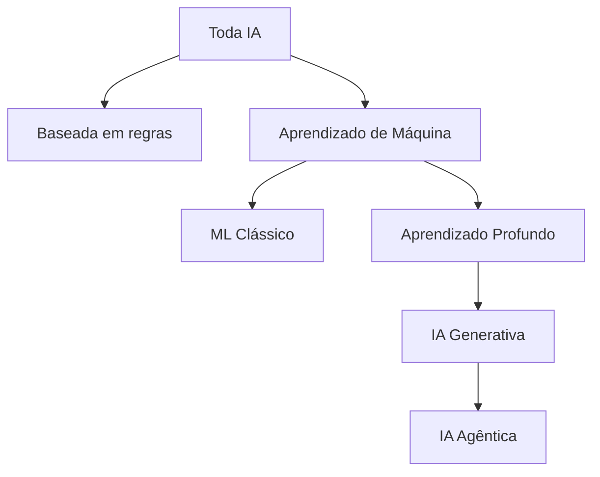
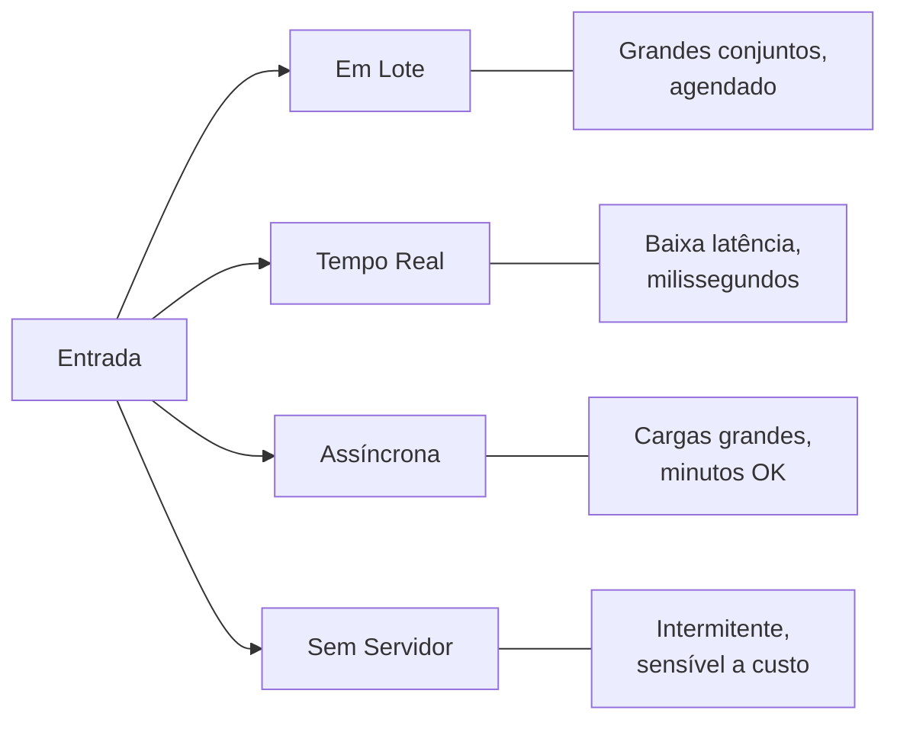
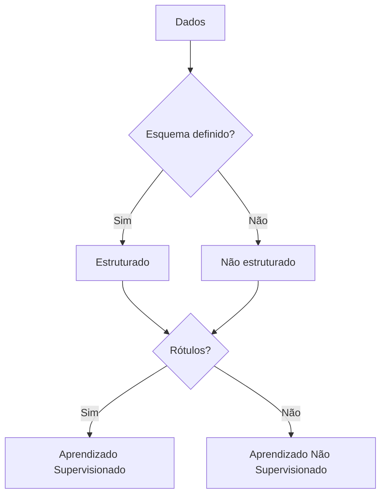
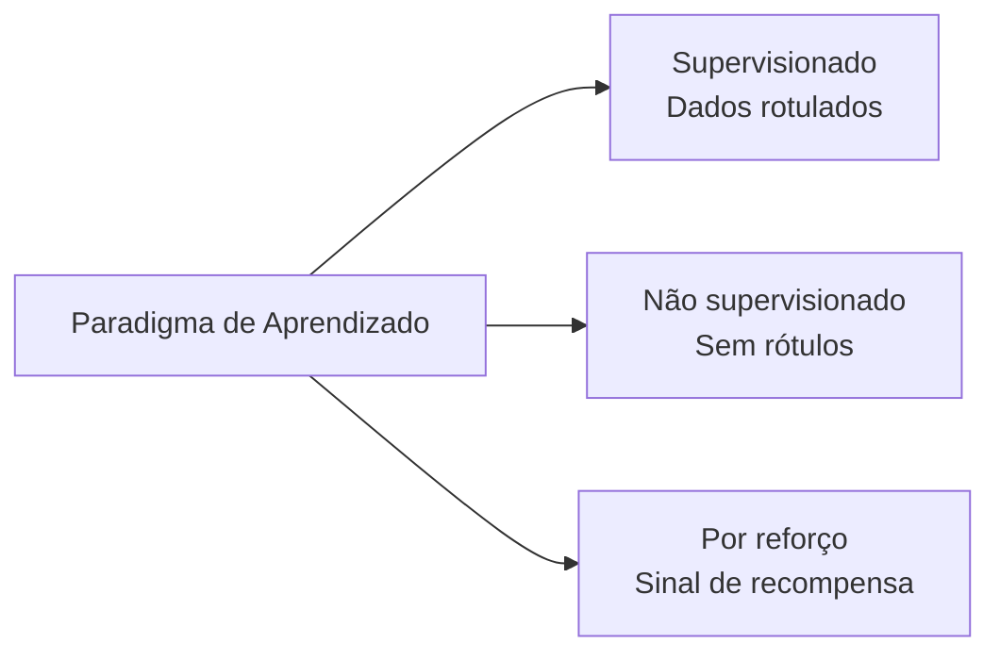

## Declaração de Tarefa 1.1: Explicar os conceitos e terminologias básicos de IA

O vocabulário de IA é a linguagem compartilhada entre profissionais de negócios e as equipes de engenharia com as quais trabalham. Antes que um gerente de produto possa aprovar a implantação de um modelo ou que um executivo possa avaliar uma proposta de fornecedor de IA, todos à mesa precisam das mesmas definições para termos como treinamento, inferência, viés e equidade. Esta declaração de tarefa estabelece esse vocabulário comum e mapeia cada termo para os serviços AWS e objetivos do exame onde ele aparece.[^101001]

### 1.1.1 Definir termos básicos de IA

Entender IA começa com definições precisas. O exame testa se você consegue distinguir termos vizinhos uns dos outros, e as apostas para os negócios são reais porque a linguagem imprecisa leva a expectativas desalinhadas entre as partes interessadas técnicas e não técnicas.

**Inteligência artificial (IA)** é o amplo campo da ciência da computação preocupado com a construção de sistemas capazes de executar tarefas que normalmente exigiriam raciocínio humano, como reconhecer imagens, entender linguagem ou tomar decisões sob incerteza.[^101002] A IA não é uma única tecnologia; é uma categoria que inclui muitas abordagens, apenas algumas das quais envolvem aprendizado a partir de dados.

**Aprendizado de máquina (ML)** é um subconjunto de IA no qual um sistema aprende padrões a partir de dados em vez de seguir regras escritas explicitamente por um programador.[^101003] Por exemplo, um sistema tradicional de detecção de fraudes baseado em regras pode sinalizar qualquer transação acima de um valor fixo em dinheiro; um sistema baseado em ML, por sua vez, aprende com milhares de casos históricos de fraude e generaliza padrões que nenhuma regra fixa poderia capturar.

**Aprendizado profundo** é um subconjunto de ML que usa *redes neurais* com muitas camadas para representar padrões cada vez mais abstratos.[^101004] O termo "profundo" refere-se à profundidade dessas camadas. O aprendizado profundo alimenta a maior parte dos sistemas modernos de reconhecimento de imagens, reconhecimento de fala e compreensão de linguagem.

Uma **rede neural** é um modelo computacional livremente inspirado na estrutura dos neurônios biológicos. Os dados passam por camadas de nós interconectados, cada um dos quais aplica uma transformação matemática. A rede aprende quais transformações produzem saídas precisas ajustando seus parâmetros internos durante o treinamento. Redes rasas têm duas ou três camadas; redes profundas podem ter centenas.

**Visão computacional (VC)** é o ramo da IA que permite que as máquinas interpretem imagens e vídeos.[^101006] Sistemas de visão computacional podem classificar objetos em uma foto, detectar defeitos em uma linha de produção ou contar veículos em um estacionamento. Na AWS, as capacidades de visão computacional estão disponíveis por meio do **Amazon Rekognition** para análise de imagens e vídeos.[^101007]

**Processamento de linguagem natural (PLN)** é o ramo da IA que permite que as máquinas leiam, entendam e gerem linguagem humana.[^101008] As tarefas de PLN incluem análise de sentimento, reconhecimento de entidades nomeadas, tradução e sumarização de documentos. A AWS disponibiliza capacidades de PLN por meio de serviços como **Amazon Comprehend** para análise de texto, **Amazon Translate** para tradução de idiomas e **Amazon Transcribe** para conversão de fala em texto.[^101009] Esses serviços criados para finalidades específicas são a escolha certa para tarefas de alto volume e bem definidas, onde o custo por chamada e a latência importam. Para trabalhos de linguagem em aberto, como geração de texto longo, sumarização complexa ou raciocínio em múltiplas etapas, **modelos de linguagem grande (LLMs)** acessados por meio do Amazon Bedrock são a melhor opção; o Domínio 2 deste livro os aborda em profundidade.

Um **algoritmo** é o procedimento matemático usado para treinar um modelo a partir de dados. Algoritmos de ML comuns incluem regressão linear para prever valores contínuos, árvores de decisão para classificação e gradient boosting para dados tabulares estruturados. A escolha do algoritmo determina como um modelo generaliza a partir dos dados de treinamento para novas entradas.

Um **modelo** é o artefato produzido quando um algoritmo é aplicado a um conjunto de dados de treinamento. O modelo captura os padrões que o algoritmo encontrou e pode então ser usado para fazer previsões em dados novos e não vistos. Pense no algoritmo como a receita e no modelo como o prato final.

**Treinamento** é o processo de expor um modelo a dados rotulados ou não rotulados para que seus parâmetros internos se ajustem para minimizar o erro de previsão. O treinamento é computacionalmente intensivo e geralmente é executado em infraestrutura acelerada por GPU. Na AWS, os trabalhos de treinamento são executados com mais frequência no **Amazon SageMaker AI**.

**Inferência** (também chamada de *inference* ou *scoring*) é o processo de usar um modelo treinado para gerar uma previsão ou saída para novos dados de entrada.[^101014] O treinamento acontece uma vez ou periodicamente; a inferência acontece continuamente sempre que um usuário ou sistema solicita uma previsão.

**Viés** em IA refere-se a erros sistemáticos nas saídas de um modelo que surgem de dados de treinamento falhos, design de algoritmo falho ou enquadramento de problema falho.[^101015] Por exemplo, um modelo de contratação treinado em dados históricos de uma empresa com um histórico de contratação tendencioso pode reproduzir e amplificar esses padrões. O viés é uma preocupação central na governança de IA responsável.

**Equidade** é a propriedade de um modelo que produz resultados equitativos em grupos demográficos definidos por características como gênero, raça ou idade. Equidade e viés estão intimamente relacionados: um modelo é considerado justo quando seu viés em relação a qualquer grupo protegido está abaixo de um limite aceitável. A AWS fornece o **Amazon SageMaker Clarify** para ajudar as equipes a detectar e medir o viés nos dados de treinamento e nos modelos treinados.[^101017]

**Ajuste** descreve o quão bem os padrões aprendidos por um modelo correspondem à estrutura subjacente dos dados.[^101018] Diz-se que um modelo que se ajusta muito de perto aos seus dados de treinamento apresenta *sobreajuste*: ele memoriza o ruído em vez de generalizar padrões, e sua acurácia em novos dados cai acentuadamente. Diz-se que um modelo muito simples para capturar padrões reais apresenta *subajuste*: ele tem baixo desempenho tanto nos dados de treinamento quanto em novos dados. Um bom ajuste fica entre esses extremos.

Um **modelo de linguagem grande (LLM)** é um modelo de aprendizado profundo, especificamente uma rede neural treinada em um corpus massivo de texto, que pode gerar, sumarizar, traduzir e raciocinar sobre a linguagem em um nível de fluência e flexibilidade não possível com técnicas de PLN anteriores.[^101019] LLMs como Amazon Titan, Anthropic Claude e Meta Llama sustentam a maioria das aplicações modernas de IA generativa. Sua escala, medida em bilhões de parâmetros, lhes dá ampla capacidade, mas também os torna caros para treinar do zero.

**IA generativa (GenAI)** é uma classe de IA que produz novo conteúdo, como texto, imagens, áudio ou código, em resposta a um prompt.[^101020] Os sistemas de GenAI são tipicamente construídos em LLMs ou em modelos generativos de grande escala similares. Ao contrário dos modelos de ML anteriores que classificam ou preveem um único valor, um sistema de IA generativa produz uma saída de comprimento variável e legível por humanos. A IA generativa e a IA agêntica foram adicionadas ao guia do exame na v1.1 para refletir o quanto ambas foram adotadas em projetos empresariais desde a publicação do guia original.

**IA agêntica** é uma extensão da IA generativa na qual um modelo recebe um objetivo e um conjunto de ferramentas e, em seguida, planeja e executa autonomamente ações de múltiplas etapas para atingir esse objetivo sem exigir aprovação humana em cada etapa.[^101021] O mecanismo de raciocínio ainda é um modelo generativo; a IA agêntica adiciona o loop de planejamento, o acesso a ferramentas e a memória que transformam a geração pontual em ação orientada a objetivos. Um sistema de IA agêntica pode navegar em uma base de conhecimento, chamar APIs externas, escrever código e verificar seus resultados em várias etapas sequenciais antes de retornar uma resposta. Isso é qualitativamente diferente de uma interação de pergunta e resposta em turno único. A AWS suporta IA agêntica por meio dos Agentes **Amazon Bedrock** e do **Amazon Bedrock AgentCore**, que fornecem a infraestrutura para orquestração em múltiplas etapas, memória e uso de ferramentas.[^101022]

### 1.1.2 Diferenças entre IA, ML, GenAI, aprendizado profundo e IA agêntica

Esses cinco termos descrevem uma hierarquia aninhada, não tecnologias separadas. A confusão sobre seus relacionamentos é uma das fontes mais comuns de miscomunicação no planejamento de projetos de IA. Cada termo fica inteiramente dentro do escopo do termo acima dele.

**Inteligência artificial** é o termo mais amplo. Inclui qualquer técnica que faça um sistema de computador se comportar de uma forma que se assemelhe ao raciocínio humano. Isso inclui sistemas especialistas baseados em regras da década de 1970, ML estatístico da década de 1990 e as redes neurais de hoje.

**Aprendizado de máquina** é um subconjunto de IA que limita a definição a sistemas que aprendem com dados. Um filtro de fraude baseado em regras escrito por um programador é IA, mas não é ML. Um modelo de fraude treinado em históricos de transações é tanto IA quanto ML.

**Aprendizado profundo** é um subconjunto de ML que usa redes neurais em camadas. Um modelo de regressão linear é ML, mas não é aprendizado profundo. Uma rede neural convolucional que classifica radiografias de tórax é ML, aprendizado profundo e IA.

**IA generativa** é um subconjunto do aprendizado profundo que se preocupa especificamente em gerar novo conteúdo. Nem todo aprendizado profundo é generativo: um modelo de aprendizado profundo que classifica imagens em dez categorias é discriminativo, não generativo. Um modelo que produz uma imagem fotorrealista a partir de uma descrição de texto é IA generativa.

**IA agêntica** é um padrão arquitetural em camadas sobre a IA generativa. Um sistema agêntico usa um LLM ou outro modelo generativo como seu mecanismo de raciocínio e então adiciona um loop de planejamento, acesso a ferramentas e memória para que possa agir ao longo de múltiplas etapas. Um chatbot de turno único usando um LLM é IA generativa, mas não IA agêntica. Um sistema que recebe um objetivo de alto nível, o divide em subtarefas, usa ferramentas para executar cada subtarefa e sintetiza os resultados é IA agêntica.

*Figura 1.1.1: Aninhamento de subcampos de IA. Cada nó é um subconjunto adequado de seu pai; mover para baixo na árvore adiciona restrições e capacidades em vez de substituir o conceito pai.*

O exame frequentemente testa os casos limítrofes. Um candidato que trata "IA" e "ML" como sinônimos, ou que confunde "IA generativa" com "aprendizado profundo", lerá mal as questões de cenário que dependem de saber qual subconjunto se aplica. A implicação prática para os negócios é igualmente concreta: uma equipe que está implantando um sistema de IA agêntica enfrenta considerações diferentes de governança, custo e segurança do que uma equipe executando um modelo de classificação clássico de ML, porque os sistemas agênticos tomam ações no mundo real em vez de produzir saídas estáticas.

*Tabela 1.1.1: Distinções-chave entre subcampos de IA*

| Termo | Categoria pai | Definido por | Exemplo típico na AWS |
|---|---|---|---|
| Inteligência Artificial | Nenhuma | Comportamento semelhante a raciocínio | Qualquer serviço de IA/ML da AWS |
| Aprendizado de Máquina | IA | Aprende com dados | Amazon SageMaker AI |
| Aprendizado Profundo | ML | Redes neurais em camadas | SageMaker com instâncias GPU |
| IA Generativa | Aprendizado Profundo | Produz novo conteúdo | Amazon Bedrock |
| IA Agêntica | IA Generativa | Ação autônoma em múltiplas etapas | Bedrock Agents, Bedrock AgentCore |

Uma nuance digna de nota: alguns pesquisadores classificam a IA agêntica como um padrão arquitetural em vez de um subcampo tecnológico, porque um sistema agêntico é composto de tecnologias existentes (LLMs, ferramentas, lógica de orquestração) em vez de ser um novo tipo de modelo. Para fins do exame, trate a IA agêntica como a camada mais especializada da hierarquia.

### 1.1.3 Tipos de inferência

Depois que um modelo é treinado, ele deve ser implantado para que possa gerar previsões. A forma como essas previsões são solicitadas e retornadas define o padrão de inferência. O guia do exame v1.1 adicionou inferência assíncrona e sem servidor à lista porque a AWS expandiu suas opções de inferência gerenciada após o lançamento do exame original.

Os quatro padrões padrão de inferência são em lote, em tempo real, assíncrono e sem servidor. Cada um resolve uma combinação diferente de requisitos de taxa de transferência e latência, e escolher o padrão errado para um caso de uso é uma das causas mais comuns de problemas de custo e desempenho em sistemas de IA de produção.

**Inferência em lote** processa um grande conjunto de entradas em um único trabalho, normalmente em um agendamento.[^101024] O sistema coleta entradas ao longo de um período de tempo, executa o modelo em todas elas de uma vez e armazena os resultados para uso posterior. Um varejista que gera recomendações de produtos durante a noite para cada cliente em seu banco de dados está usando inferência em lote. Na AWS, o Batch Transform do **Amazon SageMaker AI** executa trabalhos de inferência em lote em dados armazenados no **Amazon S3**, dimensionando a frota de computação durante a duração do trabalho e desligando-a quando completo.

**Inferência em tempo real** processa uma única solicitação de entrada e retorna uma previsão em milissegundos.[^101026] O modelo é implantado em um endpoint persistente que permanece ativo, aceitando solicitações de aplicações. Um sistema de detecção de fraudes que deve pontuar uma transação de cartão de crédito antes que o terminal de pagamento do cliente expire requer inferência em tempo real. Na AWS, os endpoints em tempo real do SageMaker AI hospedam modelos atrás de um endpoint HTTPS persistente e podem aplicar *Auto Scaling* para lidar com volumes variáveis de solicitações.

**Inferência assíncrona** (às vezes chamada de inferência *em fila* ou *quase em lote* porque compartilha o modelo de processamento em fila de trabalhos em lote enquanto opera uma solicitação de cada vez) aceita uma solicitação, a enfileira e retorna o resultado por meio de um mecanismo de callback ou polling em vez de dentro da janela de tempo limite da solicitação original.[^101028] Esse padrão é apropriado quando as entradas são grandes ou quando o modelo leva mais tempo para processar do que uma solicitação da web pode razoavelmente esperar. Por exemplo, um sistema de inteligência de documentos que processa contratos de múltiplas páginas pode levar de 30 a 90 segundos por documento: uma chamada da web síncrona expiraria, mas um padrão assíncrono permite que o sistema chamador verifique o resultado mais tarde. Na AWS, os endpoints de Inferência Assíncrona do SageMaker AI aceitam cargas grandes, as enfileiram e gravam as saídas no S3 para recuperação.

**Inferência sem servidor** executa o modelo sob demanda sem exigir que um endpoint persistente seja pré-provisionado.[^101030] A computação subjacente reduz para zero quando ociosa, eliminando o custo fixo de um endpoint em execução. A inferência sem servidor é adequada para cargas de trabalho intermitentes ou imprevisíveis onde o custo da computação ociosa excede o benefício da baixa latência. Na AWS, o SageMaker AI Serverless Inference provisiona e desprovisiona computação automaticamente, com a compensação de que a primeira solicitação após um período de inatividade pode experimentar um atraso de *inicialização a frio*.

*Figura 1.1.2: Seleção de padrão de inferência. A escolha depende da combinação de volume de entrada, latência aceitável e restrições de custo para o caso de uso específico.*

*Tabela 1.1.2: Comparação de padrões de inferência*

| Padrão | Latência | Tamanho da entrada | Modelo de custo | Melhor para |
|---|---|---|---|---|
| Em lote | Minutos a horas | Muito grande | Por trabalho | Pontuação noturna, relatórios em massa |
| Tempo real | Milissegundos | Pequena | Por hora de endpoint | Detecção de fraudes, recomendações ao vivo |
| Assíncrona | Segundos a minutos | Grande | Por solicitação | Processamento de documentos, análise de vídeo |
| Sem servidor | Segundos (frio), milissegundos (quente) | Pequena a média | Por inferência | APIs de baixo tráfego, uso intermitente |

Entender as diferenças de custo importa para os profissionais de negócios: um endpoint em tempo real persistente acumula custo ao redor do relógio, independentemente de receber tráfego ou não, enquanto a inferência sem servidor cobra apenas pelo uso real. Para um sistema que processa solicitações apenas durante o horário comercial, a diferença de custo pode ser substancial.

### 1.1.4 Tipos de dados em modelos de IA

Os modelos de IA são moldados pelos dados de que aprendem, e os dados vêm em muitas formas. O tipo de dados que um modelo espera determina quais algoritmos são apropriados, quais etapas de pré-processamento são necessárias e como o modelo pode ser implantado. Um profissional de negócios que consegue descrever os dados em sua organização nesses termos pode se comunicar muito mais efetivamente com uma equipe de ciência de dados.

A primeira distinção fundamental é entre **dados rotulados** e **dados não rotulados**.[^101032] Os dados rotulados incluem tanto a entrada (por exemplo, uma imagem de um gato) quanto a resposta correta (o rótulo "gato"). Os dados não rotulados incluem apenas a entrada, sem resposta associada. Os conjuntos de dados rotulados são mais caros de produzir porque exigem anotação humana, mas são necessários para o aprendizado supervisionado. Os conjuntos de dados não rotulados são abundantes e baratos, mas exigem técnicas não supervisionadas ou autossupervisionadas para extrair padrões.

Além da distinção rotulado-não rotulado, os dados também variam por estrutura e formato:

- **Dados tabulares** são organizados em linhas e colunas, como em uma planilha ou tabela de banco de dados relacional. Cada coluna representa uma característica (por exemplo, idade, saldo da conta ou valor da transação) e cada linha representa uma observação. Algoritmos de ML clássicos como árvores com gradient boosting funcionam especialmente bem em dados tabulares.
- **Dados de séries temporais** são uma sequência de medições registradas em intervalos de tempo regulares. Preços de ações, utilização de CPU do servidor e leituras de frequência cardíaca de pacientes são dados de séries temporais. Modelos treinados em dados de séries temporais aprendem padrões temporais como tendências, sazonalidade e anomalias.
- **Dados de imagem** consistem em valores de pixels organizados em uma grade bidimensional, potencialmente com múltiplos canais de cores. Os modelos de visão computacional aprendem a detectar bordas, formas, texturas e objetos a partir de dados de imagem. Os requisitos de volume são altos: um conjunto de dados de imagens significativo normalmente contém dezenas de milhares a milhões de exemplos rotulados.
- **Dados de texto** consistem em sequências de palavras ou caracteres em uma linguagem natural. Os modelos de PLN aprendem gramática, semântica e associações factuais a partir do texto. Os modelos de linguagem grande são treinados em corpora de texto contendo centenas de bilhões de palavras.

Uma segunda distinção ortogonal se aplica a todos esses formatos: **dados estruturados** têm um esquema bem definido, como uma tabela de banco de dados com colunas tipadas.[^101037] **Dados não estruturados** não têm esquema predefinido: incluem texto livre, imagens, áudio e vídeo. Os dados estruturados são mais diretamente utilizáveis pelos algoritmos de ML clássicos; os dados não estruturados normalmente requerem um modelo baseado em rede neural ou uma etapa de pré-processamento para extrair recursos estruturados.

*Tabela 1.1.3: Tipos de dados em modelos de IA*

| Tipo de dados | Estrutura | Abordagem típica de ML | Exemplo de serviço AWS |
|---|---|---|---|
| Tabular | Estruturado | Gradient boosting, modelos lineares | Algoritmos integrados do SageMaker AI |
| Séries temporais | Estruturado | Modelos de sequência, LSTM, DeepAR | SageMaker AI DeepAR |
| Imagem | Não estruturado | Redes neurais convolucionais | Amazon Rekognition, SageMaker AI |
| Texto | Não estruturado | Modelos Transformer, LLMs | Amazon Comprehend, Amazon Bedrock |

O **Amazon SageMaker Ground Truth** ajuda as equipes a criar conjuntos de dados rotulados combinando rotulagem automatizada com revisão humana, reduzindo o tempo e o custo da anotação em escala.[^101038]

Na prática, projetos reais de IA frequentemente combinam tipos de dados. Um modelo de rotatividade de clientes pode usar dados tabulares de CRM junto com texto de tickets de suporte, exigindo que a equipe construa ou selecione modelos que possam lidar com ambas as modalidades. Saber quais tipos de dados a empresa já tem em abundância ajuda a restringir quais abordagens de IA são viáveis.

*Figura 1.1.3: Árvore de decisão de tipo de dados. A estrutura e a disponibilidade de rótulos juntas determinam qual abordagem de aprendizado é viável para um determinado conjunto de dados.*

### 1.1.5 Tipos de aprendizado de IA/ML

A forma como um modelo aprende com dados é chamada de *paradigma de aprendizado*. O paradigma de aprendizado determina que tipo de dados o modelo requer, como ele generaliza e que tipos de problemas ele pode resolver. O exame testa todos os três paradigmas principais: supervisionado, não supervisionado e por reforço.

**Aprendizado supervisionado** treina um modelo em um conjunto de dados no qual cada entrada é emparelhada com um rótulo de saída correto.[^101039] O modelo aprende a mapear entradas para saídas minimizando a diferença entre suas previsões e os rótulos conhecidos. Este é o paradigma mais comumente usado na IA comercial porque produz modelos que são diretos de avaliar: você mede a acurácia em um conjunto de testes retido de exemplos rotulados.

O aprendizado supervisionado abrange dois tipos principais de problema. *Regressão* prevê um valor numérico contínuo, como a receita esperada de um cliente no próximo trimestre. *Classificação* atribui uma entrada a uma de um conjunto discreto de categorias, como rotular um e-mail como spam ou não spam. A maioria dos sistemas de recomendação de produtos, detecção de fraudes e diagnóstico médico usa modelos de classificação ou regressão supervisionados.

**Aprendizado não supervisionado** treina um modelo em dados sem rótulos.[^101041] O modelo deve encontrar estrutura nos dados por conta própria, sem orientação sobre qual é a resposta correta. A técnica não supervisionada mais comum é o *agrupamento*, no qual o modelo agrupa entradas semelhantes. Por exemplo, uma equipe de marketing pode usar agrupamento não supervisionado em históricos de compras de clientes para descobrir segmentos naturais de clientes que podem então receber campanhas direcionadas. Outra técnica comum é a *redução de dimensionalidade*, que comprime dados de alta dimensionalidade em menos dimensões preservando sua estrutura mais importante, tornando mais fácil visualizá-los ou alimentá-los em um modelo posterior.

**Aprendizado por reforço** treina um agente para tomar ações em um ambiente recompensando-o por bons resultados e penalizando-o por resultados ruins.[^101043] O agente aprende uma *política*: um mapeamento do estado observado para a ação que maximiza a recompensa cumulativa ao longo do tempo. O aprendizado por reforço é o paradigma por trás dos sistemas de IA que jogam jogos e cada vez mais por trás de aplicações industriais como controle robótico, otimização da cadeia de suprimentos e sistemas de recomendação de conteúdo personalizado que otimizam para engajamento de longo prazo em vez de cliques imediatos.

*Tabela 1.1.4: Comparação de paradigmas de aprendizado de IA/ML*

| Paradigma | Dados de entrada | Aprende | Casos de uso comuns |
|---|---|---|---|
| Supervisionado | Rotulado | Mapeamento entrada-saída | Classificação, regressão, detecção de fraudes |
| Não supervisionado | Não rotulado | Estrutura oculta | Segmentação de clientes, detecção de anomalias |
| Por reforço | Sinais de recompensa | Política ótima | Robótica, jogos, personalização |

Dois paradigmas de aprendizado adicionais aparecem nas margens do escopo do exame. O *aprendizado semissupervisionado* combina uma pequena quantidade de dados rotulados com uma grande quantidade de dados não rotulados, o que é útil quando a rotulagem é cara.[^101045] O *aprendizado autossupervisionado* gera rótulos automaticamente a partir dos próprios dados, por exemplo, mascarando uma palavra em uma frase e treinando o modelo para prever a palavra faltante. O aprendizado autossupervisionado é a técnica por trás da fase de pré-treinamento da maioria dos modelos de linguagem grande modernos.

*Figura 1.1.4: Visão geral do paradigma de aprendizado. Os três paradigmas centrais diferem no tipo de feedback que o modelo recebe durante o treinamento.*

A escolha do paradigma de aprendizado é uma decisão prática de negócio, não apenas técnica. O aprendizado supervisionado requer dados rotulados, que custam dinheiro para produzir. O aprendizado não supervisionado evita esse custo, mas não pode otimizar diretamente para um resultado de negócio específico. O aprendizado por reforço pode otimizar para objetivos complexos de múltiplas etapas, mas requer um design mais cuidadoso da função de recompensa e é mais difícil de auditar quanto a equidade e viés. Um profissional de negócios que entende essas compensações pode fazer as perguntas certas quando uma equipe de ciência de dados propõe uma abordagem.

## Questões de autoavaliação

**Questão 1.** Uma empresa varejista está construindo um sistema que categoriza automaticamente os tickets de suporte ao cliente em um dos cinco tipos de problemas (faturamento, devoluções, envio, qualidade do produto, outros). A equipe tem um conjunto de dados de 50.000 tickets que já foram revisados e categorizados por agentes humanos. Qual tipo de paradigma de aprendizado de ML é mais apropriado para este caso de uso?

A. Aprendizado não supervisionado, porque o modelo deve encontrar estrutura em dados de texto sem orientação humana.
B. Aprendizado por reforço, porque o modelo deve aprender uma política para encaminhar tickets para a equipe correta.
C. Aprendizado supervisionado, porque a equipe tem exemplos rotulados e a tarefa é classificar novas entradas em categorias predefinidas.
D. Aprendizado autossupervisionado, porque o modelo deve prever palavras mascaradas no texto do ticket.

**Resposta: C.**

A característica definidora do aprendizado supervisionado é que cada exemplo de treinamento inclui tanto uma entrada quanto um rótulo de saída correto conhecido. Neste cenário, os 50.000 tickets já foram categorizados por agentes humanos, o que significa que cada ticket tem um rótulo ("faturamento", "devoluções", etc.). O trabalho do modelo é aprender o mapeamento do texto do ticket para a categoria e então aplicar esse mapeamento a novos tickets sem rótulo. Este é um problema de classificação clássico, que é um subtipo de aprendizado supervisionado.[^101047]

O aprendizado não supervisionado (opção A) é incorreto porque o conjunto de dados é rotulado. Técnicas não supervisionadas como agrupamento descobririam grupos nos dados, mas esses grupos podem não se alinhar com as cinco categorias de negócio predefinidas. O aprendizado por reforço (opção B) é incorreto porque não há ambiente para um agente agir e nenhum sinal de recompensa atrasado; a resposta correta para cada exemplo de treinamento é conhecida imediatamente. O aprendizado autossupervisionado (opção D) é uma técnica para pré-treinar modelos de linguagem mascarando tokens e prevendo-os; não é o enquadramento correto para uma tarefa de classificação onde os rótulos de verdade estão disponíveis.

---

**Questão 2.** Uma empresa de serviços financeiros quer implantar um modelo de detecção de fraudes que deve retornar uma previsão dentro de 200 milissegundos para cada transação com cartão presente no ponto de venda. O modelo é um modelo de classificação relativamente pequeno. Qual padrão de inferência a equipe deve usar?

A. Inferência em lote, porque o alto volume de transações torna o processamento em lote mais econômico.
B. Inferência em tempo real, porque o caso de uso requer uma previsão antes que a transação expire.
C. Inferência assíncrona, porque o processamento de cada transação individualmente reduz a contenda de filas.
D. Inferência sem servidor, porque as transações com cartão presente ocorrem de forma intermitente.

**Resposta: B.**

A inferência em tempo real é o padrão apropriado quando uma previsão deve ser retornada dentro da janela de latência de uma ação voltada para o usuário ou sensível ao tempo.[^101048] Uma transação com cartão presente em um terminal de ponto de venda normalmente expira em menos de um segundo, tornando um requisito de 200 milissegundos uma restrição rígida. Os endpoints em tempo real no Amazon SageMaker AI mantêm um modelo persistente atrás de um endpoint HTTPS que responde sincronicamente em milissegundos.

A inferência em lote (opção A) é incorreta porque os trabalhos em lote agregam entradas e as processam juntas em um agendamento: a previsão chegaria horas após a transação, tornando-a inútil para prevenção de fraudes em tempo real. A inferência assíncrona (opção C) é incorreta porque os padrões assíncronos aceitam uma solicitação, a enfileiram e retornam o resultado mais tarde via callback ou polling; o sistema chamador não obtém uma resposta imediata. A inferência sem servidor (opção D) poderia atender ao alvo de latência se o endpoint estiver quente, mas as inicializações a frio podem levar vários segundos, o que violaria o requisito de 200 milissegundos para a primeira solicitação após um período ocioso. Um endpoint em tempo real persistente evita inicializações a frio e é o padrão padrão para previsão sensível à latência.

---

**Questão 3.** Uma equipe de ciência de dados está preparando um conjunto de dados de treinamento para um modelo de rotatividade de clientes. Metade do conjunto de dados contém rótulos explícitos de rotatividade (cancelou vs. reteve) de registros históricos. A outra metade contém logs de interação de clientes sem resultado de rotatividade registrado. Qual tipo de dado a metade rotulada representa?

A. Dados de séries temporais, porque os registros capturam eventos ao longo de um período de tempo.
B. Dados não supervisionados, porque o objetivo é descobrir segmentos ocultos de clientes.
C. Dados rotulados, porque cada registro é emparelhado com um resultado conhecido (cancelou ou reteve).
D. Dados não estruturados, porque os registros contêm campos de texto livre de interações de suporte.

**Resposta: C.**

Os dados rotulados são definidos pela presença de uma saída correta emparelhada com cada entrada.[^101049] Neste cenário, os registros históricos incluem a variável de resultado (cancelou ou reteve), que é o rótulo que o modelo supervisionado aprenderá a prever. O formato dos dados (tabular, neste caso) é uma dimensão separada da distinção rotulado-não rotulado. Um registro pode ser tanto tabular quanto rotulado.

A opção A (séries temporais) é uma dimensão de tipo de dados separada; os registros podem ou não ter carimbo de data/hora, mas isso não define se são rotulados. A opção B é incorreta porque "não supervisionado" é um paradigma de aprendizado, não um tipo de dado, e a questão pergunta sobre a classificação dos dados, não sobre a técnica que uma equipe aplicaria a eles. A opção D aplica incorretamente a distinção estruturado-não estruturado: dados estruturados são definidos por ter um esquema (linhas e colunas), o que é verdadeiro para a maioria dos registros de CRM e transações, independentemente de campos de texto livre também estarem presentes. A questão pergunta especificamente sobre a metade rotulada, tornando C a única descrição correta.

---

**Questão 4.** Uma organização está construindo um sistema de IA que receberá um objetivo de alto nível como "preparar um relatório de análise de mercado sobre preços dos concorrentes", depois pesquisará de forma independente bases de conhecimento internas, recuperará dados de preços de uma API externa, redigirá um resumo e verificará suas descobertas antes de entregar o resultado. Qual categoria de IA MELHOR descreve este sistema?

A. Aprendizado de máquina clássico, porque o sistema usa um modelo treinado para produzir saídas a partir de entradas estruturadas.
B. IA generativa, porque o sistema produz um novo documento de texto como sua saída.
C. IA agêntica, porque o sistema planeja e executa múltiplas ações sequenciais de forma autônoma para atingir um objetivo.
D. Visão computacional, porque o sistema deve analisar e interpretar dados de múltiplas fontes.

**Resposta: C.**

A IA agêntica se distingue pelo planejamento e execução autônomos em múltiplas etapas: o sistema não simplesmente responde a um único prompt, mas divide um objetivo de alto nível em subtarefas, usa ferramentas (pesquisa em base de conhecimento, chamadas de API externas), avalia resultados intermediários e sintetiza uma saída final.[^101050] Essa é a característica definidora dos sistemas agênticos e os separa das interações de IA generativa de turno único.

A opção B (IA generativa) é parcialmente correta no sentido de que o sistema produz um documento de texto, mas a IA generativa por si só descreve apenas a modalidade de saída, não o loop autônomo de planejamento e uso de ferramentas. Um chatbot de turno único que gera texto é IA generativa, mas não IA agêntica. A opção A (ML clássico) é incorreta porque o ML clássico produz uma única previsão a partir de uma entrada estruturada; não envolve raciocínio em múltiplas etapas ou orquestração de ferramentas. A opção D (visão computacional) é incorreta porque a VC é especificamente a análise de dados de imagem e vídeo; o cenário envolve texto, APIs e bases de conhecimento, não dados de pixels.

---

**Questão 5.** Um analista de marketing quer entender quais clientes compartilham comportamentos de compra semelhantes, mas a equipe não tem categorias predeterminadas e não rotulou nenhum registro de cliente. Qual paradigma de IA/ML é mais apropriado?

A. Aprendizado supervisionado, porque os históricos de compras são dados tabulares estruturados.
B. Aprendizado por reforço, porque o sistema deve aprender quais clientes segmentar.
C. Aprendizado semissupervisionado, porque alguns registros podem ser parcialmente rotulados por padrões do setor.
D. Aprendizado não supervisionado, porque não há rótulos e o objetivo é descobrir agrupamentos naturais nos dados.

**Resposta: D.**

O aprendizado não supervisionado é o paradigma apropriado quando o conjunto de dados não tem rótulos e o objetivo é encontrar estrutura que não é predefinida.[^101051] O agrupamento, uma técnica não supervisionada, particionará a base de clientes em grupos com base na similaridade dos padrões de compra. Esses grupos podem então ser revisados pelo analista e mapeados para segmentos de negócios.

A opção A é incorreta porque o formato de dados estruturados não determina o paradigma de aprendizado. O aprendizado supervisionado requer rótulos, que estão explicitamente ausentes neste cenário. A opção B é incorreta porque o aprendizado por reforço requer um agente, um ambiente e um sinal de recompensa vinculado a ações sequenciais; segmentar clientes existentes não é um problema de tomada de decisão sequencial. A opção C (semissupervisionado) é incorreta porque a questão afirma que nenhum registro é rotulado; o aprendizado semissupervisionado requer pelo menos alguns exemplos rotulados para guiar o modelo.

---

[^101001]: AWS Certification: AWS Certified AI Practitioner Exam Guide v1.1, Task Statement 1.1. URL: <https://docs.aws.amazon.com/aws-certification/latest/ai-practitioner-01/ai-practitioner-01-domain1.html>
[^101002]: NIST AI 100-1: Artificial Intelligence Risk Management Framework. URL: <https://airc.nist.gov/Home>
[^101003]: Amazon SageMaker AI Developer Guide: What Is Machine Learning? URL: <https://docs.aws.amazon.com/sagemaker/latest/dg/whatis.html>
[^101004]: AWS Machine Learning Blog: Deep Learning. URL: <https://aws.amazon.com/what-is/deep-learning/>
[^101006]: AWS: What Is Computer Vision? URL: <https://aws.amazon.com/what-is/computer-vision/>
[^101007]: Amazon Rekognition Developer Guide: What Is Amazon Rekognition? URL: <https://docs.aws.amazon.com/rekognition/latest/dg/what-is.html>
[^101008]: AWS: What Is Natural Language Processing? URL: <https://aws.amazon.com/what-is/natural-language-processing/>
[^101009]: Amazon Comprehend Developer Guide: What Is Amazon Comprehend? URL: <https://docs.aws.amazon.com/comprehend/latest/dg/what-is.html>
[^101014]: AWS: What Is ML Inference? URL: <https://aws.amazon.com/what-is/ml-inference/>
[^101015]: AWS: What Is AI Bias? URL: <https://aws.amazon.com/what-is/ai-bias/>
[^101017]: Amazon SageMaker Clarify Developer Guide: What Is Amazon SageMaker Clarify? URL: <https://docs.aws.amazon.com/sagemaker/latest/dg/clarify-what-is.html>
[^101018]: AWS: What Is Overfitting in Machine Learning? URL: <https://aws.amazon.com/what-is/overfitting/>
[^101019]: AWS: What Is a Large Language Model? URL: <https://aws.amazon.com/what-is/large-language-model/>
[^101020]: AWS: What Is Generative AI? URL: <https://aws.amazon.com/what-is/generative-ai/>
[^101021]: AWS: What Is Agentic AI? URL: <https://aws.amazon.com/what-is/agentic-ai/>
[^101022]: Amazon Bedrock AgentCore Documentation. URL: <https://docs.aws.amazon.com/bedrock/latest/userguide/agents.html>
[^101024]: Amazon SageMaker AI Developer Guide: Get Inferences for an Entire Dataset with Batch Transform. URL: <https://docs.aws.amazon.com/sagemaker/latest/dg/batch-transform.html>
[^101026]: Amazon SageMaker AI Developer Guide: Deploy Models for Inference. URL: <https://docs.aws.amazon.com/sagemaker/latest/dg/deploy-model.html>
[^101028]: Amazon SageMaker AI Developer Guide: Asynchronous Inference. URL: <https://docs.aws.amazon.com/sagemaker/latest/dg/async-inference.html>
[^101030]: Amazon SageMaker AI Developer Guide: Use Serverless Inference. URL: <https://docs.aws.amazon.com/sagemaker/latest/dg/serverless-endpoints.html>
[^101032]: AWS: What Is Labeled Data? URL: <https://aws.amazon.com/what-is/labeled-data/>
[^101037]: AWS: Structured vs Unstructured Data. URL: <https://aws.amazon.com/what-is/structured-data/>
[^101038]: Amazon SageMaker Ground Truth Developer Guide: Use Amazon SageMaker Ground Truth to Label Data. URL: <https://docs.aws.amazon.com/sagemaker/latest/dg/sms.html>
[^101039]: AWS: What Is Supervised Learning? URL: <https://aws.amazon.com/what-is/supervised-learning/>
[^101041]: AWS: What Is Unsupervised Learning? URL: <https://aws.amazon.com/what-is/unsupervised-learning/>
[^101043]: AWS: What Is Reinforcement Learning? URL: <https://aws.amazon.com/what-is/reinforcement-learning/>
[^101045]: AWS: Semi-Supervised Learning Overview. URL: <https://aws.amazon.com/what-is/semi-supervised-learning/>
[^101047]: Amazon SageMaker AI Developer Guide: Supervised Learning with SageMaker. URL: <https://docs.aws.amazon.com/sagemaker/latest/dg/algos.html>
[^101048]: Amazon SageMaker AI Developer Guide: Real-Time Inference. URL: <https://docs.aws.amazon.com/sagemaker/latest/dg/realtime-endpoints.html>
[^101049]: AWS: What Is Training Data? URL: <https://aws.amazon.com/what-is/training-data/>
[^101050]: Amazon Bedrock Agents Developer Guide: How Amazon Bedrock Agents Work. URL: <https://docs.aws.amazon.com/bedrock/latest/userguide/agents-how.html>
[^101051]: Amazon SageMaker AI Developer Guide: K-Means Clustering Algorithm. URL: <https://docs.aws.amazon.com/sagemaker/latest/dg/k-means.html>
