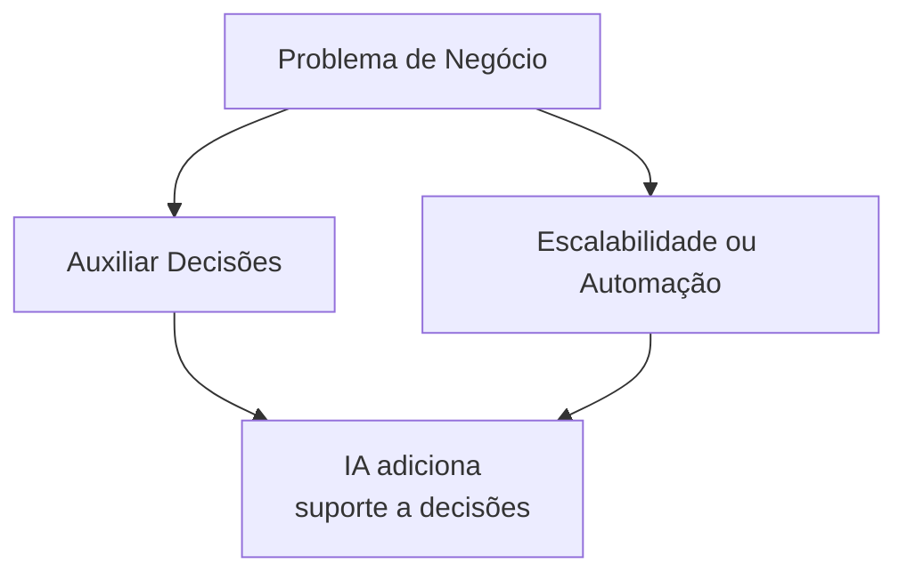
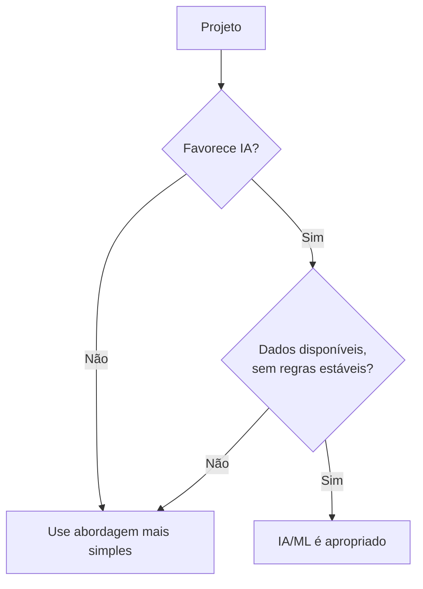
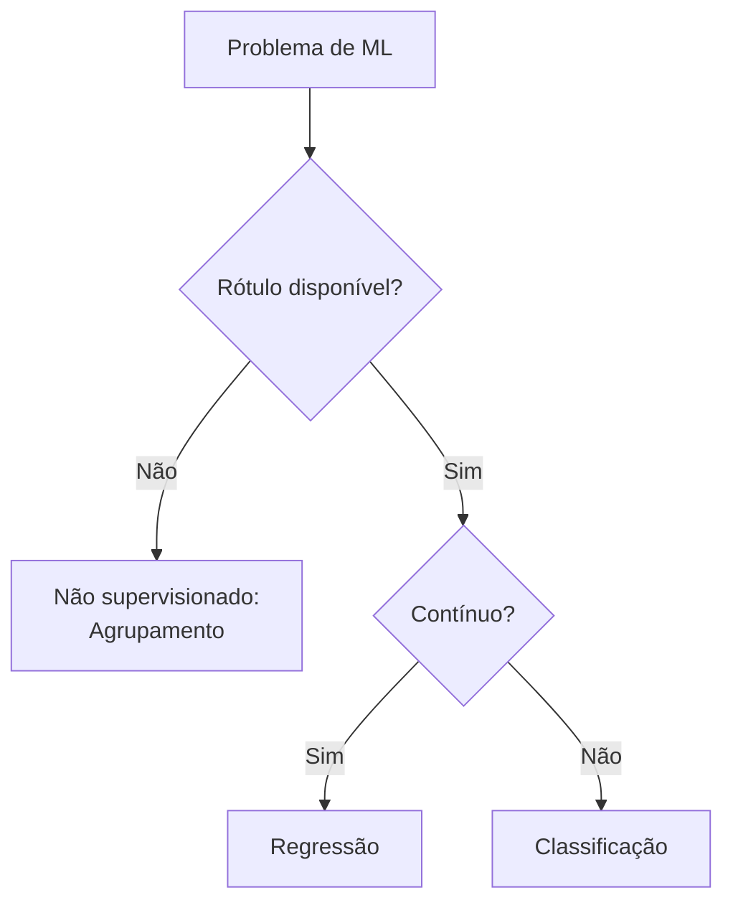
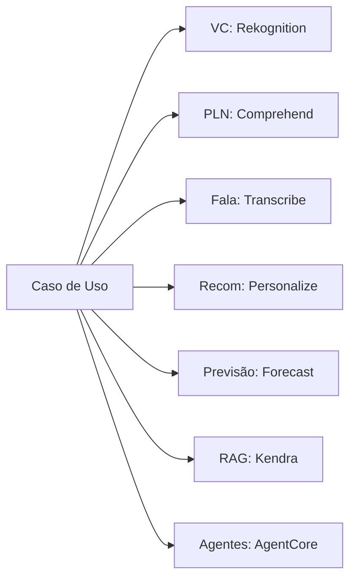
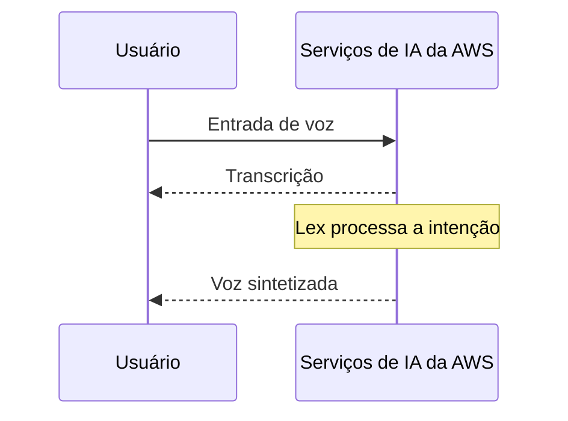
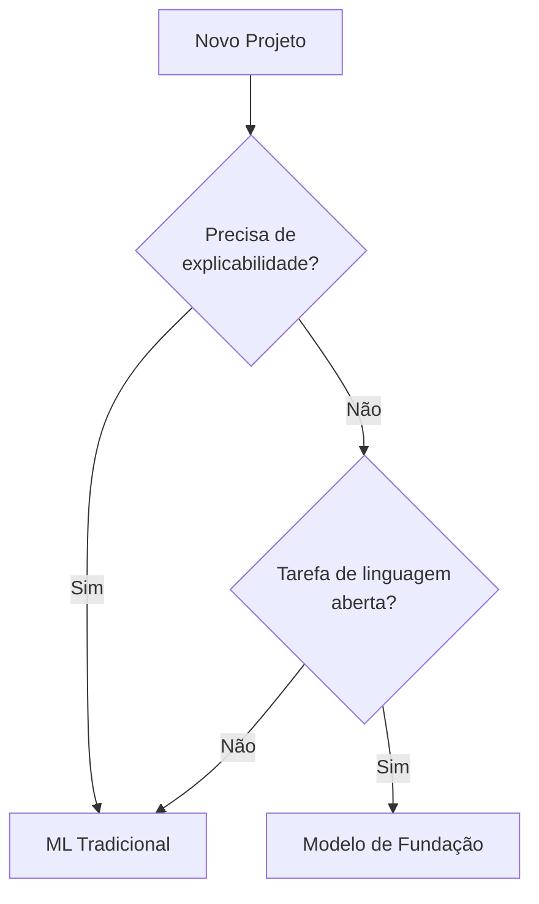

## Declaração de Tarefa 1.2: Identificar casos de uso práticos para IA

Saber que IA e ML existem não é suficiente para um profissional de negócios agir sobre elas de forma eficaz. A questão real é: onde elas produzem resultados melhores do que as alternativas, e onde não produzem? A Declaração de Tarefa 1.2 responde a essa pergunta. Ela avança da teoria para a prática mapeando categorias de problemas de negócios para técnicas de IA adequadas, catalogando os serviços gerenciados da AWS que reduzem o esforço de engenharia e apresentando um novo ponto de decisão da v1.1: quando um modelo de ML tradicional é mais apropriado do que um modelo de fundação. Os objetivos abordados aqui são 1.2.1 a 1.2.6.[^102001]

### 1.2.1 Reconhecer onde IA/ML agrega valor

Três categorias de necessidade de negócios definem a maior parte das situações em que IA e ML superam alternativas mais simples: auxiliar a tomada de decisões humanas, viabilizar a escalabilidade de soluções e automatizar tarefas repetitivas. Essas categorias não são mutuamente exclusivas, e muitas implantações em produção combinam as três. Compreender cada categoria em seus próprios termos, no entanto, facilita a apresentação de uma proposta de IA às partes interessadas.

**Auxiliar a tomada de decisões humanas** é o driver de valor mais antigo e provavelmente mais duradouro do ML. Um modelo não substitui o tomador de decisão; ele estreita o intervalo de opções que um ser humano precisa considerar e associa uma estimativa de probabilidade a cada opção restante. Um analista de crédito hipotecário, por exemplo, avalia dezenas de sinais ao analisar uma solicitação de empréstimo. Um modelo de ML treinado em dados históricos de desempenho de empréstimos pode classificar esses sinais por peso preditivo e sinalizar solicitações que fogem dos padrões normais, para que o analista concentre sua atenção onde ela mais importa. O ser humano mantém a responsabilidade e a autoridade; o modelo reduz a carga cognitiva e a chance de perder um sinal em um grande conjunto de características.[^102002]

**Escalabilidade de soluções** é a capacidade que mais diretamente se alinha à economia de nuvem. Um motor de regras determinístico criado por um desenvolvedor atinge um limite quando a lógica de negócios se torna complexa o suficiente para que a manutenção manual das regras seja mais lenta do que as mudanças de negócio. Um modelo de ML treinado em resultados escala de forma diferente: à medida que o volume de entrada cresce, o modelo executa o mesmo cálculo de inferência independentemente de quantas regras de negócios seriam necessárias para replicar sua saída. Um modelo de detecção de fraude que avalia dez mil transações de pagamento por segundo não requer esforço adicional de engenharia em comparação com um que avalia cem transações por segundo; apenas os recursos computacionais mudam, e esses são elásticos na AWS.[^102003]

**Automação** cobre a substituição da inferência de ML por uma tarefa que anteriormente exigia tempo humano. Classificação de documentos, inspeção de qualidade de imagem em uma linha de produção e roteamento de central de atendimento baseado em análise de sentimento são exemplos. O valor da automação é mais evidente quando a tarefa é repetitiva, o volume é alto, a taxa de erro aceitável é bem compreendida e o custo dos erros é recuperável, e não catastrófico. Automação não significa operação sem supervisão; a maioria dos sistemas de automação de IA em produção inclui um caminho de revisão humana para os casos em que o modelo atribui baixa confiança.[^102004]

*Figura 1.2.1: Três principais drivers de valor de negócio de IA/ML. O diagrama mostra como diferentes pressões de negócio se mapeiam em categorias distintas de valor de IA, cada uma com seu próprio padrão operacional.*

Duas outras categorias aparecem com menos frequência nas questões do exame, mas merecem menção. *Personalização de soluções* aplica ML para adaptar conteúdo, ofertas ou fluxos de trabalho a usuários individuais com base no histórico comportamental, o que é particularmente comum em varejo e mídia. *Manutenção preditiva* aplica modelos de séries temporais a dados de sensores de equipamentos, sinalizando a probabilidade de falha antes que ela ocorra e permitindo que as equipes de manutenção ajam por um cronograma em vez de em resposta a paralisações.

### 1.2.2 Quando soluções de IA/ML não são apropriadas

O exame trata esse objetivo como de alto rendimento, e a razão é prática: organizações que aplicam IA indiscriminadamente desperdiçam orçamento e às vezes causam danos. Quatro condições indicam de forma consistente que a IA é a escolha errada.

**Desalinhamento de custo-benefício** é o desqualificador mais comum em projetos reais. Construir e manter um modelo de ML requer dados rotulados, execuções de treinamento, infraestrutura, monitoramento do modelo e retreinamento periódico à medida que a distribuição subjacente muda. Para um problema de negócios que afeta um pequeno número de registros por dia ou cujo resultado varia dentro de uma faixa estreita e previsível, uma tabela de pesquisa simples ou um script de decisão de vinte linhas é mais rápido de construir, mais barato de operar e mais fácil de auditar. O ponto de equilíbrio depende do volume e da complexidade, mas o princípio é consistente: se o custo de desenvolver e operar o sistema de ML exceder o valor que ele retorna em um horizonte de planejamento razoável, uma solução mais simples é a correta.[^102005]

**Requisitos de resultado determinístico** surgem quando um processo de negócios ou regulatório exige uma resposta específica e reproduzível para uma determinada entrada, em vez de uma estimativa probabilística. Cálculos tributários, verificações de elegibilidade regulatória e fórmulas de faturamento contratual se enquadram nessa categoria. Modelos de ML produzem saídas extraídas de uma distribuição aprendida; a mesma entrada pode receber pontuações ligeiramente diferentes em momentos diferentes se o modelo for retreinado, e o modelo não pode garantir que nunca se desviará da regra. Sistemas baseados em regras garantem reprodutibilidade exata. Quando o requisito é "a resposta deve sempre ser X quando as condições forem Y," o ML não é a ferramenta certa.[^102006]

**Cenários de poucos dados** minam o requisito central do aprendizado supervisionado. Um modelo treinado em menos registros do que o necessário para cobrir a variação no mundo real terá generalização ruim. O limiar varia por técnica e tipo de problema, mas uma heurística aproximada é que a classificação supervisionada precisa de pelo menos várias centenas de exemplos rotulados por classe, e a regressão se beneficia de vários milhares de registros com variação significativa no espaço de características. Organizações que desejam aplicar ML a uma nova linha de produtos, uma fonte de dados recém-adquirida ou um tipo de evento raro frequentemente descobrem que ainda não têm dados suficientes para treinar um modelo confiável.[^102007]

**Problemas simples baseados em regras** são situações em que a lógica que mapeia entradas para saídas pode ser declarada claramente em uma árvore de decisão com no máximo quatro ou cinco níveis. Se um especialista humano puder enumerar todos os casos, as condições e as saídas corretas em uma tarde, e se essas regras forem estáveis ao longo do tempo, então codificá-las explicitamente é mais auditável, mais explicável e menos dispendioso do que treinar um modelo. A elegibilidade para devolução de clientes com base na data de compra e na categoria do item é um exemplo clássico: as regras são conhecidas, fixas e em número suficientemente pequeno para manutenção manual.

*Figura 1.2.2: Duas verificações resumidas para adequação de IA/ML. O primeiro filtro elimina projetos que falham no teste de custo-benefício ou determinismo; o segundo elimina projetos que não têm dados ou já possuem regras estáveis. Um projeto deve passar pelos dois filtros para justificar IA/ML em vez de uma abordagem mais simples.*

Duas considerações adicionais merecem menção, embora apareçam menos diretamente na formulação do exame. *Restrições éticas e regulatórias* podem limitar onde um modelo probabilístico pode operar, particularmente em domínios de alto risco como pontuação de crédito, contratação e diagnóstico clínico. *Restrições de latência* importam quando um aplicativo precisa de uma resposta em milissegundos de um único dígito; certos modelos complexos requerem mais tempo de inferência do que isso, e um caminho de decisão codificado pode ser a única opção que atende ao SLA.

### 1.2.3 Selecionar técnicas apropriadas de IA/ML

Escolher a técnica correta começa com a natureza do sinal rotulado disponível nos dados de treinamento. Três técnicas fundamentais de aprendizado supervisionado e não supervisionado aparecem explicitamente nos objetivos do exame; duas técnicas adicionais aparecem nos objetivos como menções passageiras.

**Regressão** prevê uma saída numérica contínua dado um conjunto de características de entrada.[^102008] O modelo aprende a relação entre as características e uma variável alvo que pode assumir qualquer valor em um intervalo, como receita esperada, horas até a falha do equipamento ou temperatura em um determinado local e hora. Uma rede de varejo prevendo o volume de vendas semanais por localização de loja usa regressão. A saída não é uma categoria; é um número sobre o qual o negócio pode agir diretamente em um plano de estoque ou de pessoal.

**Classificação** atribui uma entrada a uma de um conjunto finito de categorias.[^102009] Quando o conjunto de categorias tem dois membros, o problema é *classificação binária*; quando tem mais de dois, é *classificação multiclasse*. Detecção de spam (spam ou não spam), previsão de inadimplência em empréstimos (inadimplência ou não) e rotulagem de imagens (gato, cachorro ou pássaro) são todos problemas de classificação. A saída do modelo é tipicamente uma pontuação de probabilidade para cada classe, e o aplicativo escolhe a classe com a pontuação mais alta, opcionalmente combinada com um limiar de confiança que encaminha previsões de baixa confiança para um revisor humano.

**Agrupamento** (clustering) agrupa registros por similaridade sem um rótulo predefinido.[^102010] Como não existe variável alvo rotulada, o agrupamento é uma técnica não supervisionada. O modelo descobre estrutura nos dados que o analista não pré-especificou. Segmentação de clientes é o exemplo canônico: dado o histórico de compras, o comportamento de navegação e sinais demográficos, o modelo pode identificar cinco arquétipos distintos de clientes para os quais a equipe de marketing pode então criar campanhas distintas. Detecção de anomalias é uma aplicação relacionada: registros que não se encaixam bem em nenhum grupo são sinalizados como incomuns.

Duas técnicas adicionais merecem breve menção porque os objetivos do exame as nomeiam de passagem. *Redução de dimensionalidade* comprime um espaço de características de alta dimensão em menos dimensões, o que reduz o custo computacional e pode melhorar o desempenho do modelo downstream removendo características correlacionadas ou irrelevantes. *Detecção de anomalias* identifica pontos de dados que se desviam significativamente da distribuição aprendida do comportamento normal, o que é um enquadramento distinto da classificação, embora alguns modelos de classificação sejam adaptados para esse propósito.

*Tabela 1.2.1: Seleção de técnica de ML por tipo de problema*

| Técnica | Rótulo de entrada | Tipo de saída | Exemplo de negócio canônico |
|---------|------------------|---------------|----------------------------|
| Regressão | Obrigatório (alvo numérico) | Número contínuo | Previsão de demanda, previsão de preço |
| Classificação binária | Obrigatório (duas classes) | Classe + probabilidade | Sinalização de fraude, previsão de churn |
| Classificação multiclasse | Obrigatório (múltiplas classes) | Classe + probabilidade | Roteamento de documentos, categoria de defeito |
| Agrupamento (clustering) | Não obrigatório | Atribuição de grupo | Segmentação de clientes, descoberta de tópicos |
| Detecção de anomalias | Opcional | Pontuação de anomalia | Intrusão de rede, falha de sensor |

*Figura 1.2.3: Árvore de decisão para seleção de técnica de ML. O ramo principal separa problemas supervisionados de não supervisionados; o ramo supervisionado então separa pela natureza da variável alvo.*

**Amazon SageMaker AI** suporta todas as técnicas da Tabela 1.2.1 por meio de seus algoritmos integrados e do ecossistema de frameworks mais amplo que hospeda.[^102011] Para equipes sem pessoal de ciência de dados, a capacidade de AutoML dentro do Amazon SageMaker AI pode selecionar e ajustar algoritmos automaticamente dado um conjunto de dados rotulado, tornando a seleção de técnica uma tarefa de configuração guiada em vez de um problema de pesquisa.

### 1.2.4 Aplicações de IA no mundo real

O objetivo do exame 1.2.4 foi expandido na v1.1 para incluir bases de conhecimento e IA agêntica junto com as seis categorias presentes na v1.0. Essas oito categorias representam o escopo completo do que o exame pode pedir aos candidatos que reconheçam.

**Sistemas de visão computacional** interpretam imagens ou quadros de vídeo para extrair informações estruturadas.[^102012] Detecção de objetos identifica e localiza itens específicos dentro de uma imagem; classificação de imagens atribui um rótulo à imagem inteira; reconhecimento óptico de caracteres lê texto impresso ou manuscrito de uma digitalização. Uma empresa de logística usa visão computacional para ler etiquetas de pacotes em uma esteira transportadora e roteá-los sem intervenção humana. Uma rede de varejo usa câmeras de varredura de prateleiras para detectar quando um produto está fora de estoque. **Amazon Rekognition** é o serviço gerenciado da AWS para visão computacional; ele fornece modelos pré-treinados para detecção de objetos e cenas, reconhecimento de texto e análise facial, e aceita tanto imagens individuais quanto fluxos de vídeo.[^102013]

**Processamento de linguagem natural (PLN)** permite que sistemas derivem significado de texto não estruturado.[^102014] Análise de sentimento determina se um texto expressa sentimento positivo, negativo ou neutro. Reconhecimento de entidades extrai entidades nomeadas como nomes de produtos, locais e pessoas de um documento. Modelagem de tópicos agrupa uma coleção de documentos por tema. Uma equipe de sucesso do cliente executa análise de sentimento em tickets de suporte todas as noites para identificar reclamações emergentes sobre produtos antes que elas escalem. **Amazon Comprehend** é o principal serviço gerenciado de PLN da AWS, fornecendo análise de sentimento, reconhecimento de entidades, extração de frases-chave e classificação personalizada.[^102015]

**Reconhecimento de fala** converte áudio falado em texto, viabilizando interfaces de voz, transcrição de reuniões e análise de chamadas.[^102016] O desafio em produção é lidar com sotaques diversos, ruído de fundo, vocabulário específico do domínio e restrições de latência em tempo real. **Amazon Transcribe** converte áudio em texto e suporta vocabulário personalizado, identificação de locutor e pontuação automática nos modos em tempo real e em lote.[^102017]

**Sistemas de recomendação** preveem quais itens um usuário tem mais probabilidade de se engajar, dado o histórico comportamental e sinais contextuais.[^102018] Uma plataforma de e-commerce recomenda produtos com base no que um cliente navegou e comprou anteriormente. Um serviço de streaming recomenda programas com base no histórico de visualização e avaliações. A técnica subjacente é tipicamente filtragem colaborativa, que identifica usuários com comportamento similar e transfere preferências pelo grupo, ou filtragem baseada em conteúdo, que combina itens cujos atributos se assemelham a itens com os quais o usuário já interagiu. **Amazon Personalize** é um serviço de recomendação gerenciado que lida com o pipeline de treinamento, implantação e fornecimento em tempo real sem exigir expertise em ML da equipe de aplicação.[^102019]

**Detecção de fraude** identifica transações ou atividades de conta que se desviam do padrão aprendido de comportamento legítimo.[^102020] Bancos aplicam detecção de fraude na fase de autorização de pagamento, avaliando cada transação em tempo real e recusando ou sinalizando aquelas acima de um limiar de risco. Seguradoras a aplicam em sinistros submetidos para reembolso. A abordagem de ML supera as regras estáticas porque os padrões de fraude evoluem continuamente, e um modelo pode ser retreinado à medida que novas táticas de fraude surgem. A técnica subjacente é frequentemente classificação binária com uma camada de detecção de anomalias por cima. **Amazon Fraud Detector** é o serviço gerenciado da AWS que empacota esse padrão, com modelos pré-construídos para fraude online, fraude de transação e tomada de conta.

**Previsão** produz predições de valores futuros para uma variável de série temporal, como demanda de produto, consumo de energia ou requisitos de pessoal de central de atendimento.[^102021] As entradas são observações históricas da variável alvo mais *séries temporais relacionadas* opcionais (como promoções, feriados e clima) que o modelo pode usar para melhorar a precisão. **Amazon Forecast** é um serviço de previsão gerenciado que seleciona automaticamente entre algoritmos estatísticos e de aprendizado profundo, calcula *previsões de quantil* (por exemplo, níveis de demanda p50 e p90) e grava os resultados no Amazon S3 para consumo downstream.[^102022]

**Bases de conhecimento** são repositórios estruturados de informações que sistemas de IA podem consultar no momento da inferência para fundamentar suas respostas em conteúdo verificado, em vez de depender apenas dos padrões codificados nos pesos do modelo.[^102023] Uma base de conhecimento para uma empresa de serviços financeiros pode conter documentos regulatórios, especificações de produtos e modelos de resposta aprovados. Quando um cliente faz uma pergunta por meio de um assistente de IA, o sistema recupera a seção relevante da base de conhecimento e a usa para formular uma resposta fundamentada factualmente. Esse padrão é formalmente chamado de *geração aumentada por recuperação (RAG)*, que o Domínio 3 deste livro aborda em profundidade. **Amazon Kendra** é um serviço de busca empresarial gerenciado que fundamenta muitas implementações de bases de conhecimento, indexando repositórios de documentos e retornando passagens relevantes em resposta a consultas em linguagem natural.[^102024]

**IA agêntica** descreve sistemas em que um ou mais modelos de IA planejam e executam tarefas de múltiplas etapas de forma autônoma, chamando ferramentas e APIs para interagir com sistemas externos.[^102025] Um sistema de agente único pode lidar com um fluxo de trabalho completo de atendimento ao cliente: interpretar a solicitação do cliente, consultar informações de conta em um CRM, verificar o estoque de produtos, redigir uma resolução e enviar um e-mail de confirmação, tudo sem um operador humano. Um sistema multiagente distribui subtarefas entre agentes especializados; um agente orquestrador atribui trabalho, subagentes o executam e o orquestrador compila os resultados. As aplicações de negócios para IA agêntica incluem operações de TI (um agente que monitora alertas, diagnostica a causa raiz e aplica uma correção de um runbook), processamento de documentos (um agente que lê notas fiscais, extrai itens de linha e os insere em um ERP) e integração de clientes (um agente que coleta os documentos necessários, os valida e aciona o provisionamento de conta).

**Amazon Bedrock AgentCore** é o runtime gerenciado da AWS para cargas de trabalho de IA agêntica em produção, fornecendo gerenciamento de memória, orquestração de ferramentas e persistência de sessão para agentes construídos em modelos de fundação.[^102026] Para equipes desenvolvendo aplicações agênticas, **Strands Agents** é um SDK de código aberto que simplifica a composição multiagente, enquanto os agentes do **Amazon Bedrock** fornecem uma camada de orquestração totalmente gerenciada que conecta modelos de fundação a grupos de ações definidos como funções Lambda ou esquemas de API.[^102027]

*Figura 1.2.4: Categorias de aplicação de IA no mundo real e o principal serviço gerenciado da AWS que implementa cada uma. Detecção de fraude não é mostrada porque abrange múltiplos serviços (Amazon Fraud Detector e Amazon SageMaker AI) dependendo da abordagem de implementação.*

### 1.2.5 Serviços gerenciados de IA/ML da AWS

Os serviços gerenciados de IA da AWS removem o requisito de desenvolvimento interno de modelos, fornecendo capacidades pré-treinadas por meio de APIs. O objetivo do exame 1.2.5 nomeia seis serviços explicitamente e a lista de serviços dentro do escopo adiciona quatro outros que aparecem na prática e como distratores no exame.

Os seis serviços nomeados se dividem claramente por função. **Amazon SageMaker AI** é a plataforma de ML de ponta a ponta para construir, treinar e implantar modelos personalizados em qualquer escala.[^102028] Não é um serviço pré-treinado, mas um ambiente gerenciado que lida com a infraestrutura para cada estágio do ciclo de vida de ML. Equipes que precisam de um modelo treinado em seus próprios dados, em vez de uma API genérica pré-treinada, começam com o Amazon SageMaker AI. **Amazon Transcribe** converte fala em texto e é a base de qualquer fluxo de trabalho que precisa ingerir áudio.[^102029] **Amazon Translate** fornece tradução automática neural em uma ampla gama de pares de idiomas, suportando localização de conteúdo, chat multilíngue em tempo real e tradução de documentos em lote.[^102030] Amazon Comprehend, apresentado anteriormente nesta seção, lida com o estágio de análise de texto em qualquer transcrição que o Amazon Transcribe produz.[^102031] **Amazon Lex** cria interfaces conversacionais que entendem intenções em linguagem natural e gerenciam o estado do diálogo, e se integra com **Amazon Polly**, que converte texto em fala natural para respostas em canal de voz.[^102032][^102033]

Quatro serviços adicionais dentro do escopo aparecem regularmente em questões do exame e em arquiteturas reais. **Amazon Rekognition** lida com análise de imagens e vídeo, incluindo detecção de objetos, reconhecimento de texto e moderação de conteúdo.[^102034] **Amazon Textract** vai além do reconhecimento óptico de caracteres para extrair dados estruturados, como campos de formulário e valores de tabela, de documentos digitalizados.[^102035] **Amazon Personalize** fornece recomendações personalizadas treinadas em dados de interação que o cliente fornece.[^102036] **Amazon Kendra** é um serviço de busca empresarial que indexa documentos internos e retorna passagens relevantes em resposta a perguntas em linguagem natural, servindo como camada de recuperação em arquiteturas de base de conhecimento.[^102037]

*Tabela 1.2.2: Serviços gerenciados de IA/ML da AWS agrupados por capacidade*

| Capacidade | Serviço | Função principal |
|------------|---------|-----------------|
| Desenvolvimento de modelo personalizado | Amazon SageMaker AI | Construir, treinar e implantar modelos de ML personalizados |
| Fala para texto | Amazon Transcribe | Reconhecimento automático de fala com identificação de locutor |
| Texto para fala | Amazon Polly | Texto para fala neural em múltiplas vozes |
| Tradução de idioma | Amazon Translate | Tradução automática neural, em lote e em tempo real |
| Análise de texto | Amazon Comprehend | Sentimento, entidades, frases-chave, classificação personalizada |
| IA conversacional | Amazon Lex | Reconhecimento de intenção e gerenciamento de diálogo |
| Visão computacional | Amazon Rekognition | Detecção de objetos, reconhecimento de texto, moderação de conteúdo |
| Extração de dados de documentos | Amazon Textract | Extração de campos e tabelas estruturados de documentos |
| Recomendações | Amazon Personalize | Recomendações personalizadas em tempo real |
| Busca empresarial | Amazon Kendra | Busca em linguagem natural em repositórios de documentos internos |

Uma armadilha comum no exame é confundir serviços com áreas de superfície sobrepostas. **Amazon Transcribe** produz uma transcrição de texto; **Amazon Comprehend** analisa essa transcrição para significado. **Amazon Lex** entende intenções conversacionais em tempo real; **Amazon Polly** fala a resposta de volta. **Amazon Textract** lê dados estruturados de uma página digitalizada; **Amazon Rekognition** detecta objetos e cenas na mesma imagem. Esses pares frequentemente aparecem juntos em questões de arquitetura, e saber qual serviço pertence a qual estágio é a chave para selecionar a resposta correta.

*Figura 1.2.5: Fluxo conceitual de canal de voz. O usuário fala para uma cadeia de serviços de IA da AWS que transcreve o áudio, interpreta a intenção e sintetiza uma resposta falada; os handoffs específicos de serviço (Transcribe para Lex para Comprehend para Polly) são descritos no parágrafo anterior.*

### 1.2.6 ML tradicional versus modelos de fundação

O objetivo 1.2.6 é novo na v1.1, refletindo a questão prática que toda equipe de IA enfrenta agora: quando um modelo de fundação (FM) é a ferramenta certa, e quando um modelo de ML tradicional construído e treinado do zero é a melhor escolha?[^102038] A decisão não é sobre a sofisticação de qualquer opção. É sobre adequação: combinar as características dos dados disponíveis, as saídas necessárias, o ambiente regulatório e o orçamento operacional com as capacidades de cada abordagem.

**Modelos de ML tradicionais** são treinados em dados rotulados para uma tarefa específica e bem delimitada. Eles são totalmente interpretáveis no sentido de que a importância das características e a lógica de decisão podem ser extraídas e auditadas. Eles executam inferência com baixa latência, tipicamente em milissegundos de um único dígito em hardware modesto. Seu custo computacional é previsível e geralmente baixo. Eles requerem dados de treinamento rotulados por domínio, que podem ser caros de adquirir, mas uma vez treinados não têm cobrança contínua de computação baseada em tokens.[^102039]

**Modelos de fundação** são pré-treinados em corpus amplos de propósito geral e podem lidar com uma ampla gama de tarefas de linguagem e multimodais com configuração adicional mínima.[^102040] Eles se destacam em tarefas que requerem compreensão de linguagem natural, geração de conteúdo, síntese de código ou raciocínio entre tópicos vagamente relacionados. Eles aceitam prompts conversacionais e ajustam seu comportamento com base em instruções sem retreinamento. Seu modelo de custo é tipicamente baseado em tokens, o que significa que cada chamada de inferência é cobrada pelo número de tokens na entrada e saída. A latência é maior do que o ML tradicional, tipicamente na faixa de centenas de milissegundos a segundos.

*Tabela 1.2.3: Critérios de decisão para ML tradicional versus modelos de fundação*

| Critério | ML tradicional | Modelo de fundação |
|----------|---------------|-------------------|
| Escopo da tarefa | Tarefa única e bem definida | Tarefas amplas ou gerais |
| Dados de treinamento | Conjunto de dados rotulados por domínio obrigatório | Pré-treinado; prompt ou ajuste fino |
| Explicabilidade | Alta; importância de características disponível | Menor; raciocínio emergente |
| Latência | Baixa (milissegundos de um único dígito) | Maior (centenas de ms a segundos) |
| Custo de inferência | Previsível; sem cobrança por token | Baseado em token; variável com o tamanho da entrada |
| Adequação regulatória | Forte; auditabilidade completa | Mais fraca; preocupações com variabilidade de saída |
| Suporte multimodal | Limitado às modalidades treinadas | Amplo (texto, imagem, áudio dependendo do modelo) |
| Tarefa única de alto volume | Alta; escala horizontalmente | Baixa; o custo por token cresce com o volume |

Quatro condições favorecem fortemente a escolha de um modelo de ML tradicional. Primeiro, requisitos regulatórios ou de conformidade exigem um caminho de decisão totalmente auditável e reproduzível. A pontuação de risco de crédito sob regulamentação bancária, por exemplo, geralmente requer a capacidade de explicar qualquer decisão individual, e uma árvore de gradient boosting ou um modelo de regressão logística pode fornecer essa explicação em um formato que os reguladores aceitam.[^102041] Segundo, a tarefa de previsão tem uma saída única e bem definida (um número, uma categoria ou uma pontuação) e dados de treinamento rotulados suficientes para atingir precisão aceitável sem raciocínio de propósito geral. Terceiro, latência e custo são rigorosamente restritos; o aplicativo é executado em alto volume e deve retornar previsões em milissegundos por uma fração de centavo por inferência. Quarto, a organização tem capacidade de engenharia de ML suficiente para gerenciar o pipeline de treinamento e retreinamento.

Quatro condições favorecem um modelo de fundação. Primeiro, a tarefa requer gerar prosa coerente, raciocinar sobre questões ambíguas ou sintetizar informações de múltiplas fontes, que são capacidades que os modelos de ML tradicionais não podem fornecer. Segundo, a organização tem dados de treinamento rotulados mínimos, mas tem acesso a uma descrição de tarefa bem definida que pode expressar como um prompt, tornando a inferência few-shot ou zero-shot viável. Terceiro, o caso de uso é conversacional, e o modelo precisa manter contexto em múltiplos turnos sem lógica explícita de gerenciamento de estado. Quarto, o volume do aplicativo é baixo o suficiente para que o custo baseado em tokens seja aceitável, ou as tarefas são suficientemente exclusivas para que um modelo de propósito geral amortize o custo de uma construção de modelo especializado.

*Figura 1.2.6: Fluxo de decisão para escolher entre um modelo de ML tradicional e um modelo de fundação. Requisitos regulatórios e tipo de tarefa são os dois filtros principais; latência e disponibilidade de dados refinam a escolha.*

O NIST AI Risk Management Framework e a Lei de IA da UE impõem requisitos de rastreabilidade em sistemas de IA usados em decisões de alto risco.[^102042] Na prática, organizações sujeitas a esses frameworks frequentemente adotam um padrão híbrido: um modelo de ML tradicional lida com a tarefa central de previsão e gera a saída auditável, enquanto um modelo de fundação lida com as tarefas de linguagem adjacentes, como gerar a explicação voltada ao cliente da decisão ou resumir evidências de suporte de documentos não estruturados.

A linha entre as duas abordagens está se movendo. As capacidades de destilação de modelos da AWS dentro do **Amazon Bedrock** permitem que equipes transfiram o comportamento de raciocínio de um modelo de fundação grande para um modelo menor, mais rápido e mais barato que é ajustado para uma tarefa específica.[^102043] O resultado é um modelo que se comporta como um modelo de fundação dentro de seu domínio estreito, mas opera com um perfil de custo e latência mais próximo de um modelo de ML tradicional. Essa técnica aparece no objetivo 3.1.5 e vale a pena sinalizá-la aqui como uma ponte entre as duas categorias.

**O que esta seção cobriu:** A Declaração de Tarefa 1.2 estabeleceu como reconhecer onde IA e ML agregam valor, quando evitá-los, como combinar técnicas a tipos de problemas e quais serviços gerenciados da AWS lidam com cada categoria de aplicação. Também introduziu o novo framework de decisão v1.1 para escolher entre modelos de ML tradicionais e modelos de fundação. A Declaração de Tarefa 1.3, que vem a seguir, cobre o ciclo de vida de desenvolvimento de IA/ML de ponta a ponta e mapeia cada estágio para os serviços AWS que o suportam.

## Perguntas de autoavaliação

**Pergunta 1**

Uma empresa de varejo processa 50.000 e-mails de suporte ao cliente por dia e precisa encaminhar cada e-mail para o departamento correto com base no seu tópico. A empresa tem 12 meses de e-mails históricos que já estão rotulados com o departamento correto. Qual abordagem MELHOR se encaixa nesse problema?

A. Regressão, porque o modelo precisa prever uma pontuação para cada departamento e a pontuação mais alta determina o roteamento.

B. Classificação multiclasse, porque a saída é um dos vários departamentos predefinidos e os dados rotulados estão disponíveis.

C. Agrupamento (clustering), porque há dados demais para rotular manualmente e os departamentos ainda não estão definidos.

D. Um modelo de fundação com prompting zero-shot, porque os dados rotulados tornam o ajuste fino desnecessário e o prompting é mais simples.

Com 12 meses de e-mails rotulados e um conjunto fixo de departamentos conhecidos, este é um problema textbook de classificação multiclasse. Os dados rotulados são suficientes para treinar um modelo de ML tradicional, a saída é uma de um número finito de categorias, e o volume (50.000 por dia) torna o custo previsível e a baixa latência de um classificador treinado preferíveis à inferência de FM baseada em tokens. Regressão prevê números contínuos, não categorias. Agrupamento seria apropriado se os departamentos fossem desconhecidos ou se não houvesse rótulos, mas nenhuma dessas condições se aplica aqui. Um modelo de fundação com prompting zero-shot pode categorizar texto, mas com 50.000 e-mails por dia o custo de tokens acumula rapidamente e a latência é maior do que um classificador treinado; os dados rotulados devem ser usados para treinar um modelo de propósito específico em vez de descartados.[^102044]

**Pergunta 2**

Uma empresa de serviços financeiros deve explicar cada decisão de empréstimo a reguladores, incluindo quais características de entrada mais influenciaram o resultado. A empresa está avaliando se deve usar um modelo de ML tradicional ou um modelo de fundação. Qual fator MAIS fortemente favorece a abordagem de ML tradicional?

A. A empresa tem um grande volume de dados de treinamento rotulados de solicitações de empréstimos anteriores.

B. O requisito regulatório de explicabilidade e lógica de decisão auditável.

C. O requisito de latência de inferência é de menos de 200 milissegundos por solicitação.

D. A empresa quer evitar preços baseados em tokens para controlar os custos de inferência.

A explicabilidade regulatória é o fator decisivo aqui. Modelos de ML tradicionais como regressão logística e árvores de gradient boosting expõem pontuações de importância de características e caminhos de decisão que satisfazem os requisitos de auditoria. Modelos de fundação produzem saídas por meio de raciocínio emergente que é difícil de atribuir a características específicas em um formato que os reguladores aceitam. A presença de dados de treinamento rotulados (A) é um fator de apoio para o ML tradicional, mas não é o diferenciador mais forte em comparação com os requisitos regulatórios. A latência abaixo de 200ms (C) os modelos de ML tradicionais atendem, mas muitas implantações de modelos de fundação também atendem a esse limiar. O preço baseado em tokens (D) é uma consideração de custo, mas não tão vinculante quanto a conformidade regulatória.[^102045]

**Pergunta 3**

Uma empresa de manufatura quer identificar quais máquinas no seu piso de produção têm probabilidade de falhar nas próximas 72 horas, com base em leituras de sensores coletadas a cada minuto. O modelo deve retornar uma previsão, não uma regra estática. Não há histórico de falhas rotulado. Qual abordagem de ML é MAIS apropriada?

A. Classificação binária usando dados históricos de sensores rotulados com eventos de falha.

B. Regressão usando o número de chamadas de manutenção anteriores como variável alvo.

C. Detecção de anomalias não supervisionada na série temporal de sensores, sinalizando leituras que se desviam do perfil normal aprendido de cada máquina.

D. Classificação multiclasse para categorizar a gravidade da falha como baixa, média ou alta.

Sem um histórico de falhas rotulado, as abordagens supervisionadas (A, B, D) não podem ser aplicadas diretamente. A detecção de anomalias não supervisionada aprende o padrão normal das leituras de sensores de cada máquina e sinaliza desvios desse padrão; na AWS, **Amazon SageMaker AI** oferece Random Cut Forest e DeepAR exatamente para esse estilo de detecção de anomalias em séries temporais, e as pontuações de anomalia resultantes servem como um proxy não supervisionado para o risco de falha. A classificação binária (A) é a abordagem ideal assim que os rótulos estiverem disponíveis, e a organização deve planejar coletar eventos de falha rotulados para treinamento futuro de modelos supervisionados. A regressão (B) requer uma variável alvo numérica; o número de chamadas de manutenção anteriores é um proxy, mas não prevê diretamente falha futura dentro de uma janela específica. A classificação multiclasse (D) também requer categorias de gravidade rotuladas que ainda não existem.[^102046]

**Pergunta 4**

Uma empresa está avaliando uma solução de IA para automatizar o cálculo de bônus de funcionários sob um acordo de negociação coletiva. A fórmula é especificada com precisão no acordo, aplica-se de forma idêntica a todos os funcionários na mesma faixa salarial e não mudou em cinco anos. Qual determinação é MAIS apropriada?

A. Implementar um modelo de classificação para determinar em qual faixa de bônus cada funcionário se enquadra.

B. Implementar um modelo de regressão para prever valores de bônus a partir de dados de salário e desempenho.

C. Não usar IA/ML; implementar a fórmula como código determinístico, porque o resultado deve ser exato e reproduzível.

D. Usar um modelo de fundação para interpretar o texto do acordo e calcular o bônus apropriado.

Este é um cenário de resultado determinístico. O cálculo do bônus é uma fórmula fixa sem elemento probabilístico; as mesmas entradas devem sempre produzir a mesma saída sem variância. Uma implementação baseada em regras ou fórmulas garante reprodutibilidade exata e é trivialmente auditável. Um modelo de classificação (A) introduziria uma estimativa de probabilidade e não poderia garantir que as condições de limite exatas do acordo sejam respeitadas. Um modelo de regressão (B) prevê um valor contínuo a partir de padrões aprendidos, mas o valor correto já é especificado por fórmula; usar ML aqui adiciona complexidade sem benefício. Um modelo de fundação (D) pode interpretar texto, mas não garantiria a exatidão aritmética e introduz latência e custo para uma tarefa que não requer nenhuma das capacidades dos FMs.[^102047]

**Pergunta 5**

Uma empresa de tecnologia quer criar um assistente de atendimento ao cliente que possa lidar com perguntas em qualquer um dos 15 idiomas, manter o contexto conversacional em múltiplos turnos e gerar respostas personalizadas que se baseiem na documentação interna de produtos da empresa. A empresa não tem dados de treinamento de perguntas e respostas rotulados. Qual abordagem é MELHOR?

A. Treinar um modelo de classificação multiclasse para encaminhar perguntas para respostas pré-escritas em cada idioma.

B. Usar um modelo de fundação com recuperação de uma base de conhecimento do Amazon Kendra, combinado com Amazon Translate para o tratamento de idiomas.

C. Usar Amazon Lex para gerenciamento de diálogo e Amazon Comprehend para análise de sentimento, sem modelo de fundação.

D. Construir modelos de regressão separados para cada idioma, cada um treinado para pontuar a relevância de respostas candidatas.

Este cenário tem três requisitos que coletivamente favorecem uma arquitetura de modelo de fundação: contexto conversacional de múltiplos turnos, geração de conteúdo a partir de documentos internos e suporte multilíngue sem dados de treinamento rotulados. Conectar um modelo de fundação a uma base de conhecimento do Amazon Kendra fornece geração aumentada por recuperação, fundamentando as respostas do modelo na documentação real da empresa. Muitos modelos de fundação lidam com múltiplos idiomas nativamente, mas o Amazon Translate pode complementar para idiomas que o FM lida menos bem. Um modelo de classificação (A) pode encaminhar para respostas estáticas, mas não pode gerar respostas personalizadas ou manter contexto entre turnos. Amazon Lex e Comprehend (C) gerenciam diálogo e sentimento, mas não recuperam de documentação interna nem geram respostas novas; essa combinação sozinha não atenderia ao requisito de geração. Modelos de regressão (D) podem pontuar candidatos de resposta, mas não podem gerar novas respostas ou manter estado conversacional, e a abordagem exigiria construir e manter 15 modelos separados.[^102048]

---

[^102001]: AWS Certification: AWS Certified AI Practitioner (AIF-C01) Exam Guide v1.1, Task Statement 1.2. URL: <https://docs.aws.amazon.com/aws-certification/latest/ai-practitioner-01/ai-practitioner-01-domain1.html>
[^102002]: Amazon SageMaker AI Developer Guide: Human-in-the-loop workflows. URL: <https://docs.aws.amazon.com/sagemaker/latest/dg/a2i-use-augmented-ai-a2i-human-review-loops.html>
[^102003]: Amazon SageMaker AI: Model deployment and real-time inference. URL: <https://docs.aws.amazon.com/sagemaker/latest/dg/deploy-model.html>
[^102004]: Amazon Augmented AI (A2I) Developer Guide: What is Amazon A2I? URL: <https://docs.aws.amazon.com/sagemaker/latest/dg/a2i-getting-started.html>
[^102005]: AWS Well-Architected Framework: Machine Learning Lens - Cost optimization pillar. URL: <https://docs.aws.amazon.com/wellarchitected/latest/machine-learning-lens/cost-optimization.html>
[^102006]: NIST AI Risk Management Framework (AI RMF 1.0): Trustworthiness characteristic - Explainability. URL: <https://airc.nist.gov/Home>
[^102007]: Amazon SageMaker AI Developer Guide: Prepare your data. URL: <https://docs.aws.amazon.com/sagemaker/latest/dg/data-prep.html>
[^102008]: Amazon SageMaker AI Developer Guide: Linear Learner algorithm. URL: <https://docs.aws.amazon.com/sagemaker/latest/dg/linear-learner.html>
[^102009]: Amazon SageMaker AI Developer Guide: XGBoost algorithm. URL: <https://docs.aws.amazon.com/sagemaker/latest/dg/xgboost.html>
[^102010]: Amazon SageMaker AI Developer Guide: K-Means algorithm. URL: <https://docs.aws.amazon.com/sagemaker/latest/dg/k-means.html>
[^102011]: Amazon SageMaker AI overview. URL: <https://aws.amazon.com/sagemaker/>
[^102012]: Amazon Rekognition Developer Guide: What is Amazon Rekognition? URL: <https://docs.aws.amazon.com/rekognition/latest/dg/what-is.html>
[^102013]: Amazon Rekognition product page. URL: <https://aws.amazon.com/rekognition/>
[^102014]: Amazon Comprehend Developer Guide: What is Amazon Comprehend? URL: <https://docs.aws.amazon.com/comprehend/latest/dg/what-is.html>
[^102015]: Amazon Comprehend product page. URL: <https://aws.amazon.com/comprehend/>
[^102016]: Amazon Transcribe Developer Guide: What is Amazon Transcribe? URL: <https://docs.aws.amazon.com/transcribe/latest/dg/what-is.html>
[^102017]: Amazon Transcribe product page. URL: <https://aws.amazon.com/transcribe/>
[^102018]: Amazon Personalize Developer Guide: What is Amazon Personalize? URL: <https://docs.aws.amazon.com/personalize/latest/dg/what-is-personalize.html>
[^102019]: Amazon Personalize product page. URL: <https://aws.amazon.com/personalize/>
[^102020]: Amazon Fraud Detector product page. URL: <https://aws.amazon.com/fraud-detector/>
[^102021]: Amazon Forecast Developer Guide: What is Amazon Forecast? URL: <https://docs.aws.amazon.com/forecast/latest/dg/what-is-forecast.html>
[^102022]: Amazon Forecast product page. URL: <https://aws.amazon.com/forecast/>
[^102023]: Amazon Kendra Developer Guide: What is Amazon Kendra? URL: <https://docs.aws.amazon.com/kendra/latest/dg/what-is-kendra.html>
[^102024]: Amazon Kendra product page. URL: <https://aws.amazon.com/kendra/>
[^102025]: Amazon Bedrock User Guide: Agents for Amazon Bedrock. URL: <https://docs.aws.amazon.com/bedrock/latest/userguide/agents.html>
[^102026]: Amazon Bedrock AgentCore product page. URL: <https://aws.amazon.com/bedrock/agentcore/>
[^102027]: Strands Agents SDK on GitHub. URL: <https://github.com/strands-agents/sdk-python>
[^102028]: Amazon SageMaker AI Developer Guide: What is Amazon SageMaker AI? URL: <https://docs.aws.amazon.com/sagemaker/latest/dg/whatis.html>
[^102029]: Amazon Transcribe Developer Guide: Real-time transcription. URL: <https://docs.aws.amazon.com/transcribe/latest/dg/getting-started-streaming.html>
[^102030]: Amazon Translate Developer Guide: What is Amazon Translate? URL: <https://docs.aws.amazon.com/translate/latest/dg/what-is.html>
[^102031]: Amazon Comprehend Developer Guide: Sentiment analysis. URL: <https://docs.aws.amazon.com/comprehend/latest/dg/how-sentiment.html>
[^102032]: Amazon Lex Developer Guide: What is Amazon Lex? URL: <https://docs.aws.amazon.com/lexv2/latest/dg/what-is.html>
[^102033]: Amazon Polly Developer Guide: What is Amazon Polly? URL: <https://docs.aws.amazon.com/polly/latest/dg/what-is.html>
[^102034]: Amazon Rekognition Developer Guide: Detecting objects and scenes. URL: <https://docs.aws.amazon.com/rekognition/latest/dg/labels.html>
[^102035]: Amazon Textract Developer Guide: What is Amazon Textract? URL: <https://docs.aws.amazon.com/textract/latest/dg/what-is.html>
[^102036]: Amazon Personalize Developer Guide: Getting recommendations. URL: <https://docs.aws.amazon.com/personalize/latest/dg/getting-recommendations.html>
[^102037]: Amazon Kendra Developer Guide: Querying an index. URL: <https://docs.aws.amazon.com/kendra/latest/dg/searching-example.html>
[^102038]: AWS Certification: AIF-C01 v1.1 revisions - Objectives added in v1.1, objective 1.2.6. URL: <https://docs.aws.amazon.com/aws-certification/latest/ai-practitioner-01/aif-01-revisions.html>
[^102039]: Amazon SageMaker AI Developer Guide: Training models. URL: <https://docs.aws.amazon.com/sagemaker/latest/dg/how-it-works-training.html>
[^102040]: Amazon Bedrock User Guide: Foundation models in Amazon Bedrock. URL: <https://docs.aws.amazon.com/bedrock/latest/userguide/foundation-models.html>
[^102041]: NIST AI Risk Management Framework AI RMF 1.0 - Govern function: Policies and accountability. URL: <https://airc.nist.gov/Home>
[^102042]: EU Artificial Intelligence Act, Article 13: Transparency and provision of information to users. URL: <https://eur-lex.europa.eu/legal-content/EN/TXT/?uri=CELEX:32024R1689>
[^102043]: Amazon Bedrock User Guide: Model distillation. URL: <https://docs.aws.amazon.com/bedrock/latest/userguide/model-distillation.html>
[^102044]: Amazon SageMaker AI Developer Guide: Multi-class classification. URL: <https://docs.aws.amazon.com/sagemaker/latest/dg/xgboost.html>
[^102045]: Amazon SageMaker Clarify Developer Guide: Explainability. URL: <https://docs.aws.amazon.com/sagemaker/latest/dg/clarify-model-explainability.html>
[^102046]: Amazon SageMaker AI Developer Guide: Random Cut Forest algorithm for time-series anomaly detection. URL: <https://docs.aws.amazon.com/sagemaker/latest/dg/randomcutforest.html>
[^102047]: AWS Well-Architected Machine Learning Lens: Operational Excellence - Model governance. URL: <https://docs.aws.amazon.com/wellarchitected/latest/machine-learning-lens/operational-excellence.html>
[^102048]: Amazon Bedrock User Guide: Knowledge bases for Amazon Bedrock. URL: <https://docs.aws.amazon.com/bedrock/latest/userguide/knowledge-base.html>
