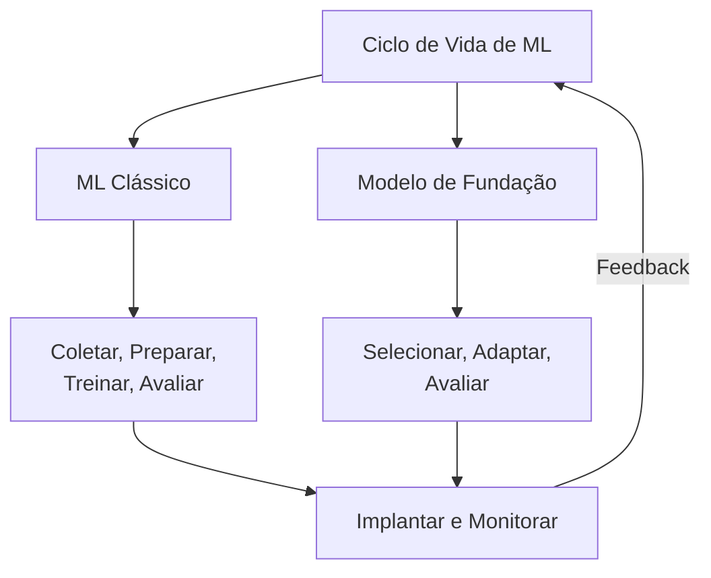
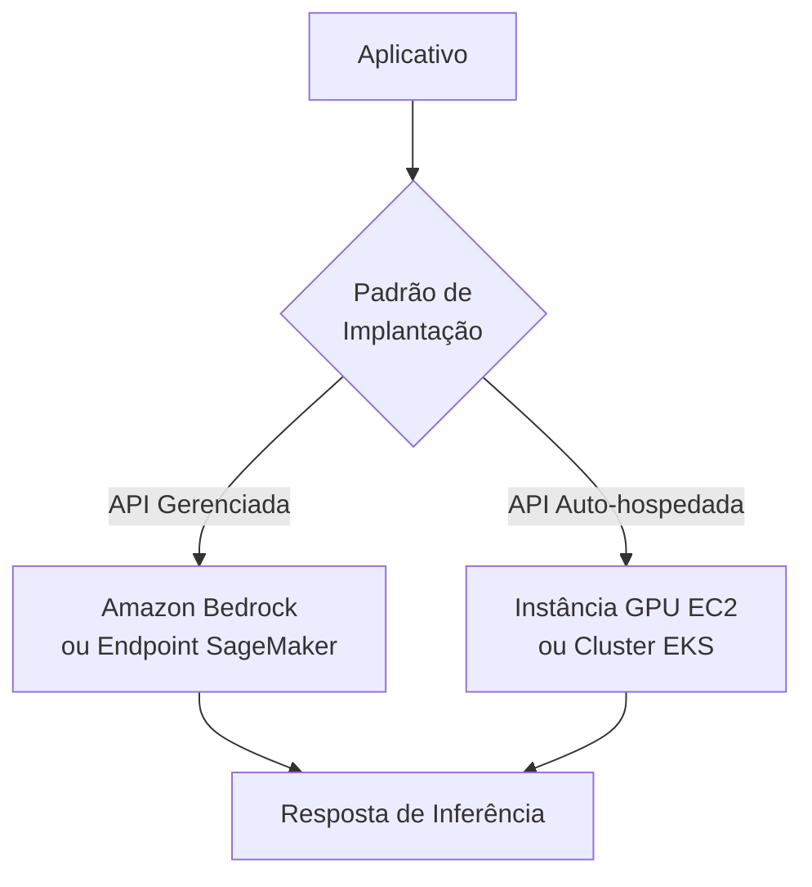
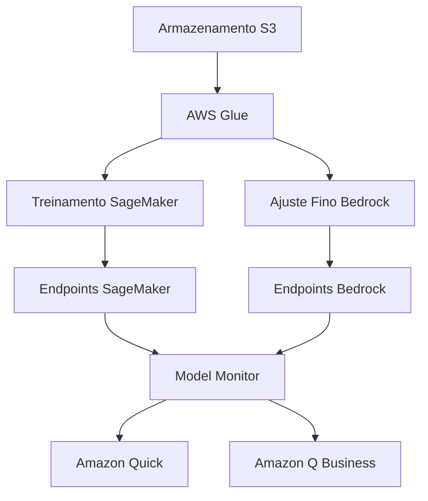
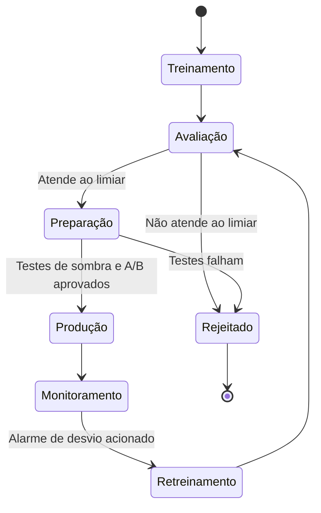
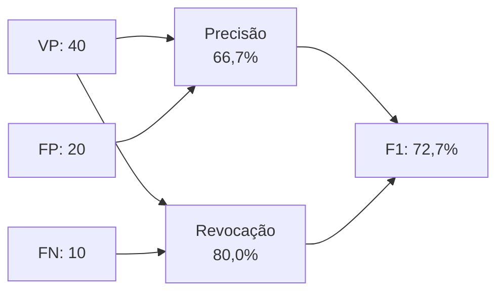

## Declaração de Tarefa 1.3: Descrever o ciclo de vida de desenvolvimento de IA/ML

O ciclo de vida de desenvolvimento de IA/ML é a sequência estruturada de atividades que leva uma ideia de negócio desde dados brutos até um sistema em produção que gera valor ao longo do tempo. O Domínio 1 estabeleceu o vocabulário e o panorama de casos de uso; esta declaração de tarefa coloca essas ideias em movimento, mostrando como os projetos de IA e ML são realmente construídos e gerenciados. Compreender o ciclo de vida permite que os profissionais de negócios estabeleçam expectativas realistas, façam as perguntas certas em cada fase e reconheçam onde os serviços da AWS reduzem o custo e a complexidade de cada estágio.[^103001]

### 1.3.1 Componentes de um pipeline de IA/ML

Um pipeline é a sequência de etapas que uma equipe executa para ir dos dados brutos a um modelo funcional. A palavra é emprestada da engenharia de software e tem o mesmo significado: cada estágio recebe um artefato da etapa anterior, o transforma e passa o resultado adiante. O conceito de pipeline importa para os profissionais de negócios porque fornece um vocabulário comum para discutir progresso, custo e qualidade em cada ponto de um projeto de IA.[^103048]

Os pipelines de aprendizado de máquina clássico e os pipelines de modelo de fundação compartilham uma lógica estrutural, mas diferem em seus estágios intermediários. Um pipeline de ML clássico começa do zero: uma equipe coleta dados rotulados, realiza engenharia de características, seleciona um algoritmo, treina um modelo com dados próprios, ajusta-o, avalia-o e depois implanta e monitora o resultado. Um pipeline de modelo de fundação pula a maior parte do trabalho pesado de dados e treinamento. Em vez disso, a equipe seleciona um modelo pré-treinado existente, decide como adaptá-lo à sua tarefa (por meio de engenharia de prompts, ajuste fino ou geração aumentada por recuperação), avalia o modelo adaptado e o implanta. Ambas as trilhas terminam nos mesmos dois estágios: implantação e monitoramento.

*Figura 1.3.1: Pipeline de IA/ML em duas trilhas. As trilhas de ML clássico e de modelo de fundação convergem na implantação e no monitoramento; os sinais de feedback retornam para a trilha ativa.*

Os estágios da trilha de ML clássico são os seguintes. **Coleta de dados** é o processo de reunir os registros rotulados ou não rotulados a partir dos quais o modelo aprenderá; problemas de qualidade neste estágio se propagam por todas as etapas subsequentes.[^103002] **Análise exploratória de dados (AED)** é o exame dos dados coletados para compreender sua distribuição, relações e anomalias antes de qualquer modelagem.[^103003] **Pré-processamento de dados** cobre limpeza, imputação de valores ausentes, remoção de duplicatas e conversão dos dados para um formato que um algoritmo possa consumir.[^103004] **Engenharia de características** é a criação ou transformação de variáveis de entrada para tornar os padrões subjacentes mais acessíveis ao modelo; por exemplo, converter timestamps brutos de transação em uma característica "dias desde a última compra" para um modelo de churn.[^103005] **Treinamento do modelo** é o processo de otimização pelo qual um algoritmo encontra os valores de parâmetro que minimizam o erro de previsão no conjunto de dados de treinamento.[^103006] **Ajuste de hiperparâmetros** ajusta as configurações que governam o comportamento do treinamento em vez dos pesos aprendidos em si; exemplos incluem a taxa de aprendizado e a profundidade máxima da árvore em um modelo de gradient boosting.[^103007]

A trilha do modelo de fundação começa com **seleção de dados**, que aqui significa escolher os documentos ou exemplos usados para o ajuste fino em vez do treinamento do zero. **Seleção de modelo** é a escolha de qual FM pré-treinado adaptar, uma decisão orientada por capacidade, custo, latência e restrições de licenciamento (discutidas na Seção 1.3.2). **Adaptação** cobre as três principais técnicas para fazer um FM geral ter bom desempenho em uma tarefa específica: engenharia de prompts, que cria instruções sem alterar os pesos do modelo; ajuste fino, que atualiza um subconjunto de pesos usando exemplos específicos do domínio; e *geração aumentada por recuperação (RAG)*, que estende o conhecimento do modelo buscando documentos relevantes no momento da inferência.[^103008] O Domínio 3 trata de cada técnica de adaptação em profundidade; aqui basta saber que elas existem e onde se encaixam no ciclo de vida.

Ambas as trilhas então entram no estágio de **avaliação**, onde o modelo adaptado ou treinado é testado em dados separados e pontuado em relação a métricas de desempenho (ver Seção 1.3.6). Um modelo que passa na avaliação prossegue para a **implantação**. Um modelo que falha retorna a um estágio anterior, comumente engenharia de características ou ajuste de hiperparâmetros na trilha clássica, ou uma estratégia de adaptação revisada na trilha de FM.

**Monitoramento** é o estágio final e o mais frequentemente subestimado no planejamento. Uma vez que um modelo está em produção, o mundo real não fica parado. O comportamento do usuário muda, os pipelines de dados evoluem e os padrões estatísticos que o modelo aprendeu podem não corresponder mais ao que ele vê. O monitoramento detecta esses desvios e aciona ações corretivas, seja atualização de dados, retreinamento ou revisão de prompts.[^103009]

### 1.3.2 Fontes de modelos de fundação

Modelos de fundação requerem enormes recursos computacionais para treinar do zero. Uma única execução de treinamento de um modelo de linguagem grande pode consumir milhões de horas de GPU e custar dezenas de milhões de dólares.[^103010] Como resultado, a maioria das organizações não treina seus próprios FMs; elas os obtêm de fontes externas e os adaptam. As três principais fontes diferem em custo, controle, termos de licenciamento e capacidade.

**Modelos pré-treinados de código aberto** são modelos cujos pesos e, na maioria dos casos, o código de treinamento são liberados publicamente. Os exemplos mais proeminentes disponíveis em 2025 a 2026 incluem a família Llama da Meta (agora em sua 4ª geração, com as variantes Llama 4 Scout e Maverick oferecendo janelas de contexto muito longas; consulte os cartões de modelo atuais da Meta para os tamanhos de janela de contexto servidos no Amazon Bedrock), Mistral e Mixtral da Mistral AI, a série Falcon da TII e o Stable Diffusion da Stability AI para geração de imagens.[^103011] O apelo dos modelos de código aberto é direto: não há custo de API por token, os pesos podem ser baixados e executados na infraestrutura própria da organização, e o modelo pode ser ajustado sem qualquer envolvimento de fornecedor. A desvantagem é a complexidade operacional. A equipe deve provisionar e gerenciar computação, lidar com atualizações de modelo e assumir a responsabilidade pela segurança e conformidade. O licenciamento também varia. Os modelos Llama carregam uma licença de comunidade com restrições comerciais baseadas no uso; verifique o texto atual da licença Llama para o limite vigente. Os modelos Mistral carregam uma licença Apache 2.0 sem tal restrição.[^103012] As equipes de negócios devem verificar a licença aplicável antes de se comprometerem com um FM de código aberto em um produto em produção.

**Modelos de fundação comerciais** são oferecidos por empresas de IA como um serviço de API gerenciado. A organização consumidora paga por token processado em vez de gerenciar infraestrutura. Os principais FMs comerciais acessíveis pela AWS incluem Anthropic Claude (múltiplas gerações, variando de Haiku para tarefas sensíveis a custo a Opus e Sonnet para raciocínio complexo), Amazon Nova (a família própria da Amazon abrangendo Nova Micro, Lite, Pro e Premier), os modelos Jamba da AI21 Labs e as famílias Command e Embed da Cohere.[^103013] Modelos comerciais não requerem gerenciamento de infraestrutura e são continuamente atualizados pelo fornecedor, mas a organização tem menos visibilidade sobre os dados de treinamento e os pesos, o que pode levantar questões de conformidade em setores regulamentados.

**Modelos personalizados treinados do zero** são a opção mais rara. Treinar um novo FM de grande escala do zero é apropriado apenas quando uma organização tem um domínio tão especializado que nenhum FM existente o cobre adequadamente (por exemplo, uma empresa de genômica cujo vocabulário e padrões de raciocínio não têm sobreposição com nenhum corpus de treinamento público) e tem o orçamento e a profundidade de engenharia de ML para fazê-lo. O custo e o prazo são substanciais; a maioria das organizações avalia esse caminho e conclui que o ajuste fino de um FM comercial ou de código aberto é um uso melhor dos recursos.[^103014]

*Tabela 1.3.1: Opções de fontes de FM comparadas*

| Fonte | Estrutura de custo típica | Controle sobre os pesos | Complexidade operacional | Exemplos de modelos |
|-------|--------------------------|------------------------|--------------------------|---------------------|
| Pré-treinado de código aberto | Apenas custo de infraestrutura | Acesso completo | Alta | Llama 4, Mistral, Falcon |
| API gerenciada comercial | Preço por token | Sem acesso | Baixa | Claude, Amazon Nova, Cohere |
| Personalizado treinado do zero | Despesa de capital de vários milhões | Propriedade completa | Muito alta | Proprietário |

A seleção entre essas fontes raramente é uma decisão tudo ou nada. Muitas arquiteturas em produção usam as três em camadas: uma API comercial para consultas de propósito geral, um modelo de código aberto ajustado para uma tarefa de alto volume e sensível a custo, e modelos de ML tradicionais para problemas de previsão estreitos onde a explicabilidade é obrigatória.[^103049]

### 1.3.3 Métodos para usar um modelo em produção

Colocar um modelo treinado ou selecionado em produção significa disponibilizar suas previsões para usuários e aplicativos. Os dois padrões de implantação principais que o exame aborda são o **serviço de API gerenciado** e a **API auto-hospedada**. A escolha entre eles requer ponderar requisitos de latência, volume de chamadas, necessidades de personalização e restrições de conformidade.

Um **serviço de API gerenciado** abstrai todas as preocupações de infraestrutura do aplicativo consumidor. O aplicativo envia uma solicitação HTTP para um endpoint gerenciado pela AWS, recebe uma previsão em resposta e nunca toca diretamente a camada de computação. **Amazon Bedrock** é a API gerenciada pela AWS principal para modelos de fundação, dando acesso a Claude, Amazon Nova, Cohere, AI21, Meta Llama e outros modelos por meio de uma única API unificada sem a necessidade de gerenciar servidores ou GPUs.[^103015] Para organizações que treinaram modelos de ML clássico personalizados ou ajustaram FMs, os endpoints de inferência em tempo real do **Amazon SageMaker AI** fornecem a mesma abstração: a equipe registra um artefato de modelo, configura um endpoint e o SageMaker cuida do provisionamento de instâncias, balanceamento de carga e auto-scaling.[^103016] As vantagens dos serviços de API gerenciados são a velocidade para produção, o escalonamento integrado e a remoção das operações de infraestrutura da responsabilidade da equipe. A limitação é que o controle refinado sobre a pilha de serving (por exemplo, tokenização personalizada ou gerenciamento de memória GPU) não está disponível.

Uma **API auto-hospedada** executa o modelo em infraestrutura que a organização controla e a expõe como sua própria API. Os padrões AWS mais comuns são hospedar o contêiner do modelo em instâncias GPU do **Amazon EC2** para total flexibilidade, ou implantá-lo como uma carga de trabalho Kubernetes no **Amazon EKS** para orquestração de contêineres em escala.[^103017] A auto-hospedagem é apropriada quando os requisitos de conformidade proíbem o envio de dados para a API de um fornecedor, quando o volume de chamadas é alto o suficiente para que a capacidade reservada ou spot do EC2 seja mais barata do que as cobranças por token, ou quando a equipe precisa modificar a pilha de inferência de maneiras que um serviço gerenciado não permite. A troca é a sobrecarga operacional: a equipe gerencia o escalonamento de instâncias, as atualizações de modelo, a aplicação de patches de segurança e o monitoramento.

*Figura 1.3.2: Padrões de implantação de modelo. Um aplicativo encaminha solicitações de inferência para uma API gerenciada ou uma API auto-hospedada, dependendo das prioridades de latência, conformidade e custo da equipe.*

*Tabela 1.3.2: Critérios de decisão para API gerenciada versus API auto-hospedada*

| Critério | API gerenciada | API auto-hospedada |
|----------|---------------|-------------------|
| Gerenciamento de infraestrutura | Gerenciado pela AWS | Gerenciado pela equipe |
| Escalonamento | Automático | Manual ou configuração de auto-scaling obrigatória |
| Personalização da pilha de serving | Limitada | Total |
| Caminho dos dados | Os dados do cliente fluem pelo plano de controle do serviço gerenciado na conta AWS do cliente; sem acesso aos pesos do modelo | Os dados permanecem na infraestrutura controlada pela equipe; acesso completo aos pesos |
| Modelo de custo | Por token ou por solicitação | Computação reservada ou spot |
| Tempo até a primeira implantação | Horas | Dias a semanas |

Além desses dois padrões, as organizações às vezes usam **inferência em lote** para tarefas de alto volume que não são sensíveis ao tempo. O Amazon SageMaker Batch Transform lê um conjunto de dados do Amazon S3, passa cada registro pelo modelo e grava os resultados de volta no S3, tornando-o adequado para tarefas como pontuação mensal de risco em toda uma carteira de clientes.[^103018] A inferência em lote não é um endpoint no sentido tradicional; ela é executada como um trabalho sob demanda e incorre em custo apenas durante o processamento.

### 1.3.4 Serviços AWS para cada estágio do pipeline

O exame AIF-C01 v1.1 nomeia especificamente cinco famílias de serviços que abrangem o pipeline de IA/ML: **Amazon Bedrock**, **Amazon Q**, **Amazon Quick**, **Kiro** e **Amazon SageMaker AI**. Entender o que cada um faz e onde se encaixa evita confundi-los no exame.

**Amazon Bedrock** se posiciona nos estágios de adaptação e implantação de FM no pipeline. Ele fornece acesso a um catálogo selecionado de modelos de fundação por meio de uma API gerenciada, juntamente com ferramentas para ajuste fino desses modelos em dados privados e para construção de pipelines RAG usando bases de conhecimento suportadas por armazenamentos de vetores.[^103019] Para equipes de negócios, o Bedrock é o ponto de entrada para construir aplicativos com tecnologia de GenAI sem gerenciar nenhuma infraestrutura de ML.

**Amazon SageMaker AI** cobre o pipeline completo de ML clássico desde a preparação de dados até o treinamento, avaliação e implantação. O SageMaker Studio é o ambiente de desenvolvimento integrado; o SageMaker Pipelines fornece CI/CD nativo para ML para automatizar o pipeline de ponta a ponta; o SageMaker Feature Store gerencia definições e valores de características; e o SageMaker Model Monitor rastreia a integridade do modelo implantado.[^103020] O SageMaker também hospeda modelos ajustados e personalizados como endpoints, portanto participa da trilha de FM quando uma organização ajusta um modelo de código aberto em vez de usar uma API comercial.

**Amazon Q** é uma família de assistentes com tecnologia de IA orientados a públicos profissionais específicos. **Amazon Q Business** é um assistente conversacional para funcionários de empresas; ele se conecta a fontes de dados corporativos (SharePoint, Confluence, buckets S3, sistemas de ticketing) e responde a perguntas fundamentadas em conteúdo organizacional.[^103021] **Amazon Q Developer** é um assistente de codificação integrado a IDEs que sugere código, explica lógica e identifica vulnerabilidades de segurança. Em 2025 a 2026, o Amazon Q Developer está sendo substituído no IDE para fluxos de trabalho completos de desenvolvimento de software pelo **Kiro**. As equipes que realizam novos projetos de desenvolvimento de IA baseados em IDE devem avaliar o Kiro em vez do Q Developer, embora o Q Developer permaneça disponível e ainda seja citado no guia do exame.

**Kiro** é o ambiente de desenvolvimento integrado com tecnologia de IA da Amazon, anunciado em 2025.[^103022] Enquanto o Q Developer é principalmente uma sobreposição de conclusão de código e chat dentro de IDEs existentes como VS Code ou JetBrains, o Kiro é um IDE completo construído em torno de fluxos de trabalho de IA agêntica. O Kiro pode receber uma especificação, gerar planos de implementação, escrever código em múltiplos arquivos, executar testes e iterar até que o plano seja satisfeito. Para o exame, a distinção principal é que o Kiro visa o ciclo de vida de desenvolvimento de software assistido por IA, não perguntas e respostas de usuário final ou análise de dados.

**Amazon Quick** é o nome que o guia do exame v1.1 dá à família de análises e assistente de IA para usuários de negócios da AWS.[^103023] As capacidades historicamente fornecidas por meio do Amazon QuickSight (painéis de BI) e do Amazon Q Business (respostas conversacionais sobre conteúdo corporativo) estão convergindo sob esse nome, com o objetivo de permitir que um analista de negócios crie painéis, faça perguntas em linguagem natural sobre dados e receba resumos narrativos gerados por IA sem trocar de ferramenta. Para o exame, reconheça o Amazon Quick como a resposta para "BI de autoatendimento aumentado por IA generativa para usuários de negócios"; verifique a página de produto atual antes de decisões de aquisição, pois a marca e a estrutura de camadas ainda estão se consolidando em 2025 a 2026.

Para memorização no exame, a tabela abaixo resume qual família de assistente atende a qual público e como cada uma se mapeia para o status v1.1.

*Tabela 1.3.3: Amazon Q, Kiro e Amazon Quick em resumo*

| Serviço | O que faz | Público | Status para AIF-C01 v1.1 |
|---------|-----------|---------|--------------------------|
| Amazon Q Business | Q&A empresarial fundamentado no conteúdo da empresa | Trabalhadores do conhecimento | Dentro do escopo; convergindo para o Amazon Quick |
| Amazon Q Developer | Conclusão de código e sobreposição de chat em IDEs existentes | Desenvolvedores usando VS Code, JetBrains | Dentro do escopo; substituído para fluxos de trabalho completos de IDE pelo Kiro |
| Kiro | IDE completo construído em torno de fluxos de trabalho de IA agêntica | Desenvolvedores criando recursos assistidos por IA | Dentro do escopo (novo na v1.1); a resposta para "IDE com tecnologia de IA" |
| Amazon Quick | BI de autoatendimento mais assistente de IA generativa | Analistas de negócios e operações | Dentro do escopo (novo na v1.1); a resposta para "BI + GenAI para usuários de negócios" |

*Tabela 1.3.4: Serviços AWS de IA/ML por estágio do pipeline*

| Estágio do pipeline | Serviço AWS | Função |
|--------------------|-------------|--------|
| Armazenamento e preparação de dados | Amazon S3, AWS Glue | Armazenamento de conjunto de dados; ETL e catalogação |
| Engenharia de características | SageMaker Feature Store | Registro centralizado de características |
| Treinamento de modelo clássico | SageMaker AI Training | Trabalhos de treinamento distribuído gerenciado |
| Ajuste de hiperparâmetros | SageMaker Automatic Model Tuning | Busca bayesiana e aleatória no espaço de parâmetros |
| Adaptação de FM (prompting/RAG) | Amazon Bedrock Knowledge Bases | Pipelines RAG com suporte de armazenamento de vetores |
| Adaptação de FM (ajuste fino) | Amazon Bedrock Fine-Tuning, SageMaker AI | Ajuste fino supervisionado em dados privados |
| Avaliação | SageMaker Model Monitor, Bedrock Model Evaluation | Pontuação de desempenho e qualidade |
| Implantação (FM) | Amazon Bedrock Endpoints | API de inferência de FM gerenciada |
| Implantação (ML personalizado) | SageMaker AI Endpoints, Batch Transform | Inferência de modelo personalizado em tempo real e em lote |
| Monitoramento | SageMaker Model Monitor | Detecção de desvio de dados e qualidade do modelo |
| Análise de negócios | Amazon Quick | Painéis de BI e Q&A de dados em linguagem natural |
| Q&A empresarial | Amazon Q Business | Respostas conversacionais sobre conteúdo da empresa |
| Produtividade do desenvolvedor | Kiro, Amazon Q Developer | Desenvolvimento de software assistido por IA |

*Figura 1.3.3: Mapa de serviços AWS ao longo do pipeline de IA/ML. Armazenamento e ETL alimentam tanto o treinamento clássico quanto o ajuste fino de FM; as saídas convergem no monitoramento e depois fluem para as ferramentas do usuário final.*

### 1.3.5 Conceitos fundamentais de MLOps

**MLOps** (Operações de Aprendizado de Máquina) é a disciplina de aplicar rigor de engenharia de software ao ciclo de vida de ML para tornar a entrega de modelos repetível, escalável e sustentável ao longo do tempo.[^103024] O termo é modelado no DevOps: assim como o DevOps trouxe automação, controle de versão e integração contínua para o desenvolvimento de aplicativos, o MLOps traz essas mesmas práticas para o trabalho de construção e operação de modelos de ML. O exame aborda sete conceitos centrais de MLOps.

**Experimentação** é a prática de rastrear cada execução de uma tentativa de construção de modelo para que os resultados possam ser reproduzidos e comparados. Sem rastreamento sistemático, uma equipe que alcança uma boa pontuação de validação não consegue reproduzi-la de forma confiável após modificar o código. **Amazon SageMaker Experiments** registra os hiperparâmetros, métricas e versões de artefatos associados a cada execução de treinamento.[^103025] O resultado é um histórico pesquisável que responde à pergunta: "Qual execução produziu esse resultado e qual era sua configuração?"

**Processos repetíveis** substituem scripts ad hoc por pipelines versionados e parametrizados que produzem saídas consistentes de entradas consistentes. **Amazon SageMaker Pipelines** é o serviço de orquestração MLOps nativo; ele define as etapas do pipeline em código, armazena a saída de cada etapa como um artefato versionado e se integra ao registro de modelos do SageMaker para controlar implantações com base em limiares de avaliação.[^103026] Quando um pipeline é definido dessa forma, executá-lo novamente com novos dados produz uma nova versão do modelo com uma linhagem auditável até os dados de entrada.

**Sistemas escaláveis** garantem que a infraestrutura que suporta treinamento, avaliação e inferência possa crescer com a demanda sem reconfiguração manual. O SageMaker lida com treinamento distribuído em clusters de GPU e escala os endpoints de inferência para cima e para baixo com base no volume de solicitações por meio de políticas de auto-scaling suportadas por métricas do **Amazon CloudWatch**.[^103027]

**Gerenciar a dívida técnica** em ML significa evitar o acúmulo de suposições ocultas em pipelines, transformações de características não documentadas e versões de modelos que ninguém consegue rastrear até os dados de treinamento. As práticas concretas incluem manter as definições de características no SageMaker Feature Store (para que a mesma transformação seja usada de forma consistente no treinamento e na inferência), armazenar artefatos de modelos no registro de modelos do SageMaker com metadados e revisar pipelines para componentes que não são mais usados.[^103028]

**Alcançar a prontidão para produção** significa que um modelo passou por um critério de qualidade definido antes de chegar aos clientes. Isso envolve testes de sombra (executar o novo modelo em paralelo com o modelo em produção e comparar as saídas), testes A/B (encaminhar uma porcentagem do tráfego para a nova versão) e testes de carga (verificar se o endpoint lida com o tráfego de pico sem degradação de latência). Somente após esses controles uma nova versão substitui o modelo em produção.[^103029]

**Monitoramento de modelos** é a avaliação contínua do comportamento de um modelo implantado em relação às linhas de base estabelecidas no momento da implantação. Dois tipos de desvio são particularmente importantes. *Desvio de dados* (também chamado de *mudança de covariável*) ocorre quando a distribuição estatística das características de entrada muda ao longo do tempo; por exemplo, um modelo de fraude treinado em padrões de transação de 2023 pode ver distribuições de características diferentes à medida que os hábitos de gastos evoluem.[^103030] *Desvio de conceito* ocorre quando a relação entre as entradas e a saída correta muda; por exemplo, a definição do comportamento de risco de churn de um modelo pode mudar à medida que o próprio produto muda. **Amazon SageMaker Model Monitor** compara continuamente os dados de inferência ao vivo com um conjunto de dados de base e dispara alarmes quando o desvio excede um limiar.[^103031]

**Retreinamento de modelo** é a resposta aos sinais de monitoramento. Uma estratégia de retreinamento deve especificar o gatilho (agendado, limiar de métrica ou aprovado por humano), a janela de dados usada (todos os dados históricos, uma janela recente deslizante ou um intervalo de datas específico) e o controle de implantação (limiares de aprovação/reprovação que o modelo retreinado deve atingir antes de substituir a versão anterior). O SageMaker Pipelines suporta execução baseada em gatilho, de modo que um alarme do CloudWatch disparado pelo Model Monitor pode iniciar automaticamente uma execução de retreinamento.[^103032]

*Figura 1.3.4: Estados do ciclo de vida do modelo MLOps. Um modelo passa do treinamento pelos controles de avaliação e preparação antes de chegar à produção, depois reentra no ciclo quando o monitoramento detecta desvio.*

### 1.3.6 Métricas de desempenho e de negócios

Avaliar um modelo de IA/ML requer duas perspectivas paralelas. As métricas técnicas de desempenho dizem à equipe se o modelo está fazendo previsões precisas. As métricas de negócios dizem à organização se essas previsões precisas estão gerando o valor pretendido. Um modelo pode ter boas pontuações em métricas técnicas e ainda assim falhar em produzir um retorno de negócios se resolver o problema errado ou for muito caro para operar em escala.

#### Métricas técnicas de desempenho

O guia do exame AIF-C01 v1.1 substituiu *AUC* da lista v1.0 por *precisão* e *revocação*. As quatro métricas explicitamente nomeadas são acurácia, precisão, revocação e pontuação F1, todas aplicáveis a problemas de classificação.[^103033]

**Acurácia** é a proporção de todas as previsões que o modelo acertou. Para um modelo que classifica e-mails de clientes como reclamação ou não reclamação, a acurácia é (número de e-mails classificados corretamente) / (total de e-mails). A acurácia é simples, mas enganosa quando as classes estão desbalanceadas. Se 95% dos e-mails não são reclamações, um modelo que sempre prevê não reclamação tem 95% de acurácia, mas utilidade zero.[^103034]

Uma **matriz de confusão** é a base para compreender todas as outras métricas de classificação. É uma tabela dois por dois (para classificação binária) que conta os resultados em quatro células.

*Tabela 1.3.5: Estrutura da matriz de confusão*

| | Previsto Positivo | Previsto Negativo |
|---|---|---|
| Real Positivo | Verdadeiro Positivo (VP) | Falso Negativo (FN) |
| Real Negativo | Falso Positivo (FP) | Verdadeiro Negativo (VN) |

**Precisão** é a fração de previsões positivas que estavam corretas: VP / (VP + FP). Um modelo de detecção de fraude com alta precisão levanta poucos alarmes falsos; a maioria das transações sinalizadas é genuinamente fraudulenta. Quando os falsos positivos são custosos (por exemplo, bloquear uma transação legítima de um cliente), maximizar a precisão é a prioridade.[^103035]

**Revocação** (também chamada de *sensibilidade*) é a fração de positivos reais que o modelo identificou com sucesso: VP / (VP + FN). Um modelo de triagem médica com alta revocação detecta a maioria dos casos verdadeiros da condição. Quando os falsos negativos são custosos (por exemplo, perder um diagnóstico de câncer), maximizar a revocação é a prioridade.[^103036]

Precisão e revocação se compensam mutuamente. Diminuir o limiar de classificação aumenta a revocação, mas diminui a precisão; aumentá-lo aumenta a precisão, mas diminui a revocação. A **pontuação F1** é a média harmônica de precisão e revocação: 2 x (Precisão x Revocação) / (Precisão + Revocação). Por usar a média harmônica em vez da aritmética, é sensível a valores baixos em qualquer das métricas, tornando-a um resumo confiável de um único número quando tanto os falsos positivos quanto os falsos negativos são importantes.[^103037]

Um exemplo torna os trade-offs concretos. Um modelo de detecção de fraude é avaliado em um conjunto de teste de 1.000 transações, das quais 50 são fraudulentas. O modelo sinaliza 60 transações como fraude; 40 dessas sinalizações estão corretas, e 10 fraudes genuínas são perdidas.

- Acurácia: (40 + 940) / 1.000 = 98,0%
- Precisão: 40 / 60 = 66,7%
- Revocação: 40 / 50 = 80,0%
- Pontuação F1: 2 x (0,667 x 0,800) / (0,667 + 0,800) = 72,7%

A acurácia de 98% parece forte, mas a pontuação F1 de 72,7% dá uma imagem mais honesta do desempenho do modelo na classe que importa.

*Figura 1.3.5: Cálculo de precisão, revocação e F1 para o exemplo de detecção de fraude. O diagrama mostra como verdadeiros positivos, falsos positivos e falsos negativos se combinam na pontuação F1 resumida.*

#### Métricas de negócios

As métricas técnicas respondem se o modelo funciona. As métricas de negócios respondem se o modelo vale a pena operar. As quatro métricas de negócios no guia do exame são custo por usuário, custos de desenvolvimento, feedback do cliente e retorno sobre investimento.[^103038]

**Custo por usuário** é o custo total de inferência (computação, cobranças de API e sobrecarga operacional) dividido pelo número de usuários atendidos em um período. Essa métrica torna visível a economia contínua de um modelo. Um modelo que custa R$ 0,005 por usuário por mês com 10.000 usuários pode se tornar inacessível com 10 milhões de usuários se o custo não diminuir com o volume. Monitorar o custo por usuário ao longo do tempo também revela quando a eficiência de um modelo está se degradando, frequentemente um sinal de que as cargas de entrada estão crescendo ou que o modelo está sendo chamado mais do que o necessário.[^103039]

**Custos de desenvolvimento** são os investimentos únicos (ou por iteração) em pessoas, dados, computação e ferramentas necessários para construir e implantar um modelo. Para um FM ajustado no Bedrock, os custos de desenvolvimento incluem o esforço de rotulagem de dados e a computação do trabalho de ajuste fino. Para um modelo treinado do zero, eles incluem meses de tempo de engenheiro de ML e horas de cluster GPU. Rastrear os custos de desenvolvimento em relação ao valor de negócio entregue responde à questão construir versus comprar para projetos futuros.[^103040]

**Feedback do cliente** cobre sinais qualitativos e quantitativos sobre a satisfação do usuário com o recurso habilitado por IA. Os instrumentos comuns incluem pesquisas Net Promoter Score, avaliações de polegar para cima ou para baixo no produto sobre respostas de IA e volume de tickets de suporte ao cliente marcados para o recurso de IA. O feedback do cliente frequentemente detecta problemas que as métricas técnicas não detectam: um modelo pode ter alta precisão e revocação, mas gerar saídas que os usuários percebem como inúteis ou fora da marca.[^103041]

**Retorno sobre investimento (ROI)** é a relação entre o benefício financeiro líquido e o custo total ao longo de um período definido. Um modelo de detecção de fraude que previne 2 milhões de dólares em perdas anuais contra um custo anual total (desenvolvimento amortizado mais inferência) de 400.000 dólares tem um ROI de 400%. O ROI é a métrica que justifica o investimento em IA para a liderança financeira e determina se um projeto recebe financiamento contínuo após sua implantação inicial.[^103042]

*Tabela 1.3.6: Alinhamento de métricas técnicas e de negócios por caso de uso*

| Caso de uso | Métrica técnica | Métrica de negócio |
|------------|----------------|-------------------|
| Detecção de fraude | Pontuação F1 na classe de fraude | Perdas por fraude evitadas / custo de tratamento de falsos alarmes |
| Previsão de churn de clientes | Revocação em clientes em churn | Receita retida de clientes em risco |
| Classificação de documentos | Precisão em cada categoria | Horas de pessoal economizadas por semana |
| Recomendação de produto | Acurácia da recomendação clicada | Aumento do valor médio do pedido |
| Triagem médica | Revocação em casos positivos | Custo por caso detectado versus custo de tratamento em estágio tardio |

A gestão eficaz de programas de IA requer o acompanhamento de ambas as colunas. Um modelo com uma pontuação F1 forte, mas ROI negativo, deve ser redesenhado ou substituído. Um modelo com ROI forte, mas revocação em declínio, precisa de retreinamento antes que os resultados de negócios se deteriorem.[^103050]

---

**O que esta seção construiu:** A Declaração de Tarefa 1.3 cobriu a estrutura do ciclo de vida de IA/ML: o pipeline de duas trilhas, o sourcing de FM, os padrões de implantação em produção e os serviços AWS que se mapeiam para cada estágio. Também introduziu as práticas de MLOps que mantêm os modelos em produção saudáveis e as métricas técnicas e de negócios que determinam se um modelo está funcionando. A Declaração de Tarefa 2.1 aprofundará vários desses conceitos, focando especificamente em como a IA generativa funciona e o vocabulário único que ela introduz.

---

## Perguntas de autoavaliação

1. Uma equipe de ciência de dados construiu um modelo de previsão de churn de clientes e o implantou há seis meses. Um analista de negócios percebe que a revocação do modelo caiu de 82% para 54%, mesmo que o volume e o formato dos dados de entrada não tenham mudado. A equipe suspeita que os padrões de comportamento dos clientes mudaram desde que o modelo foi treinado. Qual conceito de MLOps MELHOR descreve a causa raiz dessa queda de revocação?

   A. Desvio de hiperparâmetros
   B. Desvio de conceito
   C. Dívida técnica de pipeline
   D. Invalidação de Feature Store

   O desvio de conceito ocorre quando a relação entre as características de entrada e a saída correta muda ao longo do tempo, mesmo quando a distribuição dos dados de entrada parece estável. Neste cenário, a equipe atribui especificamente a mudança ao comportamento evolutivo dos clientes, alterando a relação entrada-resultado, que é desvio de conceito, não uma mudança na distribuição das características. A revocação cai porque os sinais que anteriormente indicavam churn não têm mais a mesma relação preditiva com os eventos reais de churn; o modelo está perdendo clientes genuinamente em risco cujo comportamento atual difere dos padrões da era de treinamento. O desvio de dados (mudança de covariável) significaria que a *distribuição* das próprias características de entrada havia mudado, mas o enunciado descarta isso. Desvio de hiperparâmetros não é um termo reconhecido no vocabulário de MLOps. A invalidação de Feature Store produziria erros ou valores ausentes em vez de um declínio gradual na revocação. A resposta correta é desvio de conceito, que sinaliza que o modelo precisa de retreinamento em dados rotulados mais recentes.[^103043]

2. Uma empresa de varejo está avaliando opções de modelo de fundação para um serviço de geração de descrições de produtos de alto volume que processará aproximadamente 50 milhões de solicitações por mês. A equipe requer controle total sobre os pesos do modelo por razões de conformidade e quer minimizar os custos contínuos por unidade. Qual abordagem de fonte de FM é MAIS apropriada?

   A. API gerenciada comercial com um modelo de grande número de parâmetros, como Claude Opus
   B. Modelo pré-treinado de código aberto hospedado em instâncias GPU EC2 auto-gerenciadas
   C. Amazon Bedrock com preços sob demanda
   D. Modelo personalizado construído do zero com dados proprietários de produtos

   O cenário especifica duas restrições que juntas estreitam a escolha: a conformidade requer controle no nível dos pesos, e o alto volume requer uma economia melhor do que o preço de API por token. Os modelos pré-treinados de código aberto (opção B) atendem a ambas as restrições. Eles fornecem acesso completo aos pesos (satisfazendo a conformidade) e, uma vez implantados em instâncias EC2 reservadas ou spot, reduzem significativamente o custo marginal com 50 milhões de solicitações mensais em comparação com as taxas comerciais por token. As APIs gerenciadas comerciais (opções A e C) não fornecem controle no nível dos pesos, que o cenário requer explicitamente; elas também carregam custos por token que se acumulam em alto volume. (Note que o Amazon Bedrock mantém os prompts dos clientes dentro do limite da conta AWS do cliente; "os dados saem da organização" não é o fator de exclusão aqui, a falta de controle no nível dos pesos é.) Construir do zero (opção D) é muito mais caro do que adaptar um modelo de código aberto existente e só se justifica quando nenhum modelo existente cobre o domínio adequadamente. A escolha MAIS apropriada é a opção B.[^103044]

3. Um analista de negócios está revisando um modelo de detecção de fraude e vê os seguintes resultados da matriz de confusão: VP=80, FP=40, FN=20, VN=860. O analista precisa reportar a métrica que MELHOR reflete a capacidade do modelo de evitar sinalizar incorretamente transações legítimas como fraudulentas. Qual métrica deve ser reportada?

   A. Acurácia
   B. Revocação
   C. Pontuação F1
   D. Precisão

   A pergunta solicita a métrica que reflete com que frequência as previsões positivas (sinalizações de fraude) estão realmente corretas, que é a definição de precisão. Precisão = VP / (VP + FP) = 80 / (80 + 40) = 66,7%. Um falso positivo neste contexto é uma transação legítima que foi incorretamente sinalizada como fraude; um banco ou varejista paga um custo real quando clientes genuínos são recusados. A precisão mede diretamente a taxa de falsos positivos da perspectiva do modelo. A revocação (VP / (VP + FN) = 80 / 100 = 80%) mede a capacidade do modelo de capturar transações genuinamente fraudulentas, não de evitar a sinalização incorreta de transações legítimas. A acurácia inclui todas as quatro células e é dominada pelo grande número de verdadeiros negativos, tornando-a menos informativa aqui. A F1 é uma métrica combinada; ela não isola o comportamento da precisão. A MELHOR métrica a reportar é a precisão.[^103045]

4. Uma organização quer criar um assistente conversacional que responda a perguntas de funcionários fundamentadas em documentos internos da empresa armazenados no SharePoint, Confluence e Amazon S3. Eles não querem gerenciar nenhuma infraestrutura de modelos. Qual serviço AWS é MAIS diretamente projetado para esse caso de uso?

   A. Amazon SageMaker AI com um modelo treinado sob medida
   B. Kiro
   C. Amazon Q Business
   D. Amazon Bedrock com engenharia de prompts manual

   O Amazon Q Business é o serviço AWS projetado especificamente para assistentes conversacionais empresariais que respondem a perguntas fundamentadas nos próprios documentos e fontes de dados de uma organização. Ele inclui conectores integrados para SharePoint, Confluence, S3 e dezenas de outros sistemas empresariais, lida com chunking, indexação e recuperação automaticamente, e expõe o assistente por meio de uma interface web gerenciada e API sem exigir gerenciamento de infraestrutura. O Kiro é um IDE com tecnologia de IA para tarefas de desenvolvimento de software, não um serviço de Q&A empresarial. O SageMaker AI com um modelo treinado sob medida exigiria que a organização construísse os componentes de recuperação, fundamentação e geração de respostas do zero, o que não é um caminho de "sem gerenciamento de infraestrutura". O Amazon Bedrock com engenharia de prompts manual exigiria que a equipe construísse toda a lógica de conector e recuperação por conta própria, o que é substancialmente mais trabalho do que usar o Q Business diretamente. O serviço MAIS diretamente projetado é o Amazon Q Business.[^103046]

5. Uma equipe de projeto está apresentando os resultados de um modelo de recomendação de produtos recentemente implantado ao CFO. O modelo alcançou uma acurácia de 91% e uma pontuação F1 de 84% no conjunto de teste. O CFO pergunta o que o modelo realmente fez pelo negócio no primeiro trimestre de operação. Qual métrica MELHOR responde à pergunta do CFO?

   A. Pontuação F1 de 84%
   B. Acurácia de 91%
   C. Retorno sobre investimento expresso como impacto na receita versus custo operacional
   D. Revocação na classe positiva

   A pergunta do CFO é explicitamente sobre resultado de negócios, não sobre qualidade do modelo. Métricas técnicas como acurácia, pontuação F1 e revocação descrevem como o modelo se comporta em dados de teste rotulados; elas não se traduzem diretamente em termos financeiros que um CFO usa para avaliar se um projeto valeu o investimento. O retorno sobre investimento (ROI), expresso como o benefício líquido de receita ou custo gerado pelo modelo em relação ao custo de construí-lo e operá-lo, é a métrica de negócios que responde diretamente se o investimento foi justificado. Para um sistema de recomendação, o ROI pode ser calculado como a receita incremental atribuível às compras impulsionadas por recomendações menos o custo total do modelo para o trimestre. Essa estrutura é diretamente acionável para um CFO que decide se deve continuar financiando o projeto ou expandi-lo. A MELHOR métrica é o ROI.[^103047]

---

[^103001]: AWS Certified AI Practitioner Exam Guide v1.1, Task Statement 1.3. URL: <https://docs.aws.amazon.com/aws-certification/latest/ai-practitioner-01/ai-practitioner-01-domain1.html>
[^103002]: Amazon SageMaker Data Wrangler: Preparing ML data. URL: <https://docs.aws.amazon.com/sagemaker/latest/dg/data-wrangler.html>
[^103003]: Exploratory Data Analysis with Amazon SageMaker Studio. URL: <https://docs.aws.amazon.com/sagemaker/latest/dg/studio.html>
[^103004]: Data preprocessing concepts in ML. URL: <https://docs.aws.amazon.com/wellarchitected/latest/machine-learning-lens/data-preprocessing.html>
[^103005]: Amazon SageMaker Feature Store overview. URL: <https://docs.aws.amazon.com/sagemaker/latest/dg/feature-store.html>
[^103006]: Amazon SageMaker Training: training jobs overview. URL: <https://docs.aws.amazon.com/sagemaker/latest/dg/train-model.html>
[^103007]: Amazon SageMaker Automatic Model Tuning. URL: <https://docs.aws.amazon.com/sagemaker/latest/dg/automatic-model-tuning.html>
[^103008]: Amazon Bedrock retrieval-augmented generation overview. URL: <https://docs.aws.amazon.com/bedrock/latest/userguide/knowledge-base.html>
[^103009]: Amazon SageMaker Model Monitor: continuous monitoring of deployed models. URL: <https://docs.aws.amazon.com/sagemaker/latest/dg/model-monitor.html>
[^103010]: AWS Blog: Training large language models at scale. URL: <https://aws.amazon.com/blogs/machine-learning/training-large-language-models-on-amazon-sagemaker/>
[^103011]: Meta Llama model family overview. URL: <https://llama.meta.com/>
[^103012]: Mistral AI open-source model licensing. URL: <https://mistral.ai/news/announcing-mistral-7b/>
[^103013]: Amazon Bedrock supported foundation models. URL: <https://docs.aws.amazon.com/bedrock/latest/userguide/models-supported.html>
[^103014]: AWS ML Blog: When to train a custom model vs. use a pre-trained FM. URL: <https://aws.amazon.com/blogs/machine-learning/>
[^103015]: Amazon Bedrock: Fully managed FM service overview. URL: <https://docs.aws.amazon.com/bedrock/latest/userguide/what-is-bedrock.html>
[^103016]: Amazon SageMaker real-time inference endpoints. URL: <https://docs.aws.amazon.com/sagemaker/latest/dg/realtime-endpoints.html>
[^103017]: Running ML inference on Amazon EC2 GPU instances. URL: <https://docs.aws.amazon.com/AWSEC2/latest/UserGuide/accelerated-computing-instances.html>
[^103018]: Amazon SageMaker Batch Transform. URL: <https://docs.aws.amazon.com/sagemaker/latest/dg/batch-transform.html>
[^103019]: Amazon Bedrock Knowledge Bases for RAG. URL: <https://docs.aws.amazon.com/bedrock/latest/userguide/knowledge-base.html>
[^103020]: Amazon SageMaker AI overview: features and capabilities. URL: <https://docs.aws.amazon.com/sagemaker/latest/dg/whatis.html>
[^103021]: Amazon Q Business overview. URL: <https://docs.aws.amazon.com/amazonq/latest/qbusiness-ug/what-is.html>
[^103022]: Kiro: AI-powered IDE from AWS. URL: <https://kiro.dev/>
[^103023]: AIF-C01 v1.1 in-scope service list (Amazon Quick), AWS QuickSight product page, and Amazon Q Business product page. URLs: <https://docs.aws.amazon.com/aws-certification/latest/ai-practitioner-01/aif-01-in-scope-services.html>, <https://aws.amazon.com/quicksight/>, and <https://aws.amazon.com/q/business/>
[^103024]: AWS What is MLOps? URL: <https://aws.amazon.com/what-is/mlops/>
[^103025]: Amazon SageMaker Experiments documentation. URL: <https://docs.aws.amazon.com/sagemaker/latest/dg/experiments.html>
[^103026]: Amazon SageMaker Pipelines: ML CI/CD. URL: <https://docs.aws.amazon.com/sagemaker/latest/dg/pipelines.html>
[^103027]: Amazon SageMaker auto-scaling for inference endpoints. URL: <https://docs.aws.amazon.com/sagemaker/latest/dg/endpoint-auto-scaling.html>
[^103028]: Amazon SageMaker Feature Store: consistent feature transforms. URL: <https://docs.aws.amazon.com/sagemaker/latest/dg/feature-store-use-with-studio.html>
[^103029]: Amazon SageMaker shadow testing for deployments. URL: <https://docs.aws.amazon.com/sagemaker/latest/dg/shadow-tests.html>
[^103030]: Data drift detection with Amazon SageMaker Model Monitor. URL: <https://docs.aws.amazon.com/sagemaker/latest/dg/model-monitor-data-quality.html>
[^103031]: Amazon SageMaker Model Monitor: how it works. URL: <https://docs.aws.amazon.com/sagemaker/latest/dg/model-monitor-how-it-works.html>
[^103032]: Triggering SageMaker Pipelines with CloudWatch alarms. URL: <https://docs.aws.amazon.com/sagemaker/latest/dg/pipeline-eventbridge.html>
[^103033]: AWS Certified AI Practitioner Exam Guide v1.1, Objective 1.3.6. URL: <https://docs.aws.amazon.com/aws-certification/latest/ai-practitioner-01/ai-practitioner-01-domain1.html>
[^103034]: ML classification accuracy limitations. URL: <https://docs.aws.amazon.com/machine-learning/latest/dg/binary-classification.html>
[^103035]: Precision metric in binary classification. URL: <https://docs.aws.amazon.com/machine-learning/latest/dg/binary-classification.html>
[^103036]: Recall (sensitivity) in classification models. URL: <https://docs.aws.amazon.com/machine-learning/latest/dg/binary-classification.html>
[^103037]: F1 score definition and calculation. URL: <https://docs.aws.amazon.com/machine-learning/latest/dg/multiclass-model-insights.html>
[^103038]: AWS Certified AI Practitioner Exam Guide v1.1, business metrics in objective 1.3.6. URL: <https://docs.aws.amazon.com/aws-certification/latest/ai-practitioner-01/ai-practitioner-01-domain1.html>
[^103039]: Amazon Bedrock pricing model and cost management. URL: <https://aws.amazon.com/bedrock/pricing/>
[^103040]: AWS ML cost optimization guidance. URL: <https://aws.amazon.com/blogs/machine-learning/optimizing-costs-for-machine-learning-on-aws/>
[^103041]: Amazon Bedrock human-loop feedback integration. URL: <https://docs.aws.amazon.com/bedrock/latest/userguide/human-loop.html>
[^103042]: Measuring business value of ML with AWS. URL: <https://aws.amazon.com/blogs/machine-learning/measuring-the-business-impact-of-amazon-sagemaker/>
[^103043]: Concept drift and data drift in Amazon SageMaker Model Monitor. URL: <https://docs.aws.amazon.com/sagemaker/latest/dg/model-monitor-model-quality.html>
[^103044]: Deploying open-source models on Amazon EC2 GPU instances. URL: <https://docs.aws.amazon.com/AWSEC2/latest/UserGuide/accelerated-computing-instances.html>
[^103045]: Binary classification metrics: precision and recall. URL: <https://docs.aws.amazon.com/machine-learning/latest/dg/binary-classification.html>
[^103046]: Amazon Q Business: connecting enterprise data sources. URL: <https://docs.aws.amazon.com/amazonq/latest/qbusiness-ug/connectors-list.html>
[^103047]: Business metrics for evaluating ML models. URL: <https://aws.amazon.com/blogs/machine-learning/mlops-foundation-roadmap-for-enterprises-with-amazon-sagemaker/>
[^103048]: AWS Well-Architected Machine Learning Lens: ML lifecycle overview. URL: <https://docs.aws.amazon.com/wellarchitected/latest/machine-learning-lens/well-architected-machine-learning-lifecycle.html>
[^103049]: AWS Blog: Choosing between foundation models and custom ML. URL: <https://aws.amazon.com/blogs/machine-learning/choose-the-right-approach-for-your-generative-ai-use-cases/>
[^103050]: Amazon SageMaker MLOps: continuous evaluation and retraining. URL: <https://docs.aws.amazon.com/sagemaker/latest/dg/model-monitor.html>
