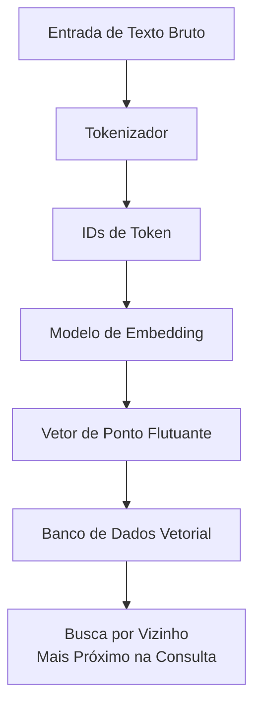
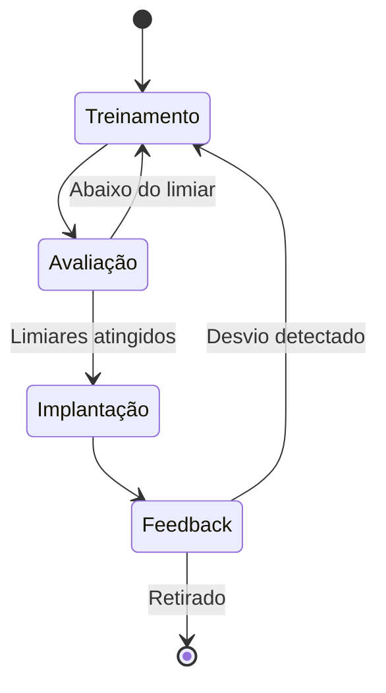
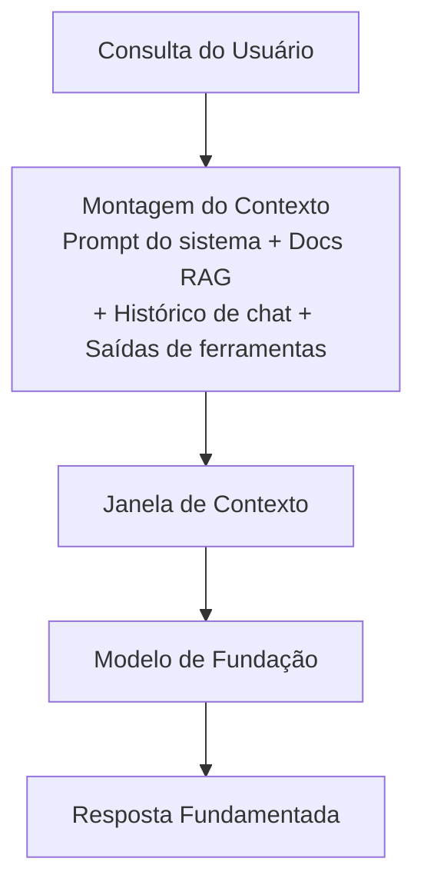
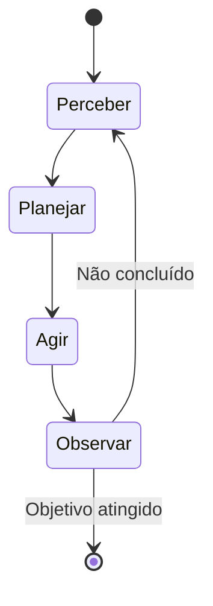
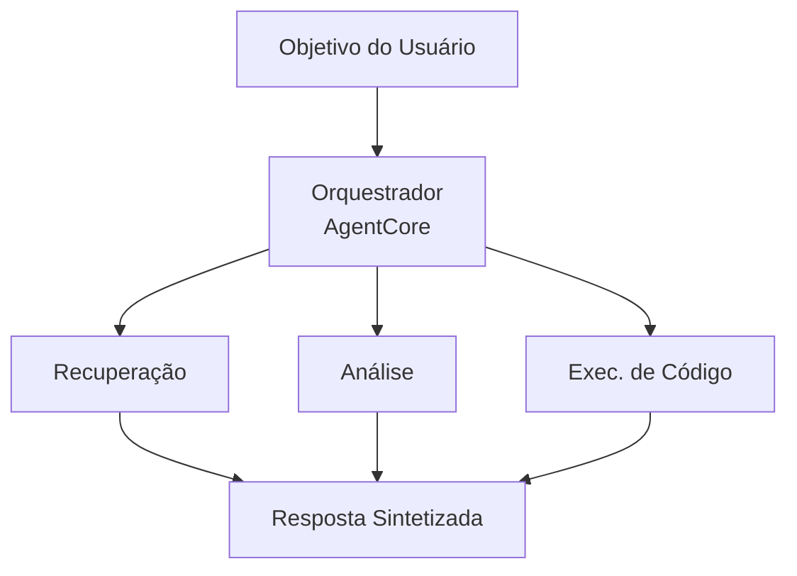

## Declaração de Tarefa 2.1: Explicar os conceitos básicos de IA generativa (GenAI)

A IA generativa produz novo conteúdo em vez de prever um rótulo ou classificar uma entrada. Essa distinção molda tudo: as arquiteturas de modelo usadas para construir esses sistemas, a forma como são cobrados, os modos de falha que exibem e a nova disciplina de engenharia de contexto que determina quais informações o modelo vê antes de responder. Esta declaração de tarefa abrange seis áreas de objetivo, três das quais são novas no guia do exame v1.1 e refletem a rapidez com que essa tecnologia passou da pesquisa para implantações em produção.[^201001]

A introdução do domínio estabeleceu que a IA generativa carrega 24% do peso do exame e que seu perfil de custo e falha difere substancialmente do aprendizado de máquina clássico. Esta declaração de tarefa fundamenta essas afirmações nos mecanismos subjacentes. Ao terminar esta seção, você será capaz de explicar o que é um token e por que a contagem de tokens de um prompt afeta diretamente a fatura, descrever como um FM passa do texto bruto para um serviço implantado, explicar o que significa engenharia de contexto e como ela se relaciona com a engenharia de prompts, e articular os padrões que sistemas multiagentes usam quando precisam coordenar entre múltiplos componentes de IA.

### 2.1.1 Conceitos fundamentais de GenAI

Os modelos de IA generativa compartilham um conjunto central de abstrações que aparecem em toda a documentação da AWS, nas páginas de preços dos fornecedores e nas revisões de design. Compreender essas abstrações é o pré-requisito para tudo mais no Domínio 2.

**Tokenização** é o primeiro passo no processamento de texto com um modelo de linguagem. Um *token* é a menor unidade de texto com a qual o modelo opera. Na maioria do texto em inglês, um token tem aproximadamente três a quatro caracteres, portanto a palavra "tokenization" se torna dois ou três tokens dependendo do tokenizador, enquanto a palavra "gato" é um token. Números, pontuação e caracteres de idiomas não latinos frequentemente produzem mais tokens por palavra do que a prosa padrão em inglês.[^201002] A contagem total de tokens de uma solicitação é a soma dos tokens de entrada (o texto que você envia) mais os tokens de saída (o texto que o modelo gera em resposta). Ambas as contagens aparecem na fatura.

**Chunking** é o processo de dividir um documento grande em segmentos menores antes de incorporá-lo ou recuperá-lo. Um PDF de 50 páginas não cabe na janela de contexto de um modelo como um único bloco, portanto é dividido em chunks sobrepostos de algumas centenas de tokens cada. O tamanho do chunk e a porcentagem de sobreposição são parâmetros ajustáveis que afetam a precisão da recuperação: chunks muito pequenos perdem o contexto circundante, enquanto chunks muito grandes desperdiçam o orçamento de tokens quando inseridos em um prompt.[^201003] Chunking é uma etapa de preparação, não uma capacidade do modelo, e é executado no momento da construção do índice, e não no momento da inferência.

*Embeddings* são representações numéricas de texto (ou imagens, ou áudio) que codificam significado semântico como vetores em um espaço de alta dimensão. Dois textos com significados semelhantes terão vetores de embedding que estão geometricamente próximos um do outro, o que torna possível a busca por similaridade em uma coleção de documentos. **Amazon Bedrock** expõe modelos de embedding como Amazon Titan Embeddings e Cohere Embed que aceitam texto e retornam um vetor de ponto flutuante.[^201004] Esses vetores são então armazenados em um banco de dados vetorial, que é um armazenamento de dados especializado otimizado para buscas por vizinho mais próximo. Os bancos de dados vetoriais comuns disponíveis na AWS incluem **Amazon OpenSearch Service** com o plugin k-NN, **Amazon Aurora** e **Amazon RDS for PostgreSQL** com a extensão pgvector, e **Amazon Neptune Analytics** com busca vetorial.[^201005]

*Figura 2.1.1: Pipeline de tokenização e embedding. O texto é primeiro convertido em IDs de token pelo tokenizador, depois mapeado para um vetor de alta dimensão pelo modelo de embedding e finalmente armazenado em um banco de dados vetorial para recuperação por similaridade.*

**Engenharia de prompts** é a prática de criar as entradas de texto enviadas a um modelo para melhorar a qualidade, precisão ou formato de suas saídas. Um prompt bem projetado pode incluir uma instrução, contexto, exemplos e um formato de saída explícito. A Declaração de Tarefa 3.2 abrange técnicas específicas de engenharia de prompts em detalhes; neste ponto a principal questão é que a engenharia de prompts é a alavanca mais imediata que um profissional tem sobre o comportamento do modelo sem alterar o modelo em si.[^201006]

**Grandes modelos de linguagem (LLMs) baseados em transformers** são a arquitetura dominante para as tarefas de linguagem modernas. A arquitetura *transformer*, introduzida em 2017, usa um mecanismo chamado *autoatenção* para ponderar a relevância de cada token em uma sequência em relação a todos os outros tokens ao produzir cada token de saída.[^201007] A autoatenção é o que permite que um transformer mantenha dependências de longo alcance no texto, como saber que o pronome "ele" se refere a um substantivo introduzido três frases atrás. A matemática da atenção não é testada no exame AIF-C01, mas o conceito importa para entender por que contextos mais longos são computacionalmente mais caros e por que a janela de contexto tem um tamanho finito.

**Modelos de fundação (FMs)** são modelos grandes treinados em conjuntos de dados amplos de propósito geral em escala enorme.[^201008] Um FM não é treinado para uma tarefa específica; em vez disso, aprende representações gerais de linguagem (ou imagens, ou código) que podem ser adaptadas a muitas tarefas downstream por meio de prompting, recuperação ou ajuste fino. Exemplos disponíveis pelo Amazon Bedrock incluem Anthropic Claude, Meta Llama, Amazon Nova e modelos da Mistral AI, entre outros.[^201009]

**Modelos multimodais** aceitam e produzem mais de um tipo de dado. Um FM multimodal pode aceitar uma imagem mais uma pergunta de texto e retornar uma resposta de texto, ou aceitar texto e retornar tanto texto quanto uma imagem. Dentro da família Amazon Nova no Amazon Bedrock, os modelos Lite, Pro e Premier processam texto, imagens, vídeo e documentos; o Nova Micro é apenas texto e é a opção de menor custo para casos de uso de texto puro.[^201010]

**Modelos de difusão** geram saídas aprendendo a reverter um processo de adição de ruído. Durante o treinamento, o modelo vê dados com quantidades crescentes de ruído aleatório adicionado, e aprende a prever e remover esse ruído passo a passo. No momento da inferência, começa com ruído puro e iterativamente o remove até criar uma imagem coerente, um clipe de áudio ou outro artefato.[^201011] Modelos de difusão são a base para capacidades de geração de imagens. O Amazon Bedrock inclui o Stable Diffusion da Stability AI como um modelo de geração de imagens nesta categoria.[^201012]

### 2.1.2 Casos de uso potenciais para modelos de GenAI

A IA generativa cobre uma gama mais ampla de tarefas de negócios do que a maioria dos sistemas de ML clássico porque os modelos subjacentes generalizam entre domínios. A questão prática não é se um modelo generativo poderia ajudar com uma determinada tarefa, mas se é o trade-off econômico e de precisão correto para esse caso específico.

*Tabela 2.1.1: Casos de uso comuns de GenAI e cenários de negócios representativos*

| Caso de uso | O que o modelo faz | Cenário de negócio representativo |
|------------|-------------------|----------------------------------|
| Geração de imagens | Produz novas imagens a partir de prompts de texto ou imagem | Equipes de marketing geram imagens de estilo de vida de produtos sem uma sessão fotográfica |
| Geração de vídeo | Gera clipes de vídeo curtos a partir de descrições de texto | Empresas de mídia produzem rascunhos de vídeos explicativos para revisão |
| Geração de áudio | Sintetiza fala ou música | Plataformas de e-learning geram narração para atualizações de cursos durante a noite |
| Sumarização | Condensa documentos longos em versões mais curtas | Departamentos jurídicos resumem contratos para destacar obrigações principais |
| Assistentes de IA | Responde perguntas, redige conteúdo, explica conceitos | Bots de base de conhecimento interna respondem a perguntas de RH dos funcionários |
| Tradução | Converte texto de um idioma para outro | Varejistas globais localizam descrições de produtos em 20 idiomas |
| Geração de código | Escreve, revisa e explica código-fonte | Desenvolvedores aceleram a implementação de recursos de rotina e a escrita de testes unitários |
| Agentes de atendimento ao cliente | Lida com consultas de clientes por meio de conversa | Centrais de atendimento desviam perguntas comuns sem envolvimento de agentes ao vivo |
| Busca | Retorna resultados semanticamente relevantes em vez de correspondências por palavras-chave | Portais de documentos corporativos apresentam a página de política correta mesmo quando a consulta usa uma formulação diferente |
| Motores de recomendação | Sugere itens com base no comportamento do usuário ou nas preferências declaradas | Serviços de streaming recomendam conteúdo usando sinais semânticos e colaborativos híbridos |

Cada tipo de caso de uso coloca demandas diferentes no modelo subjacente. Sumarização e tradução são principalmente tarefas de linguagem que favorecem LLMs. Geração de imagens e vídeo requer modelos generativos visuais de difusão ou outros. Geração de código se beneficia de modelos especificamente ajustados em linguagens de programação. Agentes de atendimento ao cliente se beneficiam de baixa latência, forte seguimento de instruções e capacidade de chamar ferramentas externas, o que se conecta diretamente aos padrões agênticos abordados no objetivo 2.1.6. Busca e recomendação usam as capacidades de embedding e similaridade de vetor do objetivo 2.1.1, tipicamente combinando-as com um padrão de geração aumentada por recuperação (RAG) abordado na Tarefa 3.1.

### 2.1.3 O ciclo de vida do FM

Um modelo de fundação não passa diretamente dos dados de treinamento para a produção. Ele passa por um ciclo de vida definido que tem mais estágios do que o ciclo de vida de ML clássico descrito na Tarefa 1.3. O pipeline clássico foca em um conjunto de dados rotulados, um modelo e um endpoint de previsão. O ciclo de vida do FM começa muito antes, com decisões sobre quais dados brutos usar no pré-treinamento, e adiciona loops de feedback pós-implantação que refinam continuamente o comportamento do modelo.

*Figura 2.1.2: Ciclo de vida do modelo de fundação. O caminho não é estritamente linear: falhas de avaliação retornam para o ajuste fino, e o feedback de produção pode acionar ciclos adicionais de adaptação.*

Os sete estágios do ciclo de vida do FM são:

- **Seleção de dados**: Curação do corpus de treinamento. Para pré-treinamento, é massivo e amplo (rastreamentos da web, livros, repositórios de código). Para ajuste fino, é específico do domínio e muito menor. A qualidade dos dados neste estágio determina diretamente o comportamento do modelo, incluindo seus vieses.[^201013]
- **Seleção de modelo**: Escolha de uma arquitetura (variante de transformer, modelo de difusão, multimodal), tamanho em parâmetros e se deve treinar do zero ou começar a partir de um FM existente. A maioria das implantações de negócios pula completamente o pré-treinamento do zero e escolhe entre os FMs disponíveis por um serviço como o Amazon Bedrock.[^201014]
- **Pré-treinamento**: Aprendizado de representações gerais a partir do amplo conjunto de dados usando grandes quantidades de computação (clusters de GPU executando por semanas ou meses). Este é o estágio que produz os pesos base do FM. O pré-treinamento é caro o suficiente para que virtualmente nenhuma empresa fora das hyperscalers o faça.[^201015]
- **Ajuste fino**: Atualização dos pesos base do FM em um conjunto de dados menor, específico de tarefa ou domínio. O ajuste fino adapta o comportamento do modelo sem repetir o custo completo de pré-treinamento. O Amazon Bedrock suporta trabalhos de ajuste fino personalizado, e o Amazon SageMaker AI suporta tanto o ajuste fino quanto técnicas mais avançadas de ajuste fino com eficiência de parâmetros.[^201016]
- **Avaliação**: Medição da qualidade do modelo em dados de teste separados. Para modelos generativos, a avaliação inclui métricas automáticas como ROUGE e BLEU para texto, mais avaliação humana e, cada vez mais, métodos de LLM-como-juiz. A Tarefa 3.4 abrange a avaliação em profundidade.
- **Implantação**: Servindo o modelo por meio de um endpoint de API onde os aplicativos podem enviar prompts e receber completações. O Amazon Bedrock gerencia a infraestrutura subjacente para os modelos suportados, enquanto o Amazon SageMaker AI dá às equipes controle direto sobre a configuração do endpoint.[^201017]
- **Feedback**: Coleta de sinais do tráfego de produção (latência, precisão, satisfação do usuário, taxas de erro) e uso deles para detectar desvio ou construir novos conjuntos de dados de ajuste fino. Isso fecha o loop e distingue o ciclo de vida do FM de uma execução de treinamento única.

A distinção principal do ciclo de vida de ML clássico na Tarefa 1.3 é o estágio de pré-treinamento. Os pipelines de ML clássico começam com um conjunto de dados rotulados específico para o problema. O ciclo de vida do FM começa com aprendizado auto-supervisionado em texto não rotulado em uma escala que cria capacidades gerais e somente depois se estreita para tarefas específicas por meio de ajuste fino ou prompting. Os profissionais de negócios geralmente entram no ciclo de vida do FM no estágio de ajuste fino ou implantação, não no pré-treinamento.

### 2.1.4 Modelo de preços baseado em tokens

A inferência de ML clássico é tipicamente cobrada por previsão ou por hora de endpoint. O preço baseado em tokens é diferente: você paga pelo número de tokens consumidos, tanto na entrada quanto na saída, em vez do recurso de computação que executou a solicitação. Compreender a economia de tokens é diretamente relevante para o planejamento de orçamento de qualquer projeto de IA generativa.

**Tokens de entrada** são os tokens no prompt que você envia ao modelo: o prompt do sistema, quaisquer documentos recuperados, histórico de conversa, saídas de ferramentas e a mensagem do usuário. **Tokens de saída** são os tokens que o modelo gera em resposta. O Amazon Bedrock, como a maioria dos provedores de FM em nuvem, cobra separadamente por tokens de entrada e de saída, e os tokens de saída têm preço mais alto porque gerar um token é computacionalmente mais caro do que processar um token de entrada.[^201018]

*Tabela 2.1.2: Estrutura de preços de token e alavancas de custo*

| Fator de preços | Descrição | Efeito no custo |
|----------------|-----------|-----------------|
| Preço de token de entrada | Custo por 1.000 tokens de entrada (varia por modelo) | Diretamente proporcional ao tamanho do prompt |
| Preço de token de saída | Custo por 1.000 tokens de saída, tipicamente 3x a 5x o preço de entrada | Diretamente proporcional ao tamanho da resposta |
| Cache de prompt | Reutilização de prefixos de prompt processados anteriormente | Reduz o custo efetivo de entrada para contexto repetido |
| Inferência em lote | Processamento assíncrono de muitas solicitações juntas | Desconto típico de 50% versus preços sob demanda |
| Throughput provisionado | Capacidade reservada para cargas de trabalho de alto volume e sustentado | Custo previsível, mas requer compromisso de volume |

Para tornar isso concreto, considere um cenário de atendimento ao cliente. Uma única interação pode incluir um prompt do sistema de 500 tokens, 1.000 tokens de documentos recuperados, uma mensagem do usuário de 50 tokens e uma resposta do modelo de 200 tokens. Isso é 1.550 tokens de entrada e 200 tokens de saída. Para um modelo com preço de US$ 0,003 por 1.000 tokens de entrada e US$ 0,015 por 1.000 tokens de saída, o custo por interação é de aproximadamente US$ 0,0077 (US$ 0,00465 de entrada + US$ 0,003 de saída). Com 100.000 interações por mês, a fatura é de aproximadamente US$ 770 para essa única chamada de modelo por interação. Se o fluxo de trabalho chamar o modelo várias vezes por interação (para roteamento, para reranqueamento de recuperação, para geração de resposta), esses números se multiplicam proporcionalmente.[^201019]

**Cache de prompt** permite que o provedor do modelo armazene a representação processada de um prefixo de prompt repetido para que solicitações subsequentes que compartilham esse prefixo não reprocessem esses tokens do zero. Quando o mesmo prompt do sistema é enviado com cada solicitação, armazenar em cache esse prefixo pode reduzir o custo efetivo de entrada para a porção armazenada em cache em 80 a 90 por cento.[^201020] O Amazon Bedrock suporta cache de prompt para os modelos aplicáveis.

**Inferência em lote** no Amazon Bedrock processa solicitações de forma assíncrona em vez de em tempo real. Em vez de enviar uma solicitação e aguardar a resposta, você envia um lote de solicitações e recupera os resultados após a conclusão do processamento. O trade-off é a latência: as respostas em lote chegam minutos a horas após a submissão em vez de segundos. Para casos de uso que toleram latência (filas de sumarização de documentos, trabalhos de tradução noturnos, geração de conteúdo em massa), a inferência em lote é uma alavanca de custo direta.[^201021]

A implicação prática para o planejamento de negócios é que os custos de tokens se acumulam com as decisões de arquitetura. Um padrão RAG que recupera três documentos de 500 tokens por consulta adiciona 1.500 tokens de entrada a cada solicitação. Um fluxo de trabalho agêntico que faz cinco chamadas de modelo por solicitação do usuário multiplica o custo por solicitação por aproximadamente cinco. Projetar para eficiência de tokens -- por meio de prompts mais curtos, cache de prompt, processamento em lote quando tolerável e dimensionamento correto da contagem de chunks de recuperação -- é tão importante quanto escolher o modelo certo.

### 2.1.5 Engenharia de contexto em aplicações de FM

A engenharia de prompts foca no texto e na estrutura de um único prompt: como formular uma instrução, como formatar um exemplo, quantos exemplos incluir. **Engenharia de contexto** é uma disciplina mais ampla que pergunta quais informações devem entrar na janela de contexto do modelo, em que forma e em que ordem.[^201022] Um modelo não vê o mundo; ele vê apenas o que cabe dentro de sua janela de contexto no momento da inferência. A engenharia de contexto é a prática de curar esse conteúdo deliberadamente.

A janela de contexto é o número máximo de tokens que um modelo pode processar em uma única passagem direta, incluindo tanto a entrada quanto a saída. As janelas de contexto dos modelos do Amazon Bedrock variam de dezenas de milhares a mais de um milhão de tokens, dependendo da família de modelos (por exemplo, certas variantes do Anthropic Claude alcançam um milhão de tokens com o cabeçalho beta de contexto de 1M, e o Amazon Nova Premier e o Meta Llama 4 Maverick oferecem janelas de um milhão de tokens no Bedrock).[^201023] Uma janela de contexto grande não significa que um aplicativo deve preenchê-la inteiramente: contextos mais longos aumentam a latência e o custo, e os modelos podem exibir o comportamento de *perder-se no meio* onde informações relevantes enterradas no meio de um contexto longo recebem menos atenção do que informações no início ou no final.[^201024]

*Figura 2.1.3: Montagem de contexto para aplicações de FM. A engenharia de contexto governa o que entra em cada slot da janela de contexto e como a entrada montada é ordenada antes que o modelo a processe.*

Os componentes que tipicamente compõem um contexto montado incluem:

- **Prompt do sistema**: A instrução permanente que define o papel do modelo, o tom, o formato de saída e as restrições. O prompt do sistema geralmente é constante em todas as solicitações de um aplicativo, o que o torna um bom candidato para cache de prompt.
- **Documentos recuperados**: Saída de um pipeline RAG. A etapa de recuperação seleciona os chunks mais semanticamente relevantes de um banco de dados vetorial, mas a engenharia de contexto determina quantos chunks incluir, como classificá-los e se deve resumir os chunks antes de incluí-los para economizar tokens.
- **Histórico de conversa**: Turnos anteriores de uma conversa de múltiplos turnos. Como as janelas de contexto são finitas, uma conversa longa eventualmente excede a janela. As estratégias de engenharia de contexto para o histórico incluem truncamento (descarte dos turnos mais antigos), sumarização (substituição de turnos antigos por um resumo progressivo) e retenção seletiva (manutenção apenas dos turnos sinalizados como de alto valor).
- **Saídas de ferramentas**: Quando um agente chama uma função externa (uma consulta ao banco de dados, uma busca na web, uma chamada de API), o resultado é injetado de volta no contexto para que o modelo raciocine sobre ele. O formato das saídas de ferramentas afeta a confiabilidade com que o modelo as interpreta.
- **Dados estruturados**: Tabelas, registros JSON ou pares chave-valor que fornecem fundamentação factual. Dados estruturados são mais eficientes em tokens do que descrições em prosa dos mesmos fatos quando o modelo precisa referenciar valores específicos.

A distinção da engenharia de prompts é de escopo. A engenharia de prompts responde "como devo formular esta instrução?" A engenharia de contexto responde "o que deve estar na janela de contexto, quanto, em que forma e em que sequência?" Ambas as disciplinas são relevantes para aplicações de FM em produção, mas a engenharia de contexto é a que escala com a complexidade do aplicativo. Um chatbot simples pode ter sua engenharia de prompts feita uma vez. Um agente complexo que coordena recuperações, chamadas de ferramentas e histórico de múltiplos turnos requer engenharia de contexto contínua para permanecer dentro dos orçamentos de tokens e manter a qualidade das respostas.

*Tabela 2.1.3: Técnicas de engenharia de contexto e seus trade-offs*

| Técnica | O que faz | Trade-off |
|---------|-----------|-----------|
| Sumarização da janela de contexto | Comprime turnos antigos de conversa em um resumo mais curto | Perde a redação exata; introduz possível distorção |
| Recuperação seletiva | Recupera apenas os top-k chunks mais relevantes em vez de todos os candidatos | Pode perder documentos relevantes se o modelo de recuperação classificar mal |
| Pré-sumarização de chunk | Resume cada documento recuperado antes de incluí-lo | Reduz tokens por documento ao custo de chamadas adicionais ao modelo |
| Cache de prompt | Armazena representações processadas de prefixos repetidos | Requer estrutura de prompt que mantém a porção armazenada em cache estável |
| Formatação de saída de ferramentas | Converte respostas brutas de API em formatos compactos legíveis pelo modelo | Requer lógica de formatação por ferramenta na camada de aplicação |

### 2.1.6 Conceitos fundamentais de IA agêntica

Um agente de IA é um sistema em que um FM não apenas responde a um único prompt, mas opera em um loop: percebe um objetivo ou uma observação, planeja um curso de ação, executa essa ação (frequentemente chamando uma ferramenta externa) e depois observa o resultado antes de decidir se o objetivo está completo.[^201025] Uma única chamada de FM produz uma resposta e para. Um agente é executado até que uma condição de parada seja atingida, que pode ser a conclusão de uma tarefa de múltiplas etapas, o esgotamento de um limite de turnos ou a determinação de que a tarefa é impossível com as ferramentas disponíveis.

*Figura 2.1.4: O loop do agente. Um agente percorre os ciclos de perceber, planejar, agir e observar até que uma condição de parada seja atingida.*

As arquiteturas de agente único lidam com muitas tarefas, mas fluxos de trabalho complexos frequentemente requerem múltiplos agentes operando em coordenação. **Sistemas multiagentes** distribuem o trabalho entre agentes especializados, cada um responsável por um aspecto da tarefa geral.[^201026] O exame testa o conhecimento de quatro padrões de coordenação:

- **Padrão orquestrador/trabalhador**: Um agente orquestrador central recebe o objetivo do usuário, o decompõe em subtarefas, despacha cada subtarefa para um agente trabalhador especializado, coleta os resultados e sintetiza uma resposta final. O orquestrador não executa o trabalho em si; ele gerencia o fluxo de trabalho.
- **Padrão hierárquico**: Uma estrutura em árvore na qual um agente de nível superior gerencia agentes de nível intermediário, que por sua vez gerenciam agentes de nível folha. Esta é uma extensão do padrão orquestrador/trabalhador para múltiplos níveis de decomposição, adequado para tarefas com estrutura hierárquica natural (por exemplo, uma tarefa de pesquisa que se decompõe em áreas de tópicos, cada uma das quais se decompõe em recuperação de fontes e análise).
- **Padrão sequencial**: Os agentes são dispostos em um pipeline onde a saída de um agente é a entrada para o próximo. Isso é apropriado quando cada etapa deve ser concluída antes que a próxima possa começar, e quando não há necessidade de o agente downstream influenciar o comportamento do agente upstream.
- **Padrão de debate**: Múltiplos agentes produzem respostas de forma independente para a mesma consulta, depois avaliam ou criticam os resultados uns dos outros, com um agente final sintetizando a melhor resposta. Isso melhora a precisão em tarefas onde diferentes abordagens de raciocínio chegam a conclusões diferentes.

**O Model Context Protocol (MCP)** é um protocolo padronizado para conectar agentes de IA a ferramentas externas, fontes de dados e serviços.[^201027] Sem um protocolo comum, cada integração de agente com um sistema externo requer código personalizado para lidar com autenticação, formatação de solicitação e análise de resposta. O MCP define uma interface cliente-servidor padrão para que um agente possa descobrir as ferramentas disponíveis, chamá-las com argumentos estruturados e receber resultados estruturados sem código específico de integração. A AWS declarou suporte ao MCP dentro do ecossistema Amazon Bedrock, e **Strands Agents**, o SDK de código aberto da AWS para construção de aplicações agênticas, implementa a interface de cliente MCP.[^201028]

Os padrões de comunicação multiagente descrevem como os agentes trocam mensagens. Os agentes podem se comunicar diretamente (peer-to-peer), por meio de uma fila de mensagens compartilhada ou por meio de um broker centralizado. A escolha do padrão de comunicação afeta a confiabilidade, as garantias de ordenação e a capacidade de auditar o que cada agente disse a qual outro agente. Em sistemas de produção, as filas de mensagens são preferidas em relação às chamadas diretas de agente para agente porque desacoplam o agente remetente do agente destinatário e fornecem um registro durável de todas as mensagens entre agentes.

*Tabela 2.1.4: Tipos de memória em sistemas de IA agêntica*

| Tipo de memória | Escopo | Onde armazenado | Caso de uso |
|----------------|--------|-----------------|------------|
| Curto prazo (de trabalho) | Sessão atual ou loop do agente | Janela de contexto | Raciocínio sobre a tarefa atual |
| Longo prazo (persistente) | Entre sessões | Banco de dados externo ou armazenamento de vetores | Lembrança de preferências do usuário, decisões passadas |
| Episódico | Eventos ou interações passadas específicas | Armazenamento de registros recuperável | Recordação do que aconteceu em um engagement anterior |
| Semântico | Conhecimento geral do mundo ou do domínio | Incorporado nos pesos do modelo ou índice RAG | Resposta a perguntas factuais |

**Gerenciamento de memória** é a prática de decidir quais informações um agente retém, em qual camada de memória e por quanto tempo.[^201029] A memória de curto prazo é a própria janela de contexto. Quando o contexto de trabalho de um agente se aproxima do limite da janela, a camada de gerenciamento de memória deve decidir o que comprimir, resumir ou descarregar para o armazenamento de longo prazo. A memória de longo prazo tipicamente usa um banco de dados vetorial (como descrito no objetivo 2.1.1) para que o agente possa recuperar experiências passadas relevantes semanticamente em vez de varrer um log completo.

**Uso de ferramentas** em sistemas agênticos refere-se à capacidade do agente de chamar funções externas e incorporar os resultados em seu raciocínio.[^201030] Uma ferramenta pode ser uma busca na web, uma consulta ao banco de dados, uma chamada de API REST, um interpretador de código ou qualquer função que retorne um resultado que o agente possa observar. As ferramentas são definidas por seu esquema de entrada e esquema de saída; o FM usa esses esquemas para decidir quando chamar uma ferramenta e quais argumentos passar. Isso é às vezes chamado de *chamada de função* na documentação da API.

**Orquestração de fluxo de trabalho** coordena a execução de processos agênticos de múltiplas etapas, lidando com sequenciamento, recuperação de erros e gerenciamento de estado entre chamadas de agente.[^201031] **Amazon Bedrock AgentCore**, a camada de runtime gerenciado mais recente para cargas de trabalho agênticas no Amazon Bedrock, lida com essa camada de orquestração para aplicações agênticas em produção, fornecendo infraestrutura de execução para que as equipes não precisem construir e operar seu próprio runtime de agente.[^201032] Strands Agents é o SDK de código aberto que fica acima do runtime e oferece aos desenvolvedores uma forma baseada em Python de definir agentes, ferramentas e comportamentos de memória, com suporte integrado ao cliente MCP.[^201033]

*Figura 2.1.5: Padrão orquestrador/trabalhador multiagente no Amazon Bedrock AgentCore. O orquestrador gerencia os agentes trabalhadores e monta suas saídas em uma resposta final.*

A relevância de negócios da IA agêntica é que ela desbloqueia casos de uso que o prompting de disparo único não consegue lidar: tarefas que requerem múltiplas buscas de ferramentas, tarefas que devem se adaptar no meio da execução com base em resultados intermediários e tarefas que envolvem coordenação entre subsistemas especializados. Ao mesmo tempo, sistemas agênticos são mais complexos de projetar, mais caros de executar (cada iteração do loop do agente consome tokens) e mais difíceis de auditar do que chamadas de disparo único. A Declaração de Tarefa 3.1 revisita os agentes de IA da perspectiva do design, cobrindo quando usar agentes versus padrões mais simples.

---

Esta seção construiu o vocabulário conceitual para todo o Domínio 2. Você agora pode definir as primitivas centrais de IA generativa (tokens, embeddings, vetores, atenção, modelos de fundação, modelos de difusão), explicar o ciclo de vida do FM e como ele difere do pipeline de ML clássico, calcular custos aproximados baseados em tokens para uma determinada arquitetura, descrever o que significa engenharia de contexto e como ela difere da engenharia de prompts, e articular os padrões principais para sistemas multiagentes e o papel do MCP. A Declaração de Tarefa 2.2 dá o próximo passo: dadas essas capacidades, quais são os limites reais da IA generativa e como uma empresa deve ponderar esses limites ao selecionar uma solução generativa?

---

## Perguntas de autoavaliação

**Pergunta 1**

Uma empresa está construindo um sistema de perguntas e respostas sobre documentos que divide em chunks um PDF de 200 páginas, incorpora os chunks e os armazena em um banco de dados vetorial. Quando um usuário faz uma pergunta, o sistema recupera os três chunks mais relevantes e os inclui no prompt para um LLM. Um desenvolvedor relata que o modelo às vezes ignora informações relevantes que aparecem no meio de chunks recuperados longos.

Qual das alternativas a seguir MELHOR explica esse comportamento e a mitigação MAIS apropriada?

A. O tokenizador do modelo está descartando tokens do meio do documento antes que o modelo de embedding os processe. Reduza o tamanho do chunk para menos de 50 tokens para que o tokenizador retenha todo o conteúdo.

B. Os grandes modelos de linguagem podem exibir o comportamento de perder-se no meio, onde o conteúdo no meio de um contexto longo recebe menos atenção do que o conteúdo no início ou no final. Chunks mais curtos ou a sumarização de chunks antes da inclusão podem reduzir esse efeito.

C. O banco de dados vetorial está realizando busca por palavras-chave em vez de busca semântica, portanto está recuperando chunks com base na frequência de palavras em vez do significado. Mude para um índice de busca de texto completo.

D. Os modelos de difusão não são projetados para tarefas de recuperação de texto. Substitua o LLM por um modelo de difusão treinado em compreensão de documentos.

*Explicação.* A opção B está correta. O fenômeno de perder-se no meio é um comportamento documentado de LLMs baseados em transformer, no qual informações posicionadas no meio de uma janela de contexto longa recebem proporcionalmente menos peso de atenção do que informações no início ou no final do contexto.[^201034] Este é um problema de engenharia de contexto, não um problema de tokenizador (A está incorreta), não um problema de busca no banco de dados vetorial (C está incorreta) e não uma questão de seleção de classe de modelo (D está incorreta e os modelos de difusão não realizam recuperação de texto). As mitigações incluem reduzir o tamanho do chunk para que cada chunk tenha um escopo mais estreito, resumir os chunks antes de incluí-los para reduzir a contagem de tokens e ordenar os chunks mais relevantes no início do prompt em vez de enterrá-los no meio. Todas essas são decisões de engenharia de contexto: elas governam o que entra na janela de contexto, em que forma e em que ordem, que é exatamente a disciplina descrita no objetivo 2.1.5.[^201035]

---

**Pergunta 2**

Uma organização está avaliando o custo de executar um aplicativo de atendimento ao cliente de IA generativa no Amazon Bedrock. Cada interação com o cliente inclui um prompt do sistema de 600 tokens, uma média de 900 tokens de documentos recuperados, uma mensagem do usuário de 100 tokens e uma resposta do modelo de 300 tokens. O aplicativo lida com 500.000 interações por mês.

Qual fator de preço teria o impacto MAIS significativo se a organização quiser reduzir os custos mensais sem alterar o modelo ou a qualidade das respostas?

A. Mudar do throughput provisionado para o preço sob demanda para todas as solicitações.

B. Aplicar cache de prompt ao prompt do sistema, que é idêntico para cada solicitação.

C. Aumentar o número de chunks de documentos recuperados de 3 para 6 por interação.

D. Reduzir o limite máximo de tokens de saída de 300 para 100 tokens.

*Explicação.* A opção B está correta. Em cada interação, o prompt do sistema tem 600 tokens e é idêntico em todas as 500.000 solicitações. O cache de prompt permite que o provedor armazene a representação processada desse prefixo repetido e cobre uma taxa substancialmente menor (tipicamente 80 a 90 por cento menos) para acertos de cache nesses 600 tokens.[^201036] Com 500.000 solicitações, a economia na porção armazenada em cache é material. A opção A está incorreta porque o throughput provisionado fornece um desconto de capacidade reservada em relação ao preço sob demanda; mudar de provisionado para sob demanda aumentaria o custo, não o reduziria. A opção C está incorreta porque adicionar mais chunks recuperados aumenta a contagem de tokens de entrada por solicitação, o que aumenta o custo. A opção D poderia reduzir os custos de tokens de saída, mas a pergunta especifica nenhuma alteração na qualidade da resposta; truncar arbitrariamente a saída provavelmente reduziria a qualidade. O cache de prompt visa a porção de maior repetição do prompt e reduz o custo sem alterar o conteúdo enviado ao modelo.[^201037]

---

**Pergunta 3**

Um analista de negócios está revisando uma proposta para um sistema de IA agêntica que lidará com solicitações de reembolso de clientes. O sistema proposto usa um agente orquestrador que recebe a solicitação de reembolso, chama um agente trabalhador para pesquisar o histórico de pedidos, chama um segundo agente trabalhador para verificar a política de reembolso e então gera uma decisão. Cada etapa envolve uma chamada de modelo separada.

Qual das alternativas a seguir é a consideração PRIMÁRIA que o analista deve levantar sobre o custo desta arquitetura em comparação com uma única chamada de LLM para a mesma tarefa?

A. Sistemas multiagentes não são suportados pelo Amazon Bedrock AgentCore, portanto a equipe precisará construir uma camada de orquestração personalizada que adiciona custo de engenharia.

B. O loop do agente faz múltiplas chamadas de modelo por solicitação do usuário, e cada chamada consome tokens de entrada e de saída. O custo total de tokens por solicitação será maior do que uma chamada de disparo único que inclui todo o contexto em um único prompt.

C. Sistemas agênticos usam modelos de difusão internamente, que têm preço por token mais alto do que LLMs baseados em transformer no Amazon Bedrock.

D. O padrão orquestrador/trabalhador exige que todos os agentes trabalhadores usem o mesmo modelo de fundação, o que elimina a capacidade de usar um modelo mais barato para as etapas de pesquisa.

*Explicação.* A opção B está correta. Cada chamada de modelo em um loop agêntico incorre em custos de tokens de entrada e de saída. Um agente orquestrador que faz três chamadas de modelo (uma para decompor a tarefa, uma para chamar cada trabalhador e uma para sintetizar o resultado) consumirá várias vezes mais tokens por solicitação do usuário do que um prompt de disparo único que inclui todo o contexto relevante. Este é o principal trade-off de custo para arquiteturas agênticas e é diretamente abordado no objetivo 2.1.4 sobre preços baseados em tokens e no objetivo 2.1.6 sobre IA agêntica.[^201038] A opção A está incorreta porque o Amazon Bedrock AgentCore Runtime foi especificamente projetado para suportar orquestração multiagente. A opção C está incorreta porque os sistemas agênticos usam LLMs (modelos baseados em transformer) para raciocínio, não modelos de difusão; os modelos de difusão geram imagens e outras mídias, não as etapas de raciocínio em um loop de agente. A opção D está incorreta porque o padrão orquestrador/trabalhador suporta modelos heterogêneos entre trabalhadores; usar modelos mais baratos e rápidos para etapas de pesquisa é uma técnica comum de otimização de custos.[^201039]

---

**Pergunta 4**

Uma equipe de desenvolvimento está construindo um chatbot empresarial no Amazon Bedrock. Eles percebem que a janela de contexto é preenchida após aproximadamente 20 turnos de conversa porque cada turno anexa a conversa anterior completa à próxima solicitação. A equipe quer manter a coerência conversacional além de 20 turnos sem alterar o modelo.

Qual técnica de engenharia de contexto aborda MAIS diretamente esse problema?

A. Substitua o LLM baseado em transformer por um modelo de difusão, que não usa janelas de contexto e, portanto, não tem limite de turnos.

B. Mude do preço sob demanda para o throughput provisionado, que aloca uma janela de contexto maior para o aplicativo.

C. Aplique a sumarização da janela de contexto: substitua os turnos antigos de conversa por um resumo progressivo gerado pelo modelo e inclua apenas o resumo mais os turnos recentes em cada solicitação.

D. Aumente o tamanho do chunk dos documentos recuperados para reduzir o número de chunks incluídos no contexto, liberando espaço para mais histórico de conversa.

*Explicação.* A opção C está correta. A sumarização da janela de contexto é uma técnica padrão de engenharia de contexto para conversas de múltiplos turnos: à medida que o histórico acumulado se aproxima do limite da janela, o aplicativo usa o modelo para produzir um resumo comprimido dos turnos mais antigos, substitui esses turnos pelo resumo e anexa apenas os turnos recentes na íntegra.[^201040] Isso preserva a substância da conversa sem exceder a janela. A opção A está incorreta; os modelos de difusão geram imagens e áudio, não conversas de texto, e não resolvem as limitações da janela de contexto. A opção B está incorreta; o throughput provisionado é um constructo de preços que reserva capacidade de computação, não um mecanismo para expandir o tamanho da janela de contexto. A opção D aborda um slot de contexto diferente (documentos recuperados) e só ajudaria se o contexto fosse dominado pela saída de recuperação em vez do histórico de conversa, o que o cenário não indica.[^201041]

---

**Pergunta 5**

Uma empresa quer integrar suas ferramentas internas -- incluindo um sistema CRM, um banco de dados de tickets e uma API de inventário -- com um agente de IA para que o agente possa pesquisar registros de clientes, criar tickets de serviço e verificar níveis de estoque em uma única conversa. Um desenvolvedor recomenda usar o Model Context Protocol (MCP).

Qual afirmação MELHOR descreve o papel do MCP nesta integração?

A. O MCP é um padrão de formato de dados que converte registros de CRM, tickets e dados de inventário em tokens antes de serem enviados ao modelo de fundação.

B. O MCP é um nível de preços dentro do Amazon Bedrock que reduz o custo das chamadas de modelo feitas por agentes que acessam ferramentas externas.

C. O MCP define uma interface cliente-servidor padrão que permite que um agente descubra ferramentas disponíveis, as chame com argumentos estruturados e receba resultados estruturados sem escrever código de integração personalizado para cada sistema.

D. O MCP é um protocolo de gerenciamento de memória que determina quais turnos de conversa reter no armazenamento de longo prazo e quais descartar após cada iteração do loop do agente.

*Explicação.* A opção C está correta. O Model Context Protocol define uma interface padronizada entre um agente de IA (o cliente MCP) e ferramentas ou serviços externos (servidores MCP). Quando um sistema CRM, um sistema de tickets e uma API de inventário cada um expõe um endpoint de servidor MCP, o agente pode descobrir e chamar os três por meio do mesmo protocolo sem que a equipe de desenvolvimento escreva três camadas de integração personalizadas separadas.[^201042] O Strands Agents, o SDK de código aberto da AWS, inclui suporte integrado ao cliente MCP, e o Amazon Bedrock AgentCore fornece o ambiente de runtime no qual esses agentes são executados. A opção A está incorreta; o MCP não é um padrão de tokenização ou conversão de formato de dados. A opção B está incorreta; o MCP não é um constructo de preços. A opção D está incorreta; o gerenciamento de memória é uma preocupação separada da conectividade de ferramentas, e o MCP não governa o que um agente retém na memória entre turnos.[^201043]

---

**Pergunta 6**

Um modelo de fundação foi pré-treinado em um grande corpus geral e depois ajustado na documentação técnica interna de uma empresa. O modelo agora está implantado pelo Amazon Bedrock. Seis meses depois, a equipe observa que as respostas do modelo sobre produtos mais novos lançados após a data de ajuste fino são imprecisas.

Qual estágio do ciclo de vida do FM aborda MAIS diretamente esse problema e qual é a ação recomendada?

A. Pré-treinamento: a empresa deve repetir a execução completa de pré-treinamento com um corpus atualizado que inclui a documentação de produtos mais novos.

B. Seleção de dados: a empresa deve alterar o tokenizador usado para processar os novos documentos de produto antes de serem alimentados no modelo existente.

C. Feedback e ajuste fino: o feedback de produção mostra o problema de limite de conhecimento; a equipe deve executar um novo trabalho de ajuste fino em um conjunto de dados que inclui a documentação de produtos mais novos, ou implementar RAG para recuperar informações atuais sobre produtos no momento da inferência.

D. Implantação: a empresa deve mudar o endpoint de serving do Amazon Bedrock para o Amazon SageMaker AI, que atualiza automaticamente o modelo com novos dados do ambiente de produção.

*Explicação.* A opção C está correta. O ciclo de vida do FM inclui um estágio de feedback onde os sinais de produção (neste caso, imprecisão em produtos mais novos) acionam um retorno ao ajuste fino com dados atualizados.[^201044] O problema de limite de conhecimento é um desafio padrão de gerenciamento do ciclo de vida do FM: o modelo não sabe sobre eventos ou documentos que postdatam seu treinamento. Dois remédios padrão existem: executar um novo trabalho de ajuste fino que adiciona os dados de produtos mais novos ao corpus de treinamento, ou implementar geração aumentada por recuperação (RAG) para que a documentação atual do produto seja recuperada de um índice atualizado regularmente e injetada no contexto no momento da inferência. O RAG é frequentemente o caminho mais rápido porque não requer uma nova execução de treinamento. A opção A está incorreta; repetir o pré-treinamento completo é proibitivamente caro e desnecessário quando o objetivo é adicionar atualizações específicas do domínio. A opção B está incorreta; o tokenizador processa texto em tokens independentemente da atualidade do conteúdo e não é a causa dos limites de conhecimento. A opção D está incorreta; mudar a infraestrutura de serving não atualiza os pesos do modelo; o Amazon SageMaker AI não retreina automaticamente um modelo implantado a partir do tráfego de produção.[^201045]

---

[^201001]: AWS Certification. AIF-C01 Exam Guide v1.1. URL: <https://docs.aws.amazon.com/aws-certification/latest/ai-practitioner-01/ai-practitioner-01.html>
[^201002]: Anthropic. Token counting in Claude models. URL: <https://docs.anthropic.com/en/docs/about-claude/models>
[^201003]: AWS Documentation. Chunking strategies in Amazon Bedrock Knowledge Bases. URL: <https://docs.aws.amazon.com/bedrock/latest/userguide/kb-chunking-parsing.html>
[^201004]: AWS Documentation. Amazon Titan Embeddings models in Amazon Bedrock. URL: <https://docs.aws.amazon.com/bedrock/latest/userguide/titan-embedding-models.html>
[^201005]: AWS Documentation. Vector engine for Amazon OpenSearch Service. URL: <https://docs.aws.amazon.com/opensearch-service/latest/developerguide/knn.html>
[^201006]: AWS Documentation. Prompt engineering guidelines for Amazon Bedrock. URL: <https://docs.aws.amazon.com/bedrock/latest/userguide/prompt-engineering-guidelines.html>
[^201007]: Vaswani, A. et al. Attention Is All You Need. URL: <https://arxiv.org/abs/1706.03762>
[^201008]: AWS Documentation. What are foundation models? URL: <https://docs.aws.amazon.com/bedrock/latest/userguide/what-is-a-foundation-model.html>
[^201009]: AWS Documentation. Supported foundation models in Amazon Bedrock. URL: <https://docs.aws.amazon.com/bedrock/latest/userguide/models-supported.html>
[^201010]: AWS Documentation. Amazon Nova models overview. URL: <https://docs.aws.amazon.com/bedrock/latest/userguide/amazon-nova.html>
[^201011]: Ho, J. et al. Denoising Diffusion Probabilistic Models. URL: <https://arxiv.org/abs/2006.11239>
[^201012]: AWS Documentation. Stability AI models in Amazon Bedrock. URL: <https://docs.aws.amazon.com/bedrock/latest/userguide/stability-ai.html>
[^201013]: AWS Documentation. Data selection best practices for foundation model training. URL: <https://docs.aws.amazon.com/sagemaker/latest/dg/clarify-foundation-model-evaluate.html>
[^201014]: AWS Documentation. Model selection in Amazon Bedrock. URL: <https://docs.aws.amazon.com/bedrock/latest/userguide/model-selection.html>
[^201015]: AWS Blog. Training large language models at scale on AWS. URL: <https://aws.amazon.com/blogs/machine-learning/training-large-language-models-at-scale-on-aws/>
[^201016]: AWS Documentation. Fine-tuning models in Amazon Bedrock. URL: <https://docs.aws.amazon.com/bedrock/latest/userguide/custom-models.html>
[^201017]: AWS Documentation. Deploying models with Amazon Bedrock endpoints. URL: <https://docs.aws.amazon.com/bedrock/latest/userguide/inference.html>
[^201018]: AWS Documentation. Amazon Bedrock pricing. URL: <https://aws.amazon.com/bedrock/pricing/>
[^201019]: AWS Documentation. On-demand token pricing for Amazon Bedrock. URL: <https://aws.amazon.com/bedrock/pricing/>
[^201020]: AWS Documentation. Prompt caching in Amazon Bedrock. URL: <https://docs.aws.amazon.com/bedrock/latest/userguide/prompt-caching.html>
[^201021]: AWS Documentation. Batch inference jobs in Amazon Bedrock. URL: <https://docs.aws.amazon.com/bedrock/latest/userguide/batch-inference.html>
[^201022]: AWS Blog. Context engineering for large language model applications. URL: <https://aws.amazon.com/blogs/machine-learning/context-engineering-for-llm-applications/>
[^201023]: AWS Documentation. Amazon Bedrock supported models and context window sizes. URL: <https://docs.aws.amazon.com/bedrock/latest/userguide/models-supported.html>
[^201024]: Liu, N. F. et al. Lost in the Middle: How Language Models Use Long Contexts. URL: <https://arxiv.org/abs/2307.03172>
[^201025]: AWS Documentation. What are AI agents? Amazon Bedrock Agents overview. URL: <https://docs.aws.amazon.com/bedrock/latest/userguide/agents.html>
[^201026]: AWS Documentation. Multi-agent collaboration in Amazon Bedrock. URL: <https://docs.aws.amazon.com/bedrock/latest/userguide/agents-multi-agents.html>
[^201027]: Anthropic. Model Context Protocol specification. URL: <https://modelcontextprotocol.io/introduction>
[^201028]: AWS Blog. Strands Agents: open-source SDK for building AI agents on AWS. URL: <https://aws.amazon.com/blogs/machine-learning/strands-agents-open-source-sdk/>
[^201029]: AWS Documentation. Memory management in Amazon Bedrock Agents. URL: <https://docs.aws.amazon.com/bedrock/latest/userguide/agents-memory.html>
[^201030]: AWS Documentation. Action groups and tool use in Amazon Bedrock Agents. URL: <https://docs.aws.amazon.com/bedrock/latest/userguide/agents-action-groups.html>
[^201031]: AWS Documentation. Workflow orchestration with Amazon Bedrock Agents. URL: <https://docs.aws.amazon.com/bedrock/latest/userguide/agents.html>
[^201032]: AWS Documentation. Amazon Bedrock AgentCore. URL: <https://aws.amazon.com/bedrock/agentcore/>
[^201033]: AWS GitHub. Strands Agents SDK repository. URL: <https://github.com/strands-agents/sdk-python>
[^201034]: Liu, N. F. et al. Lost in the Middle: How Language Models Use Long Contexts. URL: <https://arxiv.org/abs/2307.03172>
[^201035]: AWS Documentation. Knowledge base chunking and retrieval settings. URL: <https://docs.aws.amazon.com/bedrock/latest/userguide/kb-chunking-parsing.html>
[^201036]: AWS Documentation. Prompt caching pricing in Amazon Bedrock. URL: <https://docs.aws.amazon.com/bedrock/latest/userguide/prompt-caching.html>
[^201037]: AWS Documentation. Amazon Bedrock cost optimization strategies. URL: <https://docs.aws.amazon.com/bedrock/latest/userguide/cost-optimization.html>
[^201038]: AWS Documentation. Token-based pricing for agents in Amazon Bedrock. URL: <https://aws.amazon.com/bedrock/pricing/>
[^201039]: AWS Documentation. Multi-agent collaboration patterns in Amazon Bedrock. URL: <https://docs.aws.amazon.com/bedrock/latest/userguide/agents-multi-agents.html>
[^201040]: AWS Blog. Managing long conversations with context-window summarization. URL: <https://aws.amazon.com/blogs/machine-learning/managing-long-conversations-llm/>
[^201041]: AWS Documentation. Context window management in Amazon Bedrock. URL: <https://docs.aws.amazon.com/bedrock/latest/userguide/inference.html>
[^201042]: Model Context Protocol. Introduction and specification. URL: <https://modelcontextprotocol.io/introduction>
[^201043]: AWS Blog. Using MCP with Strands Agents on Amazon Bedrock. URL: <https://aws.amazon.com/blogs/machine-learning/mcp-strands-agents-bedrock/>
[^201044]: AWS Documentation. FM lifecycle and feedback in Amazon Bedrock. URL: <https://docs.aws.amazon.com/bedrock/latest/userguide/custom-models.html>
[^201045]: AWS Documentation. Retrieval-augmented generation with Amazon Bedrock Knowledge Bases. URL: <https://docs.aws.amazon.com/bedrock/latest/userguide/knowledge-base.html>
