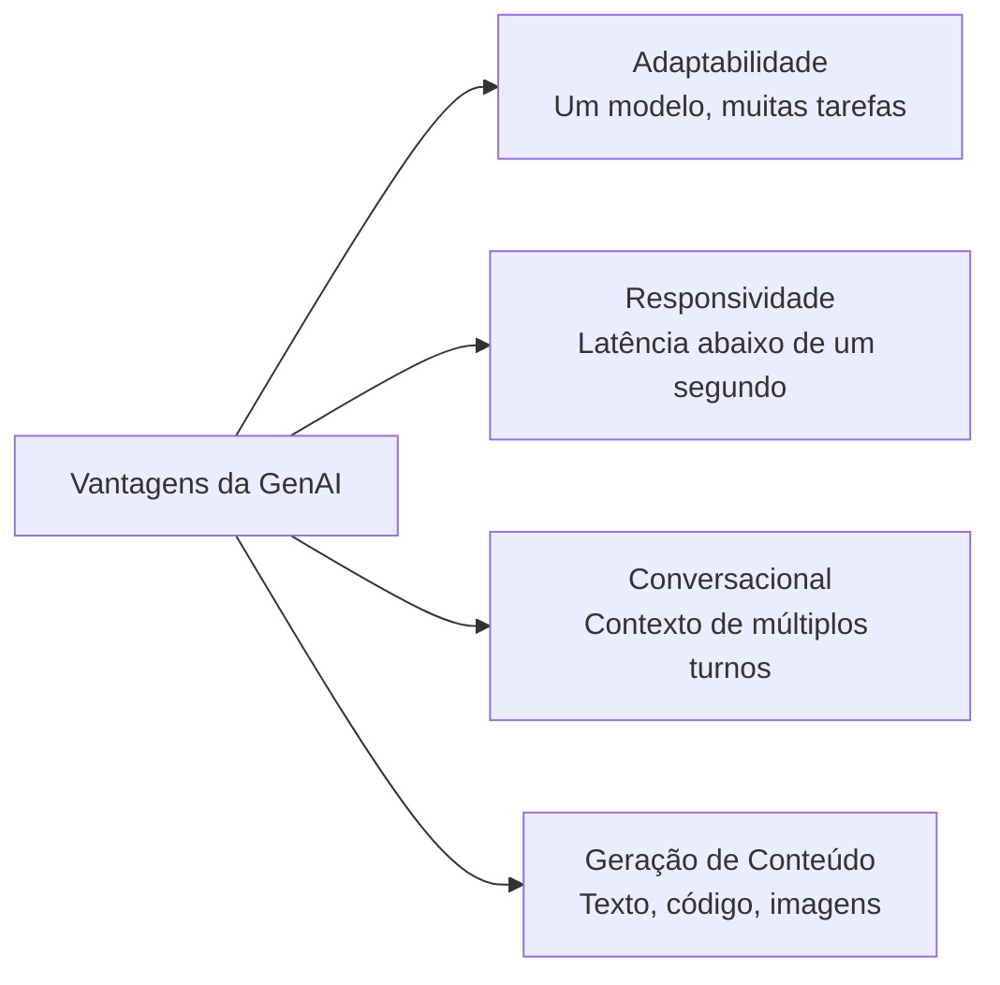
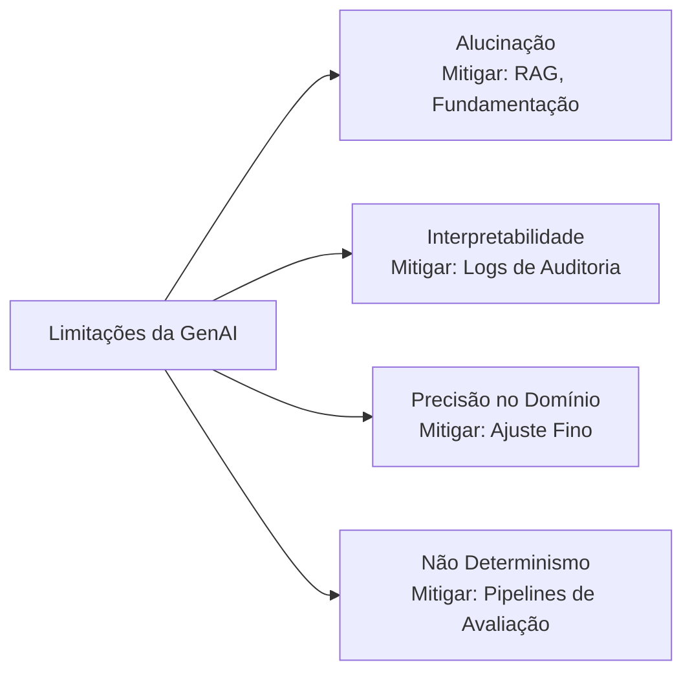
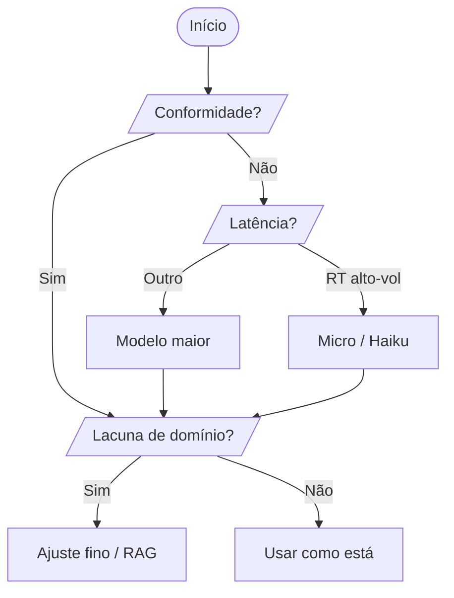
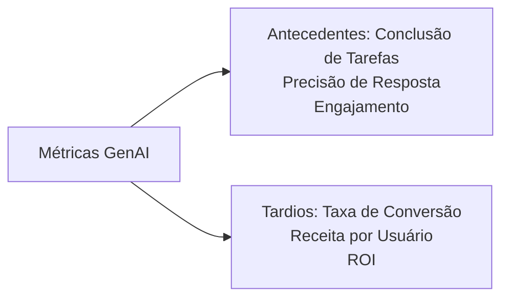

## Declaração de Tarefa 2.2: Compreender as capacidades e limitações da GenAI para resolver problemas de negócios

A IA generativa pode produzir conteúdo, manter conversas estendidas e se adaptar a tarefas que sistemas de ML clássico não conseguem lidar sem retreinamento completo. Ao mesmo tempo, ela alucina com autoridade, muda sua resposta entre execuções e às vezes produz um disparate confiante em domínios especializados que tiveram representação escassa em seus dados de treinamento. Profissionais de negócios que conseguem articular ambos os lados dessa equação são os que tomam decisões acertadas sobre quando se comprometer com um projeto de IA generativa, quando adicionar salvaguardas e quando usar uma ferramenta completamente diferente. Esta declaração de tarefa abrange as vantagens, as limitações, os critérios de seleção de modelos e as métricas necessárias para avaliar o valor de negócios de uma aplicação generativa.[^202001]

### 2.2.1 Vantagens da GenAI

Os modelos de aprendizado de máquina clássico são construídos para um único trabalho: um modelo de detecção de fraude detecta fraude, um modelo de previsão de demanda prevê demanda. Retreinar cada modelo para uma nova tarefa leva meses de rotulagem, treinamento e validação. A IA generativa quebra essa restrição. Um único modelo de linguagem grande pode escrever textos de marketing pela manhã e resumir documentos jurídicos à tarde, sem qualquer retreinamento, simplesmente recebendo um prompt diferente. Essa mudança tem consequências práticas para como as organizações formam equipes para projetos de IA e quão rapidamente podem responder a novos requisitos de negócios.

O exame lista quatro vantagens centrais da IA generativa: adaptabilidade, responsividade, capacidades conversacionais e a capacidade de gerar conteúdo. Cada uma aborda uma limitação diferente dos sistemas de IA anteriores, e cada uma se traduz em um benefício concreto de negócios.

*Figura 2.2.1: Quatro vantagens centrais da IA generativa. Cada vantagem mapeia para uma limitação do aprendizado de máquina clássico que os modelos generativos superam.*

**Adaptabilidade** é a capacidade de um único modelo de fundação lidar com uma ampla variedade de tarefas sem retreinamento. Um modelo treinado em um amplo corpus de texto pode redigir e-mails, classificar sentimento, extrair entidades nomeadas, gerar consultas SQL e criar descrições de produtos, tudo por meio de apenas mudanças no prompt. Por exemplo, um varejista pode usar um único modelo do **Amazon Bedrock** para gerar descrições de produtos para novos SKUs pela manhã, traduzir essas descrições para o francês e espanhol ao meio-dia e resumir avaliações de clientes à tarde.[^202002] As economias operacionais são reais: em vez de manter um modelo especializado separado para cada tarefa, um único endpoint de API lida com todos eles, e as habilidades que os engenheiros de prompts desenvolvem para um caso de uso se transferem diretamente para outros.

**Responsividade** refere-se à interação conversacional de baixa latência que os modelos generativos viabilizam. Os pipelines de ML em lote clássicos são otimizados para throughput, não para velocidade; eles processam milhares de registros, mas podem levar minutos por execução. As APIs generativas, por outro lado, retornam tokens de forma streaming em centenas de milissegundos, o que é rápido o suficiente para experiências de usuário interativas.[^202003] Um aplicativo de atendimento ao cliente que antes exigia que um agente humano buscasse informações agora pode responder a uma pergunta em menos de um segundo. Por exemplo, uma seguradora que implanta um chatbot de consulta de apólices alimentado pelo Amazon Bedrock pode retornar uma resposta completa a uma pergunta de cobertura em aproximadamente o mesmo tempo que um humano levaria para digitar uma resposta, sem um humano no loop.

**Capacidades conversacionais** representam a capacidade dos modelos generativos de manter contexto ao longo de múltiplos turnos de diálogo. Ao contrário de um chatbot baseado em regras que esquece a mensagem anterior após cada resposta, um modelo de linguagem grande moderno mantém o histórico completo da conversa em sua *janela de contexto* e pode se referir de volta a ele naturalmente.[^202004] Um usuário pode dizer "Qual é a política de devolução?" seguido de "E se eu tiver comprado em promoção?" e o modelo entende que "tiver" se refere ao produto mencionado anteriormente. Essa coerência de múltiplos turnos viabiliza agentes de suporte, assistentes de vendas e ferramentas de conhecimento interno que parecem naturais de usar. Por exemplo, um banco pode implantar um assistente de consulta de empréstimo de múltiplos turnos que coleta o tipo de emprego do solicitante, a finalidade do empréstimo e a faixa de renda em vários turnos de conversa antes de apresentar os produtos elegíveis, um padrão de interação que exigiria gerenciamento de estado complexo em um motor de regras tradicional.

**Capacidade de gerar conteúdo** significa que os modelos generativos produzem saída nova em vez de simplesmente classificar ou recuperar conteúdo existente. Eles podem escrever um rascunho de postagem de blog, gerar uma função Python a partir de uma descrição, sintetizar uma imagem fotorrealista de produto ou compor um e-mail de cliente adaptado a um ID de pedido específico e sentimento.[^202005] Essa propriedade generativa é o que separa os modelos de fundação dos sistemas de recuperação. Um mecanismo de busca recupera documentos que já existem; um modelo generativo compõe um novo. Por exemplo, uma empresa farmacêutica pode gerar um primeiro rascunho de um relatório de resumo de ensaio clínico a partir de dados estruturados do ensaio, permitindo que os redatores médicos se concentrem em revisão e refinamento em vez de composição inicial.

### 2.2.2 Desvantagens das soluções de GenAI

Cada vantagem da IA generativa vem emparelhada com uma limitação que deve ser compreendida antes de implantar um sistema para usuários reais. O exame identifica especificamente quatro desvantagens: alucinações, problemas de interpretabilidade, imprecisão em domínios especializados e não determinismo. Nenhuma dessas é uma razão para evitar a IA generativa, mas cada uma é uma razão para incorporar mitigações em qualquer aplicação em produção.

*Figura 2.2.2: Quatro limitações centrais da IA generativa e a abordagem de mitigação para cada uma. Reconhecer a limitação leva diretamente à seleção do controle apropriado.*

**Alucinações** são o fenômeno em que um modelo generativo produz saída que é fluente e gramaticalmente correta, mas factualmente incorreta, fabricada ou não fundamentada em nenhum documento fonte.[^202006] O modelo não sabe que não sabe; ele gera a continuação estatisticamente mais provável do prompt, que pode incluir nomes inventados, estatísticas falsas ou citações inexistentes. Por exemplo, uma ferramenta de pesquisa jurídica que usa um modelo generativo bruto pode produzir uma citação a um caso que não existe, declarado com o mesmo tom confiante de uma citação real. A mitigação principal é a *Geração Aumentada por Recuperação* (RAG), um padrão em que o modelo é obrigado a responder a partir de documentos recuperados em vez de a partir da memória paramétrica.[^202007] As Bases de Conhecimento do Amazon Bedrock implementam esse padrão recuperando chunks relevantes de um armazenamento de dados conectado antes que o modelo gere uma resposta, fundamentando a saída em documentos que podem ser verificados. Controles adicionais incluem **Amazon Bedrock Guardrails**, cuja verificação de fundamentação contextual pode detectar e bloquear respostas que não são suportadas pelos documentos fonte recuperados.[^202008]

**Problemas de interpretabilidade** surgem porque os modelos de linguagem grandes são opacos. Não há uma maneira direta de rastrear quais exemplos de treinamento causaram uma saída específica, ou de explicar em termos humanos por que o modelo escolheu uma palavra em vez de outra.[^202009] Essa opacidade cria problemas em setores regulamentados. O sistema de decisão de crédito de um banco deve fornecer um motivo de ação adversa quando recusa um empréstimo; um modelo generativo de caixa preta não pode fornecer essa explicação na forma estruturada que os reguladores exigem. A mitigação é reservar a IA generativa para tarefas em que a interpretabilidade não é uma obrigação regulatória, ou adicionar uma camada de raciocínio que force o modelo a citar suas fontes. **Amazon SageMaker AI** e o conjunto mais amplo de ferramentas de explicabilidade na AWS podem expor pesos de atenção e atribuições no nível de token, mas esses permanecem aproximações imperfeitas em vez de explicações causais verdadeiras.[^202010]

**Imprecisão em domínios especializados sem fundamentação** é uma limitação distinta da alucinação. Um modelo pode lembrar corretamente fatos gerais sobre cardiologia, mas falhar em perguntas específicas sobre os protocolos clínicos de um hospital, regras de codificação de seguros ou interações de medicamentos proprietários, porque esses documentos nunca estavam em seu corpus de treinamento.[^202011] A mitigação é o ajuste fino (ajuste dos pesos do modelo em dados específicos do domínio) ou RAG com uma base de conhecimento de domínio curada. O ajuste fino por meio das APIs de personalização do Amazon Bedrock pode fechar lacunas de precisão para tarefas estreitamente definidas, enquanto uma base de conhecimento bem estruturada lida com recuperação de informações mais amplas sem o custo e o tempo de retreinamento.[^202012]

**Não determinismo** significa que o modelo pode produzir uma resposta diferente cada vez que recebe o mesmo prompt, mesmo com todas as outras condições mantidas constantes. Essa propriedade emerge do processo de amostragem dentro da maioria dos modelos generativos: o modelo seleciona o próximo token probabilisticamente em vez de deterministicamente, de modo que duas execuções podem divergir após apenas alguns tokens.[^202013] Por exemplo, um modelo solicitado a resumir a mesma reclamação de cliente duas vezes pode produzir uma resposta enfatizando atraso na entrega e uma segunda enfatizando qualidade do produto, ambas válidas, mas não idênticas. O parâmetro de *temperatura* controla quanta aleatoriedade o modelo aplica durante a amostragem; temperatura mais baixa produz saída mais consistente, mas menos criativa. A mitigação para o não determinismo são pipelines de avaliação rigorosos que comparam saídas em muitas amostras e revisão humana de casos extremos antes da implantação. As capacidades de avaliação de modelo do Amazon Bedrock suportam pontuação automatizada em conjuntos de prompts de teste para detectar variância inesperada.[^202014]

*Tabela 2.2.1: Desvantagens da GenAI, causa raiz, risco de negócios e mitigação principal*

| Desvantagem | Causa raiz | Risco de negócios | Mitigação principal |
|------------|-----------|------------------|---------------------|
| Alucinações | Geração paramétrica sem fundamentação | Informação falsa apresentada como fato | RAG, Bedrock Guardrails |
| Interpretabilidade | Pesos de rede neural opacos | Não conformidade regulatória | Reservar para tarefas não regulamentadas; log de auditoria |
| Imprecisão no domínio | Dados de domínio ausentes no corpus de treinamento | Respostas incorretas em fluxos de trabalho especializados | Ajuste fino, bases de conhecimento de domínio |
| Não determinismo | Amostragem probabilística de tokens | Saída inconsistente para tarefas de conformidade | Pipelines de avaliação, ajuste de temperatura |

### 2.2.3 Fatores para selecionar modelos de GenAI

Selecionar um modelo de IA generativa para um aplicativo de negócios não é principalmente uma decisão técnica; é uma decisão de trade-off. Diferentes modelos têm desempenho diferente em tarefas diferentes, carregam estruturas de custo diferentes, suportam diferentes tamanhos de janela de contexto e vêm com diferentes posturas de conformidade. O exame espera que você raciocine sobre oito fatores: tipos de modelo, requisitos de desempenho, capacidades, restrições, conformidade, custo, latência e complexidade do modelo. A atualização v1.1 adicionou explicitamente custo, latência e complexidade do modelo ao objetivo, refletindo a realidade prática de que a maioria das decisões de produção é governada tanto pela economia e velocidade quanto pela precisão em benchmarks.

**Amazon Bedrock** é o serviço AWS principal para acessar modelos de fundação de terceiros e nativos da Amazon por meio de uma API unificada, sem gerenciar infraestrutura.[^202015] Os modelos disponíveis por meio do Bedrock abrangem uma ampla gama de tamanho, capacidade e custo, o que o torna o âncora natural para qualquer discussão de seleção de modelos.

*Tabela 2.2.2: Exemplos de modelos do Amazon Bedrock por nível de capacidade e critérios de seleção*

| Família de modelos | Modelos representativos | Pontos fortes | Latência típica | Custo relativo | Melhor para |
|------------------|------------------------|---------------|-----------------|----------------|-------------|
| Amazon Nova | Nova Micro, Nova Lite, Nova Pro, Nova Premier | Forte em tarefas nativas da AWS; multilíngue; multimodal (Pro/Premier) | Micro: muito baixa; Premier: moderada | Micro: mais baixo; Premier: moderado | Tarefas de baixo custo e alto volume (Micro); aplicativos empresariais multimodais (Premier) |
| Anthropic Claude | Claude Haiku 4.x, Sonnet 4.x, Opus 4.x | Janela de contexto longa (200K padrão, 1M com cabeçalho beta para Opus e Sonnet); raciocínio; seguimento de instruções | Haiku: baixa; Opus: alta | Haiku: baixo; Opus: alto | Suporte ao cliente (Haiku); análise complexa (Opus) |
| Meta Llama | Llama 4 Scout, Llama 4 Maverick | Pesos abertos; personalizável; janelas de contexto estendidas | Moderada | Baixo a moderado | Ajuste fino personalizado; análise de documentos longos; inferência sensível a custos |
| Mistral AI | Mistral 7B, Mixtral 8x7B | Mistura eficiente de especialistas; tarefas de código | Baixa a moderada | Baixo | Geração de código; ferramentas para desenvolvedores |

Os oito fatores do objetivo do exame interagem com esse panorama de modelos da seguinte forma:

**Tipos de modelo** refere-se à arquitetura e modalidade do modelo. Modelos somente de texto lidam com tarefas de linguagem; modelos multimodais lidam com combinações de texto, imagens, vídeo e áudio.[^202016] Um aplicativo de atendimento ao cliente que processa apenas texto pode usar um modelo de texto mais leve e mais barato. Um aplicativo de inspeção de produtos que classifica imagens junto com descrições de texto precisa de um modelo multimodal como o Amazon Nova Pro.

**Requisitos de desempenho** cobre os benchmarks de precisão e qualidade que um caso de uso exige. Um gerador de textos de marketing pode tolerar alguma variação na qualidade. Um assistente de codificação médica, por outro lado, deve manter alta precisão porque erros de codificação resultam em negações de sinistros. Pontuações de benchmark como MMLU (Compreensão de Linguagem Multitarefa em Larga Escala) e HumanEval fornecem um ponto de partida, mas o sinal de desempenho mais confiável é a avaliação em seu próprio conjunto de teste específico da tarefa.[^202017]

**Capacidades** refere-se a recursos específicos que um modelo deve ter: uso de ferramentas (chamada de função), geração de código, saída estruturada (modo JSON) ou janelas de contexto estendidas. Por exemplo, um aplicativo que deve chamar APIs externas durante o raciocínio requer um modelo que suporte chamada de função, que nem todos os modelos implementam.[^202018]

**Restrições** cobre as limitações organizacionais incluindo requisitos de residência de dados, listas de fornecedores aprovados e restrições de tamanho de modelo para implantação em dispositivo. As opções de inferência entre regiões e throughput provisionado do Amazon Bedrock permitem que os arquitetos trabalhem dentro das restrições de residência de dados enquanto mantêm a disponibilidade.[^202019]

**Conformidade** cobre requisitos regulatórios e do setor. Aplicativos de saúde regidos pela HIPAA devem usar modelos implantados dentro de um limite de serviço elegível para HIPAA. Aplicativos financeiros podem enfrentar restrições sobre a saída de dados que excluem certos provedores de modelos externos. Os serviços AWS com suporte a Acordos de Associado de Negócios restringem a lista de modelos elegíveis para casos de uso de saúde.[^202020]

**Custo** é cada vez mais o fator decisivo em implantações maduras. O preço baseado em tokens significa que o custo por inferência cresce com o comprimento do contexto: prompts do sistema mais longos, exemplos de few-shot e chunks recuperados grandes aumentam a contagem de tokens e, portanto, a fatura.[^202021] O Amazon Nova Micro é projetado para tarefas de texto de alto volume e baixo custo, onde a acessibilidade é a principal restrição. Para um milhão de chamadas de API por dia, a diferença entre um modelo de nível Micro e um de nível Premier pode chegar a dezenas de milhares de dólares por mês.

**Latência** governa se um modelo é adequado para aplicativos interativos em tempo real. Um modelo que leva dois segundos para responder é aceitável para um pipeline de processamento de documentos em lote, mas inaceitável para um widget de chat de cliente ao vivo em que os usuários esperam respostas em poucas centenas de milissegundos.[^202022] O Amazon Nova Micro visa o nível de latência mais baixo na família Amazon Nova. O throughput provisionado no Amazon Bedrock pode reduzir a variância de latência para cargas de trabalho de produção sensíveis à latência.

**Complexidade do modelo** refere-se à contagem de parâmetros, profundidade da arquitetura e o tamanho da janela de contexto que um modelo pode manter. Modelos mais complexos geralmente têm melhor desempenho em tarefas matizadas, mas são mais lentos e mais caros por token.[^202023] Um modelo de 7 bilhões de parâmetros pode lidar adequadamente com sumarização direta, enquanto um modelo de 200 bilhões de parâmetros pode ser necessário para raciocínio de múltiplas etapas em um documento jurídico de 100.000 tokens. Combinar complexidade com a dificuldade real da tarefa mantém os custos gerenciáveis sem sacrificar a qualidade.

*Figura 2.2.3: Um fluxo de decisão para seleção de modelo de GenAI. Conformidade, latência, volume e lacunas de precisão no domínio filtram o conjunto de modelos viáveis em sequência; o mesmo fluxo se aplica quer o modelo subjacente seja Amazon Nova, Anthropic Claude, Meta Llama ou Mistral.*

### 2.2.4 Valor de negócio e métricas para aplicações de GenAI

Adotar IA generativa é um investimento de negócios, e todo investimento deve ser avaliado em relação a resultados mensuráveis. O objetivo do exame lista sete métricas: desempenho entre domínios, ROI, eficiência, taxa de conversão, receita média por usuário, precisão e valor vitalício do cliente. Essas métricas se enquadram em dois grupos naturais. Os *indicadores antecedentes* são observáveis no início de uma implantação, frequentemente em semanas: taxa de conclusão de tarefas, volume de engajamento, precisão de resposta em conjuntos de teste. Os *indicadores tardios* demoram mais para se materializar porque dependem do comportamento do cliente downstream: receita por usuário, valor vitalício do cliente, taxa de churn. Um programa maduro de medição de IA rastreia ambos, usando indicadores antecedentes para ajustar o sistema antes que os indicadores tardios confirmem o impacto de negócios.

*Figura 2.2.4: Indicadores antecedentes e tardios para o valor de negócios da GenAI. Indicadores antecedentes sinalizam a saúde do sistema; indicadores tardios confirmam que a saúde do sistema se traduz em resultados financeiros.*

**Desempenho entre domínios** mede quão bem um modelo generativo mantém a qualidade quando aplicado em múltiplas funções de negócios.[^202024] Um modelo que tem excelente desempenho em suporte ao cliente, mas desempenho ruim em consultas internas de RH, pode precisar de estratégias de prompting separadas ou variantes ajustadas separadamente para cada domínio. Por exemplo, uma empresa de logística testando um único modelo de fundação em rastreamento de remessas, assistência na negociação com transportadoras e documentação alfandegária descobre que as pontuações de precisão entre domínios revelam quais domínios precisam de fundamentação adicional antes da implantação completa.

**ROI** (retorno sobre investimento) quantifica o retorno financeiro sobre o custo de construir e executar um aplicativo de IA generativa em relação ao valor que ele gera.[^202025] O cálculo compara economias operacionais (menos agentes humanos, processamento de documentos mais rápido, custos de correção de erros reduzidos) e ganhos de receita (maior conversão, novos recursos de produto) contra os custos de inferência do modelo, mão de obra de desenvolvimento e sobrecarga contínua de avaliação. Um assistente de central de atendimento que desvia 40% das consultas de primeiro nível para automação produz um ROI mensurável à medida que a taxa de desvio escala, porque cada chamada desviada elimina uma unidade de custo de mão de obra. O ROI foi adicionado explicitamente ao objetivo do exame na v1.1, refletindo que os stakeholders de negócios agora devem avaliar projetos de IA com o mesmo rigor financeiro que aplicam a qualquer outro investimento em tecnologia.

**Eficiência** captura o quanto mais rápido ou mais barato um processo funciona com IA generativa em comparação com a linha de base.[^202026] As métricas de eficiência incluem tempo por tarefa (quanto tempo leva para um analista completar um briefing de pesquisa com assistência de IA versus sem), throughput (quantos tickets de suporte o sistema processa por hora) e custo por unidade (o custo de tokens para gerar uma descrição de produto em comparação com o custo de mão de obra de um redator produzindo o mesmo item). Por exemplo, uma empresa jurídica que usa IA generativa para produzir rascunhos de resumos de contratos reduz o tempo médio de advogado gasto em cada contrato de 45 minutos para 8 minutos, uma razão de eficiência documentada que justifica o custo da plataforma.

**Taxa de conversão** mede a porcentagem de prospects ou usuários que concluem uma ação desejada, como completar uma compra, enviar uma solicitação de empréstimo ou agendar uma consulta de serviço.[^202027] A IA generativa afeta a conversão personalizando o conteúdo que os usuários veem em pontos-chave de decisão. Um motor de recomendação que gera textos promocionais personalizados para cada visitante, em vez de exibir o mesmo banner para todos, pode elevar as taxas de conversão de forma mensurável. Por exemplo, uma plataforma de e-commerce que usa um modelo do Amazon Bedrock para gerar descrições de produtos dinâmicas adaptadas ao histórico de navegação de um visitante relata uma taxa de adição ao carrinho mais alta do que o grupo de controle que recebe descrições estáticas.

**Receita média por usuário (ARPU)** mede a receita total dividida pelo número de usuários ativos em um período.[^202028] A IA generativa pode aumentar a ARPU ao expor oportunidades de upsell dentro de uma conversa (um chatbot que detecta um usuário perguntando sobre um produto de nível básico e menciona naturalmente a opção premium), ao reduzir o abandono de serviço ou ao gerar ofertas personalizadas que correspondem aos padrões de compra individuais. Por exemplo, um serviço de streaming que usa IA generativa para personalizar recomendações de conteúdo e compor campanhas de e-mail específicas para assinantes relata uma ARPU mais alta no grupo de tratamento em relação ao grupo de controle que recebe mensagens genéricas.

**Precisão** no contexto de negócios significa a proporção de saídas de IA generativa que estão corretas e completas o suficiente para serem usadas sem correção humana.[^202029] A precisão é medida em relação a um conjunto de avaliação rotulado específico para a tarefa. Um modelo que responde corretamente a 95 de 100 perguntas de teste tem 95% de precisão nesse conjunto de teste. A precisão é a métrica de qualidade mais direta para casos de uso em que erros têm custos, como codificação médica, relatórios de conformidade financeira ou extração automatizada de cláusulas jurídicas. As capacidades de avaliação de modelo do Amazon Bedrock permitem que as equipes executem avaliações de precisão automatizadas em conjuntos de benchmark específicos da tarefa antes e depois de mudanças no modelo ou no prompt.[^202030]

**Valor vitalício do cliente (CLV)** é a receita líquida total que uma empresa espera de uma relação com o cliente ao longo de sua duração.[^202031] A IA generativa afeta o CLV melhorando a retenção (clientes que recebem melhor suporte ficam mais tempo), expandindo o escopo dos serviços que um cliente usa (um assistente personalizado expõe produtos que o cliente não sabia que existiam) e reduzindo o churn por meio de engajamento proativo. O CLV é um indicador tardio; normalmente leva trimestres para ser observado. Por exemplo, uma instituição financeira que implanta um chatbot consultivo de IA generativa vê métricas iniciais de precisão e engajamento em semanas, mas a melhoria do CLV só se torna visível após seis a doze meses, quando o coorte de clientes assistidos por IA mostra menor atrito do que a linha de base histórica.

*Tabela 2.2.3: Métricas de negócios de GenAI: tipo, abordagem de medição e exemplo de negócio*

| Métrica | Tipo de indicador | Como é medida | Exemplo de negócio |
|---------|------------------|---------------|--------------------|
| Desempenho entre domínios | Antecedente | Pontuação de precisão por domínio em conjuntos de teste separados | Modelo de logística testado em três áreas funcionais antes do lançamento |
| ROI | Tardio | (Economia de custos + ganho de receita) / investimento total | Taxa de desvio de central de atendimento multiplicada pelo custo médio de mão de obra por ticket |
| Eficiência | Antecedente | Tempo por tarefa ou custo por unidade antes versus depois da IA | Tempo de resumo de contrato reduzido de 45 para 8 minutos |
| Taxa de conversão | Tardio | Ações concluídas / total de oportunidades | Taxa de adição ao carrinho mais alta para descrições geradas por IA versus estáticas |
| Receita média por usuário | Tardio | Receita total / usuários ativos por período | Aumento da ARPU do serviço de streaming por campanhas personalizadas |
| Precisão | Antecedente | Saídas corretas / saídas totais no conjunto de avaliação | 95% de precisão em um benchmark de 100 perguntas de codificação |
| Valor vitalício do cliente | Tardio | Receita líquida projetada ao longo da duração do relacionamento | Menor atrito no coorte assistido por IA após 12 meses |

Um programa de medição prático não espera pelos indicadores tardios antes de agir. A sequência é: implantar com indicadores antecedentes instrumentados desde o primeiro dia, ajustar o modelo e os prompts até que os indicadores antecedentes atinjam a meta, depois aguardar que os indicadores tardios confirmem que a melhoria operacional se converte em valor financeiro. As métricas do **Amazon CloudWatch** e os painéis personalizados na AWS podem rastrear a latência de inferência, taxas de erro e contagens de invocação de modelo como indicadores operacionais antecedentes, enquanto as ferramentas de inteligência de negócios rastreiam as métricas downstream de receita e retenção.[^202032]

---

## Perguntas de autoavaliação

**Pergunta 1**

Uma empresa de varejo implanta um gerador de descrição de produtos de IA generativa. Durante a revisão de qualidade, a equipe percebe que o modelo às vezes inventa atributos nutricionais para produtos alimentares que não estão listados nos dados de origem. Qual desvantagem da IA generativa MELHOR descreve esse comportamento, e qual mitigação a equipe deve implementar PRIMEIRO?

A. Não determinismo; diminuir a temperatura do modelo para reduzir a variância da saída.
B. Alucinação; implementar Geração Aumentada por Recuperação para fundamentar as respostas no catálogo de produtos.
C. Interpretabilidade; adicionar log de auditoria para que os revisores possam rastrear quais dados de treinamento influenciaram a resposta.
D. Imprecisão de domínio; ajustar o modelo em um conjunto de dados de produtos alimentares curado.

A alucinação é o fenômeno em que um modelo generativo produz saída fluente e confiante que não está fundamentada em material factual de origem. O processo de previsão do próximo token estatístico do modelo pode produzir fatos nutricionais de aparência plausível que não aparecem em nenhum lugar no catálogo de produtos. Isso é distinto da imprecisão de domínio (que é sobre falta de conhecimento especializado no corpus de treinamento) porque o modelo não está apenas desinformado; está ativamente inventando conteúdo. A redução de temperatura (resposta A) reduz a variância no estilo de saída, mas não impede o modelo de fabricar fatos. As ferramentas de interpretabilidade (resposta C) ajudam a rastrear saídas, mas não impedem que alucinações ocorram. O ajuste fino (resposta D) ajusta os pesos do modelo e pode ajudar com imprecisão de domínio, mas para um problema de fundamentação factual específica de catálogo, o RAG é mais rápido de implementar e mais direcionado: o modelo é restrito a gerar respostas a partir de registros de produtos recuperados em vez da memória paramétrica. As Bases de Conhecimento do Amazon Bedrock fornecem uma implementação de RAG gerenciada que conecta o modelo a um catálogo de produtos pesquisável, garantindo que cada atributo na descrição gerada possa ser rastreado até um documento de origem.[^202033]

**Pergunta 2**

Uma empresa está escolhendo entre Amazon Nova Micro e Amazon Nova Premier para um chatbot de suporte ao cliente de alto volume que deve responder dentro de 500 milissegundos e processar aproximadamente dois milhões de interações por dia. Qual fator MAIS diretamente orienta a recomendação de usar o Nova Micro em vez do Nova Premier para essa carga de trabalho?

A. Os requisitos de conformidade restringem o uso de modelos maiores em aplicativos voltados ao cliente.
B. O Nova Premier tem uma janela de contexto menor e não pode manter o histórico de conversa de múltiplos turnos.
C. Latência e custo tornam o Nova Micro a escolha apropriada para cargas de trabalho de alto volume, sensíveis à latência e ao custo.
D. O Nova Micro suporta entrada multimodal, tornando-o mais adequado para aplicativos de chat.

A pergunta descreve uma carga de trabalho em que duas restrições são proeminentes: um teto de latência de 500 milissegundos e um volume de dois milhões de interações diárias. Ambas as restrições apontam na mesma direção. O Nova Micro está posicionado como o nível de latência mais baixa e menor custo na família Amazon Nova, projetado precisamente para tarefas de alto volume em que acessibilidade e velocidade são os principais requisitos. O Nova Premier é o mais capaz, mas também o mais caro e de maior latência da família, apropriado para tarefas complexas de raciocínio de múltiplas etapas em vez de suporte conversacional de alto volume. A resposta A introduz uma justificativa de conformidade que não está declarada no cenário. A resposta B está factualmente incorreta em ambos os pontos: o Nova Premier tem uma janela de contexto maior do que o Nova Micro, e qualquer modelo do Bedrock pode manter o histórico de conversa de múltiplos turnos até o seu limite de janela de contexto, portanto a capacidade conversacional não é condicionada pelo nível. A resposta D está incorreta porque a entrada multimodal é uma capacidade do Nova Pro e Nova Premier, não do Nova Micro. A resposta correta é C: o requisito de latência (abaixo de 500 ms) e o volume (dois milhões de chamadas por dia) tornam o custo e a latência os fatores dominantes de seleção do modelo, e o Nova Micro é o nível projetado para essa combinação.[^202034]

**Pergunta 3**

Uma equipe de IA empresarial apresenta um caso de negócios para uma solução de processamento de documentos de IA generativa. O CFO pergunta como a equipe demonstrará valor financeiro nos primeiros 90 dias de implantação. Qual métrica é MAIS apropriada para demonstrar o impacto financeiro precoce?

A. Valor vitalício do cliente, medido como a mudança no CLV projetado para o coorte de usuários.
B. Eficiência, medida como tempo por documento e custo por documento em comparação com a linha de base manual.
C. Taxa de conversão, medida como a porcentagem de documentos que acionam uma venda de acompanhamento.
D. Receita média por usuário, medida no primeiro ciclo de faturamento após a implantação.

O valor vitalício do cliente e a receita média por usuário são indicadores tardios que normalmente requerem meses a trimestres de observação antes que uma mudança estatisticamente significativa seja visível. Nos primeiros 90 dias, nenhuma dessas métricas terá acumulado dados suficientes para demonstrar uma conclusão defensável. A taxa de conversão é uma métrica plausível para um aplicativo orientado a vendas, mas o processamento de documentos é um fluxo de trabalho operacional interno, não um funil de vendas voltado ao cliente, tornando a taxa de conversão um encaixe inadequado. A eficiência é a métrica natural de 90 dias para um projeto de automação operacional: a equipe pode medir quanto tempo levou para os analistas processarem um documento antes que o sistema de IA estivesse em vigor, medir a mesma tarefa com assistência de IA e calcular a economia de tempo e a redução do custo de mão de obra imediatamente após a entrada em operação. O CFO recebe um número concreto (por exemplo, "o tempo médio de processamento de documentos caiu de 42 para 9 minutos, economizando aproximadamente 330 horas de analista por semana no volume atual de documentos") que se traduz diretamente em dólares sem exigir dados longitudinais de clientes.[^202035]

**Pergunta 4**

Uma empresa de tecnologia de saúde está avaliando modelos de IA generativa para um assistente de documentação clínica. A solução deve operar dentro de um limite de serviço elegível para HIPAA e deve citar a frase de origem do registro do paciente para cada afirmação que faz em um resumo gerado. Quais DOIS fatores de seleção de modelo são MAIS relevantes para esta avaliação?

A. Complexidade do modelo e taxa de conversão.
B. Conformidade e capacidades.
C. Latência e receita média por usuário.
D. Custo e desempenho entre domínios.

O cenário apresenta dois requisitos distintos. O primeiro é regulatório: a solução deve operar dentro de limites elegíveis para HIPAA, que é um fator de conformidade que limita diretamente o conjunto de modelos elegíveis e configurações de implantação. Nem todos os modelos disponíveis pelo Amazon Bedrock são acessíveis dentro de uma configuração elegível para HIPAA, portanto a conformidade é um critério de habilitação que deve ser resolvido antes de qualquer outro fator ser avaliado. O segundo requisito é que o modelo deve citar frases de origem, que é um requisito de capacidade: o modelo deve suportar um mecanismo de citação ou atribuição de fonte, seja nativamente por meio de saída estruturada ou por meio de uma arquitetura RAG que retorna referências de origem junto com o texto gerado. Taxa de conversão (resposta A) e receita média por usuário (resposta C) são métricas de resultado de negócios, não critérios de seleção de modelo. Custo e desempenho entre domínios (resposta D) importam em qualquer implantação, mas não são os fatores MAIS relevantes dadas as exigências explícitas de HIPAA e citação declaradas no cenário. A resposta correta é B.[^202036]

**Pergunta 5**

Uma equipe de produto implanta um assistente de IA generativa e percebe que a mesma pergunta de suporte às vezes recebe uma resposta enfatizando um caminho de resolução e às vezes um caminho de resolução diferente, mesmo que ambas as respostas sejam tecnicamente corretas. A equipe quer entender qual propriedade da IA generativa MELHOR explica esse comportamento antes de decidir sobre uma mitigação.

A. Alucinação, porque o modelo está gerando conteúdo que não aparece na base de conhecimento.
B. Problemas de interpretabilidade, porque o modelo não pode explicar por que escolheu um caminho de resolução em vez de outro.
C. Não determinismo, porque o modelo amostra probabilisticamente de uma distribuição de prováveis próximos tokens em cada etapa.
D. Imprecisão de domínio, porque o modelo não foi treinado nos cenários de suporte específicos.

O cenário descreve uma situação em que ambas as saídas são tecnicamente corretas, mas diferentes. Esta é a característica definitória do não determinismo: o processo de amostragem do modelo introduz variabilidade entre execuções, mesmo quando ambas as saídas são válidas. A alucinação (resposta A) envolve o modelo gerando conteúdo factualmente incorreto; o cenário afirma explicitamente que ambas as respostas estão corretas. A interpretabilidade (resposta B) é sobre a incapacidade de explicar as decisões do modelo, não sobre variabilidade de saída entre execuções. A imprecisão de domínio (resposta D) se manifestaria como respostas incorretas ou incompletas, não como duas respostas corretas diferentes. A mitigação para o não determinismo em um contexto de suporte depende do requisito de negócios. Se a consistência for obrigatória (por exemplo, em aconselhamento financeiro regulamentado), a equipe pode diminuir o parâmetro de temperatura para reduzir a variância de amostragem e adicionar um pipeline de avaliação que sinalize prompts de alta variância para revisão humana. O log de invocação de modelo do Amazon Bedrock captura cada solicitação e resposta, o que permite que a equipe audite a variância entre execuções e identifique quais tipos de perguntas produzem as saídas mais divergentes.[^202037]

---

[^202001]: AWS Certification Exam Guide AIF-C01 v1.1, Task Statement 2.2. URL: <https://docs.aws.amazon.com/aws-certification/latest/ai-practitioner-01/ai-practitioner-01-domain2.html>
[^202002]: Amazon Bedrock User Guide: Supported foundation models. URL: <https://docs.aws.amazon.com/bedrock/latest/userguide/models-supported.html>
[^202003]: Amazon Bedrock User Guide: Invoke a model to run inference. URL: <https://docs.aws.amazon.com/bedrock/latest/userguide/inference.html>
[^202004]: Amazon Bedrock User Guide: Conversation history and context windows. URL: <https://docs.aws.amazon.com/bedrock/latest/userguide/conversation-inference.html>
[^202005]: Amazon Bedrock User Guide: Content generation with foundation models. URL: <https://docs.aws.amazon.com/bedrock/latest/userguide/what-is-bedrock.html>
[^202006]: NIST AI 600-1: Artificial Intelligence Risk Management Framework: Generative AI. URL: <https://nvlpubs.nist.gov/nistpubs/ai/nist.ai.600-1.pdf>
[^202007]: Amazon Bedrock User Guide: Knowledge Bases for Amazon Bedrock. URL: <https://docs.aws.amazon.com/bedrock/latest/userguide/knowledge-base.html>
[^202008]: Amazon Bedrock User Guide: Amazon Bedrock Guardrails. URL: <https://docs.aws.amazon.com/bedrock/latest/userguide/guardrails.html>
[^202009]: AWS Machine Learning Blog: Explainability in large language models. URL: <https://aws.amazon.com/blogs/machine-learning/>
[^202010]: Amazon SageMaker AI Developer Guide: Amazon SageMaker Clarify. URL: <https://docs.aws.amazon.com/sagemaker/latest/dg/clarify-model-explainability.html>
[^202011]: Amazon Bedrock User Guide: Custom model fine-tuning. URL: <https://docs.aws.amazon.com/bedrock/latest/userguide/custom-models.html>
[^202012]: Amazon Bedrock User Guide: Fine-tuning and continued pre-training. URL: <https://docs.aws.amazon.com/bedrock/latest/userguide/custom-models.html>
[^202013]: Hugging Face Documentation: Text generation and sampling strategies. URL: <https://huggingface.co/docs/transformers/generation_strategies>
[^202014]: Amazon Bedrock User Guide: Model evaluation in Amazon Bedrock. URL: <https://docs.aws.amazon.com/bedrock/latest/userguide/model-evaluation.html>
[^202015]: Amazon Bedrock User Guide: What is Amazon Bedrock? URL: <https://docs.aws.amazon.com/bedrock/latest/userguide/what-is-bedrock.html>
[^202016]: Amazon Nova User Guide: Amazon Nova model capabilities. URL: <https://docs.aws.amazon.com/nova/latest/userguide/what-is-nova.html>
[^202017]: Papers With Code: MMLU Benchmark. URL: <https://paperswithcode.com/dataset/mmlu>
[^202018]: Amazon Bedrock User Guide: Tool use (function calling) with Amazon Bedrock. URL: <https://docs.aws.amazon.com/bedrock/latest/userguide/tool-use.html>
[^202019]: Amazon Bedrock User Guide: Cross-region inference. URL: <https://docs.aws.amazon.com/bedrock/latest/userguide/inference-profiles-cross-region.html>
[^202020]: AWS Compliance: HIPAA Eligible Services. URL: <https://aws.amazon.com/compliance/hipaa-eligible-services-reference/>
[^202021]: Amazon Bedrock Pricing. URL: <https://aws.amazon.com/bedrock/pricing/>
[^202022]: Amazon Bedrock User Guide: Provisioned throughput. URL: <https://docs.aws.amazon.com/bedrock/latest/userguide/prov-throughput.html>
[^202023]: Amazon Nova User Guide: Choosing the right Amazon Nova model. URL: <https://docs.aws.amazon.com/nova/latest/userguide/nova-pro-overview.html>
[^202024]: AWS Well-Architected Framework: Machine Learning Lens: Performance pillar. URL: <https://docs.aws.amazon.com/wellarchitected/latest/machine-learning-lens/performance-pillar.html>
[^202025]: AWS Executive Insights: Measuring ROI for generative AI. URL: <https://aws.amazon.com/executive-insights/content/calculating-roi-of-generative-ai/>
[^202026]: McKinsey Global Institute: The economic potential of generative AI. URL: <https://www.mckinsey.com/capabilities/mckinsey-digital/our-insights/the-economic-potential-of-generative-ai>
[^202027]: Amazon Personalize Developer Guide: Measuring recommendation effectiveness. URL: <https://docs.aws.amazon.com/personalize/latest/dg/getting-started.html>
[^202028]: AWS Retail Competency: AI-driven personalization and ARPU. URL: <https://aws.amazon.com/retail/>
[^202029]: Amazon Bedrock User Guide: Evaluate model accuracy with model evaluations. URL: <https://docs.aws.amazon.com/bedrock/latest/userguide/model-evaluation.html>
[^202030]: Amazon Bedrock User Guide: Automated model evaluation jobs. URL: <https://docs.aws.amazon.com/bedrock/latest/userguide/model-evaluation-jobs.html>
[^202031]: AWS Customer Experience: Improving customer lifetime value with AI. URL: <https://aws.amazon.com/customer-engagement/>
[^202032]: Amazon CloudWatch User Guide: Metrics, alarms, and dashboards. URL: <https://docs.aws.amazon.com/AmazonCloudWatch/latest/monitoring/working_with_metrics.html>
[^202033]: Amazon Bedrock User Guide: Retrieval Augmented Generation with Knowledge Bases. URL: <https://docs.aws.amazon.com/bedrock/latest/userguide/knowledge-base-overview.html>
[^202034]: Amazon Nova User Guide: Amazon Nova Micro model overview. URL: <https://docs.aws.amazon.com/nova/latest/userguide/nova-micro-overview.html>
[^202035]: AWS Well-Architected Framework: Operational Excellence pillar: measuring improvement. URL: <https://docs.aws.amazon.com/wellarchitected/latest/operational-excellence-pillar/welcome.html>
[^202036]: AWS Compliance: HIPAA and Health Information Portability. URL: <https://aws.amazon.com/compliance/hipaa-compliance/>
[^202037]: Amazon Bedrock User Guide: Model invocation logging. URL: <https://docs.aws.amazon.com/bedrock/latest/userguide/model-invocation-logging.html>
