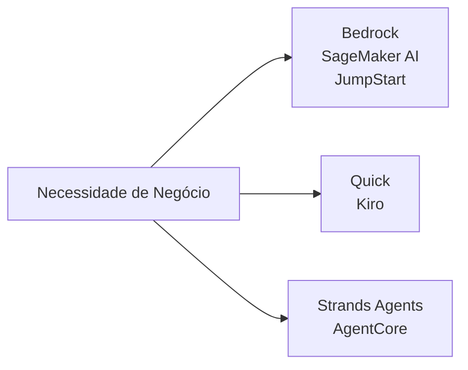
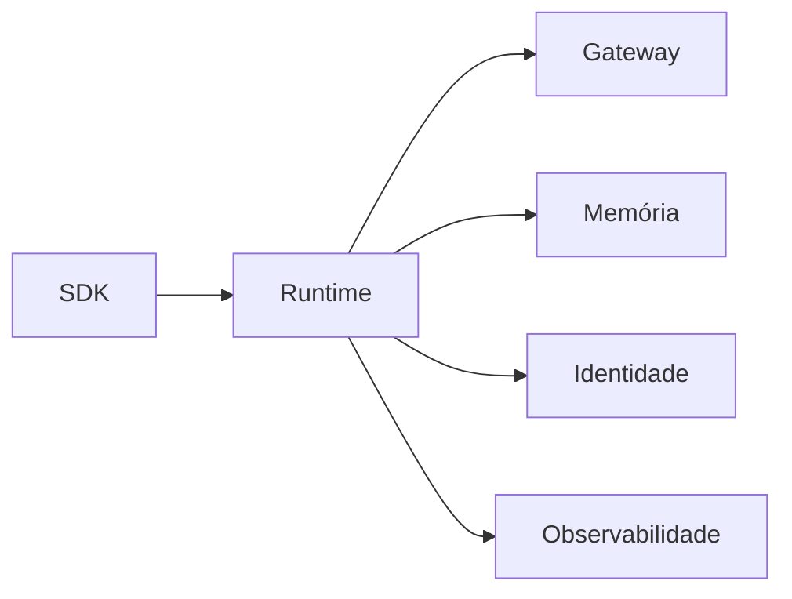
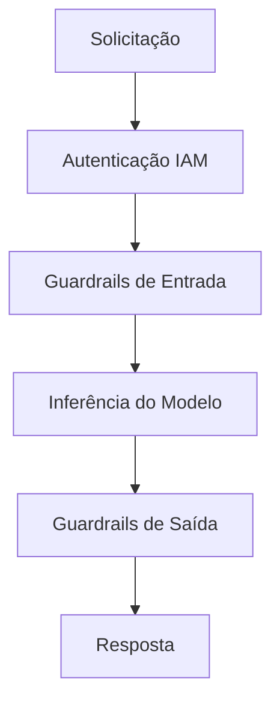
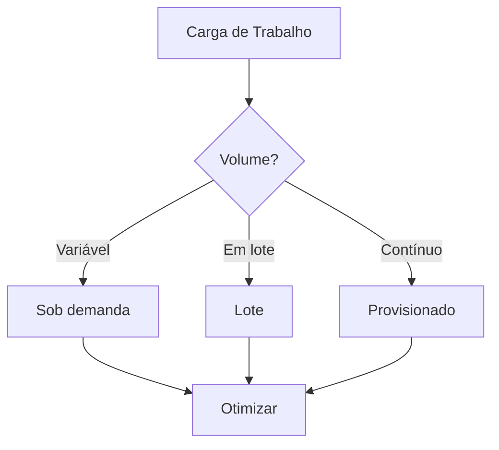
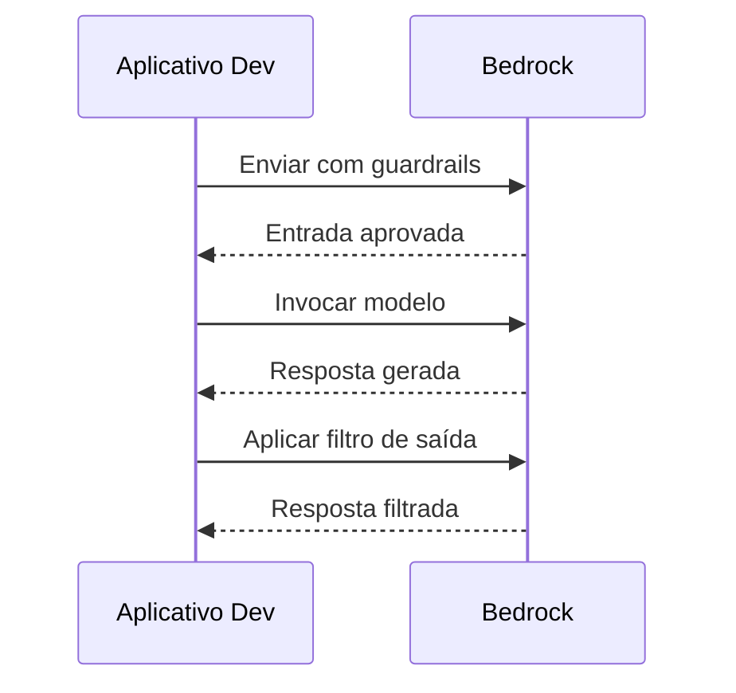

## Declaração de Tarefa 2.3: Descrever a infraestrutura e as tecnologias AWS para construir aplicações de GenAI

Construir um aplicativo de IA generativa na AWS requer escolher entre um conjunto crescente de serviços gerenciados e ferramentas de desenvolvimento, cada um voltado para um ponto diferente no espectro de desenvolvimento. A Tarefa 2.3 abrange quatro objetivos: os serviços AWS nomeados no guia do exame v1.1, as vantagens de usá-los, as propriedades de segurança e conformidade que eles herdam da AWS e as decisões de custo que as equipes enfrentam em produção.[^203001]

*Figura 2.3.1: Três pontos de entrada para o trabalho de GenAI na AWS. A família Bedrock e SageMaker cobre APIs de modelo gerenciadas e treinamento personalizado, Quick e Kiro cobrem assistentes de negócios e desenvolvedores, e Strands Agents e AgentCore cobrem frameworks e runtimes de agentes.*

Os serviços nesta declaração de tarefa não competem entre si em uma única dimensão. Uma equipe pode usar o **Amazon Bedrock** como sua API de modelo, implantar esse aplicativo pelo **Amazon Bedrock AgentCore**, automatizar o trabalho de desenvolvimento dentro do **Kiro** e consultar dados de negócios pelo **Amazon Quick**, tudo dentro do mesmo projeto. As seções a seguir explicam cada serviço, as vantagens combinadas de usar a plataforma AWS, a infraestrutura de segurança e conformidade subjacente e a mecânica de preços que determina o custo total de propriedade.

### 2.3.1 Serviços e recursos AWS para aplicações de GenAI

O guia do exame AWS v1.1 nomeia sete serviços e famílias de ferramentas para construir aplicações de IA generativa: Amazon Bedrock, Amazon SageMaker AI, Amazon SageMaker JumpStart, Amazon Quick, Kiro, Strands Agents e Amazon Bedrock AgentCore.[^203002] Cada um ocupa um nicho específico, e entender onde cada um se encaixa evita tanto a engenharia excessiva quanto o sub-investimento nas capacidades da plataforma.

**Amazon Bedrock** é um serviço totalmente gerenciado que fornece acesso a API a um catálogo selecionado de modelos de fundação de múltiplos provedores, sem exigir que você provisione ou gerencie qualquer infraestrutura de GPU.[^203003] Uma equipe chama um único endpoint, especifica o identificador do modelo e recebe uma resposta gerada cobrada por token. A infraestrutura subjacente, os pesos do modelo e a lógica de escalonamento são completamente invisíveis para o chamador.

O catálogo de modelos disponíveis pelo Amazon Bedrock abrange os modelos próprios da Amazon, laboratórios de pesquisa de terceiros e opções de pesos abertos:

- Os modelos **Amazon Nova** (Nova Micro, Nova Lite, Nova Pro, Nova Premier) são a série própria da Amazon, variando de um nível de texto apenas, baixa latência, até um carro-chefe multimodal capaz de processar imagens, vídeo e documentos.[^203004]
- **Anthropic Claude** (a geração Claude 4.x: Haiku 4.x, Sonnet 4.x, Opus 4.x) se destaca em raciocínio, saída estruturada e análise de contexto longo. Claude Opus e Sonnet suportam janelas de contexto de 200.000 tokens por padrão e um milhão de tokens com o cabeçalho beta de contexto de 1M.[^203005]
- Os modelos **Meta Llama** são grandes modelos de linguagem de pesos abertos adequados para geração de texto, codificação e tarefas de diálogo.[^203006]
- Os modelos **Mistral AI**, incluindo Mixtral, são fortes em seguimento de instruções e tarefas multilíngues com consumo eficiente de tokens.[^203007]
- **AI21 Labs Jamba** visa a geração de texto empresarial e o processamento de contexto longo.[^203008]
- Os modelos **Cohere Command** são otimizados para recuperação, classificação e busca empresarial.[^203009]
- Os modelos **Stability AI** lidam com tarefas de geração de imagens e multimodais.[^203010]

Além do acesso bruto ao modelo, o Amazon Bedrock inclui um conjunto de capacidades para construir aplicações de nível de produção. **Bases de Conhecimento para Amazon Bedrock** gerencia o pipeline completo de *geração aumentada por recuperação* (RAG): ingerindo documentos do Amazon S3 ou outras fontes, dividindo-os em chunks, gerando embeddings vetoriais, armazenando-os em um armazenamento vetorial gerenciado e recuperando chunks relevantes no momento da inferência.[^203011] **Amazon Bedrock Guardrails** aplica políticas de conteúdo configuráveis tanto ao prompt de entrada quanto à saída do modelo, filtrando categorias prejudiciais, bloqueando tópicos negados, redigindo *informações de identificação pessoal* (PII) e executando *verificações de fundamentação contextual* que comparam respostas com o material de origem para detectar alucinações.[^203012] **Amazon Bedrock Prompt Management** armazena, versiona e compartilha modelos de prompt entre uma equipe para que os mesmos prompts otimizados sejam usados de forma consistente em produção.[^203013] **Amazon Bedrock Model Evaluation** executa trabalhos de benchmark automatizados e avaliados por humanos que pontuam as respostas do modelo em precisão, robustez, toxicidade e métricas específicas da tarefa, permitindo que as equipes comparem modelos antes de se comprometerem com um.[^203014] **Agents for Amazon Bedrock** coordena fluxos de trabalho agênticos de múltiplas etapas, permitindo que o modelo chame APIs externas, consulte Bases de Conhecimento e execute funções AWS Lambda como *ferramentas* dentro de uma sessão orquestrada.[^203015] **Amazon Bedrock Flows** fornece um construtor de fluxo de trabalho visual para encadear prompts e subagentes em pipelines estruturados sem escrever código de orquestração.[^203016]

**Amazon SageMaker AI** é a plataforma de aprendizado de máquina completa da AWS para equipes que precisam treinar, ajustar, avaliar e hospedar seus próprios modelos.[^203017] Enquanto o Amazon Bedrock abstrai o modelo completamente, o Amazon SageMaker AI expõe toda a pilha de treinamento e inferência. Uma equipe de ciência de dados usa o SageMaker AI para executar trabalhos de treinamento distribuído em clusters de GPU, registrar modelos no Registro de Modelos do SageMaker, implantá-los em endpoints de inferência em tempo real e monitorar o desvio de dados em produção. Para IA generativa especificamente, o SageMaker AI é o serviço de escolha quando uma equipe precisa ajustar um modelo de fundação de pesos abertos em dados proprietários em escala, ou quando os requisitos de latência ou throughput de inferência exigem implantações de contêiner personalizadas em vez de um endpoint de API compartilhado.

**Amazon SageMaker JumpStart** é um recurso do SageMaker AI que acelera o ponto de partida fornecendo um catálogo de modelos pré-treinados, modelos de solução e ações de implantação com um clique.[^203018] Um profissional pode navegar pelos modelos do Hugging Face, TII (série Falcon) e outros provedores e depois implantar um modelo escolhido em um endpoint privado do SageMaker com alguns cliques ou uma única chamada de API, sem escrever código de treinamento. O JumpStart preenche a lacuna entre a conveniência do Amazon Bedrock e a flexibilidade total das implantações personalizadas do SageMaker AI: o modelo é executado na infraestrutura da sua conta, você controla o endpoint e pode continuar o ajuste fino se necessário.

**Amazon Quick** é a família unificada de análises e assistente de IA para usuários de negócios da AWS. Em 2025, a AWS rebatizou o Amazon QuickSight e as partes voltadas a BI do Amazon Q sob esse único nome, com os clientes existentes do QuickSight migrados para o novo produto.[^203019] Os usuários de negócios interagem com o Amazon Quick por meio de uma interface de linguagem natural para consultar data warehouses, gerar gráficos, escrever SQL e resumir relatórios sem envolver equipes de engenharia. O Amazon Quick é estruturado em quatro níveis: Free, Plus, Professional e Enterprise. O nível Enterprise se integra com os índices do Amazon Q Business, permitindo que o assistente pesquise em bases de conhecimento organizacionais (SharePoint, Confluence, S3 e outros conectores), bem como em dados tabulares. Para o exame, o Amazon Quick é a resposta correta para perguntas sobre habilitar *BI de autoatendimento* aumentado por IA generativa para usuários de negócios, não para desenvolvedores.

**Kiro** é o ambiente de desenvolvimento de software com tecnologia de IA da AWS, lançado com disponibilidade geral no final de 2025.[^203020] O Kiro é um fork do Code OSS (a base de código aberto do Visual Studio Code) estendido com um assistente de IA agêntico que se integra diretamente ao fluxo de trabalho de edição. Ele substitui o Amazon Q Developer como a principal ferramenta de desenvolvimento de IA no ecossistema de IDE da AWS. O Kiro está disponível em quatro níveis: Free, Pro, Pro+ e Power, com níveis mais altos fornecendo mais horas incluídas de interação com agentes e acesso a modelos subjacentes mais capazes. A característica distintiva do Kiro é o *desenvolvimento guiado por especificação*. Onde a maioria dos assistentes de codificação de IA sugere a próxima linha enquanto você digita, o desenvolvimento guiado por especificação pede ao desenvolvedor que descreva o recurso inteiro primeiro; o Kiro então escreve um documento de especificação estruturado (requisitos, arquitetura, tarefas de implementação) e edita vários arquivos para implementá-lo. Para o exame, o Kiro é a resposta correta para perguntas sobre assistência de IA dentro de um ambiente de desenvolvimento, não sobre implantar ou hospedar modelos de IA.

**Strands Agents** é um SDK de código aberto da AWS para construir agentes de IA em Python e TypeScript.[^203021] Ele segue um design de *agente orientado a modelo*: você define um conjunto de ferramentas (funções Python anotadas com dicas de tipo), as passa para o agente Strands juntamente com um prompt do sistema, e o SDK lida com o loop de raciocínio do modelo, seleção de ferramentas, execução de ferramentas e síntese de resultados. O Strands Agents é agnóstico ao modelo e funciona com Amazon Bedrock, modelos locais e APIs de modelos de terceiros.

A superfície de agentes na AWS tem três coisas nomeadas que soam semelhantes e são fáceis de confundir. Agents for Amazon Bedrock (também chamado de Amazon Bedrock Agents) é o recurso de orquestração no console original. AgentCore é o runtime implantável separadamente mais recente para agentes de nível de produção que podem ser construídos com Bedrock Agents, Strands ou outros frameworks. Strands Agents é o SDK de código aberto que os desenvolvedores usam para escrever o código do agente em primeiro lugar. Para o exame, Strands Agents é o SDK do desenvolvedor, Bedrock Agents é o recurso de orquestração no console, e AgentCore é a camada de runtime de produção.

**Amazon Bedrock AgentCore** é uma plataforma de implantação de agentes de produção lançada pela AWS em 2025 para abordar a lacuna entre escrever um agente com um framework como Strands e executar esse agente de forma confiável em escala empresarial.[^203022] O AgentCore agrupa as preocupações de infraestrutura que as equipes de outra forma construiriam por conta própria. Seus componentes incluem:

- **AgentCore Runtime**: Um ambiente de execução gerenciado que executa código de agente, lida com auto-scaling e gerencia o ciclo de vida da sessão.[^203023]
- **AgentCore Gateway**: Um servidor MCP (*Model Context Protocol*) que expõe ferramentas e APIs empresariais para agentes por meio de uma interface padronizada, removendo a necessidade de escrever integrações de ferramentas personalizadas para cada fonte de dados.[^203024] O Model Context Protocol é um padrão aberto, originalmente proposto pela Anthropic e agora adotado em toda a indústria, que permite que os agentes se conectem a ferramentas e fontes de dados sem escrever código de integração personalizado para cada um.
- **AgentCore Memory**: Um armazenamento de memória persistente que retém o histórico de conversa, as preferências do usuário e os fatos aprendidos entre sessões, permitindo que os agentes se lembrem do contexto entre interações.[^203025]
- **AgentCore Identity**: Uma camada de autenticação baseada em OAuth 2.0 que permite que os agentes se autentiquem em serviços de terceiros em nome dos usuários sem armazenar credenciais de longa duração no código do agente.[^203026]
- **AgentCore Policy**: Uma camada de governança que impõe quais ferramentas um agente pode chamar, em que condições e quais dados pode acessar, suportando trilhas de auditoria para setores regulamentados.[^203027]
- **AgentCore Evaluations**: Um conjunto de testes automatizados para fluxos de trabalho de agentes que mede a taxa de conclusão de tarefas, a precisão de seleção de ferramentas e a qualidade da resposta em conjuntos de interação de benchmark.[^203028]
- **AgentCore Observability**: Rastreamento distribuído e métricas para sessões de agentes, integrando-se com o Amazon CloudWatch para que os operadores possam diagnosticar falhas em fluxos de trabalho de múltiplas etapas.[^203029]
- **AgentCore Code Interpreter**: Um ambiente de execução em sandbox que permite que um agente execute código Python gerado em tempo de execução, viabilizando análise de dados, computação matemática e geração dinâmica de relatórios.[^203030]
- **AgentCore Browser**: Um navegador headless gerenciado que permite que um agente navegue em páginas da web, extraia conteúdo e interaja com ferramentas baseadas na web programaticamente.[^203031]

*Tabela 2.3.1: Serviços AWS de GenAI mapeados para casos de uso primários*

| Serviço | Usuário principal | Capacidade-chave | Caso de uso típico |
|---------|------------------|-----------------|-------------------|
| Amazon Bedrock | Desenvolvedor | API de FM gerenciada com RAG, Guardrails, Agents | Chatbots, sumarização, Q&A de documentos |
| Amazon SageMaker AI | Engenheiro de ML | Plataforma completa de treinamento e hospedagem | Ajuste fino de modelos personalizados, inferência em lote |
| SageMaker JumpStart | Cientista de dados | Implantação de modelos pré-treinados com um clique | Prototipagem rápida com modelos de pesos abertos |
| Amazon Quick | Analista de negócios | BI em linguagem natural e consultas de dados | Análises de autoatendimento, painéis executivos |
| Kiro | Desenvolvedor de software | IDE agêntico com desenvolvimento guiado por especificação | Geração de código, refatoração de múltiplos arquivos |
| Strands Agents | Desenvolvedor | SDK de agente de código aberto (Python/TypeScript) | Pipelines de agentes personalizados, composição de ferramentas |
| Amazon Bedrock AgentCore | Equipe de plataforma | Runtime de agente de produção e ferramentas | Implantação de agentes empresariais, gateway MCP |

Os limites entre esses serviços importam para o exame. Amazon Bedrock é a API de modelo gerenciada; Amazon Bedrock AgentCore é o runtime de produção para aplicações de agentes. Kiro é a ferramenta de IDE; Strands Agents é o framework de codificação usado para escrever agentes fora do IDE. Amazon SageMaker AI é a plataforma de ML completa; SageMaker JumpStart é o atalho de catálogo de modelos. Amazon Quick é o assistente de análise voltado ao usuário de negócios, não uma ferramenta de desenvolvedor.

*Figura 2.3.2: Arquitetura do Amazon Bedrock AgentCore. Um agente construído com Strands é implantado no AgentCore Runtime, que coordena todos os componentes de infraestrutura de produção, incluindo acesso a ferramentas, memória, identidade, aplicação de políticas e observabilidade.*

### 2.3.2 Vantagens de usar os serviços AWS de GenAI para construir aplicações

As seis vantagens listadas no objetivo 2.3.2 não são afirmações de marketing: cada uma aborda um ponto de fricção específico que as organizações encontram ao construir IA generativa fora de uma plataforma de nuvem gerenciada.[^203032]

**Acessibilidade** significa que qualquer desenvolvedor com uma conta AWS e credenciais IAM pode chamar um modelo de fundação de classe frontier por meio de uma API HTTPS padrão em minutos. Não há ciclo de aquisição de hardware, nenhuma configuração de driver CUDA, nenhum download de pesos de modelo que pode levar centenas de gigabytes. Uma equipe que anteriormente precisava de pessoal especializado em infraestrutura de ML para avaliar um novo modelo agora pode fazê-lo com algumas linhas de código. Isso remove a barreira de avaliação que anteriormente desacelerava a adoção de IA em organizações sem equipes dedicadas de infraestrutura de IA.

**Menor barreira de entrada** vai além do hardware. Usando o Amazon Bedrock, um desenvolvedor não precisa entender arquitetura de transformer, estratégias de quantização ou mecanismos de atenção para produzir recursos alimentados por IA úteis. A API gerenciada aceita um prompt de texto simples e retorna uma resposta de texto simples. As Bases de Conhecimento para Amazon Bedrock removem a necessidade de entender bancos de dados vetoriais ou pipelines de embedding. O Guardrails remove a necessidade de construir moderação de conteúdo do zero. O resultado é que a expertise de domínio necessária para construir um recurso de IA de qualidade de produção é habilidade de front-end e lógica de negócios, não habilidade de engenharia de ML.

**Eficiência** vem da arquitetura de auto-scaling dos serviços gerenciados. Um único endpoint de API do Amazon Bedrock lida com um punhado de solicitações por segundo durante um trabalho em lote noturno e centenas de solicitações por segundo durante os horários de pico de negócios sem qualquer trabalho de planejamento de capacidade pela equipe de aplicação. A mesma propriedade se aplica aos endpoints do Amazon SageMaker AI com políticas de auto-scaling, e ao gerenciamento de sessões do AgentCore Runtime. As equipes não pagam pela capacidade de GPU ociosa entre os picos.

**Custo-efetividade** nos serviços AWS de GenAI segue um modelo *pay-per-token*: as cobranças se acumulam apenas quando a inferência realmente é executada, não quando os modelos ficam ociosos. Isso contrasta com a auto-hospedagem de um modelo em uma instância de GPU dedicada, onde a instância é executada e acumula cobranças ao longo do tempo independentemente do volume de solicitações. Para aplicativos de volume baixo a médio, o modelo de API sob demanda consistentemente custa menos do que a infraestrutura dedicada, e o limite onde a infraestrutura dedicada se torna mais barata é alto o suficiente para que a maioria dos aplicativos empresariais nunca o alcance.

**Velocidade para o mercado** é o efeito agregado dos pontos anteriores. Uma equipe que avalia três modelos, escolhe um, constrói um pipeline RAG em Bases de Conhecimento, adiciona Guardrails para política de conteúdo e implanta por meio do AgentCore pode completar todas essas etapas em dias ou semanas. A construção equivalente em infraestrutura auto-gerenciada, incluindo seleção de um banco de dados vetorial, provisionamento de instâncias GPU, escrita do código de orquestração e construção de uma camada de moderação de conteúdo, normalmente leva meses. A lacuna é maior durante a construção inicial e permanece significativa para atualizações subsequentes de modelos, porque trocar um modelo por outro no Amazon Bedrock requer apenas uma mudança de configuração, não uma migração de infraestrutura.

**Capacidade de atender aos objetivos de negócios** refere-se às características de nível de serviço da infraestrutura gerenciada: compromissos de tempo de atividade garantidos respaldados por SLAs da AWS, certificações de conformidade que removem bloqueadores para implantações em setores regulamentados e cobertura geográfica que permite que os aplicativos atendam usuários nas regiões necessárias sem levantar pilhas regionais separadas. Um aplicativo construído no Amazon Bedrock herda a arquitetura de disponibilidade da AWS e os limites de throughput do modelo, que são previsíveis o suficiente para serem incluídos em compromissos de capacidade de negócios.

### 2.3.3 Benefícios da infraestrutura AWS para aplicações de GenAI

A infraestrutura AWS oferece quatro categorias de benefícios para aplicações de GenAI: segurança, conformidade, responsabilidade e segurança de conteúdo.[^203033] Esses benefícios são propriedades estruturais da plataforma, não recursos que devem ser habilitados separadamente para cada aplicação.

**Segurança** no contexto de GenAI da AWS é construída a partir das mesmas primitivas do resto da plataforma AWS. Os dados enviados ao Amazon Bedrock são criptografados em trânsito usando TLS e criptografados em repouso usando o **AWS Key Management Service (AWS KMS)**.[^203034] Os prompts e respostas dos clientes nunca são usados para treinar ou melhorar os modelos base subjacentes, o que significa que dados proprietários passados no momento da inferência permanecem privados para a conta. O isolamento de rede está disponível por meio da integração do **Amazon VPC**: as organizações podem rotear chamadas de API do Bedrock por um endpoint VPC usando o **AWS PrivateLink**, garantindo que o tráfego de inferência nunca atravesse a internet pública.[^203035] O **AWS Identity and Access Management (IAM)** controla quais identidades, funções e serviços têm permissão para chamar quais modelos, com a granularidade de ARNs de modelo específicos e ações específicas do Bedrock, como `bedrock:InvokeModel` e `bedrock:InvokeAgent`.[^203036]

Para aplicações de agentes especificamente, o Amazon Bedrock AgentCore Identity lida com a autenticação delegada a serviços de terceiros usando tokens OAuth 2.0 gerenciados pela plataforma, para que o código do agente nunca lide com credenciais brutas para sistemas externos. Esta é uma melhoria de segurança material em relação aos frameworks de agentes onde os segredos devem ser armazenados em variáveis de ambiente ou gerenciadores de segredos e rotacionados manualmente.

**Conformidade** é abordada no nível da infraestrutura pelo mesmo programa de conformidade da AWS que cobre todos os outros serviços AWS. O AWS Artifact fornece acesso sob demanda a relatórios de auditoria de terceiros cobrindo SOC 1, SOC 2, PCI DSS, ISO 27001 e HIPAA.[^203037] O **AWS Audit Manager** automatiza a coleta de evidências para frameworks de conformidade contínua, e o Amazon Bedrock está dentro do escopo das proteções de governança do AWS Control Tower, o que significa que as organizações que usam o Control Tower podem aplicar políticas de controle de serviço para restringir quais contas podem usar quais modelos.[^203038] Para organizações baseadas na UE, os requisitos de residência de dados são satisfeitos selecionando uma região suportada pelo Bedrock dentro do limite da UE.

**Responsabilidade** refere-se ao modelo de responsabilidade compartilhada conforme se aplica aos serviços de IA gerenciados. Com o Amazon Bedrock, a AWS é responsável pela segurança dos pesos do modelo, pela infraestrutura de GPU subjacente, pelos endpoints de API e pelos recursos gerenciados (Bases de Conhecimento, Guardrails, Agents). O cliente é responsável pelos prompts que envia, pelos dados que armazena nas Bases de Conhecimento, pela configuração de Guardrails que aplica e pelas políticas IAM que controlam o acesso.[^203039] Essa divisão é mais favorável ao cliente do que a auto-hospedagem: o cliente mantém controle sobre o que o modelo diz e para quem, sem possuir o ônus operacional do hardware e software que executa o modelo. O AgentCore Policy estende o modelo de responsabilidade para fluxos de trabalho agênticos, dando aos operadores controle formal sobre quais ferramentas os agentes têm permissão para invocar, aplicando políticas legíveis por humanos que podem ser auditadas independentemente do código do agente.

**Segurança de conteúdo** é aplicada principalmente por meio do Amazon Bedrock Guardrails, que aplica políticas de conteúdo configuráveis na camada de API antes que as respostas sejam retornadas ao aplicativo. Os limiares de filtro de conteúdo são ajustáveis por categoria (ódio, insultos, conteúdo sexual, violência, má conduta, injeção de prompt). A verificação de fundamentação contextual compara cada resposta com os documentos de origem recuperados pelas Bases de Conhecimento e bloqueia respostas que afirmam fatos não suportados pela fonte, reduzindo diretamente o risco de saída alucinada chegando aos usuários.[^203040] Como o Guardrails opera na camada de API, ele se aplica uniformemente independentemente de qual modelo subjacente está sendo chamado, incluindo modelos hospedados fora do Amazon Bedrock por meio da camada de compatibilidade de modelo cruzado da API Converse.

*Figura 2.3.3: Controles de segurança e proteção de conteúdo em uma solicitação do Amazon Bedrock. A solicitação passa pela autorização IAM, filtragem de entrada, inferência do modelo, filtragem de saída e verificação de fundamentação antes de retornar ao chamador, com controles de rede e criptografia aplicados na camada de API.*

### 2.3.4 Trade-offs de custo dos serviços AWS de GenAI

Toda decisão de custo para um aplicativo de GenAI envolve trocar uma propriedade desejável por outra. O exame abrange oito dimensões específicas de trade-off: responsividade, disponibilidade, redundância, desempenho, cobertura regional, preços baseados em tokens, throughput provisionado e modelos personalizados.[^203041]

**Responsividade versus custo** é o trade-off mais fundamental. Modelos menores e mais leves respondem mais rápido e custam menos tokens por solicitação. Um modelo no nível Nova Micro completa uma tarefa simples de classificação de texto em dezenas de milissegundos e custa uma fração de centavo por mil tokens de entrada. Um modelo flagship multimodal maior produz saída mais rica e precisa para tarefas complexas, mas leva mais tempo para responder e custa significativamente mais por token. A escolha certa depende da tarefa: extração estruturada de um formulário se beneficia de um modelo pequeno e rápido; análise de um artigo de pesquisa médica complexo se beneficia de um modelo de raciocínio maior.

**Disponibilidade versus custo** se torna relevante quando um aplicativo requer tempo de atividade garantido durante interrupções do modelo. O Amazon Bedrock inclui roteamento de *inferência entre regiões* integrado que automaticamente faz failover para uma réplica do modelo em uma região secundária quando a região primária experimenta um evento de serviço.[^203042] A inferência entre regiões melhora a disponibilidade, mas aumenta a latência para usuários distantes da região secundária e pode incorrer em cobranças de transferência de dados entre regiões. As equipes que exigem alta disponibilidade sem compromisso de latência devem ponderar esses custos contra a probabilidade e frequência de interrupções regionais.

**Redundância** no contexto de GenAI se aplica tanto na camada de infraestrutura (implantação multi-AZ, que o Amazon Bedrock lida automaticamente) quanto na camada de modelo (ter um modelo de fallback configurado quando um modelo primário atinge limites de cota ou está temporariamente indisponível). Manter um modelo de fallback adiciona complexidade operacional e pode exigir ajustes de prompt se os modelos primário e de fallback se comportarem de forma diferente, mas reduz o risco de indisponibilidade completa do serviço durante interrupções de modelos.

**Desempenho versus custo** interage com a seleção de modelo em uma segunda dimensão: tamanho da janela de contexto. Processar um documento longo requer um modelo com uma janela de contexto grande, que custa mais por token, ou uma estratégia de chunking que divide o documento e o processa em partes, que custa menos tokens por chunk, mas requer lógica de orquestração adicional e pode produzir respostas menos coerentes. As equipes devem quantificar seus comprimentos de documento típicos e padrões de consulta antes de se comprometerem com um nível de modelo.

**Cobertura regional** é uma restrição prática que o exame testa diretamente: nem todo modelo está disponível em toda região AWS.[^203043] Uma equipe construindo para usuários europeus pode descobrir que um modelo preferido específico está disponível apenas em regiões dos EUA, exigindo uma solicitação de inferência entre regiões (adicionando latência e considerações de residência de dados) ou uma mudança para um modelo alternativo disponível na região desejada. A disponibilidade regional se expande ao longo do tempo à medida que a AWS integra novos provedores de modelos em regiões adicionais, mas em qualquer ponto no tempo o catálogo de modelos disponíveis varia por região.

**Preços baseados em tokens** é o modelo de faturamento padrão para inferência sob demanda do Amazon Bedrock. As cobranças se acumulam separadamente para tokens de entrada (o prompt, contexto do sistema, chunks recuperados das Bases de Conhecimento) e tokens de saída (a resposta gerada). Os preços de tokens de entrada e saída diferem e variam por modelo.[^203044] Um prompt que inclui uma mensagem de sistema grande e contexto extenso das Bases de Conhecimento acumulará cobranças significativas de tokens de entrada mesmo para uma pergunta curta do usuário. Otimizar os prompts para reduzir o contexto desnecessário é, portanto, uma alavanca direta de redução de custos, não apenas uma preocupação de qualidade.

*Tabela 2.3.2: Modelos de preços do Amazon Bedrock comparados*

| Modelo de preços | Como funciona | Melhor para | Característica de custo |
|----------------|--------------|-------------|------------------------|
| Sob demanda | Pague por token de entrada e saída, sem compromisso | Cargas de trabalho variáveis ou imprevisíveis | Taxa por token mais alta; sem gasto desperdiçado durante períodos ociosos |
| Inferência em lote | Envie um trabalho em lote; desconto de até 50% versus sob demanda | Processamento não sensível ao tempo de grandes conjuntos de dados | Taxa mais baixa; aceita latência mais alta |
| Throughput provisionado | Compre uma capacidade fixa de tokens por minuto por um período | Cargas de trabalho de produção de alto volume e sensíveis à latência | Custo previsível; capacidade não utilizada ainda é cobrada |
| Cache de prompt | Prefixo de contexto repetido em cache; cobrado a taxa reduzida | Aplicativos com prompts do sistema consistentes | Grandes economias quando os prompts do sistema são longos e reutilizados com frequência |
| Unidades de modelo personalizado | Preços por unidade de modelo para modelos ajustados implantados em capacidade provisionada | Modelos ajustados personalizados em produção | Custo de linha de base mais alto; justificado por ganhos de desempenho específicos da tarefa |

**Throughput provisionado** é uma compra de compromisso: uma equipe reserva um número especificado de unidades de modelo por um período definido, garantindo um nível mínimo de tokens por minuto de throughput.[^203045] O throughput provisionado elimina o risco de throttling que a inferência sob demanda enfrenta em altas taxas de solicitação, o que importa para aplicativos voltados ao cliente em que erros de limite de tokens produzem falhas visíveis. O trade-off é que a capacidade não utilizada dentro de um período de compromisso ainda é cobrada, portanto o throughput provisionado reduz o custo total em relação ao sob demanda apenas quando a utilização real é consistentemente alta; as equipes normalmente fazem comparações de preços antes de se comprometerem.

**Modelos personalizados** introduzem uma categoria de custo distinta dos preços de inferência. Treinar um modelo ajustado no Amazon Bedrock cobra pelo tempo de computação usado durante o trabalho de ajuste fino, medido em *unidades de modelo personalizado*.[^203046] Implantar um modelo ajustado requer então a compra de throughput provisionado, porque os modelos personalizados não podem ser servidos por meio do pool compartilhado de inferência sob demanda. O custo total de uma implantação de modelo personalizado, portanto, inclui computação de ajuste fino, throughput provisionado e manutenção contínua à medida que o modelo base evolui. Para a maioria dos casos de uso, a engenharia de prompts e o RAG oferecem melhoria de qualidade suficiente sem a sobrecarga da personalização do modelo, e os investimentos em modelos personalizados se justificam apenas quando a tarefa é altamente especializada, o volume é grande o suficiente para amortizar os custos fixos e a lacuna de qualidade entre um modelo base com prompts e um ajustado é mensurável e significativa.

*Figura 2.3.4: Fluxo de decisão de seleção de modelo de preços. As equipes começam caracterizando o perfil de volume e trabalham pelas opções de modelo de preços, retornando às alavancas de otimização quando os custos excedem as metas.*

*Tabela 2.3.3: Dimensões de trade-off de custo para serviços de GenAI*

| Trade-off | Opção de menor custo | Opção de maior custo | O que você perde |
|-----------|---------------------|---------------------|-----------------|
| Responsividade | Modelo pequeno e rápido | Modelo grande e capaz | Qualidade de saída para tarefas complexas |
| Disponibilidade | Inferência de região única | Inferência entre regiões | SLA de disponibilidade em interrupções regionais |
| Redundância | Sem modelo de fallback | Modelo de fallback configurado | Resiliência durante eventos de cota do modelo |
| Desempenho | Contexto em chunks com janela pequena | Modelo com janela de contexto grande | Coerência de resposta em documentos longos |
| Cobertura regional | Solicitação entre regiões para região disponível | Aguardar suporte de região local | Latência e conformidade de residência de dados |
| Garantia de throughput | Sob demanda (pool compartilhado, risco de throttling) | Throughput provisionado | Previsibilidade sob alta carga simultânea |

*Tabela 2.3.4: Quando usar SageMaker AI versus Amazon Bedrock para cargas de trabalho generativas*

| Fator | Amazon Bedrock | Amazon SageMaker AI |
|-------|---------------|---------------------|
| Propriedade do modelo | AWS gerencia pesos do modelo | Você controla pesos e contêiner |
| Profundidade de personalização | Ajuste fino via console do Bedrock | Treinamento completo, RLHF, contêineres personalizados |
| Flexibilidade de inferência | API gerenciada; configuração de runtime limitada | Código de inferência personalizado, estratégias de lote |
| Custo em baixo volume | Menor (pay-per-token, sem cobrança ociosa) | Maior (custo de instância mesmo em baixa utilização) |
| Custo em alto volume | Taxas sob demanda se aplicam; opção provisionada disponível | Instâncias dedicadas podem ser mais baratas em alto throughput sustentado |
| Controle de conformidade | AWS gerencia conformidade do modelo base | A organização controla toda a pilha |
| Tempo até a primeira resposta | Minutos (chamada de API) | Dias a semanas (treinamento, registro, implantação) |

*Figura 2.3.5: Fluxo de solicitação em um aplicativo Bedrock de produção. O aplicativo do desenvolvedor coordena a recuperação das Bases de Conhecimento, a filtragem do Guardrails, a invocação do modelo e a observabilidade em sequência, com cada etapa adicionando latência e custo que devem ser ponderados em relação aos benefícios de qualidade e segurança.*

**O que esta seção construiu.** Esta declaração de tarefa forneceu o catálogo de serviços AWS de GenAI mais as quatro lentes necessárias para compará-los: capacidade (objetivo 2.3.1), vantagens da plataforma (2.3.2), propriedades de infraestrutura (2.3.3) e trade-offs de preços (2.3.4). A tabela anterior no topo de 2.3.1 carrega a carga de recall para os serviços nomeados. A Declaração de Tarefa 2.3 encerra o Domínio 2. O Domínio 3 retoma de onde parou, examinando em profundidade como os modelos de fundação são aplicados: considerações de design para aplicações de FM, técnicas de engenharia de prompts, processos de treinamento e ajuste fino e métodos de avaliação.

---

## Perguntas de autoavaliação

1. Uma empresa de varejo quer permitir que seus analistas de negócios façam perguntas em linguagem natural sobre dados de vendas no Amazon Redshift e gerem gráficos automaticamente, sem escrever SQL ou envolver a equipe de engenharia de dados. Qual serviço AWS é MAIS apropriado para esse requisito?

    A. Amazon Bedrock com Bases de Conhecimento conectadas ao Redshift
    B. Amazon SageMaker JumpStart com um modelo pré-treinado de texto para SQL
    C. Amazon Quick com o data warehouse conectado como fonte de dados
    D. Strands Agents com uma ferramenta SQL personalizada definida em Python

    O Amazon Quick foi projetado especificamente para usuários de negócios que precisam de acesso em linguagem natural a data warehouses e painéis de BI. Ele se conecta ao Amazon Redshift nativamente, traduz perguntas em linguagem natural em consultas SQL, as executa e retorna visualizações, tudo sem exigir que os analistas escrevam código ou que os engenheiros construam pipelines personalizados. O Amazon Bedrock com Bases de Conhecimento é adequado para recuperação de documentos e Q&A, não para geração de consultas de dados estruturados na camada de BI. O SageMaker JumpStart fornece modelos pré-treinados para implantação, mas não inclui uma interface de BI integrada. O Strands Agents é um SDK de desenvolvedor que exigiria desenvolvimento personalizado significativo para replicar o que o Amazon Quick fornece prontos para uso, tornando-o a escolha errada quando o objetivo é a habilitação rápida de usuários não técnicos.[^203047]

2. Uma equipe de desenvolvimento de software está adotando um IDE com tecnologia de IA que pode gerar um plano estruturado de requisitos e implementação a partir de uma descrição de recurso em linguagem natural e, em seguida, implementar de forma autônoma o plano em vários arquivos na base de código. Qual ferramenta AWS é MAIS alinhada com esse fluxo de trabalho?

    A. Amazon Bedrock Agents
    B. Kiro
    C. Amazon SageMaker JumpStart
    D. Amazon Bedrock Flows

    O Kiro é o ambiente de desenvolvimento de software com tecnologia de IA da AWS construído sobre Code OSS, projetado especificamente para fluxos de trabalho de *desenvolvimento guiado por especificação*, em que o desenvolvedor descreve um recurso, o Kiro gera um documento de especificação cobrindo requisitos, arquitetura e tarefas de implementação, e então executa essas tarefas de forma autônoma na base de código. É o substituto do Amazon Q Developer como a principal ferramenta de desenvolvimento assistido por IA no ecossistema de IDE da AWS. O Amazon Bedrock Agents orquestra fluxos de trabalho de IA de múltiplas etapas por meio de APIs, mas não é um produto de IDE. O SageMaker JumpStart implanta modelos de ML pré-treinados e não tem relação com fluxos de trabalho de desenvolvimento de software. O Amazon Bedrock Flows cria pipelines de encadeamento de prompts no console do Bedrock, não ferramentas de ambiente de desenvolvimento.[^203048]

3. Uma organização está implantando um chatbot de IA generativa que nunca deve recomendar produtos de investimento específicos. Ele também deve redigir quaisquer números de conta que apareçam nas mensagens do usuário antes que cheguem ao modelo. Qual combinação de recursos do Amazon Bedrock MELHOR atende a ambos os requisitos?

    A. Bases de Conhecimento com um corpus de documentos filtrado mais ajuste fino em conversas em conformidade
    B. Guardrails com tópicos negados configurados para recomendações de investimento mais filtros de informações sensíveis para PII
    C. Prompt Management com prompts do sistema focados em conformidade mais Model Evaluation para verificar o comportamento
    D. Throughput provisionado com uma unidade de modelo específica de conformidade mais isolamento de endpoint VPC

    O Amazon Bedrock Guardrails aborda diretamente ambos os requisitos. A capacidade de tópicos negados permite que os operadores definam categorias de tópicos com os quais o modelo não deve se envolver, incluindo recomendações de produtos de investimento, e o Guardrails aplica essa política em todas as solicitações independentemente de como o usuário formula a pergunta. O filtro de informações sensíveis detecta e redige padrões de PII especificados, incluindo números de conta, dos prompts de entrada antes que cheguem ao modelo. O ajuste fino altera o comportamento do modelo durante o treinamento, mas não pode fornecer a mesma aplicação determinística no momento da inferência. O Prompt Management controla os prompts que as equipes usam, mas não pode impedir que um usuário faça perguntas proibidas. O Throughput provisionado e o isolamento VPC abordam capacidade e segurança de rede, não controle de conteúdo.[^203049]

4. O aplicativo de IA generativa de uma empresa funciona bem em baixos volumes de solicitação com preços sob demanda do Amazon Bedrock, mas experimenta erros de throttling durante os picos de horas de negócios que lidam com milhares de solicitações por minuto. A equipe quer eliminar o throttling mantendo o controle de custos. Qual modelo de preços deve adotar?

    A. Inferência em lote, porque processa solicitações em massa a menor custo
    B. Throughput provisionado, porque reserva uma capacidade garantida de tokens por minuto
    C. Implantação de modelo personalizado em instâncias dedicadas, porque fornece throughput ilimitado
    D. Inferência entre regiões, porque distribui a carga entre várias regiões

    O throughput provisionado compra uma capacidade de throughput reservada medida em unidades de modelo, cada uma representando um número definido de tokens por minuto. Isso garante que as solicitações até o limite provisionado nunca sejam throttled, resolvendo diretamente o problema de horas de pico. O trade-off é que a capacidade não utilizada dentro do período de compromisso ainda é cobrada, portanto a equipe deve verificar que a utilização no pico é consistente o suficiente para justificar o compromisso. A inferência em lote resolve um problema diferente: processa grandes volumes de trabalho não sensível ao tempo de forma assíncrona, o que não eliminaria o throttling em tempo real para um aplicativo voltado ao usuário. A implantação de modelo personalizado não fornece automaticamente throughput ilimitado e introduz complexidade operacional e de custo adicionais. A inferência entre regiões aborda a disponibilidade regional, não os limites de throughput dentro de uma região.[^203050]

5. Uma empresa de serviços financeiros regulamentada está avaliando o Amazon Bedrock para uma ferramenta de consultoria voltada ao cliente. A equipe de segurança precisa confirmar que os prompts e respostas dos clientes nunca atravessam a internet pública e que a empresa mantém controle sobre as chaves de criptografia para dados em repouso. Qual combinação de dois recursos AWS satisfaz esses requisitos?

    A. Amazon Bedrock Guardrails e Amazon Bedrock Model Evaluation
    B. Endpoint VPC AWS PrivateLink para o Amazon Bedrock e chaves gerenciadas pelo cliente do AWS Key Management Service
    C. Políticas baseadas em recursos IAM nos modelos Bedrock e Amazon Bedrock Prompt Management
    D. Inferência entre regiões do Amazon Bedrock e relatórios de conformidade do AWS Artifact

    O AWS PrivateLink permite que as organizações criem um endpoint VPC para o Amazon Bedrock para que todo o tráfego de API entre o aplicativo e o serviço Bedrock viaje pela rede privada da AWS em vez da internet pública, satisfazendo o requisito de isolamento de rede. O AWS Key Management Service com chaves gerenciadas pelo cliente (CMK) permite que a empresa possua e controle as chaves de criptografia usadas para proteger os dados em repouso nos recursos gerenciados do Amazon Bedrock, incluindo Bases de Conhecimento e prompts armazenados, satisfazendo o requisito de controle de criptografia. O Guardrails e o Model Evaluation abordam a segurança de conteúdo e qualidade, não controles de rede ou criptografia. As políticas IAM controlam a autorização de acesso, mas não afetam o roteamento de rede. A inferência entre regiões e o Artifact abordam a disponibilidade e os relatórios de conformidade respectivamente.[^203051]

6. Uma equipe de engenharia construiu um agente de suporte ao cliente usando Strands Agents. O agente precisa se autenticar no sistema CRM da empresa em nome de cada usuário, persistir o contexto da conversa entre sessões para que os usuários que retornam não precisem se repetir, e gerar código Python dinamicamente para calcular valores de reembolso. Quais três componentes do Amazon Bedrock AgentCore abordam esses requisitos específicos?

    A. AgentCore Gateway, AgentCore Evaluations e AgentCore Observability
    B. AgentCore Identity, AgentCore Memory e AgentCore Code Interpreter
    C. AgentCore Runtime, AgentCore Policy e AgentCore Browser
    D. AgentCore Memory, AgentCore Gateway e AgentCore Code Interpreter

    O AgentCore Identity gerencia a autenticação delegada OAuth 2.0 para que o agente possa se autenticar no CRM da empresa em nome de cada usuário sem armazenar credenciais no código do agente. O AgentCore Memory fornece um armazenamento persistente para o histórico de conversa e contexto do usuário entre sessões, para que os usuários que retornam recebam continuidade sem reexplicar sua situação. O AgentCore Code Interpreter fornece um ambiente de execução Python em sandbox que permite ao agente executar código gerado dinamicamente, como a lógica de cálculo de reembolso, com segurança em tempo de execução. Os outros componentes servem a propósitos importantes, mas diferentes: Gateway gerencia conexões de ferramentas baseadas em MCP, Evaluations executa testes automatizados, Observability lida com rastreamento distribuído, Runtime é o ambiente de execução para o agente em si, Policy aplica regras de governança e Browser viabiliza a navegação na web. Apenas Identity, Memory e Code Interpreter mapeiam diretamente para os três requisitos declarados.[^203052]

---

[^203001]: AWS Certified AI Practitioner Exam Guide v1.1, Task Statement 2.3. URL: <https://docs.aws.amazon.com/aws-certification/latest/ai-practitioner-01/ai-practitioner-01-domain2.html>
[^203002]: AWS Certified AI Practitioner Exam Guide v1.1, Objective 2.3.1. URL: <https://docs.aws.amazon.com/aws-certification/latest/ai-practitioner-01/ai-practitioner-01-domain2.html>
[^203003]: What is Amazon Bedrock? - Amazon Bedrock User Guide. URL: <https://docs.aws.amazon.com/bedrock/latest/userguide/what-is-bedrock.html>
[^203004]: Amazon Nova Foundation Models - Amazon Bedrock User Guide. URL: <https://docs.aws.amazon.com/bedrock/latest/userguide/models-supported.html>
[^203005]: Anthropic Claude models in Amazon Bedrock. URL: <https://docs.aws.amazon.com/bedrock/latest/userguide/models-supported.html>
[^203006]: Meta Llama models in Amazon Bedrock. URL: <https://docs.aws.amazon.com/bedrock/latest/userguide/models-supported.html>
[^203007]: Mistral AI models in Amazon Bedrock. URL: <https://docs.aws.amazon.com/bedrock/latest/userguide/models-supported.html>
[^203008]: AI21 Labs models in Amazon Bedrock. URL: <https://docs.aws.amazon.com/bedrock/latest/userguide/models-supported.html>
[^203009]: Cohere models in Amazon Bedrock. URL: <https://docs.aws.amazon.com/bedrock/latest/userguide/models-supported.html>
[^203010]: Stability AI models in Amazon Bedrock. URL: <https://docs.aws.amazon.com/bedrock/latest/userguide/models-supported.html>
[^203011]: Knowledge Bases for Amazon Bedrock - Amazon Bedrock User Guide. URL: <https://docs.aws.amazon.com/bedrock/latest/userguide/knowledge-base.html>
[^203012]: Amazon Bedrock Guardrails - Amazon Bedrock User Guide. URL: <https://docs.aws.amazon.com/bedrock/latest/userguide/guardrails.html>
[^203013]: Amazon Bedrock Prompt Management. URL: <https://docs.aws.amazon.com/bedrock/latest/userguide/prompt-management.html>
[^203014]: Model evaluation in Amazon Bedrock. URL: <https://docs.aws.amazon.com/bedrock/latest/userguide/model-evaluation.html>
[^203015]: Agents for Amazon Bedrock. URL: <https://docs.aws.amazon.com/bedrock/latest/userguide/agents.html>
[^203016]: Amazon Bedrock Flows. URL: <https://docs.aws.amazon.com/bedrock/latest/userguide/flows.html>
[^203017]: Amazon SageMaker AI - Developer Guide. URL: <https://docs.aws.amazon.com/sagemaker/latest/dg/whatis.html>
[^203018]: Amazon SageMaker JumpStart - Developer Guide. URL: <https://docs.aws.amazon.com/sagemaker/latest/dg/studio-jumpstart.html>
[^203019]: Amazon Quick - User Guide. URL: <https://docs.aws.amazon.com/quicksight/latest/user/amazon-q-in-quicksight.html>
[^203020]: Kiro - AWS AI-powered development environment. URL: <https://kiro.dev/>
[^203021]: Strands Agents SDK - AWS Developer Tools. URL: <https://strandsagents.com/>
[^203022]: Amazon Bedrock AgentCore - Overview. URL: <https://docs.aws.amazon.com/bedrock/latest/userguide/agentcore.html>
[^203023]: Amazon Bedrock AgentCore Runtime. URL: <https://docs.aws.amazon.com/bedrock/latest/userguide/agentcore-runtime.html>
[^203024]: Amazon Bedrock AgentCore Gateway and MCP. URL: <https://docs.aws.amazon.com/bedrock/latest/userguide/agentcore-gateway.html>
[^203025]: Amazon Bedrock AgentCore Memory. URL: <https://docs.aws.amazon.com/bedrock/latest/userguide/agentcore-memory.html>
[^203026]: Amazon Bedrock AgentCore Identity. URL: <https://docs.aws.amazon.com/bedrock/latest/userguide/agentcore-identity.html>
[^203027]: Amazon Bedrock AgentCore Policy. URL: <https://docs.aws.amazon.com/bedrock/latest/userguide/agentcore-policy.html>
[^203028]: Amazon Bedrock AgentCore Evaluations. URL: <https://docs.aws.amazon.com/bedrock/latest/userguide/agentcore-evaluations.html>
[^203029]: Amazon Bedrock AgentCore Observability. URL: <https://docs.aws.amazon.com/bedrock/latest/userguide/agentcore-observability.html>
[^203030]: Amazon Bedrock AgentCore Code Interpreter. URL: <https://docs.aws.amazon.com/bedrock/latest/userguide/agentcore-code-interpreter.html>
[^203031]: Amazon Bedrock AgentCore Browser. URL: <https://docs.aws.amazon.com/bedrock/latest/userguide/agentcore-browser.html>
[^203032]: AWS Certified AI Practitioner Exam Guide v1.1, Objective 2.3.2. URL: <https://docs.aws.amazon.com/aws-certification/latest/ai-practitioner-01/ai-practitioner-01-domain2.html>
[^203033]: AWS Certified AI Practitioner Exam Guide v1.1, Objective 2.3.3. URL: <https://docs.aws.amazon.com/aws-certification/latest/ai-practitioner-01/ai-practitioner-01-domain2.html>
[^203034]: Amazon Bedrock Security and Privacy. URL: <https://aws.amazon.com/bedrock/security-and-privacy/>
[^203035]: AWS PrivateLink for Amazon Bedrock. URL: <https://docs.aws.amazon.com/bedrock/latest/userguide/vpc-interface-endpoints.html>
[^203036]: Controlling access to Amazon Bedrock using IAM. URL: <https://docs.aws.amazon.com/bedrock/latest/userguide/security-iam.html>
[^203037]: AWS Artifact - Compliance Reports. URL: <https://aws.amazon.com/artifact/>
[^203038]: AWS Audit Manager and Amazon Bedrock compliance. URL: <https://aws.amazon.com/audit-manager/>
[^203039]: Shared responsibility model for Amazon Bedrock. URL: <https://aws.amazon.com/compliance/shared-responsibility-model/>
[^203040]: Amazon Bedrock Guardrails contextual grounding checks. URL: <https://docs.aws.amazon.com/bedrock/latest/userguide/guardrails-grounding.html>
[^203041]: AWS Certified AI Practitioner Exam Guide v1.1, Objective 2.3.4. URL: <https://docs.aws.amazon.com/aws-certification/latest/ai-practitioner-01/ai-practitioner-01-domain2.html>
[^203042]: Amazon Bedrock cross-region inference. URL: <https://docs.aws.amazon.com/bedrock/latest/userguide/cross-region-inference.html>
[^203043]: Amazon Bedrock model availability by region. URL: <https://docs.aws.amazon.com/bedrock/latest/userguide/models-regions.html>
[^203044]: Amazon Bedrock pricing - on-demand token pricing. URL: <https://aws.amazon.com/bedrock/pricing/>
[^203045]: Amazon Bedrock provisioned throughput pricing. URL: <https://aws.amazon.com/bedrock/pricing/>
[^203046]: Amazon Bedrock custom model pricing. URL: <https://aws.amazon.com/bedrock/pricing/>
[^203047]: Amazon Quick - Getting Started. URL: <https://docs.aws.amazon.com/quicksight/latest/user/amazon-q-in-quicksight.html>
[^203048]: Kiro spec-driven development documentation. URL: <https://kiro.dev/docs/>
[^203049]: Amazon Bedrock Guardrails - denied topics and PII filters. URL: <https://docs.aws.amazon.com/bedrock/latest/userguide/guardrails.html>
[^203050]: Amazon Bedrock provisioned throughput - when to use it. URL: <https://docs.aws.amazon.com/bedrock/latest/userguide/prov-throughput.html>
[^203051]: Amazon Bedrock VPC endpoints and KMS encryption. URL: <https://docs.aws.amazon.com/bedrock/latest/userguide/vpc-interface-endpoints.html>
[^203052]: Amazon Bedrock AgentCore components overview. URL: <https://docs.aws.amazon.com/bedrock/latest/userguide/agentcore.html>
